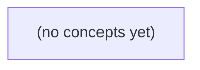

# 09.02 HTTP 接口设计：为虚构 IM 定义可验证的消息契约

*本书面向 Go 初学者，承接 HTTP 基础与虚构 IM 的读历史、发消息用例，在编写任何服务代码之前完成 HTTP 接口契约设计。读者将围绕 c-a 会话及 u-a/u-b、m-a 等虚构身份，设计历史查询、游标分页、内存受理、错误响应、内容协商、限额与未知结果的边界。*

**章节:** 2

---

## 本书导览

- 了解整本书的章节脉络
- 掌握各章之间的概念依赖关系
- 选择最合适的阅读顺序

# 09.02 HTTP 接口设计：为虚构 IM 定义可验证的消息契约

本书面向 Go 初学者，承接 HTTP 基础与虚构 IM 的读历史、发消息用例，在编写任何服务代码之前完成 HTTP 接口契约设计。读者将围绕 c-a 会话及 u-a/u-b、m-a 等虚构身份，设计历史查询、游标分页、内存受理、错误响应、内容协商、限额与未知结果的边界。

下方的概念图展示了本书 0 个核心概念以及它们之间的依赖关系；再下方是 1 个章节的入口。你可以按从上到下的顺序阅读，也可以根据自己的兴趣或先验知识选择切入点。

#### 概念图



## 章节索引

- **09.02 HTTP 接口设计：会话历史与消息提交的可核对合同** — 承接09.01用例与S2内存受理、04.03HTTP语义，面向Go初学者为虚构IM只读历史GET和提交消息POST定义路径、JSON表示、方法/状态、查询limit/opaque cursor/filter、错误体、内容类型与独立资源限额。静态教材无真实服务运行。

## 09.02 HTTP 接口设计：会话历史与消息提交的可核对合同

- 把读历史和发送用例映射为一致的资源与方法
- 区分200内存受理与201/202可能暗示的其他合同
- 定义分页次序、排他cursor、limit及过滤顺序
- 区分请求体总字节上限与消息正文上限
- 设计稳定错误码与HTTP状态而不泄漏身份信息
- 明确Content-Type/Accept/缓存边界
- 用响应丢失和重复提交检验HTTP与业务幂等边界
- 写出可供后续net/http实现与httptest核对的合同矩阵

本节为虚构 IM 的会话历史读取与消息提交先定义可核对的 HTTP 合同，明确当前仅保证 S2 进程内存受理，再进入 Go handler 实现。

### 资源、路径与成功边界

### 资源、路径与成功边界

将 `c-a` 建模为一个会话资源，其消息历史不是单个对象，而是会话之下的集合资源：

`/v1/conversations/{conversation_id}/messages`

因此，当前虚构接口统一使用：

- `GET /v1/conversations/c-a/messages`：读取 `c-a` 已被当前进程受理的消息集合。
- `POST /v1/conversations/c-a/messages`：向 `c-a` 的消息集合提交一条新消息。

路径中的 `/v1` 是未来 HTTP 合同的版本前缀，不能与本地 CLI 使用的 JSON 文件版本、配置版本或内部数据结构版本混为一谈。即使当前项目只有本地 CLI，也应先固定这一对外路径，使后续 handler、测试和客户端围绕同一资源模型演进。

这里的成功边界必须刻意收窄：`POST` 返回成功，仅表示 **S2 进程已经在内存中接受该消息并将其加入当前消息集合**。它不表示：

- 消息已持久化到磁盘、数据库或消息队列；
- 进程重启后消息仍存在；
- 消息已投递给其他用户、设备或外部服务；
- 消息已被对方阅读；
- 客户端声明的发送者身份已经可信验证。

例如，客户端可以提交：

`{"sender_id":"u-a","content":"你好"}`

但 `sender_id` 只是待处理的输入字段，不能作为身份事实。未来应由可信认证边界从令牌、会话或网关注入已认证主体；handler 再决定是否允许该主体向 `c-a` 发言。当前合同可保留该字段以便演示数据流，但响应中的实际发送者语义应明确为“当前尚未认证的声明”。

若 `POST` 成功，可返回 `201 Created` 及新建消息；若会话不存在，返回 `404 Not Found`；请求体无法解析或字段不合约，返回 `400 Bad Request`。`GET` 的响应只反映本进程当前内存快照，不能暗示跨进程一致性或持久历史。

### 历史读取的分页与过滤

### 历史读取的分页与过滤

`GET /v1/conversations/c-a/messages` 返回会话 `c-a` 中当前可见的消息历史。当前数据仅来自 S2 进程内存；服务重启、进程切换或未来持久化实现都可能改变可读取范围，因此响应不承诺跨重启的历史完整性。

查询参数约定如下：

- `limit`：可选，默认 `50`，取值必须为整数且满足 `1 ≤ limit ≤ 100`。缺失使用默认值；`0`、负数、小数、非数字或超过上限均返回 `400`。
- `sender_id`：可选过滤条件，仅返回该发送者的消息。它是历史查询条件，不是身份凭据；客户端提交消息时提供的 `sender_id` 同样不可信，未来应由可信认证边界决定发送者。
- `cursor`：可选、不透明游标。客户端只能原样回传，不得解析、拼接或假设其编码格式。

服务端先按确定性顺序对会话消息排序，例如按 `created_at` 升序，再以唯一 `message_id` 升序打破同一时间戳的并列。稳定排序是游标可核对的前提：同一消息集合下，重复请求必须得到相同顺序。

执行顺序固定为：

1. 读取 `c-a` 的消息集合；
2. 应用 `sender_id` 等过滤条件；
3. 按稳定规则排序；
4. 若提供 `cursor`，排除游标所指消息及其之前的全部结果；
5. 取最多 `limit` 条作为本页。

因此，游标是**排他**的：第一页最后一条消息产生的 `next_cursor`，用于读取“严格排在该消息之后”的结果，不会重复该消息。响应可包含 `messages` 与 `next_cursor`；当本页之后没有更多匹配消息时，`next_cursor` 为 `null`。无法识别、格式错误、与当前过滤条件不匹配或已失效的游标返回 `400`，而不是悄悄从第一页重新开始。

### 消息提交的表示与限额

### 消息提交的表示与限额

`POST /v1/conversations/c-a/messages` 的请求体使用 JSON 对象。当前项目没有远程身份认证，`u-a`、`u-b`、`c-a`、`m-a` 都只是示例标识；服务端不得接受客户端提交的 `sender_id`，更不能据此决定消息发送者。未来发送者应由可信认证边界注入，例如访问令牌、会话中间件或网关上下文。

最小请求表示为：

`{"body":"你好，明天同步吗？"}`

其中 `body` 是必填字符串，表示用户可见的消息正文。空字符串、仅由空白字符组成的正文，以及非字符串值均为无效请求。建议以 Unicode 字符数限制正文，例如最多 `2000` 个字符；该限制约束业务内容，而不是 JSON 编码后的网络大小。

请求体还必须有独立的总字节上限，例如 `16 KiB`。它防止超大 JSON、深层嵌套字段或无关扩展字段过早占用进程内存。两类限制不可互相替代：

- 请求体超过 `16 KiB`：返回 `413 Payload Too Large`，即使 `body` 很短。
- 请求体未超限但 `body` 超过 `2000` 字符：返回 `422 Unprocessable Content`。
- JSON 语法错误、顶层不是对象、缺少 `body` 或字段类型错误：返回 `400 Bad Request`。

成功时返回 `201 Created`，响应可表示为：

`{"id":"m-a","conversation_id":"c-a","body":"你好，明天同步吗？","accepted_at":"2025-03-08T10:00:00Z"}`

这里的成功语义仅为 **S2 进程已在内存中受理该消息**；它不承诺持久化、跨进程可见、投递给 `u-b`，也不承诺服务重启后仍可读取。响应中的发送者信息应留待认证边界存在后由服务端生成，而非回显不可信输入。

### 状态、错误与内容协商

### 状态、错误与内容协商

`POST /v1/conversations/c-a/messages` 的成功状态必须表达真实承诺，而不是“看起来像 REST”。

| 状态 | 隐含承诺 | 本项目是否适用 |
|---|---|---|
| `200 OK` | 请求已处理，通常返回处理结果或资源表示 | 可用，但易与“读取成功”混淆 |
| `201 Created` | 已创建可由稳定 URI 再次读取的资源，通常带 `Location` | 不宜承诺；S2 内存消息尚无跨进程持久性 |
| `202 Accepted` | 已受理，后续可能异步完成 | 不宜使用；当前没有队列、任务状态或最终完成语义 |

因此，当前提交成功使用 `200 OK`：它只表示 S2 已在本进程内存中接受并加入会话消息列表；响应可返回服务器生成的消息表示。不得借 `201` 暗示重启后仍可读取，也不得用 `202` 掩盖并不存在的异步流程。

读取历史成功返回 `200 OK` 与 JSON 数组或分页对象。所有成功和可预期错误响应均声明：

`Content-Type: application/json; charset=utf-8`

客户端应发送 `Accept: application/json`；若明确只接受不兼容媒体类型，服务端返回 `406 Not Acceptable`。请求体不是 JSON 或 `Content-Type` 不可接受时返回 `415 Unsupported Media Type`；JSON 语法错误、字段缺失或 `content` 为空时返回 `400 Bad Request`。

身份边界尚未接入可信认证，客户端提交的 `sender_id` 不能作为身份事实。错误也不得泄漏“某用户是否存在”“某用户是否属于会话”。例如会话 `c-a` 不存在、调用者无权访问、未来认证失败，都可统一为 `404 Not Found`；响应仅给出稳定机器码，如：

`{"error":{"code":"conversation_not_found","message":"会话不存在或不可访问"}}`

历史与消息提交包含私密内容，响应设置 `Cache-Control: no-store`，并避免共享缓存依据路径或错误状态推断会话存在性。

### 重复提交与合同核对矩阵

### 重复提交与合同核对矩阵

网络超时不等于服务端未处理：客户端可能在服务端已接受消息、但响应丢失后重试。因此必须区分 HTTP 方法语义与业务去重承诺。

`GET /v1/conversations/c-a/messages` 是安全且幂等的读取：重复调用不应创建消息，也不改变会话状态。返回 `200 OK`，响应中的消息按既定顺序排列；空历史仍返回 `200` 与空数组，而非 `404`。

`POST /v1/conversations/c-a/messages` 表示“提交一条新消息”。HTTP 的 `POST` 本身不保证幂等：相同请求发送两次，S2 进程内存中可以出现两条不同消息。当前合同不得暗示“超时重试必然只产生一条”。若未来需要业务幂等，应由可信调用方提供请求去重键，并规定同一会话、同一发送方、同一键重复提交返回首次接受结果；不能用客户端 `sender_id` 充当该依据。

当前成功点仅为：处理进程 S2 已在内存中接受并保存消息。它不代表已持久化、已投递，亦不代表进程重启后仍可读取。

| 场景 | 请求 | 预期状态 | 核对重点 |
|---|---|---:|---|
| 读取已有历史 | `GET` | `200` | 返回消息数组，不修改状态 |
| 读取空会话 | `GET` | `200` | 返回空数组 |
| 路径会话不存在或不可见 | `GET` | `404` | 不泄露其他会话信息 |
| 合法消息首次提交 | `POST` | `201` 或合同规定的成功码 | 返回已接受消息及服务端标识 |
| 响应丢失后原样重试 | `POST` | 可再次成功 | 当前允许新增重复消息 |
| 畸形 JSON、缺少正文 | `POST` | `400` | 不写入内存 |
| 客户端伪造 `sender_id` | `POST` | 不采信该字段 | 发送者来自未来可信认证边界 |

`httptest` 应至少验证：重复 `GET` 前后历史长度不变；一次成功 `POST` 后 `GET` 可见该消息；同一 `POST` 连续两次时，明确断言当前合同允许两条记录，而不是在实现中悄然加入未声明的去重行为。

> **要点** — 先把路径、JSON、状态、分页、限额与错误写成合同；当前 POST 成功仅表示消息已被本进程内存受理。

本节为虚构 IM 的会话历史读取接口建立可核对合同：它只读取已授权数据，不产生业务副作用，也不依赖真实查询服务。

### 将历史读取建模为安全的 GET

### 将历史读取建模为安全的 GET

会话历史是一个可读取的资源集合，可定义为：

`GET /conversations/{conversation_id}/messages`

该接口的职责是返回调用者**已获授权访问**的会话消息快照；它不创建消息、不改变消息状态、不推进阅读进度，也不应触发任何可观察的业务副作用。因此，客户端重试、刷新页面或代理重复请求，都不应导致会话内容变化。

这与消息提交接口形成清晰边界：

- `POST /conversations/{conversation_id}/messages`：提交一条新消息，属于写操作，可能分配接受序号、写入内存状态并产生后续事件。
- `GET /conversations/{conversation_id}/messages`：读取既有消息，属于安全操作，只从当前可见集合中筛选和分页。
- 若调用者无权读取该会话，应返回授权失败；不能因为资源路径存在就暴露消息数量、发送者或时间信息。

响应表示应为 JSON，并显式声明：

`Content-Type: application/json`  
`Cache-Control: no-store`

`no-store` 表示消息内容不应被浏览器、中间代理或共享缓存持久保存，适合包含私密会话文本的场景。即使当前实现仅查询进程内存，也应保持这一合同：接口描述的是资源读取语义，而不是承诺存在数据库、搜索引擎或真实查询服务。

读取结果允许为空。例如，会话存在但尚无消息、筛选条件未命中，或当前页之后没有可返回项时，`messages: []` 都是合法成功响应；空数组不等同于会话不存在，也不等同于调用者未授权。

### 授权范围与返回消息表示

### 授权范围与返回消息表示

调用者只能读取已授权会话 `c-a` 的历史；接口不得因提供了任意会话标识就泄露其存在性、成员关系或消息内容。授权失败时应按统一的访问控制规则拒绝请求，而不是返回“空历史”来掩盖越权访问。

成功响应使用 `Content-Type: application/json`，并设置：

`Cache-Control: no-store`

响应体稳定表示为：

- `messages`：消息数组；即使当前没有任何可见消息，也必须返回 `[]`，而非省略字段或返回 `null`。
- `next_cursor`：下一页游标；若本次过滤并分页后不存在更早消息，则为 `null`。这只说明当前内存视图中无更早项，不承诺历史永久完整，也不表示未来不会出现更早记录。

每条消息至少包含可核对的表示：

- `id`：消息唯一标识。
- `sender`：发送者标识，例如 `u-b`。
- `content`：消息正文。
- `accepted_seq`：服务端本地接受顺序号，用于确定返回顺序。
- `accepted_at`：服务端接受时间。

`messages` 始终按 `accepted_seq` 降序排列，即较新的已接受消息在前。该顺序是本接口的本地内存顺序合同，不等同于客户端发送时间、跨设备时间或全局分布式排序。对于 `sender=u-b` 等过滤条件，数组仅包含过滤后仍属于已授权会话 `c-a` 的消息。

### 按接收序号降序的分页合同

### 按接收序号降序的分页合同

历史消息以服务端**本地接受序号** `accept_seq` 排序，而非客户端时间戳、发送时间或消息标识。`accept_seq` 是服务端在本会话中接受消息时分配的单调递增序号；读取时按降序返回，因此第一页总是当前可见范围内最新的消息：

$$accept\_seq_{1}>accept\_seq_{2}>\cdots>accept\_seq_{n}$$

请求中的 `limit` 控制本页最多返回多少条消息：未提供时默认 `20`；提供时必须是整数，且满足 `1 \le limit \le 100`。超出范围、非整数或重复参数均应视为无效请求，而不是静默截断或替换为默认值。这样调用方可以明确判断“请求了多少”与“服务承诺最多返回多少”。

`before` 是可选的不透明游标。客户端不得解析、比较、拼接或假定其内部编码；它只能保存并原样传回。首次读取不带 `before`，服务端从当前过滤结果的最高 `accept_seq` 开始取页。后续读取携带上一页返回的 `next_cursor`，其语义是严格排他边界：

$$accept\_seq < before$$

因此，游标所指向的消息不会在下一页重复出现。实现上可将游标映射为某个本地 `accept_seq`，但该映射属于服务端内部细节，不构成客户端合同。

分页顺序应当是：先限定为调用者已授权读取的会话消息，再应用可选 `sender=u-b` 过滤，随后按 `accept_seq` 降序排列，最后按 `limit` 截取。也就是说，游标边界和分页都作用于**过滤后的有序集合**；不能先对未过滤全集分页，再丢弃不匹配发送者的记录，否则会造成漏项或页面大小不稳定。

当本次返回后仍存在更早的匹配消息时，响应给出非空 `next_cursor`；否则为 `null`。`null` 仅表示依据当前本地内存视图，本次读取没有更早项，不承诺历史永久完整，也不保证未来不会因新的数据可见性或实现变化而出现可读取记录。空结果 `messages: []` 同样是合法的成功响应。

### 发送者过滤与先过滤后分页

### 发送者过滤与先过滤后分页

`sender` 是可选查询参数；例如 `sender=u-b` 表示只返回发送者为 `u-b` 的、当前调用者已获授权读取的消息。过滤必须发生在分页之前，而不是先截取一页再从页内筛选：

1. 先取得会话 `c-a` 中已授权可见的消息；
2. 按本地 `accept seq` 降序排列；
3. 若提供 `sender=u-b`，仅保留该发送者的消息；
4. 再依据 `before` 游标继续向更早的**过滤后结果集**取 `limit` 条。

例如原始顺序为：

`[seq=10,u-a] [9,u-b] [8,u-a] [7,u-b] [6,u-b]`

请求 `?sender=u-b&limit=2` 应返回 `9, 7`，并给出可继续取得 `6` 的 `next_cursor`。若错误地先取原始前两条 `10, 9` 再过滤，只得到 `9`，会造成页大小不稳定，并使后续游标可能跳过或重复匹配消息。

游标是服务端生成的不透明值；客户端只能原样回传，例如：

`GET /conversations/c-a/messages?sender=u-b&before=cursor_x&limit=20`

当该过滤条件下不存在更早消息时，响应可合法为：

`{"messages":[],"next_cursor":null}`

空数组不表示会话不存在、调用者未授权或历史永久为空；它仅表示在当前授权、过滤条件与游标位置下，本次没有可返回项。`next_cursor:null` 只承诺当前快照中无更早匹配项，不承诺历史完整性或未来不会出现可见消息。

### 缓存、内容协商与合同核对矩阵

### 缓存、内容协商与合同核对矩阵

历史接口的响应媒体类型固定为 `application/json`，服务端不根据 `Accept` 协商 HTML、文本或其他表示形式；客户端应按 JSON 合同解析。响应同时必须包含：

`Cache-Control: no-store`  
`Content-Type: application/json`

`no-store` 的边界是：浏览器、代理及其他中间层不应保存该响应。会话消息可能含敏感内容、授权状态和随时间变化的过滤结果，因此不能将“GET 是安全方法”误解为“响应可共享缓存”。

`next_cursor: null` 仅作本次查询范围内的有限承诺：按当前授权、`sender` 过滤条件、`before` 边界及内存本地 `accept seq` 降序规则，服务端未发现更早的匹配项。它**不承诺**会话历史永久完结、数据全集已被客户端获得，也不排除后续接收更早可见消息、授权变化或进程内数据变化。

可核对情形如下：

| 情形 | 应核对的结果 |
|---|---|
| 未授权读取 `c-a` | 拒绝；不得泄露消息、游标或存在性细节 |
| 未传 `limit` | 使用默认值 `20` |
| `limit=1` 或 `limit=100` | 合法，返回至多对应条数 |
| `limit<1`、`limit>100` 或非整数 | 拒绝为无效查询参数 |
| 未传 `before` | 从当前可见消息的最新端开始 |
| 传入不透明 `before` | 仅将其作为分页边界，不解析为业务字段 |
| `sender=u-b` | 先过滤发送者，再按过滤结果分页 |
| 无匹配消息 | `messages: []` 合法，`next_cursor: null` |
| 返回满页但仍有更早匹配项 | 给出非空 `next_cursor` |
| 无更早匹配项 | `next_cursor: null` |
| 任意成功读取 | JSON 响应，且带 `no-store`，不产生业务副作用 |

实现无需接入真实查询服务；测试可用内存中的本地接受序号构造消息集合，逐项验证排序、过滤、分页边界、响应头与空数组语义。

> **要点** — 历史读取是已授权范围内、按接收序号降序、先过滤后分页的安全 GET；游标和缓存语义必须明确且可测试。

分页合同的关键不在于“返回几条”，而在于让客户端能稳定、可核对地继续读取同一会话中的历史消息。

### 先确定历史资源与倒序读取语义

### 先确定历史资源与倒序读取语义

将消息历史建模为会话下的只读集合资源，例如 `GET /sessions/{session_id}/messages`。它不是“聊天窗口当前看到的内容”，而是该会话中可查询消息的有序集合；提交消息则属于另一条写入接口。读写职责分离后，客户端可以独立地刷新、翻页、重试和核对历史。

集合的默认排序应明确为按消息序号倒序：序号越大，消息越新，响应中越靠前。设静态数据为：

- `m1(seq=1)`
- `m2(seq=2)`
- `m3(seq=3)`

当请求 `limit=2` 时，返回顺序必须是：

`[m3, m2]`

同时，服务端给出“在 `m2` 之前继续读取”的排他游标。下一页据此查询，返回：

`[m1]`

这里的“之前”指排序后的历史方向，即只返回满足 `seq < 2` 的消息；游标位置对应的 `m2` 不得再次出现。由此形成可验证合同：页面内严格从新到旧，页与页之间无重叠，客户端将各页顺序拼接即可得到稳定历史。

若消息可能拥有相同序号或排序字段，还必须定义次级排序规则，例如 `(seq DESC, message_id DESC)`。否则不同请求可能交换同序消息的位置，分页便无法可靠地判定“下一页”。

### 用静态消息推导排他游标分页

### 用静态消息推导排他游标分页

设同一会话内已有三条消息，按创建顺序为 `m1(seq=1)`、`m2(seq=2)`、`m3(seq=3)`。接口采用“最新在前”的稳定排序，客户端请求：

`GET /sessions/{session_id}/messages?limit=2`

第一页应返回最近两条：

```text
items: [m3, m2]
next_cursor: before(m2)
```

这里的 `before(m2)` 不是“从 `m2` 开始读”，而是一个排他边界：下一次查询只返回排序位置严格早于 `m2` 的消息。于是客户端携带该游标继续请求：

`GET /sessions/{session_id}/messages?limit=2&before=...`

第二页结果为：

```text
items: [m1]
next_cursor: null
```

因此，游标语义可写成：在已固定的会话、排序规则和过滤条件下，返回满足

$$\operatorname{position}(x) < \operatorname{position}(\text{cursor})$$

的消息，其中“更早”相对于当前的倒序列表而言。`m2` 仅用于定义边界，不属于下一页结果；否则第一页末尾的 `m2` 会在第二页再次出现，客户端必须额外去重，分页合同也失去可核对性。

首尾页的判断也应明确：

- 首次请求没有 `before`，从最新消息开始取 `limit` 条。
- 返回条数达到 `limit` 且仍可能存在更早消息时，返回指向本页最后一项的排他游标。
- 返回不足 `limit` 条时，说明已到历史末端，`next_cursor` 为 `null` 或省略。
- 空会话返回空数组，不生成游标。

这种推导把“下一页从哪里继续”落实为可测试规则：相邻两页的消息集合不重叠，按页拼接后恰好得到稳定排序下的完整历史。

### 过滤先于分页并绑定查询上下文

### 过滤先于分页并绑定查询上下文

分页必须基于一个确定的查询结果集，而不是先取一页再临时剔除不需要的消息。推荐固定处理顺序：

1. 限定会话：只查询指定 `conversation_id` 的消息；
2. 应用过滤：例如仅返回可见消息、某个角色的消息，或排除已撤回消息；
3. 稳定排序：按 `seq` 降序；若排序字段可能相同，追加稳定的次级键，如 `message_id`；
4. 应用游标：`before` 为排他边界，只保留严格早于该边界的结果；
5. 截断：取前 `limit` 条；
6. 生成下一页游标：以本页最后一条消息作为后续查询的排他边界。

例如静态消息为 `m1(seq=1), m2(seq=2), m3(seq=3)`，按 `seq` 倒序且 `limit=2`：

- 首页：`m3, m2`，返回 `before=m2`；
- 下一页：`m1`。

若之后插入 `m4(seq=4)`，客户端继续使用旧的 `before=m2`，仍只会得到 `m1`，不会重复首项，也不会把新增的 `m4` 混入既有翻页链路。游标描述的是“从哪个已见边界继续读”，不是“重新计算当前最新首页”。

游标必须绑定查询上下文，至少包含或经服务端可验证地关联：

- `conversation_id`；
- 过滤条件的规范化表示；
- 排序规则及方向；
- 边界消息的稳定排序键。

因此，拿会话 A 的游标请求会话 B、改变过滤条件、切换排序方向，或提交畸形边界，都应返回明确的参数错误，而非静默复用。游标也不应承担认证职责：权限仍需由当前访问令牌和会话授权独立校验；它更不是永久历史快照。若游标依赖进程内序号，服务重启后该序号失效，应明确拒绝旧游标，或改用可持久验证的消息标识与排序键。

### 处理新增消息、畸形游标与重启边界

### 处理新增消息、畸形游标与重启边界

游标分页保证的是**连续读取的可核对性**，不是把某次请求冻结成永久历史快照。以稳定降序为例，已有 `m1(seq=1)`、`m2(seq=2)`、`m3(seq=3)`，`limit=2` 首页返回：

`m3, m2`，并给出排他游标 `before=m2`。

随后客户端请求下一页时，即使期间新写入 `m4(seq=4)`，结果仍应为 `m1`，而不是重新出现 `m3/m2`，也不应把 `m4` 插入旧游标之后。原因是 `before=m2` 的语义是“只读取排序位置严格早于 `m2` 的记录”；新消息位于 `m2` 之前，属于后续重新拉取首页时才可见的增量。

这与“历史快照”不同：快照要求后续页面始终对应某个固定时刻，通常需要快照版本、读事务或服务端状态；普通游标只保证在既定排序和过滤条件下向后推进，不能承诺看见所有并发新增项。

游标必须绑定其生成条件，至少包括：

- 会话标识：将会话 A 的游标用于会话 B，应拒绝而非静默返回空页。
- 排序方向与主排序键：例如按 `seq` 倒序生成的游标不能改用于正序。
- 过滤条件：过滤必须先于分页；改变发送者、消息类型或删除状态等过滤器后，旧游标失效。
- 并列规则：若主键可能相同，应使用稳定的复合顺序，如 `(created_at, message_id)`，避免漏项或重复。

畸形、篡改、字段缺失或无法解析的游标应返回明确的客户端错误；游标不是认证令牌，不应仅凭它授予会话读取权限，仍须执行当前请求的鉴权。

若游标依赖进程内递增序号，服务重启后该序号可能重置，旧游标应明确报“游标已失效”或要求客户端从首页重新同步，不能猜测其位置。需要跨重启连续分页时，应改用持久化、单调且可比较的排序键；即便如此，它也仍不是永久历史快照。

### 形成可由测试核对的分页合同矩阵

### 形成可由测试核对的分页合同矩阵

分页接口应把“请求参数—返回消息—下一游标—错误状态”写成可枚举的合同，而不是依赖客户端猜测。以下约定假设消息按 `(seq, id)` 倒序排列，`seq` 越大越新；游标表示“严格早于某条消息”的排他边界。

| 场景 | 请求 | 期望断言 |
|---|---|---|
| 首页 | `limit=2` | 静态消息 `m1(seq=1), m2(seq=2), m3(seq=3)` 返回 `[m3,m2]`；`next_cursor` 指向 `m2` |
| 后续页 | `before=<m2游标>&limit=2` | 返回 `[m1]`；不得再次出现 `m2` |
| 中途新增 | 首页取得 `m2` 游标后插入 `m4(seq=4)`，再请求 `before=<m2游标>` | 仍返回 `[m1]`；旧游标不回溯到 `m4`，也不重复已读项 |
| 过滤后分页 | `role=user&limit=2` | 先筛选 `role=user`，再排序、截断并生成游标；不能先取两条再过滤 |
| 空页 | 边界早于最旧消息 | 返回空 `messages`；可省略或置空下一游标，语义必须固定 |
| 非法限制 | `limit=0`、负数、超上限或非数字 | 返回 `400`，不得悄悄改写为默认值而掩盖调用错误 |
| 畸形游标 | 无法解码、字段缺失、格式错误 | 返回 `400`；响应不得泄露内部解析细节 |
| 游标错配 | 游标所属会话、排序方向或过滤条件与当前请求不一致 | 返回 `400` 或 `409`，全接口统一；不得借用该游标继续翻页 |

稳定排序是可测试性的前提。若多个消息可能拥有相同 `seq`，合同必须补充确定性的次级键，例如按 `(seq, id)` 倒序；游标也应编码完整边界键，而非只保存 `seq`。测试可构造同序消息，断言每次响应顺序一致、相邻页面并集无重复且无遗漏。

游标只是一份分页状态，不是认证令牌，也不承诺永久历史快照。特别是以内存递增序号作为边界时，服务重启后旧序号可能失效；实现应明确拒绝无法验证的旧游标，而不能将其解释为任意位置。认证与会话访问控制仍须由请求凭证独立完成。

> **要点** — 排他游标服务于稳定续读，必须绑定查询上下文；它既不是认证令牌，也不承诺永久快照。

本节为消息提交建立可核对的 HTTP 合同，明确内存受理的成功含义、输入边界与重复提交风险。

### 提交消息的资源与请求表示

### 提交消息的资源与请求表示

`POST /v1/conversations/c-a/messages` 表示：向既有会话 `c-a` 提交一条新消息。路径中的 `c-a` 是会话资源标识；客户端不得在请求体中另行提供可覆盖该归属的 `conversation_id`。

请求必须使用：

`Content-Type: application/json`

最小请求体如下：

`{"message_id":"m-a","body":"你好"}`

其中：

- `message_id` 是客户端为本次提交指定的消息标识，用于在该会话范围内识别该消息。
- `body` 是消息正文，按 UTF-8 文本解释。`"你好"` 的正文长度为 6 UTF-8 字节；长度规则应以字节而非字符数核对。
- 原始 HTTP 请求体总大小上限可设为 `4096B`。该上限包含 JSON 结构、字段名、引号及其他传输中的请求体字节，不能与正文长度混同。
- 此 HTTP 上限也不同于本地文件接口的 `1MiB` 限制；每个接口按自己的合同校验，不能跨接口推断。

请求体不接受可信的 `sender`、`sender_id`、`from` 等发送者字段。即使客户端携带此类字段，服务端也不得据此认定身份或消息作者；发送者应由认证上下文、会话成员关系或服务端策略决定。这样可避免客户端伪造“系统消息”“其他用户消息”等身份归属。

因此，客户端提交的是“希望在 `c-a` 中写入 ID 为 `m-a`、正文为指定文本的消息”，而不是“声明某个发送者已经发送了该消息”。

### 200 内存受理的成功合同

### 200 内存受理的成功合同

`POST /v1/conversations/c-a/messages` 返回 `200 OK`，且响应体为：

`{ "status": "accepted_in_memory" }`

其可核对含义仅是：服务端已完成本次请求的基本校验，并在当前进程的内存状态中接纳了消息 `m-a`；随后读取会话历史时，客户端可以期待看到这条消息。它不是“消息已经可靠保存”的泛化承诺。

因此，`200 + accepted_in_memory` **明确不表示**：

- 已写入数据库、文件或其他持久化介质；
- 已进入消息队列、任务系统或可靠缓冲区；
- 已投递给其他用户、设备或下游服务；
- 已触发并完成异步处理；
- 服务重启、崩溃或内存回收后消息仍然存在。

这种合同适合当前只维护进程内会话状态的实现：成功语义与实际能力一致，客户端不能把它当作可靠消息基础设施的确认。

应避免使用会引入更强语义暗示的状态码：

- `201 Created` 通常表示一个新资源已被创建；若消息并无可恢复、可定位的持久资源，使用它会误导客户端相信创建结果稳定存在。
- `202 Accepted` 通常表示请求已被接收、将在稍后处理；若服务并未建立队列、后台任务或可查询的异步处理状态，它会制造“已经可靠排队”的错觉。
- `200 OK` 配合 `accepted_in_memory` 则把成功边界收紧为“本次同步调用已被内存接纳”。

还要区分“客户端收到了 `200`”与“服务端曾经内存受理”。网络中断可能使响应丢失：客户端无法判断 `m-a` 是否已被接纳。当前合同尚未提供幂等重试保证；若客户端再次提交相同 `c-a/m-a`，服务端返回 `409 Conflict`，并保持原消息不变。

### 双重大小限额与内容类型校验

### 双重大小限额与内容类型校验

`POST /v1/conversations/c-a/messages` 只接受：

- `Content-Type: application/json`
- 请求体为 JSON 对象，例如：`{"message_id":"m-a","body":"你好"}`

服务器应先校验媒体类型；缺少 `Content-Type`、类型不是 `application/json`，或 JSON 语法不合法，都不能进入消息创建流程。不要依据客户端声明的 `sender`、`user_id` 等字段判断发送者：身份应来自认证上下文，此接口中不存在可信的发送者字段。

大小限制有三个彼此独立的层次，不能混为一谈：

1. **原始 HTTP 请求体：最多 4096B**  
   计量对象是传输到服务端的完整请求体字节，包括 JSON 标点、字段名、引号、`message_id` 及 `body` 的 UTF-8 编码。超过上限时应拒绝，无须先完整解析或保存消息。

2. **消息正文：最多 6 个 UTF-8 字节**  
   计量对象仅为解析后 `body` 字符串的 UTF-8 编码长度，而不是字符个数。`"你好"`占 6B，恰好允许；`"你好！"`通常为 9B，应拒绝。ASCII 字符通常每个占 1B，但不能据此把“6 字节”误解为“6 个字符”。

3. **本地文件：最多 1MiB**  
   这是文件读写或附件处理路径的独立约束，不会放宽消息接口的 4096B 请求体限制，也不能替代 `body` 的 6B 限制。即使文件小于 1MiB，也不能将其内容直接作为超长消息正文提交。

因此，服务端的检查顺序可概括为：先验证 `Content-Type`，再限制原始请求体，再解析 JSON，最后验证 `body` 的 UTF-8 字节长度。三个限制分别保护网络入口、消息领域模型与本地存储资源。

### 稳定错误响应与重复消息冲突

### 稳定错误响应与重复消息冲突

错误响应应让客户端能纠正请求，却不能借此探测发送者身份、会话成员关系或消息内容。可统一采用：

`{"error":{"code":"...","message":"..."}}`

其中 `code` 是稳定的机器可读标识，`message` 为面向人的简短说明；不要回显请求中的 `body`、认证主体、成员列表或内部存储状态。

| 情形 | 状态码 | 示例 `code` | 说明 |
|---|---:|---|---|
| `Content-Type` 不是 `application/json` | `415` | `unsupported_media_type` | 服务端只接受 JSON 表示。 |
| 请求体不是合法 JSON | `400` | `invalid_json` | 例如截断、语法错误或编码无法解析。 |
| 缺少 `message_id`、`body`，或字段类型不符 | `422` | `invalid_message` | `message_id` 与 `body` 均为合同要求的字段。 |
| 出现不受信任的 `sender` 字段 | `422` | `invalid_message` | 发送者必须由认证上下文推导，不能由请求体声明。 |
| 原始 HTTP 请求体超过 `4096B` | `413` | `payload_too_large` | 此限制作用于完整原始请求体，不等同于正文的 `6` 个 UTF-8 字节限制，也不同于本地文件 `1MiB` 限制。 |
| 同一 `c-a` 下再次提交 `m-a` | `409` | `duplicate_message_id` | 原消息保持不变，不以新正文覆盖。 |

`409` 只表示已观察到相同会话与消息标识的冲突；它不承诺返回原请求的成功结果，更不表示消息已持久化、入队或投递。若客户端在收到 `200 OK {"status":"accepted_in_memory"}` 前连接中断，其结果仍是未知：本阶段尚未提供幂等重试保证，不能仅凭重发安全地推断会恢复为成功。

### 响应丢失下的重试边界与核对矩阵

### 响应丢失下的重试边界与核对矩阵

客户端收到 `200 OK` 且响应体为 `{"status":"accepted_in_memory"}`，仅表示服务已在**当前进程内存**中接受该消息；它不表示已持久化、已进入队列，更不表示已投递给任何接收者。

困难在于：服务端可能已经接受消息，但网络在响应返回前中断。此时客户端无法区分“请求未到达”和“已接受但响应丢失”。在当前合同中，客户端若对同一 `(conversation_id=c-a, message_id=m-a)` 再次 `POST`，将得到 `409 Conflict`，且原消息保持不变。`409` 不是“可安全重放后得到同一成功结果”的幂等语义，因此**尚不存在幂等重试保证**。

| 场景 | 服务端状态 | 客户端可见结果 | 合同结论 |
|---|---|---|---|
| 首次提交成功 | 消息仅在内存中接受 | `200`，`accepted_in_memory` | 不承诺耐久性与投递 |
| 请求到达前失败 | 未创建消息 | 网络错误 | 可再次提交，但结果取决于后续请求 |
| 请求已接受、响应丢失 | 已创建原消息 | 网络错误或超时 | 结果未知；重试可能得到 `409` |
| 相同 `c-a/m-a` 再提交 | 原消息已存在 | `409 Conflict` | 不覆盖、不修改原消息 |
| 同一 `message_id` 但正文不同 | 原消息已存在 | `409 Conflict` | 不以新正文替换旧正文 |

实现与测试应核对以下边界：

- 路径必须是 `POST /v1/conversations/c-a/messages`，会话标识来自路径，而非请求体。
- 必须要求 `Content-Type: application/json`；请求体只接受 `message_id` 与 `body`，不得信任客户端提供的 `sender`。
- 原始 HTTP 请求体上限为 `4096B`；`body` 的 UTF-8 编码长度上限为 `6B`。这与本地文件 `1MiB` 限制属于不同合同，不能混用。
- `httptest` 应覆盖：首次 `200`、重复提交 `409`、重复后原正文未变、缺失或伪造 `sender` 不影响身份判定，以及模拟响应丢失后客户端只能将结果标为“未知”。

> **要点** — 200 仅表示消息已被内存受理；重复消息标识冲突且原消息不变，响应丢失不构成可安全重试的幂等承诺。

本节把常见成功与失败情形固化为可核对的响应合同，并厘清 HTTP 状态、业务结果和传输异常的边界。

### 以合同矩阵统摄响应结果

### 以合同矩阵统摄响应结果

响应合同应同时规定：发生什么情形、返回何种状态码、JSON 表示为何、客户端下一步如何处理。状态码表达 HTTP 语义；稳定的机器错误码支持程序分支；面向人的 `message` 应简洁且不泄露令牌、内部堆栈或资源存在性。

| 情形 | 状态码 | 错误码/响应表示 | 客户端动作 |
|---|---:|---|---|
| 查询历史成功 | `200` | 消息列表、分页游标等 | 渲染或继续翻页 |
| 提交消息已同步处理 | `200` | 处理结果与新增消息 | 更新会话视图 |
| 提交已创建新资源 | `201` | 新资源表示，可含 `Location` | 保存资源标识 |
| 提交仅被受理、待异步处理 | `202` | 受理信息、任务标识或查询地址 | 轮询或订阅结果 |
| 参数缺失、格式或 JSON 语法错误 | `400` | `bad_parameter`、`invalid_json` | 修正请求，不盲目重试 |
| 认证无效 | `401` | `invalid_auth`，并按挑战要求给出认证挑战头 | 刷新或重新获取凭据 |
| 已认证但无权访问 | `403` | `forbidden` | 停止重试，申请权限 |
| 会话不存在，或需隐藏其存在性 | `404` | `not_found` | 清理本地引用或提示不存在 |
| 幂等键或消息标识重复 | `409` | `duplicate_submission` | 查询既有结果，避免再次提交 |
| 请求体过大 | `413` | `body_too_large` | 压缩、拆分或缩短内容 |
| 媒体类型不被接受 | `415` | `unsupported_media_type` | 使用约定的 `Content-Type` |
| 未预期服务端故障 | `500` | `internal_error` | 可采用退避策略重试并记录关联标识 |

除成功表示外，统一错误体可为：

`{"error":{"code":"invalid_json","message":"请求体不是有效的 JSON"}}`

其中 `code` 是稳定合同，不应随文案修改；`message` 仅提供安全的诊断信息。网络断开、超时、跨域拦截等“未收到响应”是传输异常，不是某个 HTTP 状态码，客户端须单独处理。

若采用 RFC 9457，应明确改用 `application/problem+json`，并以 `type` 作为主要机器可读分类；不能仅因字段相似就声称上述错误体符合该标准。

### 成功状态的语义取舍：200、201与202

### 成功状态的语义取舍：200、201与202

`200 OK`、`201 Created` 与 `202 Accepted` 都表示请求未被拒绝，但它们对“服务端已经做到了什么”的承诺不同，不能仅按“提交消息成功”混用。

- **`200 OK`：请求已完成，但不强调新资源已创建。**  
  适合会话消息被同步写入内存、服务端立即得到可返回的处理结果，且接口语义更接近“执行一次提交操作”而非“创建可独立寻址的资源”。响应体应给出可核对结果，例如已接收的消息、当前会话版本或生成的回复。  
  `POST /sessions/{id}/messages -> 200`

- **`201 Created`：一个新资源已被创建。**  
  当提交消息会产生可独立读取、更新或引用的消息资源时，`201` 的表达力更强。响应通常包含新资源表示，并应提供 `Location`，指向其规范地址，例如：  
  `Location: /sessions/s1/messages/m42`  
  这意味着客户端可以合理依赖该资源已经存在；若仅把请求放入内存队列、尚未落库或尚未分配稳定标识，则不应宣称为 `201`。

- **`202 Accepted`：请求已被接收处理，但尚未完成。**  
  适合异步审核、排队生成回复、后台持久化等场景。它不承诺消息已经创建、回复已经生成，甚至不承诺最终一定成功。响应应返回任务状态地址、轮询标识或后续查询方式，而不能把“已受理”伪装成“已完成”。

选择原则是：同步完成但非资源创建用 `200`；已创建可识别资源用 `201`；仅进入异步处理流程用 `202`。状态码描述的是当前可验证的服务端事实，而不是乐观预期。

### 客户端错误与隐藏资源策略

### 客户端错误与隐藏资源策略

客户端可修正的请求应返回明确而稳定的状态码，但错误内容不得暴露令牌、权限规则、内部校验逻辑或隐藏资源的存在性。推荐统一使用：

`{"error":{"code":"稳定机器码","message":"面向用户的非敏感说明"}}`

其中 `code` 供程序分支与监控聚合，发布后应保持稳定；`message` 仅说明可采取的修正动作，不回显认证材料、数据库错误或资源归属信息。未收到响应属于网络或传输异常，不是 HTTP 状态码。

- **400 Bad Request**：参数缺失、类型错误、格式非法、JSON 语法错误或字段组合不满足接口约束。例如 `limit=-1`、请求体不是合法 JSON。不要把权限不足伪装成 400。
- **401 Unauthorized**：缺少、失效或无效的认证凭据。响应必须带适当的 `WWW-Authenticate` 挑战信息；消息不应区分“用户不存在”“密码错误”或“令牌已被撤销”等细节。
- **403 Forbidden**：身份已被识别，但无权执行该操作。仅当暴露资源存在性不会增加风险时使用。
- **404 Not Found**：资源确实不存在，或策略要求对无权访问者隐藏资源。对受保护资源，404 与真实不存在应采用相同的响应形状、耗时策略和非敏感消息，避免枚举资源。
- **409 Conflict**：请求与当前资源状态冲突，如幂等键已被使用、重复创建或版本条件不成立；应由机器码区分冲突类型。
- **413 Payload Too Large**：请求体超过约定上限，可说明允许的最大尺寸，但不泄漏内部容量。
- **415 Unsupported Media Type**：`Content-Type` 不被支持，或声明的媒体类型与接口要求不符。

RFC 9457 是可选的标准错误格式；若采用，应使用 `application/problem+json`，并以 `type` 作为主要机器可读分类，而不能宣称上述自定义错误体天然符合该标准。

### 稳定错误体与媒体类型边界

### 稳定错误体与媒体类型边界

HTTP 状态码说明“这次请求在协议层属于哪类结果”，错误体则说明“客户端应如何处理”。二者应共同构成可测试合同，而不是让客户端解析临时拼接的自然语言。例如，对可预期的客户端错误，可统一返回：

`{"error":{"code":"invalid_parameter","message":"参数 cursor 格式无效"}}`

其中：

- `error.code` 是稳定的机器码，供客户端分支、重试策略、埋点和自动化测试使用。它应是版本稳定的标识，如 `invalid_parameter`、`invalid_json`、`duplicate_message`、`body_too_large`，不能把状态码、数据库异常文本或字段值直接当作机器码。
- `error.message` 面向人类阅读，可随文案优化，但不得承载程序判断。消息应足够说明修正方向，却不能泄露令牌内容、用户是否存在、内部表结构、堆栈或上游服务地址。
- 状态码仍表达通用语义：例如参数或 JSON 语法错误为 `400`，认证无效为 `401`，无权限为 `403`，资源缺失或被隐藏为 `404`，幂等键冲突为 `409`，请求体过大为 `413`，媒体类型不支持为 `415`，未预期故障为 `500`。

若接口约定返回上述 JSON 错误体，应显式使用 `Content-Type: application/json`；不能在 `text/plain` 中塞入 JSON，也不能把 HTML 错误页混入同一合同。客户端发送 JSON 时应使用 `Content-Type: application/json`；不支持的类型应得到 `415`，而不是猜测性解析。

RFC 9457 是另一种可选的标准错误表示，不能仅因字段相似就声称当前 `{error:{code,message}}` 符合它。若采用该标准，应返回 `Content-Type: application/problem+json`，并以 `type` 作为问题类型的主要稳定标识；`title`、`detail` 等文本字段仍不应成为客户端控制流依据。

### 响应丢失下的重复提交判定

### 响应丢失下的重复提交判定

客户端“没收到响应”不是 HTTP 状态码，而是一种传输观察结果：可能请求根本未到达服务端，也可能服务端已创建消息但响应在网络中丢失。因此，不能把“超时”直接映射为 `500` 或 `409`。

可核对合同应区分三类情形：

- **未收到 HTTP 响应**：客户端仅记录为“结果未知”，保留原始提交标识并重试；不得据此断言消息创建失败。
- **`500` 意外故障**：服务端确认处理过程中发生未预期异常，但仍不能向客户端泄露堆栈、数据库细节等敏感信息。响应可为：
  `{"error":{"code":"internal_error","message":"服务暂时不可用"}}`
- **`409` 业务重复**：服务端已识别该提交与既有消息冲突，例如同一会话中复用了已成功处理的客户端消息标识。此时是确定的业务结果，而非网络故障。

建议请求携带稳定的 `client_message_id`（或幂等键）。服务端以“会话标识 + 客户端消息标识”建立唯一性约束，并保存首次处理结果。重试同一标识时，合同必须明确选择其一：

1. 若将其视为幂等重放，返回首次成功结果，例如 `200`，并返回既有消息；
2. 若要求客户端显式处理冲突，返回 `409`，错误码固定为 `duplicate_message`。

两种策略不可混用：同一接口、同一重复条件必须得到可预测结果。测试至少覆盖：首次提交成功；响应丢失后原样重试；相同标识但不同消息体；无标识时的重复提交；服务端异常返回 `500`。其中“响应丢失后重试”应验证最终只产生一条消息，而不是仅验证客户端收到某个状态码。

> **要点** — 状态码表达HTTP合同，错误码表达稳定业务分类；传输未获响应不是一种HTTP状态。

接口合同不仅规定路径与字段，还要明确表示格式、协商失败、字节限额与缓存边界，使客户端可预测地交换敏感消息数据。

### 表示格式与内容协商

### 表示格式与内容协商

历史查询与消息提交统一交换 `application/json` 表示；这不是实现偏好，而是客户端可据此编写稳定解析器的合同。请求体与成功响应均使用 UTF-8 编码的 JSON，字段名、枚举值和时间格式以接口文档为准，不因客户端语言或框架而改变。

- `POST /v1/.../messages`：请求必须携带 `Content-Type: application/json`。可接受参数如 `application/json; charset=utf-8`；缺失、非 JSON 或无法解析的 JSON，返回 `400 Bad Request`。
- 带请求体的 `GET` 不作为历史查询的输入方式；历史分页、筛选等条件放在查询参数中，响应仍为 JSON。
- 成功响应应设置 `Content-Type: application/json; charset=utf-8`。
- 错误响应也返回 JSON，使客户端可统一读取错误码、消息与可选详情，而非猜测 HTML 或纯文本格式。

客户端通过 `Accept` 声明可接受的响应表示。服务端至少支持 `application/json`，并按以下规则处理：

1. 未提供 `Accept` 时，视为可接受 JSON，正常返回 JSON。
2. `Accept` 包含 `application/json`、`application/*` 或 `*/*` 时，返回 JSON。
3. 若 `Accept` 明确排除 JSON，例如 `application/json;q=0`，或只接受不兼容类型如 `text/html`，服务端返回 `406 Not Acceptable`。
4. `406` 的响应本身仍尽可能使用 JSON；若客户端同时排除了 JSON，也不因此改返回 HTML。表示协商失败不应破坏错误结构的一致性。

`Content-Type` 描述“客户端实际发送了什么”，`Accept` 描述“客户端愿意接收什么”；两者不可互相替代。服务端不得因请求体恰好看似 JSON 而忽略错误的 `Content-Type`，也不得在客户端明确拒绝 JSON 时静默降级为其他格式。

### UTF-8、字节长度与双重限额

### UTF-8、字节长度与双重限额

消息提交不能只限制“字符数”。HTTP 在线路上传输的是字节，而数据库、日志和下游模型通常也以 UTF-8 编码后的字节量作为容量依据。合同应同时规定两道彼此独立的上限：

- **原始请求体总字节上限**：对整个 HTTP 请求体计量，包含 JSON 结构、字段名、转义符、附件引用等。例如最大 `64 KiB`。它用于在解析 JSON 前拒绝过大的输入，保护连接、内存与解析器。
- **消息正文 UTF-8 字节上限**：对 `content` 字段的 UTF-8 编码结果计量，例如最大 `16 KiB`。它用于约束真正会被保存、索引或转发的消息内容。

两者不可互相替代。`{"content":"..."}` 的原始 JSON 可能因大量无关字段、深层嵌套或转义序列而超出请求体限额，即使解码后的 `content` 很短；反过来，请求体仍在总限额内，单条消息也可能超过业务允许的正文容量。

核对顺序应明确：服务器先读取并限制原始请求体；超过上限时返回 `413 Payload Too Large`，不承诺继续解析 JSON。随后解析请求对象、拒绝不允许的未知字段，再计算 `len([]byte(content))`；正文超限时返回 `422 Unprocessable Content`，指出 `content` 超过 UTF-8 字节上限。空字符串、缺失字段与非法 UTF-8 则属于独立的字段有效性错误。

UTF-8 字节数不等于字符数：`a` 通常占 1 字节，`中` 通常占 3 字节，许多 emoji 可占 4 字节或更多字节序列。因此客户端应按 UTF-8 编码预检，而不是按界面显示长度截断。合同还应固定默认值与最大值，禁止不同部署环境悄然改变限额；若未来调整，应通过新的 API 版本或明确发布说明协商。

### 敏感历史的缓存边界

### 敏感历史的缓存边界

会话历史通常包含用户输入、模型回复、业务上下文，甚至可能间接暴露身份、订单或内部决策。对返回历史的接口，应把响应缓存策略写入合同：

`Cache-Control: no-store`

`no-store` 要求浏览器、代理、共享缓存及客户端缓存层不要保存该响应的副本。它适用于例如：

- `GET /v1/conversations/{id}/messages`
- `GET /v1/conversations/{id}`
- 含历史消息、附件摘要或可恢复上下文的查询响应

这是一项**默认保护措施**，而不是性能优化选项。即使响应同时带有 `ETag`、`Last-Modified` 或可缓存的公共资源字段，敏感历史响应也不应因此被复用或落盘。

需要明确其安全边界：`Cache-Control: no-store` 只约束符合 HTTP 缓存语义的存储行为，不能证明请求者身份，也不能防止传输链路被窃听。因此它不能替代：

- 身份认证与会话授权：服务器仍必须验证调用者是否有权读取该会话；
- TLS：生产环境仍必须通过 HTTPS 传输，避免消息内容和令牌在网络中明文暴露；
- 服务端访问控制与审计：不得仅因客户端知道会话标识就返回历史。

可将合同表述为：“历史查询成功时返回 `Cache-Control: no-store`；无论客户端是否请求缓存，服务端均不放宽该策略。”这样，客户端可以据此避免把敏感对话写入本地持久缓存，而服务端安全责任仍保持清晰。

### 版本、未知字段与稳定默认值

### 版本、未知字段与稳定默认值

`/v1` 表示 HTTP 接口合同的主版本：路径、资源语义、请求与响应字段、状态码以及分页行为在该版本内应保持兼容。它不等同于服务器落盘的本地文件模式版本；后者可使用独立字段如 `"schema_version": 3`，用于迁移历史记录、索引或配置。内部文件升级不应迫使网络客户端改为 `/v2`，反之亦然。

对 JSON 对象，建议采用“已知字段白名单”合同：

- 必填字段缺失、字段类型错误或值越界：返回 `400 Bad Request`。
- 未知字段：默认拒绝并指出字段名，避免客户端拼写错误被静默忽略，也避免不同服务端对扩展字段产生不一致解释。
- 若未来确需兼容扩展，应先在合同中声明可扩展对象或命名空间；不能把“忽略所有未知字段”当作默认策略。
- 本地文件同样应按其 `schema_version` 解析；无法识别的更高版本应拒绝加载，而非猜测字段含义。

分页和限额必须是稳定、可核对的常量。例如历史查询省略 `limit` 时固定返回 `50` 条，允许范围为 `1`～`100`；`limit=0`、负数、非整数或超过 `100` 均为 `400`，不悄悄截断为最大值。消息提交的原始请求体上限也应固定，例如 `64 KiB`，按 UTF-8 编码后的字节数计算；超过上限返回 `413 Payload Too Large`。

这些默认值属于公开接口，而非实现细节。服务端不能因负载、部署环境或数据库差异临时改变默认页大小、最大页大小或请求体上限；若必须调整，应通过新的 API 版本或明确发布的合同变更完成。

### 可核对的媒体类型合同矩阵

### 可核对的媒体类型合同矩阵

以下矩阵把“能否交换”“交换什么格式”“失败如何报告”固定为可测试规则。`/v1` 是 HTTP 接口版本，不能与消息文件中的本地 `schema_version` 混同。

| 场景 | 请求合同 | 成功响应 | 限额与失败响应 |
|---|---|---|---|
| `GET /v1/conversations/{id}/messages` 历史查询 | 不要求请求体；`Accept` 缺省或允许 `application/json`。`limit` 缺省为固定默认值，超过固定最大值即失败，不得按部署环境悄然变化。 | `200`；`Content-Type: application/json; charset=utf-8`；敏感历史一律 `Cache-Control: no-store`。 | 若 `Accept` 明确排除 JSON，返回 `406` 和 JSON 错误体；参数非法返回 `400`。 |
| `POST /v1/conversations/{id}/messages` 提交消息 | 必须有 `Content-Type: application/json`，可带 `charset=utf-8`；正文必须是有效 UTF-8 JSON。`Accept` 规则同上。 | `201`；`Content-Type: application/json; charset=utf-8`；`Cache-Control: no-store`。 | 原始请求体字节数超过固定上限返回 `413`；媒体类型不符返回 `415`；JSON、UTF-8 或字段校验失败返回 `400`。 |
| 任意错误 | 客户端仍应按响应状态处理，不应依赖文案猜测。 | 错误体也使用 `application/json; charset=utf-8`，例如 `{"error":{"code":"unsupported_media_type","message":"..."}}`。 | 服务端不返回 HTML 错误页；未知字段、未知 `schema_version` 按明确拒绝策略返回 `400`，避免客户端误以为数据已被接受。 |

字节上限按**原始 HTTP 正文的字节数**计算，而非字符数：UTF-8 中中文通常占多个字节。`no-store` 仅禁止缓存敏感响应，不能替代认证、授权或 TLS；传输保护与访问控制仍是独立合同。

> **要点** — 固定表示、协商、限额、缓存与版本规则，才能让 HTTP 合同在异常输入和跨客户端场景中保持可核对。

接口合同不仅定义成功响应，还要规定身份核验、失败可见性与重试边界，避免客户端把网络现象误判为业务结果。

### 先区分网络故障与HTTP响应

### 先区分网络故障与 HTTP 响应

客户端首先要判断：自己是**没有拿到 HTTP 响应**，还是拿到了一个可解释的 HTTP 响应。两者的合同含义完全不同。

| 现象 | 代表什么 | 能否据此判断服务端业务结果 |
|---|---|---|
| DNS 解析失败 | 未能定位目标主机，或本地解析链路失败 | 不能；请求通常尚未到达服务端 |
| 连接失败、TLS 握手失败、连接被拒绝 | 未建立可用传输通道 | 不能；可能未到达，也可能中间设备拒绝 |
| 读写超时、连接中断、客户端取消 | 客户端未收到完整响应 | 不能；服务端可能尚未处理、正在处理，或已完成内存提交 |
| 收到完整 HTTP 响应 | 服务端或代理已返回可解析的状态、头和正文 | 可以按状态码、业务码和响应体解释结果 |

因此，`timeout`、`connection reset`、`canceled` 不是 HTTP 错误码，更不是“操作失败”的证据。尤其消息提交接口中，服务端可能已经写入会话历史，却在响应返回前发生断连；调用方结果应标记为“未知”，不得自动重试并假定安全。

只有收到完整响应后，客户端才依次检查：

1. HTTP 状态码是否表示请求层成功；
2. 响应中的业务错误码是否表明提交被接受；
3. 正文是否完整、符合约定，并包含可核对的消息标识或版本信息。

例如 `409 Conflict` 表示服务端明确识别到冲突或重复提交；它不同于超时，因为前者是可见的服务端结论，后者仅说明调用方失去了结果视野。错误信息应避免回显令牌、原始请求体或内部对象标识，以降低隐私与凭据泄露风险。

### 认证授权先于数据读取与写入

### 认证授权先于数据读取与写入

接口应把“谁在请求”与“能否操作该对象”作为读取历史、提交消息之前的硬性前置条件。推荐顺序为：

1. 从受信任的认证机制提取主体身份，如已验证的会话、签名令牌或网关传递的受保护身份上下文；不得相信客户端自行提交的 `user_id`、`tenant_id` 或角色字段。
2. 校验身份凭证的有效期、签发者、受众、撤销状态及所需权限范围。
3. 根据路径或请求体中的 `conversation_id`、`message_id` 等对象标识执行对象级授权：确认该主体属于对应租户，并具有读取历史或追加消息的权限。
4. 仅在授权成功后读取会话、返回历史、检查幂等键或写入消息。

这一顺序避免“先查对象是否存在，再决定是否拒绝”的侧信道。对于未认证请求，返回 `401`；身份已确认但无权访问时，通常返回隐私保护的 `404`，或按统一策略返回不透露对象信息的 `403`。无论采用何种策略，同一对象类型应保持一致，响应中不得说明“会话存在但不属于你”“消息已被其他租户删除”等细节。

错误体应使用稳定的机器可读错误码，例如 `AUTH_REQUIRED`、`ACCESS_DENIED`，同时只给出最小化的人类说明。日志可记录请求关联标识、认证结果和授权决策，但不得记录原始令牌、完整请求体、消息内容或可用于枚举对象的内部标识。这样，即使攻击者重复探测不同会话标识，也不能从状态码、错误文案、响应时间或历史片段中推断对象存在性。

### 提交超时后的未知结果

### 提交超时后的未知结果

消息提交接口最危险的情形不是明确失败，而是客户端在未收到响应时失去结论。`DNS` 解析失败、连接被拒绝等通常表示请求尚未到达服务端；但连接中断、客户端取消、读取超时或网关超时，只能说明“客户端没有拿到最终响应”，不能证明服务端没有执行。

典型时序如下：

1. 客户端发送 `POST /sessions/{id}/messages`。
2. 服务端已完成可信身份校验、会话对象授权与请求校验。
3. 服务端将消息写入内存历史，并更新会话版本。
4. 响应尚未送达时，客户端超时、取消请求或网络断开。

此时服务端内存已经包含该消息，而调用方结果为“未知”。客户端若将超时解释为“未提交”，立即重发同一条消息，可能产生重复消息；若服务端检测到相同幂等键、客户端消息标识或冲突版本，则应返回 `409 Conflict`，明确该重试不能按普通新提交处理。

因此，接口合同应区分：

| 可见结果 | 服务端是否已提交 | 客户端动作 |
|---|---:|---|
| `2xx` 且响应体完整 | 已提交 | 使用响应中的消息标识、版本与历史快照 |
| `4xx` 校验、认证或授权失败 | 不应提交 | 修正请求；不得从错误体推断敏感对象信息 |
| `409` 重复或版本冲突 | 可能已提交或状态已变化 | 查询会话历史，按消息标识或版本核对 |
| 超时、取消、连接中断 | 未知 | 不自动重试；先查询或由用户确认 |
| `5xx` / 网关超时 | 未知 | 同样先核对，不能假定未提交 |

响应处理必须同时检查 HTTP 状态、应用错误码、响应体，以及提交前后的会话版本或消息标识。错误响应应采用受控的问题详情格式，不回显原始请求体、令牌、内部堆栈或授权判断细节；日志也不得记录原始消息内容与凭证。

在没有在线投递保障、持久化确认或明确幂等合同的前提下，任何“未收到响应后自动安全重试”的承诺都是错误的。超时表示结果未知，而不是提交失败。

### 重复提交与409合同

### 重复提交与 409 合同

客户端“未收到响应”不等于服务端“未处理请求”。例如，`POST /sessions/{id}/messages` 已通过身份与会话对象授权，服务端将消息写入内存历史后，连接却在响应到达前断开；客户端只能得到“结果未知”。此时自动重试可能造成同一条消息出现两次，因此不能把连接失败、超时或请求取消简单视为可安全重发。

HTTP 方法语义不能替代业务去重责任：`POST` 通常不是幂等方法；即使改用 `PUT`，也必须先定义稳定的消息资源标识及覆盖语义。推荐客户端为每次用户提交生成不可复用的 `message_id`，服务端在会话范围内保存已接受的标识：

| 情形 | 服务端状态 | 响应合同 |
|---|---|---|
| 首次提交，校验通过 | 写入消息历史 | `201 Created`，返回消息对象 |
| 相同 `message_id`、相同规范化内容再次提交 | 已有原消息 | `409 Conflict`，`code: "duplicate_message"` |
| 相同 `message_id`、内容或目标会话不同 | 标识被滥用或冲突 | `409 Conflict`，`code: "message_id_conflict"` |
| 请求超时或连接中断 | 可能已写入，也可能未写入 | 客户端结果未知；先查询或以同一标识重试 |

`409` 响应应使用稳定、可机器识别的 Problem Details 结构，而非仅依赖文案：

`{"type":".../duplicate-message","title":"消息已提交","status":409,"code":"duplicate_message","message_id":"m_123"}`

响应不得泄露其他用户、会话存在性、内部存储细节或令牌；日志同样不得记录原始消息正文和认证凭据。客户端收到任何响应都应同时检查 HTTP 状态、业务 `code` 与响应体；收到 `409 duplicate_message` 后不得再次创建消息，而应将其视为需要核对既有历史的确定性冲突。

### 负例矩阵与可核对断言

### 负例矩阵与可核对断言

负例不能只写“失败”；客户端必须同时核对 `HTTP 状态`、稳定的业务错误码、最小必要响应体、服务端提交前后记忆，以及脱敏审计日志。DNS 解析失败、连接拒绝、TLS 失败或连接中断均未取得 HTTP 响应，不能据此推断请求未到达服务端，更不能推断消息未写入。

| 场景 | 状态与错误码 | 响应体断言 | 内存/日志断言 | 重试结论 |
|---|---|---|---|---|
| 未认证 | `401`，`AUTH_REQUIRED` | 不含会话内容、用户线索 | 不读取对象；日志仅记请求关联标识 | 取得凭据后重新提交 |
| 无对象权限 | `403`，`OBJECT_FORBIDDEN` | 不泄露对象是否存在、成员名单或历史 | 身份与对象授权先于数据读取；无写入 | 修正授权后提交 |
| 格式错误 | `400`，`INVALID_REQUEST` | 指出字段路径/规则，不回显原始正文或令牌 | 无消息追加；记录脱敏校验失败 | 修正后可提交 |
| 超出限额 | `429` 或 `413`，`RATE_LIMITED`/`PAYLOAD_TOO_LARGE` | 可给出等待时间或上限 | 无追加；不记录完整消息 | 按提示延后或缩小请求 |
| 请求取消/超时 | 客户端无响应，或 `408`/`504` | 若收到响应，仍须检查错误码 | 可能已在内存中提交；日志须能按幂等键核对 | 结果未知，不自动重试 |
| 重复提交 | `409`，`DUPLICATE_REQUEST` | 返回原提交标识或可查询位置，不重复投递 | 不再次追加；日志关联同一幂等键 | 查询既有结果，而非再发 |

关键断言是：只有收到并验证成功状态、成功码和响应体后，客户端才能认定“本次调用成功”；未收到响应时只能认定“结果未知”。服务端必须先完成可信身份验证与对象授权，再读取历史或接受消息；“无认证”和“无权限”的错误文本保持等价、最小化，审计日志不得写入原始请求体、会话内容或访问令牌。

该矩阵遵循 RFC 9110 的状态语义、RFC 9457 的问题详情表达，并符合 OWASP 对错误信息最小泄露与敏感日志脱敏的要求。

> **要点** — 未收到完整响应时结果可能未知；先认证授权，再以状态、错误码和内存变化共同核对合同。

本节将把“读取会话历史”和“提交消息”写成可核对的 HTTP 合同，并用静态报文与渐进练习检验每项约定。

### 从用例到资源与方法

### 从用例到资源与方法

先把用例翻译为稳定的资源边界：一个会话拥有一组按时间排列的消息。因此，消息集合可表示为：

`/v1/conversations/{conversation_id}/messages`

这里的路径描述“谁的什么资源”，方法描述“对资源做什么操作”。不要把动作塞进路径，例如 `/send-message`、`/get-history`；这会使扩展、缓存和状态码语义变得含混。

| 用例 | 方法与路径 | 成功含义 | 不应承担的职责 |
|---|---|---|---|
| 查看历史消息 | `GET /v1/conversations/c_123/messages` | 返回该会话中调用者可见的消息页 | 不创建消息、不改变会话状态 |
| 提交一条用户消息 | `POST /v1/conversations/c_123/messages` | 接受一条新消息，并产生可追踪的业务结果 | 不负责返回完整历史 |
| 查看某条消息 | `GET /v1/conversations/c_123/messages/m_456` | 返回单个消息资源 | 不代替集合分页读取 |

`GET` 的合同重点是查询：可用查询参数表达筛选与分页，例如 `?limit=20&before=m_456&role=user`。`limit` 必须有上限，服务端可将过大的值截断或以明确错误拒绝；响应应告知是否还有下一页，而不能让客户端猜测。

`POST` 的合同重点是命令：请求体提交内容，响应说明“系统是否已接受，以及证据是什么”。若消息已同步创建，可返回 `201 Created` 和新消息标识；若仅接受异步处理，则返回 `202 Accepted`，并给出可查询的结果或任务标识。不能把“网络超时”误写成“未提交”：客户端未知结果时，应依靠幂等键或后续查询核对业务证据。

合同矩阵可先固定为：

| 项目 | `GET` 历史 | `POST` 消息 |
|---|---|---|
| 资源 | 消息集合 | 消息集合 |
| 请求 | 路径参数、分页与筛选参数 | 路径参数、消息内容、可选幂等键 |
| 成功状态 | `200 OK` | `201 Created` 或 `202 Accepted` |
| 成功证据 | `messages`、分页游标 | `message_id`、状态、必要时位置 |
| 失败证据 | 统一错误体、状态码 | 统一错误体、状态码 |
| 边界 | 空集合仍是成功 | 接受不等于完成处理 |

### 读取历史：空页、排序与游标

### 读取历史：空页、排序与游标

读取某会话的历史消息使用 `GET /v1/conversations/c-42/messages`。即使当前没有任何可见消息，也应返回 `200 OK`：请求已被正确理解，结果集合只是为空；这不是 `404`，更不是“尚未处理”的 `202`。

```text
GET /v1/conversations/c-42/messages?limit=20 HTTP/1.1
Host: api.example.test
Accept: application/json

HTTP/1.1 200 OK
Content-Type: application/json
Content-Length: 34

{"messages":[],"next_cursor":null}
```

响应体恰为 34 个字节；`messages` 始终是数组，空页使用 `[]`，而不是省略字段或返回 `null`。`next_cursor: null` 表示没有下一页。

`limit` 是每页最多返回的条数，服务端应规定上限，例如允许 `1` 到 `100`；超出范围应产生明确的 `400` 错误，而不能静默接受无限大请求。历史通常按稳定顺序排列，例如 `created_at` 降序、同一时间再按消息标识降序，以避免分页时重复或遗漏。

游标是排他的：若 `cursor=m-18`，下一页从排序结果中**严格位于** `m-18` 之后的消息开始，不再次包含 `m-18`。处理顺序应固定为：先限定会话与可见性等过滤条件，再按约定排序，再应用排他游标，最后截取 `limit` 条。游标必须解释为该过滤结果中的边界；更换过滤条件后复用旧游标，结果不应被假定为可靠。

### 提交消息：内存受理的 200 合同

### 提交消息：内存受理的 200 合同

当服务收到一条格式正确、可写入当前会话内存的消息，并且在返回响应前已经完成该写入时，可以使用 `200 OK`。这里的“受理”不是排队等待，而是：服务端已验证请求、已追加消息，并返回可供客户端核对的业务证据。

```text
POST /v1/conversations/c-42/messages HTTP/1.1
Host: api.example.test
Content-Type: application/json
Accept: application/json
Content-Length: 32

{"role":"user","content":"你好"}
```

```text
HTTP/1.1 200 OK
Content-Type: application/json
Content-Length: 75

{"conversation_id":"c-42","message_id":"m-17","role":"user","content":"你好"}
```

请求体合同应明确：

- `role` 表示消息角色；此接口可只允许客户端提交 `"user"`。
- `content` 是非空文本，服务端应定义最大长度，例如最多 `4000` 个字符。
- `Content-Type` 必须为 `application/json`；缺失或类型不符时，不应把正文猜测为 JSON。
- 响应体应包含消息标识和实际保存的内容，使客户端知道“哪一条”已经进入会话。

`200` 的含义是：本次同步操作已经成功完成，响应中的消息可立即作为后续 `GET /v1/conversations/c-42/messages` 的历史证据。

不要仅因“创建了新消息”就机械使用 `201 Created`。`201` 更适合强调新资源及其定位方式，例如同时提供 `Location: /v1/messages/m-17`；若消息只是会话下的追加记录，且合同重点是“已写入并回显”，`200` 更直接。

也不要把已完成的内存写入返回为 `202 Accepted`。`202` 表示请求仅被接受，最终结果尚未知晓，客户端不能据此断言消息已出现于历史中。只有写入、审核或转发被放入异步队列时，才应使用 `202`，并额外约定查询最终状态的方式。

### 限额、错误与内容协商

### 限额、错误与内容协商

“请求过大”至少有两层含义，不能混为一个数字：

- **请求总字节上限**：限制请求行、首部和正文合计占用的资源，防止超长 `Cookie`、首部轰炸或异常上传。
- **消息正文上限**：限制业务字段 `content` 的长度，保证单条消息可存储、可检索，并避免一条消息挤占整个会话上下文。

例如，服务可规定总请求不超过 `64 KiB`，但 `content` 的 UTF-8 编码不超过 `4 KiB`。前者超限是传输层面的拒绝；后者即使请求整体很小，仍是业务校验失败。

```http
HTTP/1.1 413 Payload Too Large
Content-Type: application/json; charset=utf-8
Cache-Control: no-store

{"error":{"code":"request_too_large","message":"请求超过允许大小"}}
```

错误体应稳定、可供程序判断，但不泄漏身份、内部路径、数据库状态或限额计算细节。客户端应依赖 `error.code`，而不是依赖可能调整措辞的 `message`。对于正文超长，可使用 `422 Unprocessable Content`：

```http
HTTP/1.1 422 Unprocessable Content
Content-Type: application/json; charset=utf-8
Cache-Control: no-store

{"error":{"code":"message_too_long","message":"消息正文超过允许长度"}}
```

内容协商也要各司其职：

- `Content-Type` 描述**请求或响应实际载荷**；提交 JSON 时应为 `application/json`。
- `Accept` 表示客户端**可接受的响应表示**；若接口只提供 JSON，客户端仍可声明 `Accept: application/json`。
- 若 `Accept` 不接受 JSON，服务可返回 `406 Not Acceptable`，不要悄悄改成 HTML 错误页。
- 会话历史通常含私人数据，响应应使用 `Cache-Control: private, no-store` 或更严格的 `no-store`；错误响应同样不应被共享缓存保存。

限额错误回答“能否接收”，业务错误回答“能否处理”；两者都必须留下可核对、无敏感信息的合同证据。

### 未知结果与合同核对练习

### 未知结果与合同核对练习

先以静态报文固定最小合同：

`GET /v1/conversations/c_1/messages?limit=20 HTTP/1.1`  
`HTTP/1.1 200 OK`  
`Content-Type: application/json`  
`Content-Length: 34`  

`{"messages":[],"next_cursor":null}`

`POST /v1/conversations/c_1/messages HTTP/1.1`  
`Content-Type: application/json`  
`Content-Length: 17`  

`{"text":"你好"}`  

`HTTP/1.1 202 Accepted`  
`Content-Type: application/json`  

`{"id":"m_7","status":"accepted"}`

超限时可返回：

`HTTP/1.1 422 Unprocessable Content`  
`Content-Type: application/json`  

`{"error":{"code":"text_too_long","message":"文本超过上限"}}`

依次核对以下 22 项：

1. 读取历史使用什么方法与路径？
2. 提交消息使用什么方法与路径？
3. 空历史为何仍是 `200`？
4. 创建后何时选 `201`，何时选 `202`？
5. `202` 是否表示消息已完成处理？
6. `limit` 的默认值与最大值是什么？
7. `limit=0` 应接受还是拒绝？
8. 游标应放查询参数还是请求体？
9. `next_cursor:null` 表示什么？
10. 返回消息的排序方向是什么？
11. 过滤条件如何命名并组合？
12. 未知会话返回 `404` 还是空数组？
13. 请求体缺少 `text` 返回什么状态？
14. 非法 JSON 的错误码是什么？
15. 文本为空、过长各如何表示？
16. 错误体是否始终含稳定的 `error.code`？
17. 客户端可否依赖错误消息文本作判断？
18. 单条消息与单次请求的上限分别是什么？
19. 超额请求是 `429`、`422` 还是两者之一？
20. 超时后客户端重试会产生什么未知结果？
21. 如何用幂等键避免重复提交？
22. 除 HTTP 状态外，什么业务证据能证明提交成功：消息 `id`、查询结果或处理状态？

> **要点** — HTTP 合同不仅规定路径和 JSON，还要明确排序、限额、错误、缓存及重复提交时的业务证据。
