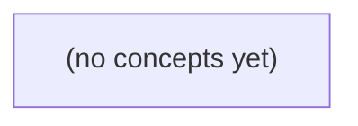

# 09.04 请求处理链：Go 中一条 IM POST 请求的边界、提交与证据

*以虚构 IM 场景中 u-a 向会话 c-a 发送消息 m-a 的 POST 请求为主线，逐层讲解请求如何穿过中间件、处理器、应用层与内存存储，并形成一次 HTTP 响应。教材重点建立对身份可信来源、受限输入、上下文取消、内存提交点、panic 边界、响应写入和日志证据的准确心智模型。*

**章节:** 2

---

## 本书导览

- 了解整本书的章节脉络
- 掌握各章之间的概念依赖关系
- 选择最合适的阅读顺序

# 09.04 请求处理链：Go 中一条 IM POST 请求的边界、提交与证据

以虚构 IM 场景中 u-a 向会话 c-a 发送消息 m-a 的 POST 请求为主线，逐层讲解请求如何穿过中间件、处理器、应用层与内存存储，并形成一次 HTTP 响应。教材重点建立对身份可信来源、受限输入、上下文取消、内存提交点、panic 边界、响应写入和日志证据的准确心智模型。

下方的概念图展示了本书 0 个核心概念以及它们之间的依赖关系；再下方是 1 个章节的入口。你可以按从上到下的顺序阅读，也可以根据自己的兴趣或先验知识选择切入点。

#### 概念图



## 章节索引

- **09.04 请求处理链：中间件、取消与响应提交** — 承接09.01–09.03用例、接口与包边界，面向Go初学者用虚构IM POST/GET静态流程解释net/http中间件嵌套顺序、受限读取、可信主体、r.Context取消/WithTimeout、panic恢复局限、ResponseWriter最终状态提交、脱敏日志/分段计时及响应丢失后的未知结果。无运行服务。

## 09.04 请求处理链：中间件、取消与响应提交

- 按进入/返回顺序画出中间件嵌套调用栈
- 把限量读取、身份、应用服务和错误映射放在合适阶段
- 传递r.Context并理解断连/handler返回后的取消
- 区别超时停止请求与已完成的内存提交
- 说明panic恢复只覆盖同goroutine和提交前响应
- 在Write/WriteHeader前准备状态和小JSON表示
- 设计请求关联标识与脱敏分段观测
- 完成POST成功/拒绝/取消/响应丢失的完整时间线

以虚构消息发送接口为线索，拆解请求从进入到返回的调用链，并明确“内存已接受”不等于客户端已收到响应。

### 从路由到存储的请求链

### 从路由到存储的请求链

以虚构请求为例：

`POST /v1/conversations/c-a/messages`

请求体约为 `4096B`，其中真正的消息文本可能只有 `6B`；其余空间可来自 JSON 字段、元数据或附件描述。这里的 `u-a`、`u-b`、`c-a`、`m-a` 都是示例标识，当前本地 CLI 并没有真实服务端。

```text
client
  → outer middleware
  → handler
  → app
  → memorystore
  → response
```

调用链的“进入”方向是从网络边界逐层向业务与存储推进：

1. **客户端**发起 HTTP 请求，携带路径中的会话 `c-a`、请求体及认证材料。
2. **外层中间件**解析认证材料，建立可信的 `principal`。例如，`principal = u-a` 必须来自已验证的令牌或会话，不能直接相信请求体声称的“发送者”字段。
3. **处理器**匹配路由，读取并校验 JSON，提取目标会话和消息内容；随后检查授权：`u-a` 是否可以向 `c-a` 发送消息，接收方 `u-b` 不构成授权依据。
4. **应用服务**执行领域操作：生成消息 `m-a`、补充时间戳与发送者信息，并决定消息状态。
5. **内存存储**将 `m-a` 写入进程内的数据结构。写入成功可得到 `accepted_in_memory`。

随后调用栈按相反方向返回：`memorystore → app → handler → middleware → client`。处理器据此构造 `200` 响应，例如表示“该消息已被当前进程内存接受”。

关键边界在于：`accepted_in_memory` 只说明服务端已完成本次内存写入；它不表示消息已持久化、已投递给 `u-b`，更不表示客户端一定收到了 HTTP 响应。响应可能在返回网络途中丢失，而存储操作已经成功。

### 嵌套中间件的进入与返回

### 嵌套中间件的进入与返回

把一次 `POST /v1/conversations/c-a/messages` 想成嵌套函数调用，而不是一条直线。若注册顺序为：

`恢复 → 请求标识 → 观测 → 限量读取 → 认证授权 → handler`

则进入时按左到右推进，返回时按右到左展开：

`client → 恢复 → 请求标识 → 观测 → 限量读取 → 认证授权 → handler → … → client`

可写成近似调用栈：

`恢复(请求标识(观测(限量读取(认证授权(handler)))))`

因此，`handler` 把消息 `m-a` 写入 `memorystore` 并决定返回 `200 accepted_in_memory` 后，响应并不会立刻发给客户端；它仍要依次穿过认证授权、限量读取、观测、请求标识和恢复层，最后才由服务器提交字节流。若连接在此期间断开，内存接受成功仍不等于客户端已经收到该响应，更不表示消息已送达任何设备。

各层的位置由其必须覆盖的范围决定：

- **恢复层最外层**：捕获后续任意层的未处理异常，避免异常直接中断连接；但已提交的响应通常不能被改写。
- **请求标识靠外**：尽早生成或校验 `request_id`，使后续日志、错误和响应头共享同一关联标识。
- **观测包住业务链**：进入时记录开始时间，返回时记录状态码、耗时和结果；它应观察授权失败、限流失败与正常成功，而非只包住 `handler`。
- **限量读取在解析正文之前**：对本例 `4096B` 请求体设置读取上限，防止大正文在 JSON 解析或业务分配内存前耗尽资源；超过限制应尽早返回错误。
- **认证授权位于业务处理之前**：可信 `principal` 必须由认证中间件从凭证验证结果生成，不能相信客户端正文中自称的 `u-a`。授权层再判断该 principal 是否可向会话 `c-a` 写入。

返回路径尤其适合做“收尾”：观测记录最终结果，请求标识补充响应头，恢复层处理尚未提交的异常响应。业务层只需专注于“是否接受到内存”，不要把传输提交、异常恢复或设备送达混入其语义。

### 可信主体、授权与受限请求体

### 可信主体、授权与受限请求体

对 `POST /v1/conversations/c-a/messages` 而言，`principal` 不能由请求体中的 `user_id`、查询参数或客户端自报的 `X-User` 直接构造。它必须来自外层认证中间件验证后的可信结果，例如已校验签名的访问令牌、受保护的会话凭证或本地认证上下文。中间件将其写入请求上下文：

`principal = { subject: "u-a", scopes: [...] }`

随后，处理器应在读取完整消息内容、调用应用服务或写入 `memorystore` 前完成授权判断：

1. `principal` 是否存在；不存在返回 `401`。
2. `u-a` 是否有权访问会话 `c-a`；无权返回 `403`，而不是仅凭路径可猜测性放行。
3. 会话是否允许当前操作，例如是否已关闭、主体是否被移出成员列表。
4. 请求体是否受大小限制；本例最多读取 `4096B`。

受限读取不是只在解析后检查字符串长度。应在读取阶段设置上限，避免攻击者发送超大 body 占用内存、连接和解析时间。若超过 `4096B`，应停止读取并返回适当的请求体过大错误；不要先将无限 body 全部缓冲，再检查其是否超限。

调用链可概括为：

`client → 认证中间件 → 授权处理器 → app → memorystore → response`

其中认证中间件负责产生可信 `principal`，处理器负责把 `u-a` 与 `c-a` 的关系落实为授权决策；应用服务不应重新相信客户端声明的身份。只有身份可信、会话获准且 body 在限额内，才可创建虚构消息 `m-a` 并返回“已在内存中接受”。

### 取消、超时与内存提交边界

### 取消、超时与内存提交边界

对 `POST /v1/conversations/c-a/messages` 而言，应区分“调用链是否还在运行”“HTTP 响应能否送回”与“`memorystore` 是否已经写入”。它们不是同一个状态。

| 事件 | 处理器可见信号 | 对 `m-a` 内存写入的影响 | 客户端结论 |
|---|---|---|---|
| 客户端断连 | `request.Context()` 可能被取消 | 若尚未提交，应停止；若已提交，通常保留 | 未收到响应，不等于未创建 |
| 服务端超时 | `Context` 的截止时间到期，得到 `DeadlineExceeded` | 仅能阻止后续工作，不能自动回滚既有写入 | 可能收到超时或连接关闭 |
| 处理器正常返回 | 调用栈从 `handler` 返回外层中间件 | 写入是否存在取决于此前是否成功提交 | 外层尝试写出 `200 accepted_in_memory` |
| `memorystore` 已提交 | `app` 已完成持久化动作并返回成功 | `m-a` 已属于 `c-a` 的内存状态 | 即使响应丢失，写入仍可能成功 |

典型调用顺序是：

`outer middleware` 进入 → 校验可信 `principal` 为 `u-a` → 授权其向 `c-a` 发言 → `handler` 调用 `app` → `memorystore` 提交 `m-a` → 调用栈逐层返回 → 写出响应。

取消应被当作“不要继续做尚未开始的工作”的协作信号。例如，`app` 在写入前检查：

`if err := ctx.Err(); err != nil { return err }`

但若 `memorystore` 已将消息追加到会话，再发生断连或超时，取消不能穿越提交边界撤销该追加。除非系统额外实现事务、补偿删除或幂等状态机，否则“停止处理”不等于“撤销完成写入”。

因此，`200 accepted_in_memory` 只表示服务端成功走到响应提交路径；它不表示客户端设备必然收到该响应，更不表示消息已经送达其他用户 `u-b`。对于重试，请使用请求幂等键或客户端消息标识，避免客户端因“未见响应”而重复创建消息。

### 响应提交与可观测时间线

### 响应提交与可观测时间线

对 `POST /v1/conversations/c-a/messages` 而言，应用层应把“写入内存”“提交 HTTP 响应”“客户端实际收到响应”视为三个不同事件。响应一旦提交，状态码和响应头通常不可再改；因此先在内存中构造小型 JSON，例如 `{"message_id":"m-a","status":"accepted_in_memory"}`，再一次性写出，避免写出半截后才发现错误。

可将关键路径记录为带关联标识的分段日志：`request_id`、可信认证中间件产生的 `principal=u-a`、`conversation_id=c-a`、结果码与耗时。不要记录 `Authorization`、完整消息正文或未经脱敏的用户标识；正文可只记录长度，如 `body_bytes=4096`、`response_bytes=6`，必要时记录受控摘要。

- **成功**：外层中间件验证可信 `principal`，处理器检查 `u-a` 对 `c-a` 的授权，应用创建 `m-a`，内存库接受后准备 JSON，提交 `200`。日志依次标记 `entered → authorized → accepted_in_memory → response_committed`。
- **拒绝**：认证失败、无权访问或请求格式错误时，不进入写库步骤，准备固定且小的错误 JSON 后提交 `401`、`403` 或 `400`。日志记录拒绝原因分类，不回显敏感细节。
- **取消**：客户端断开或请求上下文取消后，处理器应在写库前停止；若写库已经完成，则结果可能已是“内存已接受”，但响应未必能写回。日志需区分 `canceled_before_accept` 与 `canceled_after_accept`。
- **响应丢失**：`response_committed` 仅表示服务端尝试把字节交给 HTTP 栈，不表示客户端、代理或设备已收到，更不表示消息已送达对方。

`panic` 恢复应放在最外层中间件：记录脱敏后的崩溃类型、调用栈和 `request_id`，若尚未提交响应则返回通用 `500`；若已提交，只能记录连接异常并结束，不能再追加第二份 JSON。

> **要点** — 请求链应先建立可信上下文再执行业务；内存提交成功仅代表服务端接受，不能证明响应已送达客户端。

本节用一条虚构 IM 请求链拆解 net/http 中间件的嵌套、短路与返回顺序，建立“请求向内、响应向外”的静态心智模型。

### 从 Handler 到洋葱式调用链

### 从 Handler 到洋葱式调用链

在 `net/http` 中，处理器由 `http.Handler` 表示：它只要求实现 `ServeHTTP(http.ResponseWriter, *http.Request)`。业务端点通常用 `http.HandlerFunc` 把普通函数适配为处理器；中间件则接收一个内层处理器，返回一个包裹后的新处理器：

```go
type Middleware func(http.Handler) http.Handler

func requestID(next http.Handler) http.Handler {
	return http.HandlerFunc(func(w http.ResponseWriter, r *http.Request) {
		id := "req-demo" // 实际项目应生成或读取请求 ID
		w.Header().Set("X-Request-ID", id)
		next.ServeHTTP(w, r)
	})
}
```

假设核心业务为 `api`，组合表达式如下：

`requestID(recover(limit(auth(api))))`

它不是从左到右依次“执行函数”，而是先构造嵌套处理器；请求到来后，调用方向由外向内：

| 阶段 | 当前层 | 典型职责 |
|---|---|---|
| 请求进入 | `requestID` | 注入请求标识 |
| 请求进入 | `recover` | 建立异常恢复边界 |
| 请求进入 | `limit` | 先包装 `Body`，限制内层可读取的数据 |
| 请求进入 | `auth` | 校验身份与权限 |
| 请求进入 | `api` | 执行业务逻辑 |
| 响应返回 | `api → auth → limit → recover → requestID` | 逐层收尾、记录状态或补充响应头 |

可将每层理解为：

```go
func mw(next http.Handler) http.Handler {
	return http.HandlerFunc(func(w http.ResponseWriter, r *http.Request) {
		// 请求进入时执行
		next.ServeHTTP(w, r)
		// 内层返回后执行
	})
}
```

因此，`auth` 若发现未授权，可以直接写入 `401` 或 `403` 并 `return`，不会调用 `api`；但已经进入的外层仍会按返回方向继续收尾。`limit` 必须在内层读取请求体之前包装 `r.Body`，否则无法约束 `auth` 或 `api` 的读取量。认证的 S3 实现尚未提供，S2 仅有私有桩代码，此处只建立链路模型，不在仓库中启动服务。

### 完整中间件函数与顺序表

### 完整中间件函数与顺序表

中间件的基本形状是“接收下一个处理器，返回一个新处理器”：

```go
func requestID(next http.Handler) http.Handler {
	return http.HandlerFunc(func(w http.ResponseWriter, r *http.Request) {
		id := "req-123" // 示例：真实项目通常从请求头生成或读取
		w.Header().Set("X-Request-ID", id)

		next.ServeHTTP(w, r) // 请求继续向内

		// 此处是响应向外返回时的位置；
		// 若未提前写出响应，可在这里补充日志、指标等收尾动作。
	})
}

func auth(next http.Handler) http.Handler {
	return http.HandlerFunc(func(w http.ResponseWriter, r *http.Request) {
		token := r.Header.Get("Authorization")
		if token == "" {
			http.Error(w, "未授权", http.StatusUnauthorized)
			return // 短路：api 不会执行
		}

		next.ServeHTTP(w, r)
	})
}

func api(w http.ResponseWriter, r *http.Request) {
	w.WriteHeader(http.StatusOK)
	w.Write([]byte("消息列表"))
}
```

组合时，最外层最先接收请求：

```go
handler := requestID(auth(http.HandlerFunc(api)))
```

| 阶段 | 执行位置 | 典型职责 |
|---|---|---|
| 请求进入 | `requestID` 的 `next` 前 | 生成请求标识、初始化上下文 |
| 请求进入 | `auth` 的 `next` 前 | 检查凭证；失败则写入 `401` 并返回 |
| 请求进入 | `api` | 读取已验证的请求，生成业务响应 |
| 响应返回 | `auth` 的 `next` 后 | 记录认证结果、清理临时状态 |
| 响应返回 | `requestID` 的 `next` 后 | 记录耗时、状态与请求标识 |

因此调用轨迹是：

`requestID 前 → auth 前 → api → auth 后 → requestID 后`

若 `auth` 拒绝请求，则轨迹变为：

`requestID 前 → auth 前 → auth 写入 401 并返回 → requestID 后`

限流中间件若要限制请求体大小，应在调用内层前包装 `r.Body`；这样内层认证或业务处理器读取到的就是受限 Body。认证相关的 S3 在此仅作为概念，S2 也只有私有桩实现，不应据此在仓库中搭建服务。

### 限量读取、认证与拒绝短路

### 限量读取、认证与拒绝短路

中间件按嵌套方式组合：

`requestID(recover(limit(auth(api))))`

请求从外层向内进入，响应则沿调用栈从内层向外返回。`limit` 必须在任何可能读取请求体的内层之前包装 `r.Body`；否则认证或 `api` 已经读走过大的请求体，限量便失去意义。

```go
func limit(next http.Handler) http.Handler {
	return http.HandlerFunc(func(w http.ResponseWriter, r *http.Request) {
		const maxBody = 1 << 20 // 1 MiB
		r.Body = http.MaxBytesReader(w, r.Body, maxBody)
		next.ServeHTTP(w, r)
	})
}

func auth(next http.Handler) http.Handler {
	return http.HandlerFunc(func(w http.ResponseWriter, r *http.Request) {
		// S2：仅调用包内私有认证桩；S3 尚未实现时不在此伪造真实认证。
		if !authenticatedStub(r) {
			http.Error(w, "未认证", http.StatusUnauthorized)
			return
		}
		if !allowedStub(r) {
			http.Error(w, "无权限", http.StatusForbidden)
			return
		}
		next.ServeHTTP(w, r)
	})
}
```

| 阶段 | 请求方向中的动作 | 是否进入下一层 |
|---|---|---|
| `requestID` | 写入或关联请求标识 | 是 |
| `recover` | 建立 panic 恢复边界 | 是 |
| `limit` | 以 `MaxBytesReader` 替换 `Body` | 是 |
| `auth` | 调用 S2 私有桩进行认证、授权判断 | 失败则否 |
| `api` | 读取已受限的 `Body` 并处理业务 | 仅通过授权时 |

认证或授权失败时，`auth` 直接写入 `401` 或 `403` 并 `return`，这就是短路：`api` 完全不会执行。随后响应仍会返回到 `limit`、`recover`、`requestID` 的外层调用路径；但若外层没有额外后处理逻辑，它们只负责正常返回。S3 认证尚未实现时，应保持该边界与桩位，不把临时认证逻辑散落到 `api` 中。

### 响应回程与可观测边界

### 响应回程与可观测边界

设链为 `requestID(recover(limit(auth(api))))`。请求按外→内进入：`requestID → recover → limit → auth → api`；若 `api` 正常返回，响应则按内→外回程。外层中间件因此最适合在 `next.ServeHTTP` 前后建立同一次请求的观测边界。

| 位置 | 请求进入时做什么 | 响应回程时做什么 |
|---|---|---|
| `requestID` | 生成或读取请求标识，写入 `Context` 与响应头 | 日志关联同一 `requestID` |
| `recover` | 注册 `defer` 捕获恐慌 | 记录恐慌摘要，统一写入 500 |
| `limit` | 用受限读取器包装 `r.Body` | 记录是否超限；内层读取时才真正触发限制 |
| `auth` | 校验身份与权限 | 拒绝时短路，不调用 `api` |
| 日志/计时 | 记录方法、脱敏路径、开始时间 | 记录状态码、耗时、响应字节数 |

```go
func logging(next http.Handler) http.Handler {
	return http.HandlerFunc(func(w http.ResponseWriter, r *http.Request) {
		start := time.Now()
		id := r.Context().Value(requestIDKey{})
		next.ServeHTTP(w, r)
		log.Printf("request_id=%v method=%s path=%s cost=%s",
			id, r.Method, r.URL.Path, time.Since(start))
	})
}
```

注意：普通 `ResponseWriter` 不能在事后直接取得状态码和字节数；需要额外包装并在 `WriteHeader`、`Write` 中记录。日志不得输出 `Authorization`、Cookie、会话令牌、密码、消息正文及完整查询参数；身份信息仅记录脱敏后的用户标识。`auth` 若拒绝，回程仍会经过外层的 `limit`、`recover`、`requestID`，因此拒绝响应同样应带请求标识、耗时与审计日志。认证的 S3 实现尚未提供，S2 仅有私有桩；这里仅讨论静态链路，不在仓库中启动服务。

### POST 与 GET 的静态时间线

### POST 与 GET 的静态时间线

设装配顺序为 `requestID(recover(limit(auth(api))))`。最外层最先收到请求；每层在 `next.ServeHTTP` 前做“进入”工作，在其返回后做“退出”工作。因此请求向内，响应与收尾向外。

- `func requestID(next http.Handler) http.Handler { return http.HandlerFunc(func(w http.ResponseWriter, r *http.Request) { w.Header().Set("X-Request-ID", "r-1"); next.ServeHTTP(w, r) }) }`
- `func auth(next http.Handler) http.Handler { return http.HandlerFunc(func(w http.ResponseWriter, r *http.Request) { if r.Header.Get("Authorization") == "" { http.Error(w, "unauthorized", http.StatusUnauthorized); return }; next.ServeHTTP(w, r) }) }`
- `func limit(next http.Handler) http.Handler { return http.HandlerFunc(func(w http.ResponseWriter, r *http.Request) { r.Body = http.MaxBytesReader(w, r.Body, 1<<20); next.ServeHTTP(w, r) }) }`

| 场景 | 向内经过 | `next` 是否继续 | 首次写响应 | 向外收尾 |
|---|---|---|---|---|
| POST 成功 | `requestID → recover → limit → auth → api` | 全部继续 | `api` 写入成功结果 | `api → auth → limit → recover → requestID` |
| POST 认证拒绝 | `requestID → recover → limit → auth` | `auth` 不调用 | `auth` 写入 `401` | `auth` 返回后，`limit → recover → requestID` 依次结束 |
| GET 静态查询 | 同样进入链；`api` 按查询参数读取 | 全部继续 | `api` 写入查询结果 | 按内到外返回 |

`limit` 必须在内层读取 `r.Body` 前完成包装，故 POST 成功时 `api` 读取到的是受限 Body。认证拒绝虽不进入 `api`，外层已进入的中间件仍会获得返回机会。认证的 S3 流程未实现；S2 仅有私有 stub，不能据此推断真实认证行为。

> **要点** — 中间件按外到内处理请求、按内到外收尾响应；限量读取在前，认证可短路，业务处理只接收已准备好的请求。

以虚构 IM 的 POST 消息接口为线索，确定从受限读取到内存提交前各项校验的责任边界与拒绝顺序。

### 先画清请求进入与返回的嵌套链

### 先画清请求进入与返回的嵌套链

把一次 `POST /rooms/{room_id}/messages` 想成“进入时逐层收紧，返回时逐层收尾”的嵌套调用，而不是若干可随意交换的检查：

1. **外层通用观测**：分配请求标识、记录开始时间、捕获异常、统一写访问日志。它应观察最终状态码，但不应读取或复制消息正文。
2. **输入约束层**：先以 `MaxBytesReader` 将可读正文限制为 `4096B`；随后检查 `Content-Type`、解析 JSON，并校验路径参数与查询参数的格式。服务器即使关闭了超限请求的 body，处理器仍必须继续读取并检查，才能将错误稳定地归类为“过大”“格式错误”等。
3. **身份认证层**：验证凭证并建立可信 `principal`。请求体中的 `sender_id` 只是攻击者可改写的输入，绝不能作为发送者身份依据。
4. **应用授权层**：由应用查询 `room_id`，再判断该 `principal` 是否为成员、是否具备发言权限；固定实验主体等内部信息不应暴露给非成员。
5. **领域层与提交点**：仅当正文业务内容（例如最多 `6B` 的文本）有效、权限满足且未重复时，才创建消息并执行内存提交。任何拒绝路径都不得触及提交。

返回方向相反：领域结果先映射为 HTTP 语义，再由观测层记录。一个自洽的隐私优先级可以是：未认证先保留 `401` 挑战到后续统一处理；已认证但非成员返回 `404` 隐藏房间存在性；成员但无发言权返回 `403`；已发送同一幂等消息返回 `409`。中间件的业界顺序并非唯一，但身份、授权、提交与日志所见结果必须彼此一致。

### 受限读取与输入解析的先后边界

### 受限读取与输入解析的先后边界

请求体是最先需要设防的输入通道。处理器进入后，应立即以 `MaxBytesReader` 将可读取正文限制为 `4096B`，再进行 JSON 解码；不能先把正文读入 `[]byte`，再检查长度，否则超大请求已经占用内存与解码资源。

典型边界可写为：

1. 用 `MaxBytesReader(w, r.Body, 4096)` 替换 `r.Body`。
2. 检查 `Content-Type` 是否为预期的 JSON 类型；可允许参数如 `application/json; charset=utf-8`，但不能把任意媒体类型当作 JSON 猜测解析。
3. 从受限正文中解码 JSON，并拒绝语法错误、未知字段、空正文及第二个 JSON 值。
4. 读取并校验路径参数、查询参数的格式与范围。
5. 只有输入结构成立，才进入认证、对象级权限和业务校验。

路径、查询与正文都不可信，但它们的资源消耗不同：路径和查询通常已由路由层获得，正文却可能持续输入大量字节。因此，正文大小限制必须早于任何会消耗正文的日志、签名解析、JSON 解码或业务函数。

当正文超过限制时，HTTP 服务器可能关闭请求体或阻止继续读取；这不等于处理器已完成安全判定。处理器仍须检查读取或解码返回的错误，并将“正文过大”映射为合适的客户端错误，随后立即返回。不能因为连接已被服务器处理，就继续使用部分解出的字段，更不能让该请求进入内存中的消息提交阶段。

顺序并非业界唯一：有些系统先做路由和认证，有些先验媒体类型。但必须保持一条不变量：任何读取正文的路径都受 `4096B` 上限约束，任何解析失败或大小超限都在认证信任、权限判断和内存提交之前终止。

### 可信主体不等于请求中的发送者

### 可信主体不等于请求中的发送者

认证中间件验证令牌、会话或签名后，应将唯一可信的主体 `principal` 放入请求上下文，例如包含用户标识、租户、角色及认证强度。后续处理器只从上下文读取“谁在发起请求”，而不把 JSON 中的 `sender_id` 当作身份依据。

请求体里的 `sender_id` 最多是待校验的业务字段；若消息接口允许客户端填写它，攻击者就可构造：

`{"sender_id":"admin","content":"你好"}`

并冒充其他用户。更稳妥的接口设计是完全不接收该字段，由应用在创建消息时强制写入：

`message.sender_id = principal.user_id`

若因兼容性必须保留 `sender_id`，则必须要求它与 `principal.user_id` 严格一致；不一致应拒绝，且不得进入任何内存提交、事件发布或持久化预备状态。

测试中常见“固定实验主体”，例如未接入真实认证时把所有请求映射为 `lab-user-1`。这只能存在于受控边界：本地开发开关、隔离测试环境或明确的测试认证中间件。它不得通过响应、日志详情、错误消息或公开接口暴露为可被利用的身份约定，更不能在生产环境成为默认回退身份。

因此，身份链应保持单向：认证结果产生 `principal`，授权和对象级权限检查消费 `principal`，业务对象由 `principal` 派生作者字段；客户端声明不能反向覆盖该可信来源。

### 对象级授权、错误优先级与隐私

### 对象级授权、错误优先级与隐私

对象级授权发生在路由、请求体格式与认证主体已经可信之后：应用不能相信客户端提交的 `sender_id`，发送者必须取自认证中间件注入的 principal。固定实验主体、内部用户编号及其成员关系也不应因错误响应而公开。

以“向会话发送一条 6B 消息”为例，应用先根据路径中的会话标识查询成员关系，再判断该成员在该会话中的发送权限，最后检查客户端消息标识是否重复。三种失败的语义不同：

| 情况 | 推荐状态 | 对外含义 |
|---|---:|---|
| 认证主体不是该会话成员 | `404 Not Found` | 不确认该会话存在，也不泄露成员名单 |
| 是成员，但被禁言、只读或无发送权限 | `403 Forbidden` | 已确认其对该对象有可见性，但当前操作被拒绝 |
| 有发送权限，但消息标识已存在 | `409 Conflict` | 请求与当前资源状态冲突，可由客户端去重或改用既有结果 |

这里的优先级本身就是隐私策略。若先检查“会话是否存在”或“消息是否重复”，非成员可能借助 `403`、`409` 与响应差异枚举会话、探测成员活动。因而对非成员统一返回 `404`；只有确认成员身份后，才暴露“禁止发送”或“重复提交”的精确原因。

授权通过不等于可以立即写入。重复检测、业务约束与待写入记录应在同一受保护的提交边界内完成：任何 `404`、`403`、`409`，以及后续领域校验失败，都必须在内存状态 `commit` 之前返回。否则即使 HTTP 响应表示拒绝，消息、去重键或计数器已被修改，系统就会出现“失败请求产生副作用”的矛盾。

### POST 消息的完整拒绝与成功时间线

### POST 消息的完整拒绝与成功时间线

以 `POST /rooms/{room_id}/messages`、请求体仅 `6B`（如 `{"x":1}`）为例，处理链仍应完整执行边界校验：

1. **受限读取与语法层**：先用 `MaxBytesReader(4096)` 包裹请求体；即使服务器已关闭连接或请求上下文取消，处理器仍应在可读范围内完成读取与检查。随后验证 `Content-Type: application/json`、路径参数与查询参数，并解码 JSON。超限、类型不符、JSON 损坏或字段不合约时，准备 `400`/`415` 响应并立即终止，绝不触及内存提交。

2. **身份层**：认证中间件从可信凭证建立 principal；请求体中的 `sender_id` 只能视为不可信输入，不能决定发送者。认证失败先形成拒绝结果；若协议需要 `401` 挑战，可在统一响应阶段补充挑战头。

3. **对象级授权层**：应用根据可信 principal 查询房间成员关系。固定实验主体、房间存在性及非成员原因都不应向外暴露：非成员统一返回 `404`。已是成员但无发送权限时返回 `403`。

4. **领域层与提交**：通过授权后才执行“6B 内容是否合法”、禁言规则及幂等键/消息重复检查；禁止发送为 `403`，重复消息为 `409`。任一拒绝只准备响应，不进入消息列表、索引或事件队列的内存提交。

5. **成功路径**：全部检查通过后，原子写入消息、更新必要索引，再提交 `201` 响应。中间件先后可因实现而异，但必须保证：越界输入不被读取过量，身份不取自正文，隐私优先于对象存在性，且所有失败都早于提交。

> **要点** — 先限量再解析，以可信身份驱动对象授权；按隐私规则拒绝，并仅让通过全部检查的请求进入提交。

请求上下文不仅传递截止时间，也标记客户端断连、主动取消和处理函数结束。关键是把取消当作协作信号，而非事务回滚机制。

### 请求上下文的生命周期

### 请求上下文的生命周期

`r.Context()` 表示“这次 HTTP 请求仍值得继续处理吗”的协作信号。它并非普通的全局上下文：服务端会在以下边界取消它：

- 客户端断开连接；
- 客户端主动取消请求；
- `ServeHTTP` 返回。

因此，处理函数应将它继续传给应用层、存储层和下游调用：

`result, err := app.CreateOrder(r.Context(), input)`

下游若支持上下文，应监听 `ctx.Done()` 或检查 `ctx.Err()`；常见结果是 `context.Canceled` 或 `context.DeadlineExceeded`。不要改用 `context.Background()`，否则客户端早已离开，数据库查询、远程调用仍可能无意义地继续。

通常还应在请求预算内设置更短的局部超时：

`ctx, cancel := context.WithTimeout(r.Context(), 300*time.Millisecond)`  
`defer cancel()`

这里的父上下文仍是 `r.Context()`：客户端先断开时，子上下文立即取消；300ms 先到时，子上下文自行超时。可以按阶段分配静态预算，例如鉴权 50ms、查询 150ms、写入 100ms；这只是预算设计，不代表已经测得真实耗时。

取消是协作式的。若业务代码、驱动或远程服务忽略 `ctx.Done()`，处理函数仍可能在超时后继续执行，甚至完成写入。取消也不是事务回滚：提交前因取消而拒绝操作，应保持状态不变；提交后客户端可能收不到响应，此时结果对客户端是“未知”，不能仅凭断连断定写入失败。

最后，`ServeHTTP` 返回后请求上下文必定结束。不要把它交给后台 goroutine 用于延迟任务；后台任务应使用独立上下文，并明确其超时、取消与责任边界。

### 将取消信号传入应用与存储层

### 将取消信号传入应用与存储层

处理器不应独自持有取消逻辑，而应把请求的 `context.Context` 沿调用链显式传下去：

```go
func (h *Handler) ServeHTTP(w http.ResponseWriter, r *http.Request) {
    ctx, cancel := context.WithTimeout(r.Context(), 300*time.Millisecond)
    defer cancel()

    result, err := h.app.CreateOrder(ctx, input)
    // 根据 err 决定是否尚可写入响应
}
```

应用服务与存储接口都应接收 `ctx`：

```go
func (s *Service) CreateOrder(ctx context.Context, in Input) (Order, error)
func (r *Repository) Save(ctx context.Context, o Order) error
```

这样，客户端断连、请求主动取消、父上下文截止，都会传播到应用和存储层。数据库查询、远程调用、队列等待等阻塞操作必须使用支持上下文的 API；纯计算或循环任务则应在合适粒度检查：

```go
select {
case <-ctx.Done():
    return ctx.Err()
default:
}
```

`WithTimeout` 的 `300ms` 是本处理器给下游的总预算，而非每一层各自再拥有 `300ms`。可静态规划为“鉴权、业务校验、存储写入、响应编码”共享该预算；实际剩余时间应由上下文截止时间决定，而不是假定各阶段一定耗时多少。

取消是协作信号，不会强制终止忽略它的函数。若存储层已提交写入，随后才收到取消，已提交的映射或数据库状态不会自动回滚；此时客户端可能收不到响应，结果对其而言是未知的。相反，若在提交前检测到取消，应直接拒绝，并保持状态未变。

`ServeHTTP` 返回后，请求上下文也会被取消。因此不要用它启动脱离请求生命周期的后台任务；需要继续执行时，应创建由应用级生命周期管理的独立上下文，并明确记录任务、重试与幂等策略。

### 用 WithTimeout 划分请求预算

### 用 `WithTimeout` 划分请求预算

应用层不应把整个请求的剩余时间无差别地交给所有操作。可从 `r.Context()` 派生一个更短的子上下文，例如为核心读写预留 `300ms`：

```go
ctx, cancel := context.WithTimeout(r.Context(), 300*time.Millisecond)
defer cancel()

result, err := app.CreateOrder(ctx, input)
```

这里的父上下文仍保留请求级取消语义：客户端断连、请求被取消或父截止时间到达时，`ctx.Done()` 都会关闭；而 `300ms` 则为当前应用操作增加更严格的本地上限。`defer cancel()` 必不可少：它会在处理路径提前返回时及时释放计时器及相关资源，也让下游尽早收到取消信号。

预算应按阶段静态分配，而不是让每层各自任意设置超时。例如总请求预算为 `800ms`，可以约定：

- 鉴权与参数校验：`100ms`
- 应用服务与存储访问：`300ms`
- 外部依赖调用：`250ms`
- 响应编码与余量：`150ms`

这些数字是设计约束，不代表已经测得真实耗时；后续应依据监控数据调整。子超时只能缩短，不能延长父请求的寿命：若父上下文还剩 `80ms`，即使创建 `300ms` 子超时，实际可用时间也最多约为 `80ms`。

取消是协作信号。应用服务、数据库驱动或远程调用必须主动检查 `ctx.Err()` 或接受 `ctx`，才能尽快停止；忽略上下文的代码仍可能继续运行。不要在 `ServeHTTP` 返回后使用请求上下文启动后台任务；需要异步执行时，应显式创建独立的任务上下文，并定义其持久化、重试与责任边界。

### 取消、提交与响应丢失

### 取消、提交与响应丢失

`r.Context()` 被取消可能意味着客户端断连、客户端主动取消，或处理函数已返回。它是“请尽快停止”的协作信号，不是数据库事务，也不会自动撤销已经发生的内存写入、文件写入或外部调用。

可将一次写操作分为两个关键边界：

| 时点 | 取消后的处理 | 可观察结果 |
|---|---|---|
| 提交前 | 检查 `ctx.Err()`，拒绝执行写入 | 状态保持不变，可安全返回超时或取消错误 |
| 提交后、响应前 | 写入已生效，取消不回滚 | 服务端成功，但客户端可能收不到结果 |
| 响应写出途中或之后 | 响应可能丢失 | 客户端无法仅凭超时判断操作是否成功 |

例如，先进行校验、计算和限时查询，再执行不可逆提交：

`ctx, cancel := context.WithTimeout(r.Context(), 300*time.Millisecond)`  
`defer cancel()`

应用层和存储层都应接收该 `ctx`，并在耗时阶段、锁等待或提交前检查取消。若在提交前发现 `ctx.Err() != nil`，直接拒绝，不改变目标状态。这里的“提交”是业务定义的原子边界：可能是一次 map 赋值、数据库事务提交，或向消息系统确认写入。

但若已完成 `map[key] = value`，随后客户端断连，取消不会把该值改回去；即使 `ServeHTTP` 最终返回错误，已提交状态仍然存在。客户端看到超时或网络失败时，正确语义通常是“结果未知”，而非“操作失败”。对此应使用幂等键、查询接口或可重试协议确认结果。

不要在 `ServeHTTP` 返回后继续用请求上下文启动后台任务：该上下文会被取消。需要脱离请求继续执行时，应显式创建独立的后台上下文，并另行规定其超时、审计与重试策略。

### POST 请求的取消时间线

### POST 请求的取消时间线

设处理器为 `POST /orders`，入口先从 `r.Context()` 派生总预算：

`ctx, cancel := context.WithTimeout(r.Context(), 300*time.Millisecond)`  
`defer cancel()`

随后将 `ctx` 传给应用层和存储层；取消必须由各层检查 `ctx.Done()` 或返回的 `ctx.Err()` 来协作响应。

- **成功路径**：校验 → 写入订单映射 → 提交响应。写入与响应都完成，客户端得到成功结果。
- **超时路径**：预算到达，`ctx` 变为取消状态；尚在等待存储、锁或下游调用的代码应停止并返回超时。若在提交前拒绝写入，订单映射保持不变。
- **客户端断连路径**：客户端关闭连接，或请求被取消时，`r.Context()` 会被取消，子上下文也随之取消。处理器应尽快放弃无意义工作；但取消只是信号，忽略它的函数仍可能继续执行。
- **提交后响应丢失**：订单已写入映射，随后客户端断连或响应写回失败。服务端不能把已提交的写入当作自动回滚；客户端也无法确定操作是否成功，应依靠幂等键或查询确认结果。

`ServeHTTP` 返回时，请求上下文同样会被取消。因此不能在处理器返回前用 `go func(){ ... }()` 启动依赖该上下文的后台任务；后台任务应使用独立、显式管理生命周期的上下文。

> **要点** — 上下文取消只能要求各层尽快停止；它不会撤销已提交状态，提交后的客户端结果必须按未知处理。

恢复中间件不是“万能保险”：它只能在同一执行链、响应尚未提交时，把可预期的失败转换为受控响应。

### 恢复中间件应包裹下游调用

### 恢复中间件应包裹下游调用

恢复中间件的关键不是“写一个 `recover`”，而是让它位于**调用下游处理器的同一 goroutine** 中，并以 `defer` 包围 `next.ServeHTTP`：

```go
func Recovery(next http.Handler) http.Handler {
	return http.HandlerFunc(func(w http.ResponseWriter, r *http.Request) {
		defer func() {
			if v := recover(); v != nil {
				// 记录 panic；仅在响应未提交时尝试输出错误响应
			}
		}()

		next.ServeHTTP(w, r)
	})
}
```

执行顺序是：

1. 请求进入恢复中间件；
2. 注册延迟执行的恢复函数；
3. 调用 `next.ServeHTTP(w, r)`，进入后续中间件与最终处理器；
4. 下游正常返回时，`defer` 仍会执行，但 `recover()` 得到 `nil`；
5. 下游在该调用链中发生恐慌时，栈开始展开，恢复函数执行并取得恐慌值。

因此，恢复中间件通常应放在请求链较外层，使其能够覆盖认证、路由、业务处理等下游代码；但它不应被误解为业务错误处理机制。可预期错误应通过返回值、错误类型或统一映射转换为相应状态码，而不是依赖恐慌再恢复。

边界同样重要：若处理器自行启动 `go func() { ... }()`，其中发生的恐慌不在当前请求 goroutine 的调用栈上，外层 `defer recover` 无法捕获。该 goroutine 必须自行恢复、报告错误并管理资源。

恢复后也不能假定事务、锁或外部调用已“自动回滚”。恢复中间件的职责是阻止恐慌继续冲垮当前请求链，并记录诊断信息；资源一致性仍应由业务代码通过 `defer`、上下文取消和显式清理保证。

### 常规错误走返回与映射

### 常规错误走返回与映射

业务拒绝、参数校验失败、权限不足、下游超时、取消信号等，都是请求处理中的**预期失败路径**，不应依赖 `panic` 表达。应用服务应显式返回错误，由靠近 HTTP 边界的统一阶段将其映射为状态码、错误码与响应体：

- 输入错误：映射为 `400`，说明字段或格式不合法。
- 未认证、无权限：映射为 `401`、`403`。
- 资源不存在或业务规则拒绝：映射为 `404`、`409`、`422` 等约定结果。
- `context` 超时或取消：按网关协议、服务端策略记录并结束请求；不要把客户端取消误报成程序崩溃。
- 下游暂时不可用：映射为 `502`、`503`、`504`，并保留可观测的错误原因。

典型边界可写成：

`result, err := service.Execute(r.Context(), input)`

若 `err != nil`，处理器调用统一的错误映射器；若成功，再编码正常响应。这样错误分类、日志字段、对外文案和状态码保持一致，业务层也无需知道 HTTP 细节。

相比之下，`panic` 表示违反内部不变量、错误使用接口或未预见的程序故障。恢复中间件只负责兜底同一 goroutine 中的异常，不能替代正常的错误返回通道。尤其当响应已写出部分内容时，即使随后发现错误，也无法可靠地把原本的 `200` 完整替换成 `500`；常规错误应尽量在提交响应前完成判定与映射。

### 同一 goroutine 才能被恢复

### 同一 goroutine 才能被恢复

`recover` 不是全局异常处理器；它只在发生 `panic` 的**同一 goroutine** 中，并且由延迟调用的函数执行时才有效。恢复中间件通常把 `defer` 放在调用 `next.ServeHTTP` 的外层，因此它能沿当前处理请求的调用栈截获下游处理器的恐慌：

```go
func recoverMiddleware(next http.Handler) http.Handler {
    return http.HandlerFunc(func(w http.ResponseWriter, r *http.Request) {
        defer func() {
            if v := recover(); v != nil {
                // 记录 v，并在尚未提交响应时写出错误响应
            }
        }()
        next.ServeHTTP(w, r)
    })
}
```

调用关系可理解为：

`服务器 goroutine → 恢复中间件 → next.ServeHTTP → 业务函数 → panic`

这里 `panic` 向上展开栈帧，必然经过中间件注册的 `defer`，因而可被恢复。

但处理器另行启动 goroutine 时，调用栈已经分叉：

```go
func handler(w http.ResponseWriter, r *http.Request) {
    go func() {
        panic("后台任务失败")
    }()
    w.WriteHeader(http.StatusOK)
}
```

新 goroutine 拥有独立的栈、独立的 `defer` 链；它的 `panic` 不会“跳回”处理器 goroutine，更不会经过外层中间件的 `defer`。若该 goroutine 未自行恢复，通常会导致整个进程崩溃，而不是由当前请求得到一个 `500`。

因此，后台任务必须在其入口处自行设置恢复逻辑，并把可预期失败通过 `error`、结果通道或任务状态返回。请求处理链中的恢复中间件只能保护它实际包围的那条执行链。

### 响应提交决定能否改写错误

### 响应提交决定能否改写错误

`http.ResponseWriter` 不是可回滚的缓冲区。处理器一旦调用 `WriteHeader(status)`，或首次调用 `Write(body)`（隐式提交 `200 OK`），服务器就可能已将状态行、响应头乃至部分正文发送给客户端。此后再发生 `panic`，恢复中间件无法可靠地把已经发出的成功响应改成完整的 `500`。

```go
w.Header().Set("Content-Type", "text/plain")
w.Write([]byte("已完成一半：")) // 隐式提交 200
panic("数据库连接异常")
```

即使外层 `defer` 中 `recover()` 成功，随后执行：

```go
http.Error(w, "服务器内部错误", http.StatusInternalServerError)
```

也通常为时已晚：客户端可能已看到 `200 OK` 和前半段正文；追加的错误文本至多成为同一响应尾部，状态码不能被改写，甚至会触发“重复调用 WriteHeader”日志。

因此，恢复逻辑能生成**完整错误响应**的前提是尚未提交响应。实践中应当：

- 在可能失败的计算、鉴权、数据库操作完成后，再写状态码和正文；
- 对需要原子输出的内容，先写入内存缓冲，全部成功后再复制到真实 `ResponseWriter`；
- 已提交后发生异常时，记录请求上下文、错误和已写入状态；按协议允许的方式停止继续输出或关闭连接，而不是伪造一个新的 `500`；
- 不把“已恢复”误认为事务、文件写入或后台副作用已经回滚；恢复只控制当前执行链，不能撤销已发生的提交。

### POST异常时间线与事后处置

### POST异常时间线与事后处置

设想客户端发送 `POST /messages`，处理器依次完成鉴权、写入消息、调用推送服务，并返回 JSON。恢复中间件通常包住 `next.ServeHTTP`：

`defer func(){ if v := recover(); v != nil { ... } }()`

它只覆盖这一次调用所在的**同一 goroutine**，并且能否改写结果取决于响应是否已提交。

- **提交前 panic**：例如消息尚未写入响应，`saveMessage` 因空指针 panic。中间件记录请求 ID、panic 值和栈信息；若响应头和正文均未写出，可映射为受控的 `500`。这里应优先把常规失败写成返回错误，由统一错误映射处理；`panic` 仅是最后防线。

- **部分响应后 panic**：处理器已执行 `w.WriteHeader(200)`，甚至已写出 `{"id":"m1"`，随后推送步骤 panic。此时 `200` 已提交，恢复层不能可靠地把它替换成完整 `500`；继续写 JSON 错误只会形成损坏响应。应记录“响应已提交、字节数、请求阶段”，停止继续输出，并按协议关闭或终止流；客户端需将该响应视为失败或不完整。

- **后台 goroutine panic**：若处理器 `go sendPush(...)`，其中 panic 不会被外层处理器的 `defer recover` 捕获。后台任务必须在自身 goroutine 内恢复、记录任务上下文，并通过队列状态、重试或告警处置；更好的设计是让任务返回错误给可管理的执行器，而非依赖 panic。

恢复并不等于事务已回滚。panic 可能发生在数据库提交之后、外部推送之前，资源与业务状态都可能不明。日志应包含操作阶段、消息 ID、事务/外部调用标识和提交状态；收尾只做可确认的释放与取消，不应声称“已完全撤销”。此外，`net/http` 服务器自身对连接级 panic 的行为，与应用中间件的恢复范围是两回事。

> **要点** — recover 只处理同 goroutine、提交前的 panic；常规错误应显式映射，已提交响应与资源结果都可能无法撤回。

响应提交是请求处理链的最后边界：一旦状态或正文开始写出，服务端就必须把后续不确定性与已承诺结果区分开来。

### 响应提交的单向边界

### 响应提交的单向边界

HTTP 响应不是可回滚的对象，而是一条单向输出流。对 `http.ResponseWriter` 而言，首次提交决定了客户端将看到的状态码与响应头：

- 调用 `WriteHeader(status)`：立即提交该状态码及当前已设置的响应头。
- 未调用 `WriteHeader` 就首次调用 `Write(body)`：等价于先提交 `200 OK`，再写入正文。
- 响应头必须在提交前设置：`w.Header().Set(...)` 在首次 `WriteHeader` 或 `Write` 之后通常已无效，不能依赖其修改客户端已收到的头部。
- 后续再次调用 `WriteHeader` 不会改变已提交状态；它只能造成日志告警或掩盖真实控制流。

因此，处理小型 JSON 响应应遵循“先准备，后提交”：

1. 将结果序列化到内存：`body, err := json.Marshal(v)`。
2. 若编码失败，尚未提交，可映射为统一的 `500` 错误响应。
3. 确定状态码、`Content-Type` 等头部。
4. 只调用一次 `WriteHeader`，再写入完整 `body`。

```go
body, err := json.Marshal(reply)
if err != nil {
    writeError(w, internalError)
    return
}
w.Header().Set("Content-Type", "application/json; charset=utf-8")
w.WriteHeader(http.StatusOK)
_, _ = w.Write(body)
```

正文写入仍可能在提交后因断连、超时而部分失败。此时服务端无法知道客户端究竟收到了多少字节，更不能再尝试写第二个 JSON 错误对象或改写状态码。提交前处理应用错误；提交后只记录写入失败、停止后续输出。流式响应则应采用独立契约，因为其天然允许“已提交但未完成”。

### 小型 JSON 的一次性响应

### 小型 JSON 的一次性响应

对可一次性放入内存的小型 JSON，安全顺序应当是：**先编码，再决定状态与响应头，最后只写一次**。原因在于 `WriteHeader` 会最终提交状态码；若先调用 `Write`，框架通常隐式提交 `200 OK`。提交之后再修改状态码或关键响应头，客户端通常都不会看到。

```go
body, err := json.Marshal(resp)
if err != nil {
    // 此时尚未提交响应，仍可映射为统一错误响应
    writeError(w, err)
    return
}

w.Header().Set("Content-Type", "application/json; charset=utf-8")
w.Header().Set("Content-Length", strconv.Itoa(len(body)))
w.WriteHeader(http.StatusOK)

if _, err := w.Write(body); err != nil {
    // 已经提交；只能记录传输失败、取消原因等，不能再写 JSON 错误
    log.Printf("write response: %v", err)
}
```

这里的推导关键是把失败分成两个阶段：

- **编码前或编码中失败**：尚未向客户端承诺任何结果。循环引用、非法自定义序列化逻辑等导致的 `json.Marshal` 失败，可以进入应用错误映射边界，选择 `400`、`409` 或 `500` 等状态，并写出唯一的错误 JSON。
- **写出后失败**：状态行、响应头或部分正文可能已经到达客户端。网络断开、客户端取消、代理重置都可能发生；服务端无法可靠判断客户端究竟收到了多少字节。此时不能补写第二个 JSON，也不能把状态改为 `500`。

因此，小 JSON 响应不应边编码边写入 `ResponseWriter`。那种方式一旦编码器在中途失败，可能已发送半个对象，随后既不能安全改状态，也不能输出规范错误体。先在内存中得到完整字节序列，才能在提交前统一设置 `Content-Type`、缓存策略、追踪头和最终状态码。

这只适用于“小型”的定义明确、可接受内存缓冲的响应。大型下载、持续事件或流式 JSON 另有契约：它们可能必须尽早提交，此后应将失败视为流中断，而不是可替换的 HTTP 错误响应。

### 错误映射的唯一出口

### 错误映射的唯一出口

应用层与领域层应返回“发生了什么”，而不是决定“如何写 HTTP”。例如返回参数校验失败、未认证、资源不存在、版本冲突、媒体类型不支持等结构化错误；只有最外层的 HTTP 适配边界负责将其映射为状态码、响应头和统一错误体。

推荐建立单一映射表：

- 成功：`200`
- 请求字段、格式或语义非法：`400`
- 未提供或无效身份凭证：`401`
- 已认证但无权限：`403`
- 资源不存在或对外不可见：`404`
- 乐观锁、幂等键、状态机等冲突：`409`
- 请求体超过限制：`413`
- `Content-Type` 不被接受：`415`
- 无法满足客户端 `Accept`：`406`
- 未分类错误、基础设施故障：`500`

边界处理器先完成错误分类，再一次性构造响应。例如小型 JSON 错误响应可先编码到内存；编码成功后设置 `Content-Type: application/json`，调用一次 `WriteHeader(status)`，再写入正文。这样编码失败仍可转换为 `500`，不会在已经提交 `400` 或 `404` 后试图改写状态。

```text
领域/应用错误 → HTTP 错误映射器 → 状态码、响应头、统一 JSON 错误体
```

不要让仓储、服务或业务规则层直接调用 `WriteHeader`、写 JSON，或自行返回 HTTP 状态码；否则同一错误会在不同入口得到不同结果，也容易出现先写成功体、后补错误体的“双 JSON”响应。网络写入在提交后仍可能部分失败，此时客户端实际收到什么不可确定，只能记录日志与指标，不能再追加新的错误响应。流式响应则应使用独立契约：首部提交后以流内错误事件、尾部或连接关闭表达后续失败。

### 提交后失败与客户端未知结果

### 提交后失败与客户端未知结果

以创建订单 `POST /orders` 为例，时间线可能如下：

1. 处理函数完成校验、鉴权与库存扣减，得到订单 `o`。
2. 先将 `o` 序列化为 JSON；若序列化失败，此时尚未提交响应，可以映射为 `500`。
3. 设置 `Content-Type: application/json`，调用 `WriteHeader(201)`，再写入 JSON。
4. `Write` 返回网络错误：连接可能已断开，也可能服务端已经成功发送了状态行和部分甚至全部正文，只是在本地继续写入时失败。

此时服务端不能改写为：

```text
500 {"error":"write failed"}
```

`201` 已提交，且客户端可能已经收到了完整的成功响应；继续写错误 JSON 会形成两个对象或截断的非法 JSON。更重要的是，服务端无法知道客户端最终看到了什么：可能看到成功、半个响应，或什么也没看到。因此日志应记录“响应提交后写入失败”，但业务语义不能再反转为“创建失败”。

取消也有类似边界：

- 在提交前收到 `context` 取消：停止工作，不写响应；客户端通常已放弃等待。
- 在提交后收到取消：停止可取消的后续计算或流式生产，但不能再发送新的错误状态。
- 若订单已落库而响应写入中断，客户端重试 `POST` 可能重复创建。应使用幂等键、唯一业务约束或查询接口解决，而不是依赖客户端是否收到 `201`。

拒绝类结果则应在提交前一次决定：参数错误 `400`、未认证 `401`、无权限 `403`、不存在 `404`、冲突 `409`、过大 `413`、媒体类型不支持 `415`、协商失败 `406`。小型 JSON 响应应“先序列化、后决定状态与头、最后一次写出”；流式响应另有独立契约，必须接受提交后无法撤回的事实。

### 禁止补写与流式响应例外

### 禁止补写与流式响应例外

普通的小型 JSON 响应应遵循“先准备、后提交”的单次写出契约：

1. 将业务结果序列化到内存；
2. 若序列化失败，尚未提交响应，可映射为统一错误码并返回错误 JSON；
3. 设置 `Content-Type`、状态码等头部；
4. 仅执行一次正文写入。

`WriteHeader` 会最终确定状态码；若先调用 `Write`，服务器通常隐式提交 `200 OK`。因此下面的代码是错误的：

`w.Write([]byte(`{"data":...}`)); w.WriteHeader(500)`

客户端可能已经收到状态 `200` 和部分正文，后续 `500` 不会替换先前结果。更不能在失败后继续写第二个 JSON，例如：

`{"data":...}{"error":"写入失败"}`

这既不是单个合法 JSON 文档，也使客户端无法判断第一个对象是否可信。网络写入还可能在响应已提交后部分失败；此时服务端无法确认客户端究竟收到了多少字节，只能记录错误、停止写入，不能补发错误响应或改写状态。

流式输出是不同契约。它允许逐块提交，例如下载、大型结果集或事件流；一旦首块发送，状态和响应头同样固定。流式协议应在开始前声明媒体类型、错误表达方式和结束语义：后续失败通常通过关闭连接、流内错误事件或尾部约定表示，而不是改成 HTTP `500`。因此，普通 JSON 追求“要么完整成功、要么未提交即失败”；流式响应则必须让客户端接受“已收到前缀，但整体未完成”的可能。

> **要点** — 先在内存中完成可失败工作，再一次提交响应；提交后的网络结果只能观察，不能撤销或补救。

观测应贯穿请求处理链，但日志与追踪只能说明服务端经历了什么，不能证明客户端最终收到响应。

### 请求标识的生成与信任边界

### 请求标识的生成与信任边界

请求标识用于把同一次请求的入口日志、认证、解码、业务处理、存储访问、编码和写回阶段关联起来。它首先是**可观测性关联键**，不是客户端可以任意声明的身份凭据。

服务端应在请求入口建立明确规则：

- 若上游网关、负载均衡器属于受信边界，可接受其传递的请求标识，但仍应校验格式、长度和字符集。
- 若请求直接来自公网客户端，客户端提供的 `X-Request-ID`、`Traceparent` 等字段只能视为参考值；不能直接写入可信日志字段，更不能据此进行授权、限流归属或审计判断。
- 缺失、非法、过长或不符合约定的标识时，由服务端生成新的随机标识，例如 UUID 或足够随机的短 ID。
- 需要保留客户端关联值时，记录为独立的、明确标注为非可信的字段，例如 `client_request_id`；服务端生成或验证后的值使用 `request_id`。

一个经过净化的日志记录可以是：

`时间=... 级别=信息 请求标识=7f3a... 阶段=认证 状态=成功`

不要把原始请求头整体写入日志。攻击者可借由超长值污染日志、伪造关联关系，甚至插入换行制造伪造记录。令牌、会话标识、原始请求体和真实用户数据也不应随请求标识一并记录。

请求标识应在处理链最早处放入 `context`，后续中间件和业务代码只从该上下文读取；响应头中可回显服务端最终采用的标识，便于客户端报障。即使日志中存在同一 `request_id` 的“开始”和“结束”记录，也只能证明服务端处理到了相应阶段，不能证明响应已被客户端成功接收。

### 按处理阶段记录分段事件

### 按处理阶段记录分段事件

一次请求不应只留下“成功/失败”这一条结论，而应按处理链记录可定位的分段事件：开始、认证、解码、应用逻辑、存储访问、编码与写出。每段至少关联同一个服务端生成的 `request_id`、阶段名、累计耗时或阶段耗时，以及可归类的错误码。

`request_id` 应由服务端生成；只有在网关已认证、格式受控且有明确传递约定时，才可接受上游请求标识。不要无条件信任客户端提交的 ID，否则攻击者可伪造关联关系、污染检索结果。

可将一次处理抽象为：

`start → auth → decode → app → store → encode → write → end`

其中：

- `start`：记录方法、路由模板、请求标识；不记录原始请求体。
- `auth`：记录认证结果、主体类型或权限类别；令牌、会话值、真实用户资料必须脱敏或省略。
- `decode`：记录载荷大小、字段数量、解析失败码；不要把错误日志连同原始 JSON 一起输出。
- `app`：记录业务分支、领域错误码、关键计数，例如命中数或创建数。
- `store`：记录存储操作类型、重试次数、受影响行数、耗时；避免记录完整查询参数。
- `encode`：记录响应大小、序列化错误。
- `write/end`：记录最终状态码、总耗时、写出字节数和终止原因。

例如一条经过净化的结束记录可以是：

`request_id=rv_7f3 stage=end status=201 code=ok duration_ms=42 decoded_fields=5 stored_rows=1 response_bytes=184`

错误也应同时保留 HTTP 状态与稳定的业务/基础设施错误码，如 `status=503 code=store_timeout`，而非仅依赖易变的错误文本。阶段事件用于回答“慢在哪里、失败在哪里、影响多少对象”；但即使已经记录 `write` 或 `status=200`，也只能说明服务端已尝试提交响应，不能证明客户端最终收到数据。

### 结构化日志的脱敏边界

### 结构化日志的脱敏边界

结构化日志应在 `slog` 适配边界统一生成：处理链中的认证、解码、业务、存储、编码与写回阶段只报告事件和安全字段，不应各自随意拼接日志。这样既能保证字段一致，也能让脱敏策略集中生效。

每条请求记录通常至少包含：

- 服务端生成或经可信网关验证的 `request_id`；不能盲信客户端任意提供的 ID。
- 阶段名，如 `auth`、`decode`、`app`、`store`、`encode`、`write`。
- HTTP 状态码、稳定的错误码、耗时与必要的计数值。
- 关联信息，如路由模板、方法、追踪标识；避免记录完整查询参数。

以下内容默认禁止进入日志字段、错误文本或追踪属性：

- `Authorization`、会话 Cookie、访问令牌、刷新令牌、密钥及其派生值。
- 原始请求体、原始响应体、文件内容，以及可能含凭据的 URL。
- 真实姓名、邮箱、手机号、地址、身份证件、支付信息等用户敏感数据。
- 将 `error` 直接格式化后可能泄露的底层输入；应映射为稳定错误码和经审查的摘要。

例如可记录一条静态、已脱敏的事件：

`level=INFO msg="request completed" request_id="r_7f2a" route="/v1/orders/:id" stage="write" status=200 duration_ms=18 item_count=3`

`request_id` 用于关联，而非身份认证；用户若需要关联，可使用不可逆、受控的内部主体标识。还要注意：日志中的“已写回”仅表示服务端执行了写入响应的步骤，追踪与日志都不能证明客户端最终收到该响应。

### 静态请求记录与未知投递结果

### 静态请求记录与未知投递结果

一条请求记录应描述服务端**已经观察到的事实**，而非推测客户端是否收到结果。请求标识由服务端生成；若接受上游可信网关注入的标识，也必须校验其格式、来源与长度，不能盲目信任客户端提供的 `X-Request-ID`。

```text
time=2025-03-08T10:15:31.482Z level=INFO request_id=req_7f3a…
method=POST path=/v1/messages status=201 duration_ms=42
stages=auth,decode,app,store,encode,write message_count=1
actor=usr_… conversation=conv_… result=created
```

这里没有记录 `Authorization`、会话令牌、原始请求体、消息正文或真实用户资料；即使日志系统访问受控，这些内容也不应跨越 `slog` 的记录边界。可记录脱敏主体、资源类别、数量、状态码、错误码和耗时，但避免把“排障方便”变成数据泄露入口。

同一条链可产生不同结局：

- `401`：认证阶段拒绝，后续 `decode/app/store` 未执行。
- `400`：解码或校验失败，记录稳定错误码，如 `invalid_payload`。
- `499` 或内部 `context_canceled`：请求上下文取消；应区分取消发生在存储提交前还是提交后。
- `201`：应用与存储成功，响应编码并调用写出。

尤其要谨慎解释最后一种：

```text
status=201 write_started=true write_completed=true delivery=unknown
```

`write_completed=true` 仅表示服务端的 `ResponseWriter` 写调用返回，不能证明字节穿过代理、网络并被客户端接收。客户端可能已断连，代理也可能在下游失败；因此日志行和追踪跨度都只能证明“服务端处理至此”，不能证明“响应已投递”。

若需跟踪状态码与写出字节数，应使用经过充分验证的响应记录设施。朴素包装 `ResponseWriter` 容易丢失 `Flusher`、`Hijacker` 等可选接口，进而破坏流式响应或 WebSocket；不要为了计数自行实现一个不完整的包装器。

### 响应状态包装器的接口陷阱

### 响应状态包装器的接口陷阱

为了记录“最终状态码、写出字节数、是否已提交”，常见做法是包装 `http.ResponseWriter`：在 `WriteHeader` 中保存状态码，在 `Write` 中默认记为 `200` 并累计字节数。这满足日志的基本需求，却可能悄悄破坏响应能力。

`ResponseWriter` 的核心接口很小：

- `Header()`
- `WriteHeader(status)`
- `Write(body)`

但真实服务器还可能提供可选接口，例如：

- `http.Flusher`：流式响应、事件流需要及时刷新；
- `http.Hijacker`：WebSocket 升级等场景需要接管连接；
- `io.ReaderFrom`：高效传输；
- `http.Pusher`：部分 HTTP/2 推送能力。

朴素包装器若只实现核心三项，底层即使支持 `Flusher` 或 `Hijacker`，上层通过类型断言也会得到失败。结果可能是事件流迟迟不发送、WebSocket 升级报错，甚至仅在特定代理或生产流量下暴露。

更危险的是，状态记录本身也有语义边界：第一次 `WriteHeader` 才决定状态；未显式调用时，首次 `Write` 隐含提交 `200`；响应一旦写出，后续错误日志不能把客户端已收到的状态“改回” `500`。

因此，不应为记录状态手写一个看似简单的包装器。应优先采用经过验证、能保留底层可选接口与协议行为的实现；若必须包装，也要逐项代理所需接口，并明确测试普通响应、流式响应、WebSocket 升级和已提交后出错等路径。日志中的状态码只能描述服务端写出意图，不能证明响应最终送达客户端。

> **要点** — 观测记录服务端处理事实；响应写出后无法证明送达，包装 ResponseWriter 还必须谨慎保留可选接口。

以纸面时间线追踪一条 IM 请求从进入到响应消失的全过程，区分各层已知状态、可撤销工作与不可逆提交。

### 先画调用栈，再标返回路径

### 先画调用栈，再标返回路径

处理请求时，先不要急着讨论取消、鉴权或写响应；应先画出“进入”与“返回”共用的一条调用栈。设中间件按注册顺序为 `Recover`、`Trace`、`Auth`、`LimitBody`，业务处理器为 `HandleMessage`：

`Recover → Trace → Auth → LimitBody → HandleMessage`

进入阶段按箭头向右执行；每层调用 `next` 后，控制权会沿相反方向返回：

`Recover ← Trace ← Auth ← LimitBody ← HandleMessage`

因此每个中间件都天然分成两段：

1. **前置段**：调用 `next` 之前。适合建立 `context`、读取请求元数据、验证成员资格、设置请求体上限。
2. **后置段**：`next` 返回之后。适合记录状态码、耗时和已知错误；但不能假定响应仍可修改。
3. **异常返回段**：若内层 `panic`，正常返回路径被打断，只有外层恢复中间件有机会接住它。

可将职责按包边界写在图旁：

- `http`：解析请求、维护 `Request.Context()`、通过 `ResponseWriter` 输出响应。
- `middleware`：编排顺序，附加追踪信息、认证结果、恢复策略与观测数据。
- `innerstate`：保存本请求的内部状态，例如“是否已认证”“响应是否已提交”；不暴露敏感原始内容。
- `business`：执行业务规则，如成员校验、重复消息判断、持久化；不直接依赖日志格式或恢复页面。
- `known/unknown`：已知错误可映射为受控状态码；未知错误仅向客户端给出通用失败，细节留在服务端日志。

关键图式是：外层越靠左，越晚结束，也越可能看到内层最终结果；但一旦内层已经调用 `WriteHeader` 或首次 `Write`，响应便可能已经提交。后续中间件仍会返回，却只能观察和记录，不能可靠地“改写结局”。

### 请求入口：限量读取与可信身份

### 请求入口：限量读取与可信身份

请求入口的顺序决定了哪些信息可信、哪些资源已被消耗。可将处理链写成：

`方法检查 → 限量读取原始体 → 解析 → 身份认证 → 成员鉴权 → 业务处理 → 响应`

关键原则是：**先以固定上限读取不可信字节，再把解析结果转化为受约束的数据；身份来自认证上下文，不来自请求体字段。**

- **有效 POST 时间线**：收到 `POST` 后，最多读取 `4097` 字节。若实际读取量不超过 `4096`，才继续解析；认证中间件从凭证建立调用者身份，成员鉴权确认其属于目标会话，随后业务层可执行写入。
- **非成员请求时间线**：请求体即使格式正确，也只能说明“客户端声称了什么”。认证后若调用者不是目标资源成员，应在进入业务写入前拒绝，通常返回不暴露内部成员名单的拒绝响应。此时已读取和解析，但尚未产生业务副作用。
- **原始体超过 `4096` 字节**：读取器必须额外探测一个字节，而非只截断到 `4096`。一旦读到第 `4097` 字节，立即停止解析并返回“请求体过大”；不能把截断后的前缀当作完整 JSON 或消息内容继续处理。

可将入口状态区分为：

| 阶段 | 已知事实 | 不应假定 |
|---|---|---|
| 收到请求 | 方法、部分头部、原始字节流 | 请求体合法、身份真实 |
| 限量读取后 | 体积是否超限 | 字段语义正确 |
| 认证后 | 调用者身份可验证 | 对目标资源有权限 |
| 成员鉴权后 | 可执行该资源上的业务操作 | 业务操作必然成功 |

读取上限保护内存与解析成本；鉴权位置保护业务边界；而拒绝响应应尽量统一，避免通过“资源不存在”与“不是成员”的差异泄露私有关系。

### 业务执行：取消、重复与内存提交

### 业务执行：取消、重复与内存提交

业务层不应把“收到 `POST m-a`”直接等同于“消息已发送”。它必须在同一条 `Context` 链上区分可撤销计算与不可逆的内存提交。

- **正常发送**：鉴权已知用户有效、成员关系有效、请求体已通过大小限制后，业务生成消息标识，检查去重索引，再将消息与去重键作为一个内存状态变更提交。只有提交成功，处理器才可返回成功响应。此时即使客户端随后断开，服务器中的消息仍应保留；“响应未送达”不等于“业务未执行”。

- **重复消息**：若去重键已存在，业务不再追加第二条消息，而是返回此前的结果或“已处理”语义。去重判断与写入必须紧邻：先查、长时间执行、再写会留下竞争窗口。内存状态至少应明确记录“未见过”“处理中”“已提交”，避免并发请求都认为自己是首次发送。

- **提交前取消**：`Context` 取消或超时后，业务应停止尚未完成的验证、计算和等待，并返回取消结果；不得再创建消息、占用去重键或发布副作用。取消只是请求范围内的已知信号，不表示客户端一定没有收到任何字节。

建议把提交点写成清晰边界：提交前可回滚，提交后结果确定。恢复逻辑只能处理提交前的异常；若提交后才发生 panic 或连接断开，应记录内部错误，但不能伪造“发送失败”并诱导客户端重试。相关语义可对照 Go 官方 `context`、`net/http` 与 `ResponseWriter` 文档；后续应继续学习输入/输出保护与可观测性、持续集成。

### 响应边界：恢复、提交与连接断开

### 响应边界：恢复、提交与连接断开

响应处理的关键分界不是“业务函数是否返回”，而是 HTTP 响应是否已经提交。提交通常发生在首次 `WriteHeader`、首次 `Write`，或框架自动写出响应头时；此后状态码与响应头不可可靠修改。

| 情形 | 服务端已知状态 | 客户端可见结果 | 恢复策略 |
|---|---|---|---|
| 响应前 `panic` | 尚未提交；业务结果可能未完成 | 可映射为统一 `500` | 恢复中间件记录错误，清理局部资源，写出安全错误响应 |
| 响应后 `panic` | 已提交；可能已写部分正文 | 可能收到完整、截断或无效响应 | 只能记录异常并终止后续写入，不能改写为 `500` |
| 提交后客户端断连 | 服务端可能已完成业务与提交 | 客户端未必收到响应 | 不能据此认定业务失败；结果对客户端属于未知 |
| 提交前客户端取消 | 请求上下文已取消，通常可停止可撤销工作 | 通常无响应或由网关终止 | 监听 `ctx.Done()`，取消下游调用，避免继续制造副作用 |

恢复中间件应位于链路靠外层，包裹认证、解析和业务处理；但它不是“回滚器”。例如已执行数据库扣款、随后响应前 `panic`，恢复可返回 `500`，却不能断言扣款未发生。业务操作应依赖幂等键、事务或明确的状态机，而不是依赖错误响应推断结果。

尤其要避免泄露 `panic` 内容、堆栈、内部 SQL 或成员资格判断细节。对外可统一返回“服务器内部错误”；对内记录请求标识、已提交标记、写入字节数与恢复堆栈。提交后断连时，应将日志标为“响应送达未知”，而非“请求失败”。

### 完整时间线练习与可观测性

### 完整时间线练习与可观测性

把每个请求画成一条纸面时间线，并为事件标注四类信息：所属包、HTTP 层状态、内部状态、已知/未知结果。建议固定记录点：`进入 → 身份识别 → 成员资格 → 读取正文 → 幂等检查 → 业务执行 → 写响应 → 连接结束`。

按以下顺序完成渐进练习：

1. **中间件顺序**：为 `POST /messages` 排列关联标识、恢复、鉴权、成员校验、正文限制、幂等、审计、业务处理器；明确“进入顺序”和“返回顺序”相反。
2. **上下文取消**：在业务提交前收到取消信号，停止可撤销工作；日志写 `cancel_precommit`，结果为“未提交”。
3. **成员缺失**：鉴权通过但不是会话成员，立即返回权限错误；不得读取或记录完整消息正文。
4. **正文超过 4096 字节**：在解析前拒绝，记录长度、路由和关联标识，不记录原文。
5. **重复请求**：幂等键已存在时返回既有结果；区分“已知重复成功”和“未知首次请求是否完成”。
6. **`WriteHeader` 时机**：首次写入状态码或正文即可能提交响应；提交后不能可靠改成错误状态。
7. **提交后断连**：服务端已提交成功响应但客户端断开，应记为 `commit_then_disconnect`；业务结果通常已知为成功，客户端是否收到则未知。
8. **异常恢复**：响应前异常可由恢复中间件返回通用错误；响应后异常只能记录，不能伪造新的错误响应。

日志采用结构化字段：`request_id`、`route`、`status`、`phase`、`duration_ms`、`body_size`、`idempotency_state`。敏感内容仅记录摘要或长度；令牌、正文、个人标识不得原样输出。分段计时至少覆盖鉴权、读取、业务、响应提交，才能定位慢点。

可参阅 Go 官方 `context`、`net/http` 与 `http.ResponseWriter` 文档，重点核对取消传播及响应提交语义。完成本节后，继续学习 **09.08 输入输出保护**，再用 **10.09 持续集成** 固化这些时间线用例；更完整的服务运行观测可衔接 **11.01**。

> **要点** — 请求处理的关键是：提交前保持可取消、可恢复和可观察；提交后承认结果与响应送达可能分离。
