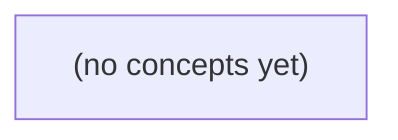

# 09.05 数据访问与迁移：Go 应用的持久历史、事务与证据

*面向已学习应用层与数据库基础的 Go 初学者，以虚构即时通信的发送和历史读取为主线，建立从受信身份、数据访问接口到事务、迁移与验证证据的完整心智模型。课程并排比较教学 SQL 方案与固定 OpenIM 源码中可证实的异步写入边界，明确哪些结论已知、哪些仍未知。*

**章节:** 2

---

## 本书导览

- 了解整本书的章节脉络
- 掌握各章之间的概念依赖关系
- 选择最合适的阅读顺序

# 09.05 数据访问与迁移：Go 应用的持久历史、事务与证据

面向已学习应用层与数据库基础的 Go 初学者，以虚构即时通信的发送和历史读取为主线，建立从受信身份、数据访问接口到事务、迁移与验证证据的完整心智模型。课程并排比较教学 SQL 方案与固定 OpenIM 源码中可证实的异步写入边界，明确哪些结论已知、哪些仍未知。

下方的概念图展示了本书 0 个核心概念以及它们之间的依赖关系；再下方是 1 个章节的入口。你可以按从上到下的顺序阅读，也可以根据自己的兴趣或先验知识选择切入点。

#### 概念图



## 章节索引

- **09.05 数据访问与迁移：让IM历史查询和消息提交有清楚边界** — 面向Go初学者承接应用用例、关系模型、SQL、Go数据访问和事务，以虚构IM发送/历史查询讲应用与数据访问职责、权限、参数、资源、提交未知、模式迁移和分层验证；仅用固定OpenIM源码已查看的MsgToMQ与Mongo消费者调用说明上游异步边界，不将教学SQL事务说成上游实现。

## 09.05 数据访问与迁移：让IM历史查询和消息提交有清楚边界

- 给发送与历史查询定义业务合同和确认点
- 区分handler、应用用例和数据访问层职责
- 用受信主体和参数读取有界历史页
- 为发送写入定义同一事务和并发冲突条件
- 分类冲突、无权限、无行与提交未知
- 设计可兼容的昵称快照迁移
- 按证据层次审查虚构测试数据和CI记录
- 对照固定OpenIM发送入队与Mongo消费源码的有限事实

以虚构IM的发送与历史查询为线索，划清请求确认、事务提交、异步送达及数据访问职责的边界。

### 双用例的业务合同与确认边界

### 双用例的业务合同与确认边界

以用户 `u-a` 在会话 `c-a` 中发送消息 `m-a` 为例，系统先把“客户端看见成功”与“对方设备已经收到”分开定义。

- **发送消息合同**  
  输入至少包括：已认证主体、`c-a`、客户端生成的幂等键、消息内容及可选回复目标。  
  前置条件是：主体属于 `c-a`，未被禁言，内容通过校验；不能仅因知道会话标识就允许写入。  
  输出为 `m-a` 的服务端标识、创建时间、初始状态，以及本次请求的确认等级。

  1. **请求响应确认**：服务端已完成参数与授权检查，并向 A 返回响应；此时不代表消息已持久化，更不代表 B 已收到。  
  2. **事务提交确认**：插入消息、写入必要的会话索引或发件箱记录的事务已提交。只有到此点，才可承诺 `m-a` 可被后续历史查询读到。  
  3. **设备送达确认**：B 的某台设备确认接收或同步到 `m-a`。它由异步投递回执更新，不能放入 A 的同步写事务中等待。

- **查询历史合同**  
  输入为已认证主体、`c-a`、分页游标与页大小；前置条件是主体有读取该会话的权限。输出是按稳定顺序排列的消息页、下一页游标及必要的消息状态。查询只读取**已提交**数据：A 收到“请求已受理”但事务尚未提交时，历史接口不应承诺能查到 `m-a`。

因此，教学 SQL 的提交点应明确落在消息及相关记录写入成功之后：`BEGIN` → 授权与写入 → `COMMIT`。B 的送达状态属于提交后的异步事实，而非发送接口成功的前提。

### 分层职责与受信参数读取

### 分层职责与受信参数读取

以用户 `u-a` 在会话 `c-a` 查询消息 `m-a` 所在历史为例，接口不应把“能否查询、怎样分页、如何读库”混在一个处理器中。分层的关键是：上层解析不可信输入，下层只接收已具备业务含义的受信参数。

- **处理器层**负责协议边界：从认证上下文取得当前身份，而非相信请求中的 `user_id`；解析 `conversation_id`、游标与 `page_size`；处理格式错误、缺失字段和页大小上限，并把结果编码为响应。
- **应用用例层**负责业务边界：确认 `u-a` 是否仍是 `c-a` 的成员，规定排序方向、游标语义和“无更多数据”的结果。它不关心 HTTP、JSON 或具体 SQL。
- **数据访问层**负责持久化边界：执行成员资格查询与消息分页查询，绑定参数、映射记录；不根据客户端传来的身份自行推断授权规则。

因此，历史查询的输入应逐步收紧：

\[
(\text{认证身份},\ \text{会话标识},\ \text{游标},\ \text{页大小})
\rightarrow
(\text{已验证成员},\ \text{规范化分页条件})
\]

`page_size` 先被限制为正数，并截断到服务端最大值，例如 `min(page_size, 100)`；游标应是服务端定义的消息排序位置，如 `(created_at, message_id)`，而不是客户端任意拼接的 SQL 条件。若游标非法，处理器或用例返回参数错误；若 `u-a` 不是 `c-a` 成员，用例返回无权访问；只有这些条件成立，数据访问层才执行类似：

`WHERE conversation_id = ? AND (created_at, id) < (?, ?) ORDER BY created_at DESC, id DESC LIMIT ?`

这样，身份来自认证，成员资格由用例判定，游标与页大小在进入 SQL 前已规范化，数据库访问层无需承担协议解析或授权猜测。

### 发送写入的事务与并发条件

### 发送写入的事务与并发条件

用户 `u-a` 在会话 `c-a` 中发送消息 `m-a` 时，写路径不能只做一条 `INSERT`。教学上应将“消息已被系统接受”的边界定义为：同一 SQL 事务成功提交，消息记录、会话状态与相关索引可共同被后续历史查询看见。

客户端应携带稳定的幂等键，例如 `(sender_id, client_message_id)`。事务可按如下顺序组织：

1. 锁定会话行，确认 `c-a` 存在、`u-a` 仍是成员且有发送权限。
2. 为 `m-a` 分配会话内序号 `seq`，写入消息表。
3. 更新会话的 `last_seq`、`last_message_at` 等摘要状态。
4. 提交事务；提交成功后，才向 A 返回“已接受”。

可用唯一约束承担重复请求的最终判定：

`UNIQUE(sender_id, client_message_id)`  
`UNIQUE(conversation_id, seq)`

历史查询通常依赖 `(conversation_id, seq DESC)` 索引，以便按会话和游标分页读取；写入时维护的 `seq` 也使查询顺序不依赖时间戳精度。

并发发送的关键是序号竞争。若两个请求同时读取同一个 `last_seq` 而不加锁，可能都尝试写入相同 `seq`。因此应使用行锁、原子递增更新，或由数据库序列化该会话的状态更新；唯一约束只是最后一道防线，冲突后仍需重试或重新读取状态。

约束失败，例如非成员发送、内容为空、幂等键复用但载荷不同，应回滚并返回明确的业务错误。更棘手的是“提交未知”：应用在提交后连接中断，无法判断数据库是否已提交。此时不能盲目再次创建消息，而应以幂等键查询：找到既有 `m-a` 即返回原结果；未找到才安全重试。

事务提交只表示 A 的请求已持久化，不表示 B 的设备已送达。送达状态、推送任务和回执应在提交后异步处理，不能混入此写事务的成功语义。

### 历史页查询与错误分类

### 历史页查询与错误分类

受信主体 `u-a` 读取会话 `c-a` 时，应用层不应直接暴露“查消息表”的能力，而应先确认：`u-a` 是否仍是 `c-a` 的成员。授权成功后，再按稳定顺序读取有限数量的历史消息。

推荐使用游标分页，而不是 `OFFSET`。消息持续写入时，`OFFSET` 容易因新增记录导致重复或漏读；游标可采用 `(created_at, message_id)`，并固定按时间倒序、标识倒序：

`WHERE conversation_id = ? AND (created_at, message_id) < (?, ?) ORDER BY created_at DESC, message_id DESC LIMIT ?`

首页没有游标；后续页携带上一页最后一条消息的时间与标识。应用层应限制 `limit`，例如仅允许 `1..100`，并返回“是否可能还有下一页”及下一页游标。不要把数据库内部自增序号、任意 SQL 条件直接交给客户端。

查询通常可分两步：

1. 查询 `conversation_members`，验证 `u-a` 对 `c-a` 的读取权限；
2. 查询该会话的消息页，并将数据库行映射为历史消息 DTO。

错误必须保留语义边界：

- **参数错误**：`c-a` 格式非法、游标无法解析、页大小越界；返回客户端可修正的请求错误。
- **无权限**：会话存在但 `u-a` 不是成员，或成员资格已失效；返回拒绝访问，不能借此泄露成员列表。
- **无行**：已授权但该页没有消息；这是正常结果，应返回空列表，而非错误。
- **冲突**：游标对应的排序规则或会话上下文不一致，例如把 `c-a` 的游标用于另一会话；返回冲突或失效游标错误。
- **基础设施失败**：连接池耗尽、超时、数据库不可用、扫描失败；记录原因并映射为可重试的服务失败，不把驱动错误原文返回客户端。

“无权限”和“无行”尤其不能混淆：前者是授权决策，后者是已授权范围内的正常查询结果。

### 昵称快照迁移与证据审查

### 昵称快照迁移与证据审查

消息中的昵称快照用于保留“发送当时的展示身份”：`m-a` 发送后，即使 `u-a` 改名，历史记录仍可显示旧昵称。为既有消息补充 `sender_nickname` 时，常见两种策略：

| 策略 | 做法 | 优点 | 风险与适用条件 |
|---|---|---|---|
| 兼容性迁移 | 新字段允许为空；新写入同时写昵称快照；读取时为空则回退查询用户资料 | 可渐进发布、易回滚，不必长时间锁表 | 同一历史页可能混合“快照昵称”和“当前昵称”；需明确回退语义 |
| 一次性改写 | 迁移任务扫描历史消息，按用户资料回填昵称；完成后将字段设为非空 | 查询模型统一，读取无需回退 | 回填的是“迁移时昵称”，未必是“发送时昵称”；大表改写、失败恢复和重跑成本高 |

对 IM 而言，若系统此前未保存发送时昵称，则无法从当前 `users.nickname` 可靠推导历史真值。因而兼容性迁移通常更诚实：只保证迁移后发送的消息具有快照；旧消息标记为“缺少历史快照”，或采用明确的当前资料回退展示。

审查证据应分层进行：

1. **迁移与查询测试**：构造 `u-a/c-a/m-a`，验证新消息写入昵称；用户改名后，`m-a` 历史查询仍返回原昵称；旧消息为空时触发预期回退。
2. **事务证据**：发送接口只有在消息行与快照字段写入事务提交后，才向 A 返回“已接受”。测试应覆盖提交失败时不得产生成功响应。
3. **异步边界证据**：A 收到响应不等于 B 设备送达；B 的送达状态只能由后续投递链路更新，不能由昵称迁移测试替代。
4. **CI 记录**：保存迁移版本、测试命令、失败重试结果及数据库模式检查；静态课程中的记录仅证明脚本和断言被执行，不证明真实服务已运行。

关于 OpenIM，只能依据可核查源码说明：其发送路径可将消息提交到后续队列或任务链路，Mongo 消费端再异步持久化或处理消息。若未定位到具体版本、函数调用与配置，不应断言“已入队”或“Mongo 已消费”；这些应标为待源码与运行日志共同确认的事实。

> **要点** — 业务确认不等于设备送达；以授权、事务边界、错误语义和可审查迁移构成可靠数据访问合同。

本节以IM历史查询与消息提交为例，划清Handler、应用服务和数据访问层的责任边界，并用接口合同表达权限、一致性与事务承诺。

### 从用例合同而非数据表开始

### 从用例合同而非数据表开始

不要先看到 `messages`、`conversations` 两张表，就分别抽象出“消息仓储”“会话仓储”。数据表描述存储结构，用例合同才描述系统承诺。对 IM 而言，至少应先写清两个能力：**读取当前用户可见的历史**，以及**提交一条消息**。

可见历史读取的合同应包含：

- 输入：会话标识、游标或时间范围、分页大小、已认证用户身份。
- 授权条件：用户在读取时对该会话仍具备成员资格，或满足其他可见性策略。
- 确认点：成员资格判断与消息查询必须处于同一一致性边界；若先单独鉴权、后查询，成员关系可能在两步之间变化，不能宣称“强一致可见”。
- 结果分类：成功页、会话不存在或不可见、游标非法、存储故障。对外通常可将“不存在”和“不可见”统一，避免泄露会话存在性。

```go
type HistoryReader interface {
    ReadVisibleHistory(ctx context.Context, userID, conversationID string,
        cursor string, limit int) (HistoryPage, error)
}
```

提交消息的合同则要明确“何时算已提交”：输入包括发送者、会话、客户端请求标识和正文；服务确认发送者可发言、内容合法，并在事务内写入消息及必要的会话序号、未读状态或发件箱事件。只有事务提交成功后，才能返回消息标识与确认序号。

```go
type MessageSubmitter interface {
    Submit(ctx context.Context, cmd SubmitMessage) (SubmittedMessage, error)
}
```

这里的接口按能力命名，而非暴露 `InsertMessage`、`FindMember` 等表操作。前者把授权、查询一致性和写入原子性纳入合同；后者会迫使应用服务拼装底层步骤，既扩大泄漏面，也容易制造 TOCTOU 漏洞。

### 三层职责与受信身份传递

### 三层职责与受信身份传递

以“查询会话历史消息”为例，三层的边界不应按代码文件划分，而应按**谁对什么事实负责**划分。

- **Handler**：处理传输协议事实。它解析 `conversation_id`、分页游标和条数，校验格式、范围与必填项；再从认证中间件注入的上下文取得受信身份，如 `actorID`。Handler 不应相信客户端提交的 `user_id`，更不应自行查询成员关系或拼接数据库条件。
- **应用服务**：处理业务事实。它决定“该用户能否查看该会话”“不可见时返回未授权还是伪装为不存在”“游标是否属于当前会话”，并将结果组织为稳定的用例返回值。应用服务表达的是能力，例如“读取我可见的历史”，而非“查消息表”。
- **数据访问层**：处理持久化事实。它执行 SQL、驱动调用、扫描记录、管理事务句柄，并把唯一键冲突、超时、连接失败等底层错误转换为可识别的存储错误；它不解释 HTTP 状态码，也不决定用户是否有业务权限。

受信身份必须沿调用链显式传递，而不是由仓储层从全局上下文猜测：

`Handler → ReadHistory(ctx, actorID, conversationID, page) → Store`

这样，审计、测试和权限推理都能明确回答：谁发起了操作、服务做了什么授权判断、存储层执行了什么查询。若身份尚未经过认证验证，它只是请求字段，不是可用于授权的身份。

### 有界历史页与一致性边界

### 有界历史页与一致性边界

历史查询不是“先查成员资格，再查消息”的简单拼接。若成员资格检查与消息读取分属两个独立操作，二者之间用户可能被移出会话、会话可能被封禁，便出现典型的检查后使用（TOCTOU）窗口：服务曾确认“可读”，却在权限已变化后返回消息。此时不能宣称查询具有强一致授权保证。

因此，应从用例直接定义一个有界能力：`ReadVisibleHistory`。它接收已认证的用户、会话标识、游标与受限页大小，并在同一授权一致性边界内完成“仍是成员”和“读取可见消息”：

```go
type HistoryStore interface {
    ReadVisibleHistory(
        ctx context.Context,
        viewerID UserID,
        conversationID ConversationID,
        before MessageCursor,
        limit int,
    ) (HistoryPage, error)
}
```

`HistoryPage` 应返回消息序列、是否还有更多数据，以及下一页游标。游标应基于稳定排序键，例如 `(created_at, message_id)`；仅使用时间戳会在并发写入或同一时刻多条消息时造成重复、漏读或顺序漂移。`limit` 由应用服务限制在合理区间，例如 $1\le limit\le100$，而非将客户端输入原样交给数据库。

这里的“一致性边界”不必总等同于长事务。数据访问层可用单条带成员条件的查询、数据库快照事务，或受版本条件保护的查询实现；关键是接口合同明确承诺：返回的每条消息均在该次读取所采用的授权视图下对 `viewerID` 可见。若底层只能做到“检查时允许、读取时可能变化”，则接口与文档应降级表述为弱保证，而不能以两个仓储调用伪装原子授权。

### 消息提交的事务合同与小接口

### 消息提交的事务合同与小接口

提交消息不是“向 `messages` 表插一行”，而是一个原子用例：确认发送者仍是会话成员、处理客户端幂等键、写入消息及必要的会话游标，并返回可供客户端确认的结果。接口应直接表达这一能力，而非为每张表定义泛化仓储。

可将事务执行抽象为很小的边界：`type TxRunner interface { WithinTx(ctx context.Context, fn func(ctx context.Context, tx MessageWriter) error) error }`。其中 `MessageWriter` 只暴露提交所需操作，例如：`Submit(ctx context.Context, in SubmitInput) (SubmitResult, error)`；实现内部可在同一事务中完成成员校验、幂等记录查询、消息写入与版本更新。

`SubmitResult` 应区分三类成功语义：首次写入返回新消息 ID 与服务端序号；命中相同幂等键时返回既有结果；会话版本或成员状态已变化时返回可识别的并发冲突。后者不是普通数据库错误，而是应用层可决定重试、刷新会话或拒绝提交的业务结果。

尤其要表达“提交未知”。若数据库已执行 `COMMIT`，但网络中断导致驱动未返回确认，服务不能声称失败，也不能安全盲目重试。可定义 `ErrCommitUnknown`：调用方随后以幂等键查询提交结果；数据访问层保证该键在同一会话内唯一。这样，事务边界、冲突检测与不确定提交都成为接口合同的一部分，而不是泄漏给 Handler 的驱动细节。

### 错误映射与边界验证

### 错误映射与边界验证

应用服务不应把数据库驱动错误、`context` 取消或队列客户端异常直接泄漏给 Handler，而应将其归并为稳定、可测试的业务结果。关键不是“隐藏错误”，而是让调用方能够据此决定返回何种状态、是否重试，以及是否必须人工介入。

可定义面向用例的结果类型：

```go
type SubmitResult struct {
    MessageID string
    State     string // accepted、duplicate
}

var (
    ErrInvalidArgument = errors.New("参数无效")
    ErrForbidden       = errors.New("无权访问会话")
    ErrNotFound        = errors.New("会话或消息不存在")
    ErrConflict        = errors.New("版本或唯一性冲突")
    ErrCommitUnknown   = errors.New("提交结果未知")
)
```

典型映射应保持明确：

- 参数格式、长度、分页游标非法：`ErrInvalidArgument`；
- 成员关系不存在或不可见：`ErrForbidden`。若业务需要隐藏资源存在性，也可统一映射为“不可访问”；
- 已确认无对应行：`ErrNotFound`；
- 乐观锁版本不匹配、消息幂等键唯一性冲突：`ErrConflict`，其中幂等冲突可进一步返回既有 `MessageID` 与 `duplicate` 状态；
- 事务提交时连接中断、超时，且无法确定提交是否已落库：`ErrCommitUnknown`。它不能被草率改写为“提交失败”，客户端应携带幂等键查询或重试。

边界验证应分层进行。应用服务测试用假实现验证：无成员时绝不调用历史查询；唯一性冲突时返回可恢复的幂等结果；提交未知时不承诺消息未写入。数据访问层集成测试验证实际驱动对“无行”、唯一约束和事务提交异常的转换。Handler 测试只验证业务结果到协议状态的映射，例如参数错误对应 `400`、无权对应 `403`、冲突对应 `409`、提交未知对应可重试的 `503`。

尤其不要因“已调用异步发布接口”就返回“消息已投递”。若合同仅保证数据库事务已提交，应表述为“已接受”或“待投递”；投递成功、消费完成等事实必须由后续状态查询或可靠事件机制证明。

> **要点** — 以用例合同组织分层接口：授权与读取同界、写入与事务同述，并显式区分可恢复错误和提交未知。

历史查询不是“按用户传参查消息”，而是以服务端受信身份、成员资格和游标边界共同限定的数据访问合同。

### 先定义历史页的业务合同

### 先定义历史页的业务合同

历史页查询的合同应先于 SQL 或 MongoDB 实现确定。以“用户 `u-a` 读取会话 `c-a`，上一页末序号为 `2`”为例，服务端真正接受的输入不是任意 `userId`，而是：

- 受认证中间件确认的主体：`subject = u-a`；
- 路径或请求中的会话标识：`conversationId = c-a`；
- 可选游标：`beforeSeq = 2`；
- 服务端限定的页大小：`limit`，例如最大不超过 `50`。

这里的 `subject` 必须来自会话令牌、签名凭证或服务端上下文，不能相信请求体中的“我是 `u-a`”。请求体中的用户标识即使存在，也只能用于与受信主体比对，不能作为授权依据。

查询语义可写成：

$$
\text{返回 } c\text{-}a \text{ 中，序号 } seq < 2 \text{ 的消息，按 } seq \text{ 倒序，最多 } limit \text{ 条}
$$

因此返回结果的顺序是：

```text
seq = 1
```

若游标为 `beforeSeq = 20`，则典型结果是 `19, 18, 17, ...`。倒序返回使客户端可以直接在“已有消息列表顶部”继续追加更旧消息；若界面需要正序展示，应在客户端明确反转，或由接口另行约定，不能让排序语义含糊。

确认边界也必须清楚：

1. 服务端先确认 `u-a` 对 `c-a` 具有读取资格；
2. 再以会话标识、游标和页大小共同限定消息范围；
3. 仅返回展示历史页所需字段，如 `seq`、消息内容、发送时间、发送者摘要；
4. 无更多历史消息时返回空列表，并可附带 `hasMore = false`。

“当前是成员”与“有权读取历史”并不天然等价。前者是当前成员快照规则；后者可能要求用户在消息产生时已是成员，或允许后来加入者读取全部历史。该策略属于业务合同，必须在查询条件和数据模型中被显式表达，而不是由“查到了消息”倒推出授权。

### 受信主体与历史资格分离

### 受信主体与历史资格分离

历史查询的第一条边界是：`subject` 必须来自服务端已验证的认证上下文，而不能来自请求体、查询参数或路径变量。客户端可以声明“我要查看用户 `u-a` 的历史”，但这只是未受信输入；真正参与授权的主体应是令牌、会话或中间件解析出的当前登录用户：

`subject = authContext.Subject`

否则，攻击者只需把请求中的 `user_id` 改为其他用户，即可能越权读取其会话、成员关系或消息历史。

不过，“当前是否成员”与“是否有资格读取历史”不是同一个规则。前者通常读取成员表的当前快照，例如：

- 当前存在有效成员记录：允许访问该会话；
- 已退出、被移除或被封禁：拒绝访问；
- 成员记录中的角色决定其当前操作权限。

这种规则适合发送消息、修改会话设置等实时操作，因为这些操作必须服从当前成员状态。

但历史查询常需要单独定义资格策略。设用户 `u-a` 曾在会话 `c-a` 中参与，之后退出；系统可能选择：

- **严格当前成员策略**：退出后完全不可查询；
- **参与期间可回看策略**：只能读取其加入至退出期间的消息；
- **保留历史策略**：退出后仍可读取曾参与会话的全部或部分历史；
- **合规删除策略**：即使曾是成员，也因账户删除、封禁或数据保留期而拒绝。

因此，不能仅写成“查到成员记录就返回消息”。更准确的授权判断是：

`允许查询 = 受信 subject + 会话关系 + 历史资格策略 + 游标范围`

其中，当前成员快照回答“此刻是不是成员”，历史资格策略回答“对过去的数据可见到什么范围”。两者混用会导致语义漂移：例如把退出用户一律拒绝，可能违背产品承诺；把曾加入过的用户一律放行，又可能泄露其加入前或退出后的消息。

历史资格的结论应在查询消息前确定，并将可见时间窗、最大页大小等约束固化到服务端。客户端只能提供游标和期望页大小，不能自行指定读取主体、可见起止时间或绕过成员资格。

### 用参数化SQL限定读取范围

### 用参数化 SQL 限定读取范围

历史读取应把“谁在读、读哪个会话、从哪里往前读、最多读多少条”拆成受控参数，而不是拼接请求中的字符串。以已认证身份得到的 `subject` 为 `$1`，目标会话为 `$2`，上一页最小序号 `seq=2` 为 `$3`，可建立如下教学模型：

`SELECT m.seq, m.sender_subject, m.body, m.created_at FROM messages m JOIN conversation_members cm ON cm.conversation_id = m.conversation_id WHERE cm.subject = $1 AND m.conversation_id = $2 AND m.seq < $3 ORDER BY m.seq DESC LIMIT 50`

其中：

- `$1` 必须来自服务端认证上下文，例如令牌校验后的 `subject`；绝不能信任请求体中的“用户标识”。
- `$2` 是已校验格式的会话标识；成员连接条件使查询先受当前成员资格约束。
- `$3` 是客户端提交的游标边界，不是偏移量。首屏可使用一个足够大的初始边界，后续以本页最后一条消息的 `seq` 继续查询。
- `ORDER BY seq DESC LIMIT 50` 令结果稳定、有界，并避免大偏移量分页的扫描成本。返回给客户端后可按需要反转为正序展示。
- `LIMIT` 应由服务端固定或夹紧到上限，不能直接接受无限制的请求值。

在 Go 中应使用 `QueryContext(ctx, sql, subject, conversationID, beforeSeq)`，遍历结束后调用 `rows.Close()`，并检查 `rows.Err()`；可空快照字段要用 `sql.NullString` 等类型显式处理。读取接口只选择展示所需字段，不应顺带返回内部审核状态、删除标记或成员关系细节。

### 把资源、空值与返回字段纳入合同

### 把资源、空值与返回字段纳入合同

一次历史查询的合同不仅包含“查哪些行”，还应明确资源如何释放、空值如何表达，以及接口究竟承诺哪些字段。

`database/sql` 中，获得 `Rows` 后应立即安排关闭；即使已读到所需的 `LIMIT` 条记录，也不能依赖垃圾回收归还连接：

```go
rows, err := db.QueryContext(ctx, q, subject, beforeSeq, limit)
if err != nil { /* 映射为应用错误 */ }
defer rows.Close()

for rows.Next() {
    // Scan 并构造响应项
}
if err := rows.Err(); err != nil {
    // 迭代中发生的网络、解码或驱动错误
}
```

`Rows.Close()` 释放游标及其占用的连接；`Rows.Err()` 则补足 `Next()` 停止时未必直接暴露的迭代错误。空结果不是异常：当筛选范围内没有消息时，返回空列表即可，而不是把“没有历史”误报为数据库故障。

昵称快照等可空列不能直接扫描到不可空字符串。应使用 `sql.NullString`，或在 SQL 中以 `COALESCE` 明确默认值；前者更能保留“当时未设置昵称”与“昵称恰好为空”的语义差异。接口可将其规范化为可选字段，例如仅在 `Valid` 时输出 `sender_name`。

返回对象应最小化，只暴露客户端渲染和继续翻页所需的内容：`seq`、消息标识、发送者展示快照、正文、发送时间。不要顺手返回成员内部状态、删除标记、审核字段、数据库主键、查询条件或游标实现细节。SQL 的列选择、`NULL` 表达和分页实现属于存储层；对外稳定承诺应是经过应用层转换后的消息视图。

### 对照Mongo游标边界与引用事实

### 对照 Mongo 游标边界与引用事实

MongoDB 的历史查询同样必须先固定服务端受信身份，再把会话、成员资格与分页游标编入查询边界。典型访问链为：

`Client → Database → Collection → Find(...) → Cursor → Decode(...)`

例如，服务端已验证用户为 `u-a`，并已确认其当前具备会话 `c-a` 的访问资格；查询“早于 `seq=2` 的消息”时，过滤条件应由服务端构造，而非直接采用请求体中的用户标识：

`Filter = {conversationId: "c-a", seq: {$lt: 2}}`

再配合：

- `Sort = {seq: -1}`：按序号倒序，优先返回较新的历史消息；
- `Limit = N`：限制单次扫描与返回规模；
- 必要时仅投影 `seq`、`senderId`、`content`、`createdAt` 等客户端确需字段，避免把内部审核状态、成员快照等一并暴露。

关系数据库中的 `ORDER BY seq DESC LIMIT $n`，在 MongoDB 中对应“有界 `Filter + Sort + Limit`”。两者的关键都不是语法，而是边界：游标条件必须稳定、排序字段必须确定、单页结果必须有限。

`Find` 返回的 `Cursor` 不是结果数组。迭代结束后应关闭游标，并检查错误；提前退出也要释放资源。可将流程理解为：

1. 用受信身份完成资格校验；
2. 执行带过滤、排序和上限的查询；
3. 逐条解码最小必要字段；
4. `Close` 游标；
5. 检查迭代期间错误。

还需警惕“引用”的误解。即使消息文档保存了 `conversationId`、`senderId`，MongoDB 也不会自动验证这些值确实指向存在的会话或用户，更不会自动阻止删除被引用的成员。引用只是数据中的事实声明，不是外键约束。会话归属、成员资格、删除策略与写入一致性，仍须由服务层规则、事务能力或额外校验显式维护。

> **要点** — 历史页安全性来自受信身份、资格策略、游标排序、参数绑定和资源收束；示例SQL仅为教学模型。

以用户 u-a 向会话发送 m-a 为例，明确“可确认的数据库提交”与“设备送达”的边界，并把校验、授权、事务和未知结果放入各自职责层。

### 先定义发送合同与确认点

### 先定义发送合同与确认点

以用户 `u-a` 向会话发送消息 `m-a` 为例，发送接口首先应定义一个稳定的“写入合同”，而不是含糊地承诺“消息已发出”。

请求至少携带：

- `conversation_id`：目标会话；
- `message_id`：客户端生成的消息身份，用于幂等；
- `sender_id`：通常从认证上下文取得，不信任请求体伪造值；
- `content`、`content_type`、客户端时间等业务字段。

输入校验应明确按 UTF-8 **字节数**限制内容，而非按字符数限制；同时校验消息身份格式、内容类型、空消息规则及字段组合。随后必须确认 `u-a` 当前是该会话成员，并具备发言权限。

本节将“发送成功”定义为：消息、其会话内 `seq`、以及会话摘要（如最后消息、最后活跃时间）已经在同一数据库事务中成功提交。可抽象为：

\[
\text{accepted}(m\text{-}a) \iff \text{Tx Commit 已知成功}
\]

成功响应应返回可观察的持久化结果，例如 `message_id`、`conversation_id`、分配后的 `seq`、服务端接受时间。`seq` 是会话历史查询与顺序展示的依据，不应由客户端指定。

这个确认点**不等于设备送达**，更不等于对方已读。推送、长连接投递、离线同步和回执属于后续异步路径；即使设备暂时离线，数据库提交仍可成功。反过来，服务端也不能因已尝试推送就声称消息已可靠写入。

若提交附近发生断网，服务端或客户端可能得到“结果未知”。此时不能盲目更换 `message_id` 重试，否则可能产生第二条消息；应以原 `message_id` 重试或查询其最终状态。

### 分层处理校验、授权与参数

### 分层处理校验、授权与参数

以 `u-a` 向会话提交消息 `m-a` 为例，入口处理器不应把所有规则塞进一段“插入消息”代码，而应按规则性质分层：先判断请求是否可解析，再判断谁有权做什么，最后由数据库守住并发下仍必须成立的不变量。

- **处理器层：语法与传输边界。**负责认证令牌解析、请求字段是否存在、类型是否正确，以及按 **UTF-8 字节数**限制消息正文，而非按字符数限制。例如数据库列上限为 `4096` 字节时，应检查 `len([]byte(text)) <= 4096`；一个汉字或 emoji 可能占多个字节。此层还应拒绝空消息标识、非法编码、过大的附件参数等可在访问数据库前确定的问题，返回“参数无效”。

- **应用用例层：身份与业务授权。**用例接收已规范化的 `senderID`、`conversationID`、`messageID` 与正文，校验消息身份的语义：`messageID` 是否符合允许格式、是否属于当前发送方的幂等键空间、客户端时间是否可接受等。随后声明业务动作：`u-a` 必须是该会话当前有效成员，且未被禁言、未退出。这里的成员检查表达“为什么允许发送”，而不是单纯查询一行记录。

- **数据访问层：持久化约束与原子执行。**数据访问层接收明确参数，不接收原始 HTTP 请求。它在同一事务中完成成员状态确认、序号分配、消息写入和会话摘要更新；并通过外键、唯一键、检查约束等兜底。例如 `(conversation_id, message_id)` 的唯一约束防止重复写入，成员外键防止写入不存在的主体。对“退群与发消息”这类并发操作，应在事务内锁定或条件更新成员状态，使检查与写入遵循同一受控顺序。

因此，应用层的成员检查提供可读的授权语义，数据库约束提供最终一致的防线；两者不是重复，而是分别应对正常路径与并发、绕过、实现缺陷等异常路径。

### 用同一事务固化消息与摘要

### 用同一事务固化消息与摘要

发送 `m-a` 时，`seq` 分配、消息行写入与会话摘要更新必须处于同一 SQL 事务：三者要么同时可见，要么同时回滚。否则可能出现“摘要显示最新消息、历史却查不到”，或消息已存在但会话列表仍停在旧摘要的撕裂状态。

典型顺序如下：

1. 校验 `m-a` 的身份格式、UTF-8 字节长度及必要字段。
2. 在事务内确认 `u-a` 仍是会话成员，并对会话或成员关系取得约定的并发控制锁。
3. 从会话的序号状态分配下一个 `seq`，例如通过受保护的计数器更新获得唯一递增值。
4. 写入消息表：`conversation_id`、`seq`、`message_id`、发送者、正文、服务端时间等。
5. 更新会话摘要：最新 `seq`、最新消息预览、最新发送时间、未读计数依据等。
6. `COMMIT` 成功后，才将“消息已确认提交”返回给上游。

可将关键约束理解为：

\[
\text{已提交消息} \Longleftrightarrow
\text{历史记录存在} \land \text{摘要指向该消息}
\]

退群与发送尤其不能各自无序执行。若退群操作先提交，随后开始的发送必须因成员检查失败而拒绝；若发送已在受控顺序中先取得成员关系/会话锁并提交，退群只能排在其后。实现可采用对成员行加锁、对会话版本做条件更新，或使用串行化隔离；关键不是某一种 SQL 语法，而是让“是否仍为成员”的判断与消息提交落在同一并发顺序内。

提交连接断开时，结果可能未知。此时不能直接更换 `message_id` 重试，否则可能形成两条不同消息。应以原 `message_id` 查询或幂等重放确认：若已存在则返回既有提交结果；若确定未提交才重新执行。设备送达、推送与回执属于提交后的异步路径，不应混入该事务。

### 分类失败与提交未知结果

### 分类失败与提交未知结果

消息提交失败不能只返回“发送失败”。不同错误对应不同的客户端动作、告警级别与重试策略：

| 类别 | 典型原因 | 是否可重试 | 正确处理 |
|---|---|---:|---|
| 输入非法 | `message_id` 格式不合法、正文超过 UTF-8 字节上限、字段缺失 | 否 | 返回参数错误；客户端修正内容后重新提交 |
| 无权限 | 发送者已退群、不是成员、被禁言 | 否（当前状态下） | 返回授权错误；刷新会话或成员状态 |
| 外键冲突 | 会话、成员记录不存在，或引用对象已删除 | 通常否 | 视为状态过期；重新拉取会话信息 |
| 重复键 | 同一 `message_id` 已写入 | 不应生成新 ID | 查询既有消息；若归属、内容摘要一致，返回幂等成功 |
| 数据库不可用 | 连接池耗尽、主库故障、超时且尚未执行提交 | 可延迟重试 | 保留原 `message_id`，指数退避重试 |
| 提交结果未知 | `COMMIT` 发出后连接断开、响应超时 | 不可盲目重试 | 以原 `message_id` 查询确认提交状态 |

最危险的是 `COMMIT` 附近断网：应用不知道事务究竟回滚，还是数据库已经持久化成功。此时若客户端“换一个消息 ID 再发”，可能产生两条内容相同但身份不同的消息，破坏幂等语义与会话顺序。

因此，`message_id` 必须由调用方稳定保存。遇到未知结果时，服务端应按该 ID 查询消息记录：存在则确认“已提交”；不存在且能确认事务未提交时才允许重试；仍无法确认时返回“提交状态未知”，由后台恢复任务或客户端携带原 ID 再次查询。这里确认的是数据库事务提交，不等价于设备已收到消息；设备送达、离线推送和已读回执属于后续异步链路。

### 从提交确认延伸到异步边界

### 从提交确认延伸到异步边界

教学中的“提交成功”应严格指向：消息、序号、会话摘要等必要状态已在同一数据库事务中 `COMMIT`，并且调用方得到了可识别的成功结果。它解决的是**可查询、可去重、可恢复**，不等于接收方设备已经收到通知，更不等于消息已展示在界面上。

可将路径拆成两个边界：

1. **同步提交边界**：校验 UTF-8 字节数与 `m-a` 身份；确认 `u-a` 仍是成员；为会话分配受控的 `seq`；写入消息和摘要；事务提交。
2. **异步投递边界**：提交后的消息进入投递链路，由消息队列、消费者、在线推送或离线通知分别处理；这些步骤可重试、可延迟，也可能暂时不可达。

因此，接口回执宜表达“服务端已确认提交”，而不是承诺“对方已送达”。若 `COMMIT` 附近发生断网，服务端可能已提交而客户端未收到响应；此时客户端必须以同一 `m-a` 查询或重试，而不能生成新 ID 盲目重发，否则会制造逻辑重复。

对照固定 OpenIM 源码，只能确认其存在 `MsgToMQ` 入队以及 Mongo 消费消息的异步事实：入队与消费构成后续处理链路。不能据此反推它完整采用示例中的单库 SQL 事务、摘要表设计或严格相同的 `seq` 分配方式。教学事务用于说明一致性边界；上游实际实现则应以其队列、存储和消费者代码的具体失败语义为准。

> **要点** — 发送成功首先是可判定的事务提交；输入、授权、并发和未知提交必须分别建模，异步送达不可替代提交确认。

昵称既是当前资料，也是消息发送当时的历史事实。迁移设计必须避免用今天的名字伪造过去的快照。

### 先定义昵称字段的事实边界

### 先定义昵称字段的事实边界

昵称至少有三种语义，不能以同一个字段混用：

- **当前昵称**：来自用户资料，表示“此刻该用户叫什么”。它会随改名而变化，适合个人页、会话成员列表等当前态界面。
- **发送时昵称快照**：写入消息时复制的昵称，表示“这条消息发出时显示什么名字”。它属于消息历史事实，之后不应因改名而改写。
- **未知历史值**：旧消息产生时没有保存快照，系统不能知道当时昵称；`NULL` 应明确表示“未知”，而不是“等于当前昵称”。

消息写入合同应规定：新消息提交成功时，服务端从可信的当前资料来源读取昵称，并与消息内容在同一提交边界内写入 `sender_nickname_snapshot`。客户端提交的昵称只能作为展示建议，不能成为历史事实来源。

消息读取合同则应同时暴露来源，例如：

- `currentSenderNickname`：当前资料昵称；
- `sentNicknameSnapshot`：发送时快照，可为空；
- `nicknameDisplaySource`：`snapshot`、`current` 或 `unknown`。

当快照为空时，界面可以展示当前昵称以改善可读性，但必须标记其来源为 `current`；若当前资料也不可得，应展示“未知用户”或稳定身份标识。尤其不能在接口中把当前昵称填入 `sentNicknameSnapshot`，否则会把“今天的资料”伪造成“过去的事实”，使后续回填、核对和审计失去依据。

### 扩展优先：新增可空快照列

### 扩展优先：新增可空快照列

第一步只做**可逆的结构扩展**：为消息记录增加可空的“发送时昵称快照”列，例如 `sender_nickname_snapshot`。旧行该列为 `NULL`，其语义不是“发送者没有昵称”，而是“历史上未采集到发送时昵称，当前无法证明其值”。

可空设计使新旧版本能够并存：

- **旧写入端**仍只写发送者标识、正文、时间等既有字段；新列保持空值，不应导致提交失败。
- **新写入端**在创建消息的同一业务边界内，读取可信的发送者昵称并写入快照；写入失败时应整体失败或明确降级为“快照未知”，不能事后以当前昵称冒充快照。
- **旧读取端**忽略新列，查询和渲染行为不变。
- **新读取端**需区分两种展示来源：快照存在时显示“发送时昵称”；快照为空时只能显示当前昵称或未知昵称，并将其标记为“当前资料回退”，不能宣称是历史事实。

因此，扩展阶段不要求立即回填，也不要求旧数据满足新约束。接口可以返回类似 `display_name`、`name_source`：前者供界面展示，后者明确值来自`历史快照`、`当前资料`或`未知`。只有当新代码已稳定写入、覆盖率经核对达到预期后，才考虑后续回填与收紧约束。

### 新写入与兼容读取的双轨期

### 新写入与兼容读取的双轨期

双轨期的目标不是立刻“补齐所有昵称”，而是保证**从迁移启用时起，新消息保存发送时事实；旧消息仍可被诚实读取**。

发送链路应在提交消息时，从可信主体读取昵称，例如已鉴权的发送者账户或服务端加载的成员资料，而不是相信客户端随消息提交的 `nickname`。写入规则可概括为：

- 发送者存在且昵称可用：同时写入 `sender_id` 与 `sender_nickname_snapshot`。
- 发送者存在但昵称暂缺：允许快照列为 `NULL`，并记录可观测的失败原因；不能阻断消息主流程时，应明确该消息的历史昵称未知。
- 匿名、系统消息或已删除主体：按消息类型写入专用显示名、系统标识，或保留未知状态，避免混用普通用户昵称。

查询侧必须区分显示值与来源。建议 API 返回类似语义：

- `displayName`：界面可展示的名称。
- `displayNameSource`：`发送时快照`、`当前资料`、`未知`。
- `snapshotName`：原始快照值，可为空。
- `currentName`：当前主体资料中的名称，可为空。

读取优先级为：快照存在则展示快照；快照缺失且当前主体可查时，可展示当前名，但来源必须标记为“当前资料”；两者都不可得则展示“未知用户”或产品定义的中性占位文案。尤其不能在快照写入失败后，把当前名包装成“发送时昵称”，否则用户改名、账号复用或资料修订都会篡改历史语义。

双轨期还应记录新写入覆盖率：`快照非空的新消息数 / 应写快照的新消息数`。覆盖率异常时优先修复发送链路，并保留回退窗口：应用可停止写新快照或回退到兼容读取，但不得删除已写入的真实快照。测试应使用虚构用户与虚构昵称，覆盖改名后查询、快照为空、主体删除、系统消息及写入失败等场景。

### 可信回填、覆盖率与收紧条件

### 可信回填、覆盖率与收紧条件

旧消息的昵称列为空并不等于“应当使用当前昵称”。回填前应先区分证据强度：只有能证明其代表发送时状态的来源，才可写入历史快照。

- **高可信来源**：消息事件日志、不可变审计记录、当时生成的通知载荷、已签名导出文件等，且可通过`message_id`、发送时间和发送者稳定关联。
- **中可信来源**：接近发送时间的资料版本历史；仅当版本时间满足`version_time ≤ sent_at`，并且不存在更近的缺失版本时使用。
- **低可信来源**：当前用户资料、近期缓存、搜索索引。它们只能用于展示“当前名”，不得回填为发送时昵称。

迁移应按可重试批次执行，例如按消息时间分片或`message_id`范围处理；每批记录候选数、成功回填数、无法判定数、冲突数及来源分布。回填必须幂等：仅更新快照为空的行，并保留`nickname_snapshot_source`、证据标识和回填时间，避免后续任务覆盖更强证据。

核心核对指标可定义为：

$$
\text{覆盖率}=\frac{\text{已具可信历史快照的旧消息数}}{\text{需处理旧消息总数}}
$$

同时观察来源质量：高可信覆盖率、冲突率、抽样核验错误率，以及读取接口中“未知历史昵称”的比例。测试数据应使用虚构用户和虚构昵称，覆盖改名、删号、日志缺失、重复执行与回退场景。

达到预设覆盖率并经过一个回退窗口后，才考虑收紧：新消息要求写入非空快照；旧消息仍允许空值，并明确输出“历史昵称未知”。若指标恶化，可停止回填并回退读取策略，但绝不能把当前名伪装成发送时名。确认旧逻辑不再被调用、未知比例稳定且回退窗口结束后，才清理兼容分支。

### 失败语义与证据分层审查

### 失败语义与证据分层审查

昵称回填的风险不在“空值存在”，而在于把不确定性伪装成确定历史。应将失败分层表达，而不是统一降级为当前昵称：

| 情形 | 可确认事实 | API 应输出 | 禁止行为 |
|---|---|---|---|
| 历史快照已写入 | 发送时昵称存在 | `发送时昵称`，来源为“快照” | 被当前资料覆盖 |
| 快照为空、可信审计可回填 | 审计记录能证明当时昵称 | 回填值，来源为“可信回填” | 用无时间依据的用户资料补齐 |
| 快照为空、仅有当前资料 | 只知道现在叫什么 | 当前昵称可单列展示，历史昵称为“未知” | 把当前昵称标记为发送时昵称 |
| 写入事务提交结果未知 | 不确定消息与快照是否共同持久化 | 返回“提交状态待确认”，允许幂等查询核对 | 直接重试并制造重复消息或伪造快照 |
| 回填任务部分失败 | 已处理批次与失败范围可追踪 | 暴露批次状态、覆盖率、失败原因 | 宣称全量完成 |

证据强度应明确排序：消息行内快照 > 同事务审计事件 > 可验证的历史归档 > 当前用户资料。前两类可以形成历史事实；当前资料只能解释“此刻显示什么”，不能证明“当时发送什么”。

测试数据同样必须标注证据边界。虚构用户、虚构昵称变更时间线可用于验证空值兼容、批次重跑、回退窗口和 API 字段行为，但不能被写成“生产旧数据已具备可靠来源”的依据。审查时至少核对：回填前后空值数量、各来源覆盖率、无法确认的行数、抽样证据链，以及回退期间新写入是否仍优先写入快照。只有当未知仍被诚实保留，迁移结果才具有可信度。

> **要点** — 昵称迁移应保留“未知”的诚实语义：先兼容扩展，再可信写入与回填，最后按可核对条件收紧。

本节以静态案例规划验证证据：既检查业务边界，也明确哪些结论尚未实际运行或无法由现有源码证明。

### 从业务合同拆分验证目标

### 从业务合同拆分验证目标

发送与历史查询应分别围绕“谁可做什么、成功后可观察到什么”设计证据，而非只检查接口返回 `200`。以下为静态案例规划，描述应补齐的测试，不宣称已运行或已由现有源码证明。

- **发送消息单元测试**：以成员 `u-a` 向会话 `c-a` 提交消息 `m-a`、正文长度恰为 10 字节为基线。证明输入校验通过后，持久化命令包含正确会话、发送者与正文长度；成功输出含消息标识及确认状态。非成员 `u-c` 发送必须被拒绝，且不得产生写入命令。
- **幂等与重复提交接口测试**：`u-a` 对同一客户端消息标识重复提交 `m-a`，应证明仅形成一条逻辑消息；响应可重复返回既有结果，但不得重复递增未读数、重复投递或生成不同消息记录。
- **历史查询接口测试**：成员 `u-b` 查询 `c-a` 历史时，应只获得该会话、按合同排序且受分页游标约束的记录；非成员 `u-c` 查询应得到无权限结果，而非空历史，以避免掩盖授权失败。响应中不应泄露其他会话消息。
- **成员退出并发场景**：在 `u-a` 发送与其退出 `c-a` 并发时，测试应明确线性化边界：若发送确认成功，必须能解释其发生在成员资格失效前；若资格检查失败，则不得落库。隔离级别数据库集成测试应验证该约束不被并发事务穿透。
- **数据库断联与提交结果未知**：断联发生在提交前，应返回可重试失败且无确认；若提交结果未知，接口不得武断宣称失败或成功，应返回可查询的待确认语义，并通过后续按 `m-a` 查询或幂等重试收敛结果。
- **端到端证据**：覆盖“发送成功后成员可查、非成员不可查、重复提交不重复展示”的完整链路。CI `10.09` 应记录提交版本、执行命令与结果摘要；日志和报告仅使用 `u-a`、`m-a` 等虚构标识，不记录真实正文或令牌。

### 用固定身份构造边界案例

### 用固定身份构造边界案例

固定测试夹具可避免随机身份掩盖授权问题：创建会话 `c-a`，成员为 `u-a`、`u-b`；消息标识为 `m-a`，正文使用恰好 10 字节的占位内容。非成员 `u-c` 不参与会话建立。以下案例描述应写入单元测试、接口测试、隔离数据库集成测试及端到端验证清单，但仅作为静态规划，不宣称已运行。

| 案例 | 请求 | 预期边界与证据 |
|---|---|---|
| 正常提交 | `u-a` 向 `c-a` 提交 `m-a` | 接口返回成功；持久化记录属于 `c-a`，发送者为 `u-a`；历史查询可由 `u-b` 读取。 |
| 正常查询 | `u-b` 查询 `c-a` 历史 | 仅返回该会话消息，排序、分页游标及消息归属一致。 |
| 越权查询/提交 | `u-c` 查询或提交 `c-a` | 在数据访问层先验证成员关系；接口拒绝且不泄露消息数量、正文或游标。 |
| 重复提交 | `u-a` 再次提交 `m-a` | 幂等语义必须明确：返回既有成功结果或冲突结果；不得产生两条同标识消息。 |
| 退出并发 | `u-a` 提交时同时退出 `c-a` | 事务隔离决定提交前后成员资格的判定点；不得出现“已退出却写入”而读取端无法解释的状态。 |
| 数据库断联 | 写入前或提交阶段断联 | 返回可判定失败；若 `commit` 结果未知，客户端不得盲目重试为新消息，应以 `m-a` 查询或幂等重放确认。 |

证据记录应在 CI `10.09` 中保存提交版本、执行命令与结果摘要；日志仅记录 `c-a`、`m-a`、结果码和阶段，不记录真实正文、认证令牌或其他敏感凭据。

### 按层列出测试与证据

### 按层列出测试与证据

以下是静态案例规划，不表示测试已运行；每层只能证明其覆盖范围内的事实，不能替代更高层证据。

- **单元测试**：以 `u-a`、`u-b` 为会话成员，`u-c` 为非成员；构造消息 `m-a`，正文仅为 10 字节。验证权限判定、游标/分页参数、重复 `m-a` 的幂等分支，以及提交前的字段校验。它能证明纯业务规则和错误映射，不能证明 SQL、事务隔离或真实断联后的行为。

- **接口测试**：经 HTTP 或 RPC 调用历史查询、消息提交接口。验证 `u-c` 查询或提交被拒绝，成员只能读取所属会话历史，重复 `m-a` 返回约定的成功或冲突语义，响应不泄露真实正文或令牌。它能证明接口契约，不能证明数据库唯一约束确实生效。

- **隔离数据库集成测试**：使用独立测试库，写入 `c-a`、成员关系与 `m-a`；验证唯一键、事务回滚、成员退出与消息提交并发时的最终状态。模拟数据库断联及“`commit` 结果未知”，确认调用方不得盲目重试而制造重复消息。它能证明数据访问层与数据库约束的协作，不能证明生产网络链路。

- **端到端测试**：在完整部署链路中以 `u-a` 提交、`u-b` 查询，并安排 `u-b` 退出 `c-a` 与提交并发。它可提供鉴权、迁移后 schema、服务编排的联合证据；但若未实际执行，不应声称已验证时序或可用性。

CI 的 `10.09` 记录应保存提交标识、执行命令、结果与失败摘要；不得记录真实消息正文、访问令牌或连接凭据。

### 覆盖并发与提交未知

### 覆盖并发与提交未知

以虚构会话 `c-a`、消息 `m-a`、成员 `u-a`、`u-b` 设计静态案例；`u-c` 始终是非成员。正文仅使用长度恰为 `10` 字节的占位内容，不在证据、日志或 CI 记录中保存真实正文与令牌。

| 场景 | 层级 | 操作与故障注入 | 预期分类 |
|---|---|---|---|
| 非成员查询历史 | 接口/端到端 | `u-c` 请求 `c-a` 历史 | 拒绝；不得泄露 `m-a` 或分页元数据 |
| 重复消息提交 | 单元/隔离数据库集成 | `u-a` 连续两次提交同一 `m-a` | 幂等返回既有结果，或明确冲突；不得产生两条记录 |
| 退出与提交并发 | 隔离数据库集成 | `u-a` 提交时，另一事务移除其成员资格 | 以事务边界内读取到的成员状态为准；不得出现“已退出却无依据写入”的结果 |
| 提交前断联 | 接口/集成 | 写入前数据库断联 | 返回可识别的失败；历史查询不得看到 `m-a` |
| 提交结果未知 | 接口/集成 | `commit` 后连接中断，客户端未获响应 | 返回“结果未知”而非断言失败；重试同一 `m-a` 后应能判定已提交或安全重放 |

提交未知不能仅按异常处理：应用层应保留稳定的消息标识，使后续查询或重试能够消除歧义。若数据库事务已成功提交，重试不得再写入副本；若未提交，则可正常创建。

CI `10.09` 应记录案例标识、提交命令、故障注入方式与结果分类，例如“通过／失败／结果未知待复核”。这些均为待执行验证计划；除非已有测试输出与数据库状态证据，不应声称并发时序、断联行为或提交语义已经实际验证。

### 审查CI记录与上游边界

### 审查 CI 记录与上游边界

CI10.09 的目标不是宣称“消息链路已被完全验证”，而是留下可复核的静态与执行证据。每次记录至少应包含：

- 被测提交：服务仓库与依赖仓库的提交标识、分支、构建时间；
- 执行命令：单元测试、接口测试、隔离数据库集成测试及端到端检查的准确命令；
- 执行结果：通过、失败、跳过、超时及关键日志摘要；
- 脱敏约束：不得记录真实消息正文、访问令牌、数据库连接串或用户隐私字段。

案例可固定为成员 `u-a`、`u-b` 向会话 `c-a` 提交 `m-a`，正文仅用 10 字节占位内容；再覆盖非成员 `u-c`、重复 `m-a`、成员退出与提交并发、数据库断联、`commit` 结果未知。记录应区分“接口返回的结论”与“最终持久化、入队或消费结论”。

与 OpenIM 上游源码对照时，只能陈述已确认的有限事实：发送侧通常先完成请求校验并将消息交给入队路径；Mongo 消费侧负责读取队列消息并执行持久化或后续处理。仅凭这两段边界，不能推出消息已稳定落库、重复消息必然幂等、退出成员必然无法竞态提交，亦不能证明未知提交结果可安全重试。

因此，CI 结果应标注证据层级：单元测试证明本地分支；接口测试证明契约；隔离数据库测试证明事务与断联行为；端到端结果才可说明跨队列、消费者和 Mongo 的实际链路。未运行或无法从现有源码确认的结论，应明确标为“待验证”。

> **要点** — 测试证据必须与系统边界匹配：静态案例不等于运行结论，未知提交也不能伪装成成功。

本节以固定源码事实为边界，对照教学SQL路径与OpenIM异步路径，明确“发送成功”和“历史可查”分别意味着什么。

### 先定义两条路径的业务合同

### 先定义两条路径的业务合同

不要把“提交消息”和“查询历史”视为同一个操作的两个接口。它们面对的授权主体、成功含义和故障表现不同，应分别建立合同。

- **消息发送合同**：输入至少包括发送者、会话目标（单聊用户或群组）、消息内容与客户端请求标识。授权主体是当前发送者：单聊需有权向目标用户发言，群聊需具备群内发送资格。可观察结果是服务返回消息标识与时间等字段。  
  在固定提交 `f6411a8a1a31d3df36f4c2b3ad28481a94141e1f` 中，`send.go` 的单聊、群聊路径调用 `MsgDatabase.MsgToMQ` 后构造并返回响应。因此，这里的确认点应表述为：**消息已被发送 RPC 接受并进入其消息队列提交路径，且调用方获得了消息 ID/时间响应**。它不是 MongoDB 历史记录已经写完的证据。

- **历史查询合同**：输入包括查询者、会话范围、游标或时间边界、分页大小。授权主体是查询者本人；其只能读取自己有权访问的单聊或群聊历史。可观察结果是按既定排序规则返回的消息页、游标及是否还有下一页。确认点是：**查询存储层已返回满足权限与筛选条件的历史记录**。

两条路径的确认点刻意不同。上游异步链路中，消费者在 `online_msg_to_mongo_handler.go` 解码消息后调用 `BatchInsertChat2DB`，并记录成功或失败指标；这说明 Mongo 写入发生在发送 RPC 返回之后的另一处理阶段。教学 SQL 方案则可把“插入消息行成功”作为写入确认点，但仍应与“客户端已收到发送响应”“对方设备已送达”分开描述。

因此，接口文案应避免笼统的“发送成功”：它可能表示 SQL 已写入，也可能仅表示异步提交已被接受；而“历史可查”只应在对应查询存储已可读时成立。

### 教学SQL写入的事务确认边界

### 教学SQL写入的事务确认边界

教学SQL方案可把“消息已提交”的确认点定义为**同一数据库事务成功提交**。典型顺序是：写入消息记录、更新会话的最后消息与未读计数、处理并发竞争，最后执行 `COMMIT`。只有提交成功，调用方才可将该消息视为可被后续历史查询稳定读取的记录。

设消息表为 `messages`、会话表为 `conversations`，事务内可抽象为：

1. `INSERT messages(...)`：保存消息内容、发送者、客户端消息标识、服务端消息标识与时间；
2. `UPDATE conversations ...`：推进会话最后消息、排序时间或版本号；
3. 依据唯一约束、行锁或乐观版本号处理重复提交与并发更新；
4. `COMMIT`：将上述变化作为一个原子结果对查询可见。

并发冲突不能简单等同于发送失败。例如客户端重试导致相同 `client_msg_id` 重复插入，唯一约束可能返回冲突；服务端应进一步判断它是“同一消息已存在”，还是“标识被不同内容复用”。会话更新也可能因版本号不匹配而需重试整个事务，避免较旧消息覆盖较新的会话状态。

尤其要区分“提交成功”“提交失败”和“提交未知”。若数据库明确返回提交成功，则消息与会话更新均已确认；若明确返回失败，则应回滚或视为未确认。若客户端在 `COMMIT` 后断连、超时，则结果是**提交未知**：数据库可能已提交，但调用方未收到响应。此时不应盲目再次插入，而应按幂等键查询既有记录，再决定返回已成功、重试或报告仍未知。

### 受信主体下的有界历史分页

### 受信主体下的有界历史分页

历史查询首先不是“按会话号取消息”，而是“受信用户能否读取该会话”。接口应从认证上下文取得当前用户 `uid`，再校验其是否为 `conversation_id` 对应单聊双方或群成员；不要信任请求体中的“查询用户”字段。校验失败统一返回无权限，避免通过时间、条数或错误信息泄露会话存在性。

分页采用游标而非页码。游标可编码最后一条消息的稳定排序键，例如 `(send_time, message_id)`；查询条件为：

`会话匹配 AND (send_time, message_id) < cursor ORDER BY send_time DESC, message_id DESC LIMIT page_size + 1`

固定服务端页大小，例如最大 `50` 条；客户端只能请求首屏或提交游标，不能任意放大 `limit`。多取一条用于计算 `has_more`，响应中只返回 `page_size` 条及下一游标。`message_id` 用于处理同一时间戳下的稳定排序，避免重复或漏读。

教学 SQL 路径中，查询确认点是已提交且满足可见条件的消息行。对照上游异步实现：发送 RPC 的单聊、群聊路径调用 `MsgDatabase.MsgToMQ` 后即可返回消息 ID 与时间；消费者随后解码并调用 `BatchInsertChat2DB` 写入 Mongo，同时记录成功或失败指标。因此，RPC 返回不能证明这段 Mongo 写入已完成；历史页暂时查不到刚发送的消息，应被视为异步链路中的可预期状态，而非越权放宽查询条件。

### 固定OpenIM源码能证明什么

### 固定OpenIM源码能证明什么

在提交 `f6411a8a1a31d3df36f4c2b3ad28481a94141e1f` 中，可以确认两段彼此衔接、但确认时点不同的处理：

- `internal/rpc/msg/send.go` 的单聊和群聊发送路径调用 `MsgDatabase.MsgToMQ`；随后构造并返回包含消息 ID、发送时间等字段的响应。
- `internal/msgtransfer/online_msg_to_mongo_handler.go` 的消费者接收消息后，先反序列化，再调用 `BatchInsertChat2DB` 批量写入 MongoDB，并分别记录成功或失败指标。

因此，RPC 返回成功能证明的边界是：发送请求已走到该 RPC 中的入队调用并获得可返回的消息标识与时间信息。它**不能仅凭这两处源码**证明对应消息已经完成 MongoDB 写入，更不能延伸为队列确认、消息持久化、跨服务事务一致性或目标设备送达。

可将两条路径并排理解：

| 路径 | 主要确认点 | 历史可查的直接条件 | 典型故障位置 |
|---|---|---|---|
| 教学 SQL 同步方案 | `INSERT` 成功返回 | 同一事务或写入已提交 | SQL 执行、事务提交 |
| OpenIM 异步方案 | RPC 调用 `MsgToMQ` 后返回 | 消费者执行 `BatchInsertChat2DB` 成功 | 入队后、消费前、Mongo 批量写入时 |

所以，“消息提交成功”与“历史消息已经可查询”应视为两个事件。前者对应发送侧的 RPC 确认；后者至少要等待 Mongo 消费处理完成。若产品需要在界面上表达“已保存到历史记录”，就不能把 RPC 的立即返回直接当作该状态证据。

### 失败分类、昵称迁移与证据审查

### 失败分类、昵称迁移与证据审查

数据访问层不能把所有失败折叠为“发送失败”。教学 SQL 路径至少应区分：

- **冲突**：唯一键、幂等键或版本号冲突。客户端可据既有 `message_id` 重试查询，但不应盲目重复插入。
- **无权限**：发送者不属于会话、无群权限，或无权读取该历史。应返回明确业务错误，而非伪装成“无记录”。
- **无行**：查询条件合法但没有匹配历史；这是正常结果，不等于数据库故障。
- **提交未知**：请求超时、连接中断或进程异常时，调用方无法确定写入是否已提交。应以幂等消息标识后续核验，而不能直接认定失败或成功。

昵称适合采用“当前资料 + 消息快照”的兼容迁移：用户表保存当前昵称；消息表新增可空的 `sender_nickname_snapshot`。新消息写入当时昵称，旧消息为空时查询阶段回退到当前昵称，并逐步回填。这样改名后的历史展示可按产品规则选择“保留当时称呼”或“展示最新资料”，且不必一次性重写全部历史。

证据也必须分层审查。教学 SQL 中，`INSERT` 成功提交才是历史可查的直接证据。固定源码版本中，发送 RPC 的单聊、群聊路径调用 `MsgDatabase.MsgToMQ` 后即返回消息标识与时间；消费端随后反序列化并调用 `BatchInsertChat2DB`，再记录成功或失败指标。因此，RPC 返回只能证明该发送路径已返回，不能证明这段 Mongo 写入已经完成。排查时应分别核对 RPC 响应、消费处理指标与历史查询结果；不要据此额外推断队列确认、持久化事务或设备送达。

> **要点** — 确认点必须随实现路径定义：SQL提交与异步入队、消费写库不是同一种成功证据。

本节以虚构IM的发送与历史查询为主线，划清请求、写入、异步投递与迁移验证的责任边界。

### 两条调用图与确认边界

### 两条调用图与确认边界

先把“客户端收到响应”与“消息已被所有下游系统处理”分开。前者通常只是同步链路的确认；后者涉及异步投递、索引、推送等独立事实。

**发送消息调用图**

`客户端` → `接口层` → `鉴权与参数校验` → `消息服务` → `持久化仓储` → `事务提交` → `返回接受结果` → `异步投递/推送/索引`

| 步骤 | 输入 | 输出 | 确认状态 |
|---|---|---|---|
| 接口层 | 会话凭证、会话ID、正文、客户端消息ID | 已校验请求或拒绝原因 | 未确认写入 |
| 鉴权 | 用户、会话成员关系、发送权限 | 允许/拒绝 | 权限已确认 |
| 持久化 | 规范化消息、幂等键 | 消息ID、序列号 | **写入提交后才确认** |
| 响应客户端 | 消息ID、服务端时间、状态 | “已接受” | 不等于已推送、已读 |
| 异步处理 | 已提交消息事件 | 推送、检索索引、通知 | 可能延迟、重试或失败 |

关键边界：若事务尚未提交，不能宣称“发送成功”；若异步任务尚未完成，只能返回“已接受/已持久化”，不能返回“对方已收到”。

**历史查询调用图**

`客户端` → `接口层` → `鉴权` → `游标/范围校验` → `查询仓储` → `过滤与排序` → `生成下一游标` → `返回消息页`

| 步骤 | 输入 | 输出 | 确认状态 |
|---|---|---|---|
| 鉴权 | 用户、会话ID | 可见范围 | 已确认读取权限 |
| 游标校验 | `cursor`、`limit`、方向 | 合法分页条件 | 未确认数据快照 |
| 查询 | 会话范围、排序键、页大小 | 消息集合 | 仅代表本次读取视图 |
| 返回 | 消息、下一游标、是否更多 | 可继续查询的页面 | 不保证随后数据不变 |

历史查询应明确排序键，例如`(发送时间, 消息ID)`，避免同一时间戳下分页重复或漏项。若没有声明快照语义，则翻页期间新消息插入、撤回或权限变化都属于“已知可能变化”，客户端不能把多页结果误解为固定全量。

### 权限、参数与资源检查表

### 权限、参数与资源检查表

历史查询不是“按会话 ID 读消息”这么简单；它首先是一次**受信主体对受限资源的读取申请**。应用层应在进入数据访问前完成以下检查，避免把权限、分页语义和连接生命周期混入查询细节。

| 检查项 | 必须确认的事实 | 失败处理 |
|---|---|---|
| 受信主体 | 请求已解析出不可伪造的用户身份，而非直接信任请求中的用户 ID | 未认证则拒绝 |
| 会话归属 | 当前用户是目标会话成员，且未被移出、禁言或撤销历史可见权限 | 无成员关系时返回无权访问 |
| 会话状态 | 会话存在，且查询者可见该会话；不要仅凭“消息存在”推断可读 | 不泄露会话是否存在的细节 |
| 游标 | 游标来自上一页的稳定排序键，如 `(发送时间, 消息ID)`；校验格式、方向和归属会话 | 非法或跨会话游标直接拒绝 |
| 页大小 | 设置默认值与最大值，例如默认 `20`、最大 `100` | 超限时截断或返回参数错误，规则须固定 |
| 排序 | 明确按时间升序或降序，并以唯一 ID 消除同时间消息的歧义 | 不允许客户端任意传入字段名 |
| 查询范围 | 查询条件必须同时包含会话约束、可见性约束与游标边界 | 禁止先全局查消息再在内存过滤 |
| 资源关闭 | 游标、结果集、连接和取消信号均由数据访问层确定性释放 | 任一路径都不能泄漏资源 |

可将调用链固定为：

`认证上下文 → 会话成员校验 → 参数规范化 → 历史仓储查询 → 关闭结果资源 → 返回分页结果`

其中，“是否是成员”属于授权判断；“游标是否可解析、页大小是否合规”属于参数判断；“结果集是否关闭”属于资源责任。三者不可互相替代：合法游标不能证明有权限，有成员关系也不能允许无限制读取。

### 写入事务与异常分类

### 写入事务与异常分类

消息提交不能只理解为“插入一条消息”。应先划定同一事务内必须共同成立的事实：发送者身份已确认、其仍属于目标会话、会话状态允许发言、消息记录写入成功，以及必要的会话摘要或未读计数更新成功。若其中任一步失败，事务应整体回滚；异步通知、全文索引、推送和机器人处理则不应占用该事务，而应在提交后通过可靠事件或待投递记录继续执行。

可将核心调用关系抽象为：

`提交请求 → 授权与会话状态读取 → 事务内写消息/更新摘要 → 提交 → 异步投递`

并发冲突通常发生在“读取时成立、写入时已失效”：例如成员资格被移除、会话被关闭、版本号变化，或同一幂等键已被另一请求成功使用。处理策略不应混同：

| 结果 | 含义 | 客户端可见语义 |
|---|---|---|
| 无权限 | 身份有效，但无发送资格 | 明确拒绝，不重试 |
| 无行 | 目标会话、成员关系或待更新记录不存在 | 返回不存在或状态已变化；不得伪装成成功 |
| 冲突 | 并发更新使前提失效，或幂等键竞争 | 可携带最新版本，客户端刷新后决定是否重试 |
| 提交失败 | 提交前已确定失败，数据未生效 | 返回失败；可按错误类型重试 |
| 提交未知 | 客户端在提交阶段超时或断链，服务端是否已提交不可知 | 禁止直接再次生成新消息；以幂等键查询最终结果 |

“提交未知”尤其重要：它不是普通失败。若没有稳定的请求标识或消息幂等键，重试可能造成重复消息；若有该键，则后续请求应返回已存在消息或其最终状态。由此，事务保证的是库内原子性，幂等键解决的是跨网络重试下的结果收敛。

### 昵称快照迁移与分层验证

### 昵称快照迁移与分层验证

历史消息中的昵称快照用于保证“当时看到的名字”可追溯；用户资料昵称则表示“当前名字”。迁移时不能把两者混为一谈，更不能仅凭查询时关联用户表覆盖旧消息。

兼容读取应先定义稳定优先级：

1. 消息已有 `sender_nickname`：直接展示快照。
2. 快照为空但可取得发送者资料：临时使用当前昵称，并标记为待回填来源。
3. 两者都不可得：展示确定的降级文案，如“未知用户”，不得使历史查询失败。

渐进回填应以可重复执行为目标：按消息主键或时间窗口分批扫描，只更新快照字段为空的记录；写入值来自迁移时确认的资料来源，并记录批次号、扫描范围、更新数、跳过数与异常数。回填任务必须限流、可续跑，避免长事务锁住正常消息提交。若资料来源本身不能证明历史昵称，则只能填入明确标注的当前值，不能伪造历史事实。

回退不是“删除新字段”，而是保留旧读路径：发布后仍允许读取原有消息结构；发现快照错误时停止回填，将读取策略切回旧字段或降级逻辑，并依据批次记录定向修复。

| 验证层次 | 应确认的事实 |
|---|---|
| 测试数据 | 有快照、无快照、用户改名、用户不存在、重复执行回填均覆盖 |
| 数据库状态 | 空值数量递减；非空快照未被覆盖；批次范围无重叠或可安全重试 |
| CI记录 | 迁移版本、执行参数、前后计数、失败样本及回退结果可追溯 |

已知：新字段可兼容为空读取。未知：旧消息是否保存了可还原的历史昵称。下一证据应来自实际表结构、已有写入路径与生产样本审计，而非仅依据教学模型假定可回填。

### OpenIM事实与教学模型对照

### OpenIM事实与教学模型对照

下表只承认可从固定源码链路直接观察到的内容；教学模型用于训练边界判断，不能反推为 OpenIM 的事务或一致性承诺。

| 项目 | 固定源码可确认的有限事实 | 教学模型中的解释 | 仍未知，需补充证据 |
|---|---|---|---|
| 提交入口 | `MsgToMQ` 将消息交给消息队列链路 | 请求层完成参数、身份与会话边界检查后提交异步任务 | 入口是否已做完整鉴权、幂等与限流 |
| 持久化 | 存在消费消息并写入 Mongo 的消费者职责 | Mongo 写入是历史查询的数据面 | 消费失败后的重试、死信与顺序策略 |
| 查询 | 历史查询应读取已持久化的数据 | 查询与发送分离：查询不应承担投递或补写职责 | 查询集合、索引、分页游标及读一致性 |
| 一致性 | “入队”与“写 Mongo”是不同步骤 | 至少按最终一致性设计，客户端需处理短暂不可见 | 是否存在事务消息、去重键或补偿任务 |
| 迁移 | Mongo 数据结构会影响历史读取 | 迁移须兼容旧读路径，并验证回滚 | 版本字段、双写窗口及实际迁移脚本 |

用“已知／未知／下一证据”复核 22 个判断：①入口参数；②调用者身份；③会话权限；④消息归属；⑤资源上限；⑥入队成功定义；⑦队列主题；⑧生产失败处理；⑨消费者确认时机；⑩Mongo 写入条件；⑪主键；⑫去重；⑬顺序；⑭重试；⑮死信；⑯查询过滤；⑰分页；⑱索引；⑲迁移版本；⑳兼容读；㉑回滚；㉒监控告警。每一项若源码未展示，就标为未知，并要求以调用点、配置、消费者实现、集合定义或测试记录作为下一证据。

> **要点** — 先定义确认边界与职责，再分别审查权限、事务、迁移和异步证据，避免把教学模型误当源码事实。
