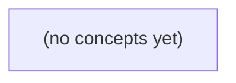

# 09.06 浏览器与客户端边界：从 IM 历史、发消息到 WebSocket

*面向 Go 初学者，以虚构用户 u-a 在浏览器登录、读取会话 c-a 历史、发送消息 m-a 并建立 WebSocket 的过程为主线，建立浏览器自动行为与服务端安全边界的完整心智模型。教材通过静态请求路径、纸上时序图、策略对照表和 22 道附反馈练习，清晰区分认证、资源授权、跨源读取与请求伪造。*

**章节:** 2

---

## 本书导览

- 了解整本书的章节脉络
- 掌握各章之间的概念依赖关系
- 选择最合适的阅读顺序

# 09.06 浏览器与客户端边界：从 IM 历史、发消息到 WebSocket

面向 Go 初学者，以虚构用户 u-a 在浏览器登录、读取会话 c-a 历史、发送消息 m-a 并建立 WebSocket 的过程为主线，建立浏览器自动行为与服务端安全边界的完整心智模型。教材通过静态请求路径、纸上时序图、策略对照表和 22 道附反馈练习，清晰区分认证、资源授权、跨源读取与请求伪造。

下方的概念图展示了本书 0 个核心概念以及它们之间的依赖关系；再下方是 1 个章节的入口。你可以按从上到下的顺序阅读，也可以根据自己的兴趣或先验知识选择切入点。

#### 概念图



## 章节索引

- **09.06 浏览器与客户端边界：Cookie、跨源与IM请求** — 面向Go初学者从虚构IM浏览器打开会话历史和提交消息出发，先讲HTML表单/Go模板与浏览器请求，再解释Cookie/Session、同源/CORS、CSRF、WebSocket Origin、私有缓存和登出；区分浏览器与原生客户端及身份、权限、交付确认，静态教材不运行服务。

## 09.06 浏览器与客户端边界：Cookie、跨源与IM请求

- 描述浏览器表单、fetch与WebSocket三条请求路径
- 解释HTML表单和html/template文本转义职责
- 区分Cookie与服务器Session及Cookie属性
- 用scheme/host/port判断同源与跨源
- 解释CORS是浏览器读取许可而非认证或CSRF防护
- 构造已登录浏览器被诱导发消息的CSRF时序
- 说明WebSocket握手Origin和逐消息授权
- 为私有历史选择缓存与登出证据边界

以虚构会话 c-a、用户 u-a、消息 m-a 为线索，先画清浏览器、服务端与原生客户端之间三条不同的请求路径。

### 先界定参与者与信任边界

### 先界定参与者与信任边界

讨论会话 `c-a`、用户 `u-a` 与消息 `m-a` 前，先不要把“客户端”当成一个统一实体。不同参与者携带的身份、可见的数据和可发起的请求并不相同。

- **浏览器标签页**：一个具体页面实例。它可读取当前页面的 DOM、内存变量与本标签页持有的状态；关闭或刷新后，内存状态通常消失。标签页不是用户身份本身。
- **同源站点**：由协议、主机、端口共同决定，例如 `https://app.example.com`。同源页面通常可共享该源下的 Cookie、`localStorage` 等；不同源页面默认不能直接读取这些数据。
- **HTTP 服务端**：接收请求、验证凭据，并决定 `u-a` 是否能读取历史消息或发送 `m-a`。真正的权限判断必须在服务端完成，不能只依赖前端按钮是否隐藏。
- **IM 数据**：历史消息、会话成员关系、未读数等属于服务端受保护数据，而不是“浏览器里已有的数据”。浏览器看到它们，是服务端授权返回后的结果。
- **原生移动客户端**：可能使用 Cookie，也可能保存令牌、设备凭据或其他认证材料；它不受浏览器同源策略约束，但仍必须接受服务端认证与鉴权。
- **任意网络脚本**：能构造 HTTP 或 WebSocket 请求，却不天然拥有 `u-a` 的登录 Cookie、令牌或权限。能联网不等于能冒充已登录用户。

因此，`c-a` 在浏览器中读历史消息时，是“标签页携带可用凭据，请求服务端，服务端返回获授权的 IM 数据”；发消息时，是“客户端提交内容，服务端确认 `u-a` 的会话权限后创建 `m-a`”；长连接则是在已认证连接上持续接收服务端推送。每一步的信任终点都应落在服务端，而非浏览器页面。

### 读历史与提交消息的 HTTP 路径

### 读历史与提交消息的 HTTP 路径

以会话 `c-a`、用户 `u-a`、消息 `m-a` 为例，先区分：浏览器标签页保存并自动携带 Cookie；服务端保存会话成员关系与消息；HTTP 请求只是两者之间一次往返。

**1. 打开历史：浏览器发起读取请求**

用户在同源站点的标签页打开 `/conversations/c-a`：

`浏览器 → GET /conversations/c-a（Cookie）→ Go 服务 → 查询成员关系与历史 → HTML 响应 → 浏览器渲染`

Cookie 例如 `session_id=...` 由浏览器按域名、路径和安全策略自动附带。Go 服务不能仅因 URL 中有 `c-a` 就返回消息，必须先由 Cookie 找到登录用户 `u-a`，再检查：

```text
u-a 是否属于 c-a？
```

通过后，服务端读取 `c-a` 的历史消息，将数据填入 Go 模板，生成 HTML。模板中的消息内容应按 HTML 上下文转义；不要把用户文本直接拼进 HTML，否则可能形成脚本注入。

**2. HTML 表单提交：浏览器导航式发送**

页面可以包含：

`<form method="post" action="/conversations/c-a/messages">`

用户提交后，路径为：

`浏览器 → POST 表单字段 + Cookie → Go 服务 → 鉴权/校验/写入 m-a → 302 或 HTML 响应 → 浏览器跳转或重渲染`

服务端应依次验证登录态、`u-a` 对 `c-a` 的发送权限、消息非空与长度限制。鉴权通过才创建 `m-a`；身份不应取自表单里的 `user_id`，因为该字段可被篡改。成功后常返回 `303 See Other`，让浏览器再以 `GET` 读取会话历史，避免刷新页面重复提交。

**3. `fetch` 提交：脚本接收数据响应**

同一页面也可由 JavaScript 调用 `fetch`：

`页面脚本 → POST /conversations/c-a/messages → Go 服务 → JSON 响应 → 脚本更新页面`

同源 `fetch` 通常也会携带同源 Cookie；服务端鉴权逻辑与表单完全相同，区别只在响应：可返回新建的 `m-a` 的 JSON，由脚本追加到消息列表。

表单与 `fetch` 都不是“直接写数据库”。它们都先到达服务端；Cookie 证明浏览器持有某个会话标识，服务端才负责把该标识解释为 `u-a`，并决定其能否读取 `c-a`、创建 `m-a`。

### 长连接不是表单请求的延伸

### 长连接不是表单请求的延伸

以用户 `u-a` 在浏览器标签页中发送消息 `m-a` 为例，三条路径的边界不同：

- **HTTP 表单**：浏览器提交 `POST /messages`，通常携带 Cookie；服务端验证登录态、校验 `u-a` 是否可向会话 `c-a` 发言，然后写入消息。一次请求对应一次响应。
- **`fetch` 请求**：仍是 HTTP 请求，只是由 JavaScript 发起。跨源时受同源策略与 CORS 约束；是否携带 Cookie 还取决于 `credentials`、Cookie 的 `SameSite` 等设置。服务端不能因为“请求来自页面脚本”就跳过鉴权。
- **WebSocket**：先用 HTTP 发起升级握手，再转为双向长连接。它不是不断提交的表单，也不是“登录一次即可永久放行”的通道。

WebSocket 握手阶段，服务端应验证 Cookie、令牌或其他凭证，将该连接绑定到已认证身份 `u-a`；同时检查 `Origin`，只允许预期站点发起浏览器连接。`Origin` 主要防范恶意网页借用受害者浏览器已有 Cookie 建立连接，不能替代身份认证。

连接建立后，每条消息仍应授权。例如客户端发送：

`{"type":"send","conversation":"c-a","content":"..."}`

服务端必须根据连接绑定的 `u-a` 判断其是否属于 `c-a`、是否被禁言、消息格式是否有效；不能信任客户端声称的 `user_id`。同理，订阅历史、加入房间、撤回消息都应逐操作检查权限。

原生移动客户端和网络脚本通常不受浏览器同源策略约束，但仍必须携带可验证凭证；服务端的认证与逐消息授权规则应保持一致。

### 浏览器跨源限制与被诱导发信

### 浏览器跨源限制与被诱导发信

浏览器把网页来源记为三元组：

\[
\text{origin}=(\text{scheme},\text{host},\text{port})
\]

只有三项都相同才是同源。例如：

- `https://chat.example.com` 与 `https://chat.example.com/api/messages`：同源。
- `http://chat.example.com` 与 `https://chat.example.com`：协议不同，跨源。
- `https://chat.example.com` 与 `https://api.example.com`：主机不同，跨源。
- `https://chat.example.com:443` 与 `https://chat.example.com:8443`：端口不同，跨源。

设用户 `u-a` 已在 `https://im.example.com` 登录，浏览器保存了该站会话 Cookie。恶意页面 `https://evil.example` 可以构造如下时序：

1. `u-a` 在同一浏览器中打开恶意页面。
2. 恶意页面提交一个普通表单，目标为 `https://im.example.com/api/messages`。
3. 浏览器向 IM 服务发送请求；若 Cookie 的 `SameSite` 策略允许，登录 Cookie 会随请求携带。
4. 服务端仅凭 Cookie 识别出 `u-a`，并接受请求体中的内容。
5. 服务端创建消息 `m-a`，表现为 `u-a` 主动发言。

关键点是：恶意站点通常**不能读取** IM 服务返回的消息历史或响应内容，因为同源策略限制跨源读取；但它仍可能诱导浏览器“代替用户发出请求”。这就是 CSRF 的核心：攻击者不必知道会话 Cookie，也不必看到响应，只要服务端把“带 Cookie 的请求”误认为“用户自主操作”即可。

CORS 不等于 CSRF 防护。CORS 是服务端通过响应头决定：`evil.example` 中的 JavaScript 能否读取 `im.example.com` 的响应。它主要约束“跨源读”，不天然阻止表单提交、页面跳转等“跨源写”。

因此，发送消息接口应额外验证请求意图，例如检查 `Origin`、使用 CSRF Token，或将认证 Cookie 设为合适的 `SameSite=Lax` 或 `SameSite=Strict`。原生移动客户端和网络脚本不受浏览器同源策略约束，但必须自行安全保存令牌，并由服务端执行同样的鉴权与权限校验。

### 私有历史、登出与客户端差异

### 私有历史、登出与客户端差异

对会话 `c-a` 而言，“读过历史”是私有状态，不应仅依赖浏览器标签页中的内存。可分层保存：

- 服务端持久化：记录 `u-a` 在 `c-a` 的最后已读消息，如 `last_read_message_id=m-a`，用于多设备同步、重新登录和未读数计算。
- 客户端短期缓存：浏览器可缓存已加载的消息页，原生客户端可使用本地数据库；缓存必须按用户与会话隔离，不能让切换账号后的 `u-b` 看到 `u-a` 的历史。
- 标签页状态：滚动位置、正在输入的草稿可只放内存；刷新或关闭后丢失通常可以接受。

登出也有明确边界。浏览器登出时，服务端应使 Cookie 对应的会话失效，并通过 `Set-Cookie` 覆盖或删除 Cookie；仅删除前端变量并不等于会话已失效。已建立的 WebSocket 也应在鉴权失效后关闭或拒绝后续发信。

不同客户端的“交付确认”不能混为一谈：

- 浏览器 Cookie：HTTP 请求自动携带会话 Cookie；收到服务端成功响应，只能证明请求被处理或接受。
- 原生移动客户端令牌：通常在 `Authorization` 中显式携带令牌；令牌可安全存入系统安全存储，并支持刷新与设备级撤销。
- 网络脚本：往往直接保存令牌或模拟请求，缺少浏览器 Cookie 隔离与人工交互保护；应使用权限更小、可过期、可撤销的专用令牌。

消息“已发送”“已送达”“已读”应分别由服务端接受、目标客户端确认、目标用户阅读产生，不能把一次 HTTP 成功响应误标为“已读”。

> **要点** — 浏览器安全取决于请求路径、站点边界与服务端授权；CORS、Cookie、Origin 和缓存各自解决不同问题。

虚构IM的“打开历史、发送消息”看似简单，却串起浏览器表单、服务端校验与安全输出三条关键边界。

### 表单请求的基本构成

### 表单请求的基本构成

`<form>`定义了浏览器如何把用户输入组织成一次请求。最关键的是三个部分：`action`、`method`与控件的`name`。

```html
<form action="/messages/send" method="post">
  <input name="to" value="bob">
  <textarea name="body"></textarea>
  <button type="submit">发送</button>
</form>
```

- `action`：请求目标地址。这里提交到`/messages/send`；省略时通常提交到当前页面地址。
- `method`：请求方式。`get`会把表单数据附加到 URL 查询串，例如`/messages?peer=bob`，适合“打开历史”“搜索”等无副作用操作；`post`通常把数据放入请求体，适合“发送消息”“修改资料”等状态变更。
- `name`：字段名，也是服务端读取参数时使用的键。上例会产生`to=bob`和`body=...`。只有`name`而没有`disabled`的成功控件会被提交；仅有`id`并不会自动提交数据。

浏览器默认常用编码为`application/x-www-form-urlencoded`：空格等字符会被编码，多个字段形成键值对。Go 的处理器可先调用`r.ParseForm()`，再用`r.FormValue("body")`读取；无论参数来自查询串还是表单体，都不能因“来自自己的页面”而信任。

### GET查询与POST状态变更

### GET查询与POST状态变更

“打开会话历史”和“发送消息”应使用不同的方法，因为它们的语义不同：

| 操作 | 推荐方法 | 参数位置 | 是否应改变服务器状态 |
|---|---|---|---|
| 查看某个会话的历史消息 | `GET` | 查询字符串 | 否 |
| 按关键词搜索联系人或消息 | `GET` | 查询字符串 | 否 |
| 提交一条新消息 | `POST` | 请求体 | 是 |
| 标记消息已读、删除会话 | `POST`（或更细分的写操作方法） | 请求体 | 是 |

例如，历史页可设计为：

`GET /chat/history?peer=alice&before=120`

其中 `peer` 和 `before` 是查询条件。它们通常会出现在地址栏、浏览器历史、书签、日志和代理记录中，因此不要把消息正文、令牌或其他敏感内容放进查询字符串。

发送消息则适合表单提交：

```html
<form action="/chat/send" method="post">
  <input name="peer" value="alice">
  <textarea name="body"></textarea>
  <button type="submit">发送</button>
</form>
```

`POST` 将表单字段放入请求体；这不等于“天然保密”，HTTPS、鉴权、服务端日志脱敏仍然必要。其核心意义是明确告诉浏览器、中间件和维护者：该请求会产生状态变更，不应被链接预取、缓存重放或误当成可安全刷新页面的查询。

Go 的处理器中可先解析表单，再读取字段：

```go
func sendMessage(w http.ResponseWriter, r *http.Request) {
	if r.Method != http.MethodPost {
		http.Error(w, "不允许的方法", http.StatusMethodNotAllowed)
		return
	}
	if err := r.ParseForm(); err != nil {
		http.Error(w, "请求格式错误", http.StatusBadRequest)
		return
	}
	peer := r.PostFormValue("peer")
	body := r.PostFormValue("body")
	// 服务端继续校验登录身份、会话权限、长度与内容规则。
}
```

前端可以限制输入长度、禁用空消息，以减少无效提交；但这些校验可被绕过。真正决定消息能否写入的，始终是服务端对方法、身份、权限和参数的校验。

### 表单编码与Go读取参数

### 表单编码与 Go 读取参数

浏览器提交 `<form>` 时，会把控件的 `name=value` 编码后放入请求中。`action` 决定目标地址，`method` 决定主要传输位置：`GET` 通常把参数附在 URL 查询串中，适合“打开历史”这类可描述、可重复访问的读取操作；`POST` 通常把参数放入请求体，适合“发送消息”这类会改变服务端状态的操作。

例如打开会话可形成：

`GET /history?conversation_id=42`

发送消息的表单：

`<form action="/messages" method="post">`

其中 `<input name="conversation_id">` 与 `<textarea name="body">` 在默认的 `application/x-www-form-urlencoded` 编码下，可能传为：

`conversation_id=42&body=%E4%BD%A0%E5%A5%BD%21`

空格会编码为 `+`，中文及特殊字符会进行百分号编码；浏览器和 Go 都会负责解码。若表单需要上传文件，应使用 `enctype="multipart/form-data"`，其请求体以边界分隔字段和文件内容。

Go 的 handler 不应手工拆分查询串或请求体。先调用 `r.ParseForm()`，再通过 `r.FormValue` 读取：

`conversationID := r.FormValue("conversation_id")`  
`body := r.FormValue("body")`

`FormValue` 会综合查询参数与表单参数，适合简单读取；需要区分来源、处理多值字段或检查解析错误时，可显式使用 `r.URL.Query()`、`r.PostForm` 与 `r.Form`。读取后仍须验证：会话标识是否为合法整数、当前用户是否属于该会话、正文是否为空或超长。前端 `required`、长度限制只能改善交互，攻击者仍可直接构造请求绕过它们。

### 前端提示不能替代服务端校验

### 前端提示不能替代服务端校验

聊天输入框的“必填”“最多 500 字”等浏览器校验，主要用于改善体验：用户能在提交前立刻看到提示，减少无效请求。但这些规则并不构成安全边界。

攻击者可以关闭 JavaScript、手工构造 HTTP 请求、修改页面元素，或直接调用接口。因此，服务端不能因为前端已限制而信任任何字段。处理“发送消息”时，Go handler 至少应重新验证：

- **身份**：请求是否携带有效登录态，当前用户是谁。
- **权限**：该用户是否属于目标会话，是否允许向该群组或联系人发言。
- **字段格式**：会话 ID 是否为合法整数或 UUID；消息正文是否符合编码、长度和空白规则。
- **业务约束**：会话是否存在、是否已关闭、是否被禁言；是否触发频率限制或重复提交保护。

例如，前端可限制 `content` 不为空，但服务端仍应在读取参数后执行类似逻辑：

`内容去除首尾空白后不能为空，长度不得超过上限。`

更重要的是，权限判断必须基于服务端查询到的会话成员关系，而不是相信表单提交的 `user_id`、`sender` 或“我是管理员”等字段。客户端负责提出请求，服务端负责决定该请求是否有效、是否被允许执行。

### 模板转义与聊天正文安全输出

### 模板转义与聊天正文安全输出

聊天消息是典型的不可信输入：用户可能发送普通文本，也可能发送 `<script>`、伌造链接或带事件处理器的标签。历史消息页的首要原则是：**将聊天正文作为文本显示，而不是作为浏览器可执行的 HTML 解释。**

Go 的 `html/template` 面向 HTML 输出，默认会按所在上下文自动转义。例如：

```go
tmpl.Execute(w, map[string]string{
    "Body": `<script>alert("xss")</script>`,
})
```

模板：

```html
<p class="message">{{.Body}}</p>
```

浏览器实际收到的内容会类似于：

```html
<p class="message">&lt;script&gt;alert(&#34;xss&#34;)&lt;/script&gt;</p>
```

因此用户看到的是字面量 `<script>...</script>`，而不是执行脚本。这里的关键不只是“替换几个字符”，而是模板引擎依据 HTML 文本上下文进行安全编码；渲染聊天记录时应始终使用 `html/template`，不要误用只做字符串替换的 `text/template`。

但自动转义的职责是安全地输出“文本”，不等于支持任意富文本。尤其不要为了让用户输入的 `<b>`、`` 显示为标签而写：

`template.HTML(message.Body)`

`template.HTML` 的含义是告诉模板引擎“这段内容已经可信且安全”，它会绕过默认转义。若正文来自表单、数据库历史记录或外部接口，攻击者就能注入可执行标记，形成跨站脚本风险。

若产品确实需要有限的富文本，应先采用明确的白名单净化器，只保留允许的标签、属性和协议，再将净化后的结果作为受控 HTML 输出；不要把“用户输入”直接标记为安全。对于基础 IM，最稳妥的方案是纯文本消息配合自动转义。

> **要点** — 表单负责提交，服务端负责验证；模板负责上下文转义，但自动转义不等于富文本净化。

浏览器会自动携带 Cookie，但这不等于请求天然可信。理解会话标识、服务端校验与属性边界，才能为 IM 历史和发消息接口建立正确的身份模型。

### Cookie 往返与会话映射

### Cookie 往返与会话映射

登录成功后，服务端不会把用户身份、角色或密码直接写进 Cookie，而是生成高熵、不可预测的不透明会话标识，例如 `sid=K8...xQ`。服务端保存映射关系：

`sid → 用户 u → 会话状态、过期时间、设备信息`

随后在响应头中发放：

`Set-Cookie: sid=K8...xQ; Secure; HttpOnly; Path=/`

浏览器收到 `Set-Cookie` 后，按 Cookie 的 `Domain`、`Path`、`Secure`、`SameSite` 等规则保存它。之后访问匹配的地址时，浏览器会自动在请求头回传：

`Cookie: sid=K8...xQ`

业务接口据此执行完整验证链路：

1. 从 `Cookie` 取出 `sid`；
2. 在服务端会话存储中查找映射；
3. 检查会话是否存在、未过期、未被登出或撤销；
4. 得到当前用户 `u`，再继续检查其是否属于目标会话或频道。

因此，Cookie 只是浏览器代为携带的“会话索引”，不是授权结论。即使某请求带有有效 `sid`，读取 IM 历史或发送消息时仍必须校验当前用户 `u` 对目标资源 `a` 的成员资格：`canAccess(u, a)`。

会话标识必须足够随机，不能使用递增编号、用户名或可猜测值；登出时也不能只让浏览器删除 Cookie，还应使服务端对应的 `sid` 失效。

### 会话标识不是授权结论

### 会话标识不是授权结论

浏览器在请求中带上 `Cookie: session=...` 后，服务端可用其中不可预测的 opaque id 查表，得到“该请求当前对应用户 `u-a`”。这一步只完成**身份解析**，并没有推出“用户 `u-a` 有权操作任意会话”。

例如客户端请求：

`GET /conversations/c-a/history`

或：

`POST /conversations/c-a/messages`

服务端应按如下链路判断：

1. 验证 session 标识存在、未过期、未被登出或撤销，并解析出用户 `u-a`。
2. 查询会话 `c-a` 是否存在，且状态允许读取历史或发送消息。
3. 查询成员关系：`u-a` 是否属于 `c-a`，是否被移除、禁言、封禁，角色是否具备当前操作权限。
4. 仅在上述条件均成立时，才读取历史或写入消息。

因此，授权判断应近似为：

$allow(u,a,c)=validSession(u)\land member(u,c)\land conversationActive(c)\land permitted(u,a,c)$

不能因为客户端提交了 `c-a`，或 Cookie 能解析到 `u-a`，就相信二者天然匹配。否则，已登录用户只需猜测、枚举或从其他位置获得会话标识，便可能越权读取他人历史、向无关会话发消息。

成员关系和会话状态必须在每次受保护请求时由服务端确认；不能只在登录时写入 Cookie，也不能信任前端缓存的“我仍是成员”。登出、密码重置、管理员撤销或成员被移除后，应使服务端 session 或权限状态立即失效，使旧 Cookie 即使仍被浏览器携带，也无法产生授权效果。

### Cookie 属性的保护范围

### Cookie 属性的保护范围

Cookie 属性决定浏览器何时保存、发送或暴露某个会话标识；它们缩小风险面，但不替代服务端鉴权。

- `Secure`：仅在 HTTPS 请求中附带，避免会话标识经普通 HTTP 明文泄露。它不保证服务器可信，也不阻止同站恶意脚本发起请求。
- `HttpOnly`：禁止 JavaScript 通过 `document.cookie` 读取该 Cookie，主要降低 XSS 直接窃取会话标识的风险。但被注入的脚本仍可能调用“发消息”“删会话”等接口，浏览器照样自动携带 Cookie。
- `SameSite`：限制跨站请求是否自动附带 Cookie。`Strict` 最严格，跨站导航通常不带；`Lax` 对部分顶级导航保留兼容；`None` 允许跨站携带，但必须配合 `Secure`。这里的“站点”按 schemeful site 判断，不等同于完整 origin：子域、端口差异的规则并不完全相同。
- `Path`：只在请求路径匹配时附带，如 `Path=/api` 不会发送给 `/static`。它不是访问控制；同一域内其他路径的服务仍需独立鉴权。
- `Domain`：未设置时为宿主专用 Cookie；设置为 `.example.com` 后，多个子域都可能收到它。范围越大，受影响子域越多，应尽量不设或缩小。
- `Expires` / `Max-Age`：控制持久化期限；未设置通常为浏览器会话 Cookie。过期只影响客户端保存，登出或盗用处置必须使服务端 `opaque id` 对应 session 立即失效。

### 站点、源与 CSRF 误区

### 站点、源与 CSRF 误区

“同站”与“同源”不是一回事。**同源策略**按 `scheme + host + port` 判断：`https://app.example.com:443` 与 `https://app.example.com:8443` 不同源；`http://app.example.com` 与 HTTPS 版本也不同源。它主要限制脚本读取另一个源的响应。

`SameSite` 判断的是**站点**，通常看 scheme 与可注册域名：`https://a.example.com` 和 `https://b.example.com` 可视为同站，端口不参与判断。因此，子域名之间即使不同源，也可能在 SameSite 意义上同站；不应把“不跨站”等同于“可信”。

- `HttpOnly` 仅阻止 JavaScript 直接读取 Cookie，不能阻止 XSS 在受害页面中发起带 Cookie 的请求、诱导操作或读取页面数据。
- `SameSite` 可减少典型跨站请求携带 Cookie 的机会，但不是完整 CSRF 防护：同站恶意子域、错误使用状态变更 `GET`、兼容性与业务跳转路径都可能留下风险。
- 对发消息、加群等写操作，仍应校验请求方法、`Origin`/`Referer`，并使用 CSRF token 或其他请求绑定机制；服务端还必须按 session 重新确认成员资格。

### IM 登录、登出与失效证据

### IM 登录、登出与失效证据

以虚构 IM 为例，登录成功后，服务端生成不可预测的会话标识 `sid`，并保存映射：

`sid → 用户 u、创建时间、过期时间、撤销状态`

响应通过 `Set-Cookie` 写入 `sid`；后续读取历史、提交消息时，浏览器自动在 `Cookie` 中带回它。Cookie 只是“携带线索”，不是授权结论。服务端每次请求都应：

1. 从 Cookie 取出 `sid`，查询会话是否存在、未过期、未撤销；
2. 得到当前用户 `u`，而非相信请求体中的 `userId`；
3. 对目标会话 `c` 检查成员关系 `member(u, c)`；
4. 仅在校验通过后读取历史或接受消息 `m`。

例如，`POST /conversations/c/messages` 不能因客户端提交了 `conversationId=c` 就写入；必须验证 `u` 仍是 `c` 的成员。成员被移除、账号禁用或会话过期，都应成为拒绝请求的失效证据。

登录 Cookie 通常设置 `Secure`、`HttpOnly`、适当的 `SameSite` 与过期时间。`HttpOnly` 只能降低脚本直接读取 Cookie 的风险，不能消除 XSS；`SameSite` 也不是完整 CSRF 防护。`Path`、`Domain` 限制发送范围，但不替代服务端鉴权。

登出必须由服务端撤销 `sid`，使其即使仍被浏览器携带也无法通过验证；客户端同时用过期的 `Set-Cookie` 清理本地 Cookie。只清客户端而不撤销服务端会话，已泄露或仍存活的 `sid` 仍可能被继续使用。

> **要点** — Cookie 只负责携带会话线索；身份、成员权限与登出失效必须由服务端在每次敏感请求中验证。

浏览器安全边界首先由同源策略划定：它限制脚本跨源读取响应，却不等于阻止一切跨源请求。理解这一区分，才能正确使用CORS。

### 用协议、主机与端口判定源

### 用协议、主机与端口判定源

浏览器中的源（`origin`）由三元组决定：

\[
\text{origin}=(\text{scheme},\text{host},\text{port})
\]

只有协议、主机和端口都相同，两个地址才同源。路径、查询参数和片段不会改变源。

- `https://app.example.test/dashboard` 与 `https://app.example.test/api/me`：同源；仅路径不同。
- `https://app.example.test` 与 `http://app.example.test`：不同源；`https` 与 `http` 协议不同。
- `https://app.example.test` 与 `https://api.example.test`：不同源；子域名不同，`app` 和 `api` 是不同主机。
- `https://app.example.test` 与 `https://app.example.test:8443`：不同源；端口不同。
- `https://app.example.test:443` 与 `https://app.example.test`：通常同源；`443` 是 HTTPS 默认端口。
- `https://app.example.test/a?x=1#top` 与 `https://app.example.test/b?x=2`：同源；路径、参数、片段均不参与判断。

主机名不是按“同一注册域”判断。即使都属于 `example.test`，`app.example.test`、`api.example.test` 和 `admin.example.test` 仍分别是不同源。类似地，开发环境中 `localhost:3000` 与 `localhost:8080` 也不同源。

这个判断是浏览器同源策略和 CORS 的起点：页面脚本从一个源发起请求，想读取另一个源的响应时，浏览器会将其视为跨源读取，并要求目标服务端明确授权。

### 同源策略限制的是读取能力

### 同源策略限制的是读取能力

浏览器用源三元组划定脚本权限边界：

\[
\text{origin}=(\text{scheme},\text{host},\text{port})
\]

因此，`https://app.example.test` 与 `https://api.example.test` 主机不同，属于不同源；`https://app.example.test:443` 与 `https://app.example.test:8443` 端口不同，也属于不同源。即使它们都由同一组织运营，浏览器也不会自动把它们视为可互读的站点。

同源策略（SOP）的关键作用是：**限制一个源中的脚本读取另一源响应的内容**。例如，攻击者在 `https://evil.test` 放置脚本：

`fetch("https://api.example.test/me")`

浏览器未必会阻止这条请求离开客户端；服务器也可能实际收到请求，并且在某些条件下附带目标站点的 Cookie。真正受限的是攻击脚本能否拿到响应体、响应头并据此窃取数据。若 `api.example.test` 未授予 CORS 权限，脚本通常只能得到浏览器报出的跨源访问失败，而不能读取“当前用户是谁”之类的响应内容。

这一区分解释了几个常见现象：

- ``、`<script>`、`<form>` 等标签长期可以加载或提交跨源资源；
- 跨站表单提交可能改变服务端状态，因此不能把 SOP 当作 CSRF 防护；
- 攻击者无法读取响应，不代表请求没有执行；
- CORS 不是“允许跨源发请求”，而是服务端向浏览器声明“允许这个源的脚本读取响应”。

因此，设计接口时应分别处理两类风险：用认证、授权和 CSRF 防护控制“请求能否产生副作用”，用 SOP 与 CORS 控制“浏览器脚本能否读取跨源响应”。

### CORS是浏览器的读取许可

### CORS是浏览器的读取许可

CORS（跨源资源共享）不是“允许跨源访问接口”的认证机制，而是服务端通过响应头告诉浏览器：**来自某个其他源的脚本，可以读取这次响应**。它只约束浏览器；攻击者仍可能用 Go、curl 或自建客户端直接发请求，因此权限校验必须由服务端独立完成。

例如页面运行于 `https://app.example.test`，请求 `https://api.example.test/users/me`。两者主机不同，属于跨源。浏览器通常允许请求被发出，但是否把响应交给页面脚本，要看 API 的 CORS 响应头：

`Access-Control-Allow-Origin: https://app.example.test`

对于“简单请求”，浏览器直接发送实际请求，再检查响应是否允许读取。常见条件包括方法为 `GET`、`HEAD`、`POST`，且请求头、`Content-Type` 未超出规定范围。

若请求使用 `PUT`、`DELETE`，携带 `Authorization`、自定义头，或使用 `application/json` 等内容类型，浏览器通常先发送预检请求：

`OPTIONS /users/me`

预检中会携带请求源、拟使用的方法和头；服务端确认后返回例如：

`Access-Control-Allow-Methods: GET, POST, PUT`  
`Access-Control-Allow-Headers: Authorization, Content-Type`

浏览器通过预检后才发送实际请求。预检失败时，实际请求通常不会发送，脚本也无法读取结果。

因此，CORS 的核心不是“防止请求到达服务器”，而是把跨源**读取响应**的决定权交给服务端。

### 携带凭据时的严格规则

### 携带凭据时的严格规则

设页面运行于 `https://app.example.test`，需要读取 `https://api.example.test/user/profile`。两者主机名不同，属于跨源；若请求要自动携带 `api.example.test` 的 Cookie，前端必须明确声明：

`fetch("https://api.example.test/user/profile", { credentials: "include" })`

`include` 的含义是允许浏览器在满足 Cookie 属性条件时携带凭据，并允许处理响应中的 Cookie；它**不会**绕过同源策略。浏览器仍要求 API 响应同时给出：

- `Access-Control-Allow-Origin: https://app.example.test`
- `Access-Control-Allow-Credentials: true`

其中来源必须是精确值，不能写成：

`Access-Control-Allow-Origin: *`

通配符表示“任意来源均可读取”，而带 Cookie 的响应可能包含用户私有数据，因此浏览器禁止 `*` 与凭据模式组合。即使服务端返回了 `Access-Control-Allow-Credentials: true`，只要来源头是 `*`、缺失或与实际 `Origin` 不一致，脚本仍无法读取响应。

若 API 根据请求中的 `Origin` 动态决定是否放行，例如只允许 `app.example.test` 和后台站点，则应返回：

`Vary: Origin`

这告诉 CDN、代理缓存和浏览器缓存：不同 `Origin` 的响应不能混用。否则，一个已为可信来源缓存的 `Access-Control-Allow-Origin` 响应，可能被错误地复用给其他来源。

对于会触发预检的请求，例如携带 `Authorization`、自定义头，或使用 `PUT`、`DELETE`，浏览器会先发出 `OPTIONS`。预检响应也必须允许该来源、方法和请求头；若主请求需要 Cookie，同样应返回显式来源与 `Access-Control-Allow-Credentials: true`。CORS只约束浏览器是否把响应交给脚本，API仍必须基于会话、令牌和授权规则验证用户身份，不能把 CORS 当作访问控制。

### CORS不能替代认证与授权

### CORS不能替代认证与授权

CORS解决的是**浏览器脚本能否读取跨源响应**，不是“这个请求者是否有权调用接口”。它属于浏览器执行的读取控制，不能作为服务端访问控制边界。

| 场景 | 浏览器行为 | CORS 的作用 |
|---|---|---|
| 恶意网页调用 `api.example.test` | 可能仍能发出请求 | 阻止脚本读取不被许可的响应 |
| 合法前端跨源调用 API | 浏览器检查响应头 | 服务端以 `Access-Control-Allow-Origin` 等头授予读取许可 |
| Go、curl、Postman、移动端调用 API | 直接发送并读取响应 | 不执行、不依赖 CORS 检查 |

例如，服务端仅配置：

`Access-Control-Allow-Origin: https://app.example.test`

这只意味着运行在该源页面中的浏览器脚本可以读取响应。攻击者仍可用 Go 编写客户端直接请求：

`GET https://api.example.test/admin/users`

Go 的 `net/http` 不会因为响应缺少 CORS 头而拒绝读取内容；它也不会先替服务端执行浏览器的预检规则。因此，若接口只靠 CORS “保护”，攻击者可绕过浏览器，直接调用 API。

真正的安全检查必须在服务端完成，通常至少包括：

- **认证**：请求者是谁，例如会话 Cookie、Bearer Token、mTLS 或签名请求。
- **授权**：该身份能做什么，例如普通用户不能读取管理员数据。
- **对象级校验**：用户只能访问自己的订单、文件或账户，不能仅凭修改 `id` 越权。
- **请求完整性保护**：对 Cookie 会话接口还应考虑 CSRF，不能把 CORS 当作 CSRF 防护。

可以将职责明确区分：CORS回答“浏览器是否可把响应交给某个网页脚本”；认证与授权回答“服务端是否应执行请求并返回该数据”。前者改善可信前端的跨源集成，后者才决定 API 是否真正安全。

> **要点** — 同源由协议、主机、端口共同决定；CORS只控制浏览器跨源读取，认证、授权与请求防护必须由服务端独立完成。

本节用“已登录用户误入恶意页面后，IM消息为何仍可能被提交”的纸上时序，厘清跨站请求、认证凭据与状态变更防护的边界。

### 从诱导页面到消息提交的时序

### 从诱导页面到消息提交的时序

设用户 `u-a` 已登录 IM，浏览器中保存了面向 `https://im.example` 的会话 Cookie。随后他访问恶意站点 `https://evil.example`；攻击并不需要知道 Cookie 内容，也未必需要读取 IM 的响应。

纸上时序可写为：

1. `u-a` 在恶意页面点击“领取福利”，或页面自动提交一个表单：
   ```text
   POST https://im.example/api/messages
   Content-Type: application/x-www-form-urlencoded

   to=u-b&content=转账已确认
   ```

2. 这是一次**跨源请求**：发起页面属于 `evil.example`，目标属于 `im.example`。但请求目标仍是 IM 域名。

3. 浏览器检查 Cookie 属性。若该会话 Cookie 在当前请求场景下允许发送，例如缺少合适的 `SameSite` 限制，浏览器会自动附带：
   ```text
   Cookie: session=...
   ```

4. IM 服务器收到请求后，先根据 `session` 识别出用户 `u-a`，再把请求当作“`u-a` 提交消息”的操作处理。

5. 若接口仅验证“是否已登录”，却未验证请求是否确实来自 IM 自己的页面，服务器便可能写入消息、修改会话状态或触发其他副作用。

关键点在于：攻击脚本通常因同源策略而**读不到** `im.example` 的响应内容；但“不能读响应”不等于“请求没有到达”或“状态没有改变”。CSRF 利用的是浏览器代为携带认证凭据，而非窃取响应数据。

反例是：若该接口要求攻击者无法猜到、且仅由 IM 页面取得的 CSRF token，或服务器拒绝不可信 `Origin`、`Sec-Fetch-Site`，上述表单虽可发出，仍应在服务器验证阶段失败。

### 读不到响应，为何仍能造成损害

### 读不到响应，为何仍能造成损害

同源策略主要限制恶意页面**读取**另一个源的响应，并不普遍禁止浏览器**发送**请求。设用户已登录 `im.example`，浏览器保存了会话 Cookie；随后访问 `evil.example`：

1. 恶意页构造一个自动提交的表单：`POST https://im.example/api/message/delete`；
2. 浏览器发现目标站点存在匹配的 Cookie，可能自动附带该 Cookie；
3. IM 服务器据此识别为已登录用户，并执行删除、发消息、改设置等操作；
4. 响应返回浏览器后，恶意脚本因同源策略通常不能读取其内容。

因此，攻击者不必知道“删除是否成功”的响应正文；只要服务器已经接受请求并改变状态，损害就已发生。攻击者还可通过页面跳转、可见结果、后续诱导等方式间接判断效果。

CORS 解决的是“某个跨源脚本能否读取响应”的授权问题。例如服务器不返回允许 `evil.example` 的 CORS 响应头，恶意脚本读不到 JSON；但这不意味着服务器拒绝了传统表单、图片加载或导航触发的跨站请求。

反例是把“接口未开放 CORS”当作 CSRF 防护：若状态变更接口仅凭 Cookie 认证、接受表单可发送的请求，攻击仍可成立。真正的防线应要求请求携带攻击站无法获得的 CSRF token，或校验可信 `Origin`、`Referer`、`Sec-Fetch-Site` 等上下文；`SameSite` Cookie 只能辅助降低风险，不能替代服务端校验。

### 状态变更接口的分层防护

### 状态变更接口的分层防护

先把规则写成可检查的接口契约：`GET`、`HEAD`、`OPTIONS` 必须只读，不得发送消息、删会话、修改资料或创建支付。否则攻击者仅需诱导浏览器加载一个链接或图片，便可能触发带 Cookie 的请求。

对 `POST`、`PUT`、`PATCH`、`DELETE` 等状态变更请求，采用叠加防线：

1. **CSRF Token**：服务端为登录会话生成不可预测令牌，页面将其放入表单隐藏字段或请求头；服务端验证令牌与当前会话匹配。恶意站点可让浏览器带上 Cookie，却通常无法读取受害站页面中的令牌。
2. **校验请求来源**：优先校验 `Origin`；缺失时可谨慎回退校验 `Referer`。也可依据 Fetch Metadata，仅允许 `Sec-Fetch-Site: same-origin` 或受控的 `same-site` 请求，拒绝明显的 `cross-site` 状态变更。
3. **SameSite Cookie**：`SameSite=Lax` 或 `Strict` 能减少跨站自动携带 Cookie 的机会，但它受导航方式、兼容性和业务域名结构影响，不能替代 Token 或来源校验。
4. **资源级授权**：即使请求通过 CSRF 校验，也必须确认当前用户有权操作目标会话、消息或账号；“已认证”不等于“可操作任意资源”。

不要把“自定义头会触发 CORS 预检”当作通用防护：浏览器预检限制的是脚本跨源读取与部分发送路径，不覆盖表单提交、导航等全部客户端形态。CSRF 防的是“借用户身份发请求”；XSS 则能在同源上下文读取 Token，应另行通过输出编码、内容安全策略等治理。

### 不能替代防护的常见反例

### 不能替代防护的常见反例

“要求带自定义头”常被误当作 CSRF 防护：恶意网页通常不能跨源随意添加 `X-Requested-With` 一类头，因为会触发 CORS 预检；若服务端未放行，浏览器不会发送正式请求。但这只约束“浏览器中的跨源脚本”，并非状态变更授权规则：

- 原生客户端、桌面程序、命令行工具可以直接携带该头；
- 站内 XSS 脚本属于同源脚本，能带头、读 token、发请求；
- 若 CORS 配置过宽，预检本身可能被放行；
- 简单表单请求不需预检，若接口接受表单编码且仅依赖 Cookie，仍可被跨站提交。

同理，CORS 的核心是限制脚本**读取跨源响应**，不是天然阻止请求到达服务器。即使恶意站点读不到 IM 的响应，浏览器仍可能已附带 Cookie 发出消息、修改资料或执行其他状态改变操作。

`SameSite` 是有价值的辅助层：`Strict` 更严格，`Lax` 通常仍允许部分顶级导航携带 Cookie，`None` 则需要 `Secure` 且允许跨站携带。它还受旧客户端兼容性、第三方嵌入和业务跳转影响，不能替代服务端验证。

因此，Cookie 只是认证凭据，不证明请求出自可信页面；自定义头和预检也不是通用客户端边界。状态改变接口仍应使用 CSRF token，或严格校验可信 `Origin`／`Referer` 与 `Fetch Metadata`；并在每次操作中检查当前用户对目标会话、消息或资源的授权。

### CSRF、XSS、认证与授权的边界

### CSRF、XSS、认证与授权的边界

这四类问题都可能导致“消息被发出”，但攻击路径不同，不能用同一种补丁混淆处理：

- **CSRF**：攻击者诱导已登录用户访问恶意页；浏览器可能自动携带 `Cookie` 向 IM 提交请求。攻击者通常读不到响应，但服务器若只凭 Cookie 接受状态变更，消息、加群或设置修改仍可能已生效。核心是确认请求确由本站页面发起，如 CSRF token、可信 `Origin` / `Fetch Metadata` 校验。
- **XSS**：攻击者已能在本站页面执行脚本，例如评论内容被当作 HTML 渲染。脚本处于本站源内，往往可读取页面、调用接口并取得 token；仅部署 CSRF token 不足以阻止它。核心是输出编码、内容安全策略与消除脚本注入点。
- **认证失效或伪造身份**：服务端错误接受伪造会话、弱口令撞库或被盗 token，问题是“谁在登录”。应强化会话保护、登录验证与凭据生命周期。
- **授权缺失**：请求者确实已认证、请求也确实来自本站，但他不应操作目标资源。例如用户把 `conversationId=101` 改为他人私聊。服务端仍须逐资源检查“该用户是否属于此会话、是否有发送/管理权限”。

纸上时序可写为：恶意页 → 浏览器携 Cookie 发请求 → IM 验证身份 → **再验证请求来源与资源权限** → 执行变更。反例是“接口有 CSRF token，所以安全”：若站内 XSS 能读到 token，或用户对目标会话本无权限却未做授权检查，仍然会出问题。

> **要点** — CSRF 的关键是浏览器可代用户发出带凭据请求；防护必须让每次状态变更具备不可被外站伪造的请求证据，并持续执行资源授权。

WebSocket将浏览器的长连接能力带入IM，但握手携带Cookie并不等于跨站请求天然安全，更不意味着连接建立后可放弃逐条授权。

### 从HTTP升级到WebSocket握手

### 从HTTP升级到WebSocket握手

浏览器创建 `new WebSocket("wss://im.example.com/ws")` 时，并非直接发送“WebSocket 数据包”，而是先发起一次 HTTP 升级请求。典型形式如下：

`GET /ws HTTP/1.1`  
`Host: im.example.com`  
`Upgrade: websocket`  
`Connection: Upgrade`  
`Sec-WebSocket-Key: ...`  
`Sec-WebSocket-Version: 13`  
`Origin: https://app.example.com`  
`Cookie: session=...`

服务端验证升级参数后，以 `101 Switching Protocols` 响应；此后同一条 TCP/TLS 连接改用 WebSocket 帧传输消息，不再逐条经过普通 HTTP 路由和中间件。

这里有两个容易混淆的边界：

- **`Origin` 表示网页来源。** 浏览器通常会在跨源 WebSocket 握手中携带它，例如页面来自 `https://evil.example`，却连接 `wss://im.example.com/ws`。服务端应据此匹配明确的允许来源列表，而不是仅检查请求是否“看起来像浏览器”。
- **Cookie 是否携带取决于 Cookie 作用域与属性。** 若目标地址与 Cookie 的域、路径、`Secure`、`SameSite` 等条件匹配，浏览器可能自动附带已有登录 Cookie；前端脚本即使读不到 `HttpOnly` Cookie，也可能借浏览器自动发送它。

因此，攻击页面无法直接读取受害者的 Cookie，却可能诱导受害者浏览器带着 Cookie 发起握手。这正是跨站 WebSocket 劫持的纸上风险：若服务端只凭 Cookie 接受升级、忽略 `Origin`，攻击站点可能获得一个以受害者身份建立的连接。

但 `Origin` 不是通用身份凭证：原生客户端、脚本工具可自行伪造或省略该头。它解决的是**浏览器页面来源约束**；连接最终仍应通过会话、令牌或其他认证材料确认身份。CORS 响应头则主要约束浏览器对普通跨源 HTTP 响应的读取，不能替代 WebSocket 握手的 `Origin` 校验。

### Origin白名单的边界

### Origin白名单的边界

浏览器发起 WebSocket 握手时，通常会携带 `Origin`，且同站 Cookie 可能随握手自动发送。若服务端仅凭 Cookie 建立连接，攻击者可在恶意站点诱导已登录用户的浏览器连接 IM 服务；浏览器携带的有效会话会使该连接看起来像受害者本人。这就是跨站 WebSocket 劫持的核心风险：攻击页面不能直接读取 Cookie，却可能借浏览器“代为认证”建立双向通道。

因此，服务端应在握手阶段读取 `Origin`，仅接受明确允许的前端源，例如：

- `https://app.example.com`
- 经审计的管理后台、桌面端嵌入页等固定来源；
- 开发、预发布环境各自独立的精确域名。

校验应是服务端的精确允许列表匹配，而非模糊后缀匹配。例如允许 `example.com` 时，不能接受 `https://example.com.attacker.test`；也不应把任意 `null`、缺失 `Origin` 或任意子域默认放行。拒绝时应直接终止握手，而不是先升级连接再发送错误消息。

但 `Origin` 不是身份凭证，也不是通用客户端可信证明。它主要约束浏览器环境：普通浏览器脚本不能任意伪造该请求头。原生 App、命令行工具、代理或攻击者自建客户端都可自行构造 `Origin`，甚至省略它。因此，服务端不能以“来源在白名单中”替代登录认证、会话校验或消息授权。

还要区分 CORS 与 WebSocket：CORS 响应头控制的是浏览器对跨源 HTTP 响应的读取规则，不等于 WebSocket 握手授权策略。即使某接口 CORS 配置正确，WebSocket 服务仍应独立校验 `Origin`，并在连接建立后继续对每次发送、订阅和资源访问执行会话权限检查。

### CORS不是WebSocket授权

### CORS不是WebSocket授权

`fetch` 的 CORS 主要解决的是：**浏览器是否允许脚本读取跨源 HTTP 响应**。例如服务端返回 `Access-Control-Allow-Origin`，是在告诉浏览器某个来源可读取响应；它不是在证明请求者已经登录，更不是在授予某个业务操作权限。

WebSocket 的模型不同：浏览器发起升级握手时通常会携带 `Origin`，同站 Cookie 也可能随握手发送。服务端应将 `Origin` 与严格的允许列表比对，拒绝未知站点，以降低跨站 WebSocket 劫持风险：

- CORS 头并不能替代 WebSocket 的 `Origin` 校验；
- `Origin` 允许列表不能替代 Cookie、令牌等身份认证；
- 认证成功也不能替代会话级授权，例如“该用户是否仍可加入此会话、订阅此频道或发送此消息”。

可将两者简化为不同问题：

| 机制 | 核心问题 | 不能证明什么 |
|---|---|---|
| CORS | 浏览器脚本能否读取 HTTP 响应 | 用户身份与业务权限 |
| WebSocket `Origin` 校验 | 此浏览器页面是否来自受信任站点 | 客户端身份与会话成员资格 |
| 认证与逐条授权 | 谁在操作、能操作什么 | 消息内容必然安全 |

尤其不能把 `Origin` 当作通用客户端凭据：原生客户端、脚本工具可以伪造它。握手认证只建立连接身份；连接建立后，服务端仍须对每次发送、订阅等动作核验会话权限，并限制消息大小。

### 连接身份不等于消息权限

### 连接身份不等于消息权限

WebSocket 握手认证解决的是“谁建立了这条连接”：例如服务端通过 Cookie、访问令牌或签名票据，将连接绑定到用户 `user_id`。但 IM 中真正敏感的操作发生在连接建立之后：发送消息、订阅会话、拉取已读状态、上传引用附件等。连接已认证，不代表该用户对任意会话、任意消息类型都拥有权限。

例如，客户端发送：

`{ "type": "send_message", "conversation_id": "c_123", "content": "你好" }`

服务端不能仅因该连接属于已登录用户就写入消息，而应在处理该帧时检查：

1. **会话成员资格**：`user_id` 是否仍是 `c_123` 的成员，是否已被移出群聊、拉黑或禁言。
2. **目标权限**：该会话是否允许当前用户发送；频道型会话还应区分“可阅读”“可发言”“可管理”等权限。
3. **消息约束**：限制单帧和解码后的消息大小、文本长度、附件数量、嵌套深度及允许的消息类型，避免内存消耗、解析攻击或滥用广播。
4. **服务端派生身份**：发送者必须取自连接上下文中的 `user_id`，不能相信载荷中的 `sender_id`、`role` 或“管理员”标记。

订阅同样需要逐项授权：

`{ "type": "subscribe", "conversation_id": "c_456" }`

服务端应确认用户有查看该会话的权限，才将连接加入对应推送组；不能让客户端自行声明订阅主题，更不能以“已通过 WebSocket 握手”为由订阅任意会话。

可将处理模型概括为：

`认证连接 → 解析单条消息 → 限制大小 → 校验操作 → 校验资源权限 → 执行业务`

其中，握手认证只是第一步。成员资格和目标权限属于资源级授权，应以服务端当前状态为准；这样即使浏览器携带 Cookie 建连、`Origin` 检查已通过，攻击者也无法借一条合法连接越权读取或操作其他 IM 会话。

### 浏览器与原生客户端的信任差异

### 浏览器与原生客户端的信任差异

设想用户已登录 `chat.example`，浏览器保存了该站 Cookie。攻击者诱导用户访问 `evil.example`，页面尝试连接：

`wss://chat.example/ws`

浏览器可能在握手中附带 `chat.example` 的 Cookie；若服务端只凭 Cookie 接受连接、不校验 `Origin`，攻击页面便可能以用户身份建立 WebSocket，这就是跨站 WebSocket 劫持风险。对浏览器连接，服务端应同时验证已认证会话与 `Origin` 允许列表，例如只接受 `https://app.example`，而不能把“浏览器自动带 Cookie”当作安全证明。

原生客户端的边界不同：它通常不受浏览器同源策略约束，也未必使用 Cookie；更重要的是，它可以自行构造握手头，因此 `Origin` 缺失、伪造为可信站点都很容易。故而：

- `Origin` 校验主要用于降低浏览器跨站滥用，不能证明客户端可信；
- CORS 规则约束的是浏览器的 HTTP 读取行为，不是 WebSocket 的授权机制；
- 浏览器与原生客户端都必须提供可验证的认证材料，如会话凭据或访问令牌；
- 握手认证只确认“谁建立了连接”，发送消息、订阅会话等操作仍须逐条检查该身份是否有权限，并限制消息大小。

登出、令牌撤销以及长连接如何感知失效状态，属于连接建立后的生命周期问题，后续章节再讨论。

> **要点** — WebSocket握手应认证并校验浏览器Origin；连接建立后仍须对每条消息和订阅执行独立授权。

私有IM历史的安全边界不止在服务器：浏览器缓存、页面DOM、地址栏与日志都会影响登出后数据是否仍可见。

### 私有响应的缓存风险

### 私有响应的缓存风险

私有 IM 中，“响应只发给当前用户”并不等于“数据不会被留存”。会话历史、消息详情、附件预览地址、访问令牌、刷新令牌等一旦进入浏览器响应链路，可能同时出现在内存缓存、磁盘缓存、历史记录、开发者工具、页面 DOM，以及企业代理或错误日志中。

`Cache-Control: private` 的含义是：共享缓存（如中间代理、CDN）不应复用该响应，但浏览器仍可保存它。因此它适合个性化但敏感度较低、允许本机短暂留存的页面，不适合作为私有聊天记录或令牌接口的唯一保护。

对消息历史、单条消息详情、导出内容、令牌及含有签名下载链接的响应，通常应使用：

`Cache-Control: no-store`

它要求缓存链路不要保存响应内容，优先降低“退出后通过浏览器缓存返回旧消息”的风险。但 `no-store` 不能删除此前已经缓存的旧响应，也不能清除截图、下载文件、复制到剪贴板的内容，更不能自动移除已渲染在 DOM 中的消息文本。

`no-cache` 容易被误解：它并非“不缓存”，而是允许保存，但每次复用前必须向服务器重新验证。若历史响应可能在离线、错误处理或实现缺陷下被重新展示，仅使用 `no-cache` 不如 `no-store` 明确。

应区分资源类型：应用脚本、样式、公共头像等静态文件可使用版本化文件名和长期缓存；会话历史、用户资料、权限结果、令牌响应则应采用严格的私有缓存策略。敏感值不要放入 URL，因为 URL 还可能进入地址栏历史、`Referer`、代理日志和分析日志。

### private、no-cache与no-store

### private、no-cache与no-store

`Cache-Control` 的三种常见指令解决的问题不同，不能把它们都理解为“禁止缓存”。

- `private`：响应可以被浏览器的私有缓存保存，但不应被共享缓存（如代理、网关缓存、CDN 的共享层）保存。它适合“仅当前用户可见、但短期复用有价值”的内容，例如已登录用户的会话化页面或非敏感个人设置。私有 IM 历史通常不宜仅依赖 `private`：同一设备上的浏览器仍可能在返回、前进或离线场景中展示缓存内容。

- `no-cache`：名称容易误导。它**允许保存**响应，但每次再次使用前必须向服务器重新验证；只有服务器确认内容仍有效，缓存副本才能复用。适合需要保持新鲜、但保存副本风险可接受的资源，例如会变化的会话状态摘要。若历史消息已从服务器撤销，重新验证有助于阻止继续展示旧版本；但在网络不可用、实现不当或已渲染 DOM 未清理时，不能把它当作“立即抹除”。

- `no-store`：要求缓存层不要保存请求或响应，通常是私有 IM 历史、消息正文、访问令牌、导出文件等高敏感响应的默认选择。示例：`Cache-Control: no-store, private`。但它只能约束后续缓存保存，不能删除此前已存的缓存，也不能擦除屏幕截图、下载文件、浏览器扩展记录或已经插入页面 DOM 的文本。

资源应分层处理：聊天历史、令牌和账户安全响应使用 `no-store`；需要实时确认的状态数据可使用 `no-cache`；公开脚本、样式、头像占位图等静态资源可设置较长缓存期。无论采用何种策略，消息正文、令牌和会话标识都不应进入 URL、分析参数或普通访问日志。

### 历史与静态资源分层

### 历史与静态资源分层

私有会话页面不应采用“一律禁止缓存”或“一律长期缓存”的策略，而应按资源敏感度分层。核心原则是：**历史内容、令牌和个人数据优先限制保存；内容可公开且带版本号的静态资源可以长期复用。**

- **私有 IM 历史、搜索结果、附件预览页**：通常返回 `Cache-Control: private, no-store`。`private` 表示共享代理、CDN 等不得保存；`no-store` 要求浏览器也不要保存响应正文。对于包含消息正文、联系人关系、会话摘要的接口，这是较稳妥的默认值。
- **需要每次确认新鲜度的个人状态**：可使用 `Cache-Control: private, no-cache`。`no-cache` 不等于“不缓存”，而是允许保存，但再次使用前必须向服务器验证；适合未读数、会话列表版本等可缓存但不能直接复用的数据。
- **头像与用户可见媒体**：若头像访问本身需要鉴权，仍应视为个人数据，使用 `private`，并根据业务决定是否 `no-store`。若头像是公开资源，可通过内容哈希或版本号 URL 使用长期缓存，例如 `Cache-Control: public, max-age=31536000, immutable`。
- **脚本、样式、字体等构建产物**：文件名应包含版本指纹，如 `app.8f3a.js`，再设置长期缓存。更新时发布新 URL，而不是依赖用户主动清缓存。

例如：

`/api/im/history` → `Cache-Control: private, no-store`  
`/api/im/unread-count` → `Cache-Control: private, no-cache`  
`/assets/app.8f3a.js` → `Cache-Control: public, max-age=31536000, immutable`

还要注意，`no-store` 只能约束后续响应的缓存保存，不能擦除旧缓存、下载文件、截图或已渲染在 DOM 中的消息。登出时除使 Cookie 过期、撤销服务器端 session 外，客户端还应清空会话状态、路由缓存和消息 DOM；不同设备上的 session 撤销及其业务权限，也必须由服务端单独执行。消息内容、访问令牌和会话标识不应放入 URL，以免进入浏览器历史、代理日志和分析系统。

### 登出后的证据边界

### 登出后的证据边界

登出应被理解为“撤销后续访问能力”，而不是“自动清除所有已出现过的数据”。其边界可按证据所在位置推导：

1. **服务器侧**：服务端撤销或删除 `Session`，使原会话标识不再能换取身份与消息历史。若采用令牌机制，则应使令牌失效、加入撤销列表，或提高会话版本号并拒绝旧版本。

2. **浏览器凭证侧**：响应通过 `Set-Cookie` 将会话 Cookie 设为过期，并保持 `HttpOnly`、`Secure`、合适的 `SameSite` 属性。Cookie 失效只意味着浏览器不应再携带该凭证；它不等于浏览器已经忘记页面内容。

3. **页面证据侧**：私有 IM 历史可能已被渲染进 DOM、组件状态、内存对象、虚拟列表缓存或已打开的标签页。即使下一次接口请求得到 `401`，用户仍可能看到当前屏幕上的旧消息。因此登出流程应主动清空消息状态、销毁会话相关组件、移除敏感 DOM，必要时跳转到无历史内容的页面。

4. **不可控证据侧**：`Cache-Control: no-store` 可要求缓存层不保存响应，却不能回收已保存的旧缓存、下载文件、浏览器恢复页面、开发者工具记录，更无法擦除截图、复制内容或操作系统级缓存。

因此，较完整的登出语义是：

`服务端拒绝旧会话 + 浏览器删除凭证 + 前端清除已渲染数据 + 后续请求不再返回历史`

不同设备的会话不能因当前设备登出而默认失效；是否“退出所有设备”应是明确业务规则。同时，消息正文、会话令牌和敏感查询条件不应放入 URL，以免残留在地址栏、历史记录、代理日志或分析日志中。

### 多设备与日志最小化

### 多设备与日志最小化

“退出登录”并不天然等于“所有设备立即失效”。私有 IM 应明确区分三层状态：

- **当前设备会话**：用户点击退出后，服务器撤销或标记当前 `session`／刷新令牌失效；浏览器删除或过期相应 Cookie，并清理页面中的消息 DOM、内存状态、搜索结果与预览缓存。仅删除 Cookie 不足以阻止已渲染历史继续显示。
- **其他设备会话**：提供“退出其他设备”或“退出全部设备”能力。服务端应记录会话标识、设备信息、签发时间与最后活跃时间，并在校验请求时检查其撤销状态；不要只依赖客户端自行删除令牌。
- **业务权限**：账号退出、设备撤销、群成员被移除、组织权限变更是不同事件。即使某设备会话仍有效，后续拉取消息、下载附件、建立实时连接时也必须重新执行会话与资源授权检查。

撤销应优先由服务端生效：实时连接可通过推送“会话失效”事件主动断开，但推送失败、设备离线或旧版本客户端仍必须依靠下一次请求的服务端校验兜底。对高风险操作，可要求重新认证，而非仅检查长期会话。

同时应把敏感信息排除在 URL 与日志之外。消息正文、附件私有链接、访问令牌、重置凭证不应放入查询参数或路径，因为它们可能进入浏览器历史、代理日志、分析平台、`Referer` 请求头和截图。请求日志应默认只记录必要的元数据，如时间、接口类别、状态码、匿名化用户标识与请求追踪号；对确需排障的字段实行脱敏、访问控制和短期保留。日志不是“内部数据”，而是另一份需要最小化暴露面的敏感副本。

> **要点** — 缓存控制限制未来保存，不等于抹除已存在的数据；登出须同时处理服务器会话、浏览器状态与多设备规则。

本节以虚构 IM 的会话历史与发消息功能为线索，厘清浏览器、服务器与原生 Go 客户端之间的安全责任边界。

### 三条请求线与浏览器边界

### 三条请求线与浏览器边界

虚构 IM 的“登录、查看会话历史、发送消息”可由不同客户端发起，但安全语义并不相同：

| 请求线 | 发起方式 | 凭据默认行为 | 浏览器专有约束 |
|---|---|---|---|
| HTML 表单 | `<form>` 导航或提交 | 同站 Cookie 通常自动附带 | 跨站表单可发送，故写操作须防 CSRF；不能读取跨源响应内容 |
| `fetch` | JavaScript 异步请求 | 默认仅带同源凭据；跨源须设 `credentials: "include"` | 受同源策略与 CORS 控制；服务端需明确允许来源及凭据 |
| WebSocket | `ws://` 或 `wss://` 握手后双向通信 | 握手可附带适用 Cookie | 浏览器发送 `Origin`；服务端应校验它，并在连接后再次鉴权、校验会话成员关系 |
| 原生 Go 客户端 | `net/http`、WebSocket 库等 | 是否带 Cookie、Bearer Token 完全由程序决定 | 不受浏览器 CORS、同源策略和自动 CSRF 防护约束 |

关键区别是：**CORS 不是服务器访问控制**。它主要阻止恶意网页读取跨源响应；攻击者仍可能通过表单、图片请求或其他方式触发某些请求。因此，若 IM 的“发消息”“退出登录”“修改成员”依赖 Cookie 会话，服务端仍应验证 CSRF Token、`Origin`/`Referer`，并使用合适的 `SameSite` Cookie 属性。

原生 Go 客户端绕过的是浏览器限制，不是服务端权限检查。它即使能直接请求 `/api/messages`，也必须提供有效身份凭据；服务端还必须确认该用户属于目标会话，不能仅因请求携带了合法 Token 就允许访问任意会话历史。

### 模板输出、Cookie 与服务器会话

### 模板输出、Cookie 与服务器会话

浏览器表单是一次普通的 HTTP 请求入口：`<form method="post" action="/messages">` 会按 `action` 指向的地址提交字段；未显式指定时，可能提交到当前页面地址。服务端不能因字段来自表单就信任它，仍须验证登录态、成员资格、字段格式与 CSRF 令牌。

Go 的 `html/template` 负责降低**输出到 HTML**时的注入风险。模板应传入结构化数据，而非拼接字符串：

`<p>{{.Message}}</p>`

若 `Message` 含有 `<script>`，模板会按 HTML 上下文转义，使其作为文本显示。它还会针对属性、URL、JavaScript 等不同上下文采用相应转义规则。因此不要用 `template.HTML` 绕过转义；只有经过严格净化、确有富文本需求的内容才可审慎使用。注意：模板转义防的是输出型 XSS，不替代输入校验、授权或 CSP。

Cookie 是浏览器随匹配请求自动携带的小型键值对。常见做法是只保存随机、不可预测的会话标识：

`Set-Cookie: session_id=随机值; Secure; HttpOnly; SameSite=Lax; Path=/`

服务器再以该标识查询会话状态，例如用户 ID、会话创建时间、过期时间、设备信息或撤销标记。也就是说，Cookie 是“取票凭据”，服务器会话才是“当前登录状态”；不要把密码、成员权限或可篡改的业务状态直接塞进 Cookie。

关键属性各有边界：

- `Secure`：仅 HTTPS 发送。
- `HttpOnly`：禁止 JavaScript 读取，缓解 XSS 窃取 Cookie，但不能阻止浏览器自动携带它。
- `SameSite`：限制跨站请求携带 Cookie，是 CSRF 的辅助防线；敏感写操作仍应校验 CSRF 令牌或请求来源。
- `Path`、`Domain`：缩小 Cookie 可发送范围；通常避免宽泛的 `Domain`。
- `Max-Age`/`Expires`：控制持久化期限；会话服务端也必须独立过期与可撤销。

登录成功后应轮换会话标识，注销时清除浏览器 Cookie，并在服务器端使对应会话失效。仅删除 Cookie 不足以撤销已泄露的会话标识。

### 同源、跨源与 CORS 的真实含义

### 同源、跨源与 CORS 的真实含义

浏览器把“源”定义为三元组：

\[
\text{origin}=\text{协议}+\text{主机}+\text{端口}
\]

只有三项完全相同才算同源。例如：

- `https://im.example.com/chat` 与 `https://im.example.com/api/history`：同源。
- `http://im.example.com` 与 `https://im.example.com`：协议不同，跨源。
- `https://im.example.com` 与 `https://api.example.com`：主机不同，跨源。
- `https://im.example.com:443` 与 `https://im.example.com:8443`：端口不同，跨源。

同源策略主要限制的是：页面中的脚本能否读取另一个源的响应。它并不意味着跨源请求一定不会发出。例如恶意站点可通过表单、图片标签或 `fetch` 尝试向 IM 服务发送请求；关键差异在于，浏览器通常不允许其 JavaScript 直接读取受保护响应。

CORS 是服务器通过响应头声明“哪些其他源可以读取本响应”的机制。例如服务端返回：

`Access-Control-Allow-Origin: https://web.example.com`

表示允许该网页源读取响应。若请求携带 Cookie 等凭据，还必须精确指定允许的源，并返回：

`Access-Control-Allow-Credentials: true`

此时不能把允许源写成 `*`。

必须区分三件事：

- **CORS 不是认证**：它不验证请求者是谁。原生 Go 客户端、`curl` 或攻击者自写程序不会受浏览器 CORS 策略约束。
- **CORS 不是授权**：即使允许 `https://web.example.com` 读取历史消息，服务器仍须确认当前用户确实属于该会话。
- **CORS 不是 CSRF 防护**：跨站表单请求可能不需要通过 CORS 预检。修改资料、发送消息、注销等 Cookie 会话接口，仍应采用 `SameSite` Cookie、CSRF 令牌与关键操作重认证等措施。

因此，IM 的成员校验应始终在服务端执行：根据已认证身份和会话成员关系决定是否返回历史、发送消息或邀请成员；CORS 只是在浏览器环境中额外规定“响应可否交给页面脚本”。

### 已登录浏览器的 CSRF 与 WebSocket 授权

### 已登录浏览器的 CSRF 与 WebSocket 授权

设 IM 的“发送消息”接口为 `POST /api/rooms/42/messages`。用户已登录 `im.example` 后，浏览器保存会话 Cookie；攻击者再诱导其访问 `evil.example`，可构造自动提交的表单：

`evil.example` → 浏览器发起跨站 `POST` → 若 Cookie 被附带 → `im.example` 以为是用户本人发言。

关键在于：Cookie 证明“浏览器持有会话”，却不证明“本次请求由本站页面发起”。即使攻击页面无法读取响应，仍可能完成副作用操作。因此状态变更接口应组合防护：

- 会话 Cookie 使用 `Secure`、`HttpOnly`，并优先设为 `SameSite=Lax` 或 `Strict`；不能仅依赖它，因为业务可能需要跨站登录回跳或嵌入场景。
- 服务端要求不可预测的 CSRF Token，例如页面表单中的隐藏字段或 `fetch` 自定义请求头；攻击站通常不能读取本站 Token，也不能随意发送会触发预检的自定义头。
- 校验 `Origin`；对不应跨源调用的写操作，只接受精确可信源。`Referer` 可作补充，不应替代 Token。
- 不把“CORS 禁止读取响应”误当作 CSRF 防护：CORS 主要限制脚本读响应，普通表单提交仍可能发出请求。

WebSocket 同样不能因“连接已建立”而跳过授权。浏览器握手会携带 `Origin`，且若认证依赖 Cookie，也可能携带已登录会话。服务端应在升级前校验 `Origin` 白名单、验证会话并将连接绑定到具体用户；不能相信客户端声明的 `userId`。

连接成功后，每条消息仍须授权。例如收到：

`{"type":"send","roomId":42,"content":"..."}`

服务端必须依据连接绑定的用户身份检查其是否仍是房间 `42` 的成员、是否被禁言、房间是否存在。成员资格可能在连接期间被撤销；因此“握手时验证一次”不能推出“以后永远可发言”。对注销、改密或会话失效，应主动关闭关联连接，或在逐消息校验中立即拒绝。

### 私有历史缓存、登出与综合辨析

### 私有历史缓存、登出与综合辨析

私有会话历史响应宜设置 `Cache-Control: no-store, private`；注销时服务端必须废止会话或刷新令牌，客户端仅删除 Cookie 不足以阻止已窃取凭据继续使用。可酌情返回 `Clear-Site-Data: "cache", "cookies", "storage"`，但它不是替代服务端失效的安全边界；共享设备还应避免在页面、地址栏或日志中暴露消息内容。

1. 表单提交的 `Origin` 表示什么？——发起页面的源，不是用户身份。  
2. 同源包含哪些部分？——协议、主机、端口均相同。  
3. `fetch` 默认会跨源携带 Cookie 吗？——不会，需显式凭据模式。  
4. 跨源携带凭据还需要什么？——服务端精确允许来源及凭据，不能配合通配符。  
5. CORS 能防 CSRF 吗？——不能；CORS 管读响应，CSRF 利用的是浏览器自动发请求。  
6. CSRF 防护首选？——随机令牌并校验，辅以 `Origin/Referer` 检查。  
7. `SameSite` 是否可完全替代 CSRF 令牌？——不能，存在业务与兼容性边界。  
8. GET 是否应发送消息？——不应；改变状态的操作使用受保护的方法。  
9. `HttpOnly` Cookie 防什么？——降低脚本直接读取会话值的风险。  
10. `Secure` Cookie 保证什么？——仅经 HTTPS 传输，非授权控制。  
11. 历史接口为何用 `no-store`？——避免浏览器及中间缓存保存私密响应。  
12. `private` 是否等于不缓存？——不是；它禁止共享缓存，浏览器仍可能缓存。  
13. 注销后按“后退”仍见旧页面是否等于会话仍有效？——不一定，可能是历史快照；重新请求必须被拒绝。  
14. 前端清空界面是否完成注销？——否，服务端会话失效才是证据边界。  
15. WebSocket 握手受同源策略自动保护吗？——不完全受保护，服务端应校验 `Origin`。  
16. WebSocket 使用 Cookie 就免 CSRF 吗？——否，跨站握手风险仍需来源与令牌设计。  
17. 连接成功即可读取任意会话吗？——不能；每次订阅、拉取、发信均校验成员资格。  
18. “是群成员”是否足以删消息？——未必；还应校验角色、消息归属和操作权限。  
19. 原生 Go 客户端天然受浏览器 CORS 限制吗？——不受；但仍必须正确处理认证与 TLS。  
20. Go 客户端应自动接受任意重定向吗？——不应，避免令牌或请求被导向非预期站点。  
21. 服务端只信任前端传来的 `conversation_id` 安全吗？——不安全，须将其与当前主体的成员关系绑定验证。  
22. 最可靠的登出验收是什么？——旧 Cookie、旧令牌、旧 WebSocket 重连及受保护历史请求都被服务端拒绝。

> **要点** — 浏览器会自动携带部分凭据但不替你授权；服务端须持续验证来源、会话、CSRF 意图与 IM 成员权限。
