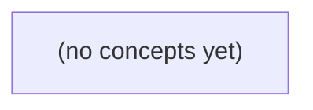

# 09.07 认证与授权：Go 即时通信中的身份、权限与撤销

*本教材承接 Cookie/Session 与数据访问，以虚构即时通信系统中的 u-a、u-b、u-c、c-a 和 m-a 为主线，建立从登录凭据到对象级授权、再到退群和撤销的完整安全心智模型。学习者将通过权限矩阵、纸上伪代码、失败序列和练习，理解认证后的身份为何不等于访问任何资源的权限。*

**章节:** 2

---

## 本书导览

- 了解整本书的章节脉络
- 掌握各章之间的概念依赖关系
- 选择最合适的阅读顺序

# 09.07 认证与授权：Go 即时通信中的身份、权限与撤销

本教材承接 Cookie/Session 与数据访问，以虚构即时通信系统中的 u-a、u-b、u-c、c-a 和 m-a 为主线，建立从登录凭据到对象级授权、再到退群和撤销的完整安全心智模型。学习者将通过权限矩阵、纸上伪代码、失败序列和练习，理解认证后的身份为何不等于访问任何资源的权限。

下方的概念图展示了本书 0 个核心概念以及它们之间的依赖关系；再下方是 1 个章节的入口。你可以按从上到下的顺序阅读，也可以根据自己的兴趣或先验知识选择切入点。

#### 概念图

## 章节索引

- **09.07 认证与授权：从登录主体到会话消息权限** — 面向Go初学者承接09.06浏览器状态、09.05数据访问，以虚构IM的u-a/u-b/u-c和c-a讲凭据/口令哈希、Session与Bearer Token、默认拒绝和对象级权限、HTTP/WS可信主体、退群与多设备撤销；静态纸上教材，不宣称上游认证实现。

## 09.07 认证与授权：从登录主体到会话消息权限

- 区分身份认证与对具体会话/消息的授权
- 解释口令哈希、盐、成本与登录失败反馈
- 比较浏览器Session与Bearer Token的生命周期
- 写出c-a成员/管理员/非成员权限矩阵
- 识别修改conversation_id/message_id后的对象级越权
- 从受信上下文确定发件人并在HTTP/WS检查权限
- 区分登出、退群、角色变更与多设备撤销
- 为安全负例定义错误与最少日志证据

认证回答“你是谁”，授权回答“你现在能否对这个资源执行此动作”。已登录不等于可访问任意会话或消息。

### 认证与授权的边界

### 认证与授权的边界

认证与授权解决的是两个相邻但不同的问题：

- **认证**：请求者能否证明自己是 `u-a`、`u-b` 或 `u-c`？例如登录成功后，服务器通过 Session 找到当前主体 `userId = u-a`。
- **授权**：这个已认证主体，此刻能否对资源执行某个动作？例如 `u-a` 是否能读取会话 `c-a`、发送消息，或移除成员。

设 `c-a` 的当前成员为 `u-a` 与 `u-b`，`u-a` 是管理员；`u-c` 虽然也拥有有效登录会话，但不是 `c-a` 成员。则教学政策固定为：

| 主体 | 读取 `c-a` | 向 `c-a` 发消息 | 移除成员 |
|---|---:|---:|---:|
| `u-a` | 允许 | 允许 | 允许 |
| `u-b` | 允许 | 允许 | 拒绝 |
| `u-c` | 拒绝 | 拒绝 | 拒绝 |

因此，处理“读取消息”请求时，不能只写“已登录即可”：

1. 从 Cookie/Session 恢复并验证当前主体；
2. 取得目标会话 `c-a`；
3. 查询主体是否为当前成员；
4. 仅当成员资格成立时返回消息，否则拒绝。

“默认拒绝”意味着：授权规则没有明确允许，就不执行操作。尤其不能因为 `u-c` 已登录、知道 `c-a` 的标识符，或猜中了消息地址，就推断其有读取权限。认证提供身份依据；授权必须同时检查**主体、动作、资源**。

### 登录凭据与会话身份

### 登录凭据与会话身份

认证的目标不是保存或反复传递用户口令，而是让服务端可靠地得到当前请求的主体，例如 `u-a`、`u-b` 或 `u-c`。口令注册时应只保存派生结果：

\[
h=\operatorname{KDF}(\text{password},\ \text{salt},\ \text{cost})
\]

其中 `salt` 为每个账户独立生成的随机盐，避免相同口令产生相同结果，也削弱预计算攻击；`cost` 是故意提高计算或内存消耗的参数，用于降低离线猜测速度。服务端保存 `salt`、`cost` 与 `h`，不保存明文口令；登录时以输入口令重新派生并进行安全比较。

登录接口对“账户不存在”“口令错误”“账户被禁用”等情形应尽量返回统一失败反馈，例如“用户名或口令错误”。否则攻击者可借由差异化提示枚举有效账户。详细原因可以写入受保护的审计日志，但不应直接暴露给浏览器。

认证成功后，常见的主体传递方式有两类：

- **浏览器 Session**：服务端创建随机、不可预测的会话标识，浏览器通常通过带 `HttpOnly`、`Secure`、合适 `SameSite` 属性的 Cookie 自动携带它。服务端再由该标识查到 `userId = u-a`。其优点是可在服务端立即失效、注销或轮换；代价是服务端需维护会话状态，并注意跨站请求伪造防护。
- **Bearer Token**：客户端在请求头中显式发送 `Authorization: Bearer <token>`，令牌本身或其对应记录携带主体信息。它适合非浏览器客户端和跨服务调用，但“持有即使用”；泄露后，攻击者可在过期前冒充该主体。因此应设置较短有效期、限制存储位置，并提供撤销或令牌版本检查。

无论 Cookie 还是 Token，认证层最终都只应产出类似“此请求主体为 `u-a`”的事实。它不能推出 `u-a` 必然能读取 `c-a`、发送 `m-a`，更不能让已登录的 `u-c` 自动获得任何会话访问权；这些具体许可必须由后续授权规则判定，默认拒绝。

### c-a 的成员权限矩阵

### c-a 的成员权限矩阵

设会话 `c-a` 当前成员为 `u-a`、`u-b`，其中 `u-a` 是管理员；`u-c` 已完成登录，但不属于该会话。消息 `m-a` 属于 `c-a`。认证阶段只能证明请求者是 `u-a`、`u-b` 或 `u-c`；授权阶段还必须判断其对 `c-a` 或 `m-a` 是否具有目标动作的权限。

| 动作 | 资源 | `u-a`（管理员） | `u-b`（普通成员） | `u-c`（非成员） |
|---|---|---:|---:|---:|
| 查看会话与消息 | `c-a`、`m-a` | 允许 | 允许 | 拒绝 |
| 发送消息 | `c-a` | 允许 | 允许 | 拒绝 |
| 移除成员 | `c-a` 的成员关系 | 允许 | 拒绝 | 拒绝 |

可将规则写成先确认成员资格、再确认角色能力：

$$
\operatorname{allow}(u,a,c)=
\operatorname{member}(u,c)\land
\operatorname{roleAllows}(\operatorname{role}(u,c),a)
$$

其中，“读消息”“发消息”的 `roleAllows` 对所有当前成员为真；“移除成员”仅对管理员为真。`u-c` 即使携带有效 Session，也只能得到“已认证”的结论，不能据此读取 `m-a`、发送消息或枚举 `c-a` 成员。

实现时应采用默认拒绝：找不到会话、找不到成员关系、角色未知、动作未定义，均返回拒绝，而不是猜测其拥有普通成员权限。这里的矩阵只描述**当前**资格；成员后来被移除后能否阅读历史消息、管理员变更是否影响既有内容，属于后续的历史权限政策。

### 对象级授权与可信发件人

### 对象级授权与可信发件人

对象级授权检查的不是“用户是否登录”，而是“该主体能否对**这个对象**做**这个动作**”。例如会话 `c-a` 当前成员为 `u-a`、`u-b`，管理员为 `u-a`：

- `u-a`、`u-b` 可以读取 `c-a`、向 `c-a` 发送消息；
- `u-a` 可以移除 `c-a` 的成员；
- `u-c` 即使持有有效登录会话，也不能读取 `c-a`，更不能发送消息或移除成员；
- 未明确允许时一律拒绝。

常见越权来自客户端篡改对象标识。若接口是 `GET /conversations/c-a/messages`，`u-c` 可能把路径改为 `c-a`；若删除接口接收 `message_id=m-a`，攻击者可能猜测或替换为不属于自己的消息。服务端不能因为对象 ID “存在”就返回或修改它，而应先从认证上下文取得主体，再验证关系：

`允许读取 = 当前主体 ∈ 会话当前成员`

`允许移除成员 = 当前主体 = 会话当前管理员`

HTTP 中，主体应来自服务端验证后的 Cookie、Session 或令牌，而不是请求体中的 `user_id`、`sender_id`。创建消息时，`sender_id` 必须由该受信主体写入；客户端最多提交 `conversation_id` 与消息内容。即使请求写着“我是 `u-a`”，只要认证上下文对应 `u-c`，发件人仍只能是 `u-c`，并且其对 `c-a` 的发送请求应被拒绝。

WebSocket 也遵循同一原则。连接建立或握手阶段确认的登录主体应绑定到连接上下文；随后收到“向 `c-a` 发送消息”的事件时，服务器从连接上下文取得发件人，而不信任事件载荷中的 `sender_id`。同时重新检查该主体是否仍是 `c-a` 的当前成员。这样，HTTP 路径参数、请求体字段与 WebSocket 事件中的对象标识都只是“请求访问哪个对象”，不能成为证明“谁在操作”的依据。

### 资格变化与安全负例

### 资格变化与安全负例

认证状态存在，不代表资格永远有效。服务端每次处理敏感请求时，应基于当前会话、当前成员关系和当前角色重新授权，而不能只相信登录时写入的旧信息。

| 变化 | 对既有会话的影响 | 典型结果 |
|---|---|---|
| 用户登出 | 当前设备的会话令牌失效 | `u-a` 不能再读会话或发送消息 |
| 被移出 `c-a` | 仍可登录，但失去该会话成员资格 | `u-b` 再请求 `c-a` 返回拒绝 |
| 角色降级 | 保留普通成员能力，失去管理员动作 | 原管理员不能移除成员 |
| 多设备撤销 | 被撤销设备的会话失效，其他设备按策略保留或同时失效 | 旧手机令牌不可继续使用 |

例如，`u-c` 已成功登录，却从未加入 `c-a`。其请求“读取 `c-a` 的消息 `m-a`”时，认证结果是“主体为 `u-c`”，授权结果仍是拒绝：`u-c` 不是 `c-a` 当前成员。默认拒绝比“只要登录即可读取”更安全。

对当前教学政策，可按如下顺序判断：

1. 会话令牌是否有效；无效则返回“未认证”。
2. 主体是否仍是 `c-a` 当前成员；不是则返回“无权限”。
3. 普通成员可读、可发消息。
4. 仅管理员可执行“移除成员”；角色变更后立即按新角色判断。

错误响应不应泄露额外信息。对外可统一返回“无权限访问该资源”，避免通过差异化提示枚举会话、消息或成员关系；服务端内部记录最少审计日志：时间、主体标识、动作、资源标识、授权结果、拒绝原因类别，如`会话失效`、`非成员`或`角色不足`。不要记录消息正文、令牌原文等敏感内容。

> **要点** — 认证建立可信主体；每次会话与消息操作仍须按当前成员关系和角色进行对象级授权，默认拒绝。

登录时提交的用户名和口令只用于证明身份，不能被当作长期会话凭据；安全设计的起点是妥善处理口令。

### 登录凭据与会话身份的边界

### 登录凭据与会话身份的边界

用户名与口令的职责是**在登录瞬间完成认证**：服务端根据用户名定位账户，再验证提交的口令是否匹配该账户保存的口令哈希。它们证明“此刻请求者可能是该用户”，却不应成为后续每个请求、WebSocket 连接或消息操作持续携带的身份依据。

认证成功后，服务端应签发或建立独立的会话身份，例如：

- 服务端保存的会话记录，客户端仅持有随机、不可预测的会话标识；
- 受完整性保护的访问令牌，其中包含主体标识、过期时间、签发方、受众等必要声明；
- 经验证的连接上下文，例如 WebSocket 握手阶段解析会话，再将可信用户标识绑定到该连接。

后续授权应依据这个经过验证的主体身份进行：`主体能否执行此操作、访问此资源、向该频道发送此消息？` 而不是相信客户端在请求体中再次提交的 `username`、`userId` 或角色字段。客户端声称“我是 alice”不构成权限证据；只有服务端从有效会话或令牌中解析出的主体才可信。

口令尤其不能被复用为会话令牌。将口令、其哈希值，或可由其直接推导的值放入 Cookie、前端存储、消息载荷或日志，都会扩大泄露后的影响范围，也使撤销、过期和设备管理变得困难。会话凭据应可过期、可撤销、可轮换；口令则只应在认证边界短暂出现，并在验证完成后立即丢弃。

### 口令哈希为何不能用快速摘要

### 口令哈希为何不能用快速摘要

口令数据库一旦泄露，攻击者通常不会继续请求登录接口，而是在本地拿到哈希副本后进行**离线猜测**：不断尝试候选口令，计算其哈希，再与泄露记录比对。此时登录失败提示、验证码和接口限速都不再有效。

明文存储显然最危险：数据库、备份、调试导出或内部误访问都会直接暴露用户口令，并可能波及用户在其他站点复用的账号。

直接保存 `SHA256(password)` 虽然不再是明文，却仍不安全。SHA-256 的目标是高速、低成本地处理大量数据；攻击者可借助多核 CPU、GPU 或专用硬件每秒计算海量摘要，迅速枚举常见口令、字典变体和泄露口令。更糟的是，同一口令总产生同一摘要，攻击者可预先构建彩虹表，并立即识别多个用户是否共用了口令。

安全的口令哈希应至少具备两项性质：

- **独立盐值**：每个用户生成随机盐，使相同口令得到不同结果。盐无需保密，但必须随哈希记录保存；它消除预计算收益，也避免攻击者一次猜中便批量命中相同口令的账户。
- **足够的计算与内存成本**：使用 Argon2id、bcrypt、scrypt 等专为口令设计的算法，故意让单次验证更慢、占用更多资源，从而显著提高离线猜测的成本。Argon2id 还提供内存硬度，能削弱 GPU 并行破解优势。

因此，应保存形如“算法版本、成本参数、盐、派生结果”的口令哈希记录，而非自行拼接 `salt + password` 后做一次 SHA-256。验证时由经过审查的库按记录参数重新派生并进行安全比较。Go 的 `x/crypto/argon2` 提供底层算法入口，但参数选择、编码格式、随机盐、迁移与比较仍需完整设计，不能把一次函数调用误当作完整认证方案。

### 采用Argon2id保存口令验证记录

### 采用 Argon2id 保存口令验证记录

口令数据库保存的不是明文口令，也不应是一次快速 `SHA-256` 结果；后者适合完整性校验，却过于廉价，泄露后攻击者可高速离线猜测。应使用专为口令设计、具备内存成本的 `Argon2id`，使每次猜测都消耗显著的时间与内存。

一条验证记录应同时包含：

- 算法与版本，例如 `argon2id`、版本号；
- 成本参数：内存 `m`、迭代次数 `t`、并行度 `p`、输出长度；
- 每个账户独立、由密码学安全随机数生成器产生的盐值；
- 派生出的哈希结果。

常见编码形式类似：

`$argon2id$v=19$m=65536,t=3,p=1$<盐>$<哈希>`

盐不是秘密，其作用是让相同口令产生不同结果，阻止攻击者复用预计算表或一次破解多个账户。参数也无需隐藏；保存它们是为了未来能够按旧参数验证，并在用户下次成功登录时升级到更强配置。

验证流程是：解析记录中的算法、参数和盐，以用户提交的口令重新派生结果，再由经过审查的库进行恒定时间比较。不要自行用普通字符串比较替代安全比较，也不要根据“用户不存在”“盐无效”暴露可区分的失败信息；对外统一返回登录失败。

Go 的 `golang.org/x/crypto/argon2` 提供 `IDKey` 等底层派生入口，但它不负责记录编码、参数策略、随机盐生成、格式解析、恒定时间比对、参数升级和登录限速。因此，生产系统应优先采用经过维护和审查的完整口令哈希封装；若必须自行封装，必须明确这些边界，并为异常记录、参数上限和升级路径编写测试。口令、派生前字节及完整认证凭据都不得写入日志。

### 虚构IM登录失败的安全反馈

### 虚构 IM 登录失败的安全反馈

设虚构即时通信服务有三个账号：`u-a`、`u-b`、`u-c`。登录接口应把“对外反馈”和“对内审计”分开设计：用户只得到不泄露账号状态的结果，运维与安全人员则获得足够的事件线索。

- `u-a`：用户名不存在。客户端统一收到：**“用户名或口令错误，请重试。”**  
  不应提示“用户不存在”，否则攻击者可批量枚举有效账号。

- `u-b`：用户名存在，但口令校验失败。客户端仍收到同一句通用提示。  
  服务端记录失败计数、来源 IP、设备标识摘要和时间；达到阈值后实施逐步延迟、临时限速或要求额外验证。限速应同时覆盖账号维度与来源维度，避免攻击者轮换账号或 IP 绕过。

- `u-c`：账号因异常行为被暂时保护。客户端依旧不应暴露“该账号已被锁定”等具体状态，可提示：**“登录暂时不可用，请稍后再试或联系支持。”**  
  审计事件应明确标记为风险控制拒绝，便于后续关联分析和人工处置。

审计日志可记录：

`登录失败 account=u-b source_ip_hash=... reason=口令校验失败 retry_after=30s`

但绝不能记录口令、口令哈希输入、`Authorization` 头、会话令牌、刷新令牌或完整登录请求体。即使日志系统本身受控，凭据一旦进入日志，也会因检索、导出、备份和权限扩散而扩大泄露面。

统一错误提示不是降低安全能力，而是避免把账号存在性、锁定状态和认证策略变成攻击者的探测接口；限速与审计则把防护能力留在服务端。

### 认证结果如何进入后续授权

### 认证结果如何进入后续授权

口令验证成功的产物不应是“继续携带口令”，而应是一个已认证的**主体**：例如用户 `user_id`、租户 `tenant_id`、角色或权限版本。后续授权只围绕主体与请求资源、动作之间的关系判断：

$$
\text{allow} = \operatorname{Authorize}(\text{subject},\ \text{action},\ \text{resource})
$$

典型链路是：

1. 登录端点接收用户名和口令，调用口令哈希库验证。
2. 验证成功后，服务端确定主体身份及必要的认证上下文。
3. 服务端签发短期 Session 或 Bearer Token；客户端保存并在后续请求中携带它，而不是保存或重传口令。
4. HTTP 中间件验证 Session/Token，恢复主体并写入请求上下文。
5. 业务处理器从上下文取得主体，执行“谁能对什么资源做什么”的授权检查。

Session 通常只向客户端暴露随机、不透明的会话标识，主体、过期时间、撤销状态可保存在服务端。Bearer Token 则应具备签名或可验证的随机性，包含或关联主体、受众、过期时间等约束；它是持有即可能被使用的凭据，必须使用 HTTPS、设置较短有效期，并支持撤销或轮换策略。

WebSocket 的握手同样先完成认证：验证 Cookie 中的 Session 或握手携带的 Token，并将主体绑定到该连接。此后每条消息仍要按其目标资源检查权限，不能因为“连接已登录”就默认允许订阅任意频道、读取任意对象或执行任意操作。认证回答“你是谁”，授权回答“你现在能做什么”。

> **要点** — 口令只用于登录验证；服务端应使用带盐和成本参数的成熟口令哈希，登录后以受信会话身份参与授权。

认证先确认“你是谁”，授权再判断“你能对这条会话或消息做什么”；Cookie与令牌只是承载凭据的方式，不等同于安全边界。

### 从登录主体到受信会话

### 从登录主体到受信会话

一次请求的“已登录”不应理解为客户端声称了某个用户，而应拆成四层：

1. **凭据验证**：验证密码、一次性验证码、WebAuthn 断言或第三方身份提供方返回的结果。此阶段回答“提交的证明是否有效”。
2. **主体识别**：将验证结果映射为内部主体，例如 `user_id=42`、服务账号或匿名访客。外部邮箱、手机号、OAuth `sub` 都不宜直接充当业务权限主键。
3. **会话状态**：服务端创建或恢复会话记录，将会话标识映射到主体及其上下文：设备、创建时间、过期时间、最近活动、认证强度、撤销状态等。
4. **请求授权**：每次访问具体资源时，依据当前主体、会话状态和资源规则判断，例如“该用户是否仍在群组中”“是否可删除此消息”。

可抽象为：

\[
\text{请求凭据} \rightarrow \text{会话} \rightarrow \text{主体} \rightarrow \text{当前策略判定}
\]

客户端携带的 Cookie、Bearer 令牌或其他标识只是查找会话或验证声明的**线索**；它们不是身份事实本身。服务端应是信任根：只有服务端确认凭据有效、会话未撤销、主体仍存在且策略允许后，请求才获得权限。

登录成功后，通常应新建或轮换会话标识，避免攻击者预先固定会话 ID；权限提升（如完成二次验证、成为管理员）也应轮换会话，并记录更高的认证等级。登出不能只清除浏览器中的 Cookie，还应让服务端会话失效，否则被复制的旧凭据仍可能继续使用。

尤其要避免把“认证过”误写成“永远有权”。用户退群、账号禁用、角色变更或会话被撤销后，授权层必须能反映最新状态。

### Cookie会话的映射、轮换与失效

### Cookie会话的映射、轮换与失效

Cookie 通常不直接保存“用户是谁”或“拥有哪些权限”，而是承载一个高熵、不可预测的会话标识 `sid`。浏览器后续请求自动携带该 Cookie，服务端据此查询会话记录：

`sid → {用户 u，认证等级 a，设备信息，创建时间，过期时间，撤销状态}`

其中，认证等级 `a` 可区分普通登录、已完成多因素认证、刚完成敏感操作确认等状态。设备信息可包含设备标识、客户端特征、最近活跃时间或风险标记，用于展示“已登录设备”、限制异常会话或实施分设备登出。

会话安全依赖于这张服务端映射表，而非 Cookie 名称本身。`sid` 应足够随机，Cookie 至少应设置 `Secure`、`HttpOnly` 与合适的 `SameSite` 属性；但这些属性不能替代服务端的过期、撤销和权限校验。

关键状态变化时，应避免继续复用旧会话标识：

- **登录成功**：轮换匿名访问阶段的 `sid`，再绑定到用户，降低会话固定攻击风险。
- **权限升级**：例如完成二次验证、进入管理员身份或切换组织角色时，重新签发 `sid`，并提高对应认证等级。
- **登出**：服务端将该 `sid` 标记为撤销或直接删除映射；仅让浏览器删除 Cookie 不足以阻止已被窃取的标识继续使用。
- **修改密码、发现风险、账号禁用**：可撤销该用户全部会话，或仅撤销指定设备会话。

因此，会话应同时具有绝对过期时间与闲置超时：前者限制最长存活期，后者限制长期未活动的暴露窗口。每次访问消息、会话或管理接口时，服务端都应确认 `sid` 仍有效，并基于当前的用户状态和授权关系重新判断权限。

### Bearer令牌与签名令牌的边界

### Bearer令牌与签名令牌的边界

`Authorization: Bearer <token>` 表示客户端以“持有凭据”证明身份：谁拿到令牌，谁就能在其有效范围内使用它。它并不天然绑定浏览器、设备或用户操作，因此泄露来源包括日志、前端脚本、错误跳转、恶意扩展和不安全传输。令牌应只经 HTTPS 发送，避免写入 URL、页面源码和可被第三方读取的日志；有效期也应尽量短。

Bearer 是使用方式，不是令牌格式。常见两类如下：

- **不透明令牌（opaque token）**：令牌本身只是随机字符串，服务端通过存储查询其映射：`token → 用户、设备、权限、过期时间、撤销状态`。每次请求都可看到最新状态，因此用户退群、管理员禁用账号或执行登出后，可立即拒绝后续请求。代价是需要服务端存储或集中校验。
- **JWT 等签名令牌**：令牌携带声明，如 `sub`、`exp`、角色或会话标识，并由发行方签名。资源服务可验证签名、发行者、受众和过期时间，通常不必每次查询认证库，适合跨服务验证。  
  但签名只说明“内容未被篡改且由可信发行者签发”，不说明其中权限仍然最新。用户被移出群聊后，一个尚未过期、仍含旧群组声明的 JWT 不会自动失效。

因此，JWT 不能仅靠“签名有效”完成敏感授权。对于消息读取、发言、管理等操作，服务端仍应按当前会话成员关系检查权限；若要求即时撤销，可缩短 `exp`、维护 `jti` 撤销表，或在令牌中携带可查询的会话版本号。

不要把 Bearer 放进 Cookie 就误认为其不再是持有即用。Cookie 可借助 `HttpOnly` 降低脚本窃取风险，却会自动随请求发送，仍需处理跨站请求伪造；放在 `Authorization` 头可减少自动携带，却要防止前端存储和脚本泄露。安全性取决于传输、存储、有效期、撤销和请求来源校验的组合。

### 退群后令牌仍有效的案例

### 退群后令牌仍有效的案例

设用户 `u-a` 曾是会话 `c-a` 的成员，登录后获得一个签名 JWT：

`Authorization: Bearer <jwt>`

令牌载荷可能包含：

- `sub = u-a`：主体是谁；
- `exp`：令牌过期时间；
- `iss`、`aud`：发行者与受众；
- 甚至包含旧的 `groups` 或 `roles` 声明。

随后，`u-a` 主动退出 `c-a`，服务端已删除成员关系：

`membership(u-a, c-a) = false`

但 `u-a` 本地仍保存旧 JWT，并继续调用：

`POST /conversations/c-a/messages`

如果服务端只做 JWT 验签与过期检查：

1. 签名正确；
2. `exp` 尚未到期；
3. `iss`、`aud` 符合预期；

就可能错误地接受请求。原因是签名只能证明：该令牌未被篡改，且曾由可信发行者签发；它不能证明“`u-a` 此刻仍是 `c-a` 的成员”。

发送消息时，授权应基于当前状态重新判断，例如：

`allow_send = valid_token ∧ active_session ∧ membership(u-a, c-a) ∧ can_send(u-a, c-a)`

其中 `membership` 必须查询权威成员关系，或读取能够及时失效的授权版本、撤销状态。若把“属于某会话”长期固化进 JWT，退群、被移除、禁言等变化会在令牌到期前滞后生效。

常见修复方式包括缩短访问令牌有效期、维护撤销列表或成员版本号、对高风险操作实时查库。核心原则是：认证令牌确认请求主体，消息权限仍应以当前会话状态为准。

### 会话载体的安全取舍

### 会话载体的安全取舍

Cookie 与 Bearer 令牌的差异，首先在于**浏览器是否自动携带凭据**，而非“谁天然更安全”。

- **Cookie 会话**适合传统浏览器应用。服务端保存 `session_id → user/device/expiry/revocation` 映射，Cookie 仅携带随机会话标识。设置 `Secure`、`HttpOnly`、合理的 `SameSite`，并在跨站敏感请求中使用 CSRF 令牌或来源校验。`HttpOnly` 能降低脚本直接窃取 Cookie 的风险，但不能阻止浏览器自动附带 Cookie，因此不能把它当作 CSRF 防护。
- **Bearer 令牌**适合移动端、命令行客户端、服务间调用或前后端分离的显式授权请求。客户端通过 `Authorization: Bearer <token>` 主动发送凭据，通常不受浏览器自动跨站携带影响；但一旦令牌被脚本、日志、截图、浏览器扩展或错误重定向泄露，持有者即可使用。令牌必须仅经 HTTPS 传输，避免放入 URL、查询参数和可被第三方读取的位置。

令牌应采用短生命周期；刷新、登出、设备丢失、密码修改、权限升级时，应能服务端撤销或轮换。JWT 签名只证明令牌未被篡改且来自可信发行者，**不自动感知**用户退群、角色变化或管理员撤销；高实时性权限场景需要查询服务端状态、维护撤销列表，或使用可内省的 opaque token。

检查时至少保留必要证据：会话或令牌的发行时间、过期时间、主体、设备或客户端标识、撤销原因与最近使用时间；日志中不得记录完整 Cookie、Bearer 值、刷新令牌或签名后的 JWT。

> **要点** — Cookie和令牌都只传递凭据；每次访问c-a或其消息时，仍须依据当前服务端状态确认主体、有效性与权限。

认证确认“你是谁”，授权判断“你现在能否对这个会话中的这个对象执行此操作”。权限必须随请求、资源与当前成员关系重新判定。

### 从可信主体到授权三元组

### 从可信主体到授权三元组

认证完成后，服务端得到可信主体 `subject`，例如 `u-a`、`u-b`、`u-c`；但这并不意味着主体可以访问任意会话或消息。每个请求都应按以下上下文独立判定：

\[
\operatorname{allow}=f(\text{subject},\text{action},\text{resource},\text{current membership})
\]

其中，`action` 是具体动作，如 `read_history`、`send_message`、`invite`、`remove`、`member_read_receipt`；`resource` 是目标会话 `c-a`、消息或成员记录。系统采用**默认拒绝**：只有授权规则明确满足时才放行。

以会话 `c-a` 为例，假设 `u-a` 是普通成员，`u-b` 是该会话管理员，`u-c` 不是成员：

| 请求 | 判定依据 | 结果 |
|---|---|---|
| `u-a` 读取 `c-a` 历史 | 当前仍为成员 | 允许 |
| `u-a` 邀请新成员 | 普通成员无邀请权限 | 拒绝 |
| `u-b` 移除 `c-a` 成员 | 是该会话管理员，目标可被管理 | 允许 |
| `u-c` 发送至 `c-a` | 不具备当前成员关系 | 拒绝 |
| `u-c` 查询某条 `c-a` 消息 | 知道 `message_id` 不等于有访问权 | 拒绝 |

角色必须限定在资源作用域内：`u-b` 是 `c-a` 的管理员，不代表其对其他会话天然拥有管理权，更不应被实现成全局“万能管理员”。同样，资源标识符可被猜测、枚举或从链接中泄露；`conversation_id`、`message_id` 只能用于定位对象，不能证明请求者有权操作它。

因此，处理接口时应先从会话令牌恢复主体，再加载目标资源及其**当前**成员关系，最后检查“该主体能否对该资源执行该动作”。不要只验证“已登录”，也不要仅凭客户端提交的角色、会话 ID 或消息 ID 放行。尤其要防御 OWASP BOLA：攻击者将请求中的 `conversation_id` 或 `message_id` 改为他人资源时，服务端仍必须重新执行完整授权判定。

### c-a权限矩阵与默认拒绝

### c-a 权限矩阵与默认拒绝

在会话 `c-a` 中，授权决策不能只看“是否已登录”或“是不是管理员”，而应针对每个请求计算：

`允许 = 当前主体 + 请求操作 + 目标资源 + c-a中的当前成员关系 + 会话内角色`

设 `u-a` 为普通成员，`u-b` 为 `c-a` 的管理员，`u-c` 为非成员。除矩阵明确允许的情形外，一律拒绝；“资源 ID 猜得到”“曾经是成员”“全局后台管理员”等都不是默认授权依据。

| 操作 | u-a：成员 | u-b：c-a 管理员 | u-c：非成员 | 核心判定 |
|---|---|---|---|---|
| `read_history` | 允许读取 `c-a` 历史 | 允许 | 拒绝 | 必须是当前成员，且消息属于 `c-a` |
| `send_message` | 允许发送至 `c-a` | 允许 | 拒绝 | 发送目标会话必须与成员关系一致 |
| `invite` | 拒绝 | 允许邀请新主体 | 拒绝 | 邀请权是会话内管理权限 |
| `remove` | 拒绝 | 可移除普通成员；通常不得绕过规则移除自身或更高权限者 | 拒绝 | 操作人与被操作人都需属于正确会话 |
| `member_read_receipt` | 仅可写入自己的已读状态 | 可写自己的；是否可查看他人状态须单独授权 | 拒绝 | 已读回执绑定“成员—会话—消息”三元关系 |

正例：`u-a` 请求读取 `c-a` 中消息 `m-1`，服务端确认 `m-1.conversation_id == c-a` 且 `u-a` 仍是成员，才返回消息。

反例：`u-c` 将请求中的 `conversation_id` 改为 `c-a`，或将 `message_id` 改为可猜测的 `m-1`；即使 ID 存在，也必须返回拒绝。否则就是对象级授权失效（BOLA）：攻击者通过替换对象标识跨会话读取、发言或修改状态。

### 角色只在会话范围内生效

### 角色只在会话范围内生效

`admin` 不是“全局管理员”标签，而是主体在某个会话成员记录上的属性。例如：

- `u-b` 在 `c-a` 的成员记录为 `role=admin`
- `u-b` 在 `c-b` 可能只是 `member`，也可能根本不是成员
- 因此，`u-b` 对 `c-a` 的邀请、移除成员等管理操作，不自动延伸到 `c-b`

授权判断应绑定三元关系：

\[
(subject,\ conversation,\ current\ membership)
\]

处理 `invite`、`remove` 或修改成员设置时，服务端必须查询“请求主体是否**当前仍是目标会话的管理员**”。不能仅依据令牌中的 `role=admin`、前端传来的角色字段，或用户资料中的“管理员”标记放行。

| 请求 | 错误判断 | 正确判断 |
|---|---|---|
| `u-b` 邀请用户加入 `c-a` | `u-b` 是 admin，因此允许 | `u-b` 是 `c-a` 当前 admin，因此允许 |
| `u-b` 移除 `c-b` 成员 | `u-b` 在 `c-a` 是 admin，因此允许 | 查询 `c-b`：若非当前 admin，则拒绝 |
| `u-b` 阅读 `c-b` 历史消息 | 管理员可读任意会话 | 必须是 `c-b` 当前成员，并满足历史读取规则 |
| `u-c` 传入可猜的 `conversation_id=c-a` | 知道资源 ID 即可访问 | 非成员，默认拒绝 |

尤其不能把会话内角色编码成跨资源通行证。即使访问令牌含有“管理员”声明，服务端仍应以数据库或可信权限服务中的当前会话成员关系为准；成员被移除、角色降级后，后续请求应立即失去相应权限。

### 资源标识可猜时的对象级越权

### 资源标识可猜时的对象级越权

会话编号和消息编号通常是递增整数、短 UUID，或可从接口响应中观察到；但“知道 ID”只说明客户端能构造请求，绝不说明其有权操作该对象。若服务端仅按 `conversation_id` 或 `message_id` 查询记录并执行操作，就会形成 OWASP BOLA（对象级授权失效）。

设 `u-a` 是会话 `c-a` 的成员，`u-b` 是 `c-a` 的管理员，`u-c` 不是成员。每次请求都应先认证主体，再依据“主体—动作—资源—当前成员关系”授权：

| 请求与篡改 | 错误实现 | 正确判定 |
|---|---|---|
| `u-a` 读取历史：`GET /conversations/c-a/messages` | 查询到会话即返回 | `u-a` 当前是 `c-a` 成员，允许 `read_history` |
| `u-c` 将 `c-a` 改为猜到的 ID | 仅验证登录态，返回消息 | `u-c` 非成员，拒绝；不能因 ID 存在而授权 |
| `u-a` 发送消息到 `c-b` | 只检查 `u-a` 是任意会话成员 | 必须检查 `u-a` 属于目标 `c-b`，否则拒绝 `send_message` |
| `u-a` 用自己的 `message_id` 替换为他会话消息 | 按消息 ID 直接删除或修改 | 先验证消息归属 `c-a`，再验证主体在该会话的动作权限 |
| `u-b` 移除成员 | 把 `admin` 当作全局管理员 | 仅当 `u-b` 当前在目标会话中具备管理员角色时允许 `remove` |

安全查询应把归属与成员条件纳入同一授权路径：`消息属于目标会话`、`主体是该会话当前成员`，并额外检查动作所需角色。对不存在的资源、无成员关系或归属不匹配，统一返回拒绝结果，避免通过错误差异枚举有效 ID。

### 状态变化、拒绝结果与审计证据

### 状态变化、拒绝结果与审计证据

授权不是“登录时判定一次”。每个请求都必须基于**当前**会话成员关系、当前角色和目标资源重新计算；退群、被移除、降级后，旧令牌或仍存活的连接都不应保留历史权限。

| 状态变化 | 立即失效的能力 | 请求结果 |
|---|---|---|
| `u-a` 主动退出 `c-a` | `read_history`、`send_message`、`member_read_receipt` | 拒绝 |
| `u-b` 将 `u-c` 移出 `c-a` | 读取消息、发送消息、查看回执 | 拒绝 |
| 管理员降为普通成员 | `invite`、`remove`、角色变更 | 拒绝 |
| 消息被删除或不属于该会话 | 按 `message_id` 读取、修改或回执 | 拒绝 |

服务端应在事务提交后立即使授权缓存、会话权限快照和长连接订阅失效；消息推送也必须在投递前确认接收者仍是成员。不能因为用户此前订阅过会话，就继续向其推送新消息或回执。

拒绝响应应保持安全且稳定：未认证返回“需要登录”；已认证但无权、资源不存在、资源不属于目标会话时，优先返回统一的“无权访问”或对外不可区分的“不存在”。不要泄露“该会话存在”“该消息属于某管理员”“你刚被移除”等内部状态。客户端可展示“你已无权访问此会话”，但服务端不能依赖客户端禁用按钮作为控制。

审计日志至少记录：`request_id`、时间、主体 `subject_id`、动作 `action`、资源类型与标识、会话 `conversation_id`、授权判定结果、拒绝原因类别、判定时成员关系/角色、来源 IP 或设备会话标识。日志避免记录消息正文、完整令牌和敏感附件；对 `invite`、`remove`、角色变更及连续拒绝请求提高告警级别。

> **要点** — 权限不是由可猜资源ID或全局角色决定，而是对当前主体、动作、资源及成员状态的默认拒绝式判断。

认证确认“你是谁”，授权决定“你能对哪条会话和消息做什么”。处理器必须只信任认证上下文中的主体，而非客户端声明的身份。

### 可信主体：身份不能来自请求载荷

### 可信主体：身份不能来自请求载荷

客户端请求中的 `sender_id`、`user_id`、`author` 都是不可信声明：它们只能描述“客户端声称是谁”，不能作为服务端认定发件人的依据。否则攻击者只需把载荷改为其他用户标识，即可伪造消息、越权编辑或读取他人资源。

认证中间件完成令牌、会话或签名校验后，应将已验证主体注入可信上下文，例如：

`context.subject_id = 已验证令牌中的用户标识`

处理器随后只从该上下文取得主体：

`subject = request.context.subject_id`

发送消息时，服务端应自行写入归属关系：

`message.sender_id = subject.id`

而不是：

`message.sender_id = payload.sender_id`  ← 不安全

若协议为了客户端展示、幂等关联或代理发送而保留 `sender_id` 字段，也必须将其视为普通输入；通常应忽略它，或要求其与可信主体严格一致，否则返回参数错误或拒绝请求。更稳妥的设计是从写入接口中直接删除该字段：

`发送消息(会话标识, 内容, 幂等键)`

认证缺失、令牌无效或上下文未注入时，处理器不得回退到载荷身份，更不能使用默认用户、匿名管理员等“兼容逻辑”。应立即终止请求。对 HTTP，每个请求都重新建立或验证可信上下文；对 WebSocket，握手认证不等于永久授权，处理每一条应用消息时仍应从该连接绑定的已认证主体取得身份，并继续执行会话与消息级授权检查。

### 会话与消息的对象级权限链

### 会话与消息的对象级权限链

对象级授权不能只检查“已登录”或“具有用户角色”。客户端可替换 `conversation_id`、猜测 `message_id`，因此处理器应从可信认证上下文取得主体 `subject`，并将每次操作推导为一条由粗到细的权限链：

1. **会话可见性**：该会话是否存在，且 `subject` 是否有权获知它。
2. **成员关系**：`subject` 是否仍是会话成员；被移除、退出或封禁后立即失效。
3. **角色能力**：成员角色是否允许本操作，例如普通成员可发送，管理员可管理成员。
4. **消息归属与状态**：修改、撤回或删除时，目标消息必须属于该会话；还要验证作者是否为 `subject`，或其角色是否具备管理权限。

可将写操作表达为：

`认证主体 → 查询可见会话 → 锁定/确认有效成员资格 → 检查角色 → 查询属于该会话的消息 → 检查作者或管理权 → 执行变更`

例如撤回消息时，错误的实现是先按 `message_id` 找消息，再仅比较作者；攻击者可传入另一会话的消息标识，造成跨会话操作。正确查询应把会话约束合入条件：

`SELECT ... FROM messages WHERE id = :message_id AND conversation_id = :conversation_id`

随后验证 `message.author_id = subject.id`，或 `subject` 在该会话中具有撤回他人消息的角色。

读取历史同样不能只按会话标识查询。应先以“主体可见的会话”作为数据访问范围，再读取其消息；无成员资格、已退群和不存在会话在外部可统一返回“不可访问”，避免借响应差异枚举资源。内部日志仍应区分不存在、非成员、角色不足等原因。

对 HTTP 请求和每条 WebSocket 应用消息都重复这条链。尤其在“检查成员资格后、写入消息前”发生退群时，应在同一事务或一致性快照内确认资格；否则旧检查结果会让已退出成员成功发送消息。

### c-a 权限矩阵与处理器伪代码

### c-a 权限矩阵与处理器伪代码

设会话 `c-a` 有三类主体：普通成员、管理员、非成员。权限不由请求体中的 `sender_id`、`role` 或 `user_id` 决定，而由认证中间件写入的可信 `subject`，再结合数据库中的成员关系判定。

| 操作 | 普通成员 | 管理员 | 非成员 |
|---|---:|---:|---:|
| 查看可见历史 | 允许 | 允许 | 拒绝或返回空结果 |
| 发送消息 | 允许 | 允许 | 拒绝 |
| 移除普通成员 | 不允许 | 允许 | 拒绝 |
| 管理会话设置/成员 | 不允许 | 允许 | 拒绝 |

“查看历史”还应受消息级可见性约束：例如某条消息仅对管理员可见，则普通成员即使属于 `c-a` 也不能读到它。对已退群用户，系统通常按当前或查询时刻的成员快照决定是否可见；关键是查询成员关系与读取消息应在同一事务或一致性快照中完成，避免“先检查仍是成员、后查询时已被移除”的竞态。

纸上伪代码如下：

`subject = require_authenticated_context(request)`

`conversation_id = request.path.conversation_id`

`membership = db.membership_at_snapshot(subject.id, conversation_id)`

`if membership is None: deny_or_empty_history()`

`if action == "send":`
`    require(membership.active)`
`    db.insert_message(conversation_id, sender_id=subject.id, body=request.body)`

`if action == "remove_member":`
`    require(membership.role == "admin")`
`    require(target_is_removable(request.target_id))`
`    db.remove_membership(conversation_id, request.target_id)`

`if action == "history":`
`    return db.visible_messages(conversation_id, subject.id, membership.role)`

注意 `sender_id=subject.id` 是服务端覆盖写入，而不是读取载荷中的声明。HTTP 请求应逐次执行上述检查；WebSocket 则必须对每条应用消息重新取得连接认证主体并检查会话权限，不能因为握手时曾通过认证，就默认后续所有 `conversation_id` 都可访问。

对外错误可统一为“无权访问或资源不存在”，降低枚举会话的风险；但内部审计应区分“会话不存在”“非成员”“已退群”“消息不可见”等真实原因。

### 退群竞态、可见性与错误边界

### 退群竞态、可见性与错误边界

“先查成员资格、再查消息”若分成两个非一致读，会产生退群竞态：用户在第一步仍是成员，第二步时已被移除，却读到了本应失去可见性的历史；反过来，也可能把刚加入后的消息错误判为空。

数据访问层应在同一事务或一致性快照中推导可见消息集，而不是由处理器拼接两次独立查询：

`subject ← 认证上下文`  
`membership ← 在快照中读取会话成员状态`  
`若 membership 不存在或已失效：内部结果=未授权`  
`否则 messages ← 按会话、可见时间窗、消息状态查询`

可见性条件通常不仅是“当前是成员”，还包括加入/退出边界。例如消息 `m` 对主体 `u` 可见，当且仅当 `m.created_at` 落在该成员关系的有效区间内；被撤回、被删除或仅对特定角色可见的消息，还要叠加相应谓词。

失败序列可写为：

1. `u` 请求拉取会话 `c` 的历史；
2. 系统建立一致性快照；
3. 快照中 `u` 已于 `t_leave` 退群；
4. 查询只返回 `created_at < t_leave` 且允许保留的消息，或直接判定无访问权；
5. 即使另一事务随后重新入群，也不能改变本次读取的授权结论。

内部应严格区分三类结果：`未授权`、`已授权但空历史`、`资源不存在`。前两者决定审计、告警和客户端状态机；但外部响应可将“会话不存在”与“无权访问该会话”统一为模糊的“不可访问”，避免攻击者通过状态码、错误文案或响应时间枚举会话。只有在调用者已证明对会话具备某种基础可见性后，才适合明确返回“消息不存在”或“历史为空”。

### HTTP 与 WebSocket 的持续授权检查

### HTTP 与 WebSocket 的持续授权检查

HTTP 的天然边界是“每个请求”：中间件验证令牌，处理器从可信认证上下文取得 `subject`，再按目标会话、消息归属和当前角色授权。客户端传入的 `sender_id`、`user_id` 只能视为业务字段，不能作为身份依据。

WebSocket 连接时认证只解决“谁建立了连接”，不能替代后续授权。每条应用消息都应重新从连接绑定的认证主体取得 `subject`，并查询或校验当前成员资格、角色、设备撤销状态及消息可见性：

`authorize(subject, action, conversation_id, message_id, snapshot)`

典型失败序列如下：

1. 用户 A 建立 WebSocket 连接并加入会话。
2. 管理员将 A 移出会话，或将其角色从“可发言”降为“只读”。
3. A 使用既有连接发送消息、拉取历史或编辑旧消息。
4. 若服务端只在握手时授权，操作会错误成功；正确实现应在该消息处理点拒绝。
5. 若令牌或设备已被撤销，即使连接仍存活，也应拒绝后续消息并关闭或降级该连接。

查询历史时，数据访问层应以 `subject` 和会话可见性过滤，而不是先读取全部记录再由应用层筛选。退群与读历史并发时，使用事务或一致性快照：在同一授权快照内确认成员资格并读取消息，避免“先验权、后退群、仍返回历史”的竞态。未授权、会话不存在和无历史可在外部统一返回模糊错误或空结果策略，以减少资源枚举；内部仍应保留可区分的审计原因。

最少日志证据包括：请求/连接标识、可信 `subject`、目标会话或消息标识、动作、授权决定、策略版本或成员资格版本、撤销状态与拒绝原因。不要记录令牌、完整消息正文或不必要的个人数据。

> **要点** — 身份来自可信认证上下文；每次访问都须按会话、角色和消息归属授权，并在状态变化后立即失效。

登录成功只证明请求者是 u-a；设备退出、退群和角色变更后，仍须重新判断其对 c-a 与具体消息的权限。

### 同一用户的多设备会话合同

### 同一用户的多设备会话合同

设用户 `u-a` 同时在浏览器与手机登录，服务端分别签发两个会话：`s-web`、`s-mobile`。两者主体都属于 `u-a`，但它们是独立的登录合同：各自有会话标识、刷新凭证、设备信息、过期时间与撤销状态。

“退出当前设备”应只撤销发起退出的会话。例如浏览器调用退出接口后，服务端将 `s-web` 标记为已撤销，并使其访问令牌或刷新令牌失效；手机上的 `s-mobile` 仍可继续收发消息。若仅删除浏览器本地 Cookie，却未在服务端撤销 `s-web`，被窃取的令牌仍可能可用。

“退出所有设备”则是以 `u-a` 为范围撤销全部活跃会话，包括 `s-web`、`s-mobile` 及其他设备。实现上可逐条标记会话失效，也可递增用户的会话版本号 `sessionVersion`：令牌携带旧版本时，服务端校验发现不一致即拒绝。

服务端至少应承担三项责任：

- 明确退出接口的撤销范围，不能把“当前设备”悄悄实现成“全部设备”，或反之。
- 在刷新令牌、建立 WebSocket、发送消息等关键入口检查会话是否仍有效。
- 对已建立的长连接主动断开或发送失效事件；否则客户端虽显示“已退出”，旧连接仍可能继续操作。

因此，认证主体相同不意味着会话状态相同：`u-a` 可以在手机保持登录，同时让浏览器会话永久失效。

### 退群不等于身份失效

### 退群不等于身份失效

用户 `u-a` 在浏览器或手机上登录后，Session/JWT 通常仍声明其主体为 `u-a`。当 `u-a` 退出会话 `c-a` 时，被撤销的是成员关系，而不是登录身份：

\[
\text{Session.subject}=u\text{-a} \quad \land \quad \text{membership}(u\text{-a},c\text{-a})=\text{false}
\]

因此，不能因为 Token 尚未过期，就继续允许其访问 `c-a`。对会话资源的授权应在每次关键操作中独立判断：

- **读取历史消息**：是否允许退出前已见消息、是否允许查看退出前一段时间的历史，属于业务规则；不能仅凭 JWT 中的 `role` 推断。
- **订阅会话**：建立 WebSocket 订阅时检查成员资格；成员资格撤销后，应取消订阅或推送“权限已撤销”事件。
- **发送消息**：每条消息写入前复核 `can_send(u-a, c-a)`，不能只检查连接建立时的权限。
- **拉取附件、搜索、已读回执**：同样属于会话范围资源，均应检查当前成员关系或相应历史可见范围。

尤其是 WebSocket 旧连接：它仍可证明连接对端是 `u-a`，却不能证明 `u-a` 仍是 `c-a` 成员。若服务端只在握手阶段鉴权，退群后的旧连接可能继续发信。可靠做法是逐条授权，或在成员关系撤销时广播失效事件并立即关闭该会话相关订阅。

### HTTP 与 WebSocket 的持续授权

### HTTP 与 WebSocket 的持续授权

认证得到的是“请求者当前可被识别为 `u-a`”，授权则要在每次访问具体对象时回答：`u-a` 此刻是否仍可对 `c-a`、`message_id` 执行该动作。不能因为令牌有效，便默认其仍可读群消息、发送消息或修改历史记录。

对 HTTP 接口，应在每次请求中提取并校验对象关系：

- `GET /conversations/c-a/messages`：检查 `u-a` 是否仍是 `c-a` 成员，以及业务是否允许其查看该时间范围的历史。
- `POST /conversations/c-a/messages`：检查成员资格、禁言状态、角色、会话是否关闭等。
- `DELETE /messages/m-1`：除会话成员资格外，还应检查 `m-1` 属于哪个会话、是否为本人消息、是否具有管理员删除权。

也就是说，`conversation_id` 与 `message_id` 必须进入授权判定；仅验证 JWT 中的 `role=member` 不足以防止跨会话越权或读取不应可见的历史。

WebSocket 在握手时认证并不等于连接存续期间永久授权。连接建立后，客户端每次订阅频道、发送消息、编辑或撤回消息，服务端都应重新检查对应会话和消息对象。若 `u-a` 被移出 `c-a`，其会话身份仍可为 `u-a`，但对 `c-a` 的权限已经撤销；旧连接不得继续订阅或发信。

常见实现是：权限变更时发布撤销事件，网关或连接节点据此取消订阅、拒绝后续帧，必要时主动关闭连接；同时，消息处理路径仍保留逐条授权检查，避免撤销事件延迟、丢失或多节点不同步造成漏洞。角色变更也应避免完全依赖旧令牌声明，可采用短期令牌叠加服务端成员状态、权限版本号或拒绝列表。

### 角色变更与陈旧令牌风险

### 角色变更与陈旧令牌风险

令牌签发时携带的 `role=admin`、`member=true` 或频道列表只是**签发瞬间的快照**。若 u-a 在手机与浏览器各持有一个仍有效的令牌，之后被降级、退群或被要求退出所有设备，旧令牌的签名依然合法，却可能表达已经失效的权限。

常见控制手段的适用性不同：

| 手段 | 角色变更后的效果 | 多设备撤销效果 | 代价与局限 |
|---|---|---|---|
| 短期 Token | 最多在过期时间内陈旧 | 最多残留到各 Token 过期 | 简单，但无法即时撤销；刷新周期越短，体验与刷新压力越高 |
| 服务端成员状态查询 | 每次操作按当前成员、角色、频道状态判定，可即时生效 | 可统一拒绝已撤销用户或设备 | 最可靠；高频 WS 发信、订阅时需缓存与失效策略 |
| 会话/权限版本号 | Token 内版本与服务端版本不一致即拒绝 | 可按用户、会话或设备递增版本 | 适合“退出所有设备”；版本粒度设计不当会误伤其他设备 |
| 拒绝名单 | 命中被撤销的 Token、`jti` 或会话即拒绝 | 可精确撤销某设备或全部会话 | 需要存储、查询与过期清理；本质上引入服务端状态 |

实践中通常组合使用：访问 Token 保持较短有效期；对发送消息、修改频道、订阅私密频道等敏感动作查询 c-a 的当前成员状态；“退出当前设备”将该设备会话或 `jti` 加入拒绝名单，“退出所有设备”递增 u-a 的全局会话版本。Token 中的角色只能用于初步识别，不能替代资源级授权。

尤其对 WebSocket，连接建立时认证通过不等于永久授权。角色变更或退群后，服务端应使旧连接收到撤销事件并断开或降权；即使尚未断开，也必须在每次订阅、发信及读取受限消息时重新检查当前权限。历史消息是否仍可见还取决于业务定义，不能仅凭 JWT 中残留的 `role` 推断。

### 权限矩阵与安全负例证据

### 权限矩阵与安全负例证据

以会话 `u-a` 访问会话空间 `c-a` 为例，权限判断至少同时依赖：当前主体、当前成员关系、角色、操作对象及消息可见范围。`JWT` 中的 `role` 只能作为辅助声明，不能替代服务端实时授权。

| 当前关系/角色 | 读取公开历史 | 发送消息 | 删除他人消息 | 管理成员 | 建议结果 |
|---|---:|---:|---:|---:|---|
| 普通成员 | 允许 | 允许 | 拒绝 | 拒绝 | 按成员权限执行 |
| 管理员 | 允许 | 允许 | 允许或受策略限制 | 允许 | 记录管理审计 |
| 非成员 | 拒绝或仅允许业务定义的公开范围 | 拒绝 | 拒绝 | 拒绝 | 返回无权限 |
| 已退群成员 | 由历史策略决定 | 拒绝 | 拒绝 | 拒绝 | 立即撤销写入能力 |
| 被禁言成员 | 可按策略允许 | 拒绝 | 拒绝 | 拒绝 | 标记禁言原因与期限 |

关键安全负例应明确写入测试与审计规则：

- `u-a` 退出“当前设备”后，仅该设备会话失效；另一手机会话仍可继续操作。若退出“所有设备”，则该主体的全部会话均应失效。
- `u-a` 退群后，旧 `WebSocket` 连接不能因已完成认证而继续向 `c-a` 发信。发送、订阅恢复及敏感拉取应逐条检查成员关系，或接收“成员资格撤销”事件后主动断开/降权。
- 管理员将 `u-a` 降级后，旧令牌中的管理员声明可能陈旧。应使用短期令牌，并在高风险操作时查询服务端角色状态，或校验权限版本、撤销名单。
- “能否读取退群前历史”必须由业务规则定义：可设为永久可见、仅保留期可见、退群即不可见或仅允许导出。不能仅因令牌仍有效、角色曾为成员而默认放行。

发生拒绝时，最少保留：`request_id`、`user_id`、`session_id`、`channel_id`、操作类型、资源标识、授权判定结果、拒绝原因、成员关系版本、角色/权限版本、令牌签发与过期时间。日志应避免记录消息正文和完整令牌；对“撤销后仍发送成功”这类事件，应提升为安全告警。

> **要点** — 认证确认“是谁”，授权决定“此刻能对哪个对象做什么”；会话、成员关系与角色变更都必须可撤销、可复核。

认证成功不等于拥有全部操作权。应先区分凭据、权限与系统故障，再以稳定的对外合同和最少审计证据处理拒绝路径。

### 先判定请求处于哪一类失败

### 先判定请求处于哪一类失败

拒绝请求前，先回答一个比“能不能访问”更基础的问题：失败发生在认证、授权、资源可见性，还是后端执行阶段。它们的外部状态码、审计含义和客户端处理方式不同，不能以同一个“无权访问”笼统代替。

- **无凭据或凭据无效：401**  
  请求未携带凭据、会话已失效、签名错误、令牌过期或已注销时，主体尚未可信地建立。返回 `401 Unauthorized`；若协议适用，可附带认证挑战信息。不要把过期令牌当作“权限不足”。

- **已认证但操作不被允许：403**  
  服务端已识别 `subject`，但其角色、成员关系、范围或策略不允许执行 `action`。例如普通成员删除频道、只读用户发送消息。此时应返回 `403 Forbidden`，并在内部记录明确的拒绝原因。

- **需要隐匿存在性的资源：404**  
  某些资源若返回 `403` 会泄露其存在，例如私有会话、未公开项目、不可枚举的邀请链接。合同可规定：对无可见性主体统一返回 `404 Not Found`。但内部授权结果仍应分类为“资源存在但对该主体隐藏”，不能真的与不存在混为一谈。

- **后端失败或执行结果未知：5xx**  
  查询成员关系超时、策略服务不可用、数据库写入失败、事务提交结果未知时，不能声称“无权”。应返回适当的 `5xx`，必要时使用幂等键或状态查询帮助客户端确认结果。把故障伪装成 `403` 会掩盖事故，并诱导用户错误地申请权限。

可将判定顺序固定为：先验证凭据，再解析主体，再检查资源可见性与授权策略，最后执行依赖后端的操作。对外可因防枚举而压缩信息；对内则保留精确分类，记录最少的 `session事件`、`subject`、`action`、资源模板与 `outcome`，绝不记录口令、令牌或消息正文。

### 401、403、404与5xx的对外合同

### 401、403、404与5xx的对外合同

拒绝请求时，状态码表达的是**客户端可依赖的外部语义**，而不是内部全部判断过程。服务端仍应保留精确原因，例如“会话过期”“不是频道成员”“资源不存在”“查询超时”，但不得把这些分类无差别泄露给调用方。

| 情形 | 对外状态 | 响应语义 | 内部记录重点 |
|---|---:|---|---|
| 未提供凭据、凭据无效或已过期 | `401` | 调用方需重新认证；可按认证方案提供 `WWW-Authenticate` | 会话状态、凭据失败类别，不记 token 原文 |
| 已认证但没有操作权限 | `403` | 身份已知，但不允许该 `action` | `subject`、操作、资源模板、策略拒绝原因 |
| 合同要求隐藏资源存在性 | `404` | 调用方只能得知“不可访问或不存在” | 区分真实不存在与隐匿性拒绝 |
| 数据库不可用、超时、事务结果未知 | `5xx` | 服务端未能可靠完成请求；不得声称“无权” | 依赖错误、请求关联标识、是否可能已提交 |

`403` 与 `404` 的选择必须由资源合同决定，而非由实现方便决定。例如，私有会话、用户目录或邀请码若可被枚举，非成员访问宜统一返回 `404`；而管理后台中，明确告知“你没有审批权限”的 `403` 反而更符合产品语义。

数据库失败尤其不能降级为 `403` 或“操作失败但确定未发生”。若写入在网络断开后结果未知，应返回 `5xx`，提示客户端按幂等键查询或安全重试。响应可保持简短，如“服务暂时不可用”；详细错误仅进入受控日志。

无论 HTTP 还是 WebSocket，审计至少关联 `session` 事件、`subject`、`action`、资源模板与 `outcome`。日志不记录口令、token、完整消息正文或可直接复用的凭据。

### 防枚举：外部模糊，内部可追溯

### 防枚举：外部模糊，内部可追溯

攻击者不应能通过响应差异推断“某用户是否在群内”“某会话是否存在”或“资源是否已删除”。因此，对外响应是合同问题，对内拒绝原因则是审计与排障问题，两者必须分离。

设请求经认证后得到主体 $s$，目标资源为 $r$，动作是 $a$。授权层可保留细粒度决策：

- `RESOURCE_NOT_FOUND`：资源确实不存在或已删除；
- `NOT_MEMBER`：资源存在，但主体不是成员；
- `ROLE_DENIED`：主体是成员，但角色不能执行动作；
- `SESSION_REVOKED`：旧会话、注销后凭据或撤销令牌；
- `POLICY_ERROR`：策略数据缺失、数据库异常或决策器故障。

若该资源要求防枚举，则前几类对外统一映射为约定的 `404`，或统一的“不可访问”响应；不要让“存在但无权”为 `403`、不存在为 `404`，更不要返回“你不是成员”“群组不存在”等可比较的文案。响应时间、错误码、响应体字段也应尽量一致，避免形成旁路信号。

但内部不能只记录“404”。审计日志至少记录：

`session事件 / subject / action / resource模板 / outcome / internal_reason`

例如：`authorize user:42 message.send room:{id} denied NOT_MEMBER`。资源模板应避免直接写入消息正文、口令、令牌等敏感内容；必要的资源标识可经脱敏、分级访问或短期关联标识处理。

尤其要避免把数据库失败伪装成无权：成员关系查询超时、策略库不可用或结果未知时，应返回 `5xx` 或可重试错误，并记录 `POLICY_ERROR`。否则既掩盖故障，也可能错误拒绝合法用户。外部模糊的边界是资源可见性，不是系统真实状态。

### 最少日志证据与敏感信息边界

### 最少日志证据与敏感信息边界

审计日志的目标是回答“谁在何时尝试对什么资源执行何种操作，结果如何”，而不是复制请求内容。对会话与权限路径，记录足以关联和追溯的最小证据：

- 会话事件：登录成功/失败、刷新、注销、会话失效、连接建立与关闭。
- 主体：内部 `subject_id`、认证方式或主体类型；避免直接写入可变昵称。
- 动作：如 `message.send`、`room.join`、`room.remove_member`。
- 资源模板：记录 `room/{room_id}/message/{message_id}` 及必要的内部标识，不把完整请求 URL、查询参数原样落盘。
- 结果：`allowed`、`denied`、`unauthenticated`、`not_found_hidden`、`error`，并附 HTTP/WS 状态、错误分类、请求关联 ID 与时间戳。

拒绝日志应保留内部分类，即使外部统一返回 `404` 以防枚举；例如日志可区分“资源不存在”“成员关系缺失”“权限不足”。但数据库超时、事务冲突或写入结果未知必须标为 `error`，不能伪记为无权。

绝不记录口令、口令哈希输入、访问令牌、刷新令牌、Cookie、认证头、完整消息正文及附件内容。必要时仅记录消息长度、媒体类型、内容摘要版本或脱敏后的业务元数据。日志访问本身也应受权限控制，并设置保留期限，避免审计系统成为新的敏感数据仓库。

### 用负例验证HTTP与WebSocket拒绝路径

### 用负例验证 HTTP 与 WebSocket 拒绝路径

拒绝路径应以“不能做什么”为核心编写测试，并同时断言对外合同、内部分类与审计边界。静态测试作者不运行服务，但应明确请求前提、权限状态、期望响应和不得泄露的信息。

- **权限决策单元测试**：给定 `subject`、`action`、`resource`，覆盖未认证、成员、管理员、已退出成员等主体。断言策略返回允许、拒绝或资源隐匿；数据库异常、策略加载失败等只能归类为系统失败，不能被降级为“无权”。

- **HTTP 拒绝合同**：  
  - 缺失、过期或无效凭据：`401`，可要求重新认证。  
  - 已认证但无操作权限：按接口合同返回 `403`；若资源存在性需要隐藏，则返回 `404`。  
  - 查询、更新、删除均应验证：响应不得包含资源正文、成员列表、内部策略原因或数据库错误。  
  - 持久化失败或提交结果未知：返回 `5xx`，不得错误声明“权限不足”。

- **WebSocket 集成场景**：握手无凭据应拒绝连接；握手成功后，每条消息仍须重新执行 `subject + action + resource` 授权。无权发送频道消息时，向该连接返回协议定义的拒绝事件或关闭码，不向其他成员广播，也不回显消息正文。

- **退群竞态**：构造“消息已到达、授权前或提交前退出群组”的交错。若最终授权检查发现成员资格已失效，消息不得落库、不得广播；日志记录结果为拒绝，而非发送成功。

- **注销旧凭据**：注销后使用旧会话或旧 token 发起 HTTP 请求、建立 WebSocket、继续发送既有连接上的消息，均应失败。测试特别防止“连接建立时认证一次，之后永久有效”的漏洞。

审计断言只检查最少字段：会话事件、`subject`、`action`、资源模板和结果；不得要求或允许日志出现口令、token、消息正文。

> **要点** — 认证、授权与系统失败必须分层处理：对外遵守合同，对内保留可审计分类，并用负例验证拒绝路径。

以虚构 IM 的用户、会话与消息为线索，串起登录、会话建立、对象授权、退群撤销和旧连接拒绝的完整安全时间线。

### 先认证主体，再授权动作

### 先认证主体，再授权动作

认证回答“你是谁”：用户提交账号与口令，服务端用安全的口令哈希校验其身份，随后签发 Session 或 Token，得到主体 `user_id=u-a`。认证成功只证明请求来自 `u-a`，**不自动证明**其可以访问任意会话、消息或管理接口。

授权回答“你能做什么”：当 `u-a` 请求读取会话 `c-a`、发送消息 `m-a` 或执行退群操作时，服务端必须针对目标对象再次判断权限。例如：

| 动作 | 必须验证的对象关系 |
|---|---|
| 读取 `c-a` | `u-a` 是否仍是 `c-a` 成员，且未被禁读 |
| 发送 `m-a` 到 `c-a` | `u-a` 是否是成员，且未被禁言、会话未关闭 |
| 修改/删除 `m-a` | `u-a` 是否为消息作者，或具备群管理权限 |
| 让成员退群 | 操作者是否有对应管理权限；目标成员状态是否可变更 |

不要把客户端传来的 `user_id`、`conversation_id` 或“我是管理员”当作事实。可信主体应来自已验证的 Session/Token；对象权限应由服务端查询成员关系、角色和当前状态。

默认策略是**默认拒绝**：查不到会话、成员关系失效、角色不匹配、状态不明确、Token 已撤销时，均拒绝请求。尤其要避免“已登录即可读取消息”的错误设计；这类仅检查主体、未检查对象归属的问题，常导致 BOLA（对象级授权失效）。

可将每次请求理解为：

`认证主体 → 定位对象 → 校验对象级策略 → 执行动作 → 记录审计`

认证是入口，授权才是每一条消息、每一个会话访问真正的门禁。

### 登录凭据与会话生命周期

### 登录凭据与会话生命周期

登录安全首先不是“把口令比对成功”，而是控制凭据在每个阶段的暴露面。服务端不应保存明文口令，也不应使用快速哈希如 `MD5`、`SHA-256` 直接保存。注册时应为每个用户生成随机盐，并采用专为口令设计、可调成本的算法：

\[
h=\operatorname{Argon2id}(\text{password},\text{salt},\text{memory},\text{iterations})
\]

盐使相同口令产生不同结果，抵抗彩虹表；成本参数提高离线撞库代价。验证时取出该用户的盐和参数重新计算，再以恒定时间方式比较结果。系统还应允许日后提高成本，并在用户下次成功登录时迁移旧哈希。

失败反馈应尽量一致：无论“用户不存在”“口令错误”还是“账户暂时不可用”，对外都可返回“账号或口令错误”。否则攻击者可枚举已注册账号。与此同时，服务端应记录失败来源、实施限速或递增退避；不能只按账号限速，也要结合客户端地址、设备特征等维度，避免攻击者借限速造成拒绝服务。

认证成功后，浏览器常使用 `Session`：服务端保存会话状态，浏览器仅持有随机、不可预测的会话标识。该标识应通过 `Secure`、`HttpOnly`、适当的 `SameSite` Cookie 传输；登录、提权、修改口令后应轮换标识，以防会话固定攻击。注销、改密、管理员冻结用户时，服务端删除或标记该 Session，即可立即拒绝后续请求。

Bearer Token 则通常由客户端携带，例如 `Authorization: Bearer <token>`。它适合移动端、接口调用和分布式验证，但一旦泄露，持有者即可使用。若令牌完全自包含且只校验签名，服务端难以即时撤销，因此应设置短有效期，并配合可轮换的刷新令牌、令牌版本号或撤销表。对 IM 而言，WebSocket 建连时的认证成功不应意味着永久授权：连接关联的 Session 或 Token 失效后，服务器必须在后续消息处理或定期校验中关闭旧连接。

### c-a 权限矩阵与对象级校验

### c-a 权限矩阵与对象级校验

`c-a` 表示用户 A 与用户 C 的会话。权限不能只根据“已登录”判断；服务端必须确认：**当前主体是否对当前对象拥有当前操作的权限**。这就是对象级授权，也是防止 BOLA（对象级授权失效）的核心。

| 操作 | 成员 A/C | 会话管理员 | 非成员 | 已退群成员 |
|---|---:|---:|---:|---:|
| 读取 `c-a` 消息 | 允许 | 依策略允许 | 拒绝 | 拒绝 |
| 发送消息到 `c-a` | 允许 | 允许 | 拒绝 | 拒绝 |
| 查询会话成员 | 允许 | 允许 | 拒绝或仅公开信息 | 拒绝 |
| 添加、移除成员 | 拒绝 | 允许 | 拒绝 | 拒绝 |
| 修改会话设置 | 受限 | 允许 | 拒绝 | 拒绝 |

每个请求都应从认证上下文取得 `user_id`，而不是信任客户端声称的身份：

1. 认证 Session 或 Token，得到主体 `actor_id`；
2. 从路径、请求体或 WebSocket 消息取得目标 `conversation_id`；
3. 查询 `conversation_members`，确认 `actor_id` 当前仍是该会话成员；
4. 对管理操作额外验证角色，如 `role = admin`；
5. 对消息操作还要检查消息确实属于该会话。

例如读取消息时，不能只执行：

`SELECT * FROM messages WHERE conversation_id = :conversation_id`

而应先验证成员关系，或将授权约束并入查询：

`SELECT m.* FROM messages m JOIN conversation_members cm ON cm.conversation_id=m.conversation_id WHERE m.conversation_id=:cid AND cm.user_id=:actor_id`

常见越权来自篡改对象标识：攻击者把 `conversation_id=c-a` 改成别人的会话 ID，或把 `message_id` 换成不属于当前会话的消息。删除、编辑、引用消息时，应同时验证“消息属于指定会话”与“操作者是成员/作者/管理员”；仅按 `message_id` 更新会造成跨会话越权。

退群、被移除或被封禁后，成员关系必须立即失效。旧 Session 仍可证明“是谁”，却不再证明“能访问什么”；因此每次敏感 HTTP 请求及 WebSocket 发消息、补拉历史消息时，都应重新执行对象级校验。

### HTTP 与 WebSocket 的可信发件人

### HTTP 与 WebSocket 的可信发件人

客户端可以声明“我是 `u-a`”，但服务端绝不能相信请求体、查询参数或 WebSocket 消息中的 `senderId`、`fromUserID` 等字段。可信发件人只能来自已验证的认证上下文：

- HTTP：由 `Authorization: Bearer <token>`、受保护的 Cookie 或网关注入的身份声明解析得到。
- WebSocket：由握手阶段验证的 Cookie、令牌或一次性连接票据绑定到连接；后续每条消息复用该连接绑定的主体。
- 服务端内部调用：由经过验证的服务身份及其委托声明确定，不能直接透传外部传入的用户标识。

例如，发送消息接口应忽略客户端提供的发件人：

`POST /conversations/c-a/messages`

请求体可包含 `content`、附件、引用消息等业务字段；服务端应执行：

1. 验证会话未过期、未撤销，得到主体 `principal = u-a`。
2. 查询 `u-a` 是否仍是会话 `c-a` 的有效成员，且未被禁言、封禁或移除。
3. 以服务端确定的 `u-a` 写入消息 `senderId`。
4. 原子地持久化消息、生成序号并向授权接收者投递。

WebSocket 同样不能信任：

`{ "type": "send", "conversationId": "c-a", "senderId": "u-b", "content": "..." }`

连接已绑定 `u-a` 时，服务端要么完全忽略 `senderId`，要么发现其不等于 `u-a` 即拒绝并记录安全事件。每条敏感消息至少检查连接会话状态、主体状态和目标会话成员资格；不能只在握手时检查一次。

退群、被踢或管理员撤销会话后，旧连接仍可能存在。因此成员资格检查应位于消息处理路径，而非仅位于建连路径。撤销后的下一条发送、拉取历史、订阅新事件都应被拒绝；必要时主动关闭该用户连接或发送“权限已变更”控制事件。这样才能避免“已退群用户借旧 WebSocket 继续发言”的竞态窗口。

### 退群、登出与多设备撤销时间线

### 退群、登出与多设备撤销时间线

这四类事件都改变“谁还能做什么”，但撤销范围不同，不能只依赖客户端退出界面：

| 事件 | 影响对象 | 旧 Session / WebSocket | 典型拒绝 |
|---|---|---|---|
| 单设备登出 | 当前设备 Token 或 Session | 当前连接应失效或被关闭 | `SESSION_REVOKED` |
| 退群 | 用户对群 `c-a` 的成员资格 | 可保留登录态，但不得再读/发 `m-a` | `NOT_GROUP_MEMBER` |
| 角色变更 | 管理、邀请、删除等操作能力 | 连接可继续，但每次敏感操作重查角色 | `ROLE_FORBIDDEN` |
| 全设备撤销 | 该用户全部 Session、刷新令牌和连接 | 所有设备应被踢下线 | `ALL_SESSIONS_REVOKED` |

关键原则是：认证状态与资源授权状态分离。用户退群后仍可登录其他会话；管理员降权后仍可发送普通消息；全设备撤销则同时切断所有已签发凭证。服务端不能仅在建立 WebSocket 时检查一次权限，而应在读取历史消息、发送消息、拉取成员信息等授权点检查当前成员关系与撤销版本。

考虑竞态：用户在时刻 $t_0$ 发起退群，旧连接在 $t_1$ 提交消息。若 $t_1$ 的授权检查发生在退群提交之前，消息可能合法；若发生在撤销提交之后，必须拒绝。应明确线性化点，例如以数据库事务提交的成员状态版本为准，并记录：

- `request_id`、`user_id`、`session_id`、`connection_id`；
- 群组与消息对象标识、检查到的成员/角色版本；
- 撤销事件时间、授权判定时间、拒绝码；
- 被关闭连接数及未送达消息的处理结果。

练习反馈时，重点检查答案是否区分“退出客户端”和“服务端撤销”，是否说明旧连接的拒绝时机，以及是否避免仅凭用户提供的 `user_id` 访问他人会话或消息，从而形成 BOLA（对象级越权）。

> **要点** — 认证建立可信主体；每次读写都须按当前对象权限授权，并让撤销及时作用于 HTTP 与旧 WebSocket 连接。
