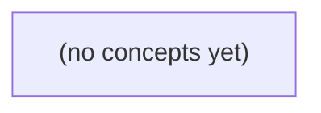

# 09.08 输入与输出防护：Go 聊天消息、附件与链接预览安全

*以虚构 IM 中的正文 m-a、附件文件名和可选链接预览为主线，追踪数据从 HTTP 请求进入解析、存储、展示、下载、日志与服务端抓取等位置的全过程。教材面向已学习 SQL、HTML 表单及身份与对象授权的 Go 初学者，建立“不同输出位置采用不同防护”的分层安全思维。*

**章节:** 2

---

## 本书导览

- 了解整本书的章节脉络
- 掌握各章之间的概念依赖关系
- 选择最合适的阅读顺序

# 09.08 输入与输出防护：Go 聊天消息、附件与链接预览安全

以虚构 IM 中的正文 m-a、附件文件名和可选链接预览为主线，追踪数据从 HTTP 请求进入解析、存储、展示、下载、日志与服务端抓取等位置的全过程。教材面向已学习 SQL、HTML 表单及身份与对象授权的 Go 初学者，建立“不同输出位置采用不同防护”的分层安全思维。

下方的概念图展示了本书 0 个核心概念以及它们之间的依赖关系；再下方是 1 个章节的入口。你可以按从上到下的顺序阅读，也可以根据自己的兴趣或先验知识选择切入点。

#### 概念图



## 章节索引

- **09.08 输入与输出防护：IM正文、附件和链接的不同边界** — 面向Go初学者，承接SQL、浏览器、认证授权，以虚构IM m-a 的正文、附件名与可选链接预览为主线，分层讲请求解析和字节限额、SQL参数与标识符白名单、上下文输出编码、文件上传路径与类型、SSRF、日志脱敏及业务权限；静态教材不运行服务。

## 09.08 输入与输出防护：IM正文、附件和链接的不同边界

- 画出一条消息输入到SQL/HTML/JSON/文件/日志/URL抓取的使用位置
- 区分HTTP体、文本字节与附件大小的上限
- 用参数绑定SQL值并白名单选择动态结构
- 按HTML/DOM/URL上下文安全展示正文
- 限制附件名称、类型、容量、存储与下载权限
- 说明服务端链接预览为何可能触发SSRF
- 规划结构化脱敏日志和稳定外部错误
- 用负例证明各防护不能互相替代

以虚构 IM m-a 的一条消息为线索，先画清数据流，再按每个使用位置选择不能互相替代的防护。

### 先画消息数据流与信任边界

### 先画消息数据流与信任边界

以用户 `u-a` 向会话 `c-a` 发送消息 `m-a` 为例：请求可携带正文 `text`、可选附件 `file`、可选链接 `url`。它们都来自客户端，但进入系统后会落到性质完全不同的处理位置，不能把“已登录”或“已做长度限制”误当作全面安全保证。

```text
HTTP 请求
  ├─ 正文 text ─→ 解析 ─→ 业务校验 ─→ SQL/文档存储
  │                                  ├→ IM 页面 HTML 渲染
  │                                  ├→ API JSON 响应
  │                                  └→ 审计/错误日志
  ├─ 附件 file、文件名 ─→ 类型/大小校验 ─→ 对象存储与元数据存储
  │                                      └→ 下载响应、预览页、日志
  └─ 链接 url ─→ 格式与业务校验 ─→ 存储
                                      ├→ 页面中作为可点击链接输出
                                      └→ 服务端抓取生成 URL 预览
```

首先，认证与授权回答的是“`u-a` 能否向 `c-a` 发消息、能否下载某附件”；它们不回答正文能否安全插入 HTML、链接能否安全被服务器访问。其次，SQL 参数化保护“内容作为数据写入查询”，却不能阻止附件名在下载响应头中造成问题，也不能阻止 URL 预览器访问内网地址。

因此应按接收端区分边界：

- 正文进入 SQL 或文档字段时，按数据存储；进入 HTML 时按文本编码；进入 JSON 时按 JSON 序列化。
- 附件二进制、原始文件名、声明类型和实际类型应分别处理；下载必须重新鉴权，并以安全响应头输出。
- 链接在浏览器中是导航目标，在预览服务中却变成服务器主动发起的网络请求；后者需要独立的地址、重定向和网络出口约束。
- 日志也是输出位置：记录可追踪标识与截断后的安全字段，避免把未处理正文、令牌或内部抓取结果直接写入。

即使系统以静态、无服务方式运行，浏览器渲染、对象存储下载和外部预览接口仍是不同的信任边界；防护必须贴近各自的 sink，而非依赖一次通用清洗。

### 三类限额与解析顺序

### 三类限额与解析顺序

m-a 的“发送消息”请求同时可能携带正文、附件元数据和 URL。不能只设一个“最大长度”，因为它们消耗的资源不同：

- **HTTP 请求体上限**：限制整个请求可接收的字节数，覆盖字段、编码开销、附件分片等。它应在读取请求体时尽早生效，避免攻击者用超大请求耗尽连接、内存或反向代理缓冲。
- **文本字节上限**：限制 `text` 解析后的 UTF-8 字节数，而非仅限制字符数。例如 emoji、中文及组合字符的字节占用不同；数据库字段、索引、日志和 HTML 渲染实际承受的是编码后的文本。
- **附件大小上限**：限制每个附件及全部附件的流式累计字节数。附件不能先完整读入内存再判断大小；应边接收、边累计、超过即停止写入并丢弃临时对象。

可将顺序理解为：

`HTTP 流式接收 → 请求体限额 → 解析 JSON/表单/分片 → 字段类型检查 → 文本字节限额与附件流式限额 → 业务校验 → 存储`

其中，解析前只能依据原始字节做请求体保护；解析后才能识别 `text`、附件声明和 URL；业务校验则继续判断 u-a 是否能向 c-a 发言、m-a 是否属于该会话、附件类型是否允许。三者不能互相替代：较小的文本不会抵消超大附件，较小附件也不能证明整个 HTTP 请求安全。静态无服务运行时，仍应在入口平台、浏览器提交前校验与存储写入前分别落实这些边界。

### 存储层：参数绑定与结构白名单

### 存储层：参数绑定与结构白名单

m-a 的消息正文、昵称、附件说明、链接标题等，进入 SQL 时都应被视为**值**，而不是 SQL 语句的一部分。即使正文包含引号、分号或看似查询片段，也只能作为参数传给数据库：

`INSERT INTO messages (id, sender_id, body, created_at) VALUES (?, ?, ?, ?)`

其中 `body` 的内容由参数绑定机制编码、传递；不要通过字符串拼接形成：

`"... VALUES ('" + body + "')"`

参数绑定解决的是“数据被当成 SQL 结构解释”的问题，适用于 `WHERE` 条件值、插入值、更新值、分页数量等可参数化位置。例如按会话读取消息时：

`WHERE conversation_id = ? AND deleted_at IS NULL`

但排序列、排序方向、筛选字段名、表名等属于 SQL **结构**。多数数据库不能把 `ORDER BY ?` 中的参数解释为列名；若直接拼接用户输入，攻击者就可能改变查询语义。因此必须将外部选项映射到固定白名单：

- 排序字段：`time → created_at`，`sender → sender_id`
- 排序方向：`asc → ASC`，`desc → DESC`
- 筛选模式：`unread → read_at IS NULL`，`all → 1=1`

先验证请求中的逻辑选项，再由服务端选择预定义 SQL 片段；未知值应拒绝或回退默认值。不要把“已做参数绑定”误认为可安全拼接任意 SQL。参数绑定保护值，结构白名单保护语法边界；两者共同覆盖 m-a 的动态查询需求。

### 输出与文件：按使用位置防护

### 输出与文件：按使用位置防护

m-a 的正文不是“过滤一次即可安全”的字符串；它会流向不同输出位置，每个位置都有自己的解释器与边界：

`请求输入 → 解析 → 业务校验 → SQL/文档存储 → HTML、DOM、JSON、日志、附件下载`

- **进入 HTML 文本节点**：将 `<`、`>`、`&`、引号等按 HTML 上下文编码。不要把用户正文拼进模板后再依赖黑名单删除 `<script>`。
- **进入属性、URL 或内联脚本**：分别采用属性编码、URL 校验与 JavaScript 字符串编码；HTML 编码不能替代它们。尤其不要把正文写入 `onclick`、`style` 或未经校验的 `href`。
- **进入 DOM**：优先使用 `textContent`、`createTextNode` 等安全接口，而非 `innerHTML`。若产品必须支持富文本，应采用严格白名单净化，并在每次展示时仍按输出上下文编码。
- **进入 JSON**：使用序列化器生成 JSON，禁止手工拼接：`{"body":"` + 正文 + `"}`。JSON 安全并不自动等于嵌入 HTML 安全；若 JSON 再放入 `<script>`，仍需处理 `</script>` 等边界。

附件同样是独立攻击面。上传时校验业务允许的**类型、容量与数量**，类型应结合文件签名、解析结果和扩展名判断，不能只相信客户端的 `Content-Type`。原始文件名仅作展示元数据；展示时编码，存储时改用服务端生成的随机对象键，禁止将文件名直接拼入路径，避免 `../` 路径穿越。

附件宜存入非静态公开目录或对象存储私有桶，数据库仅保存对象键、原名、大小、媒体类型和归属。下载请求必须重新验证：当前 u-a 是否属于对应 c-a、是否拥有消息可见权限、链接是否过期；不能因为猜中对象键就可下载。响应中设置安全的下载文件名，并对不可信类型使用附件下载策略，避免浏览器将上传内容当作可执行页面打开。

### 链接预览、日志与权限的负例

### 链接预览、日志与权限的负例

m-a 的消息正文、附件与链接都可能“看起来只是输入”，但它们会流向不同的执行点，不能靠单一过滤规则解决：

`请求输入 → 解析 → 业务校验 → SQL/文档存储 → HTML/JSON/日志 → 附件下载或服务端抓取`

- **链接预览不是普通 URL 校验。**  
  若服务端为了生成预览而抓取用户提交的 `https://...`，攻击者可填写指向内网、回环地址或云元数据服务的地址，例如 `http://127.0.0.1:...`。即使该 URL 不会显示为可点击链接，抓取器仍可能发起请求，形成 SSRF。  
  防护职责在“抓取前”：限制协议为 `http/https`，解析域名后拒绝私网、回环、链路本地及保留地址；处理重定向时逐跳复查；设置短超时、响应大小上限，并避免携带内部凭据。HTML 转义只能防 XSS，不能阻止服务端联网。

- **日志不是安全的垃圾桶。**  
  直接记录完整消息、预览 URL、附件下载令牌或鉴权头，会使原本仅在请求期间存在的敏感数据进入长期日志。即使页面正确转义、数据库查询使用参数化 SQL，运维人员、日志平台检索者或泄露的日志副本仍可看到秘密。  
  日志应记录必要的事件字段，如 `消息ID`、`用户ID`、结果码与截断后的错误类别；令牌、密码、私密正文应脱敏或不记录。日志清洗也不能替代访问控制：应限制日志查询权限和保留期限。

- **附件下载不能只相信附件 ID。**  
  若 `c-a` 访问 `/附件/123` 时仅检查“123 存在”，就可能下载 `u-a` 私聊中的附件，属于对象级越权。文件名过滤、病毒扫描、下载响应中的 `Content-Disposition` 都无法修复这一问题。  
  下载前必须以当前登录主体重新校验：该附件是否属于可见会话、用户是否仍具备成员资格、链接是否过期。存储层的对象键应视为内部定位符，而非授权凭证。

> **要点** — 同一输入会流向多个不同风险点；必须按具体使用位置组合限额、校验、编码、授权与脱敏。

m-a 的一条发消息请求同时携带正文、附件元数据和可选链接；先按入口拆分字节边界，再为后续每个使用位置保留独立防护。

### 先画清输入流向与信任边界

### 先画清输入流向与信任边界

以“发送消息”接口为例，客户端提交的并不是一个可直接信任的“消息对象”，而是一条会在多个边界间流动的输入链：

`HTTP 请求体 → JSON 解析 → 正文/附件元数据/链接字段 → 附件上传或下载 → 存储、预览、索引、展示`

首先限制的是**原始 HTTP 请求体**。它可能没有 `Content-Length`，也可能声明值错误；因此不能只根据请求头拒绝大包，而应由服务端对实际读取的流施加总上限。该上限覆盖 JSON 包装、正文、附件元数据以及攻击者额外附加的无用字节。

解析 JSON 后，`body` 只是其中一个字段，应再按其自身语义校验：必须是合法 UTF-8，教学场景可要求 `len(body) <= 9`，注意这里是**字节数**而非字符数；是否允许空白消息、换行或控制字符，则是业务策略，不能混同为 JSON 解析成功。

附件也不能只看 JSON 中的 `size`、文件名或 MIME 声明。附件内容通常经独立上传、对象存储回调、压缩包解压或预览服务进入系统，应分别限制：

- 请求中的附件元数据大小与数量；
- 实际上传文件大小；
- 解压后的总大小、文件数与嵌套层数；
- 图片、音视频等解析后的像素、时长或帧数。

链接同样会派生出新的不可信输入：URL 可能被用于跳转、抓取预览、写入日志或渲染页面。原始字符串、规范化后的 URL、抓取结果和预览 HTML 都应视为不同阶段的数据。

前端长度提示只能改善体验；服务端才是最终裁决者。更重要的是，不要试图“清洗一次”后到处复用：存储、HTML 展示、URL 跳转、SQL 查询和日志输出各有自己的编码与校验边界。

### 请求体限额不能只信Content-Length

### 请求体限额不能只信 `Content-Length`

`Content-Length` 是客户端对请求体大小的声明，可用于**提前拒绝**明显超限的请求，但不能当作安全边界。原因包括：客户端可能故意伪造长度；分块传输通常没有可用的总长度；代理、编码方式与实际读取过程也可能使“声明值”和“收到的字节”不一致。

因此，入口应当有两层判断：

1. 若 `Content-Length` 已知且大于该接口的总请求体上限，可尽早返回 `413 Request Entity Too Large`，避免无意义处理。
2. 无论其是否存在、是否可信，都必须用 `http.MaxBytesReader` 限制**实际可读取的请求体字节数**。

```go
const maxRequestBytes = 1 << 20 // 1 MiB：正文、附件元数据等请求体总和

if r.ContentLength > maxRequestBytes {
    http.Error(w, "请求体过大", http.StatusRequestEntityTooLarge)
    return
}

r.Body = http.MaxBytesReader(w, r.Body, maxRequestBytes)
defer r.Body.Close()
```

之后的 JSON 解码必须从这个受限的 `r.Body` 读取。若客户端继续发送超过上限的数据，读取会失败；服务端应将该错误映射为“请求体过大”，而不是继续解析部分内容、产生半条消息或把异常当作普通 JSON 格式错误。

注意，`MaxBytesReader` 限制的是这个 HTTP 请求体的总字节数，不等于正文限额。例如请求可允许 `1 MiB` 的总 JSON，而 `text` 字段仍应在 UTF-8 校验后满足 `len(text) <= 9` 字节的教学上限；附件内容、压缩包解压后的大小还需要各自独立限制。

### JSON完整解析与正文语义校验

### JSON完整解析与正文语义校验

消息入口应先确认请求声明为 JSON，例如仅接受 `Content-Type: application/json`（可允许附带 `charset=utf-8`）。这不是安全边界的全部：客户端可伪造头部，因此仍必须对正文执行受限读取、解析和语义验证。

使用 `http.MaxBytesReader` 限制整个 HTTP 请求体后，`json.Decoder` 应只解码一个对象，并确认流已被完整消费：

- 第一遍 `Decode(&req)`：必须成功，且目标是预期的结构体。
- 第二遍解码应得到 `io.EOF`：若还能读出值，说明存在 `{"body":"hi"} {"admin":true}` 这类尾随 JSON，必须拒绝。
- 不要把动态字段都接入 `map[string]any`；正文应定义为 `string`，附件数组、链接等也应有明确类型。类型不符直接返回 `400`，不能把数字、对象或数组“转成字符串后继续”。

正文的字节长度与字符数不同。教学场景可规定 `len(req.Body) <= 9`：`"abc"` 占 3 字节，而 `"你好"` 占 6 字节。该限制应在服务端执行，前端计数仅用于即时提示。

Go 的 `string` 可以保存非法 UTF-8 字节；因此还要检查 `utf8.ValidString(req.Body)`。非法编码应拒绝，而非替换为 `�` 后入库，否则签名、审计、展示和长度计算可能出现不一致。

最后定义正文语义：是否允许空串、纯空白、换行、制表符及其他控制字符，必须是显式业务策略。例如可先拒绝空白正文，再拒绝除换行外的控制字符。这里的校验只保证“消息正文”可接受；写入 HTML、日志、数据库查询或通知模板时，仍须分别采用对应的编码与参数化防护。

### 正文、附件与解压结果分别计量

### 正文、附件与解压结果分别计量

同一条消息不应只有一个“大小限制”。HTTP 请求体、正文文本、附件原始文件与解压后的内容，含义不同、风险不同，必须在不同计量时点分别设限。

| 对象 | 计量时点 | 典型上限 | 超限处理 |
|---|---|---:|---|
| HTTP 请求体 | 读取请求流时 | 如 `1 MiB` | 立即停止读取并返回 `413` |
| 正文字段 | JSON 解析后、业务使用前 | 教学示例：`len(body) <= 9` 字节 | 拒绝消息，提示正文过长 |
| 附件原始大小 | 上传流读取时或对象存储回调时 | 如 `10 MiB` | 中断上传、删除临时对象 |
| 解压后大小 | 解压流输出过程中 | 如 `50 MiB` | 停止解压并隔离文件 |

`Content-Length` 只能用于提前判断，不能作为唯一依据：它可能缺失、伪造，也无法覆盖分块传输。服务端应以实际读取到的字节为准，并用 `http.MaxBytesReader` 为整个请求体建立硬边界：

`r.Body = http.MaxBytesReader(w, r.Body, maxRequestBytes)`

正文限制不能由请求体限制替代。一个很小的 JSON 请求也可能包含业务上不允许的超长文本；反过来，附件元数据会占用 HTTP 体空间，却不应挤占正文的独立配额。文本长度还要明确按字节还是字符计量：若规则是 `len(body) <= 9`，则 UTF-8 中文通常每字约占 3 字节，必须先验证 UTF-8 合法，再按规则计数。

压缩包尤其不能只看原始大小。攻击者可上传很小的压缩文件，却在解压后膨胀为大量数据。解压应采用流式读取，持续累计输出字节；达到上限立即终止，而不是“先完整解压、再检查大小”。前端校验仅改善体验，所有这些限额都必须由服务端重新执行。

### 服务端权威校验与下游独立防护

### 服务端权威校验与下游独立防护

前端的长度提示、文件类型筛选和链接预览，只改善体验，不构成安全边界。攻击者可以直接构造 HTTP 请求，绕过页面脚本、修改 `Content-Length`，或提交前端根本不会生成的字段类型。因此服务端必须重新执行：请求体限额、JSON 完整解析、正文 UTF-8 与业务字符策略、附件元数据校验，以及链接协议和目标策略校验。

更重要的是，**入口校验不能替代下游防护**。同一条 IM 正文会流向多个语境：

- 写入数据库时，使用参数化查询；不能因为“已过滤单引号”就拼接 SQL。
- 展示为 HTML 时，按 HTML 上下文编码；不能把“清洗过一次”的文本直接插入模板、属性或脚本字符串。
- 写入日志时，防止换行、控制字符伪造多条日志；日志可接受的字符集不等于聊天正文可接受的字符集。
- 生成文件名、对象存储键或下载响应头时，拒绝路径分隔符、保留名和控制字符；正文合法不代表文件名安全。
- 处理链接时，分别校验允许的协议、主机策略、重定向与内网地址风险；“看起来像 URL”不足以安全访问或预览。

例如，把 `` 在入口处删除并不能保证安全：原文可能被另一服务以 Markdown、富文本或属性值方式重新解释；一次转换还可能在后续拼接时失效。正确原则是保留符合业务需要的原始或规范化数据，并在**每个输出点、每种解释器、每个副作用操作前**采用对应的编码、参数化或访问控制。

> **要点** — 输入限额与格式校验应分层执行；服务端确认事实，输出与使用位置各自编码和授权。

消息查询的安全不只在于防注入：参数绑定保护查询结构，成员授权决定用户能否读取这段会话，二者缺一不可。

### 从消息读取链路定位信任边界

### 从消息读取链路定位信任边界

以用户 `u-a` 读取会话 `c-a` 的历史消息为例，先画清数据流：

`认证凭证 → 身份 u-a → 路径参数 conversation_id → 成员授权 → 参数化查询 → 消息结果 → 响应与审计日志`

其中，身份 `u-a` 应来自已验证的令牌或会话，而不是客户端提交的 `user_id`。`conversation_id` 则是不可信输入；即使其值包含引号、注释符或类似 `' OR 1=1 --` 的内容，也只能被当作普通字符串值传入查询。

```go
rows, err := db.QueryContext(ctx, `
  SELECT id, sender_id, content, created_at
  FROM messages
  WHERE conversation_id = $1
  ORDER BY created_at ASC
`, conversationID)
```

参数绑定保护的是 SQL 结构：`$1` 不会被解释为语法，因此不能用 `fmt.Sprintf`、字符串拼接把 `conversationID` 写入 SQL。与此同时，读取前必须确认 `u-a` 是 `c-a` 的成员，例如以会话成员表执行存在性检查；参数安全不等于授权成功，`u-c` 即使无法注入，也仍不得读取 `c-a`。

返回消息属于敏感输出，应仅返回当前接口需要的字段，避免泄露内部状态、删除标记或其他成员信息。日志可记录请求者、会话标识、结果数量和失败原因，但不应原样记录正文、令牌或完整攻击载荷。表名、排序列和 `ASC`/`DESC` 不能作为绑定参数，必须由服务端枚举白名单选择。

### 把攻击性会话标识当作普通值绑定

### 把攻击性会话标识当作普通值绑定

`conversation_id` 来自路径、查询参数或请求体时，必须假定它可能包含引号、注释符和注入片段，例如：

`c-a' OR '1'='1' --`

错误做法是把它嵌入 SQL 文本：

`fmt.Sprintf("SELECT body FROM messages WHERE conversation_id = '%s'", conversationID)`

此时，输入中的 `'` 会改变原有字符串边界；攻击者提供的内容不再只是“会话标识”，而可能成为 SQL 语法的一部分。

应固定 SQL 结构，并把标识作为值参数绑定：

`rows, err := db.QueryContext(ctx, "SELECT body FROM messages WHERE conversation_id = $1", conversationID)`

这里 `$1` 是占位符。驱动会将 `conversationID` 作为独立数据传递、转义和编码；无论其中含有引号、分号还是 `OR 1=1`，数据库都只会把它当作一个待比较的普通值。若不存在完全相同的会话标识，查询结果应为空，而不是扩大查询范围。

参数绑定保护的是“查询结构不被输入改写”，但它不等于授权。安全的读取通常还应把成员关系写入固定查询：

`SELECT m.body FROM messages m JOIN conversation_members cm ON cm.conversation_id=m.conversation_id WHERE m.conversation_id=$1 AND cm.user_id=$2`

即使攻击性输入无法注入，用户 `u-c` 仍必须不能借由合法的 `c-a` 标识读取用户 `u-a` 的会话历史。

### 动态结构只能来自枚举白名单

### 动态结构只能来自枚举白名单

参数绑定只能替代“值”，不能替代表名、列名、排序方向等 SQL 结构。`conversation_id` 即使包含引号、注释符或攻击字符串，也应作为普通值通过 `$1` 传入：

`QueryContext(ctx, "SELECT body FROM messages WHERE conversation_id = $1", conversationID)`

这样数据库会区分查询模板与参数内容；不要用 `fmt.Sprintf` 把输入拼进 SQL。

但以下写法不能依赖参数绑定：

- 表名：`FROM $1`
- 列名：`SELECT $1`
- 排序方向：`ORDER BY created_at $1`

这些位置决定 SQL 的语法树，数据库驱动通常不会把它们解释为标识符或关键字。因此，确需动态排序时，应先将用户输入映射到固定枚举：

```text
排序字段：time → created_at，sender → sender_id
排序方向：asc → ASC，desc → DESC
```

映射失败就拒绝请求或使用安全默认值；最终拼接的只能是程序内置常量，绝不能是原始输入。

同样原则适用于 MongoDB：过滤条件的字段、操作符和嵌套结构应由服务端固定构造，例如按 `conversation_id` 查询；不要把用户提交的 JSON 直接反序列化为任意过滤器，否则 `$where`、`$ne` 等结构可能改变查询语义。参数安全只保证输入不能改写查询，仍须另行验证用户是否属于该会话。

### 注入防护不能替代会话成员授权

### 注入防护不能替代会话成员授权

设攻击者用户 `u-c` 请求读取会话 `c-a` 的历史消息，并把参数写成带引号的攻击性值：

`conversation_id = c-a' OR '1'='1`

若服务端使用参数绑定：

`QueryContext(ctx, sql, conversationID)`

并在 SQL 中写为：

`WHERE conversation_id = $1`

那么引号只会被当作 `conversation_id` 的普通字符，而不会改变 `WHERE` 条件；这解决的是“输入能否篡改查询结构”的问题。

但若 `u-c` 改为提交真实存在的 `conversation_id = c-a`，参数绑定会正常、安全地查出 `c-a` 的消息。此时若服务端仅按会话 ID 查询：

`SELECT * FROM messages WHERE conversation_id = $1`

就仍然可能把 `u-a` 的会话内容返回给 `u-c`。没有注入，不等于没有越权。

正确做法是把成员关系纳入查询条件，或先完成等价授权检查：

`WHERE conversation_id = $1 AND EXISTS (SELECT 1 FROM conversation_members WHERE conversation_id = $1 AND user_id = $2)`

其中 `$1` 是目标会话，`$2` 是当前认证用户。查询结果为空时，应按产品策略返回“无权访问”或“资源不存在”，避免泄露会话是否存在。

同样的原则适用于 Mongo：固定查询结构，例如按 `conversationId` 与成员 `userId` 构造过滤条件；不要把客户端提交的 JSON 直接反序列化为任意过滤器。参数安全保护语句结构，成员授权保护数据边界，二者必须同时成立。

### 固定 Mongo 查询对象而非接收任意过滤器

### 固定 Mongo 查询对象而非接收任意过滤器

MongoDB 不使用 SQL 字符串，但同样存在“查询结构被输入控制”的风险。危险做法是直接接收客户端提交的 JSON，并反序列化为过滤器：

`db.messages.find(req.body.filter)`

攻击者可能构造 `$ne`、`$gt`、`$regex`、`$where` 等操作符，改变原本“查询某条会话消息”的语义。更严重的是，若过滤器中包含 `conversation_id`，攻击者可尝试替换为其他会话，从而绕过预期范围。

正确方式是由服务端固定查询对象的结构，只将经过类型校验的普通值填入允许字段，并把成员约束合并进查询：

```text
filter = {
  conversation_id: conversationId,
  member_ids: userId,
  deleted_at: null
}
```

其中 `conversationId` 应作为字符串或 `ObjectId` 解析，而不是接受 `{ "$ne": null }` 这类对象；分页游标、时间范围、消息类型也应分别校验类型、长度和枚举值。

查询结构安全不等于授权成功。即使 `conversation_id` 被安全地作为普通值使用，仍必须确认当前用户 `u-c` 是该会话 `c-a` 的成员；否则，攻击者只需猜到一个真实会话标识，仍可能读取不属于自己的历史消息。

排序字段、排序方向和投影字段也不能直接信任输入。它们应映射到服务端白名单，例如仅允许按 `created_at` 排序，方向仅允许 `1` 或 `-1`。原则是：客户端提供值，服务端决定查询形状与访问边界。

> **要点** — 参数绑定守住查询结构，白名单控制动态结构，成员授权决定数据可见性；三者不能互相替代。

聊天正文应以原文本保存；真正的安全边界取决于它随后进入的 HTML、DOM、URL 与 JSON 使用位置。

### 先画出正文的输出流向

### 先画出正文的输出流向

以消息 `m-a` 的正文为例，先不要问“它是否已经过滤”，而要追踪它会流向哪里：

`用户输入 → 数据库存储 → 服务端页面 → JSON 接口 → 浏览器 DOM → 链接/附件预览`

存储层应保存原始文本，例如：

`你好`

原文不是安全的 HTML，也不应在入库时被“转义后保存”。否则同一内容进入不同场景时，容易发生双重编码、显示错误，且无法保留真实审计记录。安全边界应在每次**输出到具体上下文**时重新建立。

- **服务端 HTML 正文**：使用 Go `html/template` 输出普通字符串，让模板按 HTML 文本上下文转义。不要把消息正文包装成 `template.HTML`。
- **浏览器动态展示**：优先使用 `textContent`、`createTextNode` 等文本接口；`innerHTML` 会把字符串重新解释为标记。
- **JSON 响应**：返回 `Content-Type: application/json`，正文只是 JSON 字符串；但客户端取到该字段后，仍必须写入安全的 DOM sink。
- **链接位置**：若正文、附件名或预览数据最终进入 `href`，仅做 HTML 属性编码不够，还要校验 URL scheme，例如只允许 `https:`、`http:` 或业务允许的相对路径，拒绝 `javascript:`、`data:` 等危险协议。
- **富文本模式**：这是另一条输出流。若产品确实允许部分 HTML，必须使用专门富文本净化器、明确标签和属性白名单；不能把“曾经 sanitize 过”当作所有场景的通行证。

因此，`m-a.body` 可以始终是原文本；真正决定安全性的，是它在每个落点被当作文本、URL、属性还是 HTML 来处理。

### 模板转义与不可信 HTML

### 模板转义与不可信 HTML

Go 的 `html/template` 不是简单地把特殊字符替换掉，而是会依据变量所在的输出上下文选择转义策略。聊天正文出现在元素文本位置时：

`<p>{{.Body}}</p>`

若 `.Body` 为 `你好 `，模板会将 `<`、`>`、`&` 等编码为实体；浏览器最终显示的是文字，而不会创建 `img` 元素。变量进入属性、URL、JavaScript 或 CSS 上下文时，模板也会采用不同规则，避免同一份输入因嵌入位置变化而逃逸。

因此，应传递普通字符串：

`type Message struct { Body string }`

而不要为了“保留格式”写成：

`template.HTML(message.Body)`

`template.HTML` 是一个信任声明：它告诉模板引擎“此值已经是安全、可直接插入的 HTML”。此后引擎不再进行正常的 HTML 转义，攻击者提交的标签、事件处理器属性、恶意链接都可能成为真实 DOM。把数据库中的聊天正文转换为 `template.HTML`，本质上等于把历史上所有不可信消息提升为可信模板片段。

同样危险的是在模板中拼接脚本、样式或事件处理器，例如 `onclick="{{.Body}}"`、`<script>var x={{.Body}}</script>`。即使某些字符被转义，也不应把用户文本设计为可执行代码的一部分。

若产品需要加粗、列表、图片等富文本，正确路径是：原始输入仍保留；使用面向 HTML 的专用净化器，按明确白名单删除危险标签、属性、协议与嵌入内容；净化后的结果才可在严格审计后标为 `template.HTML`。不能用一次通用“清洗”替代不同输出上下文的编码。

### 浏览器 DOM 的安全落点

### 浏览器 DOM 的安全落点

服务端把消息以 `application/json` 返回，并不意味着风险结束：浏览器取得 JSON 后，仍要决定把字符串写入哪个 DOM 落点。安全性取决于“数据如何解释”，而非它最初来自接口、数据库还是 WebSocket。

- **`textContent`：默认选择。**它把内容当作纯文本，不解析标签、属性或事件处理器。

  `node.textContent = message.body`

  即使正文是 ``，页面也只会显示这串字符。

- **`innerHTML`：高风险解析入口。**它要求浏览器将字符串解释为 HTML；不可信消息一旦进入，可能形成脚本执行、危险链接或 DOM 注入。

  `node.innerHTML = message.body`  
  上述写法不应用于聊天正文、昵称、引用内容等不可信数据。

- **客户端模板渲染也不是天然安全。**若模板引擎默认按文本插值并进行 HTML 转义，可用于普通正文；但“原样 HTML”“不转义插值”等语法本质上等同于 `innerHTML`。不要因为数据来自 JSON 或经过一次“清理”就放宽此限制。

对链接应分别创建元素并校验协议，例如仅允许 `https:`、`http:` 或业务需要的 `mailto:`；随后用 `a.href = validatedURL` 设置地址，而不是拼接 HTML 字符串。`javascript:`、事件属性、内联样式及脚本节点都不应由消息内容控制。

若产品确实支持富文本，应采用专门的富文本净化器和严格白名单，并在每次写入 DOM 前保持相同边界；“统一 sanitize_once”无法自动适配文本、HTML、URL 等不同上下文。

### 链接展示不是普通文本输出

### 链接展示不是普通文本输出

聊天中的链接同时包含“可见文本”和“跳转目标”，两者不能按同一种规则处理。可见文本可作为普通文本输出；`href` 则是浏览器会解释并执行语义的 URL 上下文。即使模板会进行属性编码，`javascript:alert(1)` 仍可能是合法的属性值，因此必须先校验协议。

服务端应解析 URL，并采用协议白名单，例如仅允许 `https`、`http`，按业务谨慎允许 `mailto`、`tel`：

- 拒绝空协议、解析失败、控制字符及 `javascript:`、`data:`、`vbscript:` 等危险协议。
- 不要用 `strings.HasPrefix` 判断；`https://`、大小写、前导空白、编码形式都可能造成绕过。
- 由 `html/template` 在属性上下文中输出已验证 URL，而不是拼接 `<a href="...">` 字符串。
- 外链使用 `target="_blank"` 时，应同时加 `rel="noopener noreferrer"`，避免新页面借 `window.opener` 控制原页面。

高风险位置不止 `href`。不可信数据不得进入 `<script>`、`<style>`、内联事件处理器如 `onclick`，也不要赋给 DOM 的 `innerHTML`。客户端展示链接时，优先设置 `a.textContent` 作为文本，并在校验后设置 `a.href`；不能因为数据来自 JSON 响应就认为进入 DOM 后仍然安全。

### 富文本必须采用专用规则

### 富文本必须采用专用规则

“入库时统一净化一次”看似简单，实际上无法覆盖富文本的后续使用位置。若聊天内容既可能嵌入 HTML 正文，也可能被复制到 `href`、预览卡片、JSON 响应或前端 DOM 中，则同一段字符串在不同上下文有不同危险边界。

例如，净化器若仅删除 `<script>`，以下内容仍可能造成问题：

- `<a href="javascript:alert(1)">查看</a>`：脚本协议藏在链接属性中。
- ``：事件处理器不是脚本标签。
- `<div style="background:url(javascript:...)">`：样式属性可能成为执行通道。
- 经过 HTML 净化的文本若被前端赋给 `innerHTML`，或拼接进 URL、JavaScript 字符串，原有保证仍可能失效。

因此，支持富文本时应使用专门净化器，并采用“允许列表”而非“删除危险项”策略：

- 仅允许确有业务意义的标签，如 `p`、`br`、`strong`、`em`、`ul`、`ol`、`li`、`blockquote`、`code`、`a`。
- 对每个标签限制属性；通常链接只允许 `href`、`title`、`rel`。
- 对 `href` 解析后校验协议，只接受 `https`、`http` 或受控的站内相对路径；拒绝 `javascript:`、`data:` 等。
- 默认禁用 `style`、所有 `on*` 事件属性、`iframe`、`object`、`embed` 与表单标签。
- 外链可补充 `rel="noopener noreferrer"`，是否新开窗口由服务端规则决定。

净化后的富文本仍应作为“不完全可信的结构化内容”处理：服务端用 `html/template` 输出，客户端优先使用安全 DOM 接口；只有经过该专用规则处理的字段，才可在明确位置作为有限 HTML 渲染。

> **要点** — 正文可原样保存，但每次进入 HTML、DOM、URL 或 JSON 时都必须按具体上下文建立独立防护。

附件名、类型和下载请求都来自不可信输入；安全边界应覆盖上传、存储、访问与响应全链路。

### 附件数据流与信任边界

### 附件数据流与信任边界

一份附件从 `multipart/form-data` 请求体进入系统后，不应因“来自已登录用户”而获得信任。可将数据流拆为：请求接收 → 解析 → 校验 → 存储 → 下载响应 → 审计日志；每一环都可能把攻击输入带入新的执行环境。

- **请求与解析**：文件名、扩展名、`Content-Type`、声明大小、分段边界及文件内容均可伪造。解析器应限制请求体、单文件和附件数量，避免异常分段、超大文件耗尽内存、磁盘或连接资源。
- **校验**：原始文件名只能作为展示元数据，不能参与服务器路径、对象键或命令。类型判断不能只看 `.pdf` 或请求头，还应按允许类型检查内容签名；压缩包还需限制层级、展开大小和文件数。
- **存储**：服务器生成不可预测的对象键，例如 `attachments/{uuid}`，将原名另存为编码后的展示字段。附件应存于 Web root 外或对象存储中，默认不可执行、不可直接按路径访问。
- **下载**：下载请求中的附件标识是授权输入，必须验证对象归属与当前用户权限。响应设置固定的安全类型策略，并以 `Content-Disposition: attachment` 和安全编码后的文件名降低浏览器内联执行风险。
- **日志与扫描**：日志记录内部对象键、操作者、大小、校验结果和下载事件，不直接拼接原始文件名。若接入异步恶意文件扫描，应将文件在扫描完成前置为不可下载或受限状态，而非假定其已经安全。

### 文件名不能决定存储路径

### 文件名不能决定存储路径

上传请求中的文件名完全由客户端提供，不能把它当作可信路径片段。若直接拼接：

`保存路径 = 上传目录 + "/" + 原始文件名`

攻击者可提交 `../../config.json`、`/etc/passwd`、`C:\Windows\...`，或利用不同平台的分隔符 `\`、`/`、重复分隔符和编码变体逃逸预期目录。即使程序“过滤了 `../`”，也可能遗漏反斜杠、绝对路径、规范化顺序或 Unicode 伪装字符。

同名文件也是风险：`report.pdf` 可能覆盖另一用户的 `report.pdf`，或在并发上传时产生竞态。以用户名或时间戳拼接路径同样不足，因为这些字段也可能重复、可预测，甚至被篡改。

正确的推导是：既然原始文件名不可信，就不让它参与磁盘路径或对象键生成。服务器应自行生成不可预测且唯一的标识，例如随机对象键：

`attachments/2025/03/uuid-随机值`

原始文件名仅作为元数据保存，用于下载页面展示或下载时建议的名称。存储层应位于 Web 根目录之外，或使用独立对象存储；应用通过受控接口读取，而非让浏览器按文件路径直接访问。

即使需要展示名称，也要按输出上下文处理：页面中进行 HTML 转义，下载响应中安全编码，并避免把名称解释为路径。文件的“叫什么”属于用户可见文本；文件“存在哪里”必须由服务器决定。

### 服务器生成对象键并隔离存储

### 服务器生成对象键并隔离存储

文件名是用户输入，不能直接拼入磁盘路径或对象存储键。诸如 `../../config.yml`、带路径分隔符的名称、重复扩展名等，可能造成路径穿越、覆盖已有文件或干扰后续处理。

上传时应由服务端生成不可预测的对象键，例如随机 UUID、加密安全随机标识符或按日期分区的内部编号：

`attachments/2025/03/8f3a...c91e.bin`

原始文件名只作为元数据保存，用于页面展示或下载建议名称；它不参与实际存储定位。展示时还应按输出上下文进行转义，避免文件名成为 HTML、日志或响应头注入载体。

存储区域必须脱离 Web 根目录。即使攻击者知道对象键，也不能通过 `/uploads/对象键` 直接访问，更不能让 Web 服务器把上传内容当作脚本、模板或可执行资源解析。下载应经过受控接口：验证当前用户对附件所属消息、会话或工单的授权，再读取对象并返回响应。

可将上传对象放入专用存储桶或目录，并落实最小权限：

- 上传服务仅可写入指定前缀；
- Web 进程不具备执行或遍历上传目录的权限；
- 存储服务默认私有，不开放公共读；
- 下载服务按授权签发短时访问，或由后端代理输出内容。

这样，原名负责“给人看”，对象键负责“给系统找”，存储位置负责“不给浏览器直接执行”。

### 类型、容量与解压资源限额

### 类型、容量与解压资源限额

扩展名、请求中声明的 `Content-Type` 与文件内容签名，可信度逐级提高，但都不应单独决定是否接收文件。

| 信号 | 常见用途 | 风险 | 建议 |
|---|---|---|---|
| 扩展名 | 用户提示、下载展示 | 可任意改名，如 `shell.jpg` | 仅作辅助校验，不作为安全依据 |
| 声明的 `Content-Type` | 浏览器上传元数据 | 客户端可伪造 | 与允许类型比对，但不可盲信 |
| 内容签名 | 识别文件实际格式，如 PNG、PDF 魔数 | 解析器缺陷、格式嵌套或伪造容器 | 使用可靠解析库验证，并限制可接受格式 |

应采用“明确允许”而非“黑名单禁止”：例如仅允许 `jpg`、`png`、`pdf`，并要求扩展名、声明类型和实际解析结果相互一致；不一致时拒绝，或进入人工审核流程。即使签名正确，也不代表文件安全：PDF、Office 文档、压缩包和图片都可能携带恶意内容或触发解析风险。

容量限制同样需要分层，而非只设置单文件上限：

- 限制单文件大小，避免一次上传耗尽带宽、内存或磁盘。
- 限制每次请求的文件数量与总大小，防止大量小文件绕过单文件限制。
- 限制用户、会话或时间窗口内的累计上传配额，避免持续占用存储。
- 对压缩包设置解压后总大小、文件数、目录深度、单文件大小与压缩比上限，防御“压缩炸弹”和路径层级滥用。
- 解压时拒绝包含 `../`、绝对路径或链接逃逸的条目，并在隔离目录中处理。

这些限制应在接收请求、写入临时存储和解压处理前后分别执行；仅依赖前端校验无法形成安全边界。

### 授权下载与安全响应策略

### 授权下载与安全响应策略

下载不是“拿到文件标识就返回字节流”，而应按消息或附件所属资源重新核验权限。客户端提交的 `attachmentId`、对象键、文件名都不应直接决定存储路径；服务端先查询附件元数据，确认其归属消息、会话或业务对象，再判断当前用户是否具有该对象的读取权限、是否仍在有效成员范围内。授权成功后，服务端使用内部对象键读取文件，避免出现“猜测附件编号即可越权下载”。

响应策略同样属于安全边界：

- 默认使用 `Content-Disposition: attachment`，并对展示文件名进行安全编码与清理，避免响应头注入。
- 对不受信任或无法可靠识别的内容使用通用二进制响应类型，如 `application/octet-stream`；不要仅因文件名后缀声称其为图片、网页或脚本。
- 附件存储应位于 Web 根目录之外，不允许通过静态路径直接访问；下载统一经过授权控制器或受限签名链接。
- 可考虑设置 `X-Content-Type-Options: nosniff`，降低浏览器按内容猜测并执行脚本的风险。
- 对预览功能单独设计白名单、转码和隔离策略；“可下载”不等于“可在浏览器内联渲染”。

异步病毒扫描、内容审核或沙箱分析可以补强防护：文件上传后可标记为“待扫描”，扫描通过前禁止下载或仅允许受控管理员访问。但异步任务可能延迟、失败或被绕过，因此不能替代上传入口的大小限制、类型校验、存储隔离和下载授权。安全决策应以前置校验为基础，以异步扫描为附加风险控制。

> **要点** — 附件安全不靠单次类型检查，而靠受控命名、隔离存储、资源限额、授权下载与安全响应共同实现。

纯文本链接的安全边界取决于系统是否代替用户访问它：仅展示时重点是安全输出；一旦服务端抓取预览，就必须面对SSRF风险。

### 先区分展示链接与抓取链接

### 先区分展示链接与抓取链接

IM 正文里出现 `https://example.com/a`，并不天然意味着服务器会访问它。先问清楚：系统只是**把它显示给用户**，还是会**替用户发起请求**？两种行为的安全边界完全不同。

- **仅展示链接**：风险主要属于输出处理。服务端将消息中的 URL 识别、截断或渲染为可点击元素时，应把它当作不可信文本编码输出，避免用户构造的内容逃逸到 HTML、属性或脚本上下文。例如不要直接拼接  
  `href="用户输入"`；应使用可靠的 URL 解析与属性编码。此处关注的是 XSS、钓鱼式显示文本、危险协议等，而不是 SSRF。若系统从不抓取 URL，攻击者无法借此让服务器访问内网。

- **服务端抓取预览**：若产品为了显示标题、缩略图或摘要，由服务端请求用户提供的 URL，则 URL 已从“展示数据”变成“网络访问指令”。攻击者可提交指向 `127.0.0.1`、`localhost`、私网地址、云元数据地址或内部管理域名的链接，诱导预览服务读取本不应暴露的资源，这就是 SSRF。

因此，“消息里允许 URL”不等于“后端可以请求任意 URL”。最稳妥的设计是默认不做服务端预览；若确有需求，应将预览组件视为受限网络客户端，而不能靠 `contains("localhost")` 之类字符串过滤制造假安全。

### 服务端预览为何形成SSRF

### 服务端预览为何形成 SSRF

当 IM 仅把 `https://example.com/a` 作为文本展示时，服务器没有访问该地址；风险主要在于客户端渲染与安全输出。若产品为了显示标题、缩略图或摘要而由服务端请求该 URL，攻击者就获得了“让服务器代为发起网络请求”的能力，这正是服务端请求伪造（SSRF）。

攻击者提交的并不一定是公开网页，而可能是：

- 回环地址：`http://127.0.0.1:8080/`、`http://[::1]/`，探测预览机器本地管理接口；
- 内网地址：`http://10.0.0.5/admin`、`http://192.168.1.1/`，利用服务器可达性扫描内部服务；
- 链路本地地址：`http://169.254.169.254/`，在云环境中常可触及实例元数据服务，进而泄露临时凭证、身份令牌或配置；
- 看似正常的域名：先解析到公网地址，随后通过重定向、DNS 重新解析或 IPv6 表示法转向内网目标。

关键不在于攻击者能否直接访问这些地址，而在于预览服务通常位于更受信任的网络位置：它可能能访问数据库管理端口、内部 HTTP 接口、容器控制面或云元数据端点。攻击者再通过预览结果、响应时间、状态差异或错误信息，间接读取数据或确认网络结构。

因此，URL “由用户提供”本身不是问题；**服务端会跟随它访问何处**才是安全边界。仅检查字符串中是否含有 `127.0.0.1`、`localhost` 或 `169.254` 不可靠，因为编码、域名解析和跳转都会改变最终目标。

### 预览请求的分层准入校验

### 预览请求的分层准入校验

服务端链接预览不能只在接收 URL 时做一次判断；真正的边界是“每一次即将建立的网络连接”。攻击者可利用编码、DNS 解析、重定向或非标准端口，使初始 URL 看似安全、最终请求落入内网。

建议按以下层次实施准入：

- **协议层**：只允许明确需要的 `http`、`https`，拒绝 `file`、`gopher`、`ftp`、`data` 等协议，也不要接受协议相对 URL。
- **主机与端口层**：优先采用业务白名单，例如仅预览合作站点域名；若必须开放访问，限制为标准端口 `80`、`443`，拒绝用户信息段、异常端口及难以审计的主机表示法。
- **解析结果层**：对域名完成 DNS 解析后，逐个检查全部 IP。拒绝回环地址、私有地址、链路本地地址、保留地址、组播地址及云元数据常见地址范围；IPv4、IPv6 都必须覆盖。
- **连接层**：防止“先校验、后变更”的 DNS 重绑定。应让实际连接使用已校验的解析结果，或在连接前再次核验目标 IP；不能只检查域名字符串中是否“包含”某个可信片段。
- **重定向层**：将每个 `3xx` 跳转视为全新的 URL，重新执行协议、主机、端口、解析地址校验，并限制跳转次数。初始地址合法不代表跳转目标合法。

即使通过准入，预览服务仍应设置短超时、响应体大小上限和严格的出口网络隔离。最稳妥的方案是只支持白名单来源；若无法可靠约束访问范围，宁可不提供服务端预览。这里防护的是服务端请求伪造，与页面将 URL 文本安全编码以避免 XSS 是两条不同的安全边界。

### 超时、限流与出口隔离

### 超时、限流与出口隔离

即使已校验 `scheme`、主机名和解析地址，服务端预览仍应假设目标站点可能缓慢、巨大、恶意或随时改变。运行时限制的目标不是“证明请求安全”，而是缩小单次抓取可消耗的资源与可触及的网络范围。

- **设置分阶段超时**：分别限制 DNS 解析、建连、TLS 握手、首字节和总请求时间；不要只依赖默认超时。超时后立即取消请求、关闭连接，并将失败视为普通预览失败，而非重试风暴的理由。
- **限制响应体与下载行为**：读取时累计字节数，达到上限立刻中止；优先只取预览所需的小型 HTML 头部，而不是完整下载。拒绝或严格限制大文件、压缩包、流式响应、未知长度响应及频繁跳转。
- **控制并发与重试**：对单用户、单会话、单域名和全局抓取任务设置配额；重试应次数有限并带退避，避免攻击者借预览功能放大连接、带宽或 DNS 查询消耗。
- **使用独立出口**：预览抓取应运行在隔离的网络命名空间、代理或专用服务中，使用独立身份凭据和最小权限。该出口默认拒绝访问内网、回环、链路本地地址、云元数据地址及管理网段。
- **隔离敏感能力**：抓取器不得继承业务服务的 Cookie、内部认证头、客户端证书、云实例权限或可访问数据库的网络路径。即使 URL 校验出现遗漏，攻击面也被限制在低权限沙箱内。

出口隔离不能替代每跳地址校验；两者分别防御“错误请求被发出”和“错误请求造成严重后果”。

### 负例：字符串过滤不能替代设计

### 负例：字符串过滤不能替代设计

“链接中不包含 `127.0.0.1`、`localhost`、`internal` 就允许抓取”看似简单，实际几乎没有安全保证。攻击者可利用不同地址表示法、大小写、编码、IPv6、DNS 解析结果变化或重定向链绕过字符串匹配；更重要的是，字符串本身并不等于最终建立连接的目标。

常见失败方案包括：

- **`contains` 黑名单过滤**：只是在文本层面寻找片段，无法正确处理 `http://[::1]/`、数值形式地址、域名解析到私网地址等情况；也容易误伤正常网址。
- **仅首次解析后校验**：初始域名可能解析为公网地址，但请求时 DNS 结果改变；或首跳安全、`302` 重定向后的下一跳进入内网。
- **只关注 URL 展示型 XSS**：对链接做 HTML 转义、限制 `javascript:` 等协议，解决的是浏览器执行问题；服务端预览仍可能访问云元数据、回环服务或内部管理接口，属于 SSRF，威胁模型不同。
- **允许任意网页预览再“补规则”**：规则越多，遗漏的协议、端口、解析语义和网络边界越多，最终形成难以审计的伪安全。

更可靠的设计优先级是：**不实现服务端预览**，仅将 URL 作为纯文本安全展示；若业务确需预览，则采用严格允许列表，只允许明确的 `https`、受控主机名和必要端口。每次解析、每一跳重定向、实际连接前都应重新确认目标不属于回环、私网、链路本地或其他保留地址，并结合固定出口、网络隔离、短超时与响应体上限降低剩余风险。

> **要点** — 链接安全分两类：展示需按上下文编码；服务端预览会引入SSRF，必须持续校验目标并限制网络能力。

消息处理的最后一道边界常被忽略：日志和错误响应既要支持排障，也不能成为泄露正文、凭据、路径与内部网络信息的通道。

### 把日志与错误视为独立输出面

### 把日志与错误视为独立输出面

同一条 IM 消息会流向至少三个不同的输出面，它们不能共享“原样内容”。

| 输出面 | 允许内容 | 禁止内容 | 目的 |
|---|---|---|---|
| 结构化日志 | `route`、处理阶段、有限错误类别、正文/附件长度、受控 `request_id` | token、cookie、原始正文、附件内容、内部路径、完整 URL | 检索、聚合、告警 |
| 外部错误响应 | 稳定错误码、用户可执行的简短说明 | SQL 语句、堆栈、文件路径、内网主机、供应商细节 | 安全地反馈失败 |
| 内部诊断信息 | 经权限控制的关联标识、脱敏上下文、受限异常详情 | 默认向客户端或普通日志复制的敏感原文 | 深度排障 |

例如，用户发送超长正文、`' OR 1=1 --`、``、`../../secret.txt`、`http://10.0.0.1/admin` 或包含换行的 `正常消息\n伪造 ERROR`。日志不应记录这些原文；应写成类似：

`route=im.send stage=validate error=BODY_TOO_LARGE body_length=12001 request_id=req_7f3a`

这里的 `request_id` 必须由服务端生成或严格校验格式，不能直接采用用户提供值，否则攻击者可借换行、控制字符伪造日志字段。长度、类型和有限枚举错误类别通常足以支持排障。

对外响应同样保持稳定，例如 `{"code":"BODY_TOO_LARGE","message":"消息长度超过限制"}`。无论内部是数据库异常、附件扫描失败还是路径解析错误，客户端都不应看到 `SELECT ...`、`/srv/app/...` 或 `10.x.x.x`。内部系统可通过 `request_id` 关联更详细的受控诊断记录，而不是把诊断细节扩散到日志和响应中。

### 建立最小化结构化日志字段

### 建立最小化结构化日志字段

日志应回答“哪条处理链路、在哪个阶段、以何种受控原因失败”，而不是复制用户输入。推荐固定为少量结构化字段：

- `route`：如 `im.send`、`attachment.scan`，使用预定义枚举。
- `stage`：如 `validate`、`parse`、`store`、`deliver`，定位处理阶段。
- `error_category`：仅允许有限类别，如 `invalid_input`、`size_exceeded`、`blocked_link`、`internal_failure`。
- `input_length`、`attachment_size`：记录长度或大小，不记录正文、文件内容。
- `request_id`：由服务端生成或校验格式后的关联标识；限制字符集与长度。

例如：

`route=im.send stage=validate error_category=size_exceeded input_length=8193 request_id=req_7f3a`

以下字段绝不能进入常规日志：`token`、`cookie`、授权头、原始 IM 正文、附件内容、附件原文件名、内部绝对路径、数据库语句、完整 URL 查询参数，以及未净化的异常消息。

静态证据表可用负例验证边界：

| 输入负例 | 可记录 | 禁止记录 |
|---|---|---|
| 超限正文 | 长度、`size_exceeded` | 正文片段 |
| SQL 引号 | `invalid_input` | SQL、驱动报错 |
| `` | 长度、阶段 | 原始 HTML |
| `../secret.txt` | `invalid_input` | 拼接后的文件路径 |
| 内网 URL | `blocked_link` | 完整内网地址 |
| `ok\nlevel=admin` | 净化后的类别 | 含换行原值 |

所有字段应进行长度限制、控制字符剔除或编码，尤其禁止让换行、回车伪造新的日志条目。对外错误只返回稳定码，例如 `INVALID_INPUT` 或 `REQUEST_TOO_LARGE`；详细诊断留在受控监控链路中，而非响应正文。

### 控制字符如何伪造日志记录

### 控制字符如何伪造日志记录

攻击者不必突破日志系统；只要让输入中的换行、回车或终端控制字符进入日志，就可能把一条事件伪造成多条记录。例如，附件名被原样拼接：

`report.pdf\nINFO auth user=admin 登录成功`

若日志采用“一行一事件”，排障人员可能误以为系统真的记录了管理员登录。更隐蔽的正文还可包含回车符覆盖前缀，或终端转义序列伪造颜色、清屏效果：

`处理失败\rERROR route=/admin 权限提升`

下面是应拒绝作为日志证据的输入负例：

| 输入位置 | 恶意示例 | 风险 |
|---|---|---|
| 正文 | `你好\nERROR 数据库已删除` | 拆分记录、伪造错误 |
| 附件名 | `../../secret.txt` | 暗示内部路径或诱导排障操作 |
| 附件名 | `发票\x1b[2J.pdf` | 污染终端显示 |
| 链接文本 | `https://内网地址/\rINFO 已审核` | 伪造审核状态 |

日志不应记录原始正文、附件名或链接。应仅记录结构化字段，如 `route`、处理阶段、有限错误类别、长度及受控 `request_id`。长度必须按规范计算，并对不可见字符进行拒绝、删除或安全转义；不要把“清洗后的原文”当作可安全记录的内容。

对外错误也应返回稳定码，例如 `INPUT_INVALID`、`ATTACHMENT_REJECTED`，而不是回显 SQL 引号错误、文件系统路径或解析器异常详情。这样，输入即使恶意，也无法借日志和错误响应制造新的信息通道。

### 稳定外部错误与内部诊断分离

### 稳定外部错误与内部诊断分离

同一失败不应只有一份“错误信息”。客户端需要可预测、可处理的稳定错误码；服务端则需要足以定位问题的诊断记录。若直接把异常文本返回给调用方，SQL 片段、对象存储桶名、磁盘路径、内网地址乃至依赖组件版本都会成为攻击者的侦察材料。

| 场景 | 对外响应 | 仅内部诊断 |
|---|---|---|
| 正文超限 | `IM_BODY_TOO_LARGE` | 实际长度、允许上限、处理阶段、`request_id` |
| SQL 引号导致查询失败 | `REQUEST_REJECTED` 或 `INTERNAL_ERROR` | SQL 状态码、驱动错误类别、路由与阶段；不记原始语句 |
| HTML 标签不被允许 | `IM_CONTENT_INVALID` | 命中规则编号、标签类别、长度 |
| 附件名为 `../secret.txt` | `ATTACHMENT_NAME_INVALID` | 规范化失败类别；不记录内部落盘路径 |
| 链接指向内网 URL | `LINK_NOT_ALLOWED` | 被拒绝的地址类别、解析阶段；不暴露可访问网段 |
| 正文含日志换行符 | `IM_CONTENT_INVALID` | 控制字符类别与位置范围；不写入原文 |

对外响应可固定为：

`{ "code": "LINK_NOT_ALLOWED", "request_id": "r_8f3…" }`

其中 `code` 是面向程序的稳定契约，文案可泛化为“请求无法处理”；`request_id` 必须受控生成，不能复用用户提供的值。不要返回“连接 `10.0.2.15:5432` 失败”“打开 `/srv/upload/...` 被拒绝”或数据库原始异常。

内部结构化日志只保留 `route`、处理阶段、有限错误类别、长度和受控 `request_id`。尤其不能记录 token、cookie、原始 IM 正文、附件内容、完整链接或内部路径；换行和控制字符即使只出现在错误文本中，也可能伪造日志字段或污染审计记录。

### 用负例表验证防护不可替代

### 用负例表验证防护不可替代

防护是否有效，不能只看“正常消息能发送”，而要让每类恶意或异常输入触发可检查的证据。静态证据表将输入、预期拒绝点、日志允许字段与对外响应绑定，避免把“已转义”误当成“已授权”，或把“未报错”误当成“未泄露”。

| 负例输入 | 必须验证的边界 | 日志证据 | 对外结果 |
|---|---|---|---|
| 超过正文或附件上限 | 长度校验在解析、存储前拒绝 | `route`、阶段、`长度`、受控 `request_id`、`INPUT_TOO_LARGE` | 稳定码 `INPUT_TOO_LARGE`，不回显正文 |
| `x' OR 1=1 --` | 参数化查询，不拼接 SQL | 仅记录 `VALIDATION_FAILED` 或有限数据库类别 | 稳定码 `INVALID_INPUT`，不含 SQL 片段 |
| `` | 输出编码与 HTML 白名单 | 不记录原始标签 | 返回安全后的展示结果或 `INVALID_CONTENT` |
| `../secret.txt` | 文件名规范化、目录穿越校验、权限检查 | 不记录内部绝对路径 | `ATTACHMENT_REJECTED` 或 `FORBIDDEN` |
| `http://10.0.0.8/admin` | 链接协议、域名与内网地址校验 | 记录受限类别 `PRIVATE_URL_BLOCKED` | `URL_NOT_ALLOWED` |
| `hello\nlevel=error token=...` | 控制字符处理与单行结构化日志 | 字段经编码；不得产生伪造日志行 | `INVALID_INPUT` 或安全规范化结果 |

表中每一行都应断言：日志没有 `token`、`cookie`、原始 IM 正文、附件内容和内部路径；错误响应没有堆栈、SQL、文件系统位置或内网主机信息。编码负责安全呈现，校验负责格式与范围，权限负责“是否可访问”，错误处理负责稳定且无敏感信息的反馈；任一层都不能替代另一层。

> **要点** — 日志只保留排障所需的受控元数据；外部错误保持稳定，敏感原文与内部细节只留在受保护的诊断边界内。

以 m-a 消息为主线，把同一份输入映射到数据库、页面、文件、日志与链接抓取等不同落点，建立“数据流—边界—防护”全景图。

### 先画数据流与落点图

### 先画数据流与落点图

不要把“用户输入”只理解为正文。一次 IM 消息请求至少可拆成：`正文 text`、`附件名 filename`、`附件内容 file`、`链接 url`、`发送者身份 sender_id`、`会话/租户 tenant_id`。它们来源不同、可信度不同，落到不同位置时也必须采用不同防护。

可先画出最小数据流：

`请求 → 认证与授权 → 字段解析/限额 → 业务对象 → 各类落点`

| 输入字段 | 典型落点 | 主要风险 | 对应边界 |
|---|---|---|---|
| 正文 | SQL、HTML、JSON、日志 | 注入、XSS、日志伪造 | SQL 参数化；HTML 上下文编码；结构化日志 |
| 附件名 | 文件路径、下载响应头、日志 | 路径穿越、响应头注入 | 生成服务端存储名；显示时编码 |
| 附件内容 | 对象存储、预览器、病毒扫描 | 超量、恶意文件、解析漏洞 | 大小/类型/数量限制；隔离处理 |
| 链接 | URL 抓取器、预览服务 | SSRF、内网探测、重定向绕过 | 协议与地址白名单；出网限制 |
| 身份信息 | SQL 查询、授权判断、审计日志 | 越权、租户串数据、伪造审计 | 从认证上下文取得，不信任请求自报 |

同一字段可以流向多个落点。例如正文既入库，又渲染为页面，还可能写入审计日志；“已经过滤过”不能替代各落点的专属处理。应在图上明确标注：谁提供数据、何处验证、何处转换、何处执行副作用，以及每个 `sink` 使用什么编码、参数化或授权检查。

尤其要区分身份字段：`sender_id` 若由客户端提交，只能作为待核对信息；真正的主体、角色和租户应来自已验证的会话或令牌。这样，后续检查 SQL、HTML、文件和 URL 时，才能回答一个基本问题：这份数据究竟来自谁，又准备被哪个解释器消费。

### 三种限额不能混为一谈

### 三种限额不能混为一谈

同一条 IM 消息可能同时携带请求体、正文文本和附件；它们的限额对象不同，不能只设一个“最大长度”。

| 限额 | 计量对象 | 应在何时限制 | 超限处理 |
|---|---|---|---|
| HTTP 请求体限额 | 整个请求，包括字段、附件分段、编码开销 | 读取请求体之前或读取过程中 | 立即停止读取，返回 `413 请求实体过大` |
| 文本字段字节数限额 | `content` 等单个字段的 UTF-8 编码字节数 | 解析表单或 JSON 后、入库前 | 拒绝该字段，提示缩短正文 |
| 附件文件大小限额 | 单个上传文件的实际字节数 | 流式写入临时区时 | 停止写入、删除临时文件、拒绝上传 |

不要用“字符数”代替字节数：中文、Emoji 和组合字符可能占多个 UTF-8 字节。若正文上限为 `4096` 字节，应按编码后的长度判断，而非 `len([]rune(text))` 所代表的字符数量。

请求体限额还应大于各字段上限之和，因为 `multipart/form-data` 含边界、文件名和请求头等额外开销；但它不能无限放大，否则攻击者可用大量无意义字段耗尽内存或带宽。附件应采用流式接收，并同时设置：每文件大小、附件数量、总附件大小及请求体总量。

超限日志只记录消息类型、触发的限额类别、实际或估计字节数、请求标识和用户/会话标识；不要记录正文、文件内容或完整文件名。

### SQL 值绑定与结构白名单

### SQL 值绑定与结构白名单

同一条 IM 消息进入查询时，先区分“数据值”和“SQL 结构”。消息正文、发送者、时间范围、会话 ID 都是数据值；列名、排序方向、筛选字段、表名则会改变 SQL 语法结构。两者不能用同一种拼接方式处理。

数据值必须交给参数绑定：

`SELECT id, body FROM messages WHERE sender_id = ? AND body LIKE ? LIMIT ?`

其中 `sender_id`、`"%"+keyword+"%"`、`limit` 均作为独立参数传入。数据库驱动会将它们视为值，而非可执行的 SQL 片段，因此输入中的 `' OR 1=1 --` 只会成为普通文本。不要以“先转义单引号”替代绑定；手工转义容易遗漏字符集、驱动差异和后续维护中的新入口。

但参数占位符通常不能替代列名或关键字。下面的需求若直接拼接，就存在结构注入风险：

`ORDER BY ` + sortField + ` ` + direction

正确做法是把外部标识映射到固定白名单，而不是接受原始字符串：

- `time` → `created_at`
- `sender` → `sender_id`
- `asc` → `ASC`
- `desc` → `DESC`

未知字段应拒绝或回退到安全默认值，如 `created_at DESC`。白名单的目标不是“过滤危险词”，而是让可生成的 SQL 结构集合有限、可审计。筛选字段、聚合方式、导出列、分页策略同理：值用绑定，结构用映射；两类边界混淆时，默认停止构造查询。

### 正文、附件与链接的分界防护

### 正文、附件与链接的分界防护

同一条 IM 消息可能同时进入正文渲染、附件下载和链接预览；三者都叫“输入”，但落点不同，不能共享一套模糊的过滤规则。应先标明数据将进入的上下文，再在靠近输出点的位置实施对应防护。

- **正文按上下文编码**：普通消息优先作为纯文本输出，使用 HTML 文本编码，将 `<`、`>`、`&`、引号等解释为字符而非标签。若支持 Markdown 或富文本，应使用受限语法解析器和标签/属性白名单；不要把用户输入直接赋给 `innerHTML`。  
  DOM 属性、事件属性和 URL 属性也不是文本上下文：避免拼接 `onclick` 等事件处理器；`href`、`src` 必须先完成 URL 解析和协议校验，再进行属性编码。仅允许业务所需协议，如 `https`，通常拒绝 `javascript:`、`data:`、`file:`。

- **附件视为对象，不是路径**：客户端文件名只能当展示元数据，不能参与服务器路径拼接。服务端生成对象键或随机文件名，将文件存入非 Web 根目录或对象存储；下载时通过附件标识查询元数据并重新执行会话、会话成员关系和消息授权。类型判断不能只信扩展名或 `Content-Type`，应结合文件签名、大小限额、解压后大小与恶意内容扫描。下载响应宜使用安全的 `Content-Disposition`，并避免浏览器将不可信文件当作同源可执行内容。

- **链接预览是服务器代替用户访问外部地址**：先解析 URL，限制协议、端口、跳转次数、响应大小和超时；DNS 解析后检查目标地址，拒绝回环、私有网段、链路本地地址及云元数据地址。每次重定向都要重新校验，防止“先公网、后内网”的绕过。预览抓取进程应与业务网络隔离，默认不携带内部凭据、Cookie 或访问令牌。

可将边界记为：`消息正文 → 编码输出`，`附件标识 → 授权下载`，`外部链接 → 隔离抓取`。对未知或无法安全解析的内容，宁可降级为纯文本、不可预览链接或拒绝上传，也不要以便利性替代边界验证。

### 日志最小化与负例验收

### 日志最小化与负例验收

对外错误应稳定且无敏感细节，例如统一返回“请求无效”“无权访问”“服务暂不可用”；内部以结构化日志记录可定位、可审计的信息：

- 保留：`request_id`、时间、操作类型、认证主体标识、目标资源标识、结果码、耗时、拒绝原因类别。
- 脱敏：令牌、Cookie、密码、消息正文、附件内容、完整 URL 查询串；必要时仅记录哈希、长度、域名或文件类型。
- 不记录：数据库连接串、SQL 原文参数、私聊全文、预签名 URL、绝对本地路径。
- 已知与未知分离：已验证字段可进入业务日志；未知字段只记“存在/拒绝”及类型，不回显原值。

用负例验收确认防护不是“可选优化”。以下题目均应能说明拒绝、转义、参数化或授权检查的必要性：

1. 长度单位是什么？答：字节与字符需分别限定。  
2. 来源可信就可跳过校验？答：不可。  
3. SQL 拼接用户输入？答：禁止，使用参数化查询。  
4. 列名可参数化吗？答：通常不可，使用白名单映射。  
5. HTML 输出消息正文？答：按文本转义，不直接信任 HTML。  
6. 富文本可直接渲染？答：不可，需严格净化。  
7. `../a` 属于什么攻击？答：路径穿越。  
8. 文件名可决定保存路径？答：不可，服务端生成对象键。  
9. 附件 MIME 可只信客户端？答：不可，结合内容检测。  
10. URL 可任意抓取？答：不可，防 SSRF。  
11. `127.0.0.1` 可访问？答：拒绝。  
12. 私网 IP 可访问？答：拒绝。  
13. 重定向后还需校验？答：必须逐跳校验。  
14. DNS 解析一次即可？答：不可，连接时复核地址。  
15. IM 会话成员能下载任意附件？答：不可，逐资源授权。  
16. 消息作者可编辑他人消息？答：不可，校验主体与权限。  
17. 错误中返回 SQL 详情？答：不可。  
18. 日志记录完整令牌？答：不可。  
19. 日志记录消息全文？答：默认不可。  
20. 拒绝未知字段仍回显原值？答：不可。  
21. 输入已校验，输出还要编码？答：必须，边界不同。  
22. 测试只覆盖正常输入？答：不可，必须覆盖上述负例。

> **要点** — 输入是否安全取决于具体落点；限额、参数化、编码、授权与网络限制必须分层并用，不能相互替代。
