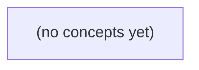

# 09.09 异步与长任务：Go 初学者的 IM 历史导出 API 设计

*以虚构用户 u-b 导出会话 c-a 至 seq9 的有权历史为主线，讲解为什么长任务需要从同步请求转向“提交—查询—下载”的异步 HTTP 合同。教材从 202 Accepted、幂等提交和状态机出发，逐步覆盖取消竞态、权限快照、私有产物、轮询反馈与运维证据，并配套 22 道分层反馈题。*

**章节:** 2

---

## 本书导览

- 了解整本书的章节脉络
- 掌握各章之间的概念依赖关系
- 选择最合适的阅读顺序

# 09.09 异步与长任务：Go 初学者的 IM 历史导出 API 设计

以虚构用户 u-b 导出会话 c-a 至 seq9 的有权历史为主线，讲解为什么长任务需要从同步请求转向“提交—查询—下载”的异步 HTTP 合同。教材从 202 Accepted、幂等提交和状态机出发，逐步覆盖取消竞态、权限快照、私有产物、轮询反馈与运维证据，并配套 22 道分层反馈题。

下方的概念图展示了本书 0 个核心概念以及它们之间的依赖关系；再下方是 1 个章节的入口。你可以按从上到下的顺序阅读，也可以根据自己的兴趣或先验知识选择切入点。

#### 概念图



## 章节索引

- **09.09 异步与长任务：提交历史导出后如何查询和取消** — 面向Go初学者，以虚构IM有权历史导出任务exp-9说明HTTP 202、状态资源、幂等提交、取消竞态、私有结果权限和用户反馈。

## 09.09 异步与长任务：提交历史导出后如何查询和取消

- 区分当前S2/拟议S3发送与新纸上导出API
- 解释202/Location/状态查询
- 设计幂等键与回应未知处理
- 画出持久任务和取消状态机
- 保护导出结果、当前成员权限与缓存
- 限制固定OpenIM源码能证明的范围

历史导出不是一次普通发消息：它需要把“请求已受理、任务仍在执行、结果可安全下载”拆成清晰且可追踪的阶段。

### 先划清三类接口的边界

### 先划清三类接口的边界

不要把“导出历史”误当成另一种发送消息。三类接口都可能返回 `200`，但它们确认的对象、持久化位置与后续责任完全不同。

| 接口 | 主要动作 | `200` 的含义 | 持久化位置 | 是否代表任务完成 |
|---|---|---|---|---|
| 当前 S2 `POST` 消息 | 向会话 `c-a` 发送一条消息 | `accepted_in_memory`：服务已在内存中接收消息 | 仅内存态，重启或故障可能丢失 | 否；甚至不保证长期可追溯 |
| 拟议 S3 v2 `POST` 消息 | 向会话发送并保留教学记录 | `stored_in_teaching_db`：消息已写入教学数据库 | 教学数据库 | 否；它确认的是消息落库，不是异步工作结果 |
| 纸上设计的 `POST /v3/conversations/c-a/exports` | 请求导出 `u-b` 有权访问、截至 `seq9` 的历史 | 应表示“导出请求已受理并获得任务标识” | 导出任务记录及其状态存储 | 否；导出可能仍在排队、扫描、打包或失败 |

因此，`u-b` 对 `c-a` 的访问权只回答“能否提出导出请求”，不能自动推出“导出已经生成”或“下载链接已经可用”。导出接口应把生命周期拆开：

1. **提交请求**：验证 `u-b` 对 `c-a` 的权限及 `seq9` 边界，创建导出任务；
2. **查询状态**：读取任务是排队中、执行中、完成还是失败；
3. **取消任务**：仅对尚未完成的任务请求停止；
4. **下载结果**：只有任务完成后，才返回受控、可过期的下载能力。

尤其要避免用 S2 的 `accepted_in_memory` 描述导出受理：它暗示任务元数据不稳定，无法可靠地查询、取消或审计。即使借鉴 S3 的“已持久化”思想，也不能把“任务已落库”写成“文件已生成”；前者是可追踪的开始，后者才是可下载的结束。

### 用202和状态资源表达受理

### 用202和状态资源表达受理

u-b 虽仍拥有 `c-a` 的访问权，但“导出至 `seq9` 的全部有权历史”可能扫描大量消息、过滤权限边界并生成文件，不能把它伪装成一次已经完成的同步响应。这里讨论的是纸上规划的 `v3` 接口，不等同于当前 S2 的 `POST` 返回 `200 accepted_in_memory`，也不等同于拟议 S3 v2 的 `200 stored_in_teaching_db`。

提交可设计为：

`POST /v3/conversations/c-a/exports`

请求体明确导出范围，例如：

`{"through_seq":9,"format":"jsonl"}`

服务端先验证 u-b 对 `c-a` 的访问权，以及 `seq9` 是否是允许请求的历史边界。验证通过后，不必等待文件生成，而是创建一个不可猜测的导出任务资源：

- 响应：`202 Accepted`
- `Location: /v3/exports/e-x7k`
- 响应体可返回 `export_id`、`status`、请求的 `through_seq`

`202` 的含义是“请求已被接收并进入处理流程”，不是“导出文件已存在”，更不是“任务必然成功”。客户端随后轮询：

`GET /v3/exports/e-x7k`

状态资源应反映任务生命周期，例如 `queued`、`running`、`completed`、`failed`、`cancelled`。仍在执行时可返回进度提示，但进度只是估计；完成前不应提供可用下载地址。

当状态为 `completed`，查询结果才包含短期有效的下载链接，例如 `download_url`，指向已生成的导出文件。该链接应限制有效期，并在下载时再次考虑授权；若 u-b 之后失去 `c-a` 的访问权，不能仅因曾提交任务就永久取得历史数据。

因此，资源关系是：导出提交创建“任务资源”，`Location` 指向该任务；任务完成后，任务资源再引用“结果文件”。这使受理、执行和下载各自可观察、可重试，也为后续取消接口保留了明确目标。

### 幂等提交与回应未知

### 幂等提交与回应未知

创建导出任务时，最危险的状态不是“明确失败”，而是“回应未知”：客户端已向纸上接口 `POST /v3/conversations/c-a/exports` 发送请求，却在收到响应前超时、断连或进程重启。此时不能安全地直接重试；第一次请求可能已经创建了一个面向 `seq9` 的大规模导出任务。

客户端应为一次用户意图生成稳定的幂等键，例如：

`Idempotency-Key: export-c-a-seq9-8f3...`

同一意图的所有重试必须携带同一键；只有用户重新发起一次独立导出，才生成新键。服务端以“调用者身份 + 幂等键”为唯一性范围保存首次受理结果：

- 首次提交：校验 `u-b` 仍具备 `c-a` 的访问权，记录导出范围、目标 `seq9`、请求参数与任务标识 `export_id`，返回“已受理”。
- 相同键、相同语义的再次提交：不再创建任务，而是返回原 `export_id` 及当前状态。
- 相同键、不同参数：返回冲突，避免客户端误把另一份导出解释为本次请求。

因此，超时后的恢复流程不是盲目重发，而是先按幂等键查询，例如 `GET /v3/conversations/c-a/exports?idem_key=...`；若查到任务，继续轮询其状态；若未查到，才以原键重试提交。任务可能经历 `accepted`、`running`、`completed`、`failed`、`cancelled`。只有 `completed` 才表示结果文件已生成；下载应使用任务返回的受限下载地址或专用下载端点，而不能把“请求已受理”误当作“文件已可得”。

这套设计也与 S2 的 `200 accepted_in_memory`、拟议 S3 v2 的 `200 stored_in_teaching_db` 区分开：前两者描述消息处理或存储结果；v3 导出则把长任务的创建、完成与下载显式建模。

### 持久任务与取消竞态

### 持久任务与取消竞态

导出任务不能只用“进行中/完成”表示。纸上拟议的 `POST /v3/conversations/c-a/exports` 在受理后创建持久任务，例如返回 `202 Accepted` 与 `export_id`；其状态应独立于 S2 的 `200 accepted_in_memory` 和拟议 S3 v2 的 `200 stored_in_teaching_db`。前者描述消息请求，后者描述教学库落盘，均不等于历史导出已生成。

可定义状态机：

- `queued`：已校验 u-b 对 c-a 的访问权，任务等待执行。
- `running`：正在扫描截至 `seq9` 的有权历史并生成文件。
- `cancel_requested`：服务端已接受取消意图，但工作进程可能尚未停下。
- `cancelled`：任务终止，不提供下载结果。
- `succeeded`：导出文件完整生成，可通过短期、单用途下载地址取得。
- `failed`：不可恢复错误；记录安全的错误码，不泄露无权记录或内部细节。

允许转换为：

`queued → running → succeeded|failed`  
`queued|running → cancel_requested → cancelled`

取消不是“立即删除一切”的承诺。`DELETE /v3/conversations/c-a/exports/{export_id}` 应返回当前观察到的状态；若任务已进入不可中断的最终提交区，可返回 `succeeded`，而不是错误地声称已取消。判定规则应以持久化的原子状态转换为准：完成提交与取消提交竞争时，先成功写入终态者获胜；终态不可再改写。因而：

- 取消先落库：工作者在检查点发现取消标记，清理临时文件并写入 `cancelled`。
- 完成先落库：取消请求返回“已完成”，下载仍可用。
- 两者尚未终态：返回 `cancel_requested`，客户端轮询任务资源，而非猜测文件是否存在。

即使任务成功，也应在下载时再次确认 u-b 仍具 c-a 访问权；权限已撤销、链接过期或结果被清理时，拒绝下载。

### 结果保护、用户反馈与证据边界

### 结果保护、用户反馈与证据边界

导出任务完成并不等于结果可永久交付。设 `u-b` 提交了 `c-a` 至 `seq9` 的历史导出；在任务排队、扫描和生成文件期间，`u-b` 可能被移出会话、会话可能被删除，或其权限被收回。因此下载阶段必须再次按**当前**状态校验：

- 请求者仍是 `c-a` 的有效成员，且仍具有读取相应历史的权限；
- 导出范围未因保留策略、消息撤回或权限变化而缩减；
- 下载令牌属于该请求者、该导出任务和该结果版本，不能仅凭猜测任务编号获取文件。

较稳妥的纸上设计是：任务完成后，查询接口只返回状态、摘要、过期时间及一次性或短时有效下载地址；真正下载时服务端重新鉴权。文件不应设为公开对象存储链接，也不应被浏览器、代理或共享缓存长期保存；响应可使用 `Cache-Control: no-store`，下载令牌应短期过期、可撤销，并避免出现在日志、页面截图或 Referer 中。

用户反馈也应区分状态：`queued` 表示已受理但尚未执行，`running` 表示正在生成，`completed` 表示可尝试下载，`failed` 表示任务失败，`cancelled` 表示已取消，`expired` 表示结果已清理。若下载时权限复核失败，应返回“当前无权下载”，而非暗示文件仍可通过旧链接取得。

这里的 `/v3/conversations/c-a/exports`、异步状态与下载令牌均是教学中的拟议设计，不是已部署接口。固定 OpenIM 源码至多可作为证据说明现有 S2 `POST` 的 `200 accepted_in_memory` 行为，或拟议 S3 v2 的 `200 stored_in_teaching_db` 语义；它们不能证明 v3 导出任务、取消机制、重新鉴权或缓存策略已经存在。

> **要点** — 长导出应以202任务资源建模，并用幂等、状态机和下载时权限复核保证可靠与安全。

历史导出属于长任务：提交成功不等于结果已生成。应以持久化操作资源承接进度、取消与权限控制。

### 明确导出接口的边界

### 明确导出接口的边界

`POST /v3/conversations/c-a/exports` 的职责是**创建历史记录导出任务**，而非立即返回导出文件，也不负责向外部地址发送内容。它与当前 S2 的发送能力、拟议中的 S3 发送能力应保持分层：

- 导出接口只生成受授权保护的导出结果及其操作状态；
- S2 负责既有的发送语义，不因导出而隐式触发；
- S3 若提供“将导出结果发送至某处”的能力，应以已完成的导出资源为输入，独立建模目标、投递状态与重试，不能把发送参数塞入导出请求。

请求可表达为：

`POST /v3/conversations/c-a/exports`

并携带 `Idempotency-Key`，以及例如：

`{"format":"jsonl","before_seq":9}`

`format: "jsonl"` 表示结果以逐行 JSON 的形式编码；它是结果表示选择，不改变导出范围。`before_seq: 9` 表示以序号 `9` 为排他上界，仅导出序号小于 `9` 的记录。该边界应在任务创建时持久化，避免任务排队期间新增消息进入结果；未提供边界时，服务端也应记录实际采用的快照边界。

只有导出操作资源与入队意图在同一数据库提交中持久化后，服务端才返回 `202 Accepted`，例如：

`Location: /v3/operations/exp-9`

响应可含 `state: "QUEUED"` 与 `status_url`。`202` 仅表示请求已被接受处理，依 RFC 9110 并不表示文件已生成。操作状态通过 `GET /v3/operations/exp-9` 查询；成功后再经授权访问结果资源。私有响应均应使用 `Cache-Control: no-store`，且状态响应不嵌入导出正文。

### 以 202 和状态资源确认受理

### 以 202 和状态资源确认受理

`POST /v3/conversations/c-a/exports` 是“请求创建导出”，不是“立即取得导出文件”。例如客户端提交：

`Idempotency-Key: k-123`，并指定 `format: jsonl`、`before_seq: 9`。

服务端只有在同一数据库事务中同时完成以下持久化操作后，才能返回 `202 Accepted`：

1. 创建操作资源，如 `operation_id = exp-9`，初始状态为 `QUEUED`；
2. 记录对应的入队意图，例如写入 outbox/待投递任务记录；
3. 绑定请求参数、发起者与权限快照，并保存幂等键的处理结果。

这样即使服务在响应后崩溃，后台投递器仍可从持久化入队意图恢复任务；反之，若仅把任务放入内存队列或先返回响应再异步落库，就可能出现“客户端已收到受理、任务却永久丢失”的不一致。

典型响应为：

`202 Accepted`  
`Location: /v3/operations/exp-9`  
`Cache-Control: no-store`

响应体可返回：

`{"id":"exp-9","state":"QUEUED","status_url":"/v3/operations/exp-9"}`

其中 `Location` 与 `status_url` 都指向可查询的状态资源。`202` 按 RFC 9110 的含义只是“服务器已接受处理请求”，不表示导出已开始、一定成功，更不表示结果文件已经可下载。客户端随后应轮询 `GET /v3/operations/exp-9`，依据状态资源中的 `state` 和 `updated_at` 判断进展，而不是把提交响应当作最终结果。

### 用幂等键处理重复提交与未知结果

### 用幂等键处理重复提交与未知结果

客户端提交导出时应携带 `Idempotency-Key`，例如：

`POST /v3/conversations/c-a/exports`  
`Idempotency-Key: 8f3c...`

服务端将幂等键与**调用者身份、请求方法、目标会话、规范化后的请求体**绑定；同一绑定首次请求创建持久化操作 `exp-9`，并在同一数据库事务中记录操作与 `enqueue` 意图。随后返回：

`202 Accepted`  
`Location: /v3/operations/exp-9`

响应可包含 `state: "QUEUED"` 与 `status_url`，但这仅表示服务器已接受处理，不表示导出已完成。

同一调用者以相同幂等键再次提交、且请求语义一致时，服务端不得创建第二个导出，而应复用既有操作，返回同一 `Location`、操作标识及可观察到的当前状态。幂等记录应至少保留到客户端合理重试窗口结束；私有响应统一使用：

`Cache-Control: no-store`

若同一幂等键却携带不同的 `format`、`before_seq` 或目标资源，应拒绝请求，例如返回 `409 Conflict`，并说明该键已绑定到不同请求。不能仅按键字符串全局去重，否则不同用户或不同资源可能发生错误复用。

网络超时尤其危险：客户端不知道请求是否到达服务器时，**优先用原幂等键重试**，而不是生成新键再次提交。若重试得到同一操作资源，再轮询：

`GET /v3/operations/exp-9`

待其 `state` 为 `SUCCEEDED` 后，才授权获取：

`GET /v3/exports/exp-9/result`

操作状态资源只描述进度、时间与失败原因，不承载导出正文；这样即使提交响应丢失，客户端仍可安全恢复并避免重复创建导出。

### 查询、取消与状态机竞态

### 查询、取消与状态机竞态

`GET /v3/operations/exp-9` 返回的是操作资源，而非导出正文：

```json
{
  "id": "exp-9",
  "state": "RUNNING",
  "updated_at": "2025-03-08T10:21:04Z"
}
```

状态至少应区分：

- `QUEUED`：已持久化并入队，尚未被执行器领取。
- `RUNNING`：执行器已领取，正在生成导出文件。
- `SUCCEEDED`：结果已生成；客户端再经授权请求 `GET /v3/exports/exp-9/result`。
- `FAILED`：任务不可恢复地失败，可附有限的机器可读错误码，但不泄露内部堆栈。
- `CANCELLED`：取消已生效，不会再提供结果。

`updated_at` 必须随每次可观察状态变化更新，供客户端轮询与判断陈旧响应；所有私有状态响应均应携带 `Cache-Control: no-store`。状态接口不应内嵌大体积导出内容，以免轮询响应成为结果传输通道。

取消可建模为 `POST /v3/operations/exp-9/cancel`。取消不是“立即杀死线程”的承诺，而是持久化取消意图：对 `QUEUED` 操作可原子转为 `CANCELLED`；对 `RUNNING` 操作，执行器在安全检查点观察取消标记后停止并写入 `CANCELLED`。

完成与取消会并发竞争，因此终态必须采用条件更新或版本号比较保证单次裁决。例如执行器仅可执行：

`RUNNING -> SUCCEEDED`

取消器仅可执行：

`QUEUED|RUNNING -> CANCELLED`

两者以同一行的原子条件更新竞争，先成功者决定终态；另一方发现状态已终结后不得覆盖。这样，取消请求若晚于成功提交，应返回当前 `SUCCEEDED`，而不是事后把已生成、可能已下载的结果改写为已取消。终态一旦写入不可逆，保证轮询、重试取消和后台重投递都得到一致结论。

### 隔离结果访问与私有缓存

### 隔离结果访问与私有缓存

操作进入 `SUCCEEDED` 仅表示导出文件已生成，不表示任何持有操作标识的人都可读取内容。结果下载必须经过**当前请求成员**的授权校验，而非仅信任创建任务时记录的身份。例如：

- `GET /v3/operations/exp-9` 返回操作状态、`updated_at`、失败码等元数据，不返回 JSONL 正文、预签名下载地址或文件片段。
- 仅当状态为 `SUCCEEDED` 时，客户端才可请求 `GET /v3/exports/exp-9/result`。
- 结果端点必须重新校验调用者仍可访问会话 `c-a`、仍属于相应工作区，并校验导出范围；成员被移除、权限降级或会话访问被撤销时，应拒绝下载，即使该成员曾提交任务。

结果端点可直接以 `200` 返回受保护的文件流；若采用对象存储下载页或临时地址，也可返回：

```http
303 See Other
Location: /v3/downloads/...
```

`303` 的语义是“请以 `GET` 访问 `Location` 指向的另一资源”，不是任务完成状态本身。该跳转目标应短时有效、绑定授权上下文，并避免成为可长期转发的公开链接。

操作状态资源应保持轻量：`QUEUED`、`RUNNING`、`CANCELLED`、`FAILED`、`SUCCEEDED` 及时间戳足以支持轮询和展示。不要把导出正文嵌入状态响应，否则会放大轮询流量，并使状态接口意外承担结果泄露风险。

操作、结果及下载相关响应均属于私有数据，应统一发送：

```http
Cache-Control: no-store
```

这包括 `202 Accepted`、状态查询的 `200`、取消响应、失败响应以及结果下载的重定向响应。`no-store` 要求浏览器、代理和中间缓存不保存响应，避免共享设备、代理缓存或浏览器历史中残留任务进度与导出内容。

> **要点** — 长任务以可查询的持久 operation 为中心：202 仅表示受理，幂等、竞态、权限与缓存必须贯穿全流程。

历史导出是异步长任务，可靠重试的关键不在“再发一次”，而在用幂等键把同一提交意图稳定地绑定到同一任务。

### 区分现有发送语义与新导出合同

### 区分现有发送语义与新导出合同

不能把当前 S2 的消息发送规则直接套到新 `/v3` 历史导出接口。两者虽然都涉及“重复提交”，但冲突判定、可见性与重试结果不同。

- **当前 S2 发送**：`message_id` 是消息标识。同一 `message_id` 再次提交，即使正文完全相同，仍按冲突处理并返回 `409`；若调用者不是会话成员，为避免泄露消息是否存在，返回 `404`。消息正文中的“6 个 UTF-8 字节”限制也保持不变。
- **新 `/v3` 导出**：使用 `Idempotency-Key` 表达“这是同一次创建导出任务的意图”。在同一受信用户、同一键、同一规范请求指纹以及保留窗口内重试，应返回同一个 `exp-9`，并携带其当前状态，而不是新建任务。
- **键相同但参数不同**：这不再是安全重试，而是同一幂等键被用于不同意图，应返回 `409`。
- **响应丢失**：不能据此断言任务未创建。客户端必须用原 `Idempotency-Key` 重试；若已超过服务端保留窗口，则应先查询任务，或按接口约定进入“创建结果未知”的处理流程。

因此，S2 的“同标识即冲突”是既有发送语义；`/v3` 的“同键同指纹返回同一任务”才是导出接口新增的教学合同。

### 幂等作用域：用户、键与请求指纹

### 幂等作用域：用户、键与请求指纹

一次“提交历史导出”的幂等判定，不是只看 `Idempotency-Key`，而是在**受信用户 + 幂等键 + 规范请求指纹**构成的范围内进行：

- **受信用户**：由认证凭证解析出的实际调用者，而非客户端随意填写的用户字段。不同用户即使使用同一个键，也属于不同作用域，不能互相取得任务结果。
- **`Idempotency-Key`**：客户端为一次明确的提交意图生成的稳定标识。网络超时、响应丢失或连接中断后，必须携带**同一个键**重试。
- **规范请求指纹**：对影响导出语义的参数进行规范化后计算的指纹，例如导出范围、筛选条件、格式、时区等。它避免仅凭同一个键却提交不同任务。

在新的 `/v3` 教学合同中，服务端会在保留窗口内记录该三元组及对应任务。若同一受信用户以相同键、相同规范指纹重试，服务端返回原来的 `exp-9`，并附带该任务的当前状态；即使任务已完成、失败或正在运行，也不会重新创建导出。

反之，若键相同但规范化后的参数不同，说明客户端试图将一个提交意图复用于另一项任务，服务端应返回 `409`，而不是猜测应以哪次请求为准。客户端此时应生成新键，再提交新任务。

不要把“没有收到响应”理解为“任务没有创建”。最安全的策略是：先用原键重试；若已超过服务端幂等记录的保留窗口，则查询已有任务，或按接口约定进入“创建结果未知”的处理流程，避免盲目生成重复导出。

### 同键重试、参数冲突与保留窗口

### 同键重试、参数冲突与保留窗口

客户端提交导出时，应为一次“业务意图”生成一个 `Idempotency-Key`。服务端不只按键查重，还要在受信用户范围内保存该键对应的**规范请求指纹**，例如导出类型、时间范围、筛选条件与格式经规范化后的摘要。

当同一用户以同一键、同一指纹重试时，含义仍是“继续确认这一次提交”。因此服务端必须返回首次创建的同一任务，如 `exp-9`，并返回它的**当前状态**：

- 首次请求成功：创建 `exp-9`，状态可能为“排队中”；
- 响应在网络中丢失：客户端不能据此断言任务未创建；
- 客户端使用原键重试：返回仍是 `exp-9`，但状态可能已变为“处理中”“已完成”或“已取消”。

这样，重试不会额外排入第二个导出任务，也不会因状态变化而失去任务身份。

反之，`Idempotency-Key` 相同但参数不同，表示客户端试图让一个既有业务意图同时代表两份不同请求。例如第一次导出一月数据，第二次却改为导出二月数据；若服务端静默复用旧任务，会返回错误内容；若改为创建新任务，则幂等键失去防重复提交的作用。因此必须返回 `409`，提示调用方更换新键并明确发起另一项任务。

该绑定只在约定的保留窗口内有效。窗口内可安全同键重试；超过窗口后，服务端未必仍保存键与指纹的映射。此时客户端应先查询已知任务，或按合同采用“结果未知”的恢复策略，不能仅凭过期键重试就假定不会创建新任务。

### 响应丢失后的安全恢复流程

### 响应丢失后的安全恢复流程

提交导出请求后连接超时、客户端崩溃或网关丢弃响应，都只能说明“客户端未收到结果”，不能说明任务未创建。此时若换一个幂等键重新提交，可能创建第二个导出任务；正确恢复原则是：**同一提交意图始终复用原 `Idempotency-Key`**。

可将客户端流程设计为：

1. 生成并持久化提交记录：受信用户、`Idempotency-Key`、规范化请求指纹、首次提交时间，以及本地业务单号。
2. 调用新 `/v3` 教学合同的创建接口。若响应成功，保存返回的任务标识 `exp-9` 与当前状态。
3. 若发生超时、断连或收到无法确认的响应，不要假定失败；使用**同一用户、同一键、同一规范请求体**重试创建。
4. 服务端发现键和指纹一致时，返回同一个 `exp-9` 及其最新状态，例如仍在排队、执行中、已完成或已取消。客户端据此恢复轮询或取消流程。
5. 若同一键对应的参数不同，服务端返回 `409`。这不是可重试错误，应停止请求并提示“该提交键已绑定另一份导出意图”。

保留窗口内，重试是恢复创建结果的首选；超过窗口后，服务端可能不再保存键与指纹的映射。客户端应先按已知任务标识查询；若任务标识也未落盘，则进入明确的“创建结果未知”状态，由用户确认是否以**新键**发起新任务，避免静默重复导出。

注意当前 S2 合同不能套用该规则：同一 `message_id` 即使正文相同仍会 `409`，且非成员查询应隐藏为 `404`；UTF-8 的 6 字节限制也不因重试而改变。

### 用exp-9检验接口与用户反馈

### 用 exp-9 检验接口与用户反馈

以受信用户提交导出为例，客户端生成 `Idempotency-Key: exp-9`，并发送规范化后的请求指纹。服务端的幂等作用域是：

`受信用户 + exp-9 + 规范请求指纹 + 保留窗口`

可按以下场景验收接口与界面：

- **首次提交**：返回任务 `task_id`、当前状态（如“排队中”）及查询链接。界面提示“导出已创建，可在任务中心查看进度”，而不是声称文件已生成。
- **请求超时、响应丢失后重试**：仍携带 `exp-9` 与完全相同的参数。即使客户端未收到首次响应，也不能据此断言任务未创建；服务端应返回同一 `task_id` 与其最新状态。界面应提示“已恢复此前提交的导出任务”，避免显示两条任务记录。
- **同键但参数不同**：例如仍用 `exp-9`，却修改导出日期范围、格式或筛选条件。服务端返回 `409`，说明该键已绑定另一份请求意图；界面提示“此提交标识已用于不同导出条件，请重新发起提交”，并生成新键。
- **超过保留窗口**：服务端已无法依据 `exp-9` 可靠判断历史提交。客户端应先按已知 `task_id` 查询；若没有任务标识，则明确提示“提交结果未知，请查询任务中心或确认后重新提交”，不能把重试结果宣传为“未创建”。

这些规则仅适用于新的 `/v3` 教学合同。当前 `S2` 中，即使正文完全相同，复用同一 `message_id` 仍会得到 `409`；非成员访问则隐藏为 `404`。此外，长度限制按 UTF-8 字节计算，`6` 个字节的限制不会因字符显示方式而改变。

> **要点** — 幂等不是简单去重：同一用户、同一键、同一规范请求才复用同一导出任务；未知结果必须可恢复。

长任务的可靠性不取决于一次响应是否送达，而取决于任务状态、执行租约与结果引用能否被持久化、授权查询和安全恢复。

### 从排队到终态的持久状态机

### 从排队到终态的持久状态机

历史导出应建模为可持久化的操作（operation），而不是一次“等待完成”的请求。每个操作至少保存 `operation_id`、请求者与授权范围、参数摘要、当前状态、`attempt`、`owner`、`lease_until`、`artifact_id/result_ref`、错误摘要及版本号。状态迁移必须通过数据库条件更新实现，例如 `WHERE status='QUEUED' AND version=?`，避免多个 worker 同时领取或旧 worker 覆盖新结果。

- `QUEUED`：任务已被接收、鉴权和参数校验完成，但尚未由 worker 领取。此时应已持久化幂等键或请求指纹；重复提交应返回既有操作，而非创建多个导出。
- `RUNNING`：worker 以原子“领取”动作写入 `owner`、`attempt` 与租约 `lease_until` 后进入。worker 必须续租；租约过期不等于任务失败，只表示其他 worker 可以在满足条件时接管并开始新 attempt。
- `SUCCEEDED`：结果对象已成功写入，并且稳定的 `artifact_id` 或 `result_ref` 已持久化。进入该状态前，不应仅凭“上传调用返回成功”判断完成；若对象已写入但状态响应丢失，重试者应按稳定标识查找并复用结果，再条件更新为成功，不能重复曝光多个下载对象。
- `RETRY_AT`：本次 attempt 因暂时性故障退出，记录下次可执行时间、失败原因和退避次数。调度器仅在 `retry_at <= now()` 时重新领取；它不是终态。
- `FAILED_REPAIR`：自动重试已无意义，或发现需要人工修复的一致性问题，例如结果对象存在但归属、加密元数据或授权绑定无法确认。未知结果不能直接标记失败，更不能删除可能已成功生成的对象。

通常只有 `SUCCEEDED` 与 `FAILED_REPAIR` 是终态：终态一旦写入，不得回退到运行中，也不得被过期 worker 覆盖。取消请求应同样走条件迁移：只取消尚未完成且未被终态固定的操作；若结果已持久化，则返回成功状态而非假装取消成功。

状态接口证明的是操作阶段与当前授权下可见的结果引用，不证明客户端已下载、阅读或保存文件。通知和 WebSocket 事件只用于提示刷新；客户端应始终通过授权的 `GET operation` 获取最终状态。

### 执行租约、归属与尝试次数

### 执行租约、归属与尝试次数

任务入队后处于 `QUEUED`，任意 worker 都不能仅凭“看到了任务”就开始执行。它必须通过一次条件更新取得执行租约：仅当任务仍为 `QUEUED`，或原租约已过期时，才写入新的 `owner`、不可预测的 `token`、递增后的 `attempt` 与 `lease_expires_at`。

```text
若 status=QUEUED
或 lease_expires_at < now()
则原子写入：
owner = worker_id
token = random_token
attempt = attempt + 1
status = RUNNING
lease_expires_at = now() + lease_duration
```

其中：

- `owner` 表示当前声称执行权的 worker，用于诊断、调度和定位故障节点；
- `token` 是本次租约的唯一凭证。后续续租、写入结果、标记失败都必须携带它，不能只依赖 `owner`；
- `attempt` 区分同一逻辑任务的多次执行。超时接管、崩溃恢复或可重试错误都会产生新尝试；
- `lease_expires_at` 使 worker 崩溃后不会永久占有任务。

worker 运行期间应定期续租，并使用条件更新：

`WHERE operation_id=? AND status='RUNNING' AND token=?`

若更新行数为零，说明租约已失效或已被其他 worker 接管；旧 worker 必须停止提交状态和副作用。尤其不能在失去 `token` 后把任务写成 `SUCCEEDED` 或 `FAILED`。

超时接管并不意味着前一次一定失败：它可能已成功写入外部导出对象，但尚未来得及回写状态。因此新尝试应先按稳定的 `artifact_id` 或幂等键检查结果是否已存在；存在则条件性收敛为成功，不存在才继续生成。这样可避免两个 worker 并发曝光同一导出结果，也避免把“未知的旧尝试”误判为失败。

### 对象已写成而回应丢失的恢复

### 对象已写成而回应丢失的恢复

执行器完成导出时，通常先将文件写入对象存储，再把任务状态更新为 `SUCCEEDED` 并返回结果引用。危险窗口在于：对象已成功落盘，但执行器在更新数据库、发送回应或续租前崩溃。此时任务表可能仍是 `RUNNING`，也可能因租约过期进入待修复状态；它并不等价于“导出失败”。

恢复的关键是为一次逻辑导出预先分配稳定的 `artifact_id`，并使其贯穿所有重试尝试：

- 对象键应由 `operation_id/artifact_id` 派生，而不是由 `attempt` 或当前时间派生。
- 写对象使用幂等语义：同一 `artifact_id` 重试时，若对象已存在，应校验元数据中的任务标识、内容版本、校验和；匹配则复用，不匹配则停止并进入人工修复。
- 状态更新必须是条件更新，例如仅当 `owner`、`token`、`attempt` 仍匹配且状态为 `RUNNING` 时，才能写入 `SUCCEEDED(result_ref)`。失去租约的旧执行器不得覆盖新尝试的状态。
- 修复器发现“状态未知但稳定对象存在”时，应验证对象完整性与归属，再安全补写结果引用；不能再次生成新对象并再次对用户曝光。

尤其不能把“未收到成功回应”直接当作失败：回应可能丢失，而结果已经存在；盲目重试会造成重复文件、重复通知或不同版本结果。反过来，也不能仅凭对象存在就立即向客户端展示下载链接：对象可能是过期尝试、未完成上传或无权访问的残留物。

因此，`GET operation` 才是授权后的状态源。它返回已持久化的阶段和可用的 `result_ref`；通知或 WebSocket 事件只提示客户端刷新。接口中的 `SUCCEEDED` 证明结果已被系统确认可取，不证明客户端已经下载、阅读或保存该文件。

### 状态查询、授权结果与通知边界

### 状态查询、授权结果与通知边界

提交历史导出后，客户端应保存`operation_id`，并通过`GET /operations/{id}`轮询或恢复页面状态。该接口返回的是**操作阶段**，而不是“用户已拿到文件”的证明：

- `QUEUED`：任务已持久化，等待工作节点领取。
- `RUNNING`：某个`owner/token/attempt`持有有效租约；租约过期后可由后续尝试接管。
- `RETRY_AT`：本次执行暂不可完成，系统将在指定时间重试。
- `FAILED_REPAIR`：需要人工或修复流程介入；不能仅因一次超时就把任务标为失败。
- `SUCCEEDED`：结果对象已成功写入，状态中应保存稳定的`artifact_id`或`result_ref`。

`SUCCEEDED`只说明服务端已生成可引用结果，不等于当前请求者仍有下载资格，更不等于文件已经下载、打开或阅读。结果访问必须再次经过当前成员身份、租户、资源范围和导出策略校验：历史上有权限提交任务，不代表现在仍可取得产物。若权限已撤销，状态接口可以显示任务成功，但结果下载应返回拒绝访问或不可用状态。

外部对象存储写入成功、但工作节点回写状态的响应丢失时，恢复逻辑应依据稳定`artifact_id`和条件更新确认既有产物，而不是重新生成并重复曝光文件。未知结果应保持可恢复的中间状态或进入修复队列，不能武断映射为失败。

通知、邮件或 WebSocket 事件只用于更新界面提示，例如“导出已完成”。它们可能重复、乱序或丢失，且不携带持续授权结论。客户端收到通知后仍应调用`GET`获取权威状态；服务端也应以该`GET`作为按当前权限计算后的唯一状态源。

### 取消竞态与面向用户的反馈

### 取消竞态与面向用户的反馈

以“导出历史记录”为例，用户点击取消时，服务端不能简单把任务标为“已取消”。取消请求与工作线程、对象存储写入可能并发发生，因此应返回一个**可解释的取消结果**：

- **仍在排队**：条件更新 `QUEUED → CANCELLED` 成功，尚未领取任务；用户可看到“已取消，未开始生成”。
- **正在执行**：将任务标记为“请求取消”，工作线程在检查点发现取消标记后停止，并释放或失效其 `worker lease`；用户看到“正在停止导出”，而不是误导性的“已立即取消”。
- **结果已生成**：若工作线程已写入外部对象并持久化稳定的 `artifact_id/result_ref`，取消不能抹去这一事实。应根据业务策略返回“导出已完成，取消未生效”，或“结果已生成但已撤销访问”。不能因取消响应先到就删除状态，导致对象存在却无法追踪。

典型竞态是：工作线程完成上传，随后状态回写丢失；与此同时用户发起取消。此时不能把未知状态直接解释为失败或取消成功。服务端应通过稳定 `artifact_id` 查找已存在对象，并以带版本号、`attempt` 或状态前置条件的更新完成收敛：

`RUNNING(attempt=3) → SUCCEEDED(result_ref)` 仅在当前租约和尝试次数匹配时成立；否则由恢复流程判定是否已有有效结果。

面向用户的事件通知只承担提示作用。例如 WebSocket 推送“取消处理中”或“导出完成”，客户端收到后仍应调用授权的 `GET /operations/{id}` 获取权威状态。该接口只说明操作处于何阶段、结果是否可访问；它不证明用户已经下载、更不证明已经阅读结果。

对短暂网络故障，可缓存最近一次已确认的任务摘要，但应标注“可能已过期”，并在恢复连接后重新查询。缓存不得把旧的 `RUNNING` 覆盖为新的完成结果，也不得依据旧通知自动隐藏已生成的下载入口。

> **要点** — 持久状态机与条件更新保证可恢复；授权GET确认真实状态，通知和未知回应都不能替代它。

取消历史导出不是“立刻停止”的按钮，而是一次需持久记录、可与完成竞态的状态转换请求。

### 202确认的是取消请求已持久化

### 202确认的是取消请求已持久化

`POST /v3/operations/exp-9/cancel` 返回 `202 Accepted`，确认的是服务端已将该导出任务的取消意图可靠写入状态存储，例如：

`RUNNING → CANCEL_REQUESTED`

它**不表示**工作进程已经停止，更不表示此前产生的外部效果已被自动回滚。此时工作进程可能仍在读取消息、生成压缩包、上传临时对象，或等待下一次协作式取消检查。

因此，`202` 不应被解释为：

- 导出文件已删除；
- 消息历史已恢复、删除或发生变化；
- 已上传的对象一定不可访问；
- CPU、网络连接或后台工作已立刻释放；
- 任务最终状态已经是 `CANCELED`。

取消是异步协作过程。工作进程发现 `CANCEL_REQUESTED` 后，应停止后续计算与发布，清理可安全清理的临时对象，随后写入终态：

`CANCEL_REQUESTED → CANCELED`

接口可返回当前状态，帮助客户端正确更新界面：

```text
202
{
  "operationId": "exp-9",
  "status": "CANCEL_REQUESTED"
}
```

客户端随后查询任务状态，而不是仅凭一次取消响应就隐藏下载入口或宣称“导出已停止”。尤其对于已接近完成的任务，取消请求与成功完成可能竞争；`202` 只说明取消请求被记录，最终由状态机裁决。

### 用状态机表达取消与完成竞态

### 用状态机表达取消与完成竞态

把导出任务建模为持久状态机，而不是由某个 HTTP 请求或某个 Go `context` 的存活状态决定：

`QUEUED → RUNNING → SUCCEEDED`  
`QUEUED/RUNNING → CANCEL_REQUESTED → CANCELED`

其中 `SUCCEEDED` 与 `CANCELED` 都是不可逆终态。`CANCEL_REQUESTED` 不是终态：它表示服务端已经接受并持久化“希望取消”的意图，但 worker 可能仍在读取消息、写入临时对象，或即将完成最后一步。

`POST /v3/operations/exp-9/cancel` 返回 `202` 时，应表达：

- 状态已原子转换为 `CANCEL_REQUESTED`，请求不会因重试而丢失；
- worker 需要在分页读取、批量写入、上传分片等协作检查点观察该状态；
- 观察到取消后停止继续产生结果，清理临时文件或临时对象，最后写入 `CANCELED`；
- 不承诺 worker 已立刻停止，也不暗示既有历史消息被删除。

完成与取消会竞态，因此终态转换必须使用条件更新或 CAS。例如 worker 仅能执行：

`CAS(RUNNING, SUCCEEDED)`

取消请求仅能执行：

`CAS(QUEUED|RUNNING, CANCEL_REQUESTED)`

若 worker 先成功进入 `SUCCEEDED`，迟到的取消不能覆盖结果；接口应返回明确的 `409 ALREADY_TERMINAL`，并继续允许已授权用户下载导出文件。若取消先赢，worker 后续即使已生成部分内容，也不得发布正式下载结果；已写出的临时对象必须按任务标识安全清理。

Go 的 `context.CancelFunc` 只能通知本进程协程停止等待或停止后续工作，不能撤销已经完成的数据库提交、对象上传或消息读取。因此，真正的取消语义必须以持久状态机和 worker 的协作检查为准。

### CAS决定取消和成功谁先获胜

### CAS决定取消和成功谁先获胜

取消与导出完成可能同时发生：客户端发送 `POST /v3/operations/exp-9/cancel` 时，worker 也许正要把临时导出文件发布为最终可下载结果。不能依赖“先收到哪个请求”或内存中的布尔变量，而应让两方通过数据库的条件更新（CAS，比较并交换）竞争终态。

取消方只允许从非终态推进：

`RUNNING → CANCEL_REQUESTED → CANCELED`

例如：

`UPDATE operations SET status='CANCEL_REQUESTED' WHERE id=? AND status IN ('QUEUED','RUNNING')`

返回 `202` 仅表示这条取消意图已持久化；worker 仍可能在清理分片、关闭流或删除临时对象，尚未真正停止。

worker 发布结果时也必须带条件：

`UPDATE operations SET status='SUCCEEDED', result_uri=? WHERE id=? AND status='RUNNING'`

若该更新影响一行，worker 赢得竞争，可以发布最终对象并授权下载；若影响零行，worker 必须重新读取状态。发现已是 `CANCEL_REQUESTED` 或 `CANCELED` 时，不得写入 `result_uri`、不得生成下载凭证，并应安全删除已写入的临时对象。

反过来，若 worker 已先以 CAS 写入 `SUCCEEDED`，取消请求不得覆盖成功状态。接口应返回明确的 `409 ALREADY_TERMINAL`，同时保留既有结果的下载授权。这样，终态只有一个获胜者：取消获胜则没有可发布结果；成功获胜则结果稳定可用。Go 的 `context.Cancel` 只能通知本进程协作停止，不能撤销已经完成的对象写入或数据库提交，因此终态 CAS 才是跨组件一致性的最终裁决。

### worker协作停止与临时对象清理

### worker协作停止与临时对象清理

`202 CANCEL_REQUESTED` 只说明取消意图已持久化；真正停止依赖 worker 在可中断边界协作检查。典型检查点包括：分页读取消息前、每批序列化后、上传分片前、合并临时文件前，以及最终发布下载对象前。

worker 不应只依赖 Go 的 `context.Cancel`。它可停止当前进程内的等待、请求或循环，但不能撤销已经写入对象存储的分片、已发送的消息读取请求或已完成的数据库提交。因此每个关键阶段都应同时检查：

1. 任务记录是否仍允许执行，例如状态为 `RUNNING`；
2. `cancel_requested_at` 或取消版本号是否已变化；
3. 当前 worker 是否仍持有该任务的执行租约。

发现取消后，worker 立即停止继续读取和写入，并以条件更新将任务从 `CANCEL_REQUESTED` 转为 `CANCELED`。清理动作应围绕“临时对象”和“已发布对象”分界：

- 分片、临时压缩包使用任务专属前缀，如 `tmp/exports/{operation_id}/`；
- 清理按前缀删除，允许重复执行，并记录失败以便后台重试；
- 不得把临时对象直接作为下载结果暴露；
- 最终对象发布前必须再次通过 CAS 确认任务仍为 `RUNNING`。

若取消先赢，CAS 失败的 worker 即使已生成完整文件，也不得写入正式下载位置；应删除临时对象并结束。若 worker 已先原子地进入 `SUCCEEDED`，取消请求应返回 `ALREADY_TERMINAL`，保留已发布文件及其授权下载能力。

### 终态回应、下载授权与用户反馈

### 终态回应、下载授权与用户反馈

取消与完成可能几乎同时发生，因此接口不能把“收到取消请求”混同为“任务一定不会成功”。关键在于终态通过原子比较并交换（CAS）竞争：谁先从运行态写入终态，谁决定后续可见结果。

| 竞态结果 | 取消接口回应 | 导出结果与下载 |
|---|---|---|
| 取消先赢 | `202 Accepted`，状态为 `CANCEL_REQUESTED`；随后 worker 协作停止并清理，最终为 `CANCELED` | worker 不得发布结果；已写入的临时对象应安全清理，不生成可下载文件 |
| 成功先赢 | 迟到的取消返回明确业务错误，如 `409 ALREADY_TERMINAL` | 保持 `SUCCEEDED`，已生成文件仍可下载，不能因取消请求删除 |

`409 ALREADY_TERMINAL` 不是服务故障，而是告诉客户端：“取消没有赢得状态竞争，任务已经完成。”前端应停止轮询取消进度，改为展示“导出已完成，无法取消”，并提供下载入口；不应把它渲染成泛化的“操作失败”。

下载授权也必须在下载时重新按当前成员权限判断，而非仅凭任务创建时的权限或历史下载链接。例如成员在导出完成后被移出项目，即使任务状态仍为 `SUCCEEDED`，也应拒绝其下载；仍具备读取历史权限的成员则可继续获取文件。这样既保留成功结果，也避免历史导出成为权限变更后的数据旁路。

> **要点** — 202只承诺取消请求已记录；终态由CAS裁决，worker协作停止，且取消不自动撤销已完成的外部效果。

历史导出不是一次普通下载：从提交到获取结果，每一步都必须重新验证当前成员资格、对象权限与数据可见范围。

### 按步骤重验权限，而非只在提交时放行

### 按步骤重验权限，而非只在提交时放行

历史导出是跨越提交、排队、执行与下载的长流程。提交时允许，不代表稍后仍可访问；权限判断必须基于**当前状态**，而不是任务创建时的“曾经有权”。

- **提交 `submit`**：验证已登录、当前是目标空间成员、具备导出权限，并校验请求的频道、会话、时间范围等对象权限。任务中记录请求范围、提交者与审计信息，但不将其视为永久授权。
- **查询 `check`**：仅返回调用者当前可见的任务。非成员或无对象权限时，返回统一的 `404`，避免泄露任务编号、导出规模、执行进度等存在性信息。
- **查看状态 `status`**：每次轮询都重新验证成员资格及对象访问权。若用户已退群、被禁用或权限降级，应停止展示可推断私有内容的状态细节；产品可选择取消任务，或仅返回不可访问。
- **下载 `download`**：这是最终的数据释放点，必须再次检查当前身份、成员关系和完整对象范围。即使产物已生成，也不能因旧授权而直接发放文件。

执行器同样不能只依赖提交快照：执行期间若成员退出、消息撤回、频道转私密，应按产品政策取消任务，或在读取/生成阶段过滤失去可见性的记录。禁止把初始 SQL 快照误当作权限快照，更不能以 broker offset 代替一致的数据游标；前者定义数据读取视图，后者仅表示消费位置。

导出产物应是私有对象：下载链接短时有效、绑定身份或任务、设置 `Cache-Control: no-store`，并在日志中脱敏任务标识、文件地址与查询条件。

### 非成员统一隐藏为404

### 非成员统一隐藏为 404

历史导出接口应区分三类状态，但不要把资源存在性泄露给非成员：

| 情形 | 推荐响应 | 含义 |
|---|---:|---|
| 未登录、令牌失效 | `401` | 身份尚未认证，客户端可重新登录或刷新令牌。 |
| 已登录，是会话成员，但缺少导出权限 | `403` | 资源对该成员可见，但当前角色或策略不允许执行该操作。 |
| 已登录，但不是该会话成员 | `404` | 统一表现为资源不可见，避免确认会话、导出任务或文件是否存在。 |

这里的 `404` 不是简单的“路径不存在”，而是“在当前主体可见的数据空间中不存在”。若对非成员返回 `403`，攻击者可通过枚举会话 ID、任务 ID 或下载 URL，确认某个私密会话及其导出任务真实存在；再结合响应时间、文件大小或错误文案，还可能推断成员关系和消息活跃度。

因此，`submit`、`check`、`status`、`download`、`cancel` 都应先按当前用户查询其可见对象：

`可见任务 = 导出任务 ∩ 当前会话成员资格 ∩ 当前对象权限`

查询不到可见任务时统一返回 `404`，日志内部可记录为“非成员访问”以支持审计，但外部错误体、状态码和下载行为均不得暴露差异。尤其不能因为用户曾经提交过任务、后来退群，便继续允许其通过旧任务 ID 或旧下载链接读取私有导出内容。

### 执行期间权限变化与消息撤回

### 执行期间权限变化与消息撤回

历史导出任务不能仅在提交时做一次授权。任务运行数分钟甚至更久时，成员关系、对象权限和消息可见性都可能变化；因此应将“当前权限”视为获取结果的必要条件，而不是提交时的一次性快照。

建议先明确产品政策，并将其编码为状态转换：

- 用户退群、被移除、账号禁用：任务转为`已取消`或`权限已失效`，停止后续扫描、分片生成与下载签发。即使文件已生成，也不得继续提供访问。
- 导出范围对应的频道、会话或项目失去权限：仅该对象不可见时可选择`部分完成`，返回允许导出的对象及过滤说明；若产品承诺“完整历史导出”，则应整体中止，避免用户误以为结果完整。
- 消息被撤回、删除或改为不可见：尚未读取时直接跳过；已进入处理中间结果但尚未交付时，应删除该记录并重算受影响分片。不得因任务开始时的旧快照而导出已撤回正文。
- 已生成但未下载：下载接口必须再次校验当前成员资格、导出对象权限和 artifact 所属用户；校验失败返回隐藏式`404`，而非暴露“文件存在但无权访问”。

可将任务状态建模为：

`排队中 → 执行中 → 生成中 → 可下载`

其中任一阶段检测到主体失权，可进入`已取消（权限变化）`；检测到部分对象失权，可进入`部分完成`；撤回导致结果集变化且仍可继续时，进入`重算中 → 生成中`。状态详情可说明“部分内容因权限变化或撤回未包含”，但不要泄露被移除对象的名称、数量或最后活动时间。

实现上，数据读取应使用一致的数据快照游标，例如数据库事务快照或业务版本水位；消息撤回、权限变更事件则作为独立的失效信号，驱动取消、过滤或重算。不要把数据库快照版本与消息队列 offset 混为同一个“游标”：前者定义读到哪一版数据，后者仅定义消费到哪一条事件。

### 快照范围与一致游标的边界

### 快照范围与一致游标的边界

导出任务首先应固化“导什么”，而非仅记录提交时间。请求中至少需要保存：

- 覆盖范围：会话、频道、项目或指定对象集合；
- 时间边界：如`[start_at, end_at)`，统一使用服务端时间与明确时区；
- 筛选条件：消息类型、发送者、是否包含附件、是否排除已删除内容等；
- 排序规则：通常按`created_at, message_id`升序，避免同一时间戳下顺序不稳定。

一致游标用于定义读取终点。例如任务在提交时确定高水位`(created_at, message_id)`，执行时只读取排序键不超过该值的记录。这样导出期间新增消息不会“漂移”进结果；分页时也应使用最后一条记录的复合键作为续读游标，而不是`offset + limit`，以免插入或删除导致重复、漏读。

数据库快照与消息队列偏移量不可混用。数据库事务快照、版本号或高水位游标回答的是“哪些持久化消息属于本次导出”；broker offset只表示消费者在某个队列分区的读取位置，不能证明消息已落库、可见，或属于某个会话范围。若通过队列异步构建导出，队列仅负责投递任务；最终内容仍必须依据数据库中的范围快照和当前权限重新查询。

“快照”也不意味着永久保留提交时可见的私有正文。执行、下载前若成员退出、消息撤回或对象权限收回，应按产品政策中止任务，或在结果中过滤相应记录并标注范围变化。

### 私有导出文件的交付与留存

### 私有导出文件的交付与留存

导出任务成功不等于文件可直接公开。下载接口必须把产物视为私有资源：每次请求都重新校验当前登录态、任务归属、当前成员资格以及目标对象权限；不能仅凭任务 ID、文件名或“任务曾经成功”放行。已登录但不再具备可见资格的用户，应返回隐藏式 `404`，避免暴露任务和文件存在性。

推荐由业务下载端点签发短时访问凭证，而非永久对象存储链接：

- 用户请求 `/exports/{taskId}/download` 时，服务端先鉴权，再生成仅绑定`用户、任务、版本、过期时间`的短时签名链接或一次性令牌。
- 链接应设置很短有效期；一次性链接在首次成功获取后立即失效。若需要支持断点续传，应明确采用短时可重复链接，并限制下载次数、来源或会话。
- 对象存储桶保持私有，禁止公开读；签名链接只授予单个产物的最小读取权限，不能列举目录或覆盖对象。
- 响应设置 `Cache-Control: no-store, private`、`Pragma: no-cache`，并避免 CDN 对私有文件缓存。文件名、`Content-Disposition` 也不得包含敏感正文、成员昵称或内部对象标识。

产物应短期留存，到期自动删除，同时删除关联的签名凭证、临时解密材料和可下载状态。用户主动取消、退出成员关系、消息撤回或权限收回后，应立即吊销尚未使用的链接；对已生成但尚未交付的文件，按产品政策删除或重新过滤，不能继续分发旧快照中的私有正文。

日志只记录任务标识、操作者标识、结果和错误码；签名 URL、访问令牌、导出正文及完整文件名必须脱敏，避免在应用日志、审计事件或监控告警中形成第二份泄露副本。

> **要点** — 导出任务的权限不是提交时的一次判断，而是贯穿状态查询、执行和下载全过程的持续约束。

历史导出是长任务：客户端应把202视为“已受理”，以状态资源驱动轮询、取消和可信的用户反馈。

### 从202与Location建立任务跟踪

### 从202与Location建立任务跟踪

提交历史导出后收到 `202 Accepted`，只表示服务端**已受理请求**，不表示文件已经生成，更不表示可以下载。客户端应立即从响应头读取 `Location`，将其视为后续任务状态资源的唯一入口，例如：

`Location: /v3/exports/tasks/exp_01H...`

应保存以下最小任务上下文：

- `taskUrl`：由 `Location` 解析出的状态查询地址；优先按绝对地址处理，相对地址则相对于当前 API 基址解析。
- `taskId`：可从状态地址末段提取，但不能假定其格式或自行拼接 URL。
- `submittedAt`：本地提交时间，用于展示等待时长和超时保护。
- `requestSummary`：导出范围、筛选条件、格式等，便于用户确认“正在处理哪一次导出”。
- `state`：初始标记为“排队中”或“已受理”，而不是“导出成功”。

之后客户端应对 `taskUrl` 发起 `GET`，以状态资源中的字段决定界面和下一步动作。典型状态可映射为：

- `QUEUED`：显示“排队中”，继续等待。
- `RUNNING`：显示进度或“正在生成”。
- `CANCELLING`：显示“取消中”，不可误报已取消。
- `COMPLETED`：此时才读取下载地址、制品信息或完成时间，并启用下载按钮。
- `FAILED`：展示可理解的失败原因，并允许按业务规则重试。
- `CANCELLED`：确认任务终止，不再请求下载。

提交响应中的临时消息、请求回显，甚至“已进入队列”等文本都不能作为结果依据；真正可信的完成信号只能来自状态资源返回的终态。若页面刷新、应用重启或网络短暂中断，客户端只要恢复保存的 `taskUrl`，即可重新查询任务，而无需重复提交导出。

### 有界轮询、退避与抖动

### 有界轮询、退避与抖动

提交导出后，客户端从 `Location` 获得状态资源，例如 `/v3/exports/{jobId}`。轮询的目标不是“尽快打满请求”，而是在用户可接受的等待时间内，以可预测的上限换取服务端稳定性。

设基础间隔为 $b$，第 $n$ 次轮询的退避间隔可为：

$$
d_n=\min(d_{\max}, b\cdot 2^n)
$$

再加入随机抖动，避免大量用户同时提交后在相同时间点集中请求：

$$
w_n=d_n\cdot(0.5+\operatorname{rand}(0,1))
$$

其中 `rand(0,1)` 为均匀随机数，因此实际等待约落在 $[0.5d_n,1.5d_n]$。例如首轮 `1s`，随后约为 `2s、4s、8s`，最终封顶在 `15s` 或 `30s`；页面处于后台时可进一步降低频率。

轮询必须有边界：

- **最大频率**：即使任务刚提交，也不应持续每几百毫秒请求；通常首个状态查询后至少等待 `1s`。
- **截止时间**：设置客户端等待上限，如 `10` 分钟。超时不等于任务失败，应显示“仍在处理中，可稍后刷新”，并保留重新查询入口。
- **终态停止**：收到 `COMPLETED`、`FAILED`、`CANCELLED` 后立即停止轮询；只有 `COMPLETED` 且取得有效制品地址时才展示下载。
- **可见性调整**：页面隐藏、网络较差或应用进入后台时放缓；恢复前台可立即补查一次。

服务端返回 `429 Too Many Requests` 时，客户端应优先遵守 `Retry-After`，不要继续按原退避计划重试；返回 `503`、网络超时等暂时性错误时，可增加退避级别。若连续错误达到阈值，应暂停自动刷新并提示用户稍后重试，而非无限请求。

WebSocket 事件可以作为“任务状态可能变化”的唤醒信号：收到事件后立即查询状态资源以获得权威结果。但连接断开、事件丢失或用户跨设备访问都很常见，因此轮询仍是可靠兜底，不能把事件通道当作唯一完成通知。

### 用WebSocket唤醒而不依赖它

### 用 WebSocket 唤醒而不依赖它

纯轮询的优点是语义简单、可恢复：客户端持有任务状态资源的 `Location`，按有界退避间隔查询；即使切换页面、网络短暂中断或服务端重启，也能重新读取权威状态。缺点是完成时间越不确定，越容易产生无效请求，且轮询间隔会带来“任务已完成但界面尚未更新”的延迟。

WebSocket 更适合作为**唤醒通道**：服务端推送“任务状态可能变化”事件后，客户端立即查询该任务的状态资源，再据响应更新界面。不要把事件载荷当作唯一事实来源，因为事件可能重复、乱序、遗漏，连接也可能在排队或完成期间断开。

推荐组合策略：

- 初次提交收到 `202` 后，立即保存任务 `Location`，界面显示“排队中”，开始低频、有界退避轮询。
- WebSocket 在线时，收到对应任务事件可提前触发一次查询，并重置下一次轮询计时；它减少等待，不替代查询。
- 断线、重连、应用从后台恢复或检测到事件序号不连续时，主动查询所有未终态任务；重连成功后也应执行一次补偿查询。
- 对 `QUEUED`、`RUNNING`、`CANCELLING` 分别展示真实状态；只有查询到 `COMPLETED` 且取得可用产物链接后，才显示“可下载”。
- 若状态为 `FAILED` 或 `CANCELLED`，停止轮询并保留错误或取消结果；若状态资源在保留窗口后被清理，则提示“任务记录已过期”，而非误报下载成功。

因此，WebSocket 改善的是响应速度和请求成本；状态查询才是跨断线、漏事件与重连场景的一致性基础。

### 任务状态机与界面反馈

### 任务状态机与界面反馈

客户端应把导出任务视为独立的状态资源，而不是一次“下载请求”。`202 Accepted` 仅表示服务端已受理：此时应展示“已提交，等待处理”，不能显示“导出成功”或提供不可用的下载链接。

建议将界面状态映射为：

- **排队中（QUEUED）**：文案如“导出任务排队中，将在资源可用后开始处理”。可显示提交时间、队列等待时长，并保留“取消导出”操作。
- **运行中（RUNNING）**：文案如“正在生成导出文件，请勿关闭此页面”。可显示阶段、已处理数量或进度；若服务端允许，仍可取消。
- **取消中（CANCELING）**：用户点击取消后立即禁用重复点击，显示“正在取消任务…”。这不是最终成功，客户端必须继续查询状态。
- **已完成（SUCCEEDED）**：仅在状态资源明确给出完成状态且返回有效 `artifact` 下载地址后，显示“导出已完成”和“下载文件”。下载链接还应提示失效时间。
- **失败（FAILED）**：显示可理解的失败原因，例如“数据量过大，导出失败”或“导出文件生成失败，请稍后重试”；可提供“重新提交”。
- **已取消（CANCELED）**：显示“导出已取消”，不再展示下载入口。

取消存在竞态：用户发出取消请求时，任务可能已经完成。因此取消接口返回 `202` 或“已受理取消”后，界面只能进入“取消中”；后续查询到 `SUCCEEDED` 时，必须如实展示“导出已完成”，而不是强行标记为已取消。若文件已经生成，可提示用户下载或按保留策略说明其将自动清理。

轮询、WebSocket 唤醒与页面恢复后查询都应遵循同一状态机。WebSocket 事件只能帮助缩短等待，断线、漏事件或刷新页面后仍必须通过状态接口确认最终状态。对用户而言，可信反馈来自服务端最终状态，而非按钮点击结果。

### 观测、保留与证据边界

### 观测、保留与证据边界

异步导出是否可靠，不能只看“接口返回了 `202`”，还应持续观测任务积压、执行结果与制品生命周期。建议至少记录并告警：

- `QUEUED` 任务数及最老排队年龄；后者持续升高通常意味着消费者、数据库或下游存储成为瓶颈。
- 各状态任务量与状态转换次数：排队、运行、取消中、完成、失败。
- 尝试次数、重试次数与失败原因分布，区分可重试的临时错误和需要人工处理的永久错误。
- 取消请求数、取消成功率、从“取消中”到终态的耗时；取消不是立即删除任务，而是要求执行器安全停止并写入终态。
- 导出制品生成数、下载数、过期删除数、删除失败数，以及孤儿制品数量。

状态记录与导出文件应有明确保留窗口。例如，完成或失败任务保留若干天供用户查询，下载链接设置更短的有效期；窗口到期后清理状态详情、临时文件和对象存储制品。清理应幂等，并避免在仍可下载或仍被引用时提前删除。用户界面应明确显示“结果已过期”，而不是把过期误报为任务失败。

证据范围也必须严格限定。固定的 OpenIM `send.go` 中 `MsgToMQ`，以及另一个 Mongo 消费逻辑，至多证明某类消息存在“发送到消息队列—消费者写入或处理”的局部路径。它们不能证明历史导出任务、`v3` 异步接口、任务状态资源、取消语义或制品下载链路已经存在。对外能力应以实际路由、契约、任务存储和端到端行为为证据，而非由相邻源码进行推断。

> **要点** — 202仅表示受理；以可查询状态资源为准，采用有界轮询与可恢复事件唤醒，并如实展示任务生命周期。

历史导出是长任务：提交成功不等于导出完成，客户端必须围绕状态、幂等、取消与权限设计完整闭环。

### 从即时发送到纸上导出

### 从即时发送到纸上导出

当前 **S2** 的语义是“即时发送”：客户端提交一条消息或业务请求，服务端尽快写入会话、投递给在线或离线接收方，并返回本次发送的处理结果。它关注的是消息是否被接受、是否成功入库或投递，不等价于“生成一份可下载的历史文件”。

拟议的 **S3** 若要支持“导出后通知、查询进度、取消任务”，必须额外定义长任务能力。例如：

```http
POST /history-exports
Idempotency-Key: export-20250308-a

{ "conversationID": "c1", "from": 0, "to": 1741392000 }
```

```http
202 Accepted
Location: /history-exports/job_123

{ "jobID": "job_123", "status": "queued" }
```

此处 `202 Accepted` 仅表示服务端已接受或登记请求，**不表示导出完成，更不表示结果文件可用**。客户端应按 `Location` 查询：

```http
GET /history-exports/job_123
```

可能得到 `queued → running → succeeded`，或进入 `failed`、`canceled` 等终态；取消则应是独立动作：

```http
DELETE /history-exports/job_123
```

返回“`cancel_requested`”表示取消请求已被记录，不可直接当作“`canceled`”。任务可能恰好完成，最终状态仍为 `succeeded`，这是终态竞争，客户端必须以后续查询结果为准。

需要严格区分证据边界：OpenIM 源码中若只能确认即时消息发送、会话消息查询或既有异步机制，就只能说明 **S2 已存在的能力**；不能据此断言已存在 S3 的历史导出、任务状态机、结果下载鉴权或缓存策略。历史导出 API 应作为独立拟议接口，待验证项包括：相同幂等键与相同请求指纹如何复用任务、相同键但不同请求为何返回 `409`、查询响应丢失时如何安全重试，以及导出结果是否按当前调用者权限重新鉴权。

### 202与状态资源契约

### 202 与状态资源契约

提交历史导出时，`POST` 的职责是**接受并登记请求**，而不是立即生成文件。因此成功受理应返回 `202 Accepted`，并通过 `Location` 指向可查询的任务状态资源：

```http
POST /v1/history-exports
Content-Type: application/json
Idempotency-Key: exp-20250308-001

{"from":"2025-01-01","to":"2025-01-31","format":"csv"}
```

```http
HTTP/1.1 202 Accepted
Location: /v1/history-exports/exp_8f31
Content-Type: application/json

{"id":"exp_8f31","status":"queued"}
```

客户端随后轮询 `Location`，而非将 `202` 当作“导出已完成”：

```http
GET /v1/history-exports/exp_8f31
```

```http
HTTP/1.1 200 OK

{"id":"exp_8f31","status":"running","progress":42}
```

任务进入终态后，状态资源才给出结果或失败信息：

| 状态 | 含义 | 客户端动作 |
|---|---|---|
| `queued` | 已受理，等待执行 | 继续轮询，可请求取消 |
| `running` | 正在生成 | 继续轮询，可请求取消 |
| `succeeded` | 已完成 | 读取受授权的结果地址 |
| `failed` | 已失败 | 展示可诊断错误，可按规则重试 |
| `canceled` | 已取消 | 停止轮询，不读取结果 |

`202` 不承诺任务一定会开始，更不承诺一定成功；它只承诺服务端已接受异步处理语义。若响应丢失，客户端应以相同幂等键重试提交，避免因“未知响应”重复创建导出任务。

### 幂等提交与回应未知

### 幂等提交与回应未知

长任务提交的关键不是“收到 `202 Accepted`”，而是让客户端在重试、断网和重复点击下仍只创建一个逻辑导出任务。客户端应为一次用户意图生成稳定的 `Idempotency-Key`，并以规范化后的请求体计算请求指纹 `fingerprint`。

```text
POST /exports
Idempotency-Key: k-123
请求体：{范围、格式、筛选条件……}

→ 202 Accepted
Location: /exports/job-789
{job_id:"job-789", status:"queued"}
```

服务端以“调用方身份 + 幂等键”查找已有记录，再比较指纹：

| 幂等键 | 请求指纹 | 服务端行为 | 响应 |
|---|---|---|---|
| 首次出现 | 任意 | 创建任务并持久化键、指纹、任务号 | `202`，返回原始 `Location` |
| 相同 | 相同 | 不创建新任务，重放已保存的提交结果 | `202`，同一任务号与 `Location` |
| 相同 | 不同 | 拒绝将一个键绑定到两种业务意图 | `409 Conflict` |
| 不同 | 相同或不同 | 视为新的提交意图，可创建新任务 | `202` 或业务校验错误 |

“重放”应重放任务标识和定位地址，而非重新排队；否则客户端虽拿到同一键，却可能观察到两个导出任务。

最棘手的是**回应未知**：请求可能已到达服务端，但响应在网络断开、超时或客户端崩溃后丢失。此时客户端不能立即换一个新键再次提交，否则会把“不知道是否成功”变成“确定重复创建”。

```text
客户端 POST(k-123) ──→ 服务端创建 job-789
客户端 ←── 响应丢失
客户端状态：response unknown
客户端 POST(k-123) ──→ 服务端
客户端 ←── 202 /exports/job-789
```

处理规则是：保留原幂等键和原请求体，先用同一键重试提交；若本地已保存 `Location`，优先查询该任务。只有明确收到 `409` 且确认本次请求体被意外改变时，才修正请求内容并为新的业务意图生成新键。仍需验证的实现事实包括：幂等记录是否在任务完成后保留足够久、重放响应是否稳定，以及认证主体变化时同一幂等键是否必须隔离。

### 取消竞态与任务状态机

### 取消竞态与任务状态机

取消不是“立刻停止”的命令，而是对正在执行任务提出的意图。因此应区分：

- `cancel_requested`：服务端已接受取消请求，工作器尚未确认停止；
- `canceled`：任务已停止，且不会再生成可领取的导出结果；
- `completed`、`failed`：同为终态，可能与取消请求并发发生。

推荐状态转移：

`queued → running → completed`  
`queued/running → cancel_requested → canceled`  
`queued/running → failed`

其中 `completed`、`failed`、`canceled` 是不可逆终态。取消接口可返回 `202 Accepted`，而非误报成功取消：

```http
POST /exports/{task_id}/cancel
→ 202 Accepted
{
  "task_id": "exp_123",
  "status": "cancel_requested",
  "location": "/exports/exp_123"
}
```

客户端随后轮询 `Location`；只有查询结果为 `canceled`，才能显示“已取消”。

| 取消到达时机 | 工作器最终动作 | 查询终态 | 客户端含义 |
|---|---|---|---|
| 尚未开始 | 移除待执行任务 | `canceled` | 确认取消 |
| 正在处理 | 在检查点停止 | `canceled` | 确认取消 |
| 已写完结果、尚未来得及提交取消 | 提交完成 | `completed` | 取消未赢得竞态 |
| 已发生不可恢复错误 | 记录失败 | `failed` | 取消未改变失败结果 |
| 已是终态 | 不再转换 | 原终态 | 取消应幂等返回当前状态 |

关键规则是“终态先提交者获胜”：取消请求被接受，不保证取消一定获胜；状态更新必须通过带旧状态条件的原子写入避免 `completed → canceled` 或 `canceled → completed` 的倒退。若取消接口收到不同请求却复用同一幂等键，应返回 `409 Conflict`，不能把它误判为同一次取消。

仍需验证：底层队列是否支持移除已领取任务、工作器检查取消标记的频率、结果文件在终态竞争中是否会残留，以及 `completed` 后的结果下载权限与缓存是否会泄露给无权主体。

### 结果授权、缓存与用户反馈

### 结果授权、缓存与用户反馈

导出文件属于敏感结果资源：查询任务状态可依据任务创建者或项目成员关系；下载结果时必须再次按**当前成员权限**校验，不能只信任提交时的快照。用户已被移出项目、角色降级或导出范围收缩时，即使任务已完成，也应返回 `403`，而非继续提供旧链接。

| 场景 | 响应与用户反馈 |
|---|---|
| 已受理 | `202 Accepted`，携带 `Location: /exports/{id}`；提示“导出已提交，可稍后查看进度” |
| 响应未知 | 客户端超时、断网后不得直接重复创建；以同一幂等键查询，提示“提交结果未知，正在确认” |
| 已完成且有权限 | 返回结果元数据或短时下载地址；提示“导出已完成” |
| 已完成但无权限 | `403 Forbidden`；提示“你当前无权下载该导出文件” |
| 已请求取消 | 状态为 `cancel_requested`；提示“正在取消，已完成的部分可能仍不可撤回” |
| 已取消 | 终态 `canceled`；提示“导出已取消” |

结果下载响应应采用私有缓存策略，例如：

`Cache-Control: private, no-store`  
`Pragma: no-cache`

避免浏览器共享缓存、代理缓存或前端状态持久化泄露文件链接。若使用预签名地址，其有效期应短，并在生成前完成授权；地址失效后应重新校验，而非复用缓存 URL。

取消与完成存在竞争：`cancel_requested` 不等于 `canceled`。若任务已进入不可中断的产物提交阶段，最终可能仍为 `completed`；界面应以服务端终态为准，不应把点击取消立即展示为“已取消”。

**真实待验证：**当前 `S2` 是否只校验创建者而 `S3` 改为当前项目权限；结果接口是否统一返回 `403` 而非通过 `404` 隐藏存在性；OpenIM 是否记录授权拒绝、下载审计及取消—完成竞争的状态证据；代理层是否会覆盖 `no-store`。

> **要点** — 长任务的可靠性来自可查询状态、可重试幂等、可解释竞态，以及始终有效的结果权限控制。
