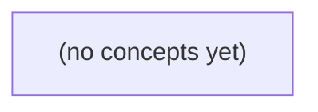

# 09.11 应用测试与交付：Go IM 服务的合同、证据与评审

*一本面向 Go 初学者的静态教材，以虚构即时通信服务的“读历史与发消息”合同为主线，建立从需求真值、分层测试到交付证据的完整思路。读者将围绕当前 S2 的 6 UTF-8 字节正文上限，设计可审查的规则、HTTP、授权、数据库故障与 CI 证据，并严格将待审 R9 的 9 字节变更隔离为未来预期。*

**章节:** 2

---

## 本书导览

- 了解整本书的章节脉络
- 掌握各章之间的概念依赖关系
- 选择最合适的阅读顺序

# 09.11 应用测试与交付：Go IM 服务的合同、证据与评审

一本面向 Go 初学者的静态教材，以虚构即时通信服务的“读历史与发消息”合同为主线，建立从需求真值、分层测试到交付证据的完整思路。读者将围绕当前 S2 的 6 UTF-8 字节正文上限，设计可审查的规则、HTTP、授权、数据库故障与 CI 证据，并严格将待审 R9 的 9 字节变更隔离为未来预期。

下方的概念图展示了本书 0 个核心概念以及它们之间的依赖关系；再下方是 1 个章节的入口。你可以按从上到下的顺序阅读，也可以根据自己的兴趣或先验知识选择切入点。

#### 概念图



## 章节索引

- **09.11 应用测试与交付：把IM接口合同变成可复核证据** — 面向Go初学者承接09.01–09.08，把虚构IM的S2当前6字节HTTP合同、S3持久扩展和待评审R9变更分清，分层讲Go httptest、独立预期、授权/安全负例、隔离数据库与事务故障、CI制品和交付文档；静态课程不运行服务。

## 09.11 应用测试与交付：把IM接口合同变成可复核证据

- 从既有合同独立写出当前6字节和待审R9预期
- 区分单元、handler、集成、端到端证据范围
- 用httptest纸上示例核对状态、JSON、头和状态不变
- 设计正常、拒绝、边界、重复与结果未知用例
- 覆盖对象级授权与输入输出安全负例
- 说明fake与真实数据库集成的证据差异
- 为事务/迁移故障写可复核测试数据和预期
- 整理提交身份、配置、错误码与未验证范围的交付包

测试的目标不是证明代码“跑过”，而是把当前合同、系统状态与确认点整理为任何评审者都能复核的证据。

### 先冻结当前合同与待审变更

### 先冻结当前合同与待审变更

测试开始前，先把“当前已生效的合同”与“正在评审的改动”分开。否则，测试可能错误地用未来规则否定当前实现，或把尚未批准的行为当作既定事实。

对 S2，当前可复核的 HTTP 合同应独立写明：

- 请求正文上限为 **6 个 UTF-8 字节**；限制的是编码后的字节数，不是字符数。ASCII 的 `abcdef` 为 6 字节；中文字符通常占 3 字节，`你好` 正好为 6 字节。
- 整个 HTTP 请求总大小上限为 **4096B**，应包含请求行、首部与正文等传输内容；即使正文未超过 6B，总请求超过该限制仍不满足合同。
- 合法成员向其可发送目标提交满足限制的消息，成功响应为 `POST 200`，结果语义为 `accepted_in_memory`：消息已被当前进程内存接受，不自动推断为持久化、离线投递或跨节点确认。
- 对同一应拒绝重复的提交，响应为 `409`。
- 当发送者不是目标会话或频道的成员时，响应为 `404`；测试应确认这是成员资格不可见或不存在的统一外部结果，而非擅自改写为 `403`。

设待发送正文为 $b$，则当前正文判定是：

$$|\operatorname{UTF8}(b)| \le 6$$

10.09 中 R9 将上限从 6 字节调整为 9 字节，只是**待审 PR 的候选预期**。它不能进入当前 S2 的通过标准：7～9 字节正文在当前合同下仍应被拒绝。测试报告应分别标注“当前合同证据”和“待审变更影响”，并记录所依据的需求版本、状态前置条件及响应确认点。

### 用状态与确认点建立测试真值

### 用状态与确认点建立测试真值

测试真值不能从实现代码反推，而应先由独立需求、初始状态与可观察确认点推出。设初始系统中存在用户 `u-a`、`u-b`、`u-c`，频道 `c-a`，以及成员关系 `m-a`；其中 `u-a` 是 `c-a` 的成员，`u-c` 不是成员。对当前 S2 合同，正文上限是 **6 个 UTF-8 字节**，整个请求上限是 **4096B**。

可将每个案例写成：

`前置状态 + 请求 + 期望响应 + 期望后置状态`

例如，`u-a` 向 `c-a` 提交合法短消息：

- **需求真值**：请求满足成员资格、正文长度和总请求大小限制。
- **期望响应**：`POST` 返回 `200`，结果为 `accepted_in_memory`。
- **期望后置状态**：内存中的消息集合新增一条可识别消息；随后查询或读取接口能够确认其存在。
- **测试断言**：既断言状态码与响应字段，也断言消息确实进入预期存储位置，而非仅检查“没有报错”。

再看边界与拒绝路径：

- `u-a` 重复提交同一具备幂等标识的请求：需求真值是“不重复写入”，响应为 `409`，消息集合数量不增加。
- `u-c` 向 `c-a` 发送消息：需求真值是“非成员不可见亦不可写”，响应为 `404`，不得产生新消息。
- 正文达到 7 个 UTF-8 字节：需求真值是超出当前 S2 限制；不能把待审 PR 中 R9 的“6 到 9”当作现行预期。

因此，测试断言是对需求真值的可执行表达，实现结果只是被比较的对象。静态课程不运行服务时，也应完整写出状态迁移、确认点和预期证据，使评审者能独立判断合同是否被正确验证。

### 用httptest核对HTTP可见证据

### 用 `httptest` 核对 HTTP 可见证据

`httptest` 的价值不在于“真的启动一台服务”，而在于把一次请求、一次响应和一次状态观察固定为可复核证据。这里采用纸上示例：直接构造请求并调用当前 S2 处理器，不监听端口，也不依赖运行中的外部服务。

设成员 `u-a` 向会话 `c-a` 发送消息 `m-a`；请求正文恰为 6 个 UTF-8 字节。测试前先由夹具明确：`u-a` 是 `c-a` 成员，`m-a` 尚未存在，且会话消息数为 $n$。

```go
req := httptest.NewRequest(
    http.MethodPost,
    "/conversations/c-a/messages",
    strings.NewReader(`{"text":"你好"}`), // 6 UTF-8 字节
)
req.Header.Set("Content-Type", "application/json")
req.Header.Set("X-User-ID", "u-a")

rec := httptest.NewRecorder()
handler.ServeHTTP(rec, req)
```

断言应覆盖 HTTP 可见合同，而非只检查“没有报错”：

- 状态码为 `200`，不是异步接受常见的 `202`；
- 响应 `Content-Type` 表示 JSON，例如以 `application/json` 开头；
- 解码响应后，确认 `status == "accepted_in_memory"`，并能关联 `conversation_id == "c-a"`、`message_id == "m-a"`；
- 响应体必须是合法 JSON；不能仅以字符串包含 `accepted` 代替结构化核对；
- 状态变化符合成功语义：`c-a` 的消息数由 $n$ 变为 $n+1$，新消息归属 `u-a`，正文保持原值；
- 无关状态不变，例如 `u-b`、`u-c` 的成员关系，以及未涉及会话 `c-a` 之外的数据均不得被修改。

这里的“状态不变”尤其重要：成功测试不仅证明写入发生，还排除处理器误改其他实体。总请求上限仍是 `4096B`，但本例的 6 字节正文显然属于当前 S2 合同允许范围。不要把待审 PR 中 R9 的“6 扩至 9”当作现行预期；当前测试应只记录已经确认的合同证据。

### 覆盖拒绝、边界与安全负例

### 覆盖拒绝、边界与安全负例

负例不是“接口报错即可”，而要证明拒绝发生在正确的合同边界，且不会改变消息、成员关系或内存状态。以下用例固定以当前 S2 合同为真值：正文上限为 **6 个 UTF-8 字节**、总请求上限为 **4096B**；成功为 `POST 200 accepted_in_memory`，重复为 `409`，非成员为 `404`。待审 PR 中 R9 的“6→9”不属于当前预期。

- **重复发送**：`u-a` 向其所属会话 `c-a` 发送一次合法正文，再以相同幂等键或合同定义的重复标识重放。首次断言 `200` 与 `accepted_in_memory`；第二次断言 `409`。同时确认消息数量未增加、未产生第二条可见记录。
- **对象级授权**：令非成员 `u-c` 访问或向 `c-a` 发送消息，断言 `404`，而非暴露“会话存在”的 `403` 或详细成员信息。再确认 `u-a`、`u-b` 的正常访问结果未受影响。
- **UTF-8 字节边界**：构造恰为 6 字节的正文，例如两个三字节汉字，预期成功；构造 7 字节正文，预期被拒绝。测试应按 `UTF-8` 编码后的字节数计量，不能按字符数或语言运行时字符串长度计量。
- **总请求边界**：分别提交恰好 `4096B` 与 `4097B` 的完整 HTTP 请求，覆盖请求行、头部和正文的累计大小。前者仅在其余字段合法时可继续处理；后者必须在写入消息前拒绝。
- **输入输出安全**：正文包含 HTML 标签、控制字符、异常编码或超长字段时，验证服务端不会执行、解释或回显未转义内容；错误响应不得泄露内部会话标识、栈轨迹、成员列表或鉴权细节。

每个用例应记录请求字节、身份与会话前置状态、响应状态及响应体、执行后的消息数或可见性确认点。这样评审者无需运行服务，也能判断拒绝是否符合当前合同。

### 分层交付测试证据与未验证范围

### 分层交付测试证据与未验证范围

测试层级不同，能证明的事实也不同；不能用“更高层测试通过”替代低层合同断言，或用 mock 成功推断真实事务可靠。

| 层级 | 可复核证据 | 不能证明 |
|---|---|---|
| 单元测试 | 长度计算按 UTF-8 字节而非字符；6 字节正文可过、超限被拒；成员资格与重复判定分支 | HTTP 路由、真实数据库约束 |
| handler 测试 | `POST` 成功返回 `200 accepted_in_memory`；重复为 `409`，非成员为 `404`；总请求超过 `4096B` 被拒 | SQL 事务、迁移正确性 |
| fake 数据库集成 | `u-a/u-b/u-c` 对 `c-a`、`m-a` 的状态变迁；写入后重复请求可见 | 锁、隔离级别、真实唯一索引 |
| 真实数据库集成 | 迁移可执行；事务提交、回滚、唯一约束及并发冲突符合预期 | 网关、部署身份与完整网络链路 |
| 端到端测试 | 已部署服务以受限测试身份接收请求并返回合同错误码 | 未覆盖输入、未观测的故障恢复 |

CI 应保留可下载制品：测试报告、覆盖率、请求/响应摘要、数据库版本与迁移日志、构建提交号及镜像摘要。测试身份应是最小权限的独立账号，配置只记录非秘密标识；密钥、令牌不得进入日志或制品。

故障说明必须区分：迁移失败导致服务不可用、事务回滚导致无状态变更、合同校验失败导致 `409` 或 `404`。当前真值仅覆盖 S2：正文最多 6 个 UTF-8 字节、总请求最多 `4096B`；R9 从 6 改到 9 仍是待审 PR，不得写入当前断言。静态课程不运行服务，因此端到端与真实数据库结论应标为“需在 CI/环境中验证”，而非既成事实。

> **要点** — 当前S2只认六字节合同；R9九字节仅属待审变更。测试应以独立需求、状态和确认点形成可复核证据。

测试不是“跑绿”即完成，而是要按业务风险选择证据层级，并清楚说明每层测试能证明什么、遗漏什么。

### 按业务问题划分四类测试层

### 按业务问题划分四类测试层

测试层级应由要回答的业务问题决定，而非由“测试越多越好”决定。Go 的 `testing` 提供统一入口，但证据强度取决于是否经过真实协议、真实数据库、真实驱动及真实设备。

| 测试层 | 典型问题 | 能证明 | 不能证明 | 失败后的状态重点 |
|---|---|---|---|---|
| 纯函数单元测试 | 消息状态转换、参数校验、权限规则是否正确？ | 给定输入下业务逻辑、边界条件和错误分支正确 | HTTP 编解码、SQL、事务、驱动及外部服务行为 | 通常无外部副作用；确认返回值与内存状态 |
| `httptest` Handler 测试 | 接口能否正确接收请求、返回状态码和响应体？ | 路由、鉴权入口、JSON 编解码、错误映射与接口合同 | 真实网络链路、数据库执行与设备响应 | 检查错误码、响应格式，避免泄露内部错误 |
| 隔离数据库集成测试 | SQL、迁移、事务、约束和授权是否真实生效？ | 真实 SQL 方言、索引/约束、事务提交与回滚、驱动行为 | 生产网络、设备协议、外部系统时序 | 检查失败后数据未部分写入、事务已回滚、连接可复用 |
| 真实网络或设备端到端测试 | 用户请求能否穿过完整链路并驱动真实设备？ | 部署配置、网络连通性、TLS、真实协议、设备兼容性和可观测性 | 所有异常时序与所有生产负载 | 检查远端最终状态、重试幂等性、超时后的补偿或告警 |

假实现适合稳定地制造超时、拒绝和异常返回，因此对 Handler 与纯业务规则很有价值；但它不能证明真实 SQL 是否执行、驱动是否正确处理事务，也不能证明授权条件在数据库侧真正成立。反过来，端到端测试证据最强，却慢、脆弱且难以覆盖全部分支。

因此，测试通过的准确含义是：在该层指定的输入、依赖环境和检查点下，系统满足预期；不能把低层“跑绿”外推为真实设备、真实网络或生产授权流程已经可靠。

### 单元与Handler：验证合同和状态不变

### 单元与 Handler：验证合同和状态不变

先把业务规则从 I/O 中剥离为纯函数，例如“成员是否有权限撤回消息”“消息是否仍在可撤回时间窗内”“非法状态迁移是否拒绝”。纯函数测试应围绕边界推导用例：有效输入得到确定结果，临界时间、空值、重复请求、越权身份和非法迁移均返回明确错误。它能证明规则实现与输入组合一致，但不能证明 HTTP 编解码、认证中间件或数据库写入正确。

Handler 测试则用 `httptest.NewRequest` 与 `httptest.NewRecorder` 固化当前接口合同。对每个关键请求至少核对：

- 状态码：成功、参数错误、未认证、无权限、资源不存在、冲突等分支是否可区分；
- JSON：字段名、类型、错误码及必要的错误消息是否稳定，避免把内部错误直接暴露；
- 响应头：如 `Content-Type: application/json`、追踪标识、缓存控制等是否符合约定；
- 请求效果：成功后状态按合同变化；拒绝后状态保持不变。

“拒绝后不变”应是显式断言，而非只检查返回 `4xx`。例如先记录消息的内容、撤回状态和版本号，再以越权身份调用撤回接口，最后断言响应为 `403`，且三项数据完全未变。若 Handler 在参数校验后才写状态、或错误分支误提交部分更新，这类测试会立即暴露问题。

这一层证明的是：在受控依赖下，HTTP 合同与业务状态转换一致；它仍不能证明真实 SQL、事务回滚、驱动行为或跨网络设备响应。因此，Handler 测试通过只能说明“该输入、该替身、这些检查点”下合同成立。

### 隔离数据库集成：验证真实持久化路径

### 隔离数据库集成：验证真实持久化路径

当接口涉及消息写入、会话更新、已读状态或权限扣减时，仅用假仓库无法证明真实 `SQL`、数据库驱动、迁移脚本与事务边界是否一致。隔离数据库集成测试应启动专用实例或临时数据库，执行与生产一致的迁移，再以独立测试数据调用真实仓库或服务层。

每个用例应自行创建租户、用户、会话与消息，避免依赖固定主键、共享夹具或其他用例的残留数据。常见做法是在测试开始时开启事务，将连接或事务句柄注入被测对象；断言完成后统一回滚。这样既能读取事务内的真实写入结果，也能保证测试重复执行时状态稳定。

| 测试层 | 能证明 | 不能证明 | 失败后的可复核状态 |
|---|---|---|---|
| 假实现单元测试 | 分支、参数与错误映射 | SQL 语法、约束、驱动行为 | 内存调用记录 |
| 隔离数据库集成测试 | 迁移、真实 SQL、唯一约束、扫描类型、事务提交与回滚 | 真实网络、生产容量与设备行为 | 查询测试库中的行、索引及事务结果 |
| 端到端测试 | 部署后完整链路 | 所有异常数据条件 | 外部系统日志与实际记录 |

尤其应测试“中途失败不留下半成品”。例如创建消息后更新会话摘要失败，应断言接口返回预期错误，并在数据库中确认：消息行不存在、会话更新时间未变化、未生成多余关联记录。若业务要求部分成功，则应明确断言哪些记录已提交、哪些操作被补偿，而不是只检查返回码。

迁移也属于合同的一部分：测试库从空库执行迁移后，真实写入必须成功；对重复消息标识、外键不存在、权限不足等场景，应验证驱动返回的错误被正确转换。测试通过仅说明该迁移版本、该数据库配置和该检查点下路径成立，不能替代真实环境的网络与授权验证。

### 假实现与真实依赖的证据差异

### 假实现与真实依赖的证据差异

假实现（fake）把数据库、鉴权服务或设备接口替换为可编排对象：测试可精确规定“查询返回空”“提交失败”“权限被拒绝”等结果。因此它特别适合验证业务分支、错误映射、重试策略和失败后的内存状态，例如确认创建会话失败时不会把用户标记为已登录。

但 fake 的返回值是测试作者写出的契约，不是基础设施的实际行为。它无法证明 SQL 是否可执行、占位符和字段类型是否匹配、驱动是否正确扫描 `NULL`、唯一约束和外键是否生效，也不能证明事务在真实隔离级别下会提交、回滚或与授权记录保持一致。

| 测试方式 | 能证明 | 不能证明 | 失败后应检查的状态 |
|---|---|---|---|
| fake 单元测试 | 业务代码对成功、超时、冲突等返回值的处理；错误是否转换为接口合同 | SQL 语法、驱动行为、表约束、真实事务与授权协作 | 内存对象、调用次数、是否停止后续流程 |
| 真实数据库集成测试 | SQL 与迁移可用；约束、事务、扫描和授权数据读写符合预期 | 生产网络、真实设备、部署配置与外部服务行为 | 事务是否回滚；目标表、审计表、授权记录是否留下不应存在的数据 |

例如，fake 可以让 `Insert` 返回重复键错误，从而证明接口返回合适的冲突响应；只有真实数据库测试才能确认实际唯一索引存在，且驱动确实将该错误识别为重复键。测试通过的结论应限定为：在该依赖版本、初始化数据和检查点下，系统表现符合预期，而不是“真实环境已经被完全证明”。

### 端到端边界与失败后状态表

### 端到端边界与失败后状态表

端到端测试应覆盖真实网络、真实数据库、驱动与设备/外部服务，但它证明的是“此环境、此时刻、此检查点”的链路结果，不等于所有故障均已消失。交付时应把失败后的资源状态一并记录，避免只报告“请求失败”。

| 场景 | 适合的证据层 | 能证明 | 不能证明 | 失败后状态记录 |
|---|---|---|---|---|
| 授权拒绝 | handler + 集成 | 未授权身份返回正确状态码；事务未创建业务记录 | 真实身份提供方持续可用；所有角色配置正确 | 记录`403`、请求主体、授权策略版本、目标资源不存在变更 |
| 重复请求 | 纯函数 + 集成 + 端到端 | 幂等键命中时不重复扣费、不重复创建；返回同一业务结果 | 客户端永不重试；跨区域缓存绝不失效 | 记录两次请求标识、同一资源 ID、数据库唯一键与最终余额/库存 |
| 结果未知 | 集成 + 端到端 | 服务端已提交时可通过查询或幂等键恢复结果 | 客户端断连前是否收到响应 | 记录请求超时点、服务端事务提交标记、后续查询结果；状态标为“已提交待确认” |
| 网络失败 | `httptest` + 真实网络端到端 | 超时、连接重置可触发重试或降级；连接释放 | 生产网络不会发生分区、丢包或证书故障 | 记录错误类型、重试次数、连接/事务是否关闭、是否产生半完成资源 |

尤其要区分“请求失败”和“业务未发生”。例如网络超时后，客户端得到失败，但服务端可能已经完成 SQL 提交；此时禁止直接重放非幂等操作。交付记录应至少包含请求 ID、幂等键、时间线、数据库最终状态、外部设备状态及人工处置结论。

> **要点** — 测试证据必须与风险匹配；通过结论只覆盖既定输入、环境、依赖和检查点。

用 httptest 把接口合同拆成可检查的响应与状态证据：既验证成功路径，也证明拒绝路径没有泄露数据或改变状态。

### 先从合同写出独立预期

### 先从合同写出独立预期

测试不应从 `handler` 的当前实现反推“它现在会返回什么”，而应先把已确认的 S2 合同写成独立预期；待评审的 R9 则单独标注，不能悄悄混入断言。这样，测试失败时才能区分：实现偏离已生效合同，还是需求本身尚未定稿。

假设 S2 规定：`POST /im/messages` 接收恰好 `6` 字节的消息体，受信测试主体由测试装配层注入；成功创建后返回 JSON，且不能回显内部身份字段。可先列出证据表：

| 场景 | 请求 | 响应预期 | 状态不变量 |
|---|---|---|---|
| 合法请求 | `Content-Type: application/json`，正文恰为 6 字节 | `201`、JSON、稳定成功结构 | 消息数增加 1 |
| 非法长度 | 正文不是 6 字节 | `400`、稳定错误码如 `invalid_length` | 消息数不变 |
| 类型不符 | 缺少或错误的 `Content-Type` | `415`、稳定错误码如 `unsupported_media_type` | 消息数不变 |
| 未注入主体 | 无受信主体 | `401` 或合同规定的拒绝码 | 消息数不变，响应无身份细节 |

这里的“6 字节”是字节合同，不是字符合同。`len([]byte(body)) == 6` 才是判断依据；中文、emoji 等多字节字符尤其应有专门用例，避免实现误用字符数。

响应断言也不只看 `200` 或 `201`。成功响应应检查 `Content-Type`、JSON 可解析性、必需字段类型；拒绝响应应检查稳定错误码，而非脆弱的自然语言文案。无论成功还是失败，都要明确敏感字段不得出现，例如内部用户 ID、测试注入标记、令牌或存储层错误。

R9 若提出“允许空消息”“自动补全内容类型”或“返回更多身份信息”，应写为独立的待评审预期，不能修改 S2 的现有测试来迁就它。先固定当前合同，后续批准 R9 时再新增或替换测试，才能让每一次行为变化都有可复核的依据。

### 用请求与记录器直调 Handler

### 用请求与记录器直调 Handler

`httptest.NewRequest`、`httptest.NewRecorder` 与 `Result` 组成一条不经过真实网络的纸上调用链：

1. 用 `NewRequest` 构造输入：方法、目标地址、请求体、必要头部。
2. 用 `NewRecorder` 捕获 Handler 写出的状态码、响应头与响应体。
3. 直接执行 `handler.ServeHTTP(recorder, request)`。
4. 用 `recorder.Result()` 取得类似客户端收到的 `*http.Response`，再检查接口合同。

例如，虚构“发送消息”接口要求 JSON 请求体：

```go
body := strings.NewReader(`{"to":"u-2","text":"你好"}`)
req := httptest.NewRequest(http.MethodPost, "/v1/messages", body)
req.Header.Set("Content-Type", "application/json")

rr := httptest.NewRecorder()
handler.ServeHTTP(rr, req)

resp := rr.Result()
defer resp.Body.Close()
```

`NewRequest` 生成的是服务端 Handler 可直接消费的请求；目标地址通常写相对路径即可。若 Handler 依赖 `Content-Type` 决定是否解析 JSON，测试必须显式设置它，否则测到的可能只是“不支持的媒体类型”，而非业务规则。

认证主体不应通过公开的查询参数、伪造的生产令牌或专门的“测试登录接口”注入。更稳妥的方式是复用认证中间件使用的受信上下文键，在测试中将已验证主体放入请求上下文：

```go
principal := Principal{ID: "u-1", Role: "member"}
ctx := context.WithValue(req.Context(), principalKey{}, principal)
req = req.WithContext(ctx)
```

这里的 `principalKey{}` 应是包内私有类型；生产代码只读取认证中间件写入的上下文，不接受客户端直接提交的身份字段。测试因此模拟“认证已经成功”的边界条件，却不会给线上接口留下身份后门。

`Result()` 适合从响应视角读取 `StatusCode`、`Header` 和 `Body`。它不代表真实 TCP、代理、TLS 或超时行为：Recorder 只是把 Handler 的输出留在内存中。其价值在于以最低成本证明合同：给定受信主体、内容类型和请求体，Handler 应产生可复核的响应。

### 完整断言响应而非只看二百

### 完整断言响应而非只看二百

`200 OK` 只说明处理器给出了成功状态，不能证明接口合同真的成立。应用测试应把一次响应拆成可复核的证据：状态码、媒体类型、错误语义、JSON 形状，以及失败请求对服务状态的影响。

对成功响应，至少断言：

- 状态码符合约定，如 `200`、`201` 或 `204`，而不是笼统接受任意 `2xx`。
- `Content-Type` 为预期的 JSON 类型；可用 `strings.HasPrefix` 接受参数差异，例如 `application/json; charset=utf-8`。
- 响应能解码为预期结构，必需字段存在、类型正确；不要只比较原始字符串。
- 响应中不含密码散列、令牌、内部数据库标识、调试信息等敏感字段。

对拒绝路径，断言应更严格：

- 未认证、无权限、参数非法、资源不存在分别得到合同规定的 `401`、`403`、`400`、`404`，避免把所有错误都压成 `500`。
- JSON 错误体包含稳定的机器可读错误码，例如 `"code":"invalid_argument"`；文案可以调整，错误码不应随意漂移。
- 错误响应不回显密钥、认证头、内部错误栈或其他用户数据。
- 请求失败后状态不变：创建失败不应新增记录，更新失败不应覆盖旧值，权限拒绝不应修改目标资源。

```go
rr := httptest.NewRecorder()
req := httptest.NewRequest(http.MethodPost, "/v1/messages", body)
req.Header.Set("Content-Type", "application/json")
req = withTrustedTestPrincipal(req, alice) // 仅测试装配注入主体

before := store.Count()
handler.ServeHTTP(rr, req)

if rr.Code != http.StatusBadRequest { t.Fatal(rr.Code) }
if !strings.HasPrefix(rr.Header().Get("Content-Type"), "application/json") {
	t.Fatal("响应类型错误")
}
var got struct{ Code string `json:"code"` }
json.NewDecoder(rr.Result().Body).Decode(&got)
if got.Code != "invalid_argument" { t.Fatal(got.Code) }
if store.Count() != before { t.Fatal("失败请求改变了状态") }
```

这里的主体注入应位于测试专用装配层，生产路由仍只信任真实认证中间件。测试的目标不是“接口能返回”，而是证明它在成功与失败时都遵守边界。

### 为拒绝、边界与重复请求取证

### 为拒绝、边界与重复请求取证

负例测试的目标不是“请求失败即可”，而是证明失败方式稳定、无泄露、无副作用。可围绕一个虚构的 `POST /v1/messages` 或 `GET /v1/conversations/{id}` 建立证据矩阵：

| 场景 | 请求条件 | 预期证据 |
|---|---|---|
| 未认证 | 不注入受信测试主体 | `401`、固定错误码如 `unauthenticated`、不返回用户或会话数据 |
| 越权 | 注入用户 A，访问用户 B 的会话 | `403` 或约定的 `404`、错误结构稳定、响应不含会话成员与消息内容 |
| 非法输入 | 空正文、超长正文、非法 `id` | `400`、错误码如 `invalid_argument`、指出可公开的字段问题但不回显敏感值 |
| 边界输入 | 正好最大长度、分页游标为空或过期 | 合同规定的成功或 `400`，JSON 字段类型保持一致 |
| 重复提交 | 相同幂等键重复 `POST` | 不重复创建；返回原结果或明确的重复错误码 |
| 结果未知 | 首次请求可能已写入，但客户端未收到响应后重试 | 以幂等键确认最终仅有一条状态变更，不能因重试产生两条消息 |

例如，直接用 `httptest.NewRequest` 和 `httptest.NewRecorder` 调用处理器：

`req := httptest.NewRequest("POST", "/v1/messages", strings.NewReader(`{"text":""}`))`

随后设置 `Content-Type: application/json`，并通过仅测试可见的上下文注入函数写入主体；不要接受客户端自带的 `X-User-ID` 作为身份后门。调用后用 `rr.Result()` 断言状态码、`Content-Type`、错误码和 JSON 外形。

对拒绝路径尤其要在调用前后读取内存仓库或替身存储：消息数、未读数、最后活动时间都必须不变。若响应为错误，还应断言不存在 `token`、内部用户标识、成员列表、数据库错误文本等字段。这样测试证明的不是“返回了非 200”，而是接口在异常、恶意与重试条件下仍遵守合同。

### 明确直调、测试服务器与生产边界

### 明确直调、测试服务器与生产边界

`httptest.NewRecorder` 配合 `httptest.NewRequest` 是最小、最快的合同检查方式：测试直接调用 `handler.ServeHTTP(recorder, request)`，不经过监听端口、路由器外层中间件、真实网络或 TLS。它适合构造虚构的 `GET`、`POST` 请求，设置 `Content-Type`，并通过仅测试可见的上下文注入受信主体；生产请求路径不能接受由客户端头部伪造的身份。

```go
req := httptest.NewRequest(http.MethodPost, "/v1/messages", strings.NewReader(`{"text":"hi"}`))
req.Header.Set("Content-Type", "application/json")
req = req.WithContext(withTestPrincipal(req.Context(), principal))
rr := httptest.NewRecorder()

handler.ServeHTTP(rr, req)
resp := rr.Result()
```

此层证据应覆盖：状态码、响应 `Content-Type`、稳定错误码、JSON 字段结构、敏感字段未出现，以及拒绝请求前后持久化状态不变。尤其不能只断言 `200`：`201` 却返回错误结构、`403` 泄露成员列表、`400` 后仍写入消息，都是合同失败。

`httptest.NewServer` 则启动一个临时 HTTP 服务，测试通过客户端真正发起请求：

`server := httptest.NewServer(handler)`  
`resp, err := http.Get(server.URL + "/health")`

它额外证明了监听、请求序列化、客户端调用、HTTP 头传输和连接生命周期能协同工作；若使用 `httptest.NewTLSServer`，还能验证测试证书下的 HTTPS 客户端配置。它仍只是在本机进程内的受控网络，不等同于生产。

两类测试都不能证明：公网 DNS、负载均衡、反向代理重写、真实证书链、TLS 版本与密码套件、跨服务鉴权、超时重试、网络分区及生产数据库并发行为。测试报告应明确写出已验证的合同层级与这些未验证项，避免把“临时服务器返回成功”误当作“生产交付已被证明”。

> **要点** — 可复核测试必须独立于实现，完整断言合同、授权、安全与状态不变，并明确证据边界。

本节把当前6字节合同转化为可复核测试证据，并将待审R9预期严格隔离，避免用实现行为替代需求判断。

### 先冻结合同，再独立写预期

### 先冻结合同，再独立写预期

测试开始前，先把当前 S2 合同冻结为可判定的断言；预期只能来自 09.02 的接口定义与独立需求，不能从当前实现、日志或“实际返回了什么”反推。

- **请求边界**：`好`为 3B、`你好`为 6B，均合法；`你好呀`为 9B，当前合同必须拒绝。原始请求体 4096B 与 4097B 是不同边界样本，必须分别断言接受或拒绝结果，不能只测“超大请求”。
- **格式与媒介类型**：非法 JSON、未知字段、错误 `Content-Type` 分别构成独立负例；响应状态、错误响应体结构及必要响应头均按合同逐项核对。
- **查询语义**：`GET` 的 `limit=0`、空页、分页边界应独立验证。空页仍应返回合同规定的成功状态与集合结构，而非以缺字段、`null` 或错误状态替代。
- **幂等与状态不变式**：重复提交 `m-a` 若返回 `409`，旧正文及既有资源状态必须保持不变；不仅检查状态码，还要随后读取并比对旧内容。响应丢失时，结果属于“未知”，应通过查询或重试规则恢复可观察证据，不得武断记为成功或失败。

用正交拆解覆盖“字节边界、JSON 合法性、字段、媒介类型、分页、重复写入、结果未知”等维度，避免把所有组合做笛卡尔积穷举。每条用例都应记录：前置状态、原始请求字节、预期状态、预期响应体、预期响应头与状态不变式。

R9 拟议版必须单列：新规则下 9B 可允许、10B 应拒绝。这是待审合同，不得与当前“6B 上限”的报告、通过率或缺陷统计混算。

### 按风险维度正交设计用例

### 按风险维度正交设计用例

不要把“消息长度、请求大小、方法、分页、重试”做成全组合矩阵；那会迅速膨胀，却未必增加证据强度。应先固定其余变量，仅改变一个风险维度，并为每类边界保留可复核的请求、响应与持久化结果。

- **字节长度**：以 UTF-8 字节数而非字符数设计边界。当前合同下，`好`为 3B、`你好`为 6B，应成功；`你好呀`为 9B，应拒绝。断言状态码、错误体及未创建消息。R9 拟议的“9B 允许、10B 拒绝”另列报告，不能与当前 6B 结果混算。
- **原始请求大小**：构造 4096B 与 4097B 的完整原始请求，保持业务字段合法，隔离传输层大小限制与消息正文长度限制。
- **方法与参数**：分别验证非法 JSON、未知字段、错误 `Content-Type`，以及 `GET` 的 `limit=0`；预期状态和响应体必须来自 09.02 与独立需求，而非服务当前返回。
- **分页**：覆盖空页、首尾页和连续翻页，核对游标、顺序、无重复与无遗漏。
- **重复提交与结果未知**：重复提交 `m-a` 应返回 409，且旧正文保持不变；若响应丢失，则标记“结果未知”，通过后续查询确认是否已创建，不能把客户端重试直接当作新的写入。

### 用httptest核对HTTP可见证据

### 用 `httptest` 核对 HTTP 可见证据

`httptest` 的目的不是证明处理器“没有报错”，而是固定客户端可观察到的合同：状态码、响应头与响应体。每个用例只改变一个维度，避免把字节数、JSON 结构和 `Content-Type` 混成一次失败。

```go
func TestCreateMessage(t *testing.T) {
    cases := []struct {
        name, body, ct string
        wantCode       int
    }{
        {"好，3B，合法", `{"body":"好"}`, "application/json", 201},
        {"你好，6B，合法", `{"body":"你好"}`, "application/json", 201},
        {"你好呀，9B，拒绝", `{"body":"你好呀"}`, "application/json", 400},
        {"非法JSON", `{"body":`, "application/json", 400},
        {"未知字段", `{"body":"好","extra":1}`, "application/json", 400},
        {"错误媒体类型", `{"body":"好"}`, "text/plain", 415},
    }
    for _, tc := range cases {
        t.Run(tc.name, func(t *testing.T) {
            r := httptest.NewRequest("POST", "/messages",
                strings.NewReader(tc.body))
            r.Header.Set("Content-Type", tc.ct)
            w := httptest.NewRecorder()

            handler.ServeHTTP(w, r)

            if w.Code != tc.wantCode {
                t.Fatalf("状态码=%d，期望=%d；响应=%s",
                    w.Code, tc.wantCode, w.Body.String())
            }
        })
    }
}
```

字节边界不能用字符数替代。应构造恰为 `4096` 字节与 `4097` 字节的 JSON 请求体，并分别断言独立需求规定的接受或拒绝结果；测试名称必须写明“字节”，防止将中文 UTF-8 长度误判为字符数。

对成功响应继续断言返回 JSON 中的标识、正文及必要字段；对失败响应断言统一错误结构和错误码。上述“你好呀”在当前 6B 合同下必须拒绝；拟议 R9 的“9B 允许、10B 拒绝”应另建报告与用例集，不得与当前结果混算。

### 覆盖拒绝路径与状态不变式

### 覆盖拒绝路径与状态不变式

拒绝路径不能只断言“返回了错误”，还要证明对象未被越权读取或改写。以两名用户、两条消息构造最小正交集：用户 A 创建 `m-a`，用户 B 访问或修改 `m-a`；预期状态码与错误体应直接引用 09.02 合同及独立需求，而非依据当前实现反推。每次拒绝后，重新以 A 查询，确认正文、作者、时间戳等受保护字段保持原值。

重点保留以下可复核证据：

- **对象级授权**：B 对 A 的消息执行读取、更新、删除；记录请求身份、目标消息 ID、响应状态与错误体，并补充 A 的后续查询结果。
- **`GET limit=0`**：验证其是否为合法的“返回零项”请求，响应列表为空且分页元数据符合合同；不得把空数组误判为参数错误。
- **空页与分页**：数据总数不足一页时验证空页；跨页查询时验证无遗漏、无重复、顺序稳定，以及游标或页码边界正确。
- **重复创建**：首次创建 `m-a` 成功；以相同 ID 再次提交应返回 `409`。随后查询 `m-a`，必须仍为首次成功请求的旧正文，而不能被第二次请求覆盖。
- **响应丢失**：客户端发送创建或更新后故意丢弃响应。此时客户端结论只能标为“结果未知”；通过后续查询、幂等重试或服务端审计确认最终状态。测试报告应区分“服务端已提交但客户端未获响应”与“请求未生效”，避免将网络现象误记为接口失败。

### 隔离R9并整理交付证据包

### 隔离 R9 并整理交付证据包

当前合同的判定基线是：`好`为 3B、`你好`为 6B，均合法；`你好呀`为 9B，必须拒绝。R9 若拟议放宽为“9B 允许、10B 拒绝”，应建立独立测试矩阵、独立报告和独立制品目录，标注“待审需求”，不得与当前 6B 合同的通过率、缺陷数或发布结论混算。

证据还应区分验证边界：

- **fake 数据库**：可稳定证明路由、校验、状态码、响应体、分页字段，以及重复 `m-a` 返回 `409` 且旧正文未被覆盖；但不能证明真实唯一约束、事务回滚、迁移兼容性或连接故障处理。
- **真实数据库**：应保存迁移版本、建表约束、测试前后查询结果和日志。尤其验证并发或重复写入时，`409` 后原记录正文保持不变。
- **事务/迁移故障**：若未注入提交失败、死锁、迁移中断或回滚失败，必须明确列为“未验证范围”，不能以 fake 的成功结果替代。

交付证据包至少包含：CI 运行链接与制品校验值、测试报告、请求/响应样本、服务与数据库日志、镜像或提交标识、环境配置摘要、迁移脚本版本、执行身份与权限范围。对于“响应丢失、服务端结果未知”的场景，应保留客户端超时证据和后续查询结果，并标注其不能直接证明写入成功或失败。

> **要点** — 测试应从冻结合同独立推导预期；当前6B与待审R9必须分报告、分证据、分结论。

将访问控制与输入输出安全要求拆成可逐行复核的测试矩阵，用独立预期证明当前合同实际保护了什么，并明确哪些风险仍未验证。

### 先建立主体—动作—资源矩阵

### 先建立主体—动作—资源矩阵

先不要把“接口可调用”当作“权限正确”。以四类主体建立最小矩阵：`u-a`、`u-b` 为会话成员，`u-c` 为非成员，另设未认证主体。每一行只验证一个明确合同：

| 主体 | 动作 | 资源与归属 | 当前状态 | 外部预期 | 内部证据 |
|---|---|---|---|---|---|
| `u-a` | 查看会话、拉取消息、发送消息 | `conversation_id=C1`，`u-a` 为成员 | 正常 | 成功响应；仅返回允许字段 | 成员关系查询、授权判定日志、审计记录 |
| `u-b` | 同上 | `C1`，`u-b` 为成员 | 正常 | 成功响应 | 同上，且消息归属为 `C1` |
| `u-c` | 查看或发送 | `C1`，非成员 | 隐藏 | `404`，不泄露会话是否存在 | 查询结果为空或统一隐藏分支日志 |
| 未认证主体 | 任意受保护动作 | `C1` 或任意资源 | 无会话 | `401` | 认证中间件拒绝记录 |
| 已知成员 | 被禁止的动作，如删除、管理成员 | `C1`，成员但角色不足 | 已认证、无该权限 | `403` | 角色/能力判定与拒绝审计 |

矩阵中的“资源”必须写出真实归属关系，而非只写接口路径。例如读取 `/messages/{message_id}` 时，应验证该消息属于目标 `conversation_id`，并验证请求者是该会话成员；否则仅替换 `message_id` 或 `conversation_id` 即可能形成 BOLA。

外部证据记录状态码、响应体是否泄露标识符、错误信息与响应时间特征；内部证据记录授权查询、策略命中、审计事件及关联请求标识。测试数据使用占位身份与脱敏资源标识，不记录真实令牌、Cookie 或凭据。

### 区分401、404与403的授权语义

### 区分401、404与403的授权语义

授权测试不能只检查“请求是否失败”，还要证明失败原因与信息暴露边界一致。对同一会话资源，应先固定主体身份，再改变其成员关系或动作权限，形成可复核的状态码合同。

| 主体 | 动作 | 资源状态 | 预期状态码 | 响应不得泄露 |
|---|---|---|---:|---|
| 未认证请求 | 读取会话或消息 | 任意 `conversation_id` | 401 | 成员列表、消息正文、资源是否存在 |
| `u-c`（非成员） | 读取会话、消息或成员信息 | 会话存在但对其不可见 | 404 | 会话标题、参与者、消息数量、真实资源标识 |
| `u-a`（已知成员） | 执行被禁止动作，如删除他人消息 | 会话可见，但动作无权限 | 403 | 内部权限规则、管理员身份、策略配置 |

`401` 表示服务端尚未获得可接受的认证上下文；测试时应分别覆盖缺失令牌、失效令牌与注销后的旧 Session/WS 凭据。响应可提示“需要认证”，但不应因 `conversation_id` 是否真实而改变正文、长度或错误细节。

`404` 的目的不是宣称资源不存在，而是对非成员隐藏其存在性。令 `u-c` 分别访问真实和随机 `conversation_id`，两类响应应在状态码、错误结构和可观察语义上保持一致。否则攻击者可枚举会话、`message_id` 或成员关系，构成 BOLA 信息泄露。

`403` 仅适用于资源已向该主体可见、且服务端确认其身份后拒绝特定动作。例如 `u-a` 能读取消息，却不能以伪造的 `sender_id` 修改或删除 `u-b` 的消息。此时响应可说明“无此操作权限”，但不得返回被拒绝对象的额外内容、完整审计信息或可用于绕过检查的字段。

测试记录应逐行保留主体、动作、资源、当前状态、外部响应证据与内部日志/策略命中证据；所有截图、请求样例和日志均使用脱敏标识，不包含真实凭据。

### 用篡改标识检验对象级授权

### 用篡改标识检验对象级授权

对象级授权不能只验证“正常成员能访问”，还要主动替换请求中的资源标识，确认服务端依据认证会话和成员关系判定权限，而非盲目信任客户端提交的 `conversation_id`、`message_id` 或 `sender_id`。

可建立如下负例矩阵（使用脱敏测试账号，不记录真实令牌）：

| 主体 | 动作 | 篡改资源/字段 | 预期结果 | 外部证据 | 内部证据 |
|---|---|---|---|---|---|
| `u-a`，会话成员 | 读取会话消息 | 将 `conversation_id` 改为 `u-c` 所在会话 | `404`，不泄露会话存在性 | 状态码、响应体无标题/成员/消息片段 | 授权日志显示“非成员隐藏” |
| `u-a`，会话成员 | 获取消息详情 | 将 `message_id` 改为其他会话消息 | `404` | 响应不含目标消息内容 | 消息所属会话与当前成员关系校验记录 |
| `u-c`，非成员 | 发送消息 | 指向 `u-a/u-b` 的 `conversation_id` | `404` | 状态码及无新增消息 | 写入前成员校验失败，无消息落库 |
| `u-a`，成员 | 发送消息 | 伪造 `sender_id=u-b` | 成功时发送者仍为 `u-a`；或拒绝 `403/400` | 返回消息的发送者为当前认证用户 | 服务端忽略客户端 `sender_id`，由会话主体派生 |
| `u-a`，成员但无删除权 | 删除消息 | 替换为 `u-b` 的 `message_id` | `403` | 状态码、消息仍存在 | 动作权限校验记录 |
| 未认证主体 | 读取任意消息 | 提供已知 `message_id` | `401` | 不返回对象字段 | 认证中间件先于对象查询执行 |

测试时应分别修改路径参数、查询参数与 JSON 请求体，避免只覆盖一种入口。尤其不要仅以“返回失败”作为结论：`401` 表示未认证，`404` 表示非成员对象隐藏，`403` 表示已识别主体但动作被禁止；三者共同构成可复核的授权合同。

若接口尚未实现附件路径、内网 URL 拉取等资源引用能力，不应伪造“已通过”结果，而应在矩阵中标为“设计未验证”，说明当前无可执行入口及后续上线前的补测条件。

### 覆盖会话、跨站与数据边界

### 覆盖会话、跨站与数据边界

将测试写成“主体—动作—资源—当前状态—预期—证据”的矩阵，且使用专门的测试账号、会话标识和样例消息，不在报告、截图或日志中暴露真实凭据。

| 主体 | 动作与资源 | 当前状态 | 独立预期 | 外部证据 | 内部证据 |
|---|---|---|---|---|---|
| `u-a` | 登录后注销，再以旧 `Session` 请求会话列表 | 已注销 | 返回未认证结果，如 `401`；不得恢复登录态 | 请求/响应状态码、`Set-Cookie` 变化 | 服务端会话失效记录、令牌撤销记录 |
| `u-a` | 注销后用旧 Cookie 建立或继续 WebSocket | 已注销 | 握手被拒绝，或既有连接被关闭；不得继续收发消息 | 握手响应、关闭码、收发失败截图 | WS 鉴权与断连日志 |
| 外站页面 | 携带用户 Cookie 向写接口提交请求 | 已登录、跨站来源 | 无有效 CSRF 令牌应拒绝；或不在允许 Origin 中应拒绝 | 请求中的 `Origin`、响应码与错误体 | CSRF 校验、Origin 白名单日志 |
| `u-a` | 在搜索、消息或筛选参数中提交单引号、双引号及组合字符 | 已登录 | 不应报数据库异常，不应扩大查询范围，不应改变数据 | 原始请求、稳定错误响应、结果集对比 | 参数化查询审计或数据库错误日志 |
| `u-a` | 发送含 ``、`<script>` 等标签的消息并由 `u-b` 查看 | 已登录 | 页面仅显示转义后的文本，不执行脚本、不产生额外请求 | 渲染截图、浏览器控制台、网络面板 | 输出编码策略、内容渲染日志 |

对注销测试应区分“新请求被拒绝”和“已建立 WS 被主动断开”：前者证明旧凭据不可重用，后者证明实时通道不会在注销后继续泄露消息。对跨站测试，应记录实际采用的是 CSRF 令牌、`SameSite` Cookie、Origin 校验还是其组合，不能仅以“浏览器默认限制”作为结论。

若附件路径读取、远程 URL 抓取或内网 URL 访问功能当前不存在，应明确标注为“设计未验证”，而非宣称已防御路径遍历、服务端请求伪造或内网探测。

### 把未实现能力写入交付边界

### 把未实现能力写入交付边界

测试结论应区分“已执行并有证据”与“当前版本不存在攻击面”，不能把后者误写成“已通过”。

| 项目 | 当前状态 | 可作出的结论 | 交付记录要求 |
|---|---|---|---|
| 会话、成员关系与对象越权 | 已实现、已测试 | 可验证未认证 `401`、非成员隐藏 `404`、成员禁止动作 `403`，以及篡改 `conversation_id`、`message_id`、`sender_id` 的拒绝结果 | 每行记录主体、动作、资源、预期/实际状态码、外部响应、内部日志或审计证据 |
| 注销后的旧 Session / WebSocket | 已实现、已测试 | 可验证令牌失效、连接关闭或后续消息拒绝 | 记录注销前后请求、连接标识脱敏摘要及服务端失效事件 |
| CSRF、Origin 与输入输出 | 已实现、已测试 | 可验证跨站请求策略、SQL 引号参数化、HTML 标签编码或净化效果 | 保存请求构造、响应摘要、数据库/应用日志中的安全处理证据 |
| 附件路径读取或写入 | 功能未实现 | 仅能说明当前版本没有该接口或处理链路，不能声称已防护路径穿越 | 标记为“设计未验证”；未来实现上传、下载、预览或解压时必须重新测试 |
| 内网 URL 抓取、预览或回调 | 功能未实现 | 不能得出已防护 SSRF 的结论 | 标记为“设计未验证”；未来出现 URL 导入、链接预览、Webhook 时纳入测试 |

交付表中不放置真实账号、Cookie、Bearer Token、完整 WebSocket 地址或可复用附件链接。主体可写为 `u-a`、`u-b`、`u-c`，凭据以脱敏指纹、测试环境标识和一次性请求编号关联。这样，已验证的合同边界可复核，未实现能力也不会被误包装为安全保证。

> **要点** — 安全测试不仅验证成功路径，更要以主体、资源和证据链证明拒绝路径正确，并公开未验证边界。

本节聚焦数据库相关证据：用可控替身覆盖分支，用隔离真实库证明事务、迁移与并发行为，避免把“测到了错误”误当成“证明了交付质量”。

### 替身的边界：控制故障而不复制实现

### 替身的边界：控制故障而不复制实现

`stub`、`fake` 与真实隔离数据库回答的是不同问题，不能互相替代。

- `stub`：为接口返回预设结果，适合验证调用方对“超时”“重复键”“查询失败”等分支的处理。例如令 `InsertMessage` 返回可识别的重复键错误，断言接口映射为幂等成功或冲突响应。
- `fake`：提供具备有限状态的内存实现，适合验证业务流程，如成员是否已退群、消息是否写入、重复请求是否被去重。它应模拟合同中的可观察行为，而非复刻 SQL、索引和事务实现。
- 真实隔离数据库：用于证明迁移后旧行 `NULL` 的兼容性、唯一约束、事务回滚、提交后的可见性，以及驱动层 `Rows.Close()`、`Rows.Err()` 等真实资源与错误语义。

故障注入点应位于依赖边界，例如仓储接口、时钟或网络客户端，而不是在业务代码中埋“测试模式”分支：

`查询 → 返回超时错误`  
`写入 → 返回重复键错误`  
`提交 → 返回未知结果或连接中断`

注入错误应稳定、可命名、可重复；测试只断言合同结果，如“未提交时无持久化副作用”“重复请求不产生第二条消息”。不要让 fake 按生产实现的内部步骤逐条执行，否则测试会与实现共同犯错，并掩盖真实数据库的隔离级别、约束和驱动差异。

尤其要区分“提交失败”和“提交附近结果未知”：后者不能仅凭错误判断成功或失败，必须用稳定请求身份或业务幂等键到真实库复查最终状态。真实故障演练可后置，但替身测试不能冒充这类证据。

### 隔离真实库：种子、清理与迁移旧数据

### 隔离真实库：种子、清理与迁移旧数据

可控 `stub/fake` 适合稳定复现超时、重复键等分支；但迁移脚本、真实 SQL 方言、空值扫描与连接资源释放，必须在**独立的真实测试数据库**中验证。测试库应由测试进程创建或专用环境提供，禁止复用开发者本地数据库、导入个人文件，亦不得依赖线上账号或生产数据快照。

测试种子应是可读、可重复、完全虚构的数据集，例如：

- 正常用户、会话、成员关系；
- 迁移前遗留的旧行：新增列不存在时的等价状态，或新增可空列为 `NULL`；
- 边界记录：空昵称、历史状态值、重复业务键、已退出成员；
- 足以暴露排序、分页和关联查询错误的多行数据。

每个用例必须声明清理边界。常见策略是：用例前执行迁移并装载种子，用例后按依赖逆序 `TRUNCATE`；或为每个用例创建临时数据库/模式并最终删除。若使用事务包裹测试，需确认被测迁移或异步任务不会绕过该事务，否则“回滚即清理”只是表面隔离。

迁移验证不只检查“脚本执行成功”，还应从旧数据升级后执行真实读写：

1. 对旧行读取新增字段，确认 `NULL` 被显式处理，而非扫描失败或误判为零值；
2. 验证迁移后的约束、默认值和索引与应用查询一致；
3. 在升级后的旧行上执行更新、删除及关联查询，确认兼容路径可用；
4. 关闭查询结果集并检查迭代结束后的 `Rows.Err()`，避免遗漏延迟出现的驱动错误。

这样得到的证据是：应用不仅能在“新建的理想数据”上运行，也能安全接住真实交付中必然存在的历史行与资源错误。

### 事务证据：回滚、提交与结果未知

### 事务证据：回滚、提交与结果未知

事务测试不能只断言“接口返回失败”，而要在隔离真实数据库中复核故障前后的持久化状态。以“创建消息并更新会话摘要”为例，应将同一业务操作涉及的写入置于一个事务内，并在测试中记录稳定的业务身份，如请求幂等键、客户端消息标识或服务端生成的消息标识；不要依赖自增主键、提交时刻或日志顺序判断结果。

- **事务内失败必须回滚**：构造第二条写入违反约束、触发器报错或上下文超时。预期接口返回可识别错误，且以幂等键查询时，消息记录、会话摘要、未读数等均不存在或保持操作前值。不能只检查其中一张表。
- **显式回滚路径**：在 `Tx` 已成功写入后主动执行 `Rollback`，随后用新的查询连接复核数据库。预期所有事务内写入均不可见；同时断言回滚后不再继续 `Commit` 或复用该事务。
- **提交成功可复核**：正常路径应断言 `Commit` 返回成功后，消息、摘要和关联状态同时可见，并验证字段值、归属会话及幂等键一致，而非仅验证行数大于零。
- **`Commit` 临界故障属于结果未知**：若网络在服务端提交后、客户端收到响应前中断，客户端得到的不是“已回滚”，而是“未知”。重试前必须按稳定身份查询：查到完整结果则返回既有结果；查不到才允许在幂等约束保护下重试。测试应模拟首次提交响应丢失，再以同一幂等键请求，最终只允许出现一条消息和一次摘要更新。

可控替身适合注入 `Commit` 错误或超时分支，但不能证明真实数据库的原子性、约束与可见性。每个集成测试应自建虚构用户、会话和消息种子，并在独立数据库或独立命名空间中清理，绝不依赖开发者本地文件、既有账号或线上数据。

### 退群发送：用并发时间线核对不变量

### 退群发送：用并发时间线核对不变量

设用户 `U` 正在群 `G` 中，两个请求并发执行：

- `L`：`U` 退群；
- `S`：`U` 发送消息 `M`。

测试不应假定“谁先到接口谁先成功”，而应按数据库中真正的提交顺序核对结果。例如：

| 时间线 | `L` 结果 | `S` 结果 | 是否允许 |
|---|---|---|---|
| `S` 先提交，`L` 后提交 | 退群成功 | 消息存在 | 允许：发送发生在成员资格取消前 |
| `L` 先提交，`S` 后校验资格 | 退群成功 | 发送被拒绝 | 允许：非成员不得发送 |
| `L` 已提交，`S` 仍写入消息 | 退群成功 | 消息存在 | 禁止：成员资格与写消息未被正确串联 |
| 两者发生锁等待、死锁或超时 | 结果可重试或明确失败 | 结果可重试或明确失败 | 允许，但不得留下半完成数据 |

核心不变量是：最终成员表中不存在 `U` 时，任何**在退群提交之后才完成授权检查**的发送都不能新增有效消息。测试应并发启动两个事务，并用屏障、锁或可控延迟扩大竞争窗口；不能仅靠 `sleep` 猜测时序。

尤其要处理 `Commit` 附近的未知结果：客户端可能收到超时，却无法判断事务是否已提交。此时不能按“请求报错”等同于“未发送”或“未退群”，而应使用稳定身份查询确认：

- 用请求幂等键查询消息 `M` 是否已持久化；
- 查询 `U` 在 `G` 中的当前成员状态；
- 必要时查询操作审计记录或版本号，确认提交归属。

断言应面向最终可观察事实，而非某次并发调用的偶然返回顺序。测试数据应在隔离数据库中自行创建群、成员和消息，并在结束后清理；不要依赖开发者本地账号、固定群聊或线上遗留数据。

### 交付证据：分层报告与后置故障演练

### 交付证据：分层报告与后置故障演练

交付报告不应只写“测试通过”，而应把证据按可信度分层，使审查者能判断每项结论由什么环境、什么数据和什么观察结果支持。

- **替身测试证据**：使用可控 `stub/fake` 注入 `DB timeout`、重复键、`Rows.Err()`、`Close()` 失败、提交前后错误等，验证接口映射、重试边界、错误返回和资源释放。替身应只提供可控故障，不应复制真实数据库的事务、锁或隔离实现；否则测试可能只是验证了同一套错误假设。
- **隔离真实库集成证据**：在独立数据库与虚构种子数据上验证迁移旧行 `NULL` 的兼容策略、事务 rollback、并发“退群—发送消息”的时间线，以及 `Commit` 附近结果未知时能否借助稳定请求身份或消息标识查验最终状态。每次测试须自行建库/清理，不能依赖开发者本地文件、已有账号或线上残留数据。
- **未验证范围**：明确记录尚未覆盖的数据库版本、规模上限、跨地域网络抖动、真实权限系统或生产数据迁移条件。未验证不等于通过，也不应被替身测试结论掩盖。

可采用如下交付条目：

| 结论 | 证据环境 | 可复核观察 | 限制 |
|---|---|---|---|
| 超时被正确映射 | 可控替身 | 返回约定错误码，无泄漏连接 | 不证明真实驱动超时语义 |
| 退群后禁止发送 | 隔离真实库 | 并发时间线与最终消息记录一致 | 未覆盖生产负载 |
| 提交结果可追查 | 隔离真实库 | 以稳定身份查询唯一最终状态 | 不模拟断电恢复 |

S5 真实故障演练应明确**后置**：它用于在完成替身分支覆盖、真实库集成验证、监控与回滚准备后，验证运行手册和恢复能力；不能用一次高风险演练替代前述可重复、可定位的自动化证据。

> **要点** — 可控替身证明分支处理，隔离真实库证明持久化事实；提交临界结果须用稳定身份复核。

交付测试证据的关键不在于“测试通过”，而在于让他人能够识别输入、复核过程、定位失败，并明确哪些结论尚未验证。

### 证据包的边界与三种状态

### 证据包的边界与三种状态

证据包不是“把测试说明写得像已经完成”，而是把**设计、执行结果和未知项**明确分开。任何读者都应能判断：某项内容只是预案，还是已有可复核输出，抑或尚未验证。

建议对每条证据使用统一状态标记：

- **纸上设计**：描述计划采用的提交 SHA、Go 版本、命令、测试数据版本、环境变量引用、迁移步骤或接口断言。它说明“准备如何做”，但不能写成“已通过”“已部署”。  
  例：`[纸上设计] 使用 go test ./... -race；数据库 DSN 由 CI 密钥注入。`

- **已执行验证**：必须附带可定位的事实身份，如提交 SHA、执行时间、命令、日志路径、制品校验值、测试报告或失败输出。结论应与证据对应。  
  例：`[已执行验证] SHA abc123；Go 1.22；go test ./... 通过；报告：artifacts/test.xml。`

- **未验证范围**：明确当前没有执行、没有权限、没有环境，或无法从现有证据推出的结论。未验证不等于失败，但绝不能被省略。  
  例：`[未验证] 生产数据库迁移、真实限流阈值、关闭流程及跨租户权限隔离。`

可将证据包理解为边界清单：已执行项可以主张结果；纸上设计只能主张意图；未验证项只能主张限制。尤其不要把“存在 CI 配置”“写有部署命令”误写成“CI 已运行”“服务已部署”。静态课程中的模板只记录个人实践证据，不表示真实工作流、密钥、部署环境或线上运行已经存在。

### 可复现的CI输入身份

### 可复现的CI输入身份

一次测试结果不是孤立的“通过/失败”，而是特定输入组合下的可复核结论。应为每次 CI 运行记录一份输入身份，使复核者能够回答：**测试的是哪份代码、由什么工具执行、使用了什么数据，以及依赖条件是否一致。**

建议将以下字段视为最小身份集合：

- **提交 SHA**：记录完整或可唯一定位的 Git 提交 SHA，而非仅写分支名。`main`、`release` 等分支会继续移动，不能代表固定代码状态。
- **Go 版本**：记录实际执行环境，例如 `go version go1.22.3 linux/amd64`。语言版本可能影响编译器行为、标准库、模块解析和测试结果。
- **执行命令**：保留完整命令及关键参数，例如 `go test ./... -race -count=1`。`-race`、`-run`、`-tags`、`-count` 等参数会改变覆盖范围或执行语义。
- **测试数据版本**：夹具、种子数据、契约样例或外部数据快照都应有版本号、内容哈希或提交 SHA。不能只写“使用测试数据库”。
- **依赖条件**：说明数据库类型与迁移版本、模拟服务版本、必需环境变量是否已注入、是否使用容器，以及网络、并发或资源限额等可能影响结果的条件。

可采用如下证据模板：

- 代码：`commit=8f3c...a91d`
- 运行时：`Go 1.22.3，linux/amd64`
- 命令：`go test ./... -race -count=1`
- 数据：`fixtures=v2024.06，seed-sha=...`
- 依赖：`PostgreSQL 16，migration=20240618_01，Redis 7`
- 状态：`已执行`／`纸上设计`／`未验证`

其中，**纸上设计**表示命令和条件已经定义但尚未运行；**已执行**表示存在对应日志、测试报告或制品；**未验证**表示某项依赖、平台组合或数据条件尚未确认。不要把预期配置误写成已执行事实，也不要用“最新版”“默认环境”等不可复核描述替代具体身份。

### 日志、报告与制品关联

### 日志、报告与制品关联

一次可复核的测试运行，应把“结果”与其产生条件绑定，而不是只保存一张“通过”的截图。建议为每次本地或持续集成运行生成统一运行标识，例如：

`run-<提交SHA短码>-go<版本>-data<测试数据版本>-<时间戳>`

其中提交 SHA 是代码身份，Go 版本和命令是执行环境身份，测试数据版本是输入身份。失败日志、测试报告、覆盖率文件和构建制品均应包含或引用该标识；构建制品还应记录完整提交 SHA、构建时间、目标平台与校验值。

可采用如下目录与命名约定：

- `logs/<运行标识>/test.stderr.log`：失败栈、标准错误、退出码。
- `reports/<运行标识>/test.json`：测试名称、耗时、状态、失败原因。
- `coverage/<运行标识>/coverage.out`：覆盖原始数据及生成命令。
- `artifacts/<运行标识>/im-api-<平台>`：可执行文件或镜像摘要。
- `manifest/<运行标识>.md`：集中记录输入、命令、输出路径和结论。

日志不得明文输出 `env` 中的令牌、数据库 DSN 密码或密钥；可记录变量名、是否已配置、主机别名和脱敏后的连接标识。若日志涉及用户消息、会话 ID，应使用测试数据或脱敏值。

报告中应区分三种状态：**纸上**表示仅设计了命令或检查项；**已执行**表示有对应日志和报告；**未验证**表示因环境、权限或依赖缺失而未完成。失败不是应删除的噪声：应保留失败命令、退出码、首个关键错误、关联提交和制品身份，使他人能够判断失败来自代码、数据、配置还是执行环境。

### 敏感配置与运行条件说明

### 敏感配置与运行条件说明

可复核的交付说明应让读者知道“系统在什么条件下运行”，但不应把密码、令牌、私钥或完整连接串写入仓库、截图和日志。配置证据的目标是证明引用关系、字段含义与生效方式，而非泄露秘密值。

建议以“变量名—用途—来源—是否必填—脱敏示例”记录环境变量，例如：

| 配置项 | 用途 | 来源 | 示例 |
|---|---|---|---|
| `APP_ENV` | 运行环境标识 | 本地环境文件或平台配置 | `test` |
| `DATABASE_URL` | 数据库 DSN 引用 | 密钥管理或 CI 密钥变量 | `postgres://***:***@db:5432/im_test` |
| `JWT_SECRET` | 签名密钥 | 密钥管理服务 | `已配置，不展示` |
| `PORT` | HTTP 监听端口 | 启动参数 | `8080` |

资源条件也应明确：例如容器内存上限 `512Mi`、CPU 上限 `1` 核、测试数据库版本、时区、网络依赖及测试数据版本。若资源限额只是建议值，应标记为“纸上”；仅在本机执行过则标记“已执行”；未在目标环境验证时标记“未验证”。

数据库部分至少说明 DSN 的引用方式、迁移工具和迁移版本。例如：应用读取 `DATABASE_URL`，执行 `migrate up`，期望当前版本为 `2024091103`。不得记录真实主机地址、用户名、密码或生产库标识。

启动、关闭与权限前提应可操作但不伪造部署事实：

1. 配置必填环境变量，并确认测试数据库可访问。
2. 执行迁移，记录迁移版本与结果。
3. 使用约定命令启动服务，发送健康检查请求。
4. 结束测试后发送关闭信号，确认连接池与监听端口释放。
5. 说明所需权限，如建表权限、读写测试库权限、访问对象存储或消息队列的权限。

同时注明权限边界：测试账户不得复用生产凭据；无权验证的云资源、网络策略或部署平台，应明确写为“未验证”，不能以配置文件存在代替运行结论。

### 交付说明中的接口证据

### 交付说明中的接口证据

交付说明应让复核者在不阅读全部源码的情况下，知道接口如何失败、如何分页，以及哪些结论仍未验证。以下示例是**个人实践证据模板**，用于静态课程提交；它描述应记录的内容，不代表已经创建真实 CI 工作流、部署环境或线上验证。

- **纸上**：已设计但未执行。
- **已执行**：有命令、输出、日志或制品可追溯。
- **未验证**：当前环境、权限或依赖不足，不能宣称通过。

接口错误码可按如下方式列出：

| 场景 | 状态码 | 响应示例 | 状态 |
|---|---:|---|---|
| 缺少认证令牌 | `401` | `{"code":"UNAUTHORIZED","message":"未提供有效凭证"}` | 纸上 |
| 无访问权限 | `403` | `{"code":"FORBIDDEN","message":"无权访问该会话"}` | 纸上 |
| 会话不存在 | `404` | `{"code":"SESSION_NOT_FOUND","message":"会话不存在"}` | 已执行 |
| 参数非法 | `400` | `{"code":"INVALID_CURSOR","message":"cursor 格式错误"}` | 已执行 |

分页响应应同时给出数据、游标和是否还有下一页，避免仅凭数组长度推测结束：

`GET /api/messages?limit=2&cursor=msg_102`

```text
{
  "items": [{"id":"msg_101","content":"你好"},{"id":"msg_102","content":"收到"}],
  "next_cursor":"msg_103",
  "has_more":true
}
```

建议在文末维护未验证清单，例如：生产数据库 DSN 仅以环境变量引用、迁移回滚未执行、服务关闭时长连接清理未验证、限流阈值未压测、不同角色的权限矩阵未在真实身份提供方验证。每项注明原因与后续条件，而不是以“待完善”笼统代替证据。

> **要点** — 可靠交付包应让每项结论对应可识别输入、可查看证据与明确验证状态，而非仅声明测试通过。

本节把IM接口合同转化为可复核的测试与交付证据：先锁定当前S2六字节合同，再隔离待评审R9及持久化扩展的未来预期。

### 先写合同矩阵，再写测试真值

### 先写合同矩阵，再写测试真值

测试不是“请求成功就算通过”，而是对接口合同逐项取证。先建立合同矩阵，明确哪些是当前必须成立的真值，哪些只是未来设计意图；否则测试会把未实现功能误判为缺陷，或把偶然返回 `200` 误判为正确。

| 范围 | 版本/状态 | 请求真值 | 响应真值 | 状态变化 | 未验证范围 |
|---|---|---|---|---|---|
| 当前 | S2，六字节帧 | 请求体恰为 6 字节，字段顺序固定 | 成功响应字段、长度与编码符合 S2 | 仅改变合同明确声明的会话或消息状态 | 持久化、重试、跨节点同步 |
| 未来 | S3，服务扩展 | 可增加认证、分页、幂等键等字段 | 可返回扩展元数据或标准错误体 | 可能写入数据库、发布异步事件 | 未进入当前测试通过条件 |
| 待评审 | R9，候选协议 | 字节布局、版本协商尚未冻结 | 错误码及兼容策略待确认 | 状态机与迁移规则待评审 | 不应由 S2 测试替其背书 |

矩阵中的“请求真值”应精确到方法、路径、请求头、字节长度和非法输入；“响应真值”至少包含状态码、`Content-Type`、响应字节与错误语义；“状态变化”则回答：调用前后什么必须改变，什么绝不能改变。

例如，S2 的合法六字节请求即使得到 `200`，若响应多出一个未约定字节，也应失败；非法长度请求即使服务未崩溃，若错误码偏离合同，同样失败。测试断言应优先针对可观察合同，而非内部函数调用次数或偶然的实现细节。

因此，每个用例都应标注版本与证据边界：`S2-必须通过`、`S3-未来预期`、`R9-待评审`。前者进入当前持续集成门禁；后两者可保留为跳过用例、设计记录或待定断言，但不能伪装成已经验证的交付事实。

### 用httptest核对可见接口证据

### 用httptest核对可见接口证据

`httptest`的价值不在“请求能跑通”，而在把外部可见合同固定为断言：状态码、`Content-Type`、JSON 字段、精确字节，以及失败请求不得改变状态。当前只验证 S2 的六字节内容；R9 版本字段或持久化行为应另列为未来预期，不能混入现行通过条件。

先用 `Recorder` 核对单个处理器。它适合无真实网络栈的快速合同测试：

```text
初始状态：消息列表为空
构造 POST /messages，请求体为合法 JSON，内容为 6 字节
调用 handler.ServeHTTP(recorder, request)

断言 recorder.Code == 201
断言 recorder.Header()["Content-Type"] 含 application/json
断言响应 JSON 含 id、content，且 content 精确等于原 6 字节
断言内存消息数从 0 变为 1

再发送非法 JSON：
断言状态码 == 400
断言消息数仍为 1
```

这里“精确等于”应比较原始字节或解码后的等值字符串，不能只断言“非空”；否则 UTF-8 替换、截断或意外规范化都可能漏检。

再用 `httptest.NewServer` 核对路由、中间件与真实 HTTP 边界：

```text
server := httptest.NewServer(app.Router())
defer server.Close()

响应 := client.Get(server.URL + "/messages/不存在的ID")
断言响应状态码 == 404
断言响应头 Content-Type 为 application/json
断言错误 JSON 的 code == "not_found"

记录创建前的列表快照
发送未授权的 DELETE 请求
断言状态码 == 401 或 403（依合同）
断言列表快照与删除后列表完全一致
```

`Recorder`证明处理器分支，`Server`证明装配后的可访问接口；两者都应把“状态不变”写成断言。尤其对 400、401、403、404 等失败路径，若只检查错误码而不检查副作用，测试无法排除越权删除、半写入或错误请求污染状态。

### 以授权与安全负例守住边界

### 以授权与安全负例守住边界

接口“能调用”不等于“可安全交付”。测试应把每个请求拆成四元组：`主体—资源—动作—预期结果`，并明确拒绝路径，而非只验证管理员或资源所有者的成功样例。

| 主体 | 资源 | 动作 | 预期结果 |
|---|---|---|---|
| 未登录访客 | 会话、消息 | 读取/发送 | `401`，不泄露资源是否存在 |
| 普通用户 A | A 所属会话 | 读取、发送 | 成功；仅返回合同允许字段 |
| 普通用户 A | 用户 B 的会话/消息 | 读取、修改、删除 | `403` 或统一的受限 `404` |
| 会话成员 A | 会话内消息 | 发送 | 成功，写入主体与时间由服务端决定 |
| 管理员 | 受管资源 | 审计/处置 | 成功，留下审计证据 |

对象级越权（BOLA）应直接替换路径中的 `conversationId`、`messageId` 或用户标识：A 持有合法令牌，却请求 B 的对象；断言状态码、响应体、错误码及副作用均符合拒绝合同。不要只测“前端按钮不可见”，授权必须在服务端资源查询与写入条件中成立。

安全负例还应覆盖：

- XSS：消息内容含 `<script>`、事件属性或恶意链接；存储可保留原文，但展示层必须按上下文编码，接口不得把未净化内容拼入 HTML。
- SQL 注入：搜索词或标识传入 `' OR 1=1 --`；预期为参数化查询后的普通无匹配/校验错误，绝不能扩大结果集。
- 非法输入：空值、超长文本、错误枚举、畸形 UTF-8、错误的六字节 S2 帧；断言 `400` 与稳定错误码，而非 `500`。
- 重复提交：相同幂等键重放应返回同一逻辑结果；无幂等键的重复发送需明确是否允许产生两条消息。
- 结果未知：客户端超时不代表服务端未提交。测试记录“请求已发出、响应丢失”的状态，并要求后续查询或幂等键能够判定最终结果。

这些负例的价值在于区分“拒绝得正确”“执行一次”“状态仍未知”三种真值；尤其在事务提交结果不明、依赖超时或重试发生时，不能把网络错误武断标记为业务失败。

### 让依赖和事务故障留下证据

### 让依赖和事务故障留下证据

`fake` 数据库适合证明应用层是否正确调用仓储接口：例如收到发送消息命令后，是否开启事务、写入消息、更新会话、遇错回滚。它不能证明真实 SQL、迁移脚本、约束、锁、驱动错误或事务语义正确；这些必须由隔离的真实数据库集成测试覆盖。

| 故障场景 | 可复核准备 | 预期证据 |
|---|---|---|
| 迁移失败 | 临时数据库执行故意损坏的迁移，记录版本与错误 | 服务拒绝启动；当前迁移版本未被伪造为成功；日志含迁移编号 |
| 写入失败 | 真实库设置唯一键、外键或非空约束冲突 | 返回稳定业务错误码；事务内其他写入不可见 |
| 提交失败 | fake 注入 `Commit` 错误；真实库可通过断连、超时或测试代理模拟 | 返回“结果未知”而非声称失败；记录请求标识、事务标识和原始错误 |
| 回滚失败 | fake 分别注入业务错误与 `Rollback` 错误 | 优先保留原业务失败，同时记录回滚异常，避免静默吞错 |

隔离数据库应由每个测试独占：创建随机库名或 schema，执行完整迁移，测试后删除；测试数据不得复用开发库，更不得连接生产配置。断言不只看 HTTP 响应，还应查询数据库：提交成功时消息与会话最后消息同时存在；失败时二者同时不存在。

事务提交返回错误尤其危险：客户端不知道数据库究竟已提交还是未提交。此时合同应避免简单返回“发送失败”，而是返回可查询的“处理结果未知”，并要求客户端携带幂等键重试。后续通过幂等键查询记录，得到“已完成”或“未完成”的最终证据。测试报告应保存：迁移版本、数据库镜像版本、初始化 SQL、请求体、幂等键、响应、提交错误及测试结束后的查询快照。

### 把测试结果封装为交付包

### 把测试结果封装为交付包

测试通过不是交付终点；可复核的交付包应让评审者无需猜测即可确认：测了什么、依据何种合同、由谁提交、在哪些边界内成立。

建议在仓库 `README` 或交付说明中维护证据表：

| 证据项 | 应记录内容 | 当前状态 |
|---|---|---|
| 合同版本 | 当前实现遵循 S2 六字节帧；R9 为待评审预期 | 已锁定/待评审 |
| 测试入口 | `go test ./...`、关键 `httptest` 场景名称 | 可复制执行 |
| 提交身份 | 提交者、提交哈希、分支、评审链接 | 可追溯 |
| 配置说明 | 端口、认证开关、测试密钥来源；禁止提交真实密钥 | 已脱敏 |
| 制品信息 | 构建命令、二进制校验值、镜像标签（如有） | 可核验 |
| 未验证范围 | 真实 IM 服务、生产网络、压力与持久化恢复 | 明确声明 |

错误码也应形成面向调用方的清单，而非只散落在代码分支中：

| 错误类别 | 示例状态 | 合同含义 |
|---|---:|---|
| 参数或帧非法 | `400` | 长度不是 6 字节、字段格式不合法 |
| 未认证 | `401` | 缺少或失效凭据 |
| 无权访问 | `403` | 身份有效但不具备操作权限 |
| 资源归属错误 | `404` 或 `403` | 不泄露他人资源存在性，防止 BOLA |
| 内部或依赖失败 | `500`/`503` | 不暴露 SQL、令牌或上游内部细节 |

未来接入真实环境后，可追加运行记录模板：

`日期｜合同版本｜环境｜提交哈希｜请求样本摘要｜响应码｜延迟｜依赖状态｜执行人｜结论`

本课程中的 `httptest.Recorder` 与 `httptest.Server` 证据证明的是处理器和 HTTP 合同的静态、隔离行为；它们不等价于真实 IM 节点互通、事务提交结果、线上授权配置或生产安全保证。应将“未实际运行”写成边界条件，而不是把伪代码、截图或绿色测试标记包装成生产验收结论。

> **要点** — 测试不是“接口能通”的印象，而是按合同版本、风险边界和依赖条件整理出的可复核交付证据。
