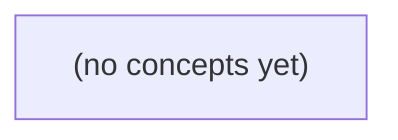

# 09.12 完整服务项目：Go 初学者的持久化即时通信教学系统

*一本面向 Go 初学者的静态项目教材，以虚构用户 u-a、u-b、u-c、会话 c-a 和消息 m-a 为主线，逐步设计从内存 HTTP/WS 到持久化、登录授权、TLS、验证与交付的教学即时通信服务。课程严格区分当前 09.02 v1 的 accepted_in_memory 合同与另行定义的 v2 持久化教学合同，并通过状态机、源码对照和增量实践建立可验证的工程认识。*

**章节:** 2

---

## 本书导览

- 了解整本书的章节脉络
- 掌握各章之间的概念依赖关系
- 选择最合适的阅读顺序

# 09.12 完整服务项目：Go 初学者的持久化即时通信教学系统

一本面向 Go 初学者的静态项目教材，以虚构用户 u-a、u-b、u-c、会话 c-a 和消息 m-a 为主线，逐步设计从内存 HTTP/WS 到持久化、登录授权、TLS、验证与交付的教学即时通信服务。课程严格区分当前 09.02 v1 的 accepted_in_memory 合同与另行定义的 v2 持久化教学合同，并通过状态机、源码对照和增量实践建立可验证的工程认识。

下方的概念图展示了本书 0 个核心概念以及它们之间的依赖关系；再下方是 1 个章节的入口。你可以按从上到下的顺序阅读，也可以根据自己的兴趣或先验知识选择切入点。

#### 概念图



## 章节索引

- **09.12 完整服务项目：从内存单聊到有边界的持久教学IM** — 面向Go初学者将S1本地工具、S2内存HTTP/WS与S3数据库、认证授权、输入输出防护、网络/TLS和验证整合为一个逐阶段的虚构IM服务课程；当前v1 6字节内存合同与教学v2持久合同及待审R9分别标记，固定OpenIM只做已核对的异步源码对照；静态教材不实际构建服务。

## 09.12 完整服务项目：从内存单聊到有边界的持久教学IM

- 写出S3教学IM的范围及尚未提供的保证
- 区分v1内存、v2教学持久和待审R9合同
- 以四张表和受信身份完成有权历史查询
- 设计事务提交后的消息确认与结果未知处理
- 为在线WebSocket推送定义独立于数据库提交的边界
- 对慢设备使用有界队列并逐跳核对TLS
- 把故障变式映射到状态与下一证据
- 对照固定OpenIM入队/消费并提交分层验收和交付材料

本节把前序单聊原型收束为可审计的教学IM边界：明确合同版本、持久化授权、提交确认、推送隔离与分层验收，而非实际部署服务。

### 划定教学IM的服务范围

### 划定教学IM的服务范围

教学IM不是把前序原型直接“上线”，而是为可检查的课程项目划出一条明确边界：它承接 S1 的 `imhistory` 命令行历史查询思路，以及 S2 的 HTTP/WS 内存单聊流程；在 S3 中补充教学数据库的持久化语义、合同版本与验收证据，但不承诺生产系统能力。

参与对象固定为用户 `u-a`、`u-b`、`u-c`，单聊会话 `c-a`，以及消息 `m-a`。它们是题目中的受控样本，不意味着已经实现开放注册、任意好友关系或多租户组织模型。项目应至少说明：

- 发送方通过 HTTP 提交单聊消息，接收方可经 WebSocket 获得推送；
- 历史消息可按会话读取，并能由 `imhistory` 对同一教学数据进行核对；
- 只有授权的会话参与者可以读取、提交或订阅该会话；
- 推送只是增量通知，断线后的完整状态仍应以历史查询为准。

现有 09.02 的 v1 合同仍描述内存行为：正文上限 `6B`、请求上限 `4096B`，成功响应为 `200 accepted_in_memory`。教学持久版必须另立 v2 纸上合同，例如以 `200 stored_in_teaching_db` 表示消息已写入教学数据库；不得悄悄改变 v1 的成功含义。R9 仍处于待审状态，因此不能把它写成既定承诺。

本项目也不提供真实部署、容灾备份、跨地域复制、海量并发、端到端加密、完整审计合规或生产监控。静态课程材料只要求设计、接口证据与可复核测试，不实际搭建服务。

### 冻结v1并另立v2持久合同

### 冻结 v1 并另立 v2 持久合同

`v1` 是 09.02 已定义的内存单聊合同：请求正文上限为 `4096B`，消息仅进入运行时内存；成功响应为 `200 accepted_in_memory`。它适合验证 HTTP/WS 收发、`u-a` 与 `u-b` 的会话路由，以及断开或重启后历史自然消失这一原型语义。

教学持久版不能把同一路径、同一版本号的 `200` 偷换为“已入库”。应新立 `v2` 纸上合同，例如：

- `v2` 仍校验发送者、接收者与 `4096B` 边界，但将 `c-a` 中的消息记录写入教学数据库；
- 仅在持久写入成功后返回 `200 stored_in_teaching_db`；
- `u-c` 重新连接后可按授权读取其历史；`m-a` 等管理视角仍须独立授权，不能因“已持久化”自动获得浏览权；
- WS 推送是投递通知，不等同于存储确认；推送失败不应把已存储消息改写成未提交。

| 维度 | v1 内存合同 | v2 教学持久合同 | R9 |
|---|---|---|---|
| 成功语义 | `accepted_in_memory` | `stored_in_teaching_db` | 待审 |
| 重启后历史 | 消失 | 可按规则查询 | 不确定 |
| 适用目的 | 协议原型 | 可审计教学演示 | 不可假定已生效 |

因此，客户端必须依据版本解释状态：收到 v1 的 `200`，只能声称服务已接受内存消息；只有 v2 的明确存储确认，才能声称消息已持久化。R9 尚未审定时，不得把它补写进 v1 或 v2 的既定承诺，更不能以“实现方便”为由静默改变旧客户端可观察到的语义。

### 以四表和受信身份查询历史

### 以四表和受信身份查询历史

教学持久版可用四张核心表表达单聊事实，而不把“能看到消息”误当作客户端自报的字段。

- `users`：`user_id`、`display_name`、`created_at`。例如 `u-a`、`u-b`、`u-c` 是稳定主体；显示名可变，主体标识不可由请求方任选。
- `conversations`：`conversation_id`、`kind`、`created_at`。例如 `c-a` 是一条 `direct` 单聊会话；会话本身不等于某个用户的收件箱。
- `conversation_members`：`conversation_id`、`user_id`、`joined_at`、`left_at`。`c-a` 可有成员 `(c-a,u-a)` 与 `(c-a,u-b)`；`u-c` 不在此表中，即使猜中 `c-a` 也无权读取。
- `messages`：`message_id`、`conversation_id`、`sender_id`、`body`、`created_at`。`m-a` 属于 `c-a`，发送者为 `u-a`；应约束 `sender_id` 同时是该会话有效成员。

历史查询的授权推导应从受信身份开始：服务端由登录态、令牌或教学桩认证得到 `actor_id=u-b`，而不是接受请求中的 `user_id=u-b`。随后执行“成员关系存在且未退出”的判定，再读取消息：

`允许读取(c,a) ⇔ 存在有效成员记录(c,a)`

因此查询 `GET /v2/conversations/c-a/messages` 时，`u-b` 可取得 `m-a`；`u-c` 应得到拒绝结果，不能因返回空列表而泄露“会话是否存在”。消息查询还必须以 `conversation_id=c-a` 为范围，并按 `(created_at,message_id)` 排序、分页，避免跨会话混入或同一时间戳下漏读。

这是一份纸上教学合同：可定义成功响应为 `200 stored_in_teaching_db`，但不得回改 v1 的 `200 accepted_in_memory` 含义；实际数据库、认证服务与部署仍不在静态课程中启动，R9 的审查结论也仍待确认。

### 分离提交确认与在线推送

### 分离提交确认与在线推送

教学持久版 `v2` 的关键边界是：**客户端收到“已存储”确认，必须以后端事务提交成功为前提**。例如 `u-a` 向 `u-b` 发送消息 `m-a`，服务端先完成鉴权、会话归属检查与写入，再提交教学数据库事务；仅当提交返回成功，才响应：

`200 stored_in_teaching_db`

这与 `v1` 的 `200 accepted_in_memory` 不同：后者只表示内存进程接受了请求，不能暗示可在重启后恢复，也不能被悄然改写成持久化承诺。

事务执行期间若连接中断、超时或服务端崩溃，客户端看到的可能是“结果未知”，而不是“发送失败”。此时应保留 `m-a` 的客户端消息标识、请求时间、接收方 `u-b`、请求摘要及响应缺失证据；重试时携带同一标识。服务端据此查询或实施幂等写入：若已提交，返回既有存储结果；若未提交，再安全创建。不得因为未收到响应就生成第二条逻辑消息。

WebSocket 只承担在线通知，例如向当前在线的 `u-b` 推送“有新消息”。它可能断线、丢帧、重复到达或早于客户端界面刷新，因此：

- 推送成功不证明数据库已提交；
- 推送失败不推翻已提交事实；
- 推送重复应由消息标识去重；
- `u-c` 不应因订阅宽泛而收到不属于自己的单聊事件。

推荐顺序是“提交事务 → 返回存储确认 → 异步尝试推送”。推送只是读取已提交事实后的派生动作；数据库记录、提交结果与审计证据才是 `m-a` 是否成立的依据。R9 对持久化细节仍待审，因此这里只定义纸上合同与验收边界，不实际搭建服务。

### 用有界传输和证据链验收

### 用有界传输和证据链验收

教学持久版的验收不以“消息最终出现”为唯一标准，而要证明它在慢设备、链路故障和异步处理下仍保持边界。v1 仍是 `200 accepted_in_memory`：正文上限 `6B`、请求上限 `4096B`；拟议 v2 才可声明 `200 stored_in_teaching_db`。两份合同不得混写，R9 的审查结论也不能被实现结果替代。

对虚构用户 `u-a`、`u-b`、`u-c` 及会话 `c-a`、消息 `m-a`，验收材料应形成可追溯链：

- **有界队列**：为慢设备 `u-b` 设置有限推送队列，记录队列容量、积压阈值、满载后的拒绝或断连策略。不得无限缓存，更不能因 `u-b` 慢而阻塞 `u-a` 向其他会话发送。
- **逐跳传输**：核对客户端到入口、入口到应用、应用到教学数据库各跳的 TLS 终止点、证书主体、协议版本与日志脱敏规则。TLS 不是“有 HTTPS”即可；每一跳都要说明明文何时存在、谁可见。
- **故障变式**：构造“写库成功但确认响应丢失”“WebSocket 推送失败后重连”“队列满载”“重复提交 `m-a`”等情形，检查幂等键、状态记录与可重放证据，避免把未知结果误报为成功。
- **异步对照**：阅读 OpenIM 的异步调用、消息落库与通知路径，只将其作为设计参照；标出本教学实现采用、简化或未实现的部分，不能宣称等同于 OpenIM 生产语义。
- **分层交付**：提交合同差异表、接口样例、队列/故障测试记录、TLS 核对表、审计日志片段和人工验收结论。静态课程只评审这些证据，不实际搭建或部署服务。

> **要点** — 教学持久IM的关键是冻结合同、授权持久化、提交后确认与推送隔离，并以证据链完成验收。

本节以纸上模型界定S3教学IM：先明确可持久、可授权、可查询的最小闭环，再标出确认链路与推送边界，避免把未实现能力误写成保证。

### 先划清S3的服务边界

### 先划清S3的服务边界

S3不是“完整即时通信产品”，而是一个可验证的持久化教学闭环：用户在已授权的会话中发送消息，服务端完成事务提交；随后具备查询权限的成员可以从数据库读到该消息。

本阶段承诺的成功边界是：

- 请求通过身份与成员权限校验；
- 服务端为消息分配稳定的`message_id`与会话内递增`seq`；
- 消息正文、发送者、时间等字段在同一事务中写入数据库；
- 事务提交成功后，发送方收到成功响应；
- 接收方之后执行“查询历史”时，能够按`seq`读取该消息。

因此，HTTP成功表示“服务端已受理并完成数据库提交”，不是“对方设备已经收到”。向在线成员B发起推送只是一次尽力尝试：B可能断网、应用未运行、连接失效，均不改变消息已提交这一事实。

更不能把以下能力写成S3保证：

- B离线后自动补发、重新上线恢复未收消息；
- 同一账号多设备间消息状态同步；
- 推送必达、按设备确认送达；
- 已读回执、撤回、编辑或端到端加密；
- 历史昵称永久可用；昵称允许为`NULL`，展示时应准备降级文案。

状态应严格区分：请求受理、事务提交、A收到HTTP响应、尝试向B推送、B设备确认、B已读。S3只对“事务提交且之后可读”负责。

### 四张表表达会话事实

### 四张表表达会话事实

先把“谁能说话、在什么会话里说、说了什么”拆成四类稳定事实，而非塞进一张消息表。

- `users`：账号主体，如 `id`、登录名、密码摘要、创建时间。它回答“当前是谁”，不承担会话内展示名称的历史。
- `conversations`：会话容器，如 `id`、类型、创建者、创建时间。单聊也应有独立会话行；两名用户之间的关系不能只靠“收发双方”临时推导。
- `members`：用户与会话的关联，至少含 `conversation_id`、`user_id`、加入时间、角色或权限状态。发送消息前，服务端必须据此验证发送者仍是当前成员；查询历史也只能返回该成员所属会话的数据。
- `messages`：不可变的发言记录，含 `id`、`conversation_id`、`sender_id`、会话内递增 `seq`、正文、创建时间，以及可为空的历史昵称字段。

关联关系可写为：

`users 1—N members N—1 conversations`  
`conversations 1—N messages`  
`users 1—N messages`

其中 `messages.id` 是全局消息标识，适合精确引用；`seq` 是同一会话内的顺序标识，适合按 `$seq$` 翻页、去重和判断缺口。应对 `(conversation_id, seq)` 建唯一约束，避免并发写入产生同序号。

历史昵称允许为 `NULL`，是有意保留的教学边界：早期消息可能只记录 `sender_id`，展示时取用户当前名称；后来若需要“消息发送当时叫什么”，才写入昵称快照。`NULL` 不等于空字符串，而是明确表示“此消息没有保存历史昵称”，前端可回退到当前用户资料。这样既承认展示名称会变化，也不假装系统已经完整实现昵称历史。

### 成员身份约束历史查询

### 成员身份约束历史查询

历史查询的入口不是“客户端声称自己是谁”，而是服务端从登录态中恢复受信身份。例如请求携带会话令牌，服务端验证后得到 `authUserId`；请求中的 `conversationId`、`beforeSeq`、`limit` 仅是查询参数，不能证明该用户有权读取该会话。

查询前应以当前成员关系授权：

1. 验证 `conversationId` 存在；
2. 查询 `members`，确认存在 `(conversationId, authUserId)` 且成员状态有效；
3. 未找到成员关系时返回无权访问，不泄露该会话是否存在、有哪些消息或成员；
4. 通过后，按该会话内单调递增的 `seq` 查询 `messages`。

典型条件可写为：

`WHERE conversation_id = ? AND seq < ? ORDER BY seq DESC LIMIT ?`

其中 `beforeSeq` 用于向更早历史翻页；首次查询可取当前最大 `seq + 1`。返回前可按升序整理，保证客户端阅读顺序稳定。`limit` 必须限制在服务端允许范围内，避免一次拉取大量记录。

成员资格应按“当前状态”判断：用户退出、被移除后，即使其曾经收到过该会话消息，也不能再以历史接口读取。反之，消息中的发送者昵称属于历史展示字段：发送时可保存可空快照，旧消息即使昵称为 `NULL`，仍可依据 `senderUserId` 与现有用户资料作降级展示；不能因昵称缺失而拒绝或篡改历史查询。

因此，历史可读的 S3 承诺是：事务已提交的消息，可被当前授权成员按序查询；它不等同于离线补偿、多设备同步或推送成功保证。

### 消息标识与确认状态分层

### 消息标识与确认状态分层

一条消息至少需要两类标识，且不能互相替代：

- `message_id`：全局唯一的消息主键，用于定位、去重、引用、回执和审计。客户端重试发送时可携带稳定的 `client_message_id`，服务端据此避免重复落库。
- `seq`：会话内单调递增的序号，用于排序和增量拉取。查询“某成员自 `seq=120` 后的新消息”比依赖时间戳可靠；时间可能相同、漂移或被客户端伪造。

可将消息写入过程拆成明确的状态链路：

`请求受理` → `事务提交` → `A 收到 HTTP 响应` → `尝试向 B 设备推送` → `B 设备确认` → `B 已读`

其中含义必须严格区分：

1. **请求受理**：服务端已完成参数、登录态、会话成员资格及发送权限检查，准备执行写入；此时消息尚不保证存在。
2. **事务提交**：`messages` 记录、会话内 `seq` 分配及必要状态更新已在同一数据库事务中提交。S3 的核心承诺到此为止：消息可被授权成员查询。
3. **A 收到 HTTP 响应**：发送方设备成功收到了服务端响应，但这只是网络层事实；若响应丢失，服务端仍可能已经提交。
4. **推送尝试**：服务端向 B 的在线连接发送通知，是尽力而为，不等于 B 收到，更不等于 B 已读。
5. **设备确认、已读**：需要 B 明确回传相应状态；它们是后续能力，不应由“推送成功”推导。

因此，接口返回 `message_id` 与 `seq` 时，应表述为“已提交、可查询”，而非“对方已收到”。S3 不承诺离线恢复或多设备同步，也不能把一次在线推送写成跨设备送达保证。

### 发送后推送只是独立尝试

### 发送后推送只是独立尝试

设 A 已登录、属于会话 `c`，B 也是该会话当前成员且其设备看似在线。A 调用“发送消息”时，服务端应先在事务内完成可验证的持久化：

1. 校验 A 的成员资格与发送权限；
2. 为消息分配会话内递增 `seq`，写入 `messages`；
3. 以 `seq` 或消息 ID 记录必要的审计字段；
4. 提交事务后，向 A 返回“请求已受理且数据库已提交”。

只有第 4 步成功，才可宣称该消息已可被后续历史查询读到。随后，服务端可查找 B 当前连接的 WebSocket，尝试投递“新消息”事件；这是一条独立于数据库事务的实时通知路径。

因此，以下状态不能混写：

- **A 收到 HTTP 成功**：表示服务端已接受请求，且本 S3 模型中通常对应消息事务已提交。
- **数据库已提交、可查历史**：消息具有稳定 `id/seq`，B 以后执行“查历史”可以读取它。
- **已尝试向 B 推送**：服务端曾对某个 B 设备连接执行发送操作。
- **B 设备确认收到**：需要 B 的应用层确认帧，不能由 WebSocket `send` 成功替代。
- **已读**：还需要 B 明确上报阅读状态。

若推送结果未知，例如连接在写入时断开，应保留已提交消息的 `id`、`conversation_id`、`seq`、提交时间，以及推送尝试的目标连接、时间和失败原因（若可得）。不要回滚已提交消息，更不要把“在线推送尝试”写成“B 已收到”。当前 S3 只承诺数据库提交后消息可读；不承诺离线恢复，也不承诺多设备同步或最终送达。

> **要点** — S3的核心是受权持久消息与可读历史；提交、HTTP确认、设备确认和已读必须分层，在线推送不构成持久交付保证。

本节先建立可验证的HTTP读写边界：身份来自受信Session，成员关系逐请求判定，v1内存合同与v2教学持久合同不得混淆。

### 范围、合同与信任边界

### 范围、合同与信任边界

本节只实现**单聊会话的历史读取**与**消息提交**：客户端通过 HTTP 请求某个会话，服务端确认当前登录者确为该会话成员后，返回有限条消息，或接受一条符合约束的新消息。它不是通用聊天平台：不涉及群聊、搜索、编辑、撤回、已读回执、附件、实时推送或跨会话管理。

身份不能由请求中的 `userId`、`senderId` 或昵称声明。服务端只信任已验证的 Session，并从中取得当前主体；随后每一次请求都重新检查“该主体是否属于目标会话”。Cookie 只是携带 Session 的机制，不等于授权；CSRF 防护限制跨站伪造写请求；CORS 限制哪些网页来源可读取响应，三者都不能替代成员授权。

v1 是内存教学基线：读取使用受限 `seq` 游标，允许正常返回空列表；写入由服务端填充发送者，限制消息文本为最多 6 字节 UTF-8、请求体最多 4096 字节，并区分非法 JSON、未知字段、重复消息 ID 与非成员访问。非成员对会话应得到隐藏式 `404`，避免泄露会话存在性。

v2 的持久化提交合同单独定义：只有成功持久提交后才返回 `200` 与 `status: stored`，不得悄然改写 v1 的响应语义。待审 R9 同样不在本节自行实现；任何未定规则都不能借由 handler 的“方便处理”变成既定 API 合同。

### 受信身份下的有权历史读取

### 受信身份下的有权历史读取

历史读取的起点不是客户端传来的 `userId`，而是服务端已验证的 Session 主体。设当前请求经 Cookie 对应的 Session 解析后得到主体 $p$，目标会话为 $c$；只有当成员关系满足

$$
member(p,c)=true
$$

时，才允许读取该会话消息。客户端即使携带 `userId=其他人`、伪造昵称或修改查询参数，也不能改变 $p$。授权必须在每个 GET 请求中重新判定，而不是依赖“此前进入过会话”的前端状态。

可定义接口为：

`GET /api/conversations/:conversationId/messages?afterSeq=n&limit=k`

其中：

- `conversationId` 仅表示要访问的会话，不代表授权。
- `afterSeq` 是顺序游标，表示“只取序号严格大于 $n$ 的消息”；缺省时可视为 $0$。
- `limit` 必须有上限，例如 $1\le k\le 100$；缺省采用服务端默认值，避免一次读取无限历史。
- 消息按 `seq` 升序返回，使客户端可稳定追加页面内容。

处理顺序应固定为：

1. 解析并验证 Session；无有效主体返回 `401`。
2. 读取并校验会话标识与游标参数；负数、非整数或超限值返回 `400`。
3. 调用成员关系检查；主体不是成员时返回 `404`，避免暴露会话是否存在。
4. 在已授权前提下，从 store 查询 `$seq>afterSeq$` 的至多 `limit` 条消息。
5. 即使没有新消息，也返回 `200` 和空数组，而不是 `404`。

典型响应可保持简洁：

`{ "messages": [], "nextAfterSeq": 12 }`

空列表表示“该主体有权读取，但当前游标之后没有消息”。`nextAfterSeq` 可取本页最后一条消息的序号；若本页为空，则保留请求游标或当前已知最大序号，关键是合同必须稳定。handler 负责 HTTP 参数、状态码和响应形状；app 负责路由与依赖装配；store 只负责“按会话、游标、上限查询消息”及成员关系数据，不应信任客户端身份。

### 受限写入与错误隐藏规则

### 受限写入与错误隐藏规则

`POST /conversations/{conversationID}/messages` 不是把客户端提交的对象原样存入列表，而是一次受边界保护的写入。服务端应从受信 `Session` 取得当前主体 `userID`，忽略请求体中任何伪造的发送者字段；客户端最多提交消息标识与内容，例如：

`{"id":"m-001","content":"你好"}`

写入前按固定顺序验证：

1. 解析 `conversationID`，并以当前 `userID` 查询成员关系。不存在的会话与“存在但不是成员”都返回 `404`，避免攻击者借由 `403` 枚举会话、成员或私密教学记录。
2. 读取请求体时设置最大 `4096` 字节上限；超过上限直接拒绝，避免内存服务被异常大请求消耗资源。
3. 仅接受合法 JSON 和约定字段。JSON 语法错误、类型不符、未知字段或缺失必要字段均为 `400`。拒绝未知字段能防止调用方偷偷注入 `senderID`、`createdAt`、`status` 等服务端控制属性。
4. `content` 必须是有效 UTF-8，且长度恰为 `6` 字节。注意这里是字节数而非字符数：`abc123` 合法，三个常见汉字通常为 `9` 字节，不能按“六码字符”误判。
5. 在该会话的既有消息中检查 `id`；重复标识返回 `409`，表示请求格式正确但与当前资源状态冲突。

成功时，服务端构造消息：

`Message{ID: id, ConversationID: conversationID, SenderID: session.UserID, Content: content}`

`handler` 负责 HTTP 解码、大小限制与状态码；`app` 编排“鉴权后校验再写入”的用例；`store` 提供成员查询、重复检测和追加接口。任何一层都不应把客户端主体当作可信身份。

### 分层职责与可替换接口

### 分层职责与可替换接口

要让“同一聊天服务”既能运行于 v1 内存实现，也能演进到 v2 持久实现，关键不在于把代码拆成更多文件，而在于让每层只回答一种问题。

- **Handler（HTTP 边界）**：解析方法、路径参数、Cookie/Session 与请求体；将认证中间件给出的受信主体传入应用层；把应用结果映射为 HTTP 状态和响应 JSON。它不应自行查询成员关系，也不应直接操作消息数组或数据库。
- **应用层（用例与规则）**：执行“该主体是否是会话成员”“`seq` 是否在允许游标范围内”“消息 ID 是否重复”“文本是否为空、是否超过 6B UTF-8”等规则；决定返回空列表、`404`、`409` 或领域成功结果。非成员应统一得到隐藏资源的 `404`，而非泄露存在性的 `403`。
- **存储层（数据事实）**：提供会话成员查询、按有界 `seq` 读取消息、原子写入消息与重复 ID 判定。内存版可用 `Map` 和切片实现；持久版可换为事务数据库，但不得改变应用层看到的语义。

接口应以业务语言表达，而不是暴露底层表结构，例如：

`查成员(会话ID, 用户ID)`、`读取消息(会话ID, 起始序号, 上限)`、`提交消息(会话ID, 消息)`。

其中“提交消息”应返回明确结果，如“已存储”“消息 ID 冲突”“会话不存在”。v1 可据此返回既定响应；v2 则在持久提交成功后返回 `200` 与 `status: "stored"`。这样，HTTP 合同、授权规则与存储替换彼此解耦，也能分别编写单元测试与集成测试。

### v2确认语义与浏览器防护

### v2确认语义与浏览器防护

v2可以在消息已成功持久化后返回 `200 OK` 与确认体：

`{"status":"stored","id":"m-123"}`

这里的 `stored` 只表示：服务端已完成本次持久提交，后续读取应能在授权范围内观察到该消息。它不是“对方已读”“消息已送达客户端”或“全局唯一业务成功”的泛化承诺。

关键是：v2确认语义不能回写或替代v1基线。v1仍按原合同返回其既定状态码、响应结构、内存行为与错误语义；测试也不应因为新增持久层而改为期待 `stored`。应通过版本路由、显式协议协商或独立应用装配，将两套合同隔离。

浏览器场景还必须验收以下边界：

- **Cookie**：Cookie 只是携带会话凭据；处理器从受信 Session 取得主体，绝不接受请求体中的 `userId`、`sender` 覆盖该主体。
- **CSRF**：携带 Cookie 的写请求必须校验 CSRF 令牌、同源来源或等价防护。否则第三方页面可借用户浏览器发起跨站提交。
- **CORS**：跨域不是认证。仅允许明确来源，凭据模式下不得使用通配来源，并只开放实际需要的方法与请求头。
- **逐请求授权**：每次 `GET`、`POST` 都重新以 Session 主体检查会话/频道成员关系；不能因为此前成功访问过就缓存授权结论。非成员仍按约定隐藏为 `404`。

职责上，handler 负责解析 Cookie、CSRF、CORS 与 HTTP 映射；app 负责“主体可否读写、持久成功后如何形成 `stored`”；store 只负责原子保存、查重与读取，不信任浏览器输入，也不决定成员授权。

> **要点** — 先以受信身份和逐请求成员授权守住读写边界，再分层演进持久确认，避免把v2语义倒灌给v1。

本节以四表 PostgreSQL 教学模型落地持久单聊，重点建立可查询、可鉴权、可恢复判断的写入与读取边界。

### 四表模型与教学范围

### 四表模型与教学范围

本实现用四张表描述“谁能在什么会话里发送、读取哪些消息”，刻意保持模型小而边界清楚：

- `users`：用户身份主体，主键为 `id`。它只保存账号级事实，例如创建时间；显示名、头像等资料可后续扩展。
- `conversations`：单聊会话，主键为 `id`，并保存创建时间。教学模型中一条会话对应两个参与者，但不在此表冗余保存成员名单。
- `conversation_members`：会话成员关系，联合主键 `(conversation_id, user_id)`，两个字段分别外键指向会话和用户。发送消息、拉取历史前都必须检查该关系，不能仅凭客户端提交的会话 ID 授权。
- `messages`：消息事实，包含稳定的 `message_id`、所属 `conversation_id`、发送者 `sender_id`、会话内递增 `seq`、正文及创建时间。其外键保证发送者和会话存在；`(conversation_id, seq)` 唯一约束保证同一会话中的排序位置不重复。

这里的 `seq` 是会话内阅读顺序，不应使用全局自增 ID 代替：不同会话可以拥有相同 `seq`，客户端可据此保存“已读到第几条”的游标。

该四表模型用于教学 `database/sql`、参数化 SQL、事务、约束与恢复判断，不是 OpenIM 的实际存储路径，也不承诺群聊、撤回、编辑、多端已读回执、全文搜索、附件对象存储、端到端加密或跨地域高可用。用户资料迁移时允许新增列，旧行可为 `NULL`；没有历史数据时，不应伪造历史昵称或头像。

### 连接池与安全查询纪律

### 连接池与安全查询纪律

Go 中的 `*sql.DB` 不是“一条数据库连接”，而是并发安全的连接池句柄。服务启动时创建一次并复用，关闭时再执行 `Close()`；不要在每个请求、每次发消息时 `sql.Open`。可按 PostgreSQL 容量配置最大打开连接、最大空闲连接和连接生命周期，避免突发并发耗尽数据库连接或长期复用失效连接。

所有外部输入都必须通过占位符传参：

`db.QueryContext(ctx, "SELECT id, seq, body FROM messages WHERE conversation_id=$1 AND seq>$2 ORDER BY seq LIMIT $3", cid, after, limit)`

不要用字符串拼接构造 `WHERE`、`VALUES` 或排序条件。参数化既防止注入，也让驱动正确处理引号、编码和类型。表名、列名、排序方向通常不能作为参数；若确需动态选择，只能从程序内固定白名单映射，不能直接接受客户端文本。

查询返回 `Rows` 后应立即：

`defer rows.Close()`

随后逐行 `Scan`，循环结束还必须检查：

`if err := rows.Err(); err != nil { ... }`

`Close` 用于尽早归还底层连接及结果集资源；`rows.Err()` 则捕获迭代过程中才出现的网络错误、服务端错误或上下文取消。仅检查 `QueryContext` 的返回错误并不足够。

单行查询使用 `QueryRowContext`，并显式处理 `sql.ErrNoRows`；写操作使用 `ExecContext` 或事务中的 `ExecContext`。所有调用都应携带请求 `ctx`，使超时、取消能传递到数据库，避免已离开页面的请求长期占用连接。

### 受信身份下的历史查询

### 受信身份下的历史查询

历史读取不能接受客户端传入的“当前用户 ID”。请求先经认证中间件验证令牌，并将可信的 `userID` 写入请求上下文；处理器只读取该受信身份。客户端可提供 `conversationID`、分页锚点和页大小，但这些只是查询条件，不构成授权依据。

读取流程可由三个约束推导：

1. **会话必须存在且调用者是成员**。先检查成员表，而不是先查消息再在应用层过滤：
   ```sql
   SELECT 1
   FROM conversation_members
   WHERE conversation_id = $1 AND user_id = $2;
   ```
   无记录时统一返回“无权访问或会话不存在”，避免通过错误差异枚举会话。

2. **消息按会话内 `seq` 排序**。`seq` 是发送事务中分配、并受 `(conversation_id, seq)` 唯一约束保护的稳定游标；它比时间戳更适合分页，因为并发写入时不会因同一时间或时钟精度造成重复、漏读或重排。

3. **分页使用锚点而非偏移量**。例如向后查看较早消息：
   ```sql
   SELECT message_id, seq, sender_id, body, created_at
   FROM messages
   WHERE conversation_id = $1
     AND seq < $2
   ORDER BY seq DESC
   LIMIT $3;
   ```
   首次请求可令锚点为一个足够大的值。服务端将结果反转为升序展示，并返回本页最小 `seq` 作为下一页锚点。页大小必须设上限，避免一次读取整个长会话。

在 Go 中，成员检查与消息查询均使用参数化 SQL，禁止拼接会话 ID 或分页值。`QueryContext` 返回的 `Rows` 必须立刻 `defer rows.Close()`；循环 `Scan` 后还要检查 `rows.Err()`，否则网络中断、驱动读取失败等错误可能被误当作“历史为空”。读取结果只包含当前表中真实保存的数据：迁移后新增的展示名、附件摘要等字段允许旧行是 `NULL`，应显式表示“未知”，不能依据当前资料伪造历史名称。

### 发送事务、序号与未知结果

### 发送事务、序号与未知结果

一次“发送消息”不是单条 `INSERT`，而是必须保持顺序与原子性的事务。典型顺序如下：

1. `BEGIN` 后先检查发送者是否仍是会话成员；成员查询应在事务内完成，必要时锁定成员关系，避免“已被移出仍成功发送”。
2. 锁定会话行，例如 `SELECT next_seq FROM conversations WHERE id=$1 FOR UPDATE`。同一会话的发送者都会在此串行化，避免取到相同序号。
3. 取得当前 `next_seq` 作为消息 `seq`，并更新为 `next_seq + 1`。
4. 写入消息行：`INSERT INTO messages(conversation_id, seq, message_id, sender_id, body, ...) VALUES ($1,$2,$3,$4,$5,...)`。
5. `COMMIT` 后才向调用方报告成功。

所有外部输入都经由 `$1`、`$2` 等参数传递；不能把正文、用户标识或会话标识拼进 SQL。数据库还应兜底约束：

- `UNIQUE(conversation_id, seq)`：同一会话内序号唯一；
- `UNIQUE(message_id)`：客户端或服务端生成的稳定消息标识全局唯一；
- 外键或成员约束保证消息关联对象存在。

并发下，`FOR UPDATE` 使同一会话的序号按提交事务顺序分配；不同会话仍可并行发送。应用读取 `Rows` 时必须 `defer rows.Close()`，循环后检查 `rows.Err()`，否则可能泄漏连接或遗漏迭代错误。

最棘手的是 `Commit` 附近网络断开：客户端收到错误，并不代表事务未提交。此时不能直接重发并生成新消息；应使用同一个稳定 `message_id` 查询消息是否已存在。查到即按成功恢复，查不到才可在明确的重试策略下再次提交。唯一约束使重复请求最终收敛为同一条消息，而非制造两条内容相同、序号不同的记录。

### 迁移快照与实现边界

### 迁移快照与实现边界

比较三个阶段时，关键不是“把新字段补满”，而是明确每个版本承诺保存什么事实：

| 阶段 | 消息记录的名称信息 | 读取含义 |
|---|---|---|
| v1 | 只关联成员或用户标识 | 名称由当前资料查询得到，历史展示会随改名变化 |
| v2 | 新消息额外写入发送者名称快照 | 之后改名不改旧消息的展示事实 |
| 待审 R9 合同 | 明确快照字段、回填策略与兼容语义 | 只有合同确认后，才能决定是否批量补写或改变接口保证 |

典型扩展可为：

`ALTER TABLE messages ADD COLUMN sender_name_snapshot TEXT NULL;`

这里的 `NULL` 不是脏数据，也不应在迁移时伪造成“历史名称”。它表示：该消息产生于 v2 快照机制之前，数据库并未保存当时名称。读取时可采用分层展示：

1. 快照非 `NULL`：展示快照，保证历史名称保真。
2. 快照为 `NULL`：可展示当前名称作为降级信息，但必须知道它不是历史事实。
3. 当前资料也不存在：展示稳定用户标识或“未知用户”，不能编造名称。

因此，写入新消息时应在发送事务中同时写入正文、`seq` 与名称快照；迁移只改变模式，不篡改过去。若 R9 要求回填，也必须指定可信历史来源，而不能用今天的用户资料覆盖昨天的语义。

最后，本节的四表 PostgreSQL、`database/sql`、参数化 SQL 与事务顺序仅是教学实现：用于说明成员检查、序号分配、唯一约束和恢复查询的边界。它不描述 OpenIM 的真实存储结构、调用链或生产部署路径。

> **要点** — 持久消息的可信边界来自鉴权查询、事务内唯一写入，以及用稳定 messageID 复查未知提交结果。

本节界定在线消息推送的真实边界：先逐跳建立可信会话，再在事务提交后尽力投递，并以有界队列约束慢设备。

### 在线连接的四层建立顺序

### 在线连接的四层建立顺序

u-a 与 u-b“在线”并不等于应用已经可以安全推送消息。每个设备上的 WebSocket 连接都应按以下顺序建立；任一层失败，都不能登记为可投递会话。

1. **TCP 连接**：客户端先与入口地址建立 TCP。三次握手只说明两端网络栈可达；代理、负载均衡器与后端之间仍可能是另一段 TCP 连接，不能把端到端可达误认为已建立。

2. **TLS 握手**：在该 TCP 段上协商 TLS，客户端校验证书、域名与有效期，服务端协商协议和加密参数。若经过反向代理，TLS 可能在代理终止，代理到应用服务是新的 TLS 或明文跳；“已加密”必须明确指哪一跳。

3. **HTTP 升级请求**：客户端发送带有 `Upgrade: websocket` 的 HTTP 请求。服务端在此阶段检查请求路径、协议版本、`Origin`、限流与跨站策略；不可信来源、缺失必要头部或策略不允许时，应直接拒绝，而不是先升级再补救。

4. **WebSocket 会话认证与绑定**：服务端验证 `Session`，解析其对应用户、设备和过期状态，并逐条确认该会话有权连接指定教学空间或私聊通道。只有返回升级成功响应、创建连接状态并绑定“用户—设备—会话”后，才能将该设备标记为在线。

因此，u-b 的在线状态应表示“至少存在一个仍有效、已认证、通过来源校验且可写的连接”，而非仅有 TCP 存活。后续 `Ping/Pong` 只能帮助发现连接失活，不能替代身份、来源和会话权限校验。

### 会话身份、来源与逐条授权

### 会话身份、来源与逐条授权

浏览器发起 WSS 连接并不天然等于“可信用户上线”。它先经历 TCP 建连、TLS 握手与 HTTP Upgrade；若部署了反向代理，TLS 可能在代理处终止，代理到应用的下一跳仍须被明确保护和信任，不能把“前一跳已加密”误推为端到端安全。

握手阶段至少要完成两类校验：

1. **会话身份校验**：从受保护的 `Cookie`、令牌或服务器会话中恢复用户身份。服务端验证会话未过期、未撤销、未被篡改，并将得到的 `userId` 绑定到该 WebSocket 连接。不能接受客户端在首帧中自报的“我是 u-a”。
2. **来源校验**：检查 HTTP `Origin` 是否属于允许的教学站点。浏览器会在跨源 WebSocket 握手中携带该字段；若只依赖 Cookie 而不校验 `Origin`，恶意网页可能诱导已登录用户的浏览器携带其会话建立连接。非浏览器客户端则应采用单独的凭证与接入策略，而不是简单跳过校验。

连接绑定身份只是入口，不是永久授权。收到每一条消息、订阅、历史查询或已读回执时，服务端都应以连接上已验证的身份重新判定权限。例如，u-a 发送给 u-b 时，服务端依据 `userId = u-a` 检查其是否可向该会话发送，再确认目标 u-b 与该会话的成员关系；客户端提交的 `senderId`、`conversationId` 和“教师/学生”角色都只能视为待核对的输入。

可将判定概括为：

$$
\operatorname{allow}(u,\ action,\ resource)
=
\operatorname{sessionValid}(u)
\land
\operatorname{member}(u,\ resource)
\land
\operatorname{policy}(u,\ action,\ resource)
$$

因此，即使同一条 WSS 长连接仍存活，用户退出、被移出班级、会话撤销或权限变更后，后续操作也必须被拒绝或断开。身份在握手时建立，权限却必须逐条复核。

### 提交后推送不是送达证明

### 提交后推送不是送达证明

消息从 A 提交给 B 后，系统必须把不同层次的“成功”严格分开。最先成立的是**数据库事务提交**：消息记录、会话归属、发送者权限等校验通过并原子落库。此时消息不会因进程重启而丢失，服务端可以返回“已提交”；但这只证明系统接受了消息，不证明 B 已收到。

若 B 当前存在已认证、`Origin` 合法且属于该会话的 WebSocket 连接，提交后可在事务外尝试推送事件：

1. 查询 B 的在线连接与该会话权限；
2. 向连接的容量为 2 的出站队列追加事件；
3. 由写协程执行 WebSocket 写入。

这里的“尝试”不能反向影响已提交事务。队列已满说明设备或网络过慢，应按策略断开慢连接、保留数据库中的未读消息，并让 B 后续通过 S5 同步；不能无限堆积内存，也不能把数据库事务等待网络写完。

即使服务端 `Write` 成功，也只表示数据交给本机协议栈或代理链路；TCP ACK 仅说明对端 TCP 栈确认收到字节，受接收窗口 `rwnd`、拥塞窗口 `cwnd` 和中间代理影响。经由 TLS 终止代理时，确认甚至只覆盖某一跳，而非最终设备。WebSocket `Pong` 也只是连接仍可能存活的心跳响应。

因此，以下状态不能混同：

- **已提交**：消息持久化成功；
- **已推送尝试**：已放入在线连接的发送路径；
- **链路确认**：收到某层 TCP 确认或 `Pong`；
- **已展示/已读**：B 客户端明确上报展示或阅读回执。

只有最后一种、并经服务端校验后持久化，才能更新“已读”。B 离线、连接失效或推送队列溢出时，消息仍留在 S5，等待其下次认证连接后按游标拉取。

### 容量为二的慢设备队列

### 容量为二的慢设备队列

为每个已认证的 WebSocket 会话维护一个容量为 `2` 的出站事件队列。它的职责只是吸收短暂的网络抖动与应用写入节奏差异，而不是保存聊天历史：

1. 消息事务提交后，若 `u-b` 当前在线，则尝试将“有新消息”事件入队；写协程按顺序从队列取出并调用 WebSocket 写操作。
2. 队列未满，入队成功仅表示服务器愿意尝试发送；它不表示对端已收到 TCP 字节、更不表示界面展示或用户已读。
3. 队列已满说明该会话持续不能消费数据。不要无限扩容，也不要静默丢弃其中某条消息并伪造连续实时体验；应关闭该会话，记录慢客户端原因，并停止向该连接继续投递。
4. 关闭连接后，未成功写出的事件无需在内存中补发。消息实体已经持久化，客户端重连、完成 `Session` 与 `Origin` 校验后，使用最后同步的消息序号或时间游标拉取历史增量。
5. 同一用户多设备在线时，队列、慢速判定和断连都以“会话”为单位：一个卡顿设备被断开，不应阻塞另一台设备，也不影响消息的数据库提交。

容量 `2` 是明确的背压边界：它优先保护服务端内存与正常会话。底层 `rwnd`、`cwnd`、代理缓冲或 TLS 分段可能让写调用暂时看似成功，因此慢设备治理不能依赖 TCP ACK 或 WebSocket `Pong`；最终一致的补偿责任应由持久消息记录与重连同步承担。

### 逐跳核对TLS与拥塞证据

### 逐跳核对 TLS 与拥塞证据

“WebSocket 已连接”并不等于一条端到端、统一加密且畅通无阻的通道。排障与容量判断应把链路拆成若干跳，并分别核对传输控制、TLS 终止点与身份边界。

- **接收窗口 `rwnd`**：由接收方通告，表示其内核缓冲区还能接收多少字节。`rwnd` 变小或归零，通常意味着客户端、代理或服务端应用读取不及时；发送方即使网络带宽充足，也必须停发或降速。
- **拥塞窗口 `cwnd`**：由发送方 TCP 根据丢包、往返时延和拥塞信号维护，限制其认为网络路径可安全注入的数据量。`cwnd` 受限说明瓶颈更可能在链路拥塞、丢包或高 RTT，而不必然是 B 的设备慢。
- 实际可发送上限近似为：`min(rwnd, cwnd)`。因此，某条消息迟迟未到达 B，不能仅凭服务端 `send` 成功断言是“客户端未读”；它可能卡在服务端出站队列、某一跳的 `cwnd`，或下一跳的 `rwnd`。

直连时，客户端与 IM 服务通常完成同一跳 TLS：客户端验证服务端证书，服务端在 TLS 内完成 HTTP Upgrade，并基于 `Session`、`Origin` 和逐条会话权限决定是否接受该 WSS 连接。

经反向代理时必须改为逐跳描述：

1. 客户端 `TLS → 代理`：浏览器验证的是代理暴露的证书；`Origin`、Cookie/Session 等请求证据首先到达代理。
2. 代理 `TLS → 应用` 或明文 `HTTP → 应用`：这是独立的一跳。若代理终止 TLS 后回源明文，则“客户端到应用全程加密”并不成立；内部网络也须被视为独立信任边界。
3. 若代理重新加密回源，应用还应验证代理身份、可信转发头，并防止外部客户端伪造身份头。

同理，代理向应用报告“连接仍在”或客户端返回 TCP ACK、WebSocket Pong，只能证明相应跳上的字节或控制帧得到处理。它们不能证明 B 已展示消息，更不能证明已读。容量为 2 的应用出站队列应在此事实下执行慢设备策略：队列满时合并可合并事件、拒绝低优先级推送或断开慢连接；消息的持久化状态仍以事务提交为准，离线或未成功送达的 B 留待 S5 拉取。

> **要点** — 持久提交是消息成立的依据；在线推送仅是事务外尽力尝试，慢设备与TLS边界必须显式验证。

本节用故障矩阵界定教学IM的状态边界：每类异常都必须说明是否改状态、客户端能看到什么，以及下一步凭什么确认事实。

### 先固定三类合同与状态判定点

### 先固定三类合同与状态判定点

在进入故障矩阵前，先把教学 IM 的事实来源分成三类合同。设当前稳定接口为 `v1`、演进中的兼容接口为 `v2`，而待审变更为 `R9`；`R9` 未批准、未迁移、未部署前，不得成为客户端或排障流程的依据。

- **请求合同**：客户端提交的 `messageId`、会话标识、发送者身份、正文及幂等键必须满足 `v1/v2` 的校验规则。`bad body`、`too large`、`unauth`、`nonmember` 都发生在数据库提交前：服务端拒绝请求，不产生消息记录，也不应触发推送。
- **提交合同**：数据库事务成功提交，才意味着消息已持久存在。提交前超时、校验失败或连接失败，状态是“未确认写入”；提交成功后，即使 HTTP 响应丢失、推送失败或接收者离线，消息仍是“已存储”。排障时以消息表中的唯一键、事务提交记录或可查询的消息流水为下一证据。
- **交付合同**：HTTP `2xx` 仅表示本次请求已获得服务端确认；WebSocket 推送仅表示服务器尝试向某连接投递，均不等价于对方已读。旧 WebSocket、慢接收者和 B 离线会影响实时可见性，不应回滚已提交消息。

因此，状态判定点应严格排序：

`请求已到达` → `身份/成员资格已验证` → `数据库已提交` → `HTTP 已响应` → `推送已尝试` → `客户端已确认显示`

其中只有“数据库已提交”改变消息的持久状态。若提交成功后响应丢失，A 重试必须复用同一 `messageId` 或幂等键；换新 ID 会把一次不确定结果变成两条合法消息。S3 只承载静态资源方案，不参与消息提交、确认或推送事实判定。

### 请求进入提交前的拒绝矩阵

### 请求进入提交前的拒绝矩阵

提交前拒绝的共同原则是：**尚未写入消息、会话游标或投递任务，因此业务状态不变**。服务端仍应留下可关联的审计证据，避免客户端只看到失败码却无法解释原因。

| 情形 | 是否改业务状态 | HTTP 可见结果 | 应保留的下一证据 |
|---|---:|---|---|
| 请求体格式错误、字段缺失、类型不符 | 否 | `400`，说明无效字段或格式 | 请求追踪号、校验失败字段、接口版本、时间戳；不要记录完整敏感正文 |
| 请求体超过大小上限 | 否 | `413`，说明允许的最大大小 | `Content-Length`、实际读取字节数、用户与会话标识、限额规则版本 |
| 未认证或令牌失效 | 否 | `401`，可提示重新登录 | 认证失败类别、令牌指纹或会话标识、来源地址、时间；不得记录原始令牌 |
| 已认证但不是该会话成员 | 否 | `403`，不泄露会话成员细节 | 用户标识、目标会话标识、权限判定结果、成员关系版本或策略版本 |
| 重复请求，且同一幂等键已被处理 | 否；不再新建消息 | `200` 或 `201`，返回首次创建的消息标识与结果 | 幂等键、原请求摘要、已提交消息标识、首次提交时间、响应摘要 |

“重复”必须按稳定的幂等键判定，而不是按正文相同判定：两句相同文本可能是两条不同教学提问。对于前四类拒绝，客户端修复后可使用新的请求标识再次发送；对于重复请求，客户端应复用服务端返回的既有结果，不能再生成新消息。审计日志只证明“请求未进入提交”，不能把它误写成“对方未收到消息”。

### 提交临界区的超时与未知结果

### 提交临界区的超时与未知结果

发送消息不能把“客户端没收到成功响应”等同于“服务端没有写入”。真正的临界区在数据库提交附近，至少应区分三类结果：

| 情形 | 提交前后是否可能改状态 | 客户端可见 | 下一证据 |
|---|---|---|---|
| 数据库超时，确认发生在提交前 | 不应新增消息 | 超时或服务不可用 | 服务端事务日志、按幂等键查询 |
| 提交结果未知 | 可能已写入，也可能未写入 | `202`、超时或可重试提示 | 消息表唯一键、提交记录、历史查询 |
| 提交成功但响应丢失 | 已新增消息 | 客户端超时，误以为失败 | 按幂等键或消息 ID 查询历史 |

数据库驱动报超时并不自动说明事务失败：请求可能在网络断开前已到达数据库，数据库也可能已完成 `COMMIT`，只是应用没有拿到确认。因此，服务端不得在“未知提交结果”下直接换一个新消息标识再次插入；客户端更不能生成新 ID 后盲目重发。

每次发送应携带稳定的幂等键，例如 `clientMessageId`，并在 `(senderId, conversationId, clientMessageId)` 上建立唯一约束。重试必须**沿用原幂等键与原消息内容**。服务端若查到既有记录，返回该记录的服务端消息 ID 与当前状态；若尚未找到，才进入受控重试或异步核验。

反例是：A 已成功提交消息，响应在网关处丢失；A 超时后生成新 ID 重发，最终 B 收到两条内容相同但身份不同的消息。唯一约束无法消除“换键重试”的重复，故幂等键是协议契约，不是可选优化。

客户端在未知结果时应先查询会话历史或发送状态记录，再决定是否继续等待、显示“发送中”，或以同一幂等键重试。B 离线只影响投递和已读状态，不表示消息未持久化；只要提交成功，历史查询应能提供最终证据。

### 提交后存储与在线推送分离

### 提交后存储与在线推送分离

消息提交的事实边界应是：服务端完成持久化并返回可验证的消息标识。在线推送只是“尽力缩短接收延迟”的派生动作，不能反过来决定消息是否存在。于是，`已存储`、`已推送`、`客户端已收到`、`用户已阅读`必须是不同状态。

| 场景 | 持久化状态 | HTTP 可见结果 | 推送处理 | 下一证据 |
|---|---|---|---|---|
| B 离线 | 已提交 | A 收到成功与 `messageId` | 不建立实时投递；B 下次上线补拉 | B 的同步游标、消息列表 |
| B 使用旧 WebSocket | 已提交 | A 收到成功 | 旧连接可能已失效，发送失败即关闭并等待重连补拉 | 连接代次、重连后的游标同步 |
| B 为慢接收者 | 已提交 | A 收到成功 | 进入有界发送队列；不能无限堆积 | 队列长度、丢弃计数、补拉结果 |

“B 离线”只表示当前没有可用推送通道，**不表示消息未存**。B 上线后应携带最后确认的游标，例如 `afterMessageId` 或序列号；服务端从数据库按会话顺序补发缺口。这样即使推送从未发生，历史仍可恢复。

旧 WebSocket 的风险在于：服务器认为连接存在，但网络路径或客户端页面已切换。推送写入失败不能回滚已经提交的消息；应记录该连接代次失败、移除连接，并让客户端以新连接和游标补拉。不能因一次写失败把消息重新写库，否则会制造重复。

慢接收者必须使用有界队列。队列满时丢弃的是“该连接上的实时推送事件”，不是数据库消息；可采用丢弃旧事件、关闭慢连接并要求补拉，或仅保留“有新消息”的唤醒信号。边界应明确：实时通道不保证全量送达，数据库查询与游标同步才是完整性证据。

### 网络证书故障与分层验收证据

### 网络证书故障与分层验收证据

证书失败、链路中断与推送失败都不能直接推断“消息未提交”。应把网络层现象与业务状态分离，并按“提交前、提交后、客户端可见结果、下一证据”验收。

| 场景 | 是否可能已改业务状态 | 客户端可见 | 下一步证据 |
|---|---:|---|---|
| TLS 证书校验失败 | 否，通常请求未到服务端 | 握手失败、无法建立连接 | 客户端证书链、域名、有效期、系统时间、服务端 TLS 日志 |
| 已建连后链路中断 | 可能 | 超时、连接关闭 | 请求 ID、服务端访问日志、消息查询接口 |
| 服务端已提交但响应丢失 | 是 | 客户端超时或未知结果 | 按 `clientMsgID`/幂等键查询消息记录 |
| B 离线导致推送失败 | 是 | A 可收到成功；B 暂无实时展示 | 数据库消息记录、离线未读数、B 重连后的同步结果 |
| B 在线但 WebSocket 旧连接失效 | 是 | B 未收到或收旧会话事件 | 连接会话 ID、踢线日志、重连后的增量拉取 |
| B 接收缓慢或队列积压 | 是 | 延迟展示，不等于丢失 | 推送队列长度、确认位点、客户端同步游标 |

逐跳验收应保留证据链：客户端记录握手错误与目标域名；网关记录 TLS 协商、请求 ID 和转发结果；消息服务记录幂等键、提交事务与消息 ID；查询接口返回持久化消息；接收端重连后以同步游标验证最终可见性。

固定 OpenIM 源码版本与部署镜像摘要，验收材料应能对应其消息写入、在线推送、离线同步及 WebSocket 重连路径。不要仅凭“推送日志失败”判定发送失败：推送属于投递尝试，持久化提交与最终同步才是消息事实。S3 在此仅用于静态文件或附件方案，不承担消息提交确认。

> **要点** — 以数据库提交为存储事实边界，以幂等查询和分层证据处理未知结果；推送、在线与送达均不得替代持久化事实。

本节以固定版本 OpenIM 源码为边界证据，区分已观察到的调用链与教学项目需要自行验证的服务承诺。

### 先划定源码对照的事实边界

### 先划定源码对照的事实边界

以下结论仅以固定提交 `f641…` 的源码文本为证据，不将“存在调用”扩展解释为“已获得某种运行保证”。

可直接引用的事实包括：

- `send.go` 中，单聊与群聊发送路径受 `isSend` 等分支控制；在满足相应条件的单次发送调用里，可见调用 `MsgToMQ`，随后构造并返回响应。
- `online_msg_to_mongo_handler.go` 中，存在独立的消息处理消费者；其处理流程可见调用 `BatchInsertChat2DB`，用于批量写入聊天数据。
- 因而，源码层面能够描述为两段不同职责的调用关系：发送侧将消息交给 `MsgToMQ`；在线消息入库侧由处理器调用 `BatchInsertChat2DB`。

但这些事实**不能单独证明**：

- `MsgToMQ` 返回即代表消息已被消息队列持久接收、已被消费者处理，或已成功写入数据库；
- HTTP 或 RPC 响应成功即代表最终入库成功；
- 失败时是否重试、重试次数与间隔、重复消费如何处理、批量写入失败如何补偿；
- 消息顺序、至少一次/至多一次/恰好一次语义；
- 多设备同步、离线投递、读写一致性及端到端可见性保证。

教学项目应把这些未由调用关系证明的语义列为待验证项：用 `httptest` 覆盖接口边界，用隔离数据库验证写入结果，用端到端测试保存可复核证据；再由 CI 提交记录、构建产物、配置与凭据管理、迁移步骤及运行手册共同说明实际服务承诺。

### 发送路径：单次入队后返回

### 发送路径：单次入队后返回

以固定版本 `f641...` 的 `send.go` 为证据，单聊发送可从 `group` 与 `isSend` 两层观察其可见顺序。这里讨论的是处理函数中的调用关系，不把它扩展为消息已持久化、已送达或已被对端设备接收。

当请求进入单聊发送分支时，`group` 负责组织本次发送所需的消息与上下文；随后由 `isSend` 判定该消息是否应进入发送流程。满足条件的单条消息调用：

`MsgToMQ(message)`

调用完成后，处理路径继续构造并返回响应。因此，从该源码片段能够稳妥导出的顺序是：

1. 接收单聊发送请求；
2. 在 `group` 中形成待处理消息；
3. 经 `isSend` 进入发送条件；
4. 对该消息单次调用 `MsgToMQ`；
5. 返回本次接口响应。

可将其概括为：

`请求 → group/isSend → MsgToMQ → 响应`

这条顺序只说明：响应位于该次 `MsgToMQ` 调用之后。它不等价于“消息已写入 MongoDB”。持久化由独立消费者 `online_msg_to_mongo_handler.go` 处理，该消费者接收在线消息后调用 `BatchInsertChat2DB` 批量写库，属于发送接口之外的后续处理链。

因此，教学项目应明确区分“入队调用后返回”与“数据库中可查询到消息”两种证据。仅凭发送接口成功响应，不能据此推断确认语义、失败重试、跨设备一致性或最终送达保证；这些承诺需要通过隔离数据库测试、端到端测试及持续集成产物另行验证。

### 消费路径：独立处理并批量落库

### 消费路径：独立处理并批量落库

在固定版本的源码边界内，消息发送与消息持久化呈现为两条分离的处理路径。`send.go` 中的群聊发送及 `isSend` 相关单聊发送，在调用 `MsgToMQ` 后继续构造并返回发送响应；从这一段调用关系本身，只能确认发送处理会将消息交给消息队列相关入口，并向当前请求返回结果。

另一方面，`online_msg_to_mongo_handler.go` 作为独立的在线消息处理消费者，接收其处理范围内的消息后调用：

`BatchInsertChat2DB`

该调用表明聊天消息的数据库写入由消费者侧执行，且接口语义是批量插入，而非由 `send.go` 在同一请求处理栈中直接逐条写入数据库。可将已观察到的路径概括为：

1. 发送接口处理群聊或单聊请求。
2. 发送侧调用 `MsgToMQ`。
3. 发送侧生成并返回响应。
4. 独立消费者处理在线消息。
5. 消费者调用 `BatchInsertChat2DB` 批量写入聊天数据。

这种分离意味着，教学项目不应把“接口已经响应”表述为“数据库已经完成写入”。前者属于发送处理路径中可见的响应行为，后者属于独立消费者中的批量落库行为；两者之间的具体时序、确认机制、失败后的处理方式及跨设备可见性，不能仅凭这两处调用事实推出，必须通过隔离数据库测试、端到端证据与运行环境日志另行验证。

### 不越界解读确认、失败与设备保证

### 不越界解读确认、失败与设备保证

固定版本源码能直接支持的事实应限于两段调用关系：

- `send.go` 中，单聊与群聊发送路径经由 `isSend` 等分支后调用 `MsgToMQ`，随后构造并返回响应。
- `online_msg_to_mongo_handler.go` 中，独立消费者接收在线消息，并调用 `BatchInsertChat2DB` 批量写入数据库。

因此，可以表述为“发送接口执行了消息入队调用，并返回了接口响应”“消费者侧存在独立的批量落库调用”。这说明接口层、消息队列与持久化消费者在代码结构上被分开，但不能据此直接推出更强的服务承诺。

尤其不要将“响应已返回”等同于以下任一结论：

- 消息已经被队列持久确认；
- 消费者已经成功处理；
- 数据已经写入 MongoDB；
- 接收方设备已经在线收到消息；
- 多台登录设备都已获得相同消息；
- 失败后必然重试、去重或保持严格顺序。

`MsgToMQ` 的调用本身只证明该发送路径尝试交给消息队列；`BatchInsertChat2DB` 的出现只证明存在批量写库处理点。确认时机、生产失败如何暴露、消费失败是否重试、重复消费如何处理、批次部分失败如何处置，以及多设备离线补偿与投递一致性，都必须继续以配置、队列客户端实现、消费者错误分支、数据库约束和端到端测试为证据。

教学项目应把这些能力写成待验证的契约，而非从调用名推断。例如，通过 `httptest` 验证接口响应，通过隔离数据库检查最终记录，通过端到端测试观察在线与离线设备结果；再在 CI 中保存测试日志、迁移结果和构建产物。配置、凭据与运行手册还应明确测试环境使用的队列和数据库边界。

### 把源码对照纳入教学验收证据链

### 把源码对照纳入教学验收证据链

以固定版本源码作为“行为边界”，验收不应只展示聊天页面成功，而应形成可复查的分层证据。已观察到的事实是：`send.go` 中群聊及 `isSend` 单聊路径调用 `MsgToMQ` 后返回响应；独立消费者 `online_msg_to_mongo_handler.go` 调用 `BatchInsertChat2DB`。教学项目只能据此验证自身实现是否对齐该调用关系，不能据此宣称消息确认、失败重试、跨设备一致性或投递保证。

建议将交付物组织为四层：

- **源码对照层**：记录固定提交、文件路径、关键函数与调用关系；注明“源码观察”与“项目承诺”的边界。
- **单元与接口层**：按 09.11 测试矩阵覆盖单聊、群聊、非法请求、持久化查询等场景，使用 `httptest` 验证接口状态码、响应体和必要副作用。
- **隔离集成层**：测试数据库使用独立实例、独立库名或事务清理；迁移后执行发送—消费—查询链路，保存请求、响应、数据库查询结果及日志摘要。
- **端到端与交付层**：提交记录关联需求、测试和修复；构建产物附带版本号与校验信息。仓库提供配置模板，不提交真实凭据；迁移脚本应可重复执行，运行手册说明依赖、配置项、启动顺序、验证命令、回滚与常见故障。

最终验收包应让他人在干净环境中依据手册完成部署，并从源码对照、自动测试与端到端记录三方面复核结论。

> **要点** — 固定源码只证明可见调用链；教学服务的确认、失败处理与设备保证必须另以测试和交付证据验证。

本节以五个递进里程碑组织完整教学IM项目：先明确合同，再建立受信持久化边界，最后用故障证据与分层交付验证设计。

### 里程碑一：冻结版本合同与最小范围

### 里程碑一：冻结版本合同与最小范围

先把“能运行的单聊”与“可演进的教学服务”分开。P2 是内存基线：它证明消息路由、会话状态与基本交互成立；S3 则在此基础上增加**受信身份、持久消息、在线通道和可验证故障边界**。在编码前写下版本合同，避免实现完成后才争论接口语义。

- **P2 已有范围**：单进程内存会话；用户可连接、发送、接收单聊消息；重启后状态消失；不以数据库结果作为正确性依据。
- **S3 最小教学合同**：
  1. 每个请求经身份凭证解析为唯一用户，而非相信客户端提交的 `userId`；
  2. 消息写入持久存储，字段至少含发送者、接收者、正文、服务端时间、稳定消息标识；
  3. 在线用户可经 WebSocket 接收新消息；离线消息可由受权用户查询；
  4. 查询、发送、连接均受认证与授权约束；
  5. 接口版本、请求字节格式、错误码和关键状态转换有书面定义。

纸上产物应是一页“合同卡”：列出 API 版本、消息 JSON 示例、身份来源、数据库表草图、WebSocket 事件名，以及“谁能读哪条消息”的判定规则。尤其明确：`senderId` 必须由服务端从身份上下文注入，不能由请求体决定。

当前版本**不承诺**全局消息顺序、恰好一次投递、多端实时一致、无限离线保留、跨地域容灾或端到端加密；断线期间的推送缺口以持久查询补偿，而非宣称必达。R9 中待审的扩展需求也不得悄悄进入本轮实现。个人完成合同、实现并实测后，再记录接口样例、重启结果与未满足保证。

### 里程碑二：受信身份与四表历史查询

### 里程碑二：受信身份与四表历史查询

认证完成并不等于“客户端说自己是谁就信谁”。服务端应从已验证的令牌、会话或中间件上下文中取得受信身份 `user_id`，后续创建会话、发消息、拉取历史均不得接受客户端提交的“发送者编号”或“当前用户编号”作为授权依据。

四张表可由职责自然推导：

- `conversations`：会话本体，记录 `id`、类型、创建者、创建时间；它回答“这是哪个单聊或群聊”。
- `conversation_members`：成员关系，记录 `conversation_id`、`user_id`、角色、加入/退出时间；它回答“谁有资格看、谁能发”。
- `messages`：不可变消息历史，记录 `id`、`conversation_id`、受信 `sender_id`、正文、服务端时间；它回答“会话中发生了什么”。
- `deliveries`：面向每位接收者的投递状态，记录 `message_id`、`recipient_id`、投递/已读时间；它回答“这条消息对谁尚未送达或确认”。

发送消息时，事务内应先验证发送者仍是成员，再写入 `messages`，随后为其他有效成员批量创建 `deliveries`。这样“消息存在”与“每个接收者的状态”不会混为一列，也为离线补投、未读计数和重连恢复留下边界。

历史查询必须先授权、后读取：以受信 `user_id` 检查其在 `conversation_members` 中存在且未退出，再按会话与游标查询消息，例如：

`WHERE conversation_id = ? AND created_at < ? ORDER BY created_at DESC LIMIT ?`

游标应包含稳定排序键；若时间可能相同，可使用 `(created_at, id)`。查询接口只返回调用者有成员资格的会话，不能用“知道会话编号”代替权限。纸上应画出四表主外键、唯一约束与一条“鉴权→分页读取→返回游标”的时序；个人实现后再记录越权查询、退出后查询及并发发送的实测结果。

### 里程碑三：提交确认与在线推送分界

### 里程碑三：提交确认与在线推送分界

持久消息的核心事实不是“客户端收到了推送”，而是“消息事务已经提交”。因此，发送链路必须把**提交确认**与 **WebSocket 在线推送**拆开：

1. 服务端验证发送者身份、会话成员关系、消息长度与幂等键。
2. 在一个数据库事务中写入消息、更新会话摘要或未读计数，并提交。
3. 仅在提交成功后，向发送端返回“已接受”确认；确认中应含服务器消息 `id`、客户端幂等键、服务端时间和初始投递状态。
4. 提交后的在线推送属于加速同步：可即时广播给在线接收者，也可失败、延迟、重复；接收者最终仍以拉取持久记录补齐。

纸上先画出状态机：

`待发送 → 服务端处理中 → 已提交 → 已推送（可选） → 已读（可选）`

其中“已提交”是可靠边界；“已推送”不能倒推出已提交，更不能等价于“对方已看到”。

最危险的情形是结果未知：数据库可能已提交，但服务端在返回确认前崩溃，或客户端因网络超时未收到响应。客户端不得直接重发一条新消息，而应携带稳定的 `client_message_id` 重试。数据库对 `(sender_id, client_message_id)` 建立唯一约束：首次请求插入，后续请求返回既有消息记录。这样即使响应丢失，也能得到同一条消息的最终身份。

WebSocket 连接只负责在线信号，不承担可靠队列职责。推送帧应携带单调递增的会话序号或消息 `id`；客户端发现断档、重连成功或收到重复帧时，按游标查询数据库中的历史增量，再依据消息 `id` 去重。不要把“成功 `send` 到 socket”记录为消息已送达：它最多证明服务器尝试写入连接缓冲区。

个人实现后记录实测：分别制造“提交前失败、提交后响应丢失、推送失败、断线重连”四种故障，写下数据库最终记录数、客户端显示条数、重试次数和补拉结果。若四种情况下都不丢消息、不重复落库，且在线推送失败后仍能补齐，才进入下一里程碑。

### 里程碑四：TLS、背压与故障证据链

### 里程碑四：TLS、背压与故障证据链

在线通道不是“能连上 WebSocket”即可验收，而要证明：慢设备不会拖垮服务，TLS 身份与终止位置可核对，故障发生后能沿证据链定位。

先写清连接状态：`CONNECTING → OPEN → CLOSING → CLOSED`；认证失败、证书失败、心跳超时、队列溢出均必须进入可解释的关闭路径，并记录关闭码、连接标识、用户标识、时间戳与原因。不要把网络断开一律归为“客户端退出”。

对每个连接设置有界发送队列，例如容量 `N=100` 条或 `B=1 MiB`。当客户端读取速度低于服务端生产速度时，必须选择并实现一种策略：

- 拒绝新消息并返回明确错误；
- 丢弃可重建的临时事件，如“正在输入”；
- 对普通消息限流，但绝不静默丢弃已确认的持久消息；
- 超过持续阈值后主动断开慢连接，要求其重连补拉。

纸上产物应包含队列状态表：入队条件、满队列行为、恢复条件、关闭条件，以及“消息已入库”和“消息已推送”不可混为同一交付语义。

TLS 采用逐跳核对：客户端到边缘代理、代理到应用服务分别确认协议版本、证书主体、证书链、过期时间与是否跳过校验。若 TLS 在代理终止，应用收到的 `X-Forwarded-*` 等头只能在可信代理网络内接受；客户端传来的同名头不构成身份或安全证据。

故障演练至少覆盖三类变式：错误证书导致握手失败、客户端暂停读取造成队列积压、代理重启导致连接中断。每次实测后记录请求或连接标识、服务端日志、代理日志、浏览器网络事件、队列指标及最终消息状态。证据应能回答：消息是否已持久化、是否已投递、客户端为何未见、下一步应查哪一跳。

### 里程碑五：源码对照、验收与学习交付

### 里程碑五：源码对照、验收与学习交付

以 OpenIM 的异步路径作为“可对照证据”，而非可直接照搬的答案：请求经鉴权与参数校验后进入消息服务，先写入可靠存储或队列，再由消费者完成离线消息、会话更新、推送通知等后续动作。重点核对三类边界：

- **入队边界**：何时生成消息唯一标识、如何避免重复写入、失败是否可重试。
- **消费边界**：消费者是否幂等；同一会话的顺序要求落在何处；推送失败是否影响消息主链路。
- **状态边界**：消息“已接收”“已持久化”“已投递”“已读”分别由谁写入、如何查询。

个人实现必须先提交纸上产物，再开始实测：画出“客户端 → WebSocket 网关 → 持久化 → 异步任务 → 在线/离线投递”的时序图；列出消息状态表、重试策略与死信处理；注明与 OpenIM 路径相同或不同的设计理由。实现完成后才记录实测证据，包括正常单聊、断线重连、重复发送、消费者故障、慢客户端背压及服务重启后的消息恢复。

验收按层进行：接口层验证身份与错误码；数据层检查事务原子性和唯一约束；通道层验证 TLS、心跳与在线状态；故障层验证消息不丢、可重放、可定位。最终答辩应展示源码对照摘记、架构图、关键 SQL、压测或故障日志，以及一项明确的局限：例如当前仅保证会话内最终有序，而非全局严格有序。

完成后回访 11.08 的最小 SLO：为可用性、延迟与消息丢失率各设一个可测目标；若边界已稳定，再进入 S4 的系统与算法深入。

> **要点** — 先用明确合同限定保证，再以身份、事务、推送、TLS与证据链逐层完成可验收的持久教学IM。
