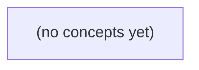

# 可验证需求：把即时消息规则写成可检查的约定

*本书面向掌握基础语法的 Go 初学者，以虚构的本地即时消息校验场景为线索，学习如何把“支持正常聊天消息、限制长度”这样的产品语言推导为可检查、可验收的规则。读者将用标量变量与普通函数完成规则定义、决策表、边界分析、状态承诺、手工验收与变更追溯，而不依赖自动化测试框架。*

**章节:** 2

---

## 本书导览

- 了解整本书的章节脉络
- 掌握各章之间的概念依赖关系
- 选择最合适的阅读顺序

# 可验证需求：把即时消息规则写成可检查的约定

本书面向掌握基础语法的 Go 初学者，以虚构的本地即时消息校验场景为线索，学习如何把“支持正常聊天消息、限制长度”这样的产品语言推导为可检查、可验收的规则。读者将用标量变量与普通函数完成规则定义、决策表、边界分析、状态承诺、手工验收与变更追溯，而不依赖自动化测试框架。

下方的概念图展示了本书 0 个核心概念以及它们之间的依赖关系；再下方是 1 个章节的入口。你可以按从上到下的顺序阅读，也可以根据自己的兴趣或先验知识选择切入点。

#### 概念图



## 章节索引

- **10.01 可验证需求：把 IM 消息规则写成可检查的约定** — 仅依赖基础Go的IM需求推导：从歧义澄清到输入输出状态、契约、决策表、边界、失败承诺和独立验收证据。

## 10.01 可验证需求：把 IM 消息规则写成可检查的约定

- 需求从一句话变成可检查的约定
- 输入、输出、状态与一次处理的边界
- 决策表：把分支条件组合讲清
- 等价类、边界与反例怎样选
- 失败承诺与IM消息状态
- 从约定到普通Go函数与手工核对
- 验收证据、变更追溯与分层练习

一句“支持发送正常聊天消息，限制长度”看似明确，实际隐藏了输入、边界和成功含义等多个待确认问题。

### 从产品目标找出歧义

### 从产品目标找出歧义

“支持发送正常聊天消息，限制长度”是**产品目标**：它描述希望用户获得什么能力，但还不能直接写成可靠的判断条件。

**可检查规则**则要把每个判断说清楚，使不同人面对同一输入时得到同一结论。例如：

- 用户是谁：只讨论虚构用户 `u-a` 向 `u-b` 发消息，还是群聊也可以？
- “正常”是什么意思：空文本算不算？只含空格算不算？
- “长度”如何计算：按字符数还是按 UTF-8 字节数？例如 `len("你好")=6`，不是 `2`。
- 上限是否包含边界：最大 `10` 字节时，长度恰好 `10` 能否通过？
- 校验成功承诺什么：只是**本地校验通过**，还是已经发送、持久化、送达？本节不实现网络，因此不能承诺后几者。

可以先把原话拆成待澄清表：

| 原始说法 | 歧义 | 需要写成的规则 |
|---|---|---|
| 发送消息 | 会话类型有哪些 | 仅允许 `single` 或 `group` |
| 正常消息 | 空文本如何处理 | 原始字节数必须大于 `0` |
| 限制长度 | 计量单位和边界 | 使用 `len(body)`，且不超过上限 |
| 发送成功 | 成功的证据是什么 | 只表示本地校验通过 |

这里的“原始”很重要：不默认去掉首尾空格。`" "` 的字节数是 `1`，因此它不是空文本；是否拒绝空白文本必须成为另一条明确规则，不能悄悄加入。

例如，若上限为 `6` 字节，`"你好"` 可以通过，`"你好啊"` 不能通过；`""` 不能通过。它们是根据约定推导出的**预期结果**，不是程序已经运行得到的真实证据。

需求是期望行为与约束；规格是把它们明确记录下来；验收是用运行证据对照规格。不要看到现有代码只检查了长度，就反推“产品一定不关心会话类型”：代码可能遗漏了需求，也可能实现错了。

### 定义输入、状态与结果

### 定义输入、状态与结果

要把“能否发送”写成可检查的约定，先要明确：校验函数能观察什么，又允许改变什么。

**输入**是本次判断直接使用的值：

- 用户：教学中使用 `u-a`、`u-b`，它们表示本地已知的用户标识。
- 会话类型 `kind`：只允许 `single`（单聊）或 `group`（群聊）。
- 消息正文 `body`：原始文本，不自动删除首尾空格。
- 长度上限 `maxBytes`：按字节计数，且必须大于 `0`。

这里的“空”是 `len(body) == 0`。例如：

```go
len("")     // 0：空文本
len(" ")    // 1：不是空文本
len("你好") // 6：UTF-8 中每个汉字通常占 3 字节
```

因此，若 `maxBytes == 6`，`"你好"`可以通过；若上限是 `5`，则不能通过。规则检查的是字节，不是人眼看到的字符个数。

**状态**是校验前后需要观察的本地值：

- `draft`：当前草稿文本；
- `acceptedCount`：本地校验通过的消息次数；
- `lastAccepted`：最近一次本地校验通过的正文。

**结果**至少分为两类：本地校验通过或失败。通过时，`acceptedCount` 增加 `1`，`lastAccepted` 更新为本次 `body`；失败时，三个状态都不改变，尤其不能清空 `draft`。

可把判断写成普通函数的返回结果：

```go
func canAccept(kind string, body string, maxBytes int) bool {
	return maxBytes > 0 &&
		(kind == "single" || kind == "group") &&
		len(body) > 0 &&
		len(body) <= maxBytes
}
```

反例是把“通过”理解为“已发送”：这个函数没有网络、服务器或数据库，返回 `true` 只能证明输入满足本地约定。它是**预期规则的检查结果**，不是消息真实送达的证据。

### 写出版本v1的消息契约

### 写出版本v1的消息契约

**消息契约**是对一次本地提交“应当接受什么、拒绝什么、接受后改变什么”的明确约定。它不是“支持正常聊天”的口号，而是能逐项检查的规则。

版本v1只处理本地文本消息，设输入为会话种类`kind`、消息正文`body`和长度上限`maxBytes`。其中，`body`按**原始字节**检查：不自动删除空格、换行或其他字符。

| 项目 | v1约定 |
|---|---|
| 上限 | `maxBytes > 0` |
| 会话种类 | 只能是`single`或`group` |
| 正文非空 | `len(body) > 0` |
| 长度限制 | `len(body) <= maxBytes` |
| 接受后的变化 | `acceptedCount`加1，`lastAccepted`变为`body` |
| 失败承诺 | `draft`、`acceptedCount`、`lastAccepted`都不改变 |

这里的**前置条件**，是本地校验通过前必须满足的条件。任一条件不满足，就应拒绝；拒绝并不表示消息发送失败，因为v1根本不实现网络发送。

例如，`maxBytes=6`时：

- `kind="single"`、`body="你好"`：`len("你好")=6`，满足边界，**本地校验通过**。
- `kind="group"`、`body=""`：字节数为0，拒绝。
- `body="   "`：字节数不是0，v1不去空格，因此可以通过。
- `body="你好啊"`：长度为9，超过上限，拒绝。
- `kind="channel"`：不是约定种类，拒绝。

“`<=`”尤其重要：上限是允许的最大值，不是必须小于的值。若以后产品改为“空白消息也拒绝”，应新增明确规则，而不能偷偷把`"   "`当作空文本。

`acceptedCount`只记录本地校验通过的次数；`lastAccepted`只保存最近一次通过的原始正文。失败时保持原值，能避免一次无效输入抹掉用户草稿或污染已有记录。这些是**预期结果**；真实运行时是否确实保持不变，还需要之后用程序运行证据验证，不能从现有代码的写法反推需求。

### 用决策表覆盖边界

### 用决策表覆盖边界

**决策表**是把“输入条件”与“预期结果”逐行写清的表。它的作用不是证明程序已经正确运行，而是先固定判断依据：以后无论人工检查还是编写代码，都应以这些预期为准。

教学版 v1 约定：

- `maxBytes` 必须大于 `0`。
- 会话种类只能是 `single` 或 `group`。
- `body` 按原始字节检查：`len(body) != 0` 且 `len(body) <= maxBytes`。
- 不自动删除空格；因此空白文本不是空文本。
- 只有本地校验通过，才使 `acceptedCount` 增加，`lastAccepted` 更新为当前文本；失败时三者都不变。

设初始状态为：`draft` 为用户当前输入，`acceptedCount=2`，`lastAccepted="上一条"`，且 `maxBytes=6`。

| 会话种类 | 文本 `body` | 字节长度 | 预期本地校验 | 预期状态 |
|---|---:|---:|---|---|
| `single` | `"hello"` | 5 | 通过 | 计数变为 3，记录 `"hello"` |
| `group` | `"你好"` | 6 | 通过 | 计数变为 3，记录 `"你好"` |
| `single` | `"你好！"` | 9 | 失败，超过上限 | 仍为原状态 |
| `group` | `""` | 0 | 失败，文本为空 | 仍为原状态 |
| `single` | `"   "` | 3 | 通过 | 计数变为 3，记录三个空格 |
| `other` | `"hi"` | 2 | 失败，会话非法 | 仍为原状态 |

这里的关键边界是“等于上限”：`"你好"` 的 `len("你好")=6`，恰好等于 `maxBytes`，所以应通过；若规则写成 `< maxBytes`，它就会错误失败。

反例是把“看起来为空”当作空文本。`"   "` 虽然没有可见内容，但原始字节数为 3；v1 没有“去除首尾空格”的规则，因此不能擅自拒绝。若产品后来要求空白也失败，必须新增“去空白后不能为空”的明确规格，并相应修改表中的预期。

### 建立独立验收证据

### 建立独立验收证据

**验收**是把真实运行得到的结果，与规格预先写明的预期结果逐项对照。这里的关键是：预期不能从“程序现在恰好怎么做”反推，而应来自版本 v1 的约定。否则，程序把超长消息误判为通过时，验收也会跟着误判。

本节的本地证据由两部分组成：

1. 普通函数的返回值：这次草稿是否本地校验通过。
2. 调用前后的状态：`draft`、`acceptedCount`、`lastAccepted` 是否按规则变化。

例如，先约定：`maxBytes=6`，会话种类为 `single`，初始状态为：

```go
draft := "你好"
acceptedCount := 2
lastAccepted := "上一条"
```

调用校验函数后，`"你好"` 的 `len` 为 6，满足“原始字节非空且不超过上限”。预期证据应是：

- 返回 `true`；
- `acceptedCount` 从 2 变为 3；
- `lastAccepted` 变为 `"你好"`；
- `draft` 仍是 `"你好"`。

反例是草稿 `"你好！"`：`len("你好！")=9`，超过 6。预期不是“程序尽量截断后接受”，因为 v1 没有截断规则；预期应为：

- 返回 `false`；
- `draft` 保持 `"你好！"`；
- `acceptedCount` 仍为 2；
- `lastAccepted` 仍为 `"上一条"`。

可以把对照写成普通函数，返回多个可复核的值：

```go
// 放在 main 函数外：这里只表达本地校验结果，不表示消息已发送。
func acceptLocal(kind string, body string, maxBytes int,
	draft string, acceptedCount int, lastAccepted string,
) (bool, string, int, string) {
	if maxBytes <= 0 || (kind != "single" && kind != "group") {
		return false, draft, acceptedCount, lastAccepted
	}
	if len(body) == 0 || len(body) > maxBytes {
		return false, draft, acceptedCount, lastAccepted
	}
	return true, draft, acceptedCount + 1, body
}
```

这里“通过”只意味着**本地校验通过**。返回值和前后状态是运行证据；“超长应失败、失败不改状态”则是规格提供的预期依据。两者分开，需求变更时才能明确知道该改规格、例子，还是程序。

> **要点** — 可验证需求必须明确输入、判定条件、边界、状态变化与失败不变项，并以规格导出预期证据。

先把“一条消息能不能接受”拆成可观察的输入、输出与状态变化，才能让需求从口头描述变成可逐项检查的约定。

### 划定一次本地校验的边界

### 划定一次本地校验的边界

一次**本地校验**，是程序只根据当前给出的数据，在本机判断“这条消息是否允许被接受”的过程；它不连接网络，也不证明消息真的到达任何人。

本节处理的对象可固定为：

- `kind string`：会话类型，只允许 `"single"` 或 `"group"`。
- `body string`：本地文本消息正文；空消息指 `len(body)==0`，不自动删除空格。注意 `len("你好")==6`。
- `maxBytes int`：允许的最大字节数。
- 状态：`draft string`、`lastAccepted string`、`acceptedCount int`。

校验函数的输出是：

```go
ok, reason := validate(kind, body, maxBytes)
```

其中 `ok` 表示是否**本地校验通过**；`reason` 说明原因，例如“正文为空”“会话类型不支持”“最大字节数非法”。`maxBytes` 即使是负数或 `0`，函数也必须返回结果；本章选择“拒绝结果”而不是把它排除在函数输入域之外。

观察点是调用前后的可见值。例如调用前：

```text
draft="你好"
lastAccepted="旧消息"
acceptedCount=3
```

若校验成功，约定调用后 `lastAccepted` 更新为 `draft`，`acceptedCount` 加 `1`；若失败，这三个业务状态保持不变。计数限定在 `0..9`：只有当前小于 `9` 才能成功递增，使结果最多为 `10`，避免继续增长。

这不是“发送消息”。本节不承诺已发送、已持久化、已送达或已读；日志是否输出也不属于业务状态变化。失败不改 `lastAccepted`，仍然可以记录一条失败日志。

反例：把“输入必须合法”当作前提，会让空正文、未知 `kind`、负数 `maxBytes` 无法被验证。更可检查的约定是：**任意这些输入都得到 `ok` 和 `reason`，且失败不改变业务状态。**

### 用固定输入描述消息规则

### 用固定输入描述消息规则

先把“消息是否可接受”写成一个普通函数的输入与输出：

`校验(kind, body, maxBytes) -> ok, reason`

其中，`kind` 是会话类型，只允许 `"single"` 或 `"group"`；`body` 是本地文本消息；`maxBytes` 是允许的最大字节数。`ok` 表示本地校验是否通过，`reason` 说明拒绝原因。这里不发送网络请求，也不证明消息已送达。

教学约定可以明确写成：

1. `maxBytes` 必须在 `0..9`。这是配置合法性条件。
2. `body` 的字节数必须大于 `0`。空消息指 `len(body)==0`，不自动去掉空格。
3. `len(body)` 必须不大于 `maxBytes`。
4. `kind` 必须是允许的会话类型。

因此，校验顺序可固定为：先检查配置，再检查会话类型，再检查消息内容。这样每个失败结果都有稳定原因。

```go
// 放在普通函数位置
func 校验(kind string, body string, maxBytes int) (bool, string) {
	if maxBytes < 0 || maxBytes > 9 {
		return false, "最大字节数配置非法"
	}
	if kind != "single" && kind != "group" {
		return false, "会话类型非法"
	}
	if len(body) == 0 {
		return false, "消息不能为空"
	}
	if len(body) > maxBytes {
		return false, "消息超过字节上限"
	}
	return true, "本地校验通过"
}
```

例如 `校验("single", "hi", 2)` 通过；`校验("group", "", 9)` 因空消息拒绝。注意，`"你好"` 不是两个字节，而是 `len("你好")==6`：若 `maxBytes` 为 `5`，必须拒绝。

反例是只写“消息不要太长”。“太长”没有单位、边界和配置范围，无法检查；而 `len(body) <= maxBytes` 给出了可运行的条件。即使调用者传入 `maxBytes=-1`，本章也不把它排除在函数输入域外，而是返回“配置非法”，从而保留对负面输入的验证能力。

### 把校验结果写成双返回值契约

### 把校验结果写成双返回值契约

**双返回值契约**指：校验函数一次返回两个结果——`ok` 表示是否本地校验通过，`reason` 表示通过或拒绝的可读原因。

```go
// 放在 main 函数外
func validate(kind string, body string, maxBytes int) (bool, string) {
	if maxBytes < 0 {
		return false, "最大字节数配置非法"
	}
	if kind != "single" && kind != "group" {
		return false, "会话类型非法"
	}
	if len(body) == 0 {
		return false, "消息正文为空"
	}
	if len(body) > maxBytes {
		return false, "消息超过字节上限"
	}
	return true, "本地校验通过"
}
```

这里的输入是 `kind`、`body`、`maxBytes`；输出是 `ok` 与 `reason`。例如：

```go
ok, reason := validate("single", "你好", 6)
// 预期：ok 为 true，reason 为“本地校验通过”
```

`len("你好")` 是 `6`，因此上限为 `5` 时应拒绝。空消息只指字节数为 `0`：`"   "` 有 3 个字节，不因空格自动视为空。

本章选择：即使 `maxBytes` 是负数，函数也必须返回结果，而不是把“配置必须合法”藏成调用者前置条件。这样负面输入同样可检查：

```go
ok, reason := validate("group", "hi", -1)
// 预期：false，“最大字节数配置非法”
```

预期结果是纸面上的约定；真实运行证据则是实际调用后观察到的 `ok`、`reason`。`ok == false` 只说明本地拒绝，不表示消息已发送、持久化或送达。拒绝后业务状态可以保持不变，但程序仍可另行记录日志；“状态未变”不等于“没有任何输出”。

### 用纸面前后状态约束成功与失败

### 用纸面前后状态约束成功与失败

**状态**是一次校验结束后仍要保留的信息。本节先不用结构体，而是把教学会话的状态写成三个变量：

- `draft string`：当前正在编辑的文本；
- `lastAccepted string`：最近一次本地校验通过的文本；
- `acceptedCount int`：已经接受的消息数，教学上只允许 `0..9`。

一次操作的 **before（操作前）** 与 **after（操作后）** 可以先写在纸面上。设输入为 `kind`、`body`、`maxBytes`，输出为 `ok` 和 `reason`。当 `kind` 合法、`body` 非空且 `len(body) <= maxBytes`，并且 `acceptedCount < 9` 时，操作成功：

| 项目 | before | after |
|---|---:|---:|
| `draft` | `"你好"` | `"你好"` |
| `lastAccepted` | `"上一条"` | `"你好"` |
| `acceptedCount` | `8` | `9` |
| 返回值 | — | `ok=true`，`reason=""` |

这里的**后置条件**是：成功后 `lastAccepted == body`，并且计数加一。由于最大可接受次数是 10 次，计数从 `0` 到 `9`，最后一次成功会把 `9` 变成 `10`；因此更准确的不变量应为 `0 <= acceptedCount && acceptedCount <= 10`，但只有 `acceptedCount < 10` 才允许继续成功。

失败也必须写清 before/after。例如 `body == ""`，注意空是字节数为 0，不是“去掉空格后为空”：

| 项目 | before | after |
|---|---:|---:|
| `draft` | `""` | `""` |
| `lastAccepted` | `"上一条"` | `"上一条"` |
| `acceptedCount` | `3` | `3` |
| 返回值 | — | `ok=false`，`reason="消息不能为空"` |

这条约定叫作：**失败不改变业务状态**。它不表示程序绝对没有任何动作；例如未来可以记录日志，但日志不应偷偷改写 `lastAccepted` 或计数。

配置 `maxBytes` 也可能非法，如 `maxBytes <= 0`。本章选择让总校验函数对所有 `int` 都返回结果，而不是把非法配置排除在函数输入之外：返回 `ok=false`、`reason="长度上限必须大于0"`，业务状态保持不变。这样负面情况同样可检查。

反例是失败后仍执行 `acceptedCount = acceptedCount + 1`：用户虽然没有获得“本地校验通过”，却消耗了一次额度，违反了上述 before/after 表。

### 从前后条件导出独立验收项

### 从前后条件导出独立验收项

**前置条件**是调用前必须说明的环境限制。本章选择：`maxBytes` 即使是负数或 0，校验函数也必须返回结果，不能把“配置必须合法”推给调用者。因此，非法配置也是可验收输入。

**后置条件**是函数完成后的承诺。例如：

```go
// 放在普通函数位置
func validate(kind string, body string, maxBytes int) (ok bool, reason string) {
	if maxBytes <= 0 {
		return false, "最大字节数配置非法"
	}
	if kind != "single" && kind != "group" {
		return false, "会话类型非法"
	}
	if len(body) == 0 {
		return false, "消息为空"
	}
	if len(body) > maxBytes {
		return false, "消息超过字节上限"
	}
	return true, "本地校验通过"
}
```

这里的输入是 `kind`、`body`、`maxBytes`；输出是 `ok` 与 `reason`。验收不能只检查“成功了没有”，还要检查失败原因是否对应规则。

**不变量**是在每个允许操作前后都持续成立的约定。草稿状态可写为：

- `draft`：当前编辑中的文本；
- `lastAccepted`：最近一次本地校验通过的文本；
- `acceptedCount`：已接受次数，始终满足 $0 \le acceptedCount \le 9$。

成功时，若 `acceptedCount < 9`，才允许令它加 1；失败时，三个业务状态都保持不变。注意：失败不改变业务状态，不代表程序绝不能输出日志；这里只验收业务变量。

可从约定导出彼此独立的验收项：

| 检查案例 | 输入或操作 | 预期结果 | 状态前后 |
|---|---|---|---|
| 正常单聊 | `"single"`、`"hi"`、`10` | 通过 | `lastAccepted` 更新为 `"hi"`，计数加 1 |
| 中文字节边界 | `"group"`、`"你好"`、`6` | 通过，因为 `len("你好")==6` | 成功更新 |
| 超出边界 | `"group"`、`"你好"`、`5` | 拒绝，超过上限 | 状态不变 |
| 空文本 | `"single"`、`""`、`10` | 拒绝，消息为空 | 状态不变 |
| 非法类型 | `"other"`、`"hi"`、`10` | 拒绝，会话类型非法 | 状态不变 |
| 非法配置 | `"single"`、`"hi"`、`0` | 拒绝，配置非法 | 状态不变 |
| 计数上限 | `acceptedCount==9` 时再提交合法文本 | 拒绝或不执行接受操作 | 计数仍为 9 |

最后一项提醒我们：输入文本合法，不必然意味着整个操作都能成功；状态上限同样是验收条件。以上都是**预期结果**。只有实际运行并观察到返回值和变量前后值，才构成真实运行证据。

> **要点** — 可验证需求要同时写清输入、返回结果、状态前后变化、失败承诺和可观察证据。

决策表把零散的消息校验条件整理为互斥且穷尽的规则，使每个输入都能得到可检查的预期结果。

### 先定义决策表：条件、结果与规则行

### 先定义决策表：条件、结果与规则行

**决策表**是一张把“什么输入会得到什么结果”写清楚的表。它不先写 `if`，而是先规定可检查的约定：给定配置、会话类型和文本，预期应当通过，还是因哪一种原因被拒绝。

表中的**条件行**描述需要判断的事实，例如：

- `max`：允许的最大字节数是否有效；
- `kind`：会话类型是否为 `single` 或 `group`；
- `text`：文本字节数是否为 0；
- `len(text)`：文本是否超过 `max`。

表中的**结果列**写这组条件对应的唯一预期。例如“配置错误”“会话错误”“空消息错误”“超长错误”“本地校验通过”。这里的“通过”只表示本地规则接受，不能推断消息已经发送、保存或送达。

可以采用“一行一条规则”的写法。`—` 表示该条件在此前条件成立后已不影响本次结果，不是说任意值都合法。

| 规则行 | `max`有效 | `kind`有效 | 文本为空 | 文本超长 | 预期结果 |
|---|---|---|---|---|---|
| 1 | 否 | — | — | — | 配置错误 |
| 2 | 是 | 否 | — | — | 会话错误 |
| 3 | 是 | 是 | 是 | — | 空消息错误 |
| 4 | 是 | 是 | 否 | 是 | 超长错误 |
| 5 | 是 | 是 | 否 | 否 | 本地校验通过 |

例如 `max=0`、`kind="unknown"`、`text=""` 同时有多个问题，仍匹配第 1 行：第一原因是配置错误。这个优先序是产品约定，不能因为代码恰好先检查了某个 `if`，就反过来把它当作需求。

“空”指 `len(text)==0`，不自动去掉空格；`" "` 不是空文本。长度按字节计算，因此 `len("你好")==6`。会话类型还应大小写敏感：`"group"` 有效，`"GROUP"` 无效。决策表先固定这些边界，代码才有可逐项核对的依据。

### 确定固定优先序：先报告哪一个问题

### 确定固定优先序：先报告哪一个问题

**固定优先序**指：一条消息同时有多个问题时，系统按预先写明的顺序，只报告最先检查到的一个问题。本节采用教学设定的顺序：

1. 配置错误  
2. 会话类型错误  
3. 空消息  
4. 超长消息  
5. 本地校验通过  

这里的“第一”是**产品规则**，不是 Go 的 `if` 恰好写在前面就自然成立。先确定规则，再让代码按规则排列。

设 `max` 是允许的最大字节数，`kind` 是会话类型，只有 `single` 和 `group` 合法；消息内容为 `text`。可先写成一行一条规则：

| 优先序 | 条件 | 预期结果 |
|---|---|---|
| 1 | `max <= 0` | 配置错误 |
| 2 | `max > 0` 且 `kind` 不是 `single`、`group` | 会话类型错误 |
| 3 | 前两项合法，且 `len(text) == 0` | 消息不能为空 |
| 4 | 前三项不成立，且 `len(text) > max` | 消息过长 |
| 5 | 前四项不成立 | 本地校验通过 |

表中的“前两项合法”不是说任意值都合法，而是说：只有更高优先级的问题不存在，当前条件才有资格决定结果。

例如：

- `max == 0`、`kind == "unknown"`、`text == ""`：返回“配置错误”。虽然会话和消息也有问题，但配置先阻止后续判断。
- `max == 5`、`kind == "GROUP"`、`text == ""`：返回“会话类型错误”。`GROUP` 与 `group` 不同；本规则大小写敏感。
- `max == 5`、`kind == "single"`、`text == ""`：返回“消息不能为空”。
- `max == 5`、`kind == "group"`、`text == "你好"`：`len("你好") == 6`，返回“消息过长”。

“消息不能为空”和“消息过长”属于业务拒绝原因；对外显示的中文文案应保持稳定，但文案本身不等于真实运行证据。调用规则函数得到某个结果，才能说明该输入的**本地校验结果**；不能据此称消息已发送或送达。

练习：当 `max == 0`、`kind == "GROUP"`、`text == "你好"` 时，预期应是配置错误。若你的答案是超长，说明你按“最显眼的问题”判断，而没有遵守固定优先序。

### 写出五行互斥穷尽的消息校验表

### 写出五行互斥穷尽的消息校验表

**决策表**是把输入条件与预期结果逐行对应的表。这里讨论 `u-a` 向 `u-b` 发送本地文本消息；函数只做本地校验，结果只能说“本地校验通过”或“本地校验拒绝”。

先固定条件：`max` 是允许的最大字节数，`kind` 是会话类型，只接受精确小写的 `single` 或 `group`；文本空指 `len(text)==0`，不去除空格。检查优先序规定为：配置、会话、空、超长、成功。

| 行 | `max > 0` | `kind` 合法 | `len(text)==0` | `len(text)>max` | 预期结果 |
|---|---:|---:|---:|---:|---|
| 1 | 否 | — | — | — | 配置错误 |
| 2 | 是 | 否 | — | — | 会话类型错误 |
| 3 | 是 | 是 | 是 | — | 文本不能为空 |
| 4 | 是 | 是 | 否 | 是 | 文本超长 |
| 5 | 是 | 是 | 否 | 否 | 本地校验通过 |

表中的 `—` 不是“任意值都合法”，而是“前面的条件已经决定本次结果，后面的条件不再影响结果”。例如 `max==0`、`kind=="unknown"`、文本为空同时出现时，仍命中第 1 行，原因是配置错误。

五行互斥：任意一次输入只能命中一行；五行穷尽：任何 `max`、`kind`、文本长度组合都能命中一行。`group` 合法，但 `GROUP` 不合法，因为字符串比较区分大小写。

反例：若先检查空文本，再检查 `max<=0`，同一输入可能返回“文本不能为空”。这不是产品规则自然产生的结论，而是错误的 `if` 顺序改变了对外文案。应先写表，再按表实现。

### 用边界与大小写例子检验规则表

### 用边界与大小写例子检验规则表

**边界**是条件刚好取到临界值的情况，例如最大字节数 `max` 为 `0`，或文本长度恰好等于 `max`。边界例子最容易暴露规则表中的模糊表达。

先约定本地文本消息的检查优先序：**配置、会话、空、超长、成功**。其中 `single` 和 `group` 是合法会话类型；其他字符串，例如 `unknown`，都不是合法类型。文本长度使用 `len` 计算**字节数**，不是字符数；空只表示 `len(text)==0`，不自动去掉空格。

| 优先检查到的条件 | `max` | `kind` | `text` | 预期结果 |
|---|---:|---|---|---|
| 配置无效 | `0` 或更小 | — | — | 配置错误 |
| 会话无效 | 大于 `0` | 非 `single`、非 `group` | — | 会话错误 |
| 文本为空 | 大于 `0` | `single` 或 `group` | `""` | 空文本错误 |
| 文本超长 | 大于 `0` | `single` 或 `group` | `len(text)>max` | 超长错误 |
| 其余情况 | 大于 `0` | `single` 或 `group` | `1<=len(text)<=max` | 本地校验通过 |

表中的 `—` 不表示“任意值都合法”。它表示：例如 `max==0` 时，规则已经确定为配置错误，`kind` 和 `text` 不再影响**本次**结果。

用几个输入检验表：

- `max=0, kind="unknown", text=""`：同时存在多个问题，但首先命中配置无效，结果是配置错误。
- `max=3, kind="unknown", text=""`：配置有效，接着发现会话无效，结果是会话错误。
- `max=3, kind="group", text=""`：结果是空文本错误。
- `max=3, kind="group", text="你好"`：`len("你好")==6`，所以是超长错误，不是长度为 `2`。
- `max=3, kind="GROUP", text="a"`：`GROUP` 不等于 `group`。本教学规则区分大小写，因此结果是会话错误。

这里的“第一原因”必须先写入产品规则，再由代码按规则实现；不能看到 `if` 的先后顺序，才反过来宣称那就是规范。业务拒绝原因可以较稳定，例如“超长”；对外展示文案则可能改为“消息不能超过 3 字节”。两者相关，但不应把文案变化误认为规则变化。

### 从规则表到纯函数验收约定

### 从规则表到纯函数验收约定

先把规则写成决策表，再把表翻译成函数。**决策表**是一组条件与结果：条件说明输入处于什么状态，结果说明本地校验应给出什么结论。这里固定优先序为：配置、会话、空、超长、成功。

| 行 | `max` 合法 | `kind` 合法 | 文本为空 | 超长 | 预期结果 |
|---|---|---|---|---|---|
| 1 | 否 | — | — | — | 配置错误 |
| 2 | 是 | 否 | — | — | 会话错误 |
| 3 | 是 | 是 | 是 | — | 空消息错误 |
| 4 | 是 | 是 | 否 | 是 | 超长错误 |
| 5 | 是 | 是 | 否 | 否 | 本地校验通过 |

`—` 不是“任意值都合法”，而是前面的条件已经决定本次结果，后续条件不再影响结果。例如 `max=0`、`kind="unknown"`、文本为空时，结果必须是配置错误；不能因为文本为空而改报空消息错误。

```go
// 放在 main 函数外：纯规则函数
func checkMessage(kind string, text string, max int) string {
	if max <= 0 {
		return "配置错误"
	}
	if kind != "single" && kind != "group" {
		return "会话错误"
	}
	if len(text) == 0 {
		return "消息不能为空"
	}
	if len(text) > max {
		return "消息过长"
	}
	return "本地校验通过"
}
```

这是**纯函数**：相同输入总得到相同输出；它不联网、不保存消息，也不改变外部状态。因此，`checkMessage("group", "你好", 6)` 的预期结果是“本地校验通过”，但这只是规则推导出的**预期结果**。只有实际运行程序并看到返回值，才是**真实运行证据**。

“超长错误”是业务拒绝原因；`"消息过长"`则是对外错误文案。前者可用于内部判断，后者应保持稳定，避免调用方依赖的文字随意变化。`"group"` 合法，但 `"GROUP"` 不合法：字符串比较区分大小写。

练习：推导 `checkMessage("single", "", 0)` 的结果。应为“配置错误”，因为优先序来自产品约定，不是从 `if` 的书写顺序自然产生的；若规范改为先检查空消息，决策表、示例和函数都必须一起修改。

> **要点** — 决策表不是排列if顺序，而是先约定优先级、覆盖范围和稳定结果，再据此实现与验收。

本节把“挑几个消息试试”变成可解释的选例方法：按规则划分类别、锁定边界，并用反例识别看似合理却错误的断言。

### 等价类：按规则划分预期结果

### 等价类：按规则划分预期结果

**等价类**是指：按照当前规则，应该得到同一种预期结果类别的一组输入。这里的“同一种”不是说输入完全相同，而是说它们触发的规则相同，例如都应“本地校验通过”，或都因同一原因失败。

设本地文本消息规则为：

- 会话类型只能是 `single` 或 `group`；
- 内容字节长度必须为 `1` 到 `max`；
- 长度用 `len` 计算，不去除空格；
- `max` 是配置值，且必须至少为 `1`。

当 `max=6` 时，可按规则划分类别：

| 类别 | 代表输入 | 预期结果 |
|---|---|---|
| 合法单聊短文本 | `single`，`"a"`，长度 1 | 本地校验通过 |
| 合法群聊上限文本 | `group`，`"你好"`，长度 6 | 本地校验通过 |
| 空内容 | `single`，`""`，长度 0 | `empty` |
| 超长内容 | `group`，`"你好呀"`，长度 9 | `too_long` |
| 未知会话类型 | `unknown`，`"a"` | `invalid_session_type` |

例如 `"abcde"` 与 `"你好"` 内容不同，但在 `max=6` 下长度分别为 5 和 6，且会话类型都合法、内容都非空、都不超长，因此属于“合法内容”这一等价类，预期都应本地校验通过。

反过来，`""` 与 `" "` 不能归为同类：前者长度为 0，后者长度为 1。规则没有要求去空格，所以空格消息是合法内容。若把它们都断言为 `empty`，就是擅自增加了需求。

等价类帮助我们减少机械枚举：不必先试所有文本，而是为每种**结果原因**选择代表输入。但抽样通过只说明这些代表输入符合预期，不能证明该类中所有输入都安全；例如只测 `"abc"` 通过，不能证明错误实现 `len(content) >= max` 也正确，因为它会在长度恰好为 6 的 `"你好"` 上失败。

### 长度边界：围绕 0、1 与上限取样

### 长度边界：围绕 0、1 与上限取样

**边界**是规则从“允许”变为“拒绝”的临界位置。若本地文本消息要求：

- 文本字节长度不能为 `0`；
- 字节长度不能超过配置上限 `max`；

则长度规则可写成：

$$1 \le len(text) \le max$$

这里的“长度”是 Go 的 `len(text)` 返回的**字节数**，不是肉眼看到的字符个数。例如 `len("你好")=6`，因为每个汉字通常占 3 个 UTF-8 字节；`len(" ")=1`，空格不是空文本。

从规则两端推导取样点：

| 位置 | 长度 | 预期 |
|---|---:|---|
| 下限外 | `0` | 拒绝：`empty` |
| 下限 | `1` | 通过 |
| 上限前 | `max-1` | 通过（仅当 `max>1`） |
| 上限 | `max` | 通过 |
| 上限外 | `max+1` | 拒绝：`too_long` |

例如 `max=6` 时，可选本地文本如下：

| 长度类别 | 文本 | 字节长度 | 预期原因 |
|---|---|---:|---|
| `0` | `""` | 0 | `empty` |
| `1` | `" "` | 1 | 通过 |
| `max-1` | `"abcde"` | 5 | 通过 |
| `max` | `"你好"` | 6 | 通过 |
| `max+1` | `"x你好"` | 7 | `too_long` |
| 超上限 | `"你好呀"` | 9 | `too_long` |

当 `min=max=1`，下限与上限恰好重合：长度 `1` 同时是“最短允许值”和“最长允许值”。此时不必重复写两条相同案例，只保留一次长度 `1`；仍需保留 `0` 与 `2`，检查两侧拒绝：

```go
// 位置：长度校验函数内部
if len(text) == 0 {
	return false, "empty"
}
if len(text) > max {
	return false, "too_long"
}
return true, ""
```

反例能击穿看似合理的错误实现。若误写为 `len(text) >= max`，则 `"你好"` 在 `max=6` 时会被拒绝；但它恰好位于允许上限，正确预期应为本地校验通过。若按“字符数”判断，可能以为 `"你好"` 长度为 `2`，却忽略其字节长度为 `6`；在 `max=5` 时，它必须因 `too_long` 被拒绝。

这些样例只说明每个长度类别的**预期结果类别**，不证明所有同类文本都已安全处理。抽样通过是规则检查的证据，不是“所有输入都没问题”的证明。

### 字节不是字符：中文、空格与混合文本

### 字节不是字符：中文、空格与混合文本

**字节长度**是字符串在 UTF-8 编码后占用的字节数；Go 的 `len(s)` 返回的正是字节数，不是“看起来有几个字”。本教学规则据此判断文本长度，因此不能把中文、空格和 ASCII 字符一概按一个单位计算。

例如：

| 文本 | `len` 结果 | 说明 |
|---|---:|---|
| `""` | 0 | 空串，字节数为 0 |
| `" "` | 1 | 一个空格也是一个字节，不自动去空格 |
| `"a"` | 1 | ASCII 字符占 1 字节 |
| `"hello"` | 5 | 5 个 ASCII 字符，共 5 字节 |
| `"你好"` | 6 | 每个中文 UTF-8 字符占 3 字节 |
| `"你好呀"` | 9 | 3 个中文，共 9 字节 |
| `"x你好"` | 7 | `x` 的 1 字节加中文的 6 字节 |

若最大长度 `max` 为 6，则 `"hello"`、`"你好"` 和 `" "` 都在长度规则内；`"x你好"` 与 `"你好呀"` 都超出上限。它们视觉上的“字符个数”不同，却可能属于同一结果类别：本地校验不通过，原因是文本过长。

```go
// 放在本地文本长度判断的位置
if len(text) > max {
	return false, "文本过长"
}
```

一个常见但错误的实现是“按字符数判断”。例如有人认为 `"你好"` 只有 2 个字符，在 `max == 5` 时应通过；但规则检查的是 `len("你好") == 6`，预期应为“文本过长”。这个反例推翻了“字符数不超过上限就一定通过”的过强断言。

还要区分空串与空格：`""` 的长度是 0，`" "` 的长度是 1。若规则只禁止空串，空格文本不能因为“看起来空”而被拒绝；是否去除首尾空格必须另有明确规则，不能自行补充。

### 反例与组合：一因子变化不能代替失败组合

### 反例与组合：一因子变化不能代替失败组合

**反例**是能推翻某个过强说法的具体输入。例如有人写出长度规则：

```go
if len(text) >= limit {
    return false, "文本过长"
}
```

若约定是“长度**不超过** `limit` 才通过”，这段实现把“恰好上限”也拒绝了。取 `limit=6`、`text="你好"`，因为 `len("你好")==6`，预期应为本地校验通过，真实运行却得到“文本过长”。一个反例就足以推翻“这段长度判断正确”的断言；不需要枚举所有文本。

同样，不能把字符个数当成字节数。若 `limit=5`，`"你好"`看起来只有两个字符，但 `len("你好")==6`，预期原因应为“文本过长”。这是对“两个汉字一定短”的反例。

**一因子变化**指每次只改变一个条件，其余条件固定。例如固定 `limit=6`、会话为 `single`：

| 规则ID | 输入 | 预期 reason | 状态 |
|---|---|---|---|
| R1 | `""` | 文本为空 | 待验收 |
| R2 | `" "` | 通过 | 待验收 |
| R3 | `"12345"` | 通过 | 待验收 |
| R4 | `"你好"` | 通过 | 待验收 |
| R5 | `"1234567"` | 文本过长 | 待验收 |
| R6 | `"你好呀"` | 文本过长 | 待验收 |
| R7 | 会话 `GROUP`，文本 `"a"` | 会话类型未知 | 待验收 |
| R8 | 会话 `group`，文本 `""` | 文本为空 | 待验收 |
| R9 | 会话 `GROUP`，文本 `""` | 会话类型未知 | 待验收 |
| R10 | `limit=-1`，文本 `"a"` | 长度上限无效 | 待验收 |
| R11 | `limit=0`，文本 `"a"` | 长度上限无效 | 待验收 |
| R12 | `limit=1`，文本 `"a"` | 通过 | 待验收 |

R7 单独检验未知会话；R8 单独检验空文本。R9 则是**多条件失败组合**：会话未知且文本为空。它不能替代 R7、R8，因为无法只凭 R9 判断两个规则谁错了；但它能确认：当多个条件同时失败时，约定的原因优先级是否稳定。这里预期先报告“会话类型未知”。

抽样通过只说明这些样例与预期一致，不能证明所有输入都安全。单因子样例帮助定位问题，组合样例帮助检查失败规则相遇时的行为；两者互补，不能互相取代。

### 手工验收表：记录预期与运行证据

### 手工验收表：记录预期与运行证据

**验收表**是把需求规则预先写成可检查记录的表格。`预期 reason` 是契约规定的结果原因；`真实运行证据` 是程序实际执行后才可填写的事实，二者不能混写。这里约定：`ok` 表示本地校验通过，`empty` 表示文本字节数为 0，`too_long` 表示超过上限，`invalid_limit` 表示长度配置小于 1，`invalid_target` 表示会话目标不合法。

|规则 ID|输入（类型、目标、文本、上限）|预期 reason|预期状态|真实运行证据|
|---|---|---|---|---|
|R1|single，u-b，`""`，6|empty|失败|未运行|
|R1|single，u-b，`" "`，6|ok|本地校验通过|未运行|
|R1|single，u-b，`"1"`，6|ok|本地校验通过|未运行|
|R2|single，u-b，`"abcde"`，6|ok|本地校验通过|未运行|
|R2|single，u-b，`"abcdef"`，6|ok|本地校验通过|未运行|
|R2|single，u-b，`"abcdefg"`，6|too_long|失败|未运行|
|R2|single，u-b，`"你好"`，6|ok|本地校验通过|未运行|
|R2|single，u-b，`"你好呀"`，6|too_long|失败|未运行|
|R2|single，u-b，`"x你好"`，6|too_long|失败|未运行|
|R3|group，unknown，`"hi"`，6|invalid_target|失败|未运行|
|R4|single，u-b，`"x"`，-1|invalid_limit|失败|未运行|
|R4|single，u-b，`"x"`，0|invalid_limit|失败|未运行|
|R4|single，u-b，`"x"`，1|ok|本地校验通过|未运行|
|R4+R1|single，u-b，`""`，0|invalid_limit|失败|未运行|

表中长度按 `len` 的**字节数**计算：`len("你好")=6`，不是两个字符。上限为 6 时，5、6、7 分别覆盖上限前、恰好上限、超过上限；若错误实现为 `len(text) >= limit`，`"abcdef"` 会立即击穿它。`"你好"` 配置上限 5 则应为 `too_long`，可反驳“按字符数计算”的错误断言。

前 13 行尽量每次只改变一个因素；最后一行同时失败，用于确认规则优先级。上限为 1 时不重复列出空文本等已覆盖类别，因为边界重合不等于新增证据。抽样通过只说明这些类别符合预期，不能证明同类全部输入都安全。

> **要点** — 等价类决定选什么，边界决定选哪里，反例与验收证据决定结论是否可信。

本节把“本地校验通过”限定为可观察、可复查的状态承诺，并明确它不等同于消息已发送或对方已收到。

### 先定义本地校验的承诺边界

### 先定义本地校验的承诺边界

**本地校验**是指：程序只根据当前已经拿到的本地输入和本地状态，判断一条消息是否符合教学规则。它不联网、不请求服务器，也不接触数据库。

例如，用户 `u-a` 在 `single` 会话中编辑本地文本消息：

```go
draft := "你好"
```

若规则要求“消息字节数必须大于 0，且不超过 20 字节”，则：

```go
len(draft) // 6
```

`"你好"` 可以通过本地校验；`""` 的字节数为 0，应被拒绝。注意，本章**不默认去除空格**：`"   "` 的字节数是 3，因此是否允许必须由规则明确决定，不能凭“看起来像空消息”自行改写。

本节把结果限定为两类：

- **本地校验通过**：当前输入符合已写出的规则。程序可以记录它是一次被接受的本地请求。
- **本地校验拒绝**：当前输入违反某条规则。程序只能给出拒绝原因，例如“消息不能为空”。

这两个结果能证明的事实很有限：

| 已知事实 | 不能推出的事实 |
|---|---|
| 本地校验通过 | 服务端已经受理 |
| 服务端受理 | 消息已经持久保存 |
| 持久保存 | `u-b` 的某台设备已经接收 |
| 设备接收 | `u-b` 已读 |
| 发送者没看到回执 | `u-b` 没有收到 |

因此，本章中不得把“本地校验通过”打印成“已发送”“已送达”或“已读”。这些词需要不同的外部证据；而当前程序没有网络、服务端、设备或回执，无法产生那些证据。

还要约定拒绝时的状态承诺：`draft`、`lastAccepted` 和 `acceptedCount` 都不改变，最多打印 `reason`。成功时也**不自动清空** `draft`；除非规则专门写出“成功后清空草稿”。这样，读者可以检查每次运行前后的变量，确认程序确实只承诺了本地校验这一件事。

### 拒绝不改变既有消息状态

### 拒绝不改变既有消息状态

**失败承诺**是指：一次本地校验不通过时，程序除了报告失败原因外，不应把已有的成功结果伪装成新结果，也不应丢失用户正在编辑的内容。

这里约定三个本地状态：

- `draft`：当前输入框中的草稿文本。
- `lastAccepted`：最近一次本地校验通过的消息文本。
- `acceptedCount`：本地校验通过的消息数量。

例如，用户 `u-a` 在 `single` 会话中已有状态：

```go
draft := "你好"
lastAccepted := "上一条消息"
acceptedCount := 3
```

若规则要求文本字节数必须在 `1` 到 `100` 之间，则 `draft == ""` 表示空文本，因为 `len("") == 0`。这次校验应被拒绝，但拒绝后的状态仍应是：

```go
draft == ""
lastAccepted == "上一条消息"
acceptedCount == 3
```

注意，草稿可以是失败文本；它仍属于用户当前输入，不应因为校验失败而自动清空。除非需求明确写出“失败时清空草稿”，否则不能自行添加这种行为。

可把规则写成可检查的约定：

> 若本地校验拒绝，则 `lastAccepted` 和 `acceptedCount` 不变；`draft` 不变；程序仅可打印或返回拒绝原因。

实现时，顺序很重要：**先校验，再修改成功状态**。

```go
// 放在 main 或普通函数中：先判断
if len(draft) == 0 {
    fmt.Println("拒绝：消息不能为空")
} else {
    lastAccepted = draft
    acceptedCount = acceptedCount + 1
    fmt.Println("本地校验通过")
}
```

下面是故意错误的写法：

```go
// 错误：还未确认合法，就覆盖了最近一次成功消息
lastAccepted = draft

if len(draft) == 0 {
    fmt.Println("拒绝：消息不能为空")
} else {
    acceptedCount = acceptedCount + 1
}
```

当 `draft` 为空时，`lastAccepted` 已被改成空字符串；程序虽然打印“拒绝”，却破坏了“最近一次通过”的记录。也就是说，输出的失败结论与状态不一致。

练习：若 `draft` 为 `"你好"`，要记住 `len("你好") == 6`，不是 `2`。在字节上限为 `5` 的教学规则下，它应被拒绝。请写出拒绝前后这三个变量的值，并检查是否有任何一个变量被不该有地修改。

### 先校验后修改的状态迁移

### 先校验后修改的状态迁移

**状态迁移**指一次操作前后，本地变量取值发生的变化。这里用 `u-a` 向 `u-b` 发一条本地文本消息举例，维护三个状态：

- `draft`：正在编辑的文本。
- `lastAccepted`：最近一次本地校验通过的文本。
- `acceptedCount`：本地校验通过的消息数。

教学约定：`single` 会话中，文本字节数必须为 `1`～`1000`；空文本指 `len(text)==0`，不自动删除空格。成功时更新 `lastAccepted` 和 `acceptedCount`，但**不清空** `draft`；失败时三个状态都不变，只打印原因。

```go
package main

import "fmt"

func tryLocalTextSend(
	from string,
	to string,
	sessionType string,
	draft string,
	lastAccepted string,
	acceptedCount int,
) (string, int) {
	if from != "u-a" || to != "u-b" {
		fmt.Println("本地校验失败：当前例子只允许 u-a 向 u-b 发送")
		return lastAccepted, acceptedCount
	}

	if sessionType != "single" && sessionType != "group" {
		fmt.Println("本地校验失败：会话类型必须是 single 或 group")
		return lastAccepted, acceptedCount
	}

	if len(draft) == 0 {
		fmt.Println("本地校验失败：文本不能为空")
		return lastAccepted, acceptedCount
	}

	if len(draft) > 1000 {
		fmt.Println("本地校验失败：文本超过 1000 字节")
		return lastAccepted, acceptedCount
	}

	lastAccepted = draft
	acceptedCount = acceptedCount + 1
	fmt.Println("本地校验通过：接受本次文本")
	return lastAccepted, acceptedCount
}

func main() {
	draft := "你好"
	lastAccepted := ""
	acceptedCount := 0

	lastAccepted, acceptedCount = tryLocalTextSend(
		"u-a", "u-b", "single",
		draft, lastAccepted, acceptedCount,
	)

	fmt.Println(draft)         // 你好：成功也仍保留草稿
	fmt.Println(lastAccepted)  // 你好
	fmt.Println(acceptedCount) // 1

	draft = ""
	lastAccepted, acceptedCount = tryLocalTextSend(
		"u-a", "u-b", "single",
		draft, lastAccepted, acceptedCount,
	)

	fmt.Println(lastAccepted)  // 仍是 你好
	fmt.Println(acceptedCount) // 仍是 1
}
```

第二次调用失败的可检查证据是：打印了失败原因，并且 `lastAccepted`、`acceptedCount` 保持第一次成功后的值。注意，`len("你好")==6`，因为 `len` 计算 UTF-8 字节数；但它仍在允许范围内。

下面是“先修改、后校验”的反例：

```go
// 故意错误：失败时计数也被错误增加
acceptedCount = acceptedCount + 1
if len(draft) == 0 {
	fmt.Println("本地校验失败：文本不能为空")
	return lastAccepted, acceptedCount
}
```

空文本本应被拒绝，却已改变计数，违反“拒绝不改状态”的承诺。因此顺序必须是：**先检查全部规则，再一次性修改成功状态**。这里的“本地校验通过”只说明本地规则接受了文本；它不是已发送，更不能推出服务端受理、持久保存、设备接收或已读。

### 先改状态再报错为何不可验收

### 先改状态再报错为何不可验收

**状态承诺**指：一次本地校验结束后，程序中可观察的数据必须符合规则。这里约定：

- `draft`：当前正在编辑的文本；
- `lastAccepted`：最近一次本地校验通过的文本；
- `acceptedCount`：本地校验通过的消息数；
- 拒绝时，三个状态都不变，只能打印拒绝原因。

正确流程是**先校验，再修改状态**：

```go
// 放在 main 中的某次提交逻辑位置
if len(draft) == 0 {
    fmt.Println("拒绝：内容为空")
} else {
    lastAccepted = draft
    acceptedCount = acceptedCount + 1
    fmt.Println("本地校验通过")
}
```

例如原状态为：

```go
draft = ""
lastAccepted = "你好"
acceptedCount = 2
```

校验后应仍是 `lastAccepted == "你好"`、`acceptedCount == 2`。打印“拒绝：内容为空”是原因记录，不是状态成功证据。

下面是故意错误的流程：

```go
// 故意错误：先改变状态，后检查
acceptedCount = acceptedCount + 1

if len(draft) == 0 {
    fmt.Println("拒绝：内容为空")
} else {
    lastAccepted = draft
    fmt.Println("本地校验通过")
}
```

当 `draft == ""` 时，屏幕虽然报告拒绝，但计数从 `2` 变成了 `3`。验收者随后看到 `acceptedCount == 3`，无法判断第三条究竟通过了校验，还是被拒绝后误计数。日志与状态互相矛盾，规则便不可检查。

反例还说明：不能把“打印了错误”当作拒绝成功。可验收的是拒绝后状态未变这一事实。练习：若成功规则改为“通过后清空 `draft`”，应把 `draft = ""` 放在通过分支中；若仍放在校验前，空消息被拒绝时草稿也会丢失。

### 证据层级不能互相推断

### 证据层级不能互相推断

**证据**是能够支持某个结论的可观察事实。IM 中同一条消息可能经历多种阶段，但每个阶段只能证明自己的结论，不能自动推出后续阶段。

- **本地校验通过**：当前程序按规则检查后允许这条文本进入本地状态。例如 `u-a` 在 `single` 会话中输入 `"你好"`，字节数为 6，满足教学规则，于是可记录“本地校验通过”。
- **服务端受理**：服务端明确回复“我已接受请求”。这需要网络请求和服务端响应，本章不实现。
- **持久保存**：某个存储系统明确证明消息已写入可恢复的位置。服务端受理不必然等于已保存：服务端可能先接收，再异步写入。
- **设备接收**：`u-b` 的某台设备明确收到消息。保存成功不代表该设备在线，也不代表推送一定到达。
- **已读反馈**：接收设备或用户明确上报“已读”。设备收到不代表用户看过；即使手机显示通知，也不能据此认定已读。

因此，下面的推断都是错误的：

```text
本地校验通过 → u-b 已收到
服务端受理 → 已持久保存
已持久保存 → u-b 的所有设备都收到
设备接收 → u-b 已读
```

本章只实现第一层：**本地校验通过**。它是程序当前可检查的事实，不是网络世界的承诺。

还要注意“超时”。若未来发送请求后迟迟没有响应，发送者只能得到“结果未知”：请求可能根本未到服务端，也可能服务端已保存但响应丢失。发送者看不到回执，不能证明 `u-b` 未收到。

多设备会让状态更复杂：`u-b` 的手机收到，不等于平板收到；某台设备已读，也未必立即能说明用户整体的阅读状态。设备状态与用户状态应分别约定，后续再展开。本节的边界很明确：没有对应证据，就不要把结论写得比证据更强。

> **要点** — 本地校验只承诺规则已通过；失败不改状态，后续发送与回执必须由独立证据证明。

本节把“能否接收一条本地文本消息”拆成普通 Go 函数可检查的约定，并用独立证据核对实现是否符合约定。

### 先把口头规则变成输入输出契约

### 先把口头规则变成输入输出契约

**输入输出契约**是对函数“给什么输入、必须得到什么输出”的明确约定。它先于代码存在：代码只是实现该约定的一个候选。

这里定义：

`validateMessage(kind, body string, maxBytes int) (bool, string)`

- `kind`：教学会话类型，只允许 `"single"` 或 `"group"`。
- `body`：本地文本消息内容；空消息指 `len(body)==0`，**不**自动删除空格。
- `maxBytes`：允许的最大字节数，必须大于 `0`。
- 第一个返回值表示是否**本地校验通过**。
- 第二个返回值是机器可检查的返回码；成功时为空字符串 `""`。

先写独立的预期表，再写函数：

| 条件 | 预期结果 |
|---|---|
| `maxBytes<=0` | `false, "BAD_LIMIT"` |
| `kind` 不是 `"single"`、`"group"` | `false, "BAD_KIND"` |
| `len(body)==0` | `false, "EMPTY"` |
| `len(body)>maxBytes` | `false, "TOO_LONG"` |
| 其余情况 | `true, ""` |

```go
func validateMessage(kind, body string, maxBytes int) (bool, string) {
	if maxBytes <= 0 {
		return false, "BAD_LIMIT"
	}
	if kind != "single" && kind != "group" {
		return false, "BAD_KIND"
	}
	if len(body) == 0 {
		return false, "EMPTY"
	}
	if len(body) > maxBytes {
		return false, "TOO_LONG"
	}
	return true, ""
}
```

返回码用于程序判断，中文解释用于读者理解。例如 `BAD_KIND` 表示会话类型不被教学规则接受；它不应直接依赖某段中文文本来判断。

注意字节长度：`len("你好")==6`。若上限为 `5`，`"你好"` 应返回 `TOO_LONG`；若上限改为 `6`，同一输入就应通过。这说明数值规则变化会改变预期结果。

“本地校验通过”只证明输入符合当前函数的规则。它不是消息已发送、已持久化、已送达或已读；这些都需要本节范围之外的真实运行证据。

### 用决策表固定校验顺序

### 用决策表固定校验顺序

**决策表**是把多个条件、检查顺序和预期结果并列写出的表。它先固定“什么情况应得到什么返回码”，再写函数；因此代码只是需求的一种实现候选。

这里的本地文本消息有四类条件：

| 检查顺序 | 条件 | 预期结果 |
|---|---|---|
| 1 | `maxBytes <= 0` | `false, "BAD_LIMIT"` |
| 2 | `kind` 不是 `"single"` 或 `"group"` | `false, "BAD_KIND"` |
| 3 | `len(body) == 0` | `false, "EMPTY"` |
| 4 | `len(body) > maxBytes` | `false, "TOO_LONG"` |
| 5 | 其余情况 | `true, ""` |

`maxBytes` 是允许的最大**字节数**；它不是字符数。例如 `len("你好") == 6`。空消息只指 `len(body)==0`，不自动删除空格，所以 `" "` 不是空消息。

顺序本身也是约定。假设 `kind=="other"`、`body==""`、`maxBytes==0`：三个条件都可能有问题，但表规定先报告 `"BAD_LIMIT"`。若先检查空消息，真实运行会得到 `"EMPTY"`，虽然也发现了错误，却不符合预期结果。

可据表直接推导：

```go
func validateMessage(kind, body string, maxBytes int) (bool, string) {
	if maxBytes <= 0 {
		return false, "BAD_LIMIT"
	}
	if kind != "single" && kind != "group" {
		return false, "BAD_KIND"
	}
	if len(body) == 0 {
		return false, "EMPTY"
	}
	if len(body) > maxBytes {
		return false, "TOO_LONG"
	}
	return true, ""
}
```

反例：把长度检查放在空检查前，空文本在 `maxBytes==-1` 时可能返回 `"TOO_LONG"`；这违背了表中“配置错误优先”的规则。练习：令 `kind="group"`、`body="你好"`、`maxBytes=5`，逐行追踪可得 `false, "TOO_LONG"`；把 `maxBytes` 改为 `6`，才是本地校验通过。

### 实现只依赖标量的校验函数

### 实现只依赖标量的校验函数

**校验函数**是把输入转换为“是否通过”和“失败原因”的普通函数。本节约定：

`validateMessage(kind, body string, maxBytes int) (bool, string)`

- 第一个返回值表示本地校验是否通过。
- 第二个返回值是机器可检查的原因码；通过时必须是空字符串 `""`。
- `kind` 只允许 `single` 或 `group`。
- 空消息指 `len(body) == 0`，不自动删除空格。
- 长度使用 Go 的 `len`，单位是字节；例如 `len("你好") == 6`。
- `maxBytes` 必须大于 0，否则配置无效。

先写独立的预期表，再写代码。这样代码只是需求的一种实现候选，而不是规则来源。

| 条件 | 预期结果 |
|---|---|
| `maxBytes <= 0` | `false, "BAD_LIMIT"` |
| `kind` 不是 `single`、`group` | `false, "BAD_KIND"` |
| `len(body) == 0` | `false, "EMPTY"` |
| `len(body) > maxBytes` | `false, "TOO_LONG"` |
| 其余情况 | `true, ""` |

```go
func validateMessage(kind, body string, maxBytes int) (bool, string) {
	if maxBytes <= 0 {
		return false, "BAD_LIMIT"
	}

	if kind != "single" && kind != "group" {
		return false, "BAD_KIND"
	}

	if len(body) == 0 {
		return false, "EMPTY"
	}

	if len(body) > maxBytes {
		return false, "TOO_LONG"
	}

	return true, ""
}
```

这里的顺序也是约定的一部分。例如 `kind == "unknown"`、`body == ""`、`maxBytes == 0` 同时出现时，结果是 `BAD_LIMIT`，因为配置先于消息内容检查。若以后需求改为“未知会话类型优先报告”，就要调整表格和 `if` 顺序，并重新核对示例。

反例：不要把空格当空消息：

```go
// 错误：本节没有“去空格后为空”的规则
if len(strings.TrimSpace(body)) == 0 {
	return false, "EMPTY"
}
```

`" "` 的字节长度为 1，因此当 `maxBytes >= 1` 时，它按当前教学设定可以本地校验通过。函数返回 `true, ""` 只证明规则检查通过，不表示消息已经发送、持久化或送达。

### 在 main 中保护草稿与本地状态

### 在 `main` 中保护草稿与本地状态

`draft` 是用户当前编辑的草稿；`body` 是本次拿去校验的文本副本；`lastAccepted` 是最近一次**本地校验通过**的文本；`acceptedCount` 是已通过本地校验的计数。它们都是独立的 `string` 或 `int` 标量值，不代表服务器状态。

先写出状态约定：

| 情况 | `draft` | `lastAccepted` | `acceptedCount` |
|---|---|---|---|
| 校验拒绝 | 保持不变 | 保持不变 | 保持不变 |
| 校验通过且计数在 `0..9` | 保持不变 | 更新为 `body` | 加 `1` |
| 校验通过但计数不在 `0..9` | 保持不变 | 保持不变 | 保持不变 |

这里的 `0..9` 是教学范围：它限制可接受的旧计数。若旧值是 `9`，本次通过后得到 `10`；若旧值已经是 `10`，则拒绝更新，避免状态继续扩张。

```go
package main

import "fmt"

func validateMessage(kind, body string, maxBytes int) (bool, string) {
	if maxBytes <= 0 {
		return false, "BAD_LIMIT"
	}
	if kind != "single" && kind != "group" {
		return false, "BAD_KIND"
	}
	if len(body) == 0 {
		return false, "EMPTY"
	}
	if len(body) > maxBytes {
		return false, "TOO_LONG"
	}
	return true, ""
}

func main() {
	draft := "你好"
	body := draft
	lastAccepted := ""
	acceptedCount := 0
	maxBytes := 12
	kind := "single"

	ok, reason := validateMessage(kind, body, maxBytes)

	if !ok {
		fmt.Println("本地校验拒绝：", reason)
	} else if acceptedCount < 0 || acceptedCount > 9 {
		fmt.Println("本地校验拒绝：计数状态无效")
	} else {
		lastAccepted = body
		acceptedCount = acceptedCount + 1
		fmt.Println("本地校验通过")
	}

	fmt.Println("draft:", draft)
	fmt.Println("lastAccepted:", lastAccepted)
	fmt.Println("acceptedCount:", acceptedCount)
}
```

逐行追踪成功例：`body` 复制 `"你好"`，其字节长度为 `6`，不为空且不超过 `12`；旧计数为 `0`，所以更新后 `lastAccepted` 为 `"你好"`、计数为 `1`，但 `draft` 仍是 `"你好"`。

失败例可令 `body := ""`。此时返回 `EMPTY`，必须进入拒绝分支；不能在打印错误后继续执行更新语句，否则“拒绝时状态不变”的约定被破坏。

### 用逐行追踪取得独立验收证据

### 用逐行追踪取得独立验收证据

**预期结果**是需求表先给出的判断；**真实运行证据**是程序实际打印出来的内容。两者不能混为一谈：打印“通过”不自动证明状态真的按规则更新，必须继续追踪后续语句。

先约定初始状态：

- `draft`：正在编辑的文本；
- `body`：本次提交时复制出的文本；
- `lastAccepted`：最近一次本地校验通过的文本；
- `acceptedCount`：通过次数，教学范围只能是 `0..9`。

例如初始值为：

`draft="你好"`，`body=draft`，`lastAccepted=""`，`acceptedCount=0`，`kind="single"`，`maxBytes=10`。

调用 `validateMessage(kind, body, maxBytes)` 时，`len("你好")=6`，会话类型有效、文本非空、长度未超过 10。预期结果是 `(true, "")`。若真实打印为“本地校验通过”，并且随后状态变为：

`lastAccepted="你好"`，`acceptedCount=1`，`draft="你好"`

才构成完整证据。注意 `draft` 不因提交而清空；这是本节的状态约定，不表示消息已发送。

再追踪失败例子：令 `draft=""`，`body=draft`，其余状态保持 `lastAccepted="你好"`、`acceptedCount=1`。空指字节数为 0，不自动删除空格。校验预期为 `(false, "EMPTY")`，真实输出应同时给出返回码和中文解释，例如“本地校验未通过：EMPTY（消息内容不能为空）”。

失败后必须立刻阻止更新：

```go
if !ok {
    fmt.Println("本地校验未通过：", reason)
    return
}
lastAccepted = body
acceptedCount = acceptedCount + 1
```

反例是只打印错误却继续执行更新；那会让空消息错误地覆盖 `lastAccepted`，并增加计数。验收时应核对失败后的状态仍是 `lastAccepted="你好"`、`acceptedCount=1`。

> **要点** — 先写可枚举的契约和决策表，再用普通函数、状态保护与逐行追踪证明本地校验行为。

可验证需求不是把规则写得更长，而是让每条判断都能对应明确输入、预期结果、实际证据与可追溯变更。

### 从模糊描述到规则编号

### 从模糊描述到规则编号

“用户能发消息”不是可检查的需求：什么用户？什么会话？空文本算不算？“能”是本地校验通过，还是已经送达？必须拆成带编号的规则。

**规则**是对输入、判断和结果的明确约定。例如教学版本 `v1.0`：

- `R01`：发送者只能是 `u-a` 或 `u-b`。
- `R02`：会话类型只能是 `single` 或 `group`。
- `R03`：文本的 `len(text)` 必须大于 `0`；空指字节数为 `0`，不自动删除空格。
- `R04`：文本字节长度最多为 `6`；因此 `len("你好") == 6`，但 `len("你好啊") == 9`。
- `R05`：同时满足 `R01`～`R04` 时，结论为“本地校验通过”。

**用例**是拿具体输入检查规则的记录，用例编号与规则编号分开：

| 用例ID | 输入 | 预期结果 | 关联规则 |
|---|---|---|---|
| `T01` | `u-a`，`single`，`"你好"` | 本地校验通过 | R01～R05 |
| `T02` | `u-a`，`group`，`""` | 不通过：文本为空 | R03 |
| `T03` | `u-b`，`single`，`"你好啊"` | 不通过：超过6字节 | R04 |

一次验收还要写**实际**、**结论**和**证据**。预期是设计者希望发生什么；实际必须来自真实运行，例如“运行函数后返回 `false`”。尚未运行时应标为“未执行”，手工推演不能伪装成运行证据。

若 `R04` 从“最多6字节”改为“最多9字节”，应发布 `v1.1`：`T03` 的预期改为通过，新增9字节边界用例，代码中的上限也要改。`R03` 的空文本规则和 `R02` 的会话规则不会自动变化；是否兼容旧文案、是否提示用户，必须另立新规则。

OpenIM 的 `SendMsg` 会先检查消息数据是否缺失，再按会话类型分支，并拒绝未知类型。这只能提醒我们补充“输入缺失”和“未知分类”的规则，不能据此猜测文本上限或送达保证。

### 用输入、状态与输出写契约

### 用输入、状态与输出写契约

**契约**是可检查的约定：在什么前置状态下，给出什么输入，程序应输出什么结论。它不是“消息应当正常发送”这类愿望，因为“正常”“应当”没有可判断的边界。

先约定一个本地文本消息校验场景：

- 发送者：`u-a`
- 接收者：`u-b`
- 会话类型：`single` 或 `group`
- 消息正文：`text`
- 本节只讨论**本地校验**；通过只能表示“本地校验通过”，不表示已发送、已持久、已送达或已读。

可将一次校验写成：

`前置状态 + 输入 → 输出结论`

例如，前置状态是“当前会话类型已知，且 `u-a` 正在向 `u-b` 发本地文本消息”；输入为 `sessionType="single"`、`text="你好"`；输出为“本地校验通过”。

这里的**状态**是判断开始前已经成立的事实，不是函数运行后猜测出来的结果。若系统尚未确定会话类型，就不能把它写成“默认单聊”。默认行为本身必须另有规则。

假设教学规则如下：

- R01：`text` 的字节长度为 `0` 时，拒绝。
- R02：会话类型只能是 `single` 或 `group`；其他值拒绝。
- R04：`text` 字节长度最多为 `6`。

注意，空消息按字节数判断，不自动去掉空格。因此 `text=""` 满足 `len(text)==0`，而 `text=" "` 的字节数是 `1`，并不因“看起来空白”而拒绝。又因为 Go 的 `len` 计算字节数，`len("你好")==6`，恰好处于 R04 上限。

可以先把契约落实为普通函数：

```go
// 放在 main 函数外
func 校验本地文本消息(sessionType string, text string) (bool, string) {
	if sessionType != "single" && sessionType != "group" {
		return false, "拒绝：未知会话类型"
	}

	if len(text) == 0 {
		return false, "拒绝：消息正文为空"
	}

	if len(text) > 6 {
		return false, "拒绝：消息正文超过6字节"
	}

	return true, "本地校验通过"
}
```

函数的两个返回值分别是**结论**与**可读原因**。失败承诺也属于契约：当输入不符合规则时，程序必须明确拒绝，不能悄悄改成另一种会话，也不能把空文本替换成默认文案。

| 前置状态与输入 | 预期输出 |
|---|---|
| `u-a` 向 `u-b`，`single`，`"你好"` | `true`，本地校验通过 |
| `u-a` 向 `u-b`，`group`，`""` | `false`，消息正文为空 |
| `u-a` 向 `u-b`，`unknown`，`"hi"` | `false`，未知会话类型 |
| `u-a` 向 `u-b`，`single`，`"你好啊"` | `false`，超过 6 字节 |

表中的“预期”不是运行证据。只有实际调用函数并记录返回值，才能写“实际”；尚未运行时应标为“未执行”。脑中推演 `len("你好")==6` 是推导，不是运行记录。

OpenIM 的 `v3.8.3-patch.16`、提交 `f6411a8a1a31d3df36f4c2b3ad28481a94141e1f` 中，`internal/rpc/msg/send.go` 的 `SendMsg` 会先检查 `MsgData` 是否为 `nil`，再用 `SessionType` 的 `switch` 区分 `single`、`notification`、`group`，默认分支返回错误。这只能提醒我们：输入缺失和未知分类都需要契约；不能由此推出任何文本字节上限，更不能推出发送、持久化或送达保证。

### 决策表、边界与失败解释

### 决策表、边界与失败解释

**决策表**是把多个条件及其结论并排列出，避免“看起来都对”的模糊判断。教学约定：本地文本消息只检查输入是否缺失、会话类型是否合法、文本是否为空、字节长度是否超限。空文本指 `len(text)==0`，不自动去除空格；例如 `len("你好")==6`。

设规则版本为 `v1`：R01 输入不可缺失；R02 会话类型只能是 `single` 或 `group`；R03 文本不可为空；R04 文本最多 6 字节。

| 用例ID | 输入 | 预期结论 | 失败解释 |
|---|---|---|---|
| T01 | 输入缺失 | 不通过 | 无法读取会话类型和文本 |
| T02 | `single`，`""` | 不通过 | 文本字节数为 0 |
| T03 | `group`，`" "` | 通过 | 空格占 1 字节，不是空文本 |
| T04 | `single`，`"abcdef"` | 通过 | 恰好 6 字节 |
| T05 | `group`，`"你好a"` | 不通过 | `6+1=7` 字节，超过上限 |
| T06 | `notification`，`"hi"` | 不通过 | 会话类型未知 |

**边界**是规则从通过变为不通过的临界位置。R04 的边界不是“6 个字符”，而是 6 个字节：`"abcdef"` 通过，`"abcdefg"` 不通过；`"你好"` 通过，`"你好a"` 不通过。反例是把 `"你好"` 当作 2 字节，会错误放行超长文本。

每个用例还应记录：预期、实际、结论、证据和版本。例如：`T05，预期不通过；实际未执行；结论未执行；证据无；规则版本v1`。手工推演“应当不通过”只是预期，不是运行证据；只有程序实际运行并留下输出，才能填写实际与证据。

若 R04 从 6 字节改为 9 字节，T04、T05 和长度判断代码必须复查：T05 将变为通过；空文本规则 R03 与会话规则 R02 不会自动改变。若希望旧客户端提示“最多6字节”仍可理解，或要规定新旧版本如何共存，必须新增兼容与文案约定，不能从长度变更中擅自推出。

阅读复杂实现时可提出需求问题：OpenIM 固定版本中，`SendMsg` 先检查 `MsgData` 是否为 `nil`，再按会话类型分支，未知类型返回错误。这支持“缺失输入”和“未知分类”应有明确结论；但不能据此推断字节上限，更不能声称消息已发送、持久化或送达。

### 验收记录不能替代真实运行

### 验收记录不能替代真实运行

**预期**是规则推导出的应有结果；**实际**是程序在某次真实输入下产生的观察结果；**结论**是比较两者后的判断；**证据**是能复查实际结果的材料，例如终端输出、截图或保存的运行日志。四者不能混写。

以 `T04` 为例：`u-a` 向 `u-b` 发 `single` 本地文本，内容为 `"abcdef"`，教学上限为 6 字节。

| 字段 | 内容 |
|---|---|
| 规则版本 | `R04-v1` |
| 预期 | `len(内容)==6`，本地校验通过 |
| 实际 | 未执行 |
| 结论 | 未执行，不能写“通过” |
| 证据 | 无 |

**未执行**表示还没有运行程序。即使我们能用 `len("abcdef")` 推出结果，也只能称为**纸面推演**：它验证了推理过程，没有产生真实运行证据。

若实际运行后终端输出：

`本地校验通过：内容长度为 6 字节`

记录才可写为：

- 实际：输出“本地校验通过：内容长度为 6 字节”。
- 结论：通过，实际与预期一致。
- 证据：本次终端输出。

注意准确措辞：本地规则只检查输入，成功只能说“**本地校验通过**”，不能写“已发送”“已持久”“已送达”或“已读”。这些都需要网络、服务端或接收方证据，本节没有。

反例：“预计会通过，所以验收通过。”这把预期当成实际。正确写法是：“纸面推演预计通过；当前未执行。”

当 `R04` 上限从 6 改为 9 时，`T04`、`T05` 的预期和程序中的数值都要更新；空内容规则、会话类型规则不会自动改变。若旧文案仍写“最多 6 字节”，还必须另立兼容或文案更新约定。

### 变更追溯与分层验收练习

### 变更追溯与分层验收练习

**变更追溯**指从一条规则的版本变化，找出受影响的用例、代码和说明。设 `R04` 原为“文本字节数不得超过 6”，现改为“不得超过 9”。则：

- `T04`：输入 `"你好啊"`，`len` 为 9；原预期失败，变更后预期本地校验通过。
- `T05`：输入 `"你好世界"`，`len` 为 12；两个版本都预期失败，但失败原因中的上限数值应更新为 9。
- 校验代码中 `if len(text) > 6` 必须改为 `if len(text) > 9`。

这次变更**不自动**改变空文本规则、`single/group` 会话规则，也不自动改变提示文案。若要把“最多 6 字节”改成“最多 9 字节”，应另立文案约定；“字节”与“字符”也不能混写。未执行的用例结论应写“未执行”；纸面推演只是预期，不是真实运行证据。

1. “消息不能太长”哪里模糊？  
   **答案：**“太长”未给单位和上限；应写“文本 `len` 不得大于 9”。

2. 写出边界输入。  
   **答案：**`"你好啊"` 长度 9，通过；`"你好世界"` 长度 12，失败。

3. 空文本的前后状态？  
   **答案：**输入 `""`，长度为 0；若空文本禁止，则本地校验前后均未通过。

4. 决策表把 `len(text) == 9` 写成失败，如何修正？  
   **答案：**改为通过；规则禁止的是 `> 9`。

5. `len("你好")` 是多少？  
   **答案：**6，不是 2；本约定按字节计数。

6. `T04` 在旧版本失败、在新版本通过，结论如何写？  
   **答案：**分别标明规则版本；不能说其中一方“写错了”。

7. 代码仍使用 `> 6`，新规则下会怎样？  
   **答案：**9 字节文本会被错误拒绝，代码与 `R04` 不一致。

8. 上限改为 9，是否允许空文本？  
   **答案：**不能推出；空文本由独立规则决定。

9. 上限改为 9，未知会话类型是否通过？  
   **答案：**不能推出；会话分类规则独立。

10. “最多 9 个字”可直接作为文案吗？  
    **答案：**不宜；规则按字节，应写“最多 9 字节”，或另约定字符计数。

11. `T05` 尚未运行，能否写“实际失败”？  
    **答案：**不能；应写“未执行”，实际结果需要运行证据。

12. 迁移到图片消息时能直接复用 `len(text) <= 9` 吗？  
    **答案：**不能；图片没有本地文本这一输入，应定义新的大小、格式或缺失字段规则。

> **要点** — 规则必须可编号、可执行检查、可记录证据；变更应沿追溯关系影响相关用例，而非凭直觉扩散。
