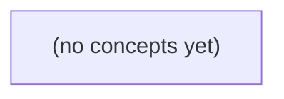

# 10.02 测试基本方法：用可核对的预期保护 IM 消息规则

*一本面向 Go 初学者的静态教材，从虚构 IM 消息规则和独立预期出发，逐步建立单元测试、表驱动测试、状态不变性测试与测试层次边界。读者将学会用可观察的证据检查消息校验与历史状态，而不把本地测试通过误说成网络送达。*

**章节:** 2

---

## 本书导览

- 了解整本书的章节脉络
- 掌握各章之间的概念依赖关系
- 选择最合适的阅读顺序

# 10.02 测试基本方法：用可核对的预期保护 IM 消息规则

一本面向 Go 初学者的静态教材，从虚构 IM 消息规则和独立预期出发，逐步建立单元测试、表驱动测试、状态不变性测试与测试层次边界。读者将学会用可观察的证据检查消息校验与历史状态，而不把本地测试通过误说成网络送达。

下方的概念图展示了本书 0 个核心概念以及它们之间的依赖关系；再下方是 1 个章节的入口。你可以按从上到下的顺序阅读，也可以根据自己的兴趣或先验知识选择切入点。

#### 概念图



## 章节索引

- **10.02 测试基本方法：用可核对的预期保护 IM 消息规则** — 承接 10.01 的可验证需求和 01.01–01.09 的 Go 基础，讲清测试预期、testing.T、表驱动、子测试、状态断言与证据层次。所有 IM 身份和规则均为虚构教学设定。

## 10.02 测试基本方法：用可核对的预期保护 IM 消息规则

- 区分需求预期、实际观察、测试结果与业务保证
- 理解 _test.go、TestXxx、testing.T 和 go test 的作用
- 解释 t.Error/fatal 何时继续或停止当前测试
- 从需求边界构造表驱动与子测试，而非照抄实现分支
- 同时检查失败返回和状态不变
- 区分单元、集成、端到端证据范围
- 说明覆盖率、测试替身和时间依赖的限制
- 把一条 IM 消息规则变更转成可审阅的回归案例

从“最多6字节、恰好6字节可发送、失败不改草稿与历史”出发，把规则转成可核对的测试证据，而非复述实现分支。

### 先分清预期、观察与保证

### 先分清预期、观察与保证

测试不是“运行后看起来没问题”，而是把需求拆成可核对的证据。以“消息最多 `6` 字节；恰好 `6` 字节可发送；失败不改草稿与历史”为例，应先写出四类信息：

- **预期**：由规则推出、运行前就确定的结果。  
  例如草稿为 `"abcdef"` 时，预期发送成功；返回值表示成功；草稿清空；历史新增这条消息。
- **实际观察**：程序运行后真实得到的数据。  
  例如实际 `error` 为 `nil`，实际草稿为 `""`，实际历史长度从 `2` 变为 `3`。
- **测试结论**：将实际观察逐项与预期比较后的判断。  
  所有断言一致，才能说“该测试用例通过”；任一项不一致，则该用例失败。
- **业务保证**：测试不能直接无限外推的主张。  
  此用例通过，只说明在这组输入和初始状态下，观察到的行为符合规则；不等于所有消息都正确，也不等于消息已经送达网络中的对方。

可将一个测试对象写成：

| 项目 | 内容 |
|---|---|
| 测试对象 | `发送` 方法 |
| 输入 | 草稿 `"abcdef"` |
| 初始状态 | 历史含 `2` 条，草稿为 `"abcdef"` |
| 预期输出 | 成功，无错误 |
| 预期状态 | 草稿清空，历史变为 `3` 条且末条为该消息 |
| 实际观察 | 运行后读取返回值、草稿和历史 |
| 断言 | 实际输出与状态均等于预期 |

对于 `7` 字节草稿，预期则应反转：返回错误、草稿仍保留、历史长度不变。这里的“历史不变”必须观察，而不能因“已经返回错误”就默认成立。测试提供的是有限、可复查的证据；需求规则才是预期的来源。

### 把消息规则拆成测试要素

### 把消息规则拆成测试要素

测试先面对规则，而不是面对实现。以“消息最多 `6` 字节；恰好 `6` 字节可发送；失败不改草稿与历史”为例，可把一次测试写成一组可核对的要素：

- **测试对象**：负责发送消息的方法，例如 `Send()`；它既可能返回 `error`，也可能修改草稿和历史。
- **输入**：待发送的消息内容。边界输入应包括 `6` 字节消息与 `7` 字节消息，例如 `"abcdef"` 是 `6` 字节，`"abcdefg"` 是 `7` 字节。
- **初始状态**：不能省略。设草稿为上述输入，历史原有一条 `"旧消息"`；这样才能观察失败是否偷偷改写状态。
- **预期输出**：  
  - 输入 `"abcdef"`：预期返回成功，即 `error == nil`。  
  - 输入 `"abcdefg"`：预期返回失败，即 `error != nil`。
- **预期状态**：  
  - 成功后，草稿按 R01-R09 的既定规则被清空或更新，历史新增 `"abcdef"`。  
  - 失败后，草稿仍是 `"abcdefg"`，历史仍只有 `"旧消息"`，内容与长度都不变。
- **实际观察**：调用后读取返回值、草稿字段和历史切片；这些是测试获得的事实，不应预先写成结论。
- **断言**：把实际观察与预期逐项比较，例如断言错误是否存在、草稿是否相等、历史长度是否相等、每条历史消息是否相等。

这里的关键是：失败测试至少要断言两类结果——“返回失败”和“状态未变”。只检查 `error != nil`，无法证明失败路径没有清空草稿或污染历史。另一方面，`Send()` 返回成功只说明本地规则判定成功；它不是“网络已经送达”的证据。

### 用表驱动覆盖需求边界

### 用表驱动覆盖需求边界

消息长度规则是“最多 `6` 字节”，因此测试输入应围绕需求边界构造，而不是先阅读实现中的 `if` 分支。最小的一组核心案例可由决策表直接导出：

| 案例名称 | 草稿输入 | 初始历史 | 预期结果 | 预期草稿 | 预期历史 |
|---|---:|---|---|---|---|
| 小于上限的消息可以发送 | `"你好"`（6 字节以内） | 空 | 成功、返回消息 | 清空或按 R 规则变化 | 新增该消息 |
| 恰好 6 字节的消息可以发送 | `"abcdef"` | 空 | 成功、返回消息 | 清空或按 R 规则变化 | 新增 `"abcdef"` |
| 超过 6 字节的消息被拒绝 | `"abcdefg"` | 已有一条历史 | 返回 `error` | 保持原草稿 | 历史完全不变 |
| 发送失败不污染既有状态 | 非法草稿 | 已有多条历史 | 返回 `error` | 与发送前一致 | 条数、内容、顺序均一致 |

这里的“6 字节”不是“6 个字符”。例如 ASCII 的 `"abcdef"` 是 6 字节；中文 UTF-8 字符通常占多个字节，必须依据规则规定的字节长度计算。

表驱动测试可把每一行写成一个测试结构体：包含`名称`、`输入草稿`、`初始状态`、`预期输出`、`预期错误`和`预期状态`。执行后记录实际返回值与实际对象状态，再分别断言：成功案例新增历史；失败案例不仅有错误，而且草稿和历史都未变化。

案例名应陈述可核对的业务规则，如“恰好上限可发送”“超长消息拒绝且状态不变”，而非“进入长度判断分支”。前者在重构实现后仍然成立；后者只是对当前代码路径的复述。所有断言只能证明本地对象遵守规则，不能证明消息已通过网络送达。

### 用子测试检查返回与状态

### 用子测试检查返回与状态

把测试对象看成“发送草稿”的函数或方法：给定草稿、初始历史和发送条件，观察它返回什么，以及草稿、历史是否按规则变化。测试用例应先由需求推出：空消息、`6` 字节消息、超过 `6` 字节消息；尤其要核对失败时草稿和历史都不变。

在同一包中新建 `message_test.go`，测试函数以 `TestXxx` 命名，并接收 `*testing.T`：

```go
func TestSendDraft(t *testing.T) {
	tests := []struct {
		name       string
		draft      string
		wantErr    bool
		wantDraft  string
		wantHistory []string
	}{
		{
			name:        "恰好6字节可以发送",
			draft:       "123456",
			wantErr:     false,
			wantDraft:   "",
			wantHistory: []string{"123456"},
		},
		{
			name:        "超过6字节发送失败且状态不变",
			draft:       "1234567",
			wantErr:     true,
			wantDraft:   "1234567",
			wantHistory: nil,
		},
	}

	for _, tt := range tests {
		t.Run(tt.name, func(t *testing.T) {
			c := Conversation{Draft: tt.draft}
			err := c.Send()

			if (err != nil) != tt.wantErr {
				t.Errorf("错误返回=%v，期望有错误=%v", err, tt.wantErr)
			}
			if c.Draft != tt.wantDraft {
				t.Errorf("草稿=%q，期望=%q", c.Draft, tt.wantDraft)
			}
			if !reflect.DeepEqual(c.History, tt.wantHistory) {
				t.Errorf("历史=%v，期望=%v", c.History, tt.wantHistory)
			}
		})
	}
}
```

表驱动结构把“输入、初始状态、预期输出、预期状态”并排放置；`t.Run` 让每条规则成为独立子测试，失败报告会带上用例名。

` t.Error` 记录失败后继续执行，适合一次收集草稿和历史等多个观察结果；`t.Fatal` 记录后只停止**当前子测试**，不会停止其他 `t.Run` 用例。若前置条件无法建立，例如构造测试对象失败，应使用 `t.Fatal`；普通规则断言通常用 `t.Error`。这些断言只证明本地函数行为符合预期，不等于消息已经网络送达。

### 审阅回归证据的范围与限制

### 审阅回归证据的范围与限制

同一条“消息最多 6 字节、失败不改草稿与历史”规则，在不同层级测试中提供的证据强度不同。

- **单元测试**：直接调用发送方法，构造初始草稿与历史，断言 6 字节消息成功、7 字节消息返回错误，且失败后草稿和历史保持原值。它能证明本地规则计算与状态更新符合预期，但不能证明真实网络请求是否发出。
- **集成测试**：让消息服务、存储层或序列化层共同工作，可验证“成功消息被写入历史”“失败不写入”等跨组件约定。若使用内存存储或模拟服务，证明范围仍限于该替身的行为。
- **端到端测试**：通过接近真实的客户端、服务端和传输链路发送消息，能增加“请求到达远端”的证据；但网络抖动、重试、异步投递仍可能使“本地显示成功”与“对方已收到”不同步。

覆盖率只说明哪些语句或分支被执行过，不说明断言是否正确。例如测试执行了“长度大于 6”分支，却未检查历史不变，仍无法保护关键规则。

审阅回归证据时，应明确替身替代了什么、时间是否被固定、异步任务是否已完成。特别是涉及 `time.Now()`、超时或重试时，未控制时间会使结果偶发变化。最后，本地测试全部通过只能说明观察到的本地预期成立；它不是“网络送达”的证明，送达需要远端确认、可查询记录或端到端回执等额外证据。

> **要点** — 测试应从可核对的需求边界推导，并同时断言结果与失败后的状态不变。

本节从一条可核对的消息正文规则出发，逐符号阅读生产代码与同包测试，建立“静态预期不等于已执行保证”的测试认识。

### 先划清预期、观察与保证

### 先划清预期、观察与保证

IM 正文规则可以写成静态预期：

- `maxBytes > 0`；
- `body` 原始值必须非空，即 `body != ""`；
- `len(body) <= maxBytes`；
- 不自动对空格执行 `trim`：`" "` 不是空字符串，应按字节长度参与判断；
- UTF-8 合法性已由前置环节验证，此处不重复检查。

因此，给定 `body="你好"`、`maxBytes=6`，静态预期是通过；因为 `len("你好")==6`。给定 `body=""` 或 `maxBytes=0`，静态预期是不通过。

测试要区分四层含义：

1. **需求预期**：人们根据规则手工写下“应通过”或“应拒绝”。
2. **实际观察**：测试调用生产函数后得到的返回值，例如 `got := ValidateText(body, maxBytes)`。
3. **测试结果**：若 `got != want`，`t.Errorf` 记录失败；若全部一致，该次测试通过。
4. **业务保证**：只有测试被实际运行、代码确实走到该函数、部署版本一致时，才形成有限保证。

`go test ./history` 是学习者将来运行的命令，本次并未执行。即使测试文件中的静态预期写得正确，也不能把“尚未运行的测试”称为已经验证的保证。

目录与包名也属于边界条件：`history/history.go` 与 `history/history_test.go` 都声明 `package history`，测试才能直接观察同包函数；`_test.go` 文件仅在测试构建时参与，不进入普通构建。

### 逐符号阅读生产函数

### 逐符号阅读生产函数

先把消息正文规则写成一个可被测试核对的生产函数。文件路径必须是 `history/history.go`，其目录名与包名保持一致：

```go
package history

func ValidateText(body string, maxBytes int) bool {
	return maxBytes > 0 && body != "" && len(body) <= maxBytes
}
```

`package history` 表示此文件属于 `history` 包；同一目录下声明为 `package history` 的其他 `.go` 文件，可以直接调用 `ValidateText`，无需导入自身包。

`func ValidateText(body string, maxBytes int) bool` 可逐符号拆开阅读：

- `func`：声明一个函数。
- `ValidateText`：函数名，首字母大写表示可被其他包导出使用。
- `body string`：第一个参数，消息正文是 Go 的字符串。
- `maxBytes int`：第二个参数，允许的最大字节数。
- `bool`：返回布尔值；规则全部满足时返回 `true`，否则返回 `false`。

函数体中的表达式：

```go
maxBytes > 0 && body != "" && len(body) <= maxBytes
```

使用 `&&` 连接三个必须同时成立的条件：

1. `maxBytes > 0`：上限必须是正数。`0` 或负数不是有效的消息长度上限。
2. `body != ""`：正文必须原始非空。这里不调用 `trim` 或任何去空格操作，因此 `" "` 是非空正文，是否允许由当前规则的字节上限决定。
3. `len(body) <= maxBytes`：正文的字节长度不能超过上限。`len` 计算字符串字节数，不是字符个数；例如 UTF-8 中文通常占多个字节。UTF-8 有效性已由前置教学验证，本函数只负责长度与非空规则。

这段代码本身只是生产逻辑；它尚未产生任何已执行保证。后续测试中写下的结果只能称为**静态预期**，只有学习者未来在一致目录中运行 `go test ./history` 后，才会得到实际执行结果。

### 逐符号阅读同包测试

### 逐符号阅读同包测试

与生产文件 `history/history.go` 同目录、同包名的测试文件如下：

```go
package history

import "testing"

func TestValidateText(t *testing.T) {
	tests := []struct {
		name     string
		body     string
		maxBytes int
		want     bool
	}{
		{"正常正文，恰好达到上限", "hello", 5, true},
		{"正文超过字节上限", "hello", 4, false},
		{"原始正文为空", "", 5, false},
		{"上限必须为正数", "hello", 0, false},
		{"空格不是空正文", "   ", 3, true},
		{"中文按字节计数", "你", 3, true},
	}

	for _, tt := range tests {
		got := ValidateText(tt.body, tt.maxBytes)
		if got != tt.want {
			t.Errorf("%s：ValidateText(%q, %d) = %v，静态预期为 %v",
				tt.name, tt.body, tt.maxBytes, got, tt.want)
		}
	}
}
```

`package history` 表示测试属于 `history` 包，因此能以同包方式直接调用 `ValidateText`；目录必须与生产文件一致，即都位于 `history/` 下。

文件名中的 `_test.go` 很关键：它会被 `go test` 识别为测试源文件，但不进入普通构建。`import "testing"` 导入标准库测试支持，其中 `testing.T` 表示一次测试上下文。

`func TestValidateText(t *testing.T)` 的名字以 `Test` 开头，后接被测函数名；测试工具据此发现它。参数 `t` 是指向测试对象的指针，`*` 表示“指向”，`testing.T` 是类型名。调用 `t.Errorf(...)` 会记录一条格式化失败信息，并将该测试标记为失败；它不会自动修正生产代码。

测试中的 `want` 是可人工核对的静态预期：`maxBytes > 0`、原始 `body` 非空、`len(body) <= maxBytes`。空格不自动 `trim`，而 UTF-8 合法性已由前置环节验证。将来可运行 `go test ./history` 检查这些预期；这里仅阅读代码，并未执行该命令。

### 从规则边界设计表驱动子测试

### 从规则边界设计表驱动子测试

围绕规则本身列出可核对的静态预期，而不是把生产函数中的 `if` 分支逐句搬进测试。这里的边界包括：

- `maxBytes<=0`：上限无效，任何正文都应拒绝；
- `body==""`：原始正文为空，应拒绝；
- `" "`：空格不是空字符串，且不自动 `trim`，在上限允许时应接受；
- `len(body)==maxBytes`：恰好达到上限，应接受；
- `len(body)>maxBytes`：超过上限，应拒绝。

`history/history.go`：

```go
package history

func ValidateText(body string, maxBytes int) bool {
	return maxBytes > 0 && body != "" && len(body) <= maxBytes
}
```

`history/history_test.go`：

```go
package history

import "testing"

func TestValidateText(t *testing.T) {
	tests := []struct {
		name     string
		body     string
		maxBytes int
		want     bool
	}{
		{"无效上限", "hi", 0, false},
		{"空字符串", "", 10, false},
		{"空格正文不自动裁剪", " ", 1, true},
		{"恰好达到上限", "abc", 3, true},
		{"超过上限", "abcd", 3, false},
	}

	for _, tt := range tests {
		t.Run(tt.name, func(t *testing.T) {
			got := ValidateText(tt.body, tt.maxBytes)
			if got != tt.want {
				t.Errorf("ValidateText(%q, %d) = %v，静态预期为 %v",
					tt.body, tt.maxBytes, got, tt.want)
			}
		})
	}
}
```

同包 `package history` 使测试可直接调用导出函数；`import "testing"` 提供 `*testing.T`、`t.Run` 与 `t.Errorf`。`_test.go` 文件不会进入普通构建。以后可在项目根目录运行 `go test ./history`，但该命令只是将来执行测试的方式；这里写出的 `want` 仅是静态预期，并不等于测试已经执行或规则已经得到保证。

### 理解命令、失败语义与证据范围

### 理解命令、失败语义与证据范围

`go test ./history` 表示“测试当前模块下 `history` 目录对应的包”。它是学习者在准备好项目文件后**将来可以运行的命令**；本节只给出可核对的静态预期，不实际执行命令，因此不能把“预期应通过”说成“已经通过”。

测试中常见的失败报告是：

` t.Errorf("ValidateText(%q, %d) = %v，期望 %v", body, maxBytes, got, want)`

`Errorf` 中的 `t` 是测试句柄，`Errorf` 会记录一次失败，但当前测试函数会继续执行后续检查。这样表格测试可以一次报告多个不匹配案例，便于集中定位规则错误。

与之相对，`t.Fatalf(...)` 或 `t.FailNow()` 属于致命失败：它们记录失败后立即结束当前测试函数的执行。若后续检查依赖前一步结果，例如初始化失败后不能继续访问对象，应使用致命失败；独立的输入—输出断言通常适合使用 `t.Errorf`。

证据范围还受文件位置约束：

- `history/history.go` 与 `history/history_test.go` 都声明 `package history`，目录和包名必须一致。
- 同包测试可直接调用未导出的 `ValidateText`；这里不需要通过外部包接口绕行。
- 文件名以 `_test.go` 结尾，普通构建会排除它；只有测试命令才会编译并运行其中的 `TestValidateText`。
- 静态阅读只能证明测试案例、期望值和规则描述是否一致，不能证明代码能编译、测试会启动，或所有案例实际通过。

> **要点** — 测试把需求边界写成可核对的静态预期；只有实际执行并观察结果，才能增加对规则的证据。

本节聚焦测试失败的控制边界：何时继续收集证据，何时立即停止当前测试，并用可核对的报告定位 IM 规则偏差。

### 测试中的四类事实

### 测试中的四类事实

一条测试报告至少应区分四类事实，避免把“测试失败”或“测试通过”说得过头：

1. **需求预期（want）**：规则要求什么。例如“未读消息数达到 `6` 条即超限”，则 `5→false`、`6→true`、`7→true`。`want` 来自需求，不应为了迁就现有实现而修改。

2. **实际观察（got）**：被测代码本次真正返回什么。若错误实现写成“`>= 6` 即超限”，而需求其实是“超过 `6` 才超限”，那么输入 `6` 最能区分两者：需求期望 `false`，实际得到 `true`。`5` 和 `7` 都可能通过，无法暴露边界错误。

3. **测试结果**：测试框架对这次比较作出的判断。`got != want` 时，可用 `t.Errorf` 标记失败并继续执行当前测试函数，以收集其他独立断言；报告应包含输入、状态、`got` 与 `want`，例如：`未读数=6，状态=边界检查，got=true，want=false`。

4. **业务保证**：测试结果能够支持的结论范围。某组用例通过，只能说明“当前实现对这些已执行输入符合预期”，不能证明所有 IM 消息规则都绝对正确；一次失败则证明至少存在已观测到的偏差。

若后续检查必须依赖前一步成功创建的对象，应使用 `t.Fatalf`：它标记失败并停止**当前测试函数**，避免在无效对象上继续报告噪声。它不意味着整个测试进程或所有包都会停止。使用 `go test -run` 可筛选匹配的测试，`-v` 可显示更详细的测试执行信息。

### testing.T 的失败控制

### testing.T 的失败控制

`testing.T` 提供两类失败报告，区别不在“是否失败”，而在失败后是否还能执行当前测试函数的后续语句。

- `t.Error(...)`、`t.Errorf(...)`：记录失败，当前测试函数继续执行。
- `t.Fatal(...)`、`t.Fatalf(...)`：记录失败后立即终止**当前测试函数**；它不等于停止整个 `go test` 进程，也不表示其他测试或其他包都不会继续。

当多个断言彼此独立时，使用 `Errorf` 能一次收集更多证据。例如检查消息长度、发送者和状态：

```go
if got := msg.Sender; got != "alice" {
    t.Errorf("发送者错误：输入=%+v，got=%q，want=%q，状态=%s", msg, got, "alice", msg.Status)
}
if got := msg.Status; got != Sent {
    t.Errorf("消息状态错误：输入=%+v，got=%s，want=%s，状态=%s", msg, got, Sent, msg.Status)
}
```

但若后续步骤依赖前一步产物，则必须在前一步失败时停止当前函数。否则空对象、错误状态或无效索引会制造连锁噪声：

```go
msg, err := ParseMessage(input)
if err != nil {
    t.Fatalf("解析消息失败：输入=%q，错误=%v", input, err)
}
```

失败报告应让读者无需猜测：明确给出输入、`got`、`want`，以及相关状态。对于“长度达到 6 即超限”的故意错误实现，`5` 和 `7` 都可能与正确规则一致，只有边界值 `6` 能区分 `>= 6` 与正确的 `> 6`。测试应保持正确的 `want`，不能为了迎合实现而修改预期。

### 何时继续，何时终止

### 何时继续，何时终止

`Error`/`Errorf` 会把当前测试标记为失败，但测试函数仍继续执行；`Fatal`/`Fatalf` 同样标记失败，却会立即结束**当前测试函数**。它不等于停止整个 `go test` 进程，更不表示所有包的测试都会停止。

判断标准不是“错误是否严重”，而是：**后续步骤是否依赖前一步成功产生的对象或状态。**

```go
msg, err := CreateMessage(input)
if err != nil {
    t.Fatalf("创建消息失败：输入=%q，错误=%v", input, err)
}
```

这里必须用 `Fatalf`。若创建失败，`msg` 可能为空或无效；继续检查 `msg.Status`、`msg.Content` 只会产生无意义的连锁错误，甚至触发空指针问题。

相反，已经得到可检查的返回值后，多条彼此独立的规则应使用 `Errorf`，一次运行收集更多证据：

```go
if got, want := msg.Status, "正常"; got != want {
    t.Errorf("状态错误：输入=%q，got=%q，want=%q", input, got, want)
}
if got, want := msg.Content, "hello"; got != want {
    t.Errorf("内容错误：输入=%q，got=%q，want=%q", input, got, want)
}
```

报告至少应包含输入、`got`、`want` 和关键状态，避免只写“测试失败”。

例如超限规则应是“长度 `> 6` 才超限”，而故意错误实现写成 `>= 6`。输入 `5` 与 `7` 都可能通过测试；只有边界值 `6` 能区分两种实现：期望应为“未超限”，实际却是“超限”。不能把 `want` 改成“超限”去迎合错误实现。

可用 `go test -run 名称` 只筛选匹配名称的测试，用 `-v` 输出各测试的执行详情。

### 用边界案例揭露规则错误

### 用边界案例揭露规则错误

设 IM 消息规则为：**长度达到 6 才超限**，即仅当长度满足 $n>6$ 时拒绝发送；长度为 6 仍应允许。一个常见错误实现会写成：

`n >= 6`

它把“达到 6”误解为“从 6 开始超限”。要揭露这种偏差，应覆盖边界前、边界上、边界后：

| 消息长度 | 输入示例 | 期望状态 |
|---:|---|---|
| 5 | `"hello"` | 允许 |
| 6 | `"golang"` | 允许 |
| 7 | `"message"` | 超限拒绝 |

其中，长度 6 是最关键的区分案例：正确实现返回“允许”，错误的 `>=6` 实现返回“超限”。长度 5 在两种实现下都允许，长度 7 在两种实现下都拒绝，因此它们有助于说明边界附近行为，却不能单独识别该错误。

```go
func TestMessageLengthLimit(t *testing.T) {
	cases := []struct {
		name string
		text string
		want bool // 是否超限
	}{
		{"边界前", "hello", false},
		{"边界值", "golang", false},
		{"边界后", "message", true},
	}

	for _, tc := range cases {
		got := isTooLong(tc.text)
		if got != tc.want {
			t.Errorf("%s：输入=%q，长度=%d，got 超限=%v，want 超限=%v",
				tc.name, tc.text, len(tc.text), got, tc.want)
		}
	}
}
```

这里三个断言彼此独立，即使某个案例失败，也应使用 `t.Errorf` 继续检查其余案例，以便一次收集完整证据。尤其不能为让测试通过而把长度 6 的 `want` 改成 `true`：测试应表达业务规则，而不是迎合当前实现。运行 `go test -run TestMessageLengthLimit -v` 时，`-run` 用于筛选匹配名称的测试，`-v` 用于显示更详细的测试输出。

### 让失败报告成为审阅证据

### 让失败报告成为审阅证据

表驱动测试应把每个规则场景写成可审阅的证据：输入、期望结果、期望错误，以及对象状态是否应保持不变。对 IM 消息长度限制，可覆盖边界值 `5`、`6`、`7`；若规则是“最多 6 个字符”，故意错误实现写成 `len(msg) >= 6`，只有输入 `6` 能区分正确实现与错误实现：`5` 都成功，`7` 都失败。不能为了让测试通过而把 `want` 改成迎合错误实现的值。

```go
cases := []struct {
	name      string
	msg       string
	wantErr   bool
	wantCount int
}{
	{"边界内", "12345", false, 1},
	{"恰好上限", "123456", false, 1},
	{"超过上限", "1234567", true, 0},
}

for _, tc := range cases {
	t.Run(tc.name, func(t *testing.T) {
		room := NewRoom()
		err := room.Send(tc.msg)

		if (err != nil) != tc.wantErr {
			t.Errorf("消息=%q：错误状态 got=%v，wantErr=%v，err=%v",
				tc.msg, err != nil, tc.wantErr, err)
		}
		if got := room.Count(); got != tc.wantCount {
			t.Errorf("消息=%q：消息数 got=%d，want=%d；err=%v",
				tc.msg, got, tc.wantCount, err)
		}
	})
}
```

这里两个断言彼此独立，使用 `Errorf` 可一次收集“错误返回”和“状态变化”两类证据。若 `NewRoom()`、登录或创建会话失败，后续对象不可用，应使用 `Fatal`/`Fatalf` 停止**当前测试函数或子测试**，避免无意义的连锁报错；它不意味着整个测试进程或所有包立即停止。

`go test -run 名称` 仅运行名称匹配的测试或子测试，适合聚焦某条规则；`go test -v` 输出每个测试的运行结果。它们帮助筛选和展示证据，但不能替代断言：通过输出只能说明已执行，不能证明 `got` 与 `want` 被正确核对。

> **要点** — Fatal 保护后续前提，Error 收集独立证据；预期应源于需求边界，且失败必须同时呈现结果与状态。

从10.01的决策表出发，把IM文本校验规则转成可执行、可复核的回归测试，并明确测试证据能证明什么。

### 从决策表列出可核对预期

### 从决策表列出可核对预期

测试不是“随便传几个字符串看看”，而是把 10.01 的决策表逐行翻译成可断言的证据。假设规则为：`kind` 必须是文本类型；`max` 必须大于 0；文本不能为空；长度按字节计算；超长时报长度错误。则至少覆盖：

| 用例名 | 输入要点 | 可核对预期 |
|---|---|---|
| `max为0` | `max=0`，文本合法 | 参数错误 |
| `未知类型` | `kind` 不支持 | 类型错误 |
| `空文本` | `text=""` | 空文本错误 |
| `单字节文本` | `"a"`，`max=6` | 通过 |
| `刚好六字节` | `"你好"`，`max=6` | 通过 |
| `超过六字节` | `"你好呀"`，`max=6` | 超长错误 |
| `空格也是一字节` | `" "`，`max=1` | 通过 |
| `双错误优先级` | 未知 `kind` 且 `max=0` | 类型错误优先 |

若文本校验函数不接收 `kind`，应先单测 `validateText`，只验证 `max`、空文本和字节边界；再通过 `validateMessage` 测试消息类型分类及“双错误时谁先报错”。

```go
func TestValidateText(t *testing.T) {
	cases := []struct {
		name string
		text string
		max  int
		want error
	}{
		{"max为0", "a", 0, ErrInvalidMax},
		{"空文本", "", 6, ErrEmptyText},
		{"单字节文本", "a", 6, nil},
		{"刚好六字节", "你好", 6, nil},
		{"超过六字节", "你好呀", 6, ErrTextTooLong},
		{"空格也是一字节", " ", 1, nil},
	}

	for _, tc := range cases {
		t.Run(tc.name, func(t *testing.T) {
			if got := validateText(tc.text, tc.max); got != tc.want {
				t.Fatalf("validateText(%q, %d) = %v，期望 %v", tc.text, tc.max, got, tc.want)
			}
		})
	}
}
```

`[]struct` 表示“匿名结构体组成的切片”；每个元素是一条独立测试记录。`for/range` 逐条取出 `tc`；`t.Run(tc.name, ...)` 以唯一名称运行子测试，失败时能准确定位决策表行。这里不使用 `t.Parallel`，使顺序与诊断输出稳定。表驱动只是组织方式：随机字符串堆砌并不能替代对 `0、1、max、max+1` 与错误优先级的明确推理。

### 读懂Go测试文件与失败控制

### 读懂 Go 测试文件与失败控制

Go 的测试通常放在以 `_test.go` 结尾的文件中，例如 `message_test.go`。执行：

`go test`

Go 会自动编译当前包、寻找测试文件，并运行名称以 `Test` 开头、签名为 `func TestXxx(t *testing.T)` 的函数：

`func TestValidateText(t *testing.T)`

其中 `testing.T` 是当前测试的控制器。它负责记录失败信息、标记测试状态，并在测试结束时把结果交给 `go test` 汇总。测试函数不需要自行返回“通过”或“失败”：只要没有报告错误，函数正常结束即表示通过。

最常用的两种失败报告方法是：

- `t.Error(...)`：记录当前断言失败，但**继续执行当前测试函数**。
- `t.Fatal(...)`：记录失败后立刻终止**当前测试函数或当前子测试**，后续语句不再运行。

例如，比较期望错误与实际错误时，通常可使用 `t.Error`：

`if got != want { t.Errorf("结果=%q，期望=%q", got, want) }`

这样一个测试中多个独立断言都能被报告，便于一次看到更多差异。

但如果后续操作依赖前一步结果，则应使用 `t.Fatal`。例如创建待测对象失败后，继续检查字段只会产生误导性的连锁错误：

`msg, err := newMessage(input)`  
`if err != nil { t.Fatalf("创建消息失败：%v", err) }`

`go test` 最终会在任一测试报告错误时返回失败状态。注意：`t.Fatal` 不会停止整个测试包，也不会阻止其他顺序子测试运行；它只停止自己所在的那条测试流程。

### 用表驱动表达文本边界

### 用表驱动表达文本边界

假设 `validateText(text string, maxBytes int) error` 按 UTF-8 **字节数**限制文本，且 `maxBytes=0` 表示不允许任何非空文本。测试应把决策表中的边界直接写成命名用例，而不是随机拼接字符串：

`func TestValidateText(t *testing.T) { cases := []struct { name string; text string; maxBytes int; wantErr bool }{ {name: "上限为零且非空", text: "a", maxBytes: 0, wantErr: true}, {name: "空文本", text: "", maxBytes: 6, wantErr: false}, {name: "单个字节", text: "a", maxBytes: 6, wantErr: false}, {name: "恰好六字节的你好", text: "你好", maxBytes: 6, wantErr: false}, {name: "超过六字节的你好呀", text: "你好呀", maxBytes: 6, wantErr: true}, {name: "空格也是一个字节", text: " ", maxBytes: 6, wantErr: false}, }; for _, tt := range cases { t.Run(tt.name, func(t *testing.T) { gotErr := validateText(tt.text, tt.maxBytes) != nil; if gotErr != tt.wantErr { t.Fatalf("text=%q, maxBytes=%d: 错误=%v，期望错误=%v", tt.text, tt.maxBytes, gotErr, tt.wantErr) } }) } }`

`[]struct{...}` 表示“匿名结构体切片”：每个元素是一条独立测试记录。`name` 供 `t.Run` 生成可定位的子测试名，必须避免重复；`text` 和 `maxBytes` 是该案例自己的输入；`wantErr` 是可核对的预期。

`for _, tt := range cases` 逐条取出记录，`_` 忽略下标，`tt` 是当前案例。`t.Run(tt.name, ...)` 将失败精确归属到案例；这里不使用 `t.Parallel()`，因此顺序稳定、输出易读。表驱动只是组织方式：覆盖了空值、$1$ 字节、临界 $6$ 字节和越界值，才是边界测试；堆砌随机文本并不能证明规则正确。

### 用子测试验证分类与优先级

### 用子测试验证分类与优先级

`validateMessage` 负责组合规则：先判断消息 `kind` 是否支持，再校验文本长度。因此，当“未知类型”和“文本过长”同时出现时，测试不只检查“是否报错”，还要核对**分类错误优先于文本错误**。

```go
package im

import "testing"

func TestValidateMessage(t *testing.T) {
	cases := []struct {
		name    string
		input   Message
		wantErr error
	}{
		{
			name:    "未知类型优先于文本过长",
			input:   Message{Kind: "image", Text: "你好呀"},
			wantErr: ErrUnknownKind,
		},
		{
			name:    "文本消息且文本过长",
			input:   Message{Kind: "text", Text: "你好呀"},
			wantErr: ErrTextTooLong,
		},
		{
			name:    "文本消息且内容合法",
			input:   Message{Kind: "text", Text: "你好"},
			wantErr: nil,
		},
	}

	for _, tc := range cases {
		tc := tc
		t.Run(tc.name, func(t *testing.T) {
			got := validateMessage(tc.input)
			if got != tc.wantErr {
				t.Fatalf("validateMessage(%+v) = %v，期望 %v",
					tc.input, got, tc.wantErr)
			}
		})
	}
}
```

`[]struct { ... }` 是匿名结构体切片：每个元素就是一条测试证据，包含唯一的 `name`、独立的 `input` 和可核对的 `wantErr`。`for _, tc := range cases` 逐个取出用例；`t.Run(tc.name, ...)` 将其显示为独立子测试，例如 `TestValidateMessage/未知类型优先于文本过长`。

这里保留 `tc := tc`，使闭包绑定当前用例变量；即使当前子测试顺序执行，这也是稳妥写法。不要添加 `t.Parallel()`：分类优先级测试本身不需要并发，顺序子测试的输出和失败定位更直接。

表驱动测试只是组织形式，不会自动产生边界覆盖。关键证据仍是刻意构造的组合输入：未知 `kind` 加超长文本，证明实现没有先返回 `ErrTextTooLong`，而是遵守决策表规定的 `ErrUnknownKind` 优先级。

### 断言状态与辨认证据边界

### 断言状态与辨认证据边界

校验失败不能只断言“返回了错误”，还应证明失败没有污染状态。若 `validateMessage` 失败后会写入消息队列、更新会话最后一条消息或递增未读数，测试必须同时核对这些副作用保持不变：

```go
before := snapshot(session)
err := service.Send(msg) // 文本超 6 字节
if err == nil {
	t.Fatal("期望校验失败")
}
if diff := cmp.Diff(before, snapshot(session)); diff != "" {
	t.Fatalf("失败请求不应改变状态 (-前 +后):\n%s", diff)
}
```

这里的证据分层不同：

- **单元测试**：直接测 `validateText`、`validateMessage` 的返回值、错误分类和优先级；最快，能精确证明规则实现。
- **集成测试**：连接真实存储或消息队列，验证“校验失败不落库、不入队、不改会话”；能证明组件协作。
- **端到端测试**：从客户端请求到接收端可见结果，证明部署链路可用，但定位失败原因较慢，不能替代单元测试。

覆盖率只能说明代码被执行过，不能证明断言正确；替身能隔离队列、时钟或数据库，却可能与真实实现行为不一致。随机字符串若未刻意包含 `0`、`1`、`6`、`7` 字节及多字节中文边界，只是在堆砌样本，不是边界覆盖。涉及时间时应注入固定时钟，避免“恰好过期”或跨秒导致测试偶发失败。测试的目标不是制造更多案例，而是为每条规则和每个副作用边界提供可核对的证据。

> **要点** — 测试应从需求边界构造可命名、可核对的案例，同时验证错误结果、优先级和失败后的状态不变。

以虚构 IM 消息历史为例，把“拒绝重复消息”拆成可观察、可复核且不会互相污染的回归测试。

### 先分清预期、观察与保证

### 先分清预期、观察与保证

测试不是把“调用后没有报错”写下来，而是把业务规则转成可核对的事实。对 `History.Add` 而言，需求预期可以拆为三类：

- 新消息 `m-a` 首次加入：返回 `nil`，历史中恰好新增该消息。
- 再次加入同一消息：返回可由 `errors.Is(err, ErrDuplicateMessage)` 识别的重复错误，且原有消息正文、顺序和数量保持不变。
- 输入无效：返回相应错误，历史切片不发生变化。

其中，“预期”是规则；“观察”是测试通过公开接口取得的证据，例如 `Add` 的错误、`Messages()` 返回的消息列表、消息的 `Before`/`After` 快照。不要只检查 `err != nil`：那无法确认是否为正确的重复错误；也不要只检查长度：长度不变仍可能意味着原消息正文被错误覆盖。

测试结果是某次执行中得到的断言结论，业务保证则是这些结论共同覆盖的承诺：重复请求不会改写既有 IM 消息，无效请求不会污染历史。保证不能由单个脆弱断言推导出来，应同时比较错误类型与状态快照。

每个测试都应创建新的 `History`，避免前一个案例留下的消息影响后一个案例。`Messages()` 若返回副本，测试可以安全保存 `Before` 快照并与 `After` 比较；这验证的是调用者可观察到的状态，而非直接窥探内部切片实现。

本节只验证 `History.Add` 的公开行为，不测试服务端发送，也不假设它会修复一个已被外部构造为损坏的初始状态。拒绝新的非法操作，不等于自动修复旧数据。

### 从消息规则列出可核对案例

### 从消息规则列出可核对案例

测试案例应从消息历史的**公开规则**推导，而不是照着 `History.Add` 的内部 `if` 分支逐行覆盖。假设规则是：消息标识必须有效；同一标识只能保存一次；拒绝操作不得悄悄改写既有历史。由此可列出三类可核对案例。

- **正常新增**：向全新的 `History` 加入消息 `m-a`，预期 `err == nil`；随后通过 `Messages()` 观察到恰有一条消息，且其标识、正文等字段与输入一致。只检查长度不够，因为“长度变为 1”并不能证明保存的是正确消息。

- **重复拒绝且原文不变**：先加入正文为“第一版”的 `m-a`，再加入同标识、正文为“第二版”的消息。预期 `errors.Is(err, ErrDuplicateMessage)` 为真；再读取消息，仍只有一条，且正文仍为“第一版”。这同时验证了错误分类、去重规则和拒绝操作的非破坏性；仅断言“返回了错误”会遗漏错误类型，只有长度不变也会遗漏正文被覆盖的风险。

- **无效输入不改切片**：在加入有效消息前后，记录可观察状态。对无效消息调用 `Add` 后，应得到相应错误，并确认消息数量及已有消息内容均未改变。可用 `Before`、`After` 表示操作前后的 `Messages()` 结果：`Before` 与 `After` 应代表相同的历史内容，而非仅比较二者长度。

每个案例都应创建新的 `History`，避免前一案例残留的 `m-a` 使后一案例偶然失败。`Messages()` 若返回副本，测试还可修改获得的结果并再次读取，确认外部修改不会影响历史；这是公开观察面上的契约，而非窥探内部切片。若历史在初始化时已损坏，`Add` 的拒绝行为不等于自动修复旧状态，测试也不应凭空要求修复。

### 用表驱动和子测试隔离历史

### 用表驱动和子测试隔离历史

将测试写在同包的 `history_test.go` 中，以 `TestXxx(t *testing.T)` 作为入口；`go test` 会自动发现并执行这类函数。`testing.T` 用于报告失败：`t.Fatalf` 适合当前案例无法继续时立即终止，`t.Errorf` 则可继续检查更多断言。

重复消息规则天然适合表驱动：案例数据集中，新增边界时不必复制测试框架。关键是**每个子测试都创建新的 `History`**；历史记录是可变状态，复用同一实例会让前一案例遗留消息，造成案例顺序依赖和“假失败”。

```go
func TestHistoryAdd(t *testing.T) {
	cases := []struct {
		name    string
		first   Message
		second  Message
		wantErr error
	}{
		{"正常增加", Message{ID: "m-a", Body: "你好"}, Message{}, nil},
		{"拒绝重复", Message{ID: "m-a", Body: "原文"},
			Message{ID: "m-a", Body: "篡改"}, ErrDuplicateMessage},
	}

	for _, tc := range cases {
		t.Run(tc.name, func(t *testing.T) {
			h := NewHistory() // 子测试独占状态

			if err := h.Add(tc.first); err != nil {
				t.Fatalf("首次添加失败：%v", err)
			}
			before := h.Messages()

			if tc.wantErr != nil {
				err := h.Add(tc.second)
				if !errors.Is(err, tc.wantErr) {
					t.Errorf("错误 = %v，期望可匹配 %v", err, tc.wantErr)
				}
				after := h.Messages()
				// 既验证长度，也验证原消息正文未被替换。
				if len(after) != len(before) || after[0].Body != before[0].Body {
					t.Errorf("拒绝后历史被修改：%+v", after)
				}
			}
		})
	}
}
```

不要只检查 `err`：实现可能返回了 `ErrDuplicateMessage`，却已错误追加或覆盖消息。也不要只检查长度：长度不变仍可能篡改原正文。对无效输入同样应在调用前后比较公开的 `Messages()` 结果，确认切片内容不变。

`Messages()` 若承诺返回副本，测试应通过返回值观察行为，而非直接读取内部切片。初始化时已有损坏状态，`Add` 拒绝新输入并不意味着它会修复旧状态；这是另一条规则，应单独建例。此处只测试 `History` 的公开行为，不测试服务端发送。

### 同时断言错误与前后状态

### 同时断言错误与前后状态

对重复消息 `m-a` 的测试，不能只写“返回了错误”，也不能只比较消息数量。更可靠的方式是：先记录调用前的公开状态，再调用 `Add`，最后同时核对错误语义与调用后的可见状态。

```go
func TestHistoryAddRejectsDuplicateWithoutChangingOriginal(t *testing.T) {
	h := NewHistory()

	if err := h.Add(Message{ID: "m-a", Body: "第一版正文"}); err != nil {
		t.Fatalf("首次添加失败：%v", err)
	}

	before := h.Messages()

	err := h.Add(Message{ID: "m-a", Body: "试图覆盖的正文"})
	if !errors.Is(err, ErrDuplicateMessage) {
		t.Fatalf("重复消息错误 = %v，期望可匹配 ErrDuplicateMessage", err)
	}

	after := h.Messages()
	if !reflect.DeepEqual(after, before) {
		t.Fatalf("拒绝重复消息后历史被改变：调用前=%#v，调用后=%#v", before, after)
	}
	if after[0].Body != "第一版正文" {
		t.Fatalf("原消息正文被覆盖：%q", after[0].Body)
	}
}
```

`errors.Is` 比直接比较 `err == ErrDuplicateMessage` 更稳健：实现可以为错误添加上下文或包装错误，但仍保留“这是重复消息错误”的语义。

这里的 `before`、`after` 都来自 `Messages()`。该方法应返回切片副本，而不是内部切片；否则测试拿到的 `before` 可能与内部存储共享底层数组，后续修改会让“前后状态相同”的断言产生误判。测试应优先检查这种公开观察面，而非直接窥探内部字段。

正常路径与无效输入也应各自使用新的 `History`：

- 正常添加后，检查消息数增加且正文正确；
- 无效输入返回对应错误后，检查 `after` 与 `before` 完全一致；
- 每个案例独立初始化，避免前一案例遗留的消息影响后一案例。

若 `History` 初始化时已经含有重复数据，`Add` 拒绝新的重复消息只说明它没有继续恶化状态，并不表示它会自动修复既有坏状态。

### 限定证据范围与断言层次

### 限定证据范围与断言层次

测试的价值不在于“执行过 `Add`”，而在于证明公开可观察的规则成立。对消息 `m-a`，应分层收集证据：

1. 首次加入后，`Messages()` 中存在该消息；
2. 再次加入同一标识的消息时，`errors.Is(err, ErrDuplicateMessage)` 为真；
3. 拒绝后，原消息正文仍保持首次写入的值，且消息数量不变；
4. 无效输入也不能改变既有消息切片。

不要只断言 `err != nil`：那无法区分重复错误、参数错误或意外错误。也不要只检查长度：长度未变仍可能发生“用重复消息覆盖原正文”的破坏。应同时检查错误类别、数量和关键内容。

`t.Fatal` 适合前置条件失败，例如创建历史、首次加入消息失败；它会立即停止当前测试函数，避免后续断言建立在坏状态上。`t.Error` 适合彼此独立的结果核对，例如错误类型、消息数量、正文是否保留；它记录失败后继续执行，使一次运行暴露更多差异。若后续操作依赖前一步结果，则不能勉强使用 `t.Error`。

每个案例都应新建 `History`。若共享实例，前一案例写入的 `m-a` 会让后一案例“天然重复”，测试通过或失败都失去解释力。还要区分两种含义：对正常历史拒绝重复，是保护规则；对已经含有重复项的坏初始状态返回错误，不代表 `Add` 自动修复了旧数据。除非规格明确要求修复，否则不应把“拒绝”误写成“修复”。

优先通过 `Add`、返回错误、`Messages()` 和时间范围等公开接口断言。`Messages()` 若返回副本，还可修改返回值后再次读取，确认外部不能篡改内部状态；但不必为了覆盖率强行检查私有切片或私有查重循环。类似地，不要在此测试服务端发送：`History.Add` 的证据边界是本地历史规则。替身只能证明“某依赖被调用”，覆盖率只能证明代码被走到；它们都不能替代对消息内容与状态不变性的核对。

> **要点** — 可靠回归测试应从规则边界出发，同时核对返回错误与状态不变，并让每个案例拥有独立历史。

测试类型应按实际观察到的边界分类：先明确证据覆盖哪里，再判断能对哪类消息规则作出保证。

### 按观察边界定义测试层次

### 按观察边界定义测试层次

测试名称不取决于目录名或是否使用了真实数据，而取决于：**哪些依赖真实参与，测试最终观察到了什么结果**。

- **单元测试**：边界收在单个函数或对象内。例如对纯函数 `validateText` 输入空文本、超长文本、合法文本，直接断言返回的错误或成功结果。它不读文件、不发请求，速度快、稳定性高，能保证文本校验规则本身正确。

- **集成测试**：边界跨越了本地组件的真实协作。例如使用 `t.TempDir()` 创建临时目录，再用 `os.WriteFile` 写入教学用历史文件，调用 `historyfile.Load`，断言读取出的消息、缺失文件错误，以及读取器关闭错误处于预期处理范围。这里文件系统和加载逻辑真实参与，因此可验证“本地文件格式能否被加载”，但不能称为 MongoDB 集成或网络端到端测试。

- **端到端测试**：边界覆盖用户可见的完整请求链路。未来若真实调用 OpenIM 的 `SendMsg`，并观察到请求被接受、服务端处理和目标会话可见的结果，才可讨论端到端保证；仅调用某个封装函数或构造请求对象并不充分。

对固定的 `SendMsg` 行为，当前测试可提出阅读问题：缺失输入是否返回错误？未知会话分类是否返回错误？若断言只覆盖这些返回值，就只能说明这些前置规则已被核对，不能推导消息已经穿过网络、被 OpenIM 接收或成功送达。

### 纯规则的单元测试证据

### 纯规则的单元测试证据

`validateText` 若只依赖传入的文本并返回校验结果，它的测试边界就是纯规则：不需要目录、文件、网络、数据库，也不应启动真实 IM 服务。测试证据来自“给定输入，得到可核对输出”。

可按输入分类设计表格用例：

- 空文本：应返回“缺失输入”类错误；
- 仅空白文本：若规则要求消息具有可见内容，应返回错误；
- 正常短文本：应通过校验；
- 超过长度上限的文本：应返回长度相关错误；
- 含允许的 Unicode、换行或表情的文本：结果应符合明确的业务规则，而不是测试作者的猜测。

断言不仅是“是否报错”，还应核对错误分类或错误信息中的稳定部分。例如，未知会话类型若由该函数负责判断，应返回可识别的错误；若会话分类属于上层流程，则不应把该规则伪造进 `validateText` 的测试。

纯函数还可验证状态不变：同一输入重复调用，结果一致；调用前后不修改传入对象、不写入全局变量、不产生文件。形式上可写为：

$$
validateText(x)=r,\quad state_{before}=state_{after}
$$

这类测试通常极快且稳定，适合覆盖大量边界值。它能保证文本规则及错误分类在已给定输入下成立；但不能证明历史文件能被读取、消息会被发送，或 OpenIM 的 `SendMsg` 已完成真实请求链路。

### 临时文件上的本地集成测试

### 临时文件上的本地集成测试

`historyfile.Load` 不再只是纯函数：它会打开路径、读取字节、解析内容，并在返回前关闭文件。因此可用临时目录构造一个真实但本地的文件系统边界，验证“历史文件能否被读取为预期记录”。

```go
func TestLoadReadsHistoryFile(t *testing.T) {
	dir := t.TempDir()
	path := filepath.Join(dir, "history.json")

	content := []byte(`[{"conversation_id":"c1","text":"你好"}]`)
	if err := os.WriteFile(path, content, 0o600); err != nil {
		t.Fatal(err)
	}

	got, err := historyfile.Load(path)
	if err != nil {
		t.Fatalf("Load() error = %v", err)
	}
	if len(got) != 1 || got[0].ConversationID != "c1" || got[0].Text != "你好" {
		t.Fatalf("Load() = %#v", got)
	}
}
```

`t.TempDir()` 为每个测试创建独立目录，并在测试结束后自动清理；`os.WriteFile` 则把教学数据写入真实文件。这里的业务断言不是“文件存在”，而是加载后的会话标识、消息文本和记录数量与输入一致。

还应覆盖可核对的失败范围：

- 传入不存在的路径，`Load` 应返回读取或打开错误；
- 写入格式损坏的内容，`Load` 应返回解析错误；
- 若实现显式处理 `Close` 错误，应通过可注入的文件打开器或读取器制造关闭失败，并断言该错误没有被静默丢弃。

这种测试需要本地文件系统，通常比纯 `validateText` 单元测试稍慢，也可能受权限、路径语义影响；但它不依赖 MongoDB、网络或 OpenIM 服务。它证明的是 `historyfile.Load` 与本地文件边界的协作结果，不能据此推导真实请求链路上的消息发送是否成功。

### 端到端链路不能被名称替代

### 端到端链路不能被名称替代

“端到端”描述的是**实际被观察到的完整边界**，不是测试文件名、目录名或调用了多个函数后的称呼。

本地文件集成测试可以这样组织：用 `t.TempDir()` 创建隔离目录，用 `os.WriteFile` 写入教学用历史文件，再调用 `historyfile.Load`。它验证的边界是：

- 路径与文件内容能否被读取；
- 文本能否被解析并交给后续规则；
- 读取、解析或关闭文件失败时，错误是否被保留或返回；
- 在该本地文件输入下，消息分类、缺失输入、未知会话等业务断言是否符合预期。

这属于**文件适配层与业务规则之间的集成测试**。它通常较快、稳定、无需 MongoDB、网络、账号或服务部署；但其证据仅覆盖本机临时文件和当前进程内的协作。

未来的真实请求链路则可能包含客户端请求、鉴权、网络传输、OpenIM 的 `SendMsg`、服务端处理、MongoDB 持久化、异步投递以及接收端可见结果。只有这些边界被真实接入并核对后，才可讨论端到端保证，例如“请求最终被存储并被目标会话接收”。

因此，若测试尚未连接 MongoDB，也未发送网络请求，就不能从“`SendMsg` 已被调用”推导“消息已送达”。此时可以提出阅读问题：固定 `SendMsg` 的返回值后，缺失输入和未知会话分类是否返回错误？答案只说明已核对的调用前规则与错误分支，不说明真实链路成功。

### 把已核对范围写成回归结论

### 把已核对范围写成回归结论

对 OpenIM 中固定 `SendMsg` 调用的测试，结论必须对应**实际执行并观察到的边界**，而不是把局部结果扩大为“消息已成功发送”。

例如，若测试构造了缺失的必要输入，并观察到调用前的参数校验返回错误，可写成：

- **已验证断言**：当消息体、接收者或会话标识等必填输入缺失时，处理函数返回非空错误，且不会把该输入继续交给固定的 `SendMsg` 调用。
- **环境条件**：测试运行在本地进程内；`SendMsg` 为可控的固定实现、替身或当前代码路径中的固定调用点，不依赖真实 OpenIM 服务、网络或 MongoDB。
- **回归意义**：后续修改若误删必填校验、把空值当作合法消息继续处理，测试应失败。
- **未覆盖风险**：该结果不证明真实服务会拒绝同类请求，也不证明网络重试、鉴权、消息落库或客户端送达行为正确。

对“未知会话分类”也应采用同样粒度。若分类逻辑仅允许若干已知类型，测试可断言：

`未知分类 → 返回错误 → 不进入对应的 SendMsg 分支`

这里保护的是业务规则：系统不能把无法识别的会话类型误路由为单聊、群聊或通知消息。它通常是快速、稳定的单元测试，因为只需内存输入与确定性的返回值。

若测试还读取本地教学配置，则应明确它属于文件边界集成测试：使用 `t.TempDir()` 创建目录、用 `os.WriteFile` 写入输入文件，并核对 `historyfile.Load` 的读取错误与关闭错误处理范围。即使该测试最终触发了分类失败，也只能说明“本地文件读取到规则处理”的组合行为；不能称为 MongoDB 测试，更不能称为网络端到端测试。

因此，好的回归结论总包含三句话：**什么输入触发什么可观察结果；测试依赖什么环境；哪些真实链路仍未被证明。**

> **要点** — 测试层次由观察边界决定；断言只能支持已核对的规则与依赖范围，不能外推为全链路保证。

覆盖率能显示代码是否被执行，却不能替代对需求、断言和运行环境的审查。

### 覆盖率究竟测量什么

### 覆盖率究竟测量什么

`go test -cover` 报告的是：测试运行期间，包中有多少**可计数的语句或代码块**至少执行过一次。它回答的问题很具体：

> “这些测试是否走到了这部分实现代码？”

例如，消息规则包含“普通消息放行”和“敏感词拒绝”两条分支；若测试分别触发两条路径，覆盖率会提高。这说明两段分支代码都被执行过，但不自动说明结果正确。

覆盖率通常不能回答以下问题：

- **断言是否充分**：测试可能调用了函数，却没有检查返回值；甚至写了错误的期望，覆盖率仍会很高。
- **需求是否正确实现**：代码和测试可能共同误解了规则。例如需求要求“午夜后消息失效”，实现却按“发送后 24 小时”判断；只要测试按同一误解编写，覆盖率不会报警。
- **边界条件是否被验证**：覆盖到 `if` 所在代码块，不等于验证了恰好过期、空消息、时区变化等边界。
- **异常与并发可靠性是否成立**：一次执行成功不代表网络错误、重复请求、竞态或偶发输入下仍正确。
- **测试是否稳定**：依赖 `time.Now()`、随机数或共享全局状态的测试，即使覆盖率很高，也可能偶发失败。

因此，覆盖率应被视为“尚未执行区域”的提示，而不是质量分数。低覆盖率常提示存在未探索的路径；高覆盖率只说明路径被走过，仍需阅读测试中的预期值，确认它们可核对、贴合消息规则，并覆盖真正重要的场景。

此外，`go test -cover` 在这里仅是后续可使用的命令名称；理解覆盖率概念不要求现在执行它。

### 高覆盖率为何仍会漏掉规则

### 高覆盖率为何仍会漏掉规则

覆盖率回答的是“测试运行时经过了哪些语句或分支”，不是“系统是否按业务规则做对了事”。例如 IM 服务有一条规则：用户在 `22:00` 后发送普通消息，应被延迟投递；紧急消息仍可立即投递。

```go
func DeliveryMode(msg Message, now time.Time) string {
	if msg.Urgent {
		return "immediate"
	}
	if now.Hour() >= 22 {
		return "delayed"
	}
	return "immediate"
}
```

下面的测试可能让三个分支都被执行，覆盖率很高：

- 普通消息，`21:00`；
- 普通消息，`23:00`；
- 紧急消息，`23:00`。

但若测试只断言“函数返回了非空字符串”，甚至只调用函数而不检查结果，代码虽然被执行，规则却没有被核对。把 `>= 22` 错写成 `> 22`，覆盖率不会下降；`22:00` 这一关键边界仍可能从未验证。

即使有断言，预期也可能写错。例如需求规定紧急消息“始终立即投递”，测试却错误地期待夜间紧急消息为 `"delayed"`；实现与测试同时错误，测试依然全绿。此时问题不在覆盖率，而在预期没有回到需求逐条核对。

更可靠的测试应明确写出可检查的业务结果：

- `21:59` 的普通消息应立即投递；
- `22:00` 的普通消息应延迟投递；
- `22:00` 的紧急消息应立即投递；
- 返回模式之外，还应断言需要的队列标记、通知状态等可观察结果。

时间应作为固定输入传入，而不是在测试中依赖 `time.Now()`；否则同一测试可能因运行时刻不同而不稳定。`go test -cover` 是后续用于查看执行覆盖情况的命令，但不能证明断言充分，更不能证明需求本身被正确理解。

### 把规则边界转成回归案例

### 把规则边界转成回归案例

消息规则最容易在“刚好跨过边界”时退化：允许的输入被拒绝、应拒绝的输入被放行，或失败后意外改写状态。把规则写成回归案例时，应同时覆盖三类结果：

- **允许边界**：合法消息应成功发送，并产生预期状态变化。
- **拒绝边界**：空内容、超长内容、过期消息、非法接收者等应返回错误。
- **状态保持边界**：规则拒绝后，消息列表、未读数、最后消息时间等既有状态不得变化。

例如，发送规则要求“内容非空、长度不超过 500、发送时间不早于会话创建时间”，可用表驱动子测试表达：

```go
cases := []struct {
	name    string
	content string
	sentAt  time.Time
	wantErr bool
}{
	{"正常消息", "你好", fixedTime, false},
	{"空内容", "", fixedTime, true},
	{"超长内容", strings.Repeat("x", 501), fixedTime, true},
	{"早于会话创建", "你好", createdAt.Add(-time.Second), true},
}
```

每个子测试都应从独立的初始会话构造对象，避免前一案例污染后一案例；不要共享可变全局状态，也暂不使用 `t.Parallel`。时间应由测试传入固定值，而不是在被测逻辑中直接调用 `time.Now()`。

对拒绝案例，断言不能只写“有错误”：

```go
before := len(chat.Messages)
err := chat.Send(content, sentAt)

if wantErr {
	if err == nil {
		t.Fatal("期望发送失败")
	}
	if len(chat.Messages) != before {
		t.Fatal("发送失败后不应新增消息")
	}
}
```

失败时出现三种不同信号：断言稳定失败通常说明实现或需求不一致；依赖端口、权限、外部服务导致的失败属于环境失败；同一提交偶发通过、偶发失败，则是不稳定测试，常见根源是当前时间、随机输入或共享状态。覆盖率即使显示这些分支都执行过，也不能证明上述边界被正确核对。

### 控制时间、随机性与共享状态

### 控制时间、随机性与共享状态

测试应当在相同输入下产生相同结果。对 IM 消息规则而言，时间、随机数和共享状态若未被控制，就会让“偶尔失败”掩盖真正的业务问题。

优先把当前时间作为普通参数传入，而不是在函数内部直接调用 `time.Now()`：

`可发送(消息, 当前时间) -> 结果`

例如，测试“夜间禁止发送”时，传入固定的 `2025-01-01 23:00`，并断言结果为禁止；再传入 `09:00`，断言结果为允许。这样测试不依赖执行时刻、时区或跨日边界。随机生成的用户、消息 ID、内容长度也应改为明确的固定值；随机输入会使失败样例难以复现和定位。

同样避免测试之间共享可变全局状态，例如全局黑名单、配置开关、计数器或缓存。一个测试修改状态而未恢复，可能使后续测试在单独运行时通过、批量运行时失败。本章的基础测试通常不使用 `t.Parallel`；并发执行会放大共享状态竞争，使问题更隐蔽。

需要区分三类结果：

- **测试失败**：断言不成立，例如期望敏感词被拦截，实际却被放行。这通常指向实现、规则或预期之一存在问题。
- **环境失败**：测试无法正常开始或完成，例如依赖服务不可达、权限不足、端口被占用。这不等同于业务断言失败。
- **不稳定测试**：同一提交重复运行有时通过、有时失败，常由时间、随机性、并发或残留状态导致。

覆盖率只能说明相关语句被执行过；固定输入和可核对断言，才能说明规则在关键条件下确实被验证。

### 正确解读测试证据强度

### 正确解读测试证据强度

不同层级的测试回答的问题不同，不能因为“测试都通过”就推断消息规则已经可靠。

| 测试类型 | 主要验证对象 | 能提供的证据 | 不能单独证明 |
|---|---|---|---|
| 单元测试 | 一个函数或小范围规则 | 给定输入时，是否产生可核对的消息内容、状态或错误 | 数据库、网络、真实客户端是否正确协作 |
| 集成测试 | 多个组件的连接关系 | 序列化、存储、接口调用等边界是否匹配 | 完整用户路径、真实部署环境是否可用 |
| 端到端测试 | 从入口到最终结果的业务流程 | 用户可见的关键流程是否走通 | 每个分支都被细致验证，或偶发问题不会出现 |

例如，单元测试应把时间作为输入固定下来，而不是在规则函数内部调用 `time.Now()`：

`是否超时 = 当前时间 - 最后活动时间 > 阈值`

当“当前时间”由测试传入固定值时，预期结果才可重复核对；若依赖当前机器时钟或随机值，今天通过的测试可能明天失败。这类失败通常是**不稳定测试**，不等于业务规则必然错误。

覆盖率是另一种有限证据。`go test -cover` 只能统计哪些语句或代码块被执行；它不能判断断言是否检查了正确结果，也不能判断需求本身是否理解正确。一个只断言“没有报错”的测试，可能覆盖了整条消息分支，却没有验证接收者、内容、时间边界或禁止发送条件。

当前阶段优先写纯粹、可重复的单元测试：不共享可变全局状态，不使用 `t.Parallel`，避免测试执行顺序影响结果。后续再学习通过替身和依赖注入隔离外部组件的做法。

还应区分三类信号：

- **测试失败**：断言与实际结果不一致，优先检查规则或预期。
- **环境失败**：端口、权限、服务、文件等外部条件不可用。
- **不稳定测试**：同一代码反复运行结果不同，常由时间、随机性、共享状态或并发造成。

可靠的测试证据来自明确需求、可核对断言和可重复运行，而不只是绿色输出或较高覆盖率。

> **要点** — 覆盖率只是执行证据；可靠回归测试必须核对需求预期、结果与状态，并控制不确定性。

以“消息文本上限由6字节改为9字节”为例，把需求变化转成可核对的单元测试、失败证据与回归记录。

### 先锁定变更边界与不变量

### 先锁定变更边界与不变量

把“文本上限从 6 字节改为 9 字节”拆成可验证的边界，而不是笼统地修改一个常量。沿用 10.01 的规则，先写清预期：

| 场景 | 需求预期 | 是否属于本次变化 |
|---|---|---|
| `len(text)==6` | 继续接受 | 否，旧行为必须保留 |
| `len(text)==9` | 新增接受 | 是，新增边界 |
| `len(text)==10` | 拒绝并返回可识别错误 | 否，拒绝边界仍存在 |
| 空文本 | 仍按既有规则处理 | 否 |
| `kind` 非法且文本超长 | 仍由既有的 `kind` 校验优先返回 | 否 |
| 被拒绝的消息 | 不写入、不递增计数、不改变会话状态 | 否 |

这里的“字节”必须是 UTF-8 字节数，不是字符数：`"你好世"`是 9 个字节，应通过；`"你好世界"`是 12 个字节，应拒绝。测试应直接表达这一点，例如使用 `len(text)` 或构造明确的中文样例，避免把“9 字符”误测成“9 字节”。

还要严格区分四类陈述：

- **需求预期**：9 字节可接受，10 字节拒绝。
- **实际观察**：当前实现可能仍在 6 字节处拒绝；这是待修复的现象，不是规则。
- **测试结果**：`go test ./...` 的通过或失败记录；未执行时只能写“尚未运行”。
- **业务保证**：只有测试覆盖、实现审查和必要的集成验证共同支持时，才能说拒绝路径不改变状态。

因此，先让新增的 9 字节用例失败，再修改限制值；同时保留 6、10、空文本、`kind` 优先级及拒绝后状态断言。这样失败报告才能说明：变化只扩大了允许区间，没有意外改写其他消息规则。

### 用testing包写可运行的单元证据

### 用 `testing` 包写可运行的单元证据

假设业务规则位于 `message/validate.go`，测试位于同目录 `message/validate_test.go`。生产代码使用 `package message`；若测试需要检查仅供外部调用者可见的行为，可改用 `package message_test`。先固定可核对契约：文本按 UTF-8 **字节数**计，`6` 字节仍通过，`9` 字节新增通过，`10` 字节拒绝；空文本与 `kind` 的既有优先级不变；拒绝不能修改会话状态。

```go
// message/validate.go
package message

import "errors"

var ErrTextTooLong = errors.New("消息文本超过9字节")

type Session struct{ State string }

func Send(s *Session, kind, text string) error {
	if kind == "" {
		return errors.New("消息类型不能为空")
	}
	if text == "" {
		return errors.New("消息文本不能为空")
	}
	if len(text) > 9 {
		return ErrTextTooLong
	}
	s.State = "sent"
	return nil
}
```

```go
// message/validate_test.go
package message

import (
	"errors"
	"testing"
)

func TestSend_TextLimitAndState(t *testing.T) {
	tests := []struct {
		name, kind, text, wantState string
		wantErr                     error
	}{
		{"6字节继续通过", "chat", "123456", "sent", nil},
		{"9字节新增通过", "chat", "123456789", "sent", nil},
		{"10字节拒绝且不改状态", "chat", "1234567890", "draft", ErrTextTooLong},
		{"空文本优先于长度", "chat", "", "draft", errors.New("消息文本不能为空")},
		{"空kind保持既有优先级", "", "1234567890", "draft", errors.New("消息类型不能为空")},
	}

	for _, tt := range tests {
		t.Run(tt.name, func(t *testing.T) {
			s := &Session{State: "draft"}
			err := Send(s, tt.kind, tt.text)

			if tt.wantErr == nil && err != nil {
				t.Fatalf("Send() 返回错误：%v", err)
			}
			if tt.wantErr != nil && (err == nil || err.Error() != tt.wantErr.Error()) {
				t.Errorf("Send() 错误=%v，期望=%v", err, tt.wantErr)
			}
			if s.State != tt.wantState {
				t.Errorf("拒绝后状态=%q，期望=%q", s.State, tt.wantState)
			}
		})
	}
}
```

`TestXxx` 是 `go test` 发现测试的入口，`t.Run` 让每条规则成为独立子测试。前置条件无法建立时使用 `t.Fatal`：例如读取必需夹具失败，继续断言没有意义。单个断言失败但仍希望报告状态、错误身份等其他差异时使用 `t.Error`。

运行范围应明确记录：在包目录执行 `go test`，检查当前包；在仓库根目录执行 `go test ./...`，检查全部子包。若旧实现仍把上限写成 `6`，预期失败证据应指向“9字节新增通过”：`9字节新增通过: Send() 返回错误`；修正为 `len(text) > 9` 后，须再次执行同一范围，并记录命令、提交版本、结果与未覆盖的端到端边界。

### 从需求表构造子测试

### 从需求表构造子测试

先把规则写成可核对的案例表，而不是照着实现中的 `if` 分支抄一遍。假设 `Send` 成功后才追加消息；文本上限由 `6` 字节改为 `9` 字节，且空文本、`kind` 校验优先级保持不变：

| 子测试名 | 输入 | 预期 |
|---|---|---|
| `6字节仍通过` | `"123456"`，合法 kind | 成功，状态新增 |
| `9字节新增通过` | `"123456789"`，合法 kind | 成功，状态新增 |
| `10字节拒绝` | `"1234567890"`，合法 kind | 返回长度错误，状态不变 |
| `UTF8按字节计数` | `"你好啊"`（9 字节） | 成功 |
| `UTF8超限拒绝` | `"你好啊！"`（12 字节） | 返回长度错误，状态不变 |
| `空文本优先` | `""`，合法 kind | 返回空文本错误，不因上限变化而改变 |
| `kind优先级不变` | `""`，非法 kind | 返回既有的优先错误；依规格确认是空文本或 kind 错误 |
| `错误身份可判断` | 10 字节文本 | `errors.Is(err, ErrTextTooLong)` 为真 |

```go
func TestSend(t *testing.T) {
	tests := []struct {
		name    string
		text    string
		kind    Kind
		wantErr error
		wantN   int
	}{
		{"6字节仍通过", "123456", TextKind, nil, 1},
		{"9字节新增通过", "123456789", TextKind, nil, 1},
		{"10字节拒绝", "1234567890", TextKind, ErrTextTooLong, 0},
		{"UTF8九字节通过", "你好啊", TextKind, nil, 1},
		{"UTF8十二字节拒绝", "你好啊！", TextKind, ErrTextTooLong, 0},
	}

	for _, tt := range tests {
		t.Run(tt.name, func(t *testing.T) {
			room := NewRoom()
			err := room.Send(tt.kind, tt.text)

			if !errors.Is(err, tt.wantErr) {
				t.Fatalf("Send() 错误 = %v，期望可匹配 %v", err, tt.wantErr)
			}
			if got := len(room.Messages()); got != tt.wantN {
				t.Fatalf("消息数 = %d，期望 %d；拒绝不得改变状态", got, tt.wantN)
			}
		})
	}
}
```

这里的关键证据是 `len([]byte(text))`，不是 `len([]rune(text))`：规则说“字节”时，`"你好啊"`恰为 9 字节。每个拒绝案例都同时断言错误身份和消息数量，避免实现“报错了但已经写入状态”的隐蔽回归。

### 阅读失败报告并完成修正闭环

### 阅读失败报告并完成修正闭环

先让测试表达新契约，再读取失败信息，而不是看到失败就修改断言。假设已新增“9 字节文本应通过”的用例，执行：

`go test ./internal/message`

得到**假想**报告：

```text
--- FAIL: TestSendMessage/text_limit (0.00s)
    --- FAIL: TestSendMessage/text_limit/nine_bytes_is_accepted (0.00s)
        service_test.go:48: SendMessage("123456789") 返回错误：
        文本长度不能超过 6 字节；期望成功
FAIL
FAIL    example.com/im/internal/message    0.004s
```

这份报告可核对地说明：

- 子测试名指向新需求：`nine_bytes_is_accepted`。
- 输入 `"123456789"` 是 9 个 ASCII 字符，即 9 字节。
- 失败不是测试写错的证据；它观察到实现仍保留“最多 6 字节”的旧规则。
- 修正目标是长度阈值，不应顺手改变空文本处理、`kind` 校验优先级或拒绝时“不改状态”的语义。

例如旧实现可能是：

`if len(msg.Text) > 6 { return ErrTextTooLong }`

应收敛为：

`if len(msg.Text) > 9 { return ErrTextTooLong }`

这里必须用 `len(msg.Text)` 判断 UTF-8 **字节数**，不是字符数。修正后，仍应由测试保护：6 字节继续成功、9 字节新增成功、10 字节拒绝；拒绝返回原有 `ErrTextTooLong` 身份，并验证消息列表、未读数等状态未变化。

可将证据记录在变更说明或审阅单中：

```text
需求：消息文本上限由 6 字节调整为 9 字节
修改：将长度拒绝条件从 >6 改为 >9
测试命令：go test ./internal/message
结果：［待实际填写：通过/失败及输出摘要］
未运行声明：本文示例未实际运行命令，报告为假想示例
回归核对：空文本、kind 优先级、10 字节拒绝、拒绝不改状态
审阅结论：［待审阅者填写］
```

“测试通过”只说明已执行范围内的断言满足；它不自动证明端到端链路、存储层或 OpenIM 的真实服务行为已覆盖。下一步可在 10.04 用替身隔离外部依赖，并在 01.12 的 CLI 流程中补充可重复的命令证据。

### 辨认证据范围与测试限制

### 辨认证据范围与测试限制

单元测试能证明“本地规则按预期执行”，不能证明 OpenIM 服务端、网络链路或命令行环境已经一致更新。将上限从 `6` 字节改为 `9` 字节时，证据应区分为：`6` 继续通过、`9` 新增通过、`10` 拒绝；空文本与 `kind` 校验优先级不变；被拒绝时状态不变。

<details><summary>练习 1：测试文件应放在哪里？</summary>与被测包同目录，文件名形如 `message_test.go`；黑盒测试可使用 `package message_test`。</details>

<details><summary>练习 2：何时用 Error？</summary>表驱动的多个案例中用 `t.Error`，让后续案例继续提供证据。</details>

<details><summary>练习 3：何时用 Fatal？</summary>前置条件失败、继续会造成无意义结果时用 `t.Fatal`，如临时夹创建失败。</details>

<details><summary>练习 4：只运行当前包？</summary>`go test`。</details>

<details><summary>练习 5：运行全部子包？</summary>`go test ./...`；它不等于端到端测试。</details>

<details><summary>练习 6：表驱动的价值？</summary>将输入、预期错误和预期状态并列，便于增补 `6/9/10` 字节边界。</details>

<details><summary>练习 7：为何使用子测试？</summary>`t.Run(tc.name, ...)` 让失败报告指出具体案例，如“十字节拒绝”。</details>

<details><summary>练习 8：`len("你好")` 是几个字节？</summary>`6`，不是 `2`；规则按 UTF-8 字节时应测试中文、表情等多字节文本。</details>

<details><summary>练习 9：9 字节文本一定是 9 个字符吗？</summary>不是；字符数与 UTF-8 字节数不同。</details>

<details><summary>练习 10：10 字节被拒绝后应断言什么？</summary>错误存在，且消息状态、已保存内容等可观察状态均未变化。</details>

<details><summary>练习 11：只断言“有错误”够吗？</summary>不够；还应核对错误身份，例如 `errors.Is(err, ErrTextTooLong)`。</details>

<details><summary>练习 12：可否比较完整错误字符串？</summary>可补充诊断，但不应替代错误身份断言；文案容易变化。</details>

<details><summary>练习 13：空文本的优先级如何验证？</summary>构造空文本与非法 `kind` 的组合，断言仍返回既定的优先错误。</details>

<details><summary>练习 14：临时文件测试如何隔离？</summary>使用 `t.TempDir()`，每个测试拥有独立目录且自动清理。</details>

<details><summary>练习 15：临时文件集成证明了什么？</summary>证明本地读写协作；不能证明真实 OpenIM 远端接口可用。</details>

<details><summary>练习 16：缺少端到端测试意味着什么？</summary>不能据此声称消息已成功送达、服务端接受 9 字节或权限配置正确。</details>

<details><summary>练习 17：覆盖率 100% 是否足够？</summary>不够；覆盖率只说明代码被执行，不说明断言正确、边界完整或依赖真实。</details>

<details><summary>练习 18：需求回归至少保留哪三例？</summary>`6` 通过、`9` 通过、`10` 拒绝，并保留拒绝不改状态的断言。</details>

<details><summary>练习 19：OpenIM 的事实边界是什么？</summary>未查阅其当前协议、服务端限制和部署配置前，只能说明“本项目本地规则”，不能推断 OpenIM 行为。</details>

<details><summary>练习 20：失败报告应如何记录？</summary>记录命令、包、案例名、期望/实际、提交版本与修正后结果；不得写“已运行”除非确有执行证据。</details>

证据记录可采用：`日期｜版本｜命令｜案例｜预期｜实际｜修正｜复核人`。例如失败应呈现为：`--- FAIL: TestValidateText/十字节拒绝 (0.00s)`，修正后再以实际命令输出补充记录。

进一步阅读：[testing 官方文档](https://pkg.go.dev/testing)、[Go 测试教程](https://go.dev/doc/tutorial/add-a-test)、[子测试说明](https://go.dev/blog/subtests)、[覆盖率说明](https://go.dev/blog/cover)、[Learn Go with Tests](https://quii.gitbook.io/learn-go-with-tests)。若需隔离网络、时钟或 OpenIM 客户端，衔接 10.04 的替身；若证据来自命令执行，先补齐 01.12 的命令行前置知识。

> **要点** — 规则变更应同时证明新增通过、旧行为不变、越界拒绝及拒绝后状态不变。
