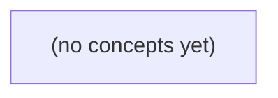

# 10.03 Git状态与版本记录：保存和解释一次IM规则修改

*面向零基础学习者，以虚构的 im-git-practice 个人练习目录和 message-rules.txt 的规则演进为主线，建立从保存文件、查看状态、暂存、提交到解释历史的完整本地 Git 心智模型。全章把“最大 6 字节”修改为“最大 12 字节”、再补充空格规则的过程拆开观察，并在第二遍阅读中延伸到分支、恢复、撤销和远端协作的基础边界。*

**章节:** 2

---

## 本书导览

- 了解整本书的章节脉络
- 掌握各章之间的概念依赖关系
- 选择最合适的阅读顺序

# 10.03 Git状态与版本记录：保存和解释一次IM规则修改

面向零基础学习者，以虚构的 im-git-practice 个人练习目录和 message-rules.txt 的规则演进为主线，建立从保存文件、查看状态、暂存、提交到解释历史的完整本地 Git 心智模型。全章把“最大 6 字节”修改为“最大 12 字节”、再补充空格规则的过程拆开观察，并在第二遍阅读中延伸到分支、恢复、撤销和远端协作的基础边界。

下方的概念图展示了本书 0 个核心概念以及它们之间的依赖关系；再下方是 1 个章节的入口。你可以按从上到下的顺序阅读，也可以根据自己的兴趣或先验知识选择切入点。

#### 概念图



## 章节索引

- **10.03 Git 状态与版本记录：保存和解释一次 IM 规则修改** — 先以纯文本IM规则在个人目录学习工作区、暂存区、提交和差异，再以第二遍阅读理解分支、恢复、远端与共享历史。

## 10.03 Git 状态与版本记录：保存和解释一次 IM 规则修改

- 从一次消息规则修改理解版本管理
- 建立个人练习仓库与第一份规则
- 暂存区、差异与一次有意的提交
- 历史、提交身份与可解释的修改
- 第二遍阅读：分支、合并和冲突
- 第二遍阅读：恢复文件与撤销提交
- 第二遍阅读：远端、fetch、pull与push
- 综合练习、边界复盘与OpenIM阅读

本节以独立目录中的一份消息规则文本为主线，理解保存文件、暂存修改与提交本地历史分别解决什么问题。

### 先分清保存、Git与本地仓库

### 先分清保存、Git与本地仓库

本节使用虚构的独立练习目录 `im-git-practice`，其中的 `message-rules.txt` 记录教学用的 IM 消息规则；这些规则不代表 OpenIM 的真实规则。开始前只需会编辑文本、保存文件和在终端进入目录。

**保存**是编辑器把内存中的文本写入磁盘。例如，你把规则 v1 写为“单条非空 UTF-8 文本最大 6 字节”，按下保存后，`message-rules.txt` 已更新；但 Git 尚未自动记录这次修改。

**Git** 是管理文件历史的本地工具。它帮助我们回答：改了什么、为什么改、现在文件处于什么状态、还能否找回旧版。GitHub 则是可选的在线托管平台，不是 Git 本身；本节只使用本地 Git，不需要账号、邮箱凭据或远端仓库。

**本地仓库**是某个目录中的本地历史存储，由 Git 初始化后产生。它保存提交记录；提交可理解为“被跟踪文件树在某一时刻的快照”，并附带作者、时间、说明和父提交等信息。快照是逻辑模型：不要把它误解为每次都物理复制整个目录，也不要认为未跟踪文件会被自动提交。

同一份 `message-rules.txt` 会同时对应三种版本视角：

| 位置 | 简写 | 表示什么 |
|---|---|---|
| 工作区 | W | 当前磁盘上、正在编辑的文件 |
| 暂存区（index） | I | 准备写入下一次提交的内容 |
| 最新提交 | H | 已保存到本地历史的版本 |

典型流向是：

`编辑并保存文件（W） → git add 选择内容（I） → git commit 形成提交（H）`

因此，“文件已保存”只说明工作区更新；“已提交”才说明该版本进入本地仓库历史。之后规则从 v1 的 6 字节改为 v2 的 12 字节，再到 v3 明确“空格仍按原字节计数”时，Git 提交能让我们定位这些变化，并查看示意旧版本 `C1`、`C2`。

### 规则为何从6字节改为12字节

### 规则为何从6字节改为12字节

先明确教学设定：`message-rules.txt` 记录一条即时消息（IM）的文本规则，不代表任何真实产品规则。这里的“字节”是 UTF-8 编码后占用的存储单位；“字符”是人眼看到的文字单位，两者不一定相同。

规则先从 v1 开始：

```text
v1：一条消息必须是非空 UTF-8 文本，最大 6 字节。
```

6 字节适合极短提示，但很快暴露需求不足。例如 UTF-8 中，英文 `hello` 通常占 5 字节，`hello!` 占 6 字节；而一个常见汉字通常占 3 字节，因此 `你好` 占 6 字节，`你好呀` 通常占 9 字节，无法通过 v1。若产品希望用户能发送稍完整的短句，就需要扩大上限。

因此修改为：

```text
v2：一条消息必须是非空 UTF-8 文本，最大 12 字节。
```

这次改动改变的是**允许的最大字节数**，不是“最大 12 个字”。在常见 UTF-8 编码下，`你好世界` 通常为 $4\times3=12$ 字节，可以接受；`你好世界！` 通常为 15 字节，仍应拒绝。混合文本也按总字节数计算：`hi你好` 通常为 $2+3+3=8$ 字节。

随后补充 v3，用来消除一个常见误解：

```text
v3：空格也属于文本内容，仍按 UTF-8 字节总数计数。
```

例如 `你 好` 通常占 $3+1+3=7$ 字节；空格不是“免费分隔符”。同时，“非空”表示不能提交空文本；只有空格的文本是否允许，必须由规则明确。本练习仅说明空格要计入字节，不额外把“全为空格”解释为有效或无效。

这三版规则回答了三件事：为什么要从短提示扩展到短句、具体把上限从 6 改到 12、以及边界如何按 UTF-8 字节而非视觉字符数判断。之后用 Git 提交分别保存这些版本，便能在需要时找到旧版 v1，而不必依赖记忆。

### 工作区、暂存区与提交快照

### 工作区、暂存区与提交快照

**工作区**是你当前用编辑器看到并保存文件的目录；**暂存区**（`index`）是准备写入下一次提交的候选版本；**提交**是 Git 保存的一次本地历史记录。三者描述的是同一个文件在不同阶段的内容，并不是文件被物理搬到三个地方。

设 `message-rules.txt` 的规则这样演进：

- v1：单条非空 UTF-8 文本最大 `6` 字节。
- v2：最大值改为 `12` 字节。
- v3：补充说明：空格也按原始字节数计入。

用 `W`、`I`、`H` 分别表示工作区、暂存区和最近一次提交（`HEAD`）中的版本：

| 时刻 | W：工作区 | I：暂存区 | H：提交快照 |
|---|---|---|---|
| 刚提交 v1 后 | v1 | v1 | C1：v1 |
| 编辑并保存为 v2 后 | v2 | v1 | C1：v1 |
| 执行 `git add` 后 | v2 | v2 | C1：v1 |
| 执行 `git commit` 后 | v2 | v2 | C2：v2，父提交为 C1 |
| 编辑并保存 v3 后 | v3 | v2 | C2：v2 |

流向可概括为：

`编辑器保存` → `W` → `git add message-rules.txt` → `I` → `git commit -m "..."` → `H`

这里的 `C1`、`C2` 只是示意名称；真实 Git 会生成一串提交标识。`git add` 不会提交，只是选择“下一次要保存哪份内容”；`git commit` 才会把暂存区中**已跟踪文件**的状态记录为快照，并附带作者、时间、说明和父提交等信息。未跟踪文件不会因为提交发生而自动进入历史。

因此，编辑器里的“保存”只能保证 v2 写进当前磁盘文件；提交才能让以后通过 C1 找回 v1、通过 C2 解释“为何从 6 字节改为 12 字节”。Git 是本地版本管理工具，仓库是本地历史存储；GitHub 是可选的托管平台，本节不需要它。

### 完成一次可解释的规则提交

### 完成一次可解释的规则提交

下面命令均为你**将来在自己终端执行的示例**，编写本教材时未运行。先进入独立练习目录；它不是课程仓库，也不需要账号、邮箱凭据、远端或 GitHub。

```text
cd im-git-practice
```

前置状态：目录存在，且其中有文本文件 `message-rules.txt`。先检查 Git 版本，需为 2.28 或更高：

```text
git --version
git init -b main
git config --local user.name "user-a"
git config --local user.email "learner@example.invalid"
```

`git init -b main` 在当前目录创建**本地仓库**并指定初始分支名；`--local` 只把身份写入此仓库，不修改电脑的全局设置。Git 是记录历史的工具，仓库是本地历史存储；GitHub 则是可选的托管平台，本练习不使用它。

编辑并保存 `message-rules.txt`，写入 v1：

```text
消息规则 v1
单条消息必须是非空 UTF-8 文本，最大 6 字节。
```

“保存文件”只改变工作区（W），还没有历史记录。查看当前状态和差异：

```text
git status
git diff
```

确认内容无误后暂存：

```text
git add message-rules.txt
git diff --staged
```

`add` 把当前内容写入暂存区（I，也称 index）的候选快照，不是把文件物理搬走。最后创建提交：

```text
git commit -m "记录消息规则v1：非空且最大6字节"
git status
```

提交（H）保存被跟踪文件树的逻辑快照，以及作者、时间、说明和父提交等信息；未跟踪文件不会自动进入提交。若这次提交示意为 `C1`，状态可概括为：

| 时刻 | W 工作区 | I 暂存区 | H 提交历史 |
|---|---|---|---|
| 保存 v1 后 | v1 | 空/旧内容 | 无 |
| `add` 后 | v1 | v1 | 无 |
| `commit` 后 | v1 | v1 | C1：v1 |

流向是：`修改文件 → git add → git commit`。日后将 6 字节改为 12 字节时，重复“查看差异、暂存、提交”，即可形成示意提交 `C2`；因此不仅能说明“为什么放宽长度限制”，也能用历史找到旧版 v1。

### 查找旧版并识别常见误解

### 查找旧版并识别常见误解

先用状态区分“文件现在在哪里被记录”。设 `C1` 是规则上限为 6 字节的提交，`C2` 是上限改为 12 字节的提交；它们只是示意名称，不是真实哈希值。

| 状态 | 工作区 W | 暂存区 I（index） | 最新提交 H | 能否用提交历史找回 |
|---|---|---|---|---|
| 未跟踪 | 有新文件 | 无 | 无 | 不能 |
| 已修改 | 内容已变 | 仍是旧内容 | 仍是旧内容 | 只能找回旧提交版本 |
| 已暂存 | 内容已变 | 已准备新内容 | 仍是旧内容 | 尚未成为历史 |
| 已提交 | 通常相同 | 通常相同 | 已有新快照 | 能 |

例如在 `im-git-practice` 目录中，`message-rules.txt` 从 v1 改到 v2 后，即使已经按编辑器的“保存”，也只是写入工作区；只有执行 `git add message-rules.txt`，修改才进入暂存区；再执行 `git commit -m "将消息上限改为12字节"`，才形成可追溯的 `C2`。

未来练习可在**已存在本地仓库且已有 C1、C2 提交**的 `im-git-practice` 目录执行，以下命令未在编写时运行：

`git log --oneline`

预期可看到类似 `C2 将消息上限改为12字节` 和更早的 `C1 添加6字节消息规则`。随后：

`git show C1:message-rules.txt`

预期显示旧规则文本，从而确认“最大 6 字节”仍在本地历史中。

常见误解是：`git add` 不等于提交；保存文件不等于 Git 保存历史；未跟踪文件不会因提交其他文件而自动加入；Git 是本地版本管理工具，仓库是本地历史存储，GitHub 则是可选的托管平台。本节尚未使用 GitHub，旧版也完全可以在本机查找。

> **要点** — 文件保存改变工作区；add选择快照内容；commit把被跟踪内容连同说明写入本地可追溯历史。

本节用一个独立的个人练习目录，记录一份纯文本 IM 规则从未保存到首次提交的完整过程，学会读懂 Git 的状态变化。

### 准备独立练习仓库

### 准备独立练习仓库

先准备一个**独立练习仓库**：它是只用于本节练习的目录，不应放进公司的项目、已有课程仓库或其他 Git 仓库内部。这样后续创建、暂存和提交 `message-rules.txt` 时，不会影响任何真实文件。

打开终端后，先用 `cd` 进入一个确认**不属于已有 Git 仓库**的个人练习父目录。随后依次执行：

`mkdir im-git-practice`

这会创建名为 `im-git-practice` 的新目录。接着执行：

`cd im-git-practice`

现在终端所在位置就是本次练习目录。执行：

`pwd`

`pwd` 会显示当前目录的完整路径；请确认输出末尾是 `im-git-practice`。这是定位命令，不修改文件。

接着检查 Git 是否可用：

`git --version`

该命令会显示 Git 版本，例如 `git version 2.43.0`。本节需要 Git 2.28 或更高版本，因为后面会使用 `git init -b`、`git switch` 和 `git restore`。若终端提示找不到 Git，不要在没有授权的设备上自行安装；应查看 Git 官方安装文档，或询问设备管理员。

确认版本后，在 `im-git-practice` 目录执行：

`git init -b main`

这会创建一个新的本地 Git 仓库，并把初始分支命名为 `main`。**仓库**是 Git 用来记录文件版本历史的目录；其内部会出现隐藏的 `.git` 目录。`.git` 保存提交记录、分支和暂存信息，不是业务文件，不能用编辑器随意修改或删除。

最后设置仅对此仓库生效的提交身份：

`git config --local user.name "IM Learner"`

`git config --local user.email "learner@example.invalid"`

这里的**本地配置**只写入当前仓库的 `.git/config`，不会修改电脑的全局 Git 设置。它们是未来提交记录的署名信息；本练习使用教学身份，不需要真实姓名、邮箱、账号、凭据或远端仓库。

此时目录已是一个空的本地仓库，尚未创建业务文件，也尚无任何提交。

### 创建第一份消息规则

### 创建第一份消息规则

现在位于 `im-git-practice` 目录后，用任意纯文本编辑器新建业务文件 `message-rules.txt`。**业务文件**是项目真正要保存和演进的内容；这里它记录虚构 IM 系统的消息文本规则。请逐行输入以下内容并保存：

```text
消息文本规则
1. 单条消息不能为空。
2. 单条消息最多包含 200 个字符。
3. 消息中不记录用户密码。
```

这些规则只是本课程的教学设定，并不代表 OpenIM 或其他真实产品的规则。

保存后，文件路径应为：

`im-git-practice/message-rules.txt`

不要把它创建到其他目录，也不要误命名为 `message-rules.txt.txt`。可在终端、且仍位于 `im-git-practice` 中执行：

`git status --short`

此时预期看到：

```text
?? message-rules.txt
```

`??` 表示**未跟踪**：Git 发现了这个文件，但尚未把它纳入版本记录。

同时注意目录中的 `.git`。它是 Git 在执行 `git init -b main` 时创建的**隐藏元数据目录**，其中保存提交记录、暂存信息和分支指针等 Git 内部数据。`.git` 不是消息规则文件，也不应使用编辑器随意修改、删除或复制其中的内容；本练习只编辑 `message-rules.txt`。

### 识别未跟踪与暂存状态

### 识别未跟踪与暂存状态

**工作区**是你正在编辑的目录内容，例如 `im-git-practice` 中刚创建的 `message-rules.txt`；它保存的是当前磁盘上的文件。**暂存区**是 Git 为“下一次提交”准备的清单：只有放入暂存区的内容，才会成为下一次版本记录的一部分。**未跟踪文件**则是工作区中存在、但 Git 还没有开始记录的文件。

在 `im-git-practice` 目录中，用编辑器创建 `message-rules.txt`，逐行写入：

```text
IM 文本规则
1. 消息不能为空。
2. 单条消息最多 500 个字符。
```

保存后，以下命令是你将来执行的示例；编写本教材时并未运行：

`git status --short`

前置状态是：仓库刚初始化、尚未提交，`message-rules.txt` 已保存但从未执行过 `git add`。预期可见：

`?? message-rules.txt`

`??` 表示“未跟踪”：前一个 `?` 描述暂存区，后一个 `?` 描述工作区；两个位置都不知道这个文件。Git 不会自动把新文件纳入提交，因为新建的临时文件、笔记或误生成内容未必应进入版本记录。

若确认这份教学规则应被保存，在同一目录执行：

`git add -- message-rules.txt`

该命令会修改**暂存区**，把当前文件内容放入下一次提交候选项；不会创建提交，也不会删除工作区文件。再次执行：

`git status --short`

预期为：

`A  message-rules.txt`

这里 `A` 后有一个空格：`A` 位于第一列，表示文件已在暂存区中“新增”；第二列为空格，表示工作区相对暂存区没有新的改动。可以用 `git diff --cached -- message-rules.txt` 检查将被首次提交的内容。

不要把 `.git` 当作业务目录编辑；它保存 Git 的内部元数据。也不要在首次提交前套用以 `HEAD` 为基准的暂存恢复操作，因为此时 `HEAD` 尚未指向任何提交。

### 检查将要保存的规则

### 检查将要保存的规则

**暂存区**是 Git 在提交前保存“准备写入下一版”的区域。执行 `git add -- message-rules.txt` 后，文件并未形成正式版本；它只是从未跟踪状态变为暂存状态。此时应先核对内容，再提交。

在 `im-git-practice` 目录中，前置状态应为：

| 命令 | 预期含义 |
|---|---|
| `git status --short` | `A  message-rules.txt` |
| 左侧 `A` | 文件已加入暂存区 |
| 右侧空格 | 工作目录相对暂存区没有新的改动 |

以下命令是供你之后执行的示例，编写本教材时未实际运行：

`git diff --cached -- message-rules.txt`

其中，`git diff` 用于比较内容；`--cached` 表示比较“暂存区”和当前 `HEAD`；`--` 表示后面是文件路径，不是命令选项。首次提交前还没有 `HEAD` 指向的旧版本，因此 Git 会把暂存的文件显示为新增内容，通常可看到类似：

```text
+消息文本规则
+1. 消息内容不能为空。
+2. 消息长度不得超过 500 个字符。
```

每行前的 `+` 表示这行将被加入下一次提交，不是文件中的真实字符。请逐行确认：文件名是否正确、规则是否完整、是否误把草稿或无关文本加入暂存区。

反例：只看编辑器中的文件就直接提交。编辑器展示的是工作目录内容，而提交保存的是暂存区内容；若你在 `git add` 后又修改文件，新修改不会自动进入本次提交。养成固定顺序：编辑 → `git add` → `git diff --cached` → 提交。

### 完成首次提交并验证结果

### 完成首次提交并验证结果

此时假定你位于个人练习仓库 `im-git-practice`，并且已经执行过：

- `git add -- message-rules.txt`
- `git diff --cached -- message-rules.txt`

**提交（commit）**是把暂存区中的内容保存为一条本地版本记录。提交说明用于概括“这次为什么保存”，应描述改动目的，而不是只写“更新”。

在前置状态为 `message-rules.txt` 显示为 `A `（已暂存的新文件）时，执行：

`git commit -m "docs: record initial IM text rules"`

这条命令在当前仓库中创建首次提交：

- `git commit`：把暂存区快照写入 Git 的版本历史。
- `-m`：直接提供提交说明。
- `"docs: record initial IM text rules"`：教学用说明，表示记录初始的 IM 文本规则；这些规则是本课程设定，并非 OpenIM 的真实规则。

首次提交前，`HEAD`——Git 用来指向“当前提交”的引用——还没有可指向的提交记录。因此，首次提交前不要按“恢复到 HEAD”的思路操作；此时并不存在旧版本可恢复。

提交成功后，执行：

`git status`

预期会看到类似信息：

`On branch main`  
`nothing to commit, working tree clean`

这里的**工作区（working tree）**是你在编辑器中实际看到的文件目录；“干净”表示：

| 区域 | `message-rules.txt` 状态 |
|---|---|
| 工作区 | 与最近提交一致 |
| 暂存区 | 没有待提交内容 |
| 本地历史 | 已有首次提交 |
| `HEAD` | 指向这次首次提交 |

反例：若提交前忘记执行 `git add -- message-rules.txt`，`git commit` 不会自动保存该文件；应先用 `git status --short` 确认它仍是 `?? message-rules.txt`，再暂存后提交。

练习反馈：若 `git status` 显示工作区干净，说明首次版本记录已完成；若仍显示修改或未跟踪文件，不要急着再次提交，先读清每一行状态，确认是否确实希望把该文件纳入这次规则记录。

> **要点** — Git 先识别工作区改动，再暂存并核对，最后提交为可解释的本地版本记录。

本节用一个独立练习目录，跟踪 IM 规则从 v1 到 v3 的三份内容，理解 Git 到底准备保存了什么。

### 建立独立练习仓库

### 建立独立练习仓库

先建立一个**独立练习目录**，不要在真实项目、课程资料目录或公司代码目录中练习。这里的业务规则均为教学设定，与 OpenIM 无关。

- **工作区**：你正在编辑和保存文件的普通目录。
- **Git 仓库**：由 Git 管理版本记录的目录；其中隐藏的 `.git` 目录保存历史、暂存内容和配置。
- **提交**：一次被永久记录到本地历史中的文件快照。
- **暂存区**：提交前的准备区；它保存“下一次准备提交什么”，不是自动追踪工作区的全部最新内容。

在终端中进入你准备放练习的位置，先确认 Git 版本。本章需要 Git 2.28 或更高版本：

```text
git --version
```

预期看到类似 `git version 2.40.0` 的输出；这是学习者将来执行的示例，本书编写时未在你的电脑上运行。

接着创建并进入个人练习目录，然后初始化名为 `main` 的本地仓库：

```text
mkdir im-git-practice
cd im-git-practice
git init -b main
```

这些命令应在**新建的 `im-git-practice` 目录外或其父目录中**执行；它们会创建目录，并在目录内创建 `.git`，但不会创建任何业务文件，也不会连接远端仓库。

Git 提交通常需要作者身份。为避免修改电脑上的全局设置，只在当前仓库内设置教学身份：

```text
git config --local user.name "user-a"
git config --local user.email "learner@example.invalid"
```

现在工作区是空的，仓库也还没有提交。可执行：

```text
git status
```

预期状态类似“当前分支 `main` 尚无提交，且没有需要提交的内容”。这说明 Git 已开始管理此目录，但尚未有任何版本记录。

### 先比较 v1 与 v2

### 先比较 v1 与 v2

假设当前位于独立练习目录 `im-git-practice`，并且 `message-rules.txt` 的 v1 已经提交：规则是“消息正文最大 6 字节”。**工作区**是你正在编辑、保存文件的目录内容；**索引**（也叫暂存区）是 Git 准备纳入下一次提交的快照。此时二者都还是 v1。

现在仅编辑并保存 `message-rules.txt`，把规则改为教学设定的 v2：

```text
消息正文最大 12 字节。
```

以下命令是你之后可执行的示例，编写本教材时未实际运行。前置状态是：文件已跟踪、索引仍为 v1、工作区已保存 v2；该命令只读取差异，不修改文件、索引或提交记录：

`git diff -- message-rules.txt`

`--` 表示其后的内容按文件路径解释，避免 Git 把名称误当成其他参数。输出通常含有类似内容：

```diff
@@ -1 +1 @@
-消息正文最大 6 字节。
+消息正文最大 12 字节。
```

这里的 `-` 表示“索引中有、工作区中删除”的旧行，`+` 表示“工作区新增”的新行；它们不是文本文件里真实存在的减号和加号。`@@ -1 +1 @@` 是**差异块头**：`-1` 指旧版本从第 1 行附近开始，`+1` 指新版本从第 1 行附近开始。差异块（hunk）是 Git 将相邻改动组织成的一段比较结果；若周围有未改动行，通常会作为上下文显示，帮助定位改动。

此刻可概括为：

| 位置 | `message-rules.txt` 内容 |
|---|---|
| HEAD（上次提交） | v1：最大 6 字节 |
| 索引 | v1：最大 6 字节 |
| 工作区 | v2：最大 12 字节 |

因此，`git diff` 证明的是“工作区与索引不同”，并不证明“12 字节”这一业务规则正确。确认规则内容后，下一步才可用 `git add message-rules.txt` 把当前 v2 复制到索引。

### 暂存 v2 后继续写 v3

### 暂存 v2 后继续写 v3

假设你已在 `im-git-practice` 目录完成 v1 提交：`message-rules.txt` 的 `HEAD`、索引和工作区都规定“消息最大 6 字节”。`HEAD` 是当前提交版本；**索引**（又称暂存区）是下次提交准备保存的内容；**工作区**是你正在编辑的文件。

先把规则改为 v2：

```text
消息最大 12 字节。
```

在 `im-git-practice` 目录中，前置状态为文件已被 Git 跟踪、v1 已提交。以下命令是你将来执行的示例，本文编写时未运行：

`git diff -- message-rules.txt` 不修改文件，只显示“工作区相对索引”的差异。确认后执行：

`git add message-rules.txt`

它会把**此刻**的 v2 写入索引，不会自动收集该文件未来的修改。随后继续编辑为 v3：

```text
消息最大 12 字节。
消息前后不得有空格。
```

此时运行 `git status --short`，预期看到：

```text
MM message-rules.txt
```

普通非合并状态中，第一个 `M`（X）表示“索引相对 `HEAD` 已修改”：索引是 v2；第二个 `M`（Y）表示“工作区相对索引已修改”：工作区是 v3。

| 位置 | 当前内容 |
|---|---|
| `HEAD` | v1：最大 6 字节 |
| 索引 | v2：最大 12 字节 |
| 工作区 | v3：再加空格规则 |

用 `git diff --cached` 查看 `HEAD → 索引`，因此看到 v1 到 v2；用 `git diff` 查看“索引 → 工作区”，因此看到新增空格规则；`git diff HEAD` 查看“HEAD → 工作区”，会合并展示 v1 到 v3。未跟踪文件不会出现在这类差异中。

差异中的 `-` 表示旧侧删除行，`+` 表示新侧新增行；未带符号的是上下文。`@@ ... @@` 是差异块（hunk）的位置范围提示，不是业务规则。差异只能证明文本不同，不能证明“最大 12 字节”或空格规则一定正确。

若现在执行 `git commit`，提交只会保存索引中的 v2；工作区仍保留未暂存的 v3。要让 v3 进入下一次提交，必须在确认后再次执行 `git add message-rules.txt`。

### 用三种差异确认版本

### 用三种差异确认版本

先定义三个参照物：`HEAD` 是最近一次提交；**索引**（也称暂存区）是下一次提交准备保存的内容；**工作区**是磁盘上当前编辑保存的文件。普通、未合并的状态下，`git status --short` 的两列可读作：`X` 表示“索引相对 `HEAD`”，`Y` 表示“工作区相对索引”。

假设位于 `im-git-practice`，且 `message-rules.txt` 已从 v1 暂存为 v2，随后又编辑保存为 v3，补充“首尾空格不允许”的教学规则。此时预期状态为：

| 文件 | HEAD | 索引 | 工作区 | 简短状态 |
|---|---|---|---|---|
| `message-rules.txt` | v1：最大 6 字节 | v2：最大 12 字节 | v3：最大 12 字节，补充空格规则 | `MM` |

以下命令均是你将来在 `im-git-practice` 中执行的示例，编写本教材时未实际运行：

- 前置状态为 `MM` 时，`git diff --cached -- message-rules.txt` 比较 **HEAD → 索引**，因此只显示 v1 改为 v2：最大长度从 6 改为 12。
- `git diff -- message-rules.txt` 比较 **索引 → 工作区**，因此只显示 v2 改为 v3：新增空格规则。
- `git diff HEAD -- message-rules.txt` 比较 **HEAD → 工作区**，显示 v1 到 v3 的合并结果，即长度修改和空格规则都会出现。

差异输出中，`-` 开头是旧参照物独有的行，`+` 开头是新参照物新增的行；未带符号的行是上下文。形如 `@@ -1,2 +1,3 @@` 的块头说明：旧文件从第 1 行起涉及 2 行，新文件从第 1 行起涉及 3 行。它描述文本变化位置，不证明规则本身正确。

注意：未跟踪文件不在 `HEAD` 或索引中，`git diff HEAD` 不会显示它们。此刻若执行 `git commit`，提交只会保存索引中的 v2；工作区的 v3 仍保留但未暂存。若要让下一次提交包含当前 v3，需重新执行 `git add message-rules.txt`；这只是把**当前内容**写入索引，不是预先选择该文件未来的一切修改。

### 提交有意选择的 v2

### 提交有意选择的 v2

当前位于 `im-git-practice`，并且已经满足此前状态：`message-rules.txt` 的**索引区**暂存了 v2“最大 12 字节”，而**工作区**又保存了尚未暂存的 v3“补充空格规则”。可先确认：

`git status --short`

预期看到：

`MM message-rules.txt`

普通非合并状态下，左侧 `X` 表示“索引区相对 `HEAD` 的状态”，右侧 `Y` 表示“工作区相对索引区的状态”。因此 `MM` 表示：

| 位置 | `message-rules.txt` 内容 |
|---|---|
| `HEAD` | v1：最大 6 字节 |
| 索引区 | v2：最大 12 字节 |
| 工作区 | v3：v2 加上空格规则 |

现在执行下面命令；这是供你之后在该目录执行的示例，编写本教材时未实际运行：

`git commit -m "将消息长度上限调整为12字节"`

前置状态是索引区已有 v2，且仓库内已配置本地身份，例如 `user-a` 与 `learner@example.invalid`。此命令会创建一个新的本地提交：它读取的是**索引区**，所以提交记录保存 v2，而不是工作区中最新保存的 v3。

提交后再次执行：

`git status --short`

预期为：

` M message-rules.txt`

左侧空格表示索引区与新的 `HEAD` 一致；右侧 `M` 表示工作区仍比索引区多出 v3 的空格规则。用下列命令分别验证：

- `git show --stat --oneline HEAD`：查看刚提交的版本概况。
- `git diff HEAD -- message-rules.txt`：查看已提交 v2 与工作区 v3 的差异。

常见误解是：“我已经保存文件，所以 `git commit` 会提交全部内容。”实际上，编辑器的保存只写入工作区；`git commit` 只保存当时已由 `git add` 放入索引区的快照。若要提交 v3，必须确认规则正确后再次执行 `git add -- message-rules.txt`，再创建另一笔提交。

> **要点** — Git 提交保存的是当时索引中的 v2；工作区后续写出的 v3 不会自动进入提交。

本节把已完成的 v3 规则保存为一次可解释的提交，并学习从历史中准确回答“改了什么、为何改、当前内容是什么”。

### 从工作区修改到 v3 提交

### 从工作区修改到 v3 提交

**工作区**是你当前直接编辑文件的目录；这里是独立练习目录 `im-git-practice`。**暂存区**是提交前的候选清单：只有被加入暂存区的内容才会进入下一次提交。**提交**是 Git 在本地仓库中保存的一份不可变版本记录，包含文件快照、说明文字和父版本关系。

先进入练习目录并确认 Git 版本。本节命令均为示例，编写时未实际运行：

```text
cd im-git-practice
git --version
```

需要 Git 2.28 或更高版本。若这是刚建立的练习仓库，可用 `git init -b main` 初始化；`main` 是初始分支名。分支可理解为“指向某次提交的可移动标签”，而 `HEAD` 通常表示当前所在分支及其最新提交。

提交需要记录作者信息，但这不是账号登录、身份认证或权限设置。为避免改动电脑的全局配置，在 `im-git-practice` 内设置仅对此仓库生效的身份：

```text
git config --local user.name user-a
git config --local user.email learner@example.invalid
```

现在假设前一节已把 `message-rules.txt` 编辑为 v3：例如增加“空消息拒绝”和“正文最长 500 字符”的教学规则。保存文件后，工作区有修改，但历史尚未改变：

```text
git status
```

预期会看到 `message-rules.txt` 被修改且“未暂存”。确认内容正确后，将它加入暂存区：

```text
git add message-rules.txt
git status
```

此时预期显示“将要提交的更改”。最后创建 v3 提交：

```text
git commit -m "更新消息规则：拒绝空消息并限制正文长度"
git status
```

好的提交信息应说明**动机、行为变化和证据线索**：这里的动机是完善消息校验，行为是拒绝空消息并限制长度，证据是修改的规则文件。相比之下，`git commit -m "update"` 只说明“更新了”，无法帮助后来者理解规则变化。

提交成功后，`git status` 通常显示工作区干净；它只表示当前文件与最新本地提交一致，**不表示**规则一定正确、UTF-8 校验已被证明、程序已测试或已部署，也不表示与任何远端同步。本节的所有业务规则仅为教学设定，并非来自 OpenIM。

### 用状态表确认保存边界

### 用状态表确认保存边界

**工作区**是你正在编辑的目录内容；**暂存区**是准备写入下一次提交的快照清单；**提交**是 Git 已保存、可在历史中查找的版本记录。三者形成“正在改—准备保存—已经保存”的边界。

以下命令均是你将来在 `im-git-practice` 目录执行的示例，编写本教材时未实际运行。假设上一节已提交 `v2`，现在把 `message-rules.txt` 编辑为教学设定的 `v3` 规则。

| 时点 | 前置操作 | `git status` 的关键含义 | `message-rules.txt` 位于哪里 |
|---|---|---|---|
| 修改后 | 保存文件，尚未暂存 | `Changes not staged for commit`：工作区与最近提交不同 | 只有工作区是 v3 |
| 暂存后 | `git add message-rules.txt` | `Changes to be committed`：暂存区将写入下次提交 | 工作区、暂存区是 v3；历史仍是 v2 |
| 提交后 | `git commit -m "更新消息规则到 v3"` | `nothing to commit, working tree clean` | 工作区、暂存区、当前提交都是 v3 |

例如，修改并保存文件后，在 `im-git-practice` 中执行：

`git status`

此时 Git 不会自动保存修改；它只报告“发现了尚未暂存的差异”。确认本次只想保存该规则文件后，执行：

`git add message-rules.txt`

`add` 的含义是把**当前这一刻**的文件内容复制到暂存区，不是永久跟踪，也不是提交。若你随后再次编辑文件，新的编辑仍留在工作区，需要再次 `git add` 才会进入提交。

最后执行提交命令，Git 才创建版本记录。反例是看到“干净”就认为一切完成：`working tree clean` 仅说明工作区相对当前提交没有未保存改动；它**不证明**规则正确、文件符合 UTF-8、程序测试通过、已经部署，或与任何远端同步。

### 读取提交图与版本指针

### 读取提交图与版本指针

**提交**是 Git 保存的一次版本快照，并记录提交说明、作者配置、时间和父提交。每个提交有一串哈希标识；日志中常显示其缩写，长度并不固定，不能把它当作固定的 40 位文本。

**分支**是指向某个提交的可移动名称，例如 `main`。通常，`HEAD` 指向当前分支，而当前分支再指向最新提交；因此保存 v3 后，可以理解为：

`HEAD` → `main` → `保存 v3 的提交` → `v2 提交` → `更早提交`

箭头表示“指向父版本的关系”，不等于屏幕上的时间排列方向。日志通常把较新的提交显示在上方、较旧的显示在下方；而提交图中的父提交是当前提交的前一个版本。

`HEAD~1` 表示 `HEAD` 的第一个父提交，也就是当前提交的上一版。若仓库只有首个提交，它没有父提交，因此不能使用 `HEAD~1`。

在将来练习时，先在终端进入独立目录 `im-git-practice`，前置状态是已初始化本地仓库、当前位于 `main`，且 v3 已作为一次提交保存。以下命令仅用于观察，不会修改文件、暂存区或提交历史；本教材编写时未实际运行：

```text
git log --oneline --decorate --graph
```

预期会看到提交图、缩写哈希和提交说明；`HEAD -> main` 表示当前 `HEAD` 与 `main` 都指向同一最新提交。再执行：

```text
git log -3
```

预期显示最近三次提交的完整说明、作者配置和日期。作者配置只是提交记录中的署名信息，不是身份认证，也不表示拥有任何权限。

若日志显示 v3 提交位于最上方，则它是当前版本；其下一行通常就是 `HEAD~1`。注意：Git 只能证明这些文件和提交记录存在，不能证明 UTF-8 规则或业务规则本身正确。

### 从历史证明规则如何变化

### 从历史证明规则如何变化

**历史**是已保存提交按父子关系连接的记录。通常，`HEAD` 指向当前分支，分支再指向最新提交；`HEAD~1` 表示 `HEAD` 的父提交。首个提交没有父提交，因此不能对它使用 `HEAD~1`。

以下命令均是你将来在 `im-git-practice` 目录执行的示例，编写本教材时未实际运行。前置状态：v3 已作为最新提交保存，工作区最好干净。

| 想回答的问题 | 命令 | 读取的证据 |
|---|---|---|
| 最近几次提交是什么 | `git log -3` | 提交标识、作者、日期、说明 |
| 历史关系如何连接 | `git log --oneline --decorate --graph` | 分支、`HEAD` 与父提交图 |
| 最新提交改了什么 | `git show HEAD -- message-rules.txt` | 提交说明和该文件差异 |
| v3 文件当前全文是什么 | `git show HEAD:message-rules.txt` | `HEAD` 中该文件内容 |
| v2 到 v3 的规则差异是什么 | `git diff HEAD~1 HEAD -- message-rules.txt` | 两个版本的逐行变化 |

例如，先查看提交：

`git show HEAD -- message-rules.txt`

输出中的提交说明应解释**动机、行为变化、证据**。较差的信息是 `update`：它没有说明更新了什么。较好的信息如“规则：拒绝空消息并保留 UTF-8 字符”，读者能知道行为变化；若再说明“依据 v3 手工检查样例”，证据更完整。

注意：`git show HEAD:message-rules.txt` 中的冒号表示“读取某次提交里的文件”，不会修改工作区。`git diff HEAD~1 HEAD -- message-rules.txt` 中，`-` 是较早的 v2，`+` 是较新的 v3；这表示内容演进方向，不等于历史图的上下排布方向。

日志中的短 hash 只是提交标识的缩写，长度可能变化，不能背诵固定值。作者配置只记录文本作者信息，不是身份认证或权限证明。类似地，Git 能证明“提交保存了哪些字节和差异”，不能证明 UTF-8 规则或业务规则一定正确；`git status` 显示干净，也不代表已测试、已部署或已同步远端。

### 写出可解释而不过度承诺的提交

### 写出可解释而不过度承诺的提交

**提交信息**是对一次已保存修改的文字说明。它应帮助未来的自己回答三件事：

1. **动机**：为什么要改？
2. **行为变化**：规则从什么变成什么？
3. **证据**：依据是什么，例如练习要求、人工检查或对应版本号。

假设 `im-git-practice/message-rules.txt` 已写好教学设定的 v3 规则，并且已暂存。以下命令只是你将来在终端执行的示例；本教材编写时未运行它们。

| 提交信息 | 问题或价值 |
|---|---|
| `update` | 不知道更新了什么，也不知道为什么更新。 |
| `修改规则` | 知道对象是规则，但没有行为变化和依据。 |
| `将消息长度规则更新为 v3：拒绝空消息，并保留长度上限；依据 v3 练习要求人工检查文本` | 说明了对象、变化和证据，且没有夸大验证结果。 |

在 `im-git-practice` 目录、前置状态为 `git status` 显示 `message-rules.txt` 已暂存时，可以执行：

`git commit -m "将消息长度规则更新为 v3：拒绝空消息，并保留长度上限；依据 v3 练习要求人工检查文本"`

该命令会创建一个**提交**：Git 保存暂存区快照、提交说明、作者信息和父提交关系；它不会上传到远端、不会运行 Go 程序，也不会证明规则业务正确。

提交完成后，理想情况下执行 `git status` 会显示工作区干净。但“干净”只表示当前目录相对当前提交没有未记录修改，**不表示**已测试、已部署、已同步远端，或 UTF-8 等规则已经被 Git 验证。

若需要在此个人练习仓库记录作者，可在 `im-git-practice` 中设置：

`git config --local user.name "user-a"`  
`git config --local user.email "learner@example.invalid"`

这里的作者配置只是写入提交记录的标签，既不是身份认证，也不授予任何权限。提交信息应如实写“人工检查”而非“已完全验证”；Git 保存的是文本历史，不替你判断教学规则是否合理。

> **要点** — 提交保存可追溯快照；状态、日志和差异共同解释修改，但不自动证明规则正确、已测试或已同步。

本节以个人练习目录中的一份纯文本规则为主线，完成一次可追溯的分支修改、快进合并与冲突处理演练。

### 从干净工作区开始理解版本状态

### 从干净工作区开始理解版本状态

在开始修改规则前，先确认 Git 的三个本地状态区域：

- **工作区**：你正在编辑的目录内容。例如 `im-git-practice/message-rules.txt` 中刚保存、但尚未交给 Git 记录的文字。
- **暂存区**：准备进入下一次提交的文件清单。执行 `git add` 后，Git 把文件当时的内容放入这里；它也常被称为“索引”。
- **提交**：Git 保存的一次可追溯版本记录，包含暂存区中的内容、说明文字和前一个提交的关联。提交保存在本地仓库，不需要账号、网络或远端。

先在终端进入个人练习目录；以下命令是你之后执行的示例，本文编写时未实际运行：

`cd im-git-practice`  
`git --version`  
`git status`

本章要求 Git 为 2.28 或更高版本，以便后续使用 `git init -b`、`git switch` 和 `git restore`。`git status` 会报告工作区、暂存区相对最近提交的位置。

| `git status` 常见提示 | 含义 | 本节应如何处理 |
|---|---|---|
| `working tree clean` | 工作区和暂存区都与最近提交一致 | 可以开始操作 |
| `Changes not staged for commit` | 文件改了，但未暂存 | 先确认来源；不要混入本节练习 |
| `Changes to be committed` | 已暂存，但还未提交 | 先完成或撤回原任务 |
| `Untracked files` | 新文件尚未被 Git 跟踪 | 确认是否属于当前练习 |

**干净状态**指 `git status` 显示 `working tree clean`。这不是“目录没有文件”，而是 Git 已跟踪文件没有未提交差异，暂存区也没有待提交内容。它是本节的前提：后面切换分支、编辑空格规则和合并时，每个变化都能明确归属于本次练习。

反例是看到未提交修改仍继续执行 `git switch`。切换分支不会自动清空这些修改：它们可能被携带到新分支，也可能因会覆盖目标文件而被 Git 拒绝。为避免混淆，本课遇到非干净状态应先停下，查看 `git status` 与 `git diff`，确认原有修改的用途；不要为了“变干净”而随意删除文件。

### 创建规则澄清分支并保存修改

### 创建规则澄清分支并保存修改

**分支**是指向某次提交的可移动名称，用于在不影响 `main` 主线的前提下保存一组修改。这里将从干净的本地仓库创建 `clarify-space`，专门澄清消息规则中的空格要求。

先在终端进入练习目录；以下命令均为示例，编写本教材时未实际运行：

```text
cd im-git-practice
git --version
git status
```

Git 需为 2.28 或更高版本。继续前，`git status` 应显示工作区干净，例如“没有要提交的内容，工作区干净”。**工作区**是当前目录中正在编辑的文件；干净表示没有未提交修改。本课要求先保持干净，避免旧修改被带入新分支。

创建并切换到分支：

```text
git switch -c clarify-space
```

该命令应在 `im-git-practice` 目录、`main` 干净的前置状态下执行。它会创建 `clarify-space` 并让 `HEAD` 指向它；不会修改 `message-rules.txt` 内容。可用 `git branch --show-current` 确认当前分支名。

打开 `message-rules.txt`，在原有规则后补充教学设定：

```text
空格规则：消息正文开头和结尾的空格应删除；正文内部连续空格保留。
```

保存文件后查看状态：

```text
git status
git diff
```

`git diff` 显示工作区相对最近提交的差异；此时文件处于“已修改、未暂存”状态。**暂存区**是提交前的候选清单，使用 `git add` 将确认过的内容放入其中：

```text
git add message-rules.txt
git status
git diff --staged
```

确认暂存区只包含这条空格规则后提交：

```text
git commit -m "澄清消息空格规则"
```

提交会创建一条本地版本记录，保存作者身份、时间、说明和暂存区内容。若尚未设置身份，只在本仓库设置，不改全局配置：

```text
git config --local user.name "user-a"
git config --local user.email "learner@example.invalid"
```

提交后的状态链为：编辑文件 → 工作区修改 → `add` 后进入暂存区 → `commit` 后成为 `clarify-space` 上的新提交。最后执行 `git status`；预期再次显示工作区干净。

### 用状态表和差异解释一次提交

### 用状态表和差异解释一次提交

在 `im-git-practice` 目录中，`message-rules.txt` 是本节的教学文件。假设它原先只有一条规则：

```text
消息不能为空。
```

现在补充空格规则：

```text
消息不能为空。
仅由空格组成的消息视为空消息。
```

Git 用三个位置理解这次修改：**工作区**是正在编辑的文件；**暂存区**是准备提交的快照；**提交记录**是已经保存的历史版本。`git status` 回答“文件现在处于什么状态”，两种 `git diff` 回答“两个位置之间差了什么”，`git log` 回答“已经留下了哪些版本”。

| 操作后状态 | `git status` 的含义 | 应查看的差异 |
|---|---|---|
| 刚切到 `clarify-space`，未编辑 | 工作区干净 | 无差异 |
| 保存了空格规则，未 `add` | 文件已修改，尚未暂存 | `git diff -- message-rules.txt`：工作区相对暂存区 |
| 执行 `git add` 后 | 修改已暂存，等待提交 | `git diff --cached -- message-rules.txt`：暂存区相对最近提交 |
| 执行 `git commit` 后 | 工作区再次干净 | `git log --oneline`：新提交已进入历史 |

以下命令是供你随后执行的示例，编写本教材时未运行。前置状态：已在 `im-git-practice` 中，位于 `clarify-space` 分支，且开始时工作区干净。

```text
git status
git diff -- message-rules.txt
git add message-rules.txt
git diff --cached -- message-rules.txt
git commit -m "明确空格消息规则"
git status
git log --oneline -1
```

`git add` 不是“开始追踪后自动保存全部修改”，而是把当前文件内容复制到暂存区；若你在 `add` 后再次编辑文件，工作区可能又出现未暂存修改。此时提交只保存暂存区版本，而不是自动保存最后一次编辑结果。

反例：只看到 `git status` 显示“已修改”就直接解释提交内容是不够的；它只说明有变化，不说明增加了哪条规则。先用 `git diff` 核对文字，再暂存；提交后用 `git show --stat` 或 `git log --oneline` 确认记录。

### 快进合并为何只移动主分支指针

### 快进合并为何只移动主分支指针

**快进合并**指两个分支没有真正分叉时，Git 不需要把两段历史“合在一起”，只需把较旧分支的指针向前移动。这里的**分支指针**可以理解为分支名称当前指向的那次提交。

在 `im-git-practice` 中，假设 `main` 已有初始提交 `C1`，随后从它创建 `clarify-space`：

```text
C1  main、clarify-space
```

你在 `clarify-space` 编辑 `message-rules.txt`，补充“消息内容前后空格如何处理”的教学规则，再执行 `git add` 和 `git commit`，得到提交 `C2`：

```text
C1 -- C2  clarify-space
|
main
```

此时切回 `main`。如果工作区干净，并且 `main` 仍停在 `C1`，可在 `im-git-practice` 目录执行：

`git merge --ff-only clarify-space`

前置状态是：`main` 是 `clarify-space` 历史中的祖先，且没有未提交修改。本命令会修改本地 `main` 指针，使其从 `C1` 移到 `C2`：

```text
C1 -- C2  main、clarify-space
```

这叫“快进”，因为 `main` 沿着已有直线历史向前走；Git 不需要创建新的“合并提交”。提交 `C2` 本来就已经包含空格规则修改，`main` 只是开始指向它。

`--ff-only` 的含义是“只允许快进”。若 Git 发现 `main` 已经有自己的新提交，无法直接移动指针，命令会拒绝执行，而不是自动产生合并提交。这能让本次练习明确保持线性历史。

合并后可检查：

- `git status`：预期显示工作区干净；
- `git log --oneline --decorate`：预期 `main` 与 `clarify-space` 指向同一最新提交；
- `message-rules.txt`：预期包含补充后的空格规则。

注意：快进不是复制文件，也不是删除 `clarify-space`；它只是让两个分支名暂时指向同一份版本记录。

### 分叉后的三方合并与冲突处置

### 分叉后的三方合并与冲突处置

**三方合并**是指 Git 以两个分支的共同祖先为基准，比较双方各自改动，再尝试合成结果。设共同提交为 `C1`，随后两条历史分叉：

`C1（第6行） → C2（第12行，main）`  
`C1（第6行） → clarify-space（第24行）`

这里 `C1`、`C2` 只是画图占位，不是可复制执行的命令。若两边修改的是不同位置，Git 通常可自动合并；若都改了 `message-rules.txt` 中同一段规则，Git 无法判断哪条业务规则正确，就产生**冲突**。

在 `im-git-practice` 目录中，前置状态应为工作区干净，且已在 `main`：

`git status`  
`git merge clarify-space`

这会尝试合并并修改工作区及暂存区。冲突时，文件会出现标记，它们不是规则正文，更不是 Go 代码：

`<<<<<<< HEAD`  
`main` 当前版本的内容  
`=======`  
`clarify-space` 分支的内容  
`>>>>>>> clarify-space`

此时不能按“内容更长”“时间更新”自动选择，而要根据已经确认的教学需求，编辑文件保留正确规则，并删除全部冲突标记。然后执行：

`git status`  
`git diff`  
`git add message-rules.txt`  
`git commit`

`git add` 在这里表示“该文件的冲突已解决”；`git commit` 创建合并结果提交。上述命令是供你之后在本地练习目录执行的示例，编写本节时未实际运行。

若确认本次合并方向错误，可仅在“合并正在进行且开始前工作区干净”的教学状态下，在 `im-git-practice` 执行 `git merge --abort`。它用于放弃本次合并尝试，不能保证恢复合并前原本就存在的所有未提交改动。完成后用 `git status` 检查是否恢复为干净状态。

> **要点** — 先保持工作区干净，再用分支隔离修改；快进仅移动指针，分叉冲突必须依据需求人工确认。

本节用一份已提交的 IM 规则文件，辨析恢复、重置与反做提交：它们分别改变哪里、保留什么，以及何时绝不能贸然执行。

### 先画清四个位置与一次规则修改

### 先画清四个位置与一次规则修改

在 `im-git-practice` 个人练习目录中，`message-rules.txt` 是一份教学用 IM 规则文件；其中的数字只表示规则版本值，不代表 OpenIM 的真实规则。

理解 Git 前，先区分四个位置：

| 位置 | 定义 | 本例中的值 |
|---|---|---|
| 工作区（Working Tree） | 你正在编辑、能直接打开看到的文件内容 | `W=24` |
| 暂存区（Index） | 为“下一次提交”准备的快照清单 | `I=12` |
| 提交（Commit） | 已永久记录在本地仓库中的一次文件快照 | `C1`，内容为 `H=6` |
| 引用（Ref） | 指向某个提交的名字，例如当前分支名、`HEAD` | `HEAD → C1` |

这里，`HEAD` 是“当前所在提交”的引用。为方便后续推导，把 `C1` 中 `message-rules.txt` 的规则值记为 `6`：

```text
提交 C1：H=6
暂存区：I=12
工作区：W=24
```

这表示一次修改被分成了三层：

1. 你最初提交过规则值 `6`，因此当前 `HEAD` 指向的提交内容是 `6`。
2. 后来你把文件改到 `12` 并执行过 `git add`，所以暂存区准备提交的是 `12`。
3. 接着你又继续编辑到 `24`，但尚未再次暂存，因此工作区是 `24`。

可将流动方向理解为：

```text
编辑文件：工作区 W
git add：W → I
git commit：I → 新提交，并移动 HEAD/分支引用
```

关键点是：工作区、暂存区和 `HEAD` 可以同时保存不同版本。它们不是“同一个文件的三种叫法”，而是 Git 用来组织修改的三个内容层；引用则负责告诉 Git：当前历史位置在哪里。

后续的 `restore`、`reset` 与 `revert` 都是在处理这些位置，但目标不同：有的只改工作区，有的改暂存区或引用，有的会新增一条反向提交记录。执行任何命令前，先问自己：**我要改变的是文件内容、待提交内容，还是提交历史？**

### restore：从指定来源恢复文件

### restore：从指定来源恢复文件

**恢复**是把某个版本位置的文件内容复制到指定区域；它不创建提交，也不移动分支。理解 `git restore` 的关键不是记命令，而是先问两件事：

1. **来源**：内容从哪里来？是暂存区还是 `HEAD`？
2. **目标**：内容写到哪里？是工作区还是暂存区？

设 `message-rules.txt` 已有提交 `C1`，其中 `HEAD` 内容为 `H=6`；后来你暂存过规则 `I=12`，又在工作区继续编辑为 `W=24`。这里的数字只是教学标记，表示三个位置内容不同。

| 命令 | 来源 | 目标 | 历史是否改变 | 结果 |
|---|---|---|---|---|
| `git restore --staged -- message-rules.txt` | `HEAD` | 暂存区 | 否 | `I` 变回 `6`，工作区仍是 `W=24` |
| `git restore -- message-rules.txt` | 暂存区 | 工作区 | 否 | 工作区变为当前 `I=12` |
| `git restore --source=HEAD -- message-rules.txt` | `HEAD` | 工作区 | 否 | 工作区被 `H=6` 覆盖 |

在 `im-git-practice` 目录中，若前置状态确为 `H=6、I=12、W=24`，学习者将来可执行：

`git restore --staged -- message-rules.txt`

该命令只修改**暂存区**，相当于“取消暂存”：暂存区从 `HEAD` 取回旧内容，但工作区中尚未提交的 `W=24` 会保留。可随后用 `git status` 观察：文件通常仍显示为已修改，只是不再处于暂存状态。

如果目标是放弃工作区里 `W=24` 的继续编辑、改用已经暂存的 `I=12`，可执行：

`git restore -- message-rules.txt`

这里没有写 `--source` 时，恢复到工作区的默认来源是**暂存区**，不是总是 `HEAD`。因此不能把它简单理解为“恢复最新提交”。

若确实要让工作区直接回到提交 `C1`，才明确写来源：

`git restore --source=HEAD -- message-rules.txt`

它会覆盖未提交的工作区内容。执行前应先检查 `git diff -- message-rules.txt`；若其中有需要保留的规则说明，应先另存副本。`restore` 只能复制 Git 已知位置的内容，不是未保存文本的通用找回工具。

### reset：移动分支并选择重置范围

### reset：移动分支并选择重置范围

`git reset` 的核心是**移动当前分支引用**：让分支不再指向当前提交，而改指向某个目标提交。它还可选择是否同步重置**暂存区**和**工作区**。

假设 `message-rules.txt` 已有提交 `C1`，且三处内容分别为：

| 位置 | 当前规则中的最大消息长度 |
|---|---:|
| `HEAD`（提交 C1） | `6` |
| 暂存区 | `12` |
| 工作区 | `24` |

其中 `HEAD~1` 表示当前提交的父提交。下面命令均是你将来在 `im-git-practice` 目录执行的示例，编写本教材时未实际运行。

| 命令 | 前置状态 | 分支引用 | 暂存区 | 工作区 |
|---|---|---|---|---|
| `git reset --soft HEAD~1` | 当前提交有父提交 | 移到父提交 | 不变 | 不变 |
| `git reset HEAD~1` | 同上；默认是 `--mixed` | 移到父提交 | 重置为父提交内容 | 不变 |
| `git reset --hard HEAD~1` | 同上；确认无需保留本地修改 | 移到父提交 | 重置为父提交内容 | 重置为父提交内容 |

因此，执行：

`git reset --soft HEAD~1`

只会“撤下”最近一次提交；原本提交中的内容仍留在暂存区和工作区，适合想重新整理提交说明或补充文件时使用。

默认的 `--mixed` 会额外清空相对于目标提交的暂存状态。你的工作区修改仍在，但需要再次 `git add` 才能提交。

`--hard` 最危险：它会直接覆盖**已跟踪文件**的工作区内容；若未跟踪文件或目录阻挡 Git 写入目标路径，也可能被删除。不要把它当作默认恢复方案。执行前先用 `git status` 检查，并将必要内容复制到仓库外的安全位置。

`reset` 改写的是本地分支指向；若提交已被他人依据，通常应保留历史并使用 `git revert` 创建反向提交，而不是移动分支。

### revert：为已共享提交留下反向记录

### revert：为已共享提交留下反向记录

**反做提交**（`revert`）是指：不删除旧提交，而是新建一个提交，把某次提交引入的文本改动反向应用。它适合已经被别人看到、引用或共享的历史，因为原提交仍保留在版本记录中。

设 `message-rules.txt` 的普通单父提交 `C2` 将规则从“最大 12 字”改为“最大 24 字”。当前分支已指向 `C2`，且工作区与暂存区均干净（`git status` 显示无待提交修改）：

| 操作前 | 历史 |
|---|---|
| `HEAD` | `C1 → C2` |
| 文件内容 | 最大 24 字 |

在 `im-git-practice` 目录执行下列**示例命令**（本教材编写时未实际运行）：

```text
git revert --no-edit HEAD
```

前置条件是：`HEAD` 为要反做的普通单父提交，工作区干净；该命令会修改工作区、暂存区和本地历史，自动创建新提交 `C3`：

| 操作后 | 历史 | 文件内容 |
|---|---|---|
| `HEAD` | `C1 → C2 → C3` | 恢复为最大 12 字 |

`C3` 不是删除 `C2`，而是记录“撤销 C2 的效果”。这与 `git reset` 不同：`reset` 会移动分支指针，可能使 `C2` 不再位于当前分支历史；`revert` 则让历史继续向前，因此更适合已共享提交。

不要把 `revert` 理解为业务系统或数据库的自动回滚：它只尝试反向修改 Git 跟踪的文件。即使工作区干净，后续提交若改过同一行，`revert` 仍可能发生冲突，需要人工判断规则应保留什么。合并提交也不是本例的普通单父情形，不能直接照搬此命令。

### 状态表、反例与恢复决策练习

### 状态表、反例与恢复决策练习

在 `im-git-practice` 中，假设已有提交 `C1`，且 `message-rules.txt` 的三个位置分别为：`HEAD=6`、暂存区（index）`=12`、工作区（W）`=24`。这里的“来源”是读取内容的位置，“目标”是被写入的位置；引用是分支名和 `HEAD` 等提交指针。

| 命令 | 内容来源 → 目标 | 移动引用/改变历史 | 对工作区的影响 |
|---|---|---|---|
| `git restore --staged -- message-rules.txt` | `HEAD → 暂存区` | 否 | 保留 `W=24`，暂存区变为 `6` |
| `git restore -- message-rules.txt` | `暂存区 → 工作区` | 否 | 工作区变为 `12` |
| `git restore --source=HEAD -- message-rules.txt` | `HEAD → 工作区` | 否 | 工作区被覆盖为 `6` |
| `git reset --soft HEAD~1` | 移动分支到前一提交 | 是，重写本地提交位置 | 不改暂存区和工作区 |
| `git reset --mixed HEAD~1` | `HEAD → 暂存区`，并移动分支 | 是 | 保留工作区内容 |
| `git reset --hard HEAD~1` | 提交内容 → 暂存区、工作区 | 是 | 覆盖跟踪文件；还可能删除阻挡写入的未跟踪文件或目录 |
| `git revert --no-edit HEAD` | 当前提交的反向改动 → 新提交 | 否，新增反向提交 | 提交成功后工作区通常保持干净 |

反例：不能说“`restore` 默认从 `HEAD` 恢复”。不带 `--staged` 的 `git restore -- 文件` 默认从**暂存区**写入工作区，因此会把 `24` 改成 `12`。若确实要丢弃未提交的 `24` 并恢复 `6`，先另存必要副本，再执行 `git restore --source=HEAD -- message-rules.txt`。

练习判断（以下命令均为将来在 `im-git-practice` 中执行的示例，本文未运行）：

1. 已共享的普通单父提交误加规则，工作区干净且没有后续依赖：选择 `git revert --no-edit HEAD`。预期：产生一个新提交，原提交仍在历史中。它不等于回滚数据库或线上业务，且仍可能发生冲突。
2. 本地刚提交、尚未共享，想撤掉提交但保留已暂存内容：选择 `git reset --soft HEAD~1`。预期：分支后退一提交，暂存区和工作区不变。
3. 只有未暂存的错误编辑，想恢复暂存版本：选择 `git restore -- message-rules.txt`。预期：工作区变为暂存区内容。

`git reflog` 记录的是本地引用移动，保留期有限；它可帮助寻找曾指向的提交，却不是任意文件备份。未 `add`、未 `commit` 的内容，以及从未跟踪的文件，不能承诺通过它恢复。

> **要点** — 先确认内容在哪一层，再选择 restore、reset 或 revert；共享历史优先用可追溯的 revert。

第二遍阅读把视野从单机提交扩展到远端历史：先分清三份引用的位置，再理解获取、整合与发布各自改变什么。

### 远端不是本地仓库的另一种名称

### 远端不是本地仓库的另一种名称

**远端**是另一个可通过网络访问的 Git 仓库位置，通常在服务器上；本地仓库则是你电脑中 `im-git-practice` 目录里的 `.git` 数据库。学习本节时无需 GitHub 账号、真实网址或令牌，也不会连接任何服务器。

Git 常把一个远端地址起别名为 `origin`。它只是便于输入的名字，不是特殊服务器，也不是自动同步开关。例如概念上可理解为：

`origin → 某个服务器上的仓库地址`

另一个容易混淆的名称是 `origin/main`。它不是服务器中“正在运行”的 `main` 分支，而是**远端跟踪引用**：本地 Git 上次通过获取操作所记录的“服务器 `main` 当时在哪里”。

可以把同一项目想成三份历史位置：

```text
你的工作目录与本地仓库          你的本地记录                 服务器仓库
main --------------------->      origin/main ----------->    main
可提交、可切换、可编辑            只读式跟踪位置               服务器实际分支
```

三者可能指向同一个提交，也可能不同。例如别人向服务器提交后，服务器 `main` 前进；但在你执行获取前，本地 `origin/main` 仍停在旧位置，本地 `main` 更不会自动变化。

若未来从远端复制项目，`git clone` 会下载仓库历史，并通常自动配置名为 `origin` 的远端及其跟踪关系；但它不会把所有服务器分支都变成你当前可直接编辑的本地分支。通常只会创建并检出默认分支，如本地 `main`，其余分支先以 `origin/分支名` 的跟踪记录形式存在。

在已配置远端且有访问权限的仓库中，可在 `im-git-practice` 目录执行：

`git remote -v`

它只查看远端别名及地址，不修改文件、提交或分支。看到 `origin` 不表示已经获取最新服务器历史；它只说明本地知道一个远端地址。

### 从克隆到查看：识别历史的来源

### 从克隆到查看：识别历史的来源

**克隆**（`clone`）是把一个已有仓库的已提交历史复制到本机，并自动建立远端关联的操作。本地仓库不需要 GitHub 账户；只有实际访问某个远端服务器时，才可能需要该服务器要求的权限。

教学中可把远端想象为一台保存共享历史的服务器。克隆后，至少要区分三处：

```text
服务器 main  ──获取──>  本地 origin/main
                         （记录上次已知的服务器 main）
                              │
                              │ 整合
                              ▼
                         本地 main
                         （当前实际开发分支）
```

这里的 `origin` 是远端地址的**别名**，通常由克隆自动创建；它不是网站，也不是服务器本身。`origin/main` 是本地保存的**远端跟踪引用**：它记录最近一次克隆或获取后所见的服务器 `main`，不会实时自动变化。

例如，学习者将来可在任意练习位置执行（本教材编写时未运行）：

`git clone <教学远端地址> im-git-practice`

随后进入新目录：

`cd im-git-practice`

克隆会创建 `im-git-practice`，下载已提交对象，配置名为 `origin` 的远端，并通常让本地 `main` 跟踪 `origin/main`。远端可能还有其他分支，但它们不会全部变成可直接工作的本地分支；Git 通常只创建当前检出的本地分支。

在 `im-git-practice` 内、且仓库已克隆完成时，可查看来源：

| 命令 | 修改内容 | 用途 |
|---|---|---|
| `git remote -v` | 不修改 | 查看 `origin` 对应的获取、推送地址 |
| `git branch` | 不修改 | 查看本地分支，`*` 表示当前分支 |
| `git branch -r` | 不修改 | 查看本地远端跟踪引用，如 `origin/main` |
| `git log --oneline --graph --decorate --all` | 不修改 | 同时查看各引用指向的提交 |

若日志显示 `HEAD -> main, origin/main` 同时标注在同一提交上，表示本地 `main` 与最近已知的远端 `main` 一致；这仍不能证明服务器此刻没有新提交。之后执行获取操作，`origin/main` 才会更新；本地 `main` 不会因此自动移动。

### 先获取，再决定是否整合

### 先获取，再决定是否整合

**获取**（`fetch`）是向已配置且有访问权限的远端询问新提交，并把结果记录到本地的远端跟踪引用；它不会自动改写当前工作区文件，也不会把更新并入本地 `main`。

在 `im-git-practice` 目录中，假设你已有本地 `main`，并且概念上已配置远端别名 `origin`。以下命令是将来可执行的示例，本文编写时未实际运行：

```text
前置状态：当前目录为 im-git-practice；origin 已配置且可访问。
命令：git fetch origin
修改：下载缺少的已提交对象，并可能更新本地的 origin/main。
不修改：当前分支 main、暂存区、工作区文件。
```

可以把三份位置分开理解：

```text
服务器 main  ──获取──>  本地 origin/main
                              │
                              │ 比较后决定
                              ▼
                           本地 main ──> 工作区 message-rules.txt
```

其中，`origin/main` 是**本地保存的远端跟踪引用**：它记录上次获取后服务器 `main` 的已知位置，不是实时连接着服务器的分支。执行 `fetch` 前，它可能已经过期；执行后，它更新的是本地记录，而不是你的工作成果。

获取后，先查看所有历史线：

```text
前置状态：已执行 git fetch origin。
命令：git log --oneline --graph --decorate --all
作用：同时观察 main 与 origin/main 指向的提交。
```

再比较两者的规则差异：

```text
命令：git diff main origin/main -- message-rules.txt
作用：显示“若接收远端版本，规则文件会怎样变化”。
```

若确认本地 `main` 没有额外提交，且可以直接向前移动，可执行快进合并：

```text
命令：git merge --ff-only origin/main
修改：本地 main 与工作区更新到 origin/main；拒绝产生合并提交。
```

`--ff-only` 是保护条件：只允许本地 `main` 直接前进；若两边各有新提交，命令会停止，而不会替你猜测如何整合。反例是刚获取就直接编辑 `message-rules.txt`，却未检查远端是否也改了同一条规则；远端更新不会替你保管未提交内容，也不会自动覆盖成正确答案。

### pull 与 push：同步方向不能混淆

### pull 与 push：同步方向不能混淆

先把方向记成一句话：`fetch`把服务器的新历史取到本地记录，`merge`把记录整合进当前分支，`push`把本地**已提交**的历史发布到服务器；`pull`则是“先获取，再按参数或配置整合”的组合命令。

以 `im-git-practice` 为例，设本地有三处位置：

| 位置 | 含义 | 会被谁更新 |
|---|---|---|
| 本地 `main` | 你当前开发历史 | `commit`、`merge`、`pull` |
| 本地 `origin/main` | 本地保存的服务器 `main` 跟踪记录 | `fetch`、`pull` |
| 服务器 `main` | 远端仓库中的共享历史 | `push` |

`origin`只是远端地址的别名，不是服务器本身；`origin/main`也不是实时服务器分支。它只有在获取后才反映当时看到的服务器状态。

在已配置且有访问权限的仓库根目录 `im-git-practice` 中，以下命令是你将来可执行的示例，本文未实际运行：

| 命令 | 前置状态 | 修改范围 | 不会做什么 |
|---|---|---|---|
| `git fetch origin` | 已有远端 `origin` | 更新对象和 `origin/main` 等跟踪引用 | 不修改当前工作区，不合入 `main` |
| `git merge --ff-only origin/main` | 当前在 `main`，且可快进 | 让本地 `main` 前进 | 不获取服务器新信息，不产生合并提交 |
| `git pull --ff-only` | 当前分支已设置上游 | 先获取，再快进整合 | 不保证只做 `merge`；其整合方式由参数或配置决定 |
| `git push origin main` | 本地 `main` 有待发布提交 | 更新服务器 `main` | 不上传未提交的 `message-rules.txt`，不等于部署服务 |

可先观察差异：

`git log --oneline --graph --decorate --all`  
`git diff main origin/main`

若 `origin/main` 比本地 `main` 新，先执行 `fetch`，确认规则内容后再 `merge --ff-only` 或 `pull --ff-only`。若本地多了“新增 IM 消息长度规则”的提交，才考虑 `push origin main`。

反例：编辑了 `message-rules.txt` 却未提交就执行 `push`，服务器不会得到这次编辑；而远端更新也不会替你保管未提交内容。若推送被“非快进”拒绝，表示服务器已有你尚未整合的历史：应先获取、查看差异并确认协作意图，不建议用强制推送覆盖他人记录。

### IM 规则修改的远端同步判断

### IM 规则修改的远端同步判断

假设你位于独立练习目录 `im-git-practice`，且 `message-rules.txt` 的规则修改已经提交到本地 `main`。此时不要直接推送；先判断三份历史的位置：

- 本地 `main`：你当前提交所在的位置。
- 本地 `origin/main`：上次从服务器获知的 `main` 位置，是远端跟踪引用，不是实时服务器分支。
- 服务器 `main`：概念上的共享仓库分支；本节不要求真实网址、账号或令牌。

先确认 Git 版本和工作区状态。以下命令均为将来在 `im-git-practice` 执行的示例，编写本节时未实际运行：

```text
git --version
git status
git remote -v
```

前置状态是已有本地仓库、已配置可访问的 `origin`。`origin` 只是远端地址别名；`git remote -v` 查看其保存的获取与推送地址，并不会联网。

若工作区干净，先执行：

```text
git fetch origin
git log --oneline --graph --decorate --all
git diff main origin/main
```

`fetch` 会下载新的提交对象，并更新本地的 `origin/main`；它通常不改变当前 `main`、暂存区或工作区。因此，获取远端历史也不会替你保存尚未提交的文本。

可按下表判断：

| 观察结果 | 含义 | 下一步 |
|---|---|---|
| `main` 与 `origin/main` 相同 | 双方历史一致 | 可直接推送，或无需操作 |
| `main` 在 `origin/main` 之前 | 远端有新规则 | `git merge --ff-only origin/main` |
| `main` 在 `origin/main` 之后 | 只有本地新提交 | `git push origin main` |
| 两者各有新提交 | 历史分叉 | 先阅读差异并协作确认 |

当远端提交只是本地历史的后续时，在 `im-git-practice` 的干净工作区执行：

```text
git merge --ff-only origin/main
```

这只允许**快进**：本地 `main` 直接移动到已有后续提交，不产生合并提交。若希望一步完成“获取后按快进方式整合”，可用 `git pull --ff-only`；`pull` 本质上先获取再按参数或配置整合，并不总是固定采用合并。

随后推送已提交的规则：

```text
git push origin main
```

它上传已提交对象并尝试更新服务器 `main`，不会上传未提交的 `message-rules.txt`，更不等同于部署服务。

反例：你未先获取就推送，服务器 `main` 已有别人提交，服务器会因**非快进**拒绝更新。此时不要用强制推送覆盖历史；应执行 `git fetch origin`，查看图形日志和差异，确认规则含义后再整合。远端也不会替你保管本地未提交内容。

> **要点** — 远端同步先更新认知，再整合历史，最后发布已提交的本地版本；未提交内容始终不属于远端历史。

本节以独立目录中的一份 IM 规则文本为主线，学习用本地 Git 保存、检查并解释每次修改的来历与边界。

### 建立独立练习仓库与规则基线

### 建立独立练习仓库与规则基线

先创建一个**独立练习目录**：它只用于本章，不是公司仓库，也不需要账号、邮箱凭据、远端地址或 Go 程序。

**工作区**是你当前能看到、能编辑的文件目录；**暂存区**是准备写入下一次记录的文件清单；**提交**是一次带说明的固定快照；**版本库**是 `.git` 目录保存的历史记录集合。

以下命令是供你将来执行的示例，编写本教材时并未运行。先在任意父目录中执行：

```text
git --version
mkdir im-git-practice
cd im-git-practice
git init -b main
git config --local user.name user-a
git config --local user.email learner@example.invalid
```

前置状态是目录为空。`git init -b main` 会在当前目录创建本地版本库，并把初始分支命名为 `main`；两条 `--local` 配置只写入本仓库，不改动你的全局身份设置。此时首次提交尚未发生，因此 `HEAD` 还没有指向任何提交。

创建 `message-rules.txt`，写入教学设定的规则基线：

```text
IM 消息规则基线
1. 消息不能为空。
2. 消息可以是“你好”。
3. 四个中文字符的消息允许发送。
4. 仅包含空格的消息按空消息处理。
```

再执行：

```text
git status
git add message-rules.txt
git commit -m "建立消息规则基线"
```

前置状态是文件已保存但尚未提交。`git add` 修改暂存区；`git commit` 把暂存区内容保存为历史快照。提交后 `git status` 应显示工作区干净；这只表示本地没有未保存修改，**不表示已推送**，因为本节根本没有远端。

可同时建立手工边界表，帮助以后解释规则：

| 输入 | 预期 |
|---|---|
| 空串 | 拒绝 |
| 你好 | 允许 |
| 四字中文 | 允许 |
| 空格 | 拒绝 |

### 从状态到提交：保存三次规则演进

### 从状态到提交：保存三次规则演进

**工作区**是当前正在编辑的文件；**暂存区**是准备写入下一次版本记录的文件快照；**提交**（commit）是本地仓库中一条不可随意改写的版本记录。先在终端确认 Git 版本为 2.28 以上：

`git --version`

以下命令均为学习者将来执行的示例，编写时未实际运行。在独立练习目录 `im-git-practice` 中创建仓库；它不是公司仓库，也不需要账号、邮箱凭据或远端：

```text
cd im-git-practice
git init -b main
git config --local user.name user-a
git config --local user.email learner@example.invalid
```

这里的作者名只写入提交元数据，不是登录认证。首次提交前，`HEAD` 尚未指向任何提交，执行 `git log` 可能提示没有提交记录。

先新建 `message-rules.txt`，写入教学规则一：`消息不能为空。` 此时文件是**未跟踪**（U），`git diff` 不显示它，因为 diff 默认比较已跟踪文件的工作区变化。依次执行：

```text
git status
git add message-rules.txt
git commit -m "规则：拒绝空消息"
```

第二次编辑，在同一文件补充：`消息首尾空格将被移除。` 先用 `git diff` 查看“工作区相对暂存区”的修改；确认边界后暂存并提交：

```text
git add message-rules.txt
git diff --cached
git commit -m "规则：规范消息首尾空格"
```

第三次补充：`长度按字符计，最多四个中文字符。` 提交前应先检查：

```text
git status
git add message-rules.txt
git commit -m "规则：限制消息字符长度"
git log --oneline
```

状态可概括为：

| 时刻 | 工作区 W | 暂存区 I | 提交历史 H |
|---|---|---|---|
| 编辑后 | 新规则 | 旧快照 | 旧提交 |
| `git add` 后 | 新规则 | 新快照 | 旧提交 |
| `git commit` 后 | 新规则 | 新快照 | 新提交 |

三条提交应分别解释“空值拒绝、空格处理、长度限制”，而不是使用“修改文件”这类模糊名称。提交完成后 `git status` 显示 clean，只表示工作区与本地历史一致，**不表示已推送**；本节尚未配置远端。

### 用差异和状态表解释修改

### 用差异和状态表解释修改

**工作区**是你正在编辑的文件；**暂存区**是准备写入下一次提交的快照；**提交记录**是 Git 已保存的历史版本。可用 `W/I/H` 简记某文件在三处的关系：

| 状态 | 含义 | 例子 |
|---|---|---|
| `W=I=H` | 三处相同 | 已提交后未修改 |
| `W≠I=H` | 只改了工作区 | 刚编辑 `message-rules.txt` |
| `W=I≠H` | 已暂存、未提交 | `git add` 之后 |
| `W≠I≠H` | 暂存后又继续修改 | 两次编辑之间未再次 `add` |

在 `im-git-practice` 目录、且已经至少有一次提交时，执行 `git status` 不修改任何内容，只报告状态。若看到“修改：未暂存”，通常对应 `W≠I=H`。

两个差异命令比较的对象不同：

- `git diff`：比较工作区与暂存区，即看**尚未暂存**的修改。
- `git diff --staged`：比较暂存区与 `HEAD`，即看**下一次提交将包含**的修改。

例如，先把“空消息拒绝”写入规则文件，再执行 `git add message-rules.txt`；随后又补写“纯空格也拒绝”。此时前一句出现在 `git diff --staged`，后一句出现在 `git diff`。这正是 `W≠I≠H`：一次提交不会自动包含后补内容。

`HEAD` 是“当前提交记录”的引用。首次 `git commit` 前仓库没有提交，因此 `HEAD` 没有可比较的历史；`git diff --staged` 仍可展示将首次提交的内容，但不能把它理解为“相对上一版”的业务差异。未跟踪文件也不会出现在普通 `git diff` 中：Git 尚未把它放入暂存区或历史比较范围。

### 忽略、恢复与常见误判

### 忽略、恢复与常见误判

**未跟踪文件**是工作目录中存在、但 Git 尚未记录的文件；**已跟踪文件**是曾被加入暂存区并提交过的文件；**被忽略文件**是匹配 `.gitignore` 规则、默认不显示为待加入文件的未跟踪文件。

在 `im-git-practice` 目录中，若已有已提交的 `message-rules.txt`，可比较三类文件：

| 文件 | `git status --short` 常见结果 | `git diff` 是否显示 |
|---|---|---|
| 修改过的已跟踪 `message-rules.txt` | ` M` | 显示工作区与暂存区差异 |
| 新建 `notes.local.txt` | `??` | 不显示 |
| 被忽略的 `notes.local.txt` | 不显示 | 不显示 |

将个人笔记忽略（示例命令尚未运行）：

```text
目录：im-git-practice；前置：notes.local.txt 尚未被跟踪
git add .gitignore
```

在 `.gitignore` 写入 `notes.local.txt` 后，它不会自动从 Git 历史移除；若该文件已经被跟踪，仍需先用 `git rm --cached notes.local.txt` 停止跟踪。

**恢复**必须先问“恢复到哪里”。在该目录、且 `message-rules.txt` 已修改未暂存时，`git restore message-rules.txt` 会用暂存区版本覆盖工作区；若要用最近提交版本覆盖，可用 `git restore --source=HEAD message-rules.txt`。两者都会丢弃对应未保存修改，应先用 `git diff` 阅读差异。

常见误判：

- `git status` 显示 `working tree clean` 只表示本地状态干净，**不表示已推送**。
- 提交中的作者名是记录信息，不是登录认证；本练习仅可在仓库内设置 `git config --local user.name user-a` 与邮箱。
- 提交成功只表示本地新建了版本记录，不代表规则正确、他人认可或已同步。
- 首次提交前 `HEAD` 尚未指向任何提交；此时不能把它当作可恢复的旧版本。

### 边界复盘、阅读定位与分层练习

### 边界复盘、阅读定位与分层练习

先完成一张手工“需求边界表”，它不是程序测试，而是说明规则修改的适用范围：

| 输入 | 预期处理 | 说明 |
|---|---|---|
| 空串 | 拒绝 | 没有有效消息内容 |
| `你好` | 接受 | 两个中文字符 |
| 四字中文 | 接受 | 正常短消息 |
| 仅空格 | 拒绝 | 去除首尾空格后为空 |

本节综合产物应保存在独立目录 `im-git-practice`：  
1. `message-rules.txt` 的 **3 个可解释提交**；  
2. 一页规则变更说明，写明“改了什么、为何改、未处理什么”；  
3. 一张 `W/I/H` 状态表。`W` 是工作区，`I` 是暂存区，`H` 是当前提交所指历史版本；首次提交前 `HEAD` 不存在可比较的历史内容。

`.gitignore` 可写入 `notes.local.txt`，使个人笔记不被默认发现；它只影响**未跟踪**的匹配文件，不能自动停止跟踪已经提交过的文件。

下面命令均为将来在 `im-git-practice` 中执行的示例，编写时未运行。先自查 `git --version`，需为 2.28 或更高；身份仅仓库内设置：`git config --local user.name user-a` 与 `git config --local user.email learner@example.invalid`。作者名是提交标记，不是认证身份。

**预测题：先写答案，再核对反馈。**

1. 修改已跟踪文件后未暂存，状态是？答：`W=改，I=旧，H=旧`。  
2. `git add` 后再修改同一文件？答：`W=后改，I=先改，H=旧`；提交只保存暂存的“先改”。  
3. `git diff` 比较什么？答：工作区与暂存区。  
4. `git diff --staged` 比较什么？答：暂存区与 `HEAD`。  
5. 首次提交前执行 `git diff HEAD`？答：失败，因为尚无 `HEAD` 历史提交。  
6. 未跟踪文件会出现在普通 `git diff` 吗？答：不会。  
7. `git status` 显示 clean 等于已推送吗？答：不等于；本节只用本地仓库。  
8. 已跟踪的 `notes.local.txt` 再写入忽略规则会消失吗？答：不会。  
9. `git restore 文件` 与 `git restore --staged 文件` 的来源？答：前者用暂存区恢复工作区，后者用 `HEAD` 取消暂存。  
10. 共享提交发现规则错误，应改历史还是新增撤销提交？答：用 `git revert` 新增撤销记录。  
11. `git fetch` 后本地 `main` 会自动移动吗？答：不会，只更新远端跟踪信息。  
12. 分叉后设置仅快进合并，无法快进会怎样？答：`ff-only` 拒绝合并。  
13. 冲突时“保留谁的规则”由 Git 决定吗？答：不是；应依据边界表作业务决策并记录理由。

OpenIM 的公开版本 `v3.8.3-patch.16` 与提交 `f6411a8a1a31d3df36f4c2b3ad28481a94141e1f` 可共同定位同一源码；公开网页可阅读版本和文件差异，但本节不审计其实际业务修改，也不把教学规则声称为来自 OpenIM。后续 10.06 再讨论评审、合并、`rebase` 与冲突处理。

> **要点** — Git 先记录文件状态，再把确认过的规则变化保存为可比较、可恢复、可解释的本地版本记录。
