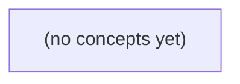

# 10.06 代码审查与合并：Go 与 Git 初学者的本地 IM 变更实践

*本教材以虚构的 c-a、u-a、m-a 本地 JSON v1 历史工具为贯穿案例，帮助 Go 与 Git 初学者理解如何审读改动、撰写可复核的评审意见、处理三方合并冲突，并判断 merge、rebase 等历史操作的适用边界。课程从 10.03 的工作区、索引区、HEAD 与提交状态出发，结合 10.05 的重构和“消息正文上限从 6 字节改为 9 字节”这一独立需求，建立静态、可推理的工程实践框架。*

**章节:** 2

---

## 本书导览

- 了解整本书的章节脉络
- 掌握各章之间的概念依赖关系
- 选择最合适的阅读顺序

# 10.06 代码审查与合并：Go 与 Git 初学者的本地 IM 变更实践

本教材以虚构的 c-a、u-a、m-a 本地 JSON v1 历史工具为贯穿案例，帮助 Go 与 Git 初学者理解如何审读改动、撰写可复核的评审意见、处理三方合并冲突，并判断 merge、rebase 等历史操作的适用边界。课程从 10.03 的工作区、索引区、HEAD 与提交状态出发，结合 10.05 的重构和“消息正文上限从 6 字节改为 9 字节”这一独立需求，建立静态、可推理的工程实践框架。

下方的概念图展示了本书 0 个核心概念以及它们之间的依赖关系；再下方是 1 个章节的入口。你可以按从上到下的顺序阅读，也可以根据自己的兴趣或先验知识选择切入点。

#### 概念图



## 章节索引

- **10.06 代码审查与合并：让一次 IM 历史规则变更可复核** — 承接10.03工作区/暂存/提交/分支和10.05小步重构。以虚构本地IM历史工具的一次变更为例，解释差异阅读、评审意见、独立证据、三方合并、文本与语义冲突、merge/rebase取舍及合并后回归。只写静态教材，不在本项目执行教学Git命令或Go测试。

## 10.06 代码审查与合并：让一次 IM 历史规则变更可复核

- 按需求与风险阅读提交及PR差异
- 区分事实、预期、测试与评审意见
- 理解分支图、共同祖先与三方合并
- 识别文本冲突和无文本冲突的语义冲突
- 以业务规则决定冲突解决内容
- 说明merge与rebase对历史身份的影响
- 规划小提交和合并后的回归证据
- 完成一份可审阅的本地IM规则改动说明

本节以本地 IM 历史工具的两项并行改动为例，建立“先分清改动身份，再审查差异与合并证据”的基本方法。

### 从 W/I/H 到可审阅的提交边界

### 从 W/I/H 到可审阅的提交边界

Git 中可把一次改动的位置简记为 **W/I/H**：

- **W（工作区）**：正在编辑但尚未暂存的文件。这里允许试验、撤销和继续修改，不等于他人应当审查的内容。
- **I（暂存区，Index）**：准备进入下一次提交的精确快照。`git add` 的对象是文件当前内容，因此应只放入同一目的的差异。
- **H（提交历史，HEAD）**：已经形成提交、可被分支引用和审查的版本。提交应能用一句话说明“为什么改、改了什么”。

分支则是指向某个提交的可移动标签。例如可在 `refactor/historyfile-load` 上整理 `historyfile.Load`，在 `feature/body-limit-9` 上把消息正文上限从 `6` 改为 `9`。两者虽然都影响本地 JSON v1 的 `check`、`list`、`export`，但改动身份不同：

1. 重构：把加载逻辑从命令层移出，目标是职责归位；
2. 功能：调整正文长度限制，目标是改变校验规则。

`file-max-bytes` 的默认值仍是 `1MiB`，它既不是正文长度限制，也不应被顺手改入上述任一提交。

审查前可用 `git status` 看 W/I 是否混杂，用 `git diff` 检查工作区差异，用 `git diff --cached` 检查即将提交的边界。理想状态是：每个分支只承载一个意图，每个提交只包含该意图所必需的文件变化；未暂存的实验性修改留在 W，不借由“顺手一起提交”进入 H。

### 拆开重构与规则调整两条线

### 拆开重构与规则调整两条线

先给改动贴上不同的身份标签，审查才不会把“代码位置变了”误认为“规则变了”。

- **重构线**：将 `historyfile.Load` 从命令层移出，交给更合适的历史文件处理位置。它关注依赖方向、函数职责和调用路径；在输入相同的前提下，`check`、`list`、`export` 对本地 JSON v1 历史数据的可观察结果应保持一致。
- **功能线**：消息正文长度上限由 `6` 调整为 `9`。这是明确的规则变化，应能指出常量、校验条件或测试期望中从 `6` 到 `9` 的对应差异。

二者不要放进同一个提交。否则评审者无法回答：若 `check` 的输出变化，究竟是加载逻辑迁移造成的，还是正文限制放宽造成的？拆分后，重构提交只证明“搬家未改规则”，功能提交只证明“规则从 6 改为 9”。

尤其不要顺手改动文件最大字节数的默认值。`file-max-bytes = 1MiB` 是另一条独立规则，既不是正文长度上限，也不是 `historyfile.Load` 移动的副作用。即使它们都与历史文件有关，也必须分别审查：

| 改动 | 应保持或改变的内容 |
|---|---|
| 移出 `historyfile.Load` | 行为保持，结构调整 |
| 正文上限 `6 → 9` | 仅正文校验规则改变 |
| 文件最大字节数默认 `1MiB` | 保持不变 |

提交信息和分支也应反映这种边界：一个分支处理加载逻辑整理，另一个分支处理正文上限调整。合并时按提交逐个复核差异，而不是依据“看起来都和历史规则有关”就一起接受。

### 按风险阅读 c-a、u-a、m-a 差异

### 按风险阅读 c-a、u-a、m-a 差异

先不要把三个提交当成“都改了历史规则”。应按改动身份和风险分别阅读：

- `c-a`：将 `historyfile.Load` 从命令层整理到可复用位置，属于重构。它应保持 `check`、`list`、`export` 对本地 JSON v1 的可观察行为不变。
- `u-a`：把消息正文长度限制从 `6` 调整为 `9`，属于功能规则变更。它只影响正文校验的接受范围。
- `m-a`：合并提交或合并分支后的结果，用于确认两项独立改动能共存；它不是再次修改规则的理由。

阅读需求时，先写出可核对预期。对 `u-a`，边界应是长度 `<=9` 的正文可通过、长度 `>9` 的正文被拒绝；这里的“长度”必须沿用既有定义，不能凭空改成字节数或 rune 数。对 `c-a`，预期是同一份 JSON v1 输入在三条命令中的成功、失败及导出内容不变。`file-max-bytes` 默认值仍为 `1MiB`，它是文件大小限制，不是正文长度限制，不能因 `6→9` 而改变。

再读实现差异。`c-a` 中重点查找：命令层是否只负责参数与输出，读取、解析和版本检查是否统一经由 `historyfile.Load`；错误是否被吞掉、重写或改变返回位置。`u-a` 中重点查找：是否只有正文上限常量、比较条件及对应错误信息发生变化；若同时触及加载路径、JSON 字段或文件大小默认值，就应要求拆分。

测试应分别证明两件事：重构前后 `check/list/export` 对有效、无效、超大 JSON v1 文件的结果一致；新规则覆盖正文长度 `6`、`9`、`10` 三个边界。评审意见也应标注归属：行为保持问题归 `c-a`，边界规则问题归 `u-a`，仅在 `m-a` 检查冲突解决后两组证据是否仍同时成立。

### 共同祖先与三方合并的判断框架

### 共同祖先与三方合并的判断框架

设 `c-a` 是共同祖先：它保存本地 JSON v1 历史规则，`check/list/export` 都由命令层调用 `historyfile.Load`；消息正文上限为 `6`，`file-max-bytes` 默认值为 `1MiB`。

随后出现两条独立分支：

- `u-a`：仅整理加载职责，将 `historyfile.Load` 从命令层移到合适的共享位置；这是结构重构，不应改变规则。
- `m-a`：仅将消息正文限制从 `6` 改为 `9`；这是业务规则变更，不应顺带修改文件大小默认值。

合并时，Git 以 `c-a` 为基线比较两侧差异：`c-a → u-a` 与 `c-a → m-a`。若两条分支修改同一段文本，例如都改了同一个校验函数签名或同一行常量，Git 无法自动判断保留哪一版，便出现**文本冲突**。此时不能机械选择“当前”或“传入”版本，而要恢复两项意图：保留 `u-a` 的加载职责整理，并采用 `m-a` 的正文上限 `9`。

更隐蔽的是**无文本冲突的语义冲突**。例如 `u-a` 新建了共享校验器，却仍保留旧的正文上限 `6`；`m-a` 虽把命令层常量改为 `9`，但重构后 `check/list/export` 实际已调用共享校验器。Git 可能自动合并成功，最终规则却仍是 `6`。因此应按业务规则复核最终路径：三个命令读取 JSON v1 时，正文限制应为 `9`，而 `file-max-bytes` 仍为 `1MiB`。合并提交应记录“整合两条既有改动”，不要把额外重构或新功能混入其中。

### 选择历史形态并补齐回归证据

### 选择历史形态并补齐回归证据

先按 W/I/H 识别改动：**为什么改**（W）、**接口或行为变了什么**（I）、**如何验证**（H）。本例至少有两条独立线：

- `historyfile.Load` 从命令层移出：结构重构，目标是让 `c-a`、`u-a`、`m-a` 共用本地 JSON v1 的加载入口。
- 消息正文长度上限从 `6` 调整为 `9`：功能规则变更。
- `file-max-bytes` 默认值仍为 `1MiB`；它是文件大小限制，不能被误当成正文长度规则的一部分。

因此应拆成小提交，例如：

1. `refactor: 提取 historyfile.Load`
2. `feat: 消息正文最大长度调整为 9`
3. `test: 补充 JSON v1 命令回归用例`

若功能分支已被多人基于其提交继续开发，优先 `merge`：保留原提交身份，并用一次合并提交记录“何时、从哪个分支、为何合入”。代价是历史出现分叉。若分支仅自己使用、尚未共享，可在合并前 `rebase` 到目标分支：提交哈希会改变，历史更线性；不要对已推送且被他人引用的提交强制改写。

合并说明应明确两项改动没有互相隐含：重构不改变规则；规则提交只把正文限制改为 `9`，不修改默认 `1MiB`。合并后即使尚无运行或线上事实，也应补齐可复核的静态证据：

- `check`：确认加载 JSON v1 后仍校验必填字段、正文上限为 `9`、文件上限默认常量为 `1MiB`。
- `list`：确认经统一 `historyfile.Load` 读取后，列表字段映射与排序路径未被重构改变。
- `export`：确认导出也使用同一加载入口，且不会把 `file-max-bytes` 写成正文长度限制。
- 审查差异时逐文件追踪调用点：命令层删除的加载逻辑，应能在 `historyfile.Load` 的新位置找到等价职责。

> **要点** — 可复核的合并始于清晰提交边界，并以独立需求、业务规则和回归证据约束最终结果。

审查 IM 历史规则变更，先要看清差异的比较对象与业务边界，再判断实现是否真正满足合同。

### 先确定差异在比较什么

### 先确定差异在比较什么

审阅前先问：这条差异的“两端”分别是谁？Git 中同一份改动可能同时存在于工作区、索引和提交历史，比较对象不同，结论也不同。

- `git diff`：比较**工作区**与**索引**。它显示“已修改但尚未暂存”的内容；若规则代码已 `git add`，这里可能为空。
- `git diff --cached`：比较**索引**与 `HEAD`。它显示“准备提交”的内容，是提交前检查的核心。
- `git show <提交>`：查看某个提交相对其父提交的改动。它适合确认“这一次提交做了什么”，但看不到该提交前后被拆散、遗漏或随后撤销的分支整体效果。
- `git diff <base>...HEAD`：查看 PR 分支自共同祖先以来相对 `base` 的整体改动，适合评审“这个 PR 最终准备合入什么”。

可将范围理解为：

`工作区 --git diff--> 索引 --git diff --cached--> HEAD --git show--> 父提交`

而 PR 审阅关注的是：

`base 的共同祖先 ──> PR 分支 HEAD`

例如作者先提交“9 字节时拒绝”，后提交“调整边界”，单看后一提交可能只看到：

`if len(id) > 9 {`

改为：

`if len(id) >= 9 {`

但分支整体差异会揭示合同要求其实是“长度**超过** 9 字节才拒绝”。`>=` 会错误拒绝恰好 9 字节的合法标识。先选对比较范围，才能判断这是局部修正，还是对既有兼容行为的破坏。

### 单提交视角为何不足

### 单提交视角为何不足

`git show <提交>`回答的是“这个提交相对其父提交改了什么”，而审阅 PR 真正要回答的是“该分支相对目标分支最终引入了什么”。两者的比较基准不同。

设共同祖先为 `M`，目标分支随后有提交 `T`，PR 分支连续产生 `A`、`B`：

```text
M──T                 base
 \
  A──B               pr
```

查看 `git show B` 只得到 $B-A$：例如 `B` 把阈值从 `> 9` 改为 `>= 9`。但它看不到 `A` 是否已经新增了历史规则、改动了输出流，或删除了兼容分支。查看 `git show A` 又只得到 $A-M$，仍看不到 `T` 对 base 的后续变化。

PR 应以共同祖先 `M` 为起点、以 PR 头 `B` 为终点审阅：

`git diff $(git merge-base base HEAD)..HEAD`

这近似展示合并后由 PR 引入的净变化；平台上的 PR 文件视图通常也采用这一范围。若只逐个看提交，审阅者可能被“先写错、后修正”的中间状态干扰，或遗漏跨提交形成的最终合同变化。特别是条件被拆在两个提交时，必须检查最终文件：`9` 字节应被拒绝时，`>= 9` 会误拒边界值；单看某次重构提交未必能发现该语义已被改写。

### 按规则合同逐项审阅

### 按规则合同逐项审阅

审阅不应只问“代码是否能运行”，而应把差异逐项映射回可验证的规则合同。每一项都应能指出需求来源、输入条件、预期输出与状态后果。

- **需求来源**：确认规则来自产品需求、协议约定还是既有缺陷修复；不要把“推测的合理行为”当成新合同。
- **输入输出合同**：列出允许的输入、拒绝的输入，以及对应的标准输出、标准错误和退出码。若工具约定 `0` 为成功、`2` 为参数错误、`3` 为历史不存在、`4` 为权限拒绝、`5` 为数据损坏，则新增分支不得把这些情况混成同一个失败结果。
- **拒绝优先级**：当一个请求同时命中多个错误时，先拒绝什么必须稳定。例如无权限且历史文件损坏时，合同若要求先做权限校验，就应返回 `4`，而不是读取文件后返回 `5`。
- **文件前后状态**：检查成功、正常拒绝和异常失败三类路径。只读查询不应改写历史文件；写入失败不得留下半条记录、临时文件或错误的索引状态。
- **敏感字段**：确认 IM 内容、用户标识、令牌、路径等不会被输出到标准错误、调试日志或错误消息中；错误信息应说明类别，而非泄露原始消息。
- **兼容性**：旧调用方式、旧历史格式、既有退出码和脚本解析字段是否仍可使用；若必须变更，应有明确迁移边界。

尤其要逐字核对长度、边界和比较符。例如合同规定“历史消息正文最多 **9 字节**，第 10 字节起拒绝”：

`if [ "${#body}" -ge 9 ]; then reject; fi`

这里的 `-ge 9` 会错误拒绝恰好 9 字节的合法输入；应为仅在超过上限时拒绝：

`if [ "${#body}" -gt 9 ]; then reject; fi`

这类错误往往能通过测试，却破坏边界合同。`git diff --check` 只能发现尾随空白、冲突标记等格式问题，不能证明退出码、拒绝顺序或 `>=`/`>` 的业务语义正确。

### 从九字节边界发现规则错误

### 从九字节边界发现规则错误

假设规则合同规定：历史消息正文长度**超过** `9` 字节才拒绝；长度恰为 `9` 字节应继续处理并以退出码 `0` 成功返回。评审时，不能只看“增加了长度校验”，而要核对比较运算符是否准确表达边界。

```text
规则：len(body) > 9  → 拒绝，exit 2
规则：len(body) <= 9 → 接受，exit 0
```

提交中的实现可能是：

`if len(message.Body) >= 9 { return reject(2, "message too long") }`

这里的代码事实是：`>= 9` 会拒绝 `9`、`10`、`11` 字节等全部输入；而规则预期只拒绝大于 `9` 的输入。两者仅差一个等号，却改变了边界合同。

审阅者应要求测试证据至少覆盖：

- `8` 字节：接受，标准输出为正常结果，标准错误为空，退出码 `0`；
- `9` 字节：接受，退出码仍为 `0`；
- `10` 字节：拒绝，错误信息写入标准错误，退出码为约定的 `2`；
- 非 ASCII 文本：按实际字节数而非字符数验证，例如一个汉字通常占 `3` 字节。

可写出明确评审意见：

> 长度限制的需求是“超过 9 字节拒绝”，当前 `>= 9` 将恰好 9 字节的合法输入错误归入拒绝路径。请改为 `> 9`，并补充 8、9、10 字节的退出码与 stdout/stderr 测试。

`git diff --check` 可以发现尾随空格等格式问题，却无法发现这个业务边界错误；只有将差异代码、规则措辞和边界测试并列，错误才会显现。

### 把检查结果写成可合并证据

### 把检查结果写成可合并证据

`git diff --check` 只能发现行尾空白、空白行缩进、冲突标记等格式问题。它通过，不等于规则正确、拒绝顺序正确，更不等于不会破坏旧调用方。可合并证据应把“看过什么、得到什么结论”写清楚。

例如审阅差异时发现边界条件：

`if len(record) >= 9 { reject(...) }`

若合同要求“超过 9 字节才拒绝”，应改为：

`if len(record) > 9 { reject(...) }`

`>=` 会错误拒绝恰好 9 字节的历史记录；这类错误不会被空白检查发现，必须以输入、输出和文件状态证明。

审阅结论可按合同逐项记录：

- **需求与范围**：关联需求编号；确认比较的是整个 PR 分支相对 `base` 的差异，而非只看某个提交。
- **标准输出**：成功查询仅向 stdout 输出约定历史内容；字段顺序、分隔符和末尾换行保持兼容。
- **标准错误**：拒绝原因、诊断信息只写 stderr，不污染可被脚本消费的 stdout。
- **退出码**：`0` 表示成功；`2` 表示参数或调用错误；`3` 表示输入格式错误；`4` 表示规则拒绝；`5` 表示读写或内部失败。每种码均应有对应测试或可复现命令。
- **前后文件状态**：成功路径确认写入后的历史内容；拒绝路径确认目标文件未创建、未截断、未部分写入。
- **敏感字段**：确认令牌、密码、会话标识等未进入历史文件、stdout、stderr 或错误日志。
- **兼容性**：旧格式输入、既有调用参数及依赖旧退出码的脚本仍获得原有行为；新增规则只收紧合同明确允许收紧的部分。

最终批准不应仅写“`git diff --check` 通过”，而应写明：边界 `9` 字节已验证可接受、`10` 字节按规则拒绝；拒绝时 stderr 有诊断、stdout 为空、退出码为 `4`，且文件保持变更前状态。

> **要点** — 差异范围决定审阅结论；格式检查不替代按业务合同验证边界、优先级与可观察行为。

PR是围绕一次变更展开的可复核提议与讨论，而非Git中的对象；其价值在于让规则、证据、风险和决策对他人可见。

### 把PR写成可核查的变更提议

### 把PR写成可核查的变更提议

PR描述的目标不是复述提交信息，而是让审阅者无需猜测：**为什么改、改到哪里、规则如何变化、如何证明正确、仍有哪些未知**。尤其是 IM 历史规则这类涉及留存、查询或展示边界的改动，代码差异本身通常不足以表达业务含义。

可按以下结构组织：

- **变更原因**：说明触发条件与要解决的问题。例如：“历史消息查询在会话恢复后遗漏边界日期，导致用户看不到应保留的最后一日消息。”
- **影响范围**：列出受影响的接口、任务、数据类型、租户或时间区间；同时明确不受影响的路径。
- **前后行为**：用表格写出可观察结果，而非只写“修复逻辑”。

| 输入或场景 | 变更前 | 变更后 |
|---|---|---|
| 消息时间恰为保留截止时刻 | 被过滤 | 保留 |
| 消息早于截止时刻 | 被过滤 | 仍被过滤 |
| 未配置历史期限 | 使用旧默认行为 | 保持旧默认行为 |

- **风险**：指出可能的回归，如边界条件放宽会增加返回数据量、时区转换可能改变截止点、缓存结果可能与新规则短暂不一致。
- **证据**：关联测试名称、测试输入和结果、日志片段或人工验证步骤。证据应能对应规则，例如“新增截止时刻前、恰好等于、截止时刻后三组测试均通过”。
- **未覆盖项**：诚实记录未验证的平台、迁移数据、极端规模或尚未决定的产品语义；未覆盖不等于可忽略，而是让后续决策可见。

可使用简洁模板：

> 原因：修正历史消息保留边界。  
> 范围：仅修改 `history` 查询过滤；不修改删除任务。  
> 行为：截止时刻 $t$ 的消息由排除改为保留，规则为 `timestamp >= cutoff`。  
> 风险：时区换算与大查询结果量。  
> 证据：三组边界测试、回归测试通过。  
> 未覆盖：尚未验证旧索引重建后的查询性能。

### 用前后行为表固定规则边界

### 用前后行为表固定规则边界

以“本地 IM 历史记录默认只保留 90 天，置顶会话和带星标消息例外”为例，PR 描述不能只写“调整清理逻辑”。应把可观察行为写成表，让审查者能据此判断实现是否符合规则。

| 典型输入 | 旧行为 | 新行为 | 规则依据 |
|---|---|---|---|
| 普通消息，距今 91 天 | 保留 | 删除 | 普通历史仅保留最近 90 天 |
| 普通消息，距今 90 天 | 保留 | 保留 | 边界按“超过 90 天”处理 |
| 置顶会话中的消息，距今 180 天 | 删除 | 保留 | 置顶会话历史不自动清理 |
| 已加星标消息，距今 180 天 | 删除 | 保留 | 星标代表用户显式保留 |
| 已加星标但所属会话已删除 | 删除 | 删除 | 会话删除优先于消息保留标记 |
| 附件下载失败的旧消息 | 删除消息及本地附件索引 | 删除消息及本地附件索引 | 清理不因附件状态改变结果 |

表中的输入应包含时间边界、多个规则同时命中、数据不完整等情况，而不只列“正常消息”。尤其要明确优先级：会话已删除与星标保留冲突时，哪条规则覆盖另一条；“90 天”是按自然日、精确时间戳，还是按清理任务执行时刻计算。

审查意见也应回到表中的具体格子。例如：“阻塞：`deletedConversation + starredMessage` 未覆盖；按会话删除优先规则，预期删除，而当前分支仍保留索引。”作者回复时应附上对应测试、手工验证输入或日志证据，而不是仅回答“已修改”或依赖 CI 绿灯。这样，代码、测试与产品规则才能围绕同一组可复核的边界对齐。

### 按风险阅读差异与提交

### 按风险阅读差异与提交

评审不应从“这一行写得是否优雅”开始，而应先问：这次变更是否准确实现了需求，并且没有改变不应改变的历史规则。先读 PR 描述与关联需求，明确规则的触发条件、适用时间范围、例外对象和预期结果；再看提交序列与差异，确认实现没有夹带无关重构、格式化或数据迁移。

可按以下顺序阅读：

1. **规则边界**：新旧条件分别是什么？例如“消息删除后不可恢复”是否误伤管理员撤回、合规保留或已归档会话。特别检查 `>` 与 `>=`、时区、空值、状态枚举及默认分支。
2. **数据影响**：规则是否只影响新写入的数据，还是会在读取、同步、回放任务中重解释历史记录？若存在批处理或索引更新，应确认重复执行是否安全、失败后是否会留下半更新状态。
3. **回退难度**：开关关闭能否恢复旧行为？已经删除、覆盖或迁移的数据是否可逆？不可逆变更需要更明确的发布条件、备份方案和人工处置路径。
4. **测试证据**：测试应覆盖规则边界，而不只是主流程。关注输入、预期输出和规则依据是否对应，例如“恰好达到保留期限的消息”应证明其按产品规则保留或删除。

阅读提交时，将每个提交视为一个可验证的主张：它修改了什么、为何必须修改、独立回滚是否安全。若测试提交与实现提交分离，不要因 CI 绿灯就假定语义正确；绿灯只能说明当前检查通过，不能证明需求、历史数据和异常路径均被覆盖。对于高风险差异，优先追踪从入口条件到持久化、读取展示及异步任务的完整数据路径。

### 分层提出可执行的评审意见

### 分层提出可执行的评审意见

评审意见的目标不是表达“我不喜欢”，而是让作者能够复现问题、判断优先级并验证修正。先按影响分层，避免把真实业务缺陷淹没在风格偏好中：

- **阻塞业务缺陷**：当前实现会违反历史规则、产生错误结果、误删/漏保留记录，或使既有调用方行为不可接受。应明确要求修正后再合并。
- **请求澄清**：代码或 PR 描述无法证明某个边界条件、数据来源或规则解释是否正确。此时先索要依据，不假设作者意图。
- **改进建议**：可读性、测试命名、重复逻辑或未来维护成本问题；若不影响本次正确性，应标明其非阻塞性质。

一条可执行反馈至少包含四部分：**位置、输入、预期结果、规则依据**。例如：

> **阻塞**：`history_filter.py` 中处理 `deleted_at` 的分支。输入为“消息已删除，但其创建时间仍在保留窗口内”。当前代码将其直接计入可见历史；预期应排除该消息。依据是本次规则中的“删除状态优先于时间窗口”。请补充该输入的测试，并说明批量查询路径是否复用同一判断。

对不确定的问题，不要写“这里可能有问题”，而应写：

> **澄清**：当 `retention_days=0` 时，规则是仅保留当天消息，还是不保留任何消息？当前比较运算符暗示前者，但 PR 描述未说明。请给出产品规则或测试证据。

作者回复也应对应意见：说明采用的规则解释、提交的修正、补充的测试及其结果；若不采纳建议，应解释为何该输入不在范围内。评审通过、代码所有者批准或持续集成绿灯通常是常见流程信号，但都不能替代对规则、边界输入和证据本身的核验。

### 以独立证据完成讨论与合并判断

### 以独立证据完成讨论与合并判断

作者回应审查意见时，目标不是“让讨论结束”，而是让审查者能够独立复核结论。每条回应应对应明确的修正、证据或待确认决策：

- 对阻塞性业务缺陷：说明已修改的位置、触发输入、修改后的预期结果，以及该结果符合哪条历史规则。
- 对请求澄清：补充规则来源、边界定义或前后行为表；若需求本身无法确定，应明确标记为待产品或业务方决策，而不是用实现细节掩盖歧义。
- 对建议：接受时说明改动；不接受时解释权衡，例如“保持现有接口以避免扩大迁移范围”，并说明该决定不影响本次规则正确性。

有效回复应能形成可检查链路：

`意见：空会话不应写入历史`  
`修正：在写入前过滤 messages.length === 0`  
`验证：新增空数组输入测试，预期历史记录数为 0`  
`依据：历史规则第 3 条仅保存含有效消息的会话`

验证证据应覆盖关键业务分支，而不只是贴出“测试已通过”。可附带新增或更新的测试名称、代表性输入与断言、构建结果、静态检查结果，以及人工核对的迁移样本。对于未覆盖的异常数据、性能影响、回滚路径，也应如实写出，避免把未知风险伪装成已验证事实。

CI 绿灯只能说明已配置的自动检查通过；它未必覆盖规则解释、真实历史数据或遗漏的边界条件。代码所有者审阅、批准和合并权限也是常见流程信号，具体要求取决于项目配置；它们不自动证明业务规则正确。合并判断应以独立证据为中心：变更是否满足已声明规则、关键风险是否被验证或接受、未覆盖范围是否对决策者透明。

> **要点** — 可审阅的PR应让规则、行为差异、风险、证据和未覆盖范围可独立核查；绿灯不能替代业务判断。

本节以消息长度规则的并行改动为线索，建立从提交图、差异判断到冲突决策与合并验证的完整复核框架。

### 三方提交图与共同祖先

### 三方提交图与共同祖先

设某次规则变更从提交 `B` 拉出主题分支，随后主线也继续演进：

```text
B ── M1 ── M2   main（记为 M）
 \
  T1 ── T2       topic（记为 T）
```

`B` 是 `T` 与 `M` 的共同祖先（merge base），也是三方合并的基准。合并时并非简单比较“`T` 文件内容”和“`M` 文件内容”，而是分别计算两侧相对 `B` 的增量：

- `B → T`：主题分支为完成本次需求新增或修改了什么；
- `B → M`：主线在此期间独立发生了什么；
- `B`：用于判断两侧是否修改了同一逻辑区域，以及修改是否可兼容。

例如 `B` 中有 `maxMessageBytes=6`，若 `T` 将其改为 `9`，而 `M` 未触及该行，则 Git 通常可自动得到 `9`：一侧有改动，另一侧保持基准值。若 `T` 和 `M` 都改了同一行、同一配置块，Git 需要根据三方内容判断；无法安全拼接时才产生冲突。

若 `M` 就是 `T` 的祖先，即主线没有在分叉后新增提交，可进行快进：分支指针直接移到 `T`，不会生成新的合并提交。若两侧均有独立提交，则通常创建合并提交，其父提交为 `M` 与 `T`，以明确记录“两条历史在此汇合”。

因此，审查者首先应确认共同祖先是否正确：错误的基准会夸大、遗漏或误判差异；随后再审查两侧增量是否共同满足规则意图。Git 能计算文本层面的合并输入，却不能替人判断规则语义。

### 快进、合并提交与可追溯性

### 快进、合并提交与可追溯性

设主线当前提交为 `M`，规则修改在主题分支提交为 `T`，二者共同祖先为 `B`：

```text
B —— M
 \
  T
```

若 `main` 自 `B` 后没有新增提交，即 `M=B`，而 `T` 是当前 `main` 的后代，Git 可执行**快进合并**：仅把 `main` 指针移动到 `T`，不产生新提交。

```text
B —— T   ← main、topic
```

快进后的代码状态正确且历史线性，但审阅线索较弱：日志中看不出“此处曾将 `topic` 纳入 `main`”，也难以仅凭图形区分该提交是直接在主线完成，还是经由已审查的规则分支引入。

当 `main` 与 `topic` 都从 `B` 继续演进时，二者互非祖先：

```text
      M   ← main
     /
B —— 
     \
      T   ← topic
```

Git 需要比较 `B→M` 与 `B→T` 的差异；若文本改动可兼容，则创建合并提交 `G`：

```text
      M ─── G   ← main
     /     /
B ——      /
     \   /
      T ─     ← topic
```

`G` 有两个父提交，明确记录了“在当时的主线状态 `M` 上合入主题结果 `T`”。对于 IM 历史规则这类需要复核来源、批准依据与上线范围的变更，这条边界尤其有价值：审阅者可围绕 `T` 检查需求与测试，再围绕 `G` 检查其是否与主线同期改动兼容。

因此，快进强调简洁线性；合并提交强调集成事件与来源可追溯。两者都不自动证明规则语义正确。即使 Git 能无冲突地产生结果，仍应确认合入后的配置、迁移逻辑和测试实际表达了已批准的业务规则。

### 消息长度规则的文本冲突

### 消息长度规则的文本冲突

设共同祖先 `B` 中存在规则：

`maxMessageBytes=6`

随后两条提交线并行演进：

- 主题分支 `T`：依据已经批准的需求，将其改为 `9`；
- 主线 `M`：另一项改动将其改为 `12`。

提交图可概念化为：

`B(6) ── T(9)`  
`  └──── M(12)`

将 `T` 合入当前主线 `M` 时，Git 以共同祖先 `B` 为基准做三方合并。两侧都修改了同一文本位置，且结果不同：`9 ≠ 12`。Git 无法从文本本身推断哪个数值符合业务，于是写入冲突标记：

```text
<<<<<<< HEAD
maxMessageBytes=12
=======
maxMessageBytes=9
>>>>>>> topic
```

这里 `<<<<<<< HEAD` 一侧是**当前检出分支**的内容；若当前在 `M` 上执行合并，它通常对应主线的 `12`。`=======` 以下直到 `>>>>>>> topic` 是被合入分支的内容，即主题分支的 `9`。在某些操作中也会显示 `ours` 与 `theirs`，但它们永远相对于“当前正在执行的合并、变基或挑拣操作”，不能机械地把 `ours` 等同于主线、把 `theirs` 等同于主题分支。

解决冲突不是删掉标记即可，而是一次规则决策：保留 `9`、保留 `12`，或拆为不同消息类型的配置，都会改变系统行为。若仓库中没有可追溯的授权规则，应保留冲突证据并向需求方澄清；不能依据分支名、提交先后或“看起来更大”来猜测。

### 不要把 ours 与 theirs 当业务答案

### 不要把 `ours` 与 `theirs` 当业务答案

冲突块中的 `ours`、`theirs` 只描述“相对于当前 Git 操作，哪一侧内容来自哪里”，并不表示“我们的方案正确”或“对方应被丢弃”。

例如共同祖先 `B` 中为：

`maxMessageBytes = 6`

`topic T` 已按批准需求改为：

`maxMessageBytes = 9`

另一分支又改为：

`maxMessageBytes = 12`

合并时可能出现：

```text
<<<<<<< ours
maxMessageBytes = 9
=======
maxMessageBytes = 12
>>>>>>> theirs
```

此处标签的含义取决于你正在执行的操作：普通合并时，`ours` 通常是当前检出的目标分支，`theirs` 是被合入分支；在变基、挑拣等操作中，直觉上的“我方/对方”更容易反转。因而不能看见 `ours` 就保留，也不能把 `theirs` 视为外来改动而删除。

应回到可复核证据：

- 已批准需求是否明确规定上限为 `9` 或 `12`；
- 两次修改是否覆盖同一消息类型、租户、接口或传输通道；
- `12` 是否是后续批准的替代规则，还是另一场景的独立约束；
- 规则责任方是谁，谁有权确认兼容性、安全边界与容量影响。

可能的正确结果是保留 `9`，保留 `12`，或拆为按消息类别/通道生效的配置，而不是机械二选一。若证据未授权某个具体值，应在合并记录中保留冲突背景、涉及提交和待确认问题，并向需求方或规则责任方澄清；审查者不能用 Git 标签替代业务决策，更不能猜测规则含义。

### 自动合并之后的语义复核

### 自动合并之后的语义复核

Git 能自动合并，只说明它在提交图的共同祖先 $B$ 与两侧提交中，找到了可机械拼接的文本区域；它并不证明合并结果仍满足消息历史规则。即使没有出现冲突标记，仍须审查语义风险：

- `topic T` 将 `maxMessageBytes` 从 `6` 改为 `9`，而 `main M` 同时修改了消息截断逻辑、错误提示或测试边界；若改动位于不同文件，Git 可能直接合并，但实际行为可能变成“配置允许 9，校验仍按 6”。
- 一侧把字节上限改为 `9`，另一侧新增了 Unicode、多字节字符或历史回放测试。文本可合并不代表测试断言、存储字段长度、客户端提示和迁移脚本彼此一致。
- 合并提交后应以最终树为对象复跑规则测试，而非只确认 `T` 或 `M` 曾经通过测试。

若发生 `6 → 9` 与 `6 → 12` 的文本冲突，不能因为当前操作中的 `ours`、`theirs` 标签而直接选边：它们仅表示“当前检出一侧”和“正在合入一侧”，并不表示业务上的正确方案。无明确授权时，应保留澄清记录，例如：“并行需求对最大消息字节数分别提出 9 与 12，尚未确认优先级；暂不猜测规则，待需求方确认是否统一为 9、12，或拆为按场景配置。”

合并应拆成可复核的小提交：先解决冲突并记录决策依据，再补齐配置、校验、提示与测试。提交说明应写明最终规则、来源和影响面。最后附上回归证据：边界值 `8/9/10`（或确认后的 `11/12/13`）测试、ASCII 与多字节字符测试、历史消息读写测试，以及合并后完整测试套件结果。

> **要点** — 三方合并能组合文本改动，却不能替代对业务规则、授权依据与回归证据的人工判断。

本节以隔离练习仓库中的一次 IM 历史规则合并为例，建立从冲突识别、证据核对到合并后回归的完整复核路径。

### 先确认合并现场与冲突边界

### 先确认合并现场与冲突边界

所有演习只在**个人隔离练习仓库**进行；不要在课程仓库直接合并，也不要用 `git reset --hard`“清场”，它可能丢弃尚未确认的修改。

合并命令返回冲突后，第一步不是编辑，而是读取现场：

```bash
git status
```

重点确认三件事：

- 是否处于合并中：状态通常提示“你正在合并”。
- 哪些文件属于“双方都修改”的未合并路径；这些才是当前文本冲突边界。
- Git 建议的下一步：解决后 `git add <文件>`，再执行 `git commit` 或 `git merge --continue`。

不要把“未冲突”误解为“无需检查”。`git status` 还会列出已自动合并、已暂存或未跟踪的文件；它们虽没有冲突标记，仍可能与另一分支的新规则发生语义组合问题。

对每个冲突文件，先查看共同祖先、当前分支与待合并分支的版本，再对照需求和测试意图，明确应保留的完整目标行为。此时可安全做的是：阅读、比较、手工编辑冲突文件；不要在未理解来源前盲选一侧内容。

若确认本次合并方向或现场本身有误，可使用：

```bash
git merge --abort
```

它用于撤销**正在进行的合并**并回到合并前状态；只有确定放弃本次合并时才执行。

### 以共同祖先和两侧改动还原意图

### 以共同祖先和两侧改动还原意图

文本冲突不是“选当前版本还是对方版本”，而是 Git 无法证明两侧改动能否同时成立。应先在**个人隔离练习仓库**确认冲突范围：

`git status`

它会列出未合并文件，并提示当前合并处于何种状态。随后以三方视角阅读同一文件：

- 共同祖先：`git show :1:路径`，表示分叉前的原始规则；
- 当前分支：`git show :2:路径`，表示 `HEAD` 一侧的修改；
- 待合并分支：`git show :3:路径`，表示正在合入的一侧修改。

也可用 `git diff --base`、`git diff --ours`、`git diff --theirs` 对照差异。关键不是只看冲突标记附近几行，而是回答三个问题：

1. **原始规则是什么？**例如历史记录原先是否只接受固定长度的 IM 标识。
2. **当前分支为何修改？**检查关联需求、提交说明和测试，确认它是否引入了 6 字节兼容逻辑。
3. **对方分支为何修改？**确认其是否增加 9、10 字节格式，或调整错误优先级、文件输出合同。

若一侧修改解析长度，另一侧修改校验顺序，文本上可能冲突，语义上却应组合：先保留完整可接受长度集合，再按需求规定的优先级报告错误。反之，即使 Git 自动合并，也要检查两侧是否共同造成“长度已放宽但测试仍拒绝”之类的隐患。

根据证据手工编辑出**完整目标内容**，删除 `<<<<<<<`、`=======`、`>>>>>>>` 标记；不要机械保留任一侧。确认需求与测试能够解释最终规则后，再执行：

`git add 路径`

此时索引中的内容才是已裁决版本。不要用 `reset --hard` 处理练习冲突；若决定放弃本次进行中的合并，应使用 `git merge --abort`，使工作区和索引回到合并开始前的状态。

### 按业务规则手工形成完整目标内容

### 按业务规则手工形成完整目标内容

冲突块不是“选左边还是选右边”的选择题，而是要求你依据业务规则重写该文件的**完整目标状态**。先保留冲突现场用于比对：`<<<<<<<` 一侧通常是当前分支内容，`=======` 后一侧是待合并分支内容；必要时结合共同祖先确认两项修改分别想解决什么问题。

以 IM 历史记录读取为例，手工编辑时应把边界规则写完整：

- 请求 `6` 字节：若最小有效历史片段为 6 字节，应成功返回该片段，而不是被“长度不足”误判。
- 请求 `9` 字节：应覆盖中间边界，验证分页、截断或记录解码不会只在整齐长度下正确。
- 请求 `10` 字节：应确认超过最小边界后的行为，例如返回完整可用记录、按合同截断，或继续读取下一段；结果必须与接口约定一致。
- 同时出现多个异常条件时，按需求规定的错误优先级返回。例如“参数非法”优先于“历史不存在”，就不能因为查不到文件而掩盖非法长度。

编辑后的文件中不得残留 `<<<<<<<`、`=======`、`>>>>>>>` 标记，也不能只保留能通过当前测试的局部补丁。尤其检查文件合同：路径、文件名、编码、换行、导出函数签名、返回字段及错误类型是否仍符合调用方约定。若一侧新增边界测试，另一侧修改错误定义，二者即使没有文本冲突，也可能组合成错误语义，必须一并审阅。

确认最终内容后执行 `git add <文件>`，让索引记录已解决版本；再按 Git 提示使用 `git commit` 或 `git merge --continue` 完成合并。

### 完成或撤销进行中的合并

### 完成或撤销进行中的合并

冲突文件编辑完成后，不能只看标记消失；应先确认文件内容已是完整目标版本，再将已解决文件加入暂存区：

`git add im_history.js im_history.test.js`

随后用 `git status` 判断 Git 期待的下一步：

- 若提示“所有冲突已解决，但仍在合并中”，通常执行 `git commit`，检查自动生成的合并提交说明后完成提交。
- 若状态明确要求继续某个合并流程，则执行 `git merge --continue`。它会检查是否仍有未解决路径，并创建合并提交。
- 提交前应重新运行规则测试，特别覆盖 6、9、10 字节边界、错误优先级，以及输入输出文件合同；暂存的是“已验证的完整内容”，不是仅删除冲突标记的文本。

若核对共同祖先、两侧改动或需求后发现当前合并方向错误，且尚未完成合并提交，可使用：

`git merge --abort`

这会尝试恢复到本次 `git merge` 开始前的工作区和索引状态。它适用于“放弃这次进行中的合并”，不用于撤销已经提交的历史，也不应以 `git reset --hard` 替代；后者可能丢弃合并前已有的未提交修改。

无论完成还是撤销，都再次执行 `git status`：完成后应工作区干净且历史出现合并提交；撤销后应不再处于合并中，并确认原有修改仍符合预期。

### 从文本解决走向语义回归复核

### 从文本解决走向语义回归复核

文本冲突解决的是“同一行如何写”，语义回归复核解决的是“两个改动放在一起是否仍满足规则”。前者可见于 `<<<<<<<` 标记；后者即使 `git merge` 自动成功，也可能隐藏在未冲突文件、测试覆盖空白或文件合同不一致中。

| 风险类型 | 典型表现 | 需要的证据 |
|---|---|---|
| 文本冲突 | 同一规则分支分别修改长度判断或错误文案 | 阅读共同祖先、`HEAD` 与待合并侧，手工写出完整目标内容并删除标记 |
| 语义组合风险 | 一侧新增 10 字节历史格式，另一侧仍以 9 字节为上限；一侧调整解析顺序，另一侧依赖旧错误优先级 | 检查需求、测试和调用方，覆盖 6/9/10 字节边界及非法输入优先级 |
| 文件合同风险 | 常量、导出函数、错误消息、文档或夹具已变，使用方仍按旧名称或旧格式断言 | 核对接口、返回值、错误文本、示例数据与测试夹具 |

解决冲突时，不要机械保留“当前”或“传入”版本。先用 `git status` 确认未合并文件，再阅读共同祖先及两侧内容；编辑完成后执行 `git add <文件>`。若 Git 提示合并已完成则使用 `git commit`，若仍处于暂停状态则使用 `git merge --continue`。发现前提判断错误时，可用 `git merge --abort` 撤销**进行中的合并**，避免以 `reset --hard` 清理练习现场。

停止后应形成可复核证据：`git status` 显示工作区与索引干净；`git log --graph` 能看到预期合并历史；测试明确覆盖 6、9、10 字节，以及错误优先级；最后逐项核对文件合同。自动合并成功不等于语义正确，尤其要检查那些 Git 从未标记冲突、却共同参与历史规则判定的代码路径。

> **要点** — 解决冲突不是选择一侧文本，而是依据共同祖先、需求与测试证据重建可验证的业务规则。

本节以一次本地 IM 历史规则变更为线索，厘清合并与变基如何改变提交历史，以及冲突解决应如何回到业务规则与可复核证据。

### 从分支图理解共同祖先与三方合并

### 从分支图理解共同祖先与三方合并

设 `main` 上的提交 `B` 是创建 `topic/im-history-rule` 时的共同祖先。之后两条分支各自前进：

```text
          C1 —— C2   topic/im-history-rule
         /
A —— B
         \
          M1 —— M2   main
```

`B` 记录分叉时双方共同认可的文件状态；`C2` 是规则变更分支的最新状态；`M2` 是主分支的最新状态。三方合并并非简单地“把 `C2` 覆盖到 `M2`”，而是分别计算：

- `B → C2`：主题分支新增或修改了什么，例如“本地 IM 历史保留期改为 90 天”；
- `B → M2`：主分支同期改了什么，例如“配置文件迁移到新目录”；
- 将两侧差异应用到同一结果；若两侧触及同一位置且 Git 无法判断意图，便产生冲突。

完成合并后，Git 创建合并提交 `H`，它有两个父提交：

```text
          C1 —— C2
         /          \
A —— B                H
         \          /
          M1 —— M2
```

`H` 的第一父边通常指向当前检出的 `main` 顶端 `M2`，第二父边指向被合入的 `C2`。因此，合并保留了主题分支原有的提交身份、分叉事实与两条父边；审查者可沿 `H` 回溯“主线当时是什么状态”和“规则分支具体提交了哪些改动”。这属于 Git 历史结构，不等同于拉取请求审批或持续集成是否通过。

### 合并：保留原提交与协作轨迹

### 合并：保留原提交与协作轨迹

设 `main` 上已有提交 `M1`，开发者从此切出 `topic`，完成 IM 历史规则变更：

```text
M1 ── M2                 main
 \
  T1 ── T2               topic
```

其中 `T1` 可能新增“按会话过滤历史消息”，`T2` 修正边界条件。执行 `git merge topic` 时，Git 不会复制或改写 `T1`、`T2`：它们原有的提交对象、提交哈希与父提交关系仍然保留。若两条线都已前进，Git 会创建一个合并提交 `M3`，它有两个父提交：

```text
M1 ── M2 ───── M3        main
 \             /
  T1 ── T2 ───           topic
```

`M3` 表示“以 `M2` 为当前主线、吸收 `T2` 所代表的规则变更”这一收束动作；它不是把 `T1`、`T2` 压成一个新提交。审查者因此能沿图追溯：规则最初在哪个提交引入、后续为何修正、合并时主线基于什么状态。

若 `main` 没有自 `M1` 继续提交，合并可能形成快进：`main` 指针直接移动到 `T2`，不产生新的合并提交。但 `T1`、`T2` 的身份同样不变。是否强制产生合并节点，是团队历史呈现策略；Git 合并的核心是保留既有开发轨迹，而非重写它。

### 变基：重放提交与历史身份变化

### 变基：重放提交与历史身份变化

`git rebase` 不是把两条历史“接起来”，而是先找到 `topic` 相对旧基线独有的提交，再把这些改动按顺序应用到新基线之上。每次应用都会生成一个新提交，因此即使文件内容相同，提交哈希、父提交和提交身份也会变化。

```text
变基前：

A --- B --- C   main
       \
        D --- E  topic

git rebase main 后：

A --- B --- C --- D' --- E'  topic
```

这里 `D'`、`E'` 分别重放 `D`、`E` 的改动，但它们的父提交已变为 `C` 或前一个新提交，所以 `D' ≠ D`、`E' ≠ E`。原来的 `D`、`E` 不再是当前分支历史的一部分。

对 IM 历史规则变更而言，变基的价值是让提交看起来像“基于最新 `main` 逐步开发”：例如先增加消息保留期字段，再补充过期清理逻辑，最后更新迁移脚本。审查者可沿单一直线检查每一步是否保持规则一致。

但这也意味着：变基适合**仅自己使用、尚未共享**的分支。若他人已经基于 `topic` 拉取、提交或审查，重写历史会让其本地提交仍指向旧的 `D`、`E`，后续同步容易产生重复提交或复杂冲突。此时应先协商；通常优先合并，或明确通知所有协作者共同切换到新历史。

可用命令为：

`git switch topic`  
`git rebase main`

发生冲突时，先依据业务规则修复文件并测试，再执行 `git add <文件>` 与 `git rebase --continue`。若判断本次重放不应继续，使用 `git rebase --abort` 回到变基前。`git rebase --skip` 会直接丢弃当前提交的改动；除非已确认该提交确实多余，否则不应把它当作常规冲突处理手段。

### 冲突处理：以 IM 历史规则决定取舍

### 冲突处理：以 IM 历史规则决定取舍

变基冲突不是“让 Git 接受文本”即可，而是要确认重放后的规则仍正确。设 `topic` 中提交 `R` 将 IM 历史保留期改为 30 天，而新基线已把同一配置迁移到新字段：

```text
旧基线 A --- R(topic)
新基线 A --- B(main)
rebase 后：A --- B --- R'
```

若 `R` 与 `B` 修改同一行，Git 会产生文本冲突。应查看两边意图：`B` 是否只是迁移配置位置，`R` 是否仍代表“保留 30 天”的业务规则。解决后运行相关测试，再执行：

`git add <已解决文件>`  
`git rebase --continue`

更危险的是无文本冲突：Git 能自动应用 `R`，但 `B` 已引入“管理员可配置保留期”或“合规会话永久保留”等规则。此时即使变基成功，硬编码 30 天也可能覆盖新策略。应比较提交说明、测试和配置语义，必要时调整 `R'`，而非相信自动合并结果。

若发现选错基线、规则理解错误或冲突范围超出预期，使用 `git rebase --abort` 回到变基前的 `topic`，重新核对后再操作。`git rebase --skip` 表示直接丢弃当前正在重放的提交；只有确认其效果已被新基线完整替代时才可使用。若该提交包含保留期变更、迁移脚本或边界测试，随意跳过会造成规则悄然缺失。

### 其他历史操作与合并后证据

### 其他历史操作与合并后证据

`cherry-pick`、压缩提交与整分支合并解决的问题不同，不能把它们都当作“合并”。

- `git cherry-pick <提交>`：只挑选某个提交的补丁应用到当前分支，并生成新的提交身份。它适合把“修正 IM 历史过滤边界”这一个独立修复带到维护分支；但不会自动带上该提交依赖的前置提交，也不代表整个主题分支已合入。
- 压缩提交：将多个主题提交折叠为一个提交，历史更短，但“先补测试、再修规则、再补边界样例”的审查脉络会消失。适合明确只需交付最终结果、且中间步骤无保留价值的私有工作。
- 整分支合并：将主题分支可达的全部提交纳入目标分支；非快进合并还保留两个父边，明确表达“该规则变更作为一个分支工作完成”。

简单地说，若 `main` 在 `M`，主题分支为 `M─A─B`：

```text
整分支合并： M─────H
              ╲   ╱
               A─B

cherry-pick：  M─A'
压缩提交：     M─S
```

合并后应留下可复核证据，而不只是“构建通过”：记录规则输入、期望保留与删除的历史消息、边界时间样例，以及回归测试名称和结果。改动说明应指出规则语义、影响范围、迁移或回滚方式；若选择压缩或挑选提交，也要说明为何未保留原分支历史。CI 与评审批准证明检查流程完成，但不会改变 Git 提交图；提交图和父边仍由所选 Git 操作决定。

> **要点** — 合并保留协作历史，变基重写提交身份；冲突解决与回归验证必须以业务规则和独立证据为准。

一次看似很小的 IM 历史规则改动，若混入重构、边界处理与合并操作，就必须用可独立复核的提交、证据和回归计划降低风险。

### 按风险拆分规则变更

### 按风险拆分规则变更

将 IM 历史规则变更拆分的目标不是追求“一个提交只改一个函数”，而是让每一步都有清晰意图、独立审阅面和可接受的回退代价。尤其是旧规则整理与新增 `9` 字节功能并存时，混在同一提交会使审阅者无法判断：失败究竟来自重构、数据边界，还是新语义。

可按风险组织为以下层次：

1. **纯改名或移动**：只调整文件位置、符号名、导入路径，不改变行为。此提交应尽量保持测试结果不变，便于使用差异对比确认“仅迁移”。
2. **小步重构**：提取解析函数、统一数据模型、消除重复分支，但暂不启用新规则。重构提交应保留原有输出与列表顺序；若无法证明等价，就不应声称它是纯重构。
3. **`9` 字节规则功能**：单独加入识别、解析或匹配逻辑，并明确覆盖 `v1` 为 `null`、`[]`、重复 ID、目标已存在及列表顺序等边界。退出码 `0/2/3/4/5` 的语义变化也应在这一提交中可见。
4. **测试与说明补充**：若测试改动较大，可随对应行为提交；若只是补充真实样例、迁移说明或发布材料，也可独立提交，避免掩盖代码风险。

提交之间应能按顺序应用，也应能在必要时回退功能提交而不撤销无关整理。若重构与功能在技术上不可分割，可放入同一分支或提交，但必须在说明中标注耦合原因、预期行为和回归范围。分支保护、审批、推送与合并流程依仓库配置执行；审阅通过、测试通过、已推送、已合并和已发布是不同状态，不能相互替代。

### 用差异建立审阅证据

### 用差异建立审阅证据

审阅差异时，先把“代码变了什么”与“行为应当怎样”分开。差异本身只能证明新增了分支、校验或返回码；是否符合 IM 历史规则，仍需由输入样例、测试结果和评审意见共同支撑。

可为 `v1` 建立一张最小证据表：

| 场景 | 可观察事实 | 预期行为 | 应有证据 |
|---|---|---|---|
| `v1 = null` | 输入缺失 | 按约定拒绝或采用默认值 | 单测及退出码断言 |
| `v1 = []` | 列表为空 | 不创建历史项，保持稳定顺序 | 输出快照或列表断言 |
| 重复 ID | 同一标识出现多次 | 去重、报错或保留规则明确 | 重复输入测试 |
| 目标已存在 | 写入会冲突 | 不覆盖、幂等或显式失败 | 预置目标测试 |
| 列表顺序 | 插入、过滤后元素位置变化 | 保持原顺序或按规则排序 | 顺序断言 |

退出码 `0/2/3/4/5` 也应逐一写成仓库内的行为契约：`0` 表示成功，其余码分别对应哪类输入、冲突、执行或内部失败，不能仅凭数字猜测。测试应断言“给定输入 → 输出/状态 → 退出码”，而非只断言命令结束。

评审意见则是对证据的判断，例如“重复 ID 的保留首项规则未被测试”。它不是事实，更不是测试通过的替代品。审阅通过、测试通过、推送远端、合并分支和发布是五个不同状态；合并后还应以新的 `HEAD` 重跑相关真实测试。

### 从共同祖先理解三方合并

### 从共同祖先理解三方合并

三方合并不是简单地把“两个分支的最新文件拼起来”，而是先找到它们的**共同祖先**，再分别计算两个分支相对祖先做了什么修改。

```text
A---B---C   main
     \
      D---E feature
```

这里 `B` 是共同祖先。合并 `C` 与 `E` 时，Git 比较：

- `B → C`：主分支的改动；
- `B → E`：功能分支的改动；
- 将两组改动尝试同时应用，产生合并结果 `M`。

若两边修改了祖先中的同一段文本，Git 无法判断应保留哪一种，便产生**文本冲突**。例如主分支改了规则说明，功能分支也改了同一行的字段名；解决冲突时不能只让标记消失，还要确认最终含义正确。

更危险的是**语义冲突**：文本上可以自动合并，却共同破坏业务规则。例如：

- 主分支把空历史 `[]` 视为合法输入；
- 功能分支新增“目标 ID 已存在即退出 3”的检查；
- 合并后检查代码错误地假定列表至少有一个元素，`[]` 不再可用。

Git 会报告“合并成功”，但不会理解 `v1` 为 `null`、重复 ID、列表顺序以及退出码 `0/2/3/4/5` 的契约。故合并提交应审阅差异与共同祖先后的行为，并在合并完成后，以新的 `HEAD` 重跑相关真实测试；“无冲突”只证明文本可合并，不证明规则仍成立。

### 按业务规则解决冲突

### 按业务规则解决冲突

设两条分支同时修改 IM 历史迁移：一条补充“按原 `list` 顺序导入”，另一条增加“遇到重复 ID 跳过”。合并时若两者都改了循环体，冲突不应靠“选当前版本”或“选传入版本”解决；文本较新不等于业务正确。

应先还原规则，再组织实现：

1. 输入 `v1` 为 `null` 或 `[]` 时，不创建记录，正常退出 `0`。
2. 按来源 `list` 的原始顺序遍历；不能为了去重而排序。
3. 同一批输入中，后续重复 ID 跳过，保留首次出现的位置。
4. 目标端已存在该 ID 时也跳过，不能覆盖、更不能重复写入。
5. 仅在规则要求的异常场景返回约定的 `2/3/4/5`，不要把“已存在”误判为失败。

例如来源为 `[A, B, A, C]`，目标已含 `B`，正确新增顺序只能是 `A, C`。因此冲突后的代码应同时保留顺序遍历、批内 `seenIds` 去重，以及目标存在性检查；若只保留任一分支，都会遗漏规则。

解决后应查看冲突周边调用与退出码，再以合并产生的新 `HEAD` 重跑相关真实测试。审阅通过、测试通过、推送、合并和发布是不同状态；是否需要远端保护或审批，仍以仓库实际配置为准。

### 合并身份与回归闭环

### 合并身份与回归闭环

将“9 字节功能”与重构提交送入主线时，先明确两种历史身份：

- `merge` 保留分支拓扑与原提交 SHA；合并提交表达“这些已审阅提交在此刻进入目标分支”。适合需要保留审阅链路、并行分支关系或回滚边界的仓库。
- `rebase` 会把分支提交重放到新基线，生成新的 SHA。内容可能相同，但提交身份已变；原有审阅链接、测试状态和签名不能自动视为对新提交仍然有效。应避免对已共享、已被他人依赖的分支强制改写历史。

无论采用哪种方式，合并后的 `HEAD` 都是新的验证对象：它可能包含目标分支同期变更，不能只引用分支上旧的测试结果。应在新 `HEAD` 上重跑真实相关测试，至少覆盖：

- v1 输入为 `null` 与 `[]`；
- 重复 ID、目标 ID 已存在；
- 列表顺序保持预期；
- 命令退出码 `0/2/3/4/5` 的实际路径。

本静态教材不执行这些测试；执行者应记录命令、环境、结果与失败时的诊断信息。改动说明应写清：规则变化、兼容输入、非目标行为、提交范围、回滚点，以及已执行和未执行的验证。

最后不要混淆状态：**审阅通过**是人对改动的认可，**测试通过**是特定环境中的证据，**推送**只是上传引用，**合并**是目标分支接纳变更，**发布**则是将某个构建交付给用户。远端保护、审批人数和是否允许变基，应遵从当前仓库配置，而非套用固定流程。

> **要点** — 可复核的规则变更依赖小而完整的差异、独立证据、按业务规则解冲突，以及合并后针对新 HEAD 的回归验证。

通过一项“历史消息保留天数由6改为9”的虚构变更包，建立从差异审查、冲突处理到合并回归的可复核工作链。

### 变更包与审查视角

### 变更包与审查视角

本练习以“即时消息历史保留天数由 `6` 改为 `9`”为唯一需求，审查的不是一句常量替换，而是一份可复核的变更包：需求说明、代码差异、测试或验证证据、审查意见、冲突处理记录与合并后的行为确认。

审查对象应覆盖以下事实链：

- **配置入口**：默认值、环境变量、命令行参数或管理端配置是否仍写死 `6`。
- **业务计算**：过期边界是否从 `now - 6天` 一致变为 `now - 9天`，并明确“第 9 天”是否保留。
- **数据影响**：清理任务是否会误删第 `7` 至第 `9` 天的历史消息；已有消息是否需要迁移。
- **接口与文档**：接口返回、监控指标、运维说明、测试名称中的旧值是否同步更新。
- **回归范围**：短于 9 天的消息可见，超过 9 天的消息按既定规则不可见；删除、搜索、导出等路径不得绕过规则。

应刻意区分**事实**与**意见**。例如，“`retention_days` 的默认值仍为 `6`”是可由代码定位、测试输出或配置快照验证的事实；“变量名不够清晰”是审查意见，应说明其维护风险及建议替代方案。类似地，“合并后测试通过”是证据，“可以放心上线”则仍需结合数据任务、发布窗口与回滚条件判断。

风险边界也应写明：本练习只在个人新建的隔离 Git 仓库中演练，代码、命令输出及 `6/9/12` 天数冲突均为静态预期示例，不在课程仓库执行，也不代表真实生产数据已被验证。后续审查将据此检查差异是否完整、冲突解决是否保留 `9` 天需求，以及合并结果是否可追溯。

### 从错误实现读出规则

### 从错误实现读出规则

需求是：历史消息保留 **9 天**；年龄为 `$d=9$` 的消息仍可见，只有 `$d>9$` 才过期。审查时不要只看常量是否从 `6` 改成 `9`，更要核对比较运算符是否表达了边界。

错误实现把第 9 天纳入过期范围：

`const expired = message.ageDays >= 9;`

修正实现则保留第 9 天：

`const expired = message.ageDays > 9;`

以下输出均为静态预期，并非在课程仓库中的真实执行结果：

| 消息年龄（天） | 旧规则：保留 6 天 | 错误新规则 `>= 9` | 正确新规则 `> 9` |
|---:|---|---|---|
| 6 | 保留 | 保留 | 保留 |
| 7 | 过期 | 保留 | 保留 |
| 8 | 过期 | 保留 | 保留 |
| 9 | 过期 | 过期（错误） | 保留 |
| 10 | 过期 | 过期 | 过期 |

可补充边界测试证据：

`expect(isExpired(8)).toBe(false);`  
`expect(isExpired(9)).toBe(false);`  
`expect(isExpired(10)).toBe(true);`

审查意见示例：

> `>= 9` 会删除恰好保存满 9 天的消息，与“保留 9 天”的产品语义不符。请改为 `> 9`，并补充 8、9、10 天的边界测试，证明规则在临界点前后均正确。

这里的关键不是“9 是否出现”，而是将自然语言规则翻译为不等式：保留区间为 `$0\le d\le9$`，过期区间为 `$d>9$`。

### 共同祖先与三方合并

### 共同祖先与三方合并

三方合并并不是简单地把“两个分支的最新文件拼起来”，而是先找到两者的**共同祖先**，再分别计算“各自相对祖先改了什么”。以下均为隔离 Git 仓库中的静态预期示例，不在课程仓库执行。

```text
A：共同祖先，历史保留天数 = 6
|\
| \
B   C
|   |
B：feature 分支改为 9     C：main 分支改为 12
 \ /
  M：合并提交
```

若两侧修改的是不同位置，Git 通常可自动合并。例如祖先中为：

`retention_days = 6`

`feature` 将其改为 `9`，而 `main` 只修改相邻的说明文字；合并结果可同时保留说明更新与 `9`。

但当两个分支都修改同一行时，Git 无法仅凭文本判断业务意图：

```text
<<<<<<< HEAD
retention_days = 12
=======
retention_days = 9
>>>>>>> feature/retention-9
```

这里 `HEAD` 表示当前检出的 `main` 内容，另一侧是待合并分支内容；冲突标记本身不是最终代码，必须人工删除。正确处理顺序是：

1. 回到需求：本次已批准的规则是否明确为“由 6 调整为 9”。
2. 核实 `12` 的来源：它可能是另一项已批准的紧急保留策略，而非可随意覆盖的文本。
3. 按业务规则选值，而非按分支新旧、提交先后或个人偏好选值。
4. 修改为最终值，运行针对边界的检查，并在合并说明中记录取舍依据。

若当前变更的有效需求是“统一改为 9”，且 `12` 没有更高优先级的审批，则解决结果应为：

`retention_days = 9`

反之，若生产合规规则已升级为 `12`，应保留 `12`，关闭或重做“改为 9”的变更，而不是为了让合并成功而降级。三方合并解决的是文本差异；可复核的审查要补上“哪个规则在当前业务条件下有效”的判断。

### 评审意见与语义冲突

### 评审意见与语义冲突

代码审查不只检查“6 是否改成 9”，还要确认规则、边界、测试与部署语义一致。以下内容均为隔离 Git 仓库中的静态预期，不在课程仓库实际执行。

| 对比项 | 事实 | 预期 | 评审判断 |
|---|---|---|---|
| 常量 | `RETENTION_DAYS = 9` | 保留最近 9 个自然日 | 仅改常量不足以证明边界正确 |
| 清理条件 | `createdAt < now - 9天` | 恰好满 9 天的数据仍可见或按产品定义删除 | 必须明确 `<`、`<=` 与时区 |
| 测试 | 只测 6 天被删除 | 覆盖 8、9、10 天及跨日场景 | 测试不能仍编码旧规则 |
| 文档 | 写“保留一周” | 写“保留 9 天” | 文案与实现必须同步 |

可直接提交如下评审意见：

- **阻塞**：`cleanupBefore()` 仍使用 `6 * DAY_MS`；配置虽改为 9，但实际删除阈值未变。请统一引用 `RETENTION_DAYS`，并补充 9 天边界测试。
- **阻塞**：当前 `<= cutoff` 会删除恰好位于截止时刻的消息；需求若是“保留 9 天”，该行为可能少保留一个边界单位。请确认产品定义并在测试名称中写明。
- **建议**：测试中的日期由本机当前时间生成，跨时区或午夜执行可能不稳定；建议注入固定时钟。
- **问题**：迁移脚本将历史记录立即清理到 9 天，而需求可能仅约束新写入消息。请确认是否允许不可逆历史删除。

语义冲突常无文本冲突：分支 A 将保留期改为 9 天，分支 B 为节省存储把清理任务从每日改为每周。两者可自动合并，却会使消息最长保留接近 16 天；反之，B 若改为每小时清理，边界实现不当会更早删除。评审结论应基于“用户实际可见多久”，而非“Git 是否报告冲突”。

### 历史选择与合并后证据

### 历史选择与合并后证据

将保留期从 `6` 改为 `9` 时，先拆成可审查的小提交：`test: 补充9天边界用例`、`feat: 调整保留期常量`、`docs: 更新变更说明`。不要把格式化、重命名和业务规则混入同一提交。

错误实现会误删第 9 天消息：

`if (ageDays >= 9) deleteMessage(id)`

修正后，第 9 天仍保留，第 10 天才删除：

`if (ageDays > 9) deleteMessage(id)`

| 合并前输入 | 旧规则 | 新规则 |
|---|---:|---:|
| 6 天 | 保留 | 保留 |
| 9 天 | 删除 | 保留 |
| 10 天 | 删除 | 删除 |
| 12 天 | 删除 | 删除 |

分支历史可规划为：

`main(6) ── A ── B(12)`  
`　　　　　　└─ feature(9)`

`merge` 会保留分叉与合并提交，适合共享分支、便于追溯“何时集成”；`rebase` 会把 `feature` 提交改写到 `B` 之后，提交身份（哈希）变化，历史更线性，但已推送且被他人依赖的分支不应擅自变基。

审查意见范例：  
- “请确认 `> 9` 对应产品语义：第 9 个完整自然日是否仍可查询？”  
- “请补充 6、9、10、12 天回归结果，并在说明中写明时区与取整规则。”  

合并后证据应包括：目标分支提交号、审查链接、测试命令及静态预期输出、边界表、回滚方式。说明可写：“历史消息保留期由 6 天调整为 9 天；第 9 天可见，第 10 天起清理。”

演练仅在新建隔离 Git 仓库进行；代码、命令输出与冲突均为静态预期，不在课程仓库实际执行。遇到 `6/9/12` 三方冲突时，以需求确认后的 `9` 为规则、保留 `12` 的独立修复、删除旧 `6` 常量，并重新运行边界测试。

22 题反馈可按四类核对：基础（提交、分支、哈希、暂存、快进、回滚）；机制（合并、变基、冲突、共同祖先、提交改写、推送保护）；工程（小提交、测试、审查、证据、说明、回归）；业务（6/9/10/12 边界、时区、删除语义、回滚风险）。每题答案都应指出“规则、证据或协作约束”之一，而非只给 Git 命令。可参阅 Pro Git、`git merge`、`git rebase` 与 GitHub 审查文档；下一节进入 03 系统与 04 网络。

> **要点** — 可复核合并依赖明确业务边界、独立证据与合并后回归，而非仅消除文本冲突。
