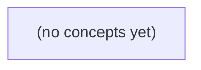

# 10.07 并发与属性验证：Go 初学者的 IM 服务测试教材

*一本围绕 S2/v1 IM 消息规则展开的中文静态教材，带领 Go 初学者用例子测试、模糊测试、竞态检测、确定性交错和状态机模型验证解析、去重与连接生命周期。全书以 22 道带反馈的练习巩固“性质、模型与执行证据分层”的验证思维，并明确当前已验证边界与未来提议。*

**章节:** 2

---

## 本书导览

- 了解整本书的章节脉络
- 掌握各章之间的概念依赖关系
- 选择最合适的阅读顺序

# 10.07 并发与属性验证：Go 初学者的 IM 服务测试教材

一本围绕 S2/v1 IM 消息规则展开的中文静态教材，带领 Go 初学者用例子测试、模糊测试、竞态检测、确定性交错和状态机模型验证解析、去重与连接生命周期。全书以 22 道带反馈的练习巩固“性质、模型与执行证据分层”的验证思维，并明确当前已验证边界与未来提议。

下方的概念图展示了本书 0 个核心概念以及它们之间的依赖关系；再下方是 1 个章节的入口。你可以按从上到下的顺序阅读，也可以根据自己的兴趣或先验知识选择切入点。

#### 概念图



## 章节索引

- **10.07 并发与属性验证：没有data race为何还重复发送** — 面向Go初学者，沿虚构IM解码、去重和连接生命周期说明Go fuzzing、race detector、受控并发交错、状态机与回归证据各自边界。

## 10.07 并发与属性验证：没有data race为何还重复发送

- 从S2接口规则提炼可测性质
- 设计Go Fuzz解码边界与种子
- 区分数据竞争与逻辑并发错
- 用barrier复现原子查重反例
- 给连接代次状态机写合法转移
- 把失败输入变回归并标明证据范围

S2的发送规则看似简单，却横跨解码、并发去重与连接生命周期。必须以不同验证手段覆盖不同风险，不能把一次“全绿”误认为系统正确。

### 从S2规则提炼可观测性质

### 从S2规则提炼可观测性质

先把“发送消息”拆成可由测试观察的断言，而不是笼统地断言“POST 成功”。

- **输入与解码性质**：请求体必须存在、可解码为 UTF-8，且消息正文长度为 $1\sim6$ 个 UTF-8 字节；空体、空正文、非法 UTF-8、超过 6 字节都应被拒绝。注意“字节”不是字符：一个中文字符通常占 3 字节，因此“你好啊”已超过限制。
- **响应性质**：成员向有效会话发送首次消息，返回 `200`，并包含 `accepted_in_memory`；发送者不是该会话成员时返回 `404`。这里 `404` 是权限/成员关系不可见的接口语义，不应仅检查数据库是否存在该会话。
- **去重状态性质**：同一消息 ID 一旦被成功接受，后续以相同 ID 再次提交，即使正文完全相同，也必须返回 `409`。因此去重键是消息 ID，而非“正文是否重复”。
- **原子性性质**：并发提交同一 ID 时，最多一个请求得到 `200 accepted_in_memory`，其余均为 `409`；不能出现两个 `200`，也不能因竞争导致崩溃、空响应或错误地接受不同状态。
- **连接生命周期性质**：客户端断开、写入失败或请求取消后，服务端不得让半完成请求绕过去重检查；后续重试仍应服从同一 ID 的已接受状态。

这些性质描述的是 S2 的内存接受语义，不等同于持久化。未来 S3 即使增加 `stored_in_teaching_db`，也应另行验证“接受”和“落库”的顺序、失败与恢复，不能把 S2 的 `200` 自动解释为跨节点或跨重启仍可见的历史。

### 解码边界与模糊测试种子

### 解码边界与模糊测试种子

S2 的正文约束应先落到**原始字节序列**，再讨论字符串：消息 `POST` 正文必须非空，且 UTF-8 编码后的长度满足

$$1 \le |body|_{\text{UTF-8}} \le 6$$

同时，整份 HTTP 请求（请求行、首部、空行与正文）不得超过 `4096B`。因此，不能只用“字符数为 6”测试：`abcdef` 是 6 字节，但两个汉字通常也是 6 字节；三个汉字则为 9 字节，应被拒绝。

建议先建立可解释的边界例子：

- 空正文：拒绝，验证“非空”不是被空字符串、缺失正文或 `Content-Length: 0` 绕过。
- `a`、`abcdef`：接受，覆盖 1B 与 6B。
- `abcdefg`：拒绝，覆盖 7B。
- `中中`：接受，覆盖多字节字符恰好 6B。
- `中中中`：拒绝，证明按字节而非按字符计数。
- 请求总长恰为 `4096B` 与 `4097B`：分别接受、拒绝；填充应放在首部或正文之外的可控位置，以隔离总长规则。

畸形输入不能先被“替换字符”悄悄修复。应投喂孤立续字节、截断的多字节序列、过长编码、非法首字节，以及声明长度与实际载荷不一致的请求。期望是稳定拒绝、无崩溃、无意外发送；不要把非法字节解码为 `�` 后再按其长度放行。

最小模糊测试种子可保留：空体、`a`、`abcdef`、`abcdefg`、`中中`、截断的 `中`、`4096B` 请求、`4097B` 请求。模糊器随后对长度字段、首部边界、正文末尾和 UTF-8 字节逐位变异。这里验证的是解码与尺寸边界；即使这些种子全绿，也不能据此推断重复 ID、并发去重或连接关闭路径正确。

### 重复发送：无数据竞争仍会出错

### 重复发送：无数据竞争仍会出错

`-race` 报告的是**未同步的内存访问冲突**，并不证明业务操作具有原子性。最典型的反例是把同一条消息的处理拆成“查重—发送—登记”三步：

1. 请求 A 到达，查询 `seen[id]`，结果为不存在。
2. 请求 B 携带相同 `id` 到达，也查询到不存在。
3. A 向成员连接发送正文。
4. B 也向成员连接发送正文。
5. A 登记 `seen[id] = true`。
6. B 登记同一值。

若每一步访问 `seen` 都被互斥锁保护，`go test -race` 完全可能通过：没有两个 goroutine 同时读写同一块内存。但两个请求在“查到不存在”和“完成登记”之间交错，仍产生两次发送，违反“同 ID 即使正文相同也只能首次接受、后续返回 `409`”的协议性质。

错误不在于锁缺失，而在于锁保护的临界区太小。去重判定与占用 ID 必须构成一个不可分割的状态转换，例如在锁内完成“检查并登记为处理中”，只有成功占用者才能继续发送；失败者立即得到 `409`。若发送失败，还应明确是否回滚占用、如何定义重试语义。

这类问题应由状态机交错测试验证：并发启动两个相同 ID 的请求，断言至多一个响应为 `200 accepted_in_memory`，成员至多收到一次正文，另一个为 `409`。普通示例、模糊输入和 `-race` 各有价值，但不能互相替代。

### 用屏障复现原子查重反例

### 用屏障复现原子查重反例

并发重复发送最容易被“偶尔只出现一次”的测试掩盖。若实现采用“先查询、后写入”：

`若 ID 不存在 → 写入内存 → 返回 200`

两个同 ID 请求可能同时看到“不存在”，随后都写入并都返回 `200 accepted_in_memory`。即使使用 `-race` 没报告，也不代表该复合操作具备原子性：它可能没有裸内存冲突，却违反了业务状态机。

可在测试替身中设置屏障：让两个处理协程都完成“查找 ID”后暂停，直到二者均到达查重点，再同时放行写入阶段。

1. 构造两个 `POST`，使用相同消息 ID 与相同非空正文；正文可为 `你好`，满足最多 6 个 UTF-8 字节。
2. 启动两个并发请求，并等待它们都卡在“未命中查重表”之后。
3. 打开屏障，使两者竞争提交。
4. 断言结果集合恰为一个 `200 accepted_in_memory`、一个 `409`；不能是两个 `200`，也不能因锁粒度错误得到两个 `409`。
5. 再断言内存中该 ID 仅有一条记录，总请求大小仍不得超过 `4096B`。

这种测试不是随机压测，而是受控交错：它稳定暴露“检查—插入”未被同一互斥区、原子映射操作或串行状态机保护的反例。另应独立保留解码测试，例如空正文、超过 6 字节的 UTF-8 正文、非法编码；它们不能替代并发原子性验证。非成员应始终为 `404`，未来即使 S3 改为 `stored_in_teaching_db`，也仍需重新验证持久化边界上的同一状态转换。

### 连接代次与证据边界

### 连接代次与证据边界

连接正确性不能只看“能否发送一次”。应把每次建立的连接视为独立代次：`未连接 → 拨号中 → 已连接(generation=n) → 关闭中 → 已关闭`。所有读写、重连回调和取消操作都必须携带或核对代次；旧代次的延迟回调不得关闭、替换或向新代次写入数据。否则即使没有内存 data race，也可能出现“旧连接重连成功后覆盖新连接”“关闭 A 误关 B”“同一消息在两代连接各发送一次”。

可将验证手段按证据范围区分：

- **例子测试**：验证明确契约，例如非空且正文最多 `6` 个 UTF-8 字节、总请求不超过 `4096B`；同 ID 即使正文相同也返回 `409`；非成员为 `404`；成功响应为 `200 accepted_in_memory`。它证明已列出的样例，不证明任意输入或任意时序。
- **fuzz 输入**：重点攻击 UTF-8 解码、长度边界、截断请求和异常字段组合，发现解析器崩溃、绕过或错误分类；它不覆盖并发调度。
- **`-race`**：证明已执行路径上未观测到未同步内存访问；它不能证明去重原子性、连接代次顺序或“不会重复发送”。
- **状态机交错测试**：人为安排“旧读循环晚到”“重连与关闭并发”“发送恰逢代次切换”，断言只有当前代次可写，重复 ID 只产生一次内存接受结果。这才直接检验生命周期的有序约束。
- **08.11 跨节点历史**：用于验证节点重启、切换或消息迁移后仍能识别历史 ID。S2 的 `accepted_in_memory` 只覆盖进程内历史；未来 S3 的 `stored_in_teaching_db` 仍是提议，不能提前当作已证明的持久去重。

因此，一项测试变绿只是在其证据边界内成立；解码正确、无 data race 与跨节点不重发是不同命题。

> **要点** — 性质必须对应验证工具：fuzz验边界，-race验内存冲突，屏障验逻辑交错，状态机验生命周期；S3持久化仍只是提议。

本节以虚构 IM 的消息解码为对象，在纸上设计可执行的 Go 模糊测试：先界定输入边界，再把接口规则改写为可验证性质。

### 从 S2 规则提炼解码性质

### 从 S2 规则提炼解码性质

S2 不应只描述“输入合法时返回消息”，而要改写成模糊测试可观察的双向性质。设 `DecodeMessage` 接收原始字节并可能更新会话状态，则每次调用后都应检查结果、状态与错误内容，而非只看是否报错。

- **成功路径**：若返回 `nil` 错误，则解码出的正文必须是合法 UTF-8，且长度满足 $0 \le |body| \le 6\text{B}$；发件人必须属于受信集合；未知字段不得绕过身份或长度校验。成功后的状态只能产生一次与该消息对应的接收记录，不能隐式重复发送。
- **拒绝路径**：若输入为空、截断 JSON、非法 UTF-8、正文超限、伪造发件人或结构不完整，则必须返回错误；接收队列、已确认序号、发送计数等状态与调用前完全一致。错误可说明“格式无效”或“字段不合法”，但不得回显原始正文、密钥、内部地址或认证细节。
- **资源路径**：任意随机输入都不得 `panic`，不得无限循环；对最大边界输入（如 4096B）应保持可预期的内存占用。解码器应先限制输入规模，再分配或复制字段。

纸上 `FuzzDecodeMessage(f *testing.F)` 可用 `f.Add` 加入空输入、`你好`（6B）、`你好呀`（9B）、截断 JSON、非法 UTF-8、未知字段及 4096B 边界种子；后续真实执行可由 `testdata/fuzz` 保存崩溃样本。关键断言是：接受时内容与身份受约束，拒绝时状态不变且错误不泄密。

### 建立覆盖边界的初始种子

### 建立覆盖边界的初始种子

`FuzzDecodeMessage(f *testing.F)` 的种子不是“越多越好”，而是要覆盖解码器最容易分叉的输入边界。假设协议接收 JSON 对象，包含 `body` 与 `sender` 字段，且正文上限为 6 字节，可先加入：

```go
func FuzzDecodeMessage(f *testing.F) {
	f.Add([]byte{})                         // 空输入
	f.Add([]byte(`{"body":"你好"}`))         // “你好”：UTF-8 共 6B，合法边界
	f.Add([]byte(`{"body":"你好呀"}`))       // 9B，超过正文上限
	f.Add([]byte(`{"body":"你好"`))          // 截断 JSON
	f.Add([]byte{'{', '"', 'b', 'o', 'd', 'y', '"', ':', '"', 0xff, '"', '}'}))
	f.Add([]byte(`{"body":"你好","sender":"trusted","extra":1}`))
	f.Add([]byte(`{"body":"` + strings.Repeat("a", 4096) + `"}`))

	f.Fuzz(func(t *testing.T, data []byte) {
		// 调用 DecodeMessage，并检查性质。
	})
}
```

这里的“6B”必须按字节而非字符计数：`你好`有 2 个汉字，却恰好占 `$2\times3=6$` 字节；`你好呀`占 9 字节。截断 JSON 用于覆盖语法分析尚未完成的失败路径，`0xff` 检查非法 UTF-8 是否被安全拒绝。未知字段种子则确认实现不会因额外键崩溃或误信任数据。

4096B 种子不等同于业务允许 4096B 正文；它用于推动解析器经过较大输入路径，观察是否存在不受控分配、递归或异常耗时。种子可放在 `f.Add` 中快速表达关键边界；后续模糊执行产生的有价值输入可保存到 `testdata/fuzz`，成为可重复的回归语料。

### 纸上组织 FuzzDecodeMessage

### 纸上组织 `FuzzDecodeMessage`

先把模糊测试入口限制为原始网络字节，而不是直接生成 `Message` 结构体；这样才能同时覆盖 JSON 解析、UTF-8、字段校验与长度边界。`f.Add` 负责放入少量语义明确的回归种子，随机变异则负责扩大邻域：

```go
func FuzzDecodeMessage(f *testing.F) {
    f.Add([]byte{})                         // 空输入
    f.Add([]byte(`{"body":"你好"}`))         // 正文 6B
    f.Add([]byte(`{"body":"你好呀"}`))       // 正文 9B，超限
    f.Add([]byte(`{"body":"`))               // 截断 JSON
    f.Add([]byte{0xff, 0xfe, '{'})           // 非法 UTF-8
    f.Add([]byte(`{"body":"ok","x":1}`))     // 未知字段
    f.Add(make([]byte, 4096))                // 输入边界

    f.Fuzz(func(t *testing.T, raw []byte) {
        before := snapshotState()
        msg, err := DecodeMessage(raw)

        if err == nil {
            assertValidAccepted(t, msg)
        } else {
            assertRejectedSafely(t, before, err)
        }
        cleanupTestState()
    })
}
```

职责应当分层，避免把所有检查塞进一个断言：

- **解析**：`DecodeMessage` 只将字节转换为候选消息，并报告格式错误；应拒绝截断 JSON、非法 UTF-8、未知字段和超出协议输入上限的数据。
- **校验**：成功返回时，`body` 必须是合法 UTF-8，且 `len([]byte(body)) <= 6`；发件人必须来自受信身份上下文，不能由输入伪造。
- **断言**：接受路径验证结果满足协议；拒绝路径验证状态快照与 `before` 完全一致，错误仅说明“输入无效”，不得回显原始正文、内部账户或认证细节。
- **清理**：每次迭代恢复全局状态、连接池、缓存或临时文件，防止前一轮输入污染后一轮；内存性质可通过限制输入长度、拒绝无界分配及观察峰值增长来表达。

种子可同时放入 `testdata/fuzz/FuzzDecodeMessage/`，使已发现的失败样本成为持久回归语料。这里先完成纸上规格；实际执行由学习者在其 Go 环境中进行。

### 断言接受与拒绝的安全边界

### 断言接受与拒绝的安全边界

模糊测试不应只检查“能否解析”，而要把解码器的结果划分为两条安全路径：**接受**与**拒绝**。对任意随机字节串 `data`，调用 `DecodeMessage(data)` 都必须满足最基本性质：

- 不发生 `panic`，包括切片越界、非法 UTF-8 转换、类型断言失败等。
- 内存使用受输入上限约束；解码器不得仅因声明了超大长度字段就分配巨大缓冲区。可在实现中限制原始输入、正文及字段数量，例如最大输入 `4096B`、正文最多 `6B`。
- 解码失败应返回可预期错误，而不是让异常传播到调用方。

接受路径需要验证业务不变量。若 `err == nil`，则消息必须满足：

```go
len(msg.Body) <= 6
utf8.ValidString(msg.Body)
trustedSenders[msg.Sender]
```

也就是说，成功返回不等于“JSON 语法正确”；正文必须是合法 UTF-8 且不超长，发件人必须位于受信集合中。未知字段可以按协议忽略，但不能借此绕过长度、身份或结构检查。

拒绝路径同样是安全边界。每次调用前保存状态快照，例如队列长度、已接收消息数或最后一条消息；若 `err != nil`，断言这些状态完全不变。尤其要防止“先入队、后校验”导致坏消息部分提交。

错误信息也不应泄露内部细节。可断言错误文本不包含原始正文、令牌、完整 JSON 片段、内部路径或栈信息；对外只暴露诸如“消息格式无效”“发送者未授权”的稳定类别。这样，随机输入既不能使服务崩溃或膨胀内存，也不能借失败路径污染状态、探测内部实现。

### 沉淀失败样本与证据范围

### 沉淀失败样本与证据范围

模糊测试发现问题后，最有价值的产物不是一次随机运行日志，而是可稳定复现的**最小失败输入**。将其保存到 `testdata/fuzz/FuzzDecodeMessage/`，使后续测试自动回放；文件名可采用发现日期与语义，例如：

- `empty`：空输入；
- `truncated-json`：`{"body":"你`；
- `invalid-utf8`：含非法 UTF-8 字节；
- `body-over-6b`：正文超过 6 字节；
- `unknown-field`：含未声明字段；
- `boundary-4096b`：恰好或接近 4096 字节的边界输入；
- `panic-minimized`：触发崩溃后经最小化得到的样本。

样本内容应保持原始字节，不要为了“可读”而转换为字符串；否则非法 UTF-8、截断编码等关键证据可能被改写。必要时可在同目录附简短说明，记录触发的性质、预期结果与缺陷编号，但不要把敏感正文、令牌或真实发件人写入语料库。

证据范围也应明确：本节仅在纸上设计 `f.Add`、`F.Fuzz` 与 `testdata/fuzz` 的组织方式，论证这些种子能够覆盖空值、编码、结构、长度和权限边界。它不声称已经执行过模糊测试，也不以“未发现崩溃”证明实现正确。真实执行、崩溃最小化、语料回归及资源上限测量由学习者在其本地 Go 环境完成。

每个沉淀样本都应对应可检验结论：接受时正文合法且不超过 `6B`、发件人受信；拒绝时状态不变，错误信息不泄露内部细节。这样，失败输入才从偶发事故变成长期回归证据。

> **要点** — 模糊测试的核心不是随机字节，而是用边界种子驱动可观察、可回归且不越权的接口性质。

并发程序“通过 -race”只说明已执行路径未观测到内存数据竞争，并不意味着去重与推送业务一定正确。

### 先界定 -race 的证据范围

### 先界定 `-race` 的证据范围

`go test -race` 或 `go run -race` 的结论应理解为：**在本次实际执行到的代码路径、调度时序和输入数据下，运行时没有观测到可识别的共享内存数据竞争。**

它主要检查同一进程内是否存在类似情形：

- 协程 A 正在写某个内存位置；
- 协程 B 未经同步地同时读或写该位置；
- 两者之间不存在锁、原子操作、通道等建立的同步关系。

因此，未报告竞争不等于“程序已经并发正确”：

- 未被测试覆盖的分支、异常路径、重试路径，`-race` 无法替你执行和证明；
- 某次测试没有恰好触发的调度交错，可能仍在生产负载下出现；
- 多个进程、多个实例或多个节点各自拥有独立内存时，探测器看不到它们之间的协作冲突；
- “查重后发送”“余额判断后扣款”等业务步骤即使每一步都无数据竞争，整体仍可能不是原子的。

例如，`Check(m9)` 和 `Insert(m9)` 分别加锁，确实能避免无锁 `map` 的内存竞争；但 T1、T2 仍可依次都查到 `m9` 不存在，再分别插入并推送。此时 `-race` 可能完全通过，重复效果却已经发生。

所以，`-race` 是定位内存级并发缺陷的重要证据，不是业务去重、分布式一致性或原子性的证明。

### 无锁映射表为何必然危险

### 无锁映射表为何必然危险

若多个请求共享一张“已处理消息”映射表，例如 `map[string]bool`，并发访问时不能仅凭“键不同”就认为安全：

```go
if !seen[msgID] {
    seen[msgID] = true
}
```

这里至少包含两类对同一映射表底层结构的访问：

- `seen[msgID]`：读取桶、键和值；
- `seen[msgID] = true`：可能写入已有桶，也可能扩容、分配新桶、迁移旧数据。

当一个协程读取、另一个协程写入，且二者之间没有互斥锁、原子同步或其他建立顺序关系的机制时，就构成内存数据竞争。即使两个协程处理的是不同的 `msgID`，它们仍共享同一个 `map` 的内部桶数组、计数器和扩容状态；一次写入并不只是修改“某个独立键位”。

因此，无锁并发读写普通 Go `map` 的后果不是简单的“偶尔读到旧值”，而是未定义的并发行为：`go test -race` 可能报告数据竞争，运行时也可能直接触发 `fatal error: concurrent map read and map write` 或 `concurrent map writes`。更危险的是，未崩溃不等于正确：某次运行看似正常，只是调度时机尚未暴露问题。

应先用 `sync.Mutex` 或 `sync.RWMutex` 保护映射表的全部访问，使每次读写都具备同步边界。但锁只能解决映射表的内存安全；若“检查是否存在”和“写入标记”分成两个临界区，仍可能产生重复业务效果。

### 分别加锁仍会重复发送

### 分别加锁仍会重复发送

设映射表记录已处理消息，`m9` 尚不存在。即使 `Check` 和 `Insert` 各自都正确加锁，仍可能发生“先检查、后使用”竞态：

| 时刻 | T1 | T2 |
|---|---|---|
| 1 | 加锁检查：`m9` 不存在；解锁 |  |
| 2 |  | 加锁检查：`m9` 不存在；解锁 |
| 3 | 推送消息 `m9` |  |
| 4 |  | 推送消息 `m9` |
| 5 | 加锁插入 `m9`；解锁 |  |
| 6 |  | 加锁插入 `m9`；解锁 |

这里没有对 `map` 的无锁并发读写；因此 `go test -race` 可能完全安静，映射表本身也不会崩溃。但两个请求都基于同一份“尚未处理”的旧状态作出决定，最终产生两次外部推送。

问题不在于“锁没有保护 map”，而在于锁没有保护完整业务动作。`Check(m9)` 与“登记为已处理”必须组成不可分割的原子操作：

`若 m9 不存在，则立即插入占位；否则返回重复`

例如在同一临界区内完成查重和插入；获得“首次处理权”的请求才允许后续推送。更可靠的跨进程方案是在数据库中为消息标识建立唯一约束：插入成功者继续处理，唯一冲突者按当前规则返回 `409`。旧内容必须保留，不能让后到请求覆盖先到记录。

### 把查重与登记变成一个动作

### 把查重与登记变成一个动作

仅给 `Check(m9)` 和 `Insert(m9)` 分别加锁并不够：锁释放后，另一个请求仍可在“已检查、未登记”的间隙通过检查。

```text
T1：检查 m9 不存在 → 解锁
T2：检查 m9 不存在 → 解锁
T1：登记 m9 → 推送
T2：登记 m9 → 推送
```

正确的内存实现是把“查重 + 登记”放进同一个临界区；只有成功登记的请求才能继续发送：

```go
mu.Lock()
if _, exists := seen[id]; exists {
    mu.Unlock()
    return conflict409()
}
seen[id] = payload
mu.Unlock()

send(payload)
```

这里的关键不是 `map` 不发生 data race，而是同一消息标识从“不存在”到“已占用”的状态转换不可分割。重复请求应立即返回 HTTP `409 Conflict`，并且不得用新请求体覆盖 `seen[id]` 中的旧内容。

单进程内可使用上述互斥锁；多实例部署时，各节点的本地 `map` 无法互相看见，必须把原子性下沉到共享存储。例如数据库对消息标识建立唯一约束：

```sql
INSERT INTO messages (id, body) VALUES (?, ?);
```

插入成功者拥有发送资格；唯一键冲突者映射为 `409`，不执行更新、不覆盖原记录、不再次推送。数据库唯一约束解决的是跨节点并发登记；发送动作本身若要求“恰好一次”，还需进一步采用事务外盒等可靠投递机制。

### 用受控交错固定回归证据

### 用受控交错固定回归证据

普通并发压测只能“提高”撞车概率，失败时还难以复现。应在查重边界设置测试专用的 `barrier`：两个请求都完成 `Check(m9)`、都确认“当前不存在”后暂停；待两者到齐，再同时放行进入“登记消息并推送”的路径。

修复前，这个测试应稳定暴露双效果：

- `T1`、`T2` 都读到 `m9` 不存在；
- 两者随后各自插入或推送；
- 结果可能是两次成功响应、两条推送记录，或旧内容被后一次覆盖。

修复后，查重与登记必须处于同一个原子范围，例如同一互斥锁临界区，或依赖数据库唯一约束。断言应明确业务规则：

1. 两个并发请求使用相同消息标识 `m9`；
2. 恰好一个请求成功，返回创建成功状态；
3. 另一个请求返回 `409`；
4. 推送记录恰好一条；
5. 已保存的旧内容不被失败请求覆盖。

可将屏障抽象为测试钩子：`Check` 后通知“已到达”，等待测试统一放行。生产环境关闭该钩子，避免把测试同步机制带入真实逻辑。

该测试覆盖的是单进程、已执行到该交错点的去重原子性；它不能证明未覆盖分支无竞争，也不能证明多实例部署、跨节点缓存或数据库复制延迟下仍完全正确。多节点场景仍应以数据库唯一索引、幂等键或可靠消息机制作为最终约束。

> **要点** — -race 排除的是已观测内存竞争；重复发送要靠查重与登记的业务原子性及可复现交错测试来证明。

本节以设备 d-b1 的两代连接为线索，区分本地并发正确性、连接代次隔离与外部发送不可回滚的边界。

### 连接代次与本地所有权模型

### 连接代次与本地所有权模型

对设备 `d-b1`，本地连接状态可抽象为：

`DISCONNECTED → CONNECTING → ACTIVE → DRAINING → CLOSED`

其中 `CLOSED` 通常是一次连接实例的终态；若需要重连，不是让旧实例“复活”，而是创建更高代次的新实例：

- 第一代连接：`G1 / gen41`
- 第二代连接：`G2 / gen42`

可将本地记录写成：

`Conn(d-b1) = (state, generation, owner, pending)`

当 `G1` 成功建立时，记录可能为：

`(ACTIVE, 41, G1, pending₁)`

此处的 `owner=G1` 表示：在**当前进程的本地内存中**，只有 `G1` 有资格解释连接事件、推进该连接状态，以及提交属于 `gen41` 的待发任务。它不是分布式意义上的全局主节点声明；与 08.07 中跨节点租约、仲裁或一致性 owner 不同，这里的 owner 只是防止同一设备的旧回调和新连接在本地互相覆盖。

断开时，不应直接删除 `G1` 的身份，而应先进入 `DRAINING`：停止接受新的 `gen41` 任务，处理可确认的收尾工作，然后转为 `CLOSED`。重连创建 `G2/gen42` 后，当前所有权必须单调前进：

`generation_new > generation_old`

因此，任何异步回调都必须携带其创建时捕获的代次。旧回调即使在 `G2` 已活跃后才到达，也只能看到“我属于 `gen41`，当前是 `gen42`”，并被拒绝更新 owner、状态或发送队列。比较目标不是“回调是否晚到”，而是：

`callback.gen == current.gen ∧ callback.owner == current.owner`

只有同时成立，回调才可影响当前连接。这样，`G1` 可以结束，但不能把 `owner` 改回 `41`，更不能把过期任务误交给 `G2`。

### 合法转移与失效回调规则

### 合法转移与失效回调规则

令设备状态为 `DISCONNECTED`、`CONNECTING(g)`、`ACTIVE(g)`、`DRAINING(g)`、`CLOSED(g)`，其中 `g` 是单调递增的连接代次。`ownerGen` 只表示当前被允许拥有发送权的代次，而非历史上最后一次成功连接。

四类操作可推出以下合法转移：

- `Connect`：仅当状态为 `DISCONNECTED` 或前一代已 `CLOSED` 时创建新代次 `g+1`，进入 `CONNECTING(g+1)`；握手成功才可进入 `ACTIVE(g+1)`，并原子写入 `ownerGen=g+1`。
- `Disconnect(g)`：仅对当前代次生效。`ACTIVE(g)` 可进入 `DRAINING(g)`，停止接收新任务；待本代本地队列处理完毕后进入 `CLOSED(g)`，再允许后续 `Connect`。
- `Deliver(g, task)`：发送前必须同时满足 `state=ACTIVE(g)`、`ownerGen=g`、`task.targetGen=g`。任一比较失败，任务不得交给当前连接发送。
- `Timeout(g)`：超时只能关闭或标记其所属代次；它不能把 `ownerGen` 改回 `g`，也不能覆盖已建立的更高代次。

因此，`G1/gen41` 迟到的连接成功、断开确认、超时或投递回调，若当前已进入 `G2/gen42`，都属于失效回调。其合法动作只有两类：拒绝其状态写入，或清理它持有的本地资源、计时器和待发送任务。尤其不能执行“回调成功即恢复 ACTIVE(41)”之类的无条件写入。

稳定消息去重还需独立于代次：同一业务消息即使因重连被重新投递，也应按稳定消息标识判重。代次比较防止旧连接发送新任务；消息去重防止新连接重复接受同一任务。即便检查通过后 socket 字节已经写出，后续断开也无法撤回外部副作用；状态机保证的是不再**开始**错误发送，而非抹去已经发生的发送。

### 代次比较阻断旧连接副作用

### 代次比较阻断旧连接副作用

设设备 `d-b1` 的连接代次单调递增。`G1` 建立后记录为 `owner=41`，随后经历 `DRAINING/CLOSED`；重连成功的 `G2` 成为 `owner=42`。关键交错如下：

1. `Connect(G1)`：状态进入 `ACTIVE(G1, gen=41)`，任务 `t` 被标记为目标代次 `41`。
2. 网络断开：主线程将 `G1` 置为 `DRAINING`，再关闭；重连流程启动。
3. `Connect(G2)`：状态进入 `ACTIVE(G2, gen=42)`，原子发布 `owner=42`。
4. 此时旧连接的异步回调迟到：`Deliver(G1, t)` 或 `Timeout(G1)` 才开始执行。

回调不能仅检查“设备当前是否已连接”，而必须比较其捕获的代次：

\[
g_{\text{callback}} = g_{\text{owner}} = g_{\text{task}}
\]

只有三者均为 `42`，且状态仍为 `ACTIVE`，任务才可进入发送路径。于是迟到的 `G1` 回调满足：

\[
41 \ne 42
\]

它只能被丢弃、记审计日志或触发本地清理，不能执行 `owner ← 41`，也不能将目标为 `41` 的任务交给 `G2` 发送。

可将发送前置条件写成：

- 当前状态为 `ACTIVE`；
- 当前 `owner` 等于任务目标代次；
- 回调持有的连接代次等于当前 `owner`；
- 稳定消息标识尚未被本代次去重表确认。

这阻断的是**本地状态与发送决策**的旧代副作用。即使 `G1` 在关闭竞态中已经把部分字节写入外部 socket，程序也无法回滚该字节；因此仍需用稳定消息标识去重、接收端幂等或确认协议处理“外部世界已见”的重复。这里的 `owner` 是单进程内连接实例的代次栅栏，不等同于 08.07 中跨节点租约、选主或分布式 owner 的一致性问题。

### 稳定消息去重与发送边界

### 稳定消息去重与发送边界

对设备 `d-b1` 而言，重连会产生连接代次：`G1/gen41` 关闭后进入 `G2/gen42`。但业务消息的去重键不能写成 `(gen, taskId)`：同一条稳定任务在 `gen41` 中已尝试发送、在 `gen42` 中恢复投递时，会被误判为两条不同消息。

应将去重身份绑定到跨连接稳定存在的业务对象，例如：

- 命令：`(deviceId, commandId)`
- 任务执行：`(deviceId, taskId, attemptId)`
- 事件上报：`(deviceId, eventId)` 或生产者单调序号

连接代次只用于验证“此刻谁有资格发送”，而非定义“消息是否相同”：

\[
\text{可发送} \iff owner=(G2,gen42)\land state=ACTIVE\land \neg delivered(messageId)
\]

旧 `G1` 的迟到 `Deliver` 或 `Timeout` 回调即使仍持有任务引用，也不能借由 `gen41` 修改 owner、重新入队或发送；它最多发现自己的代次已失效并静默退出。`G2` 接管时可依据稳定 `messageId` 恢复未确认任务，避免因代次变化制造重复业务记录。

但“去重”不能声称撤销已经跨越发送边界的副作用。必须区分证据强度：

1. **尚未调用 socket 发送**：可安全取消，证明字节未离开本进程。
2. **已调用发送，但未获得应用确认**：socket 缓冲、内核排队或网络传输均可能已发生；重连后的重发只能称为“至少一次”。
3. **收到带稳定 `messageId` 的确认**：可标记完成；若确认丢失，接收端仍须按同一身份幂等处理。

因此，本地属性验证能证明旧代次不会再次获得发送资格，却不能证明远端从未看到旧字节。这不同于分布式 owner 选主：这里的 owner 是本地连接资格；端到端唯一性仍依赖稳定消息身份、确认协议与接收方去重。

### 与分布式所有权问题的边界

### 与分布式所有权问题的边界

进程内的 `owner + gen` 校验解决的是**本地并发与陈旧回调隔离**：对设备 `d-b1`，当前连接为 `ACTIVE(G2, gen42)` 时，任何携带 `G1/gen41` 的 `Deliver`、`Timeout` 或关闭回调都必须先比较代次；不匹配便不得改写 `owner`、不得推动状态回退，也不得从待发送队列取出属于旧代的任务。

这类性质可表述为：

\[
send(m) \Rightarrow owner=d\text{-}b1 \land gen(m)=currentGen(d\text{-}b1)
\]

它保证同一进程的共享状态不会被旧连接“夺回”。但它不等于分布式唯一所有权，原因在于另一个节点可能同时持有自己的内存状态：

- 节点 A 认为自己仍是 `owner=A, gen41`，节点 B 已经通过协调机制取得 `owner=B, gen42`；
- A 的租约过期、心跳延迟或网络分区可能使其**晚于逻辑失权**才停止发送；
- 即使 A 本地完成代次比较，先前已写入 socket 的字节也无法撤回；对端可能已经收到，或在链路重试后再次收到。

因此，08.07 中的分布式所有权还需要共享协调语义，例如租约、仲裁存储、栅栏令牌或单写者分区。尤其是栅栏令牌应由接收方或下游资源验证：`gen42 > gen41` 时拒绝旧令牌的写入，不能仅依赖旧 owner “自觉停止”。

本节的属性验证通常只能证明：**单进程内不会因竞态让 G1 重新成为当前 owner，稳定消息不会被本地重复调度。**它不能证明跨节点唯一发送，更不能证明网络端到端“恰好一次”。端到端去重仍需消息标识、接收方幂等记录或持久化确认协议。

> **要点** — 代次校验可阻止旧连接篡改本地状态或提交过期任务，但不能撤回已写入外部 socket 的字节。

并发缺陷的关键不在“等一等就会发生”，而在于把交错、时间与取消条件变成可精确控制、可重复验证的测试事件。

### 以事件编排替代睡眠等待

### 以事件编排替代睡眠等待

`time.Sleep` 只能“猜测”调度器可能已经做完某事：机器负载、`GOMAXPROCS`、竞态窗口和垃圾回收都会改变结果。它既可能让缺陷偶然消失，也可能让正确测试间歇失败。并发测试应等待**语义事件**，而非等待一段墙上时间。

将存储、发送器或租约服务替换为可控依赖，并在关键调用处设置 `channel barrier`。例如，为复现“两个工作者都认为任务缺失，随后都发送”的交错：

1. T1 调用“查询是否已发送”，假实现记录 `T1-查缺` 后阻塞；
2. T2 同样查询，记录 `T2-查缺` 后阻塞；
3. 测试确认两个查缺事件都已到达，再放行 T1，使其插入发送记录；
4. 控制 T1 停在插入后、真正发送前，放行 T2 插入；
5. 最后分别放行发送路径，断言事件序列、插入结果及远端调用次数。

屏障应由测试显式释放，如 `arrived <- workerID` 表示“已抵达阶段”，`<-releaseT1` 表示“允许继续”。每个阶段使用独立通道，避免一次关闭意外放行后续步骤；同时为所有等待绑定测试级超时，超时信息应包含当前阶段、已到达工作者和随机种子。

这样测试验证的是明确属性：即使两个工作者并发查缺，系统也必须依靠唯一约束、原子领取或幂等键保证至多一次发送，而不是碰巧因某次调度顺序正确。

### 复现原子查重的双重发送

### 复现原子查重的双重发送

“先查是否存在，再插入并发送”即使每一步都加锁、通过 `go test -race`，仍可能不是原子的。问题在于：两个工作者都可能在“查缺”阶段得到相同结论，随后各自完成插入和远端发送。

测试不要用 `time.Sleep` 猜测交错，而应把存储层拆成可阻塞的依赖，并用 `channel` 精确放行：

1. 启动 `T1`，令其执行查重，确认键 `K` 不存在；在返回前通过屏障暂停。
2. 启动 `T2`，同样执行查重，也确认 `K` 不存在；暂停。
3. 放行 `T1`：它插入 `K`，并调用发送器。
4. 再放行 `T2`：若实现只是“查后插”，它仍会基于旧结果插入或继续发送。

可记录事件序列，例如：

`T1:查缺 → T2:查缺 → T1:插入 → T1:发送 → T2:插入 → T2:发送`

断言重点不是“最终表中只有一条记录”，因为覆盖写、幂等写或唯一键错误处理都可能让最终状态看似正确；应断言发送器对 `K` 的调用次数：

```text
发送次数(K) == 1
```

若观察到两次发送，就证明违反了去重语义，而非发生了 data race。正确修复通常是将“占位/插入”做成单个条件写入：只有成功取得 `K` 的工作者才可发送；其他工作者必须观察到已存在或进行中状态，并停止副作用。

### 以假时钟驱动租约与取消

### 以假时钟驱动租约与取消

真实时间会把测试变成赌博：`time.Sleep` 既不能证明租约恰好过期，也无法稳定复现“请求已发出、取消随后到达”的交错。应将业务依赖的时钟抽象为可推进的假时钟：

```go
type Clock interface {
    Now() time.Time
    After(time.Duration) <-chan time.Time
}
```

测试先固定初始时刻 `t0`，令工作者取得租约 `lease(t0, 30s)`；再由测试主动推进到 `t0+30s`，确认等待重试的工作者被唤醒，而不是等待真实 30 秒。若续租成功，则推进旧到期点不应触发重试；若续租失败，则应在新到期点后进入抢占或补发路径。

取消也应成为可观察事件，而非“最终返回了 `context.Canceled`”。可在远端调用的假实现中设置屏障：

1. 工作者进入“准备发送”阶段并记录事件；
2. 假远端确认请求已开始，但暂不返回；
3. 测试调用 `cancel()`；
4. 释放远端屏障，分别模拟“远端未接受”“远端已接受但响应丢失”。

断言必须区分两层语义：

- **本地停止**：工作者退出、停止续租、停止新的重试；其状态应为 `canceled` 或 `lease_expired`。
- **远端副作用**：已送达的请求可能仍创建任务、扣费或发送消息；`context` 只能协作取消本地等待，不能撤销已发生的远端操作。

因此，事件日志应至少包含 `lease_acquired`、`lease_expired`、`request_started`、`cancel_observed`、`request_accepted`、`retry_scheduled` 和每个工作者的最终状态。测试用总超时防止屏障遗漏导致死锁；失败时输出随机种子、假时钟当前值与最后阶段，才能重放特定交错。

### 记录工作者状态与事件证据

### 记录工作者状态与事件证据

并发测试失败时，仅有“测试超时”几乎没有诊断价值。应让每个工作者持续暴露可观察状态，并把关键动作写入全局事件序列，从而判断失败究竟是非法交错、取消未生效，还是测试屏障本身未释放。

工作者状态至少包括：

- `id`：工作者或请求标识；
- `phase`：当前阶段，如`查缺`、`等待屏障`、`建立连接`、`发送`、`完成`、`已取消`；
- `generation`：连接、租约或重试循环的代次；
- `err`：最终错误；
- `ctxDone`：是否已观察到`context`取消。

事件应带有单调递增序号，而不要依赖日志时间戳排序：

`#12 T1 查缺 key=A`  
`#13 T2 查缺 key=A`  
`#14 T1 插入 key=A`  
`#15 T2 插入 key=A`  
`#16 T1 发送 generation=1`  
`#17 T2 发送 generation=1`

测试断言的对象不是“最终发送了两次”这一模糊现象，而是事件是否违反协议。例如，若要求同一键只能由成功插入者发送，则`T2`在插入返回“已存在”后仍出现`发送`事件，即可直接判为非法；即使测试整体没有超时，也能定位重复发送的因果链。

记录器应由互斥锁保护，避免测试工具自身引入 `data race`。每次状态迁移同时追加事件；失败时输出完整事件、各工作者最终状态、当前屏障阶段以及随机种子。超时只作为防止永久死锁的兜底：一旦到期，先取消测试上下文，再转储证据，而不是把“超时”误当作并发正确性的结论。

### 超时、种子与失败回归

### 超时、种子与失败回归

并发测试必须有超时，但超时的职责是“阻止测试永远挂住”，不是代替同步，更不是用来猜测调度顺序。对每个受控阶段设置明确等待界限：例如等待两个工作者都完成“查缺”、等待指定工作者获准插入、等待取消信号被观察到。超时后应立刻输出诊断，而非只报“测试超时”。

可将随机交错纳入可复现输入：

- 测试开始时生成或读取 `seed`，用它决定工作者放行顺序、取消时机或重复轮次。
- 每个屏障、时钟推进、远端调用开始/结束、`context` 取消观察点都追加阶段事件。
- 记录每个工作者状态，如 `已启动`、`等待查缺屏障`、`已查缺`、`等待插入许可`、`已插入`、`已退出`。
- 任一断言失败或阶段超时时，打印 `seed`、当前阶段、完整事件序列与各工作者状态。

例如，失败信息应足以让回归测试直接重放：

`seed=184467; 阶段=等待T2插入完成; 事件=[T1查缺→T2查缺→T1插入→取消→T2仍插入]; T1=已退出; T2=已插入`

随后可用该种子固定执行，或更好地把轨迹缩减为确定性的屏障测试。种子适合发现未知交错；屏障适合永久表达已知缺陷。

还要明确证据边界：此类测试证明“在指定的查缺—插入交错、租约到期或取消条件下，系统不会重复发送（或会按预期拒绝第二次）”。它不证明所有调度器、所有远端服务行为下都绝对正确。尤其 `context` 取消只能要求本地协作停止；若远端请求已经提交，测试应验证幂等键、状态查询或补偿策略，而不能断言取消会撤销已发生的远端副作用。

> **要点** — 可复现的并发测试要控制交错与时间，记录阶段证据；race detector 无报错不等于去重语义正确。

Fuzz 发现崩溃或语义违约后，真正的价值不在随机种子，而在把可解释的失败输入、触发合同与修复边界固化为长期回归证据。

### 从失败样本提炼可回归的合同

### 从失败样本提炼可回归的合同

Fuzz 样本首先是“证据”，不是应被原样收藏的随机字节。将其放入 `testdata/fuzz/FuzzXxx` 前，应完成脱敏与最小化：删除无关字段、缩短负载、替换账号或密钥，同时保留触发失败所必需的结构、并发时序或编码组合。更重要的是写清它违反了什么合同。

例如，失败不应只断言“以前会 panic”，而应提炼为可判定性质：

- 对非法长度前缀：`Decode` 必须返回错误，不能 panic、阻塞或部分提交状态。
- 对重复请求：同一幂等键在并发调用下至多产生一次外部发送；其余调用返回同一结果或明确的“处理中”状态。
- 对被规范化的消息：对安全有效输入 $x$，应验证  
  `decode(encode(x)) == canonical(x)`，  
  而不是要求所有原始字节完全往返一致。ProtoJSON 可能丢弃未知字段、重排字段或规范化默认值，这些都不应被误判为错误。
- 对未知字段策略：若合同规定拒绝，则断言返回指定类别错误；若合同规定忽略，则断言已知字段语义不变。

修复后至少保留三类回归：原始失败的最小样本、合法相邻输入、应被拒绝的边界变式；涉及竞态时再加入并发变式，例如多个 goroutine 同时提交相同请求。断言应观察协议可见结果、持久化记录或发送次数，而不要用一份“镜像编码器/解码器”充当 oracle；两个实现共享同一误解时，只会稳定地验证错误。

### 以最小脱敏输入保存复现证据

### 以最小脱敏输入保存复现证据

模糊测试产物应进入 `testdata/fuzz/FuzzXxx/`，但不应机械保存原始请求、完整追踪或随机种子。长期有价值的证据是：**可独立复现、无敏感信息、恰好保留触发合同的最小输入**。

建议按失败类别建立样本文件，例如：

- `duplicate_send_after_concurrent_update`：并发更新属性后，同一逻辑消息被重复发送。
- `reject_unknown_protojson_field`：ProtoJSON 含未知字段时应被拒绝，而不是静默丢失后继续处理。
- `normalized_roundtrip`：规范化字段编码再解码后保持语义等价。

每个样本应尽量只保留触发所需字段。若原始输入含用户标识、令牌、地址、业务载荷或生产时间戳，替换为稳定占位值；替换后仍必须保留关键关系，例如相同 `message_id`、相同去重键、冲突版本号或并发操作顺序。脱敏不是随意删字段：删到无法触发，就失去了回归价值。

可在相邻说明文件中记录简短合同：

- 前置条件：两个 goroutine 共享同一消息或属性对象；
- 操作：并发写入属性并调用发送；
- 期望：至多一次发送，或第二次明确返回幂等结果；
- 修复边界：即使无 `data race`，也不得因检查与提交之间失去原子性而重复发送。

样本本身应是最小可消费输入；说明只解释“为何它必须存在”。随机种子可辅助定位，但不能替代样本，因为运行时调度、字典演化和模糊器版本都可能使种子不再稳定复现。

### 修复后覆盖三类回归变式

### 修复后覆盖三类回归变式

修复不能只把原始 fuzz 种子放回 `testdata/fuzz/FuzzXxx` 后“再跑一次”。种子只证明某个字节序列不再触发旧故障；真正应固定的是该输入揭示的合同，并围绕边界形成三类回归变式。

1. **正常接受变式**：保留脱敏、最小化后的有效输入，并断言其业务语义。例如消息可被解码、规范化后字段满足预期、编码后再解码仍得到等价的规范化对象。若存在默认值填充、字段排序或大小写折叠，应比较规范化结果，而不是要求原始字节完全一致。

2. **非法拒绝变式**：从失败输入只改变一个关键条件，构造明确无效的邻近样本，如截断长度、越界枚举、矛盾字段组合、超限嵌套或不允许的状态迁移。断言返回可预期错误、不会部分提交、不会发送消息，也不会留下可被后续请求观察到的半成品状态。错误类型或错误码应成为合同的一部分，而非仅断言“发生了错误”。

3. **并发交错变式**：若问题涉及重复发送、重复提交或共享状态，在受控屏障、钩子或伪时钟下安排两个请求穿插：同时检查、一个提交后另一个继续、取消与重试竞争等。断言即使没有 `data race`，副作用仍满足至多一次、幂等键唯一或状态机单调推进等语义性质。

测试的 oracle 应来自协议、状态机和可观察副作用，避免再实现一份同样的编码器或发送逻辑来“镜像验证”。尤其 ProtoJSON 可能丢弃未知字段，不能把 `decode(encode(x)) == x` 写成对任意字节输入的全等承诺；它只适用于安全有效输入及其规范化字段。

### 为编解码性质限定适用范围

### 为编解码性质限定适用范围

“编解码后相等”必须先说明相等的对象与输入域。对安全、有效且已规范化的值，可验证语义性质：

$$
\operatorname{decode}(\operatorname{encode}(x)) \equiv x
$$

其中 $\equiv$ 通常是领域语义相等，而非内存字节、字段排列或原始文本完全相同。若编码会填充默认值、排序集合、归一化时间戳或合并等价表示，测试应先比较规范化结果：

`normalize(decode(encode(x))) == normalize(x)`

不要把该性质误写成“任意字节都能往返”。任意输入可能是截断数据、非法标签、超长长度、重复字段或恶意嵌套；其合同应是“安全拒绝、返回明确错误、不中断进程、不过度分配”，而不是成功恢复原字节。

ProtoJSON 的边界尤其明显：未知字段可能被解析器丢弃、拒绝，或在中间模型中没有保存位置。因此，包含未知字段的 JSON 文本不应要求：

`encode(decode(rawJSON)) == rawJSON`

可分别测试两类合同：

- 对已知字段构造的有效对象，验证编解码后的语义等价。
- 对含未知字段、类型错误或非法 JSON 的输入，验证行为符合策略：拒绝，或在允许忽略时明确断言未知字段不会被保留。

比较时避免用“另一套几乎相同的编解码实现”充当唯一 oracle；镜像缺陷会一起通过。优先比较公开语义、结构化字段、错误类别，以及协议明确承诺的规范化结果。

### 避免镜像实现充当唯一裁判

### 避免镜像实现充当唯一裁判

属性测试最危险的写法，是在测试中“再实现一遍”生产算法：

`want := testEncode(x)`  
`got := productionEncode(x)`  
`assert.Equal(want, got)`

若两份实现复制了同一误解，例如遗漏默认值、错误处理时区、重复发送同一请求，测试会稳定通过，却共同违反接口合同。这不是独立验证，而是同错复述。

更可靠的裁判应来自生产实现之外的证据：

- **接口规则**：响应状态码、字段是否允许缺失、幂等键相同请求只能产生一次业务副作用、未知字段应拒绝还是忽略。
- **独立不变量**：对安全有效且已规范化的对象，`decode(encode(x))` 应等价于 `normalize(x)`；重复执行规范化应满足 `normalize(normalize(x)) == normalize(x)`。
- **可观察行为**：提交同一请求两次后，查询到的订单数、消息投递数、审计记录数应符合合同，而非仅比较内部调用次数。
- **交叉实现或标准工具**：可用协议官方解析器、数据库唯一约束、真实消费者或受控的参考服务作辅助验证，但仍要以公开语义为准。

例如 ProtoJSON 的未知字段可能被拒绝、忽略或在转换中丢失，因此不能声称“任意字节编码后完全往返一致”。应将输入分为安全有效、应拒绝、允许规范化三类，并分别断言成功语义、拒绝语义和规范化后的等价性。

Fuzz 缩减出的最小输入应记录触发的合同：例如“两个并发相同幂等键请求最终只创建一条记录”。修复后除回归该样本，还应覆盖正常请求、非法请求及并发变式；这样测试守护的是行为边界，而不是某个随机种子或镜像算法。

> **要点** — Fuzz 失败应沉淀为最小、脱敏、可解释的回归样本，并以明确合同覆盖修复后的正常、拒绝与并发行为。

验证并非一句“测试通过”即可概括：不同方法回答不同问题，必须同时记录证据范围、运行条件与未覆盖边界。

### 验证方法与证据边界

### 验证方法与证据边界

“没有 data race”不等于“消息只发送一次”。并发重复发送可能来自重试条件、状态判断、幂等键缺失或外部网关超时；不同验证方法只能覆盖不同证据范围。

| 方法 | 可证明的范围 | 不能证明的范围 |
|---|---|---|
| 例子测试 | 指定输入、期望调用次数与错误分支符合断言 | 未列出的输入、时序和故障组合 |
| 模糊测试 | 随机或变异输入下不会轻易触发崩溃、违反不变量 | 覆盖不到的输入空间及真实外部依赖行为 |
| `-race` | 本次实际执行路径中检测到的 Go 内存数据竞争 | 未执行路径、逻辑竞态、跨进程或数据库层竞态 |
| 受控模型 | 在枚举或受限交错下验证“至多一次入队”等性质 | 无界调度、真实网络延迟和生产负载 |
| 集成测试 | 真实 Mongo、MQ、网关组合下的端到端行为 | 未注入的故障、未覆盖的版本和容量边界 |
| 有界分布式历史 | 在限定历史长度、节点数和故障模型下检查一致性 | 无限历史与模型外故障；可参照 08.11 的边界说明 |

通过结论应附带 Go 版本、代码 `commit`、完整命令、随机 `seed`、注入故障、关键输出及未覆盖项。例如，固定 OpenIM `send.go` 中 `MsgToMQ`、以及 Mongo `BatchInsert` 的源码只能作为“当前调用/写入结构”的只读证据；它并不等于本章测试已经在上游环境运行，更不能替代对重复发送路径的实际验证。

### 从S2规则提炼可测性质

### 从S2规则提炼可测性质

S2 不应只写成“发送成功”的示例，而应拆成可在任意输入、任意调度下检查的性质。设一次发送请求为 $r$，解码后的消息为 $m$，投递尝试序列为 $A(r)$。

- **解码合法性**：对任意字节输入，解码器要么返回结构满足约束的 $m$，要么返回显式错误；不得恐慌、产生半初始化消息或把非法字段静默改写为合法值。断言可包括：`err != nil` 时不进入入队与落库路径；`err == nil` 时 `m.MessageID != ""`、必填路由字段完整。
- **消息标识稳定性**：同一逻辑消息在重试、重新连接或批处理拆分前后必须保持同一 `MessageID`。若发送函数内部生成标识，应断言首次生成后被持久携带；若调用方提供标识，应断言不会被覆盖。可检查 `distinct(MessageID in A(r)) == 1`。
- **重复投递语义**：网络超时后，客户端可能不知道网关是否已接收。因此性质不是“绝不重复调用”，而是“重复尝试不造成不可接受的重复效果”。例如 MQ 侧键一致、消费者幂等键一致，数据库写入满足唯一键或去重规则；最终可见记录数为 $1$，或重复记录均可由同一幂等标识折叠。
- **连接生命周期**：连接关闭后不得继续写入；重连期间请求要么被明确拒绝、要么进入有界缓冲，不能永久阻塞或泄漏 goroutine。断言 `Close` 后写操作返回预期错误，重复 `Close` 安全，失败重连不会遗留活跃发送协程。

这些性质应同时区分观察层：`send.go` 中 `MsgToMQ` 的调用参数可证明本地调用意图，Mongo `BatchInsert` 的源码只能证明其写入规则；只有接入真实网关、数据库并注入超时、断连与重复确认后，才能证明端到端重复投递语义。

### 模糊输入与竞态路径

### 模糊输入与竞态路径

Go Fuzz 应优先放在消息进入系统的解码边界，而非只对业务函数随机造值。例如围绕 `MsgToMQ` 的请求体、JSON/Protobuf 解码、消息类型字段、附件列表及回调地址建立模糊入口：

- 加入**有效种子**：正常单聊、群聊、含附件消息、空扩展字段、历史兼容版本报文。有效样本可使模糊器更快进入实际路由、序列化与入队逻辑。
- 覆盖**异常边界**：空字节、截断报文、非法 UTF-8、超长字符串、嵌套过深对象、未知枚举值、重复字段、`null` 与零值混用、极大数组长度。
- 断言不只是“不崩溃”：解码失败应返回可识别错误；成功解码后不得产生畸形消息、越界长度或意外发送；异常输入不得绕过鉴权、幂等键或目标校验。

```text
fuzz 输入 → 解码/校验 → 路由 → 构造 MQ 消息
                         └→ 断言：无 panic、错误可控、无异常副作用
```

`go test -race` 则回答另一问题：它只检测**本次实际执行到**的共享内存访问是否发生未同步读写。即使测试在 `-race` 下通过，也不能推出所有并发路径无竞态；未被调度到的重试分支、超时回调、批量发送、关闭流程仍可能遗漏。

因此应让模糊测试产出的典型输入驱动并发场景：多个 goroutine 同时发送相同请求、取消与重试交错、队列关闭与写入并发发生。记录命令、Go 版本、提交号、种子及 `-race` 输出；同时明确“仅覆盖已执行路径”，不能把固定 `send.go` 或 Mongo `BatchInsert` 的只读源码结论当作已对上游运行验证。

### 受控交错复现重复发送

### 受控交错复现重复发送

“`-race` 未报告”只说明运行到的内存访问中未发现数据竞争；若两个协程通过互斥锁、数据库查询或消息对象复制合法地访问数据，仍可能在“查重—发送—标记”这一非原子流程中作出同样决定。

可构造一个受控交错：处理协程 A、B 接收同一业务键 `K`，各自先执行 `Exists(K)`。测试替身在两次查询均返回“不存在”后，通过 barrier 同时放行：

1. A、B 分别读取“未发送”状态；
2. 两者跨过 barrier；
3. 两者均调用 `MsgToMQ(K)`；
4. 随后才分别写入“已发送”记录。

断言应区分两个层次：

- `go test -race`：无数据竞争报告；
- 网关/MQ 记录：`K` 的发送次数为 `2`，测试应失败并输出两条调用轨迹；
- 状态库：最终可能只有一条“已发送”记录，不能据此推断只发送一次。

barrier 的价值在于把原本依赖调度概率的窗口变成必现历史，而不是靠循环测试“碰运气”。测试报告应记录 Go 版本、提交号、命令、barrier 交错步骤、消息键和实际输出；并注明该结论只证明当前处理逻辑存在检查后再执行漏洞。若 `send.go` 的 `MsgToMQ` 或 Mongo 的 `BatchInsert` 仅作为只读源码证据，不能表述为已经对真实上游组件完成集成验证。

### 回归证据与上游源码界线

### 回归证据与上游源码界线

回归验证应区分“证明了什么”与“尚未证明什么”。不同层次的证据不可互相替代：

| 方法 | 能回答的问题 | 典型边界 |
|---|---|---|
| 模型受控交错 | 在枚举或约束的 goroutine 交错下，是否违反幂等、顺序或状态机不变量 | 不代表真实调度、网络与存储行为 |
| Mongo、网关集成测试 | 真实索引、事务、超时、重试及网关响应下是否重复写入或重复发送 | 覆盖的故障组合有限，依赖测试环境配置 |
| 有界分布式历史 | 在给定节点数、消息数、延迟和故障预算内，历史是否满足定义的一致性条件 | 只证明该边界内的历史，不证明无限执行 |
| fuzz | 未知输入、异常编码、边界参数是否触发崩溃或不变量破坏 | 随机探索不等于穷尽所有输入 |

每次通过或失败都应保存可复现证据：Go 版本、仓库 commit、执行命令、`seed`、测试数据与故障注入配置、完整输出；失败时额外保留最小化输入、历史记录、日志与追踪标识。报告还必须列出未覆盖项，例如未模拟主从切换、未覆盖消息队列重复投递、未探索跨区域时钟偏差。

固定 OpenIM `send.go` 中 `MsgToMQ` 的调用路径，以及 Mongo `BatchInsert` 的只读源码分析，只能作为“当前上游实现存在该路径”的静态证据。它不等于本章模型、集成测试或分布式历史已经在该 commit 上实际运行，更不等于已验证上游部署环境中的最终行为。

> **要点** — 无数据竞争不等于无重复发送；应以性质、受控交错和可复现证据分别验证不同层次的正确性。

本节以“无数据竞争却重复发送”为主线，建立从接口性质、交错复现到状态机回归的完整验证链。

### 从接口规则提炼三类不变量

### 从接口规则提炼三类不变量

“无 `data race`”只说明内存访问受同步保护，并不保证同一逻辑消息只发送一次。应先把 S2 的接口规则写成可自动检查的不变量，再用 fuzz、交错测试和状态机回归验证。

- **输入输出不变量：解码结果必须明确且可分类。**  
  对任意字节串 `b`，S2 解码只能产生三类稳定结果：合法输入得到规范化消息；UTF-8 非法、字段格式错误得到 `400` 类拒绝；资源不存在得到 `404`；版本冲突或重复提交得到 `409`。不得把坏 UTF-8 静默替换后继续发送，也不得把不同原始输入规范化为同一消息后绕过去重。fuzz 的有效输入性质可表述为：若 `Decode(b)=m`，则重新编码再解码仍得到等价 `m`；若解码失败，则不得触发发送、副作用或连接状态推进。

- **并发原子性不变量：去重检查与登记必须不可分割。**  
  对消息键 `k`，在任意并发调度下均满足：  
  `成功发送(k) ≤ 1`。  
  仅用互斥锁消除读写冲突还不够；若协程 A、B 都先执行“未见过 `k`”，再分别登记和发送，仍会形成 logical race。应将“检查已发送集合 → 占位/登记 → 获得发送权”置于同一临界区、原子操作或单飞协议中。`-race` 不报告并不构成该性质成立的证据。

- **状态转移不变量：连接生命周期不得跨代泄漏。**  
  连接可抽象为 `New → Connecting → Ready → Closing → Closed`。只有 `Ready` 可发送；`Closing/Closed` 中的发送请求必须失败或取消，不得复活旧连接。重连产生新代次 `gen=42` 后，`gen=41` 的回调、确认和超时不得登记消息、更新新连接状态或再次发送。`context cancel` 必须使等待 barrier 的协程退出；barrier 只能在本代连接就绪后放行。

最小失败时序通常是：A、B 同时通过去重检查；A 发送后连接重连；B 在旧 `gen=41` 的 barrier 放行后继续发送。回归测试应固定该交错，并检查发送计数为 1、旧代回调无效、取消后无 goroutine 持续等待。

### 为解码器设计Fuzz边界与有效输入性质

### 为解码器设计 Fuzz 边界与有效输入性质

解码器的 Fuzz 目标不是“任意字节都必须成功”，而是精确区分**可拒绝的畸形输入**与**成功后必须成立的语义**。以 6B 长度字段、UTF-8 文本及 OpenIM 响应为例，可先建立三类不变量：

- **边界不变量**：长度字段只能描述协议允许的范围。若声明长度为 $n$，实际剩余字节不足 $n$，必须返回错误；不能截断读取、补零或发生越界。种子应覆盖 `0`、`1`、最大允许值、最大值加一、`2^48-1`、溢出编码及“长度很大但载荷很短”。
- **文本不变量**：被声明为 UTF-8 的字段必须通过 `utf8.Valid`；非法续字节、截断多字节序列、过长编码、NUL 字节及长度与字符边界不一致时，应稳定拒绝，而非替换为 `�` 后继续发送。
- **状态不变量**：成功解码仅表示报文结构有效，不表示业务成功。OpenIM 返回 `409` 时应映射为“冲突且不可重试式重复发送”，`404` 映射为“目标缺失”，两者都不得进入实际发送状态。

可将 Fuzz 性质写成：

1. `Decode(b)` 不得恐慌，不得无限分配，不得读越界。  
2. 若 `Decode(b)` 成功，则重新编码满足 `Decode(Encode(x)) == x`，至少关键字段、长度和 UTF-8 文本保持一致。  
3. 若响应被解码为 `409` 或 `404`，状态机不得产生“已发送”记录；同一请求标识再次处理时也不得绕过该拒绝结果。  
4. 对同一输入重复解码，结果或错误类别应确定，不能因缓冲区残留、共享状态而变化。

`testing.F` 的语料库应保留最小有效包、合法 UTF-8 的多字节昵称、长度临界包，以及最小触发 `409`、`404` 的 OpenIM 响应。每次发现崩溃、错误映射漂移或“拒绝后仍发送”，先缩减为最小字节序列，再固化为 corpus 回归样本；这样验证的是解码边界与业务门禁，而非依赖真实 IM 服务。

### 区分数据竞争与逻辑并发错

### 区分数据竞争与逻辑并发错

`-race` 检查的是：两个并发执行单元是否对同一内存位置发生未同步读写，或并发写写。它能发现共享 `map`、计数器、状态字段缺少锁或原子操作等问题；报告为空，只能说明本次覆盖到的执行中未观察到这类内存访问冲突。

逻辑并发错关注的却是业务不变量是否被交错破坏。例如不变量是：**同一消息键在任意时刻至多成功发送一次**。即使查重表受互斥锁保护，仍可能出现：

1. 协程 A 加锁，发现 `key` 尚未发送，解锁；
2. 协程 B 加锁，也发现尚未发送，解锁；
3. A、B 分别调用外部 OpenIM 发送；
4. 两者再分别写入“已发送”。

这里没有未同步共享访问，因而可能通过 `-race`；但“检查是否已发”和“占有发送资格”不是一个不可分割的原子操作，最终产生重复发送。

最小失败时序可写为：

`A: check(key)=false → B: check(key)=false → A: send → B: send`

修复目标不是“多加一把锁”本身，而是建立状态机屏障：`不存在 → 发送中 → 已发送`。创建“发送中”状态必须是原子占位；后续请求遇到该状态应等待、复用结果或返回明确冲突，而不能再次发送。`context cancel` 只能终止等待或请求，不自动撤销已到达外部系统的发送，因此回归性质应验证：任意并发调度下，同一键的外部发送调用次数不超过一。

### 用Barrier复现查重后重复发送

### 用 Barrier 复现查重后重复发送

设“发送消息”逻辑为：先按 `requestID` 查重；若不存在，则调用 OpenIM 并写入本地发送记录。即使所有共享变量都受互斥锁保护，下面的“检查—执行—写入”仍可能不是原子操作：

1. 协程 A 查询记录：不存在。
2. 协程 A 到达 Barrier，暂停在“查重成功”之后。
3. 协程 B 查询记录：仍不存在。
4. 协程 B 也到达 Barrier；Barrier 放行 A、B。
5. A、B 分别调用发送接口。
6. A、B 分别写入同一 `requestID` 的发送记录。

此时没有内存层面的 data race：查询和写入可各自持锁，映射访问也安全；但存在 logical race，因为业务不变量被破坏：

- **幂等不变量**：同一 `requestID` 最多成功发送一次。
- **状态不变量**：`未发送 → 发送中 → 已发送` 的状态迁移必须由单一执行者占有。
- **外部副作用不变量**：一次业务请求至多产生一次 OpenIM 投递。

测试中的 Barrier 不应依赖 `time.Sleep`，而应使用两个可控信号：两个协程各自在查重后写入 `ready`，测试线程等待收到两次 `ready` 后关闭 `release`，使二者同时继续。随后断言发送调用次数为 `2`，即得到稳定的最小失败时序。

`go test -race` 对此通常报告通过：它只能发现未同步的内存读写，不会判断“两次合法读取都看到不存在”是否违反幂等语义。修复应把“占用请求标识”前移为原子动作，例如唯一索引插入、`INSERT ... ON CONFLICT`、带版本条件的状态更新，或以 `requestID` 为键的单飞/事务锁；占用失败者返回既有结果，而非再次发送。

回归测试应保留该 Barrier 交错，并补充性质：对任意重复请求次数 $n\ge1$，外部发送次数恒为 $1$；若首个请求被 `context cancel`，则须明确占用记录是可重试、失败终态还是由后台继续完成，避免“取消后既未发送也永久查重命中”的新逻辑漏洞。

### 以连接代次状态机固化回归证据

### 以连接代次状态机固化回归证据

为每次建立的连接分配单调递增代次 `gen`：旧连接为 `gen41`，重连后为 `gen42`。发送、确认、关闭等回调进入业务层前，必须同时满足三类不变量：

- **归属不变量**：回调携带的 `gen == currentGen`；`gen41` 的迟到确认不得修改 `gen42` 的发送状态。
- **生命周期不变量**：每个连接绑定独立 `context`；切换到 `gen42` 时先取消 `gen41` 的 `context`，旧协程即使醒来，也只能退出。
- **合法转移不变量**：状态仅允许 `连接中 → 已连接 → 关闭中 → 已关闭`。旧代次不得从“已关闭”重新触发发送，消息只能从“待发送”进入一次“已发送/已确认”。

最小失败时序可固定为：

1. `gen41` 发送消息，网络延迟确认回调；
2. 连接断开，主流程创建 `gen42`；
3. 若仅依赖 `-race`，内存访问可能完全同步，测试仍显示无 data race；
4. `gen41` 的确认或重试定时器随后执行，未检查代次时再次发送；
5. 断言失败：同一业务消息出现两次发送记录，或旧回调覆盖新连接状态。

回归测试应使用屏障精确控制交错：阻塞 `gen41` 回调、完成重连并发布 `gen42`、取消旧 `context`、再释放屏障。期望旧回调返回“已取消”或“代次过期”，且发送计数保持为 `1`。`-race` 只能证明未观测到未同步内存访问，不能证明“无逻辑竞争”；代次校验才是业务正确性证据。

将该最小序列及其缩减后的合法输入加入 fuzz corpus：例如有效 UTF-8 消息、允许的连接事件序列、`409` 冲突与 `404` 不存在响应。模糊测试性质应表述为：对任意合法事件交错，已终结代次不得产生外部发送；同一幂等键至多成功一次；取消后的回调不得推进状态机。证据范围仅覆盖本地状态机、接口响应与回调编排，不推断 OpenIM 服务端、即时通信网络或未执行的 Go 测试环境行为。

> **要点** — 无数据竞争不等于业务正确；须以性质、受控交错、代次状态机和可复现语料共同证明。
