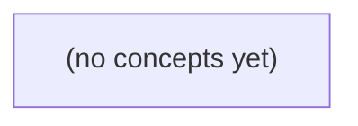

# 10.08 依赖与质量工具：Go IM 字段变更的证据化评审

*面向Go初学者，以虚构IM系统为贯穿案例，系统学习Go模块最小版本选择、依赖校验、格式化与静态分析、Protobuf生成兼容性及漏洞扫描的能力边界。围绕MessageEvent新增optional字段的变更，建立从源码、工具链、生成代码到旧新消费者业务语义的可复核证据链，并配套22道带反馈练习。*

**章节:** 2

---

## 本书导览

- 了解整本书的章节脉络
- 掌握各章之间的概念依赖关系
- 选择最合适的阅读顺序

# 10.08 依赖与质量工具：Go IM 字段变更的证据化评审

面向Go初学者，以虚构IM系统为贯穿案例，系统学习Go模块最小版本选择、依赖校验、格式化与静态分析、Protobuf生成兼容性及漏洞扫描的能力边界。围绕MessageEvent新增optional字段的变更，建立从源码、工具链、生成代码到旧新消费者业务语义的可复核证据链，并配套22道带反馈练习。

下方的概念图展示了本书 0 个核心概念以及它们之间的依赖关系；再下方是 1 个章节的入口。你可以按从上到下的顺序阅读，也可以根据自己的兴趣或先验知识选择切入点。

#### 概念图



## 章节索引

- **10.08 依赖与质量工具：版本固定之后还要查什么** — 面向Go初学者，以虚构IM Protobuf事件字段升级讲解模块最小版本选择、go.sum校验、生成代码、gofmt/vet/govulncheck各自证据及兼容评审。

## 10.08 依赖与质量工具：版本固定之后还要查什么

- 手算Go模块MVS选中版本
- 区分go.mod要求与go.sum哈希
- 解释go mod tidy/verify的实际范围
- 比较gofmt、vet、测试和漏洞扫描
- 核对.proto与生成pb.go及插件版本
- 为公开OpenIM源码与真实工具结果分开证据

给IM事件增加字段不只是改一行.proto：必须沿着生成链、依赖图、消费者语义与测试证据逐层核对，且不能让工具结果替代业务安全判断。

### 从字段契约界定变更边界

### 从字段契约界定变更边界

`MessageEvent` 新增 `optional message_version` 与 `optional visible` 时，先定义的是线协议契约，而不是数据库字段或界面行为：

- `message_version` 表示事件载荷版本。字段缺失不等同于“版本号为 0”；只有读取方明确采用默认策略时，才可将缺失按兼容版本处理。
- `visible` 表示该事件对接收方是否可见。`optional` 的关键在于“未设置”可被保留：未设置、显式 `true`、显式 `false` 是需要由消费者区分的三种状态。
- 新字段必须使用未占用的 protobuf tag，且不得复用历史删除字段的 tag；旧客户端会忽略未知字段，新客户端则必须能处理旧事件中字段缺失的情况。

S2 的变更边界应严格收敛：内存实现接受最长 `6 UTF-8` 字符的内容；同一消息 ID 的重复创建返回 `409`；非会话成员访问返回 `404`。新增事件字段可以被构造、序列化和消费，但不应借机改变这些既有语义。

尤其不要把 `visible=false` 擅自解释为删除、撤回、权限过滤或 SQL 持久化规则。S3 的 SQL 落库、迁移与查询语义，以及 R9 的审查要求，仍属于未来阶段，当前不修改。生成工具能验证代码是否同步，却不能证明“谁应当看见消息”这一业务安全结论正确；成员校验、错误码选择和可见性授权仍须由 RPC 逻辑与测试证据共同确认。

### 核验Proto到生成代码的一致性

### 核验 Proto 到生成代码的一致性

先把 `.proto` 视为唯一契约源，而不是把 `message.pb.go` 当作可手改的实现文件。对于新增的 `message_version`、`visible`，应逐项核对：

- **字段号不可复用**：确认新字段使用未占用的编号，未覆盖历史字段或 `reserved` 区间。字段名可调整，字段号一旦发布即属于线上兼容性协议。
- **`optional` 语义正确**：若需要区分“客户端未传”与“显式传入零值”，应使用 `optional`。例如 `optional bool visible = 12;` 在 Go 生成代码中通常表现为指针字段，如 `Visible *bool`；`nil` 表示未设置，`proto.Bool(false)` 才表示显式隐藏。
- **生成工具版本可追溯**：检查 `protoc --version`、`protoc-gen-go --version`，并与仓库规定的工具链、`buf` 配置或 CI 镜像一致。不同版本可能改变 optional 字段、反射描述符或注释的生成形式。
- **生成物与源文件同批提交**：修改 `.proto` 后必须重新生成并提交对应 `.pb.go`。重点检查字段标签、`json` 名称、`oneof`/presence 表示、`GetVisible()` 等访问器，以及文件中的生成器版本注释。

可用最小核验路径是：修改 proto 后执行既定生成命令，再检查 `git diff` 是否同时包含源定义和生成代码。不要仅凭“编译通过”判断一致：旧的 `.pb.go` 可能仍能编译，却会使 RPC 传输、序列化或跨服务字段存在性判断偏离契约。工具确认的是派生链完整；`visible` 默认应是什么、非成员是否必须返回 `404`，仍需由业务安全规则决定。

### 用模块图固定生成与运行依赖

### 用模块图固定生成与运行依赖

`message_version`、`visible`写入 `.proto` 后，生成结果是否可复现，取决于生成器与运行时依赖的**最小版本选择**（MVS），而不是“本机恰好能编译”。

设主模块直接要求：

`example/im -> google.golang.org/protobuf v1.33.0`

而某个间接库要求：

`example/im -> github.com/acme/rpc v0.8.0 -> google.golang.org/protobuf v1.31.0`

MVS 对同一模块选择需求中的最高版本，因此最终选中：

`google.golang.org/protobuf v1.33.0`

可用 `go mod graph` 核对边，再用 `go list -m all` 核对实际选中版本。这里尤其要检查 `protoc-gen-go` 生成代码所依赖的 `protoreflect`、`protoimpl` 等运行时 API，避免用较新的生成器产出、却由过旧运行时编译或运行。

三类文件与命令证明的事实不同：

- `go.mod`：声明直接依赖和允许的最低版本需求；它不是完整锁文件。
- `go.sum`：记录已下载模块内容的校验和，证明获取内容未被替换；它不单独说明版本选择合理。
- `go mod tidy`：按当前源码与测试源码重建所需依赖集合，能发现漏写、残留或错误的间接依赖；执行后应审查差异，而非机械提交。
- `go mod verify`：校验本地模块缓存是否匹配 `go.sum`，只能证明缓存完整，不能证明 `.proto`、`.pb.go` 与业务语义正确。

生成工具本身也应固定版本，例如在构建脚本中明确 `protoc` 与 `protoc-gen-go` 版本，并在干净环境重新生成后检查 `git diff --exit-code`。模块图只能保证“用的是哪套依赖”；`visible` 是否避免向非成员泄露事件、同 ID 是否仍返回 `409`、非成员是否仍为 `404`，仍须由 RPC 消费者审查与测试证据确认。

### 沿RPC消费者检查业务兼容性

### 沿 RPC 消费者检查业务兼容性

新增 `message_version`、`visible` 后，不能只确认 `.pb.go` 能编译，还要沿消息实际流向检查：发送端构造 `MessageEvent`，经 RPC 序列化传输，接收端反序列化并执行成员校验、重复判定和内存写入。旧客户端未携带 optional 字段时，应让接收端按既有默认语义处理；新字段存在时，也不得改变既有事件 ID、成员关系或可见性边界。

S2 的验收边界应明确且可测试：

- 仅接受内存态消息，正文上限为 `6 UTF-8 B`；超出边界应在接收端进入状态变更前拒绝。
- 同一事件 ID 再次投递时返回 `409`，且不得覆盖、追加或重复广播已有内存事件。
- 发送者不是目标会话成员时返回 `404`，避免通过 `403` 等响应泄露会话是否存在。
- 字段解析、成员校验、去重与写入的顺序应固定：先解析，再鉴权与查成员，再判重，最后写入内存并通知消费者。

检查 RPC 消费者时，应特别确认它没有把 `visible=false` 简化为“忽略校验”，也没有因 optional 字段缺失而跳过旧流程。测试证据至少覆盖旧消息、新字段消息、重复 ID 和非成员四类路径。

本阶段不得借新增字段提前接入 S3 SQL 持久化，也不得实现尚待审的 R9 规则；依赖扫描、生成代码比对和 RPC 测试只能证明链路一致，不能替代对状态边界与权限语义的业务审查。

### 组合工具证据并保留人工评审

### 组合工具证据并保留人工评审

工具证据应覆盖不同风险面，而不是把“全部通过”误解为“变更安全”。

| 工具/证据 | 能证明什么 | 不能证明什么 |
|---|---|---|
| `gofmt` | Go 文件格式一致，减少无意义差异 | `message_version`、`visible` 的业务语义是否正确 |
| `go vet ./...` | 部分静态错误、可疑调用和标签问题 | RPC 消费者是否遗漏新字段，权限与成员关系是否安全 |
| `go test ./...` | 已执行测试覆盖的行为成立 | 未编写或未运行的场景，例如跨服务反序列化、旧客户端兼容 |
| `govulncheck ./...` | 当前依赖及调用路径中已知漏洞风险 | 私有业务逻辑、未公开漏洞、错误的访问控制设计 |
| `go mod verify` | 模块缓存内容与 `go.sum` 校验和一致 | 依赖版本本身是否适合项目，生成代码是否来自预期工具链 |

对于本次 `MessageEvent` 新增的可选字段，测试还应明确保留 S2 的证据：`6UTF8 B` 可在内存实现中接受；同一 ID 重复写入返回 `409`；非成员访问返回 `404`。这些断言证明当前边界行为，没有授权将来 S3 SQL 持久化或 R9 审核逻辑的改动。

还要区分两类材料：公开 OpenIM 源码只能作为协议命名、生成方式或消费者模式的参考；本次结论必须来自真实仓库中的 `.proto`、`protoc`/`protoc-gen-go` 版本、重新生成的 `.pb.go`、实际 `go.mod` 依赖图及本地命令输出。参考实现不能替代运行证据。

最终人工评审仍需追问：`visible` 缺省时是否保持旧客户端语义？`message_version` 是否会被客户端伪造或错误信任？每个 RPC 消费者是否显式处理未知、缺失与新值？工具验证的是若干可检查事实；业务安全仍取决于这些语义判断。

> **要点** — 字段升级需同时证明契约、生成物、依赖、消费者与行为测试一致；格式、静态检查和漏洞工具都不能替代业务安全评审。

版本固定并非把所有依赖钉死。理解最小版本选择的构建列表、依赖路径与工作区影响，才能判断实际编译的是哪个版本。

### 从依赖声明手算最小版本选择

### 从依赖声明手算最小版本选择

设主模块 `example.org/im/app` 的 `go.mod` 声明：

`require example.org/im/protocol v1.4.0`  
`require example.org/im/transport v1.2.0`

而 `example.org/im/transport v1.2.0` 自身又声明：

`require example.org/im/protocol v1.6.0`

可以把依赖关系写成：

- `app → protocol v1.4.0`
- `app → transport v1.2.0`
- `transport v1.2.0 → protocol v1.6.0`

最小版本选择（MVS）先从主模块出发，收集可达模块的版本要求。对于同一个模块路径，不会分别保留 `v1.4.0` 与 `v1.6.0`，而是选择其中**最高的最低要求**：

$$
\max(v1.4.0,\ v1.6.0)=v1.6.0
$$

因此，最终构建列表中实际使用的是：

`example.org/im/protocol v1.6.0`

这里“最小”容易被误解：它不是“整个依赖图里版本号最小”，而是在满足所有已发现依赖约束的前提下，对每个模块选择所需的最低可用版本。既然 `transport` 至少需要 `protocol v1.6.0`，主模块直接写的 `v1.4.0` 就不足以决定最终版本。

可用下列命令验证手算结果：

`go list -m all`

若要追问为什么引入该模块，使用：

`go mod why -m example.org/im/protocol`

若要查看版本要求从哪条边传来，使用：

`go mod graph`

因此，`go.mod` 中的 `require` 是版本下界声明，不是“当前项目全部依赖版本的锁定清单”。

### 最低要求不等于完整锁定

### 最低要求不等于完整锁定

`go.mod` 中的 `require` 表达的是“构建此模块至少需要哪个版本”，而不是“编译时必须且只能使用该版本”。Go 使用最小版本选择（MVS）汇总整个依赖图：同一模块若被多个路径要求，最终选择其中**最高的最低版本**。

例如主模块声明：

`require example.org/im/protocol v1.4.0`

同时又依赖：

`example.org/im/transport v1.2.0`

而 `transport` 的 `go.mod` 声明：

`require example.org/im/protocol v1.6.0`

则最终构建列表会选择：

`example.org/im/protocol v1.6.0`

因为 `v1.6.0` 同时满足主模块对 `v1.4.0` 的最低要求，以及 `transport` 对 `v1.6.0` 的要求。主模块文件中写着 `v1.4.0`，并不意味着实际编译的就是 `v1.4.0`。

`go.mod` 里的间接依赖也应这样理解。标注为 `// indirect` 只说明主模块的源码通常没有直接导入它；它仍可能参与依赖图，并因其他模块的要求而影响最终选中的版本。不要仅凭“直接”或“间接”判断其是否重要。

应以实际构建列表为准：

`go list -m all`

它列出当前命令环境下被选中的模块版本。若要知道某个版本为何出现，可使用：

- `go mod graph`：查看模块之间的版本依赖边；
- `go mod why -m example.org/im/protocol`：查看主模块到该模块的导入原因。

因此，审查依赖版本时要区分三件事：`require` 写下的最低要求、依赖图中各路径提出的要求，以及 MVS 最终选择的实际版本。

### 用命令追踪版本来源与依赖路径

### 用命令追踪版本来源与依赖路径

先确认“实际参与构建”的模块版本，而不要只看主模块 `go.mod`。在示例中，主模块声明：

`example.org/im/app require example.org/im/protocol v1.4.0`

但 `example.org/im/transport v1.2.0` 又要求 `protocol v1.6.0`。最小版本选择会在所有最低要求中取可满足的较高版本，因此最终应选用 `protocol v1.6.0`。

使用：

`go list -m all`

查看当前构建列表。输出中的 `example.org/im/protocol v1.6.0` 才是编译、测试时实际选中的版本；主模块 `go.mod` 中的 `v1.4.0` 不表示版本被锁定为该值。

接着运行：

`go mod graph`

它输出形如 `模块@版本 依赖模块@版本` 的边。例如可观察到：

`example.org/im/app example.org/im/protocol@v1.4.0`  
`example.org/im/transport@v1.2.0 example.org/im/protocol@v1.6.0`

这说明 `v1.6.0` 的来源是 `transport` 的更高最低要求。`go mod graph` 适合回答“哪个模块声明了这条版本约束”。

若要确认某个包为何进入当前项目，使用：

`go mod why -m example.org/im/protocol`

它会给出从主模块中的包到目标模块包的一条导入链。注意：`why` 解释的是包级导入原因，`graph` 解释的是模块级版本要求；两者结合，才能同时确认“谁抬高了版本”和“代码为何需要它”。

若项目处于 `go work` 工作区，还应执行 `go work edit -json` 或检查 `go.work`。工作区中的本地模块可能替代远程模块并改变构建列表，因此应将 `go.work` 状态与上述命令输出一并记录。

### 工作区如何改变构建列表

### 工作区如何改变构建列表

单模块模式下，`go` 命令以当前模块的 `go.mod` 为根，收集其依赖模块声明的最低版本，再按最小版本选择（MVS）得到构建列表。例如主模块要求：

`example.org/im/protocol v1.4.0`

而间接依赖 `example.org/im/transport v1.2.0` 又要求：

`example.org/im/protocol v1.6.0`

最终会选择 `protocol v1.6.0`。可用 `go list -m all` 查看实际选中的模块版本，用 `go mod graph` 或 `go mod why -m example.org/im/protocol` 追踪升级路径。

但启用 `go work` 后，情况不再只是“当前目录的 `go.mod` 决定一切”。工作区中的多个本地模块会共同参与解析；若某个依赖模块也位于 `go.work` 的 `use` 列表中，Go 通常直接使用该本地源码，而非下载模块代理中的已发布版本。本地模块自身的 `go.mod` 及其依赖要求，也会影响整个工作区命令得到的构建列表。

因此，同一条 `go test ./...` 可能出现两种结果：

- 在单模块目录运行：使用模块缓存中选定的远程版本；
- 在工作区运行：使用相邻目录中的本地 `protocol` 或 `transport` 源码，并合并工作区模块的依赖约束。

排查“本机通过、CI 失败”时，应同时记录以下证据：

- `go env GOWORK`，确认是否启用了工作区；
- `go.work` 文件内容，尤其是 `use` 与 `replace`；
- 工作区根目录执行的 `go list -m all`；
- 各参与模块的 `go.mod`；
- 命令执行目录与实际测试命令。

`go.mod` 描述模块的最低需求；`go.work` 则可能把本地开发状态带入构建。提交前应确认工作区便利没有掩盖未发布、未提交或版本不一致的依赖修改。

### 为版本结论保留可复核证据

### 为版本结论保留可复核证据

以虚构的 IM 事件字段升级为例：主模块 `example.org/im/app` 声明

`require example.org/im/protocol v1.4.0`

而 `example.org/im/transport v1.2.0` 又声明

`require example.org/im/protocol v1.6.0`

若新字段 `Event.TraceID` 只在 `protocol v1.6.0` 后出现，不能仅凭主模块的 `go.mod` 断言“项目仍使用 v1.4.0”。应将证据分层保存：

- **源码声明层**：记录主模块、`transport` 模块的 `go.mod` 相关行，以及字段首次出现的提交、标签或发布说明。这里说明“谁提出了最低版本要求”和“字段在哪个版本可用”。
- **构建选择层**：执行 `go list -m all`，保存其中实际选中的  
  `example.org/im/protocol v1.6.0`。这是 MVS 对当前构建列表的直接证据。
- **路径解释层**：用 `go mod graph` 展示 `transport@v1.2.0 → protocol@v1.6.0`，再用 `go mod why -m example.org/im/protocol` 说明主程序为何需要该模块。前者解释版本抬升来源，后者解释可达依赖路径。
- **外部资料层**：若字段语义需对照公开 OpenIM 文档、接口定义或发行说明，应记录链接、访问日期、对应版本与关键摘录；外部资料只能佐证语义，不能替代本地构建结果。

若仓库存在 `go.work`，还应一并保存其内容与执行目录。工作区中的本地模块替换可能改变实际 build list，使同一份 `go.mod` 在不同机器上得出不同结论。这样，结论不只是“应当选择 v1.6.0”，而是可由声明、命令输出、依赖路径和工作区状态共同复核。

> **要点** — MVS选择全图中的最高最低要求；用构建列表和依赖路径验证，并将工作区状态纳入版本证据。

版本固定只回答“构建会选谁”；还需用哈希、缓存校验、工具链与生成物证据，分别确认依赖来源、完整性和质量边界。

### 先分清三份依赖事实

### 先分清三份依赖事实

Go 项目中常被并列查看的 `go.mod`、构建列表与 `go.sum`，回答的其实是三类不同问题：

- **`go.mod`：项目声明了什么约束。**  
  它记录直接依赖、`require` 版本下限或精确版本，以及 `replace`、`exclude` 等规则。例如 `require example.com/a v1.2.0` 表示模块需求，不等于最终每次构建都必然只使用这一条声明；最小版本选择还会合并传递依赖的需求。

- **构建列表（build list）：本次解析最终选中了什么。**  
  可用 `go list -m all` 获取。它是工具链结合主模块、依赖模块的 `go.mod`、替换规则和最小版本选择后的结果，才是“此次构建会使用哪些模块版本”的关键证据。应同时记录 `go version`，因为不同工具链、工作区或替换配置都可能影响结果。

- **`go.sum`：曾下载内容的哈希记录。**  
  其中的 `h1:` 校验值覆盖模块 `.zip` 或其 `go.mod` 文件，用于确认下载内容与记录一致。它可能保留旧版本、间接版本、仅有 `/go.mod` 的条目，甚至保留已不在当前构建列表中的历史记录。

因此，不能把 `go.sum` 当作已选版本清单：`go.sum` 出现某模块，不证明它参与当前构建；某版本被选中，也应以构建列表验证。更不能把哈希记录当作漏洞批准书：哈希只能支持“内容未被替换”的完整性判断，不能证明代码安全、无漏洞或符合业务许可要求。

### 读懂go.sum的多版本记录

### 读懂 go.sum 的多版本记录

`go.sum` 是依赖下载内容的校验记录，不是“当前项目实际选中的版本列表”。每行通常形如：

`example.com/lib v1.2.3 h1:...`  
`example.com/lib v1.2.3/go.mod h1:...`

前者校验该版本模块的完整 `.zip` 内容；后者只校验该版本的 `go.mod` 文件。两类记录都使用 `h1:` 哈希：下载模块时，Go 会将获得的内容与本地记录、以及适用时的校验和数据库结果比对，以发现内容被替换、传输损坏或缓存遭篡改。

同一模块出现多个版本很常见。例如项目曾直接使用 `v1.2.3`，后来升级到 `v1.4.0`；或依赖解析过程中读取过某个旧版本的 `go.mod`。`go.sum` 可能保留这些历史下载证据，即使最终构建已不再选择它们。只出现 `/go.mod` 条目也不代表完整模块包一定被下载过。

因此，不能从 `go.sum` 推断“生产构建使用了哪些版本”。当前构建列表应以 `go list -m all`、`go mod graph` 或实际构建日志为准；其中版本选择遵循最小版本选择规则，而非简单地从 `go.sum` 挑一行。

更不能把 `go.sum` 当作漏洞豁免或安全批准书。哈希证明“拿到的是同一份内容”，不证明该内容无漏洞、许可证合规、维护活跃，或适合本应用。安全审查应将当前 build list、漏洞扫描结果、风险处置记录与对应工具链版本一并保存。

### 审查tidy与verify的证据边界

### 审查 `tidy` 与 `verify` 的证据边界

`go mod tidy` 与 `go mod verify` 都会触及依赖证据，但回答的问题不同，不能互相替代。

| 工具 | 主要输入 | 主要输出/影响 | 能证明什么 | 不能证明什么 |
|---|---|---|---|---|
| `go mod tidy` | 源码中的导入、构建标签、`go.mod`、工具链规则 | 可能重写 `go.mod` 与 `go.sum` | 声明的直接/间接依赖与当前源码需求较一致；补齐所需校验和、移除不再需要的记录 | 选中的版本安全、依赖无漏洞、生成的差异一定合理 |
| `go mod verify` | 模块缓存与 `go.sum` 中已记录的哈希 | 成功或失败状态，不修改依赖声明 | 本地模块缓存中的 `.mod`、`.zip` 内容未偏离下载时记录的校验和 | 应用代码正确、缓存来源可信、模块没有已知漏洞 |

因此，运行 `go mod tidy` 后应审查差异，而非机械提交：新增模块是否符合预期？版本升级是否由工具链或导入变化引入？删除的校验和是否只是历史记录清理？`go.sum` 可同时保留多个版本及过期下载历史，它不是当前构建列表，也不是“已批准依赖”清单；应另以 `go list -m all` 记录实际 build list，并注明 Go 工具链版本。

`go mod verify` 验证的是**缓存内容相对本地下载记录**的一致性。它发现缓存被篡改时有价值，却不等同于重新评估远端发布物，更不扫描漏洞。

校验和数据库则解决另一层问题：在下载阶段，将模块内容哈希与公开、可验证的记录比对，以降低源站或传输被替换的风险；它不是依赖质量评级。漏洞扫描工具则把实际 build list 与漏洞数据库、调用可达性等信息关联，回答“是否存在已知风险”。完整审计应分别保留：`tidy` 差异、`verify` 结果、工具链与 build list、以及漏洞扫描报告。

### 用IM事件升级演练依赖审计

### 用 IM 事件升级演练依赖审计

假设 IM 服务将 `MessageEvent` 从旧字段升级为支持 Protobuf `oneof` 的事件模型，需要升级 `google.golang.org/protobuf` 及相关生成器。目标不只是“能编译”，而是留下可复现、可审计的升级证据。

1. **先记录升级前后的构建选择**

   在修改依赖前后分别执行：

   `go version`  
   `go env GOVERSION GOMOD GOPROXY`  
   `go list -m all`

   将输出保存到变更记录中。尤其是 `go list -m all`，它展示实际 build list：即本次构建最终选择的模块版本，而不是 `go.sum` 中出现过的全部版本。

2. **最小化修改并审阅 `go.mod`**

   例如执行：

   `go get google.golang.org/protobuf@v1.36.5`  
   `go mod tidy`

   随后审阅 `go.mod` 差异：直接依赖是否符合事件升级需要；间接依赖是否因 Protobuf 运行时、代码生成工具或测试依赖而变化；是否意外升级了无关模块。`tidy` 会按当前源码、测试和构建约束重算依赖，因此不能把其修改视为“自动且安全”。

3. **正确解读 `go.sum` 差异**

   新增的 `.zip` 与 `.mod` 哈希表示下载内容及模块元数据被记录；同一模块的多个版本同时存在很常见，可能是历史下载记录，也可能服务于不同版本的模块图演化。删除或新增某行不等于该版本一定被选中，更不表示该版本已经通过漏洞审批。

   审阅时应关注：是否出现非预期模块、是否因私有模块配置错误写入异常来源，以及哈希变化能否与 `go.mod` 和 build list 的变化对应。

4. **验证缓存完整性，而非误判质量**

   执行：

   `go mod verify`

   它检查本地模块缓存中的内容是否仍与下载时记录的哈希一致，可发现缓存被改写或损坏；它不验证 `MessageEvent` 的语义兼容性，不扫描已知漏洞，也不证明远端仓库当前可信。校验和数据库用于下载时核验公开模块哈希；`go mod verify` 则核对本地缓存，两者职责不同。

最后运行生成、单元测试及事件兼容性测试，并在变更单中附上工具链版本、`go list -m all`、`go.mod`/`go.sum` 差异和校验结果。

### 补齐工具链与生成代码证据

### 补齐工具链与生成代码证据

依赖版本固定后，仍应把“如何生成、如何检查”记录为可复现证据。尤其是 `.proto` 与 `pb.go`：前者是公开源码事实，后者是由特定工具链产生的派生结果；两者不一致时，编译通过也不代表接口代码可信。

建议分层执行并留存结果：

- **源码层**：提交 `.proto`、生成的 `*.pb.go`，并在注释、`buf` 配置或构建脚本中声明 `protoc`、`protoc-gen-go`、`protoc-gen-go-grpc` 的精确版本。插件版本属于构建输入，不能只写“已安装 protoc”。
- **再生成层**：在干净环境执行既定生成命令，例如 `protoc ...`；随后检查 `git diff --exit-code`。若重新生成产生差异，应审查是协议变更、生成器升级，还是开发者遗漏了生成物。
- **格式与静态检查层**：执行 `gofmt -w` 后确认无未提交差异；执行 `go vet ./...` 检查常见的格式化、并发和 API 使用问题。它们不证明业务逻辑正确，但能形成基础质量门槛。
- **行为层**：执行 `go test ./...`，必要时附加竞态检测 `go test -race ./...`。测试结果仅说明当前测试覆盖到的行为，不等于没有缺陷。
- **漏洞层**：执行 `govulncheck ./...`，并记录其版本、Go 工具链版本、执行时间和当时的 build list。它结合调用路径评估已知 Go 漏洞，但不覆盖私有漏洞库、未知漏洞或非 Go 组件。

应区分可提交与不可替代的两类证据：仓库中的 `.proto`、`pb.go`、生成脚本和版本声明是可审阅的公开事实；本地或 CI 的 `protoc --version`、插件版本、`go version`、检查日志与退出码则是某次环境中的执行结果。两者共同说明“源码是什么”以及“在何种工具链下验证过”，但都不是永久的质量批准书。

> **要点** — go.sum证明下载内容的哈希，不证明当前选版、业务正确性或漏洞安全；需结合build list、差异审查与分层工具证据。

字段升级后的质量判断不能只看“能编译”：不同工具提供不同证据，也各自存在明确盲区。

### 先建立工具证据边界

### 先建立工具证据边界

以 IM 事件新增 `m9` 字段为例，质量工具给出的不是“代码正确”的总证明，而是不同维度的有限证据。应把命令、观察到的结果与其盲区分开记录：

| 工具 | 可提供的证据 | 对 `m9` 变更仍不能证明 |
|---|---|---|
| `gofmt` | 文件符合 Go 的标准排版；导入、缩进、换行一致 | `m9` 是否写入事件、字段名是否符合协议、接收端是否理解 |
| `go vet` | 启发式发现可疑构造，如 `copylocks`、格式化参数不匹配、`lostcancel` | `m9` 缺失时应返回业务 `409`，无权限时应伪装为 `404`，以及多节点事件先后顺序 |
| `go build` | 类型、引用、接口签名和构建标签下的编译路径可通过 | 已编译的序列化分支一定会在真实请求中执行；旧客户端不会忽略或误解析 `m9` |
| `go test` | 被测试用例实际覆盖的输入、断言和运行路径满足预期 | 未写到的兼容性场景、异常重试路径、跨服务部署组合 |
| `go test -race` | 已执行路径中的部分共享内存数据竞争 | 未被调度到的竞争窗口；消息队列、数据库、跨节点时钟造成的顺序问题 |
| 模糊测试 | 在给定入口和时间预算内探索异常输入 | 业务语义正确、权限策略正确、生产流量必然覆盖 |

因此，`m9` 的最小证据链不应写成“已通过检查”，而应写成：`gofmt` 证明格式一致，`go vet` 未报告已知可疑构造，构建证明字段改动在目标构建条件下类型闭合，测试证明指定事件可编码、解码并断言 `m9`。其余结论仍需协议兼容测试、权限测试、集成测试或生产观测补足。

### gofmt与编译：规范形式，不担保行为

### gofmt与编译：规范形式，不担保行为

`gofmt` 与编译都是提交前的基础门槛，但它们证明的是“形式正确”和“当前可构建”，不是字段变更后的行为正确。

| 工具 | 能提供的证据 | 不能证明 |
|---|---|---|
| `gofmt` | Go 源码缩进、空格、换行、导入分组等符合统一格式；减少无意义的差异 | `m9` 是否被正确序列化、是否漏传、是否应返回 `409`、权限是否应伪装为 `404` |
| `go build` / 编译 | 语法有效；类型匹配；引用的包、方法、字段在当前构建标签和目标平台下可解析 | 运行时分支是否覆盖；数据库状态是否正确；并发顺序、跨节点可见性和外部协议是否符合预期 |

例如，下面的修改可以格式化且成功编译：

```go
req.M9 = input.M9
```

但仍可能存在关键缺陷：`input.M9` 未做范围校验；更新语句未持久化 `m9`；读取接口遗漏返回该字段；旧节点收到新字段后静默丢弃；字段冲突时错误地返回通用 `500` 而非业务定义的 `409`。

编译还受构建条件限制。某个文件可能只在特定 `GOOS`、`GOARCH`、构建标签或生成代码存在时参与编译；本机 `go build ./...` 成功，不等于生产目标、可选集成或运行时反射路径同样正确。

因此，对 `m9` 的字段升级，`gofmt` 与编译应被记录为：

- **工具**：`gofmt`、`go build ./...`
- **证据**：源码格式统一；当前构建约束下语法、类型和依赖可通过。
- **不证明**：字段语义、接口契约、错误码、持久化一致性、权限边界、并发与跨节点顺序。

### go vet：可疑构造的启发式信号

### go vet：可疑构造的启发式信号

`go vet` 不证明程序“正确”，而是基于代码模式报告高风险构造。它尤其适合在字段升级后发现那些仍可编译、却可能隐藏资源或并发问题的改动。

| 检查类别 | 典型信号 | 对 m9 字段变更的价值 | 它不证明什么 |
|---|---|---|---|
| `copylocks` | 按值复制含 `sync.Mutex`、`sync.Once` 等锁的结构体 | 若 m9 所在结构体新增/嵌入同步原语，可发现赋值、返回值、范围变量复制锁 | 不证明并发访问顺序正确，也不证明跨节点不会竞争 |
| `printf` | 格式串与参数数量、类型不匹配 | 更新日志、错误包装、审计字段时，可发现 `%d` 传字符串、遗漏参数等 | 不证明日志中的 m9 值符合业务含义或脱敏要求 |
| `lostcancel` | 创建了 `context.WithCancel`、`WithTimeout` 等，却未调用取消函数 | 新增请求链路、后台任务或超时控制时，可提示潜在计时器和上下文泄漏 | 不证明取消时机合理，更不证明超时后的状态一致性 |

例如：

`ctx, cancel := context.WithTimeout(parent, timeout)`  
若后续未保证执行 `cancel()`，`vet` 的 `lostcancel` 报告值得优先处理；通常应紧随其后写 `defer cancel()`，或将取消职责明确交给调用方。

但 `vet` 是启发式分析：报告可能是误报，例如锁对象确实按值复制但从未使用；也会漏报，例如取消函数被复杂控制流遗漏、锁保护范围不当却未触发规则。更关键的是，它无法判断业务语义：m9 冲突时是否应返回 `409`、无权读取时是否应伪装为 `404`、多节点事件是否按预期顺序可见，都不属于 `vet` 的证据范围。

因此，`go vet ./...` 的通过应记录为“未发现已覆盖的可疑构造”，而不是“字段变更已被验证正确”。

### 测试、竞态与模糊测试的运行边界

### 测试、竞态与模糊测试的运行边界

三类命令都依赖“实际执行到的路径”，因此通过并不等于字段变更已覆盖所有语义。

| 工具 | 能提供的证据 | 依赖条件 | 不能自动证明 |
|---|---|---|---|
| `go test` | 断言过的函数、接口与集成路径行为符合预期 | 测试用例构造了对应输入、依赖与环境 | 未写断言的权限拒绝、`409 Conflict`、`404 Not Found`、迁移兼容分支 |
| `go test -race` | 已执行路径上检测到部分共享内存数据竞争 | 并发调度恰好触发冲突访问；测试在支持的环境运行 | 跨节点消息乱序、数据库事务竞态、业务层“先后顺序”错误 |
| 模糊测试 | 在定义的入口上探索大量变异输入，发现崩溃、挂起或违背断言的输入 | 模糊目标可达，种子与持续运行时间足够，外部依赖可重复 | 鉴权主体组合、真实部署拓扑、状态码契约与分布式时序 |

例如 m9 字段改为必填后，普通测试可以证明“给定合法 m9，创建成功”；竞态检测可以证明“该测试并发创建时未发现内存竞争”；模糊测试可以探索空值、超长值或畸形编码。它们都不能自行证明：无权限用户必得 `404` 而非泄露资源存在性的 `403`，重复请求必得 `409`，或节点 A 的更新一定先于节点 B 的消费。

因此应把工具结果写成有限证据：`命令 → 覆盖的执行路径 → 已验证断言 → 未证明场景`。对状态码、权限矩阵和跨节点顺序，仍需显式的集成测试、契约测试或受控端到端场景。

### m9变更的工具—证据—不证明表

### m9变更的工具—证据—不证明表

m9 字段从 `.proto` 到生成的 `pb.go`、再到调用链，至少应记录“工具运行了什么、输出支持什么结论、它不能替代什么评审”。“全部通过”不是兼容性证明。

| 工具或检查 | 可保留的证据 | 可以支持的结论 | 仍不能证明 |
|---|---|---|---|
| `buf lint`、`protoc` | lint 输出、生成命令、生成文件差异 | `.proto` 语法与生成配置可用；`pb.go` 与当前定义一致 | 新字段号是否与历史版本冲突；枚举值、`oneof`、字段删除是否破坏旧客户端 |
| 兼容性检查，如 `buf breaking` | 基线版本、比较报告 | 相对基线的部分线协议变更满足规则 | 业务语义兼容；旧值映射到 m9 后是否改变权限、状态机或默认行为 |
| `gofmt -w` 与 `git diff --check` | 格式化后无差异、无空白错误 | Go 源码格式统一，补丁可读性基本合格 | 代码逻辑正确；生成文件是否应提交；字段使用是否遗漏 |
| `go build ./...` | 构建日志、目标平台与标签 | 类型、导入、接口调用和构建链路在该配置下成立 | 运行时分支、序列化互操作、旧二进制读取新消息、跨服务部署顺序 |
| `go vet ./...` | vet 输出及已确认的豁免说明 | 未发现其规则覆盖的可疑构造，如 `copylocks`、`printf`、`lostcancel` | m9 缺失时是否错误返回 `409`；无权限是否伪装成 `404`；报告也可能误报或漏报 |
| `go test ./...` | 用例名、覆盖模块、断言结果 | 已执行路径上的字段构造、编解码和调用结果符合断言 | 未覆盖的调用方、生产配置、历史客户端；测试断言本身是否遗漏兼容契约 |
| `go test -race ./...` | race 输出、执行场景 | 被实际调度到的并发访问未检测到数据竞争 | 未执行路径的竞争；跨节点消息先后、重试与最终一致性顺序 |
| 模糊测试 | 种子、时长、崩溃样本 | 已探索输入下未触发已检测的崩溃或不变量破坏 | 完整输入空间；业务授权语义；线上流量中的版本组合 |

人工评审仍应明确检查：旧客户端忽略 m9 时是否安全，新客户端面对旧服务时的默认值是否可接受，字段缺失、非法值与未知值分别返回何种业务错误，以及滚动发布期间“先写 m9、后读 m9”的跨节点顺序是否成立。

> **要点** — 工具输出是有限证据：格式、静态信号、构建与运行验证均不能替代协议兼容和业务语义评审。

事件字段升级的源事实在.proto而非.pb.go；只有锁定生成链路并验证跨版本行为，才能把“代码可编译”转化为“协议可兼容”。

### 以.proto确立协议源事实

### 以 `.proto` 确立协议源事实

事件协议的权威定义必须是 `.proto`，而不是生成后的 `.pb.go`。`.proto` 同时声明消息结构、字段号、线缆类型、可选性、枚举值及跨语言可见的语义；`protoc` 与 `protoc-gen-go` 只是将这份源事实投影为 Go 代码。

例如：

```proto
message SearchIndex {
  string document_id = 1;
  optional bool visible = 7;
  int64 version = 8;
}
```

这里真正构成兼容性契约的是：

- `document_id = 1`：字段号 `1` 才是二进制编码中的身份，字段名可改，字段号不可随意改。
- `optional bool visible = 7`：`optional` 表示需要区分“未提供”与“提供了 false”；不能仅按 Go 零值推断业务含义。
- `int64 version = 8`：类型也是协议的一部分。将其改为看似相近的类型，可能改变编码或跨语言解析结果。

`.pb.go` 中的结构体、标签、反射描述符和辅助方法均为派生产物：可以删除并重新生成，不应成为人工维护的协议来源。手改 `.pb.go` 既无法可靠回写 `.proto`，也会在下次生成时丢失，导致仓库中的代码表象与真实协议分叉。

字段一旦发布，禁止重用已删除字段号；应使用 `reserved` 保留旧字段号及旧名称。新增字段通常可被旧二进制消费者跳过，但“能解析”不等于“业务安全”：旧消费者可能忽略 `visible` 或 `version`，进而产生错误索引、覆盖更新或错误回放。协议评审应直接审查 `.proto` 的字段号、类型、presence 与语义约束，再验证各版本生成代码的实际互操作行为。

### 字段演进的兼容边界

### 字段演进的兼容边界

`.proto` 的兼容性首先是**线上的字段号与线型**兼容，而不是生成后的 Go 结构体看起来是否相似。设旧消息为：

```proto
message SearchEvent {
  string query = 1;
  int64 timestamp_ms = 2;
}
```

新增字段通常是安全的：

```proto
optional bool visible = 3;
int64 version = 4;
```

旧二进制读取新消息时，会把字段 `3`、`4` 视为未知字段；新二进制读取旧消息时，`visible` 不存在、`version` 取默认值。这里“可解析”不等于“语义正确”：旧版 `SearchIndex` 若只索引 `query`，可能完全忽略 `visible=false` 或较新的 `version`，从而把本应隐藏、淘汰或覆盖的事件继续暴露。

字段号一旦发布，就不能改作他用。删除字段后应显式保留：

```proto
reserved 3;
reserved "visible";
```

否则未来把 `3` 从 `bool visible` 重用为例如 `string tenant_id`，旧消费者可能按旧 wire type 丢弃、误读或产生不可预期的业务分叉。字段名可改，字段号及其编码含义不能随意改；同样应避免改变字段类型、重复语义或把标量默认值偷偷解释成“未设置”。

`optional` 的价值在于区分“发送者明确写了 `false`”与“旧发送者根本没有该字段”。若 `visible` 直接定义为普通 `bool`，两种情况在读取端都表现为 `false`；使用 `optional bool visible` 后，应通过 presence 判断：

```go
if event.Visible == nil {
    // 旧事件：按兼容策略补默认值或走迁移逻辑
}
```

未知字段也有边界。二进制 Protobuf 在转发、反序列化再序列化时通常可保留未知字段，但经过 ProtoJSON、映射到普通结构体、日志清洗或某些中间服务后，未知字段可能被丢弃。因此测试必须覆盖旧生产者→新消费者、新生产者→旧消费者，以及事件回放和 JSON 往返；生成差异或单次解码成功，都不能证明索引与可见性语义仍然安全。

### 固定生成链路与输出证据

### 固定生成链路与输出证据

`.proto` 是协议与生成代码的唯一源事实，`.pb.go` 只是特定工具链的产物。审查时不能只看生成文件是否存在或能否编译，还要确认任何开发者、CI 节点都能从同一份 `.proto` 得到等价输出。

至少固定并记录以下要素：

- `protoc` 版本：不同编译器可能改变描述符、注释映射或生成细节。
- `protoc-gen-go` 及相关插件版本：例如 gRPC 插件、校验插件、网关插件；插件升级可能改变 API 形状或运行时依赖。
- 生成命令与 include 路径：包括 `--go_out`、`--go_opt=paths=source_relative`、`-I` 目录及插件参数。
- `go_package`：它决定 Go 包导入路径与包名，应显式声明，例如  
  `option go_package = "example.com/project/api/searchpb;searchpb";`

建议将工具版本写入 `buf.gen.yaml`、`Makefile`、容器镜像或专用脚本，并在 CI 执行“重新生成后无差异”的检查：

`make proto && git diff --exit-code`

若重新生成产生差异，先判断是工具链漂移、命令不一致还是源文件变更；不要直接提交差异，更不能通过手改 `.pb.go` 消除它。手改会在下次生成时丢失，也会掩盖真实的 schema、插件或依赖问题。

生成差异本身仅证明输出变了，不证明业务协议安全。固定链路提供的是可审计、可复现的输出证据；字段兼容、旧消费者行为与索引投影仍需另行进行跨版本测试。

### 跨版本事件升级测试

### 跨版本事件升级测试

把事件升级视为一组“生产者版本 × 消费者版本 × 存储/索引版本”的契约测试，而非仅验证新代码能否编译。至少维护一份冻结的旧版事件样本（建议保存二进制 protobuf 数据及其元数据），并在持续集成中执行以下矩阵：

| 生产者 | 消费者 | 应验证的结果 |
|---|---|---|
| 旧版 | 新版 | 新消费者可读取旧字段；新增 `optional` 字段应表现为“未出现”，而不是误判为零值或空字符串 |
| 新版 | 旧版 | 旧消费者可忽略未知字段，既有字段语义不变；不得因字段号复用、类型变更而解码错位 |
| 新版 | 新版 | 新字段写入、读取、默认值与 presence 语义一致 |
| 历史事件 | 当前回放程序 | 可完整回放，聚合结果、状态迁移和幂等键与预期一致 |

例如新增：

`optional bool visible = 12;`

测试不能只断言 `visible == false`，还应分别断言“字段未设置”与“显式设置为 `false`”。二者在 protobuf 二进制协议中可能具有不同业务含义。

检索链路需要单独验证。旧 `SearchIndex` 或旧索引消费者即使能成功解析新事件，也可能直接忽略 `visible`、`version` 等新字段，造成主存储与搜索结果不一致。应检查：

- 新事件写入后，索引文档是否包含新增字段；
- 历史事件回放时，索引是否按当前规则补齐或重建；
- 旧索引器处理新事件时，是否产生可接受的降级结果；
- 查询过滤、排序和权限判断是否因字段缺失而扩大结果集。

同时加入 ProtoJSON 往返测试：`二进制事件 → ProtoJSON → 二进制事件` 后比较关键字段与 presence。未知字段可能在 JSON 中丢失，因此 JSON 网关、日志重放或人工编辑工具不能被默认为无损中继。

最后，生成的 `.pb.go` 差异只说明生成链路发生变化，不说明业务协议安全；跨版本解码、回放结果与索引可见性才是升级测试的最终判据。

### 区分生成差异与业务安全

### 区分生成差异与业务安全

`protoc`、`protoc-gen-go`、插件版本或 `go_package` 改变，都可能让 `.pb.go` 出现大规模差异：导入路径、反射描述符、辅助方法、注释乃至文件组织均可能变化。生成文件差异首先证明的是**生成链路不一致或升级了**，并不自动说明线上事件语义发生变化；反过来，生成文件完全不变，也不能证明新增字段已被下游正确消费。

应把验证分成彼此独立的层次：

- **编译通过**：证明当前代码能引用生成类型；不能证明旧消费者能解析新事件。
- **`.pb.go` 差异检查**：发现工具链漂移、意外修改或未提交生成物；不能替代协议兼容测试。生成文件应由固定版本工具重建，禁止手改。
- **二进制序列化互读**：验证 `old producer → new consumer`、`new producer → old consumer` 以及历史消息回放。新增字段通常会被旧二进制消费者跳过，但若 `SearchIndex` 仍只读取旧字段，`visible`、`version` 等新语义可能被静默忽略。
- **ProtoJSON 往返**：验证 JSON 网关、存储或调试链路不会丢失未知字段。旧版本将新消息转为 ProtoJSON 再解析时，未知字段往往无法保留；“能解析”不等于“信息未丢”。
- **索引可见性测试**：断言新旧事件进入 `SearchIndex` 后的查询结果、过滤行为和版本判定，而非只断言反序列化成功。

因此，最有价值的证据不是一次生成差异，而是一组跨版本矩阵测试：生产、消费、JSON 往返、重放与索引查询都符合预期。

> **要点** — 协议升级须以.proto为准，固定生成工具链，并用跨版本二进制、JSON与回放测试证明真实兼容性。

版本固定只能降低依赖漂移风险；面对协议升级，还必须用漏洞证据与兼容性证据验证改动是否可安全发布。

### 理解漏洞扫描报告的证据边界

### 理解漏洞扫描报告的证据边界

`govulncheck`不是简单地把依赖清单与漏洞列表做字符串匹配。它综合三类证据生成结论：

- **Go 漏洞数据库**：已公开漏洞的受影响模块、版本区间、修复版本及受影响符号；
- **实际解析到的模块版本**：通常来自当前模块图、`go.mod`、`go.sum` 与构建选择结果；
- **代码与调用路径分析**：判断项目是否调用了受影响函数、方法或包，并尽量给出从本项目入口到漏洞符号的可达路径。

因此，报告中的严重程度并不只取决于“依赖里是否有旧版本”。若漏洞模块存在但受影响代码不可达，工具可能将其列为依赖层面的发现；若能证明业务代码可达受影响符号，才是更直接的可利用风险。报告还会给出已安装版本、受影响范围和建议修复版本，应优先据此升级，而不是盲目执行全量更新。

但“未报告漏洞”只能说明：在**当前 Go 漏洞数据库、当前模块解析结果和当前静态分析范围**内，没有发现可报告的问题。它不能证明系统没有安全漏洞，原因包括：

- 漏洞尚未公开、尚未录入数据库，或数据库尚未同步；
- 漏洞位于私有依赖、生成代码、运行时动态加载路径或工具无法精确建模的反射逻辑中；
- 当前扫描未覆盖某些构建标签、平台、测试入口、命令程序或部署配置；
- 风险属于错误授权、协议语义变化、配置泄露或业务逻辑缺陷，而非已知 Go 依赖漏洞。

可将扫描结论表述为：“未发现当前数据库和分析范围内的已知可达漏洞”，而不是“已证明安全”。升级 `protocol` 等关键依赖后，还应以兼容矩阵、授权负例、历史事件重放和回滚门验证语义没有被生成类型或默认行为变化悄然改写。

### 从依赖版本到可达调用路径

### 从依赖版本到可达调用路径

`govulncheck`不是只做“依赖清单比对”。它以当前模块解析出的实际版本为起点，将 `go.mod`、构建列表与 Go 漏洞数据库中的公告关联起来，依次判断：

1. **是否引入受影响模块**：例如项目选择了 `example.org/lib@v1.2.3`，而漏洞公告声明受影响范围包含该版本。
2. **是否命中受影响符号**：漏洞通常限定在某个包、函数或方法，如 `ParseToken`、`(*Server).Handle`；模块版本受影响不等于所有代码路径都受影响。
3. **应用是否可达该符号**：工具分析应用入口及其调用图，确认本项目代码能否经由直接或间接调用到漏洞符号。

因此，报告的证据强度不同：

- **仅发现模块版本命中**：说明仓库中存在潜在风险依赖，常见于测试依赖、未使用包或分析不到的动态路径。
- **发现调用路径命中**：说明应用代码可到达漏洞符号，应优先修复；报告通常给出漏洞编号、当前版本、受影响符号、调用链与建议修复版本。
- **未报告漏洞**：只表示在当前 Go 漏洞数据库、当前解析版本和当前静态分析范围内未发现命中，不能推出“系统不存在安全漏洞”。

可将判断理解为：

$$
风险证据 = 受影响版本 \land 受影响符号 \land 应用可达性
$$

其中“可达性”尤其关键。某认证库即使包含历史漏洞函数，若应用从未调用它，风险优先级通常低于“外部请求可直接进入该函数”的场景；反之，反射、插件、生成代码、条件编译或运行时配置可能使静态分析遗漏真实路径。故应将 `govulncheck` 结果与运行配置、暴露接口及人工审查结合，而非把“无报告”当作发布许可。

### 读懂报告中的版本与修复建议

### 读懂报告中的版本与修复建议

假设执行 `govulncheck ./...` 后出现一条间接依赖报告：

- 模块：`example.org/codec`
- 当前选中版本：`v1.4.2`
- 漏洞影响范围：`[v1.2.0, v1.5.0)`
- 修复版本：`v1.5.0`
- 引入链：`service → protocol → codec`
- 调用链：`handler.Decode → protocol.Parse → codec.Unmarshal`

先核对“当前选中版本”，而不是只看 `go.mod` 是否直接写了该模块。Go 使用最小版本选择（MVS），实际构建图中的版本可通过以下命令确认：

`go list -m all | grep example.org/codec`

若结果仍是 `v1.4.2`，则它落在受影响区间内；`v1.5.0` 是报告给出的最低已知修复版本。可先执行：

`go get example.org/codec@v1.5.0`  
`go mod tidy`

随后再次检查：

`go list -m all | grep example.org/codec`  
`go mod graph | grep example.org/codec`

关键是确认 MVS 最终确实选择了不低于 `v1.5.0` 的版本。若某个依赖要求更高版本，最终版本可能是 `v1.6.1`，通常也可修复；若因为 `replace`、工作区配置或私有分叉仍解析到旧提交，则“已升级”的表面结论不成立。

报告中的调用链还说明漏洞是否从当前分析入口可达。这里 `handler.Decode` 能进入脆弱函数，因此应按可利用风险处理；若仅有依赖命中而没有调用路径，也不能直接等同于安全，只能说明本次包分析未发现已知可达路径。

升级后应重新运行 `govulncheck ./...`，并执行测试、授权拒绝用例和历史请求重放。尤其是协议相关依赖，版本修复可能同时改变解析、默认值或生成类型语义；漏洞消失只是一个门槛，兼容性验证仍是发布条件。

### 协议升级为何需要兼容评审

### 协议升级为何需要兼容评审

依赖漏洞修复与 Protobuf 协议升级都可能表现为“改版本号后重新构建”，但风险性质不同。前者主要关注：当前依赖版本是否命中已知漏洞、业务调用是否可达漏洞路径、上游是否提供修复版本。`govulncheck` 能结合 Go 漏洞数据库与调用图给出这类证据；但“未发现报告”仅表示在当前数据库、模块和静态分析范围内未命中，不能证明系统没有安全问题。

协议升级则是跨进程、跨版本、跨语言的数据契约变更。即使代码编译通过，生成类型、序列化行为与字段语义仍可能不兼容：

- 新生成代码可能改变 `optional`、`oneof`、枚举未知值或默认值的表达方式。
- 旧字段号被复用、字段类型由宽变窄、`repeated` 与标量互换，都可能造成旧消息被错误解释。
- 新服务发出的字段，旧客户端也许会忽略；但若该字段承载授权范围、状态机阶段或金额含义，“忽略”本身就是安全或业务风险。
- 同一消息在新旧服务之间往返时，未知字段是否保留、是否丢失，会决定灰度期间数据能否安全回写。

因此，协议升级不能以“生成成功、单元测试通过”作为发布门槛。应建立兼容矩阵，覆盖新客户端/旧服务、旧客户端/新服务及混部回滚；重放历史事件验证旧数据解码；加入越权请求、缺失字段、未知枚举等授权负例；并验证回滚后新写入的数据仍可被旧版本正确处理。只有类型兼容、语义兼容和跨版本行为都被证明，升级才具备可发布性。

### 建立发布前的兼容验证门

### 建立发布前的兼容验证门

协议版本升级不能只验证“新版本能跑”，还要证明它不会破坏旧客户端、既有事件语义与故障恢复路径。发布门应围绕兼容矩阵建立，而非依赖单个冒烟测试。

| 维度 | 必测组合 | 关注结果 |
|---|---|---|
| 客户端与服务端 | 旧—旧、旧—新、新—旧、新—新 | 握手、字段编解码、默认值、错误码 |
| 事件与状态 | 旧事件→新代码、新事件→旧消费者 | 幂等性、顺序、签名、状态迁移 |
| 授权 | 合法身份、越权身份、匿名/过期身份 | 拒绝是否稳定且不泄露数据 |
| 回滚 | 新版写入后回退旧版 | 数据可读性、事件可消费性、降级策略 |

未授权请求必须作为明确的负例门禁：伪造角色、缺失凭证、跨租户资源、过期令牌、重复请求均应被拒绝，并断言返回的状态码、错误语义与审计记录。不要只检查“请求失败”，还要检查失败没有产生状态变更。

历史事件重放应选取真实生产事件样本或脱敏副本，覆盖旧协议字段、边界值、失败重试和已修复事故。重放后比较关键状态、派生结果与副作用；若语义有意变化，应将差异写成迁移规则，而不是接受“测试输出不同”。

回滚验证尤其重要：升级后的生成类型、序列化格式或默认语义可能使旧版本无法读取新数据。应在预发布环境执行“升级—写入—回滚—读取/重放”，并预先定义不可回滚变更、数据迁移窗口与止损条件。

记录证据时分层保存：公开源码中的协议定义、发布说明和已知兼容承诺属于外部事实；本地 `govulncheck` 输出、测试日志、重放数据版本和矩阵结果属于本地验证证据。两者都应附带版本、时间和执行范围，避免把“当前未发现问题”误写成“系统不存在风险”。

> **要点** — govulncheck提供有限范围内的已知漏洞与可达性证据；协议升级还须以兼容矩阵和回滚验证守住发布风险。

两处业务调用只能证明代码依赖关系，不能证明模块选版、生成链路或质量检查已通过；这些结论必须回到固定提交的证据中核实。

### 先界定两处代码能证明什么

### 先界定两处代码能证明什么

在固定的 OpenIM 提交中，`send.go` 导入 `github.com/openimsdk/protocol/...` 并调用 `MsgToMQ`，以及 Mongo consumer 调用 `BatchInsertChat2DB`，首先只能证明**当前源码文本存在接口级依赖和调用链意图**：

- `send.go` 依赖某个协议包中可见的消息类型、字段或函数，并尝试将消息交给 `MsgToMQ`；
- consumer 侧依赖 `BatchInsertChat2DB` 这一持久化接口，表明消费到的数据预期进入 MongoDB；
- 若参数类型能够对应，还可观察到生产端消息结构与消费端入库逻辑之间的业务衔接。

但不能把这些观察扩大为构建结论。仅凭两个文件，无法推出：

- `github.com/openimsdk/protocol` 最终选择了哪个模块版本、是否被 `replace` 覆盖；
- 导入路径对应的代码是否确实来自预期提交，或是否受间接依赖影响；
- 协议代码是否由 `protoc` 生成、使用了哪些插件与参数、生成结果是否最新；
- `MsgToMQ`、`BatchInsertChat2DB` 在该提交下是否能通过类型检查、编译、测试或静态检查；
- CI 是否实际执行过生成、测试、格式化、漏洞扫描等质量门禁。

因此，应将两处代码记为“可观察的调用证据”，而非“依赖已固定、生成链路正确、检查已通过”的证据。后续结论必须回到同一固定 checkout 的 `go.mod`、`go.sum`、协议定义与生成配置、工具链文件及 CI 配置，并记录提交 SHA、执行命令和实际输出。

### 固定检出版本并建立证据边界

### 固定检出版本并建立证据边界

分析 OpenIM 的依赖、生成链路或质量工具时，观察对象必须是**公开上游仓库的固定状态**，而不是本地工作区、转述截图或另一个项目的构建结果。可选择发布标签、明确提交 SHA，或可复现地解析到某个提交的引用；其中提交 SHA 最适合作为最终证据锚点。

建议先记录一份最小证据清单：

- 仓库地址：例如 OpenIM 的公开 Git 仓库 URL；
- 固定标识：标签名及其解析后的完整 SHA，或直接记录完整 SHA；
- 检出时间：使用带时区的时间；
- 检出命令：如 `git checkout <SHA>`，并记录 `git rev-parse HEAD` 的实际输出；
- 文件路径：如 `go.mod`、`go.sum`、`buf.yaml`、`proto/`、生成脚本、`Makefile`、CI 配置；
- 读取或执行结果：原始命令、退出码和关键输出，而非“应当通过”的推断。

例如，`send.go` 中导入 `github.com/openimsdk/protocol/...` 并调用 `MsgToMQ`，只能证明该固定源码存在这条调用关系；Mongo consumer 中出现 `BatchInsertChat2DB`，也只能证明消费端存在对应落库调用。它们不能单独推出 `go.mod` 选择了哪个具体模块版本，不能证明 `protoc`、`buf` 或其他生成器配置正确，更不能证明 CI、测试、静态检查已经通过。

尤其要避免证据越界：**本仓库**执行 `go test`、生成协议文件或查询模块缓存，得到的是本仓库及其环境的结果，不能冒充为 OpenIM 上游固定提交的证据。若需要声称上游检查通过，应在该 SHA 的干净检出目录中，依据其 CI 配置或脚本执行，并保留实际输出。

### 从 go.mod 与 MVS 核对选中版本

### 从 `go.mod` 与 MVS 核对选中版本

`send.go` 中的 `import "github.com/openimsdk/protocol/..."` 只说明源码需要该模块提供的包；`MsgToMQ` 的调用也只证明当前代码按某个 API 编写。它们不能推出实际构建时选择了哪个 `github.com/openimsdk/protocol` 版本。

应先固定目标提交，再读取根目录 `go.mod`：

- 查找直接的 `require github.com/openimsdk/protocol vX.Y.Z`；
- 检查是否存在 `replace github.com/openimsdk/protocol ...`，包括替换到本地目录、分叉仓库或另一版本；
- 检查该模块是否仅作为间接依赖出现；
- 读取 `go`、`toolchain` 声明，避免用不匹配的 Go 工具链解释结果。

Go 的最小版本选择（MVS）会汇总主模块及其依赖图中对同一模块提出的最低版本需求，并选择其中最高的最低版本。例如主模块要求 `protocol v3.0.0`，某个依赖要求 `protocol v3.2.0`，最终通常选择 `v3.2.0`；因此，某个源码文件旁边并不存在“由进口路径反推版本”的规则。

随后在该固定 checkout 执行并保存原始输出：

`go list -m -mod=mod all | grep 'github.com/openimsdk/protocol'`

再以 `go mod graph` 查看是谁抬高了版本，以 `go.sum` 核对已记录的模块校验和。若存在 `replace`，`go list -m` 显示的版本语义还必须结合替换目标解释。记录提交 SHA、Go 版本、执行命令和完整输出；不要在当前仓库替上游项目运行命令，更不能把本地解析结果写成上游已验证的版本事实。

### 分开检查校验、生成与工具链

### 分开检查校验、生成与工具链

`send.go` 导入 `github.com/openimsdk/protocol/...`、消费者调用 `BatchInsertChat2DB`，只能说明源码存在依赖和调用；不能据此声称“依赖已校验”“协议代码可再生”或“构建已通过”。这些结论对应不同证据，必须在固定 checkout 中分别检查。

| 对象/命令 | 能证明什么 | 不能证明什么 |
|---|---|---|
| `go.mod` | 模块声明的直接依赖、`replace`、期望的版本约束 | 当前下载内容未被篡改；最终一定选中该版本 |
| `go.sum` | 已解析模块内容的校验和记录 | 依赖图没有冗余；项目可成功编译 |
| `go mod verify` | 本地模块缓存与 `go.sum` 记录的内容校验一致 | 依赖声明整洁，也不执行测试 |
| `go mod tidy` | 以当前源码和构建标签为依据整理模块图 | 它不是只读检查，可能改写 `go.mod`、`go.sum` |
| `.proto` | 协议的源定义、字段号与服务接口 | 当前 `pb.go` 必然由该源文件生成 |
| 生成的 `pb.go` | 仓库中实际提交、被 Go 编译器使用的绑定代码 | 使用了哪一版 `protoc`、插件及其参数 |
| `protoc` 与插件版本 | 可复现生成链路的工具输入 | 生成结果已提交且未漂移 |

在固定提交上先记录 `git rev-parse HEAD`，再只读执行 `go mod verify`，保存命令和原始输出。若要评估整理结果，应在隔离工作树中执行 `go mod tidy`，随后检查 `git diff -- go.mod go.sum`；无差异才是“当前条件下已整理”的证据。

生成链路还应读取 `buf.gen.yaml`、`Makefile`、`scripts/`、CI 配置或注释中的生成命令，记录 `protoc --version` 及各插件版本。比较 `.proto` 与 `pb.go` 时，重点确认生成注释、包路径和提交状态；若仓库没有锁定工具版本或可执行生成命令，只能报告“生成配置证据不足”，不能补写为“已验证一致”。所有命令均应针对该仓库固定 checkout；不得在本仓库替上游 OpenIM 仓库运行命令并把结果当作本仓库证据。

### 用实际命令输出完成质量评审

### 用实际命令输出完成质量评审

质量评审必须针对**固定提交的检出目录**执行，而不是根据 `send.go` 的 `MsgToMQ` 或 Mongo consumer 的 `BatchInsertChat2DB` 调用关系推断“检查已通过”。先记录仓库 URL、提交 SHA、检出时间，以及 `git status --porcelain` 为空；所有命令均在该目录运行。

建议每项检查保留同一格式的证据：

- 工作目录：`/path/to/openim`
- 提交：`git rev-parse HEAD` 的实际输出
- 环境：`go version`、`go env GOMOD GOPATH GOOS GOARCH`
- 命令：完整命令行及必要参数
- 退出状态：`exit=0` 或非零状态
- 原始输出：不摘要、不改写，保存到带时间戳的日志文件

例如：

`gofmt -d $(git ls-files '*.go') > evidence/gofmt.out 2>&1; echo $?`

`go vet ./... > evidence/vet.out 2>&1; echo $?`

`go test ./... > evidence/test.out 2>&1; echo $?`

`govulncheck ./... > evidence/vuln.out 2>&1; echo $?`

`gofmt` 仅验证格式，`-d` 有输出即表示存在未格式化文件；它不检查类型、测试行为或漏洞。`go vet` 发现部分静态缺陷，但不证明业务逻辑正确。`go test` 证明当前测试集合在当前环境下通过，不等于覆盖充分，也不等于不存在漏洞。`govulncheck` 基于当前模块解析与漏洞数据库检查可达风险，不能替代依赖审计、代码审查或测试。

同时归档固定检出的 `go.mod`、`go.sum`、生成相关配置、CI 配置与日志。不得在本仓库替上游执行命令，更不能将本地依赖缓存、不同 Go 版本或未固定分支的结果写成该提交的质量结论。

> **要点** — 代码调用证明接口关系；选版、校验、生成和质量结论必须由固定提交上的文件与实际工具输出分别支撑。

版本固定只是起点。依赖升级还需用版本选择、校验记录、生成链路与质量工具的不同证据，判断变更是否真实、安全且兼容。

### 从依赖图手算最小版本选择

### 从依赖图手算最小版本选择

最小版本选择（MVS）不是在所有可用版本中“挑最新”，而是对**当前主模块的依赖图**中每个模块，取所有需求声明里的最高最低版本。

设 S2 的依赖要求为：

- S2 直接要求 `OpenIM v1.4`
- S2 的其他依赖最多也只要求 `OpenIM v1.3`

则对 S2 而言：

$$\max(v1.4,v1.3)=v1.4$$

因此选中 `OpenIM v1.4`。即使仓库中已有 `v1.6`，只要 S2 的依赖图没有任何边要求至少 `v1.6`，MVS 也不会自动升级它。

再看 R9：

- R9 直接要求 `OpenIM v1.4`
- R9 依赖的 `proto` 模块要求 `OpenIM v1.6`

则 R9 图中出现的版本下界为 `v1.4` 与 `v1.6`：

$$\max(v1.4,v1.6)=v1.6$$

所以 R9 选中 `OpenIM v1.6`。关键在于，`proto` 的间接要求同样参与比较；“不是直接依赖”不意味着可以忽略。

可整理为证据矩阵：

| 主模块 | 版本需求来源 | OpenIM 选中版本 | 原因 |
|---|---|---:|---|
| S2 | S2：v1.4；间接依赖：最高 v1.3 | v1.4 | 图中的最高最低版本为 v1.4 |
| R9 | R9：v1.4；proto：v1.6 | v1.6 | 间接依赖抬高最低版本 |

因此，S2 与 R9 可以同时使用不同选中版本：MVS 的计算边界是各自的主模块依赖图，而不是整个组织或整个仓库的统一“最新版”。

### go.mod要求与go.sum校验的边界

### go.mod要求与go.sum校验的边界

`go.mod`表达的是模块的**版本要求**：直接依赖通常由业务代码显式导入，间接依赖可能因传递依赖、工具或历史整理而出现。例如：

`require example.org/lib v1.4.0`

并不等于构建必然只会使用 `v1.4.0`。Go 按最小版本选择（MVS）在整个依赖图中为每个模块选择满足所有要求的最高最低版本：若一条路径要求 `lib v1.4.0`，另一条路径要求 `lib v1.6.0`，最终选中 `v1.6.0`。因此应区分：

- `go.mod`：声明本模块提出的最低版本要求，以及 `replace`、`exclude` 等规则；
- MVS 选中结果：完整依赖图计算后的实际版本，需结合依赖图或构建解析结果确认；
- `go.sum`：已下载模块内容及其 `go.mod` 文件的校验和记录。

`go.sum`不是传统意义的锁文件：它不独立决定版本，也不会保证所有依赖都被“钉死”。删除某些校验行后，若版本要求不变，MVS仍可能选择同一版本；反之，即使保留旧校验行，修改 `go.mod` 中的要求也可能使选中版本变化。其核心作用是让下载内容可被校验，防止同一模块版本在不同来源获得不同字节内容。

审查时应分别回答三件事：`go.mod`要求了什么版本、MVS实际选中了什么版本、`go.sum`是否为这些已获取内容提供了可验证哈希。不要仅凭 `go.sum` 中出现某版本，就断言它是当前构建使用的版本。

### tidy与verify各自证明什么

### tidy与verify各自证明什么

`go mod tidy`与`go mod verify`都涉及依赖，但证明的事实完全不同，不能互相替代。

- `go mod tidy`依据当前模块的源码、测试源码以及条件构建可达的导入，整理`go.mod`中的直接、间接需求，并补充或删除`go.sum`校验项。它回答的是：**当前代码声明和记录的依赖集合是否足够且无明显冗余？**
- `go mod verify`则检查本机模块缓存中**已经下载**的模块内容，是否仍与`go.sum`记录的哈希一致。它回答的是：**缓存里的模块文件下载后是否被篡改、损坏或意外修改？**

因此，`go.sum`不是传统意义的“锁文件”。它记录的是模块版本内容的校验和，支持可重复验证；但最终选择哪个版本仍受最小版本选择（MVS）、`go.mod`需求、`replace`、工作区等因素影响。即使`go.sum`中同时保留`v1.4.0`和`v1.6.0`的记录，构建也可能按MVS选中`v1.6.0`。

还要注意`verify`的边界：它不解析源码导入，不判断依赖是否多余，不重新执行MVS，不检查漏洞，也不保证远端仓库当前仍可信。若某模块从未下载到本地，`verify`没有可验证的缓存内容。

可将证据分工写入矩阵：

| 问题 | 主要证据 |
|---|---|
| 声明依赖是否与源码一致 | `go mod tidy`后的`go.mod`、`go.sum`差异 |
| 已下载模块是否完整 | `go mod verify`结果 |
| 实际选中版本是否符合预期 | MVS推导、`go.mod`版本链 |
| 选中版本是否存在已知漏洞 | `govulncheck`及漏洞修复计划 |

所以，看到`verify`通过，只能得出“本地缓存未偏离已记录校验和”；看到`tidy`无差异，才能进一步说明模块声明与当前可达源码大体一致。

### 格式、静态检查、测试与漏洞扫描

### 格式、静态检查、测试与漏洞扫描

版本固定后，应把工具输出视为不同维度的证据，而不是“全部通过”的单一结论。

| 工具 | 能发现或证明 | 不能证明 |
|---|---|---|
| `gofmt` | `.go` 文件是否符合标准格式；减少无意义差异 | 代码语义正确、依赖安全、生成文件来源正确 |
| `go vet` | 部分可疑构造，如格式化参数不匹配、复制含锁值、不可达或错误标签使用等 | 业务逻辑正确；所有并发、权限与兼容性问题均不存在 |
| `go test ./...` | 已覆盖路径在给定测试数据、环境和断言下的行为 | 未覆盖分支、生产配置、跨版本消费者行为；测试通过不等于无漏洞 |
| `govulncheck ./...` | 当前模块及调用链是否命中已知 Go 漏洞数据库中的可达漏洞 | 私有漏洞、尚未公开的漏洞、未被分析到的运行时动态路径 |

可形成简洁的工具证据矩阵：记录命令版本、执行范围、结果摘要、例外项和复核人。例如，`gofmt` 应检查源码而非只检查本次改动；`go vet` 与测试应覆盖主模块及相关包；`govulncheck` 则应保存扫描时使用的漏洞数据库时间点，因为“未发现”只针对当时已知公告。

漏洞修复计划不能止于“升级到最新版”。应明确：命中的漏洞编号、受影响依赖及调用包、修复版本、最小版本选择后的实际 selected 版本、是否存在破坏性变更，以及回归测试结果。若某漏洞不可达，可暂缓升级，但需写明不可达依据、复查期限和责任人；若可达且无上游修复，应采取禁用入口、增加权限校验或隔离高风险功能等缓解措施。

特别注意，`go test` 的通过不能替代旧消费者兼容性验证：例如权限字段、`proto` 生成代码或 OpenIM 消息结构变化，可能在当前仓库测试中无误，却使旧客户端解析失败。工具证据应与生成清单、版本选择结果和升级评审共同构成发布结论。

### Protobuf升级的生成与兼容评审

### Protobuf升级的生成与兼容评审

以 OpenIM 事件字段升级为例，评审不能只看 `pb.go` 是否出现新字段，而应沿生成链路逐层核对：

| 证据层 | 核对项 | 风险判断 |
|---|---|---|
| 协议源 | `.proto` 中字段号、类型、`oneof`、枚举值及注释 | 字段号复用、删除枚举值或改变字段类型，可能破坏旧消息解析 |
| 生成结果 | `pb.go` 是否与协议源同步，序列化标签是否对应 | 仅手改 `pb.go` 不构成协议升级，后续重新生成会覆盖 |
| 生成环境 | `protoc`、`protoc-gen-go`、`protoc-gen-go-grpc` 的固定版本与生成命令 | 插件版本漂移可能改变代码结构、反射描述符或接口签名 |
| 消费语义 | 旧消费者遇到新字段、未知枚举值、空值时的处理 | “可解析”不等于“有权限执行” |

新增事件字段应优先采用“新增、可选、默认安全”的方式。例如为事件增加 `operator_id` 或 `visibility_scope` 时，旧消费者通常会忽略未知字段；但若旧代码将缺失字段默认解释为“全员可见”，则会形成权限扩大。对 S2、R9 等权限相关事件，应明确：字段缺失时按拒绝、降级展示，还是沿用历史授权路径；未知枚举值不得自动映射为高权限状态。

生成清单至少应记录：

- `.proto` 源文件及其字段号变更；
- 生成的 `pb.go`、`grpc.pb.go` 文件；
- `protoc` 与各插件版本；
- 可复现的生成参数和输出目录；
- 旧消费者的解析、鉴权与回退行为。

公开源码只能证明可见的协议定义、生成文件和版本声明；不能据此断言实际生产消费者已重新生成、已部署或已执行权限回归测试。因本评审不运行生成器、IM 或站点，结论应表述为“静态证据支持协议兼容性初判”，并将旧消费者权限验证列入升级发布前的必做项。

> **要点** — 可靠升级要同时核对MVS版本、校验边界、工具证据、生成一致性与旧消费者兼容性。
