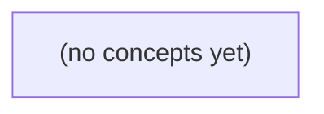

# 10.09 持续集成与制品：Go 语言 IM 项目的静态工作流设计

*一本面向 Go 技术栈初学者的静态教材，以 S2 虚构内存 IM 的消息字节上限规则变更为主线，建立从提交、检查、测试、构建到制品追溯的持续集成认知。读者将通过纸上流程、伪配置、故障推演与 22 道练习，设计可审阅但不实际运行的最小 CI 工作流。*

**章节:** 2

---

## 本书导览

- 了解整本书的章节脉络
- 掌握各章之间的概念依赖关系
- 选择最合适的阅读顺序

# 10.09 持续集成与制品：Go 语言 IM 项目的静态工作流设计

一本面向 Go 技术栈初学者的静态教材，以 S2 虚构内存 IM 的消息字节上限规则变更为主线，建立从提交、检查、测试、构建到制品追溯的持续集成认知。读者将通过纸上流程、伪配置、故障推演与 22 道练习，设计可审阅但不实际运行的最小 CI 工作流。

下方的概念图展示了本书 0 个核心概念以及它们之间的依赖关系；再下方是 1 个章节的入口。你可以按从上到下的顺序阅读，也可以根据自己的兴趣或先验知识选择切入点。

#### 概念图



## 章节索引

- **10.09 持续集成与制品：让IM变更留下可复核证据** — 面向Go初学者，承接本地工具的测试、Git与审查及S2虚构IM内存受理合同，从业务变更出发分层讲CI事件/工作流/job/step、隔离环境、依赖和缓存、测试数据、构建制品与身份；只设计静态教学流程，不部署或运行CI。

## 10.09 持续集成与制品：让IM变更留下可复核证据

- 解释CI、工作流、任务、步骤、runner与触发事件
- 给一次IM合同变更选择分层检查和失败反馈
- 区分go.mod版本选择、go.sum内容校验、工具链与构建环境
- 说明缓存是性能优化而非验证证据
- 在跨job边界传递有提交身份的制品
- 对PR信任边界设最小权限与受控依赖
- 为P2内存IM设计可审阅的最小CI
- 识别未覆盖的客户端确认、持久化、送达和生产发布

本节把本地通过的IM合同变更放入受控提交场景，设计可重复、可归因、可审阅的最小CI证据链。

### 从本地通过到受控提交验证

### 从本地通过到受控提交验证

本地测试“通过”只说明开发者当前工作区在当时环境下满足合同；它不能证明即将合并的提交也满足。常见偏差包括：测试仍读取未提交的旧文件、遗漏新增依赖、使用本机缓存或特定配置、分支代码与待审查版本不一致。

持续集成（CI）的最小职责，是把验证对象固定为一次**受控提交**：

- 输入：提交 `SHA`、受信任的代码仓库内容、声明的依赖与构建配置；
- 过程：在可重复的干净环境中检出该 `SHA`，执行约定的构建、静态检查与自动测试；
- 输出：可定位到该 `SHA` 的检查结果、日志、失败信息，以及必要时生成的制品。

因此，CI不是“自动跑测试”的同义词。自动测试是其中一类检查；构建负责将源码转换为可运行或可发布的输出；制品是构建所得、可保存和追溯的结果；持续交付则是在验证通过后，使制品始终处于可交付状态的更高层流程。

对内存中的 `IM` 合同变更，CI应验证受信代码中实际提交的接口、实现与测试是否一致，而不是相信开发者本地截图或口头结论。检查记录应回答：**哪个 `SHA`、使用什么配置、执行了哪些检查、结果为何**。这样，审查者才能把需求、代码审查意见、测试结果与后续制品连接为可复核证据链。

### 厘清CI、测试、构建与交付边界

### 厘清 CI、测试、构建与交付边界

本地“测试通过”只说明某位开发者在某个环境中得到过成功结果；它不能证明受控提交中的文件、依赖锁定、脚本和配置也能重复得到同一结果。CI 的职责正是以提交 `SHA` 为唯一版本锚点，在受信代码与受控环境中重放检查。

可将几个概念分开：

- **持续集成**：开发者频繁合并受审查的变更；每次提交触发一致的验证流程，并记录可追溯结果。它是流程与证据机制，不等同于某一条测试命令。
- **自动测试**：由工具执行单元、集成或合同测试。例如验证 IM 的字段、版本、序列化规则及内存约束。测试是 CI 中的重要检查项，也可在本地独立运行。
- **构建**：把源代码及声明的依赖转换为可使用输出，如二进制文件、包、镜像描述或文档。构建应依赖提交中的明确输入，而非开发者机器上的旧文件。
- **制品**：构建产生且可保存、下载、复核的输出，包括可执行包、测试报告、覆盖率报告、静态分析报告和校验和。制品应标注来源 `SHA`、构建时间与检查状态。
- **持续交付**：使通过验证的制品始终具备可发布条件，并按审批或策略交付到目标环境。它涉及发布、部署和运行风险控制。

本课程只设计静态 CI 工作流：输入为提交 `SHA` 与受信代码，输出为可归因的检查结果和制品；不创建真实 CI 服务，也不部署 IM 或其他服务。这样仍可判断一项 IM 变更是否留下“针对哪次提交、执行了哪些检查、产生了什么证据”的可复核链条。

### 工作流的事件、任务与步骤分层

### 工作流的事件、任务与步骤分层

P2 内存 IM 的合同变更不能以“开发者本机测试通过”作为合并依据：本机可能残留旧二进制、未提交的配置、缓存依赖或特定环境变量。CI 应以受控提交的 `SHA` 为唯一输入标识，在隔离的 runner 中重新取得可信代码，并产出可追溯到该 `SHA` 的检查结果与制品。

可按三个层次推导工作流：

- **事件**决定“何时验证”。对合并请求的创建、更新和重新打开触发验证；对受保护分支的推送触发合并后验证。事件负责编排入口，不承担编译或测试逻辑。
- **任务**决定“谁负责一类独立责任”。例如：`静态检查` 执行格式、类型和 S2 静态规则；`合同测试` 验证 P2 内存 IM 的读写、错误码、边界条件与并发语义；`构建制品` 从已验证的源码生成可部署包。任务运行在干净 runner，彼此不应依赖开发者工作区。
- **步骤**决定“任务内按何顺序执行”。典型顺序为：检出指定 `SHA` → 固定依赖版本并安装 → 记录工具版本与环境摘要 → 执行检查或构建 → 上传报告、日志及制品。每一步都有明确输入、退出状态和可审阅输出。

失败反馈也应匹配层级。事件层失败表示触发条件或权限配置错误；任务层失败说明某项质量门未通过，例如合同测试失败；步骤层失败则应定位到依赖安装、测试用例或打包命令。合并请求页面展示任务状态，日志保留步骤证据；只有全部必需任务通过，才允许进入审查后的合并路径。

这里的“持续集成”是受控提交上的重复验证机制；自动测试只是其中一个任务，构建负责生成结果，制品是可下载、可校验且关联 `SHA` 的输出；持续交付则是在制品通过验证后，使其具备可发布条件，而非本工作流自动上线。

### Go依赖、工具链与缓存的证据边界

### Go依赖、工具链与缓存的证据边界

CI验证的对象不是开发者电脑上的“当前能通过”，而是某个提交 SHA 在受信代码、确定依赖和确定工具链下能否重现结果。对 Go 项目，`go.mod`、`go.sum` 与构建环境共同构成这条边界。

`go.mod`声明模块路径、直接/间接依赖及 Go 语言版本。例如：

`go 1.22`

它表达项目所要求的语言与模块语义版本，但不应被误解为“任何 1.22.x 环境都天然等价”。工作流应明确固定实际执行的 Go 工具链版本，如 `Go 1.22.5`，并记录操作系统、架构及关键构建参数。若使用容器，则固定基础镜像的不可变摘要，而非仅使用会漂移的标签。

`go.sum`保存依赖模块及其 `go.mod` 文件的校验和。CI应执行依赖一致性检查，例如以只读模块模式运行测试或构建；若命令试图修改 `go.mod`、`go.sum`，则说明提交未完整表达其依赖状态，应失败并要求开发者将变更纳入审查。这样，制品可归因于“提交中的依赖清单”，而不是CI临时解析出的新版依赖。

缓存只用于减少下载和编译时间，不能成为构建输入的唯一来源。缓存键至少应包含：

- `go.sum`内容哈希；
- Go 工具链版本；
- 操作系统与架构；
- 必要时包含构建标签或私有模块配置标识。

缓存命中后仍须经过 `go.sum` 校验；缓存未命中只意味着变慢，不应改变测试、构建或制品结果。CI最终应保存提交 SHA、工具链版本、依赖校验状态、检查日志及制品哈希，使审查者能够回答：该 IM 变更究竟由哪份代码、哪套依赖和哪个环境验证。

### 跨任务制品与PR最小信任设计

### 跨任务制品与 PR 最小信任设计

内存 IM 不产生数据库迁移包，但仍应把“这次提交在什么代码、什么依赖条件下通过了哪些检查”固化为可复核制品。CI 的最小输入是受保护工作流定义、受信代码快照与提交 `SHA`；最小输出是带身份信息的测试报告、构建包或校验摘要。

建议每次受控提交生成一个报告，例如 `im-check-<短SHA>.json`，至少记录：

- `commit_sha`：完整提交身份，而非仅分支名；
- `source_ref`：触发引用，如 PR 编号或主分支；
- `workflow_revision`：执行的工作流版本；
- `runtime`：语言、依赖锁定文件摘要、测试命令；
- `checks`：单元测试、静态检查、构建是否通过；
- `artifact_digest`：制品内容的哈希；
- `created_at`：生成时间与执行任务标识。

例如，报告应能表达：`SHA=abc123...` 使用锁定依赖执行 `go test ./...`，覆盖 IM 的创建、查询、更新、删除合同，并生成对应构建产物。审查者据此验证的不是笼统的“CI 绿了”，而是“该 SHA 的该套代码与依赖通过了这些检查”。

PR 是不完全可信的输入，尤其来自派生仓库时。最小信任边界应为：

- PR 工作流默认只读权限，不授予发布、写仓库或修改标签权限；
- 不向外部 PR 暴露密钥、部署凭据、私有包令牌或缓存写权限；
- 测试依赖应来自锁定文件；不得因 PR 配置而任意下载脚本或替换工作流；
- 来自 fork 的代码可运行无密钥测试，但生成的制品仅标记为“候选证据”，不能自动发布；
- 只有合并后的受信 SHA，或经人工批准的受信任务，才能访问受限依赖并产出正式制品。

持续集成是对每个受控提交重复整合与验证；自动测试只是其中一个检查；构建把源码转为可使用输出；制品是可保存、可下载、可校验的输出；持续交付则是在这些证据基础上使版本保持可发布状态。本节只设计前四者的证据链，不实际创建服务或部署流程。

> **要点** — CI的价值是让受信提交在隔离环境中重复验证，并留下绑定提交SHA的检查与制品证据。

从一次IM合同变更出发，先在纸面上看清CI如何由事件触发，并把检查、构建与制品证据组织成可审阅流程。

### 从仓库事件认识工作流

### 从仓库事件认识工作流

CI 的起点不是“运行一段脚本”，而是仓库事件。例如：

- `push`：开发者把提交推送到某个分支，适合验证主干或功能分支的新变化。
- `pull_request`：创建、更新或重新打开合并请求时触发，适合在代码合并前执行检查。

可以先把工作流理解为一条由事件启动的审查流水线：

`仓库事件 → 工作流 → 任务（job）→ 步骤（step）→ 命令或动作`

工作流通常用 YAML 描述：它声明“什么事件发生时，要做哪些检查”。一个工作流可包含多个任务；每个任务由某个运行器（runner）执行。运行器是临时提供的执行环境，可以理解为一台用于 CI 的干净机器或虚拟环境。

在一个典型 Go 项目中，可先在纸上画出任务内部的顺序：

`checkout → setup Go → 测试 → 构建 → 上传制品`

其中，`checkout` 取回仓库代码，`setup Go` 准备指定版本的 Go 工具链，随后运行测试与构建；构建产生的二进制文件、报告或校验结果可作为制品上传，供之后复核。

需要区分任务与步骤的边界：

- 同一任务中的步骤通常共享工作区，因此后一步可使用前一步检出的代码和生成的文件。
- 不同任务通常运行在彼此独立的环境中，不能假定任务 A 的临时文件能被任务 B 直接读取。
- 若任务 B 必须等待任务 A 成功完成，可用 `needs` 表达依赖；若还要传递文件，应通过制品等显式机制交接。

对于 IM 合同变更，`pull_request` 工作流应以“验证”为主：测试、构建、检查证据，但不发布。发布应由更受控的事件和权限单独触发。

### 运行器与任务隔离边界

### 运行器与任务隔离边界

`runner` 是实际执行流程的运行环境，可以把它理解为一台临时准备好的机器。一个 `job` 会被分配到自己的运行器环境中；该任务结束后，其中的临时文件、已安装工具和环境变量通常不应被视为可供其他任务继续使用。

因此，任务之间默认隔离：

- `test` 任务中生成的 `coverage.out`，`build` 任务不能直接读取；
- `build` 任务编译出的二进制文件，`publish` 任务也不能假定它仍在磁盘上；
- 即使 `build` 声明了 `needs: test`，这只表示“等待测试成功后再执行”，不表示两者共享文件系统。

相反，同一个任务内部的多个 `step` 按顺序执行，并共享该任务的工作区与已建立的状态。例如可在纸面上写成：

`checkout → setup Go → go test → go build → 上传制品`

其中，`checkout` 把仓库内容放入工作区；后续步骤可以在同一工作区读取源码、测试报告和构建产物。若测试步骤生成了 `coverage.out`，紧随其后的上传步骤可以使用它。

当必须跨任务传递文件时，应把文件作为显式制品上传，再由后续任务下载；不要依赖“前一个任务刚好跑过，所以文件还在”。对于 `pull_request`，流程通常只做检出、测试和构建验证；发布或部署应由受控事件触发，并与验证任务明确区分。

### 纸上编排IM合同检查链

### 纸上编排 IM 合同检查链

设想 S2 内存版 IM 服务刚修改了合同：例如新增消息字段、调整错误码，或改变登录后返回的会话信息。此时先不急于写可执行工作流，而是在纸上把证据链排清：

`触发事件 → 检出代码 → 配置 Go → 测试合同 → 构建程序 → 保存制品`

可将流程分成两个触发入口：

- `push`：提交进入主分支或约定分支时执行验证；若团队需要留档，可构建并上传制品。
- `pull_request`：提出合并请求时执行同一套检查，重点是让审阅者看到合同测试是否通过；通常**只验证，不发布**，避免未合并代码生成可被误用的发布物。

纸面上的工作流可理解为一个或多个 `job`。每个 `job` 由 runner 执行，runner 是临时提供执行环境的机器；一个 `job` 内部按顺序运行多个 `step`：

1. `checkout`：把当前提交对应的仓库代码取到工作区。
2. `setup Go`：安装或选择项目要求的 Go 版本，并准备模块依赖环境。
3. `test`：运行 `go test ./...` 一类测试，尤其覆盖 IM 合同：请求、响应、错误路径及兼容性。
4. `build`：只有测试成功后才编译服务程序，例如生成可部署二进制文件。
5. `upload artifact`：上传二进制文件、测试报告或合同快照，使本次检查留下可复核证据。

若把“测试”和“构建上传”拆为两个 `job`，应写出依赖关系：构建任务 `needs` 测试任务。注意，`needs` 只表示执行先后和成功条件，**不自动共享文件**。不同 `job` 使用彼此独立的 runner 与工作区；测试任务生成的临时报告或构建任务产生的二进制，不能假定另一个任务天然可见。跨任务传递内容必须通过明确的制品上传、下载等机制完成。

### 用needs表达先后与失败反馈

### 用`needs`表达先后与失败反馈

在同一个任务中，步骤天然按书写顺序执行：`检出代码 → 配置 Go → 运行测试 → 构建`。若测试步骤失败，后续步骤默认不会继续执行，因此适合把紧密相关的操作放在同一任务内。

但“测试”和“构建”常需要分别呈现结果，例如希望审阅者一眼看到：测试是否通过、构建是否因测试失败而被阻断。这时应拆为两个任务，并让构建任务声明依赖测试任务：

`测试任务 → 构建任务 → 上传制品`

其中，`needs: 测试任务`表达的不是代码书写位置，而是任务级前置条件：

- 测试成功：构建任务才会被调度执行；
- 测试失败或被取消：构建任务通常显示为“已跳过”；
- 工作流页面会保留依赖图和失败任务日志，形成可追溯的反馈路径；
- 构建失败则不会产生可供复核的制品，避免把未通过验证的 IM 变更包装为交付物。

需要特别区分两层顺序：步骤顺序解决“同一环境内先做什么”，`needs`解决“哪些任务必须先成功”。每个任务运行在独立环境中；测试任务生成的临时文件不会自动出现在构建任务。若构建确实需要测试报告、生成代码或编译产物，应将其作为制品显式上传，再由后续任务下载，而不能依赖临时工作区。

### PR只验证，不发布

### PR只验证，不发布

`pull_request` 事件的职责是回答：这次 IM 合同变更能否安全合入？它应运行可复核的验证链路，例如：

`checkout → setup Go → 单元测试/契约测试 → 构建 → 上传测试报告或二进制制品`

这里的“上传制品”是为审阅者保留证据，不等于部署。PR 工作流通常只需要读取代码、写入检查结果等最小权限；不应默认获得生产密钥、发布令牌或可写入正式环境的凭据。来自外部贡献者的 PR 更要谨慎：不要把不受信任的代码与高权限密钥放进同一个执行上下文。

可在流程图中明确分叉：

- `pull_request`：验证编译、测试、静态检查，生成候选制品；
- 合并后的受控事件：在审批、版本号、环境保护规则满足后，才允许发布；
- 生产发布：应是独立 job 或独立工作流，并记录发布人、制品版本与部署结果。

对 IM 变更而言，PR 通过仅说明代码层面的检查通过；它**不证明**客户端已确认兼容性、不证明消息已持久化、不证明下游已送达，也不证明生产环境已发布。将这些边界写入审阅说明，避免把“绿色检查”误解为“线上合同已经生效”。

> **要点** — CI流程应显式呈现事件、隔离边界、依赖顺序与制品交接；PR验证通过不等于发布。

以IM消息字节上限变更为线索，拆解不同检查层的证据边界，并建立可复核、可定位、不过度承诺的最小CI判断框架。

### 从消息上限变更识别风险面

### 从消息上限变更识别风险面

“消息不得超过 $N$ 字节”看似只是一个长度判断，实际会穿过输入、编码、协议与存储等多个边界。首先应明确：限制对象是字符数、UTF-8 编码后的字节数，还是序列化后消息体的字节数；不同定义会让中文、表情和多字节字符得到完全不同的结果。

可将风险拆分为以下证据层：

- **格式与静态规则**：检查常量命名、错误码、字段标签、接口注释及重复实现，避免某处仍保留旧上限。静态检查能发现明显的不一致，但不能证明运行时实际拒绝超限消息。
- **单元行为**：围绕边界构造 `$N-1$`、`$N$`、`$N+1$` 字节输入，并加入中文、表情等多字节样本，验证校验函数按“字节”而非“字符”判定，且返回稳定错误。
- **跨组件合同**：验证客户端请求、服务端校验、消息模型或队列载荷对上限的理解一致；尤其检查客户端预校验与服务端最终裁决是否冲突。
- **未覆盖风险**：测试通过不等于客户端一定收到错误提示，也不证明消息未被持久化、重试路径不会绕过校验，更不证明大消息拒绝时的性能、日志脱敏和监控告警符合预期。

因此，消息上限变更不是“补一个 `len` 判断”，而是先标出每层能提供什么证据、不能证明什么，再决定需要哪些检查与合同验证。

### 分层检查与覆盖边界

### 分层检查与覆盖边界

以“消息内容不得超过某个字节上限”为例，检查应从独立预期推导，而非把一次 `go test ./...` 的通过误认为完整证据。

- **格式与静态检查**：验证代码可读性、语法、类型、明显的控制流或接口误用。例如格式化结果一致、静态分析未发现未处理错误、构建依赖完整。它不能证明“超限消息被拒绝”，因为规则可能根本未被执行。
- **单元测试**：围绕纯粹且局部的规则建立边界证据：空消息、恰好等于上限、上限加 1、包含多字节字符的文本。这里应明确按 `len([]byte(content))`，而非字符数计量。单元测试能证明某个函数在给定输入下符合预期，不能证明真实请求路径一定调用了它。
- **集成测试**：验证路由、鉴权、请求解析、业务服务与错误响应是否串联。例如向发送消息接口提交超限内容，预期得到约定的拒绝状态和错误码。它不能单独证明下游客户端展示、消息队列投递或数据库事务行为。
- **最小合同验证**：验证对外可观察的稳定承诺，如接口字段、错误码、字节上限语义及版本兼容性。它关注消费者依赖的边界，不替代内部实现、并发压力或持久化正确性的测试。

未来可在个人环境执行 `go test ./...` 与 `go build ./...` 作为基础检查命令；前者覆盖已纳入测试的行为，后者仅证明当前目标可构建。即使两者通过，也不能据此宣称客户端已收到消息、数据已持久化，或高负载下性能达标。

阻断检查应覆盖会破坏合并安全的构建失败、核心单元测试失败及关键合同不兼容；非阻断检查可用于试验性静态规则、耗时分析或不稳定环境测试。失败时应记录测试名、执行命令、提交 SHA、环境信息及失败阶段；一次重跑成功只说明结果暂时未复现，不等同于修复。

### 最小合同验证的设计示例

### 最小合同验证的设计示例

对 P2 阶段的内存 IM，最小合同验证不追求证明“消息一定送达”，而是固定服务端对字节上限的可观察承诺。设上限为 $L$ 字节，验证应围绕同一入口（如 `SendMessage`）构造三类场景：

| 场景 | 输入 | 期望合同 | 证据重点 |
|---|---|---|---|
| 上限内 | UTF-8 编码后为 $L-1$ 或 $L$ 字节 | 请求成功，返回消息标识或成功结果 | 边界未被误拒绝 |
| 刚超限 | UTF-8 编码后为 $L+1$ 字节 | 稳定拒绝，不写入内存消息列表 | 边界规则精确 |
| 明显超限 | 远大于 $L$ 字节 | 返回可识别的超限错误 | 调用方可分支处理 |

测试数据必须按字节而非字符构造。例如中文在 UTF-8 中通常占 3 字节，不能以“字符数等于上限”代替字节断言。可使用 `strings.Repeat("a", L+1)` 保证 ASCII 边界，也应补充混合中文与 ASCII 的用例，确认实现确实依据 `len([]byte(content))` 判断。

错误合同应允许调用方可靠识别，例如返回 `ErrMessageTooLarge`，或返回带有稳定错误码 `MESSAGE_TOO_LARGE` 的领域错误；测试不应只匹配完整错误文案。对于拒绝场景，还要断言消息计数、会话最后消息等内存状态未变化，避免“报错但已写入”的半成功。

可在未来个人环境执行：

`go test ./...`

该命令通过，仅证明当前测试覆盖的合同在该环境成立；它不证明客户端已收到消息、不证明数据已持久化，也不证明高并发下的性能。若失败，应记录测试名、执行命令、提交 SHA、运行环境以及失败阶段（编译、断言或初始化）；一次重跑成功只能说明失败未复现，不能直接视为修复。边界拒绝与错误可识别属于阻断检查；错误文案措辞、额外示例覆盖等可作为非阻断检查。

### 失败记录与阻断策略

### 失败记录与阻断策略

检查失败的价值不只在于“红灯”，而在于让后来的人能复现并定位。每次失败至少保留以下证据：

- **检查或测试名**：如 `TestMessageRejectsOversize`、静态检查规则名。
- **完整命令**：如未来个人环境可执行的 `go test ./...` 或 `go build ./...`，包括必要参数。
- **提交 SHA**：明确失败对应的代码版本，避免把后续提交的结果混入。
- **运行环境**：操作系统、Go 版本、依赖锁定状态，以及 CI 镜像或关键环境变量。
- **错误阶段**：区分编译失败、静态检查失败、测试断言失败、集成依赖不可用、制品上传失败等。
- **关键输出**：保留错误摘要、失败堆栈和相关日志链接，而非只记录“测试失败”。

一次重跑成功只能说明失败暂未复现，不能自动视为修复。应将其标记为可能的非确定性问题，并比较两次运行的环境、依赖、并发条件和外部服务状态；只有定位原因并提交可审查的修复后，才可关闭记录。

阻断策略应与风险边界对应：

- **必须阻断合并**：格式检查、编译、与消息字节上限直接相关的单元测试、最小合同验证失败。这些检查失败意味着代码无法构建，或服务端约束可能被破坏。
- **默认提示或人工确认**：覆盖率轻微波动、慢测试告警、非关键性能趋势、可重试的外部集成抖动。它们应产生可见记录，但不应因偶发环境问题无限阻塞交付。
- **升级为阻断**：同类提示反复出现、影响消息拒绝语义，或已证明会导致数据不一致时，应将其纳入必过门禁。

因此，CI 的结论应写成“哪些证据通过、哪些边界尚未证明”，而不是笼统地宣称“变更已完全正确”。

### 命令证据不能证明什么

### 命令证据不能证明什么

在未来个人环境中，可用以下命令形成基础证据：

- `go test ./...`：证明当前工作区中被发现的 Go 包，其测试在该次执行条件下通过。
- `go build ./...`：证明相关包可被编译、链接，接口与类型错误未阻断构建。

这类证据只覆盖“代码可构建、已编写的测试断言成立”，不能外推为消息字节上限变更已经完整生效。尤其要注意测试缓存：若输出含有 `(cached)`，结果可能复用此前执行；需要确认源码、依赖、环境与测试输入是否确实对应当前提交。必要时可用 `go test -count=1 ./...` 获取一次不复用测试结果的执行证据。

即使两条命令均成功，仍不能证明：

- 客户端实际收到了超限提示或拦截结果；
- 消息是否被正确持久化，数据库、队列或重试链路是否一致；
- 服务端是否真正送达目标会话，异步消费者是否处理；
- 多端协议、旧客户端和边界编码是否兼容；
- 大量消息、长文本或并发场景下的延迟、吞吐与资源占用达标。

因此，命令成功应记录为“构建与测试层通过”，而不是“变更已验证”。若失败，应保存测试名、完整命令、提交 SHA、Go 版本及依赖环境、错误发生阶段和原始输出；一次重跑成功只能说明失败未稳定复现，不能自动构成修复证据。

> **要点** — CI应以分层检查形成可复核证据；通过只证明已测合同，失败须可定位，重跑成功不等于修复。

CI的可信性不只取决于“测试通过”，还取决于依赖、环境、缓存、输入与权限是否可解释、可隔离、可复核。

### 依赖版本与内容校验

### 依赖版本与内容校验

`go.mod` 与 `go.sum` 解决的是两个不同问题，不能互相替代。

- `go.mod` 声明模块路径、Go 版本以及直接或间接依赖的版本约束。执行 `go build`、`go test` 时，Go 按最小版本选择规则计算依赖图：若多个依赖要求同一模块的不同版本，通常选择其中较高的版本。因此，它回答的是：**这次构建应选择哪个模块版本？**
- `go.sum` 记录已下载模块及其 `go.mod` 文件的校验和。下载同一路径、同一版本的模块时，Go 会核对内容哈希；内容不符会拒绝继续使用。它回答的是：**下载到本地的内容是否正是此前确认过的那份内容？**

例如，`go.mod` 中的：

`require example.com/im/sdk v1.4.2`

指定选择 `v1.4.2`；而 `go.sum` 中对应的哈希则固定该版本模块压缩包和元数据的内容指纹。版本号相同并不应被视为内容天然可信，校验和才提供可验证的内容边界。

因此，CI 应将 `go.mod` 与 `go.sum` 一并提交、评审并纳入变更证据。若执行依赖整理或测试后两者发生变化，应明确说明新增、升级或移除的依赖原因。不要在流水线中静默忽略 `go.sum` 差异；这会使“测试通过”建立在未审查的依赖变更之上。

可将依赖检查设为独立步骤：先在洁净环境下载模块并验证校验和，再执行测试。这样，失败能明确区分为版本选择变化、模块内容校验失败，或业务测试失败。

### 构建环境决定产物边界

### 构建环境决定产物边界

同一份源码提交，并不天然对应同一份字节产物。构建结果应被理解为一个派生关系：

$artifact = f(source,\ go版本,\ 依赖,\ GOOS,\ GOARCH,\ CGO,\ runner镜像,\ 构建参数)$

其中任一输入变化，都可能改变测试行为、链接方式或最终二进制内容。

- **Go 版本**会影响编译器优化、标准库实现、模块解析细节与测试行为。`go.mod` 中的 `go` 指令描述模块兼容目标，但不等于 CI 实际使用的工具链版本；流水线应显式固定 Go 版本。
- **`GOOS` 与 `GOARCH`**决定目标操作系统和 CPU 架构。例如 Linux/amd64 与 Linux/arm64 的二进制不可互换；涉及文件路径、信号、网络栈、字节序或汇编优化的代码，测试结果也可能不同。
- **CGO** 会把系统 C 编译器、头文件和动态库纳入构建边界。`CGO_ENABLED=0` 往往得到更易搬运的静态产物；启用 CGO 时，glibc、musl、OpenSSL 等系统差异都可能造成运行或链接结果不同。
- **runner 镜像**不仅提供操作系统，还隐含证书、时区、Shell、系统库和预装工具版本。使用浮动标签的镜像，会让未来的同名任务运行在不同环境中。

因此，制品元数据至少应记录提交 SHA、Go 版本、`GOOS/GOARCH`、CGO 状态、runner 镜像标识及构建命令。若需要比较二进制字节，先确认是否嵌入了构建时间、路径、版本信息等非确定性内容；“源码 SHA 相同”只能说明输入源码相同，不能自动证明产物逐字节一致。

### 洁净Runner与隔离测试数据

### 洁净 Runner 与隔离测试数据

P2 内存 IM 的合同变更应在一次性、可解释的执行环境中验证：每次流水线从干净的 Runner 启动，不复用上次任务遗留的工作目录、进程、环境变量、临时文件或本地数据。否则，某个“通过”的测试可能实际依赖了历史编译产物、残留会话或开发机配置，而非当前提交。

测试应只构造虚假的租户、用户、会话和消息数据，例如：

- 使用固定但无真实含义的 `tenant-test`、`user-a`、`conversation-1`；
- 在测试初始化时新建内存仓库，在结束时丢弃；禁止读取生产快照、共享数据库或真实消息队列；
- 以显式时钟、确定性随机源和可控 ID 生成器替代系统时间与随机数，避免顺序、并发或日期导致偶发失败；
- 对“发送消息”“建立会话”等边界调用注入 fake/stub，断言请求参数、状态迁移与返回错误，不发起网络连接。

可以将合同测试写成“给定—执行—断言”结构：给定空的内存 IM，执行创建会话与发送消息，断言消息顺序、成员可见性、错误码及不可变字段。每个用例必须独立创建状态，不能依赖测试执行顺序；并行测试还应使用独立实例，避免共享 map、全局变量或端口。

CI 中不应提供真实 IM 账号、访问令牌或密钥。即使测试当前“不需要”，泄露的环境变量也可能被日志、失败输出或恶意依赖读取。若必须验证外部协议，应使用隔离的模拟服务与短期测试凭据，并将该类集成测试与默认单元测试分层执行。这样，P2 的变更证据来自可重复的合同断言，而不是偶然仍可访问的真实系统。

### 缓存不是验证证据

### 缓存不是验证证据

`go.mod` 与 `go.sum` 是可提交、可审查的依赖声明：前者记录所选模块版本，后者记录已下载模块内容的校验和。它们能回答“构建预期使用什么依赖、下载内容是否匹配”，因此属于复核链的一部分。

相比之下，缓存只保存可复用结果，证据地位明显较弱：

- **模块缓存**：保存已下载的模块源码，可减少网络下载；但缓存可能来自先前任务，不能证明本次依赖解析、下载和校验过程完整发生。
- **构建缓存**：保存编译中间物或测试结果，可减少重复编译；其命中受 Go 版本、`GOOS/GOARCH`、编译参数、`CGO_ENABLED`、文件时间等影响，不能单独证明当前源码在当前环境可从零构建。
- **版本控制中的清单**：`go.mod`、`go.sum`、工作流文件和锁定的 Action 提交 SHA 可被审查、比较和追溯；它们才是“应当复现什么”的依据。

因此，缓存命中只能说明“已有结果可复用”，不能说明“本次变更已被独立验证”。CI 应把缓存视为加速层，而非真值来源：缓存键应包含依赖清单、Go 版本与目标平台；关键 PR、发布候选和异常排查应执行一次删缓存后的冷构建与测试。若冷构建失败而缓存构建通过，优先怀疑隐式依赖、环境漂移或缓存污染，而不是把失败简单归因为网络波动。

### PR信任边界与受控执行

### PR信任边界与受控执行

PR 的源码、工作流配置、构建脚本、测试夹具乃至 `go.mod` 都应视为**不受信输入**：贡献者可能无意引入风险，也可能借助 CI 执行窃取密钥、篡改制品或消耗资源。因此，“检出 PR 后直接运行拥有仓库权限的脚本”是危险模式。

应将流水线分层：

- **普通 PR 校验**：只授予只读仓库权限，不注入生产密钥、IM 机器人令牌、发布凭证或可写制品权限；测试使用虚构账号、隔离网络与临时数据。
- **受信分支发布**：仅在合并后的受保护分支、受控标签或人工批准后执行发布、签名、部署等高权限步骤。
- **权限显式声明**：默认关闭写权限，按任务配置最小 `permissions`；令牌只在实际需要的步骤注入，并限制有效范围与生命周期。

第三方 Action 是供应链输入，不能仅固定浮动标签如 `@v4`；应固定到完整提交 SHA，例如 `uses: owner/action@<完整提交SHA>`，并定期审查其来源、更新记录和所需权限。对于下载工具、容器镜像和 Go 模块，也应使用允许列表、校验和与可追溯版本，而非在脚本中临时拉取“最新版本”。

日志同样是攻击面。不要输出环境变量、请求头、连接串、私钥或测试失败时的完整配置；即使平台提供掩码，也应主动避免将秘密拼入命令行。对来自 PR 的标题、分支名和文件内容进行引用与转义，避免它们被解释为 shell 命令、工作流指令或日志控制字符。

可复核的 CI 不等于“任何 PR 都能做任何事”：它应允许不受信代码证明自身质量，却不能获得改变仓库、读取秘密或发布制品的能力。

> **要点** — 可信CI以锁定依赖、明确环境、隔离输入和最小权限建立证据；缓存只能加速，不能证明正确。

为内存IM合同变更设计可复核的测试证据：固定数据、时间与排序，让失败能够被准确归因而非被随机性掩盖。

### 从IM合同提取可重复的验收样本

### 从 IM 合同提取可重复的验收样本

先用一组小而固定的标识构造种子数据，避免测试依赖历史任务、随机生成值或共享环境中的残留状态：

| 标识 | 类型 | 初始状态 | 对应合同断言 |
|---|---|---|---|
| `c-a` | 课程/集合 | 已创建，名称固定 | 创建后可按精确标识查询；重复创建应返回明确的冲突或幂等结果 |
| `u-a` | 用户 | 已创建，资料完整 | 可被稳定读取；更新前后身份标识不变 |
| `u-b` | 用户 | 已创建，与 `u-a` 可区分 | 多用户查询不得串数据；排序规则下位置可预测 |
| `m-a` | 成员关系/映射 | `u-a` 关联至 `c-a` | 查询 `c-a` 时包含 `u-a`；关联删除后不再出现 |

最小验收链可写成：

1. 清空本次测试命名空间，或创建独立的内存 IM 实例。
2. 固定顺序写入 `c-a`、`u-a`、`u-b`、`m-a`。
3. 读取课程及成员列表，断言 `m-a` 只指向 `c-a` 与 `u-a`。
4. 更新 `u-a` 的可变字段，断言读取结果已变化，而 `u-a` 的主键、`m-a` 关系均保持不变。
5. 删除 `m-a`，断言成员列表为空；再次删除则断言合同规定的“未找到”或幂等结果。

若合同承诺列表稳定，应显式断言排序，例如按 `id` 升序得到 `[u-a, u-b]`，而不是仅断言“包含两项”。时间字段也应注入固定时钟，如 `2025-01-01T00:00:00Z`；禁止用“当前时间晚于开始时间”这类易漂移断言。

这组样本的价值不在覆盖所有业务，而在让每个失败都能映射到具体合同：对象创建、唯一性、读取隔离、关系完整性、更新边界、删除语义与排序确定性。

### 固定时间与排序，消除隐性状态

### 固定时间与排序，消除隐性状态

测试应把“当前时刻”和“返回顺序”从隐式环境变量变成显式合同。为 `c-a`、`u-a`、`u-b`、`m-a` 建立每例独立的种子数据，并注入固定时钟，例如令 `$T_0=2025\text{-}01\text{-}01T00:00:00Z$`。创建消息时由测试传入 `now()` 的替身，而不是直接读取系统时间：

`m-a.createdAt = T0`，`m-a.updatedAt = T0 + 1s`

这样，断言可以精确比较时间字段、过期边界和审计记录；若需要验证时间推进，应显式调用 `clock.advance(1s)`，不可依赖 `sleep`。

消息列表还必须规定全序。推荐按 `createdAt` 降序，再按稳定的 `messageId` 升序打破同一时刻的平局：

`sortKey(m) = (-m.createdAt, m.messageId)`

因此，即使 `m-a` 与后续样本拥有相同时间戳，结果仍可重复。不要依赖哈希表遍历顺序、数据库默认返回顺序或并发写入的偶然先后。

每个任务开始前应新建 IM 实例、临时目录和缓存命名空间；结束后清理，并在日志中记录种子版本、固定时间和排序规则。禁止测试读取前一次任务残留的内存单例、文件、制品或下载缓存。缓存可用于加速依赖安装，但测试语义不得取决于“缓存恰好存在”。

纸上判定可简化为：

| 现象 | 首先检查 | 处理 |
|---|---|---|
| 时间断言漂移 | 是否使用真实时钟 | 改为注入时钟 |
| 列表偶发换序 | 是否存在稳定次级排序 | 补充 `messageId` 排序 |
| 单独通过、连续运行失败 | 是否复用状态或临时目录 | 隔离并清理任务状态 |

只有在固定时间、数据和排序后仍失败，才将其视为代码、环境或依赖问题；不要以随机重试掩盖隐性状态。

### 为合同变更安排分层检查

### 为合同变更安排分层检查

对 IM 合同的变更，不应只依赖“一次全量测试通过”。流水线应按反馈速度与故障归因分层：越靠前的检查越快、依赖越少；后续检查才验证跨模块语义与可交付制品。

| 层次 | 检查内容 | 典型失败归因 | 建议退出码 | 应保存的证据 |
|---|---|---|---:|---|
| 格式化 | 代码格式、静态规则、导入顺序 | 代码规范或提交遗漏 | `10` | 格式差异、规则报告 |
| 编译 | 类型检查、接口引用、生成代码 | 代码编译错误、合同签名不一致 | `20` | 编译器诊断、依赖版本 |
| 单元测试 | `c-a`、`u-a`、`u-b`、`m-a` 的本地行为 | 业务代码或边界条件错误 | `30` | 测试报告、固定种子、失败输入 |
| 合同测试 | IM 请求/响应、错误码、排序、时间字段 | 合同破坏或兼容性回退 | `40` | 请求响应快照、合同差异 |
| 构建 | 打包、制品元数据、可部署性 | 构建脚本、依赖下载、环境配置 | `50` | 构建日志、制品校验和、依赖清单 |

测试数据必须在作业开始时显式初始化，例如固定创建 `c-a`，并以 `u-a`、`u-b` 作为稳定主体，`m-a` 作为确定消息样本；时间使用注入时钟或固定时间戳，查询结果使用明确排序。每个作业应在独立工作目录与独立数据存储中运行，不读取前一次 job 的缓存状态、残留数据库或历史制品。

纸上判定时，可先问：失败是否能在无网络、无外部服务条件下复现？能复现则优先判为代码或合同问题；不能复现，再检查环境、依赖下载、网络或外部服务日志。仅“依赖下载/网络/外部服务”类失败允许重试一次，并必须保留首次与重试日志；格式化、编译、单元测试、合同测试失败不得自动重试。重试成功不等于通过，应标记为不稳定证据并转交后续专项排查。

### 用日志与制品保留失败证据

### 用日志与制品保留失败证据

测试通过只说明“本次未发现问题”；测试失败时，日志与制品必须让复核者无需重跑即可回答：**哪个样本、在何种构建、以什么输入和顺序、在哪一步失败**。

任务日志应输出结构化且稳定的关键信息，避免仅有“断言失败”：

- 构建身份：提交哈希、分支或合并请求编号、任务编号、镜像/运行时版本、测试命令。
- 样本身份：固定种子版本，以及本次覆盖的 `c-a`、`u-a`、`u-b`、`m-a`；同时记录其创建顺序、查询顺序与预期排序键。
- 确定性条件：固定时钟值、时区、随机种子；若测试不应使用随机数，应明确写出“随机源已禁用”。
- 失败上下文：断言名称、期望值、实际值、相关 IM 快照或字段差异、调用步骤编号及退出码。
- 分类标签：`代码`、`环境`、`依赖下载`、`网络`、`外部服务`。分类是初判，不得以“网络波动”替代证据。

可下载制品至少包含：完整测试输出、失败用例清单、种子数据摘要、排序前后结果、运行环境清单，以及必要的堆栈信息。建议生成 `failure-summary.md`，使审阅者先看摘要，再按链接进入原始日志；原始日志不得被摘要覆盖或截断。

纸上判定可遵循下表：

| 现象 | 初步归类 | 是否自动重试 | 必留证据 |
|---|---|---:|---|
| 固定样本断言不符 | 代码 | 否 | 输入、期望/实际差异、堆栈 |
| 缺少运行时或权限 | 环境 | 否 | 环境清单、命令输出 |
| 包下载失败 | 依赖下载 | 有限重试 | 锁定文件、下载日志 |
| 连接超时 | 网络/外部服务 | 有限重试 | 地址、超时、响应摘要 |

仅对明确可瞬态的下载、网络或外部服务失败重试，且最多一次；重试后通过也应保留首次失败日志。代码与环境失败禁止重试掩盖。并发和网络不稳定性专项测试应留给 10.07 与后续 S4，本节的 CI 基线必须保持确定、可比较、可复核。

### 纸上判定失败类型与重试规则

### 纸上判定失败类型与重试规则

先读取步骤退出码、测试报告与制品日志，再判定失败类型；不要仅因“再跑一次通过”就把故障标为偶发。对固定种子数据、确定性时间和排序的 `c-a/u-a/u-b/m-a` 样本而言，同一提交应得到同一结果。

| 失败类型 | 典型证据 | 默认处置 | 重试规则 |
|---|---|---|---|
| 代码 | 断言失败、快照差异、编译或类型检查失败；同输入稳定复现 | 禁止重试，创建缺陷或修复提交 | 仅修复代码后重新执行 |
| 环境 | 缺少工具、权限拒绝、磁盘满、运行时版本不符 | 人工排查运行器与配置 | 修复环境后重跑；不得把环境错误标为测试失败 |
| 依赖下载 | 包仓库认证失败、校验和不符、依赖版本不存在 | 先检查锁文件、镜像与缓存 | 可受控重试一次；仍失败则升级处理 |
| 网络 | DNS、连接超时、连接重置、临时 `5xx` | 保留请求目标、时间戳和错误码 | 指数退避重试，最多两次；禁止无限重跑 |
| 外部服务 | 数据库、制品库、身份服务或模拟端点不可用 | 核对服务健康状态与变更窗口 | 有明确瞬时故障证据时受控重试；否则人工排查 |

判定顺序应为：先确认测试是否真正执行，再看断言结果；先排除运行器、下载和网络问题，最后归因代码。制品至少保存 `stdout/stderr`、步骤退出码、依赖解析记录、测试报告、时间戳及重试次数。

重试必须产生可审计记录：`第几次重试—失败类别—触发证据—等待时间—最终结果`。若第一次失败、重试通过，结论应写为“受控重试恢复”，而非“测试通过”；该信号仍需进入稳定性跟踪。并发与网络抖动的专门验证留给 10.07 与后续 S4，不能以随机失败掩盖当前 IM 合同的确定性缺陷。

> **要点** — 可靠CI先保证测试输入与执行环境可重复，再以退出码、日志和制品让每次失败可定位、可复核。

制品把一次IM变更的检查结果固定为可复核输出；缓存只负责加速，不能替代证据。

### 制品、缓存与证据边界

### 制品、缓存与证据边界

制品是某次工作流明确产出的、可保存和下载的结果，例如教学 CLI 二进制、测试报告、覆盖率文件或 `SHA256` 摘要文件。它应能关联到具体的提交 `commit SHA`、工作流运行、构建命令、Go 版本与目标平台；因此，审阅者可以回答：“这份文件由哪次变更、在哪种工具链条件下产生？”

缓存则是性能优化：例如缓存 Go 模块下载目录或编译缓存，以减少重复下载和编译。缓存可被清除、过期或命中不同的恢复键；它的存在只说明“可能复用了先前数据”，不能证明某次检查确实执行过，更不能作为交付物或审计记录。

跨作业时尤其要区分两者：

- 同一作业中的后续步骤可直接读取前一步生成的文件。
- 不同作业默认不共享工作目录；需要显式上传制品并在另一作业下载。
- 不能把“缓存命中”当作“已获得构建产物”，也不能依赖缓存传递待发布二进制。

文件摘要可用 `sha256sum cli > cli.sha256` 记录，便于下载后校验字节是否一致；但摘要只描述该文件内容，**不等于**供应链证明，也不证明程序功能正确。对 Go 而言，“可重现”还必须固定输入与环境：源码、依赖、`go` 版本、`GOOS/GOARCH`、构建参数、CGO 状态及可能嵌入的时间戳。相同源码在不同 flags、CGO 或时间条件下得到不同二进制是正常现象。

本课程不执行真实构建；示例制品与摘要仅用于说明证据应如何被命名、关联和复核。

### 为制品绑定提交与构建上下文

### 为制品绑定提交与构建上下文

制品只有能回答“它由什么输入、在什么环境中产生”时，才具备复核价值。对教学 CLI 二进制、测试报告或覆盖率文件，至少应在制品旁附带一份构建元数据，建立从输出回溯到提交与工作流的链路。

建议记录：

- **提交标识**：完整的 `commit SHA`，而非仅分支名；分支会移动，SHA 才固定源码状态。
- **工作流上下文**：工作流名称、运行编号、触发方式及运行时间，便于定位对应的 CI 日志。
- **工具链**：`go version`，必要时包括 `CGO_ENABLED`、依赖下载方式与模块状态。
- **目标平台**：如 `GOOS=linux`、`GOARCH=amd64`；不同目标平台生成的二进制不可混为同一输出。
- **构建命令**：例如 `go build -trimpath -o teaching-cli ./cmd/teaching-cli`，测试报告则记录执行的 `go test` 参数。
- **文件摘要**：单独发布 `SHA256SUMS`，用于确认下载后的文件未被意外替换或损坏。

例如，二进制可命名为 `teaching-cli-linux-amd64`，并附带 `build-info.txt` 与 `SHA256SUMS`。摘要证明的是“该文件与记录的字节一致”，并不自动证明供应链安全、构建过程可信或程序功能正确。

同一份 Go 源码在不同构建参数、CGO 设置、依赖解析结果或时间戳条件下，可能产生不同字节输出。因此，可重现性必须明确输入与环境，而不能只说“源码相同”。本课程不执行真实构建；这里的重点是建立可审计的制品记录格式。

### 跨任务传递的显式上传下载

### 跨任务传递的显式上传下载

持续集成中的任务通常运行在彼此隔离的执行环境：前一任务生成的 `im-cli`、测试报告或 `SHA256` 文件，在后一任务开始时默认并不存在。不要假设工作目录、临时目录或缓存会自动共享；缓存的目标是加速依赖恢复，且可随时失效或被清理，不能作为待复核制品的传递机制。

典型流程应显式分为三步：

1. **构建任务**：检出特定 `commit SHA`，记录 Go 版本、目标平台、构建命令与必要构建参数；生成二进制和摘要，例如 `sha256sum im-cli > im-cli.sha256`。
2. **上传制品**：将二进制、摘要文件及构建元数据一并上传，并使用包含提交号、平台或版本的制品名称，避免“latest”这类含义不稳定的名称。
3. **验证任务**：下载指定制品，先核对其关联的提交号、目标与构建信息，再执行 `sha256sum -c im-cli.sha256`，最后运行部署前检查、冒烟测试或归档操作。

摘要核对只能说明：下载到的文件与上传时记录的那份文件一致。它不自动证明该文件功能正确，也不等同于完整的软件供应链证明。若验证任务重新构建，应将其视为另一项可比较的输出：同一源码在不同 `build flags`、`CGO` 设置、时间戳或工具链下可能得到不同字节，不能仅凭摘要不同就断言构建失败。

本课程不执行真实构建；重点是把“生成—上传—下载—核对”的证据链写入工作流，使每个跨任务使用的文件都有明确来源。

### IM合同变更的最小制品流程

### IM合同变更的最小制品流程

以 S2 内存 IM 的“受理合同”变更为例：提交消息后，系统必须明确返回受理结果、消息标识或失败原因。即使课程不执行真实构建，也应设计可静态审查的 CI 证据链。

1. **在单个构建任务内完成检查与打包**  
   固定输入：`commit SHA`、Go 版本、目标平台、构建命令及测试命令。例如：

   `go test ./... -json > test-report.json`  
   `go build -trimpath -o dist/im-cli ./cmd/im`

   产出教学 CLI 二进制（或占位文件）、`test-report.json` 与一份 `build-metadata.txt`。后者至少记录：

   `commit=<SHA>`、`go_version=<版本>`、`target=<GOOS/GOARCH>`、`command=<命令>`。

2. **显式上传跨任务所需制品**  
   后续验收任务不能假设能读到前一任务的工作目录；它必须下载已上传的制品，再运行示例或核对报告。缓存仅可保存 Go 模块下载目录以加速，允许随时删除，不能作为测试通过或二进制存在的证据。

3. **让失败反馈对应合同条款**  
   测试报告应覆盖：合法消息返回成功与稳定消息标识；空会话、未知接收者或非法内容返回预期错误；失败时不得留下部分写入。失败输出应指向可行动原因，如“期望拒绝空会话，实际返回成功”，而非仅报告断言行号。

4. **记录摘要，但不夸大其含义**  
   对下载后的 `im-cli` 生成 `SHA256` 文件摘要，并与元数据一起保存。该摘要只能说明“此文件字节内容可核对”；它不自动证明供应链安全、构建环境可信，更不证明 IM 功能正确。

Go 的可重现性必须声明环境和输入：相同源码在不同 `build flags`、CGO 设置、依赖解析结果或时间戳条件下，可能得到不同二进制。课程中的静态流程因此重在展示：每项合同变更都有可定位提交、可下载输出与可阅读失败证据。

### 可重现性声明与证据限度

### 可重现性声明与证据限度

同一份源码并不必然产生同一份二进制。应把证据分层，避免把“文件相同”误说成“软件正确”或“供应链可信”：

| 证据 | 能说明什么 | 不能说明什么 |
|---|---|---|
| 制品的 `SHA256` | 下载到的文件是否与记录的文件一致 | 功能是否正确、源码是否可信、构建过程是否未被篡改 |
| 测试报告 | 在记录的环境、输入与测试范围内，断言是否通过 | 未覆盖功能没有缺陷、发布制品就是被测对象 |
| 供应链证明/签名/溯源记录 | 制品与提交、构建者、工作流、依赖和权限之间的可追溯关系 | 软件逻辑必然正确或不存在漏洞 |

因此，课程中的制品说明至少应记录：`commit SHA`、目标平台、Go 版本、完整构建命令、构建标志和制品 `SHA256`。例如：

`go build -trimpath -ldflags="-s -w" -o dist/im-cli ./cmd/im`

可重现性还依赖明确的环境与输入。`GOOS`、`GOARCH`、Go 编译器版本、模块依赖、`CGO_ENABLED`、C 编译器及其库版本都会改变输出；嵌入构建时间、版本字符串、绝对路径或随机数据同样会导致摘要不同。`-trimpath` 可减少路径差异，但不是完整保证。

本课程不执行真实构建，也不生成真实供应链证明；示例中的摘要、报告和制品名称仅用于说明应保存哪些可复核证据。

> **要点** — 制品应携带可追溯构建身份；缓存可随时删除，不能充当验证或供应链证据。

以一次IM受理合同变更为线索，将业务规则转化为可追溯的PR门禁、失败反馈与受控制品边界。

### 从受理合同提炼门禁

### 从受理合同提炼门禁

将“消息受理”写成可复核的合同，而非笼统的“发送成功”。以 `m-a` 请求为例，PR 门禁首先固定可观察输入与预期分类：

- **合法接收**：字段完整、类型正确、长度与附件规模未超限时，应进入“可受理”路径；检查可断言请求校验结果、下游调用资格或规范化后的受理记录。
- **超限拒绝**：正文、元数据或附件超过合同阈值时，必须在受理边界拒绝，返回稳定的拒绝类别；门禁应覆盖阈值内、恰等于阈值、超过阈值三组样例。
- **重复 ID**：当前合同若未承诺幂等结果，测试不能擅自断言“必然成功”或“必然冲突”。可检查其结果属于已声明的允许集合，例如“复用既有受理结果”或“明确拒绝重复请求”。
- **客户端回应不确定**：服务端受理不等于客户端已经收到。PR 检查只验证受理响应的结构、错误分类和关联标识，不把设备送达、回执时序写成同步门禁。

纸上流程可表达为：`提交 → 静态检查/合同测试 → 评审 → 合并 → 受控制品`；任一步失败均应回链到具体提交 SHA。PR 产生的报告、测试日志和候选制品仅供审查，不自动发布。

`contract_check: m_a; cases: [合法, 超限, 重复ID允许集合, 回应字段]`

数据库持久化与设备送达属于后续 S3/S5 验证：前者检验状态落库，后者检验异步投递；二者不应替代本节的受理合同门禁。

### 绘制提交到制品的纸上流程

### 绘制提交到制品的纸上流程

先把合同中的可观察承诺画成一条不依赖具体平台的证据链。纸上流程应明确每一步的输入、产物、阻断条件，以及失败必须回指的提交 SHA：

`提交 SHA → PR 触发 → 自动检查 → 人工评审 → 合并受保护分支 → 构建受控制品`

1. **提交**：开发者提交 IM 受理变更，并在提交或 PR 描述中关联合同条款，例如“合法 `m-a` 请求被接收”“超限请求被拒绝”。每次运行以不可变 SHA 为身份，不以“最新代码”为证据。
2. **触发**：创建、更新 PR 时触发门禁；同一 PR 出现新提交后，旧 SHA 的结论不得自动覆盖新 SHA。
3. **自动检查**：至少包含编译、静态检查及合同测试。合同测试应覆盖：
   - 合法 `m-a` 请求返回“已接收”语义；
   - 超限输入得到明确拒绝；
   - 重复 ID 在当前阶段允许的结果集合，例如“拒绝”“幂等接受”或“状态未定但不产生矛盾记录”；
   - 客户端回应不确定时，服务端可复核的记录与客户端可见结果不被混为一谈。
4. **评审**：评审者确认测试断言确实对应合同，而非只检查测试是否通过；必需检查全部成功后才允许批准。
5. **合并**：受保护分支只接受已批准且门禁绑定到当前 SHA 的 PR。失败状态应在 PR 中显示失败任务、日志链接和对应 SHA。
6. **受控制品**：合并后构建带版本、来源 SHA 与校验信息的制品；PR 阶段制品仅用于验证，不自动发布。

可用如下伪配置表达最小边界：

`PR: 编译 + 静态检查 + 合同测试 + 评审`  
`合并后: 构建制品(SHA, 版本, 校验) + 制品登记`  
`后续阶段: S3 数据库验证；S5 设备送达验证`

其中，数据库持久化与真实设备送达属于后续 S3/S5 测试，不能被 PR 的“请求已接收”检查替代；反过来，也不能把尚未验证的送达能力写成 PR 已证明的事实。

### 为内存IM选择最小检查集

### 为内存IM选择最小检查集

内存版 IM 的门禁目标不是证明“系统已在真实环境可靠运行”，而是为一次合同变更建立可复核证据：该提交是否仍接受合法的 `m-a` 请求、拒绝超限输入，并如实保留重复 ID 与客户端回应不确定性的当前约定。

可采用由快到慢的最小检查集：

1. **格式检查**：检查代码格式、静态规则与配置文件语法。它回答“提交是否满足统一的可读性和基础规范”，避免评审者把精力耗在机械问题上。
2. **编译检查**：从干净环境构建项目。它回答“该 SHA 能否被解析、链接并产出可执行构建结果”，但不等同于功能正确。
3. **单元测试**：隔离验证解析、长度判断、ID 生成或存储接口等小单元。它回答“局部规则是否按预期实现”。
4. **合同场景测试**：以请求—响应断言覆盖关键外部行为，例如合法 `m-a` 被接受、超过上限被拒绝、重复 ID 可能返回的当前结果、客户端未获确认时不得推断已送达。它回答“变更是否仍符合已声明的受理合同”。
5. **构建制品**：保存与具体 SHA 对应的包、测试报告、覆盖的合同场景清单及校验值。它回答“评审和合并后，究竟复核了什么”。

纸上流程可写为：

`提交 SHA → 格式/编译 → 单元测试 → 合同场景 → 评审 → 合并 → 受控制品`

任一步失败都应回写到该 SHA，并指向失败检查与场景名称；PR 制品仅供复核，不自动发布。

伪配置可表达必要边界：

`pull_request: [format, build, unit, contract, artifact]`  
`merge_requires: [format, build, unit, contract, review]`  
`artifact.publish: false`

S3/S5 中的数据库持久化、重试恢复、真实设备送达与网络故障验证，应作为后续环境测试，不应被这套内存 IM 的最小 PR 门禁冒充为已验证事实。

### 用伪配置表达信任边界

### 用伪配置表达信任边界

伪配置的目的不是宣称某个 OpenIM 仓库已如此运行，而是把“哪些代码可执行、哪些依赖可使用、哪些结果可离开 PR 环境”写成可审查的合同。PR 只产生证据，不产生对外发布。

```yaml
名称: PR-受理合同门禁
触发:
  事件: 拉取请求
  目标分支: [main]
  路径: [受理服务/**, 合同测试/**, CI配置/**]

权限:
  默认: 只读
  拉取请求令牌:
    读取代码: true
    写入检查结论: true
    发布制品: false
    写入仓库内容: false
    读取生产密钥: false

依赖:
  锁定文件: 必须存在
  安装方式: 仅按锁定文件
  来源: 允许列表中的镜像与校验和
  禁止: 浮动版本、未校验脚本、外部生产服务调用

缓存:
  键: 运行环境版本-锁定文件摘要
  可缓存: [包下载, 编译中间结果]
  不可缓存: [令牌, 密钥, 测试结果, 制品]
  缓存未命中: 重新获取并校验依赖

检查:
  必要:
    - 格式与静态分析
    - 单元测试
    - 合同测试: 合法m-a请求被接收
    - 合同测试: 超限请求被拒绝
    - 合同测试: 重复ID结果显式标注为当前待定或既定规则
    - 合同测试: 客户端回应不确定时不得伪造已送达结论
  后续分层:
    - S3: 数据库持久化与恢复测试
    - S5: 设备实际送达测试

制品:
  条件: 所有必要检查通过
  内容: [测试报告, 覆盖率摘要, 构建产物, 依赖清单, 源码提交SHA]
  上传位置: 受控PR制品库
  保留: 按审计策略
  自动发布: 禁止

反馈:
  失败: 回写到触发该PR的具体SHA
  合并条件: 必要检查通过且完成评审
```

其中，`S3` 与 `S5` 被明确列为后续验证层，避免数据库状态或设备送达的不确定性混入基础 PR 门禁。评审者应能从制品中的提交 SHA 反查源代码、锁定依赖与失败检查；即使所有检查通过，制品也仍只是受控证据，必须经过独立的发布授权流程。

### 划清当前验证与后续验证

### 划清当前验证与后续验证

P2 的门禁只证明“内存中的 IM 处理合同”是否成立，不应把尚未接入的数据库、设备或客户端行为写成已验证事实。PR 针对同一提交 SHA 运行检查；通过后可进入评审与合并，合并产物作为受控制品保存，但 PR 制品不得自动发布。

| 范围 | 当前可复核证据 | 不应据此推断 |
|---|---|---|
| P2 内存处理 | 合法 `m-a` 请求被接受；超限请求被拒绝；重复 ID 按当前合同允许的结果处理；返回结构符合约定 | 请求已持久化、已送达设备或客户端已确认 |
| S3 数据库持久化 | 后续需验证写入、事务、重启恢复与重复记录语义 | P2 的“接受”不等于数据库提交成功 |
| S5 设备送达 | 后续需验证路由、离线补偿、重试与实际送达 | 服务端处理完成不等于设备收到消息 |
| 客户端与发布 | 后续需验证客户端回应、超时、展示及生产发布审批 | 回应可能不确定，制品存在不等于已发布 |

纸上流程可写为：`提交 → P2 合同检查 → 失败：反馈具体 SHA 与断言 → 通过：人工评审 → 合并 → 受控制品`。其中“重复 ID 的现阶段可能结果”和“客户端回应不确定”应作为明确断言边界：前者只检查允许集合，后者不把未观测到的确认当作失败或成功。

> **要点** — CI应把当前IM合同变成可复核门禁：失败定位到SHA，制品受控传递，PR不自动发布。

通过六类常见变式，把IM合同变更中的CI失败转化为可定位、可复核、可审阅的证据链。

### 先画清CI的执行边界

### 先画清CI的执行边界

阅读 CI 配置时，先不要把它看成“一段自动化脚本”，而要建立五层坐标：

- **工作流**：由事件触发的完整验证流程，例如 `pull_request`、`push`、手动触发。它回答“为什么这次 CI 会运行”。
- **任务**：工作流中的独立执行单元，例如“测试 Go 服务”“构建客户端”“发布制品”。不同任务可并行，也可能通过 `needs` 串联。
- **步骤**：任务内部按顺序执行的动作，如检出源码、安装依赖、恢复缓存、运行测试、上传制品。失败通常首先落在某一个步骤。
- **执行器**：实际运行任务的环境，包括托管 runner、操作系统、CPU 架构、预装工具与临时磁盘。相同命令在不同执行器上可能产生不同结果。
- **事件与权限**：触发者、代码来源和令牌权限共同决定 CI 能读什么、写什么、是否能访问密钥或发布资源。

可用如下路径定位一次失败：

`事件 → 工作流 → 任务 → 步骤 → 命令/动作 → 日志与产物`

例如，IM 协议字段变更后出现“依赖下载失败”，已知的是失败发生在“下载模块”步骤；未知的是网络短暂异常、私有仓库鉴权失效，还是缓存恢复了错误状态；下一份证据应是该步骤完整日志、依赖锁定文件、执行器版本与缓存命中键，而不是直接修改业务代码。

同理，“测试通过但漏覆盖字节长度”不能只看测试任务绿色：要继续确认运行的是哪条测试命令、覆盖率是否上传、制品是否来自当前源码 SHA。先标出失败所属层级，才能避免把执行器、缓存、权限或制品问题误判为 IM 业务逻辑错误。

### 依赖与测试失败的证据推进

### 依赖与测试失败的证据推进

CI 失败并不等于“代码有问题”。在 IM 合同变更中，应把现象拆成三栏：**已知**是日志已证明的事实，**未知**是尚不能据此推出的结论，**下一证据**则是最小、可复核的验证动作。

- **依赖下载失败**  
  **已知：**日志显示 `go mod download` 请求超时、校验失败或私有模块无权限。  
  **未知：**不能直接断言模块版本不存在，也不能断言业务代码编译失败；失败可能来自网络、代理、凭据、模块缓存或校验数据库。  
  **下一证据：**记录失败模块、解析后的版本、下载地址与状态码；在干净 runner 上执行 `go env`、`go mod download -x`，并核对 `go.sum`、私有模块凭据注入方式及代理配置。

- **字节长度漏测**  
  **已知：**测试通过了字符长度案例，却未覆盖 UTF-8 多字节文本、表情或截断边界。若协议限制为 `$N$` 字节，`len(s)` 与字符数并不等价。  
  **未知：**不能因“中文消息能发送”就证明长度校验正确；也不能假定客户端与服务端使用同一计量单位。  
  **下一证据：**补充 `$N-1$`、`$N$`、`$N+1$` 字节测试，分别覆盖 ASCII、中文和 emoji；断言错误码、拒绝行为及存储后的原始字节序列。

- **版本选择不稳定**  
  **已知：**工作流使用 `latest`、浮动标签或未锁定的 action/runner，今日成功不保证明日可复现。  
  **未知：**不能把一次通过当作构建环境已固定，也不能仅凭日志中的工具名称推断实际版本。  
  **下一证据：**输出 Go 版本、runner 映像标识、action 提交 SHA 与依赖图；将关键 action 固定到不可变提交，比较两次独立构建所得二进制 SHA。

复核时优先问：这条日志究竟证明了什么？它没有证明什么？下一步取证能否缩小原因集合，而非只是重复运行？

### 缓存、工具链与可重现构建

### 缓存、工具链与可重现构建

CI 中“构建成功”不等于“结果可复核”。应区分依赖声明、依赖校验、执行环境、缓存加速与最终制品：它们共同决定 IM 合同变更能否被他人在相同输入下重建。

| 要素 | 主要职责 | 不能证明什么 |
|---|---|---|
| `go.mod` | 声明模块路径、直接依赖及版本约束 | 不保证下载内容未被篡改 |
| `go.sum` | 记录依赖模块及其内容哈希 | 不锁定 Go 编译器、操作系统或构建参数 |
| 工具链版本 | 固定 `go` 版本、编译器行为与标准库实现 | 不保证依赖缓存干净 |
| 执行器版本 | 固定镜像、系统库、动作运行环境 | 不等于源码和制品一一对应 |
| 缓存 | 减少下载、编译和测试时间 | 不是测试通过或制品可信的证据 |
| 构建输出 | 交付二进制、镜像、测试报告等结果 | 若无来源 SHA，无法证明由当前源码生成 |

依赖下载失败时，先确认未知项：是网络、私有模块权限、代理配置，还是 `go.sum` 缺项？下一证据应是失败日志中的模块路径、校验错误与实际 Go 版本，而不是直接“清空缓存重试”。清缓存可能掩盖污染、失效键或未声明依赖的问题。

缓存键应至少覆盖 `go.sum`、操作系统、架构和工具链版本。例如，依赖缓存可由 `hashFiles('**/go.sum')` 驱动；编译缓存还应隔离 Go 版本。不要使用宽泛恢复键把旧分支或旧工具链的结果当作当前验证依据。缓存只可加速，测试、静态检查与构建仍须真实执行。

可复现构建的核心是记录输入与输出关系：

- 源码提交 SHA、触发事件和工作流版本；
- Go 版本、执行器镜像或其不可变摘要；
- 依赖校验结果及构建命令；
- 制品 SHA-256、生成时间与上传记录。

若制品元数据中的源码 SHA 与当前 PR 提交不符，已知的是“制品不可作为本次合同变更的证据”；未知的是错配发生在检出、缓存恢复还是上传阶段；下一步应核对检出提交、构建日志和制品清单。对 IM 协议字段、字节长度或兼容性测试而言，只有能追溯到准确源码与工具链的报告，才足以支持审阅结论。

### 制品身份与PR信任边界

### 制品身份与 PR 信任边界

CI 的“通过”不等于交付可信。对 IM 合同变更而言，审阅者至少要能回答：**这个制品由哪次源码提交构建、构建过程是否可追溯、外部贡献者能否借 PR 获得超额权限？**

- **制品与源码 SHA 不符**
  - 已知：制品名称、发布说明或测试报告标注的提交 SHA 与当前待合并提交不同。
  - 未知：制品是否来自旧缓存、重跑任务、错误分支，或在构建后又修改了工作区。
  - 下一证据：在制品元数据中保存 `commit_sha`、分支、工作流运行编号、构建时间、依赖锁文件摘要；下载制品后校验其内嵌版本信息与 `github.sha` 一致。不要只相信制品文件名。
  - 最小可信交付：`源码提交 SHA + 制品校验和 + 构建运行链接 + 测试报告 SHA`。

- **日志泄露令牌**
  - 已知：日志中出现 `Authorization`、环境变量回显、完整请求头或疑似令牌格式的字符串。
  - 未知：令牌是否仍有效、是否已被缓存、是否传播到测试报告或制品。
  - 下一证据：立刻吊销并轮换凭据，检索同一运行的日志、缓存键、上传制品；确认敏感变量已被掩码，且脚本未使用 `set -x` 输出命令展开结果。
  - 原则：令牌只能经秘密注入，不能写入配置、测试夹具、错误消息或构建产物。

- **PR 事件权限过大**
  - 已知：面向外部 PR 的任务可写仓库、读取部署密钥，或使用具有写权限的事件触发器。
  - 未知：PR 代码是否能修改工作流、执行任意脚本，进而读取令牌或污染缓存。
  - 下一证据：检查触发事件、`permissions`、是否检出 PR 代码，以及写入制品、评论、发布等步骤是否被隔离。
  - 安全边界：不受信任 PR 默认只授予只读权限；需要写权限的评论、发布、部署任务必须在受信任提交或人工批准后执行，且不得直接运行 PR 提交的脚本。

对跨任务交付，最小证据不是一句“构建成功”，而是一条可复核链：`提交 SHA → 锁定依赖 → 可重现构建 → 校验和制品 → 对应测试报告 → 最小权限运行记录`。这样才能证明 IM 协议变更被测试的，确实是最终准备交付的那份代码。

### 把变式映射到内存IM合同

### 把变式映射到内存IM合同

CI现象不是“流水线问题”的同义词，而是对 P2 内存 IM 合同的证据提问：消息是否正确写入内存、按字节长度限制拒绝非法输入、测试是否覆盖边界、构建是否可复现、制品是否确由该源码产生，以及审阅入口是否安全。

1. 依赖下载失败能证明消息逻辑错误吗？**不能**；已知是环境未满足构建前提，未知是合同是否通过。下一证据：依赖版本、代理配置、校验和与重试日志。  
2. 下载成功能证明构建可复现吗？**不能**；还需锁定依赖图与构建工具版本。  
3. 单元测试通过能证明 IM 已持久化吗？**不能**；P2 是内存合同，不能据此推断数据库或跨进程存储。  
4. 内存写入成功能证明读取正确吗？**不能**；还要验证按会话、用户或消息标识读取的隔离规则。  
5. 测试只覆盖字符数限制够吗？**不够**；合同若规定字节长度，应覆盖多字节文本的 `$n-1,n,n+1$`。  
6. “中文两字”与“两个字节”等价吗？**不等价**；下一证据：实际编码后的字节计数断言。  
7. 超长消息被拒绝即可吗？**不完整**；还应检查错误类型、状态码或调用方可识别的错误语义。  
8. 空消息测试通过能推出空白消息合法吗？**不能**；空串、空白符与缺失字段可能是不同合同分支。  
9. 测试漏掉边界长度是实现缺陷的直接证明吗？**不是**；它首先证明覆盖证据不足。下一步补齐边界测试。  
10. 使用 `latest` runner 能形成稳定证据吗？**不能**；运行环境会漂移，应固定明确版本。  
11. 使用 `latest` action 是否同样有风险？**是**；应固定到可审计版本或提交 SHA。  
12. 固定 action 版本能证明 action 本身可信么？**不能完全证明**；但能把审阅对象固定下来。  
13. 缓存命中能证明依赖正确吗？**不能**；缓存可能污染或与当前锁文件不匹配。  
14. 缓存键应包含什么？**至少包含依赖清单、锁文件、系统与工具链版本**；否则旧依赖可能掩盖问题。  
15. 清缓存后失败说明什么？**说明此前缓存可能参与了结果**；未知仍是依赖源、网络还是版本解析。  
16. 制品存在能证明它来自当前提交吗？**不能**；下一证据：源码提交 SHA、构建元数据与制品哈希。  
17. 制品 SHA 与源码记录不符应如何判断？**视为供应链证据断裂**；不得把它用于发布或验收。  
18. 同一源码两次构建哈希不同一定是 bug 吗？**不一定**；时间戳、随机值、路径等会破坏可重现性，应消除非确定输入。  
19. 日志中出现令牌片段只是可读性问题吗？**不是**；这是凭据泄露事件，应撤销令牌、清理日志并改用掩码与最小暴露。  
20. PR 事件可写入仓库或读取高权限密钥合理吗？**通常不合理**；来自不可信分支的代码不应获得超出检查所需的权限。  
21. 只读权限能否完成合同测试？**通常可以**；内存 IM 的构建与测试应优先采用最小 `contents` 读取权限。  
22. CI 全绿是否代表已完成交付？**不代表**；它只证明已执行检查的范围，未覆盖部署、运行时监控、真实 IM 服务互通与交付后回滚边界。

可把每次审阅结论写成三栏：**已知**（日志或断言直接证明）、**未知**（尚未执行或未被覆盖）、**下一证据**（新增测试、固定版本、哈希比对或权限收缩）。随后可连接到并发属性检查、质量工具门禁，以及交付后的部署与观测验证。

> **要点** — 最小CI应以受控权限、确定环境和带提交身份的制品，为IM合同变更留下可复核证据。
