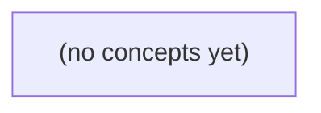

# 10.12 维护性评估：以 IM 正文长度变更为例的 Go 实践

*一本面向 Go 初学者的静态教材，以待审需求 R9 将 IM 正文上限从 6 个 UTF-8 字节调整为 9 个字节为主线，学习如何判断一次变更是否可定位、影响有界、可验证且可回退。教材围绕 S2/v1 既有合同、未来 S3/v2 提议、兼容分支、技术债排序和证据度量展开，配套 22 道反馈题。*

**章节:** 2

---

## 本书导览

- 了解整本书的章节脉络
- 掌握各章之间的概念依赖关系
- 选择最合适的阅读顺序

# 10.12 维护性评估：以 IM 正文长度变更为例的 Go 实践

一本面向 Go 初学者的静态教材，以待审需求 R9 将 IM 正文上限从 6 个 UTF-8 字节调整为 9 个字节为主线，学习如何判断一次变更是否可定位、影响有界、可验证且可回退。教材围绕 S2/v1 既有合同、未来 S3/v2 提议、兼容分支、技术债排序和证据度量展开，配套 22 道反馈题。

下方的概念图展示了本书 0 个核心概念以及它们之间的依赖关系；再下方是 1 个章节的入口。你可以按从上到下的顺序阅读，也可以根据自己的兴趣或先验知识选择切入点。

#### 概念图



## 章节索引

- **10.12 维护性评估：R9为何会牵动这么多地方** — 面向Go初学者，用仍待审的IM正文R9需求评估变更影响、规则耦合、重复与抽象成本、行为保持重构、兼容分支和技术债优先级。

## 10.12 维护性评估：R9为何会牵动这么多地方

- 以R9变更定位维护性而非数行数
- 画出HTTP/domain/客户端/事件/测试影响图
- 识别全局限额常量造成旧接口漂移
- 设计行为保持重构和分层证据
- 按业务风险/变更频率排序技术债
- 限制固定OpenIM两处源码对整体质量的推论

R9从6字节放宽到9字节，看似只改一个阈值，却会检验规则边界、接口契约与验证链路是否真正可维护。

### 以规则扩散衡量维护性

### 以规则扩散衡量维护性

维护性首先看“改一条规则，要追多少地方”。R9 从“正文非空且最多 `6 UTF8B`”调整为“最多 `9 UTF8B`”，不应只搜索数字 `6`；应能明确定位其唯一业务含义、适用对象及例外：它约束的是当前 `S2/v1` 正文，而不是总请求 `4096B`、`accepted_in_memory` 容量，亦不自动改变重复同 ID 返回 `409`、非成员返回 `404` 的既有合同。

可用四个问题评估规则扩散：

1. **能否定位规则源头**：长度约束应集中在命名清晰的规则、校验器或领域模型中，而非散落于控制器、SQL、测试字面量和错误文案。若 `6` 同时出现在多层，改动容易遗漏或误改。
2. **能否预测影响边界**：应列出受影响的输入校验、错误响应、边界测试、接口文档与监控指标；同时说明不受影响的 `409`、`404`、请求总长度和内存接收语义。
3. **能否控制实现扩散**：API 层只调用规则，存储层只保存已通过校验的数据。即使未来采纳 S3 的 `stored_in_teaching_db`，也不应复制一份长度判断到 SQL 约束中而失去单一解释点。
4. **能否解释验证与回退成本**：验证至少覆盖空正文、`6B`、`7B`、`9B`、`10B` 及多字节字符；回退时应恢复阈值并确认已接受数据、数据库记录和客户端预期如何处理。

因此，低成本维护不是“只改一行”，而是能证明：规则在哪、为何影响这些位置、为何不影响其他合同，以及失败后如何安全撤回。

### 绘制R9端到端影响图

### 绘制R9端到端影响图

把规则写成可追踪的断言，而不是散落的数字：

`正文 ≠ 空` 且 `UTF-8 字节长度(正文) ≤ 6`  
拟议变更后：`UTF-8 字节长度(正文) ≤ 9`

影响图应从请求进入系统开始，而非只搜索 `6`：

1. **HTTP 入口**：请求体大小上限仍为 `4096B`，不能因正文从 `6B` 放宽到 `9B` 而误改。路由层应继续区分：格式错误、字段缺失、正文为空、正文超长。
2. **领域校验**：唯一应承载 R9 的位置是正文值对象或校验器。这里必须按 UTF-8 **字节**计数，而非字符数：`你好` 是 `6B`，`你好啊` 是 `9B`。若控制器、服务层、仓储层各自判断长度，变更会形成多点扩散。
3. **持久化与事件**：S3 的 `stored_in_teaching_db` 提议只影响存储实现或事件载荷，不应重定义 R9。检查事件消费者是否假定正文最大 `6B`，例如截断缓冲区、固定列约束、日志解析或消息模式。
4. **客户端显示**：输入框提示、剩余字节计数、提交前禁用逻辑必须同步为 `9B`；但客户端提示只是体验层，服务端仍是最终裁决者。
5. **测试依赖**：将边界样例显式列出：空正文失败，`6B` 成功，`7B` 在旧规则失败，`9B` 在新规则成功，`10B` 失败；同时保留总请求 `4096B`、成功响应 `200 accepted_in_memory`、重复同 ID 为 `409`、非成员为 `404` 的合同测试。

最终图中的关键问题是：哪些节点读取“正文上限”这一规则，哪些节点只消费其结果。前者应尽量收敛到一个来源；后者即使受影响，也不应自行复制阈值。

### 识别全局限额导致的契约漂移

### 识别全局限额导致的契约漂移

R9 将 `S2/v1` 正文上限从 6 UTF-8 字节放宽到 9 字节，最危险的实现并不是“忘记改校验”，而是把它接到一个看似通用的全局限额上。共享常量能减少重复，却可能把局部规则扩散为接口语义变化。

可先区分几类边界：

| 规则 | 约束对象 | 既有可观察结果 |
|---|---|---|
| R9 | `S2/v1` 正文 | 允许非空、最多 6B；拟改为 9B |
| 请求限额 | 整个请求载荷 | 最大 4096B |
| 容量限额 | 内存中的记录集合 | 最多 200 条 |
| 身份冲突 | 同一 ID 重复提交 | `409` |
| 成员资格 | 非成员访问或提交 | `404` |

若把 `正文最大字节数` 命名为笼统的 `MAX_SIZE`，并被请求解析、内存集合或其他版本接口复用，R9 的 6→9B 就可能意外改变总请求判定、旧版本正文接受范围，甚至令原应返回 `409`、`404` 的请求先因长度失败。此时状态码顺序也漂移：客户端看到的不是原合同承诺的业务错误，而是新的参数错误。

较稳妥的做法是让常量表达所属规则与作用域，例如 `S2_V1_BODY_MAX_UTF8_BYTES = 9`，并保留 `REQUEST_MAX_BYTES = 4096`、`IN_MEMORY_RECORD_LIMIT = 200` 的独立定义。验证时应构造“9B 正文 + 重复 ID”“9B 正文 + 非成员”“接近 4096B 请求”等交叉案例，确认 R9 只放宽正文契约，不重写容量、身份和错误码契约。

### 设计行为保持的重构证据

### 设计行为保持的重构证据

将 R9 从“正文最多 `6 UTF-8` 字节”放宽至 `9` 字节，首先要证明规则有唯一归属，而不是在控制器、服务层、SQL 校验和测试中各写一次。可将正文约束收敛为命名明确的策略，例如 `正文长度规则`：负责非空判断与 UTF-8 字节计数；请求总量 `4096B`、成员资格、重复标识等则仍由各自的边界规则负责。这样修改 R9 时，改动点应可定位为“规则定义 + 边界测试”，而非全仓库搜索魔法数字。

行为保持的关键是守住既有合同：

- S2/v1：空正文仍拒绝；`7~9B` 正文由原拒绝变为接受；超过 `9B` 仍拒绝。
- 总请求超过 `4096B` 的结果不得因正文阈值调整而改变。
- `accepted_in_memory` 容量仍为 `200`；满容量时的既有响应与顺序语义保持不变。
- 同一 ID 重复提交仍返回 `409`，非成员仍返回 `404`；不要因先后调整校验顺序而意外改变错误码。

测试应刻意覆盖字节而非字符：例如 ASCII 的 `9` 字节、中文或混合字符恰好 `9B`、`10B`，以及“正文合法但总请求超限”“重复 ID 且正文超限”等交叉边界。测试名称应表达合同，如“九字节正文被接受”，避免只断言内部函数被调用。

S3 的 `stored_in_teaching_db` 提议应作为兼容分支，而非直接替换内存实现：保留现有内存路径作为默认或可配置回退；数据库写入失败时不得伪造成功，可返回既有失败语义并记录可诊断原因。迁移前后需验证 `200` 容量、重复 ID 的 `409` 与成员 `404` 不被存储介质改变；若数据库不可用，切回内存实现应能恢复旧行为。这样，重构证据不仅是“代码更整洁”，更是每条旧合同都有可执行的验证与明确的回退路径。

### 按风险与频率偿还技术债

### 按风险与频率偿还技术债

R9 从 `6` 放宽到 `9` UTF-8 字节，应优先处理“改错即破约”的债务，而非先追求代码整洁。可按以下顺序排序：

1. **高业务风险、高手工验证成本：重复校验。** 请求入口、领域服务与持久化前若各自写死 `6`，一次遗漏就会造成“接口接受、后续拒绝”或反之。应提取唯一的字节长度规则，并以边界用例覆盖空值、`6B`、`7B`、`9B`、`10B` 及多字节字符；同时守住 S2/v1 的非空、总请求 `4096B`、成功 `200 accepted_in_memory`、同 ID 重复 `409`、非成员 `404` 等既有合同。

2. **高变更频率、高扩散风险：隐式耦合。** 常量可能藏在错误消息、测试夹具、客户端预校验、文档示例或 SQL 字段约束中。先用全仓搜索定位“6”“长度”“UTF-8”等候选，再区分业务规则与偶然文本；不能仅因测试通过就认定耦合已消失。

3. **当前风险较低、未来迁移成本高：存储抽象。** S3 提议使用 SQL `stored_in_teaching_db`，不应让路由层直接依赖表结构。先定义存储接口、冲突语义与回退路径，使内存实现和 SQL 实现都能表达“重复 ID”及成员校验；这样 R9 变更不会被数据库细节放大。

两处 OpenIM 源码证据最多只能证明其对应调用点当前如何校验或存储，不能推出所有端点、客户端或部署配置都遵循同一规则。证据应指导搜索范围与测试假设，不能替代接口合同、集成验证和可回退的迁移方案。

> **要点** — R9的维护性取决于规则可定位、影响可控、旧合同可守，以及验证和回退成本能被清楚证明。

R9的维护性不取决于改几行代码，而取决于正文规则如何穿过接口、领域、客户端、事件与运维边界。

### 用触点矩阵界定R9影响面

### 用触点矩阵界定R9影响面

R9尚未获批时，不能把“可能改到很多文件”当作维护性结论。更可靠的做法是先建立纸上触点矩阵：按规则传播路径列出触点，并标记其处置类型。

| 触点 | 标记 | 需要确认的内容 |
|---|---|---|
| HTTP DTO 与可信身份提取 | 必须改 | 请求正文是否新增、收紧或统一 `BodyLimit` 字段；身份仍只能由认证上下文取得，不能信任正文声明 |
| 领域命令与 `BodyLimit` 校验 | 必须改 | 上限的默认值、边界值、空值语义及违规错误必须在领域层一致执行 |
| 客户端输入提示 | 必须改 | 字数计数、剩余提示、提交前拦截应与服务端规则一致，但不得替代服务端校验 |
| WebSocket 消息处理 | 必须改 | 若实时通道也能提交正文，必须复用同一上限规则，避免 HTTP 与 WS 行为分叉 |
| proto／事件契约 | 只验证 | 仅当正文或上限进入跨服务消息、审计事件或异步处理时才改契约；否则确认无需变更 |
| SQL 列与迁移 | 不应改 | 正文上限变化通常不要求修改既有列；只有新上限超过列容量或需持久化新字段时才升级 |
| 状态码 `200`、`404`、`409` | 不应改 | 正文超限是输入校验问题，不应改变成功、资源不存在或冲突的既有语义 |
| 测试、文档、部署配置 | 必须改 | 补充边界测试、通道一致性测试、接口说明及可配置上限的部署说明 |

矩阵衡量的是**修改触点、风险与测试时长**：领域规则和多协议入口风险高，客户端提示风险中等，SQL 与状态码则应重点证明“没有被误伤”。这样即使尚未查看真实仓库文件，也能形成可评审的影响面，并避免把文件数量误当作维护成本。

### 从可信身份到领域正文限额

### 从可信身份到领域正文限额

一次发帖请求常同时携带“谁在发”和“发了什么”。两者都要经过 HTTP DTO，但不能因此把规则都塞进控制器。应先拆开职责：

| 触点 | 处理内容 | 结论 |
|---|---|---|
| HTTP DTO | 反序列化 `body`，检查字段类型、必填性与可解析性 | 必须改：若新增或调整请求字段契约 |
| 认证中间件 | 从令牌、会话或网关注入可信 `actorId` | 只验证：身份不得取自 DTO 中可伪造的 `authorId` |
| 控制器/用例适配层 | 将可信身份与 DTO 正文组装为领域命令 | 可改但应薄：不拥有正文长度规则 |
| 领域 `BodyLimit` | 定义正文最大长度、计数单位及违规结果 | 必须改：限额规则唯一归属处 |
| 持久化层 | 保存已通过领域校验的正文 | 只验证：列容量不能低于领域上限 |

`BodyLimit` 应接收领域正文值，而不是 HTTP 请求对象。例如：

`CreatePost(actorId, Body(body, BodyLimit))`

这样，无论请求来自 HTTP、WebSocket 还是事件重放，正文都遵循同一限额；也避免客户端提示、DTO 校验与服务端规则逐渐漂移。DTO 可做早期拒绝以改善体验，但它是重复防线，不是权威来源。

身份边界同样关键：正文长度违规是内容约束，可信身份缺失或无效是认证/授权约束。将两者混合会导致“未认证”和“正文过长”共享错误路径，难以审计。R9 若仅讨论正文上限，不应改动既有 `409`、`404`、`200` 的语义；它们分别仍由冲突、资源不存在和成功结果决定。当前未获批准时，应只建立评审矩阵：确认 `BodyLimit`、可信 `actorId` 传递链及各入口的复用情况，而不实施规则迁移。

### 追踪客户端、事件与存储链路

### 追踪客户端、事件与存储链路

R9若将正文上限收紧为新的 `BodyLimit`，不能只检查 HTTP 请求是否被拒绝；还要沿着“输入—回显—事件—落库—运维”追踪。评估单位应是触点及其风险，而非仓库中实际文件数量。

| 触点 | 责任判定 | 风险与验证 |
|---|---|---|
| 客户端输入提示 | **应改** | 字数计数、剩余提示和本地预检应读取同一上限，避免用户看到“可提交”却收到服务端拒绝。客户端提示只是体验优化，服务端仍是最终裁决。 |
| WebSocket 回显 | **只验证** | 若正文经 HTTP 创建后通过 WebSocket 广播，应确认回显仍使用已持久化、已校验的正文；无需因上限变化另加截断或改消息语义。 |
| proto／事件载荷 | **只验证** | `body` 字段类型、编号与兼容性通常不变；验证超长正文不会产生事件，合法边界正文仍可被消费者解析。不能把长度规则误当作协议破坏。 |
| SQL 列 | **只验证** | 核对列类型与新上限兼容、迁移不存在反向风险。若列容量本来大于 `BodyLimit`，不应为了“对齐”缩短列或发起无意义迁移。 |
| 测试 | **应改** | 增加边界长度、超限拒绝、合法正文事件回显及客户端提示测试；已有固定长正文夹具若越过新上限，应调整为明确的合法或非法案例。 |
| 文档 | **应改** | API 文档、产品说明和示例应写明正文限制及计数口径；不要声称客户端检查能够替代服务端校验。 |
| 部署配置 | **只验证** | 若上限来自环境变量或配置中心，确认默认值、覆盖优先级和发布环境一致；只有配置值确实需要变更时才修改。 |

HTTP 的 `200`、`404`、`409` 表示成功、资源不存在或并发/状态冲突，其语义不应随正文上限改变。超限属于输入校验路径；R9尚未批准时，这些结论应记录为评审矩阵，不应提前修改 proto、SQL 或部署配置。

### 守住既有状态码与兼容行为

### 守住既有状态码与兼容行为

正文长度上限是**请求内容校验**，不能借机改写既有资源、权限或业务状态的语义。R9即使未来获批，也应先在评审矩阵中确认：长度规则只影响“正文是否合法”，不影响“目标资源是否存在”“当前状态能否更新”以及“更新是否成功”。

| 情形 | 主导判断 | 应返回 | 是否因上限变化而改动 |
|---|---|---:|---|
| 资源不存在 | 路由或领域对象查找失败 | `404` | 不应改 |
| 资源存在但当前版本、锁定状态或业务条件冲突 | 状态转换不允许 | `409` | 不应改 |
| 资源存在、状态允许、正文合法并完成更新 | 操作成功 | `200` | 不应改 |
| 资源存在、状态允许，但正文超过 `BodyLimit` | 输入不合法 | 既有的参数校验错误响应 | 仅在已定义的校验契约内确认 |

关键是确定错误优先级，而不是让“长度超限”吞没所有失败。例如，对一个不存在的资源提交超长正文，若既有接口先查资源，应保持 `404`；对处于冲突状态的资源提交超长正文，若状态冲突是既有主导结果，应保持 `409`。反之，若接口契约明确规定先做请求体校验，则应一致地先返回校验错误；无论哪种顺序，都不能因 R9 临时漂移。

维护性评估应检查现有测试是否锁定这些兼容行为：`404`、`409`、`200` 的断言保持不变；新增的只是边界长度、超限长度及错误体字段测试。客户端提示、WebSocket 回执、事件和文档也只能补充“正文限制”的说明，不应把正常成功提示或既有状态码解释改造成新的协议。

### 以风险和验证成本安排技术债

### 以风险和验证成本安排技术债

R9尚未批准时，不应提前重构，也不应把“可能要改”伪装成实现任务。此时的产物应是评审矩阵：逐项标明触点、状态、业务风险、预期变更频率、验证方式与测试时长，并据此排序债务。

| 债务类型 | 典型触点 | 风险 | 变更频率 | 验证成本 | 处理优先级 |
|---|---|---:|---:|---:|---:|
| 正文长度规则分散 | HTTP DTO、领域 `BodyLimit`、客户端提示 | 高：边界不一致会接受或拒绝错误请求 | 高 | 高：需覆盖边界、Unicode、各入口 | 高 |
| 兼容分支不透明 | WebSocket、proto/event 版本处理 | 高：新旧消费者可能解析不同 | 中 | 高：需双版本契约测试 | 高 |
| 存储语义未明确 | SQL 列长度、索引、迁移脚本 | 高：上线后截断或迁移失败 | 低 | 高：需迁移演练与回滚验证 | 高 |
| 状态码与规则耦合 | `409`、`404`、`200` 响应路径 | 中：错误修改既有协议 | 低 | 中：回归接口契约 | 中 |
| 文档与部署说明滞后 | API 文档、配置、发布检查表 | 中：运维或调用方误配 | 中 | 低 | 中 |
| 单纯命名或目录不一致 | 测试辅助函数、局部模块结构 | 低 | 中 | 低 | 低 |

排序依据不是仓库里“涉及多少文件”，而是一次规则变化会触发多少验证，以及验证失败的业务后果。尤其应明确：正文上限变化只影响长度校验及其传播，不应改变资源存在性、并发冲突或成功语义；因此 `404`、`409`、`200` 只验证既有契约，不列为默认修改项。

评审时可将每项标为“必须改”“只验证”“不应改”。只有 R9 获批后，才把“必须改”转为实现任务；在此之前，矩阵本身就是控制过早抽象、无效重构和兼容债务扩散的边界。

> **要点** — R9评估应量化触点、风险与验证成本；未获批准前只建立证据化评审矩阵。

R9的难点不在于把正文上限从6改到9，而在于识别哪些既有合同会被共享实现悄然改写，并用最小抽象守住行为边界。

### 从改一行到改合同

### 从改一行到改合同

把 `MaxBodyBytes` 从 `6` 改为 `9`，表面是一次单行修改；维护性评估首先要问的却是：这行代码定义的是局部实现细节，还是多个调用路径共同依赖的外部合同？

若 `v1` 与未来版本共用全局 `MaxBodyBytes`，则修改后旧接口会在无人显式批准的情况下接受原本应拒绝的 `7~9` 字节正文。编译器不会报错，既有测试若只覆盖“合法”与“超大”输入也未必失败，但客户端可观察行为已经改变：原先的 `v1` 限制被静默放宽。这不是“复用常量”的小问题，而是共享行为泄漏到不同合同版本。

影响范围还取决于调用路径是否一致。例如一处使用 `len(body)`，另一处使用 `len([]byte(body))`：前者按字符串字节数计数，在 Go 中通常与转换后的 UTF-8 字节数相同，但两种写法表达了不同意图，也容易在后续改为 `rune`、流式读取或不同数据类型时分叉。规则一旦分散，维护者必须逐处推断“这里究竟在限制什么”。

更稳妥的设计是分层表达承诺：

- 原始请求总量：统一限制为 `4096`，保护传输与资源。
- 合同版本正文限制：`v1` 保持 `6`，R9 或后续合同可为 `9`。
- 策略接口：只暴露消费者真正需要的能力，例如“给定版本与正文，是否允许”。

不必为两个版本建立插件工厂或十个接口。Go 的小接口应由使用者定义；目标不是抽象数量，而是让每次规则变更都能明确回答：它改变了哪条路径、哪个版本，以及哪项对外承诺。

### 全局限额如何让v1漂移

### 全局限额如何让 v1 漂移

设当前实现只有一个共享配置：

`MaxBodyBytes = 6`

v1 的合同恰好规定：正文最多 6 字节。此时，共享常量看似没有问题：

$$
\text{v1 可接受} \iff \operatorname{len}(\text{body}) \le 6
$$

R9 引入未来路径，要求正文最多 9 字节。若直接把全局值改为：

`MaxBodyBytes = 9`

并让原有校验继续读取它，则实际行为变为：

$$
\text{v1 可接受} \iff \operatorname{len}(\text{body}) \le 9
$$

于是原本应被 v1 拒绝的 7、8、9 字节正文开始成功通过。路由、请求结构、响应格式都可能完全未变，因此这是一种尤其危险的**静默漂移**：代码改动看起来是在支持新版本，旧版本的公开合同却已被无意放宽。

问题不在于常量从 6 改到 9，而在于该常量混合表达了两类不同事实：

- v1 的版本合同：正文上限固定为 6；
- 新路径的版本合同：正文上限可以是 9。

它们不是同一个“系统默认值”，不能由同一个可变全局值代表。否则任何面向未来的扩容，都会反向改写历史接口。

更稳妥的推导是先按合同版本选择正文规则，再执行统一校验。例如策略可以直接表达为“v1 为 6，R9 路径为 9”；同时保留独立的原始请求上限 `4096`，用于防止过大请求进入解析流程。这样，`4096` 是运输层保护，`6/9` 是版本语义，二者既不混淆，也不会让新需求偷偷扩大 v1 的承诺。

### 画出R9影响图与证据链

### 画出R9影响图与证据链

先不要把 R9 视为“把 `6` 改成 `9`”。应从请求流画出影响图，并为每条连线标注证据强度：

`HTTP 入口 → 原始请求限制 → 合同版本识别 → 正文规则校验 → 领域命令 → 事件/响应 → 客户端与测试`

- **HTTP 入口**：检查是否已有统一的 `MaxBodyBytes`、`http.MaxBytesReader` 或中间件限制。  
  - **直接证据**：v1 与未来路径共用同一个全局上限；将其从 `6` 改为 `9` 会让 v1 请求静默通过。  
  - **结论**：原始请求上限 `4096` 是传输保护，不应承担“v1 正文最多 6”的合同语义。

- **领域校验**：搜索所有正文长度判断，包括 `len(body)`、`len([]byte(body))`、结构体标签及手写错误消息。  
  - **直接证据**：两处长度计算方式不同。前者按 Go 字符数统计，后者按 UTF-8 字节数统计；中文、Emoji 等非 ASCII 输入会产生不同结果。  
  - **待确认**：合同中的“6”究竟是字符数、字节数，还是某种规范化后的长度。

- **合同版本与策略**：应将“版本 → 正文规则”集中为可解释策略，例如 v1 返回 `最大正文长度=6`，新合同返回 `=9`。入口识别版本后调用该策略，而非散落 `if version == ...`。  
  - **推断**：策略只需暴露消费者真正需要的规则，如 `MaxBodyBytes()` 或 `ValidateBody(string)`；无需为两个版本建立插件工厂和十余接口。

- **客户端与事件**：检查客户端是否预校验、文档是否声明限制、领域事件是否保存正文或长度。  
  - **待确认**：客户端预校验若仍硬编码 `6`，服务端放宽后会形成“服务器接受、客户端拒绝”的不一致；事件消费者若依赖旧限制，也需回归验证。

- **测试**：至少覆盖 v1 的 `6` 通过、`7` 拒绝，新版本的 `9` 通过、`10` 拒绝，以及多字节正文的边界案例。测试应同时证明：原始请求 `4096` 的保护仍在，而合同正文限制不再由全局传输参数误控制。

### 以策略集中规则而非过度抽象

### 以策略集中规则而非过度抽象

坏方案通常从“只改一个常量”开始：

```go
const MaxBodyBytes = 9
```

随后 `v1` 和未来合同路径都复用它。这样虽然新路径满足了 9 字节要求，却把旧 `v1` 原本的正文上限 6 静默放宽了。更危险的是，校验可能散落在不同入口：

- 某处使用 `len(body)`：统计的是 Go 字符串的字节数；
- 某处使用 `len([]byte(body))`：对字符串而言通常也是字节数，但写法不一致会掩盖“究竟在校验什么”的合同意图；
- 某处可能先截断、后校验，或只校验解析后的字段，导致边界行为继续分叉。

维护者面对 R9 时不得不搜索所有 `len`、常量和请求处理分支，才能判断改动是否泄漏到旧合同。

更稳妥的方向是按**合同版本**集中正文规则：策略明确回答“此版本正文最多多少字节、超限返回什么错误”，而调用方只请求该规则。例如 `v1` 策略返回 6，未来版本策略返回 9。策略不必演化成插件工厂、十个接口或层层注册表；在 Go 中，可由消费者定义一个很小的接口，甚至仅用一个接收版本并返回限制值的函数。

还应分清两层约束：

- **原始请求上限 4096**：保护读取、传输和资源消耗，适用于所有版本；
- **合同正文上限 6 或 9**：保护版本语义，必须在完成读取、识别合同后按策略校验。

因此，4096 不能替代 6，9 也不能覆盖 4096。前者是通用安全边界，后者是可演进的合同边界；集中策略正是让两者各守其位。

### 行为保持重构与债务排序

### 行为保持重构与债务排序

重构的第一目标不是“消除重复”，而是证明旧合同行为不变：v1 仍只接受正文长度不超过 `6` 的请求；R9 对应的新合同才可接受不超过 `9` 的正文。若继续让二者读取同一个全局 `MaxBodyBytes`，把值从 `6` 改为 `9` 会使 v1 静默放宽，属于兼容性回归而非普通配置调整。

可先把规则收敛为面向合同版本的、可解释的策略，而非为两个版本建立插件工厂或一组接口：

```go
func maxBodyBytes(version string) int {
    switch version {
    case "v1":
        return 6
    case "v2":
        return 9
    default:
        return 0 // 未识别合同拒绝处理
    }
}
```

调用方只需执行同一种校验：`len(body) <= maxBodyBytes(version)`。这里的 `body` 应是已经确定编码后的 `[]byte`；不要一处写 `len(body)`、另一处写 `len([]byte(body))`。前者对字符串计数的是字节数，但对其他类型可能语义不同；关键是统一校验对象，并在测试中覆盖多字节字符，避免“字符数”与“传输字节数”混淆。

同时保持两层限制：

- 原始请求最大 `4096`：保护读取、解析和资源消耗，与合同无关。
- 合同正文最大 `6` 或 `9`：表达具体 API 语义，与版本绑定。

债务排序应按风险而非美观决定。共享全局上限会直接改写 v1，优先级最高；重复且语义不一致的正文校验容易形成绕过路径，紧随其后；已明确、测试覆盖充分的兼容分支可暂时保留。只有当版本增多、规则维度确实增长，才考虑抽取更丰富的策略类型；在当前规模下，让消费者定义所需的小接口或直接使用清晰函数，更符合 Go 的维护性。

> **要点** — 维护R9要守住版本合同：分层限制、集中可解释规则、以证据验证影响，并避免为少量版本过度设计。

R9尚未批准时，维护性工作的第一原则不是预先改规则，而是先用S2证据锁定既有行为，并为未来变更划清边界。

### 先锁定S2行为基线

### 先锁定S2行为基线

R9 尚未批准时，维护的对象不是设想中的新规则，而是 S2 已经对外呈现的契约。基线应由可观察结果定义，而非由内部实现、日志措辞或某个函数的偶然结构定义。至少固定四类结果：

- **成功输入**：`你好` 的 UTF-8 编码为 6B，属于当前合法输入；请求返回 `200`，响应语义为 `accepted_in_memory`。这表示请求已被内存中的当前状态接受，不暗示持久化、异步处理或未来版本规则已经生效。
- **拒绝输入**：`你好呀` 编码为 9B，超过 S2 的字节上限，应被拒绝。测试必须确认拒绝发生在写入状态之前，而不只检查状态码。
- **冲突输入**：重复提交同一逻辑标识时返回 `409`。冲突不是普通校验失败；它说明系统识别到既有记录，不能被“修复校验逻辑”时意外改成覆盖、幂等成功或重新接受。
- **缺失目标**：访问不存在的 `u-c` 返回 `404`。该结果应与输入格式错误、权限拒绝等情形保持区分。

更关键的是，以上每一种失败或冲突都应满足**状态不变**：请求前后，内存集合、记录内容、计数器及可查询结果均不发生可见变化。可将契约概括为：

$$
\text{失败} \lor \text{冲突} \lor \text{缺失}\Rightarrow S_{\text{after}}=S_{\text{before}}
$$

因此，基线测试不只断言“返回了什么”，还要在请求后再次读取状态。只有先锁住 `6B` 成功、`9B` 拒绝、重复 `409`、`u-c` 为 `404` 以及失败不改状态，后续提取校验函数或调整依赖边界才有明确的不可回归参照。

### 从字节校验切开依赖边界

### 从字节校验切开依赖边界

R9 未获批准前，最安全的重构切口是把“名称是否合法”的字节规则提取为纯函数，而不是顺手修改接口语义。S2 已给出不可漂移的证据：`你好`占 `6B`，应合法；`你好呀`占 `9B`，应拒绝。这里校验的是 UTF-8 编码后的字节数，不是字符数或 rune 数：

`len([]byte(name)) <= 6`

可将规则收敛为类似 `validNameBytes(name string) bool` 的无副作用函数。它不读取请求、不访问数据库、不发布事件，也不决定返回哪个 HTTP 状态；相同输入必须稳定得到相同输出。这样，边界值可直接用表驱动测试与 fuzz 测试覆盖，特别是中文、空串、无效边界及混合字符。

责任应明确分层：

- **HTTP 解析层**：读取路径、请求体和认证信息；格式错误才对应 HTTP 解析失败。
- **领域决策层**：调用字节校验，判断名称是否可接受；重复资源仍是 `409`，缺失用户 `u-c` 仍是 `404`。
- **存储写入层**：仅在领域决策通过后尝试持久化，并保持既有状态迁移不变。
- **事件发布层**：沿用当前成功语义；`200 accepted_in_memory` 不应被重构悄然改成“已持久化”或“已发布”。

每一步提取后都应保持外部可观察行为：`go test`证明已有样例未回归，fuzz 证明纯函数对异常输入稳健，`-race`只提供并发访问线索，HTTP 集成测试才验证 `200`、`409`、`404`、响应体与状态不变。R9 批准后，版本化新规则应作为独立变更加入；S3 的成功语义调整也必须另行设计，而非藏进此次函数抽取。

### 用影响图审视R9牵连面

### 用影响图审视R9牵连面

R9即使表面上只是“调整全局限额”，也不能只在某个校验处修改一个常量。应先画出从入口到可观测结果的影响图：

`HTTP 请求 → 解析/字节计数 → domain 校验 → 去重与状态机 → 内存写入 → 事件发布 → HTTP 响应 → 客户端处理 → 测试断言`

其中，全局限额常量往往被多个节点隐式共享。例如旧规则下，`你好`为 `6B`，是合法输入；`你好呀`为 `9B`，必须拒绝。若把限额从 `6` 改为 `9`，漂移的不只是“能否提交”：

- HTTP 层原本返回的拒绝响应可能变成 `200`；
- domain 层可能实际写入新值，破坏“拒绝时状态不变”；
- 客户端原先依据拒绝结果提示用户，现在会继续等待事件；
- 事件订阅者可能收到此前不可能出现的数据；
- 集成测试中“9B 被拒绝”的断言失效，甚至掩盖重复 `409`、未知用户 `u-c` 的 `404` 等相邻语义。

因此，影响图还应标出每条边的契约：成功仅表示 `200 accepted_in_memory`，不表示 S3 所定义的持久化或后续成功；重复仍为 `409`；`u-c` 仍为 `404`；校验失败不得改变状态、不得发布事件。

字节校验应提取为无副作用的纯函数，例如 `validPayloadBytes(s) bool`，其依赖仅限输入字节与当前已批准的规则。HTTP、domain 和测试都调用或验证同一边界，而不把新限额散落在处理器、客户端提示和测试夹具中。R9未批准前，应保持该函数的旧阈值；批准后再以版本化规则替换，避免一次常量修改让旧接口语义静默漂移。

### 小步重构与分层证据

### 小步重构与分层证据

重构应以“每一步可证明地不改变 S2 行为”为节奏，而不是先抽象、后补测试。先固化可观察契约：`你好`按 UTF-8 字节数为 `6B`，合法；`你好呀`为 `9B`，拒绝；重复请求返回 `409`；不存在的 `u-c` 返回 `404`；成功响应为 `200 accepted_in_memory`，且既有状态不被意外改写。

可将字节长度判断提取为无副作用纯函数，例如 `validNameBytes(s string) bool`。它只接收字符串、返回判断结果，不读取 HTTP 请求、不访问仓储、不修改内存状态。依赖边界则保留在应用层：处理器负责解析请求和映射 HTTP 状态，服务负责协调去重与查询，仓储负责状态读写。每次仅移动一个判断或引入一个接口，随后运行测试；若响应码、响应体或状态转移发生变化，就应立即回退并定位，而非继续叠加改动。

证据必须分层理解：

- **单元测试**证明纯函数与局部服务逻辑：`6B/9B` 边界、重复判定、错误映射。它不能证明路由、序列化或真实请求链正确。
- **模糊测试**探索异常 Unicode、空值、超长输入等未知组合，适合发现崩溃和不变量破坏；但不能穷尽业务语义，更不能替代明确示例。
- **竞态检测**检查并发执行时是否存在数据竞争，尤其是内存去重状态；“未报告竞态”不等于并发语义必然正确。
- **HTTP 集成测试**从请求到响应验证 `200/404/409` 及响应体，证明各层接线；但覆盖有限，不能单独证明所有内部边界条件。

因此，R9 未获批准前，这些测试共同证明的是“重构保持旧契约”，而不是“新版本化规则已经成立”。S3 的成功语义变化应作为后续独立变更处理。

### 批准后再引入版本化规则

### 批准后再引入版本化规则

R9未获批准时，重构只能整理边界，不能改变判定：`你好`仍按 6B 合法，`你好呀`仍因 9B 被拒绝；重复请求仍返回 `409`，未知用户仍为 `u-c404`，成功响应仍为 `200 accepted_in_memory`，且持久状态不变。此阶段可提取诸如 `validBodyBytes([]byte) bool` 的纯函数，或隔离 HTTP、去重、用户查询等依赖，但每一步都必须以既有 S2 示例和负例证明行为未漂移。

批准后的变化则不同：需求已授权新增规则，应显式引入版本，而不是悄悄替换旧条件。例如将校验建模为：

- `规则V1`：保留当前字节上限与拒绝语义；
- `规则V2`：承载 R9 新阈值、新例外或新错误映射；
- 请求、配置或灰度开关明确选择版本；
- 未指定版本时继续走 `规则V1`，避免旧客户端被无声破坏。

这两类工作不能混写。前者的验收标准是“重构前后完全等价”；后者的验收标准是“新版本在指定范围内按新规则工作，旧版本保持兼容”。测试证据也应分层：单元测试覆盖字节校验，模糊测试寻找边界输入，`race` 检查并发共享状态，HTTP 集成测试确认状态码、错误体和内存接受语义；任何一种测试都不能单独证明全部兼容性。

尤其不要借 R9 顺带改变 S3 的“成功”定义。若 S3 要从 `accepted_in_memory` 演进为“已持久化”“已投递”或其他确认级别，应建立独立变更、独立接口契约和独立迁移计划。技术债则按风险与频率排序：先处理会误接受、误拒绝或破坏幂等性的高风险路径，再处理高频热路径，最后才是低频代码清理与命名统一。

> **要点** — R9的维护性评估取决于行为边界与依赖传播；先保S2契约，获批后再以版本化规则扩展。

R9的维护性评估应优先回答“哪类问题最可能造成不可接受后果”，而非简单统计重复代码或改动行数。

### 从改动范围转向风险排序

### 从改动范围转向风险排序

维护性不应按“改了多少文件”或“有多少重复代码”排序，而应评估每项问题在未来演化中的风险。可用五个轴建立判断矩阵：

- **发生概率**：该路径是否常被调用、是否依赖人工操作、是否已有相似缺陷。
- **业务影响**：是否导致越权读取、重复通知、额度错误、数据不一致或用户流失。
- **需求变化压力**：即将到来的权限规则、计费策略、接口版本迁移，是否会放大该问题。
- **修复与验证成本**：改动是否跨服务、跨版本，是否需要补充回归、审计或生产数据核验。
- **可逆性**：错误是否能通过回滚、重发或配置修正恢复；若已泄露数据，则通常不可逆。

因此，`u-c` 非成员可读即使只是一处分支判断，也应高于普通 `formatting` 命名重复：前者概率可能不低、影响涉及权限泄露且不可逆；后者通常局限于可读性，可在邻近改动时顺带整理。重复发送应关注幂等键、重试和消息确认；旧 `v1` 限额漂移则应结合废弃时间表与迁移覆盖率，判断它会不会在新计费需求下造成真实损失。

按 Fowler 的观点，技术债不是“旧代码”的同义词，而是为了当前收益接受未来成本的取舍。每项债务应明确：风险等级、负责人、触发偿还条件、修复方案及验证证据。这样，排序服务于可解释的决策，而非形式化地消灭所有重复。

### 权限泄露为何居于首位

### 权限泄露为何居于首位

`u-c` 非成员仍可读取资源，不是一次普通的条件判断遗漏，而是授权边界在多个层面同时失效。它往往从 HTTP 入口开始：路由允许请求到达处理器，处理器仅验证“已登录”或“资源存在”，却未验证“当前用户属于该协作空间”。随后，领域层若把“可查询”误当作“可操作”，便会返回本不应暴露的实体、成员信息、历史记录或限额状态。

风险还会继续扩散：

- **接口层**：`GET /collections/{id}`、搜索、列表、导出等端点可能各自实现鉴权；修复一个详情接口，不等于关闭旁路。
- **领域规则层**：成员资格、角色、资源归属与共享例外应由统一规则表达。若规则散落在控制器或查询条件中，未来新增端点极易再次漏检。
- **客户端展示层**：前端即使隐藏入口，也不能构成授权；直接请求、旧链接、缓存数据或接口响应都可能绕过展示限制。反之，前端收到未授权数据本身就是后端泄露的证据。
- **测试层**：仅测试“成员能读”不足以证明安全。必须覆盖非成员、已退出成员、跨组织同名资源、管理员例外及列表/详情/搜索等路径，并断言返回 `403` 或不可见，而非仅断言页面没有按钮。

其业务影响通常高于格式不一致或一般命名重复：泄露可能触及客户数据、商业关系与合规义务，且一次错误响应即可被复制、缓存或传播。发生概率也不低，因为权限需求常随“共享”“邀请”“只读角色”“跨空间查询”等即将到来的变化而漂移。

因此，优先修复应是集中授权判定、收紧查询范围、补齐端到端反例测试，并保留可审计的拒绝行为。这里的投入并非笼统地把旧代码称为“技术债”；按 Fowler 的取舍，它是以较低、可验证且可回滚的改动，偿还可能造成不可接受后果的风险，并应有明确的后续偿还计划：统一策略接口、迁移遗留端点、持续加入权限回归用例。

### 重复发送与限额漂移的分层比较

### 重复发送与限额漂移的分层比较

消息重复发送与旧 `v1` 接口的限额漂移都可能由“看似局部”的 R9 改动引入，但风险结构不同，不能只按代码重复量排序。

| 维度 | 消息重复发送 | 全局限额常量导致的 `v1` 漂移 |
|---|---|---|
| 发生概率 | 中等：重试、超时确认、事件重放或多处调用发送器时容易出现 | 中高：新版本直接复用全局常量时，旧接口很容易被静默改变 |
| 主要影响 | 用户收到重复通知；若消息触发扣费、审批、外部动作，后果可扩大 | 旧客户端的分页、批量提交或配额预期失效，形成兼容性回归 |
| 影响面 | 通常集中于某类消息、消费者或下游幂等逻辑 | 面向全部仍使用 `v1` 的调用方，且可能跨多个端点 |
| 修复成本 | 常需补充幂等键、去重记录或消费者去重，涉及时序与重试语义 | 通常可通过版本化配置、显式传入限额或保留 `v1` 默认值修复 |
| 验证证据 | 需要模拟超时重试、并发投递、队列至少一次投递与重放 | 需要版本契约测试：固定 `v1` 输入、断言历史上限及边界行为 |

若重复消息只是无副作用的展示型通知，其优先级可低于广泛的 `v1` 限额漂移；但若重复发送会造成收费、权限变更或外部系统重复执行，则应提升为高风险问题。验证不能只检查“发送函数只被调用一次”，还应证明在重试和故障恢复后，同一业务操作最多产生一次有效副作用。

全局常量本身不是技术债。只有当它把新规则隐式施加给旧版本、且缺少兼容契约时，才构成需要偿还的设计负担。可采用“`v1` 保留旧限额、`v2` 显式使用新限额”的过渡方案，并记录废弃日期、迁移指标与删除旧分支的条件，使兼容成本可解释、可验证、也可逆。

### 一般命名重复不应抢占优先级

### 一般命名重复不应抢占优先级

例如，R9 中同时出现 `formatLimit`、`limitFormatter`、`renderQuota` 三个名称，或多处重复拼接“剩余次数：`n`”的提示文本，确实会增加阅读成本，也可能导致界面风格不一致。但若这些代码只服务于稳定的展示层、调用范围明确、近期没有文案或格式变更计划，其风险通常较低：

- **发生概率低**：命名不一致本身不会越权、重复发信或绕过限额。
- **影响有限**：多数后果是维护者理解稍慢，或用户看到轻微格式差异。
- **修复成本虽低，但验证收益也低**：统一名称、抽取格式化函数仍要回归检查调用点，未必值得挤占高风险修复窗口。
- **可逆性高**：后续需要改文案、支持多语言或统一展示规则时，再集中重构也来得及。

因此，应将其记录为“可改善项”，而不是自动贴上“技术债”标签。按 Fowler 的取舍，技术债不仅是代码不够漂亮，更是为速度而接受的、会产生未来利息的设计妥协；只有当这些重复预计会随即将到来的需求持续复制、造成格式规则漂移，或显著抬高修改与验证成本时，才应建立明确的偿还计划。

在 R9 的排序中，`u-c` 非成员可读、重复发送、旧 `v1` 限额漂移都可能直接破坏权限、业务语义或用户权益，应优先处理；一般命名重复可进入待办，并注明触发条件，如“下一次配额展示改版时统一抽取格式化入口”。

### 制定可偿还的技术债计划

### 制定可偿还的技术债计划

Fowler 所说的技术债不是“代码旧、代码重复”就自动成立，而是一次有意识的取舍：为当前交付接受风险，并明确利息、偿还方式与偿还时点。R9应先偿还会造成不可接受后果的债，而非先清理命名或格式。

| 优先级 | 问题与处理 | 行为保持证据 | 回滚边界与偿还时点 |
|---|---|---|---|
| P0 | 修复`u-c`非成员仍可读取的权限泄露；拒绝读取不改变成员正常读取路径 | 单元测试覆盖成员、非成员、管理员及不存在资源；集成测试验证实际鉴权链路；安全回归测试确认响应不含正文、附件或元数据 | 以独立、小提交发布；保留原鉴权分支开关或可快速回退版本。下个安全发布窗口复核权限矩阵 |
| P1 | 修复重复发送的幂等性缺口，如重试、并发请求或超时重放 | 测试同一幂等键只产生一条消息；并发与故障注入测试验证“写入成功但响应失败”后不重复 | 数据库约束、幂等记录与接口改动分开上线；若异常可回退到旧接口行为，但不得回退已生成的去重记录 |
| P1 | 处理旧`v1`限额漂移，先冻结并显式化兼容规则 | 契约测试固定`v1`历史限额；`v2`测试验证新规则；监控限额拒绝率和客户端版本分布 | 先仅记录差异，再灰度执行；在旧客户端占比降至预设阈值后移除兼容层 |
| P2 | 一般命名、排序或局部重复 | 快速回归与静态检查足够，不应与权限修复捆绑 | 仅在相邻功能改动时顺带偿还，避免为“整洁”扩大风险面 |

固定的两处 OpenIM 源码只能证明这些位置存在具体症状，不能外推为全仓库都具有同类缺陷；应以调用链搜索、版本差异和运行指标补充证据。每项债务都应登记负责人、触发偿还条件、最晚日期和删除兼容代码的验收标准，使“暂不修复”成为可审计、可逆转的工程决策。

> **要点** — 技术债应按风险与变化价值排序：先堵权限泄露，再控制重复发送和接口漂移，低风险重复可计划偿还。

R9的双读分支看似重复，实则承载旧客户端、历史事件与可回放数据并存期间的兼容责任；维护性评估必须先证明何时可以安全收缩。

### 双读分支为何不能按重复删除

### 双读分支为何不能按重复删除

R9 中“新旧字段都能读”的分支，表面像重复逻辑，实际是在吸收多条时间线同时抵达的输入。只要兼容输入面尚未关闭，删除旧读路径就不是重构，而是主动制造不可解析的数据。

兼容输入面通常至少包括：

- **旧客户端**：仍按旧协议发布或请求数据；即使服务端已升级，长尾设备、离线终端和滞后部署的消费者仍可能存活。
- **broker 中的旧事件**：升级前已写入主题、分区或延迟队列的消息，会在升级后才被消费；消息的生产时间与消费时间并不一致。
- **DLQ 重放**：死信队列中的失败消息可能保留数天、数周甚至更久。修复消费者后重放，恰恰需要理解其原始旧格式。
- **备份与灾备回放**：恢复演练、事故追溯或跨环境重建时，备份中的历史事件会重新进入当前处理链路。

因此，双读不是“新旧代码并存”，而是将输入规范从

$$I_{\text{new}}$$

扩展为

$$I_{\text{compatible}}=I_{\text{new}}\cup I_{\text{old}}$$

再统一映射到当前领域模型。写路径可以先收敛到新格式，但读路径的收缩必须晚于所有旧输入来源的消退。

判断能否删除旧分支，不能只看当前线上流量是否为零；还要结合 09.10 的六格矩阵检查客户端、消息存量、DLQ、备份、迁移和回退路径，并按 10.10 的支持窗确认旧版本已退出支持。尤其要有证据证明：旧消息已过期或完成迁移，DLQ 无可重放旧记录，备份恢复策略不再注入旧格式，且回退不会重新启用旧生产者。没有这些证据，“重复”就是兼容边界，而不是应删代码。

### 从输入来源绘制兼容影响图

### 从输入来源绘制兼容影响图

评估 R9 时，先不要把双读理解为“同一字段解析两次”，而应把新旧正文格式视为两条会汇合、分叉并可能再次出现的输入链路。兼容影响图的起点不是代码文件，而是每一种能够把正文带入系统的来源：

- **HTTP 入口**：新客户端通常发送新格式；仍在支持窗内的旧客户端可能继续发送旧格式。入口层若只按当前接口文档判断，很容易漏掉已发布但未升级的版本。
- **领域规则**：正文进入 domain 后，校验、归一化、摘要生成、索引键计算等规则必须确认其依赖的是“统一后的语义”还是“原始格式”。前者可在适配层收敛，后者往往要求保留格式标记。
- **客户端版本**：为每个版本标注其可发送格式、可理解格式及退回行为。例如客户端 $v_1$ 只能写旧格式，$v_2$ 可写新格式但仍能读取旧格式；这决定双读是服务端责任还是端到端兼容责任。
- **事件消费者**：broker 中未消费的旧 event、独立部署且升级滞后的消费者，都可能绕过 HTTP 入口直接触发旧格式解析。事件 schema、反序列化器和消费幂等键均应进入图中。
- **回放任务**：DLQ、备份恢复、审计重算和历史批处理会把数月前的数据重新送入当前代码。若回放可达，旧格式并未“消失”，只是从在线流量转为延迟流量。
- **测试证据**：为每条边附上契约测试、历史样本、DLQ 演练或回退演练证据。没有证据的“已无旧输入”只是猜测。

可将节点标为 `来源 → 格式 → 适配/双读 → domain → 事件/存储 → 消费或回放`。只有当所有旧格式来源均已超出支持窗、broker 保留期与备份回放范围，并有迁移完成和回退不可达的证据时，图中的旧分支才具备安全删除条件。

### 以收缩条件替代主观去重

### 以收缩条件替代主观去重

R9 的双读分支是否“重复”，不能由代码相似度决定，而应由兼容对象是否仍可能出现决定。只要旧客户端仍在支持窗内、broker 可能投递旧事件、DLQ/备份仍可回放旧载荷，删除旧路径就会把隐性兼容责任转化为线上故障。

收缩决策应回填 `09.10` 的六格矩阵，并与 `10.10` 的支持窗、迁移和回退证据绑定：

- **保留**：六格中任一组合仍可能到达，例如旧客户端写入、旧事件重投、灾备恢复；或旧版本尚未退出承诺支持窗。此时双读是明确的兼容契约，不是技术债。
- **灰度收缩**：新写入已稳定采用新格式，迁移任务达到目标完成度，但仍保留回放、重试或少量旧客户端风险。可用 feature flag 将旧分支限定在指定租户、事件版本或回放通道，并持续观测命中量、解析失败率与回退次数。
- **删除**：必须同时满足：支持窗结束；六格矩阵中的旧路径均被关闭或隔离；存量数据迁移完成且已抽样校验；DLQ、备份和归档的最长保留期已过，或已验证其回放会经转换器处理；完成一次可审计的回退演练，证明删除后不再依赖该分支。

每个兼容分支还应有明确 owner、命中指标和清理截止日期。抽象层与 feature flag 不是免费的“保险”：它们增加测试组合、排障路径和配置漂移风险。若截止日前证据不足，应延长保留并说明阻塞项，而不是以“看起来没人用”为由直接去重。

### 行为保持重构的分层证据

### 行为保持重构的分层证据

R9 的重构目标不是“删掉重复分支”，而是在支持窗内把重复的兼容行为收敛到可验证的边界。先将旧 payload、旧客户端参数和回放事件解析为统一的内部规划模型；随后由同一套领域规则计算资格、路由、状态迁移与副作用；最后仅在输入、输出和事件协议边界保留版本适配。

可按三层组织：

- **规划解析归一化层**：分别识别旧字段、缺省语义、版本标记和历史枚举值，转换为规范命令。转换必须显式记录来源版本，不能用“字段为空即新格式”这类猜测式判断。
- **领域规则复用层**：将 R9 的核心判定抽为无协议依赖的规则函数，例如 `决策 = evaluate(规范计划, 当前状态)`。旧读、新读应调用同一规则；若结果不同，差异必须是已登记的兼容策略，而非分支漂移。
- **边界适配层**：在 API、broker 消费者、DLQ 回放器和备份导入器分别适配旧 schema。适配器负责翻译，不应重新实现领域判断。

证据也应分层积累：

1. **接口测试**：旧客户端请求与新客户端请求归一化后，断言响应状态、错误码和可见字段符合各自契约。  
2. **领域测试**：对同一规范计划覆盖正常、缺字段、冲突状态和幂等重试，证明规则结果稳定。  
3. **事件测试**：消费旧 event、新 event 及版本混杂批次，验证产生的领域结果、下游事件和死信原因。  
4. **回放测试**：从 DLQ、备份快照抽取代表性历史数据，在隔离环境回放，比较关键结果与副作用摘要。

只有当 09.10 的六格矩阵均已关闭，10.10 支持窗结束，且迁移、回退与历史回放证据齐备，旧适配器才可删除。抽象层和 feature flag 也必须标注 owner、启用范围与清理截止日；否则“临时兼容”会成为新的长期维护债。

### 管理抽象与开关的新增债务

### 管理抽象与开关的新增债务

双读分支、统一抽象与功能开关都能降低当下发布风险，但它们不是“免费”的可维护性改进，而是把兼容复杂度存放在不同位置：

- **保留双读分支**：语义最直观，能分别处理旧事件、新事件及回放数据；代价是测试矩阵扩大，修复一个字段、幂等键或重试策略时必须验证两条路径。
- **提炼统一抽象**：可减少表面重复，但若旧、新协议在缺失字段、默认值、顺序保证或失败语义上并不等价，抽象会把差异隐藏为条件判断，形成更难定位的“伪统一”。
- **引入功能开关**：适合灰度、紧急回退和逐步迁移；但开关组合会增加运行态，配置漂移、默认值误设和无人清理的永久开关都会成为新的故障源。

因此，任何兼容措施都应登记为有期限的债务，而非永久架构。至少明确：

| 项目 | 必填内容 |
|---|---|
| 负责人 | 业务 owner 与技术 owner，负责决策和清理 |
| 观测指标 | 旧协议请求占比、旧事件消费量、DLQ/备份回放量、开关命中率与错误率 |
| 收缩前提 | 09.10 六格矩阵中的相关格均已清空，且满足 10.10 支持窗、迁移完成和回退证据要求 |
| 清理截止日 | 删除分支、抽象兼容层或开关的明确日期 |
| 逾期处置 | 自动告警、架构评审升级；延期必须重新说明旧客户端、broker 历史事件或回放数据仍存在的证据 |

例如，`readLegacy || readV2` 的开关命中率连续一个支持窗为零，也不能立即删除；还需证明 DLQ、备份和 broker 保留期内不存在可回放的旧事件。反之，只要任一来源仍可能产生旧格式，双读即是必要的兼容边界，而非应被“去重”的冗余代码。

> **要点** — 兼容分支是否删除取决于支持窗、迁移与回退证据，而非代码表面的重复程度；每项临时兼容都必须可观测、可负责、可清理。

R9的维护性评估不看改了几行，而看一次未来变更要穿越多少边界、积累多少不确定性与验证成本。

### 把维护性拆成未来工作的时间账

### 把维护性拆成未来工作的时间账

一次变更的维护成本，应记为未来工作消耗的总时间，而不是本次补丁的行数。可用近似账式表示：

$$
T_{\text{维护}}=
T_{\text{审阅}}+T_{\text{修改}}+T_{\text{测试}}+
T_{\text{定位}}+T_{\text{回退}}+T_{\text{交接}}
$$

其中每一项都应在固定的 OpenIM checkout 上追踪证据，而非凭目录名或一次 CI 通过下结论。

- **审阅时间**：谁必须理解该变更？除了 `send.go`，还要沿调用链确认消息构造、MQ 语义、消费者约定、错误处理和可观测性。跨模块阅读越多，遗漏约束的风险越高。
- **修改前置时间**：改动是否依赖协议确认、数据库字段兼容、权限审批、发布窗口或其他团队先行改造？代码只改两处，不代表前置协调只有两处。
- **测试时间**：单元测试只能验证局部。还应评估 MQ 投递、消费幂等、Mongo `BatchInsert`、失败重试、数据一致性及端到端场景需要多少环境和数据准备。
- **回归与定位时间**：未来故障发生后，能否从日志、指标、链路追踪快速区分“未发出”“已发未消费”“消费成功但落库失败”？边界越不透明，定位越像跨系统猜谜。
- **回退时间**：消息已进入队列或数据已批量写入时，回退是否只是部署旧版本，还是还要处理重复消息、脏数据与补偿任务？
- **交接时间**：问题跨越服务、消息平台和数据库时，责任边界、告警归属、排障手册是否明确，决定了等待与沟通成本。

因此，`MsgToMQ` 后返回、Mongo `BatchInsert` 看似仅两处修改，只能说明该补丁局部；不能证明整体架构易维护。真正要继续画的是调用边界、测试边界与模块责任边界，并把每次穿越边界带来的未来时间记入账中。

### 在固定检出版本画出影响边界

### 在固定检出版本画出影响边界

先固定同一份 `checkout`、同一配置样例与依赖版本，再追踪 R9 从 HTTP 入口到可观测结果的完整路径。目标不是证明“`send.go` 在 `MsgToMQ` 后 `return`、Mongo 仅有两处 `BatchInsert`”，而是识别一次规则变更实际会触及哪些语义、接口和验证边界。

可按以下链路绘制影响图：

`HTTP 路由/处理器` → `请求校验与鉴权` → `领域规则` → `消息客户端或队列事件` → `消费者` → `Mongo 存储` → `查询/状态反馈`

对每条边标注三类信息：

- **调用影响**：R9 的字段、状态或错误码在哪里被读取、转换、丢弃或重新解释；同步调用与异步消息是否共享同一契约。
- **模块边界**：OpenIM 服务内的包边界、消息队列边界、Mongo 集合边界，以及调用方、消费者和运维配置分别由谁维护。
- **验证影响**：单元测试能覆盖哪段规则，集成测试需要哪些外部依赖，端到端测试如何确认消息已投递、消费并持久化。

例如，修改“发送成功”的判定，可能只改 `send.go` 一处返回逻辑，却同时要求审阅 MQ 投递失败语义、消费者幂等行为、Mongo 批量写入结果、重试策略，以及 API 对客户端暴露的状态。代码改动小，不等于影响面小。

图中还应单独圈出测试断点：HTTP 契约测试、领域规则测试、客户端模拟测试、事件消费测试、Mongo 写入与查询测试。若某条链路只能依赖共享环境验证，或失败后无法迅速定位到入口、事件、消费者还是存储层，R9 的维护成本就已跨越了单个函数或单次 CI 绿色结果所能说明的范围。

### 用有限证据限制结论范围

### 用有限证据限制结论范围

在固定的 OpenIM checkout 中，`send.go` 出现“调用 `MsgToMQ` 后直接返回”，而 Mongo 侧仅见 `BatchInsert` 两处调用，首先只能构成**局部结构证据**：

- 消息发送路径在该分支上可能以 MQ 为主要后续处理边界；同步函数不继续串行执行，不等于消息一定成功消费。
- Mongo 批量写入的直接入口较少，相关持久化改动或许集中在有限调用点。
- 若某项需求只改变这条已确认路径上的参数、返回处理或批插入字段，初步审阅可从这些调用点及其上下游开始。

但这些现象不能推出“架构整体易维护”或“改动只需两处”。`MsgToMQ` 之后仍可能经过消费者、重试、死信、异步回调、配置开关与监控告警；`BatchInsert` 的两处直接调用也不排除接口封装、动态分发、其他存储通道、离线任务或数据修复脚本。更不能以单次修改行数或 CI 绿色替代未来变更成本。

因此，结论应限定为：当前证据支持优先绘制这条发送—消费—落库链路，并核对其测试、模块边界和责任团队；尚不足以估计完整审阅范围、回归风险、故障定位时间或回退难度。只有补齐调用图、消费者测试、数据契约和跨团队交接信息，维护性判断才可扩大。

### 以待测假设组织审阅与测试

### 以待测假设组织审阅与测试

不要先问“`send.go` 改哪几行”，而应把 R9 的规则变化改写为一组可证伪的待测假设。审阅者据此追踪调用链、模块边界和失败语义；测试者据此判断哪些既有保证可能失效。

- **行为假设**：消息发送成功后，`MsgToMQ` 的返回值、调用方分支和用户可见结果是否仍一致？若新增、调整或延后返回，成功到底表示“已入队”“已持久化”还是“已被消费”？
- **兼容性假设**：旧调用方是否依赖当前返回时机、错误类型或空值语义？已有重试、幂等键、超时处理是否会因 R9 改变而重复投递、漏投递或误报成功？
- **持久化假设**：Mongo `BatchInsert` 虽只有一处直接调用，但批量写入失败、部分成功、重复写入和写入延迟分别如何向上游传播？消息队列与数据库之间是否仍满足预期的一致性边界？
- **失败路径假设**：MQ 成功而 Mongo 失败、Mongo 成功而后续确认失败、网络超时但实际已提交时，系统应重试、补偿、告警还是回退？每种路径是否会留下可定位的日志、指标与关联标识？
- **跨模块假设**：接口契约变更是否波及消息模型、消费者、存储层、监控告警及运维脚本？哪些团队需要确认语义，而不只是接收一次代码评审？

在固定 checkout 中，沿 `MsgToMQ` 的调用者与返回处理继续画出调用图，再从 `BatchInsert` 向错误处理、事务/重试逻辑和测试夹具扩展。每条边界都应标注：谁拥有契约、何处可模拟失败、何处需要集成验证、何处能够安全回退。这样得到的不是“两个文件受影响”的结论，而是一份可执行的审阅与回归清单。

### 按风险与频率安排债务治理

### 按风险与频率安排债务治理

债务治理不应按“代码看起来是否优雅”排序，而应按未来变更的风险、发生频率与回退代价排序。优先处理的是：一旦修改就可能跨越消息投递、持久化、状态一致性或多个团队职责边界的耦合；可后置的则是局部重复、命名不统一或仅影响单一模块的实现细节。

在固定的 OpenIM checkout 中，`send.go` 的 `MsgToMQ` 后续返回路径，以及 Mongo 的 `BatchInsert` 两处调用，只能说明当前可见改动点有限。不能因为“只改两处”“CI 已绿”便推断架构容易维护。仍需沿调用链确认：

- 消息写入失败、重复投递、部分成功时，谁决定重试与补偿；
- 测试是否覆盖同步返回、异步消费、Mongo 落库及回滚后的可观测结果；
- MQ、业务服务、存储模块的接口是否由不同团队维护，交接是否依赖隐含约定；
- 回退时能否停止新路径、恢复旧路径，并识别已进入中间状态的数据。

可将治理分为两类：高风险且高频的跨边界耦合，应先建立明确契约、失败语义、监控指标和回退开关；低风险或低频的局部重复，可在触及相关模块时顺带收敛。每次交接至少保留调用图、测试范围、已知失败模式、负责人和回退步骤。这样，维护性证据来自可复验的变更路径，而非一次提交的行数。

> **要点** — 维护性是未来安全变更的总成本；有限源码证据只能支撑有限、待验证的结论。

R9的维护成本不取决于改了几行代码，而取决于它穿过了多少规则边界、兼容入口与验证链路。

### 从R9需求绘制影响图

### 从R9需求绘制影响图

待审的 IM 正文 R9 不应先被理解为“给消息加一个字段”，而应被拆成一条传播链：**输入在哪里进入、规则在哪里判定、数据以何种形态保存、谁消费结果、哪些旧行为必须保持**。

可先以“正文长度/内容约束”类 R9 为例绘图：

`HTTP 请求 → 参数绑定 → 原始体校验 → 正文标准化 → 领域规则 → 持久化/事件 → Go 客户端消费 → 测试与回退`

其中每一跳都要标明责任边界：

- **HTTP 层**：识别请求体、`Content-Type`、路由与鉴权；这里通常只能判断“请求是否合法”，不应承载消息业务规则。
- **原始体与正文分层**：原始体用于保留客户端真实输入、签名或兼容判断；正文是经解析、默认值补齐、规范化后的领域对象。两者混用会使 `len` 的语义不稳定。
- **领域规则层**：R9 应在这里明确约束对象。例如长度限制应说明按字符、`bytes` 还是编码后字节数计算；Go 的 `len(s)` 返回 UTF-8 字节数，不能默认等于“用户看到的字数”。
- **持久化与事件层**：检查事件载荷是否需要新增字段、是否会影响消费者反序列化，以及重放旧事件时能否识别旧格式。
- **Go 消费侧接口**：优先让消费者依赖小接口或稳定行为，而不是直接依赖具体消息结构；否则一个字段调整会扩散到多个调用点。
- **测试层**：覆盖边界长度、多字节字符、旧请求格式、失败响应与事件内容；测试不是最后补丁，而是影响图的终点证据。

绘图时还应标出“旧兼容分支”：旧客户端是否缺少新字段、旧正文是否允许继续通过、默认值由谁补齐。若 R9 需要全局 `const`，要警惕它把局部策略伪装成全局事实：不同消息类型、租户或版本可能需要不同上限，过早全局化会抬高后续变更成本。

最终产物应是一张可审查的图：每个节点写明输入、输出、规则归属和验证证据；每条边写明可能破坏的兼容行为。这样才能判断 R9 改动虽小，是否已跨越 HTTP、领域、事件和客户端四类边界。

### 限额规则的两种落点

### 限额规则的两种落点

限额可以落在“全局常量”或“消息类型专属校验”上。前者看似统一，后者看似重复；但当 S2、S3 与 R9 的载荷语义不同，统一往往意味着错误耦合。

| 方案 | 做法 | 优点 | 主要风险 |
|---|---|---|---|
| 全局限额常量 | 以 `const MaxMessageLen` 约束所有消息 | 调用点少、表面一致 | 修改 R9 时连带改变 S2/S3 的接受范围 |
| 分层类型校验 | 先校验原始体，再按消息类型校验正文或字段 | 语义明确、兼容边界清晰 | 需要维护每类消息的规则与测试 |

关键不在“长度”本身，而在长度对象。若 S2 校验完整原始体字节数、S3 校验正文文本长度、R9 又因附加元数据需要更大上限，把三者都改为同一个 `len(bytes)` 常量，会造成旧接口语义漂移：原先可发送的 S2 可能被拒绝，原先应受正文限制的 S3 可能因编码、包装字段而误判。

更稳妥的分层是：

1. **公共层**：限制请求原始体，防止异常大包耗尽资源；
2. **类型层**：根据 S2/S3/R9 的协议字段校验各自正文、附件或扩展字段；
3. **兼容层**：旧入口保留旧规则，只有明确识别为 R9 的路径使用新上限。

因此，R9 不应直接推动全局 `const` 扩容。全局常量一旦被消费侧接口、旧兼容分支或多个工具共用，就不再只是配置，而是隐含协议。优先以类型专属规则承接 R9；只有证据表明三类消息确实共享同一“字节限额”语义时，才考虑抽取公共常量。

### 原始体与正文的分层校验

### 原始体与正文的分层校验

R9若规定“长度不得超过 $N$”，首先必须回答：计数对象是什么。对网络请求而言，应以原始请求体的 `len(bytes)` 为准，而不是解析后的正文长度、字符数或字段拼接长度。原因是协议传输、代理限流与内存占用面对的是字节；UTF-8 中一个汉字通常占多个字节，按字符计数会使同一限制在不同输入下失真。

应将校验拆成两层：

- **原始体层**：读取请求体时限制最大字节数，拒绝超限、空体或无法读取的输入；该层负责资源保护与协议边界。
- **业务正文层**：在成功解析后校验必填字段、格式、语义关系与权限条件；该层负责业务正确性。

二者不能互相替代。只在正文层检查某个字段，无法阻止巨大但无关字段构成的请求体；只限制原始体，也不能保证解析出的业务数据有效。

Go 的消费侧接口应明确责任：入口接收 `io.Reader` 或原始 `[]byte`，完成有上限的读取并保留原始体；解析器仅将字节转换为业务结构；服务层不得重新读取 `Body`、猜测长度单位或绕过入口限制。接口宜返回“原始字节 + 解析结果 + 分层错误”，让调用方能区分 `请求体过大`、`格式错误` 与 `业务校验失败`。

测试至少覆盖：恰好 $N$ 字节、$N+1$ 字节、含多字节中文的边界输入，以及旧兼容分支是否仍保持原有响应行为。这样 R9 的长度规则才不会在解析、转发或重试时悄然失效。

### 行为保持重构与回退测试

### 行为保持重构与回退测试

重构 R9 的首要目标不是“写得更优雅”，而是让已存在的输入、输出与副作用保持可观察等价。先冻结旧行为，再移动实现；否则规则抽取、兼容清理与接口调整会同时改变语义，故障无法归因。

可按以下顺序推进：

1. **建立行为基线**：枚举客户端输入、原始体、正文、事件类型、权限结果和错误码。特别记录 `len(bytes)` 的计算位置：它衡量的是字节数，不是字符数；编码、截断与空正文都会改变结果。
2. **分离数据层次**：保留“原始体”作为协议或签名所需证据，将“正文”作为解析、展示和规则判断对象。不要以全局 `const` 固化可变规则；它会隐藏配置来源，迫使不同客户端共享不应共享的限制。
3. **抽取规则边界**：把长度、重复优先级、权限判定等规则放入显式函数或策略对象。Go 消费侧优先依赖小接口，例如只声明所需的“取正文”“取发送者”“取事件”能力，避免上游结构体扩散。
4. **保留旧兼容分支**：新路径无法覆盖的旧字段、历史事件或 OpenIM 特有格式，应由命名明确的兼容分支承接，并标注删除条件，而非散落在主流程中。

回退测试应覆盖三层证据：客户端请求能否得到原响应；事件转换后原始体与正文是否仍满足旧规则；新路径失败或特征不匹配时，是否准确回到旧分支。测试不必运行 Go、IM 或站点，但应静态核对调用链、接口实现、分支条件和断言样例。

技术债优先级通常是：先修会改变权限或重复处理结果的分叉，再处理字节长度与编码边界，最后清理仅影响内部结构的全局常量和重复适配代码。

### 技术债的偿债排序

### 技术债的偿债排序

R9相关债务不应按“代码难看程度”排序，而应按其放大错误与阻断演进的能力排序。可用四个维度快速评估：权限风险 $P$、重复扩散 $D$、变更频率 $F$、兼容负担 $C$。粗略优先级可写为：

$$
Priority = 4P + 3D + 2F + C
$$

其中，权限错误通常优先级最高：一次错误复用可能让调用方获得不应拥有的能力；其次是重复逻辑，因为同一规则散落在请求体、正文、旧入口和消费侧时，R9修改会形成“改一处、漏三处”的漂移。

建议排序如下：

1. **权限判定与默认放行分支**：先统一“谁可以执行什么”，避免旧兼容分支绕过新规则。
2. **原始体与正文混用**：明确 `len(bytes)` 针对原始字节，正文解析针对语义内容；否则空体、编码和签名校验会产生不一致。
3. **重复的规则实现**：将公共判断下沉到稳定边界，但不要为了复用而扩大接口。
4. **高频变更路径**：频繁修改的请求构造、消息转换或配置读取，应优先补测试与收敛入口。
5. **低频旧兼容代码**：保留行为的同时标注退出条件；不能证明仍有消费者时，才安排删除。

两种偿债方案可比较：

- **局部修补**：在各旧入口补齐R9判断，改动小、回退容易，但重复继续增长。
- **集中收口**：建立单一规则入口，由消费侧接口表达所需能力；长期成本低，但需验证所有兼容调用路径。

OpenIM中即使观察到两处源码分别采用不同的请求处理或接口组织方式，也只能证明“存在分层与兼容痕迹”，不能据此推断全部调用方、线上权限模型或真实流量。静态证据应只支持静态结论。

偿债后至少保留：权限拒绝测试、原始字节长度测试、正文语义测试、旧入口行为保持测试，以及可独立回退的提交边界。

> **要点** — 维护性评估要追踪规则传播与行为证据；优先偿还高风险、高频变更且会扩散兼容成本的债务。
