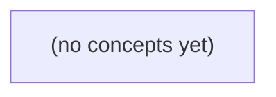

# 11.08 SLO与告警：从用户结果到错误预算与可行动告警

*面向 Go 初学者的静态理论教材，以 S2/v1 的内存受理合同为贯穿案例，逐步建立从用户结果定义 SLI、设定候选 SLO、计算错误预算到设计可行动告警的完整方法。教材通过 S3/v2 与 S5 的未来示例说明成功语义、指标分母和告警不能被偷偷合并或改变，并配套 22 道分层练习与答案。*

**章节:** 2

---

## 本书导览

- 了解整本书的章节脉络
- 掌握各章之间的概念依赖关系
- 选择最合适的阅读顺序

# 11.08 SLO与告警：从用户结果到错误预算与可行动告警

面向 Go 初学者的静态理论教材，以 S2/v1 的内存受理合同为贯穿案例，逐步建立从用户结果定义 SLI、设定候选 SLO、计算错误预算到设计可行动告警的完整方法。教材通过 S3/v2 与 S5 的未来示例说明成功语义、指标分母和告警不能被偷偷合并或改变，并配套 22 道分层练习与答案。

下方的概念图展示了本书 0 个核心概念以及它们之间的依赖关系；再下方是 1 个章节的入口。你可以按从上到下的顺序阅读，也可以根据自己的兴趣或先验知识选择切入点。

#### 概念图

## 章节索引

- **11.08 SLO与告警：从IM用户结果到错误预算** — 面向Go初学者，沿A内存受理与未来B设备确认定义SLI/SLO、预算、消耗速度和可行动告警。

## 11.08 SLO与告警：从IM用户结果到错误预算

- 从用户动作定义可测SLI的分子分母
- 区分S2当前与S3/S5未来确认点
- 解释SLI、SLO与SLA
- 手算错误预算及消耗速度
- 处理低流量/未知/遥测缺失
- 设计可行动告警与预算政策

先以用户可感知的受理结果定义当前服务承诺，再为未来设备确认建立独立指标，避免把技术信号误当送达。

### 从用户动作界定受理成功

### 从用户动作界定受理成功

用户执行“发送消息”后，当前 S2/v1 能承诺的不是“对方已经看到”，而是：服务端已按教学合同校验请求，并将消息接受到内存中的待处理状态，即返回 `200 accepted_in_memory`。这就是当前以用户结果为中心的成功定义。

可将一次发送动作记为请求集合 $R$。SLI 的分母应是所有进入该接口、且用户试图发送消息的有效观测请求，而不是机器 CPU 样本、进程存活次数或仅统计成功响应：

$$
\text{受理成功率}=
\frac{\#\{\text{返回 }200\ \texttt{accepted\_in\_memory}\}}
{\#\{\text{可归因于用户发送动作的请求}\}}
$$

这里“成功”必须同时满足当前合同的可见条件：

- 内容非空，且最多 `6 UTF8B`；
- 原始请求正文最多 `4096B`；
- 同一消息 ID 不重复；重复 ID 返回 `409`；
- 发送者是会话成员；非成员返回 `404`；
- 校验通过后返回 `200 accepted_in_memory`。

因此，`409`、`404` 和内容超限等结果通常是**明确拒绝**：系统给出了可解释的合同结果，但不计入“消息受理成功”的分子。若用户本来发送的是符合约束的消息，却因超时、`5xx`、网络中断或服务故障未获得受理结果，则它既不应被伪装成成功，也应进入失败或未知结果的分析。

尤其要避免把 HTTP `200` 泛化为“已送达”。当前的 `200` 仅证明内存受理；它不证明消息已持久化、已同步到设备，更不证明接收方已展示。未来若引入 `stored_in_teaching_db`，仍应保持与当前受理 SLI 分离；设备应用确认应另建 SLI，不能用 CPU 利用率、队列长度或 HTTP 状态码替代用户真正关心的送达结果。

### 静态教学合同的成功边界

### 静态教学合同的成功边界

当前 S2/v1 的“成功”不是泛指请求返回了 `200`，而是指服务器已按静态教学合同完成校验，并将消息**受理到内存**。可将事件记为：

\[
A=\texttt{accepted\_in\_memory}
\]

只有满足以下前置条件的原始请求，才可能产生 \(A\)：

- 消息内容非空；
- 内容按 UTF-8 编码计算，长度不超过 `6` 字节；注意是字节数，不是字符数。ASCII 字符通常占 1 字节，中文通常占 3 字节；
- 原始请求正文总长度不超过 `4096` 字节；
- 请求中的身份标识未与既有记录冲突；
- 该身份标识属于目标教学关系中的成员。

因此，`200` 且响应语义为 `accepted_in_memory` 才计入当前受理成功。它表示服务已接受该消息进入内存态处理，而不表示设备已经展示、用户已经阅读，甚至不表示消息已持久化。

相反，下列结果必须排除在 \(A\) 之外：

- 空内容、超过 6 个 UTF-8 字节，或正文超过 4096 字节：请求不符合合同；
- 同一身份标识重复提交并返回 `409`：冲突，不是新的受理；
- 非成员返回 `404`：目标关系不成立，不是受理失败后的成功；
- 任意网络层成功、CPU 正常或“接口可达”：这些只是技术信号，不能替代用户可感知的受理结果。

这条边界刻意保持狭窄：当前 SLO 衡量的是“服务是否接受了合法教学消息”，而不是“消息是否最终送达设备”。未来若引入设备应用确认，应另建独立的送达 SLI，不能回溯性地把它混入 `accepted_in_memory`。

### 区分内存受理与设备确认

### 区分内存受理与设备确认

S2/v1 的 `200 accepted_in_memory` 只承诺：服务端已完成请求校验，并将该教学操作放入当前进程内存中的受理路径。对本版本而言，这就是可观测、可测试的用户结果；它不等价于已持久化，更不等价于目标设备已经显示或执行。

未来 S3/v2 提议的 `stored_in_teaching_db` 改变了成功语义：操作已写入教学数据库，可在进程重启后恢复或供后续分发。即使仍保持“非空、最多 6 UTF-8 字节、原始请求正文最多 4096 字节、同 ID 返回 409、非成员返回 404”等合同，数据库写入成功仍不能证明设备已应用。R9 尚待审，因此不能提前把该语义混入 S2 的可用性承诺。

应建立分层 SLI：

- **SLI A：内存受理率**  
  在合法请求中，返回 `200 accepted_in_memory` 的比例。它衡量当前 API 是否按 S2/v1 合同接受教学操作。
- **SLI P：持久化成功率**  
  在 S3/v2 启用后，成功得到 `stored_in_teaching_db` 的比例。它衡量可恢复存储，而非终端效果。
- **SLI B：设备应用确认率**  
  在已受理或已持久化的操作中，目标设备在规定时限内回报“已应用”的比例。它才接近用户所感知的送达结果。

因此，CPU 使用率低、队列无积压或 HTTP `200` 都只能作为诊断信号，不能替代送达 SLI。若设备离线、推送失败或客户端拒绝应用，A 与 P 可以正常，而 B 必须下降；错误预算也应按对应承诺分别消耗。

### 拒绝伪指标与错误归因

### 拒绝伪指标与错误归因

SLI 的样本单位应是一次符合当前教学合同的请求，而不是任意 HTTP 响应、更不是服务器资源曲线。对当前 S2/v1，用户可感知的成功定义为：合法成员提交原始请求正文不超过 `4096B`，内容非空且不超过 `6 UTF-8B`，服务返回 `200 accepted_in_memory`。这只表示请求已被内存受理，**不表示设备已经应用**。

可按结果归类：

- 同一 `ID` 重复提交返回 `409`：这是幂等/冲突语义。若该 ID 先前已经获得 `200 accepted_in_memory`，重复请求不应被重新计入成功分母；若首次请求即因冲突而无法完成其预期操作，应作为客户端请求结果单独观察，而不能伪装成“送达失败”。
- 非成员返回 `404`：调用者不具备该教学对象的成员关系，属于请求前提不成立。它不应进入“有效成员请求的受理成功率”分母；否则身份、权限或路由错误会污染受理 SLI。
- 超出 `6 UTF-8B`、空内容或正文超过 `4096B` 的请求：同样是合同外输入。应监控其发生率以发现客户端缺陷，但不与合同内请求混算。
- HTTP `200`：只有响应语义明确为 `accepted_in_memory` 时，才能计为 A 阶段成功；通用的“200 比例”不能证明消息已被设备看到或应用。
- CPU 正常、队列较短、进程存活：这些是诊断信号，不是用户结果。即使 CPU 为 20%，也可能因成员校验、去重状态或内存受理路径故障而让有效请求失败。

未来若 S3/v2 采用 `stored_in_teaching_db`，仍应保持 `6B` 内容合同，并把存储成功与设备应用确认 B 分成两个 SLI。R9 尚待审时，尤其不能用数据库写入、HTTP 200 或资源健康替代“送达”。

### 为未来合同预留观测接口

### 为未来合同预留观测接口

S3/v2 提议将成功结果表述为 `stored_in_teaching_db`，但它不应悄然改写当前 S2/v1 的承诺：v1 的 `accepted_in_memory` 只表示服务已在内存中受理请求；v2 若获批准，才表示教学数据库已持久化。两者对应不同用户结果、失败模式与 SLI，必须并行命名、隔离统计。

建议为每次请求记录稳定的领域事件，而非只记录 HTTP 状态：

- `message.accepted_in_memory.v1`：满足当前 v1 受理合同。
- `message.stored_in_teaching_db.v2`：仅在 v2 合同生效且写入成功后发出。
- `message.rejected.v1`：附带原因，如 `body_too_large`、`invalid_utf8`、`duplicate_id`、`not_member`。
- `message.persistence_failed.v2`：请求可能已到达服务，但未满足“已存储”结果。

事件应携带 `contract_version`、`request_id`、`message_id`、`result`、`reason` 与时间戳；避免把原始正文写入指标标签或日志索引，以免产生隐私与高基数风险。仪表盘也应按版本拆分，例如：

\[
SLI_{v1}=\frac{\texttt{accepted\_in\_memory.v1}}{\texttt{eligible\_requests.v1}},\qquad
SLI_{v2}=\frac{\texttt{stored\_in\_teaching\_db.v2}}{\texttt{eligible\_requests.v2}}
\]

R9 仍待审时，不应预先将其阈值、错误预算或告警门槛写成生产承诺。可以先采集候选事件、建立仅观察的面板，并明确标注“非 SLO”。待 R9 批准后，再冻结 v2 的合格请求集合、成功事件、排除项及预算策略；若未来还要衡量设备应用确认，则继续建立独立事件和独立 SLI，不能用 `stored_in_teaching_db` 代替送达。

> **要点** — S2/v1 只衡量内存受理；未来存储和设备确认应各自定义 SLI，不能用 HTTP 200、CPU 或内部状态替代用户结果。

先固定用户可感知的S2结果，再用严格分母、观察期限和覆盖标记，把“首发授权是否及时成功”变成可审计的可靠性指标。

### 从用户动作界定S2指标边界

### 从用户动作界定S2指标边界

S2衡量的不是“授权接口是否返回”，而是用户发起一次有效首发授权后，是否及时获得可继续完成业务的成功结果。指标单位应固定为**纸上S2有效首发授权的非重复请求尝试**：同一用户动作因网络重传、客户端重试或网关重复投递产生的后续请求，不额外计数，避免把一次用户失败放大为多次分母。

一次尝试的起点是服务端首次接收到、并完成去重识别的有效授权请求时刻 $t_0$；终点是该尝试收到最终可归因结果的时刻。若从 $t_0$ 起 **2 秒内**收到 `200`，则该尝试为 `good`：

$$
good=\{\text{有效首发授权请求在 }2s\text{ 内收到 }200\}
$$

这里的 `200` 必须代表授权已被系统接受并可供后续流程使用，而非仅表示请求已进入异步队列。用户关心的是“这次授权有没有及时办成”，因此不能用连接建立、请求转发或后台任务创建代替成功结果。

指标描述还应明确边界：仅纳入符合纸上S2前置条件的有效请求；非法参数、资源不存在、冲突等业务结果分别记录，不通过修改分母来美化成功率。这样，S2的每一个计数都能回溯到一次清晰的用户动作及其可验证的最终结果。

### 分子分母与结果分类规则

### 分子分母与结果分类规则

设纸上 S2 的有效首发授权非重复请求集合为 $D$。请求以**发起时刻**进入统计；只要其语义有效、属于首次授权尝试，就不得因最终返回码、超时或诊断困难而从分母移除。

良好结果集合定义为：

$$
G=\{r\in D\mid r\text{ 在发起后 }2\text{ 秒内收到 HTTP }200\}
$$

因此，窗口内可用性为：

$$
A=\frac{|G|}{|D|}
$$

分类必须互斥且可追溯：

- **良好**：2 秒内收到 `200`。
- **不良**：2 秒后才收到 `200`、明确超时、连接中断，或仅能确认请求已发出但最终回应未知。
- **业务/请求结果单列**：`400`、`409`、`404` 分别计数并保留原因标签。它们仍属于 $D$，不能通过“客户端问题”“冲突”或“资源不存在”悄悄挪出分母；在本 SLO 中也不构成良好结果。
- **遥测覆盖不足**：缺失开始时刻、响应时刻或关联标识时，另报覆盖不足数量，不把它伪装成成功，也不无痕删除。

这样，分子只回答“是否及时得到 `200`”，分母则忠实保留用户实际发起的首发授权需求。

### 滚动队列中的归属与观察期限

### 滚动队列中的归属与观察期限

每个有效首发授权请求一旦记录到开始时刻 $t_0$，就按 $t_0$ 归属到对应的 30 日滚动窗口，而不是按收到响应、超时判定或人工补录的时刻归属。这样可避免请求跨日、跨发布窗口时被重复计数，或因延迟响应被挪入“更好看”的后续周期。

但归属不等于立即结算。S2 的观察期限为自 $t_0$ 起 2 秒：

- 在 $t_0+2\text{s}$ 前收到 `200`：结算为 good。
- 在期限内收到 `400`、`409`、`404`：保留为单列业务结果，不计入 S2 分母，也不得改写为 good 或 bad。
- 到达 $t_0+2\text{s}$ 仍无可验证 `200`，包括超时、未知回应、响应关联失败：结算为 bad。
- 尚未到达 $t_0+2\text{s}$ 的请求处于“待观察”状态：已进入按开始时刻排序的滚动队列，但不得提前计入 good、bad 或错误预算消耗。

因此，窗口计算应区分“归属窗口”和“已结算样本”。例如在 12:00 导出报表时，11:59:59.5 发起的请求属于当前 30 日窗口，却仍需暂存至 12:00:01.5 后才能最终结算。若后续出现迟到遥测或关联修复，只能在保留原始 $t_0$ 的前提下复核其结论，并记录结算版本与更正原因；不能改变其窗口归属。

### 无流量与遥测缺失的诚实表达

### 无流量与遥测缺失的诚实表达

“成功率为 100%”并不总表示系统健康。对 S2，有效首发授权非重复请求尝试才进入分母；因此必须区分三种状态：

| 状态 | 含义 | SLI 表达 | 处置 |
|---|---|---|---|
| 无流量 | 观察窗口内有效请求数为 0 | 未定义，而非 100% | 标记“无样本”，不消耗错误预算 |
| 业务失败 | 请求被完整观测，且未在 2 秒内收到 `200` | `bad`，进入分母与错误预算 | 按超时、未知回应等原因告警和排障 |
| 遥测缺失 | 可能有请求，但日志、指标或关联链路不完整 | 覆盖不足，不能据此宣称达标 | 单独监控覆盖率，并触发可观测性告警 |

可将 SLI 写为：

$$
\mathrm{SLI}=\frac{\mathrm{good}}{\mathrm{good}+\mathrm{bad}}
$$

仅当分母大于零且遥测覆盖满足门槛时，才发布该值。若 `good=0, bad=0`，结果应为“未定义”；若网关记录到 100 次请求、S2 结果事件只关联到 80 次，则即使这 80 次全部成功，也只能报告“已观测样本成功率 100%，覆盖率 80%”，不能报告整体 SLO 达标。

`400`、`409`、`404`仍按既定口径单列：它们既不能被塞入成功，也不能借“无流量”或“遥测缺失”悄悄移出分母。这样，错误预算反映真实的用户结果，覆盖指标则暴露“我们是否看得见这些结果”。

### 纸上计算SLO与错误预算

### 纸上计算：把请求队列变成预算账本

设过去 30 日内，按“请求开始时刻”进入观察队列的有效首发授权非重复请求共有 $N=1{,}000{,}000$。其中：

- 2 秒内收到 `200`：$G=998{,}700$，记为良好；
- 超时、未知回应、超过 2 秒才收到 `200`：$B=1{,}000$，记为不良；
- `400`、`409`、`404`：$E=300$，单列为业务或状态结果，不计入本 SLI 分母；
- 遥测缺失：$M=500$，不拿“未记录”冒充成功，应标记覆盖不足。

先核对可审计恒等式：

$$N=G+B=998{,}700+1{,}000=999{,}700$$

这里发现账目不平：原称有效请求 $1{,}000{,}000$，但可分类的有效请求只有 $999{,}700$。差额正是遥测缺失的 300 条，或前述分类口径存在重叠；在修正前，不能宣称 SLI 精确达标。

若确认 $M=500$ 全部属于有效请求，则覆盖率为：

$$\text{覆盖率}=\frac{N-M}{N}=99.95\%$$

仅对已完整分类的请求计算暂定 SLI：

$$\text{SLI}=\frac{G}{G+B}=\frac{998{,}700}{999{,}700}\approx99.9000\%$$

若 SLO 为 30 日内 $99.9\%$，允许不良比例为 $0.1\%$。对分母 $999{,}700$，允许失败量约为：

$$999{,}700\times0.001=999.7$$

即最多约 999 次不良；当前已有 1,000 次，预算已略超支。后续燃尽率、告警阈值应以“当前不良数、允许不良数、剩余观察窗口请求量”为输入，同时附带覆盖不足标记。若窗口内没有有效请求，则分母为 0，SLI 未定义，不应显示为 100%。

> **要点** — 先忠实记录每次有效首发授权的结果与可观测性，再计算SLO和错误预算；不能用改分母美化可靠性。

先厘清指标、目标与协议的边界，才能避免把教学示例误当作生产承诺，并为后续预算与告警设计建立共同语言。

### 从用户结果定义SLI

### 从用户结果定义SLI

SLI（服务等级指标）应从用户可感知的结果出发，而非从“接口返回了 200”“消息进入队列”等内部步骤出发。对即时通信（IM）而言，用户关心的是：发送一条消息后，对方是否在合理时间内收到，或发送端是否得到可解释的失败结果。

可将一次“消息发送尝试”定义为事件单位，并先明确其生命周期：

1. 用户客户端提交消息，携带唯一 `message_id`；
2. 服务端接受并完成必要校验；
3. 消息被路由到目标用户的在线设备，或进入离线存储；
4. 客户端回执、投递状态或明确失败码被记录。

一个教学用的可观测结果型 SLI 可以写为：

- **事件**：一条通过服务端校验、目标为有效用户的消息发送尝试。
- **分母**：统计窗口内所有符合事件定义的发送尝试数。
- **分子**：其中在规定时限内达到“成功结果”的尝试数，例如发送端收到“已接受且可投递”的确认，或目标在线设备返回应用层 ACK。
- **SLI**：  
  $$\mathrm{SLI}=\frac{\text{规定时限内成功的消息数}}{\text{全部符合条件的消息发送数}}$$

关键不在公式，而在边界。应明确排除哪些情况：用户主动取消、非法请求、被风控拒绝、目标账号不存在，通常不应与系统投递故障混为一谈；但服务端超时、路由失败、持久化失败、ACK 丢失等，则应按定义计入失败。

统计窗口还要同时说明时间语义：按消息创建时间、服务端接收时间还是最终结果时间归属。实践中常按服务端接收时间归属，并等待足够的迟到事件补齐。这样得到的 SLI 才能稳定回答一个用户问题：**我发出的、系统应处理的消息，有多少获得了预期结果？**

### SLI、SLO与SLA的责任边界

### SLI、SLO与SLA的责任边界

**SLI**（服务等级指标）回答“实际发生了什么”：它是可观测、可计算的度量，例如 IM 消息从服务端接受到用户设备确认接收的成功比例、端到端延迟分位数，或请求错误率。SLI 必须先定义事件边界、统计窗口、数据来源与排除规则；不能测量，就不能据此承诺。

**SLO**（服务等级目标）回答“我们希望做到什么”：它为某个 SLI 设定内部目标和时间窗口，例如“30 日内，消息投递成功率达到 99.9%”。这只是待评审的教学目标 S2，不等同于已批准的生产承诺。目标应经业务价值、实现成本、测量可信度与目标门共同权衡；过高会挤压功能迭代，过低则损害用户体验。

**SLA**（服务等级协议）回答“未做到会怎样”：它是对客户或合作方的正式约定，除指标与目标外，还必须明确适用范围、责任主体、例外条件、核算方式及违约后果，如服务抵扣、赔偿或退出权。SLA 通常以 SLO 为输入，但不能把内部 SLO 直接复制为合同条款。

三者关系可概括为：`SLI 是尺子，SLO 是内部及格线，SLA 是带后果的对外承诺`。它们不可互相替代：没有 SLI，SLO 无法验证；没有业务批准，SLO 不应升级为 SLA；有 SLA 也不能省略内部更细粒度的 SLI 与告警。未来 S5 若针对“在线且有权目标设备在 60 秒内应用 ACK”设定 99% 示例，也应先确认该口径是否可稳定测量，再决定是否成为正式目标。

### S2教学目标为何仍待评审

### S2教学目标为何仍待评审

“30日内存受理率达到 $99.9\%$”可以作为 S2 的教学目标，用于练习 SLI、错误预算和告警推导；但它尚不等于已经批准的生产 SLO，更不是对客户作出的 SLA 承诺。

首先，目标必须接受业务权衡。$99.9\%$ 在 30 天窗口内意味着约允许 $0.1\%$ 的受理失败：若月请求量为 $1{,}000{,}000$，预算约为 $1{,}000$ 次失败。业务需要确认：这些失败会造成什么用户后果？高峰期、关键客户、付费交易是否应使用更严格的目标或独立保护策略？更高目标通常意味着更多冗余、容量和运维成本，不能只因数字“看起来可靠”就采纳。

其次，必须验证测量可行性。“内存受理”应有可审计的事件边界：请求何时开始计入、哪些结果算成功、超时和重复请求如何处理、监控数据是否覆盖全部流量。若 SLI 数据本身不完整，$99.9\%$ 只是精确外观下的不确定结论。

最后，目标需要通过目标门批准：明确服务负责人、业务负责人、测量口径、适用范围、评审周期及违反目标后的处置方式。批准前，S2 的数值只能用于教学和方案讨论；不得据此宣称生产承诺、配置刚性升级规则，或写入客户协议。

### 未来确认点采用独立目标

### 未来确认点采用独立目标

S2衡量的是“系统是否受理请求”：消息进入服务、通过校验并被持久化或进入后续处理链路即可计入成功。它回答的是**平台有没有接住这次操作**，不等于用户或目标设备已经看见、理解或执行了消息。

S3、S5则引入更靠后的确认点：

- S3可表示消息已由下游通道接受或已送达某个中间节点；
- S5表示“在线且有权的目标设备”在60秒内返回**应用确认**，即目标应用实际处理并确认该消息；
- S5失败可能来自设备离线、网络抖动、推送链路、客户端版本、权限状态、应用处理失败或确认回传丢失。

因此，不能把S2的30日`99.9%`教学目标直接延伸为S5也必须达到`99.9%`。两者的分母、失败域、可控边界和业务含义均不同：S2主要受服务端受理链路影响；S5还暴露端侧与外部网络的不确定性。若强行共用目标，会把不可控端侧波动误判为核心受理服务失效，导致错误预算和告警噪声失真。

在未来具备可靠在线状态、授权判定与端到端确认关联后，可为S5单独定义示例目标：在符合“在线且有权”资格条件的请求中，`99%`应在60秒内获得应用确认。其成功率可写为：

$$
SLI_{S5}=\frac{\text{60秒内收到应用确认的合格请求数}}{\text{在线且有权的合格请求总数}}
$$

`99%`只是待业务、测量能力与目标门评审的教学示例；它既不是S2目标的推论，也不是已批准的生产SLO，更不是对外SLA。

### 把目标转化为预算政策

### 把目标转化为预算政策

正式 SLO 不是写成“30 天内达到 99.9%”就结束，而要把目标转成可计算、可审计、能触发决策的错误预算政策。若某项已批准目标为：

\[
\mathrm{SLO}=99.9\%,\quad W=30\text{ 天}
\]

则预算比例为：

\[
B=1-\mathrm{SLO}=0.1\%
\]

但预算消耗的分母必须先定义清楚。对 IM 结果，应以“可判定的用户交互结果”为单位，而非仅以服务端请求数为单位：

\[
\mathrm{预算消耗率}=
\frac{\mathrm{失败结果}+\mathrm{按政策计入的未知结果}}
{\mathrm{可判定结果}+\mathrm{按政策计入的未知结果}}
\]

低流量服务尤其不能只看百分比：30 天仅有 20 次操作时，1 次失败就是 5%，统计波动远大于日常运行信号。此类场景应同时规定最小样本量、滚动窗口和绝对失败上限，例如“样本不足时不据此判定 SLO 达标，但连续出现 2 次用户可见失败必须人工复核”。

未知结果不能默认当成功。客户端超时、回执丢失、链路中断可能意味着“未送达”，也可能只是“结果未被观测到”。政策应明确：

- 有服务端成功证据但缺少客户端 ACK：标为未知，单列观测缺口；
- 无任何完成证据：按失败或保守未知计入；
- 遥测缺失率超过阈值：暂停“达标”结论，并触发监控修复，而非用缺失数据稀释失败率。

预算的价值在于治理动作。可设置分级门槛：预算消耗超过 25% 时复盘异常；超过 50% 时冻结高风险变更并提高发布审查；接近耗尽时优先修复可靠性债务、限制功能发布。这样，SLO 才从纸面数字变成兼顾用户结果、数据可信度与工程决策的运行政策。

> **要点** — SLI测量用户结果，SLO指导内部取舍，SLA规定外部后果；S2与S5应按确认语义分别设定并经评审批准。

用两类用户结果分别核算分子、分母与错误预算，避免把表面成功率误判为SLO达标。

### 先按用户承诺拆分机会集合

### 先按用户承诺拆分机会集合

同一条 IM 消息可能经历“服务端受理”和“设备确认”两个阶段，但它们对应的用户承诺不同，不能用一个总成功率混算。

- **承诺 A：内存受理。** 用户点击发送后，系统承诺在规定时间内接受该消息并完成持久化或进入可靠处理链路。其机会集合是“本应被服务端受理的发送请求”；合格条件可定义为：在时限内返回受理成功，且消息具有可恢复的处理记录。
- **承诺 B：设备确认。** 对需要送达确认的场景，系统承诺目标设备在规定窗口内确认收到或展示消息。其机会集合是“已具备投递资格、且目标设备应参与确认的消息”；合格条件是：目标设备在窗口内产生有效确认。

两类机会的分母天然不同。离线设备、未注册推送能力、用户主动取消、超出确认窗口后才上线等，可能影响 B 的可测资格，却不应回溯改变 A 是否受理成功。

因此，指标应分别写成：

\[
\mathrm{SLO}_A=\frac{\mathrm{A合格机会}}{\mathrm{A有效机会}},\qquad
\mathrm{SLO}_B=\frac{\mathrm{B合格机会}}{\mathrm{B有效机会}}
\]

不要将 A 的大量成功请求与 B 的少量确认结果相加后再计算“总体成功率”。这种合并会掩盖某一承诺的失败，也会把两个独立的错误预算错误地互相抵销。只有先把机会集合、合格条件、排除规则和观测窗口逐项写清，后续的预算消耗与告警才有可解释性。

### 首发SLO：99.5%为何仍不达标

### 首发SLO：99.5%为何仍不达标

设统计窗口内有 $100000$ 次“首发机会”：每次机会只有在用户实际看到首条有效结果、且满足时延与正确性要求时，才记为合格。

本窗口中：

- 合格首发：$99500$
- 不合格首发：$500$
- 总机会数：$100000$

实际合格率为：

$$
\frac{99500}{100000}=99.5\%
$$

表面上看，99.5% 已经很高；但若首发 SLO 是 **99.9%**，判断标准不是“成功率是否接近 100%”，而是失败是否仍在错误预算内。

99.9% 的目标意味着最多容忍：

$$
100000\times(1-99.9\%)=100
$$

即该窗口的错误预算只有 $100$ 次不合格首发。当前已经发生 $500$ 次失败，因此：

$$
500-100=400
$$

错误预算超支 $400$ 次。换言之，500 次失败对应的失败率是 $0.5\%$，而 SLO 最多允许 $0.1\%$；实际失败量是允许值的 5 倍。

因此，“99.5% 成功率”不等于“99.9% SLO 达标”。前者描述观测到的比例，后者是明确的服务承诺与预算约束。只要失败次数超过预算，即使绝大多数用户成功，也应判定该窗口首发 SLO 未达标，并据此触发限流发布、排查链路或收紧告警等动作。

### 未来确认SLO独立核算

### 未来确认SLO独立核算

“未来设备确认”是另一类用户结果，必须使用它自己的机会数、合格判定和SLO目标核算，不能借用首发机会的分母或剩余预算。

设统计窗口内共有 $1000$ 次设备确认机会，其中：

- 合格确认：$985$ 次；
- 失败或不合格确认：$15$ 次；
- 目标SLO：$99\%$。

实际合格率为：

$$
\frac{985}{1000}=98.5\%
$$

因此，虽然看起来只比目标低 $0.5$ 个百分点，但它已不满足 $99\%$ 的确认SLO。

错误预算由目标反推：

$$
1000\times(1-99\%)=10
$$

即该窗口最多允许 $10$ 次不合格确认。实际发生 $15$ 次失败，错误预算超支为：

$$
15-10=5
$$

也可直接从合格次数验证：要达到 $99\%$，至少应有

$$
1000\times99\%=990
$$

次合格确认；实际只有 $985$ 次，恰好少了 $5$ 次。

这里的“超支5次”只属于设备确认SLO。即使首发机会的成功率较高、甚至仍有可用错误预算，也不能抵消确认链路的这5次超支。不同用户旅程对应不同分母和承诺：首发看首发机会，确认看确认机会；告警与治理动作也应依据各自预算状态触发。

### 不能合并分母的原因

### 不能合并分母的原因

首发机会与未来设备确认虽然都可表示为“成功/失败”，却不是同一种服务承诺，必须分别计算：

- **触发时点不同**：首发发生在用户首次请求或关键流程启动时；未来确认发生在设备后续上报、同步或确认时。前者失败往往立即阻断体验，后者失败则可能造成状态滞后或结果不一致。
- **用户影响不同**：首发失败意味着“此刻不可用”；未来确认失败意味着“之后未兑现”。两类失败的严重性、补救路径和告警优先级并不相同。
- **样本规模不同**：纸上首发有 $100000$ 次机会，目标为 $99.9\%$，允许坏结果为 $100$。若实际为 $99500$ 个好结果、$500$ 个坏结果，则错误预算超出 $400$，即使表面成功率仍有 $99.5\%$，也已违约。
- **目标值不同**：未来 $1000$ 次设备机会的目标是 $99\%$，允许坏结果仅 $10$。实际 $985$ 好、$15$ 坏，错误预算超出 $5$，同样违约。

若把两类分母合并，得到的是 $100485/101000$ 的总体成功率，约为 $99.49\%$。这个数字既无法回答首发是否满足 $99.9\%$，也无法回答未来确认是否满足 $99\%$；更糟的是，大样本首发会掩盖小样本未来确认的持续失败。SLO、错误预算和告警都应按各自用户结果独立核算。

### 从预算超支到可行动告警

### 从预算超支到可行动告警

两类用户结果必须分别建立错误预算账本，不能用合并后的成功率掩盖局部失效。

- **即时通信首发机会**：$100000$ 次机会、SLO 为 $99.9\%$，预算为 $100$ 次失败。若实际为 $99500$ 次成功、$500$ 次失败，则预算消耗为 $500\%$，已超支 $400$ 次；即使表面成功率为 $99.5\%$，也不能宣称达标。
- **未来设备机会**：$1000$ 次机会、SLO 为 $99\%$，预算为 $10$ 次失败。若 $985$ 次成功、$15$ 次失败，预算消耗为 $150\%$，超支 $5$ 次。它的分母、目标和风险均独立于即时通信，不能与前者相加后“平均”。

告警不应只盯住“是否超标”，还要观察预算的**消耗速度**。例如，月度预算尚未耗尽，但过去 1 小时已消耗掉本月预算的 $30\%$，说明故障正在快速扩散，应触发排障告警；若短时间内耗尽预算，则升级为事件响应，并考虑暂停高风险发布、切换降级路径或限制非关键功能。

低流量场景要避免少量失败造成误判：设备机会只有几次时，可结合最小样本量、较长观察窗口和绝对失败数告警。对于超时、埋点缺失、状态无法判定的请求，应单独统计“未知”，并明确策略：未知比例过高时触发数据质量告警；不能默认把未知都算成功。这样，告警才能对应明确动作：查故障、修观测、降级服务，或暂停发布。

> **要点** — SLO达标看的是各自机会集合中的预算是否耗尽；不同确认点不能用合并分母相互掩盖。

本节用纸上算例建立错误预算与消耗速度的直觉，并说明为何告警必须结合时间窗口、流量条件和后续确认状态。

### 从用户机会定义好与坏

### 从用户机会定义好与坏

错误预算的前提不是先选百分比，而是先定义一次“用户机会”。对即时通信而言，可将“用户点击发送并由服务端接受的一条消息”记为一次机会；它比单个接口请求更接近用户真正关心的结果。

设在统计窗口内：

- $N$：符合范围的发送机会总数，即 SLI 分母；
- $G$：按约定成功完成的机会数；
- $B$：坏结果数，通常 $B=N-G$；
- 成功率：$SLI=G/N=1-B/N$。

“接受”必须有明确边界。例如，客户端获得服务端确认、消息拥有唯一标识且进入可靠处理链路，才进入分母；用户取消、格式校验失败、被策略明确拒绝的发送，是否计入分母要由产品语义决定，不能事后按告警需要调整。

坏结果也不能只等同于 HTTP 5xx。一次发送可被判坏的情形包括：服务端未在约定时间内确认、确认后最终未投递给目标会话、消息丢失、重复造成用户可见异常，或端到端延迟超过目标阈值。相反，离线收件人导致的合理延后，不应未经区分地算作失败。

还要处理“尚未知道结果”的机会。刚发送的消息可能仍在等待投递回执，不能立刻既算好也算坏。实践中可设置观察宽限期：未到期者记为待定，暂不进入最终成功/失败统计；到期仍无完成证据，再按坏结果或“延迟补报”规则结算。这样，分母、分子与补报口径才能在窗口结束后保持可复算。

### 99.9%目标与错误预算

### 99.9%目标与错误预算

设一个面向用户结果的成功率指标为：

\[
\mathrm{SLI}=\frac{\text{成功结果数}}{\text{已判定结果总数}}
\]

若目标是在一个统计周期内达到 $99.9\%$ 成功率，则：

\[
\mathrm{SLO}: \mathrm{SLI}\ge 99.9\%
\]

其互补部分就是允许的坏结果比例：

\[
1-99.9\%=0.1\%=0.001
\]

因此，周期内共有 $N$ 个已判定结果时，错误预算为：

\[
B=N\times 0.001
\]

例如一小时内有 $1000$ 次可判定机会，则允许约 $1$ 个坏结果；若出现 $10$ 个坏结果，实际坏结果率为 $1\%$，是预算比例的 $10$ 倍，即纸面上的 $10\times$ 消耗速度。这里的“坏结果”必须预先定义，例如消息未送达、被错误拒绝，或超过用户可接受的完成时限。

需要区分三个概念：

- **SLI**：实际测量值，如“已确认成功的即时消息占全部已判定消息的比例”。
- **SLO**：内部可靠性目标，如“滚动 30 天成功率不低于 $99.9\%$”，以及对应的 $0.1\%$ 错误预算。
- **SLA**：对外承诺，通常包含适用范围、统计口径、例外条款与补偿责任；它不能仅把内部 SLO 原样公布。

错误预算不是“可以随意失败的额度”，而是帮助团队权衡可靠性投入、发布风险与告警优先级的共同尺度。上述 $1000$ 次、$10$ 个坏结果的计算仅用于建立数学直觉；生产环境是否触发页面告警，还必须结合短长窗口、最小流量、持续时间，以及结果是否仍在等待确认或可能延迟补报。

### 一小时千次机会的消耗速度

### 一小时千次机会的消耗速度

设某即时通信用户结果的成功目标为 $99.9\%$，则允许的坏结果比例为：

$$
1-99.9\%=0.1\%
$$

现在只做一段纸上演算：一小时内共有 $1000$ 次可计量机会，例如消息投递、会话建立或关键操作确认；其中 $10$ 次最终被判为坏结果。则该小时的实际失败率为：

$$
\frac{10}{1000}=1\%
$$

这 $1\%$ 并不只是“比目标差一点”。相对于允许的 $0.1\%$ 坏结果预算，它的消耗速度为：

$$
\text{消耗速度}=\frac{1\%}{0.1\%}=10
$$

也就是说，系统在这一小时内以 **10 倍错误预算消耗速度** 运行：若这种水平持续，原本可覆盖较长周期的坏结果额度会快得多耗尽。

也可从次数理解：$1000$ 次机会按 $0.1\%$ 预算本应只允许约 $1$ 次坏结果；实际发生了 $10$ 次，相当于用了十倍于该时段应有份额的预算。

这个算例只用于建立数学直觉，不能据此直接设定生产环境的呼叫告警。真实告警还必须结合短、长时间窗口、最小流量门槛，以及“仍在等待完成”或“延迟补报”的结果如何处理。

### 短长窗口与可行动告警

### 短长窗口与可行动告警

短窗口擅长发现突发恶化，长窗口用于判断问题是否持续。两者结合的目的不是“更灵敏地报警”，而是减少瞬时抖动、单个异常请求或短暂流量尖峰造成的无效分页。

例如，SLO 为 99.9%，允许失败比例为 $0.1\%$。纸上假设某小时有 1000 次计入 SLI 的机会，则预算约为 1 次失败；若实际出现 10 次失败，即失败率 $1\%$，相当于以约 $10\times$ 的速度消耗错误预算。这只是在给出消耗速度的直觉：$1\% / 0.1\%=10$，并不意味着“达到 10 倍就必须自动呼叫值班人员”。

一个可行动的告警通常同时要求：

- **短窗口越界**：如最近 5 分钟错误率明显升高，及时捕捉正在发生的用户影响。
- **长窗口确认**：如最近 1 小时仍处于较高消耗速度，排除一分钟抖动或局部偶发故障。
- **最小流量条件**：低流量时，分母很小甚至为 0，错误率可能无意义；应要求足够的有效机会数，或改用更长观察期。
- **状态可确认**：请求仍在等待、异步任务尚未完成、日志或结果会延迟补报时，不能过早将其判为失败；指标与告警应明确“未完成”“最终成功”“最终失败”的归属。

因此，分页阈值还应结合剩余预算、预计影响时长、修复动作和人工响应能力设定。只有告警触发后确实存在明确操作——排障、降级、回滚、扩容或升级事故——它才是可行动告警。

### 低流量、未知状态与未来确认

### 低流量、未知状态与未来确认

低流量下，窗口内可能没有任何可计入的 IM 操作，此时 $N=0$，SLI 的 $\frac{\text{bad}}{N}$ 并非“0% 错误”，而是**未定义**。告警应将其视为“证据不足”：不燃烧错误预算、不因表面成功而恢复告警；可设置最小样本量或最小请求量门槛，并用更长窗口补充判断。

遥测缺失则不同。请求本应进入分母，但客户端埋点、链路日志或聚合任务丢失，导致结果不可观测。若直接剔除，会把未知伪装成成功；若一律计为失败，又可能把监控故障放大为用户故障。较稳妥的做法是分别维护：

- **用户结果 SLI**：只对可判定请求计算成功或失败；
- **可观测性 SLI**：监控应到数据与实到数据之比，缺失单独告警；
- **覆盖率门槛**：覆盖率过低时冻结用户 SLI 的“健康”结论，并转入人工或降级策略。

等待 B 设备确认的消息也不能立即标为成功或失败。发送已受理但确认未到，应处于“待定”状态；超过约定确认时限后，才按产品语义计入失败、超时或未知。确认随后到达时，应以事件时间回填原窗口，保留修订记录，而不是把它算作当前窗口的新成功。

因此，延迟补报会使历史 SLI 变化。告警策略通常区分“初始快照”和“最终结算”：短窗口可对已确认失败快速提示，长窗口在允许补报的水位线后再评估是否真正消耗预算。这样既避免把等待误报为故障，也避免用尚未完成的数据过早解除风险。

> **要点** — 错误预算衡量容许坏结果；消耗速度必须结合窗口、流量、确认状态和响应能力设计告警。

告警应先回答“用户是否受影响”，再用CPU、队列等资源指标解释原因。围绕A受理与未来B设备确认分别定义症状告警，才能让值班响应真正可行动。

### 从用户动作拆分两类坏事件

### 从用户动作拆分两类坏事件

一条“发送消息”不能只用一个成功率概括。用户至少经历两段结果：服务是否已经受理消息，以及目标设备是否在后续时间内确认收到。因此应拆成两类坏事件，并分别计算分子、分母和确认边界。

- **A：内存受理坏事件**  
  起点是用户提交一条具备有效身份、会话权限和格式的发送请求。若系统在同步受理窗口内未能确认消息已写入可恢复的内存态或持久化入口，则记为 A 坏事件。  
  - 分母：所有通过鉴权、允许发送且到达受理服务的有效发送请求。  
  - 分子：超时、5xx、明确拒绝写入、写入结果未知，或在确认窗口结束前未获得“已受理”证据的请求。  
  - 确认边界：以服务返回受理确认、消息标识和可查询的受理记录为准，而非仅以 HTTP 连接建立或请求到达负载均衡器为准。  
  - 不计入：越权访问导致的 401/403、资源不存在导致的预期 404、客户端主动取消等非系统承诺失败。

- **B：未来设备 ACK 坏事件**  
  A 成功只表示系统接住了消息，不表示设备已收到。对每个应投递的目标设备，在约定的未来窗口 $T$ 内未获得有效 ACK，记为 B 坏事件。  
  - 分母：已被 A 受理、路由规则判定应投递，且目标设备在该消息时刻具备可投递资格的设备投递单元。  
  - 分子：在 $T$ 内无 ACK、ACK 明确失败、投递链路终止，或无法判断是否 ACK 的投递单元。  
  - 确认边界：ACK 必须能关联到消息标识、目标设备和投递尝试；推送请求返回成功不等于设备 ACK。离线设备应按产品承诺选择延迟计入、排除或进入独立离线指标。

两类事件的核心区别是：A 衡量“系统有没有接住用户动作”，B 衡量“用户未来能否在设备上看到结果”。遥测缺失时不能把未知归为成功；应将其视为不可确认事件，避免监控表面绿色而用户结果已经失真。

### 用确认点避免把未来问题当当前成功

### 用确认点避免把未来问题当当前成功

同一条 IM 请求至少经过三个不同的确认点，不能用前一阶段的成功替代后一阶段的用户结果：

| 确认点 | 表示什么 | 对用户的承诺 | 应归属的告警 |
|---|---|---|---|
| S2 当前受理 | 服务已校验请求、完成鉴权并持久化可处理的消息意图 | “系统已接收，不会因进程退出而直接丢失” | A 受理坏事件 |
| S3 投递处理 | 消息已被消费者取出并执行路由、扇出或下游投递 | “系统正在推进消息” | 队列积压、消费失败等诊断或阶段性告警 |
| S5 设备确认 | 目标设备返回 ACK，或在定义窗口内得到等价确认 | “该设备已实际收到/确认消息” | B 设备 ACK 坏事件 |

S2 成功只能证明“现在已受理”，不能证明“未来会到设备”。例如，接口返回 `202` 后，消费者停滞、推送通道失效或设备离线，S2 仍是成功；此时若把受理成功计入送达成功，会把未来失败错误地涂成当前绿色。

因此，A 告警的分母应是进入受理判定的合法请求，分子是未在受理确认点完成、超时或内部失败的请求；越权 `404`、参数非法等预期业务拒绝不应计为系统失败。B 告警则以需要设备确认的投递目标为分母，以确认窗口内未获 ACK 的目标为分子。若 ACK 遥测缺失，分母或分子不可验证，应进入“未知/遥测故障”，而非显示绿色。

值班责任也随确认点变化：S2 告警由接入与持久化链路 owner 止损；S3 用 CPU、队列年龄和消费延迟定位阻塞；S5 由投递与终端链路 owner 判断重试、降级或升级。这样，告警报告的是已违背的用户承诺，而不是过早宣布的成功。

### 为每条症状告警补齐行动信息

### 为每条症状告警补齐行动信息

症状告警不是“某个指标超过阈值”的通知，而是一张可执行的事件卡：值班人员收到后，应能判断谁受影响、先看哪里、如何止损、何时结束或升级。

每条告警至少明确：

- **负责人与级别**：指定主责团队、值班角色及严重级别。例如“消息接入组，P1”；避免告警发出后再寻找归属。
- **用户影响**：用用户结果描述，如“IM 用户发送请求无法被 A 受理”或“已受理消息未获得未来 B 设备 ACK”，而非“CPU 过高”。
- **确认点与时间窗**：写清结果在哪个事件上判定、统计多长时间。例如“以 `A_accepted` 为确认点，滚动 5 分钟”；ACK 则需给出允许延迟，如“受理后 10 分钟内未见 `B_ack`”。
- **分子与分母**：分子是坏事件，分母是应服务的有效事件。越权 `404`、被策略拒绝的请求不应计入系统失败；但缺少事件、链路或标签遥测时，分母不可证实，状态必须为未知或告警，不能报绿。
- **证据入口**：附上查询链接、追踪检索条件、仪表盘和日志字段，例如按 `request_id` 串联受理、投递与 ACK 事件。
- **止损动作**：说明先执行什么，如切流、降级为本地确认、暂停高风险发布、扩容消费者或限制重试风暴。
- **停止或升级门**：定义何时关闭、何时升级。通常要求错误率恢复且持续一个观察窗，并确认积压回落；若超过指定时长、影响面扩大或证据缺失，则升级至相关服务负责人和事件指挥。

CPU、队列深度、重试率应作为诊断附证：它们帮助解释“为什么坏”，但不能替代“用户是否已经坏”的症状判定。

### 将错误预算转成消耗速度告警

### 将错误预算转成消耗速度告警

设某用户结果 SLO 为：30 天内成功率不低于 $99.9\%$。则允许失败比例为

$$
B=1-99.9\%=0.1\%=0.001
$$

若观测窗口为 $30$ 天，错误预算可支撑的“平均失败速度”就是 $B$；实际失败率为 $e$ 时，消耗速度（燃烧率）为：

$$
R=\frac{e}{B}
$$

$R=1$ 表示恰好按月度预算均匀消耗；$R>1$ 表示将提前耗尽预算。比如短窗 1 小时内，A 受理请求 $10{,}000$ 次、坏事件 $80$ 次，$e=0.8\%$，则：

$$
R_{\text{1h}}=\frac{0.8\%}{0.1\%}=8
$$

这意味着若持续该速度，30 天预算约在 $30/8=3.75$ 天耗尽。再看长窗 6 小时：共 $50{,}000$ 次、坏事件 $100$ 次，$e=0.2\%$，故 $R_{\text{6h}}=2$。短窗高、长窗也高，说明不是瞬时抖动，应触发较高等级响应。

可按“双窗同时满足”分级：

- **紧急**：$R_{\text{1h}}\ge 14.4$ 且 $R_{\text{6h}}\ge 6$，快速止损；确认点为坏事件分子、合格请求分母及用户影响样本。
- **高优先级**：$R_{\text{6h}}\ge 6$ 且 $R_{\text{3d}}\ge 1$，由服务 owner 排查并设升级时限。
- **预警**：$R_{\text{1d}}\ge 1$ 且 $R_{\text{3d}}\ge 1$，安排修复，避免慢性耗尽。

A 受理坏事件与未来 B 设备 ACK 坏事件分别计算 $e$、$R$，不可混合稀释。CPU、队列仅作为诊断证据入口；分母缺失、延迟或遥测断裂时不得显示绿色，应进入“不可判定”并升级补齐观测。

### 处理拒绝、低流量与缺失遥测

### 处理拒绝、低流量与缺失遥测

以“用户请求失败率”告警时，必须先划清哪些结果属于系统失败。**越权访问返回的 404 不应计入失败分子**：它表示系统按权限边界正确拒绝请求，而非服务不可用。分母可定义为已进入 A 受理链路的合法或可验证请求；分子仅包含超时、5xx、合法请求的异常 4xx、处理结果丢失等坏事件。若身份、租户或权限判定本身异常，则应另建“鉴权判定异常”症状告警，不能借 404 掩盖问题。

低流量场景不能只看比例。例如 1 次请求失败即为 $100\%$，却未必需要最高级别页面告警。每条规则应同时设置：

- **比例门**：如 10 分钟失败率 $>2\%$；
- **样本门**：如窗口内合法请求数 $\ge100$；
- **绝对坏事件门**：如 10 分钟失败数 $\ge10$，用于小流量但真实可见的连续失败；
- **持续门**：连续两个窗口满足才升级，避免单次偶发事件。

“没有失败数据”不等于“系统健康”。当请求、确认、日志或指标上报链路缺失时，状态应为**未知**，不得显示绿色。应单设遥测完整性告警：例如 A 受理计数中断、B 设备 ACK 指标停更、追踪覆盖率低于阈值。其确认点是“监控数据是否仍能证明用户结果”，而非仪表盘是否没有红线。未知状态的止损措施通常是切换到原始日志、合成探测或抽样核对；若证据入口也不可用，则升级至监控平台或数据管道 owner，并暂停基于该指标的“健康”结论。

> **要点** — 以用户症状和确认点定义告警；预算告警负责驱动行动，资源指标仅作为诊断证据。

错误预算是业务容忍度的量化表达，不是自动生效的行政承诺；其价值在于把用户影响、发布风险与可靠性投入纳入同一决策框架。

### 从用户容忍度确定预算边界

### 从用户容忍度确定预算边界

SLO 的起点不是“系统理论上能做到多高可用”，而是用户对失败、延迟和不一致的实际容忍度。产品负责人应说明：哪些动作失败会阻断核心任务，用户在多长时间内会放弃、投诉或转向替代路径；SRE 则将这些影响转化为可观测的 SLI、统计窗口和目标值。例如，若用户成功发送消息是核心结果，可约定月度成功率为 $99.9\%$，则 30 天内允许的失败预算约为 $0.1\%$，即每千次用户可感知发送中最多容忍一次失败。

协商时应区分不同后果：可重试的瞬时失败、消息最终未送达、发送成功但接收端不可见，不能共用一个模糊的“接口成功率”。`send.go` 调用 `MsgToMQ` 成功，或 Mongo 消费成功，只证明链路中的局部步骤完成；它们不能单独证明用户完成了“消息可见、可读取”的真实结果 SLO。分母、成功点、去重规则和超时边界必须在评审中写清。

预算耗尽后的政策也应预先确定：可以限制高风险发布、冻结功能变更，或将工程容量优先投入可靠性修复；同时明确决策负责人、复核周期和紧急例外。错误预算是风险决策依据，不是纸面上的自动行政承诺。版本从 S2 迁移到 S3 时，不得无标记地改变 SLI 分母或成功判定点；R9 未获批准前，v1 的定义与目标不得被悄然改写。

### 预算耗尽后的决策政策

### 预算耗尽后的决策政策

错误预算的意义不在于“剩余多少”，而在于预先约定：当用户可容忍的失败被消耗到不同程度时，团队如何改变决策。政策应由产品、研发与SRE共同确认，并明确它是风险控制机制，不是脱离业务情境的自动行政禁令。

可采用分层阈值：

- **预算充足**：正常发布，常规监控与复盘；高风险变更仍需完成灰度、回滚和容量评估。
- **预算预警**：例如预算消耗达到 $50\%$。负责人应检查主要失败来源，冻结非必要的高风险实验，提升可靠性事项优先级。
- **预算紧张**：例如消耗达到 $80\%$。新增功能发布需经指定负责人批准；优先修复影响核心用户路径的缺陷，并评估降级、限流与回滚预案。
- **预算耗尽**：暂停或严格限制会扩大风险的发布，将工程能力优先投入故障修复、根因治理、监控补齐和容量恢复。恢复发布前，应验证SLI已稳定回归，而非仅等待统计窗口刷新。

政策至少应写清四项：谁拥有预算解释权，谁可批准例外，例外的有效期与补偿措施，以及出现分歧时升级到谁。例如，产品负责人可基于明确商业窗口申请一次性例外，SRE负责说明风险和观测条件，最终由共同指定的技术与业务负责人裁决。

尤其不能把“纸面上有错误预算”等同于“必然允许继续发布”。若当前故障集中影响付费用户、关键会话或安全相关路径，即使预算尚未耗尽，也可能需要提前收紧发布；反之，紧急安全修复可在预算耗尽后走受控例外流程。政策约束的是决策质量，而不是用单一百分比替代判断。

### 例外机制与责任归属

### 例外机制与责任归属

错误预算政策不能只写“耗尽后限制发布”。它必须回答：**谁能批准例外、在什么条件下批准、持续多久、如何补偿、何时复盘**。否则预算要么被机械执行，阻塞必要修复；要么被口头豁免，沦为纸面规则。

建议将例外申请绑定明确责任链：

- **审批人**：产品负责人确认业务收益与用户容忍度，SRE/可靠性负责人确认技术风险；高风险例外应由双方共同批准。
- **适用条件**：例如安全漏洞修复、法定合规、严重数据风险、不可延期的客户承诺。单纯“赶版本”不应自动构成理由。
- **期限与范围**：写明允许的发布窗口、涉及服务、可接受的额外风险，禁止无限期“临时例外”。
- **补偿措施**：要求灰度发布、回滚预案、强化监控、值班覆盖、冻结其他高风险变更，或在后续周期优先偿还可靠性债务。
- **复盘要求**：例外结束后检查实际用户影响、预算变化、措施是否有效，并更新阈值或政策。

责任归属还应覆盖指标变更。若从 S2 迁移到 S3，不能无标记地修改 SLI 分母或成功点来“恢复”预算；R9 未批准前，v1 的口径不得改变。固定 `send.go` 中 `MsgToMQ` 与 Mongo 消费两段，只能证明局部链路存在，不能据此宣称真实用户 SLO 已满足。任何例外都应保留可审计记录，避免以技术叙述替代用户结果。

### 版本迁移不得悄然改变承诺

### 版本迁移不得悄然改变承诺

S2 以“服务进程已在内存中受理请求”为成功点，适合衡量接入层可用性；但它不等于消息已进入队列、已持久化，更不等于接收方可见。S3 可将成功点推进到“消息已写入 MQ 并获得确认”，S5 则可能进一步要求“Mongo 消费完成、状态可查询”或“接收端实际可见”。成功点越靠后，越接近用户结果，但依赖链路也越长、失败归因越复杂。

迁移不能把 S2 的名称保留、却在实现中偷偷改成 S3 或 S5。这样会同时改变：

- **SLI 分母**：原先计入的是 `MsgToMQ` 入口请求，后续可能只计入可投递消息，或排除异步超时、取消请求。
- **成功点**：内存受理、MQ 确认、Mongo 消费完成分别代表不同承诺。
- **错误预算含义**：同样的 `99.9%`，对应的用户风险和允许失败量并不相同，不能直接横向比较。

因此应显式标记，如 `send_success_sli_v2`、`send_success_sli_v3`，并在评审记录中写明分母、成功条件、观测窗口、切换日期与历史数据是否可比。固定查看 OpenIM `send.go` 的 `MsgToMQ`，或仅看到 Mongo 消费链路成功，都不能单独证明端到端 SLO 已满足；它们只是候选成功点的证据。

R9 未批准前，`v1` 的分母和成功点不得改变。若确需并行验证，应双报 S2 与 S3 指标、分别计算预算，并由明确负责人决定何时以新版本承诺替代旧版本；例外也必须被记录，而非把纸面预算误当作已自动授权的发布许可。

### 避免以代码路径替代真实SLO

### 避免以代码路径替代真实SLO

以 OpenIM 为例，`send.go` 中 `MsgToMQ` 返回成功，通常只说明消息已被应用层接受并投递到消息队列；Mongo 消费链路完成，也通常只说明消息已被某个消费者持久化、索引或转交。它们都是重要的内部健康信号，却不能单独证明用户真正获得了结果。

例如，消息可能已入队、已写库，但仍可能出现：

- 下游推送服务不可用，目标设备未收到通知；
- 设备离线、厂商通道限流，确认回执迟迟未到；
- 客户端去重、会话状态异常或渲染失败，用户看不到消息；
- Mongo 消费成功仅表示处理完成，不等于消息已送达、已展示，更不等于已读。

因此，不能把“`MsgToMQ` 成功率”或“Mongo 消费成功率”直接写成“消息发送成功 SLO”。前者可作为排障指标或内部依赖 SLI，帮助定位入口、队列和消费积压；真正面向业务的 SLI 应明确成功点，例如“消息在规定时间内获得目标设备确认”，或在无法取得设备确认时，定义可审计的用户可见结果及其边界。

若当前版本只能观测到队列投递和 Mongo 消费，应诚实表述为“内部处理完成率”，并说明它与用户送达率之间仍存在未观测链路。版本从 S2 迁移到 S3 时，也不得无标记地把分母从“用户发送请求”改为“成功入队请求”，或把成功点从“设备确认”降为“写入 Mongo”。这会制造指标改善的假象，而非可靠性提升；未经 R9 批准，v1 的 SLI 定义不应改变。

> **要点** — 错误预算服务于明确的业务决策；SLI版本、例外审批和用户确认边界都必须可追溯，不能由内部链路替代。

本节把即时消息的“用户是否得到结果”转化为可计算、可告警、可复盘的可靠性指标，并区分内存受理与设备最终确认。

### 从用户动作定义事件式SLI

### 从用户动作定义事件式SLI

事件式SLI不问“接口是否返回200”，而问用户动作是否获得承诺的结果。先写清一个可观测事件链：用户发送消息 → 服务受理 → 查询可见 → 目标设备确认。每一段都应有稳定的事件标识，如`message_id`、`device_id`与时间戳，避免仅凭日志文本推断。

可定义三类互补SLI：

- **发送受理SLI**：分母为有效发送请求数；分子为在约定时限内被系统持久受理的请求数。`409`表示重复提交时，若原消息已存在且可查询，应计为成功；`404`若表示目标会话不存在、消息不存在，则是用户未获得结果，不计成功。
- **查询结果SLI**：分母为用户发起的有效查询；分子为返回结果完整、权限正确且延迟低于阈值的查询。空结果只有在业务上确实无消息时才成功，不能把遥测缺失伪装成空列表。
- **设备确认SLI**：分母为要求送达设备的消息数；分子为目标设备在SLO窗口内确认的消息数。服务端写入内存队列不等于成功，设备回执或可验证的最终状态才是分子依据。

分母为`0`时不要计算为`100%`：应标记为“无样本”，并检查流量与遥测是否缺失。指标还应区分观测边界：网关看到的是请求，消息服务看到的是受理，设备回执看到的是最终确认；跨边界关联失败本身应单列为遥测质量问题，而非悄悄计入成功。

### 分层确认点与状态分类

### 分层确认点与状态分类

即时消息不能只问“接口是否返回成功”，而要明确成功落在哪个确认点：

| 确认点 | 含义 | 适合回答的问题 | 典型边界 |
|---|---|---|---|
| S2：当前受理 | 服务已校验请求并持久化或写入可靠队列 | 此刻系统是否接受发送意图？ | 不代表对方收到 |
| S3：未来送达 | 消息随后到达目标账号的服务端收件箱 | 消息是否进入用户可获取的状态？ | 不代表目标设备展示 |
| S5：未来设备确认 | 目标设备已回执接收、展示或消费 | 用户设备是否实际确认？ | 依赖客户端、推送与回执 |

状态码必须按确认层解释。`409` 通常表示冲突，例如幂等键重复、会话版本过期或资源状态不允许写入；它不是“送达失败”，而是当前请求未能按预期形成新的 S2 受理结果。`404` 表示目标用户、会话或资源不存在；若该资源是发送前置条件，则应计为 S2 失败，而不是等待 S3/S5 的异步失败。

“未知结果”必须单列：客户端超时、网络中断或响应丢失时，服务端可能已经受理，也可能没有受理。不能直接计成功或失败；应通过幂等键查询、写入审计记录或最终状态回查收敛。否则会同时扭曲成功率与重试行为。

公开源码通常只能直接观察服务端请求、队列、存储和内部投递事件，因此较容易定义 S2，部分实现可定义 S3；若没有公开的客户端回执链路、推送回执或隐私允许的设备遥测，就不能声称测得 S5。此时应明确标注：S5 是产品目标或受限估计，而非已验证的服务端事实。

### SLO、SLA与错误预算计算

### SLO、SLA与错误预算计算

**SLO** 是内部可靠性目标，例如“滚动 30 天内，用户消息请求成功率不低于 $99\%$”；**SLA** 是对外合同承诺，通常规定未达标时的赔偿、服务抵扣或免责条件。SLA 往往低于或等于 SLO，避免把内部目标直接变成违约边界。

对一个已定义的 SLI，设窗口内总请求数为 $N$、失败数为 $F$：

$$
成功率=\frac{N-F}{N},\qquad 允许失败数=N\times(1-\mathrm{SLO})
$$

若 SLO 为 $99\%$：

- 100 次请求最多允许失败 $100\times1\%=1$ 次。若已失败 1 次，成功率为 $99\%$，**剩余预算为 0**；再失败 1 次即跌至 $98\%$。
- 500 次请求最多允许失败 $500\times1\%=5$ 次。若已失败 3 次，成功率为 $99.4\%$，尚余 2 次错误预算。

设备最终确认应单独计算，不能用“服务已受理”替代“设备已执行”。例如设备确认 SLO 为 $98\%$，500 次应确认操作的预算为：

$$
500\times(1-98\%)=10
$$

设备失败 10 次时，预算恰好耗尽，成功率仍为 $98\%$；失败 15 次时，成功率为 $97\%$，超出预算 5 次，说明该窗口已违反 SLO。

若分母 $N=0$，成功率不能写成 $100\%$，而应标记为“无样本/不适用”。这表示窗口内没有可评价事件，不表示系统已经成功；告警与报表应同时展示样本量，避免低流量掩盖故障。

### 消耗速度与可行动告警

### 消耗速度与可行动告警

错误预算不是“剩余多少”的静态数字，而是“正在以多快速度消耗”。定义预算消耗速度：

$$\mathrm{BurnRate}=\frac{\text{当前错误率}}{\text{允许错误率}}$$

若月度 SLO 为 99.9%，允许错误率为 $0.1\%$；当前错误率为 $1\%$，则为 `10x burn`：预算以正常速度的 10 倍消耗，约 3 天便可耗尽一个月预算。若总预算为 500 次失败、已消耗 100 次，应同时展示剩余预算与当前 burn rate，避免“预算尚多”掩盖突发恶化。设备确认预算若为 15 次、已失败 10 次，应比内存受理指标更早升级，因为它代表用户最终未得到结果。

告警应采用短、长窗口同时满足：短窗口捕捉爆发，长窗口过滤瞬时抖动。例如 `5 分钟 >10x` 且 `1 小时 >5x` 才触发 S2；触发后值班人员先检查事件式 SLI 的确认链路、设备回执延迟 P99、队列积压与依赖错误。

- **S2：用户结果受损。** 设备确认超时、遥测可证明的投递失败，或服务端 `5xx` 激增；`409` 若表示幂等重试已被既有请求接受，应分类为成功，`404` 若表示目标或会话不存在则计入失败。行动：止损、回滚、扩容、升级负责人。
- **S3：风险预警。** P99 升高、单窗口 burn 偏高但未双窗口确认。行动：核对发布、热点、依赖容量，建立事件单并持续观察。
- **S5：可观测性异常。** SLI 分母为 0 时不计算成功率、不触发可用性告警；遥测缺失、确认事件断流应单独告警。行动：修复采集链路，明确该时段不可判定。

告警消息必须包含窗口、burn rate、已用/总预算、受影响地区与首个排障链接；公开源码仅暴露指标定义和聚合规则，不暴露用户标识、消息内容或可关联的设备明细。

### 低流量、分位数与遥测缺失评审

### 低流量、分位数与遥测缺失评审

低流量时，不能仅以 `P99` 判定可靠性：样本过少会使单次慢请求主导分位数。主指标应为事件式 SLI：`成功且获得最终结果的事件 / 应确认事件`；分母为 0 时记为“无数据”，不能记作 100% 成功。`P99` 保留为诊断指标，并设最小样本量后才参与告警。

S2 中，`409` 仅在幂等键对应同一已确认结果时计成功；`404` 仅在“对象不存在”本就是约定的最终用户结果时计成功，否则归失败或未知。设备确认、回执或追踪链路缺失时，状态必须为“未知”，不得自动补成成功；同时记录遥测完整率。

预算分栏避免相互掩盖：S2 逻辑结果预算为 100，S3 可用性预算为 500，S5 遥测缺失单列；设备最终确认再设 10/15 的独立预算。任一预算以 `10× burn` 消耗时，告警必须指向行动：排查确认链路、降级发送或暂停发布，而非只通知值班。公开源码可说明指标口径与脱敏示例，不公开可被利用的告警阈值、路由和内部追踪细节。

> **要点** — 可靠性目标应以用户结果为准，按确认层次分栏度量，并用错误预算与可行动告警驱动决策。
