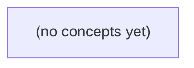

# 《11.11 复盘与改进》：面向 Go 初学者的 IM 事件无责复盘

*本书围绕 11.10 的纸上 B 历史补拉事件，讲解如何以证据为中心完成一次不甩锅、不虚构根因的 IM 业务复盘。读者将学会界定用户影响、拆分症状与促成因素、设计可反驳的反事实检验，并将结论转化为可验证、可回退的行动项。*

**章节:** 2

---

## 本书导览

- 了解整本书的章节脉络
- 掌握各章之间的概念依赖关系
- 选择最合适的阅读顺序

# 《11.11 复盘与改进》：面向 Go 初学者的 IM 事件无责复盘

本书围绕 11.10 的纸上 B 历史补拉事件，讲解如何以证据为中心完成一次不甩锅、不虚构根因的 IM 业务复盘。读者将学会界定用户影响、拆分症状与促成因素、设计可反驳的反事实检验，并将结论转化为可验证、可回退的行动项。

下方的概念图展示了本书 0 个核心概念以及它们之间的依赖关系；再下方是 1 个章节的入口。你可以按从上到下的顺序阅读，也可以根据自己的兴趣或先验知识选择切入点。

#### 概念图

## 章节索引

- **11.11 复盘与改进：一次IM补拉迟到后怎样减少复发** — 面向Go初学者，用未来B历史补拉纸上事故分解事实、触发、促成、防线、反事实和可验收改进。

## 11.11 复盘与改进：一次IM补拉迟到后怎样减少复发

- 保留带来源的用户影响与时间线
- 区分触发、促成因素与防线缺口
- 对根因候选写反事实和反证
- 按业务风险排序行动项
- 为行动项定义owner和验证结果
- 审阅脱敏传播及版本边界

以未来B历史补拉迟到为纸上事故，在既有合同与未部署提议的边界内，用证据驱动复盘，将一次迟到转化为可验证、可追责、可减少复发的改进闭环。

### 先锁定版本边界与事实基线

### 先锁定版本边界与事实基线

复盘的第一步不是讨论“为什么迟到”，而是冻结事故发生时真正生效的边界，避免把尚未部署的设想当成既有能力。对未来 S5 的纸上 B 历史补拉事件，应明确记录：

- **现行版本**：生产按 `S2/v1` 合同运行；内存受理边界仍为 `6 UTF8B / 4096B / 409 / 404 / 200`，不得在复盘中擅自改写、放宽或推断其外部行为。
- **提议状态**：`S3` 仅为提议，尚未部署、灰度或回填；它不能解释本次实际结果，也不能被写成“本应已具备”的前提。
- **事件对象**：B 的历史补拉请求何时发起、何时进入受理、何时返回、何时可被用户消费；“迟到”应落在可测量的时间差上，而非笼统感受。
- **用户影响**：受影响的是哪些用户、哪些时间窗、哪些历史数据范围；同时区分“未返回”“返回较晚”“返回但不可用”。

事实记录应采用可追溯格式，例如：`[时间戳][来源][脱敏级别][事实/推断]`。其中来源可为请求日志、队列记录、服务指标、告警、用户工单或人工操作记录；时间戳统一注明时区；含用户标识、请求内容或业务数据时标记脱敏方式。

例如：`[S5 10:03:14 UTC][网关访问日志][已脱敏][事实] B 的补拉请求返回 200`。这只能证明返回状态，不能证明历史数据已在同一时刻完成交付。任何“处理阻塞”“容量不足”“重试异常”等表述，在没有对应证据前均应标为待验证假设。

### 重建用户影响与事件时间线

### 重建用户影响与事件时间线

复盘先回答“用户何时、以何种方式受影响”，再讨论系统内部发生了什么。对于未来 S5 的纸上历史补拉迟到事件，时间线应固定在既有 S2/v1 合同边界：单次受理上限仍为 `6 UTF8B / 4096B / 409 / 404 / 200`，S3 的改进提议尚未部署，不能把其预期能力写成当时事实。

建议按四条并行轨道记录：

| 时间 | 用户可见影响 | 系统行为与证据 | 人工处置与恢复 |
|---|---|---|---|
| $T_0$ | 用户提交历史补拉请求，尚未获得结果 | 请求进入受理链路；记录请求标识、参数大小、返回码与日志时间戳 | 无 |
| $T_1$ | 用户等待超过约定或通常预期时长 | 可确认的排队、重试、下游响应或任务状态变化；附监控截图、日志查询条件 | 值班人员何时收到告警或工单 |
| $T_2$ | 用户看到延迟、失败提示，或业务数据尚未补齐 | 已知请求是否返回 `200`、`404`、`409`；不能仅凭“未见结果”断言丢失 | 人工查询、重放、补拉或对用户说明 |
| $T_3$ | 补拉结果可见，影响结束 | 结果落地、状态收敛或用户侧核验成功的证据 | 记录恢复操作、执行者与完成时间 |

每条记录标注证据等级：

- **观测事实**：带时间戳的请求日志、任务状态、告警、工单、用户反馈、数据校验结果。
- **推断**：例如“可能因队列积压而迟到”。推断必须写明依据与待验证项，不能升级为根因。
- **未知项**：例如缺少某段链路日志、用户实际首次感知时间未确认，应明确列为待补证，不以合理猜测填补。

恢复时间也应分层：系统返回成功不等于用户数据已可用；任务完成不等于用户已确认。最终以“受影响用户能够读取正确的历史数据”的证据作为影响结束节点，并保留从 $T_0$ 到该节点的实际耗时。

### 拆分触发、促成因素与防线缺口

### 拆分触发、促成因素与防线缺口

复盘先回答“发生了什么”，再讨论“为什么没有更早发现”。对未来 S5 纸上历史补拉迟到，应避免把“补拉晚了”直接写成某人的失误或未经证实的单一根因，而应沿链路拆分：

- **直接触发条件**：导致迟到实际发生的、可由证据确认的事件。例如，历史补拉请求是否在预期时间创建、是否进入队列、是否被受理、是否完成处理。记录请求时间、任务标识、状态迁移、返回码及日志关联证据。当前仅能依据 S2/v1 合同判断：单次内存受理上限仍为 `6 UTF8B / 4096B`，异常语义仍包括 `409`、`404`，成功为 `200`；不能把未部署的 S3 提议当作既有行为。

- **促成因素**：不必然单独造成迟到，但会扩大等待时间、影响范围或排查难度的条件。例如，补拉范围接近 `4096B` 上限而需要拆分、多次请求遇到 `409` 后缺少明确重试节奏、对象返回 `404` 后未能快速区分“尚不可得”与“标识错误”、人工确认依赖零散日志。这些应标注为“已证实”“待验证”或“推测”，并附对应证据。

- **防线缺口**：本应发现、告警或阻断问题却未生效的环节。检查是否缺少从请求创建到 `200` 完成的时延指标，是否未对连续 `409/404` 设置可行动告警，是否没有补拉任务年龄阈值、重试上限与升级路径，是否缺少按任务标识串联请求和结果的审计记录。

可用一句链路表述固化结论：`触发：任务未在目标时限内完成；促成：重试与状态判断信息不足；缺口：未对任务年龄和异常返回建立提前告警。` 这样，后续行动才能分别对应消除触发、降低放大效应和补齐防线，而非停留在笼统的“加强关注”。

### 用反事实检验根因候选

### 用反事实检验根因候选

根因候选不能因“看起来合理”就写入结论。对未来 S5 纸上 B 历史补拉迟到，应逐项提出反事实：**若该条件不存在，在当前 S2/v1 合同、6 UTF8B/4096B/409/404/200 内存受理规则不变的情况下，迟到是否仍会发生？** 若答案仍是“会”，该条件至多是放大因素，不是充分根因。

| 候选条件 | 反事实判断 | 可推翻判断的反证 |
|---|---|---|
| 历史数据量较大 | 若请求仍在 `4096B` 上限内、数据量较小，补拉仍可能因相同受理或调度路径迟到；因此“量大”不足以单独解释事件。 | 小数据量回放稳定按时完成，而仅大数据量出现同类迟到，且延迟随字节数或分段数单调上升。 |
| 请求命中 `409` | 若不命中 `409`，仍需确认后续重试、排队或人工等待是否存在；不能把状态码本身等同于迟到根因。 | 受控回放显示：仅在 `409` 后出现额外等待；绕开冲突且保持其他条件一致时，迟到消失。 |
| 调用方未及时发起 | 若调用方提前发起，但服务端同样在受理后未按预期返回，则迟到仍会发生。该候选须区分“发起晚”与“受理后慢”。 | 带时间戳的请求、受理、返回证据表明服务端返回正常，而首次请求确实晚于业务所需窗口。 |
| S3 提议尚未部署 | 未部署的 S3 不能被写成现网故障根因；它只能是可能降低风险的改进方向。 | 设计或实验明确证明 S3 针对已观察到的失败路径，并能在相同输入下消除迟到。 |

记录时把“已证实事实”“反事实推断”“待补证据”分栏。未被反证支持的候选应保持为假设，而非归责结论。

### 按风险落地行动与验收闭环

### 按风险落地行动与验收闭环

行动项应按“再次发生的概率 × 用户影响 × 发现难度”排序，而非按讨论热度排列。未来 S5 的历史补拉迟到，优先处理会造成用户长期看不到消息、且现有监控难以及时发现的风险；不得把尚未部署的 S3 提议当作既有控制措施，也不得擅自改变 S2/v1 合同中 `6 UTF8B/4096B/409/404/200` 的内存受理语义。

| 优先级 | 行动 | 负责人/期限 | 验收信号 | 回归场景 | 传播范围 |
|---|---|---|---|---|---|
| P0 | 补充历史补拉任务的开始、游标推进、完成、失败证据链，并对超时未完成告警 | IM 平台值班负责人；下个迭代前 | 可关联任务 ID、请求时间、游标和终态；演练中告警触发 | 未来 B 历史消息跨页补拉，模拟中途停滞 | 脱敏后的时序、任务状态与告警截图；限研发、值班与支持 |
| P0 | 建立迟到用户影响清单与补偿确认步骤 | 客户端负责人；一周内 | 抽样用户可确认消息最终可见；补拉结果与服务端记录一致 | 断网恢复后重试、重复触发补拉 | 仅聚合用户数、时间窗和结果；不传播消息内容、账号或设备标识 |
| P1 | 将 `409`、`404`、`200` 分别计数并关联补拉结果，避免把“已受理”误判为“已完成” | 可观测性负责人；两周内 | 仪表盘可区分受理、未找到、冲突与最终完成率 | 合法 UTF-8 边界、4096B 边界、超过限制及重复请求 | 指标口径和匿名样例；面向工程与运营 |
| P1 | 编写并演练值班运行手册：查询证据、判断影响、重试边界、升级路径 | 值班轮值负责人；两周内 | 新值班人员可在演练中完成定位；步骤无依赖口头知识 | 高峰期积压、单任务延迟、批量历史补拉 | 手册内部可见；外部仅发布用户可感知状态 |

每项关闭前必须附上可复现的验证记录，而非“已修复”结论：测试时间、输入条件、预期与实际状态码、任务终态、监控截图及复核人。若证据只能说明“迟到已缓解”，就应保持行动项开放，并明确下一次复查日期。脱敏传播只保留必要的时间窗、规模、状态和改进结果，删除消息正文、用户标识、令牌、完整请求体及可反推业务身份的字段。

> **要点** — 高质量复盘以可追溯事实为起点，经反事实检验形成按风险排序、有人负责且可验收的改进闭环。

以未来B单台补拉迟到为纸上事故，先固化可证事实与观察边界，再形成可验证、可排序的改进行动。

### 先建证据账本，再写事故时间线

### 先建证据账本，再写事故时间线

事故复盘先记录“看到什么”，再解释“为什么”。证据账本至少包含：时间、来源、对象、观测值、已知范围与未证实项。这样可避免把推导、假设和事实混写。

| 时间 | 来源/对象 | 可证事实 | 观察边界 |
|---|---|---|---|
| T0 | 报告B | B缺少 `m-9/seq9` | 仅证明报告时B未见该消息；最早缺失时刻未知 |
| T+2 | 超时告警 | 出现超时告警 | 告警覆盖的设备数、开始时刻未知 |
| T+5 | 纸上计算 | 意图为 $100$ 条/s；下游尝试上界为 $300$ 次/s | 是容量推演，不是实际吞吐；不得写成“实测900/s”或“实际达到300/s” |
| T+8 | 限载记录 | 已启用限载 | 限载前后的真实发送速率、受影响设备数未知 |
| T+12 | 权威存储与 outbox 核对 | 可核对 `m-9/seq9` 的权威状态及出站记录 | 核对结果应逐项落账，不可仅以“已核对”代替结论 |
| T+20 | 队列指标 | 队列长度下降 | 只说明所观测队列在下降，不等于全量设备恢复或无积压 |
| T+30 | 单台B | B追平 | 仅证明B恢复；其他设备是否缺失、何时恢复均未知 |

时间线应保留这些边界。例如写“截至T+30，已证实B追平；未证实其他设备均已恢复”，而不是写“事故于T+30结束”。对每个空白项建立待补证条目：其他设备数、各设备最早异常时刻、实际尝试率、限载生效范围及全量恢复判据。

### 区分实测、推演与恢复范围

### 区分实测、推演与恢复范围

复盘记录应把“看到的”“按假设算出的”“尚未覆盖的范围”分开写，避免结论强于证据。

| 类型 | 可写结论 | 不可延伸为 |
|---|---|---|
| 实测事实 | T0 报告 B 缺少 `m-9/seq9`；T+2 出现超时告警；T+8 已执行限载；T+12 完成权威源与 outbox 核对；T+20 观察到队列下降；T+30 单台 B 追平。 | 所有设备均缺同一消息、告警已消失、全量队列已清空。 |
| 纸上推演 | 若按每设备 $100$ 意图/s、每意图触发 $3$ 次下游尝试估算，则单设备对应 $300$ 下游尝试/s；若进一步假设 3 台同时执行，上界为 $900$/s。 | 将 $100$/s、$300$/s 或 $900$/s 记为线上实测吞吐。 |
| 恢复范围 | 队列下降仅说明被观测队列在该时点呈下降趋势；B 追平仅证明该单台设备已追至核对目标。 | 宣称补拉链路、全部消费者、全部设备或业务状态已全量恢复。 |

尤其要标明未知项：其他设备数量未知，其他设备的最早恢复时刻未知，未观测队列的积压未知。因此，事件状态宜写为“B 已局部恢复，系统级恢复待补充多设备水位、队列清空和告警收敛证据”，而非“事故已恢复”。

### 拆解触发、促成因素与防线缺口

### 拆解触发、促成因素与防线缺口

先把因果链限制在已知观察中：T0，报告显示设备 B 缺失 `m-9/seq9`；T+2 出现超时告警；T+8 启动限载；T+12 开始将权威数据与 outbox 对账。它们描述的是一次“B 的补拉迟到”过程，不足以证明全局积压规模、其他设备是否受影响，或某个组件已经故障。

- **直接触发**：B 未在预期时间获得 `m-9/seq9`。这可能来自拉取请求未发出、请求超时、响应未送达、消费或提交停滞；在 T+12 前，尚不能仅凭“缺消息”断言是权威侧漏写、outbox 漏投还是 B 侧补拉链路异常。
- **促成或放大条件**：T+2 的超时说明补拉路径已出现等待，但未说明吞吐已降至何值。纸上模型中的意图速率为 `100/s`、下游尝试为 `300/s`，可用于推演重试放大风险；`900/s` 只是该模型下的上界，不能写成现场实测。若无退避、去重、并发隔离或按设备限额，超时可将局部缺口放大为下游压力。
- **未拦截的防线**：T+2 告警未能在 T+8 前阻止持续施压，表明“发现超时—定位对象—自动限载”之间存在时延，或告警缺少按设备、消息序号和重试量关联的上下文。T+8 限载是缓解措施，不等于根因消除。
- **验证性防线缺口**：T+12 才核对权威与 outbox，说明投递完整性证据未能即时取得。应把该核对做成可查询、可告警的链路：权威记录、outbox 条目、投递尝试、B 的确认位点需能按 `seq9` 关联。

后续即使观察到队列下降，也只能证明所观测队列在下降；直到 T+30 B 单台追平，才可确认 B 的该缺口恢复，不能外推为全量设备恢复。

### 用反事实检验根因候选

### 用反事实检验根因候选

反事实不是重演事故，而是问：若某候选根因不存在，现有时间线中哪些观察应当不同？仅以已知事实检验：T0 报告 B 缺少 `m-9/seq9`，T+2 出现超时告警，T+5 纸上估算意图为 100 条/秒、下游尝试为 300 次/秒，T+8 开始限载，T+12 完成权威源与 outbox 核对，T+20 队列下降，T+30 仅确认单台 B 追平。其他设备数量、最早开始时刻及实际吞吐均未知。

- **限载策略过晚或过严**：若 T+8 未限载，超时、队列或下游拒绝应继续恶化；若限载是主要瓶颈，放宽后 B 应更早追平，且下游压力未同步失控。反证是：限载前后速率、错误率和 B 的积压斜率无显著变化。不能用 $100\times3=300$/秒推导实测负载，更不能把可能的 900/秒上界当作观测值。

- **补拉调度不公平或串行化**：若调度正常，B 不应在权威与 outbox 已核对后仍独自迟到；调整优先级、分片或并发后，应观察到 B 的 `seq9` 获取时间缩短，而非仅总队列下降。若 B 仍相同时间追平，则该候选受削弱。

- **权威与 outbox 不一致**：若两者始终一致，T+12 核对不应发现缺记录、顺序冲突或可见性延迟；若修复一致性后 B 立即获得 `m-9`，则支持该假设。核对“通过”只能排除已检查范围，不能证明所有设备、所有消息均一致。

- **告警覆盖不足**：若告警足够早且按设备定位，T+2 前应已有 B 的缺失或滞后信号，并能区分补拉超时与下游拥塞。反证是告警已完整覆盖却仍无法识别 B。T+20 队列下降只说明被观测队列改善；全量恢复仍需逐设备确认。

### 按风险落地改进并闭环验收

### 按风险落地改进并闭环验收

改进项不按“容易做”排序，而按**用户影响 × 复发概率 × 检测难度**排序。已知事实仅包括：B 在 T0 缺少 `m-9/seq9`，T+2 出现超时告警，T+5 纸上估算意图为 `100 条/s`、下游尝试为 `300 次/s`，T+8 开始限载，T+12 完成权威源与 outbox 核对，T+20 队列下降，T+30 单台 B 追平。`900 次/s`只是上界推导，不得写成实测吞吐；队列下降也只说明观测队列缓解，不代表全部设备恢复。

| 优先级 | 行动与负责人 | 期限 | 成功指标与验收演练 |
|---|---|---:|---|
| P0 | 补拉服务负责人：对缺口建立按 `seq` 去重、断点续传、权威源/outbox 双核对 | 两周 | 人工注入单条缺口后，B 自动识别并补齐；重复投递不产生重复落库；演练记录保留缺口、核对与追平证据。 |
| P0 | 平台负责人：限载前置，按设备、租户和下游错误率熔断 | 两周 | 压测中下游异常时尝试量受预算约束，正常实时链路不被补拉挤占；明确预算是配置值而非实际能力。 |
| P1 | 可观测性负责人：补齐“最早缺口时刻、受影响设备数、追平设备数”指标 | 三周 | 告警可定位到设备与序列范围；仪表盘区分“队列下降”“单台追平”“全量追平”。 |
| P1 | 值班负责人：更新迟到处置手册与升级条件 | 一周 | 演练中值班员能在规定时间内完成权威核对、限载和升级，且不以推测替代证据。 |

验收后由事故负责人组织脱敏复盘：隐藏租户标识、消息内容和内部地址，只传播时间线、决策依据、指标定义与版本号。改动须标明适用版本；旧版本未部署去重、限载或指标时，不能宣称复发风险已消除。

> **要点** — 复盘以带来源的事实为锚，严守观察边界，并把根因假设转化为可验收的风险改进。

一次补拉迟到不能用“数据库慢”草草定性。复盘应沿证据还原链路，分辨症状、触发与防线失效，并把改进落实为可验证的行动。

### 先固化事实、影响与时间线

### 先固化事实、影响与时间线

复盘的第一步不是解释“为什么慢”，而是把**当时可验证的事实**冻结下来。证据应带来源、时间范围与查询条件，避免后来根据印象补写因果。

- **用户影响**：受影响租户、会话或权限范围；补拉任务数量；应到与实际到达时间；最大、平均延迟；是否丢失、重复、乱序或仅是迟到。区分“任务提交失败”“执行变慢”“结果可见延迟”。
- **关键时点**：按统一时钟记录触发、入队、首次执行、每次重试、最终成功/失败、告警触发、人工介入、恢复完成。若日志时钟存在偏差，应注明偏差来源，不能强行拼成精确因果链。
- **链路状态**：记录队列长度与等待时间、消费者并发、连接池在用/等待/超时、数据库延迟与错误码、磁盘或网络指标、下游接口状态，以及重试次数分布。`300 次尝试 / 100 个原始任务 = 3 倍`只能说明存在重试放大，不能单独证明慢查询或连接池是根因。
- **版本与边界**：固化服务版本、配置、开关、发布批次、数据库实例与路由、权限历史补拉规则。明确事故窗口前后哪些变更已生效、哪些尚未生效。

建议以“时间—观测—来源—影响”表格记录，例如：`10:03 队列等待升高（监控面板链接）；10:05 首批权限历史补拉超时（任务日志）；10:08 用户结果迟到（审计记录）`。解释与假设另列，未经证据支持的推断不得写入事实栏。

### 拆开症状、触发与促成因素

### 拆开症状、触发与促成因素

先把事故描述从一句“DB 慢导致 IM 补拉迟到”拆成可检验的链条。**延迟**是结果，**DB 慢**通常是观测到的症状；池等待、慢 SQL、磁盘异常、重试和排队，分别可能处于不同因果层级。

可先按以下方式归类：

- **症状**：补拉完成时间超标、数据库请求耗时升高、连接池等待变长、队列积压、失败率上升。
- **初始触发候选**：连接池已满或连接泄漏；某类查询出现执行计划退化、锁等待或扫描放大；磁盘延迟、空间水位、IOPS 限流等基础设施状态异常。
- **放大机制**：例如 300 次请求对应 100 次原始任务，观测到约 $300/100=3$ 倍重试放大。这说明失败后的额外请求正在消耗容量，但不能倒推出“重试就是根因”。
- **促成因素**：队列无界或容量过大，使积压长期隐藏；单任务重试次数或全局重试预算缺失；历史消息补拉权限、范围或降级策略不清；告警只覆盖 DB 延迟，未覆盖池等待、队列年龄和重试比例。

因此应建立并逐项验证假设，而非选择一个顺手的叙事。例如：若池等待先于 SQL 耗时升高，优先检查连接占用与并发配置；若特定 SQL 的执行时间先恶化，再查索引、锁和执行计划；若磁盘指标异常与查询抖动同窗出现，则补足主机与存储证据；若重试率先升高且队列年龄持续增长，则验证退避、预算和限流是否失效。

复盘结论可以是多因素链路：某个初始触发降低数据库有效吞吐，重试将负载放大，有界性不足使工作进入队列，监控未在积压早期报警。每一环都应有时间序列、日志或配置证据，并对应一项可验证的改进。

### 用反事实检验根因候选

### 用反事实检验根因候选

观察到“补拉请求约 300 次、成功任务约 100 个”，只能说明平均存在约 $3$ 倍尝试放大；它可能延长了队列占用、加重了数据库压力，却不能自动推出“重试是根因”。根因候选应写成可被推翻的反事实：

- **候选：重试策略导致迟到。** 反事实是：若同一时段将每任务总重试预算限制为 1 次，且其他条件不变，排队长度、连接池等待和完成延迟应显著下降。若限流后延迟仍由首轮请求直接触发，或重试主要发生在下游已超时之后，则重试更像放大器而非初始触发。
- **候选：连接池等待触发超时。** 应看到首批请求在 SQL 执行前已积累池等待；扩容池或释放被占连接后，首轮失败率应下降。若池等待低而 SQL 执行时间陡增，此候选被削弱。
- **候选：慢 SQL 或磁盘抖动触发。** 应能定位到特定查询、执行计划变化或磁盘延迟尖峰，并且它们早于重试波峰。若慢查询只出现在重试洪峰之后，则更可能是结果。

时间顺序尤其关键：先出现的异常才有资格作为触发候选。复盘结论应保留“已证实”“待验证”“已排除”三类状态，并为每个候选补充下一次可观测的指标与告警，而不是用单一叙事归责。

### 逐道检查防线与权限边界

### 逐道检查防线与权限边界

复盘不应只问“为什么数据库慢”，而要逐道核验：每层防线原本要拦住什么、实际是否覆盖、失效后把风险放大到哪里。

| 防线 | 应覆盖的风险 | 常见失效方式 | 验证证据 |
|---|---|---|---|
| 有界队列 | 突发补拉挤占实时链路、无限堆积 | 队列无上限；满载后阻塞工作线程；丢弃策略不区分实时与历史任务 | 入队/出队速率、队列深度、拒绝数、任务等待时间 |
| 总重试预算 | 瞬时失败被重复放大 | 每层各自重试；按请求而非按任务计数；`300/100=3` 仅说明放大现象 | 单任务尝试次数、跨服务重试链路、预算耗尽比例 |
| 历史补拉权限 | 非必要的大范围回补进入生产 | 权限过宽；时间窗和用户范围未限制；审批只记录“允许”不记录影响 | 操作人、审批单、查询范围、估算行数、执行时段 |
| 监控告警 | 在延迟演变为迟到前发现异常 | 只告警数据库慢，不告警池等待、队列积压、重试激增或补拉量异常 | 告警触发时间、阈值、通知到达记录、值班响应 |
| 脱敏传播 | 防止补拉数据在排障中二次扩散 | 日志、导出文件或工单附件保留原始标识；临时权限未回收 | 字段脱敏规则、下载审计、留存期限、访问权限变更 |

这些防线不是串行的“单点根因”叙事：连接池等待可能触发超时，超时再被多层重试放大；历史补拉权限过宽使负载进入系统；告警覆盖不足则延长暴露时间。改进项应分别指定负责人、验收指标和演练场景，例如“队列满时历史任务被限流而实时任务仍满足时延目标”，而非笼统要求“优化数据库”或归责某位操作人员。

### 按风险落地可验收改进

### 按风险落地可验收改进

改进项不按“谁最容易改”排序，而按风险排序：优先处理会导致权限历史缺失、用户长期看不到消息、或在高峰期高概率复发的问题；其次处理延迟扩大和告警发现过晚的问题。每项都应有单一负责人，但责任指向系统防线，不指向个人过失。

| 优先级 | 行动项 | 负责人 | 完成条件 | 验证结果 | 适用版本范围 |
|---|---|---|---|---|---|
| P0 | 为补拉请求设置有界队列、超时与拒绝策略 | 应用负责人 | 队列长度、等待时长和降级响应已配置并记录指标 | 压测下队列满时请求被明确拒绝或降级，不再无限堆积 | 当前线上版本及后续主干 |
| P0 | 引入全链路总重试预算 | 任务系统负责人 | 单任务最大尝试次数、总耗时和退避规则生效 | 构造 300 次请求、100 次实际处理的场景，重试放大受预算限制 | 补拉消费者与调度端 |
| P0 | 补齐权限历史补拉能力 | 权限服务负责人 | 能按历史时点校验权限，并输出不可补拉原因 | 权限变更前后的消息补拉结果符合预期，拒绝原因可追踪 | 涉及历史消息的版本 |
| P1 | 分离池等待、慢 SQL、磁盘延迟等指标与告警 | 可观测性负责人 | 告警规则能区分触发信号与数据库慢症状 | 故障演练时告警包含队列等待、连接池耗尽、SQL 延迟和磁盘指标 | 生产监控配置 |
| P1 | 建立补拉延迟与缺失率看板 | 值班负责人 | 按租户、任务类型和权限结果展示 SLO | 可在 5 分钟内定位受影响范围并触发升级 | 当前值班体系 |

验收不能只看“代码已合并”。每项应附演练记录、指标截图或查询链接，并在下一次复盘中标注其覆盖的故障链路版本：已上线、灰度中、仅设计，还是已验证失效。这样即使初始触发仍可能来自未知盘抖动或慢 SQL，系统也不会再次因无界排队、重试放大、权限缺口和告警盲区而把一次波动放大为用户迟到。

> **要点** — 以证据和反事实替代单一归因，逐层补齐防线，并用负责人和验收结果确保改进闭环。

复盘的价值不在于给迟到贴上单一原因，而在于用证据检验假设、识别风险转移，并形成可验证的改进闭环。

### 先固化事实，再讨论因果

### 先固化事实，再讨论因果

一次 IM 补拉迟到的复盘，第一步不是判断“重试太多”“连接池太小”或“数据库慢”，而是建立可追溯的事实集。任何因果结论都应能回答：**哪位用户、在哪个版本、何时发生、证据来自哪里、证据是否完整**。

建议先形成一条统一事件时间线，并明确时钟来源与误差：

- 用户触发补拉请求：客户端日志中的请求标识、网络类型、应用版本、登录态；
- 网关接收与转发：入口时间、路由实例、状态码、请求标识；
- OpenIM 两处服务日志：分别记录入站、出站、重试次数、超时原因与实例版本；
- 数据库侧：连接等待、执行开始/结束、慢查询、锁等待、错误码；
- 用户最终感知：消息是否到达、到达时间、是否出现空白或失败提示。

时间线应保留原始时间戳、时区、日志来源和关联键；不能仅凭“日志 A 早于日志 B”就断言 A 导致 B。尤其是分布式系统中，机器时钟漂移、异步写日志、消息队列积压都会改变观测顺序。固定 OpenIM 两处都出现同一事件，只能证明它们记录了相关现象，不能证明其中一处是根因。

事实表还要标出版本边界：故障发生前后是否发布了客户端、OpenIM、网关、数据库参数或重试策略；同一请求是否跨越灰度实例。涉及用户标识、会话内容、消息正文时，使用不可逆哈希、分级授权和最小保留字段，避免为了复盘扩大隐私暴露。

最后区分三类记录：已验证事实、待验证观察、推测性解释。只有前两类进入时间线；“连接池扩容应能解决”“三次重试一定更稳定”应作为后续假设，而非预先写入结论。

### 拆分触发、促成与防线缺口

### 拆分触发、促成与防线缺口

一次补拉迟到通常不是单点故障，而是三类因素在同一时间窗叠加：

- **直接触发**：真正启动异常链路的事件，例如上游回调丢失、消费者重启后位点未及时恢复、请求超时导致补拉任务被创建。它回答“为什么此时开始补拉”。
- **放大条件**：让补拉从可控变为迟到的环境，例如并发补拉集中、连接池排队、数据库慢查询、重试风暴或热点会话。它回答“为什么补拉没有按时完成”。
- **防线缺口**：本应限制影响、提前降级或告警的机制失效，例如没有按租户限流、重试未设置总预算、队列积压告警阈值过高、任务超时后仍持续占用资源。它回答“为什么异常扩大而未被拦截”。

“固定 OpenIM 两处”至多说明两个观察点出现了相似现象，例如一处日志显示补拉请求创建，另一处监控显示完成延迟升高；这不能证明 OpenIM 是根因，更不能证明两者存在因果链。二者可能共同受数据库抖动、网络拥塞或上游流量突增影响。

应为每个候选链条补齐可证伪证据：比较异常会话与正常会话的任务创建时间、队列等待、重试次数、数据库连接等待和查询耗时；在隔离环境中仅提高补拉并发或仅注入数据库延迟，观察迟到是否可复现；检查反例——若某批任务同样经过 OpenIM、同样发生重试却未迟到，则“OpenIM 固定点导致迟到”的解释必须被削弱。时间先后只能生成假设，不能替代因果证据。

### 用反事实检验根因候选

### 用反事实检验根因候选

“补拉迟到发生在数据库峰值之后”只能说明时间相关，不能证明数据库峰值导致迟到；同样，OpenIM 两处日志时间固定，也只证明这两个观测点稳定，不能证明中间链路没有排队、重试、连接等待或消息处理阻塞。复盘应把每个候选改写为可被推翻的反事实命题。

- **候选一：端到端重试放大了数据库峰值。**  
  需观测单请求尝试次数、重试原因分布、每次尝试的数据库耗时、重试间隔及峰值时段的逻辑请求量与物理查询量之比。可控实验是在影子流量或小比例用户上将总重试预算限制为最多 3 次，并保持超时、退避策略不变，比较数据库 QPS、连接等待、最终成功率和迟到率。反例是：尝试次数下降后数据库峰值未降，或峰值下降但用户失败率显著上升，说明预算只是把压力转化为失败。若高峰期多数请求本就未发生第四次尝试，则“限制为 3 次”可直接推翻为主因。

- **候选二：连接池不足造成等待。**  
  需观测池大小、活跃连接、等待队列、获取连接耗时、连接生命周期及数据库端并发会话。实验可逐级扩大池容量，同时设置数据库并发上限，观察等待是否下降、数据库锁等待和慢查询是否恶化。反例是池等待接近零而迟到仍存在；若扩池仅使等待从应用侧转移到数据库侧，则不能称为修复。

- **候选三：消息处理链路积压。**  
  需按消息记录入队、消费、解析、补拉发起、回写完成的时间戳，并关联分区、消费者实例、失败重投和幂等冲突。实验可提高消费者并发或隔离慢消息类型，验证积压与迟到是否同步回落。若积压清空后补拉仍迟到，或迟到请求并未经过积压分区，则该候选被削弱。

最终改进应同时写明：预期改变的指标、允许的副作用边界，以及何种观测出现时立即撤销假设。

### 识别重试与扩池的风险转移

### 识别重试与扩池的风险转移

“端到端最多重试 3 次”和“扩大连接池”都可能缩短部分补拉请求的等待，但优化对象不同，风险也不同。

| 候选措施 | 主要收益 | 可能转移的风险 | 适用前提 |
|---|---|---|---|
| 端到端最多重试 3 次 | 限制单请求放大，削减瞬时数据库读峰 | 短暂抖动期间，原本可稍后成功的请求被预算耗尽，表现为用户失败；统一重试时刻还可能形成重试波峰 | 失败可判定为瞬态；客户端或网关能返回明确的可重试/不可重试结果；重试采用退避、抖动与截止时间 |
| 单纯扩大连接池 | 降低连接获取等待，提高并发利用率 | 排队从应用池转移到数据库连接、锁、CPU 或存储队列；更多并发慢查询可使尾延迟恶化 | 数据库仍有 CPU、连接、IOPS 和锁等待余量；瓶颈确实位于连接池而非查询执行 |

不能仅看到“重试次数下降后数据库峰值下降”就认定限重试有效。应同时观察：请求按最终结果分桶的成功率、用户可见失败率、每次请求尝试数、重试间隔分布、数据库 QPS、活跃连接、慢查询、锁等待及 $p99$ 延迟。若 DB 峰值下降而终态失败上升，说明负载可能被“丢弃”而非被消除。

可控实验应采用小流量分组：一组启用“三次上限 + 指数退避 + 随机抖动”，另一组保持原策略；在相同时间窗、相近流量和相同 OpenIM 状态下比较终态成功率与下游压力。扩池也应阶梯式提高池大小，并同步检查数据库活跃连接、等待事件和尾延迟。

反例是：池等待下降却 DB 锁等待暴涨，此时扩池只是把排队推进 DB；或限重试后用户失败增加，即使数据库更平稳，也不能称为整体改进。两处 OpenIM 在事件附近固定，只能说明相关线索持续存在，不能证明它导致重试、连接耗尽或补拉迟到。

### 把改进项写成可验收承诺

### 把改进项写成可验收承诺

改进项不是“优化重试”“扩容连接池”，而应是能在下一次变更中验收的承诺。先按业务风险排序：优先处理会造成消息长期缺失、重复投递或跨会话错序的路径；其次控制数据库峰值与级联超时；最后才是容量和成本优化。

每项行动至少写清以下内容：

- **负责人与截止条件**：由具体角色或姓名负责；截止日期之外，还要定义完成态。例如“补拉链路发布到灰度集群，并连续 7 天生成日报”，而非“本周完成重试改造”。
- **变更假设与验证指标**：例如将端到端重试总预算限制为最多 3 次，假设可降低数据库瞬时查询峰值。验证时同时看 `$P99$` 补拉延迟、用户可见失败率、单请求查询次数、数据库 CPU/连接等待；不能只看到 DB 降载就宣布成功。
- **可控实验与反例**：采用分桶灰度或回放压测，对照组保留原策略。若 DB 峰值下降但“最终未补齐率”上升，说明风险从数据库转移到了用户失败；若扩大连接池后等待下降、DB 锁等待却上升，也不能称为容量问题已解决。
- **回滚边界**：预先约定触发条件，如灰度组未补齐率高于基线 `0.1%`、错序率超过阈值或 DB 写延迟持续 10 分钟恶化，即停止扩大并回退配置或版本。
- **复盘版本**：记录指标口径、实验时间窗、配置版本、代码提交与结论版本。OpenIM 两处日志同时出现，只能证明观测到相关事件，不能仅凭先后顺序认定因果。

最后审阅传播范围：对外和跨团队材料仅保留脱敏后的会话标识、聚合指标与必要时间窗；删除用户内容、原始令牌、内部地址及可反推个体的数据。这样，改进项既可执行，也可验证、可回退、可安全复用。

> **要点** — 可靠复盘以证据和反证约束因果判断，并用可验证、可回滚、有人负责的行动项减少复发。

复盘的价值不在于写出“问题很多”，而在于把事故事实转成可排序、可验收、可追踪的改进行动，优先堵住会扩大用户损失的缺口。

### 先按不可接受风险排优先级

### 先按不可接受风险排优先级

不要按“开发量小”“谁声音大”排序，而要先问：这项缺口再次出现时，是否会造成越权操作、权威数据丢失、重试风暴或无法恢复？可用四级队列：

1. **P0：越权与权威数据风险**  
   例如补拉任务可跨租户读取、写入覆盖主库权威记录、未校验版本就回写。此类问题必须先止血：关闭危险入口、加租户与权限校验、改为只读或隔离写入，并保留审计日志。验收应包含“伪造租户/过期权限/旧版本回写”样本，确认均被拒绝且可追溯。

2. **P1：重试放大与不可恢复**  
   例如失败即无限重试、多个消费者重复补拉、无幂等键导致重复写，或没有原始快照、回滚点和补偿路径。行动应限定并发与退避、设置重试预算和熔断，并建立可验证的快照、重放、回退流程。验收以故障注入对照：下游超时后请求量不放大，错误写入可在规定时间内恢复。

3. **P2：告警覆盖与操作手册**  
   若迟到只能靠用户投诉发现，应补齐“任务延迟、积压、失败率、数据新鲜度、回退失败”告警，并明确值班人、升级阈值、止血步骤和决策边界。验收抽样一次演练：值班人员不依赖口头指导即可定位、暂停、补拉和回退。

4. **P3：体验与风格改进**  
   包括日志可读性、仪表盘排版、提示语等；不得挤占上述风险项资源。

每项行动必须写成可追踪条目：`owner`、完成期限、交付产物、验收样本或对照实验、回退方案、当前状态。拒绝“加强培训”“优化系统”；应改写为可检验事实，如“由数据平台主管在 6 月 15 日前上线幂等写入校验，使用重复消息样本验证零重复落库，异常时切回只读补拉模式”。

### 把根因候选改写为可证伪假设

### 把根因候选改写为可证伪假设

“补拉迟到”不是根因，而是结果。复盘时应把“网络慢”“重试有问题”“值班没发现”等候选说法，改写成能被日志、配置、演练或历史样本推翻的假设，并用反事实判断其角色。

设结果为：未来 B 的历史消息未在承诺时限内补齐。对每个候选因素问三件事：

1. **移除它，迟到还会发生吗？**不会，则可能是直接触发。  
2. **即使它存在，防线本应拦住吗？**应拦未拦，则是防线缺口。  
3. **它只让问题更容易发生或更难恢复吗？**是，则是促成因素，不应伪装成唯一根因。

可形成如下假设表述：

- **直接触发假设**：`B` 在请求历史区间 `[t1,t2]` 时，补拉任务因游标解析错误将起点推进至 `t2`；若重放同一请求并固定该版本，缺失区间稳定复现；改用正确游标后，数据可在 SLA 内补齐。反证是：正确游标下仍出现同样缺失。
- **促成因素假设**：上游限流返回后，客户端按固定间隔重试，峰值时放大请求并延长队列等待；若在回放流量中启用指数退避和抖动，排队时间显著下降，但不改变“错误游标导致漏拉”的事实。
- **防线缺口假设**：系统未对“补拉完成但消息数异常少”做权威数据对照，也未告警；若以权威存储计数抽样对照，缺失可在用户发现前被识别。反证是：对照已覆盖且告警已触发、处置仍及时。

每条假设都应标注证据来源、反证条件与待验证实验。避免写“加强培训”“优化系统”；应写成可关闭的行动：负责人、期限、产物、验收样本、回退方案和状态。这样才能防止把偶然现象当根因，或只修复本次触发路径而留下越权、权威数据丢失和不可恢复风险。

### 用行动项模板拒绝空泛承诺

### 用行动项模板拒绝空泛承诺

“加强培训”“优化系统”不能降低下一次迟到的概率，因为它们没有边界、没有验收，也没有人能被追责。行动项应写成可执行、可验证、可关闭的记录：

| 字段 | 必填内容 |
|---|---|
| 风险与优先级 | 说明要阻断的损失：越权写入、权威数据丢失、重试放大或不可恢复；按影响排序。 |
| 负责人 | 写唯一直接负责人，不写“研发组”“相关同学”。 |
| 期限 | 明确日期及阶段节点；逾期须更新原因和新期限。 |
| 交付物 | 代码变更、开关、监控面板、告警规则、操作手册或演练记录。 |
| 验收样本 | 指定订单、用户、消息批次或故障注入样本，而非“测试通过”。 |
| 对照条件 | 写清旧行为与新行为的预期差异，例如重复补拉 $3$ 次后仍只产生一次有效写入。 |
| 回退方案 | 包含开关、回滚版本、数据修复边界及回退负责人。 |
| 状态 | `未开始`、`进行中`、`阻塞`、`待验收`、`已关闭`；关闭必须附证据链接。 |

例如，不写“优化补拉重试机制”，而写：“负责人李某，6 月 15 日前交付按业务键去重与指数退避；以 100 条含重复消息的回放样本验收，权威库有效写入数保持 100、请求峰值低于旧实现的 40%；灰度期间保留旧路径开关，异常时由值班人回切；状态为`进行中`。”

对涉及权威数据的动作，还应验收“错误输入不能覆盖已确认值”；对不可恢复风险，则验收失败记录是否进入可检索死信队列，并能按手册重放。没有样本、对照和回退的事项，只能算愿望，不能算改进完成。

### 从事故链路生成分级改进清单

### 从事故链路生成分级改进清单

以一次“IM 补拉任务迟到”为例：值班人员为追赶恢复时效，临时扩大补拉时间窗；任务重复提交后触发重试风暴；部分权威消息在覆盖写入前未完成保全；告警只报“任务失败”，没有指出积压量、重试率和数据风险。改进项应沿事故链路拆分，而不是笼统写“优化补拉系统”。

| 优先级 | 行动 | 负责人/期限 | 产物与验收 | 状态 |
|---|---|---|---|---|
| P0 | 补拉接口强制校验租户、会话、时间窗和操作人权限；越权请求默认拒绝并留审计日志 | IM 平台负责人，3 个工作日 | 权限矩阵、接口测试报告；用“跨租户补拉”“超窗补拉”样本验证均被拒绝 | 进行中 |
| P0 | 补拉前生成不可变原始快照，覆盖写入改为版本化合并；失败时可按任务号回退 | 数据存储负责人，5 个工作日 | 快照表、回退脚本；抽取 10 个历史任务，对照源端消息数、消息 ID、版本号一致 | 未开始 |
| P1 | 为任务增加幂等键、单租户并发上限、指数退避和总重试预算；预算耗尽后转人工队列 | 调度负责人，1 周 | 限流策略、压测记录；模拟上游超时，对照改造前后峰值请求数与恢复时间 | 进行中 |
| P1 | 增加“补拉迟到、积压增长、重试率、快照失败、回退失败”分级告警，并关联任务链接 | 可观测性负责人，4 个工作日 | 仪表盘、告警规则；注入延迟样本，验证 5 分钟内通知值班人且包含租户与任务号 | 未开始 |
| P2 | 编写补拉操作手册：审批条件、时间窗上限、停止条件、回退步骤和升级路径 | 值班主管，3 个工作日 | 手册与演练记录；由非当班工程师按手册完成一次沙箱补拉和回退 | 未开始 |

验收不能只看“任务成功”。P0 必须先证明不会越权、不会丢失权威数据；P1 再证明异常不会被重试放大且可恢复；P2 通过演练降低操作差异。每周复盘状态：逾期项需说明阻塞原因、临时控制措施和新的完成日期。

### 验证闭环并审阅传播边界

### 验证闭环并审阅传播边界

改进项上线不等于风险消失。验证应覆盖“能否拦住错误、异常时是否可退、证据是否可审计”三件事，并以历史迟到案例作为基准样本。

- **演练验证**：构造“IM 补拉任务迟到、源端权威数据已更新、目标端存在人工修订”的场景。确认系统先冻结自动覆盖，要求指定审批人确认；审批、执行人、数据版本、影响范围均写入审计记录。验收样本至少包括正常补拉、重复触发、跨日迟到和审批超时四类。
- **历史对照**：选取事故前 30 天内的补拉记录，按新规则离线重放。对照旧流程，统计被拦截的越权覆盖次数、可自动恢复比例、告警到响应的耗时；若新规则误拦截率超过约定阈值，状态不得标为“完成”。
- **回退验证**：对每个数据写入动作保留`任务版本 + 源数据快照 + 目标写前快照`。演练中执行一次错误批准后的回退，验收标准是：在规定恢复时限内恢复权威版本，且不覆盖之后产生的合法增量。回退失败时，自动降级为只读核查和人工处置，而非继续重试。

行动表必须写清`负责人、截止日期、交付物、验收证据、回退方案、状态`。例如：“数据平台主管，6 月 15 日，交付补拉冻结开关与审计报表；以 20 条历史样本重放和 1 次回退演练验收；失败则关闭自动写入；状态：验证中。”不以“加强培训”“优化系统”替代可检查产物。

传播同样需要边界：复盘摘要可向相关业务团队说明影响、改进和操作变化；含用户标识、订单明细、内部权限路径、具体漏洞利用条件的附件仅限事件处置组。对外或跨团队文档应脱敏、标注文档版本与生效日期，并明确“仅适用于本次补拉链路”；规则变更后旧版应归档并停止引用，避免操作手册与实际控制逻辑脱节。

> **要点** — 改进项必须优先降低不可逆业务风险，并以可验证产物和明确责任形成闭环。

本节以隔离环境中的未来B历史补拉演练为对象，设计可复核的对照验证，避免将未运行的推测写成事故结论。

### 界定演练边界与证据等级

### 界定演练边界与证据等级

演练只在隔离环境进行：构造未来教学数据，使消费者 **B** 在离线后执行历史补拉；数据库注入可控慢响应；上游以稳定的 `$100$` 个意图/秒发送请求。目标不是复现某次真实事故，而是验证“迟到补拉”在既定保留、权限与限流条件下的行为边界。

应预先冻结以下条件：

- **时间边界**：记录 B 离线时长、恢复时刻与补拉起点。失败变式必须覆盖 `$25\text{ h}>24\text{ h}$`：若 broker 仅保留 24 小时，B 不得依赖 broker 获取完整历史。
- **历史来源边界**：超过 broker 保留窗口后的数据，只能由具有读取权限的 DB 历史表、归档或等价存储提供；应分别验证“有权可读”“无权拒绝”“历史不存在”。
- **负载边界**：固定意图速率为 100/s，并标注 DB 慢响应参数、连接池容量、队列上限、超时和拒绝策略，避免把环境波动误判为系统能力。
- **对照边界**：基线与候选使用相同数据集、离线时长、速率和故障注入；比较意图完成率、B 追平时间、DB 尝试次数放大倍数、池等待/队列深度、拒绝/超时及权限失败。

证据等级必须分开书写：**设计**是待执行的场景、指标与判定阈值；**观测**是运行后可追溯的日志、指标和权限审计；**结论**只能由观测支持。尚无真实运行结果时，只能说明“将如何验证”，不能宣称候选方案已减少复发。

### 建立基线与候选方案对照

### 建立基线与候选方案对照

对照的目标不是证明“某参数更快”，而是在**相同未来教学环境、相同 B 历史范围、相同权限和相同 100 意图/秒负载**下，判断候选补拉策略是否减少迟到风险。

- **基线方案**：保留现有补拉触发、并发度、重试间隔、数据库查询路径与 broker 保留配置。
- **候选方案**：仅改变待验证机制，例如限流后的分批补拉、连接池隔离、查询分页、退避重试或对 B 的提前预热；一次实验应尽量只改变一个主要变量。
- **固定条件**：统一 B 的时间窗、消息大小分布、消费者数量、数据库实例规格、索引状态、网络限额及授权角色。若候选方案使用更高权限或更长历史保留，其结果不能直接与基线并列。

至少记录以下可比较指标：

| 维度 | 观测指标 | 判定关注点 |
|---|---|---|
| 意图完成 | 提交数、成功数、完成率、端到端分位延迟 | 100 意图/秒下是否持续完成 |
| B 追平 | 落后量、追平时间、最终水位差 | 是否在目标时限内回到当前水位 |
| DB 放大 | 每个意图的查询次数、扫描行数、重试次数 | 是否以更多 DB 尝试换取表面追平 |
| 资源排队 | 连接池等待、队列深度、线程饱和度 | 候选是否挤占正常教学流量 |
| 失败结果 | 拒绝、超时、死信、权限失败 | 失败是否被显式分类而非吞没 |
| 权限与历史 | B 离线 25h 后的可读历史范围 | 是否依赖有权 DB 历史而非 broker 24h 保留 |

特别要设计失败变式：令 B 离线 `$25h$`，而 broker 仅保留 `$24h$`。此时若 B 仍能完整追平，验证记录必须证明补拉来源是具备授权的 DB 历史，并核对历史覆盖离线缺口；若权限不足、历史缺段或查询超时，则应记录为候选方案的边界，而不能归因于 broker 自动恢复。

尚未真实运行时，输出应是实验矩阵、指标口径、日志关联键和验收阈值；不得把预期的完成率、追平时间或容量结论写成既成事实。

### 定义完成与追平验证指标

### 定义完成与追平验证指标

先把“补拉成功”拆成可观测的完成条件，避免只看消费者恢复连接或吞吐瞬时升高。对基线方案与候选方案使用同一批隔离的未来教学数据、同一目标速率（如 $100$ 意图/秒）和同一窗口，记录以下指标：

- **意图完成率**：设窗口内提交意图数为 $N$，在规定截止时间前得到终态成功确认的意图数为 $S$，则
  $$
  C=\frac{S}{N}
  $$
  终态应同时满足：对应消息已被消费或按规则落库、目标 B 的进度已提交、未留下待重试或死信中的同一意图。重复投递不得重复计为完成。

- **B 追平时间**：从开始恢复 B 的补拉请求时刻 $t_0$ 起，到 B 的已确认进度首次达到隔离环境中定义的目标水位 $W_{\text{target}}$ 的时刻 $t_1$，定义
  $$
  T_{\text{catchup}}=t_1-t_0
  $$
  目标水位必须包含停机期间应处理的历史边界；不能以“已连上 broker”或“队列暂时为空”替代追平。

- **DB 尝试放大倍数**：令完成窗口内业务意图数为 $N$，数据库执行尝试总数为 $A_{\text{DB}}$，则
  $$
  M_{\text{DB}}=\frac{A_{\text{DB}}}{N}
  $$
  应分别统计成功、可重试失败、权限失败和超时后的尝试次数。候选方案即使完成率提高，若重试使 $M_{\text{DB}}$ 显著上升，也不能直接判定改进。

- **连接池与队列压力**：记录池等待时间的中位数、P95、P99，以及等待超时数；同时记录队列深度峰值、积压持续时间和排空时间。重点比较候选方案是否把 DB 瓶颈从“失败”转化为“长等待和持续积压”。

- **拒绝、超时与权限结果**：按来源分别计数 broker 拒绝、消费者拒绝、DB 连接超时、SQL 超时和权限拒绝，并保留错误码与关联意图标识。权限拒绝应单列，不得被重试率或通用失败率掩盖。

验收时至少要求候选方案在相同负载下：意图完成率不低于基线、B 追平时间可界定且缩短、DB 尝试放大受控，并且不以更高的池等待、队列积压或权限失败为代价。若尚未真实运行，这些只能作为验证口径与预设判定规则，不能写成已证实的改善结果。

### 设计25小时离线失败变式

### 设计25小时离线失败变式

令 B 从隔离开始即停止消费，并将演练时钟推进至 $25\text{h}$；broker 的意图保留期固定为 $24\text{h}$。随后恢复 B，向系统持续注入约 $100$ 意图/秒，并记录每条意图的唯一标识、产生时间、broker 偏移量与预期完成状态。

验证重点不是“B 最终是否追平”，而是确认其不能仅凭 broker 完成补拉：

- 在 B 恢复前，检查最早未消费意图的年龄已大于 $24\text{h}$，且 broker 查询或消费结果显示该段偏移已过期、不可读取。
- 保留一组落在离线后第 $24$ 至第 $25$ 小时内的意图，作为仍可能存在于 broker 的对照样本；早于该窗口的意图必须只能从 DB 历史重建。
- 分别执行“DB 历史读取授权有效”和“撤销或拒绝该授权”两次候选演练。前者应允许 B 通过历史扫描、去重和状态回放补齐过期区间；后者应明确暴露缺失区间，而不能伪装为已完成。
- 记录 DB 查询身份、授权范围、历史表时间覆盖、读取水位、重放数量及权限拒绝事件，证明补拉来源确为有权 DB，而非缓存、broker 残留或人工补写。

若尚无真实运行结果，只能将上述现象列为验收条件：B 在无 DB 权限时不得宣告完整追平；有权限时，其完成清单应覆盖过期意图，并与基线的意图完成记录逐项对账。

### 把验证结果转成改进行动

### 把验证结果转成改进行动

验证结论不能停留在“候选方案更优”，而应转译为可执行、可验收、可回滚的行动项，并按业务风险指定负责人。

- **高风险：补拉正确性与权限边界**  
  负责人应为数据平台与权限系统共同所有者。验收证据包括：未来教学环境中，B 离线 `$25h$`、超过 broker `$24h$` 保留期时，能否仅凭**有权访问的 DB 历史**完成补拉；无权历史、跨租户历史及过期授权必须被拒绝，且拒绝原因可审计。适用边界应明确到 DB 历史保留、授权模型、租户隔离版本；不得外推到无历史源或权限语义不同的旧版本。

- **中风险：吞吐、排队与资源保护**  
  负责人应为消费服务与数据库容量负责人。候选方案须在隔离环境按 `$100$` 意图/秒复现，和基线比较意图完成率、B 的追平时间、DB 尝试次数放大倍数、连接池等待、队列长度、拒绝率与超时率。验收不只看平均值，还应给出峰值、分位数和限流触发后的恢复曲线。若 DB 尝试放大或池等待恶化，即使 B 更快追平，也不得直接推广。

- **中低风险：运行手册与告警**  
  负责人应为值班团队。将“broker 历史不可得、转查 DB 历史、权限拒绝、限流退避”写入分支化手册；告警应区分补拉落后、DB 饱和和授权失败，避免以单一超时告警掩盖根因。

传播材料须脱敏：只保留聚合指标、版本号、配置范围和审计字段类别，不传播租户标识、真实意图载荷、账号或查询文本。若尚未实际运行，本次交付只能是实验矩阵、指标口径、验收阈值、负责人和适用边界；不得将预期收益写成已证实的事故改进结论。

> **要点** — 复盘改进须以隔离对照验证约束结论：量化追平与代价，验证历史边界和权限，并让行动项可验收、可追责。

复盘的价值不在于写完报告，而在于以脱敏、可追踪、可验证的行动减少下一次补拉迟到。

### 发布可传播的脱敏结论

### 发布可传播的脱敏结论

公开复盘不是粘贴内部聊天记录，而是发布一份可被支持、发布、值班团队安全引用的结论。它应保留足以理解和复核的事实：事件时间线、影响范围的分级描述、补拉何时触发与何时完成、已确认的阻塞点、采取的缓解措施，以及每项行动对应的负责人和截止时间。

证据应标明来源与可信状态，例如“来自调度日志”“来自工单时间戳”“由值班记录确认”。无法交叉验证的说法应写为“待证”或“假设”，不能包装成根因。若根因尚不明确，应明确标注“复盘未完成验证”，避免以发布文档替代实际改进。

版本边界必须清楚：S2 当前指标、S3/S5 候选指标分别注明版本、计算口径和适用窗口；R9 仍待审时，只能作为待审项引用，不得混入已落地修复或对外承诺。这样读者能区分“已观察到”“已批准”“已生效”。

脱敏审阅至少检查：

- 删除客户、租户、人员、工单及内部系统的可识别信息；
- 将精确业务量、地域、时间等改为必要的范围或相对描述；
- 不公开凭据、查询语句、拓扑细节和可被利用的故障路径；
- 由指定审阅人确认：脱敏后仍保留证据链、版本边界与行动可追踪性。

可传播的结论应让读者知道发生了什么、哪些结论已证实、哪些仍待验证，以及下一次发布或支持窗口将如何检查行动是否真正减少迟到。

### 行动项绑定负责人和截止时间

### 行动项绑定负责人和截止时间

复盘结论必须落到可交付行动，而不是“加强关注”“优化流程”这类无法验收的表述。建议按修复、监控、流程、支持准备拆分，每项都写清：

- **交付物**：例如“补拉任务增加断点续跑与幂等校验”“上线延迟超过 15 分钟的告警规则”。
- **唯一负责人**：只能有一名直接负责交付的人；协作方可列为参与者，不能用“研发团队”“值班同学”代替负责人。
- **截止时间**：写明确日期，并与下一次发布窗、支持窗或演练时间对齐。
- **依赖与阻塞条件**：如依赖权限开通、上游字段确认、S3 指标口径审批；依赖未满足时需及时升级，而非静默延期。
- **验收方式**：以可观察结果定义完成，例如“在预发模拟中断后，补拉在 10 分钟内恢复，数据校验通过”。

可采用如下记录格式：

| 行动项 | 类型 | 负责人 | 截止时间 | 依赖 | 验收标准 |
|---|---|---|---|---|---|
| 增加补拉断点恢复 | 修复 | 张三 | 6 月 14 日 | 存储权限 | 故障注入后自动续跑成功 |
| 建立迟到告警 | 监控 | 李四 | 6 月 12 日 | S2 当前口径 | 延迟超阈值后 5 分钟内通知值班 |
| 更新值班升级路径 | 支持准备 | 王五 | 6 月 13 日 | 支持窗排班 | 演练中可在规定时间内升级 |

S2 当前指标、S3/S5 候选指标应分别版本化记录，避免把尚未确认的候选口径当作现网验收依据。R9 若仍待审，只能作为跟踪依赖，不应混入“已修复”清单。根因尚不明确时，应标注“未证”，并保留验证行动；复盘关闭不等于改进完成，只有在发布或支持窗中验证行动效果后，才能确认风险真正下降。

### 按风险验证发布与支持窗效果

### 按风险验证发布与支持窗效果

行动项完成不等于风险已降低。应把验证嵌入发布前、发布后和支持窗口，并以用户影响而非“任务已关闭”作为判定依据。

- **发布前验证**：确认补拉触发条件、依赖数据、权限与告警链路均已在预发或演练环境覆盖。对高风险改动保留回滚步骤，并明确“超过 `T` 分钟未完成补拉”时由谁升级、如何处置。
- **发布后观察**：在首个真实周期记录补拉请求时间、开始时间、完成时间和异常次数，计算端到端延迟  
  $L=t_{\text{完成}}-t_{\text{请求}}$。同时核对是否仍出现人工催办、用户数据不可用或下游任务阻塞。
- **支持窗确认**：支持窗内由当班 owner 主动检查仪表盘、告警和工单；若指标变好但仍有用户受影响，应标记为“部分有效”，不能直接结案。

验证结论应版本化：S2 当前指标可用于本次发布判断；S3/S5 候选指标仅作为观察项，待口径、阈值和数据质量确认后再升级。R9 待审事项不得混入“已修复”清单。若根因仍未证实，应明确标注“未证”，继续保留监测与调查行动；复盘发布只能说明结论已同步，不能替代实际改进。

### 版本化管理指标与待审结论

### 版本化管理指标与待审结论

复盘中最容易造成“看似已改进”的问题，是把当前可执行指标、未来候选指标和未经确认的推测混写。应按版本明确边界：

- **S2：当前生效指标**  
  仅包含已定义口径、已接入监控、已有责任人且可在发布窗或支持窗验证的指标。例如：补拉请求到任务启动时延、任务成功率、超时告警覆盖率。S2是当前修复是否有效的唯一验收依据，应记录基线、目标值、观测周期和负责人。

- **S3/S5：候选指标**  
  用于补充后续观察，但尚未成为本次修复结论。例如，S3可衡量人工升级响应时延，S5可衡量跨系统依赖导致的排队时长。候选指标必须标注提出版本、假设、采集成本、启用条件及评审截止日期；在未完成口径确认和数据校验前，不得被表述为“已改善”。

- **R9：待审结论**  
  R9承载根因推测、日志缺口或尚待外部团队确认的信息，如“疑似因调度队列拥塞导致迟到”。它可以指导调查，却不能进入修复完成声明、对外结论或指标达标判断。每条R9应有审查负责人、证据链接和结论状态：确认、否决或未证。

发布后与支持窗内，应优先检查S2是否持续达标；S3/S5若证明有价值，再经评审升级为后续版本的正式指标。若根因仍未证，应公开说明调查未完成，并保留行动跟踪；复盘文档完成不等于风险已经消除。

### 以未证状态驱动继续调查

### 以未证状态驱动继续调查

一次补拉迟到未必能立即归因于某个单点故障。若证据只能说明“支持窗内未完成”，却无法证明是排队、权限、依赖、容量还是人工交接导致，应明确标记为“根因未证”，而不是用一个看似合理的解释关闭复盘。

例如，当前可记录：

- **已证事实**：补拉请求于 `10:05` 创建，`10:42` 才进入执行队列，超过支持窗。
- **未证假设**：可能存在队列优先级配置异常；可能是上游产物晚到；也可能是值守交接未及时升级。
- **反证条件**：若后续三次同类请求均在产物按时到达后仍发生长时间排队，则上游晚到不足以解释问题；若队列日志显示请求已被正确提权，则“优先级配置异常”被反证。
- **待补证据与负责人**：由 `owner` 在截止日前导出脱敏队列事件、核对支持窗内的值守记录，并更新结论状态。

“未证”不等于“不行动”。可以先实施低风险改进，如增加支持窗前的就绪检查、设置排队超时告警、明确升级路径；但这些措施应标注为“缓解”而非“根治”。在后续发布或支持窗中检查其效果：S2 当前指标保持独立版本，S3/S5 候选指标另行版本化；R9 待审项不得混入已确认修复。只有证据闭环、行动验证有效，复盘才能从“记录一次迟到”变成“降低下一次迟到概率”。

> **要点** — 复盘完成不等于改进完成；只有脱敏公开、责任落实、版本受控且效果验证后，风险才真正下降。

以未来B历史补拉迟到为案例，建立从可核验事实到可验收改进的复盘方法，避免用推测替代证据或用归责替代修复。

### 先固化事实、影响与版本边界

### 先固化事实、影响与版本边界

复盘的第一步不是解释“为什么迟到”，而是建立可核验的共同事实。针对一次未来 B 历史数据补拉迟到，应把信息分成三类，并为每条事实保留来源。

| 类别 | 应记录内容 | 证据要求 |
|---|---|---|
| 已知事实 | 任务创建、触发、开始、结束、发布、告警时间；B 历史补拉耗时约 25 小时 | 调度日志、运行日志、发布记录、监控截图或指标链接 |
| 合理推断 | 队列拥塞、限流、分片倾斜可能延长运行时间 | 明确推断依据，不能写成既定事实 |
| 仍然未知 | 是否存在未记录的人工重试、上游响应是否异常、哪些用户实际感知延迟 | 指定补证据的人与截止时间 |

时间线应使用统一时区，并区分“计划时间”“实际触发时间”“数据可用时间”和“用户可见时间”。例如，不能仅说“补拉晚了”，而要写明：`T0` 计划触发，`T+?` 实际开始，B 补拉运行 `25h`，最终版本在何时对外生效。

影响也不能只报“受影响用户数”。分母必须清楚：是全部活跃用户、请求该历史区间的用户，还是理论上可能命中该版本的用户？若分析显示 T+5 的实际影响约为正常水平的三倍，但该指标受样本覆盖限制，则应同时保留“约三倍”的观测结论与“最多 900 名用户”的保守上界，避免把二者混为精确事实。

公开源码、工单和监控链接时遵守脱敏边界：可公开任务标识、版本号、聚合指标和已脱敏日志片段；不得公开用户标识、原始请求参数、访问令牌、内部地址或可反推个体的数据。这样后续讨论才能围绕证据、影响和版本边界，而不是围绕记忆或归责。

### 拆分触发、促成与防线缺口

### 拆分触发、促成与防线缺口

先把叙述还原为可检验链路：B 的历史数据需要补拉 $25$ 小时；在既定吞吐下，完成时间越过了业务要求的 `T+5`。这说明“补拉任务迟到”是结果，不应直接被写成根因。复盘应分别回答三类问题。

- **直接触发**：是什么具体事件让补拉从正常路径进入超时路径？例如，上游修复后产生了 $25$ 小时的待补区间，或补拉作业以默认并发、默认窗口启动。触发必须能由任务记录、调度日志、数据水位或变更记录证实。
- **促成条件**：哪些已存在条件放大了该事件的影响？例如，补拉能力只覆盖常规小范围回填、队列与在线任务竞争资源、分片倾斜、重试占用额度，或没有预先估算回补耗时。这些条件未必单独导致迟到，但会使同样的 $25$ 小时缺口更难在 `T+5` 内消化。
- **防线缺口**：哪些本应发现、限制或升级风险的机制没有生效？例如，监控只报警“任务失败”而不预测“预计完成时间”；运行手册没有“补拉超过阈值即扩容/限流”的动作；值班交接未明确 owner；验收仅检查任务启动，不检查目标水位恢复。

影响判断还要区分分母：若正常积压可在 `T+5` 内处理，而本次实际耗时接近该窗口的三倍，则可说“相对目标能力约为三倍压力”；但不能因此断言影响了三倍用户或三倍数据。若已有证据仅支持“最多约 900 条记录延迟”，`900` 是影响上界，不等于确认受影响量。

反事实检验能避免归因过宽：若补拉前已有容量评估并自动扩容，$25$ 小时是否仍会越过 `T+5`？若会，容量不是唯一问题；若不会，则容量预案是关键防线。改进项应写成可验收责任：由明确 owner 在指定日期前补充补拉时长预测、阈值告警和扩容流程，并以一次 $25$ 小时演练验证“预计完成时间不超过 `T+5`”。公开源码、公开文档只能证明组件的通用行为，不能替代内部日志来证明本次触发或责任归属。

### 用反事实检验根因候选

### 用反事实检验根因候选

反事实不是问“谁本该更快”，而是问：**若某个候选原因不存在，B25h 补拉是否仍会迟到？**只有能改变结果、且能被日志或源码检验的因素，才值得保留为根因候选。

已知事实应先固定：B 历史数据需要补拉，实际完成时间晚于承诺；任务在某时刻被触发，存在队列、重试、限流或依赖等待等记录。由此可以推断延迟由若干阶段累积，但尚不知道每阶段对总时长的贡献；尤其不能把“慢了三倍”直接等同于“超过 900 的上界”。三倍的分母可能是预计时长、历史中位数或同类任务时长；900 则可能是单批、单租户或单次执行的保护上限，必须先确认口径。

可为候选解释写出可检验反事实：

- **候选一：并发度过低导致三倍延迟。**反事实：若在相同数据量、相同下游状态下提高 B25h 补拉并发度，完成时间应显著缩短，且排队等待占比下降。反证是：提高并发后总时长几乎不变，瓶颈仍集中在下游响应或重试间隔。仍需补充每批处理耗时、队列深度、并发配置变更记录。
- **候选二：900 上界截断了吞吐。**反事实：若解除或提高该上界，单轮处理量应超过 900，补拉轮数减少。反证是：源码与运行指标显示 900 仅用于告警、展示或另一类任务，实际补拉从未触达该限制。需要公开源码中的常量定义、调用路径，以及生产配置与指标对应关系；源码能证明设计边界，不能单独证明当次运行真的受限。
- **候选三：触发滞后是主因。**反事实：若在发现缺口时立即触发，即使后续处理速度不变，也应消除触发前的空窗。反证是空窗很短，而执行阶段已足以造成迟到。

复盘结论应区分触发因素与促成条件，并写成可验收行动：指定 owner、截止时间和验收指标，例如“补拉开始后 15 分钟内告警；验收为连续三次演练均满足”。这比归责某个人更能减少复发。

### 按业务风险设计改进行动

### 按业务风险设计改进行动

改进项不按“谁最忙”排序，而按业务风险排序：`风险 ≈ 影响范围 × 时效损失 × 复发概率`。先区分已知与未知：已知的是 B25h 补拉迟到、受影响任务数及实际完成时间；未知的是全部下游是否已消费旧数据、迟到是否造成最终业务损失。未知不能被写成结论，应转化为核查和监控项。

影响范围要先明确分母。例如“3 倍增长”仅说明相对异常，仍须与容量上界比较：若 T+5 的补拉量约为常态三倍，但仍低于 900 的可处理上界，容量未必是直接原因；若接近或超过 900，容量保护和排队策略应优先处理。公开源码、调度日志和运行指标可证明任务何时触发、何时完成、处理了多少数据；它们通常不能单独证明具体业务结果或人的操作动机。

| 优先级 | 行动 | 负责人/截止 | 验收结果 |
|---|---|---|---|
| P0 | 为 B25h 补拉设置最晚触发与最晚完成告警，并在超时后升级 | 调度负责人，T+7 | 演练中任务超过阈值后告警、升级记录均在规定时限内产生 |
| P0 | 对 T+5 补拉量设置 900 上界校验、分批或限流策略 | 平台负责人，T+10 | 三倍负载演练不挤占关键任务，超过上界时自动阻断或降级 |
| P1 | 建立下游消费状态核查，补拉完成后确认数据可用性 | 数据产品负责人，T+14 | 看板可显示“补拉完成”与“下游已消费”的差异 |
| P1 | 补齐运行手册与值班演练 | 值班负责人，T+21 | 新值班人员可按手册完成一次模拟补拉与回滚 |

复盘中应区分触发因素与促成因素：例如异常流量可能触发排队，告警缺失、容量边界未定义则促成迟到扩大。反事实检验可帮助排序：若当时已有超时告警，是否能在业务截止前介入？若有 900 上界，是否仍会迟到？采用无责备表述，把问题落在系统条件、控制点和可验证修复上，而非归因于个人。

### 无责备复盘与公开证据审阅

### 无责备复盘与公开证据审阅

个人归责式结论常写成“某同学忘记补拉，导致 B 历史数据迟到”；系统改进式结论则区分可核验事实、推断与未知：事实是 B 在计划窗口后约 `25h` 才完成补拉；推断是告警、排程依赖或审批链使发现与处置延后；未知是当时具体人工决策，不能以印象补全。

影响也必须说明分母。若 T+5 指标显示风险约为常态的 `3 倍`，它描述的是相对变化；若受影响记录最多为 `900`，则是绝对上界。二者不能互相替代，且应注明统计口径、版本和是否已去重。

复盘应同时识别：

- **触发因素**：补拉任务未按预期启动或未被及时发现。
- **促成因素**：缺少超时告警、依赖状态不可见、交接责任模糊、补拉演练不足。
- **反事实检验**：若在超时后自动告警并由值班人一键补拉，`25h` 延迟是否可显著缩短？若答案是“可能”，改进对象就是机制，而非个人。

行动项采用“负责人 + 验收条件”表述，例如：负责人完成 B 补拉超时告警；验收为连续两次演练中，任务超过阈值后告警在规定时间送达，且补拉状态可追踪。无责备不等于无人负责：责任落在可交付、可验收的系统改进上。

公开源码只能证明公开版本中存在的逻辑、配置或提交历史，不能证明生产环境实际部署、私有参数、运行时数据或具体操作者。传播证据前应脱敏账号、路径、密钥和业务标识；引用时固定仓库地址、提交版本与审阅日期，避免用新版源码倒推旧事故。

> **要点** — 高质量复盘以可追溯事实约束推断，以反事实检验根因，并把风险排序转化为可验收的系统改进。
