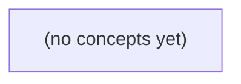

# 《12.01 运行环境与制品：从 Go 源码到可验证运行实例》

*面向 Go 初学者，以虚构 IM 网关 S2/v1 的静态教学合同为主线，建立从源代码提交、Go 二进制、OCI 镜像到运行容器、配置与数据状态的完整认知链。读者将理解为何同一标签或同一镜像摘要都不足以单独证明用户实际获得的服务行为，并能用制品清单与回滚矩阵进行纸上核对。*

**章节:** 2

---

## 本书导览

- 了解整本书的章节脉络
- 掌握各章之间的概念依赖关系
- 选择最合适的阅读顺序

# 《12.01 运行环境与制品：从 Go 源码到可验证运行实例》

面向 Go 初学者，以虚构 IM 网关 S2/v1 的静态教学合同为主线，建立从源代码提交、Go 二进制、OCI 镜像到运行容器、配置与数据状态的完整认知链。读者将理解为何同一标签或同一镜像摘要都不足以单独证明用户实际获得的服务行为，并能用制品清单与回滚矩阵进行纸上核对。

下方的概念图展示了本书 0 个核心概念以及它们之间的依赖关系；再下方是 1 个章节的入口。你可以按从上到下的顺序阅读，也可以根据自己的兴趣或先验知识选择切入点。

#### 概念图



## 章节索引

- **12.01 运行环境与制品：从Go二进制到可核对镜像** — 面向Go初学者，沿虚构IM网关说明源码、二进制、OCI镜像、标签/摘要、运行配置和数据的责任边界。

## 12.01 运行环境与制品：从Go二进制到可核对镜像

- 区分源码、二进制、镜像、容器、配置和状态
- 列出Go构建来源与BuildInfo证据边界
- 理解OCI层、manifest、tag与digest
- 解释相同摘要不同运行环境为何有不同结果
- 保护构建与运行秘密
- 交付从提交到业务合同的制品核对单

以虚构IM网关为线索，先拆开“代码相同”与“服务行为相同”的概念，再建立可核对的制品与运行边界。

### 从S2/v1合同识别服务边界

### 从S2/v1合同识别服务边界

虚构 IM 网关的“发送消息”能力，不能只用一句“返回 200 就算成功”描述。当前 **S2/v1 合同**已经明确了服务边界：

- 正文必须非空，且最多 `6` 个 UTF-8 字节；超出或为空应被拒绝。
- 原始 HTTP 请求正文最多 `4096` 字节；这是网关接收层的上限，不等同于消息正文上限。
- 同一消息 ID 重复提交，返回 `409`；因此客户端不能把重复发送误判为新消息被接受。
- 发送者不是目标会话成员时，返回 `404`；这里的 `404` 表示该成员关系下资源不可见或不可发送。
- 合法请求返回 `200 accepted_in_memory`：仅承诺消息已被当前进程接受并放入内存处理路径，不承诺已写入数据库、已持久化、已投递，或进程重启后仍存在。

因此，接口行为由合同、运行配置和实际状态共同决定，而非仅由 Go 源码或二进制名称决定。例如，同一个镜像标签若运行在不同成员数据、不同配置或不同版本的二进制上，仍可能对同一请求给出不同结果。

未来 **S3/v2** 的数据库提议即使仍保留 `6` 字节正文限制，也不能倒推当前服务已持久化。尤其 `R9` 尚待审，不能写入当前承诺。核对服务时，应先问：它实际执行的是哪份合同？返回的 `accepted_in_memory` 又究竟覆盖到哪一步？

### 源码、二进制与镜像不是同一物

### 源码、二进制与镜像不是同一物

“部署了同一个标签”并不等于“运行着同一种服务”。对 IM 网关而言，能否稳定满足 S2/v1 合同——非空正文最多 `6` 个 UTF-8 字节、原始 HTTP 请求正文最多 `4096` 字节、重复消息 ID 返回 `409`、非成员返回 `404`、成功返回 `200 accepted_in_memory`——取决于多个彼此独立的层次。

- **Git 提交**：记录源码某一版本，例如某次提交中实现了 `6B` 限制和重复 ID 检查。提交标识的是文本、构建脚本与依赖声明，不是可直接运行的服务。
- **Go 二进制**：由特定源码、Go 编译器、依赖版本、构建参数和目标平台编译得到。即使来自同一提交，`GOOS`、`GOARCH`、是否关闭 `CGO`、嵌入的版本信息不同，也可能得到不同文件与行为边界。
- **OCI 镜像**：封装二进制及其运行所需的文件系统层、基础镜像、证书和默认入口命令。镜像摘要（digest）可精确核对内容；可变的 `tag` 如 `gateway:latest` 不能。
- **容器实例**：镜像被启动后的进程实例。它还受端口映射、环境变量、挂载目录、资源限制、网络和启动命令影响；同一镜像可启动出行为不同的实例。
- **配置**：例如当前启用 `S2/v1`，未来 `S3/v2` 的数据库提议尚处于 `R9` 待审状态。配置决定实例实际采用哪套合同与开关，不能仅由镜像标签推断。
- **持久数据**：已接收的消息 ID、成员关系、会话或数据库状态决定请求结果。同一二进制面对不同数据，重复 ID 可能返回 `409`，非成员可能返回 `404`。

因此，核对服务时应同时记录：Git 提交、二进制校验值、镜像 digest、容器启动参数、有效配置和数据版本。只有这些边界一致，才有理由讨论服务行为是否一致。

### 从Go源码构建到可追溯二进制

### 从Go源码构建到可追溯二进制

Go 源码不是服务本身；`go build` 产出的二进制才是可执行制品。一次构建至少应能追溯以下输入：

- 源码提交：例如 Git 提交号，而非仅有浮动分支名。
- 模块依赖：`go.mod`、`go.sum` 锁定的版本与校验和。
- 构建参数：Go 版本、目标平台 `GOOS/GOARCH`、标签 `-tags`、编译变量 `-ldflags`。
- 构建上下文：是否有未提交修改、是否启用 `CGO_ENABLED`，以及生成代码是否已更新。

可将版本写入二进制，并在启动时记录：

`go build -trimpath -ldflags="-X main.version=<提交号>" ./cmd/gateway`

Go 还会在二进制中写入部分 `BuildInfo`。可通过 `go version -m ./gateway` 或程序内的 `debug.ReadBuildInfo()` 查看 Go 工具链、主模块、依赖模块，以及某些 VCS 修订信息。对 IM 网关而言，这些证据可回答：“运行的程序是否由某个源码修订和依赖集合构建而来？”

但它不能单独回答更关键的行为问题。即使两个二进制显示相同版本，也不能证明它们加载了相同配置、使用了相同镜像基础层，或连接到相同数据库。更不能证明其实际遵守 S2/v1：非空正文最多 `6` 个 UTF-8 字节、原始 HTTP 请求正文最多 `4096` 字节、重复同 ID 返回 `409`、非成员返回 `404`，以及成功响应为 `200 accepted_in_memory`。

因此，二进制标识应与源码提交、依赖清单和构建命令一起保存；运行时配置、镜像摘要及持久化数据则必须另行核对。未来 S3/v2 即使仍保留 `6B` 限制，且 R9 仍待审，也不能仅凭同一标签推断服务行为未变。

### 镜像标签与摘要的核对逻辑

### 镜像标签与摘要的核对逻辑

镜像不是一个单独的“文件”，而是一组按 OCI 规范组织的对象：若干只读层、配置对象与清单（manifest）。层保存文件系统增量；配置对象记录入口命令、环境变量、工作目录、架构等默认元数据；manifest 则列出该镜像实际引用哪些层和配置对象。

常见引用如：

`registry.example/im-gateway:s2`

其中 `s2` 是标签，便于人记忆和发布，但它是**可变指针**。仓库管理员可以把 `s2` 从旧 manifest 改指向新 manifest；因此“都运行 `:s2`”不能证明两台机器取得了相同镜像，更不能证明服务行为相同。

摘要通常写作：

`registry.example/im-gateway@sha256:abc...`

它是对象内容的哈希标识。若 digest 相同，拉取到的 manifest 内容相同；manifest 引用的配置对象和层也随之确定。部署记录应至少保存镜像仓库、标签（若使用）和 digest，例如：

- 发布意图：`im-gateway:s2`
- 实际解析结果：`im-gateway@sha256:abc...`
- 运行时容器 ID、启动参数与配置版本

还要注意，多架构镜像的标签可能先指向一个索引（index），再由运行节点选择 `linux/amd64` 或 `linux/arm64` 的具体 manifest。因此核对时应明确：核对的是顶层索引摘要，还是该节点最终选中的平台 manifest 摘要。

digest 固定的是镜像内容，不固定运行行为。即使 Go 二进制、层和配置对象完全一致，容器仍可能因挂载的 S2/v1 合同配置、环境变量、数据库地址或已有数据不同，表现出不同结果。比如同一镜像在一处返回“重复同 ID 为 409”，另一处若已切换到未来 S3/v2 的配置与实现，不能仅凭同一个标签宣称它们是同一种服务。

### 同一摘要为何仍会产生不同结果

### 同一摘要为何仍会产生不同结果

镜像摘要相同，只能证明拉到的是同一组镜像层；它不能证明 IM 网关面对同一请求会给出同一响应。服务行为还取决于容器启动时注入的配置、秘密、外部依赖和已有数据。

例如，两个容器都运行摘要为 `sha256:...` 的网关二进制，收到同一原始 HTTP 请求：

- `IM_MAX_BODY_BYTES=4096` 时，4097 字节请求体会被拒绝；若误设为更小值，合法请求也可能失败。
- 当前 S2/v1 合同要求非空正文最多 6 UTF-8 字节。这个限制既可能编译进二进制，也可能受版本开关影响；不能因为镜像标签相同，就假定都已启用未来 S3/v2 或 R9 规则。
- `DB_DSN`、成员关系表和消息去重记录不同，同一消息 ID 可能在实例 A 返回 `200 accepted_in_memory`，在实例 B 返回 `409`；发送者不属于目标会话时应返回 `404`，但前提是两边查询到相同成员数据。
- `JWT_SECRET`、证书、时钟、DNS、数据库版本和网络连通性也会改变鉴权、签名、超时与重试结果。

因此，交付核对单不应只写“镜像：`gateway:latest`”。至少应记录：

1. 不可变镜像摘要、二进制版本与构建来源；
2. 已解析的非秘密配置及其值、配置文件摘要；
3. 秘密的引用版本或轮换标识，避免记录明文；
4. 数据库迁移版本、成员数据快照范围、去重状态；
5. 实际启动命令、端口、资源限制、运行时与依赖地址；
6. 针对 `6` 字节正文、`4096` 字节请求体、重复 ID 的 `409`、非成员 `404` 的验收证据。

可核对的交付对象不是“同一个标签”，而是“同一制品摘要 + 同一运行输入 + 可追溯的数据与依赖状态”。

> **要点** — 摘要能核对镜像内容，不能单独证明服务合同；行为还取决于二进制、配置、秘密与状态数据。

Go 二进制并非源码的完整副本。要让 IM 网关制品可复核，必须从提交、依赖、生成物、工具链到目标平台逐项固定并留存证据。

### 从源提交定义可追溯起点

### 从源提交定义可追溯起点

可复核构建的起点不是“某个分支”，而是一个不可变的源码提交。构建记录应保存完整提交哈希，而非仅记录 `main`、`release/v1` 或标签名：分支会移动，轻量标签也可能被重写，只有提交对象才能精确指向当时的源码树。

但提交哈希仍不足以完整描述构建输入。二进制实际来自“提交 + 工作区状态 + 构建上下文”：

- **源码提交**：记录仓库地址、完整 `git commit`、提交时间，以及必要时的子模块提交。
- **工作区状态**：构建前必须确认 `git status --porcelain` 为空；未提交修改、暂存内容、未跟踪文件都可能参与编译或被 `go generate`、嵌入资源规则读取。
- **构建上下文**：明确构建目录、所选包路径、是否使用 `-mod=vendor`、是否启用构建标签，以及 `.gitignore` 之外实际进入构建环境的文件。

推荐在构建前生成可归档的证据，例如：

`git rev-parse HEAD`、`git status --porcelain=v1`、`git diff --binary HEAD`、`git submodule status --recursive`。

若工作区不干净，不应只把二进制标记为“来自某提交”；应保存补丁并为该状态分配独立的构建标识。否则，即使二进制中通过 `debug.ReadBuildInfo` 或 `go version -m` 显示了版本控制修订，也只能说明部分源码信息，不能证明本地改动、生成文件或构建目录中的额外输入未影响结果。

### 模块选择与校验的边界

### 模块选择与校验的边界

`go.mod` 声明当前模块的直接依赖、最低所需版本、`replace`、`exclude` 与模块路径等规则。构建时，Go 按“最小版本选择”解析依赖图：对同一模块路径，通常选择所有依赖要求中最高的版本。因此，最终依赖版本不仅受本项目 `require` 影响，也受间接依赖及替换规则影响。

`go.sum` 记录的是**已参与解析或下载的模块版本及其内容哈希**，用于校验下载内容是否与此前见过的内容一致。例如：

`example.com/lib v1.2.3 h1:...`

它能发现代理、缓存或下载链路中模块内容被篡改，也能让不同构建机对同一模块版本进行一致性验证。启用模块校验数据库时，Go 还会对公开模块的版本与校验和进行额外核验。

但不要把 `go.sum` 当作完整锁文件：

- 它可能包含当前目标平台、构建标签或测试路径并未实际使用的条目；
- 它不必列出构建图中的每一种潜在条件依赖；
- `replace` 指向本地目录时，本地目录内容不由 `go.sum` 固定；
- 私有模块、`GONOSUMDB`、`GOPRIVATE` 等配置会改变校验来源与边界；
- 生成代码、嵌入资源、编译器版本、环境变量和构建标签都不在其中。

因此，复核 IM 网关制品时，应同时保存提交号、完整 `go.mod`/`go.sum`、模块下载来源与缓存策略，并在干净环境执行 `go mod download` 或受控的 `go mod vendor`。`go.sum` 证明“下载到的模块内容可校验”，却不能单独证明“本次二进制的全部构建输入已被锁定”。

### 生成代码也是构建输入

### 生成代码也是构建输入

Go 编译器看到的只是最终文件树；`*.pb.go`、OpenAPI 客户端、Mock、`stringer` 输出、`go:embed` 打包的资源，都会直接影响二进制。因此，它们不能被视为“开发时顺手产生的副产物”，而应纳入制品推导链。

以 Protobuf 为例，结果不仅取决于 `.proto` 文件，还取决于：

- `protoc` 版本及其平台发行包；
- `protoc-gen-go`、`protoc-gen-go-grpc` 等插件的精确版本；
- 插件参数，如 `paths=source_relative`、模块路径、是否生成 gRPC 桩；
- 被导入的其他 `.proto` 定义及其版本；
- 生成命令的文件发现顺序与工作目录。

同一份协议文件由不同生成器处理，可能得到不同字段注释、运行时调用、序列化代码甚至不同的 Go 包路径；即使接口语义未变，最终二进制哈希也会变化。OpenAPI 代码生成同理：生成器版本、模板版本、规范文件解析器和格式化器都必须固定。

建议将生成命令写入受版本控制的 `go generate` 指令、`Makefile` 或任务脚本，并显式记录工具版本。例如以 `go install example.com/tool@vX.Y.Z` 安装，而非使用随 `PATH` 漂移的全局工具。若生成器本身依赖 Node、Java 等运行时，也要固定其版本与依赖锁定文件。

生成后的 `.go` 文件可选择提交到仓库，便于审查与无需生成环境的构建；也可在 CI 中重新生成并校验工作区无差异。关键不在于是否提交，而在于同一提交、同一生成工具和同一输入必须导出同一文件树。对于 `go:embed`，还应将被嵌入文件、压缩步骤、时间戳处理和资源目录筛选规则一并固定。

### 工具链与目标平台塑造二进制

### 工具链与目标平台塑造二进制

同一 Git 提交并不天然对应唯一的 Go 二进制。编译结果至少由工具链版本、目标平台、构建约束、CGO 状态和链接参数共同决定，应将它们视为制品身份的一部分。

- **Go 工具链版本**：不同 Go 版本可能改变编译器优化、标准库实现、链接器布局、模块解析细节与默认安全行为。记录 `go version`，并固定实际使用的工具链；仅有 `go.mod` 中的 `go` 指令不足以证明编译器版本。
- **目标平台**：`GOOS` 与 `GOARCH` 决定系统调用、文件路径语义、字节序、指令集和二进制格式。例如 `linux/amd64` 产生 ELF 文件，而 `windows/amd64` 产生 PE 文件；即使业务源码完全相同，哈希也必然不同。
- **构建标签**：`-tags` 会选择带有 `//go:build` 约束的不同文件。诸如 `debug`、`enterprise`、`sqlite` 等标签可能直接改变功能、依赖树或默认配置，必须显式留存。
- **CGO**：`CGO_ENABLED=1` 时，产物可能依赖 C 编译器、系统头文件和本机动态库；`CGO_ENABLED=0` 常更易获得静态、可移植的产物，但并不适用于全部依赖。
- **链接参数**：`-ldflags` 常用于注入版本、提交号和构建时间，也可控制符号裁剪与外部链接。不同参数会改变内容，构建时间尤其会破坏可重复性。

建议将实际命令、`GOOS`、`GOARCH`、`CGO_ENABLED`、`-tags`、`-ldflags`、Go 版本及 C 工具链版本写入构建证明。`debug.ReadBuildInfo()` 或 `go version -m ./gateway` 可读取部分嵌入信息，但不能据此推断所有标签、环境变量、链接参数或源码状态都已被完整记录。

### 读取 BuildInfo，但不夸大证据

### 读取 BuildInfo，但不夸大证据

Go 可在二进制中嵌入部分构建元数据。运行中的程序可调用 `debug.ReadBuildInfo()`，离线检查制品则可执行 `go version -m ./gateway`。两者通常都能看到：

- 主模块路径、版本及可能的修订标识；
- 被选择的依赖模块及其版本；
- 部分构建设置，例如 `GOOS`、`GOARCH`、`CGO_ENABLED`、`-buildmode`、`-compiler`；
- 使用模块代理校验时记录的依赖校验和信息。

二者的观察位置不同：`debug.ReadBuildInfo()`适合服务启动时记录、健康诊断或暴露审计端点；`go version -m`无需启动程序，适合在镜像导出后、发布前或事故取证时检查最终二进制。它们读取的本质都是二进制内的构建信息，不能把“能读到”误解为“可完整复现”。

尤其要注意以下边界：

- 主模块版本常依赖构建时注入的 VCS 信息；若在无 `.git` 元数据的源码副本中构建，可能缺少精确提交。
- `go.sum`及其摘要不会作为“全部依赖文件内容”自动嵌入；替换规则、私有模块来源、`vendor` 内容也未必完整可见。
- `-ldflags`、环境变量、生成代码输入、编译标签、外部 C 库版本、容器基础镜像摘要等，可能只部分出现或完全不出现。
- 即使显示同一提交，也不能证明工作区没有未提交修改，更不能证明生成物确由该提交重新生成。

因此，BuildInfo 应视为制品的**交叉核对证据**：将其中的提交、依赖、平台和构建设置与发布清单、源码仓库标签、`go.mod`/`go.sum`、生成物摘要及镜像摘要比对。它能帮助发现明显漂移，却不能单独构成“源码与构建配置完整一致”的证明。

> **要点** — 可核对的 Go 制品需固定并记录提交、依赖、生成步骤、工具链、平台与参数；BuildInfo 只是有限证据，不能替代完整构建记录。

镜像不是一个模糊的“发布包”，而是一组可被摘要精确定位的对象。理解它们的引用关系，才能核对实际运行的版本。

### 从镜像名到内容对象

### 从镜像名到内容对象

镜像名通常写作 `registry.example.com/team/app:v1`，其中仓库 `team/app` 是对象集合的逻辑位置，标签 `v1` 只是一个可变的名称指针。今天它可能指向摘要 `D1`，重新推送后仍叫 `v1`，却可能改指向 `D2`。因此，标签便于发布和使用，却不能单独证明运行内容。

摘要（digest）形如 `sha256:...`，由对象字节内容计算而来，是内容寻址标识。引用 `app@sha256:D1` 表示锁定该摘要对应的对象；只要摘要不变，对象内容就不变。

最常见的引用链是：

`镜像名:标签` → `manifest 摘要` → `config 摘要 + 多个 layer 摘要`

- **manifest**：镜像清单，列出配置对象和文件系统层的摘要、媒体类型与大小。
- **config**：描述运行配置，例如入口命令、环境变量、工作目录、历史记录及平台信息。
- **layers**：按顺序叠加的文件系统变更层，组合后形成容器看到的根文件系统。

多平台镜像还会先指向一个 **index**（也称 manifest list）。`app:v1` 或其摘要可能对应 index；index 再按 `linux/amd64`、`linux/arm64` 等平台选择具体的 platform manifest。故“index 的摘要固定”不等于“某个平台 manifest 的摘要相同”：核对运行版本时，应同时确认拉取的平台，以及该平台最终解析出的 manifest digest。

### Manifest 如何描述可运行镜像

### Manifest 如何描述可运行镜像

OCI 镜像的核心不是一个单独文件，而是一份 `manifest`：它声明“要运行这个镜像，需要哪份配置，以及按什么顺序叠加哪些文件系统层”。

一份单平台 manifest 通常包含三类信息：

- `config`：引用配置对象。配置中记录运行时元数据，例如入口命令、环境变量、工作目录、默认用户，以及与层对应的 `diff_ids`。
- `layers`：按顺序引用多个文件系统层。每层都是一个不可变 blob，解压后表示一次文件系统变更：新增文件、修改文件或删除文件。
- `schemaVersion`、媒体类型与平台相关元数据：帮助运行时按 OCI 规则解析对象。

引用并非依赖名称，而是依赖描述符中的摘要，例如：

`sha256:abc...`

摘要由对象内容计算而来。只要 config 或任一 layer 的字节内容变化，其 digest 就会变化；manifest 中的引用随之变化，最终 manifest 自身的 digest 也会变化。因此可将关系理解为：

`manifest digest → config digest + layer digests → 具体运行内容`

运行时拉取 `repo@sha256:M1` 时，先取得 digest 为 `M1` 的 manifest，再按其中的 digest 下载 config 和 layers，并可逐个校验内容是否匹配。这使 `M1` 成为一份可核对的运行配方，而不只是“某个版本的名字”。

需要区分：多平台镜像标签常先指向一个 `index`，index 再按 `linux/amd64`、`linux/arm64` 等平台指向不同 manifest。此时 index digest 固定的是“平台选择表”，而实际节点运行内容还要继续核对所选平台的 manifest digest。

### 标签可变，摘要不可变

### 标签可变，摘要不可变

`tag` 是便于人类使用的名字，`digest` 是对内容计算出的身份标识；两者承担的责任不同。

设仓库中最初存在：

- `app:v1` → `sha256:D1`
- `sha256:D1` 对应一份确定的镜像清单，以及它引用的 `config` 和各层 `layers`

此时执行：

```text
docker pull registry.example/app:v1
```

拉取到的是“查询时 `v1` 所指向的对象”。随后发布者可以重新推送并更新标签：

- `app:v1` → `sha256:D2`
- `sha256:D1` 仍表示原来的内容
- `sha256:D2` 表示另一份内容，可能只是代码、基础镜像或配置发生了变化

因此，标签是**可移动引用**：同一个 `v1` 名称今天可能指向 `D1`，明天可能指向 `D2`。它适合“最新稳定版”“某主版本”等发布入口，却不能单独证明某个工作负载实际运行了哪份字节内容。

digest 则是**内容寻址**。当部署声明为：

```text
registry.example/app@sha256:D1
```

运行时应解析并拉取 `D1` 所标识的同一对象；标签后来是否改指向 `D2`，不会改变该引用的含义。核对镜像、排查事故和做发布审计时，应记录这种带 digest 的完整引用。

多平台镜像还要区分两层摘要：`index digest` 指向平台索引，索引再选择如 `linux/amd64` 对应的 `manifest digest`。前者固定“可选平台集合”，后者固定某一平台实际使用的镜像内容；核对运行节点时，最终还应关注其选中的平台 manifest。

### 多平台镜像的两层定位

### 多平台镜像的两层定位

多平台镜像通常先发布一个 **索引（index）**。它按平台列出多个平台 manifest，例如：

- `linux/amd64` → manifest `M_amd64`
- `linux/arm64` → manifest `M_arm64`

索引本身也有摘要，记为 `I`。引用 `repo/app@sha256:I` 的含义是：固定选择这份平台清单；它并不直接等于某台机器最终拉取的层文件集合。

运行时，容器引擎会依据宿主机平台，从索引中选择匹配的 manifest。若节点是 `linux/amd64`，实际运行链路为：

`index I` → `manifest M_amd64` → `config + layers`

因此需要区分两层定位：

1. **index digest**：固定“有哪些平台版本及其映射关系”，适合描述一次多平台发布。
2. **平台 manifest digest**：固定某个具体平台的 config 与 layers，适合核对某个节点实际使用的镜像内容。

同一 index 下的 `M_amd64` 与 `M_arm64` 通常不同：它们可能包含不同的 Go 二进制、基础镜像层，甚至构建时间。仅记录 `app:1.0` 无法证明版本；仅记录 index digest 也不能直接说明某个节点选中了哪份平台 manifest。核对运行环境时，应同时确认节点平台和最终解析到的 manifest digest。

### IM网关的镜像核对场景

### IM网关的镜像核对场景

事故单写着“线上 IM 网关运行 `v1`，但行为不像刚发布版本”。此时不能把 `v1` 当作版本证据：标签只是仓库中的可变指针，今天可能指向摘要 `D1`，回滚或重推后也可能改指向 `D2`；同名标签不代表同一份内容。

最小核对路径应从**实际部署引用**开始：

1. 查看 Deployment、Pod 或运行时记录，确认配置的是 `registry.example/im-gateway:v1`，还是已固定的 `@sha256:...`。
2. 获取正在运行 Pod 的实际镜像 ID／运行时解析结果，记录其摘要，而非只记录镜像名称和标签。
3. 查询仓库中当前 `v1` 所解析到的 digest，并与运行时摘要比较。两者不同，说明标签已漂移；线上仍可能运行旧内容。
4. 若摘要对应的是多平台镜像索引（index），继续按节点平台，如 `linux/amd64` 或 `linux/arm64`，解析其指向的平台 manifest。
5. 以该平台 manifest digest 为核对对象；它明确引用一个 config 和一组 layers，因而唯一确定该节点实际使用的文件系统层与运行配置。

可将核对结论写成类似形式：

`Pod im-gateway-7c9 运行 linux/amd64 manifest @sha256:M1；其由发布索引 @sha256:I1 解析得到；当前标签 v1 已指向 @sha256:I2。`

其中 `I1` 与 `I2` 是索引摘要，`M1` 才是该平台节点拉取的 manifest 摘要。只有把“部署标签、索引摘要、平台 manifest 摘要”分开记录，才能证明线上究竟运行了哪个制品。

> **要点** — 标签便于选择但可移动；digest 才能固定内容。核对运行版本必须记录实际解析的摘要及其平台对象。

同一镜像摘要只能证明交付物一致，不能保证运行结果一致；结果还取决于配置、挂载、依赖服务与权限边界。

### 区分制品身份与运行事实

### 区分制品身份与运行事实

镜像摘要回答的是“部署了哪个制品”，而不是“它此刻如何运行”。例如 `sha256:...` 可唯一定位一组镜像层与默认元数据，却不能覆盖启动命令、环境变量、挂载文件、网络策略、服务账号或数据库内容。

应将运行对象明确拆开：

- **镜像摘要**：交付物身份。用于核对二进制、依赖与镜像配置是否为已批准版本；镜像层不应承载运行中产生的权威状态。
- **容器实例**：一次具体启动。它有创建时间、实例标识、退出码、资源限制和临时文件系统；重建容器不承诺保留内存状态、会话、设备确认或本地临时文件。
- **运行配置**：决定行为的输入，包括参数、配置文件版本、功能开关、挂载来源与权限。启动时应记录配置的版本、摘要和来源，如“配置中心修订号”或“挂载对象版本”，但不得记录口令、令牌、私钥等私密值。
- **持久数据**：数据库、对象存储、卷中的业务事实。其备份、迁移、保留与恢复策略独立于镜像发布。
- **外部依赖**：数据库、消息系统、身份服务、第三方接口及其可用性、数据版本和访问权限；它们同样会改变结果。

因此，审计一次运行至少应能回答：使用了哪个镜像摘要、创建了哪个容器实例、加载了哪版非敏感配置、连接了哪些依赖以及以何种权限连接。尤其对现行 `v1` 正文 `6B` 的限制，必须由受版本控制的配置与服务端校验共同保证，不能让某个未核对的环境变量在运行时悄悄放宽。

### 同一摘要为何产生不同结果

### 同一摘要为何产生不同结果

镜像摘要固定的只是文件系统层与入口命令；运行结果还可表示为：

$$
R = F(I,\ E,\ C,\ M,\ D,\ N,\ P)
$$

其中，$I$ 是镜像，$E$ 是环境变量，$C$ 是配置文件，$M$ 是挂载内容，$D$ 是外部数据库状态，$N$ 是网络可达性，$P$ 是运行身份与权限。即使 $I$ 完全相同，任一其余输入变化，都可能得到不同的 $R$。

- **环境变量**：`TZ`、特性开关、地址、超时、日志级别都会改变行为。尤其不能让某个未受控变量把现行 `v1` 正文 6B 限制悄悄放宽；限制应由受版本控制的策略配置明确给出。
- **配置文件**：同一二进制读取不同配置源，可能连接不同服务、启用不同功能。启动时应记录配置版本、配置来源、校验摘要和生效项名称，而非记录密钥、令牌或完整连接串。
- **挂载内容**：卷中的模板、证书、规则文件、上传数据或时区库可覆盖镜像内默认值。镜像层不是这些运行时文件的权威历史卷。
- **数据库状态**：迁移版本、已有数据、事务隔离、初始化是否完成，都会改变查询与写入结果；“容器重新创建”不等于数据库回到初始状态。
- **网络与权限**：域名解析、路由、代理、服务端证书，以及 `UID/GID`、文件权限、云角色和设备访问权限，决定进程能否实际完成操作。

因此，核对镜像摘要只是第一步；还必须核对生效配置、挂载摘要、依赖版本与权限边界。容器重建仅重建进程实例，不承诺恢复内存状态、外部状态或设备确认。

### 以IM网关定位配置越权

### 以IM网关定位配置越权

设 IM 网关的现行 `v1` 合同规定：客户端正文最大为 `6B`。这不是“默认建议”，而是对外可验证的业务边界：发送 `7B` 正文应被拒绝，返回明确的长度错误；发送不超过 `6B` 的正文才进入后续鉴权、路由与投递流程。

问题常出在运行环境注入了看似无害的变量：

`IM_MAX_BODY_BYTES=1024`

若网关启动后直接以该变量覆盖代码中的 `6B` 限制，同一镜像在测试环境拒绝 `7B`、在某生产实例却接受 `7B`。这会造成合同漂移：客户端行为不再由已发布的 `v1` 决定，而取决于容器启动参数、编排模板或临时运维操作。更危险的是，该变量可能不在镜像内，镜像扫描、制品签名和代码审查都难以发现这次放宽。

应区分两类配置：

- **部署参数**：监听端口、日志级别、连接池大小、依赖服务地址等，可随环境变化，但不得改变 `v1` 已承诺的请求语义。
- **合同参数**：正文上限、字段必填性、鉴权规则、错误码语义等，必须由版本化合同或受审计的服务端策略决定；若要调整，应发布 `v2` 或明确变更合同，而非读取隐藏变量。

启动时可记录“正文限制来源为 `v1` 合同、配置版本为 `contract-v1.3`、策略摘要为 `sha256:...`”，但不要记录环境变量全集、令牌、数据库密码或完整配置内容。排障时据此核对实例是否加载了正确策略；若发现某实例的有效上限不是 `6B`，应判定为配置越权，而不是把它解释为正常环境差异。

### 启动核对与安全记录策略

### 启动核对与安全记录策略

应用启动应生成一份可检索、可比对的“运行身份记录”，用于回答：这次进程究竟运行了哪个制品、采用了哪版配置、配置从何而来、哪些规则实际生效。建议在健康检查就绪前完成核对，并以结构化日志或受控审计事件写出：

- 镜像摘要或构建制品标识，如不可变的 `sha256:...`、提交号、构建时间；
- 配置版本、配置包校验值、模式版本；
- 每个配置项的来源类别：默认值、配置文件、环境变量、挂载文件、远程配置服务、启动参数；
- 生效项摘要，例如监听端口、数据库主机别名、功能开关、限流档位、正文大小上限；
- 外部依赖的逻辑标识与连接策略，而非凭据本身。

记录“来源”与“摘要”比记录完整原文更重要。可对配置规范化后计算摘要：

`配置指纹 = SHA-256(排序后的非秘密生效配置)`

这样可比较两次运行是否配置漂移，而不会把密码、令牌、私钥、连接串中的凭据写入日志、指标标签、错误消息或镜像层。秘密项应仅记录为“已提供/未提供”、来源类型及安全引用名，例如 `数据库密码：密钥管理服务引用 db-prod-password`；不得输出其值、长度或可逆编码。

对于安全边界，启动核对必须显式拒绝隐式放宽。例如现行 `v1` 的正文限制为 `6B`，不得因某个未纳入版本化配置规范的环境变量而变大。应用应维护允许覆盖项清单：未知变量、越权来源、冲突配置或不符合模式的值均应使启动失败，而非“尽力运行”。镜像保存的是交付物，不应内置运行秘密；容器重建后，内存状态、临时文件及设备确认均不应被视为可恢复事实。

### 重建容器的承诺与非承诺

### 重建容器的承诺与非承诺

重建容器应被理解为“按声明重新启动一个新实例”，而不是“恢复上一实例的一切经历”。若镜像摘要、启动命令、环境变量引用、配置版本、挂载声明、网络与权限策略均可核对，则可合理承诺：新容器运行相同程序版本，并以同一份已声明的配置规则启动。

| 可由镜像与声明式配置重现 | 不应因“重建”而默认承诺 |
|---|---|
| Go 二进制及其依赖文件 | 进程内存、协程状态、未完成请求 |
| 固定的启动参数与入口命令 | `/tmp` 等临时文件、匿名卷内容 |
| 已版本化配置及其来源标识 | 本地缓存、运行时生成文件 |
| 明确声明的挂载路径、网络、用户与权限 | 设备已确认、人工操作结果 |
| 对外部服务的连接方式 | 外部数据库当前数据、事务位置与锁状态 |

因此，启动日志应记录“配置版本、配置来源、挂载标识、镜像摘要”等可核对元数据，但不得写入密码、令牌、私钥或完整连接串。配置值本身若含敏感信息，应仅记录其引用名、版本号或摘要。

尤其要防止隐式放宽规则：现行 `v1` 正文上限为 `6B` 时，不能因为某个未纳入配置审计的环境变量存在，就在某环境中悄悄接受更大正文。此类差异必须成为受控、可追溯的配置变更。

镜像文件层是交付物，不是权威历史卷。需要跨重建保留的状态，应显式落入受管卷、对象存储或数据库，并分别定义备份、恢复、一致性与权限边界。

> **要点** — 摘要锁定镜像，不锁定运行世界；可核对交付必须同时声明配置、依赖、权限、数据与业务合同。

构建秘密与运行凭据不能混入镜像；可核对的制品还必须记录基础镜像来源，并持续承担升级责任。

### 秘密为何不能写进构建参数

### 秘密为何不能写进构建参数

`ARG` 适合传递可公开、可审计的构建选择，例如版本号、目标平台或编译标签：

`ARG GO_VERSION=1.22`  
`ARG TARGETOS=linux`

它不是秘密通道。即使 `ARG` 默认不会进入最终容器环境，参数值仍可能出现在镜像构建历史、缓存键、构建日志、持续集成记录或镜像检查结果中；若执行过 `ENV TOKEN=$TOKEN`，秘密还会进一步固化为镜像配置的一部分，可被运行容器的进程读取。

`ENV` 的暴露面更直接：它会写入镜像元数据，并默认继承到由该镜像启动的容器。把数据库密码、私有仓库令牌或云访问密钥写成 `ENV`，等于将其随镜像分发给所有能够拉取、检查或运行该镜像的人。

构建时确实可能需要临时凭据，例如下载私有 Go 模块。此时应使用 BuildKit 的构建秘密挂载：

`RUN --mount=type=secret,id=git_token ...`

秘密只在该条 `RUN` 指令执行期间以临时文件形式可见，不应复制到工作目录、输出日志或最终制品。运行时凭据则应由受控配置、密钥管理服务、编排平台的秘密对象及最小权限身份注入，而不是预先烘焙进镜像。

### 镜像历史中的秘密残留

### 镜像历史中的秘密残留

Go 服务通过 IM 网关拉取私有模块、内部证书或构建授权时，秘密不应成为 Docker 构建指令的一部分。以下写法即使最终删除文件，也已经泄露：

`ARG IM_TOKEN`  
`RUN git config --global url."https://${IM_TOKEN}@im-gateway/".insteadOf "https://..."`

问题不只在最终文件系统。`ARG` 的取值、展开后的 `RUN` 命令可能出现在镜像历史、构建日志或缓存记录中；`ENV IM_TOKEN=...` 更会写入镜像配置元数据，任何能检查镜像的人都可能读取。类似地，先 `COPY .netrc /root/.netrc`、下载依赖、再 `RUN rm`，秘密所在的旧层仍可被导出或从层缓存恢复。

更隐蔽的是缓存污染：含令牌的下载层可能被共享构建缓存复用，令牌失效后仍残留于缓存元数据；若私有依赖被打包进模块缓存，也应确认其中不含认证配置、私有地址或调试输出。

应使用构建秘密临时挂载：

`RUN --mount=type=secret,id=im_token go mod download`

构建过程从 `/run/secrets/im_token` 读取令牌，仅在该条指令执行期间可见；不要把它复制到工作目录、写入 `git config` 或回显到日志。构建完成后，可检查 `docker history`、镜像配置与导出的层文件，确认不存在令牌、`.netrc`、认证头或内部凭据。运行期凭据则由受控配置、工作负载身份或权限系统注入，绝不随二进制和镜像层发布。

### 用构建秘密完成临时认证

### 用构建秘密完成临时认证

构建 Go 服务时，私有模块、内部制品库或企业证书常要求令牌、`.netrc`、SSH 密钥或自定义 CA。它们只应在构建命令执行期间可见，绝不能通过 `ARG`、`ENV`、`COPY` 写入镜像层：即使随后删除，历史层、构建缓存和镜像元数据中仍可能留下痕迹。

使用 BuildKit 的构建秘密挂载，将敏感内容以临时文件形式提供给单条 `RUN` 指令：

```dockerfile
# syntax=docker/dockerfile:1.7
FROM golang:1.23@sha256:... AS build
WORKDIR /src
COPY go.mod go.sum ./

RUN --mount=type=secret,id=netrc,target=/root/.netrc \
    --mount=type=secret,id=corp_ca,target=/usr/local/share/ca-certificates/corp.crt \
    update-ca-certificates && go mod download

COPY . .
RUN --mount=type=secret,id=netrc,target=/root/.netrc \
    CGO_ENABLED=0 go build -trimpath -o /out/service ./cmd/service
```

构建时由受控环境传入秘密，而非写入 Dockerfile 或代码仓库：

`docker buildx build --secret id=netrc,src=$HOME/.netrc --secret id=corp_ca,src=corp.crt .`

应将秘密挂载限制到真正需要认证的命令；不要把它复制到工作目录、输出目录或最终运行阶段。最终镜像仅复制编译产物及必要的公开运行文件，并可通过 `docker history`、镜像层导出和制品扫描核对其中不含令牌、证书私钥或凭据文件。

构建凭据解决的是“如何取得依赖”；服务运行时的数据库密码、云身份等凭据应由部署平台通过最小权限的受控配置、工作负载身份或秘密卷注入，不能沿用构建期秘密。

### 运行凭据应由环境受控注入

### 运行凭据应由环境受控注入

运行凭据的核心原则是：**镜像只包含程序与非敏感默认配置，凭据在运行时由受控环境提供**。不同注入方式的责任边界并不相同：

| 方式 | 适用内容 | 主要风险 | 责任归属 |
|---|---|---|---|
| 镜像内置配置 | 端口、日志级别、功能开关 | 密钥进入层、仓库、导出包和缓存；更新需重建镜像 | 构建与发布流程 |
| 环境变量注入 | 少量短生命周期配置、连接地址 | 可被诊断接口、子进程、错误日志或平台元数据暴露 | 编排平台与部署流程 |
| 挂载文件 | 证书、令牌、较长配置、轮换材料 | 文件权限过宽、挂载路径被误读或复制 | 密钥系统、卷与容器权限 |
| 工作负载身份 | 云访问、服务间认证、动态换取令牌 | 身份绑定过宽、令牌受众或权限设计错误 | 身份平台、策略与服务端授权 |

环境变量方便，但不应被误认为“天然安全”。它适合传递非秘密参数，或由平台临时注入的短期令牌；应用必须避免把完整环境打印到日志、错误页或诊断端点。对于私钥、证书链、数据库密码等材料，优先使用只读文件挂载，并限制容器用户的读取权限。

更理想的模式是工作负载身份：容器以服务账号、云角色或 SPIFFE 身份启动，再向受信任的凭据服务换取短期令牌。这样镜像、部署清单和人工操作都不持有长期静态密钥；撤销、轮换与审计也集中在身份系统完成。

无论采用何种方式，应用都应将凭据来源抽象为配置接口，而非把具体密钥写死在代码、镜像或启动参数中。部署环境负责注入最小权限凭据，应用负责不泄露、及时重载或在凭据失效时安全失败。

### 固定基础摘要不是永久免责

### 固定基础摘要不是永久免责

使用标签如 `golang:1.22-alpine` 构建时，标签指向的实际镜像可被上游更新；同一份 Dockerfile 在不同日期可能得到不同层、不同系统库，进而产生不可复现的二进制运行环境。将基础镜像固定到内容摘要可消除这种漂移：

`FROM golang:1.22-alpine@sha256:...`

摘要绑定的是确定的镜像内容。结合锁定依赖、记录构建参数和生成制品证明，可以回答“这个镜像究竟基于什么构建”，也便于复现、审计和事故回滚。

但固定摘要只是在某一时刻冻结风险，不会修复风险。该摘要中的 `musl`、`openssl`、证书包或系统工具后来仍可能披露高危漏洞；如果团队只因“已固定”而长期不更新，就会把可复现性误解为安全性。

应建立受控升级闭环：

- 持续扫描基础镜像摘要及其软件物料清单，订阅发行方和漏洞库公告。
- 定期复审摘要年龄、漏洞状态、支持生命周期与上游替代版本。
- 由自动化工具提出摘要更新，再通过构建、测试、镜像扫描和签名验证后合并。
- 在制品元数据中保留旧、新摘要、升级原因、测试结果和发布时间，确保变更可追溯、可回退。

因此，摘要固定解决“构建的是不是同一份输入”；监测与升级机制解决“这份输入是否仍然可接受”。

> **要点** — 秘密只在受控时点注入；基础镜像以摘要锁定，并通过持续审计和升级维持可信。

以虚构IM网关为线索，沿提交、构建、镜像到运行现场逐项核对，厘清“可复现制品”与“可预测运行”的边界。

### 先画清七类对象的责任边界

### 先画清七类对象的责任边界

以 IM 网关为例，一次“上线版本”不能只写成 `gateway:v1.8.0`。至少应区分以下对象：

- **提交 `C`**：源代码与构建脚本的某个版本，如 Git commit。它记录“意图和输入”，但不能证明实际使用了哪版编译器、是否有未提交改动，也不能证明线上运行的就是它。
- **工具链 `G`**：Go 版本、编译参数、依赖下载环境、构建容器等。它决定如何把 `C` 变成制品；相同 `C` 在不同 `G` 下可能产生不同二进制。
- **二进制 `B`**：编译后的可执行文件，可用哈希标识。它证明某次构建的直接产物，但单独不能说明运行时基础镜像、证书、配置或目标架构。
- **镜像摘要 `D1`**：内容寻址的镜像身份，如 `sha256:...`。它固定镜像层与配置，是部署时应核对的制品锚点；但不保证镜像中的服务一定适配当前数据状态。
- **标签 `T`**：人类易读的别名，如 `prod`、`v1.8.0`。标签可被重新指向，因此只能帮助选择，不能作为不可变审计证据。
- **部署配置 `K`**：环境变量、副本数、流量规则、挂载、密钥引用、资源限制等。相同 `D1` 配合不同 `K`，行为可能完全不同。
- **平台架构 `A`**：如 `linux/amd64`、`linux/arm64`。镜像即使共享标签，也可能为不同 `A` 解析到不同平台清单或二进制。
- **数据状态 `S`**：数据库 schema、迁移进度、消息积压、缓存格式与外部协议状态。它不属于镜像，却常决定升级和回滚是否安全。

因此，可核对的运行事实更接近：

\[
R=(C,G,B,D1,T,K,A,S)
\]

其中 `T` 是可变入口，`D1` 才是镜像内容身份；而 `D1` 也只是运行输入之一，不能替代对 `K`、`A` 与 `S` 的核验。

### 从提交C到二进制B：构建证据链

### 从提交 C 到二进制 B：构建证据链

对虚构 IM 网关而言，二进制并不是“由某个提交自动得来”的简单产物，而应被描述为一次可核对的推导：

\[
B = f(C,\; M,\; G,\; P,\; E,\; A)
\]

其中，$C$ 是源码提交，$M$ 是依赖图及其校验和，$G$ 是 Go 工具链版本，$P$ 是构建参数，$E$ 是构建环境，$A$ 是目标平台架构。只有这些输入足够明确，才可以讨论二进制 $B$ 是否可复现。

- **源码证据**：记录完整提交 SHA，而非仅记录分支名或短 SHA；还应确认工作区干净，没有未提交补丁。
- **依赖证据**：`go.mod` 声明依赖范围，`go.sum` 固定实际下载内容；私有模块、`replace` 指令、生成代码都会改变最终输入。
- **工具链证据**：`go version`、编译器发行来源及补丁版本不可省略。相同源码在不同 Go 版本下，可能得到不同机器码、链接行为或运行时特性。
- **构建参数证据**：如 `GOOS`、`GOARCH`、`CGO_ENABLED`、`-tags`、`-trimpath`、`-ldflags`。特别是通过 `-ldflags "-X ..."` 注入版本、提交号或配置地址时，这些值本身已成为制品输入。
- **环境证据**：是否使用 CGO、系统 C 库版本、时区数据、证书包与代码生成器版本，都可能使“同一提交”不再导出同一二进制。

Go 的 `debug.ReadBuildInfo()` 或 `go version -m gateway` 可从已编译二进制读取 BuildInfo，通常能提供主模块路径、版本、VCS 提交、是否脏工作区、Go 版本，以及部分构建设置。这适合回答：“这个二进制**声称**来自哪里、由什么 Go 工具链构建？”

但 BuildInfo 不是完整证明：它通常不能证明依赖下载物与 `go.sum` 完全一致，不能覆盖外部代码生成输入、CGO 链接库、编译容器镜像，也不能证明二进制未被事后替换或篡改。因此，应将 BuildInfo 视为二进制内嵌的线索，而将构建日志、依赖校验记录、构建器身份与二进制哈希共同保存，形成可审计的证据链。

### 从二进制B到摘要D1：镜像不是标签

### 从二进制 B 到摘要 D1：镜像不是标签

将 Go 二进制 `B` 放入容器，并不自动得到一个可核对的镜像身份。OCI 镜像由多类内容对象组成：

- **层（layer）**：例如基础系统文件、证书、时区数据，以及复制进去的 `B`；每层以压缩内容的摘要标识。
- **配置对象（config）**：记录运行时元数据，如入口命令、环境变量、工作目录、默认用户、目标平台 `A`，并列出层的 `diff_id`。
- **清单（manifest）**：引用配置对象和各层描述符；其字节内容计算出的摘要就是常说的镜像摘要 `D1`。
- **索引（index）**：多架构镜像还会有索引，分别指向 `linux/amd64`、`linux/arm64` 等平台的 manifest；此时应明确记录索引摘要还是某平台 manifest 摘要。

因此可抽象为：

\[
D1 = H(\text{manifest}(\text{config},\ \text{layers},\ A))
\]

只要二进制 `B`、基础层、构建产生的文件、配置中的 `CMD`/`ENV`/用户，或平台 `A` 任一项变化，manifest 通常随之变化，`D1` 也应变化。反过来，仅知道 `B` 的哈希，仍不能推出完整运行镜像：启动命令、动态库、CA 证书和基础层都可能不同。

标签 `T` 则只是仓库中的可变引用，例如 `gateway:stable`、`gateway:v1.8`。它表达“当前指向哪个制品”，而非制品内容本身：

\[
T \xrightarrow{\text{某时刻}} D1,\qquad
T \xrightarrow{\text{之后}} D2
\]

于是“部署了 `gateway:stable`”不是可核对事实；可核对记录应是仓库、摘要与平台，例如 `registry.example/gateway@sha256:D1`，并同时保存其来源提交 `C`、工具链 `G` 和构建参数。标签可用于人类发布流程，但部署控制器、审计记录和回滚决策应以 digest 为准。

### 两组纸上核对：同标签与同摘要

### 两组纸上核对：同标签与同摘要

设 IM 网关提交为 `C1`，Go 工具链为 `G1`，构建出的二进制为 `B1`。镜像标签 `T=im-gateway:prod` 只是可变名称；镜像摘要 `D` 才是内容寻址的制品身份。

**场景一：同一标签，不同摘要。**

- 周一：`C1 + G1 → B1 → D1`，发布时 `T → D1`。
- 周三：有人以 `C2` 重建，或基础镜像、依赖下载结果变化，得到 `B2 → D2`，随后覆盖标签：`T → D2`。

两次部署清单都写着 `image: im-gateway:prod`，但实际运行分别是：

\[
(T,D)_{\text{周一}}=(prod,D1),\qquad (T,D)_{\text{周三}}=(prod,D2)
\]

因此，“使用同一个标签”不能证明运行相同代码。排障时应从节点实际拉取的摘要反查 `D1/D2`，再关联二进制、工具链和提交，而不是只问“是不是 prod”。

**场景二：同一摘要，不同运行结果。**

固定 `D1`，即所有节点运行相同镜像层与同一 `B1`，但运行现场仍可不同：

\[
R=f(D1,K,A,S)
\]

- `K1` 开启严格鉴权，`K2` 关闭；同一请求在前者返回未授权、后者成功。
- `A=amd64` 与 `A=arm64` 可能拉取不同平台变体；若镜像未显式核对平台，`D1` 的“同名镜像”并不等于同一可执行内容。
- `S1` 的数据库已完成迁移，`S2` 仍保留旧字段或旧会话；同一程序可能分别正常启动与读写失败。

回滚也因此不能仅把 `T` 指回旧摘要：还要确认旧二进制能否读取当前数据状态，并与仍在线的旧客户端、协议版本和配置契约兼容。

### 回滚是业务兼容，不是改回标签

### 回滚是业务兼容，不是改回标签

把标签 `T` 改回旧值，只改变“下次拉取哪个镜像”的指向；它并不自动恢复数据库结构、缓存格式、消息协议或已升级客户端。因此，回滚判断应从“镜像能否启动”升级为“旧制品能否继续履行业务合同”。

对每次发布建立可核对单：

- **来源与制品**：提交 `C`、Go 工具链 `G`、二进制校验值 `B`、镜像摘要 `D`、目标架构 `A`。生产实际运行的是不可变的 `D`，不是可变的标签 `T`。
- **运行配置**：部署配置 `K`，包括环境变量、开关、资源限制、入口参数、依赖地址；同时记录配置版本与生效时间。
- **秘密边界**：清单只保存秘密的引用、版本号或摘要，绝不记录明文。回滚前确认旧镜像仍有权限读取对应秘密，且新旧密钥轮换策略允许并存。
- **数据状态**：记录数据库迁移版本、索引、缓存键格式、队列消息版本和对象存储布局。数据状态 `S` 往往不能随镜像自动回退。
- **客户端合同**：确认旧服务是否识别新字段、新枚举值和新请求路径；对外协议应采用“先兼容读取，再延后删除”的演进方式。

设发布现场为 `(C,G,B,D,T,K,A,S)`。两种常见误判尤其危险：

1. **同一 `T`、不同 `D`**：`T=prod` 可能今天指向 `D1`，明天被覆盖为 `D2`。即使标签相同，实际代码与依赖层已经不同，不能据此宣称“回到了原版本”。
2. **同一 `D`、不同 `K`**：镜像仍是 `D1`，但连接串、功能开关或限流参数变为 `K2`。二进制未变，行为却可能改变，故障也未必由镜像引入。

真正的回滚方案应明确：回到哪个 `D`、采用哪个 `K`、允许的数据状态范围 `S`，以及旧客户端兼容窗口。若迁移不可逆，应优先前滚修复、双写或适配层，而不是盲目把标签指回旧镜像。

> **要点** — 摘要锁定制品，不能锁定运行结果；可靠交付还需核对配置、架构、状态、秘密与业务兼容性。

在讨论镜像构建与运行排障前，先建立可逐项核对的制品清单，避免把代码证据、镜像证据和运行证据混为一谈。

### 用清单划定制品责任边界

### 用清单划定制品责任边界

制品清单不是“镜像已构建”的一句结论，而是把源码、构建输入、依赖、镜像内容与运行结果连接成可复核链路。每一项都应能回答明确问题：

- **源码**：使用哪个提交、分支或标签？记录提交哈希，避免“本地最新代码”成为不可追溯输入。
- **构建**：由哪个构建脚本、参数、Go 版本和目标平台生成？例如 `GOOS`、`GOARCH`、是否启用 CGO，会直接影响二进制可运行性。
- **依赖**：`go.mod`、`go.sum` 与基础镜像是什么？依赖锁定回答“同一源码能否得到同类制品”。
- **摘要**：镜像以 `digest` 而非浮动标签识别。`image:tag` 只说明名称，`sha256:...` 才能核对实际字节内容。
- **配置**：入口命令、环境变量、配置文件来源和监听端口是什么？这回答“二进制以什么方式启动、业务开关如何生效”。
- **运行身份**：容器用户、用户组、文件权限及是否特权运行是什么？这决定进程能读取什么、能修改什么。
- **环境权限**：网络、数据库凭据、消息队列权限、挂载卷和设备访问分别被授予到何种范围？未声明即不能假定具备。
- **验证结果**：启动日志、健康检查、接口响应及对应时间点是什么？应区分“进程存活”与“业务合同成立”。

例如，当前可记录 S2 场景中 `6B/409/404/200` 的正反例及其请求、响应与日志关联；这只证明该场景下的接口行为，不承诺设备能力或数据库语义，后续 S3 应单独测试。类似地，固定引用 OpenIM `send.go` 的 `MsgToMQ` 和 Mongo 消费片段，只能构成外部实现线索，不能证明本项目镜像包含该代码、实际连接该 Mongo，或已完成消息消费。清单的作用正是让每个结论停留在其证据能够覆盖的责任边界内。

### 源码、构建与依赖的可追溯证据

### 源码、构建与依赖的可追溯证据

可追溯性首先回答“这个二进制由什么推导而来”，而不是“它现在是否正在某设备、数据库或消息队列上正确运行”。最小证据链应记录：

- **源码身份**：仓库地址、分支、提交号、是否存在未提交修改；提交号只能定位源码快照，不能证明该快照已被实际编译。
- **构建环境**：`go version`、目标平台如 `GOOS=linux`、`GOARCH=amd64`、构建时间、构建机或构建流水线标识。
- **构建参数**：完整 `go build` 参数、标签、`-ldflags` 注入值、是否使用 `-trimpath`、是否启用竞态或调试选项。不同参数可从同一提交产生行为不同的二进制。
- **依赖闭包**：`go.mod`、`go.sum`、模块代理或私有模块来源；必要时保存 `go list -m all` 输出。它们说明编译时解析的模块版本，但不自动覆盖运行时下载的配置、证书或插件。
- **二进制自描述信息**：`go version -m ./app` 或程序暴露的 `debug.ReadBuildInfo()` 可核对 Go 工具链、主模块、部分依赖及嵌入的版本设置。应将其与构建日志、二进制哈希和镜像摘要交叉比对。

例如，S2 中观察到 `6B`、`409`、`404`、`200` 等正反例，只能作为接口行为验证结果；即使引用 OpenIM 的 `send.go` 中 `MsgToMQ`，以及 Mongo 消费相关代码，也只能证明外部参考实现存在相应路径，不能证明本项目镜像包含、调用或成功运行了这些代码。

因此，提交号、BuildInfo 与依赖清单构成“源码→二进制”的推导证据；镜像 `digest`、运行身份、环境权限和实际验证结果仍须分别记录。设备接入与数据库行为也不在此处承诺，应留待后续 S3 场景独立测试。

### 从镜像摘要核对到运行身份

### 从镜像摘要核对到运行身份

标签只是可变引用，如 `app:latest` 或 `app:v1.2.0`；真正可复现的镜像身份应以 manifest digest 表示：

`registry.example/app@sha256:<digest>`

OCI 镜像由配置对象、manifest 与多个只读层组成。层记录文件系统增量，配置对象记录入口命令、环境变量、工作目录、默认用户等；manifest 将它们组合为可拉取制品。核对时不能只确认“标签存在”或“容器已启动”，而应确认部署实际拉取的 digest 与构建、扫描、签名记录中的 digest 一致。

建议将下列字段写入制品清单并相互关联：

- **镜像**：仓库、标签、manifest digest、平台架构、构建时间、基础镜像 digest。
- **启动配置**：`Entrypoint`、`Cmd`、监听端口、挂载、资源限制、注入的配置版本。
- **运行身份**：镜像 `USER`、编排层 `runAsUser`/`runAsGroup`、是否允许提权、是否只读根文件系统。
- **环境权限**：服务账号、云端角色、密钥挂载、网络出口、数据库与消息队列访问范围。
- **验证结果**：实际 Pod/容器 ID、已解析的 `imageID`、健康检查、请求验证及时间戳。

例如，部署声明 `app:v1.2.0`，但运行记录应进一步显示其解析为 `sha256:abc...`；若镜像配置使用非 root 用户，而编排配置又覆盖为 root，则运行身份应以最终生效配置为准。`200`、`404`、`409` 等接口结果只能证明特定请求路径的行为，不能单独证明该响应来自目标 digest，更不能推出设备或数据库能力已经满足。固定的 OpenIM `send.go` 调用 `MsgToMQ`、Mongo 消费代码，也只能作为外部项目实现线索；除非能对应到本项目源码、构建输入和运行 digest，否则不能替代镜像证据。

### 同一摘要为何产生不同业务结果

### 同一摘要为何产生不同业务结果

镜像摘要相同，只能证明运行的**文件系统制品**相同，不能证明每次启动都处于相同的业务条件。可将实际行为抽象为：

$$
结果 = F(\text{镜像摘要},\ \text{配置},\ \text{秘密},\ \text{网络},\ \text{运行身份},\ \text{外部状态})
$$

因此，`sha256:...` 一致的两个实例，仍可能得到 `200`、`404`、`409` 或 `6B` 等不同结果。

| 条件差异 | 可能表现 | 是否可由镜像摘要证明 |
|---|---|---|
| 功能开关、路由配置、环境变量 | 同一请求被启用、拒绝或走不同处理路径 | 否 |
| 令牌、证书、签名密钥 | 鉴权失败、调用下游失败、消息无法验签 | 否 |
| DNS、网络策略、服务发现 | 无法连接 Mongo、MQ 或设备服务 | 否 |
| 容器运行身份、挂载权限 | 无权读取配置、证书或本地文件 | 否 |
| 数据库已有记录、事务并发 | 首次成功，重复请求返回 `409` | 否 |
| 设备在线状态、设备侧协议能力 | 请求超时、设备拒绝或产生业务码 `6B` | 否 |

当前 S2 可以核对的是：请求在给定环境下是否分别获得预期的 `200`、`404`、`409` 或 `6B`，以及对应日志、响应体和镜像摘要是否能关联。这里的正反例证明的是**该制品在该组条件下的观测结果**，而不是对所有设备、所有数据库状态或所有网络条件的承诺。

尤其不能仅凭 OpenIM 的 `send.go` 中 `MsgToMQ`，以及某段 Mongo 消费代码，就断言本项目镜像必然发送消息、必然被消费，或必然驱动设备结果。它们至多是外部代码路径证据；还需核对本项目实际构建来源、依赖版本、运行配置、连接目标与运行日志。设备行为、数据库一致性和跨服务链路保证，应留待 S3 在可控环境中单独验证。

### IM网关的正反例与交付核对单

### IM网关的正反例与交付核对单

当前 S2 的交付结论应围绕已观测到的接口结果建立：`6B`、`409`、`404`、`200`。它们共同说明网关在特定请求、路由与业务分支下的响应行为，但不自动推出“镜像已正确构建”“依赖已完整打包”或“设备、数据库能力已兑现”。

交付时应附带可逐项复核的清单：

- **源码**：提交号、分支、构建时工作区状态，以及产生 `6B/409/404/200` 的处理路径。
- **构建**：构建命令、Go 版本、目标平台、编译参数与输出二进制校验值。
- **依赖**：`go.mod`、`go.sum`、私有模块或系统库来源；避免仅凭本机缓存复现。
- **镜像**：镜像仓库、标签、不可变 `digest`、Dockerfile 或等价构建定义，以及二进制在镜像中的实际路径。
- **运行配置**：监听地址、路由前缀、鉴权与业务开关；配置值应区分默认值、注入值和敏感值。
- **运行身份与权限**：容器用户、文件可读写范围、网络出口、挂载目录及访问密钥的注入方式。
- **验证结果**：每个请求的输入、期望状态、实际状态、响应摘要、日志关联标识；`200` 是成功正例，`409`、`404` 与 `6B` 则应明确对应的冲突、未找到或业务拒绝语义。

需要特别避免证据错位：OpenIM 的 `send.go` 中 `MsgToMQ` 调用，以及 Mongo 消费端片段，至多证明参考实现存在消息投递与消费逻辑；若没有对应提交、构建记录、镜像文件层或运行日志关联，它们不能单独证明本项目镜像包含该代码，更不能证明该链路在当前环境已运行。

本轮 S2 只确认上述网关结果及其可追溯证据。设备接入、设备状态，以及 Mongo 等数据库的真实连通性、写入一致性和消费结果，均不在此处承诺，应在后续 S3 中以独立环境、独立数据和端到端记录验证。

> **要点** — 可信交付不是只有镜像摘要，而是源码、构建、依赖、运行条件与验证结果可相互核对的证据链。

以虚构 IM 网关为线索，厘清从 Go 提交、可执行文件到 OCI 镜像及线上容器的证据链，建立可核对、可回滚的交付视角。

### 分清交付对象与责任边界

### 分清交付对象与责任边界

以 IM 网关为例，一次“发布”并非把代码推到服务器，而是交付一组可核对对象：

- **源码**：Git 提交、`go.mod`、`go.sum` 与构建脚本。它描述“准备构建什么”；`go.sum` 固定依赖模块内容校验，不等于锁定编译器、系统库或最终镜像。
- **Go 二进制**：由特定源码、依赖、Go 工具链和构建参数产生的可执行文件。它承载协议处理、鉴权、路由等业务逻辑；可通过 `BuildInfo` 记录模块版本等信息，但 `BuildInfo` 通常不能完整证明构建环境、秘密参数或全部源码状态。
- **OCI 镜像**：二进制及其运行时文件系统、默认入口、环境变量和元数据的封装。镜像应负责“程序如何被带到运行环境”，不应固化生产密码、证书私钥等构建秘密。
- **容器**：镜像在某次启动后的运行实例，叠加了命令行参数、挂载卷、网络、资源限制与注入配置。容器会消失，不能被当作可复用交付物。
- **配置**：端口、上游地址、限流阈值、功能开关等环境差异，应独立版本化、审计并与镜像引用关联。
- **数据**：用户消息、会话、数据库结构和迁移结果，具有持久性与兼容性责任；回滚镜像前必须确认旧程序能否读取新数据。

镜像标签如 `gateway:stable` 可被重新指向，适合人类操作；`digest` 是内容地址，才适合作为发布证据。注意：同一镜像 `digest` 仍可因容器配置、挂载数据或运行参数不同而表现不同。因此，OpenIM 一类系统的发布记录至少应同时保存：源码提交、镜像 digest、配置版本、数据迁移版本与审批状态（如 R9 待审）。

### 从提交到二进制：Go 构建证据

### 从提交到二进制：Go 构建证据

对 IM 网关而言，“某个提交构建出了某个二进制”不是一句版本号，而是一条可复核的推导链：

`源码提交 + 依赖集合 + Go 工具链 + 构建参数 + 构建环境 → 可执行文件摘要`

- `go.mod`声明模块路径、直接/间接依赖版本以及最低 Go 版本约束；它说明构建**意图**，但不能单独锁定所有实际下载内容。
- `go.sum`记录依赖模块及其 `go.mod` 文件的校验和。启用模块校验时，它可发现依赖内容被替换或篡改；但它不是源码快照，也不能证明私有代理、替换规则、`vendor/` 内容或下载策略完全一致。
- 提交标识应记录为不可变 Git 提交哈希，而非分支名或可变标签。提交哈希证明“引用了哪版源码树”，不能证明该树已通过审查、测试，或工作区没有未提交修改。
- 构建参数会改变产物：如 `GOOS`、`GOARCH`、`CGO_ENABLED`、`-tags`、`-trimpath`、`-ldflags`、链接器与 Go 版本。应将其连同二进制 `sha256` 一并保存。
- Go 的 `BuildInfo` 可通过 `go version -m` 或 `debug.ReadBuildInfo` 读取，通常包含主模块、依赖版本、部分构建设置，以及在满足条件时的 VCS 修订和脏工作区标记。它适合做运行中追溯，但不是完整供应链证明：信息可缺失、可被构建方式影响，也不保证对应仓库可访问。

建议发布记录至少包含：提交哈希、`go.mod`/`go.sum` 摘要、工具链版本、完整构建命令、二进制摘要与 BuildInfo 输出。若二进制由 CI 生成，还应关联流水线编号、构建日志和签名证明。

> **R9 待审风险**：若构建使用私有依赖、`replace`、本地目录、`vendor`、构建秘密或未固定的基础环境，仅凭提交哈希与 BuildInfo 无法复现或证明依赖来源。此类发布应标记为“待审”，不得将“可运行”误写为“可核对”。

### OCI 镜像：层、清单、标签与摘要

### OCI 镜像：层、清单、标签与摘要

OCI 镜像不是一个“单文件程序包”，而是一组按内容校验的对象。构建时，文件系统变更被拆成只读层：例如基础系统层、安装依赖层、复制 Go 二进制层。容器启动后再叠加一层可写层；写入日志、临时文件或上传内容通常落在这里，不能把它误当作镜像制品证据。

镜像的核心索引是 `manifest`。它列出配置对象与各层的摘要、媒体类型和顺序；配置对象还记录入口命令、环境变量、工作目录、目标平台等元数据。因此，镜像身份至少要区分：

- `tag`：如 `openim/openim-server:v3.8.0`，是便于人使用的可变引用。仓库维护者可以重新推送同名标签，标签指向的实际内容可能变化。
- `digest`：如 `openim/openim-server@sha256:...`，是对象内容的哈希标识。部署记录应以摘要为准，才能精确回答“线上运行的是哪份镜像”。
- `manifest list`：多架构镜像常先由一个索引摘要定位，再按 `linux/amd64`、`linux/arm64` 选择具体 manifest。相同标签在不同节点上可能拉到不同平台制品。

核对 OpenIM 镜像时，应从发布说明或受控镜像仓库取得“版本号—镜像仓库—摘要—平台”的证据，再在集群中比对实际 `imageID` 或已解析摘要。仅看到 `:latest`、`:release` 或某个版本标签，不足以证明运行内容未漂移。

还要注意：同一层内容摘要并不保证运行配置相同。不同 `ENTRYPOINT`、环境变量、用户、端口声明或架构 manifest，均可使镜像行为不同。故变更审批应同时保存镜像引用、完整 digest、配置/manifest 证据与部署清单；回滚时固定到旧 digest，并确认其数据库迁移与消息、文件等持久化数据仍向后兼容。

### 同一摘要为何运行出不同结果

### 同一摘要为何运行出不同结果

镜像摘要（digest）只证明镜像配置与各层文件内容相同；它并不等于“运行环境完全相同”。同一 `sha256:...` 制品可核对，却仍可能产生不同行为，因为容器实际执行的是：

`结果 = 二进制 + 镜像文件系统 + 运行配置 + 外部依赖 + 持久化数据`

- **环境变量与启动参数**：同一 OpenIM 网关镜像，`DB_DSN` 指向测试库或生产库、`LOG_LEVEL` 为 `debug` 或 `error`、特性开关不同，都会改变连接、日志和业务分支。镜像内的 Go `BuildInfo` 只能说明编译时嵌入的信息，不能证明这些运行时取值。
- **挂载配置与秘密**：ConfigMap、配置文件、证书、令牌及构建后注入的秘密通常不在镜像层中。相同摘要挂载不同 `config.yaml`，可能得到不同限流阈值、鉴权策略或消息路由。
- **网络与权限**：DNS、代理、网络策略、服务账户、文件系统只读设置、Linux capability 均会影响运行。二进制未变，容器仍可能因无法解析数据库域名或无权读取密钥而失败。
- **外部依赖与数据**：数据库 schema、Redis 中缓存、消息队列积压、对象存储内容均属于镜像外状态。同一版本面对不同数据，可能返回不同结果，甚至触发迁移兼容性问题。

因此，发布证据不能只记录镜像摘要，还应记录部署清单、关键配置版本、秘密引用、权限、依赖端点与数据迁移版本。回滚镜像时尤其要核对数据是否可向后兼容：代码可回退，不代表已写入的新 schema 或新格式数据能够安全回退。

### 交付核对单：秘密、回滚与业务合同

### 交付核对单：秘密、回滚与业务合同

一次可回滚的 IM 网关发布，不是“镜像能启动”即可，而要让代码、制品、配置、数据迁移与业务行为形成可核对合同。上线前应至少确认：

- **源码与制品**：记录提交标识、依赖锁定文件 `go.sum`、构建参数、二进制 `BuildInfo`、镜像 digest。`go.sum`用于校验模块内容，并不等于完整构建环境证明；`BuildInfo`可说明编译时嵌入的信息，也不能证明运行时配置或秘密。
- **镜像身份**：部署清单应固定 `image@sha256:...`，不能只写可变的 `tag`。同一 digest 表示镜像内容相同，但容器仍可能因环境变量、挂载配置、入口参数、节点架构或网络策略不同而表现不同。
- **秘密隔离**：数据库口令、JWT 签名密钥、第三方 API 密钥不得写入 Git、`Dockerfile`、镜像层、构建日志或 `go build -ldflags`。构建阶段若需私有依赖凭证，应使用短期构建秘密；运行阶段由 Secret、工作负载身份或密钥服务注入，并记录“使用了哪个秘密版本”，不记录秘密值。
- **数据兼容**：回滚镜像前先问：新版本是否已写入旧版本无法识别的数据？例如新增消息状态、会话字段、索引或事件格式。迁移宜采用“先扩展、后切换、再收缩”：先让旧新版本都能读取，再启用新写入，确认无回滚窗口后才删除旧字段。
- **业务合同**：明确接口版本、消息幂等键、鉴权声明、投递语义与降级行为。若新版本把“至少一次投递”改为“去重后至多一次”，即使健康检查通过，也属于业务合同变更，应单独评审。
- **回滚证据**：保留上一稳定 digest、部署配置快照、迁移版本、关键指标基线和 OpenIM 调用证据。标记为 `R9 待审` 的风险不得仅凭镜像回退关闭；必须确认数据、秘密权限与外部依赖均恢复到兼容状态。

> **要点** — 可核对交付不止确认镜像摘要，还必须把构建来源、运行配置、秘密和数据兼容性共同纳入证据链。
