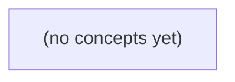

# 12.11 声明式交付与可重复环境：Go 初学者的 IM 配置交付教材

*一本面向 Go 初学者的静态教材，以虚构 IM 网关将 LOG_LEVEL 从 info 调整为 debug 为主线，追踪变更从 Git 声明、环境渲染、Kubernetes API 对象到 Pod 进程与用户结果的完整链路。课程严格界定当前 S2/v1 业务合同与未来 S3/v2、R9 提议，结合 GitOps、配置更新、漂移、字段所有权、权限审计和 22 道附答案练习，建立可验证的交付思维。*

**章节:** 2

---

## 本书导览

- 了解整本书的章节脉络
- 掌握各章之间的概念依赖关系
- 选择最合适的阅读顺序

# 12.11 声明式交付与可重复环境：Go 初学者的 IM 配置交付教材

一本面向 Go 初学者的静态教材，以虚构 IM 网关将 LOG_LEVEL 从 info 调整为 debug 为主线，追踪变更从 Git 声明、环境渲染、Kubernetes API 对象到 Pod 进程与用户结果的完整链路。课程严格界定当前 S2/v1 业务合同与未来 S3/v2、R9 提议，结合 GitOps、配置更新、漂移、字段所有权、权限审计和 22 道附答案练习，建立可验证的交付思维。

下方的概念图展示了本书 0 个核心概念以及它们之间的依赖关系；再下方是 1 个章节的入口。你可以按从上到下的顺序阅读，也可以根据自己的兴趣或先验知识选择切入点。

#### 概念图



## 章节索引

- **12.11 声明式交付与可重复环境：配置提交后为何仍未生效** — 面向Go初学者，以虚构IM网关非秘密LOG_LEVEL变更解释配置分层、声明式交付、GitOps调谐、漂移、权限与审计。

## 12.11 声明式交付与可重复环境：配置提交后为何仍未生效

- 区分制品、配置、数据与业务合同
- 跟踪Git到用户结果的异步状态链
- 构建环境分层和可重复渲染证据
- 解释OpenGitOps四原则
- 辨认ConfigMap环境变量生效边界
- 分类漂移及字段所有权
- 形成最小权限和审计闭环

以 IM 网关将非秘密 LOG_LEVEL 从 info 调为 debug 为线索，厘清一次配置提交为何尚未成为用户可观察到的运行结果。

### 先划清不变的业务合同与可变配置

### 先划清不变的业务合同与可变配置

将 IM 网关的 `LOG_LEVEL` 从 `info` 改为 `debug`，是在调整**运行可观测性**，不是在发布新的业务行为。配置提交后，即使尚未被实例加载，也不应让客户端面对不同的接口合同。

可将交付对象分为四类：

- **镜像制品**：由镜像 digest 精确标识，决定运行的是哪份 Go 二进制及其依赖。digest 不变，不能据此推断新配置已经生效；反之，镜像更新也不天然意味着配置更新。
- **运行配置**：例如启动参数、环境变量、ConfigMap 引用中的 `LOG_LEVEL=debug`。它决定进程启动时采用何种日志策略，通常需要重建、重启或滚动替换实例后才进入进程。
- **敏感配置**：Secret 引用用于令牌、密码等秘密值；本例日志级别是非秘密配置，不应因为方便而放入 Secret。
- **持久化数据**：数据库中的用户、会话、消息等业务状态。配置变更不应偷偷改写这些数据；`stored_in_teaching_db` 仍只是 S3/v2 的未来提议，不是当前事实。

因此，当前 S2/v1 的业务合同保持不变：正文非空且最多 `6` UTF-8 字节，原始 HTTP 请求体最多 `4096` 字节；同一 ID 重复提交返回 `409`，非成员返回 `404`，成功仅返回 `200 accepted_in_memory`，且状态只存在本进程内存。`LOG_LEVEL=debug` 最多增加诊断日志，不能把 `409` 改成成功、把 `404` 隐藏，或将内存接受伪装成已持久化。R9 从 `6` 调至 `9` 字节仍待审，也不属于日志级别变更的附带效果。

### 从 Git 提交到 Pod 重建的异步状态链

### 从 Git 提交到 Pod 重建的异步状态链

将 IM 网关的 `LOG_LEVEL` 从 `info` 改为 `debug` 并提交 Git，只表示**期望状态**发生了变化；它尚未等价于某个运行中进程已经输出调试日志。典型链路是：

1. **Git 提交**：配置仓库中的 `ConfigMap`、Helm values 或 Kustomize 覆盖层被修改。此时可观察证据是提交哈希、差异内容和合并记录。
2. **渲染产物**：CI 或 GitOps 工具把模板展开为 Kubernetes 清单。应检查最终产物中是否确有 `LOG_LEVEL=debug`，而不是只看源模板。
3. **GitOps 调谐**：控制器轮询或接收 webhook 后，将集群实际对象拉向 Git 中的声明。可查看同步状态、目标提交哈希、事件与失败原因。控制器延迟、权限不足或渲染错误都会使提交尚未落入集群。
4. **集群对象更新**：`ConfigMap` 已变为新值，并不必然触发 `Deployment` 重建。若环境变量通过 `configMapKeyRef` 注入，已有 Pod 的进程通常不会自动获得新环境变量。
5. **工作负载滚动更新**：需要模板哈希变化、显式 `rollout restart`，或由配置校验和注解驱动新 ReplicaSet 创建。观察 `Deployment` 的 generation、ReplicaSet、Pod 创建时间及就绪状态。
6. **进程启动与读取**：新 Pod 拉取既定镜像 digest，以新的启动参数和环境变量启动；最终证据应是容器内 `LOG_LEVEL=debug`，以及网关实际出现 debug 级日志。

镜像 digest 负责“运行哪份程序”；启动参数与 `ConfigMap` 引用负责“程序以何种非秘密配置启动”；`Secret` 引用仅负责敏感值注入；数据库数据则是运行期业务状态。它们责任不同：本次日志级别变更不应改变 S2/v1 的 6 B 正文限制、409 重复语义、404 非成员语义，或 `accepted_in_memory` 仅限本进程内存这一业务合同。

### ConfigMap 注入环境变量的生效边界

### ConfigMap 注入环境变量的生效边界

将 IM 网关的非秘密配置 `LOG_LEVEL` 从 `info` 改为 `debug` 时，常见做法是把它写入 ConfigMap，再通过 Pod 的环境变量注入：

`LOG_LEVEL <- ConfigMap["LOG_LEVEL"]`

这里有两个不同事实：

1. **ConfigMap 对象已更新**：集群控制面保存了新的 `LOG_LEVEL=debug`。
2. **网关进程已使用新值运行**：某个实际 Pod 在启动时读取到了 `debug`，并据此初始化日志级别。

环境变量属于**进程启动时的输入**。Pod 创建后，容器内进程已经获得一份环境变量快照；即使随后更新 ConfigMap，正在运行的 Go 进程通常仍保留原来的 `LOG_LEVEL=info`。因此，不能仅因 ConfigMap 显示为 `debug`，就断言请求日志已经变为调试级别。

典型生效链路是：

- 提交 ConfigMap：`info → debug`；
- 更新或触发 Deployment 的 Pod 模板变更；
- 控制器创建新 Pod；
- 新容器启动时从 ConfigMap 注入 `LOG_LEVEL=debug`；
- 新 Pod 通过就绪检查并接收流量；
- 旧 Pod 被逐步终止。

可用“新 Pod 的创建时间、其环境变量、启动日志和实际调试日志”共同验证，而非只检查 ConfigMap。若网关仅在 `main` 中读取一次：

`level := os.Getenv("LOG_LEVEL")`

那么热更新 ConfigMap 不会自动改变该变量；除非程序另行实现配置监听、文件重载或管理接口。

这类变更不改变业务合同：S2/v1 的正文上限、重复 ID 返回 `409`、非成员返回 `404`、`200 accepted_in_memory` 仅代表本进程内存接受，均不因日志级别从 `info` 调为 `debug` 而改变。

### 可重复渲染、环境分层与漂移归因

### 可重复渲染、环境分层与漂移归因

同一份网关声明不应直接等同于三个环境中的同一运行结果。应先固定共同基线，再通过受控覆盖层生成目标配置：

- **开发环境**：可将 `LOG_LEVEL=debug` 作为覆盖项，便于排查；副本数、资源限制和外部地址也可能较宽松。
- **测试环境**：通常验证接近生产的镜像 digest、启动参数与配置组合；日志级别可为 `info`，或仅在特定测试中临时覆盖为 `debug`。
- **生产环境**：应使用已批准的镜像 digest、明确版本的 ConfigMap 引用和最小化覆盖；不能因开发调试方便而默认打开 `debug`。

可重复渲染的关键是：给定相同输入，必须得到相同清单。输入至少包括基础声明、环境覆盖、镜像 digest、启动参数、ConfigMap/Secret 的名称与版本引用。若输入固定而渲染结果不同，问题在渲染链路；若渲染结果相同而运行对象不同，则应检查部署后的漂移。

可按字段所有权归因：

| 现象 | 常见归因 |
|---|---|
| 生产覆盖层明确把 `LOG_LEVEL` 设为 `info` | 期望漂移：环境策略不同，非故障 |
| 运维直接修改运行对象为 `debug` | 手工漂移：声明与实际状态不一致 |
| 自动控制器又将其改回 `info` | 控制器冲突：多个写入者争夺字段 |
| ConfigMap 已更新但 Pod 未重启或未重新加载 | 生效链路缺失，不是提交接口失败 |

镜像 digest 决定运行的程序字节；启动参数决定进程如何读取配置；ConfigMap 负责非秘密配置；Secret 负责敏感值引用；数据库数据则属于运行时业务状态。`LOG_LEVEL` 从 `info` 改为 `debug` 只改变诊断行为，不改变 IM 网关既有业务合同。尤其要区分：接口返回 `accepted_in_memory` 仅表示本进程接受了变更，尚不能证明渲染产物、集群对象与实际进程都已一致。

### 以最小权限完成调试与审计闭环

### 以最小权限完成调试与审计闭环

将 `LOG_LEVEL=info` 改为 `debug` 是非秘密配置变更，但“提交成功”不等于运行环境已改变。对 IM 网关而言，配置变更不应修改业务合同：S2/v1 仍要求正文非空且最多 `6` 个 UTF-8 字节、原始 HTTP 请求体最多 `4096` 字节、同 ID 重复仍返回 `409`、非成员仍返回 `404`；`200 accepted_in_memory` 也仍只表示本进程内存已接受。不要借调试之名提前实现 S3/v2 的 `stored_in_teaching_db`，更不能擅自把待审的 R9 上限从 `6` 放宽到 `9` 字节。

采用 OpenGitOps 时，期望状态应以版本化声明提交，例如仅修改部署清单中容器的启动参数或其引用的非秘密 `ConfigMap`：

- 变更者只拥有目标仓库、指定环境目录和对应 `ConfigMap` 键的最小写权限；
- 提交中记录工单号、变更原因、预期日志特征、回滚提交；
- 自动化控制器拉取已批准的 Git 提交，并持续调谐集群实际状态；
- 验证时确认运行镜像的 **digest** 未变化，避免把“换镜像”误判为“改配置”。

责任边界必须清楚：

- 镜像 digest 决定运行的程序内容，应由构建与发布流程负责；
- 启动参数和 `ConfigMap` 是可声明、可审计的非秘密运行配置；
- `Secret` 即使被应用引用，也不应出现在提交、日志、调试命令或审计截图中；
- 数据库数据属于业务状态，不是日志级别变更的修复手段，禁止直接篡改。

完成调谐后，以受控请求触发网关日志，核对 `debug` 日志出现，同时复验 `409`、`404` 与正文长度限制未变。若日志异常、工作负载未重启或实际状态漂移，应回滚到上一 Git 提交，由控制器恢复声明状态。审计记录至少关联提交哈希、审批人、调谐结果、镜像 digest、验证时间与回滚结果，从而形成“声明—生效—验证—可撤销”的闭环。

> **要点** — 配置已提交不等于进程已更新；应以可重复渲染、调谐状态、Pod 证据和审计记录共同确认生效。

一次配置提交并不等于用户立刻看到结果。要定位“未生效”，必须沿着声明、渲染、平台状态、进程值与业务结果逐层验证。

### 从提交G到业务结果B的异步状态链

### 从提交 G 到业务结果 B 的异步状态链

一次提交后的“未生效”，通常不是单点故障，而是以下状态链中的某一跳断裂：

- **声明源 G**：Git 中提交的配置、模板和版本引用，是团队审查与回滚的依据。例如变更 `C1` 将镜像声明改为 `D1`，或将配置键改为 `K1`。验证证据是提交记录、分支、标签及提交后的文件内容；它只能证明“纸上声明已变”，不能证明集群已接收。
- **渲染结果 R**：Helm、Kustomize、流水线变量等处理后的目标对象集合。G 中的占位符、条件分支或覆盖文件可能使 R 与人眼阅读的源文件不同。应保存渲染产物并比较其镜像、命名空间、环境变量和 ConfigMap 名称。
- **API 对象 `spec/status`**：`spec` 是提交给平台的期望状态，`status` 是控制器观察到的当前状态。`spec` 中写了 `D1` 不等于新 Pod 已 `Ready`；`status` 显示运行也不等于它满足业务合同，例如探针可能过宽、旧副本仍在接流量。
- **进程实际值 E**：容器启动后真正可见的镜像、环境变量、挂载文件、启动参数与运行时读取结果。它受 Pod 重建、ConfigMap 挂载方式、应用是否热加载等影响，必须进入 Pod 或查看进程诊断端点确认。
- **业务结果 B**：用户请求实际得到的响应、页面、数据或指标。B 还受 Service 路由、缓存、异步消费者、数据库副本延迟和外部依赖影响；这是最终验收层。

例如，环境变量与 ConfigMap 数据并非同一层配置：

```yaml
spec:
  template:
    spec:
      containers:
      - name: web
        image: example/web:D1
        env:
        - name: FEATURE_X
          value: "true"
---
data:
  K1: "true"
```

前者位于工作负载 `spec.template.env`，通常需重建 Pod 才进入 E；后者只是 ConfigMap 的数据，是否进入进程还取决于引用方式与应用重载逻辑。排障应按 `G → R → spec/status → E → B` 收集证据，而不要仅凭“已提交”或“Pod 正常”宣布变更生效。

### 纸上变更C1为何不等于运行版本D1与K1

### 纸上变更 C1 为何不等于运行版本 D1 与 K1

Git 中的配置提交 `C1` 只是声明源 `G` 的一个版本：它说明“希望怎样部署”，却不自动说明集群正在运行什么。运行结果至少还受两个独立版本影响：

- `D1`：镜像制品版本，例如 `app@sha256:...`，决定进程内实际代码、默认配置和依赖。
- `K1`：集群中已创建对象的版本，决定当前 Deployment、ConfigMap、Pod 是否确实引用了 `C1` 的渲染结果 `R`。

典型错位是：`C1` 修改了 ConfigMap，但 `K1` 尚未同步；或 `K1` 已更新 ConfigMap，Deployment 的 `spec.template` 未变化，旧 Pod 未重建；又或 Pod 已重建，却仍拉取旧镜像 `D1`。因此不能只问“代码是否合并”，而要核对 `C1 → R → K1 → E → B`。

非生产环境可作如下区分：

`ConfigMap.data: { FEATURE_MODE: "new" }` 表示配置对象保存的数据；

`spec.template.spec.containers[0].env: [{ name: FEATURE_MODE, valueFrom: ...configMapKeyRef... }]` 表示 Pod 模板是否把该数据注入进程。

前者更新不必然改变后者，更不必然改变进程实际值 `E`。`status` 中的 Ready 仅说明平台观察到副本可用，不证明新配置已被应用，更不证明业务结果 `B` 已符合预期。排障时应同时记录提交号 `C1`、镜像摘要 `D1`、对象资源版本或清单版本 `K1`，避免把三个独立演进的版本误认为同一个“发布版本”。

### 从环境分层到可重复渲染的目标对象R

### 从环境分层到可重复渲染的目标对象 R

同一业务在开发、测试、生产环境中的差异，不应散落在控制台手工修改、个人脚本或口头约定中，而应由可追溯的声明源 $G$ 推导出来。典型做法是将配置分成三层：

- **基础层**：所有环境共享的 Deployment、Service、默认资源限制、容器端口等。
- **覆盖层**：环境特有差异，如副本数、镜像标签、域名、外部服务地址、功能开关。
- **渲染输入**：渲染器版本、变量文件、覆盖顺序、密钥引用方式及目标集群上下文。

例如，基础声明定义工作负载模板，生产覆盖层仅提高副本并切换镜像：

```yaml
spec:
  replicas: 3
  template:
    spec:
      containers:
      - name: web
        image: registry.example/web:D1
        env:
        - name: FEATURE_X
          value: "true"
```

这里 `spec.template.env` 是 Pod 启动时注入进程的环境变量；它不同于 ConfigMap 自身的数据：

```yaml
data:
  FEATURE_X: "true"
  LOG_LEVEL: "info"
```

ConfigMap 数据被修改，并不自动说明现有 Pod 已重建、更不说明进程已读取新值。若 Deployment 的 Pod 模板未变化，旧 Pod 可能继续运行；若应用只在启动时读取配置，即使 ConfigMap 已更新也不会即时生效。

因此应将基础配置、各环境覆盖文件、渲染命令或工具版本一并提交版本控制，并记录从提交 $C1$、镜像版本 $D1$、配置版本 $K1$ 到目标对象 $R$ 的证据链。对每次交付，至少保存或可重新生成：

- 指定提交与覆盖层得到的完整渲染结果 $R$；
- 实际提交给 API 的对象清单及镜像摘要；
- 渲染时使用的变量、版本和目标环境；
- 对应的变更评审与部署记录。

这样，“生产未生效”不再是模糊判断，而可先验证：当前集群对象是否确实由 $G(C1, K1, D1)$ 渲染得到预期的 $R$。

### ConfigMap改了，Pod中的LOG_LEVEL为何没变

### ConfigMap改了，Pod中的 `LOG_LEVEL` 为何没变

`ConfigMap` 的 `data` 是配置来源；`Deployment.spec.template.env` 才定义 Pod 创建时如何把该来源注入容器。两者相关，但不是自动实时绑定。

```yaml
apiVersion: v1
kind: ConfigMap
metadata:
  name: app-config
data:
  LOG_LEVEL: "debug"
---
apiVersion: apps/v1
kind: Deployment
metadata:
  name: demo
spec:
  template:
    spec:
      containers:
      - name: app
        image: example/app:v1
        env:
        - name: LOG_LEVEL
          valueFrom:
            configMapKeyRef:
              name: app-config
              key: LOG_LEVEL
```

这里的声明源 `G` 是 `ConfigMap.data.LOG_LEVEL=debug`，渲染后的目标对象 `R` 包含 Deployment 的 `env.valueFrom` 引用。创建 Pod 时，kubelet 读取该键，将值写入容器启动环境；进程实际生效值 `E` 是进程启动时得到的环境变量，而非持续监听 `ConfigMap` 的结果。

因此，之后把 `ConfigMap` 改为：

```yaml
data:
  LOG_LEVEL: "info"
```

通常不会改变既有 Pod 的环境变量。Deployment 的 `spec.template` 未变化，控制器没有理由创建新 ReplicaSet；即使手工重建 Pod，新进程才会在启动时读取 `info`。

还要区分“新 Pod 已拿到新值”和“业务结果 `B` 已改变”：

- 应用可能只在启动时读取 `LOG_LEVEL`，重启后才生效；
- 应用可能读取了别的配置文件、命令行参数或默认值；
- 日志框架可能有独立的运行时级别，环境变量仅是启动输入；
- `status.readyReplicas` 只说明 Pod 就绪，不证明日志级别符合预期。

排查时依次确认：ConfigMap 的实际 `data`、新 Pod 的创建时间与环境变量、容器进程读取逻辑，以及日志输出是否体现预期级别。

### 用调谐、所有权与审计闭合交付回路

### 用调谐、所有权与审计闭合交付回路

OpenGitOps 的交付回路可概括为：声明必须可描述、版本化且不可变更、由代理自动拉取、并持续调谐。因而“已合并配置”只证明声明源 $G$ 发生了变化；还需确认渲染结果 $R$、集群中的 `spec`、控制器观察到的 `status`、Pod 进程实际值 $E$，最终是否产生业务结果 $B$。

可先区分三类故障：

- **声明漂移**：Git 中是新值，但渲染参数、分支、路径或目标集群错误，导致 $G \ne R$，或 $R \ne spec$。
- **运行漂移**：`spec` 曾正确下发，但人工 `kubectl edit`、热补丁或外部控制器改变了对象；调谐器应将其恢复，除非该字段被声明排除。
- **字段所有权冲突**：多个管理者写同一字段，例如 Helm、GitOps 控制器和手工 `kubectl apply` 同时修改 `spec.replicas`。使用服务器端应用时检查 `metadata.managedFields`，明确每个字段唯一责任方；不要以强制覆盖掩盖冲突。

```yaml
# 非生产示意：ConfigMap 数据与 Pod 注入位置不同
apiVersion: v1
kind: ConfigMap
metadata: {name: demo-config}
data: {LOG_LEVEL: "debug"}
---
spec:
  template:
    spec:
      containers:
      - name: app
        env:
        - name: LOG_LEVEL
          valueFrom:
            configMapKeyRef: {name: demo-config, key: LOG_LEVEL}
```

注意修改 ConfigMap 数据不会必然重启 Pod；应检查新 Pod 的环境变量或挂载文件，即 $E$，而非仅看 ConfigMap 已更新。最小权限上，部署代理仅授予目标命名空间和所需资源的写权限；人员默认只读，紧急写入须经过受控身份与时限授权。

审计路径应可回放：提交号与审批记录 → 渲染产物摘要 → 调谐器提交状态与事件 → `managedFields`/审计日志中的写入者 → Pod 镜像、启动参数和环境值 → 指标、日志与用户可见结果。`status=Ready` 只是平台观察，不是业务合同；只有 $B$ 满足验收，交付回路才真正闭合。

> **要点** — 提交只是期望起点；只有G、R、spec、status、E与B证据一致，配置才可证明真正生效。

将配置按基础层与环境覆盖层组织，并记录可验证的渲染输入，才能证明一次变更究竟会在何处、以何种形式生效。

### 基础层与环境覆盖层的职责边界

### 基础层与环境覆盖层的职责边界

基础层描述“应用是什么”，环境覆盖层描述“它在此环境如何运行”。两者分离后，同一份工作负载定义可稳定复用，而环境差异不再散落于模板、脚本或人工操作中。

基础层通常共享以下内容：

- 工作负载类型、容器端口、健康检查与服务暴露方式；
- 镜像仓库与不可变版本标识，例如固定为同一 `D1 digest`；
- 通用标签、权限边界、配置文件结构与默认安全策略；
- 资源字段的结构，例如均声明 `requests`、`limits`，但不必在基础层写死数值。

环境覆盖层必须显式声明会影响部署行为的差异，例如：

- `LOG_LEVEL`：开发环境可为 `debug`，生产环境通常为 `info` 或 `warn`；
- 副本数、自动扩缩容阈值、`requests`/`limits`、节点选择与容忍规则；
- 域名、入口策略、外部服务地址、区域与数据隔离标识；
- 环境专属功能开关、审计级别、发布策略与回滚窗口。

例如，`base` 固定镜像为 `repo/app@sha256:D1`，`dev` 仅覆盖 `LOG_LEVEL=debug` 和较小的 CPU request，`prod` 覆盖为更高资源 request、多个副本及严格入口规则。这样可以审阅“代码是否相同”与“运行条件为何不同”两个独立问题。

覆盖应遵循字段级、可追踪的规则：明确是替换、追加还是删除；不要依赖隐式默认值或覆盖顺序猜测。密钥只引用外部密钥对象，不进入 Git；所有覆盖文件应受 schema 校验与差异审阅约束。最终渲染产物应记录内容 hash、环境输入和版本，使“配置已提交”进一步变成“目标清单已被确定”。

### 把模板输入变成可审阅的交付证据

### 把模板输入变成可审阅的交付证据

“已提交配置”不等于“目标环境将按预期运行”。交付时应把模板渲染视为一个可验证的推导过程：

$$\text{Manifest}=\operatorname{render}(\text{base},\ \text{overlay},\ \text{参数},\ \text{模板版本})$$

例如，`dev`、`stage`、`prod` 都使用同一个不可变镜像摘要：

`registry.example/app@sha256:D1...`

但显式提供不同环境输入：

| 环境 | `LOG_LEVEL` | CPU request | 内存 request |
|---|---:|---:|---:|
| dev | `debug` | `100m` | `128Mi` |
| stage | `info` | `250m` | `256Mi` |
| prod | `warn` | `500m` | `512Mi` |

发布记录不应只写“部署了 D1”，还应保存：基础层版本、覆盖层版本或提交、渲染器/模板版本、环境参数、镜像摘要，以及最终 Manifest 的内容哈希。例如：

`prod / D1 / LOG_LEVEL=warn / cpu=500m / manifest-sha256=...`

这样，审阅者能够回答三个关键问题：哪些字段来自基础层，哪些字段被环境覆盖，集群实际接收的对象是否就是审阅过的结果。字段覆盖必须遵循明确规则；尤其要警惕“未填写即继承默认值”造成的隐式差异。资源 `request`、副本数、入口地址等影响运行行为的值，应在渲染输入或最终清单中显式出现。

可重复性指的是：相同的模板、版本和输入，必须得到相同目标 Manifest；它不表示数据库中的业务数据、Node 节点状态或客户端请求也相同。密钥只引用外部密钥对象或注入路径，不进入 Git、渲染日志和内容哈希。最后结合 schema 校验与渲染前后差异审阅，才能把“配置变更”升级为可追溯、可复现的交付证据。

### 可重复渲染不等于运行世界完全相同

### 可重复渲染不等于运行世界完全相同

可重复渲染的承诺是：在固定 `base`、环境覆盖层、模板参数、渲染器版本与依赖版本时，始终得到字节等价或语义等价的目标清单。应记录清单内容哈希、镜像 `D1 digest`、环境名、`LOG_LEVEL`、资源 `request`、渲染器与 schema 版本，以便复算和审阅。

但这只能证明“期望状态”相同，不能证明运行结果完全一致：

| 层次 | 可由渲染固定 | 仍可能变化 |
|---|---|---|
| 目标清单 | 镜像 digest、字段覆盖、默认值展开 | 控制器实现差异 |
| 集群执行 | 期望副本数、资源请求 | Node 可用资源、污点、调度时机、镜像缓存 |
| 应用行为 | 容器启动参数、配置引用 | 数据库内容、消息积压、外部 API 响应、时间 |
| 用户体验 | 服务声明 | DNS、网络、客户端版本、浏览器缓存 |

例如，`prod` 与 `stage` 可以使用同一 `D1 digest`，仅覆盖 `LOG_LEVEL=warn` 和更高的 CPU `request`；两份 manifest 都可稳定重建，却可能因生产数据库数据量、节点压力或第三方服务限流而呈现不同延迟。

因此，差异审阅要分层：先确认字段覆盖是否符合 schema、默认值是否被显式或可追踪地采用；再检查运行时证据，如实际调度 Node、事件、配置加载版本和外部依赖状态。密钥不应进入 Git 或 manifest 内容哈希；应只记录其引用名、版本标识或轮换事件。可重复性是诊断的起点，不是“环境完全一致”的结论。

### 字段覆盖、默认值与差异审阅

### 字段覆盖、默认值与差异审阅

覆盖层不是“把环境配置再写一遍”，而是声明：**哪些字段由基础层统一拥有，哪些字段允许环境层修改**。例如基础层固定工作负载镜像为同一 `D1 digest`，并定义通用标签、端口、健康检查；`dev/stage/prod` 仅覆盖 `LOG_LEVEL`、副本数与资源 `requests`：

- 基础层：`image: app@sha256:...`、服务端口、探针、默认安全上下文；
- `dev`：`LOG_LEVEL=debug`、较小 CPU/内存请求；
- `prod`：`LOG_LEVEL=info`、较高资源请求与副本数。

应避免环境层重新声明整个 `containers`、`env` 或 `resources` 对象。许多合并工具对数组采用“整体替换”而非按名称合并：一次看似只增加环境变量的修改，可能意外删除基础层中的探针、端口或安全字段。对可覆盖字段建立明确规则，例如“环境层只可修改 `resources.requests`，不可修改镜像、命令和密钥引用”。

默认值同样属于最终目标状态的一部分。渲染器、部署控制器或集群准入策略可能注入默认副本数、协议、资源限制或安全设置；因此不能只审阅源码差异，而应先以固定版本的模板工具和 schema 渲染，再校验最终 manifest。schema 校验应同时检查字段类型、枚举值、必填项、未知字段及环境变量格式，防止 `LOG_LEVEL` 拼写错误被静默忽略。

提交前审阅渲染后差异：比较旧、新 manifest 的对象、字段路径和实际值，重点关注镜像 digest、资源 `requests/limits`、副本数、服务选择器、权限与密钥引用。密钥值不进入 Git；只审阅其引用名称、挂载路径和版本标识。若输入模板、覆盖参数、工具版本与环境元数据相同，就应得到相同 manifest 内容 hash；hash 改变时，差异必须能说明“哪个字段为何改变”。

### 密钥不入Git的环境交付闭环

### 密钥不入 Git 的环境交付闭环

非秘密配置应随 Git 声明式交付：镜像版本、同一 D1 digest、`LOG_LEVEL`、副本数、资源 `request/limit` 等都进入基础层与环境覆盖层，经过模板渲染后生成可审阅的 Manifest。这样可以比较 `dev/stage/prod` 的字段差异，并记录 Manifest 内容 hash、提交版本、环境输入与部署时间。

密钥则不应写入 Git、模板默认值或构建日志。Manifest 只保存**引用**，例如：

- `secretKeyRef` 指向受控 Secret 名称与键；
- 外部密钥系统的路径、版本或标签；
- 工作负载身份、服务账号与最小权限策略。

部署控制器或运行时凭身份读取密钥，再注入环境变量、挂载文件或短期凭证。审计链应能关联：

`Git 提交 → 渲染后的 Manifest hash → 密钥引用/版本 → 部署记录 → 运行工作负载版本`

注意，“可重复”指相同 Git 输入、模板参数和密钥引用会得到相同目标声明；并不承诺每次读取到的动态凭证、数据库数据、Node 状态或客户端请求完全相同。密钥轮换时，可保持引用名称不变但更新版本；若应用需重启才能读取新值，应将轮换事件与重启策略纳入交付流程。

提交前应通过 schema 校验、差异审阅和权限检查确认：非秘密字段覆盖是否符合环境预期、Secret 引用是否存在、目标身份是否仅拥有所需读取权限。

> **要点** — 可重复交付依赖显式环境输入、确定性渲染与可审阅产物；它保证目标一致，不承诺运行依赖完全一致。

一次配置提交并不等于用户已看到效果。理解从 Git 到进程、再到用户结果的多层异步调谐链，才能准确定位“未生效”。

### 四项原则与交付边界

### 四项原则与交付边界

OpenGitOps 用四项原则界定 GitOps，而不只是“用 Git 保存 YAML”。

1. **声明式**：Git 中描述的是期望状态，例如 Deployment 的副本数、镜像版本、Service 规则，而非“登录服务器并执行若干命令”的操作步骤。声明的对象应足以让系统判断“当前状态是否符合目标”。

2. **版本不可变**：每次交付都应能对应到确定的 Git 提交、标签或不可变制品摘要。`main` 分支只是会移动的引用；真正可追溯的是某个提交中的清单，以及其中引用的镜像 `digest`。

3. **代理自动拉取**：集群内或受控环境中的 GitOps 代理主动从 Git 获取目标状态，再调用 Kubernetes API 对齐资源。它不同于 CI 从外部持有集群凭据并推送变更：前者将执行主体放在目标环境附近，并以 Git 为授权后的事实来源。

4. **持续调谐**：代理不会只执行一次，而是反复比较 Git 期望与集群实际，处理漂移、失败重试和后续提交。若有人手工修改副本数，调谐器通常会将其改回 Git 所声明的值。

因此，`kubectl apply` 可以创建或更新资源，却不天然具备版本权威、代理拉取和持续纠偏，也不能单独称为完整 GitOps。GitOps 的交付边界通常止于“目标资源已被代理成功提交给 API 并持续受管”；Deployment 是否创建就绪 Pod、应用是否加载新配置、用户是否观察到功能变化，仍属于其后的 Kubernetes 与应用运行时调谐链。

### 从提交到用户结果的状态链

### 从提交到用户结果的状态链

一次“配置已提交”只证明 Git 历史新增了一个版本，并不证明运行中的程序已经采用它。较完整的状态链可写为：

`提交 → 合并到目标分支 → GitOps 代理拉取并比较 → Kubernetes API 接受对象 → Deployment 完成滚动更新 → 容器进程加载配置 → 用户观察到结果`

每一箭头都是独立、异步且可能失败的依赖：

- **提交与合并**：提交可能仍在功能分支、未通过审查，或未进入代理实际监听的分支、路径与环境目录。
- **代理同步**：符合 OpenGitOps 的代理自动拉取原则，代理应主动从 Git 获取期望状态；但它可能轮询尚未发生、认证失败、路径过滤错误，或被暂停。
- **API 接受**：代理提交对象后，API Server 可能因校验、准入策略、权限、资源配额而拒绝；“已同步”不能仅凭 Git 提交判断。
- **Deployment 就绪**：Kubernetes Deployment 继续调谐 ReplicaSet 与 Pod。镜像拉取失败、探针失败、调度不足、旧副本无法退出，都会使新版本未就绪。
- **进程加载**：即使 Pod 已 Ready，应用也未必热加载 ConfigMap、环境变量或特性开关；有些配置只能在进程重启时读取。
- **用户确认**：流量可能仍经过缓存、负载均衡、灰度路由或浏览器缓存，因此用户看到的结果还晚于工作负载就绪。

GitOps 的声明式、版本不可变、代理拉取与持续调谐，保证的是“期望状态不断被逼近”，而非一次操作的同步完成。`kubectl apply` 只是直接请求 API，绕过了 Git 作为事实来源、代理拉取和持续漂移修复，不能等同于完整 GitOps 交付。

### 双重调谐循环如何协作

### 双重调谐循环如何协作

GitOps 中至少存在两个彼此独立、异步运行的调谐循环，不能把“代理已同步”误解为“新版本已经可用”。

- **GitOps 代理调谐目标对象**：Argo CD、Flux 等代理持续比较 Git 中声明的期望状态与集群中的实际对象状态。发现差异后，它会创建、更新或删除 `Deployment`、`Service`、`ConfigMap` 等 Kubernetes 对象。其目标是让 API 中保存的对象规格接近 Git；常见失败点包括仓库拉取失败、分支或路径配置错误、清单渲染失败、权限不足、准入策略拒绝，以及资源字段冲突。

- **Deployment 调谐 Pod 副本**：当 API Server 已接受新的 `Deployment.spec`，Deployment 控制器才会创建新的 `ReplicaSet`，逐步启动、替换或缩减 Pod。其目标是让实际运行的 Pod 副本符合 Deployment 规格，而不是读取 Git。失败可能发生在镜像拉取、调度、配额、节点资源、探针、启动脚本或应用自身初始化阶段。

因此，时序通常是：

`Git 提交/合并 → 代理拉取并应用对象 → API 接受 Deployment → Deployment 创建新 ReplicaSet → Pod 就绪 → 进程加载配置 → 用户观察到结果`

前一循环成功，只说明目标对象已被提交给 Kubernetes；后一循环成功，才说明相应 Pod 已达到就绪条件。即使 Pod 就绪，应用也可能未热加载配置、缓存未失效，或流量仍指向旧副本。

`kubectl apply` 只直接完成“向 API 提交对象”这一步：它既不提供代理自动拉取，也不保证持续检测 Git 漂移，更不会替代 Deployment 对 Pod 的后续调谐。排障时应分别查看 GitOps 代理状态、`Deployment` 条件、`ReplicaSet` 事件、Pod 日志与最终用户路径，定位究竟卡在哪个循环。

### LOG_LEVEL 变更为何仍未出现

### LOG_LEVEL 变更为何仍未出现

设 IM 网关通过 `ConfigMap` 注入环境变量：

`ConfigMap.log-level` → `Deployment.spec.template.spec.containers[].env[].valueFrom` → 新建 Pod → 网关进程启动参数/环境 → 日志输出。

开发者将 `LOG_LEVEL=debug` 提交到 Git 后，仍只看到 `info` 日志，不能直接判定 GitOps 失效。应沿引用链检查生效边界：

1. **Git 提交与合并**：提交可能尚未合并到代理监听的分支；还应确认仓库路径、覆盖环境和目标集群正确。不可变提交记录了期望状态，但不代表集群已经接受该版本。
2. **代理同步与 API 接受**：GitOps 代理拉取并持续调谐目标 `ConfigMap`。应检查其同步提交、健康状态和事件；`ConfigMap` 已更新只说明 Kubernetes API 中的对象变了。
3. **Deployment 滚动更新**：环境变量在容器创建时注入。单独修改 `ConfigMap` 通常不会改变 `Deployment` 的 Pod 模板哈希，因此不会自动创建新 Pod。需要由声明式变更触发模板更新，例如更新 `checksum/config` 注解，或显式声明滚动重启策略。
4. **Pod 与进程加载**：Deployment 调谐的是 Pod 副本数，不负责让已运行进程重新读取环境变量。新 Pod 就绪也只证明探针通过；应用可能在启动脚本中覆盖变量，或日志框架仅在初始化时读取级别。
5. **用户观察**：确认查看的是新 Pod、正确容器和正确日志流；`debug` 日志还必须有对应代码路径被请求触发。

因此，`kubectl apply` 成功、代理显示已同步、甚至 `ConfigMap` 内容正确，都不等于日志必然变化。GitOps 代理持续调谐声明对象，Deployment 持续调谐 Pod；两个异步循环之间仍需通过 Pod 模板变更建立“配置更新必须重建进程”的明确连接。

### 漂移、冲突与非 GitOps 操作

### 漂移、冲突与非 GitOps 操作

`kubectl apply` 只是一次由人或流水线主动发起的 API 写入，不等于 GitOps。它可能把清单提交给 API Server，却没有版本不可变约束、代理拉取机制，也不会持续比较 Git 中的期望状态与集群实际状态。

| 操作方式 | 状态来源与后果 |
|---|---|
| 手工 `kubectl apply` | 操作者本机文件成为临时期望；成功仅表示 API 接受对象，不表示工作负载已就绪。 |
| 直接 `kubectl edit`、控制台修改 | 快速止血，但产生集群内漂移；若未回写 Git，下一次调谐可能被覆盖。 |
| GitOps 代理调谐 | 以 Git 的已合并版本为期望状态，持续检测并纠正漂移，形成可追溯闭环。 |

冲突尤其常见于同一字段被多个主体修改。例如 GitOps 清单声明 `replicas: 3`，值班人员直接扩容到 `10`：代理下一轮调谐可能恢复为 `3`；若采用服务端应用，字段所有权还可能导致写入冲突，要求明确哪个管理者负责该字段。Deployment 随后还会独立调谐 ReplicaSet 与 Pod，因此“字段已恢复”仍不等于新进程已加载成功。

应将紧急手工操作视为受控例外：记录原因、影响对象和回退条件，尽快把确认后的配置回写 Git；不应长期依赖集群内热修改。生产环境中，普通操作者宜具备查看、诊断和发起变更请求的最小权限，而将实际写权限集中给 GitOps 代理。这样审计链才能闭合为：提交、评审、合并、代理同步、集群变更、就绪验证与用户确认。

> **要点** — GitOps 是持续调谐链而非一次提交；配置生效必须同时验证对象、工作负载、进程与用户结果。

配置提交只改变期望状态；从ConfigMap到用户可观察行为，仍要跨越渲染、调谐、替换、就绪与验证等异步环节。

### 先界定“配置已生效”

### 先界定“配置已生效”

“已提交”不是“已生效”。至少应区分四个状态：

1. **Git 提交**：仓库中出现了目标配置版本，只证明期望被记录。
2. **集群对象更新**：GitOps 控制器或发布系统已将 ConfigMap 更新到集群，只证明 API 对象内容改变。
3. **Pod 进程取值**：目标 Pod 已按预期读取新值；若 `LOG_LEVEL` 通过环境变量注入，既有进程仍保留启动时的旧值，必须受控替换 Pod。
4. **用户结果**：新请求实际表现出预期行为，例如日志中出现目标级别、接口返回或功能开关符合要求。

可将证据分为两组：

- **K1/K2：配置链路证据**
  - `K1`：Git 提交、渲染产物或发布记录指向目标版本。
  - `K2`：集群中的 ConfigMap 内容、资源版本及工作负载模板已确认更新。

- **D1/D2：运行与结果证据**
  - `D1`：新建 Pod 的环境变量、挂载文件或进程启动参数确实为新值。
  - `D2`：真实流量、日志、指标或业务探针证明用户可观察结果已改变。

只有 `K1 + K2`，应称为“配置已提交并同步到集群”；具备 `D1`，才能称为“新实例已加载”；达到 `D1 + D2`，才可宣告“配置已生效”。

发布记录还应标明新旧实例并存窗口：替换期间，旧 Pod 可能继续以旧 `LOG_LEVEL` 服务请求。回滚门也应绑定证据：若 `D1` 未达成，优先检查替换与注入；若 `D1` 已达成但 `D2` 异常，再决定回滚配置、暂停扩容或继续观察。

### 环境变量为何不会自动刷新

### 环境变量为何不会自动刷新

当 `ConfigMap` 通过 `env` 或 `envFrom` 映射为容器环境变量时，Kubernetes 在**容器创建阶段**读取一次 `ConfigMap`，将键值写入该容器的进程环境。随后进程启动，`LOG_LEVEL` 已成为该进程的一份内存状态：

```text
ConfigMap 的 LOG_LEVEL=info
        ↓ 容器创建时注入
Pod 内进程环境：LOG_LEVEL=info
```

此后即使提交新的 `ConfigMap`，例如将 `LOG_LEVEL` 改为 `debug`，控制面保存的只是新的配置对象；它不会修改一个已经运行的 Linux 进程环境，也不会向既有容器发送“重新读取环境变量”的信号。因此：

- 已运行 Pod：仍使用旧值 `info`；
- 后续新建的 Pod：创建时会读取新值 `debug`；
- 若没有发生 Pod 替换：用户可观察行为可能完全不变。

原因在于环境变量不是持续绑定到 `ConfigMap` 的引用，而是启动时的**值拷贝**。容器运行后，即使应用调用读取环境变量的接口，也只会读到启动时注入的那份值；除非进程自身维护其他动态配置来源，否则无法“读到”后来更新的 `ConfigMap`。

因此，配置提交后的正确推导链应为：

`ConfigMap 更新` → `工作负载模板变化或受控重启` → `新 Pod 创建` → `新环境变量注入` → `就绪与流量切换` → `行为验证`

若只执行第一步，不能声称 `LOG_LEVEL` 已生效。若通过滚动更新替换 Pod，新旧副本在过渡期间还可能分别运行 `info` 与 `debug`；验证时应记录配置版本与 Pod 世代，避免把部分新副本的日志误判为全量切换完成。

### 受控替换与新旧版本并存

### 受控替换与新旧版本并存

将 `LOG_LEVEL` 通过 ConfigMap 注入环境变量时，修改 ConfigMap 只会改变后续创建 Pod 的取值；已运行 Pod 的进程环境不会自行刷新。因此，不能把“配置已提交”当作“日志级别已生效”，而应显式触发 Deployment 的受控滚动更新，例如更新 Pod 模板中的配置版本标记：

`config.example.io/log-level-revision: K2`

这会生成新 ReplicaSet，并按 `maxSurge`、`maxUnavailable` 逐步替换旧 Pod。若旧配置为 `K1`、新配置为 `K2`，交付期间通常会出现：

- 旧 Pod：`K1 + D1`，仍按旧级别输出日志；
- 新 Pod：`K2 + D2`，启动时读取新环境变量；
- 混跑窗口：两类日志同时进入同一采集、检索或告警链路。

混跑并不必然是故障，但会影响观测解释。例如将 `INFO` 调为 `DEBUG` 后，部分实例日志量陡增，可能造成采集限流、存储成本上升或基于日志数量的告警误触发；反向调低级别时，又可能使排障所需字段暂时缺失。故应在日志中附带 Pod 名称、镜像版本、配置版本 `K1/K2`，使查询能区分“新配置未覆盖”与“新配置行为异常”。

就绪门必须验证应用，而非仅验证容器存活：新 Pod 应确认进程已启动、目标环境变量已被读取、关键依赖可用，并通过健康检查后才接收流量。发布期间持续观察新旧 Pod 副本数、就绪数、重启次数、错误率及日志吞吐；只有 `K2 + D2` 达到预期且旧副本退出，才能宣布生效。

回滚门也应预先明确：若新日志级别导致性能退化、告警失真或诊断风险，可暂停滚动并回退 Pod 模板版本，使新建 Pod 恢复 `K1`。回滚同样是一次异步替换过程；在旧新版本完全收敛前，不能以单个 Pod 的结果概括整体状态。

### 卷投影传播与subPath边界

### 卷投影传播与 subPath 边界

三种注入方式的“配置已更新”含义不同，不能把 ConfigMap 提交成功等同于运行进程已使用新值。

| 注入方式 | ConfigMap 更新后的既有 Pod 行为 | 生效责任 |
|---|---|---|
| 环境变量 | 不会更新；进程启动时已固定 | 受控替换 Pod，并等待新 Pod 就绪 |
| 卷投影 | 通常会在一段传播延迟后更新挂载目录中的文件 | 程序检测文件变化并主动重载，或重启 |
| `subPath` 挂载 | 不会随 ConfigMap 投影更新而更新 | 替换 Pod 或改用非 `subPath` 目录挂载 |

因此，若 `LOG_LEVEL` 以环境变量注入，K2（ConfigMap 新版本）已提交而 D1（旧 Pod）仍运行时，实际行为仍是旧值；替换过程中 K2 与 D1/D2（新 Pod）可能并存，日志级别会短暂不一致。卷投影虽然可让同一 Pod 最终看到新文件，但传播并非即时；应用若只在启动时读取配置，即使文件已变为 K2，进程仍执行 D1 时加载的旧配置。

`subPath` 是常见误判点：它绑定的是挂载时选定的文件或目录视图，不具备 ConfigMap 投影目录的后续更新语义。需要热更新的配置应挂载完整目录，并明确应用的重载机制，例如监听文件变化、接收重载信号或暴露受控重载接口。

回滚也应按同一链路验证：K1 回退后，确认卷内文件已恢复、程序已重载或 D1 替换完成，再关闭回滚门。配置版本、Pod 版本和进程实际加载版本必须分别记录，避免将“已提交”误报为“已生效”。

### 用声明式证据闭合交付链

### 用声明式证据闭合交付链

配置交付不能以“Git 已提交”或“ConfigMap 已更新”作为完成证据，而应形成可追溯的闭环：

`提交版本 → 渲染结果 → 调谐动作 → 工作负载替换 → 就绪状态 → 运行时观测 → 审计归档`

GitOps 控制器应持续比较 Git 中的期望状态与集群实际状态，但要区分三类漂移：

- **合法漂移**：控制器注入标签、默认字段、水平扩缩容副本数等，应通过字段所有权或忽略规则明确归属。
- **待调谐漂移**：镜像、ConfigMap 引用、Pod 模板注解等与声明不一致，应由控制器受控回写。
- **异常漂移**：人工修改、越权补丁、未知控制器覆盖，应告警并保留现场，而非立即盲目覆盖。

对于 `LOG_LEVEL` 这类经环境变量注入的配置，证据必须同时覆盖配置对象和工作负载模板。可在 Pod 模板写入配置摘要，例如 `config.example.com/revision: K2`；ConfigMap 内容版本记为 `K2`，部署声明版本记为 `D2`。只有观测到新建 Pod 携带 `D2`、引用或摘要对应 `K2`、旧 Pod 已按策略退出，才能称为交付完成。若同时存在 `K1/D1` 与 `K2/D2`，应明确记录灰度窗口，而不能把集群视为单一配置状态。

字段所有权决定谁能修改什么：GitOps 控制器拥有 Deployment 模板与配置引用；应用仅消费配置；运维人员通过受审计的变更请求修改声明，避免直接 `kubectl edit` 造成不可复现状态。最小权限还应限制控制器只能写入目标命名空间和资源种类。

审计记录至少关联提交号、渲染产物摘要、调谐时间、`K1→K2`、`D1→D2`、Pod 替换结果及验证指标。回滚门不是“重新提交旧值”，而是确认旧版本仍可渲染、可调谐、可启动，并在错误率、日志级别或业务探针异常时，将声明式目标明确退回已验证组合。

> **要点** — ConfigMap更新不等于进程配置更新；必须以受控替换、运行证据与回滚门证明LOG_LEVEL真正生效。

配置提交并不等于用户立即观察到新行为。排障应沿“源、渲染、集群对象、进程、用户合同”链路逐层核验。

### 建立五层状态链路

### 建立五层状态链路

以 Git 中将 `LOG_LEVEL` 从 `info` 改为 `debug` 为例，不能只问“配置是否已提交”，而应沿五层状态逐一核验：

1. **源文件**：Git 提交中的 Helm values、Kustomize overlay 或清单确实包含目标值；还要确认排障者查看的是正确分支、目录与提交版本。
2. **渲染目标**：模板渲染后的 Deployment/ConfigMap 是否仍为 `debug`。变量覆盖、环境差异、错误的 overlay 或发布参数，都可能使源文件与产物不同。
3. **集群实时对象**：查询 API 中实际 live spec，例如 `kubectl get deploy ... -o yaml`。GitOps 控制器可能尚未同步，也可能被后续变更覆盖。比较时应按字段看，而非仅看对象整体。
4. **进程有效值**：Pod 是否因配置变化完成滚动更新？应用是否在启动时读取环境变量，还是只读取配置文件、启动参数或动态配置中心？容器中的 `LOG_LEVEL=debug` 不必然等于日志框架的 effective level。
5. **用户可见合同**：即使有效级别已变，用户是否能观察到预期行为？日志是否被采集、过滤、脱敏或采样；接口响应、延迟和审计记录又是否属于该配置承诺的范围？

排障结论应表述为“断在哪一层”。例如，Git 与渲染产物均为 `debug`，但 live spec 仍为 `info`，问题属于交付或字段所有权；live spec 已更新而日志未增加，则继续检查重启、热加载机制与日志管道。这样可避免把“提交成功”误判为“用户合同已兑现”。

### 识别渲染与实时对象差异

### 识别渲染与实时对象差异

提交到仓库的清单只是**源**；部署工具结合环境变量、覆盖文件、模板参数后产生**渲染目标**；API Server 中实际存在的对象则是 **live 对象**。三者不必相同，排障不能只比较 Git 中的 YAML。

常见差异来源包括：

- **环境覆盖**：Helm values、Kustomize overlay、流水线注入的镜像标签或副本数，会使生产渲染结果不同于基础清单。应先取得与该次发布完全相同的渲染输出。
- **默认化**：API Server 会补充未显式填写的字段，例如策略默认值、资源行为或协议相关字段。这通常是合法差异，不应误判为配置漂移。
- **准入修改**：MutatingAdmissionWebhook、服务网格注入器、安全策略等会添加 sidecar、卷、环境变量、标签或安全上下文。它们改变的是准入后的对象，而非发布工具遗漏。
- **控制器写入**：Deployment 创建 ReplicaSet，HPA 调整 `.spec.replicas`，Operator 回填其负责字段；这些字段的变化可能正是预期调谐结果。

比较时应以“渲染目标 vs. live `.spec`”为主，并过滤默认字段、系统生成字段和明确由控制器负责的字段。不要把 `.status` 当作用户声明的规格：`.status` 反映当前观测与调谐结果，和 `.spec` 不一致时，应进一步判断控制器是否尚未收敛、是否报错，或是否受容量与策略约束。

若发现 `LOG_LEVEL=trace` 被手工 `kubectl edit` 写入，还需审计该字段的写入者、写入时间和字段所有权；若 GitOps 或 Server-Side Apply 拥有该字段，应由声明式发布恢复，而不是用强制覆盖掩盖冲突。

### 正确解读规格、状态与负责字段

### 正确解读规格、状态与负责字段

`spec` 表示期望状态，`status` 表示控制器或运行时已观察到的实际结果；两者暂时不一致并不天然意味着配置漂移。应先问：对象是否已接受新规格、负责该规格的控制器是否完成调谐、状态中的条件是否说明了阻塞原因。

例如 Deployment 的 `spec.replicas=3` 而 `status.availableReplicas=1`，可能是镜像拉取失败、就绪探针失败、调度不足或滚动更新尚未完成。此时应查看 `conditions`、事件和关联 Pod，而不是把 `status` 回写进声明式源文件。

还要区分“谁负责哪个字段”：

- HPA 通常负责工作负载的 `spec.replicas`；它把副本数从 `3` 调为 `8` 是自动扩缩容，不应被直接认定为人工漂移。
- Deployment、StatefulSet 等控制器负责创建和替换 Pod；Pod 名称、UID、`status`、节点分配等变化属于其调谐结果。
- API 服务器可能注入默认值，例如 `restartPolicy`、资源策略相关字段；默认化后的对象与提交清单不完全逐字相同是正常现象。
- Operator 可能负责其自定义资源的部分 `spec` 或全部 `status`，必须以其契约和字段所有权为准。

排查时同时查看期望、观测与责任边界：`kubectl get -o yaml` 中的 `spec`、`status`、事件，以及 `metadata.managedFields`。若某字段由 HPA、控制器或其他字段管理器拥有，不应以强制覆盖恢复“原值”；应先确认该字段是否本就应由声明式源管理，再调整所有权、自动化策略或控制器配置。

### 用字段所有权处理手工改动

### 用字段所有权处理手工改动

事故中有人执行 `kubectl edit deployment/api`，把容器环境变量 `LOG_LEVEL` 从 `info` 改为 `trace`。先不要简单认定“配置漂移”或立即用 GitOps 强制覆盖，而应建立一条字段级证据链：

- **谁写入**：查看审计日志、`metadata.managedFields` 与 GitOps 控制器记录。`kubectl edit` 通常以用户身份写入；若使用 Server-Side Apply，还需确认其字段管理者名称。
- **写了什么字段**：核对是否仅变更 `spec.template.spec.containers[name=api].env[name=LOG_LEVEL].value`，避免把镜像、资源限制、标签等无关变化归入同一事故。
- **何时写入、何时生效**：Deployment 模板变化会创建新 ReplicaSet；旧 Pod 可能仍以 `info` 运行，新 Pod 才读取 `trace`。进程是否支持热加载也必须单独验证。
- **谁应负责调谐**：若该字段由 GitOps 清单声明，控制器应在下一轮调谐恢复期望值；若 `LOG_LEVEL` 被运维应急策略明确授权人工接管，则应记录临时所有者、过期时间和回滚条件。

`managedFields` 表示字段所有权，不是“最后写入者名单”。Server-Side Apply 遇到另一管理者已拥有的字段，应报告冲突；除非已确认人工修改违反既定合同，且回滚风险可接受，否则不应以强制覆盖掩盖冲突。

处置时先评估 `trace` 的影响：日志量、敏感数据泄露、磁盘与采集链路压力。需要止血时，可按审批后的声明式变更把级别恢复为 `info`，并确认新 Pod、进程有效值及用户可观察行为均已恢复；随后补充“紧急手工修改由谁授权、控制器何时回收”的运行约定。

### 以证据闭环连接用户结果

### 以证据闭环连接用户结果

用户报告“日志仍是 `info`，但集群里已有人把 `LOG_LEVEL` 改成 `trace`”时，不能仅检查 Deployment 当前字段。应建立从写入者、对象变更、Pod 重建到实际日志的证据链：

1. **确认字段所有权**：查看 `metadata.managedFields`，识别 `spec.template.spec.containers[*].env` 中 `LOG_LEVEL` 由哪个 `manager` 管理。若 GitOps 使用 Server-Side Apply 拥有该字段，手工 `kubectl edit` 既可能造成冲突，也可能留下非预期的字段所有者；不能以 `--force-conflicts` 强推覆盖，应先确认声明式源是否应当接管该字段。

2. **确认是谁、何时写入**：关联 API 审计记录，核验请求用户、操作类型、来源地址、`userAgent` 与变更前后值。例如审计显示值由 `kubectl-edit` 改为 `trace`，而后续 Argo CD 或 Flux 的 Apply 又恢复为 `info`，则手工修改只是短暂漂移，不是交付成功。

3. **确认模板变更是否产生新实例**：环境变量位于 Pod 模板时，Deployment 的 `generation`、ReplicaSet 哈希和 Pod `creationTimestamp` 应发生相应变化。若对象字段已改但运行 Pod 未重建，进程仍持有旧环境；若新 Pod 已就绪，还要核验其实际 `env` 与启动参数。

4. **确认进程与用户可见行为**：启动日志、配置加载日志或受控诊断端点应证明进程 effective 值为 `trace`。最后以用户请求的时间窗、实例标识和日志输出验证合同：用户看到的是目标请求是否产生预期日志，而非某个对象曾短暂出现目标字段。

事故处置应优先停止未授权手工写入，保留审计与对象版本证据；再由拥有字段的声明式控制器提交、渲染并调谐。控制器、默认化器或 HPA 负责的字段若发生变化，应标注其责任边界，不应误报为应用配置被篡改。

> **要点** — 配置是否生效必须逐层验证；漂移与冲突应按字段所有权、调谐职责和用户合同判定。

配置提交只是异步交付链的起点。要解释“未生效”，必须沿着权限、渲染、调谐、运行时与业务观测建立可审计证据。

### 分权边界：谁能批准、构建与施加

### 分权边界：谁能批准、构建与施加

声明式交付不能把“能改仓库”误认为“能改集群”。应将控制权拆为相互约束的身份链：

- **评审者**：批准配置变更，权限限于代码托管平台的评审、合并规则与环境保护规则；其审批记录回答“谁同意了这一意图”，不应直接获得集群写权限。
- **CI 构建者**：依据已合并提交构建镜像、执行测试、生成制品摘要（digest）与签名。CI 可写制品仓库，但通常不应持有生产集群凭据；构建日志不得输出 Secret、令牌或完整渲染后的敏感配置。
- **GitOps 代理**：持续拉取已批准的目标状态，渲染并向集群 API 施加差异。它应使用独立的 Kubernetes ServiceAccount，而非开发者个人 kubeconfig；其权限仅覆盖负责的命名空间、资源类型和动作。
- **Kubernetes 服务账户与 RBAC**：把“施加”细化为 `get/list/watch/create/patch/update` 等最小动作。例如部署控制器可更新 `Deployment`，却未必需要读取全命名空间 Secret；跨命名空间、`cluster-admin` 和任意 `impersonate` 都应视为高风险例外。

因此，一次生产变更至少应能串联：批准人、提交 SHA、镜像 digest、渲染 hash、GitOps 代理身份、目标对象的 `resourceVersion` 与 `managedFields.fieldManager`。若对象未生效，先确认变更是否被批准、制品是否被正确引用、代理是否有权施加，以及是否被另一 field manager 覆盖；不能仅凭“代码已回滚”或“镜像已发布”下结论。

### 从提交到用户结果的证据链

### 从提交到用户结果的证据链

一次配置变更只有形成连续、可关联的证据，才能判断“未生效”究竟停在哪一跳。建议按时间建立状态链，而非仅比较 Git 中的期望文件：

1. **提交与批准**：记录提交标识、作者、评审者、批准时间、目标环境与变更内容。这里证明“谁授权了什么”，不证明集群已经接受该配置。
2. **构建与渲染**：CI 应输出制品摘要（如镜像 `digest`）、部署包版本及渲染结果哈希。相同提交可能因模板参数、环境值或依赖版本不同而得到不同对象；应以渲染哈希，而非分支名或标签，定位实际交付内容。
3. **GitOps 调谐**：记录代理观察到的提交、同步任务、失败原因和完成时间。若 GitOps 控制器尚未拉到提交、被暂停或因策略拒绝，问题仍在交付控制面，而非应用运行时。
4. **API 对象落地**：核对目标对象的 `resourceVersion`、`generation`、`observedGeneration`、更新时间和 `field manager`。这可区分对象未写入、被其他控制器覆盖，或已写入但控制器尚未完成调谐。
5. **运行时身份**：将 Deployment/Job 的期望版本关联到 ReplicaSet、Pod UID、节点、镜像摘要和 Kubernetes 版本。仅看到新 Pod 不足以证明新配置被进程读取；还要检查挂载、环境变量、启动参数及应用重载状态。
6. **业务结果**：最后以请求成功率、延迟、队列积压、关键日志事件或领域数据验证用户是否真正受益。Kubernetes 审计日志只能说明某个 API 行为发生过，不能替代“订单已处理”“消息已送达”等业务审计。

因此，排障问题应写成一条可验证的因果链：`提交 → 批准 → 制品摘要 → 渲染哈希 → API对象版本 → Pod UID → 业务指标`。链上任何断点都可能造成“配置已提交但用户无感”；这不能笼统归因于“回滚镜像”或“代码未发布”。

### 环境分层与可重复渲染

### 环境分层与可重复渲染

可重复环境不是“同一份 YAML 能部署”，而是对任意一次交付，都能回答：**使用了哪版源码、哪组基础清单、哪些环境覆盖，最终向集群提交了什么对象。**

建议明确四类边界：

- **源码**：应用代码、构建定义与依赖锁定文件；产物应以不可变镜像 `digest` 标识，而非可变的 `latest` 或同名标签。
- **基础清单**：跨环境共享的 Deployment、Service、CRD、RBAC 等结构性定义，描述系统“是什么”。
- **环境覆盖**：副本数、域名、资源配额、节点选择、外部地址等差异，描述系统“在哪个环境以何种规模运行”。
- **生成配置**：由模板、Helm、Kustomize、Jsonnet 或流水线生成的最终对象；它是交付证据，不应仅在代理运行时临时产生且无留档。

环境变量、密钥引用和动态值尤其需要谨慎。Secret 不能以明文进入 Git、构建日志或渲染归档；应只记录 Secret 引用、版本标识或外部密钥系统的不可逆引用。时间戳、随机后缀、浮动依赖版本等非确定性输入，会使“同一提交”产生不同结果，应被禁止或显式固定。

一次可复现渲染至少应保存如下关联链：

`源码提交 SHA → 基础清单版本 → 环境覆盖版本 → 渲染器版本与参数 → 渲染结果 hash → 镜像 digest`

其中，渲染结果可规范化后计算 hash，并归档最终 YAML 或对象清单。GitOps 代理实际应用时，再将该 hash 与 API 对象的 `resourceVersion`、`fieldManager`、目标集群和命名空间关联。这样，出现“配置已合并但未生效”时，才能区分是覆盖未进入渲染、渲染结果不符预期、代理未调谐，还是对象虽已更新但运行时未收敛。

### 漂移、字段所有权与配置生效边界

### 漂移、字段所有权与配置生效边界

“Git 中已改”不等于“集群已变”，更不等于“运行中的进程已采用”。应至少比较三层状态：

| 层次 | 应检查的证据 | 常见漂移 |
|---|---|---|
| Git 期望状态 | 已批准提交、制品 digest、渲染 hash | 分支未合并、错误覆盖值、渲染输入不同 |
| 集群实际状态 | API 对象 `resourceVersion`、`generation`、字段内容 | GitOps 未调谐、被手工修改、策略拒绝 |
| 运行时状态 | Pod UID、启动时间、环境变量、挂载文件、业务指标 | Pod 未重建、应用未热加载、读取了另一配置源 |

字段所有权尤其关键。服务端应用会为字段记录 `field manager`；若 GitOps 代理管理 `spec.template.spec.containers[0].env`，而运维脚本或控制器也试图写同一字段，可能发生冲突、强制覆盖，或后一方留下看似“已更新”但不符合 Git 期望的对象。排障不能只看 `kubectl get` 的最终 YAML，还要确认是谁、以何种 manager、在哪个 `resourceVersion` 写入该字段。

ConfigMap 的消费方式决定生效边界：

- 以环境变量注入时，值在容器启动时固定；ConfigMap 更新不会改变既有 Pod，必须触发工作负载模板变更并重建 Pod。
- 以卷挂载时，文件通常可被 kubelet 延迟刷新，但进程是否重新读取文件仍取决于应用；许多程序需要 reload 或重启。
- 若配置被 Helm/Kustomize 渲染为 Pod 模板中的 hash 注解，则 hash 未变化意味着不会滚动；hash 变化但新 Pod 未就绪，也不能视为生效。

因此，“提交后无效”可能是 Git 未被调谐、对象字段被其他 manager 覆盖，或新对象虽已存在但旧 Pod 仍在运行。审计链应关联提交、渲染 hash、API 版本与 field manager、Pod UID 和业务观测；Kubernetes 审计日志只能证明 API 写入行为，不能证明用户请求已按新配置得到处理。

### 审计闭环与安全处置

### 审计闭环与安全处置

“配置已合并但未生效”不能只查 Git 历史，也不能只看 Kubernetes API 审计。应建立从批准到业务结果的证据链：

- **变更批准**：记录提交哈希、评审者、批准时间、关联工单与策略检查结果；区分代码作者、制品构建者、GitOps 代理和集群服务账户，避免“同一身份既提交又部署”。
- **构建与渲染**：保存制品 `digest`、镜像签名、Helm/Kustomize 渲染哈希、目标环境与配置版本。这样才能判断是未构建、未被 GitOps 发现、渲染结果不同，还是实际对象未更新。
- **集群写入**：记录对象 `resourceVersion`、`generation`、`managedFields.fieldManager`、GitOps 调谐结果及 RBAC 拒绝事件。GitOps 代理应以最小权限服务账户操作；人工 `kubectl` 修改必须可识别并触发漂移告警。
- **运行时与业务结果**：关联 Deployment 状态、Pod UID、节点、容器镜像 digest、应用版本、关键请求指标和业务事件。仅有 Pod 已重建，并不等于新规则、新路由或新数据处理已经生效。

Secret 不得以明文进入 Git、CI 输出、渲染产物或排障日志。Git 中仅保存外部密钥引用、加密密文或受控模板；日志应脱敏，并限制可读取密钥、解密失败详情和部署变量的主体。

Kubernetes audit log 只能说明“某身份对某 API 对象执行了何种操作”，不能证明用户订单是否成功、消息是否投递或权限是否真正生效。业务审计还需记录业务主体、请求标识、决策版本、结果与失败原因，并与部署版本关联。

安全处置也不能笼统地“回滚镜像”：若问题来自 Secret 引用、RBAC、渲染参数、GitOps 漂移或外部依赖，应分别冻结调谐、撤销权限、轮换密钥、恢复声明状态，并保全上述证据。

> **要点** — 配置交付是否生效，取决于可复现渲染、受控调谐、字段所有权与贯通到业务结果的审计证据，而非一次Git提交或镜像回滚。

以一次IM网关LOG_LEVEL提交“已合并却未生效”为线索，建立从Git声明到用户可见结果的完整证据链。

### 先拆对象：四类版本与生效边界

### 先拆对象：四类版本与生效边界

“配置已合并但日志级别没变”常因把不同对象的版本混为一谈。审查一条变更时，先在纸上分别标出四条版本轴：

- **制品版本**：镜像、二进制、依赖包，例如 `im-gateway:1.8.3`。它决定进程实际运行的代码。
- **配置版本**：Git 中的 `ConfigMap`、`Deployment` 环境变量、参数文件，例如 `LOG_LEVEL=debug`。它只是期望声明，不等于进程已经读取。
- **数据版本**：数据库迁移、字典、缓存预热结果、消息积压状态。即使代码和配置相同，不同数据状态也可能给出不同结果。
- **业务合同版本**：接口字段、鉴权规则、事件语义、上下游约定。例如网关把某字段从可选改为必填，必须与调用方的合同版本兼容。

环境变量尤其容易造成误判：`Deployment` 中把 `LOG_LEVEL=info` 改成 `debug`，控制器可能已将新声明写入目标状态，但**已启动进程的环境变量不会热更新**。只有新 Pod 被创建、容器重新启动，并在启动时读取该变量，新的日志级别才可能生效。

因此，证据链至少应写成：

`配置提交 → 渲染结果 → 集群目标对象更新 → 新副本创建 → 新进程读取环境变量 → 流量切至新副本 → 用户可观察结果`

其中任一步缺失，都不能从“Git 已合并”推出“业务已生效”。同时核对四类版本：镜像是否仍是旧制品、数据迁移是否完成、上下游是否接受新合同；它们的生效边界彼此独立。

### 从提交到结果：异步调谐时间线

### 从提交到结果：异步调谐时间线

一次 `LOG_LEVEL=debug` 的提交合并，只证明 Git 中的期望状态已改变；它尚未证明运行中的进程已读取该值，更未证明用户观察到了新的行为。应沿时间线逐段建立证据：

1. **Git 提交**：提交 `C1` 进入目标分支，确认路径、分支、提交号和审批均正确。断点：提交到了错误环境分支，或实际同步源仍固定在旧版本。
2. **渲染**：控制器用 `C1` 与对应参数、模板版本渲染出清单 `M1`。必须可重复：同一输入应得到同一输出。断点：变量被覆盖、模板条件未命中，或渲染引用浮动版本。
3. **同步**：GitOps 控制器发现差异并向集群提交 `M1`。断点：轮询尚未发生、同步暂停、权限不足，或同步目标集群错误。
4. **集群接受**：API 服务器接受对象更新，观察 `resourceVersion`、事件和控制器状态。断点：准入策略拒绝，或服务器端应用（SSA）与其他字段管理者冲突。
5. **工作负载更新**：Deployment 的 Pod 模板是否变化决定是否创建新 ReplicaSet。若只改 ConfigMap，且模板未变，Deployment 可以显示“已同步”却不滚动。
6. **Pod 重建与进程加载**：新 Pod 是否就绪、是否挂载/注入新配置，以及应用是否仅在启动时读取环境变量。`env` 不会在既有容器中热更新；即使 ConfigMap 已更新，也可能需要重启。
7. **用户观测**：流量是否进入新 Pod，日志、接口或业务指标是否显示 `debug` 行为。断点：旧连接、缓存、灰度流量或观测窗口造成“未生效”错觉。

纸上审查时，为每一步标注时间 $t_0\ldots t_6$、输入版本与证据。只有当“用户观测”能回溯到同一 Git 提交 `C1`，才能称该变更真正生效。

### 声明式交付：可重复渲染与四项原则

### 声明式交付：可重复渲染与四项原则

一次将 `LOG_LEVEL=debug` 合并到 Git 的提交，并不等于运行中的网关立刻输出调试日志。声明式交付要求把“想要什么”写成可版本化、可计算、可审计的期望状态，并由控制器持续把实际状态拉回该状态。

可将环境分层为基础清单与环境覆盖：

- 基础清单：`Deployment` 默认声明 `LOG_LEVEL=info`。
- 测试环境覆盖：补丁将其改为 `debug`。
- 生产环境覆盖：保持 `info`，或仅在经批准的变更窗口改为 `warn`。

审查时必须确认最终渲染结果，而非只看某个文件中的局部字段。例如：

`base LOG_LEVEL=info` + `prod 覆盖 LOG_LEVEL=warn` → 生产最终期望应为 `warn`。

GitOps 的四项原则形成证据链：

1. **声明源唯一**：Git 中的目标版本是期望状态的权威来源；不得依赖人工 `kubectl edit` 作为长期修改。
2. **自动拉取**：交付控制器持续读取仓库、分支、路径或版本标签，而非等待人工执行部署命令。
3. **持续调谐**：控制器比较 Git 期望与集群实际状态；漂移后应告警、回滚或自动修正。
4. **持续可观测**：必须能看到提交版本、渲染产物、同步时间、健康状态、调谐结果及失败原因。

可复核的渲染证据至少包括：输入提交号、环境参数、渲染工具版本、生成清单摘要，以及最终 `Deployment.spec.template` 中的 `LOG_LEVEL`。注意，环境变量通常通过更新 Pod 模板触发新 Pod；若清单未改变模板、滚动更新未完成，或应用本身未在运行时重载环境变量，即使 Git 已同步，日志级别仍可能不变。

### 漂移不是一种：字段所有权与冲突判读

### 漂移不是一种：字段所有权与冲突判读

“Git 中是 A，集群中是 B”并不自动等于漂移。先问：`B`由谁写入、是否属于声明合同、控制器会不会再次写回。

| 差异类型 | 典型来源 | 是否应回写 Git | 处理原则 |
|---|---|---:|---|
| 期望内差异 | 镜像标签、环境参数尚未同步 | 是 | 检查提交、渲染产物、同步版本轴 |
| 集群外部修改 | 人工 `kubectl edit`、脚本改副本数 | 通常是 | 追溯修改者；以 Git 为准或正式变更合同 |
| 控制器回填 | `status`、负载均衡地址、HPA 当前副本 | 否 | 从比对范围排除，不要反复覆盖 |
| 默认值 | API Server 注入策略、字段缺省值展开 | 视合同而定 | 明确是否要显式声明该默认值 |
| SSA 冲突 | 两个字段管理者写同一字段 | 否，先裁决 | 查看 `managedFields`，确定唯一所有者 |

Server-Side Apply（SSA）并非“最后写入者获胜”。若 GitOps 控制器声明拥有 `spec.template.spec.containers[name=gw].env`，而运维脚本也试图管理其中 `LOG_LEVEL`，SSA 会报告冲突；强制接管虽能恢复一致，但也可能抹掉合法的运行时合同。正确顺序是：确认字段业务归属 → 迁移或放弃旧管理者 → 再提交唯一权威声明。

纸上审查可画时间线：`T1 Git 声明`、`T2 渲染结果`、`T3 控制器 apply`、`T4 外部写入`、`T5 当前对象`。若差异仅出现在 `status`，答案是“正常回填”；若 `T4` 是人工改写且字段归 Git，答案是“真实漂移”；若 apply 被拒绝且存在另一管理者，答案是“SSA 所有权冲突”，不是同步失败。

### 纸上审查：权限、审计与停止门

### 纸上审查：权限、审计与停止门

给定时间线：`10:00` 提交将 `LOG_LEVEL=debug`；`10:05` 合并；`10:08` 渲染；`10:10` 同步；`10:12` 健康检查绿；`10:15` 用户仍无调试日志。以下只审阅提交、渲染结果、审计记录与业务合同，不运行集群。

1. 谁可修改生产声明？答：仅最小权限角色，禁止共享管理员账号。  
2. 谁可批准？答：与提交者分离，满足双人复核。  
3. 谁可执行同步？答：GitOps 控制器，不应由人工直接 `kubectl apply`。  
4. 审计最小证据？答：提交号、审批、渲染产物、同步记录、身份与时间。  
5. `10:05` 合并是否等于已发布？答：否，尚未证明渲染、同步和生效。  
6. `LOG_LEVEL` 已写入环境变量是否必热更？答：否，多数进程需重启才读取。  
7. 版本轴应记录什么？答：Git 提交、镜像摘要、清单版本、运行副本版本。  
8. 镜像标签相同能证明一致吗？答：不能，应使用不可变摘要。  
9. GitOps 的声明来源？答：Git 是期望状态的唯一权威来源。  
10. GitOps 的变更方式？答：通过提交与审核，不直接改线上对象。  
11. GitOps 的收敛主体？答：控制器持续比较并收敛期望与实际。  
12. GitOps 的可追责条件？答：每次变更可追溯到人、提交和执行记录。  
13. 如何证明渲染可重复？答：锁定模板、依赖版本、参数和渲染器版本。  
14. 两次渲染不同先查什么？答：浮动依赖、时间变量、环境注入和未固定版本。  
15. 漂移告警一定是人工篡改吗？答：不一定，也可能是默认化或控制器写回。  
16. 如何区分漂移误报？答：比较字段所有者、期望清单与规范化后的实际值。  
17. SSA 冲突表示什么？答：另一字段管理者拥有该字段，不能静默覆盖。  
18. 遇到 SSA 冲突怎么办？答：明确移交字段所有权或回退，不强制抢占。  
19. S2 业务合同至少写什么？答：受影响用户、允许降级、最大时长、回滚条件。  
20. 何时触发停止门？答：合同未批准、证据缺失、权限越界或冲突未解。  
21. 健康检查绿但用户无日志能放行吗？答：不能，用户可见验收未满足。  
22. 本例结论？答：停止扩大发布；核对运行版本与重启证据，补齐审计后再决策。

> **要点** — 配置提交只是声明起点；必须以可重复渲染、调谐证据、运行时边界、字段所有权和审计闭环证明真正生效。
