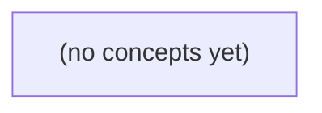

# 13.12 工程师的长期责任：从交付到运行、复盘与指导

*一本面向 Go 初学者的静态综合教材，以虚构 IM 业务的当前 S2/v1 合同与未来 S3/v2 候选方案为主线，收束 13.01—13.11 的工程知识。读者将通过故障推演、架构评审、交接文档、无责复盘和新人指导，理解高级工程能力是可复核的判断、交付、运行与指导证据，而非头衔或技术名词数量。*

**章节:** 2

---

## 本书导览

- 了解整本书的章节脉络
- 掌握各章之间的概念依赖关系
- 选择最合适的阅读顺序

# 13.12 工程师的长期责任：从交付到运行、复盘与指导

一本面向 Go 初学者的静态综合教材，以虚构 IM 业务的当前 S2/v1 合同与未来 S3/v2 候选方案为主线，收束 13.01—13.11 的工程知识。读者将通过故障推演、架构评审、交接文档、无责复盘和新人指导，理解高级工程能力是可复核的判断、交付、运行与指导证据，而非头衔或技术名词数量。

下方的概念图展示了本书 0 个核心概念以及它们之间的依赖关系；再下方是 1 个章节的入口。你可以按从上到下的顺序阅读，也可以根据自己的兴趣或先验知识选择切入点。

#### 概念图



## 章节索引

- **13.12 工程师的长期责任：让IM的承诺能被接手、复核和修正** — 面向Go初学者，以虚构IM业务链路收束高级工程师的运行、评审、复盘、技术债、文档交接与指导新人责任。

## 13.12 工程师的长期责任：让IM的承诺能被接手、复核和修正

- 以用户结果而非头衔定义高级能力
- 按确认点处理虚构事件并保留证据
- 让设计决定和未决风险可被复核
- 指导初学者按前置逐层完成四类证据
- 交付可独立接手的版本/权威/止损卡
- 将复盘行动项与维护性收益闭环

本节以虚构IM链路收束全卷：高级工程师的价值，不在于增加服务或背诵术语，而在于让每项承诺都有确认点、证据、责任人和可安全修正的路径。

### 用用户结果定义高级能力

### 用用户结果定义高级能力

高级工程师的能力，不应以“设计了多少服务”“掌握了多少术语”衡量，而应回到用户可感知的结果：消息是否被正确处理，异常时是否能及时止损，团队是否能在人员变动后继续验证、维护和修正承诺。

以当前 IM 链路为例，`S2/v1` 的边界必须可复核：

- 正文非空且最多 `6` 个 UTF-8 字节；原始 HTTP 请求体最多 `4096` 字节。
- 同一消息 ID 重复提交返回 `409`；非会话成员返回 `404`。
- 成功响应 `200 accepted_in_memory` 只表示“本进程内存已接受”，不等于已持久化、已送达或可跨进程恢复。

这不是实现细节，而是用户契约。若客户端把 `200` 当作“消息永不丢失”，故障后的真实体验就会违背承诺。因此，高级工程师要明确写出确认点：谁确认请求合法，谁确认去重，何处记录内存接受，进程重启后用户会看到什么，以及告警由谁处理。

面对未来提议，也不能把“更大、更持久”直接视为进步。`S3/v2 stored_in_teaching_db` 仍限制 `6B`，说明存储升级不自动改变产品容量；`R9` 从 `6B` 放宽到 `9B` 仍待审，必须由有权限的人在成本、滥用风险、兼容性和教学目标之间作决定。工程师的责任是提供证据、选项与风险，而不是擅自把提议变成事实。

真正高级的交付，应让后来者能回答：当前保证什么、不保证什么；故障时怎样停止扩散；配置、日志和测试如何证明判断；若承诺错误，谁能以何种步骤安全修正。这样，系统能力才不会只存在于某个人的记忆中。

### 以确认点串起事件证据

### 以确认点串起事件证据

S2/v1 的约束不是“写在文档里就算完成”，而应被拆成可复核的确认点。每个确认点都要回答：输入是什么、系统作了什么判定、输出是什么、谁能用证据重放该结论。

- **先确认传输边界**：原始 HTTP 请求体上限为 `4096B`。应在读取或解析前执行大小限制；超限请求不能因后续 JSON 解析、日志序列化或缓冲复制而消耗不可控资源。证据包括：网关/处理器配置、超限测试请求、对应状态码与结构化拒绝日志。

- **再确认业务长度**：消息正文按 UTF-8 编码后最多 `6B`，不是“6 个字符”。因此 `abc` 合格，两个常见汉字通常也是 `6B`，但三个汉字通常超限。实现应明确测量 `len([]byte(text))`，并保留边界测试：`6B` 被接受、`7B` 被拒绝、非法或异常编码按既定规则处理。

- **确认身份与成员关系**：发送者不是会话成员时返回 `404`。这不是普通参数校验，而是权限语义：调用方不应借响应差异枚举不存在或无权访问的会话。证据应覆盖认证主体、成员查询结果、脱敏审计记录及“非成员必为 404”的集成测试。

- **确认幂等性顺序**：同一会话中的重复消息 ID 返回 `409`。应定义 ID 的作用域、首次写入成功的判据，以及并发请求时谁获胜。仅靠“先查再写”不足以防竞态；需要唯一约束、原子写入或等价机制。证据是并发重复提交测试、冲突响应和可追溯的消息 ID 记录。

这些确认点共同形成事件链：请求体受限，正文受限，主体获授权，ID 未重复，才允许进入接受路径。若某一步失败，应能从测试、日志、存储约束和接口响应中复核原因；若规则日后调整，也能明确知道应修改哪一项判定及其证据。

### 区分已实现承诺与未来提议

### 区分已实现承诺与未来提议

工程沟通中，最危险的错误之一，是把“方向正确的计划”写成“已经成立的事实”。两者都可以有价值，但必须使用不同的证据、措辞和承诺边界。

| 内容 | 当前可确认的承诺 | 不能据此推出的结论 |
|---|---|---|
| 成功响应 | `200 accepted_in_memory` 表示请求已被**当前进程内存**接收 | 不表示已持久化、可跨重启恢复或已被下游处理 |
| 正文限制 | S2/v1 非空正文最多 `6 UTF8B`，原始 HTTP 体最多 `4096B` | 不表示未来版本自动接受更长消息 |
| 重复消息 | 同一 ID 重复提交返回 `409` | 不表示存在全局去重、跨进程去重或永久幂等记录 |
| 成员权限 | 非成员返回 `404` | 不表示权限模型已覆盖审计、封禁或组织级角色 |
| 存储方案 | S3/v2 的 `stored_in_teaching_db` 是提议 | 不表示数据库、迁移、恢复、容量和故障语义已交付 |
| 长度调整 | R9 从 `6B` 扩至 `9B` 仍待审 | 不表示客户端、测试、文档和成本预算已同步修改 |

因此，交付说明应写成：“当前版本在本进程内接受消息”；而不是“消息已经可靠保存”。设计文档也应写成：“提议在 S3/v2 写入 `teaching_db`，待确认数据模型、失败重试、权限边界与负责人后实施”；而不是“系统将持久化消息”。

特别是 R9，`6B → 9B` 不是一个孤立常量修改。它会影响输入校验、测试样例、客户端提示、存储字段、日志脱敏和流量成本。若 B 的 `25h` 是待审目标，就应明确其假设：范围是否包含迁移、回滚、监控、评审与上线支持；谁有权批准；未批准前系统仍遵守 `6B`。

高级工程师的证据，不是把路线图说得像现状，而是让读者能复核：**现在什么已生效、未来什么仅为提议、下一次确认由谁在何时作出，以及提议被否决时系统如何保持安全。**

### 交付可独立接手的运行卡

### 交付可独立接手的运行卡

运行卡不是“项目说明书”，而是让另一位工程师在值班、发布或事故中无需猜测即可行动的最小证据集。它应随版本演进，并指向唯一权威来源，而非复制易过期的细节。

- **版本卡：说清当前承诺与待审边界。**  
  标注 S2/v1 的有效约束：正文非空且最多 `6 UTF-8B`、原始 HTTP 体最多 `4096B`、同 ID 重复提交返回 `409`、非成员返回 `404`、成功响应 `200 accepted_in_memory` 仅表示本进程已接收。同步写明未来提议：S3/v2 计划 `stored_in_teaching_db`，但正文仍为 `6B`；R9 的 `6→9B` 尚待审批，不能据此改实现、测试或对外承诺。

- **权威来源卡：让“谁说了算”可查。**  
  列出接口契约、权限规则、数据库迁移、监控面板、发布记录和审批单的链接；每项标注维护人、最后确认时间与决策责任人。例如，产品负责人确认 B 的 `25h` 待审目标是否仍成立，安全负责人确认成员判定与 `404` 策略，技术负责人确认内存接收是否允许重启丢失。

- **止损卡：把异常行动预先写死。**  
  明确故障信号，如 `409` 激增、`404` 异常上升、进程重启后消息缺失、请求体接近 `4096B` 的拒绝率升高。对每个信号写出首要动作、回滚条件、升级路径和时限：值班者先暂停相关发布或限流；无法确认数据持久性时不得宣称已送达；超过约定窗口升级给当班负责人及决策责任人。

一张合格运行卡的检验是：接手者能回答“现在系统保证什么、不能保证什么、证据在哪、出事先做什么、谁有权改变承诺”。这比新增服务更接近高级工程能力。

### 用复盘和指导偿还维护债

### 用复盘和指导偿还维护债

维护债不是“代码以后再整理”，而是团队对承诺边界、运行事实和决策依据缺少可复核证据。指导 Go 初学者时，应按前置关系交付四类证据，而非只要求“接口能通”。

1. **先确认实现证据**：把当前 S2/v1 约束写成测试和注释：正文非空且最多 `6` 个 UTF-8 字节；原始 HTTP 体最多 `4096` 字节；同一 ID 重复提交返回 `409`；非成员返回 `404`；`200 accepted_in_memory` 仅表示本进程已接受，不等于持久化。先实现纯校验函数，再由处理器调用，避免把规则散落在分支中。

2. **再补测试证据**：要求初学者用表驱动测试覆盖边界：空正文、恰好 `6B`、中文字符导致的超限、`4096B` 与 `4097B` 请求体、重复 ID、非成员。测试名称应描述承诺，如“接受仅存内存不代表可恢复”，而不是“测试一”。

3. **随后提供运行证据**：记录重启后内存消息丢失、日志中的请求 ID、冲突次数和拒绝原因；演练进程重启与重复投递。这样才能向调用方解释：当前成功确认的是哪一层，而不是制造“已送达”的错觉。

4. **最后沉淀决策证据**：S3/v2 的 `stored_in_teaching_db` 仍提议维持 `6B`；R9 从 `6B` 调整到 `9B` 仍待审。初学者不应自行把提议写成事实，应注明确认人、待审目标、权限影响、数据库成本和故障恢复责任。

复盘时把“加强测试”“完善文档”改写为可验收行动项：例如“为 UTF-8 字节边界增加 8 个表驱动案例，由小李在周三前提交；由值班负责人演练重启并附日志链接”。关闭行动项的条件不是任务被勾选，而是新成员能据此复现限制、值班者能解释故障、评审者能判断 R9 是否具备批准条件。这样，指导行为才把一次事故或模糊承诺转化为可持续的维护性收益。

> **要点** — 高级责任是让IM承诺可确认、可复核、可接手、可止损，并将未决风险持续闭环。

以一场未真实发生的复合故障演练，检验工程师能否让消息承诺被接手、复核、止损与修正。

### 先界定事件边界与用户承诺

### 先界定事件边界与用户承诺

这是一次**假设的复合故障演练**，不是已发生事故。先冻结可验证事实，避免把推测写成结论：

- `m-9` 已持久化入库，序号为 `seq=9`；这证明系统已接受消息，但**不证明用户已收到**。
- 对应投递事件 `E9` 尚无“已发送至 Broker”的证据，因此不能宣称已进入下游可靠链路。
- 消费者 `B` 已离线 `25h`，超过 Broker 的 `24h` 保留窗口；其离线期间未确认的事件可能已无法直接从 Broker 重放。
- 网关某节点故障与热群并发，可能扩大延迟、连接失败或局部消息不可达范围；但在核对分片、路由、队列积压前，不能将所有失败归因于该节点。
- 平台显示 Pod `Ready`，仅说明容器满足存活/就绪探针，不等价于 `B` 已恢复消费、已完成确认，更不等价于用户结果成功。

当前可界定的影响是：`m-9` 的**最终送达状态未知且存在未送达风险**；`B` 所属用户或会话在保留窗口之外可能出现缺消息、延迟消息或顺序异常。热群影响范围应以实际路由命中、事件日志和确认游标为准，不以“群很热”直接推导为全量丢失。

对用户的承诺应保持精确：消息一旦被接受，系统承诺其可被追踪、可被复核，并在可恢复条件下重试或补拉；在状态未确认前，不承诺“已经送达”，也不以 Pod 恢复替代送达证明。当前权威事实源应保留为数据库记录、事件表、Broker 元数据与消费者确认记录，而非聊天截图或单个监控面板。

### 用确认点建立可复核时间线

### 用确认点建立可复核时间线

演练中的记录不是“发生了什么”的叙事，而是让下一位工程师能独立验证的证据链。每条值班记录应拆成五项：

- **时间**：统一使用带时区的绝对时间，如 `2025-03-08 10:14:32 UTC`，避免“刚才”“约半小时前”。
- **现象**：只写观测事实，如“网关 Node 返回 5xx”“热群消费延迟升至 18 分钟”“B 最后心跳距今 25 小时”。
- **影响**：区分已确认与待确认。已确认的是 `m-9/seq9` 已写入 DB；待确认的是 E9 是否已发出、B 是否收到或展示。
- **确认点**：写明由什么条件判定。例如“DB 中存在不可变消息记录且序号连续”确认持久化；“Broker 有 E9 投递确认”才确认事件发出；“B 的客户端回执或可验证拉取结果”才确认用户侧可见。
- **证据来源**：附上查询位置、日志字段、指标链接或追踪 ID，而非仅写“已查看日志”。

可按如下形式交接：

| 时间 | 现象 | 影响判断 | 确认点与证据 |
|---|---|---|---|
| 10:14 | DB 存在 `m-9, seq=9` | 消息持久化已确认 | 主库查询、事务提交日志 |
| 10:16 | E9 未见 Broker 确认 | 事件发送状态未知 | Outbox 状态、生产者追踪 ID |
| 10:18 | B 离线 25h，超过 24h 保留期 | 可能无法依赖 Broker 补投 | B 心跳、Broker 保留策略 |
| 10:20 | 网关 Node 故障、热群积压 | 实时路径降级 | 网关错误率、消费延迟 |

尤其要避免把“平台 Pod Ready”写成“B 收信成功”。`Ready` 至多证明该 Pod 通过了当前就绪探针，不能证明 E9 已进入 Broker、被消费者处理、被网关推送，更不能证明离线 B 已获取并展示消息。确认用户成功的权威证据应保留在可审计的客户端回执、拉取游标或业务读取记录中；缺失时，应明确标注为“未确认”，而不是以基础设施健康替代用户结果。

### 区分当前 S2 与未来候选路径

### 区分当前 S2 与未来候选路径

复合故障中，值班记录必须把“已确认的现在”与“可能发生的将来”分开。当前可写为状态 $S2$：DB 已持久化 `m-9/seq9`，但尚无 `E9` 成功发布的证据；B 已离线 25 小时，超过 broker 24 小时保留窗口；网关 Node 故障与热群同时存在。这里的每一句都应能指向日志、数据库记录、broker 元数据或监控时间戳。

不要把以下推断写成事实：

- “B 一定没有收到 `E9`”：目前只能确认缺少送达证据，且可能已错过可直接重放的保留期。
- “重启网关即可恢复”：这是待验证假设，不是恢复结论。
- “补发 `E9` 后数据就一致”：这是补救候选，仍需验证幂等、顺序、下游副作用及 B 的最终确认。
- “平台 Pod Ready，B 已恢复”：Pod Ready 只表示平台健康检查通过，不等于消费者已连接、已补拉、已处理 `seq9`。

记录中可采用三栏边界：

| 类别 | 应写内容 |
|---|---|
| 当前 $S2$ | 已确认事实、证据来源、确认时间 |
| 待验证假设 | 例如 retention 是否已清除 `E9`、B 是否存在本地偏移或缓存 |
| 未来候选 | 事件重试、从权威 DB 补拉、人工校正、隔离热群 |

候选路径必须附带恢复门：例如“B 报告连续处理完成”“权威 DB 与 B 状态对账一致”“重复投递未产生额外副作用”。在这些门槛满足前，只能称为“正在执行补救”，不能称“已恢复”。这也是 Google SRE 事件处置与复盘强调的原则：时间线记录事实，假设明确标注，行动以可验证结果闭环。

### 止损、补拉与用户沟通的恢复门

### 止损、补拉与用户沟通的恢复门

面对“数据库已有 `m-9, seq=9`，但 `E9` 未发出；B 离线超过 broker 24 小时保留期；网关节点故障与热群并发”的演练，首要目标不是立刻把所有消费者拉回，而是阻止不确定状态继续扩散。

- **先止损**：冻结 B 的自动确认、自动补偿和可能重放 `E9` 的任务；将故障网关摘流，限制热群写入或切换为排队/降级。`Pod Ready` 只说明进程可服务，不证明 B 已成功消费、幂等落库或完成业务副作用。
- **保留权威记录**：以事务数据库中的消息状态、`seq`、事件表和审计时间戳为准；保存 broker 可见偏移、消费者确认位点、网关日志、热群路由记录。不要以缓存、监控聚合值或“客户端已重连”覆盖事实。
- **决定修复路径**：若 `E9` 可由权威表唯一重建，则写入带事件标识和版本号的重试队列；若 broker 中已过期，则按 `seq` 扫描历史缺口，执行受限速、可暂停、可幂等的补拉。每次重试都应记录“原始事件—重试事件—业务结果”的关联。
- **对外沟通**：说明受影响功能、可见症状、数据是否丢失的当前结论、临时替代路径和下次更新时间；避免宣称“已恢复”或“绝无影响”。内部值班记录应明确时间线、确认点、负责人和待验证假设。

只有同时满足以下恢复门，才可逐步恢复流量：故障节点已隔离或修复；权威记录与补拉范围已核对；缺口事件完成幂等处理；B 的消费结果可追溯；热群积压回落且错误率稳定；抽样业务校验通过。随后再进入复盘：哪些告警只证明平台存活，哪些证据才能证明消息承诺真正兑现。

### 以无责复盘完成可接手闭环

### 以无责复盘完成可接手闭环

这是一场**未真实发生**的复合故障演练；复盘的目的不是追问“谁漏发了 E9”，而是像 Google SRE 所倡导的那样，基于当时可见的信号、约束与决策，改进系统和交接能力。

新人可按“证据—判断—动作—复核”逐层执行，并沉淀四张卡片：

- **版本卡**：固定演练输入与时间线：DB 已有 `m-9/seq=9`，`E9` 未发；B 离线 `25h`，超过 broker 保留 `24h`；网关 Node 故障与热群并发。明确哪些是当前事实，哪些仅是未来候选状态，禁止以推测覆盖已确认版本。
- **权威卡**：列出每个结论的权威来源。例如消息写入看 DB 提交记录，投递看 broker 偏移与审计事件，B 消费看客户端确认或业务落库。平台 Pod `Ready` 只说明容器可服务，**不等于 B 已成功消费**。
- **止损卡**：记录已执行和未执行的保护动作：冻结可能造成乱序的重放、保留原始日志与偏移、隔离故障 Node、限制热群流量；明确何时允许重试、何时必须补拉，以及恢复门：权威数据一致、缺口已补、重复可幂等处理、监控连续稳定。
- **维护性行动卡**：每项行动必须有负责人、截止时间、验收证据与跟踪链接。例如补充 `E9` 缺失告警、将保留期风险提前告警、演练“Ready 但消费未确认”的看板、自动生成交接时间线。

值班记录应区分“现象、影响、确认点、处置、待证实假设”。对用户沟通只陈述已知影响、临时措施和下一次更新时间，不把候选原因说成结论。复盘结束也不是关闭事件：只有行动项可追踪、权威证据可复核、下一位值班者能按卡片重建判断，消息承诺才真正具备可接手与可修正性。

> **要点** — 高级工程能力在于把不确定事件变成可证实、可止损、可交接并能持续改进的承诺。

高级工程师的责任不止于提出方案，更在于让关键承诺、风险与决策状态能被后来者核验、接手和纠正。

### 用场景检验承诺是否可实现

### 用场景检验承诺是否可实现

“消息不丢”“可追溯”“安全可靠”不是可评审的承诺；它们必须被改写成轻量 ATAM 场景：在特定刺激下，系统应以可观察、可判定的方式响应。

可用如下结构提问：

- **环境**：正常运行、流量高峰、区域故障、发布切换或攻击发生时？
- **刺激源与刺激**：客户端重试、消费者重复消费、存储写入超时、权限被撤销？
- **受影响对象**：生产者、队列、消费者、S3、数据库记录或审计日志？
- **响应**：拒绝、重试、幂等去重、隔离、告警、补偿，还是人工介入？
- **度量**：允许丢失多少条？多久可恢复？重复率上限多少？审计证据保留多久？

例如，不要写“IM 支持可靠投递”，而要问：**数据库提交成功后、S3 对象尚未落盘时进程崩溃，恢复任务如何识别缺口？是否会重复上传？运营人员能否在十分钟内定位并补偿？** 这会直接暴露“未来 S3 stored 需数据库提交”的承诺是否已有事务边界、状态字段、重放策略与回退路径。

评审时优先寻找反例：网络分区下的“双写”、重试造成的重复、权限变更后的历史数据泄露、告警存在但无人可执行的恢复步骤。证据也应分级：设计推断低于测试记录，测试记录低于线上演练与可检索审计证据。资历只能提出假设，不能替代证据。

ADR 中的 `proposed` 仅表示提议；只有 `accepted` 才能作为当前约束，之后仍可能被 `superseded`。因此，R9“另审”必须保持待定，不应被文档措辞伪装成已经上线的安全保证。

### 用 ADR 记录决定与未决风险

### 用 ADR 记录决定与未决风险

ADR（架构决策记录）不是“设计说明书的缩写版”，而是对一个可争议决定的可追溯承诺。沿用 Michael Nygard 的思路，每条记录至少说明：背景与约束、备选方案、决定、后果、证据，以及当前状态。

状态必须清晰区分：

- **提议**：正在征求意见，不能据此宣称“已经上线”或“风险已接受”。
- **接受**：决定已获授权，相关实现、测试、监控与回退责任应可定位。
- **被替代**：旧决定仍保留历史价值，但应链接到替代它的新 ADR，避免维护者误按旧规则操作。
- 必要时标注**废弃**或**搁置**，尤其是依赖未验证假设的方案。

例如，ADR 可写明：“对象存储中的 `S3 stored` 标记只有在数据库事务提交后才可见；若提交失败，清理任务负责删除孤儿对象。”这不是实现细节，而是关于一致性、可恢复性和运营责任的决定。若“产品是否允许延迟可见”“安全团队是否接受临时访问令牌范围”尚未确认，应明确列为未决项，标注负责人、截止条件和风险，而非用模糊措辞掩盖。

轻量 ATAM 式评审可据此追问：反例是什么？证据是压测数据、威胁建模、正式审批，还是个人判断？失败后能否回退？例如“先写 S3、后提交数据库”在网络中断、重复请求、清理任务失效时是否仍成立。资历可以解释经验来源，却不能替代可复核事实。

ADR 的价值正在于保留产品、安全与工程决策的历史脉络：后来者不仅知道“做了什么”，还知道“为何这样做、哪些前提仍待验证、何时应当重新审议”。

### 不要把提议当作已上线事实

### 不要把提议当作已上线事实

“计划采用 S3 存储”只是方向，不是运行事实。工程记录必须区分承诺所处的层级，否则后来者会把假设当保障，把草案当控制措施。

| 表述 | 事实层级 | 可据此得出的结论 |
|---|---|---|
| “拟采用 S3 存储附件” | 提议 | 可开始调研成本、权限与迁移方案，不能宣称数据已具备对象存储耐久性。 |
| “ADR 已接受 S3 方案” | 决策 | 团队承诺按此方向实施；仍须核对代码、部署与监控是否完成。 |
| “数据库提交成功后才允许写入 S3” | 实现约束 | 对象写入不得制造无主文件；但仍要处理提交后写入失败、补偿任务和幂等重试。 |
| “生产环境已启用该流程并有审计证据” | 上线事实 | 可由配置、日志、指标和演练记录复核。 |

ADR 应保留 `提议 → 接受 → 被替代` 的状态链。`提议` 状态的 ADR 可以记录选择理由、未知项和实验计划，却不能被引用为“系统已经如此运行”。若新方案替代旧方案，应明确旧 ADR 的失效范围，而非悄悄改写历史。

评审时可借用轻量 ATAM 场景追问反例：数据库已提交而 S3 写入超时怎么办？S3 成功但响应丢失如何避免重复？补偿队列不可用时，业务能否回退或人工修复？证据应标注等级：设计推断、测试结果、生产观测、演练证明；资历不能替代证据。

尤其是 R9，即使依赖 S3 写入顺序的方案已被接受，也仍需独立评审其威胁模型、权限边界、审计要求与可回退性。共享前提不等于共享结论。

### 以反例、证据和回退评审设计

### 以反例、证据和回退评审设计

评审的目标不是确认“资深工程师已经想过”，而是检验方案能否在反例、故障和后续变化面前成立。可借鉴轻量化 ATAM 场景：先写出质量属性场景，再追问触发条件、系统响应和可度量结果。例如：“对象存储写入成功但数据库提交失败时，系统如何避免把 `stored` 误报为已完成？”这类场景比“方案是否优雅”更能暴露承诺边界。

评审者至少检查三件事：

- **反例是否被主动寻找**：正常路径成立不等于方案成立。应检查重复投递、超时重试、部分成功、权限撤销、密钥轮换、跨区域延迟及人工补偿等反例。若某反例无法处理，ADR 必须明确其影响、监控方式和接受该风险的理由。
- **证据等级是否匹配结论强度**：区分“推测”“设计推演”“测试验证”“生产观测”。接口文档只能支持兼容性推测；故障注入和压测可支持行为结论；真实运行指标才支持稳定性承诺。不要用资历、口头共识或单次演示替代证据。
- **失败后能否回退或修正**：说明开关、兼容窗口、数据迁移回滚、补偿任务、告警阈值和负责人。若不可回退，例如不可逆数据删除或外部合规提交，应提高证据门槛，并在上线前取得明确批准。

ADR 状态也必须参与评审。`proposed` 只是待讨论提议，不能被写成“已上线事实”；只有 `accepted` 才表示当前决策，之后若被新证据推翻，应标记为 `superseded` 并链接替代决定。评审记录应让后来者看见：当时反对过什么、证据有多强、哪些风险尚待验证，以及为何仍选择继续。这样，事实可以修正决定，决定也不会因作者离开而失去可复核性。

### 交接可复核的决策卡片

### 交接可复核的决策卡片

把架构决策写成可交接的“卡片”，而不是散落在会议纪要、聊天记录和个人记忆中的结论。卡片的目标是：不了解上下文的接手者，也能判断当前承诺是否成立、依据是否足够，以及何时应停止或回退。

每张卡片至少包含：

- **决策与状态**：明确写“提议中、已接受、已被替代”。`Proposed ADR` 只是候选方案，不能表述为“已经上线”或“既定架构”。
- **适用版本与前置条件**：例如“适用于 API v3、数据库事务已提交、对象存储可重试”。前置条件改变时，原结论可能失效。
- **权威来源**：链接到 ADR 编号、接口契约、压测报告、安全评审、代码提交或生产指标；区分“实测证据”“设计假设”“口头意见”。资深工程师的判断可以记录，但不能替代证据。
- **场景与反例**：用轻量 ATAM 场景描述刺激、环境、响应与度量。例如：“高峰期上传失败后重试，不能产生孤儿对象。”同时记录反例：数据库提交失败但 S3 已存储时如何处理。
- **止损与回退**：写清触发阈值、负责人和动作，如“错误率连续 10 分钟超过 1%，关闭异步写入开关；执行补偿删除；恢复同步路径”。
- **待验证项**：将未知项显式编号，例如“R9：跨区域复制一致性另审”“未来 S3 stored 状态必须在数据库提交后写入”，并注明验证期限与验收证据。

评审时不问“谁拍板”，而问：是否存在反例？证据等级能否支撑结论？失败后能否回退？卡片应保留替代链：旧决策为何被替代、新决策从何时生效。这样，后来者既能接手执行，也能在事实变化时有依据地修正。

> **要点** — 可靠的工程承诺必须标明证据、状态、风险与回退路径，才能被接手者复核和修正。

以一条虚构IM链路为课堂主线，按不可跳步的确认点训练：每个决定都要能解释、复核、交接与修正。

### 先把用户结果画成可验证的请求链

### 先把用户结果画成可验证的请求链

先不要写 Go 代码。设想用户 `u-a` 要把消息发给 `u-b`，会话为 `c-a`，消息为 `m-a`。先在纸上画出关系：

`u-a ──成员身份──> c-a <──成员身份── u-b`  
`u-a ──提交消息──> m-a ──属于──> c-a`

再规定请求和用户可见结果。比如：

| 请求条件 | 响应 | 用户语义 |
|---|---:|---|
| `u-a` 不在 `c-a` 中 | `403` | 你无权向此会话发送 |
| `u-b` 不在会话中，或目标关系不成立 | `404` | 会话或接收关系不存在 |
| 同一 `m-a` 已被成功接受 | `409` | 请勿重复发送；客户端应查询已有结果 |
| 身份、会话、消息均有效且首次提交 | `200` | 消息已被系统接受 |

题目给定的 `6B` 可视为“消息正文最大 6 字节”的教学约束：正文超过 `6B`，应在进入数据库前拒绝。关键不在数字，而在承诺：客户端看到成功，究竟表示“服务器收到了”，还是“消息已经可靠归属到 `c-a`”？本节先选择后者。

最小请求可写成：

`POST /conversations/c-a/messages`  
`{ "message_id": "m-a", "body": "你好" }`

失败变式常见于只检查 `u-a` 存在，却忘记检查其是否属于 `c-a`；此时攻击者可向任意会话写入消息。另一个变式是重复点击发送：若两次请求都返回 `200` 且产生两条记录，用户会看到重复消息。

让学习者先做取舍：重复提交时，你选 `409`、返回旧消息的 `200`，还是异步受理？任何选择都可以讨论，但必须写清客户端如何反馈、用户如何重试、后来接手的工程师如何复核。教师不能只说“行业通常这样做”；应说明该选择保护了什么结果，以及它牺牲了什么体验。

### 用SQL身份与事务证明消息没有越权或半成

### 用 SQL 身份与事务证明消息没有越权或半成

消息发送不能只依赖客户端说“我是 `u-a`”。服务端必须用已认证身份 `sender_id`，证明它确实属于会话 `c-a`，再把消息与会话更新放进同一事务。

最小纸上模型：

- `conversation_members(conversation_id, user_id)`：会话成员关系。
- `messages(id, conversation_id, sender_id, body, created_at)`：已提交消息。
- `conversations(id, last_message_id, updated_at)`：会话摘要。

先做授权条件，而不是先插入消息：

```sql
SELECT 1
FROM conversation_members
WHERE conversation_id = :conversation_id
  AND user_id = :authenticated_user_id;
```

查不到行时返回 `403`：身份有效，但无权向该会话发送。不要把客户端传来的 `sender_id` 写入数据库；应固定使用服务端从令牌解析出的 `authenticated_user_id`。否则 `u-b` 可以伪造 `u-a` 的身份发言。

授权通过后开启事务：

```sql
BEGIN;

INSERT INTO messages(conversation_id, sender_id, body, created_at)
VALUES (:cid, :uid, :body, NOW())
RETURNING id;

UPDATE conversations
SET last_message_id = :message_id, updated_at = NOW()
WHERE id = :cid;

COMMIT;
```

这里的证据链是：成员表证明“能发”，消息表证明“谁发了什么”，会话摘要证明“最新消息指向哪条”。任一步失败都应 `ROLLBACK`。例如消息插入成功、摘要更新失败却仍返回 `200`，用户可能看到消息存在，但列表排序未更新；这就是“半成”。

失败变式值得专门演练：

- 会话不存在：返回 `404`，不要把它伪装成无权限。
- 不在成员表中：返回 `403`。
- 事务冲突、数据库暂时不可用：返回可重试错误，不承诺已发送。
- 客户端超时：不能仅凭“没收到 `200`”再次盲插；后续应结合幂等键判断是否已提交。

用户取舍是：事务会增加一点数据库开销，却换来“成功即完整、失败即不留半条”的可复核承诺。设计答辩时，工程师应能回答：授权来自哪里？哪些写入必须原子完成？`200` 究竟证明了哪些数据库事实？

### 从E9事件到设备游标补齐投递证据

### 从 E9 事件到设备游标补齐投递证据

发送者 `u-a` 向 `u-b` 发消息 `m-a` 时，服务端在事务内先写入消息与稳定事件：

```text
消息：m-a，状态=已写入
事件：E9，类型=消息创建，消息=m-a，序号=901
```

这里的 `E9` 不是“本次网络请求”的编号，而是可长期保存、可重放、可审计的事件编号。事务提交后，消息“已写入”；投递服务再依据 `E9` 向 `u-b` 的各设备发送通知。只有某设备确认收到 `E9`，该设备才可称“已投递”；用户打开会话并上报阅读位置后，才可能称“已读”。

最小纸上模型可写为：

| 事实 | 证据 | 不能推出 |
|---|---|---|
| 已写入 | `m-a` 与 `E9` 同事务提交 | 对方设备已收到 |
| 已投递 | 设备确认 `E9` 或游标推进到 `901` | 用户已经阅读 |
| 已读 | 阅读回执指向 `m-a` 或更高序号 | 所有设备都已读 |

失败变式：`u-b` 有手机和电脑。手机确认了 `E9`，电脑断网；若系统只记录“用户 `u-b` 已投递”，电脑恢复后可能永远缺少 `m-a`。因此游标必须按设备保存，例如：

```text
设备 phone-1：已确认事件序号 901
设备 desktop-2：已确认事件序号 897
```

`desktop-2` 重连时请求 `898..901`，服务端允许重复发送 `E9`。客户端以事件编号或消息唯一键去重：重复事件不重复展示，但可再次确认游标。代价是需要保存设备游标并处理清理策略；收益是断线、重试、Node 故障回退后仍能补齐证据。

答辩时应明确说明：把“已写入”展示成“已送达”会误导用户；把手机确认当作全设备确认会丢失补投依据。产品可选择显示“已送达至至少一台设备”，但必须让该文案对应可复核的设备级事实。

### 把容量、故障与回退写成可执行止损卡

### 把容量、故障与回退写成可执行止损卡

容量、故障与回退不能只写成“系统会扩容”“节点坏了会切换”。接手者需要一张可在告警压力下执行的止损卡：先看什么证据、允许牺牲什么、何时停止写入、何时回退。

以消息事件 `E9` 为例，纸上先写容量边界：

- 峰值写入：$Q=20000$ 条/秒；
- 单条事件含索引与副本后：$S=2\text{ KB}$；
- 保留 $T=7$ 天，副本数 $R=3$；
- 所需原始容量：$C=Q\times S\times T\times R$，约为 $72.6\text{ TB}$；
- 再预留压缩失效、迁移和热点余量 $30\%$，目标可用容量约 $95\text{ TB}$。

最小运行规则可写为：

1. **容量告警**：任一分片磁盘使用率超过 `80%`，停止创建低优先级会话索引；超过 `90%`，拒绝图片、文件等大消息上传，但文本消息仍进入 `E9` 事件日志。
2. **Node 故障假设**：单个 Node 不可达时，由副本接管读取；若主副本切换超过 `30s`，客户端显示“发送中”，不得伪造“已送达”。
3. **降级范围**：可以暂停已读回执、全文搜索和历史漫游；不能跳过 SQL 身份校验，不能把 `409` 并发冲突改成 `200`。
4. **回退条件**：新版本使 `E9` 积压持续 `5min` 超过正常峰值两倍，或设备游标出现缺口 `8` 以上，即停止发布、切回旧消费者；保留事件日志，禁止直接删除积压。

失败变式是只写“自动回滚”。问题在于：谁确认积压？回滚会不会重复消费？旧版本是否认识新字段？因此止损卡还应记录负责人、观测面板、执行命令、预计影响和恢复验证。

让用户参与取舍：提示“文件发送可能延迟，但文字消息优先送达”，并提供取消上传或稍后重试。工程师不能替用户隐瞒降级；也不能替接手者猜测阈值。每个阈值都应能由容量算式、故障演练和用户反馈复核后修正。

### 以设计答辩和复盘闭环完成可接手交付

### 以设计答辩和复盘闭环完成可接手交付

带教的目标不是让新人“交出能跑的代码”，而是让下一位接手者能回答：为什么这样设计、依据在哪里、出错如何修正。

| 带教方式 | 表面结果 | 长期后果 |
|---|---|---|
| 高级工程师直接决定：“这里返回 `409`，游标缺失就补 `8`” | 实现快，代码统一 | 新人不知道 `409` 与 `404` 的边界，不敢改动；规则变化时只能再次求助 |
| 高级工程师说明依据并要求新人选择 | 首次较慢，需要答辩 | 决策可复核；新人能在 Node 故障、容量变化或协议升级时独立调整 |

例如，教师不应只说“`u-a` 给 `u-b` 发消息必须写事务”，还应追问：身份校验失败为何是 `404` 或 `403`？幂等键重复为何是 `409`？事务中应同时写入什么？新人可以给出最小纸上模型：

`验证 c-a 属于 u-a → 写消息 m-a → 写 E9 事件 → 更新 u-b 设备游标 → 提交`

再要求说明失败变式：若写入 `m-a` 后 Node 宕机，事件是否已投递？若设备游标缺少 `8`，是回放、补拉还是拒绝？这些不是教师替做的选择，但教师必须解释评价标准：以权威数据源、可恢复性和用户可见反馈为依据，而非“我一直这么做”。

交付时附一张版本卡，作为答辩和复盘入口：

- **版本与范围**：协议版本、涉及的 `u-a/u-b/c-a/m-a` 路径。
- **权威来源**：SQL 消息表、事务日志、E9 稳定事件流中，哪个字段最终裁定状态。
- **已验证承诺**：`6B` 容量预算、`409/404/200` 返回条件、Node 回退路径。
- **未决风险**：跨区复制延迟、游标缺 `8` 的兼容策略、重复事件清理。
- **行动项与负责人**：补监控、压测容量、演练故障回退，并写明截止时间。

复盘不以“事故关闭”为结束，而以“版本卡是否更新”为结束。若用户看到重复消息、延迟送达或明确错误码，系统应记录其反馈对应的事件、游标和版本；若设计判断被推翻，也应保留原依据与修正原因。这样，交付的不是某位工程师的记忆，而是一套可被接手、质疑和改进的承诺。

> **要点** — 高级工程师的责任，是把每个关键取舍变成新人能逐层验证、他人能独立接手的证据链。

交接不是“把代码交出去”，而是让接手人能在故障压力下独立确认合同、定位断点、执行止损并留下可复核证据。

### 交接卡的目标：交付可接手的承诺

### 交接卡的目标：交付可接手的承诺

交接卡不是值班名单、代码目录或“系统大概如何工作”的摘要；它应把即时通信系统对用户作出的承诺，压缩成接手人可独立验证、可执行止损、可追溯修正的操作合同。

一张合格的卡首先从用户结果写起，例如：消息在网络恢复后不会重复展示；同一会话的顺序以服务端序号为准；成员被移除后不得继续接收新事件。随后明确每项承诺的验证入口：当前 `v1` 合同、未来 `v2/R9` 的迁移状态，`D1/D2` 镜像及 `K1/K2` 配置，数据库、事件流和客户端版本的对应关系，以及 `member` 历史规则。

接手人不应依赖原作者的口头解释。卡中必须能回答：

- `m-9` 的 `seq9` 在何处首次产生、持久化、投递和确认；
- `E9` 当前是待发、已投递、已确认还是被回退；
- 哪条证据链接可证明“写入成功”不等于“用户可见”；
- 告警触发后先执行什么止损，何时回退，谁负责批准；
- 下一次复核何时进行，未完成的 `v2/R9` 风险由谁继续承担。

可用虚构故障验收交接：某客户端显示 `seq9`，另一客户端缺失 `E9`。让新接手人仅凭交接卡，在限定时间内找到第一个断点，并说明应查看的版本、镜像、事件证据与回退路径。若其只能找到“可能相关的代码”，却不能判断合同是否已被破坏，这张卡仍未完成交接。

### 冻结当前合同与未来状态

### 冻结当前合同与未来状态

交接卡首先要把“现在能安全运行什么”与“未来准备切到什么”分开记录。所谓冻结，不是禁止演进，而是为每个判断提供可复核的时间截面：接手人应能据此确认某条请求为何被接受、拒绝或降级。

- **当前 `v1` 合同**：写明请求字段、响应字段、默认值、幂等键、错误码及兼容承诺。例如：`member_id` 必填；缺失 `seq` 时按旧客户端规则处理；服务端仍返回旧字段 `status`，但不得要求客户端识别新枚举值。
- **未来 `v2` 状态**：明确其处于“设计中、灰度中、可回退、已冻结”哪一阶段，而非只写“已上线”。记录启用条件、灰度范围、开关位置、与 `v1` 的双写/双读关系，以及撤回后数据如何解释。
- **`R9` 规则状态**：将规则版本与生效边界绑定，例如“仅对事件版本 `E9` 且客户端版本不低于某阈值生效”。若规则尚未全量启用，应说明旧规则是否仍是裁决依据。
- **兼容矩阵**：至少列出数据库结构版本、事件格式版本、服务端合同版本、客户端最低/最高已知版本。重点标识不兼容组合：例如，数据库已写入新状态而旧消费者无法解析时，是否有镜像字段、降级映射或消费拦截。

可用一行式记录减少歧义：`v1=生产裁决合同；v2=10%灰度、可回退；R9=仅E9启用；旧客户端走v1映射；DB新字段允许为空。`

最后附一个虚构演练：某旧客户端提交不含 `seq9` 的请求，事件却被标记为 `E9`。接手人应能仅凭交接卡判断首个断点是在客户端版本识别、事件生成、`R9` 路由，还是数据库写入，而不是直接修改业务数据。

### 保存镜像配置与成员历史证据

### 保存镜像配置与成员历史证据

镜像与成员状态最怕“配置还在、语义已变”。交接卡应把 D1/D2、K1/K2 与成员事件固化为同一条可复核证据链，而非只留截图或口头说明。

- **D1/D2 镜像**：记录各自的角色、数据源、复制方向、允许延迟、最后一次健康校验时间，以及校验所用的版本或摘要值。例如注明 D1 为主判定镜像、D2 为只读复核镜像；若两者不一致，客户端应停止推进还是降级读取。
- **K1/K2 配置**：保存配置版本号、配置摘要、启用范围、生效时间和回退版本。关键不是暴露真实密钥，而是证明“当时使用的是哪一版配置”。敏感字段以脱敏标识、密钥版本号或安全存储引用替代。
- **member 历史规则**：明确成员加入、移除、禁用、恢复、迁移时的事件顺序与幂等条件；说明历史记录是追加不可变、逻辑删除还是允许修订，并标出重放时采用“事件时间”还是“写入时间”。
- **锚点样本**：选取虚构成员 `m-9`，记录其 `seq9` 对应事件摘要、前后序号连续性、D1/D2 中的读取结果，以及 E9 的状态（如“已投递、已确认、待补偿”）。同时附上查询条件、日志关联号和证据链接，使接手人可自行复现。

可用一条验收问题检验证据完整性：若 D1 显示 `m-9` 已移除、D2 仍显示活跃，而 E9 停在“待确认”，接手人能否仅凭交接卡确定首个断点是在镜像复制、成员规则解释，还是事件消费？不能回答时，补充的应是可执行查询与版本证据，而不是更多结论。

### 把告警、止损与回退写成操作路径

### 把告警、止损与回退写成操作路径

告警不是“有人知道出事了”，而应直接指向接手人的下一步。决策卡应按“症状—判断—动作—证据—升级”排列，使其在不了解历史背景时仍可执行。

- **告警阈值**：写明指标、窗口和严重级别。例如：`E9` 在 5 分钟内超过 20 条，或 `m-9` 的 `seq9` 连续 3 分钟不推进，触发高优先级告警；若仅单一镜像 `K2` 出现且 `K1` 正常，先按局部故障处理。
- **首选止损动作**：明确顺序与影响范围。示例：暂停新写入到 `D2/K2`，保留 `D1/K1` 读取；将客户端降级到兼容 `v1` 合同的路径；禁止手工删除事件或直接修改 member 历史。
- **回退条件**：不要写“必要时回退”。应写成可判定条件：止损后 10 分钟内 `seq9` 仍未恢复推进，或 `E9` 持续增长，则将服务端合同从 `v2/R9` 切回已验证的 `v1`，并固定客户端最低兼容版本。
- **验证证据**：回退后检查 DB 状态、事件消费延迟、`m-9` 历史规则结果及客户端成功率；将仪表盘截图、查询链接和变更记录附到证据入口。
- **负责人与复核**：标明当班负责人、升级联系人、回退执行权限，以及下一次复核时间。例如“回退后 30 分钟复核一次，次日检查是否满足重新启用 `R9` 的前置条件”。

可用虚构演练检验卡片：假设 `K2` 发布后 `E9` 激增、`seq9` 停滞。接手人应能仅凭卡片找到首个异常指标，先停止扩散，再完成回退与证据留存，而不是依赖原作者口头解释。

### 用虚构故障检验交接是否成立

### 用虚构故障检验交接是否成立

交接卡写得完整，不等于交接真正成立。最有效的检验是构造一个**不含真实账号、密钥、用户数据或内部地址**的故障演练，让接手人在没有原负责人口头提示的条件下完成定位与处置。

例如，演练注入如下虚构状态：

- 当前 `v1` 合同仍要求客户端按 `seq` 单调处理成员事件；
- 灰度中的 `v2/R9` 把成员快照字段改为可选，但镜像 `K2` 仍按旧规则写入；
- `D1` 消费事件正常，`D2` 在 `m-9 / seq9` 后出现重复投递；
- 数据库记录显示 `E9=已应用`，客户端版本 `C-3.4` 却持续请求重放；
- 告警仅报“成员数不一致”，止损策略为暂停 `K2` 写入并回退到 `K1`。

给接手人的任务不应是“解释系统”，而应是：

1. 从交接卡的证据链接找到 `v1` 合同、`v2/R9` 状态和 `member` 历史规则；
2. 比对 `D1/D2` 的镜像配置、事件轨迹与数据库状态，指出**第一个违反合同的断点**；
3. 判断 `E9`、`seq9` 与客户端重放分别是原因、放大器还是表象；
4. 执行演练中的止损与回退步骤，并记录操作前后证据；
5. 提出修正项：合同兼容规则、`K2` 配置校验、去重或状态迁移方案，以及下一次复核人和日期。

验收标准不是“接手人猜对根因”，而是其结论可由链接、日志样本和版本记录复核；即使首个假设错误，也能沿证据链修正，而不会直接修改生产状态。

> **要点** — 合格交接卡让陌生接手人无需口头补充，也能定位断点、止损回退、复核风险并持续修正承诺。

复盘不是追责会，而是把一次虚构IM事件中的判断、缺口与修复责任，转化为后来者可验证、可接手的工程改进。

### 先还原事实，再讨论责任

### 先还原事实，再讨论责任

无责复盘的前提不是“谁都没有责任”，而是先把责任讨论建立在可复核事实之上。若时间线、消息状态和证据尚未对齐，就用印象判断“某人没注意”“系统本来就这样”，只会把偶发叙事固化为错误结论。

先重建从触发到恢复的时间线，并为每个关键节点标注证据来源：

- **触发**：何时、由什么输入或状态变化启动？例如配置变更、重试、分区切换。
- **确认点**：生产者收到什么确认，消费者何时实际处理，用户何时观察到结果；不能把“已发送”混同于“已确认”。
- **放大过程**：重试、去重失效、告警缺失或人工操作如何扩大影响？
- **防线失效与幸存因素**：哪些校验、幂等、持久化或监控本应拦截却未拦截；又是什么机制限制了损失。
- **恢复与验证**：补偿、回放、修复分别执行于何时，依据什么证明已恢复。

证据应优先采用日志、追踪、指标、消息偏移量、数据库记录和变更审计；口述只能作为待验证线索。尤其要明确“已确认消息是否丢失”：若确认语义已对外承诺，就不能以“技术债”或实现限制豁免该承诺。

在事实层完成前，不给个人贴标签，也不把“当时不知道”当作原因。复盘要追问的是：系统为何允许错误进入、为何未被及时发现、为何恢复需要依赖特定个人。这样才能把责任从记忆与职位，转移到可修正的设计、防线和交接机制上。

### 区分触发、放大与失效防线

### 区分触发、放大与失效防线

复盘首先要把“为什么发生”拆成不同层次，而不是用一句“实现有问题”笼统归因。对一次虚构 IM 事件，可按因果链梳理：

- **直接触发条件**：使错误首次发生的具体条件。例如，客户端重连后以旧游标拉取消息，服务端错误地将已确认消息判为可再次投递；或某个现行/v1 协议字段违反约定却未被校验。触发回答的是：*哪一个输入、状态或变更让故障开始？*
- **影响放大机制**：使局部错误变成用户可感知事故的路径。例如，重复投递被多端同步继续传播，撤回逻辑依赖不完整的历史状态，重试队列缺少幂等键，导致重复消息持续写入。放大回答的是：*为什么没有停在首个错误点？*
- **失效防线**：本应阻止、发现或隔离问题却没有生效的控制措施。例如，协议校验只覆盖新消息、不覆盖重放消息；监控只统计发送成功率，不统计确认后重复投递率；灰度未构造断线重连与多端切换组合场景。应明确防线是“缺失”、 “覆盖不足”还是“告警未处置”。
- **幸存因素**：实际限制了损失的条件。例如，消息全局 ID 仍可供部分客户端去重，人工开关及时关闭重放通道，审计日志保留了投递链路。幸存因素不是成功证明，而是后续设计可强化的韧性线索。

可将事件写成链条：`旧游标判定错误 → 重放重复消息 → 多端同步扩散；幂等校验未覆盖重放；全局ID去重与开关限制了范围`。这样才能把修复分别落到触发点、放大路径和防线上，避免以“技术债”含糊豁免现行协议违规，更不能把已确认消息丢失当作可接受代价。

### 用IM案例校准风险分级

### 用IM案例校准风险分级

设想一次 IM 事件：用户发送的消息已被服务端确认，但接收方未看到；排查还发现，S2 会话状态只保存在内存中，未来 S3 的历史消息保留规则尚未确定。它们都值得记录，却不能被笼统称为“技术债”。

- **现行或 v1 违规：缺陷。** 若协议承诺“确认即持久化”，但当前实现先回执、后异步落库，进程崩溃便可能丢失已确认消息，这是对既有承诺的违反。即使发生概率低，也应按缺陷修复：补齐写入顺序、幂等重试、崩溃恢复与告警，并用故障注入验证“已确认消息不丢”。

- **S2 仅内存：已知范围。** 若 S2 的明确边界是“单设备、短会话、重启后状态失效”，且产品、接口文档和监控均如实表达，这不是隐藏缺陷。应记录其触发条件和用户影响，并确认它没有伪装成可靠历史记录；一旦对外承诺跨重启恢复，性质立即转为缺陷。

- **S3 历史规则未定：阻断。** 历史保留时长、撤回语义、合规删除、跨端同步尚无决策时，不能先以临时实现上线并宣称可修。这里缺少的是可执行规则，而非工程努力；应阻断依赖该规则的承诺，指定决策人和决策截止日。

只有同一能力因短期补丁而被多个版本反复维护、持续增加测试与运维成本时，才可称为真正的债务。无责复盘要分别写清触发因素、放大因素、失效防线与幸存因素，避免用“债务”标签豁免越权设计或淡化消息丢失。

### 把行动项写成可验收承诺

### 把行动项写成可验收承诺

复盘结论若只写“加强监控”“优化同步”“补充文档”，就无法判断是否完成，也无法在人员变动后接手。每个行动项都应是一份可验收的工程承诺，而不是方向性愿望：

- **单一负责人**：指定一个对交付结果负责的人，而非“客户端组”或“相关同学”。协作者可以有多个，但验收失败时必须知道谁推动闭环。
- **可验收终点**：用可观察状态定义完成。例如“现行/v1 客户端收到确认回执后，进程重启仍可恢复并展示该消息”；不要写“修复消息丢失问题”。
- **明确截止时间**：写出日期及必要的阶段门槛，如“6 月 15 日灰度、6 月 22 日全量验收”。没有截止时间的事项通常只是待办。
- **验证证据**：预先约定证据来源，包括自动化测试、故障注入记录、监控面板、审计日志、灰度数据或人工复核报告。证据应能证明防线实际生效，而不只是代码已合并。
- **后续复测安排**：修复上线不等于风险消失。应注明何时、由谁、以何种场景复测，例如“全量后 30 天，使用重装、离线重连和跨端同步脚本复验一次”。

可将行动项写成：`负责人：李明；截止：6月22日；终点：v1 已确认消息本地持久化并可重放；证据：断网/杀进程测试与30天零丢失监控；复测：7月22日由值班工程师执行恢复演练。`

尤其不能用“技术债”豁免已确认消息丢失：现行或 v1 违规是缺陷，应立即修复；S2 仅保存在内存属于已知范围，必须显式记录边界；未来 S3 的历史规则未定是阻断条件；只有重复维护同一套兼容逻辑，才可能构成真正的债务。

### 识别真技术债与不可豁免项

### 识别真技术债与不可豁免项

技术债不是“所有不完美”的统称，而是为了当前交付而接受的、**可定位且可偿还的重复维护成本**。例如 S2 仅保存在内存中，若其已被明确为当前版本范围，重启后丢失也被调用方知晓，则它是能力边界；只有当不同模块反复各自实现缓存、恢复、过期和补偿逻辑，持续抬高修改成本时，才构成应排期治理的技术债。

相反，下列问题不能用“债务”“后续优化”或“v2 再做”豁免：

- **越权执行**：未满足授权、审批或租约条件仍发送、删除或修改状态。它破坏的是权限承诺，不是实现风格。
- **已确认消息丢失**：系统已向调用方确认成功，却无法在约定语义下投递、查询或恢复。确认意味着责任已经转移，不能事后改称“尽力而为”。
- **现行版本规则被违反**：例如 v1 已声明的幂等、顺序、留存或重试保证未兑现。这是缺陷，应立即止损、修复并验证。
- **未来规则未定义却阻断安全实现**：例如 S3 历史消息的归属、删除权和审计规则尚未确定。此时应显式阻断该能力或限制接口，而非猜测规则上线。

可用一个判断顺序：先问“是否违反已经对外确认的承诺？”若是，按事故缺陷处理；再问“是否存在明确、反复出现的维护成本？”若是，登记技术债；若两者都否，则记录为范围限制或待决策项。技术债可以排期，不可豁免项必须先恢复正确性。

> **要点** — 高质量复盘以证据定位系统缺口，以可验证行动闭环修复，绝不把越权和消息丢失包装成技术债。

本节以虚构 IM 答辩包为载体，把分散的设计、实现、运行与协作承诺整理成他人可接手、可复核、可修正的证据链。

### 答辩包：以用户结果串起全链路

### 答辩包：以用户结果串起全链路

答辩包不按“我负责架构、他负责运维”分册，而按用户可验证的结果组织：**一条消息能否被正确发送、可靠送达、及时同步、允许撤回，并在故障后恢复可解释的状态。** 每个结果页都应链接到以下目录：

- **13.01 问题与目标**：目标用户、消息场景、成功指标与非目标。例如“弱网下发送成功率”必须说明统计口径、采样窗口和失败定义。
- **13.02 身份与权限**：登录、设备绑定、会话鉴权、群成员权限；给出越权发送或旧令牌复用的失败变式。
- **13.03 模块与边界**：客户端、接入、消息、关系、存储、推送模块分别承担什么；明确 OpenIM 源码中已存在的能力与本项目自行补充的假设。
- **13.04 架构与链路**：从“点击发送”到“对方已见”的时序图、幂等键、消息编号、重试路径和状态机。
- **13.05 容量**：连接数、峰值吞吐、存储增长、积压恢复时间；所有无压测报告支撑的数字标为“估算”或“待验证”，不得伪装成实测。
- **13.06 质量取舍**：延迟、成本、一致性、可用性之间的选择。例如离线推送可接受延迟，但消息持久化确认不可静默丢失。
- **13.07 ADR**：关键决策、备选方案、依据、后果和复审条件。
- **13.08 迁移**：双写、回放、校验、灰度与回滚，尤其说明重复消息和乱序消息如何处理。
- **13.09 团队与协作**：责任边界、值班升级路径、评审者与接手者需要的权限。
- **13.10 技术债**：已知风险、利息表现、偿还触发条件和负责人。
- **13.11 反证与故障演练**：断网、重复投递、分区、缓存失效、权限变更后的预期行为及观测证据。
- **13.12 运行与指导**：告警、仪表盘、排障手册、版本回退和新人演练任务。

每项材料标注四类证据：教材或规范的**静态依据**、可运行的**最小实现或纸上设计**、刻意制造的**失败变式**、以及面向成本、风险和体验的**业务取舍**。个人实测必须附环境、版本、脚本与原始结果；未实测内容只能称为设计推断。这样，接手者复核的不是工程师的资历，而是用户消息结果能否被重新证明、被质疑并被修正。

### 四类证据：从解释到失败变式

### 四类证据：从解释到失败变式

一项关键主张不能只写“我们采用了某方案”，而应形成可追溯的四层证据；后层以前层为前提，并不断暴露前层的遗漏。

1. **解释证据**：说明问题、约束与因果链。例如：“为保证同一会话内的可见顺序，消息写入按 `conversationID` 路由到固定分片。”必须定义“顺序”是服务端入库顺序、发送者顺序还是用户界面展示顺序，并列出网络重试、多端登录、撤回等边界。

2. **最小实现或纸上设计**：把解释落为可检查对象。可以是状态机、时序图、分片键计算、幂等表结构，或一个能发送、重试、去重的最小原型。无法运行时，纸上设计也应给出输入、状态、输出和异常路径；不能以 OpenIM 源码存在某模块，就推断该部署必然具备相同语义。

3. **失败变式**：主动构造主张失效的条件，如分片迁移时双写、消费者重复投递、客户端离线后乱序补包、数据库主从延迟。每个变式应写明预期故障、检测信号、降级行为与恢复步骤。它检验的不是“正常流程能否工作”，而是承诺在压力下如何收缩。

4. **业务取舍证据**：把技术结果翻译为成本与影响。例如，为降低跨地域延迟而允许弱一致未读数，代价是短时跳变；为提升审计性而保留消息索引，代价是存储与隐私治理成本。取舍必须写明受益用户、承担成本者和不可接受阈值。

前置关系是：解释限定实现目标，实现提供可复核载体，失败变式验证边界，业务取舍决定边界是否值得接受。容量、延迟、可用性等数字若非个人压测或监控实测，应标为估算、假设或待验证；教材推导、OpenIM 公开源码阅读与本系统实际运行数据必须分别标注，不能混作证据。

### 确认点：事件、身份与运行证据

### 确认点：事件、身份与运行证据

虚构答辩包不应只展示“消息能发出去”，还要让复核者回答：**谁发起、系统如何处理、何时失败、谁能止损、如何证明已恢复**。可围绕一条发送链建立确认点：

| 确认点 | 最小证据 | 止损动作 | 复核入口 |
|---|---|---|---|
| 发送受理 | `request_id`、发送者 `user_id`、会话 ID、幂等键、鉴权结果 | 拒绝失效令牌、超限请求；保留失败码 | 网关访问日志与鉴权审计 |
| 身份与权限 | 令牌签发者、过期时间、设备 ID、角色/群权限快照 | 吊销令牌、冻结账号、踢出设备 | 身份服务审计表、权限变更记录 |
| 消息持久化 | `message_id`、分区/偏移量、写入时间、状态机迁移 | 降级为“已受理待投递”；阻断重复写入 | 消息库记录、队列消费位点 |
| 投递确认 | 接收端连接 ID、回执 ACK、离线队列状态 | 切换离线存储；延迟重试 | 投递事件流、客户端回执 |
| 重试与告警 | 重试次数、退避时间、死信原因、告警工单 | 暂停异常消费者、限流、人工补偿 | 指标面板、值班记录、复盘结论 |

事件应可串联，例如：`request_id → message_id → delivery_id → ack_id`。日志中避免直接保存正文、令牌和手机号；保留摘要、脱敏身份及必要时间戳，并规定审计留存期与访问权限。

纸上设计可定义状态机：`已受理 → 已持久化 → 投递中 → 已送达/待重试/失败`。失败变式包括“客户端超时但服务端已写入”：客户端必须用幂等键查询或重发，服务端不得据超时推断写入失败。

容量、时延、重试阈值若未经过压测，只能标为待验证假设，不能伪装成实测结论。OpenIM 源码可作为接口、事件和模块划分的参考边界；任何具体吞吐、可靠性或安全结论，仍须由部署版本、配置、压测报告与运行记录共同证明。

### 边界标注：教材假设、实测数据与源码

### 边界标注：教材假设、实测数据与源码

答辩包中的数字、结论和实现描述必须附带来源标签；否则“看似完整”的方案无法复核。建议将每条关键主张分为四类证据：

| 证据类型 | 可陈述内容 | 必须附带的信息 |
|---|---|---|
| 静态教材示例 | 容量公式、分片策略、重试语义、典型架构 | 明确标注“示例假设”，不可写成线上事实 |
| 最小实现或纸上设计 | 接口、状态机、表结构、伪代码、故障处置流程 | 说明尚未接入哪些依赖、未覆盖哪些边界 |
| 个人实测或运行数据 | 吞吐、延迟、积压、错误率、恢复时间 | 环境、版本、数据规模、并发模型、采样窗口和测试脚本 |
| 待验证数字 | 峰值在线数、消息量、成本、SLO 目标 | 标注“待业务确认”或“待压测验证”，列出验证负责人和截止条件 |

例如，`单房间每秒 5 000 条消息`若来自容量演练，只能说明模型输入；若来自压测，应写明机器规格、OpenIM 版本、消息大小、连接数及 `P95/P99`；若来自生产监控，才可作为运行证据。

OpenIM 源码能够证明的是某版本中已有的接口、配置项、消息链路、存储适配或重试实现；它不能自动证明目标环境的性能、可靠性、成本与升级兼容性。源码阅读应给出仓库版本、文件路径、关键调用链和未验证结论。对可疑数字宁可保留 `待验证`，也不要把教材估算、个人经验或源码推断包装成既成事实。

### 交接闭环：权威卡、风险卡与成长路径

### 交接闭环：权威卡、风险卡与成长路径

交接的目标不是留下“设计文档”，而是让接手者能在信息不完整时判断：什么可以改、什么必须复核、何时应止损。可将 ADR、迁移、技术债、反证与复盘行动项压缩为三类可独立流转的卡片。

- **版本卡**：说明当前系统“实际运行的版本”。包含服务版本、配置版本、数据库迁移版本、依赖的 OpenIM 源码提交或发布标签、回滚入口与验证命令。没有可定位的提交、镜像摘要或配置快照时，“已上线”“已压测”都只能视为待证主张。
- **权威卡**：记录某项决策的权威来源与适用边界。例如“会话顺序由服务端 `seq` 保证”应附 ADR 编号、接口契约、最小实现或纸上时序图，并注明它不等于跨会话全局顺序，也不自动覆盖离线补偿、重复投递和多端同步。
- **止损卡**：把反证写成操作条件：观测到什么指标、达到什么阈值、谁有权暂停、如何降级或回滚。数字必须标注来源；压测估算、教材示例和个人实测不可混写。诸如“峰值 10 万并发”若无场景、机器规格、消息模型与原始结果，应标为可疑数字。

新人不应被要求一次掌握全局，而应沿“阅读—复现—补证—改动”成长：先复现版本卡中的部署和冒烟验证；再选择一张权威卡，用日志、代码或实验补齐证据；随后演练一张止损卡的告警与回滚；最后提交小范围 ADR 修订。对 OpenIM 的说明尤其要划清边界：源码只证明某个版本的实现意图，不能替代本项目配置、二次改造、部署拓扑与运行数据的证据。

> **要点** — 高级责任是把 IM 承诺转化为有边界、有证据、可接手且能持续修正的答辩包。

高级工程师的责任，不在于亲自解决所有问题，而在于让关键承诺、证据、风险和修正路径能够被后来者可靠接手。

### 以用户结果重定义高级能力

### 以用户结果重定义高级能力

高级能力不是“消息发出去了”，而是能对用户承诺：结果可达、过程可查、失败可恢复，并且这些结论可由后来者复核。

以一条虚构 IM 链路为例：当前请求得到 `6B/409/404/200`，不能只把最后的 `200` 当作成功。`409` 可能表示重复提交，`404` 可能是目标不存在；工程师必须说明它们是否已被正确归类、是否影响最终用户结果，以及是否留下可追踪证据。若消息编号应从 `seq7` 推进到 `seq9`，却缺少 `seq8`，则“已送达”仍是未经证实的推断。

承诺边界至少包括：

- **可达**：E9 漏发时，重投是否遵守幂等规则；B 的处理从 `25h` 缩短到 `24h`，是否真的改善用户等待，而非仅改变统计口径。
- **可查**：能否关联请求、序号、投递记录、回执与用户可见状态；证据应标明等级，区分日志事实、监控推断与人工结论。
- **可恢复**：Node N-1 故障后，D、K、DB 的回退顺序、数据边界和补偿责任是否明确；恢复后是否复核缺失的 `seq8`。
- **可接手**：ADR 状态是否写清“已接受、待验证或已废弃”，复盘行动项是否有负责人、期限和验收证据。

因此，高级工程师不以“我修好了”结束工作，而以“他人能按证据判断承诺是否成立，并能在失效时安全修正”作为完成标准。指导成长也应围绕这一点：让新人不仅会处理 `200`，更会解释 `409/404`、定位漏发、执行回退，并补全交接证据。

### 按确认点组织事件证据

### 按确认点组织事件证据

事件证据不应按“谁说了什么”堆叠，而应按可判定承诺是否成立的确认点组织。以 `S2`、`S3`、`R9` 为主线，每个确认点都应明确：预期状态、实际观察、证据等级、未决解释与下一步责任人。

- **S2：请求是否被系统接受且具备幂等语义。** `6B` 的首次提交应留下请求标识、参数摘要、时间戳和响应；随后出现 `409`，可证明重复请求被识别，但不能单独证明原请求已完成。若重试后得到 `200`，需区分它表示“新执行成功”还是“读取到既有结果”。`B25h/24h` 表明业务时限与平台保留窗口存在一小时缺口，应记录边界时刻及其计算依据。

- **S3：状态序列是否连续、可重建。** 对 `seq7/9缺8`，证据链至少包括：已接收的 `seq7`、`seq9`，缺失检测时间，针对 `seq8` 的查询返回 `404`，以及补发或回放后的确认结果。`404` 仅说明当前未找到对象，不等于其从未产生；应标注查询范围、索引延迟和保留策略。

- **R9：通知承诺是否真正送达。** `E9` 漏发后重投，需关联原事件、投递记录、失败原因、重投次数和最终回执。若重投返回 `200`，证据只能提升到“接收方接口确认”，不能直接升级为“用户已见”。

建议在交接记录中使用“结论—证据—限制”格式：例如“R9 已恢复投递；依据重投 `200` 与回执标识；尚无终端阅读证据”。这样后来者能复核结论，也能在新证据出现时修正而非推倒重来。

### 让设计决定与风险可复核

### 让设计决定与风险可复核

一次上线判断不能只留下“已处理”或“建议回退”。应把关键选择写成可审查的决策记录：在什么证据下做出什么判断、接受了什么风险、何时必须止损。这样接手者无需猜测上下文，也能推翻过期结论。

- **明确故障边界与节点证据**：例如记录“Node N-1 出现 `E9` 漏发后重投，`seq7/9` 缺失 `8`；当前响应分布为 `6B/409/404/200`”。同时标明证据等级：监控告警、请求日志、数据库查询结果、人工推断不可混写。若仅能证明 N-1 异常，就不要扩展为“全局一致性已损坏”。

- **记录回退方案及排除理由**：将 D、K、DB 分别解释为应用部署回退、配置或开关回退、数据库回退。写清本次选择，例如：“优先 K 回退以停止新写入；D 回退不能消除已产生的重复投递；DB 回退因存在后续合法写入，风险高于补偿修复。”回退不是动作名称，而是对影响范围、可逆性与数据损失的比较。

- **把止损条件写成可验证阈值**：如“重投后仍连续出现 `seq` 缺口”“E9 在 15 分钟内超过 3 次”“409 比例持续升高”“补偿队列积压超过 B25h/24h 的容量边界”。达到条件时，谁有权暂停、切换到哪一方案、需保留哪些证据，都应预先说明。

- **维护 ADR 状态而非只写结论**：ADR 可标记为“提议、已采纳、已废弃、被替代、待验证”。“已采纳”不等于永久正确；若后续发现 404 实为路由配置而非资源不存在，应关联新的 ADR，说明原假设为何失效。

未决风险应以可行动的形式交接：风险描述、当前证据、未知项、负责人、截止时间和复核入口。例如：“尚未确认 N-1 重投是否跨越幂等键边界；负责人 K；24 小时内核对投递日志与 DB 去重记录；未完成前禁止执行 DB 回退。”这使复盘行动项和指导成长都落在可检查的工程事实，而非个人记忆。

### 用分层证据指导新人交接

### 用分层证据指导新人交接

新人接手 IM 事故时，先学会“按证据行动”，而不是背诵排障命令。可将交接拆成四个有前置关系的任务：

1. **版本卡：确认自己在看哪个世界。**  
   记录当前版本、配置、节点与时间窗。例如：当前为 `6B`，请求依次出现 `409 → 404 → 200`；`Node N-1` 的 `seq` 从 `7` 跳到 `9`，缺失 `8`。新人须先说明：这些现象是否来自同一版本、同一租户、同一时间线；未确认前不得把“已恢复”写成根因消失。

2. **权威来源卡：确认谁有最终解释权。**  
   将证据分为四类：  
   - **原始事实**：请求日志、消息序列、数据库记录、监控时间线；  
   - **系统规则**：协议、幂等约定、重试语义、版本说明；  
   - **推断结论**：如 `E9` 漏发后重投导致乱序；  
   - **处置决策**：回退 `D/K/DB`、暂停重试或人工补偿。  
   前两类可支撑结论，后两类必须标注“推断”或“决策”，不能伪装成事实。

3. **止损卡：先界定可逆边界。**  
   例如 `B` 的处理耗时为 `25h/24h`，已超过承诺窗口；此时新人要写清：何时停止重投、何时回退 `D/K/DB`、谁批准、回退后如何验证 `200` 并检查缺失的 `seq8`。止损卡不是操作清单，而是防止扩大影响的授权与条件。

4. **复核与成长卡：让交接能够被挑战。**  
   要求新人给出至少一条反证路径：`404` 是否可能来自路由切换而非消息丢失？`200` 是否只是接口成功、而非投递成功？随后核对 ADR 状态、复盘行动项及负责人、截止时间。指导者应评价证据等级，而非只评价答案：能区分“观察到”“推断为”“决定采取”，才算具备独立接手能力。

### 把复盘行动闭环为维护性收益

### 把复盘行动闭环为维护性收益

事故总结回答“发生了什么”，可验证行动项回答“下次如何更早发现、更安全修正”。前者若止于时间线、根因和“加强关注”，知识会随人员流动而丢失；后者则把教训转化为可交接的维护能力。

| 停留在总结 | 形成闭环行动项 |
|---|---|
| “6B 出现 409/404，最终恢复 200” | “为状态迁移增加幂等断言，覆盖 `409→重试→200` 与 `404→终止`” |
| “B25h/24h 超时” | “增加 24h 前预警；验收证据为告警演练记录和延迟分位图” |
| “seq7/9 缺 8、E9 漏发后重投” | “校验序列连续性并记录去重键；验收为缺号阻断、重投不重复入库” |
| “Node N-1 回退成功” | “固化 D/K/DB 回退顺序与判定条件，关联 ADR 状态和演练证据” |

每个行动项至少包含：明确责任人、截止时间、风险等级、可复核验收条件、证据链接及状态。验收证据应分级：代码与测试为较强证据，演练记录和监控截图为运行证据，口头确认仅是弱证据，不能单独关闭事项。

行动完成不等于关闭。复盘负责人应确认它确实降低了未来定位、回退或交接成本，并将收益写明：减少漏发、缩短恢复时间、降低错误重投概率，或使新成员能按 ADR 与操作指引独立处置。未完成项进入后续复盘和负责人辅导；完成项沉淀为规范、检查表或自动校验，才是事故真正留下的维护性收益。

> **要点** — 可接手的承诺，必须同时留下结果证据、决策依据、风险边界、修正路径与成长机制。
