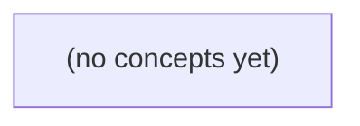

# 14.01 Python与数据工作：Go初学者的虚构IM数据管线

*一本面向Go技术栈初学者的中文静态教材，以完全虚构的IM消息与资料文档为载体，建立Python数据处理、校验、访问边界与可复现记录的基础。读者将在不调用模型、不接触真实数据的前提下，理解如何从JSONL解析到固定问题与证据草案，并始终区分Python实现细节与既定IM业务合同。*

**章节:** 2

---

## 本书导览

- 了解整本书的章节脉络
- 掌握各章之间的概念依赖关系
- 选择最合适的阅读顺序

# 14.01 Python与数据工作：Go初学者的虚构IM数据管线

一本面向Go技术栈初学者的中文静态教材，以完全虚构的IM消息与资料文档为载体，建立Python数据处理、校验、访问边界与可复现记录的基础。读者将在不调用模型、不接触真实数据的前提下，理解如何从JSONL解析到固定问题与证据草案，并始终区分Python实现细节与既定IM业务合同。

下方的概念图展示了本书 0 个核心概念以及它们之间的依赖关系；再下方是 1 个章节的入口。你可以按从上到下的顺序阅读，也可以根据自己的兴趣或先验知识选择切入点。

#### 概念图



## 章节索引

- **14.01 Python与数据工作：Go学习者怎样整理一份虚构IM样本** — 面向Go技术栈初学者，以虚构IM消息JSONL说明Python对象/集合、函数、异常、文件、UTF-8校验、环境隔离和可复现数据记录。

## 14.01 Python与数据工作：Go学习者怎样整理一份虚构IM样本

- 说明Python在AI数据支线与Go服务主线的分工
- 辨别对象绑定、可变集合与类型提示边界
- 逐行解析并校验虚构JSONL
- 区分正文UTF-8字节与HTTP原始请求体
- 隔离错误/拒绝和访问范围
- 记录Python环境、输入哈希和可复现清洗结果

本节以完全虚构的 IM 样本为起点，建立 Python 数据支线与 Go 服务主线协作的学习边界。

### 双语言分工与虚构数据边界

### 双语言分工与虚构数据边界

Go 与 Python 在本卷中不是竞争关系，而是围绕同一份教学问题分工协作：

- **Go** 负责 IM 服务语义：成员关系、消息提交、状态码与进程内接收结果。例如当前 S2/v1 规定正文非空、最多 `6 UTF-8B`；原始 HTTP 请求体最多 `4096B`；同一消息 ID 重复提交返回 `409`；非成员返回 `404`；成功时返回 `200 accepted_in_memory`，仅表示当前进程已接收，并不等于持久化。
- **Python** 负责数据工作：整理虚构样本、解析字段、校验字节长度、统计重复 ID、生成可复现实验输入与教学图表。Python 不替代服务端裁决；它应根据明确规则检查样本，而不是自行猜测业务含义。

样本中的 `u-a`、`u-b`、`c-a`、`m-a` 以及“资料助手”文档均为**完全虚构**的教学材料。它们用于模拟用户、会话、消息和辅助资料之间的关系，绝不代表真实公司、真实员工、真实聊天记录或从生产系统脱敏得到的历史数据。

尤其要区分“静态样例”和“服务历史”：静态文件只是为 Python 实验手工构造的输入，**不是**从当前 S2 导出的权威记录。未来可讨论 S3/v2 的 `stored_in_teaching_db` 提议，但正文上限仍为 `6B`，且 R9 尚待审；在规则批准并实现前，不能把它当作既成事实。

### 从对象绑定到可变集合

### 从对象绑定到可变集合

设 Python 侧整理一份完全虚构的样本：用户 `u-a`、`u-b`，频道 `c-a`，消息 `m-a`。名称不是“盒子”，而是对象的绑定：

```python
message = {"id": "m-a", "channel_id": "c-a", "sender_id": "u-a", "body": "hi"}
same_message = message
```

此时 `message` 与 `same_message` 指向同一字典。修改其中一方会影响另一方：

```python
same_message["body"] = "ok"
assert message["body"] == "ok"
```

字典适合表示一条字段可扩展的消息，列表适合表示频道中的消息集合：

```python
messages = [message]
messages.append({"id": "m-a", "channel_id": "c-a", "sender_id": "u-b", "body": "yo"})
```

但列表允许重复，不能天然保证“同一 ID 重复提交返回 `409`”。应在写入前维护 `seen_ids`，或按 ID 建立字典索引。类似地，`body: str` 只说明开发者期望字符串，并不会自动检查正文是否为空、是否超过当前 S2/v1 的 `6` 个 UTF-8 字节，也不会限制原始 HTTP 体 `4096` 字节。运行时仍需显式校验编码后的长度、成员关系与重复 ID；非成员应对应 `404`。

当前 `200 accepted_in_memory` 仅表示本进程内集合已接收，不是权威历史导出。静态样例只是教学资料，不能冒充从 S2 导出的记录，更不应混入真实公司消息。未来 S3/v2 即使提议 `stored_in_teaching_db`，正文仍拟保持 `6` 字节限制，且 R9 尚待审。

### 逐行读取 JSONL 并验证消息

### 逐行读取 JSONL 并验证消息

将虚构样本保存为 JSONL：一行一条记录，彼此独立。Python 不应一次性把文件整体当作可信数据载入，而应逐行解析、逐行校验，并把坏记录隔离到拒绝清单中。样本中的 `u-a`、`u-b`、`c-a`、`m-a` 仅是教学标识，不代表真实公司、用户或历史消息；静态样例也不是从当前 S2 导出的权威记录。

基本流程是：读取行号，跳过空行，执行 `json.loads`，再检查对象结构与业务字段。例如消息至少应具有消息 ID、发送者、会话/频道标识、正文及成员关系所需信息。当前 S2/v1 的正文必须非空，且 UTF-8 编码后最多 `6` 字节：`0 < len(text.encode("utf-8")) <= 6`。不要用 Python 字符数代替字节数，因为汉字和 emoji 的 UTF-8 长度不同。

可将每行结果分为三类：

- **可提交**：字段完整、正文长度合规、发送者是目标会话成员，且消息 ID 尚未出现。
- **拒绝：409**：消息 ID 已在本批数据或模拟服务状态中出现。同 ID 重复对应 HTTP `409`，不能悄悄覆盖旧消息。
- **拒绝：404**：发送者不是目标会话成员。非成员访问对应 `404`；这不是“正文不合法”，而是资源对该身份不可见。

解析错误、缺字段、类型错误和超长正文也应记录，但不要因一行失败停止整份文件。拒绝记录至少保存 `line_no`、原始行或其摘要、`reason`、预期状态码，便于回放与统计。

当前 `200 accepted_in_memory` 只表示该 Python/Go 演示进程内已接受；进程退出后不应把它误写成持久历史。原始 HTTP 体上限仍为 `4096` 字节。未来 S3/v2 即使提议 `stored_in_teaching_db`，正文上限仍是 `6` 字节，且 R9 尚待审，因此验证器应把版本规则明确写出，而非预先假定已持久化。

### 正文长度不是请求体长度

### 正文长度不是请求体长度

S2/v1 同时限制两种不同对象：

- **正文长度**：`text` 必须非空，且 UTF-8 编码后最多 `6` 字节。
- **原始 HTTP 请求体长度**：整个请求体最多 `4096` 字节。

前者约束业务消息，后者约束网络输入与解析成本；二者不能互相替代。

例如：

| `text` | UTF-8 字节数 | 是否满足正文规则 |
|---|---:|---|
| `hello` | 5 | 是 |
| `你好` | 6 | 是 |
| `你好啊` | 9 | 否 |
| `ééé` | 6 | 是 |

因此不能用 Python 的 `len(text)` 直接判断中文、表情等文本；它统计的是字符数，而非 UTF-8 字节数。应检查：

`len(text.encode("utf-8")) <= 6`

反过来，`4096` 字节的请求体也不意味着可以携带 `4096` 字节正文。JSON 的键名、引号、结构符号以及其他字段都会占用请求体空间；即使整包很小，`text` 若为 `你好啊`，仍应因正文达到 `9` 字节而拒绝。

资料助手中的静态 `u-a/u-b`、`c-a`、`m-a` 样例仅用于 Python 整理和教学比较，不是从当前 S2 导出的权威历史，也不包含真实公司消息。未来 S3/v2 即使提议 `stored_in_teaching_db`，正文上限仍拟保持 `6` 字节，且 R9 尚待审。

### 环境、哈希与教学结果复现

### 环境、哈希与教学结果复现

可复现不等于“再次运行恰好得到同一句话”，而是能说明：在哪个 Python 环境中、对哪份虚构输入、按什么规则清洗，并产出可核验的教学摘要。

建议随样例保存一份运行记录：

- Python 版本与关键库版本，例如 `Python 3.12`、`pandas`、`charset-normalizer`。
- 输入文件名、字节大小、`SHA-256` 哈希值。
- 清洗规则：仅保留虚构会话 `u-a/u-b`、`c-a`、`m-a`；统一 UTF-8；去除测试字段；按消息 ID 去重。
- 输出摘要：输入条数、有效条数、重复条数、拒绝条数、各会话消息数。

哈希应针对原始文件字节计算，而不是针对 Python 解析后的对象：

`sha256(open("fictional_im.json", "rb").read())`

这样即使 JSON 的缩进、换行或字段顺序改变，也会被识别为不同输入。清洗后的结果也应单独计算哈希，形成“原始输入 → 清洗规则版本 → 教学输出”的追踪链。

需要特别区分服务语义。当前 S2/v1 中，正文非空且最多 `6 UTF-8B`，原始 HTTP 体最多 `4096B`；同一消息 ID 重复提交返回 `409`，非成员返回 `404`。`200 accepted_in_memory` 仅表示当前 Go 进程已在内存中接受该消息：重启后不保证仍可查询，也不是持久化历史。

未来可讨论 S3/v2 的 `stored_in_teaching_db` 提议，但它仍保留 `6B` 正文限制，且 R9 尚待审。静态 Python 样例因此只是教学夹具，不是从当前 S2 导出的权威历史，更绝不能混入真实公司消息。

> **要点** — Python 用于可信整理虚构样本；Go 负责服务语义，二者以明确边界和可复现记录协作。

从Go的变量、切片和map出发，建立Python“名字绑定对象”的心智模型，并用两条虚构IM记录辨清数据、身份与行号。

### 从静态变量到名字绑定对象

### 从静态变量到名字绑定对象

Go 中，变量先有静态类型，再保存相应类型的值；Python 更适合这样理解：**名字绑定到对象**。赋值通常不是“把值复制进一个固定类型的格子”，而是让名字指向某个对象：

```python
sender = "u_42"        # str 对象
message_id = 1008      # int 对象
record = {"id": message_id, "sender": sender}  # dict 对象
reply_to = None        # 表示“没有关联消息”
```

这里 `sender`、`message_id`、`record` 都是名字；`str`、`int`、`dict`、`None` 是对象及其类型。名字可重新绑定：

```python
message_id = "m_1008"
```

这在 Go 中通常不成立：若 `messageID` 声明为 `int`，就不能再赋给它字符串；Python 的类型注解也不会自动阻止这种操作：

```python
message_id: int = 1008
message_id = "m_1008"  # 运行时默认仍可执行
```

对整理 IM 数据尤其重要的是对象的可变性。`str` 和 `int` 不可变，修改看似“原变量”的操作实际会绑定新对象；`list` 和 `dict` 可变，多个名字可能共享同一对象：

```python
raw = {"id": 1008, "text": "在吗？"}
item = raw
item["text"] = "在吗，方便回复吗？"
# raw["text"] 也随之改变
```

这类似 Go 中两个 map 变量引用同一底层 map；但 Python 不需要显式指针语法，也可能出现共享修改。

比较时，`==` 问“值是否相等”，`is` 问“是否同一对象”。例如两条消息都可能有相同文本，`a["text"] == b["text"]` 为真，却不表示两条记录是同一条消息。应以 `id` 字段识别消息身份；JSONL 中的第 1、2 行只是文件行号，不是消息 ID。

### 可变容器、别名与不可变字符串

### 可变容器、别名与不可变字符串

Python 变量不是“装值的格子”，而是绑定对象的名字。`list` 和 `dict` 是可变对象：多个名字若指向同一对象，经由任一名字修改，其他名字都会看到变化。

```python
消息 = {"消息ID": "m-1001", "文本": "  在吗  ", "标签": ["未读"]}
待清洗 = 消息

待清洗["文本"] = 待清洗["文本"].strip()
待清洗["标签"].append("已规范化")

print(消息)
# {"消息ID": "m-1001", "文本": "在吗", "标签": ["未读", "已规范化"]}
```

这里 `待清洗 = 消息` 不是复制，类似 Go 中两个变量持有同一个 map 的引用；它们是别名。若原始记录必须保留，应建立浅复制：

```python
清洗后 = 消息.copy()
清洗后["文本"] = 清洗后["文本"].strip()
```

但浅复制只复制最外层 `dict`。嵌套的 `标签` 列表仍被共享：

```python
清洗后["标签"].append("已清洗")  # 消息["标签"] 也会改变
```

需要独立修改嵌套容器时，可显式复制该层：

```python
清洗后["标签"] = 消息["标签"].copy()
```

字符串 `str` 不可变，`strip()`、`replace()` 等操作会创建新字符串，必须重新绑定名字；它不会原地改写原文本。比较内容用 `==`，例如 `消息["消息ID"] == "m-1001"`；`is` 判断是否为同一对象，清洗逻辑中通常只应写 `值 is None`。此外，消息 ID 是记录字段，JSONL 行号是文件位置；即使第 2 行恰好是 `"m-1002"`，两者也不应混作同一身份。

### 值相等与对象同一性

### 值相等与对象同一性

Python 中，`==` 问“内容是否相等”，`is` 问“是否正是同一个对象”。这一区别类似于：两份内容完全相同的 Go 结构体可以用字段比较判断相等，但它们未必位于同一块内存。

```python
msg_a = {"id": "m-1001", "text": "今晚开会吗？"}
msg_b = {"id": "m-1001", "text": "今晚开会吗？"}

msg_a == msg_b   # True：字典键和值相同
msg_a is msg_b   # False：分别创建的两个字典对象
```

若只是另起一个名字绑定原对象，则两者既相等也同一：

```python
msg_c = msg_a
msg_c == msg_a   # True
msg_c is msg_a   # True
```

这对可变对象尤其重要。经由 `msg_c` 修改字典，会影响 `msg_a`；它们不是两条独立消息，更不是 JSONL 文件中的两行。消息 ID 如 `"m-1001"` 是业务字段；JSONL 行号则是文件中的位置，二者都不能用对象身份替代。

`is` 最可靠、最常见的用途是判断 `None`：

```python
reply_to = None

if reply_to is None:
    print("该消息没有回复目标")
```

应写 `is None`，不要写 `== None`：前者明确表达“缺失值这个单例对象”，也避免自定义类型改变 `==` 的比较行为。

不要用 `is` 比较普通字符串、整数或列表：

```python
"a" is "a"     # 结果可能受实现缓存影响，不能依赖
1000 is 1000   # 同样不应依赖
```

某些短字符串或小整数可能被运行时复用，导致 `is` 偶尔为真；这只是实现细节，不是值比较规则。比较消息 ID、文本、行号和字典内容时使用 `==`；只有要确认对象共享、检测 `None`，或实现按对象身份缓存时，才使用 `is`。

### 两条IM记录中的字段与行号

### 两条 IM 记录中的字段与行号

设有一个 JSONL 文件：**每个物理行是一条独立的 JSON 对象**。

```text
{"message_id":"m-1001","sender":"lin","text":"下午三点开会","mentions":["zhou"]}
{"message_id":"m-1008","sender":"zhou","text":"收到","reply_to":"m-1001"}
```

Python 可按行读取并解析：

`records = [json.loads(line) for line in f if line.strip()]`

此时 `records` 是一个 `list`，其中每个元素是一个 `dict`：

- `records[0]`：第一条读入的消息字典；
- `records[1]`：第二条读入的消息字典；
- `records[0]["message_id"]`：`"m-1001"`；
- `records[1]["reply_to"]`：`"m-1001"`，表示业务上的回复关系。

这三个“编号”必须分开看：

| 概念 | 第一条消息 | 第二条消息 | 含义 |
|---|---:|---:|---|
| JSONL 物理行号 | 1 | 2 | 文件中从上到下的行 |
| Python 列表索引 | 0 | 1 | `records` 的零起始位置 |
| 消息 ID | `m-1001` | `m-1008` | 业务系统赋予消息的稳定标识 |

因此，`m-1008` 不是“第 1008 行”，也不是 `records[1008]`。即使文件经过筛选、排序、拆分或重新导出，列表索引和物理行号都可能变化；消息 ID 才适合用于跨记录引用、去重和关联回复。

遍历时可同时保留行号与索引：

`for index, message in enumerate(records):`

若要报告原始 JSONL 行号，通常写为 `index + 1`。但这只是当前读取结果对应的文件位置，不应替代 `message["message_id"]`。

### 类型注解的边界与校验责任

### 类型注解的边界与校验责任

Python 注解更像给读者、编辑器和 `mypy`、`pyright` 等工具的说明书，而不是 Go 的编译期类型约束。写下：

```python
def parse_message(row: dict[str, object]) -> dict[str, str]:
    ...
```

并不会保证传入对象真是字典，也不会保证其中的字段都是字符串；从 JSONL 读出的数据仍可能是 `null`、数字、列表，或缺少关键字段。Python 运行时不会因注解不匹配自动报错。

例如两行虚构记录中，`id` 是业务消息 ID，不是文件行号：

`{"id":"m-1042","sender":"lin","text":"明早同步？"}`
`{"id":"m-1047","sender":"gao","text":null}`

可先显式检查整体结构，再检查字段：

```python
def read_text(row: object) -> str | None:
    if not isinstance(row, dict):
        raise ValueError("JSONL 行必须是对象")

    message_id = row.get("id")
    text = row.get("text")

    if not isinstance(message_id, str):
        raise ValueError("id 必须是字符串")
    if text is not None and not isinstance(text, str):
        raise ValueError("text 必须是字符串或 null")

    return text
```

这里 `str | None` 表示“返回字符串或空值”，但真正阻止错误的是 `isinstance` 与 `is None` 分支。容器也要校验：若 `attachments` 预期为列表，不能只写 `list[dict[str, object]]`，还应确认它确实是 `list`，并逐项确认元素是字典。注解负责表达契约；边界输入处的显式校验负责执行契约。

> **要点** — Python以名字绑定对象；可变容器会共享修改，类型注解不替代运行时校验，消息ID与JSONL行号必须分开记录。

本节以虚构IM消息JSONL清洗为线索，建立Python函数、校验与异常处理的可靠边界，并与Go的显式错误返回方式对照。

### 用def封装逐行清洗职责

### 用`def`封装逐行清洗职责

处理 JSONL 时，一行就是一个独立输入单元。用 `def` 把“解析”“校验”“记录结果”拆开，比把所有逻辑堆在循环里更容易测试，也更接近 Go 中按职责拆分函数、逐层返回 `err` 的习惯。

```python
import json

def parse_line(line: str, line_no: int) -> dict:
    try:
        value = json.loads(line)
    except json.JSONDecodeError as exc:
        raise ValueError(f"第 {line_no} 行不是合法JSON") from exc

    if not isinstance(value, dict):
        raise TypeError(f"第 {line_no} 行必须是对象")
    return value

def validate_message(item: dict, line_no: int) -> dict:
    sender = item.get("sender")
    text = item.get("text")
    ts = item.get("timestamp")

    if not isinstance(sender, str) or not sender:
        raise ValueError(f"第 {line_no} 行sender无效")
    if not isinstance(text, str):
        raise TypeError(f"第 {line_no} 行text必须是字符串")
    if not isinstance(ts, int) or ts < 0:
        raise ValueError(f"第 {line_no} 行timestamp无效")

    return {"sender": sender, "text": text, "timestamp": ts}
```

函数体必须缩进；`return` 一执行就结束当前函数，因此校验失败应尽早 `raise`，成功路径便无需层层嵌套。类型提示如 `line: str -> dict` 只帮助阅读器、编辑器和静态检查，不能替代运行时的 `isinstance` 与范围验证。

主循环只负责调度与记录：

```python
cleaned = []
for line_no, line in enumerate(lines, start=1):
    try:
        cleaned.append(validate_message(parse_line(line, line_no), line_no))
    except (ValueError, TypeError) as exc:
        errors.append(str(exc))
```

这相当于 Python 用 `raise` 传播失败、由边界处 `try/except` 处理；而 Go 更常写成 `value, err := parseLine(...)`。错误信息保留行号即可，不应拼接或打印可能含私密内容的原始消息正文。

### 类型提示不能替代运行时校验

### 类型提示不能替代运行时校验

类型提示描述的是“调用者应当传入什么”，而 JSONL 文件提供的是“实际读到了什么”。两者不能混为一谈。即使函数写成：

`def parse_message(obj: dict[str, object]) -> dict[str, object]:`

Python 也不会因此阻止 `obj` 实际是列表、字符串或 `None`；静态检查工具只能在开发阶段提示风险，不能替代读取数据后的验证。

虚构 IM 消息可约定包含 `id`、`sender_id`、`timestamp`、`text` 等字段。解析时先验证容器，再验证必填字段、字段类型和业务范围：

```python
def validate_message(obj: object, line_no: int) -> dict[str, object]:
    if not isinstance(obj, dict):
        raise ValueError(f"第 {line_no} 行：消息必须是对象")

    required = ("id", "sender_id", "timestamp", "text")
    missing = [key for key in required if key not in obj]
    if missing:
        raise ValueError(f"第 {line_no} 行：缺少字段 {missing}")

    if not isinstance(obj["id"], str) or not obj["id"].strip():
        raise ValueError(f"第 {line_no} 行：id 必须是非空字符串")

    if not isinstance(obj["sender_id"], int) or isinstance(obj["sender_id"], bool):
        raise ValueError(f"第 {line_no} 行：sender_id 必须是整数")

    if not 1 <= obj["sender_id"] <= 9_999_999:
        raise ValueError(f"第 {line_no} 行：sender_id 超出允许范围")

    if not isinstance(obj["text"], str):
        raise ValueError(f"第 {line_no} 行：text 必须是字符串")

    return obj
```

注意 `bool` 是 `int` 的子类，所以仅写 `isinstance(value, int)` 会错误接受 `True`。数值字段还应检查范围：时间戳不能为负，长度不能无限大，状态码应属于允许集合。

这与 Go 的思路相近：Go 常通过结构体、显式字段检查和 `error` 返回表达失败；Python 可以用类型提示改善编辑器补全和静态分析，但面对外部 JSON，仍必须在边界处把不可信输入转换为已验证的数据。报错信息携带行号即可，避免回显可能含隐私的消息正文。

### 从JSONL行到受控记录

### 从JSONL行到受控记录

JSONL 的每一行都是一条独立 JSON 对象；因此应按行处理，而不是一次性读入后再猜测边界。目标不是“尽量解析”，而是把输入分成两类：可安全进入后续流程的合格记录，以及带原因、可审计但不泄露正文的拒绝记录。

```python
import json
from typing import Any

def parse_message_line(line: str, line_no: int) -> tuple[dict[str, Any] | None, dict[str, Any] | None]:
    try:
        raw = json.loads(line)
    except json.JSONDecodeError as exc:
        return None, {"line": line_no, "reason": "JSON格式错误", "column": exc.colno}

    if not isinstance(raw, dict):
        return None, {"line": line_no, "reason": "顶层必须是对象"}

    try:
        message_id = raw["message_id"]
        sender_id = raw["sender_id"]
        text = raw["text"]
        sent_at = raw["sent_at"]
    except KeyError as exc:
        return None, {"line": line_no, "reason": f"缺少字段:{exc.args[0]}"}

    if not isinstance(message_id, str) or not message_id:
        return None, {"line": line_no, "reason": "message_id必须是非空字符串"}
    if not isinstance(sender_id, int) or sender_id <= 0:
        return None, {"line": line_no, "reason": "sender_id必须是正整数"}
    if not isinstance(text, str) or len(text) > 2000:
        return None, {"line": line_no, "reason": "text类型或长度不合法"}
    if not isinstance(sent_at, str):
        return None, {"line": line_no, "reason": "sent_at必须是字符串"}

    return {
        "message_id": message_id,
        "sender_id": sender_id,
        "text": text,
        "sent_at": sent_at,
    }, None
```

类型提示如 `dict[str, Any]` 只帮助阅读器、编辑器和静态检查工具；运行时 JSON 仍可能是列表、`null`、布尔值，甚至字段值类型错误，所以必须使用 `isinstance` 与范围检查。尤其注意 Python 中 `bool` 是 `int` 的子类；若字段严格要求整数，可写成 `type(sender_id) is int`。

读取文件时，文件打开或读取失败属于 `OSError`；单行内容错误则应继续处理后续行：

```python
try:
    with open("messages.jsonl", encoding="utf-8") as f:
        for line_no, line in enumerate(f, start=1):
            record, rejected = parse_message_line(line, line_no)
            if rejected:
                print(rejected)  # 不打印原始私密消息正文
            else:
                process(record)
except OSError as exc:
    raise RuntimeError(f"无法读取输入文件: {exc}") from exc
```

这类似 Go 中逐项检查 `err`，但 Python 常以 `raise` 抛出异常、由边界处的 `try/except` 分类处理。不要写裸 `except:`：它会连 `KeyboardInterrupt` 等异常也吞掉，并掩盖真正的程序缺陷。

### 分层捕获异常而不吞错

### 分层捕获异常而不吞错

Go 常把失败显式放在返回值中：

`msg, err := parseLine(line)`；调用者必须检查 `err != nil`。Python 则通常由函数在失败时 `raise` 异常，调用点用 `try/except` 决定恢复、记录或终止。两者共同目标不是“让程序永不报错”，而是让不同失败进入不同处理路径。

处理 JSONL 时，先在最小边界捕获可预期异常：

```python
import json

def parse_message(line: str, line_no: int) -> dict:
    try:
        obj = json.loads(line)
    except json.JSONDecodeError as exc:
        raise ValueError(f"第 {line_no} 行不是合法 JSON") from exc

    if not isinstance(obj, dict):
        raise TypeError(f"第 {line_no} 行顶层必须是对象")
    return obj
```

读取文件时，`OSError` 与内容错误应分开：前者表示路径、权限、磁盘等 I/O 问题；后者表示某一行数据不合规范。

```python
try:
    with open(path, encoding="utf-8") as f:
        for line_no, line in enumerate(f, 1):
            try:
                msg = parse_message(line, line_no)
                clean.append(validate_message(msg, line_no))
            except (ValueError, TypeError) as exc:
                errors.append(str(exc))
except OSError as exc:
    raise RuntimeError(f"无法读取输入文件：{exc}") from exc
except Exception as exc:
    raise RuntimeError(f"处理过程中出现意外错误：{type(exc).__name__}") from exc
```

不要写裸 `except:`，更不要捕获后静默 `pass`：这会连 `KeyboardInterrupt` 等控制异常也吞掉，并把程序缺陷伪装成“数据已清洗完成”。错误信息应携带行号、字段名和异常类型，但不要回显整条私密消息正文；必要时只记录长度、哈希或经过脱敏的字段摘要。

### 错误信息保留定位而避免泄露

### 错误信息保留定位而避免泄露

清洗 JSONL 时，错误日志应帮助定位坏数据，却不能把虚构 IM 正文、用户标识、会话号等再次扩散。建议每条错误只保留：

- `文件名`：如 `sample_im.jsonl`
- `行号`：从 `1` 开始计数
- `错误类别`：如 `JSONDecodeError`、`ValueError`
- `受控摘要`：说明哪个字段不合格，而非输出原始记录

```python
def 记录错误(文件名: str, 行号: int, 错误: Exception, 摘要: str) -> None:
    print(f"{文件名}:{行号} [{type(错误).__name__}] {摘要}")
```

例如，解析失败时不要写：

`第 18 行失败：{"sender":"u_9527","text":"……私密正文……"}`

而应写：

`sample_im.jsonl:18 [JSONDecodeError] JSON 格式无效`

字段校验失败也应描述规则，不回显字段值：

```python
if not isinstance(记录.get("timestamp"), int):
    raise TypeError("timestamp 必须是整数")

if 记录["timestamp"] < 0:
    raise ValueError("timestamp 必须不小于 0")
```

调用处可将异常转换为安全摘要：

```python
try:
    记录 = 解析消息(原始行)
except (TypeError, ValueError) as 错误:
    记录错误(文件名, 行号, 错误, str(错误))
```

这类似 Go 中返回带上下文的 `fmt.Errorf("第 %d 行: %w", 行号, err)`，但 Python 的 `raise` 与 `try/except` 更要求在捕获点决定：哪些定位信息可以记录，哪些原始数据必须留在内存中而不能进入日志。

> **要点** — Python函数负责清晰分层，类型提示不等于验证；按异常类别记录行号与原因，既可追溯又不泄露消息正文。

以虚构IM消息JSONL为边界，建立从逐行读取、字段校验到拒绝记录的可靠处理流程，并厘清文本字节、原始请求与导出证据的差异。

### JSONL逐行读取的处理边界

### JSONL逐行读取的处理边界

JSONL（每行一个 JSON 值）适合消息导出：文件不是一个巨大的数组，而是许多彼此独立的记录。处理时应明确把“行”作为解析边界；不要先把整份文件读入内存，也不要把多行拼接后再猜测对象边界。

```python
from pathlib import Path
import json

path = Path("im_messages.jsonl")

with path.open("r", encoding="utf-8") as f:
    for line_no, raw_line in enumerate(f, start=1):
        line = raw_line.strip()
        if not line:
            continue

        try:
            message = json.loads(line)
        except json.JSONDecodeError as e:
            print(f"第 {line_no} 行不是合法 JSON：{e}")
            continue

        if not isinstance(message, dict):
            print(f"第 {line_no} 行不是消息对象")
            continue

        print(message)
```

`Path.open(..., encoding="utf-8")`显式固定文本编码，避免依赖操作系统默认编码。`json.loads`只负责把**当前这一行**解码为 Python 对象；一行应对应一个完整消息对象，例如：

`{"message_id":"m-1","conversation_id":"c-9","sender_id":"u-2","body":"你好"}`

这里的换行符是导出格式的记录分隔符，不属于消息 `body` 的必然内容。空行可以跳过，但格式错误行应记录行号和原因，不能悄悄吞掉。尤其不要因某行包含相同 `message_id` 就在读取阶段自动去重：重复导出记录只是证据中的重复，是否对应业务冲突必须由后续规则判断。

### 消息字段与对象校验

### 消息字段与对象校验

JSONL 的每一行应先被视为一个独立候选对象，而不是“已经可信的消息”。解析后先检查顶层值是否为对象，再围绕四个核心字段建立明确规则：

- `message_id`：必须存在，且为非空字符串；它是导出记录中的标识，不应仅因后续出现相同值就静默丢弃。
- `conversation_id`：必须存在，且为非空字符串；用于说明消息所属会话。
- `sender_id`：必须存在，且为非空字符串；用于说明发送者。
- `body`：必须存在，类型为字符串。若该记录代表当前 `/v1` 消息，则内容不得为空，并且 UTF-8 编码后的长度不超过 6 字节。

这里必须区分字符数与字节数。`"你好"` 有两个 Unicode 字符，因此 `len("你好") == 2`；但 UTF-8 下每个汉字通常占 3 字节，所以：

`len("你好".encode("utf-8")) == 6`

因此，`len(body) <= 6` 不能替代字节限制：六个汉字看似只有 6 个字符，实际可能占 18 字节。可将校验写成：

`isinstance(body, str) and body != "" and len(body.encode("utf-8")) <= 6`

不符合规则的行不应导致整个文件读取中断，而应形成拒绝记录，保存行号、原始对象或原始文本，以及拒绝原因，例如“`sender_id` 缺失”“`body` 不是字符串”“消息正文超过 6 UTF-8 字节”。通过校验的对象进入可接受记录集合；拒绝记录则保留为审计证据。

同一 `message_id` 出现多行，只能说明导出数据中存在重复或冲突，不能直接推断线上接口会返回 `409`，更不能为了“整洁”而静默去重。导出 JSONL 记录的是消息字段证据，并不包含原始 HTTP 请求体；即使 `body` 很短，也无法由它反推出请求体是否曾达到 4096 字节。

### 字符长度不等于UTF-8字节数

### 字符长度不等于 UTF-8 字节数

IM 导出中的 `body` 是 Python 字符串。`len(body)` 统计的是字符数，不是网络传输、接口限制通常关心的 UTF-8 字节数。

```python
body = "你好"

len(body)                  # 2：两个字符
len(body.encode("utf-8"))  # 6：每个汉字占 3 字节
```

因此，若虚构 `/v1` 消息规则是“正文必须非空，且 UTF-8 编码后不超过 6 字节”，不能写成 `len(body) <= 6`。那会误放行 `"你好你好"`：它有 4 个字符，却占 $4 \times 3=12$ 字节。

逐行解析 JSONL 后，可针对代表当前 `/v1` 消息的记录校验：

```python
def valid_v1_body(body: object) -> bool:
    return (
        isinstance(body, str)
        and body != ""
        and len(body.encode("utf-8")) <= 6
    )
```

例如，`"你好"` 合法；`""` 因为空正文而拒绝；`"你好你"` 虽然只有 3 个字符，但编码后为 9 字节，也应拒绝。英文、数字和汉字的 UTF-8 字节数可能不同，所以应始终对实际字符串执行 `encode("utf-8")`，而不是按“一个字符固定若干字节”估算。

### 导出消息与HTTP原始请求

### 导出消息与 HTTP 原始请求

JSONL 是**导出后的证据格式**：一行经 `json.loads` 解析为一个消息对象，其中 `body` 只是被保留下来的文本字段。它不等于客户端当时发送的完整 HTTP 原始请求体。

例如：

```python
{"message_id":"m1","conversation_id":"c1","sender_id":"u1","body":"你好"}
```

`body` 的字符数是 `len("你好") == 2`，其 UTF-8 字节数是 `len("你好".encode("utf-8")) == 6`。若规则针对当前 `/v1` 消息正文，可检查：

`body` 非空，且 `len(body.encode("utf-8")) <= 6`。

但“HTTP 原始请求体最大 4096B”是另一层限制。原始请求体可能还包含 JSON 结构字符、字段名、其他字段、嵌套对象、附件元数据，甚至传输前后的处理差异。导出 JSONL 也可能已经筛选字段、重排格式或脱敏。因此，即使导出的 `body` 很短，也不能据此证明原请求体小于 4096B；反过来，无法仅凭 `body` 重建原始请求体。

处理时应分别记录：`body` 的字符数与 UTF-8 字节数用于正文规则；只有捕获到原始 HTTP 载荷时，才能验证 4096B 请求体限制。不要把导出字段限制误写成请求体限制。

### 重复标识、拒绝记录与证据保全

### 重复标识、拒绝记录与证据保全

JSONL 导出中出现两个相同的 `message_id`，只能说明**样本文件里有重复标识的记录**；它不自动等价于线上接口曾返回 `409 Conflict`。线上是否冲突取决于当时服务端的幂等规则、请求时间、认证上下文、数据库状态，以及该接口是否把 `message_id` 作为唯一键。导出文件通常不包含这些信息。

因此，处理程序不应一见重复就“保留第一条”或“覆盖为最后一条”。静默去重会改变原始证据：你将无法知道重复出现在哪些行、内容是否一致、是否来自不同会话或发送者。

建议把每一行解析结果分为“可接受记录”和“拒绝记录”，并为拒绝记录保留：

- `line_no`：文件中的原始行号；
- `reason`：例如“重复 `message_id`”“缺少字段”“`body` 超过 6 UTF-8 字节”；
- `raw_line`：未修改的原始 JSONL 文本；
- 可选的已解析字段，如 `message_id`、`conversation_id`。

```python
seen_ids = set()

if message_id in seen_ids:
    rejects.append({
        "line_no": line_no,
        "reason": "重复 message_id；不推断为线上 409",
        "raw_line": raw_line,
    })
else:
    seen_ids.add(message_id)
    accepted.append(record)
```

这里的“拒绝”是本地样本处理决策，不是对线上系统行为的断言。尤其不能根据重复行反推出原始 HTTP 请求体、请求大小或服务端响应。保全原始行与行号，才能让后续审计者复现判断，并在需要时重新应用不同的业务规则。

> **要点** — 可靠清洗始于逐行解析与明确校验边界；字符、字节、HTTP请求和导出证据必须分别记录与判断。

本节以虚构IM消息JSONL为例，建立逐行校验、拒绝留痕与语料访问边界的清洗流程。

### 先定义可接受消息的最小契约

### 先定义可接受消息的最小契约

清洗前先把“什么算一条可用消息”写成明确契约，而不是在读取循环里临时猜测。对每个 JSONL 行，先要求其能解析为对象，并至少包含：

- `message_id`：非空字符串；在本批次内唯一。
- `conversation_id`：非空字符串，且符合已知会话标识规则。
- `sender_id`：非空字符串，仅表示发送者标识，不推断其成员权限。
- `body`：字符串；去除首尾空白后不得为空，UTF-8 编码字节数不得超过 `6B`。
- `created_at`：可解析的时间字符串或约定的整数时间戳。

可将契约理解为布尔谓词：

`accept(x) = 可解析 ∧ 字段齐全 ∧ 类型正确 ∧ 正文有效 ∧ id未重复 ∧ 会话合法`

其中“字段存在”不等于“字段有效”：`"body": ""`、`"body": null`、`"body": 12` 都必须拒绝，但原因分别应记录为“空正文”“错类型”等可区分标签。坏 JSON 则在字段检查前直接拒绝。

校验函数应返回“接受后的规范化记录”或“拒绝码”，例如 `missing_field`、`wrong_type`、`empty_body`、`body_too_large`、`duplicate_message_id`、`invalid_conversation_id`、`invalid_json`。原始 JSONL 永不覆写；清洗结果与拒绝日志分别保存。拒绝日志只保留行号、`message_id`（若可取得）和原因，**不写入正文**，避免将敏感内容再次扩散。

这份契约只说明数据质量，不授予访问权。后续若用于资料助手，还必须额外校验 `owner`、`scope`、`version` 与授权状态；私聊消息不能因为格式合格就自动进入公开检索语料。

### 逐行解析：从坏JSON到字段校验

### 逐行解析：从坏JSON到字段校验

JSONL 的基本单位是一行，而不是整个文件。处理时应按行读取，并固定遵循“解析 → 结构 → 字段 → 语义”的顺序：越早发现问题，越少做无效处理，也越容易给出准确拒绝原因。

1. **解析层**：先执行 JSON 解码。若某行缺引号、括号不配对、尾部多逗号或编码损坏，直接拒绝为`坏JSON`。此时没有可信字段可提取，拒绝记录只保存行号、原因和必要的错误摘要，不保存原始正文。

2. **结构层**：解析成功后，顶层必须是对象。例如`["hello"]`、`null`或单纯字符串虽然是合法 JSON，却不是一条消息，应拒绝为`结构不是对象`。

3. **字段层**：检查必需字段是否存在及类型是否正确。假设消息模式要求：
   - `message_id`：字符串；
   - `conversation_id`：字符串；
   - `sender_id`：字符串；
   - `body`：字符串；
   - `created_at`：字符串时间戳。

   缺少`message_id`应记为`缺字段: message_id`；`body: 123`应记为`错类型: body`。不要把数字强转成文本：静默修复会掩盖上游契约错误。

4. **语义层**：字段齐全且类型正确后，再验证内容约束。`body: ""`或仅含空白字符属于`空正文`；`conversation_id`不符合约定格式、为空，或无法在允许的会话集合中确认时，属于`错误conversation_id`。

例如：

`{"message_id":"m-1","conversation_id":"","sender_id":"u-7","body":"你好","created_at":"2025-01-01T10:00:00Z"}`

该行 JSON 合法、字段类型也正确，但会在语义层被拒绝，原因是`错误conversation_id`。这种分层记录比笼统标为“脏数据”更利于定位问题：是文件损坏、生产者字段变更，还是会话归属数据失效。

### 正文限制与重复消息判定

### 正文限制与重复消息判定

设每行均为一条虚构消息，例如：

`{"message_id":"m-001","conversation_id":"c-9","body":"你好"}`

接收前先验证正文是字符串且非空；随后按 **UTF-8 字节数** 限制，而不是按字符数限制。中文“你”通常占 3B，`"你好"` 为 6B，可以接受；`"你好！"` 通常为 9B，应拒绝。Go 中可用 `len(body)`，因为字符串长度即 UTF-8 字节数；Python 则应使用：

`len(body.encode("utf-8")) <= 6`

不要用 `len(body)` 代替字节计数：它计的是 Unicode 字符数量，无法识别中文、表情符号等多字节文本。

同一批次维护一个已见集合：

`seen_message_ids = set()`

处理顺序应固定：先完成 JSON 解析、字段与类型检查，再检查 `message_id` 是否已在集合中。首次出现的 `m-001` 在正文合格后写入清洗数据，并执行 `seen_message_ids.add("m-001")`；后续再次出现同一 ID，即使正文不同，也拒绝为“重复 message_id”。这样可避免同一批次内的覆盖、重复索引和统计膨胀。

拒绝记录只保留行号、`message_id`（若可取得）与原因，如 `body_utf8_bytes_exceed_6`、`duplicate_message_id`，不要复制正文。原始 JSONL 独立留存，清洗结果仅包含被接受的标准化记录。

### 原始、清洗与拒绝记录分层保存

### 原始、清洗与拒绝记录分层保存

不要把“读取并修正”当成清洗。输入的 JSONL 应分为三层保存：

- **原始层**：逐字节保存收到的文件或对象存储副本，只追加、不覆盖、不格式化。它用于审计、重放解析器和追查上游问题；即使某行是坏 JSON，也必须保留其原始形态。
- **清洗层**：仅包含通过校验、可被下游消费的规范消息。例如 `message_id` 唯一、`conversation_id` 合法、正文非空且 UTF-8 字节数不超过 `6B`。这里可统一字段顺序、补充派生时间字段或规范类型，但不能回写原始层。
- **拒绝层**：记录未被接纳的行，供监控与修复使用。拒绝记录绝不保存正文，以免错误日志反而扩大敏感内容传播。

一条拒绝记录应保留最小定位信息，例如：

`{"line":17,"reason":"duplicate_message_id","message_id":"m-008","conversation_id":"c-12"}`

对于坏 JSON，无法可靠取得标识时，只记录行号、原因和原始数据的摘要或哈希：

`{"line":23,"reason":"invalid_json","raw_sha256":"..."}`

这样，下游检索、统计和训练只读取清洗层；运维人员依据拒绝层定位问题；需要复核时再在受控权限下访问原始层。尤其不能因为消息“通过格式校验”就默认可公开使用：资料助手语料仍应另带 `owner`、`scope`、`version` 与授权状态，私聊内容不能整体视为可检索文本。

### 语料授权不是格式校验的一部分

### 语料授权不是格式校验的一部分

一行消息即使 `JSON` 合法、字段齐全、`message_id` 未重复、正文非空且长度合规，也只能说明它**格式可处理**，不能说明它**可以被资料助手检索或展示**。

可将两类判断分开：

| 判断层 | 关注问题 | 典型结果 |
|---|---|---|
| 格式校验 | 能否解析？字段和类型是否正确？ | 接受、拒绝并记录技术原因 |
| 访问合规 | 谁拥有内容？允许谁用于何种用途？ | 可入库、仅限特定范围、禁止索引 |

进入资料助手语料库的记录，除正文及基础消息字段外，还应关联：

- `owner`：内容归属者或管理主体；
- `scope`：可访问范围，如某项目、某群组、指定成员；
- `version`：权限与内容状态对应的版本；
- 授权信息：是否允许用于索引、摘要、问答或引用展示。

例如，某条私聊消息完全通过格式校验：

`{"message_id":"m-18","conversation_id":"dm-7","body":"下周预算方案先不要外传"}`

它仍不应因“可解析”而自动进入公开检索索引。私聊、受限群组、草稿、已撤回内容都可能具备不同的访问边界。资料助手检索时还必须依据当前请求者身份与 `scope` 过滤，而不是先召回全部文本、再假定结果可见。

因此，原始数据、清洗后的结构化数据与可检索语料应是不同层次：清洗负责保证数据质量；授权与范围控制决定数据是否、何时、向谁可用。

> **要点** — 可靠清洗既要逐行拒绝格式与语义错误，也要隔离正文、保留审计记录，并遵守语料授权边界。

清洗虚构IM样本不仅要“跑得通”，还要让他人能在明确环境中复跑、核对输入并得到稳定输出。

### 隔离环境与版本边界

### 隔离环境与版本边界

项目应使用项目级虚拟环境，而不是依赖系统全局 Python。这样可避免“我这里能跑、你那里报错”：不同解释器版本、已安装包和间接依赖都会影响清洗结果。

在项目根目录创建环境：

`python -m venv .venv`

随后激活它：Windows 使用 `.venv\Scripts\activate`，macOS/Linux 使用 `source .venv/bin/activate`。安装依赖时应明确版本，例如：

`python -m pip install "pandas==2.2.3"`

并把可复现的依赖边界写入依赖清单：

`python -m pip freeze > requirements.txt`

同时记录实际解释器版本，如 `Python 3.12.7`；仅写“Python 3”通常不够，因为小版本变化也可能改变库兼容性或默认行为。复跑时建议先创建新环境，再执行：

`python -m pip install -r requirements.txt`

`.venv/` 是本机生成物，体积大且包含平台相关二进制文件，不应提交到版本控制。将其加入 `.gitignore`：

`.venv/`

应提交的是创建环境的说明、Python 版本要求和 `requirements.txt`，而不是环境目录本身。这样仓库描述的是“如何构造同一运行边界”，而非把某台机器的运行状态直接搬进去。

### 从原始字节计算输入指纹

### 从原始字节计算输入指纹

可复跑的第一步，是明确“这次处理的输入到底是哪一份”。对于 JSONL 样本，应直接对**原始文件字节**计算 SHA256，而不是先解析 JSON、再重新序列化后再哈希：

```python
from pathlib import Path
import hashlib

path = Path("data/im_sample.jsonl")
raw = path.read_bytes()
sha256 = hashlib.sha256(raw).hexdigest()

print(sha256)
```

这里的 `read_bytes()` 很关键：哈希覆盖的是磁盘中的完整字节序列，包括 UTF-8 编码、换行符形式、行尾空白，以及文件末尾是否有换行。两份“解析后内容看起来相同”的 JSONL 文件，若一份使用 `\n`、另一份使用 `\r\n`，其字节不同，SHA256 也应不同；这正是输入指纹要捕捉的差异。

不要对 Python 对象直接求哈希，也不要依赖重新输出的 JSON。对象字段顺序、格式化空格、浮点表示或序列化参数都可能改变，导致指纹描述的是“某次程序转换后的结果”，而非收到的原始证据。

将摘要写入 manifest，例如：

```text
input_file: data/im_sample.jsonl
input_sha256: 7f...c2
```

复跑者可对自己的原始文件再次计算摘要；相同摘要强烈表明字节输入一致。注意，SHA256 是完整性校验和版本识别工具，不是加密，也不是权限证明：它不隐藏文件内容，不能说明文件来源可信，更不能替代访问控制、签名或审计记录。

### 清洗清单应记录什么

### 清洗清单应记录什么

清洗完成后，应同时生成一份机器可读的 `manifest.json`。它不是“日志摘要”，而是一次处理运行的可核对凭证：后来的人应能知道**用什么程序、带什么参数、处理了哪份输入，并产生了什么结果**。

建议至少记录以下字段：

- `schema_version`：清单自身的格式版本，例如 `"1.0"`。字段含义变化时升级它，避免旧工具误读新清单。
- `program_version`：清洗程序的版本，如 Git 提交号、发布标签或构建版本；不要只写“最新版”。
- `command` 与 `parameters`：实际执行的命令及关键参数，例如最大消息长度、允许的角色集合、是否去重等。
- `input`：原始输入文件路径、字节数与 SHA256。
  ```json
  {"path":"data/raw/im.jsonl","sha256":"...","bytes":12345}
  ```
  哈希用于确认输入内容是否一致，可通过 `Path.read_bytes()` 和 `hashlib.sha256()` 计算；它不是加密措施，也不能证明访问权限或文件来源。
- `accepted_count` 与 `rejected_count`：分别统计被接受和拒绝的记录数。若有多类拒绝原因，还应记录如 `invalid_json`、`missing_sender`、`too_long` 等分类计数。
- `output`：输出文件位置、SHA256、记录数，以及是否采用固定排序。
- `generated_at`：生成时间，建议使用带时区的 ISO 8601 格式，例如 `"2025-03-08T10:30:00Z"`。
- `random_seed`：若流程涉及抽样、随机打乱或随机脱敏，必须记录种子；若不使用随机性，可显式写 `null`。

输出路径应相对项目根目录表达，并统一以 UTF-8 编码写入。记录固定排序规则，例如按 `conversation_id`、`timestamp`、原始行号排序，不能依赖目录遍历顺序或字典偶然顺序。这样，即使输入文件名改变，也能凭输入哈希、程序版本和参数判断两次清洗是否真正可复现。

### 稳定输出与可控随机性

### 稳定输出与可控随机性

同一份虚构 IM 样本在不同机器、不同文件系统上处理时，输出应保持一致。否则即使清洗逻辑正确，审阅者也可能看到无意义的差异。

写入文本时显式指定 UTF-8，而不是依赖操作系统默认编码：

`output_path.write_text(text, encoding="utf-8", newline="\n")`

读取输入同样应明确编码；若输入本身是字节文件，则先用 `Path.read_bytes()` 保存原始内容并计算哈希，再按约定解码。这样可避免 Windows、Linux 或不同区域设置产生乱码、换行差异。

记录输出前应使用稳定键排序，例如按 `conversation_id`、`message_id`、时间戳排序：

`records.sort(key=lambda r: (r["conversation_id"], r["timestamp"], r["message_id"]))`

不要直接依赖 `Path.iterdir()`、`glob()` 或字典构造过程的偶然顺序。目录遍历顺序受文件系统影响；应先收集路径，再按规范化文件名排序：

`paths = sorted(input_dir.glob("*.json"), key=lambda p: p.name)`

若流程包含抽样、打乱、随机替换或生成虚构标识，必须使用明确的随机种子，例如 `random.Random(seed)`，并将 `seed` 写入 manifest。不要使用未记录种子的全局随机状态。这样可在需要时精确复现同一次抽样；若故意更换种子，也能清楚解释输出为何变化。

### 一份可复跑的IM清洗记录

### 一份可复跑的 IM 清洗记录

设 `raw/im.jsonl` 是虚构聊天样本：每行含 `id`、`sender`、`text`、`ts`。先建立隔离环境，并将实际解释器与依赖写入版本控制：

`python3.12 -m venv .venv`  
`.venv/bin/python -m pip install -r requirements.txt`

提交 `requirements.txt`（最好含精确版本），但在 `.gitignore` 中加入 `.venv/`；虚拟环境是本机产物，不是项目源码。

清洗程序应以字节读取原始文件，计算摘要后逐行校验。例如，`raw = path.read_bytes()`，再用 `hashlib.sha256(raw).hexdigest()` 记录输入 SHA256。该值用于确认“复跑时拿到的是同一份输入”，不是加密手段，也不能证明文件来源、访问权限或内容可信。

处理时记录明确规则：`schema_version = "1.0"`；拒绝缺少字段、`text` 非字符串或时间戳非法的记录；保留项按 `(ts, id)` 排序，而非依赖文件系统目录遍历顺序。输出以显式 UTF-8 写入，例如 `open(..., encoding="utf-8", newline="\n")`。若抽样、打乱或生成测试数据，必须同时记录随机种子；未使用随机性也应写明。

最终生成 `out/clean.jsonl` 与 `out/manifest.json`。后者至少包含：

- 程序版本或 Git 提交号、Python 版本、依赖锁定信息；
- 输入路径、字节数、SHA256；
- 模式版本、清洗参数、排序规则；
- 接受数、拒绝数及各拒绝原因计数；
- 输出路径、输出 SHA256、随机种子（如有）。

复现检查路径因此很直接：创建指定 Python 环境，安装固定依赖，核对原始输入摘要，运行同一程序与参数，再比较接受/拒绝计数和输出摘要。只要其中一项不一致，就应先定位环境、输入、规则或排序是否发生变化。

> **要点** — 可复现清洗依赖隔离环境、原始字节哈希、完整manifest与确定性输出；SHA256用于核对完整性，不代表保密或授权。

先把虚构IM样本当作可审计输入：不急于调用模型，先完成解析、校验、拒绝统计与证据草案。

### 明确清洗边界与产物合同

### 明确清洗边界与产物合同

清洗阶段只处理**结构正确、可追溯、可复现**的问题，不判断样本是否“有代表性”、回答是否“高质量”，更不调用模型补全缺失信息。把输入与输出写成明确合同，后续流程才可审计。

- `messages.jsonl`：一行一条虚构 IM 消息，负责提供对话事实。至少应包含消息标识、会话标识、发送者、时间与文本；解析器逐行读取，单行损坏不得阻塞其余行。
- `docs.jsonl`：一行一份可引用文档，负责提供外部证据。至少应包含文档标识、标题或来源、正文；它不是消息的替代品，也不应在清洗时被改写为“答案”。

建议将校验结果分成四类产物：

1. **合格集**：通过 JSON 解析、必填字段、标识唯一性及基础文本校验的消息与文档。保留原始标识，必要时附加来源行号。
2. **拒绝统计**：按原因计数，例如 `json无效`、`缺少字段`、`标识重复`、`正文为空`。统计是质量信号，不是静默丢弃记录。
3. **固定问题**：先确定 `q-01`、`q-02` 等稳定题目及其检索范围；题号不能依赖文件读取顺序或模型生成结果。
4. **证据草案**：为每个问题列出候选 `message_id`、`doc_id` 与简短引用理由。它只声明“可核查的支持关系”，不提前生成最终回答。

可将合同概括为：

`原始行 → 解析/校验 → 合格记录或拒绝原因 → 固定问题 → 证据引用草案`

Go 中用 `bufio.Scanner`、`json.Decoder` 或逐行读取实现，与 Python 的迭代方式不同；但“坏行可定位、好行可保留、输出标识稳定”的业务合同不变。

### 逐行读取JSONL并建立对象记录

### 逐行读取JSONL并建立对象记录

JSONL 的业务合同是“一行一个独立 JSON 对象”，因此读取时不要先把整个文件当成一个大数组反序列化。逐行处理可以定位坏记录、保留行号，并为后续“合格集 + 拒绝统计”建立稳定入口。

```python
from dataclasses import dataclass
from pathlib import Path
from typing import Any, Iterator
import json

@dataclass
class Record:
    source: str
    line_no: int
    data: dict[str, Any]

def read_jsonl(path: Path, source: str) -> Iterator[Record]:
    with path.open("r", encoding="utf-8") as f:
        for line_no, raw in enumerate(f, start=1):
            text = raw.strip()
            if not text:
                continue
            try:
                value = json.loads(text)
            except json.JSONDecodeError:
                yield Record(source, line_no, {"_parse_error": True})
                continue

            if not isinstance(value, dict):
                yield Record(source, line_no, {"_type_error": "顶层不是对象"})
                continue

            yield Record(source, line_no, value)
```

`Record` 把三类信息绑定在一起：来源文件、原始行号、已解析对象。`data` 使用 `dict[str, Any]`，表示“当前只保证顶层是对象，字段结构尚未验证”。这不是说字段可以随意使用；恰恰相反，`Any` 是类型提示的边界，后续必须检查如 `id`、`text`、`doc_id` 是否存在且类型正确。

Python 的字典和列表都是可变对象。若后续执行 `record.data["text"] = ...`，修改的是该记录持有的同一个字典；若多个变量引用同一字典，改动会彼此可见。构造派生结果时应显式复制，例如 `clean = dict(record.data)`，避免把清洗字段意外写回原始输入。

逐条读取还意味着单条损坏不会阻断整批样本：解析失败、顶层为列表或标量，都可作为拒绝原因记录下来。Go 中也可用 `bufio.Scanner` 或 `json.Decoder` 实现类似读取器；差异在错误处理和对象表示，不在业务合同：每一行都应独立解析、独立验证、可追溯。

### 验证字段、UTF-8与关联完整性

### 验证字段、UTF-8与关联完整性

最小验证的目标不是“尽量接收”，而是让每条进入合格集的数据都能被复核。对 `messages.jsonl`，可要求 `message_id`、`thread_id`、`doc_id`、`sender`、`text`、`timestamp` 均存在，且字符串非空；`message_id` 在消息文件内唯一。对 `docs.jsonl`，要求 `doc_id`、`title`、`content` 存在，`doc_id` 唯一。

```python
def valid_text(x):
    return isinstance(x, str) and x.strip() != ""

def validate_message(m, doc_ids):
    required = ["message_id", "thread_id", "doc_id", "sender", "text", "timestamp"]
    if not all(valid_text(m.get(k)) for k in required):
        return "缺少字段或空字符串"
    if m["doc_id"] not in doc_ids:
        return "引用了不存在的文档"
    return None
```

UTF-8 校验应发生在读取原始字节后、JSON 解析前：

```python
raw = line_bytes.decode("utf-8", errors="strict")
obj = json.loads(raw)
```

这验证的是样本文件的正文编码；不要把它与 HTTP 服务中的“原始请求体”混为一谈。HTTP 场景应先保留 `request.body` 的原始字节，再依据 `Content-Type` 和约定字符集解码；本节离线 JSONL 读取器没有网络请求体，也不应虚构该层语义。

跨文件关联必须完整：先收集所有合格文档的 `doc_id`，再验证每条消息的 `doc_id`。缺字段、重复标识、非法 UTF-8、JSON 语法错误、悬空文档引用都应拒绝，并按原因计数，而非悄悄跳过。Go 可用 `bufio.Scanner` 或 `json.Decoder` 实现同一读取器；工具差异不改变业务合同：一行一条记录、引用必须可解析、拒绝必须可解释。

### 隔离拒绝记录并汇总原因

### 隔离拒绝记录并汇总原因

逐行处理时，**拒绝不是异常终止**，而是一条可审计的处理结果。每条原始记录只能进入“合格集”或“拒绝集”之一；不要因一条坏数据中断整个批次，更不能让它带着默认值混入后续问题生成。

可为拒绝记录保留最小证据：

- `source`：来源文件，如 `messages.jsonl`
- `line`：原始行号
- `reason`：稳定的分类码
- `detail`：面向排查的简短说明
- `raw`：必要时保留原文或其安全摘要

```python
rejects = []
valid_messages = []

def reject(source, line, reason, detail, raw):
    rejects.append({
        "source": source, "line": line,
        "reason": reason, "detail": detail, "raw": raw,
    })
```

分类码应服务于统计，而非只保存随意的错误文本。例如：

- `invalid_json`：JSON 语法错误；
- `invalid_encoding`：文件不是预期的 UTF-8；
- `missing_field`：缺少 `id`、`sender`、`text`、`doc_id` 等必填字段；
- `invalid_value`：字段类型不对、文本为空、时间格式非法；
- `duplicate_id`：消息或文档标识重复；
- `unknown_doc_reference`：消息引用了不存在的文档；
- `unauthorized_reference`：引用存在，但该发送者无权访问；
- `schema_violation`：结构虽可解析，却不符合样本约定。

最终同时输出拒绝明细与按原因聚合的计数：

```python
from collections import Counter

reason_counts = Counter(r["reason"] for r in rejects)
```

例如，`{"invalid_json": 2, "missing_field": 3, "unauthorized_reference": 1}` 表示本轮输入质量，而不是模型能力。生成 `q-01`、`q-02` 的证据草案时只读取 `valid_messages` 与通过验证的文档；拒绝集仅用于审计、修复和回归测试。用 Go 重写读取器时，可以比较逐行扫描、UTF-8 解码和 JSON 解析的行为，但“哪些记录必须拒绝”的分类合同应保持一致。

### 生成固定问题与可追溯证据草案

### 生成固定问题与可追溯证据草案

对已通过校验的 `messages.jsonl` 与 `docs.jsonl`，先生成**固定、可检查**的问题，不调用模型，也不让问题措辞随运行漂移。例如：

- `q-01`：`用户 alice 在 2024-05-03 提到的报销问题是什么？`
- `q-02`：`文档中关于报销审批时限的规则是什么？`

问题应由确定性模板生成，并携带输入记录标识。证据不是“模型认为相关”的段落，而是可回查的引用草案：

```python
questions = [
    {
        "id": "q-01",
        "question": "用户 alice 在 2024-05-03 提到的报销问题是什么？",
        "evidence": [{"source": "messages.jsonl", "record_id": "m-017"}],
    },
    {
        "id": "q-02",
        "question": "文档中关于报销审批时限的规则是什么？",
        "evidence": [{"source": "docs.jsonl", "record_id": "d-004", "span": [120, 168]}],
    },
]
```

其中 `record_id` 指向原始合格记录；若文档已分段，`span` 可改为段落号或字符区间。草案阶段允许证据“待人工确认”，但不得伪装成已验证答案。

每次生成还应写入运行清单，例如：

- Python 版本、脚本版本与依赖版本；
- `messages.jsonl`、`docs.jsonl` 的 SHA-256；
- 合格记录数、拒绝数及按原因聚合的统计；
- 生成规则版本、问题标识与证据引用。

这样，相同输入和规则应得到相同的 `q-01`、`q-02` 与引用草案。Go 学习者可以实现对应的逐行读取器和哈希计算器，但 JSON 字段、校验规则、拒绝口径与问题模板才是业务合同；语言实现不同，不应改变这些可审计结果。

> **要点** — 先验证并留痕，再生成固定问题和证据；语言实现可不同，数据合同与审计边界必须一致。

本节以虚构IM消息JSONL为线索，建立Go学习者使用Python整理数据时的对象、校验、隔离与复现意识。

### 双语言分工与对象绑定

### 双语言分工与对象绑定

Go 与 Python 不必竞争“谁更适合处理消息”，而应按职责分工：Go 服务主线负责并发连接、HTTP 接口、认证、状态机与线上错误语义；Python 数据支线负责读取虚构 IM 的 JSONL 样本、字段检查、脱敏、统计、生成 manifest 与离线复现材料。此处只整理静态样本，不连接真实 IM、站点或服务。

Python 中变量更准确地说是“名字绑定对象”，不是像 Go 值类型那样默认复制内容：

```python
a = {"id": "m-001", "tags": []}
b = a
b["tags"].append("已检查")
```

`a` 与 `b` 指向同一个字典对象，因此 `a["tags"]` 也变为 `["已检查"]`。这类可变别名尤其容易污染原始样本、复用模板或累计处理结果。若需要独立副本，应明确复制；浅复制只复制外层，嵌套列表、字典仍可能共享。

```python
c = dict(a)       # 仅外层复制
```

可将 Go 的习惯迁移为一条纪律：区分“读取原始对象”“构造新对象”“原地修改对象”。例如保留 `raw_record`，再创建 `normalized_record`，避免清洗步骤回写原始证据。

类型标注如 `record: dict[str, str]` 主要服务编辑器、静态检查器与读者；普通 Python 运行时通常不会因此阻止错误对象进入。也就是说，标注不能替代 JSONL 字段校验，更不能替代对重复 ID、缺失字段或字节长度的实际检查。

### 集合操作与类型提示边界

### 集合操作与类型提示边界

一条虚构消息记录可先视为字典：`{"id": "m-17", "sender": "u-3", "text": "你好"}`；多条记录组成列表；已出现的消息 ID 则适合放入集合。

```python
seen_ids: set[str] = set()
messages: list[dict[str, object]] = []
```

列表保留输入顺序，适合重放样本；集合强调成员关系，适合快速判断重复 ID。处理时应注意对象别名：

`backup = messages` 并不会复制列表，二者指向同一对象；对 `messages.append(...)` 的修改会同时反映在 `backup` 中。若需要独立容器，可用 `messages.copy()`；但这仍只是浅复制，内部字典仍可能共享。

类型提示描述“期望形状”，不是运行时防线。即使写出：

`def ingest(record: dict[str, str]) -> None: ...`

外部 JSON 仍可能给出缺少 `id` 的对象、`id: 17`、或根本不是字典。Python 默认不会因类型提示自动拒绝它们。因此读取每行 JSON 后，仍须显式校验：对象类型是否为字典、必填字段是否存在、字段值是否为字符串、`id` 是否已在 `seen_ids` 中。

`try/except` 应包住可能失败的边界操作，如 JSON 解析或字段转换；不要用宽泛捕获掩盖程序错误。解析失败可记录行号并跳过，重复 ID 则作为样本一致性错误处理。这里的“重复”是离线数据质量问题，不等同于线上接口返回的 HTTP `409`：后者是服务端对一次请求的状态响应，前者只是本地集合检查得出的结论。

### 逐行读取JSONL与异常隔离

### 逐行读取JSONL与异常隔离

JSONL（每行一个 JSON 对象）适合流式处理：不必一次把全部消息载入内存，也能让某一行损坏时仅拒绝该行。规划时先把输入视为“字节行”，再按 UTF-8 解码、解析 JSON、检查字段，最后写入规范化结果与拒绝记录。

```python
import json

seen_ids: set[str] = set()

for line_no, raw_line in enumerate(source, start=1):
    try:
        obj = json.loads(raw_line)
        if not isinstance(obj, dict):
            raise ValueError("顶层必须是对象")

        msg_id = obj.get("id")
        text = obj.get("text")
        if not isinstance(msg_id, str) or not msg_id:
            raise ValueError("缺少有效 id")
        if not isinstance(text, str):
            raise ValueError("缺少有效 text")
        if msg_id in seen_ids:
            raise ValueError("重复 id")

        seen_ids.add(msg_id)
        accepted.append(obj)

    except (UnicodeDecodeError, json.JSONDecodeError, ValueError) as err:
        rejected.append({
            "line": line_no,
            "reason": str(err),
        })
```

这里 `obj`、`msg_id`、`text` 都是名字，不是值的复制；`obj` 指向解析出的字典对象。若把它加入 `accepted` 后再原地修改，列表中保存的也是同一对象。需要独立版本时应显式复制，而不是误以为重新绑定名字会复制对象。

类型标注如 `seen_ids: set[str]` 主要服务阅读者、编辑器和静态检查；Python 默认不会在运行时据此阻止 `seen_ids.add(123)`。因此字段检查仍必须使用 `isinstance` 等实际判断。

拒绝记录应保留行号、原因和必要的摘要，但不要原样记录敏感正文。重复 `id` 是离线样本内部的一致性错误；它不等同于线上接口的 HTTP `409 Conflict`。后者是服务器对请求状态的响应，而这里是在本地输入校验阶段主动拒绝数据。

### 字节计量与HTTP边界判定

### 字节计量与 HTTP 边界判定

“字符数”与“字节数”不是同一口径。Python 的字符串按 Unicode 字符组织；网络传输、文件额度和 HTTP `Content-Length` 通常按 UTF-8 字节计量。例如：

- `"你好"`有 `2` 个字符；
- 每个汉字在 UTF-8 中通常占 `3` 字节；
- 因而 `"你好"`的 UTF-8 编码长度是 `6B`。

若接口规定正文最大为 `6B`，`"你好"`恰好可接受；若正文为 `7B`，即使视觉上只多了一个标点、字母或表情的一部分编码，也应判为超限。校验应针对编码后的长度，即概念上检查 `len(text.encode("utf-8"))`，而不是只检查 `len(text)`。

还要区分业务正文与原始 HTTP 请求体：

- **业务 body**：例如 JSON 中的 `"content"` 字段，其字节限制可能是 `6B`。
- **原始 HTTP 请求体**：完整 JSON 序列化后的字节流，可能包含字段名、引号、逗号、`id`、时间戳等。

因此，“原始请求体不得超过 `4096B`”不等于“消息正文不得超过 `4096B`”。一条正文仅 `7B` 的消息，可能因附带大量元数据而使完整 JSON 超过 `4096B`；反过来，完整请求体未超限，也不能豁免正文自身的 `6B` 限制。静态整理样本时，应在 manifest 中分别记录 `content_utf8_bytes` 与 `raw_request_body_bytes`，避免用一个长度字段混淆两层边界。

### 错误语义、权限脱敏与复现清单

### 错误语义、权限脱敏与复现清单

离线清洗中的“重复 ID”应视为输入数据不满足本地规则，例如同一 `message_id` 出现两次，记录应被拒绝、隔离或写入错误清单。它不是线上接口返回的 HTTP `409 冲突`：`409` 表示服务端依据当前资源状态拒绝请求，常涉及并发更新、幂等键或版本条件；离线脚本没有 HTTP 交互时，不应凭空给错误标注 `409`。

错误记录宜保留可审计的语义，例如：

- `duplicate_message_id`：重复标识；
- `missing_required_field`：缺少 `sender_id`、`text`、`timestamp` 等必填字段；
- `invalid_json_line`：JSONL 某一行不能独立解析；
- `oversize_record`：单条原始 JSONL 行超过约定字节上限。

注意字节而非字符：`"你好"`是 2 个字符，但 UTF-8 编码通常占 6 B。若规则规定单行最大 7 B，则即使视觉上很短也可能超限。HTTP 的“4096 B”也须区分：它可能指完整原始 HTTP 报文，包含请求行、头部与空行；不能误当作仅 `body` 的大小限制。

清洗环境应使用独立 `venv`，并在 `manifest` 固化证据：输入文件名、行数、输出文件名、错误统计、Python 版本、依赖版本、规则版本，以及输入和输出文件的 SHA-256。哈希证明“这份结果对应这份字节内容”，不能证明数据本身真实或合规。

权限遵循最小化原则：原始样本只读，清洗产物写入独立目录；日志避免记录令牌、完整手机号、会话内容。脱敏应在导出前完成，例如以稳定哈希替代用户标识、截断文本、移除附件地址。`manifest` 可记录脱敏策略版本，但不应反向保存可还原的敏感映射。

> **要点** — Python数据整理的关键不是脚本能跑，而是边界可校验、错误可追踪、结果可复现。
