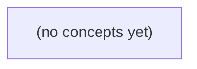

# 14.02 必要数学与机器学习直觉：面向资料助手的纸上推导

*一本面向 Go/Python 初学者的中文静态教材，以虚构 IM 资料助手为线索，从样本、特征和标签出发，手算向量相似度、条件概率、分类指标与数据划分。全书强调：模型分数只能辅助判断，权限、证据充分性和业务确认必须分层处理。*

**章节:** 2

---

## 本书导览

- 了解整本书的章节脉络
- 掌握各章之间的概念依赖关系
- 选择最合适的阅读顺序

# 14.02 必要数学与机器学习直觉：面向资料助手的纸上推导

一本面向 Go/Python 初学者的中文静态教材，以虚构 IM 资料助手为线索，从样本、特征和标签出发，手算向量相似度、条件概率、分类指标与数据划分。全书强调：模型分数只能辅助判断，权限、证据充分性和业务确认必须分层处理。

下方的概念图展示了本书 0 个核心概念以及它们之间的依赖关系；再下方是 1 个章节的入口。你可以按从上到下的顺序阅读，也可以根据自己的兴趣或先验知识选择切入点。

#### 概念图

## 章节索引

- **14.02 必要数学与机器学习直觉：相似不等于真实也不等于有权** — 面向Go/Python初学者，以虚构IM资料问题手算向量余弦、条件概率、分类指标与训练/验证/测试，识别过拟合和权限边界。

## 14.02 必要数学与机器学习直觉：相似不等于真实也不等于有权

- 区分样本、特征、标签、模型训练与推理
- 手算二维向量点积、范数和余弦
- 按条件表正确选择概率分母
- 从混淆矩阵计算precision/recall/accuracy
- 分开训练、验证与最终测试并识别泄漏
- 说明相似度/分类分数不代替授权与业务证据

资料助手首先要回答的不是“像不像”，而是“这条资料是否真实、相关且对当前用户有权可见”。本节用虚构IM资料场景建立机器学习判断的必要边界。

### 从资料问题拆分样本、特征与真相

### 从资料问题拆分样本、特征与真相

把“用户能否依据资料回答问题”直接交给模型，容易把几个不同层次混为一谈。以当前 S2/v1 为例：消息正文非空且最多 `6` 个 UTF-8 字节，原始 HTTP 体最多 `4096B`；同一 ID 重复提交返回 `409`，非成员访问返回 `404`，成功响应中的 `accepted_in_memory` 只表示本进程内已接受，并不等于永久存储。未来 S3/v2 即使提议 `stored_in_teaching_db`，正文上限仍为 `6B`，且 R9 仍待审。

- **样本**：一条可供分析的记录，例如“某用户、某会话、某消息、某问题、某次访问请求”。样本不是事实本身，只是观察单位。
- **特征**：从样本中抽取的可计算信息，如消息长度、是否为空、提交是否重复、提问者是否为成员、资料状态、关键词相似度、时间戳等。特征帮助模型判断，但不能自动授予权限。
- **标签**：人工或规则给出的训练答案，例如“该资料与问题相关”“该用户无权访问”“消息尚未持久化”。标签必须来自审查过的业务记录，而不能把模型自己的猜测再当标签。
- **模型输出**：如“相关概率为 0.92”或“建议引用该消息”。这是推理结果，表示统计判断，不是系统状态的证明。
- **业务真相**：由权威系统决定的事实，例如成员关系、消息是否真实存在、是否已保存、R9 是否批准。它应由数据库、审计记录或明确规则确认。

因此，模型可以用相似度帮助召回候选资料，却不能据此断言“资料真实”或“用户有权”。例如，即使某条 `accepted_in_memory` 消息与问题高度相似，也不能在进程重启后假定其仍存在；即使 S3/v2 出现 `stored_in_teaching_db` 字样，在 R9 未批准前，也不能把它当作可对外引用的最终证据。训练阶段学习的是“哪些特征常与答案相关”，推理阶段输出的是“值得进一步核验的候选”，而授权与事实确认必须回到业务真相。

### 相似度只衡量语义接近

### 相似度只衡量语义接近

把用户问题和一条资料分别编码为二维向量。设问题向量为 $q=(1,2)$，资料向量为 $d=(2,4)$：

- 点积：$q\cdot d=1\times2+2\times4=10$
- 范数：$\lVert q\rVert=\sqrt{1^2+2^2}=\sqrt5$，$\lVert d\rVert=\sqrt{2^2+4^2}=\sqrt{20}$
- 余弦相似度：

$$
\cos(q,d)=\frac{q\cdot d}{\lVert q\rVert\lVert d\rVert}
=\frac{10}{\sqrt5\sqrt{20}}=1
$$

结果为 $1$，表示两个向量方向完全一致：模型认为它们表达的语义高度接近。若资料内容是“项目预算为 100 万”，而问题是“项目预算是多少”，高相似度确实说明它值得被检索出来。

但这一步只产生“候选资料”，不能产生“可靠答案”。向量并不知道该资料是否由真实成员发送、是否已撤回、是否属于当前会话，或当前用户是否是该群成员。即使资料与问题余弦相似度为 $1$，它也可能是测试消息、伪造消息，或无权查看的私有内容。

因此，特征是向量中的数值；样本是“问题—资料”组合；标签可以是“相关/不相关”。训练学习的是从特征预测标签，推理则是对新组合给出相关性分数。业务真相却还需要独立校验：消息是否存在、请求体是否满足 S2/v1 的非空且最多 6 UTF8B、是否同 ID 重复而应返回 `409`、用户是否为成员而应避免 `404`。

相似度解决“像不像”，权限与事实校验解决“能不能看、是不是真的”。资料助手必须先过滤无权或无效资料，再让 LLM 基于有权证据作答。

### 条件概率的分母由提问条件决定

### 条件概率的分母由提问条件决定

设资料助手从候选资料中检索，某条资料的两个属性为：

- $A$：当前用户对该资料有权可见；
- $H$：本次检索命中该资料。

虚构 IM 资料库中共有 100 条资料，条件表如下：

|  | 命中 $H$ | 未命中 $\neg H$ | 合计 |
|---|---:|---:|---:|
| 有权 $A$ | 18 | 42 | 60 |
| 无权 $\neg A$ | 12 | 28 | 40 |
| 合计 | 30 | 70 | 100 |

资料助手收到“命中了一条资料”这一条件时，应计算：

$$
P(A\mid H)=\frac{18}{30}=60\%
$$

它的分母是“所有被命中的资料”30 条。含义是：命中的结果里，只有 60% 对当前用户有权；因此不能因为语义相似、检索命中，就直接展示内容。

而“有权资料被检索命中”的概率是：

$$
P(H\mid A)=\frac{18}{60}=30\%
$$

分母改为“所有有权资料”60 条。它衡量的是检索召回能力：用户本来有权看的资料中，系统找回了多少。

两者都使用同一个交集计数 18，却回答不同问题。前者关心输出是否安全，后者关心检索是否漏资料。LLM 的相似度分数最多帮助估计 $H$；权限判断必须依据成员关系、资料可见范围和服务端权威状态。即使未来 S3/v2 将资料标记为 `stored_in_teaching_db`，在 R9 审核通过前，也不能把“已存储”推断为“当前用户有权可见”。

### 分类分数不能越过权限边界

### 分类分数不能越过权限边界

设资料助手对“这份资料能否回答当前问题”做二分类：正类表示“可用”，负类表示“不可用”。在标注样本上，模型输出会形成混淆矩阵：

| 实际情况 / 预测结果 | 预测可用 | 预测不可用 |
|---|---:|---:|
| 实际可用 | 真正例 $TP$ | 假负例 $FN$ |
| 实际不可用 | 假正例 $FP$ | 真负例 $TN$ |

常见指标为：

- 准确率：$\frac{TP+TN}{TP+FP+FN+TN}$，整体猜对的比例。
- 精确率：$\frac{TP}{TP+FP}$，模型说“可用”时，实际可用的比例。
- 召回率：$\frac{TP}{TP+FN}$，实际可用资料被找回的比例。

例如，模型从历史消息中找到了语义很像的“上线排期”，召回率高说明它不容易漏掉相关资料；精确率高说明它较少把无关资料误判为相关。但这两个分数都不能证明资料对当前用户可见，更不能证明内容真实、仍有效或已经批准。

正确的调用顺序应是：

1. 先校验请求者是否为会话成员；非成员返回 `404`，不进入检索或分类。
2. 再校验资料状态、所属空间和授权范围；草稿、待审资料或无权限资料直接排除。
3. 仅对“当前用户有权访问”的候选资料计算特征与分类分数。
4. 最后由业务规则决定能否引用、展示或作为答案依据。

可将其理解为：成员关系、资料状态和授权是硬门禁；分类器只是门内排序器。即使模型给出 $0.99$ 的“相关”分数，也不能绕过门禁。类似地，S2/v1 的 `accepted_in_memory` 只表示本进程暂时接受了不超过 `6B` 的内容，并不等于已持久化、已审核，更不等于 S3/v2 所提议的 `stored_in_teaching_db`。

### 训练验证测试与泄漏防线

### 训练验证测试与泄漏防线

把“资料是否可作为有权证据”做成模型或规则评估时，数据必须分为三类：

- **训练集**：用于学习参数、编写特征或调整规则。例如学习“成员关系、消息状态、来源、时间、审批标记”与“可引用/不可引用”之间的关系。
- **验证集**：用于反复比较方案，如阈值、特征组合、提示词或规则优先级。它可以参与调参，但不能再被当作最终成绩。
- **测试集**：直到方案冻结后才运行一次，用来估计真实上线表现。若依据测试结果继续改规则，它就已经变成验证集了。

在该 IM 场景中，最危险的不是模型“记错”，而是**泄漏**：训练时看到了本不应知道的信息，使离线分数虚高。

| 泄漏来源 | 为什么会失真 | 正确处理 |
|---|---|---|
| 同 ID 重复消息 | 同一消息在训练集和测试集同时出现；模型只是在“认题” | 先按消息 ID 去重；重复提交应视为同一实体，业务上对应 `409` |
| 同源消息切分 | 同一会话、同一原始 HTTP 体或同一批导入资料被拆到不同集合 | 按会话、来源批次或资料实体分组切分，而非逐条随机切分 |
| R9 待审资料混入 | 模型可能把“未来可能入库”误学为“现在已经有权” | R9 必须标为待审，不得作为当前可引用的正例 |
| 未来 S3/v2 数据回流 | `stored_in_teaching_db` 是提议状态，不等于已批准证据 | 与当前 S2/v1 的 `accepted_in_memory` 分开标注、分开评估 |

尤其要区分“内容相似”与“证据可用”。即使测试问题与训练消息语义极近，只要当前用户不是成员、资料超过原始体 `4096B` 的接受边界，或资料仍处于 R9 待审状态，就不能输出“已有有权证据”。模型预测的是标签，业务系统仍必须执行权限、状态与版本规则。

> **要点** — 模型可提供相似度与分类线索；真实状态、业务证据和访问授权必须由独立规则与数据源确认。

先用可手算的二维人工特征理解检索相似度：它能排序候选资料，却不能证明资料真实、正确或有权使用。

### 从资料属性到二维向量

### 从资料属性到二维向量

先把每份候选资料压缩为两个**人工设定**的数值特征：

- 第 1 维：字节限制，例如资料允许携带或展示的内容容量；
- 第 2 维：权限等级，例如其可访问、可引用或可操作的范围。

这不是让模型理解自然语言后的 LLM embedding，而是为了手算而构造的二维坐标。设查询的需求是“字节限制高、权限要求低”，记为

$$
q=(1,0)
$$

三份资料分别是：

$$
d_1=(1,1),\qquad d_2=(0,1),\qquad d_3=(2,0)
$$

将文档按行排成 $3\times2$ 矩阵：

$$
D=
\begin{bmatrix}
1&1\\
0&1\\
2&0
\end{bmatrix}
$$

其中每一行是一份资料，每一列是一类属性。查询与各资料的点积可一次写成：

$$
Dq=
\begin{bmatrix}
1\\
0\\
2
\end{bmatrix}
$$

因此，若只按点积排序，$d_3$ 得分最高，$d_1$ 次之，$d_2$ 最低。直观地说，$q$ 只关心第 1 维，所以第 1 维更大的资料获得更高分。

但这些数字只是特征编码后的匹配信号：它们不包含正文事实是否正确、资料来源是否真实、许可证是否允许使用、答案是否能够引用等结论。相似度计算回答的是“向量像不像查询”，而不是“资料值不值得信任或是否有权使用”。

### 矩阵点积：先看匹配强度

### 矩阵点积：先看匹配强度

设两个纸上人工特征分别表示`字节限制`与`权限`。查询只关心前者：

\[
q=(1,0)
\]

三篇候选文档构成矩阵；每一行是一篇文档：

\[
D=
\begin{bmatrix}
1&1\\
0&1\\
2&0
\end{bmatrix},
\quad
d_1=(1,1),\ d_2=(0,1),\ d_3=(2,0)
\]

用矩阵乘法一次计算所有文档与查询的点积：

\[
Dq=
\begin{bmatrix}
1&1\\
0&1\\
2&0
\end{bmatrix}
\begin{bmatrix}
1\\
0
\end{bmatrix}
=
\begin{bmatrix}
1\\
0\\
2
\end{bmatrix}
\]

因此，点积得分为：

- \(d_1\cdot q=1\)：包含一单位“字节限制”，也带有“权限”特征；
- \(d_2\cdot q=0\)：只涉及“权限”，与当前查询不匹配；
- \(d_3\cdot q=2\)：在“字节限制”维度上的数值更大，得分最高。

点积本质上是逐维相乘再求和：

\[
d\cdot q=\sum_i d_iq_i
\]

由于 \(q=(1,0)\)，第二维被乘为零，分数完全由第一维决定。这里 \(d_3\) 比 \(d_1\) 排得更前，并不表示它的方向一定更贴近查询；它也可能只是向量更长、相关特征的数值更大。换言之，点积同时混入了“匹配方向”和“向量规模”。这正是后续需要用余弦相似度进行长度归一化的原因。

### 范数与余弦：比较方向而非长度

### 范数与余弦：比较方向而非长度

令查询与三篇文档的人工特征为：

\[
q=(1,0),\quad d_1=(1,1),\quad d_2=(0,1),\quad d_3=(2,0)
\]

这里两个维度暂且表示“字节限制”和“权限”特征；它们只是纸上示例，不是 LLM embedding。向量范数衡量长度：

\[
\|q\|=1,\quad \|d_1\|=\sqrt{1^2+1^2}=\sqrt2,\quad
\|d_2\|=1,\quad \|d_3\|=2
\]

点积为：

\[
q\cdot d_1=1,\qquad q\cdot d_2=0,\qquad q\cdot d_3=2
\]

因此，若只按点积排序，结果是 \(d_3>d_1>d_2\)。但点积同时受方向和长度影响：\(d_3\) 的分数更高，部分原因是它比 \(q\) 更长。

余弦相似度将点积除以双方长度：

\[
\cos(q,d)=\frac{q\cdot d}{\|q\|\|d\|}
\]

代入可得：

\[
\cos(q,d_1)=\frac{1}{\sqrt2}\approx0.707,\qquad
\cos(q,d_2)=0,\qquad
\cos(q,d_3)=\frac{2}{1\cdot2}=1
\]

归一化后，\(d_3=(2,0)\) 与 \(q=(1,0)\) 落在完全相同的方向上；它只是 \(q\) 的两倍，故余弦为 \(1\)。\(d_1\) 既包含查询方向，也偏向另一维，所以相似度较低；\(d_2\) 与查询正交，余弦为 \(0\)。

注意：零向量没有方向，\(\|d\|=0\) 时余弦分母为零，因而未定义。实际系统必须过滤零向量或规定回退策略。

余弦高分只表示特征方向接近：它不能证明资料已获授权、正文事实正确，更不能自动证明其答案可以引用。

### 零向量与排序解释的边界

### 零向量与排序解释的边界

对查询 $q=(1,0)$，三个文档的点积为：

- $q\cdot d_1=1$
- $q\cdot d_2=0$
- $q\cdot d_3=2$

因此点积排序是 $d_3>d_1>d_2$。它保留了向量长度：$d_3=(2,0)$ 与查询方向完全一致，且长度为 $2$，所以得分最高。若特征数值本身代表可累加的强度、次数或权重，点积是合理选择；但它会偏爱“更长”或数值更大的对象。

余弦相似度进一步除以范数：

$$
\cos(q,d)=\frac{q\cdot d}{\|q\|\|d\|}
$$

这里 $\|q\|=1$，$\|d_1\|=\sqrt2$，$\|d_2\|=1$，$\|d_3\|=2$，故：

- $\cos(q,d_1)=1/\sqrt2\approx0.707$
- $\cos(q,d_2)=0$
- $\cos(q,d_3)=1$

余弦只比较方向，适合希望削弱篇幅、计数规模或向量模长影响的场景；点积则适合模长也应参与排序的场景。两者的分数都只是“特征空间中的接近程度”，不是事实核验，更不表示资料已获授权、正文正确或可直接引用。

特别地，零向量 $\mathbf0$ 的范数为 $0$，余弦公式分母为零，因而未定义。工程中应在归一化前检测 $\|x\|=0$：可跳过该对象、返回“无可比表示”、赋予最低排序分，或要求重新生成特征。不能把未定义值悄悄当作相似度 $0$，否则会混淆“正交”与“根本没有有效特征”。

### 相似分数不能替代授权判断

### 相似分数不能替代授权判断

设查询与三份资料使用纸上二维特征 `[字节限制, 权限]` 表示：

- $q=(1,0)$
- $d_1=(1,1)$，$d_2=(0,1)$，$d_3=(2,0)$

将文档组成矩阵 $D$，则点积检索分数为：

$$
Dq=[1,0,2]
$$

点积偏好数值更大的向量，因此 $d_3$ 最高；但它可能只是“字节限制”这一维数值较大，并不意味着内容更可靠。若改用余弦相似度，先计算范数：

$$
\|q\|=1,\quad \|d_1\|=\sqrt2,\quad \|d_2\|=1,\quad \|d_3\|=2
$$

于是：

$$
\cos(q,d_1)=1/\sqrt2\approx0.707,\quad
\cos(q,d_2)=0,\quad
\cos(q,d_3)=1
$$

余弦消除了长度影响，衡量方向是否一致；$d_3$ 与查询方向完全一致。但“方向一致”仍只说明它像查询，不说明它可以被使用。

检索后的判断至少应拆成三件事：

1. **相关性**：资料是否与问题匹配？由点积、余弦或其他排序模型估计。
2. **真实性与正确性**：资料是否来自可信来源，正文是否完整、过时、断章取义或包含错误？需要来源核验、交叉验证和版本检查。
3. **授权与可引用性**：资料是否允许访问、摘录、训练、再分发或作为答案依据？需要检查许可证、访问控制、合同条款和数据权限。

因此，高分文档只能进入“待验证候选集”，不能自动进入答案。尤其要避免把“模型检索到了”误写成“系统有权使用”。此外，零向量没有方向，其余弦相似度未定义；工程上应拒绝、过滤或单独处理这类输入，而不能将其误当作低相关但可正常比较的资料。

> **要点** — 余弦只衡量向量方向相近；高分资料仍须分别核验内容证据与访问授权。

用20道虚构IM资料问题构造2×2表，厘清条件概率的方向、基率含义，以及分数为何不能替代授权判断。

### 从问题清单到2×2列联表

### 从问题清单到2×2列联表

先把20道彼此独立、虚构的资料问题按两个变量分类：

- **是否属于权限主题**：例如“能否访问、下载、共享或导出资料”；
- **证据是否充分**：现有材料能否支持明确结论，而非仅有相似措辞或模糊线索。

交叉计数得到列联表：

|  | 证据充分 | 证据不足 | 合计 |
|---|---:|---:|---:|
| 权限主题 | 6 | 2 | 8 |
| 非权限主题 | 6 | 6 | 12 |
| 合计 | 12 | 8 | 20 |

这张表的共同样本空间是全部20题。行描述“问题属于什么主题”，列描述“证据达到什么程度”；两者不是同一件事。权限主题并不天然意味着证据充分，非权限主题也可能具有充分证据。

例如，权限主题共有8题，其中6题证据充分，因此在**已知是权限主题**的前提下，充分证据的比例为：

\[
P(\text{证据充分}\mid\text{权限})=\frac{6}{8}=0.75
\]

但若先知道某题证据充分，样本空间就变成表中12道“证据充分”的题；其中仅6道属于权限主题。分母随条件改变，这是后续区分条件概率方向的关键。Penn State 概率教材也强调：概率计算首先要明确事件、条件与所限定的样本空间。

### 条件方向决定分母选择

### 条件方向决定分母选择

设“权限”表示问题属于需要核验授权、许可或权利归属的主题，“证据”表示现有资料足以支持某项判断。20 道虚构问题可整理为：

|  | 有充分证据 | 证据不足 | 合计 |
|---|---:|---:|---:|
| 权限主题 | 6 | 2 | 8 |
| 非权限主题 | 6 | 6 | 12 |
| 合计 | 12 | 8 | 20 |

条件概率的竖线右侧表示“已经知道什么”，它决定观察范围，也就决定分母。

若问：

\[
P(\text{证据}\mid\text{权限})
\]

含义是：**已知问题是权限主题**，它有充分证据的比例是多少？此时只能在 8 道权限题中计数；其中 6 道证据充分，因此：

\[
P(\text{证据}\mid\text{权限})=\frac{6}{8}=0.75
\]

这不是“有证据的问题中有多少属于权限”，而是“权限问题中有多少已有证据”。

反过来：

\[
P(\text{权限}\mid\text{证据})
\]

含义是：**已知问题已有充分证据**，它属于权限主题的比例是多少？观察范围改为 12 道有证据题；其中只有 6 道是权限题：

\[
P(\text{权限}\mid\text{证据})=\frac{6}{12}=0.5
\]

两式分子都恰好是同一个交集计数 6，但分母分别是“权限总数”8 与“有证据总数”12，结果当然不同。Penn State 的概率教材强调，条件概率本质上是在给定条件限定后的样本空间中重新计算比例。

还应保留基率：

\[
P(\text{权限})=\frac{8}{20}=0.4
\]

权限主题本来只占四成。因此，“资料看起来相似”或“模型给出较高分数”都不能直接推出权限判断；更不能把这 20 道练习题的比例，当作真实生产环境中的概率。

### 基率与联合事件的核对

### 基率与联合事件的核对

先把20道虚构问题按两个事件分类：是否涉及“权限”$A$，以及是否具有“充分证据”$E$。

|  | 有充分证据 $E$ | 证据不足 $\neg E$ | 合计 |
|---|---:|---:|---:|
| 权限 $A$ | 6 | 2 | 8 |
| 非权限 $\neg A$ | 6 | 6 | 12 |
| 合计 | 12 | 8 | 20 |

基率是事件在全部样本中的比例，而非某个筛选条件下的比例。因此：

- 权限的基率为  
  $$P(A)=\frac{8}{20}=0.4$$
- 有充分证据的总体比例为  
  $$P(E)=\frac{12}{20}=0.6$$
- 同时满足“权限”和“有充分证据”的联合事件为  
  $$P(A\cap E)=\frac{6}{20}=0.3$$

联合比例的分子必须是两个条件同时成立的题数，即左上角的6题；分母仍是全体20题。它可与条件概率交叉验证：

$$P(A\cap E)=P(E\mid A)P(A)=\frac{6}{8}\times\frac{8}{20}=\frac{6}{20}$$

也可从反方向计算：

$$P(A\cap E)=P(A\mid E)P(E)=\frac{6}{12}\times\frac{12}{20}=\frac{6}{20}$$

这正是 Penn State 概率教材强调的乘法关系：条件概率改变的是分母所限定的样本空间，但联合事件本身不因计算方向不同而改变。这里的$0.4$、$0.6$和$0.3$仅描述这20题的构成；它们不是生产环境中权限问题、证据质量或模型命中率的自动估计。

### 同一张表的错误读法

### 同一张表的错误读法

设有 20 道独立的虚构资料问题：

|  | 证据充分 | 证据不足 | 合计 |
|---|---:|---:|---:|
| 权限主题 | 6 | 2 | 8 |
| 非权限主题 | 6 | 6 | 12 |
| 合计 | 12 | 8 | 20 |

最常见的误读是：看到

\[
P(\text{证据}\mid\text{权限})=\frac{6}{8}=0.75
\]

便说：“只要有充分证据，就有 \(75\%\) 的概率属于权限主题。”这把条件方向倒过来了。前者问的是“**已知是权限主题，它有证据的比例是多少**”；后者真正需要的是：

\[
P(\text{权限}\mid\text{证据})=\frac{6}{12}=0.5
\]

因为 12 个有证据的问题中，只有 6 个是权限主题；另外 6 个虽有充分证据，却属于非权限主题。证据充分可以与权限主题相关，却不能自动推出权限结论。

这里还涉及基率。权限主题在这批题中原本只占：

\[
P(\text{权限})=\frac{8}{20}=0.4
\]

观察到证据后，比例从 \(0.4\) 升至 \(0.5\)，说明证据提供了一些信息；但它远非“可以放心授权”的确定性结论。忽略“非权限主题也可能有证据”这一基率结构，就会把相关性夸大成权限保证。

还要限定样本范围：这些数值仅描述这 20 道虚构题，不能直接当作生产环境的真实概率。现实数据的主题比例、证据质量、标注规则和检索来源都可能不同。类似地，模型给出的“相似度 \(0.75\)”通常只是排序分数，不等于经过校准的 \(75\%\) 概率，更不等于 \(75\%\) 的授权把握。Penn State 的概率教材强调，条件概率必须明确“给定什么”；交换条件的位置，问题就变了。

### 从统计相关回到权限边界

### 从统计相关回到权限边界

设有20道独立的虚构资料问题，可整理为 $2\times2$ 表：

|  | 证据充分 | 证据不足 | 合计 |
|---|---:|---:|---:|
| 权限主题 | 6 | 2 | 8 |
| 非权限主题 | 6 | 6 | 12 |
| 合计 | 12 | 8 | 20 |

由表可得：

- $P(\text{证据}\mid\text{权限})=6/8=0.75$：在这8道权限主题题中，75%有充分证据。
- $P(\text{权限}\mid\text{证据})=6/12=0.5$：在12道证据充分题中，只有50%属于权限主题。
- $P(\text{权限})=8/20=0.4$：不看证据时，权限主题本来只占40%。

关键在条件方向不能互换。`权限主题更常有证据`，不等于`有证据就更可能获得权限`，更不等于`可据此授权`。前者描述样本中的统计关联；后两者涉及权限规则、身份、资源范围、用途、时间和审批链等业务边界。

这20题只是教学用的小样本：题目并非随机抽取，类别比例也未必反映生产环境。因此 $0.75$、$0.5$ 和 $0.4$ 不能直接当作线上概率、风险率或服务承诺。Penn State 的概率教材强调，条件概率依赖给定事件及其所属总体；改变总体、筛选规则或基率，结论就会变化。

同样，相似度分数或分类器分数只表示模型在某种训练目标下的匹配强弱。除非经过独立验证、概率校准，并证明其在当前人群与场景中稳定，否则“0.9分”不等于“90%真实”，更不等于“90%有权”。授权必须回到可审计的政策与证据，而不能由相关性分数自动替代。

> **要点** — 条件概率先看“已知什么”再定分母；统计分数只能辅助判断，不能越过证据与授权边界。

二分类指标能衡量预测表现，却不能把“看似可答”变成“有证据且有权限的可答”。本节用一张混淆矩阵厘清分母、代价与硬约束。

### 先定义“可答”的标签与预测

### 先定义“可答”的标签与预测

这里的二分类问题不是“模型能不能写出一段通顺答案”，而是：

> 对某个问题，系统是否**可以依据当前已授权、可追溯的资料**作答。

先固定业务标签。真实标签为正类（可答），当且仅当授权资料中存在足以支持关键结论的证据，且该资料允许当前用户、当前用途访问。真实标签为负类（不可答），包括资料缺失、证据不足、资料过期、来源不可靠，或虽有相关资料但无权访问等情形。

模型预测则是系统在回答前作出的判断：预测正类表示“允许依据检索到的授权资料回答”；预测负类表示“拒答、追问、转人工，或仅说明未找到可用依据”。

因此，混淆矩阵中的四格具有明确业务语义：

- TP：确有授权证据，系统也允许作答；
- FP：实际不可答，系统却作答，例如把相似片段当证据、引用无权资料；
- FN：实际有充分授权证据，系统却拒答；
- TN：实际不可答，系统正确拦截。

“授权”不是普通特征，而是硬约束。即使模型对内容相关性置信度很高，只要资料不在权限范围内，业务判定仍应为不可答；不能通过降低分类阈值，以更多“可答”预测交换越权风险。只有先写清标签、预测对象与判定边界，后续 precision、recall 和 accuracy 的分母才有实际含义。

### 从混淆矩阵识别四类结果

### 从混淆矩阵识别四类结果

先把任务写清：对每份待回答材料，标签为“可依据**已授权且足够的资料**回答”或“不可回答”；模型再给出“回答”或“拒答”的预测。20 个样本可排成混淆矩阵：

| 真实情况 \ 模型决定 | 预测回答 | 预测拒答 | 合计 |
|---|---:|---:|---:|
| 实际可答 | TP=6 | FN=3 | 9 |
| 实际不可答 | FP=2 | TN=9 | 11 |
| 合计 | 8 | 12 | 20 |

- **真正例 TP=6**：资料确实足够且已获授权，模型也选择回答。这是“答得对”的 6 次。
- **假正例 FP=2**：实际不应回答，模型却回答。原因可能是证据不足、引用资料未授权，或问题超出可用资料范围；这是高风险的“误答”。
- **假负例 FN=3**：实际可以依据授权资料回答，模型却拒答。它降低可用性，但通常不等同于越权。
- **真负例 TN=9**：实际不应回答，模型也正确拒答。这 9 次体现了系统识别无证据或无权限情形的能力。

四格之和必须等于样本总数：

$$6+2+3+9=20$$

因此，混淆矩阵不是抽象术语，而是逐项记录两件事是否一致：资料条件下的真实可答性，以及模型是否作答。尤其要注意，FP 并非普通“小错误”：即使语言内容看起来合理，只要缺少可依据的授权证据，仍应归入不该回答的情形。

### 按分母手算三项分类指标

### 按分母手算三项分类指标

先约定正类为“可依据授权资料回答”。在 20 个纸上样本中：

|  | 真实可答 | 真实不可答 |
|---|---:|---:|
| 预测可答 | TP=6 | FP=2 |
| 预测不可答 | FN=3 | TN=9 |

三项指标的关键不在公式本身，而在于**分母回答了不同问题**。

- **精确率（precision）**：在模型“预测可答”的 8 次中，真正可答有多少次？  
  $$
  \mathrm{precision}=\frac{TP}{TP+FP}
  =\frac{6}{6+2}
  =0.75
  $$
  即模型每给出 4 次“可答”判断，平均有 3 次正确，另有 1 次属于误答无证据或越权风险。

- **召回率（recall）**：在真实可答的 9 个样本中，模型找回了多少个？  
  $$
  \mathrm{recall}=\frac{TP}{TP+FN}
  =\frac{6}{6+3}
  =\frac{2}{3}
  $$
  这表示仍漏掉了 3 个本可依据授权资料回答的问题。

- **准确率（accuracy）**：在全部 20 个样本中，预测正确了多少个？  
  $$
  \mathrm{accuracy}=\frac{TP+TN}{TP+FP+FN+TN}
  =\frac{6+9}{20}
  =0.75
  $$

这里 precision 与 accuracy 都是 $0.75$，但含义不同：前者只审视“预测可答”的风险，后者把正确拒答的 9 个 TN 一并计入。它们只是这张纸上混淆矩阵的计算结果，不代表真实系统评测；前提是标签、预测规则与样本分母均已明确。

### 高代价误答为何不能只看准确率

### 高代价误答为何不能只看准确率

设“可依据授权资料回答”为正类。纸上分类结果为：

|  | 实际可答 | 实际不可答 |
|---|---:|---:|
| 预测可答 | TP=6 | FP=2 |
| 预测不可答 | FN=3 | TN=9 |

总数为 $20$，因此：

- 准确率：$\mathrm{accuracy}=(TP+TN)/20=(6+9)/20=0.75$
- 精确率：$\mathrm{precision}=TP/(TP+FP)=6/(6+2)=0.75$
- 召回率：$\mathrm{recall}=TP/(TP+FN)=6/(6+3)=2/3$

三项数字中，准确率与精确率恰好都是 $0.75$，但它们回答的问题不同。准确率把全部 $20$ 个样本作为分母，只说明“总体判断正确了多少”；其中 $9$ 个 TN 会显著抬高分数，却不能说明系统对“允许作答”的判断足够可靠。

精确率只考察系统声称“可答”的 $8$ 次：其中有 $2$ 次其实不可答。这两个 FP 的含义尤其关键——系统可能在没有充分证据时编造回答，或把不具备访问权限的资料当作可用依据。即使总体准确率不错，这类错误仍可能泄露受限信息、误导用户，或违反合规要求。

召回率则揭示另一面：实际可答的 $9$ 个问题中，有 $3$ 个被拒答。FN 会降低可用性，但通常意味着“本可回答却保守地没有回答”；相较于无证据或越权作答，其业务代价往往较低。

因此，若 FP 代价远高于 FN，不能仅以准确率选阈值。应优先关注精确率、FP 数量及其具体类型，并把权限过滤视为硬约束：分类器即使给出高置信度“可答”，只要资料未获授权或证据不足，就必须拒答或转为说明限制。上述数值仅用于说明指标分母与风险取向，并非真实评测结果。

### 阈值优化不能穿透权限边界

### 阈值优化不能穿透权限边界

设分类器对“此问题可依据当前资料回答”输出分数 $s\in[0,1]$，再用阈值 $\tau$ 决定是否回答：当 $s\ge\tau$ 时预测“可答”，否则预测“不可答”。调低 $\tau$ 通常会让更多样本被判为可答：召回率可能上升，但误答、无证据回答或越权回答的风险也会增加；调高 $\tau$ 则更保守，可能减少假阳性，却也可能遗漏本可回答的问题。

但这里有一条不能由阈值交换的规则：

- **权限过滤是硬约束**：资料不在当前用户、任务或系统允许的范围内，即使模型分数很高，也必须拒绝使用。
- **证据校验是硬约束**：答案无法由已授权、可追溯的资料支持时，不能因为“语义很像”或分类器置信度高而输出为有依据的结论。
- **阈值只作用于模型决策**：它可以优化“何时建议回答”，不能把无权资料变成有权资料，也不能把相似内容变成可靠证据。

例如，纸上统计为 $TP=6, FP=2, FN=3, TN=9$，共 $20$ 个样本，则：

\[
\mathrm{precision}=\frac{6}{6+2}=0.75,\qquad
\mathrm{recall}=\frac{6}{6+3}=\frac{2}{3},\qquad
\mathrm{accuracy}=\frac{6+9}{20}=0.75
\]

即使准确率为 $0.75$，也不能据此接受误答代价高的系统：两个假阳性可能意味着两次无证据或越权输出。应先执行“权限允许且证据充分”的门控，再在剩余候选上讨论阈值、精确率与召回率。上述数字仅用于说明标签、预测和分母的定义，不构成真实系统的正式评测结论。

> **要点** — 指标必须绑定标签、预测与分母；高风险场景优先防范FP，且任何分类阈值都不能替代证据与授权。

模型是否“学会”，不能只看训练集答对多少；必须用独立数据检验，并警惕相似样本造成的虚假高分。

### 三份数据各自回答什么问题

### 三份数据各自回答什么问题

设有 20 条合成即时消息（IM）样本，每条消息记为 $q$，任务是判断它应关联到哪份资料、是否应转人工，或是否低于可信阈值。可将数据预先分成：12 条训练集、4 条验证集、4 条最终测试集。

- **训练集（12 条）回答“参数怎么学？”**  
  用它调整模型参数、提示词中的可学习部分或检索表示。例如，让系统从消息 $q$ 中提取姓名、项目、日期等线索，并学习资料匹配分数 $s(q,d)$ 的模式。训练集答对 $12/12$ 只能说明系统记住或拟合了这 12 条，不能证明它会处理新消息。

- **验证集（4 条）回答“规则怎么选？”**  
  在不再改动训练样本的前提下，用验证集选择设计决策：如阈值 $\tau$、候选资料数量、是否要求日期一致、低置信度时是否拒答。若复杂规则在训练集为 $12/12$，验证集却只有 $2/4$，这是过拟合警讯：规则可能利用了训练样本的偶然措辞，而非真正可泛化的关联线索。

- **最终测试集（4 条）回答“冻结后的系统能否验收？”**  
  当参数、规则和阈值都已固定后，才运行一次最终测试。其结果是对实际部署前表现的独立检查；不能看到测试错例后再改阈值、改规则并重复测试，否则测试集已变成新的验证集。

划分还必须防止泄漏：同一会话中的近重复消息、同一文档的改写版本，不能分别落入训练与验证或测试。应按会话、用户、文档或时间分组切分，并使测试分布尽量代表真实任务；独立不等于代表性。

### 从样本关联到可学习规则

### 从样本关联到可学习规则

把一次资料关联任务写成样本 $(q,D,y)$：$q$ 是用户查询，$D=\{d_1,d_2,\dots\}$ 是候选资料，$y$ 表示某资料是否与该查询真正相关。模型不必“理解所有世界知识”，而是学习一个可计算的规则：

$$
s_\theta(q,d)=f_\theta(\phi(q,d)),\qquad \hat y=\mathbb{1}[s_\theta(q,d)\ge \tau]
$$

其中，$\phi(q,d)$ 是特征，例如关键词重合、语义相似度、资料时间、来源类型、查询与资料中的实体是否一致；$s_\theta$ 是关联分数；$\theta$ 是从数据中学到的参数；$\tau$ 是把分数转成“关联/不关联”判定的阈值。

训练集的 12 个样本提供的是调参依据：比较已标注的 $y$ 与预测 $\hat y$，调整 $\theta$，让规则更少漏掉真实关联、也更少误连无关资料。它支持的结论只是“这套参数能解释这些训练例”，而不是“规则已经可靠”。

例如，复杂规则在训练集达到 $12/12$ 正确，可能只是记住了某些词、文档编号或写法；若验证集仅为 $2/4$，更合理的解释是规则未能迁移到新样本，存在过拟合警讯。训练准确率描述拟合程度，不是泛化能力，更不是资料“真实”或“有权威性”的证明。

### 验证集选择阈值而不改答案

### 验证集选择阈值而不改答案

设模型对每个资料关联样本 $q$ 输出分数 $s(q)\in[0,1]$：分数越高，越可能“匹配/可信”。训练集的 12 个样本用于学习参数；阈值 $\tau$ 不应凭训练集的完美表现决定，而应在 4 个验证样本上比较。

例如预先列出候选规则：

- $\tau=0.50$：$s(q)\ge0.50$ 即接受；
- $\tau=0.70$：只接受较高置信度结果；
- $\tau=0.85$：宁可拒绝，也减少错误接受。

验证后得到：

| 阈值 | 验证集正确数 | 观察 |
|---|---:|---|
| 0.50 | 2/4 | 接受过宽，出现错误关联 |
| 0.70 | 3/4 | 错误接受与错误拒绝较平衡 |
| 0.85 | 2/4 | 过于保守，漏掉真实关联 |

若实际任务更重视“不要把无关资料当作相关资料”，可在事先声明的代价规则下选 $\tau=0.70$，并记录候选阈值、指标、选择理由和选择日期。这里改变的是**判定规则**，不是手工改写某个样本的答案，更不能看到最终测试集后再把阈值从 $0.70$ 改成更有利的值。

随后冻结 $\tau=0.70$，仅在 4 个最终测试样本上检查一次。即使测试得分不理想，也应把它视为独立证据；重新调阈值需要新的验证集或新的测试集。验证集只有 4 个样本时，$3/4$ 只是选择线索，不是稳定性能的充分证明。

### 训练全对却验证失分的警讯

### 训练全对却验证失分的警讯

设某复杂规则在 12 个训练样本上全部正确，却在 4 个验证样本中只答对 2 个。训练准确率为

\[
12/12=100\%
\]

验证准确率却只有

\[
2/4=50\%
\]

这不是“规则已经证明有效，只是偶然失手”的理想信号；更合理的警讯是：规则可能记住了训练资料中的表面模式、措辞或个案细节，却没有学到能迁移到新资料的判断原则。这正是过拟合：对已见样本拟合得过紧，对未见但相关的样本泛化较差。

比较两类规则时，不能因为复杂规则训练全对，就断言它优于较简单、训练分数稍低但验证表现更稳定的规则。训练集用于学习参数；验证集才用于比较规则、调整阈值与决定是否保留复杂性。若根据验证结果继续反复改规则，验证集也会逐渐被“记住”，最终仍须在冻结选择后，用最终测试集独立检查。

不过，`2/4` 也不能提供充分统计证明。验证集只有 4 个样本，少答对或多答对 1 个，准确率就会变化 25 个百分点；50% 可能反映真实泛化不足，也可能部分来自小样本波动。因此应将其表述为“明显需要警惕并继续检验”，而非“已严格证明该规则无效”。还要检查这 4 个样本是否代表实际任务：若训练与验证含有同一会话的近重复内容，或同一文档被拆到不同划分中，高分同样可能只是信息泄漏。

### 泄漏、分组与冻结后的最终测试

### 泄漏、分组与冻结后的最终测试

随机逐条切分数据，常会制造“看似独立、实则泄漏”的高分。例如，同一场会话中的相邻问答高度相似：前半段进入训练集，后半段进入验证集，模型可能只是记住了措辞、人物或上下文。又如同一篇文档被切成多个片段，某段在训练集、另一段在验证集；这并不检验模型能否处理新文档。

因此，划分单位应匹配真实部署任务：

- 若实际任务面对新的用户会话，就按`会话ID`分组：同一会话只能进入 train、validation 或 final test 之一。
- 若任务面对未来到来的资料或请求，就按时间切分：较早数据训练，较晚数据验证和最终测试。
- 若同一资料 $q$ 有多个改写、摘要或派生样本，应按资料来源分组，避免“同源样本跨集合”。

分组并非万能。测试集仍应覆盖真实场景中的主题、难度、噪声和边界案例；否则，即使没有泄漏，也只能说明模型在一个偏窄分布上表现良好。

设 12 个训练样本用于学习参数，4 个验证样本用于选择规则或阈值，4 个最终测试样本只在选择被冻结后检查一次。某复杂规则在 train 为 $12/12$、validation 仅为 $2/4$，首先是过拟合警讯：规则可能贴合了训练中的偶然细节。它不是“模型必然无效”的充分统计证明，因为样本很小；但足以要求简化规则、补充数据或重新验证。

关键纪律是：final test 不能参与反复比较。若看到测试结果后再改阈值、换提示词或挑规则，测试集事实上已变成验证集。应冻结模型、规则、阈值和评测流程后，才进行一次独立最终测试；任何后续修改，都需要新的未见测试数据。

> **要点** — 训练用于学习，验证用于选择，测试用于冻结后验收；相似样本泄漏会让高分失真。

在IM资料问答中，余弦相似度只能衡量文本接近程度；系统能否引用、回答与发送，还必须经过权限、证据和交付状态的独立校验。

### 从相似候选到可信回答

### 从相似候选到可信回答

余弦相似度 $cos(q,d)$ 只回答“查询 $q$ 与文档 $d$ 的文本是否接近”，不回答文档是否真实、当前用户是否有权查看，以及证据是否足以支持结论。因此，问答链路应严格拆为四步：

1. **过滤**：先验证用户—空间成员关系，如用户是否属于目标业务域 `u-b`、会话或频道 `c-a`；再按文档 `access_scope` 排除无权内容。无权限文档不应进入向量检索，更不能作为隐性推理依据。
2. **检索**：仅在可见语料中召回相似候选。高相似度只是候选排序信号，可能来自过期公告、转述消息或语义相近但事实不同的材料。
3. **核证**：检查候选是否来自可信来源、版本是否有效、时间是否匹配，并确认关键结论有足够直接的引用支撑。若引用只能证明背景、不能证明答案中的核心断言，就不能把该断言写成事实。
4. **作答**：只根据已核证证据生成回答，并附上可访问的引用。证据不足、来源冲突或权限边界不清时，应明确拒答或说明无法确认，而不是用流畅措辞补全空白。

还要区分系统状态：`S2 200` 可能仅表示请求已被内存层受理，并不等于“AI 已可回答”，更不等于 IM 消息已成功送达。回答生成、引用校验、发送队列、客户端回执分别需要独立状态。

训练阶段依赖固定的数据集与模型版本；推理阶段则面对当前权限、当前索引和当前文档版本。训练中见过的信息，不能绕过推理时的访问控制或替代实时证据。

### 权限先于向量检索

### 权限先于向量检索

设用户为 $u$、机器人为 $b$、会话为 $c$、候选文档为 $d$。检索并不是直接在全部文档集合 $D$ 上计算余弦相似度，而应先构造用户在当前会话中的**可见集合**：

$$
D_{\text{visible}}(u,c)=\{d\in D\mid member(u,c)\land member(b,c)\land access\_scope(d,u,c)=\text{允许}\}
$$

随后才对 $D_{\text{visible}}$ 中的文档计算或排序：

$$
score(d)=\cos(\mathrm{embed}(q),\mathrm{embed}(d))
$$

并取分数最高的候选。换言之，正确流程是：

1. 校验 $u$ 是否为会话 $c$ 成员，$b$ 是否已被加入该会话；
2. 根据文档的 `access_scope`、所属频道、私有群组、租户和时间有效性过滤资料；
3. 仅对过滤后的候选进行向量召回、重排与引用核验；
4. 若没有可见且证据充分的资料，则拒答或请求授权，而不是用“最相似”的不可见文档补全答案。

原因在于余弦相似度只回答“文本像不像”，不回答“用户能不能看”。即使某份私有事故报告与问题的相似度为 $0.95$，只要其 `access_scope` 不包含当前用户或会话，它就不应进入候选列表，更不应被模型摘要、引用或间接泄露。

这也避免了一个常见错误：先从全库检索，再在生成阶段“尽量不说敏感内容”。此时标题、片段、排序位置甚至“存在某份文档”的事实都可能已经泄露。权限过滤必须发生在向量计算或候选排序之前；模型看到的上下文，应当从一开始就是已授权的数据集。

### 高余弦为何不足以作证

### 高余弦为何不足以作证

设用户 `u-b` 在项目群中提问：“客户 `c-a` 的退款政策是什么？”系统将问题编码为二维向量：

$$q=(1,1)$$

检索到两条文本：

- 旧公告：`d_{\text{old}}=(0.9,1.0)`，“`c-a` 退款政策：30 天内可退款。”
- 私密法务文档：`d_{\text{legal}}=(1.0,0.8)`，“`c-a` 合同约定：签署后 7 天内退款。”

余弦相似度分别为：

$$\cos(q,d_{\text{old}})=\frac{1.9}{\sqrt2\sqrt{1.81}}\approx0.998$$

$$\cos(q,d_{\text{legal}})=\frac{1.8}{\sqrt2\sqrt{1.64}}\approx0.994$$

两者都极高，原因只是都重复了“`c-a`”“退款”“政策”等措辞；它并未表达“内容仍有效”或“用户有权阅读”。

因此，检索前应先过滤：

1. `d_old` 虽对 `u-b` 可见，但已被新政策替代，不能作为充分依据；
2. `d_legal` 即使更接近问题，若 `access_scope` 仅限法务组，则 `u-b` 无权引用；
3. 只有同时满足成员关系、客户范围、文档可见性与版本有效性的候选，才可进入证据核验。

若过滤后没有能支撑答案的当前公开证据，系统应拒答或说明“未找到可访问的有效政策”，而非用高相似度补全结论。即使内部状态返回 `S2 200`，也只表示请求被内存层受理；“模型可回答”不等于消息已通过权限校验，更不等于 IM 已成功送达。训练数据、模型版本与推理时可访问文档也必须分别记录。

### 引用充分性与拒答边界

### 引用充分性与拒答边界

一个可发送的答案，不是“检索到若干相似片段”即可，而应满足证据集合 $E$ 的四项条件：

- **可见**：每条引用都在当前用户的 `access_scope` 内；先按成员关系过滤，再按文档、频道或消息可见性过滤。无权访问的高相似片段不能作为证据，也不能借由摘要、标题或模型记忆间接泄露。
- **相关**：证据直接支持问题中的对象、时间、条件与结论，而非仅共享关键词。例如“发布计划”不能自动证明“已发布”。
- **完整**：关键结论应覆盖必要限定词、版本、责任人和例外条件。只找到“可以使用”而未找到适用范围、审批要求或截止日期时，回答应降级为“现有材料不足以确认”。
- **一致**：多条证据不能在事实、状态或版本上相互冲突。若一条消息称“已启用”，另一条较新的公告称“暂停”，系统必须指出冲突并优先请求确认，而不是挑选更像答案的一条。

可将可回答性理解为：

$$
\mathrm{Answerable}=\mathrm{Visible}\land\mathrm{Relevant}\land\mathrm{Sufficient}\land\mathrm{Consistent}
$$

任一条件不成立，都不应生成确定性结论。合理的拒答并非简单说“无法回答”，而应说明边界：例如“我找到的资料仅说明测试环境可用，未找到生产环境批准记录”；“相关文档对当前版本给出矛盾说明，请确认以哪份公告为准”；“该材料不在你的可访问范围内，请联系文档负责人或提供可共享链接”。

还要区分内部处理与真实交付：S2 `200` 只表示请求被服务端受理或写入内存，不证明模型已有充分证据，更不证明 IM 消息已经投递给用户。回答前需通过证据核验；发送后还需确认消息创建、权限允许与投递成功。训练数据、模型版本中的旧知识只能辅助理解，不能替代当前可见文档的引用。

### 受理状态不等于消息送达

### 受理状态不等于消息送达

一次 `S2 200` 往往只表示请求已被某个服务在内存中受理，例如网关完成校验、任务进入队列或推理调用已启动。它不等于模型已经生成答案，更不等于答案已成功发送到 IM，更不能证明目标用户实际可见。

可将链路拆为四个彼此独立的状态：

| 状态 | 说明 | 不能推出什么 |
|---|---|---|
| 内存受理 | 服务返回 `200`，表示当前请求被接受 | 不代表任务持久化、不会丢失 |
| 模型可回答 | 已通过成员关系、`access_scope`、证据充分性检查，并生成可引用答案 | 不代表发送成功 |
| 消息已投递 | 平台接口确认消息进入目标会话或投递通道 | 不代表用户客户端展示 |
| 用户可见 | 目标用户具备会话成员资格、未被屏蔽，且客户端可获取该消息 | 不代表已阅读或理解 |

因此，监控中至少应分别记录 `accepted`、`retrieved`、`answered`、`delivered`、`visible` 等事件，并为每一步附带请求标识、会话标识、目标成员、重试次数与失败原因。若 `200` 后进程崩溃、队列未持久化、权限在发送前变化，或用户已退出群组，均可能出现“受理成功但未送达”。

训练与推理也必须分开追踪。训练数据集版本决定模型曾学习过什么；模型版本决定当前生成行为；推理时的索引版本、权限快照和会话成员关系决定此刻能检索、能引用、能发送什么。模型即使“知道”某段内容，也不能绕过当前 `access_scope`；推理结果即使正确，也必须在投递失败时明确标记为未送达，而非宣称“已通知用户”。

> **要点** — 相似度用于找候选，不授予权限、不证明事实；可答结论必须经过可见性、证据与交付状态校验。

本节用可复算的虚构IM资料题，建立数据、相似度、概率、分类评估与权限边界的共同直觉。

### 先固定纸上题的版本与特征

### 先固定纸上题的版本与特征

本节使用一份**虚构、可手算**的 IM 资料题；它不是正在运行的语言模型，也不代表真实用户、真实权限或真实风险。先固定版本，才能让两个人对同一题得到同一矩阵、相似度和分类结果。

每条样本记为：

\[
(\text{问题文本},\ \text{人工特征向量},\ \text{分类标签})
\]

人工词表必须按既定顺序书写。例如词表版本 `V1` 为：

\[
[\text{账号},\text{密码},\text{重置},\text{订单},\text{退款},\text{地址}]
\]

问题“如何重置账号密码？”可记为：

\[
[1,1,1,0,0,0]
\]

其中 `1` 仅表示该人工特征出现，`0` 表示未出现；它不表示词的重要性、可信度、权限或事实真伪。若把词表改成另一顺序，即使词没有变化，向量坐标的含义也已改变，必须标为新版本，如 `V2`。矩阵也应同时注明“题目版本 + 词表版本”，避免把不同坐标系中的行直接比较。

标签同样是纸上规定的分类答案，例如“账户支持”“订单售后”“无关”。标签不是模型自动发现的真理，而是本题为评估而设定的参照。后续的相似度、训练/验证/测试划分和准确率，都只能解释为：在这份固定虚构题及其规则下，某种方法表现如何。

手算向量是在演示表示、比较与评估的数学过程；它不调用 token、embedding、语言模型生成或任何线上系统。尤其不能因为两个向量相似，就推断内容真实、用户有权访问，或系统应当执行操作。

### 二维余弦：相似的可计算含义

### 二维余弦：相似的可计算含义

先固定人工特征词表顺序为`[预算，审批]`。一条资料或一个查询都可写成二维向量：分量表示对应特征是否出现或出现次数；顺序一旦改变，向量含义也随之改变，因此纸上计算必须标注词表版本。

设资料为 $d=(d_1,d_2)$，查询为 $q=(q_1,q_2)$。点积衡量同向重合：

$$
d\cdot q=d_1q_1+d_2q_2
$$

但长文本往往有更大的计数，不能只比较点积。向量长度（范数）为：

$$
\|d\|=\sqrt{d_1^2+d_2^2},\qquad \|q\|=\sqrt{q_1^2+q_2^2}
$$

余弦相似度将点积按长度归一化：

$$
\operatorname{cos}(d,q)=\frac{d\cdot q}{\|d\|\|q\|}
$$

例如，查询“预算审批”为 $q=(1,1)$；资料甲“预算审批”取 $d_A=(1,1)$，则

$$
\operatorname{cos}(d_A,q)=\frac{2}{\sqrt2\sqrt2}=1
$$

资料乙只含“预算”，$d_B=(1,0)$，则

$$
\operatorname{cos}(d_B,q)=\frac{1}{1\cdot\sqrt2}\approx0.71
$$

因此甲在这套特征下比乙更相似。这里的“相似”仅指两个二维方向更接近，不等于资料真实、结论正确、内容完整，更不表示提问者有权查看它。

若资料或查询不含词表中任何词，其向量为零向量，如 $(0,0)$。此时范数为 $0$，公式会除以零。安全规则是：**不计算该余弦，记录为“无可比特征”并不参与相似度排序**；不得把它擅自写成 $0$ 或 $1$。这避免把“没有表示出来的信息”误判为“不相似”或“完全相同”。

### 条件表：分母由已知条件决定

### 条件表：分母由已知条件决定

设有 20 道虚构 IM 资料题，每题标记两个属性：

- $R$：回复是否“相似”（是/否）
- $A$：回复是否“有权执行”（是/否）

| 条件组合 | 题数 |
|---|---:|
| $R$ 且 $A$ | 3 |
| $R$ 且非 $A$ | 5 |
| 非 $R$ 且 $A$ | 2 |
| 非 $R$ 且非 $A$ | 10 |
| 总计 | 20 |

先看联合概率：随机抽一题，它既相似又有权的概率为

$$P(R\cap A)=\frac{3}{20}$$

这里没有给定额外条件，因此分母是全部 20 题。

若问题改为：“**已知回复相似**，它有权执行的概率是多少？”必须先保留满足 $R$ 的题。相似题共有 $3+5=8$ 题，其中有权的有 3 题：

$$P(A\mid R)=\frac{P(A\cap R)}{P(R)}=\frac{3}{8}$$

分母不再是 20，而是“已知相似”后的候选集合 8。反过来，已知有权时相似的概率是：

$$P(R\mid A)=\frac{3}{3+2}=\frac{3}{5}$$

虽然两式都使用同一个交集计数 3，但条件不同，筛选后的集合不同，结论也不同。纸上计算时可遵循一句规则：**先圈出题干已知条件满足的所有样本，再在圈内数目标事件，圈内总数就是分母。**

相似是检索或表面匹配属性；有权是权限属性。即使 $P(A\mid R)$ 较高，也不能把“相似”直接当作授权依据。

### 分类表：分数必须接受错误检验

### 分类表：分数必须接受错误检验

分类器给每道题一个预测标签，例如“高风险”或“低风险”。但分数再高，也必须与已知真值逐项对照。将“高风险”规定为正类，可得到混淆矩阵：

|  | 实际为正类 | 实际为负类 |
|---|---:|---:|
| 预测为正类 | 真阳性 TP | 假阳性 FP |
| 预测为负类 | 假阴性 FN | 真阴性 TN |

四种结果的含义不可混淆：

- **真阳性（TP）**：实际高风险，系统也判为高风险。
- **假阳性（FP）**：实际低风险，却被系统误判为高风险；这会带来不必要的拦截、复核或告警。
- **真阴性（TN）**：实际低风险，系统也判为低风险。
- **假阴性（FN）**：实际高风险，却被系统漏判为低风险；这通常是安全或质量场景中更危险的错误。

若 20 道已标注题中，得到 $TP=6$、$FP=2$、$TN=9$、$FN=3$，则总数为：

$$TP+FP+TN+FN=6+2+9+3=20$$

常用指标分别回答不同问题：

$$\text{准确率}=\frac{TP+TN}{TP+FP+TN+FN}=\frac{15}{20}=75\%$$

准确率表示“所有判断中有多少正确”，但在类别不平衡时可能掩盖问题。

$$\text{精确率}=\frac{TP}{TP+FP}=\frac{6}{8}=75\%$$

精确率问的是：“系统报出的高风险中，多少真的高风险？”它关注误报。

$$\text{召回率}=\frac{TP}{TP+FN}=\frac{6}{9}\approx66.7\%$$

召回率问的是：“所有真实高风险中，系统找回了多少？”它关注漏报。

因此，不能只说“模型得分高”或“准确率不错”。必须说明正类定义、四格计数和具体指标；不同错误的代价不同，阈值选择也应随之改变。

### 数据划分与权限：高分不构成依据

### 数据划分与权限：高分不构成依据

把 20 道虚构资料题按固定随机种子划分为：训练集 12 题、验证集 4 题、测试集 4 题。固定种子意味着任何人都能得到同一划分；否则换一次随机顺序，结果可能只是“抽到了更容易的题”。

更重要的是按**会话**去重：同一用户、同一咨询串或同一事件链中的题目必须整体进入同一个集合，不能把前半段放训练集、后半段放测试集。因为它们常共享姓名、关键词、时间线和结论模板；模型即使没有理解规则，也可能凭重复线索得到高分。这称为数据泄漏。

可先制作条件表，记录每题的会话编号、主题、人工特征词和标签，再检查：

- 训练、验证、测试三组的会话编号是否互斥；
- 测试题的答案、近似改写或同一事件摘要是否已出现在训练材料中；
- 人工词表、阈值和分类规则是否在查看测试结果后才被修改。

即使某题与已知案例余弦相似度很高，或分类器给出 $0.98$ 的“高风险”分数，它也只表示**特征上的接近**或**规则下的预测**。它不能自动证明事实为真，不能证明当事人有资格访问材料，更不能替代业务证据、主管审批、隐私同意或法律授权。

因此，评估表应将两类问题分开记录：`预测是否正确` 与 `是否允许据此行动`。前者属于计算与分类；后者属于权限、证据和责任边界。高分可以提示复核优先级，但不能构成查询、披露、冻结账户或作出不利决定的依据。

> **要点** — 可复算分数只描述数据关系；可靠结论还需独立测试、无泄漏划分、授权校验与业务证据。

本节用静态虚构IM资料题，建立从向量计算、概率判断到分类评估与权限决策的完整直觉：相似、预测和授权是三件不同的事。

### 矩阵、样本与特征的基本边界

### 矩阵、样本与特征的基本边界

一份机器学习数据通常写成特征矩阵 $X$：

$$
X\in\mathbb{R}^{n\times d}
$$

其中，$n$ 是样本数，$d$ 是每个样本的特征数。每一行是一条独立记录，例如一条静态虚构 IM 消息；每一列是同一种可计算属性，例如消息长度、关键词计数、发送时段编码或文本向量的某一维。

若有 8 条消息、每条提取 6 个特征，则：

$$
X\in\mathbb{R}^{8\times6}
$$

标签 $y$ 则描述训练时希望模型学习的目标。例如“是否应标为可疑”可写为二分类标签：

$$
y\in\{0,1\}^{8}
$$

注意：特征不是结论，标签也不是权限。特征是输入证据；标签是历史任务中的目标答案；模型输出是预测；是否允许访问当前 S2 合同，仍需由合同范围、身份和授权规则决定。

线性模型常用权重向量 $w\in\mathbb{R}^{6}$，计算：

$$
Xw\in\mathbb{R}^{8}
$$

维度必须匹配：$X$ 的列数等于 $w$ 的长度。若把数据误写为 $6\times8$，或拿 8 维权重去乘 6 维特征，计算在数学上就不成立，或更危险地对应了错误含义。

训练是利用训练集中的 $(X,y)$ 调整参数；推理是把新样本 $x\in\mathbb{R}^{6}$ 输入已固定的模型得到预测。验证集用于调参，测试集用于最后评估；测试集不能反复参与选择，否则会形成泄漏，得到虚高成绩。

### 余弦相似度：0.707、1与零向量

### 余弦相似度：0.707、1与零向量

余弦相似度衡量两个**非零向量的方向夹角**，而不是事实真伪、消息来源可信度或访问权限：

\[
\cos(\theta)=\frac{\mathbf a\cdot\mathbf b}{\|\mathbf a\|\|\mathbf b\|}
\]

其中点积为 \(\mathbf a\cdot\mathbf b=a_1b_1+a_2b_2\)，范数为 \(\|\mathbf a\|=\sqrt{a_1^2+a_2^2}\)。

设查询向量 \(\mathbf q=(1,0)\)，候选消息向量 \(\mathbf m=(1,1)\)。则：

\[
\mathbf q\cdot\mathbf m=1,\quad
\|\mathbf q\|=1,\quad
\|\mathbf m\|=\sqrt2
\]

因此：

\[
\cos(\theta)=\frac{1}{\sqrt2}\approx0.707
\]

\(0.707\) 表示两者方向较接近，但并非完全一致；它不能推出“该消息是真的”或“用户可以查看”。

若 \(\mathbf a=(2,2)\)、\(\mathbf b=(6,6)\)，虽然长度不同，

\[
\cos(\theta)=\frac{24}{\sqrt8\sqrt{72}}=1
\]

因为两者同方向。相似度为 \(1\) 只表示向量表示完全共线，仍可能是重复谣言、错误摘要，或来自无权访问的资料。

零向量如 \((0,0)\) 的范数为 \(0\)，分母为零，余弦相似度**未定义**；不能把它机械当作 \(0\)。工程上通常跳过、报错，或采用预先约定的回退规则。

在当前 S2 合同中，即使某条内容与查询的余弦相似度很高，也必须先满足合同授权范围。相似度负责排序候选，真实性需要证据核验，授权则由 S2 合同独立决定。

### 条件概率：分母由条件决定

### 条件概率：分母由条件决定

条件概率问的不是“全部对象中有多少”，而是“**已知满足某条件后**，剩余对象中有多少”。公式为：

\[
P(A\mid B)=\frac{|A\cap B|}{|B|}
\]

设虚构 IM 审计表中共有 12 条消息，其中 8 条来自当前 S2 合同授权的会话；这 8 条里有 6 条被标记为“与查询语义相似”。

- 问“随机抽一条**全部消息**，它既属于当前 S2 授权会话又相似的概率”：  
  \[
  P(\text{授权且相似})=\frac{6}{12}=0.5
  \]
  分母是全部 12 条消息。

- 问“已知消息来自**当前 S2 授权会话**，它相似的概率”：  
  \[
  P(\text{相似}\mid\text{当前 S2 授权})=\frac{6}{8}=0.75
  \]
  条件已经把总体缩小为 8 条授权会话消息，因此分母必须是 8。

常见错误是看到“6 条相似”就机械写成 `6/12`。先把题目中的“已知”“在……中”“给定……”圈出：条件 $B$ 决定样本空间，分母永远是满足 $B$ 的对象数。还要注意，$P(\text{相似}\mid\text{授权})=0.75$ 只描述授权范围内的相似比例；它不能推出相似消息都已授权，更不能把相似度当作访问许可。

### 混淆矩阵与分类指标取舍

### 混淆矩阵与分类指标取舍

二分类模型的每次判断，都可按“真实情况 × 预测结果”落入混淆矩阵：

|  | 预测为正类 | 预测为负类 |
|---|---:|---:|
| 实际为正类 | TP：真正例 | FN：假负例 |
| 实际为负类 | FP：假正例 | TN：真负例 |

设静态资料中共有 8 条记录：模型判定“应升级处理”的有 4 条，其中 3 条确实应升级，1 条不应升级；实际应升级的共有 4 条，但模型漏掉了其中 1 条。于是：

- $TP=3$：正确升级；
- $FP=1$：不该升级却升级；
- $FN=1$：该升级却漏掉；
- $TN=3$：正确不升级。

精确率衡量“被判为正类的结果有多可信”：

$$
\mathrm{Precision}=\frac{TP}{TP+FP}=\frac{3}{3+1}=0.75
$$

召回率衡量“实际正类被找回了多少”：

$$
\mathrm{Recall}=\frac{TP}{TP+FN}=\frac{3}{3+1}=0.75
$$

若改为一个 3 个真正例、1 个假正例、2 个假负例、6 个真负例的例子，则：

$$
\mathrm{Precision}=\frac{3}{4}=0.75,\qquad
\mathrm{Recall}=\frac{3}{5}=0.667,\qquad
\mathrm{Accuracy}=\frac{3+6}{12}=0.75
$$

准确率 $0.75$ 不代表模型“足够好”：它把 $TN$ 与 $TP$ 同等计分，却没有表达误判代价。垃圾内容筛查通常更在意减少 $FP$，避免误伤正常消息；风险告警、违规线索或需人工复核的合同条款，则常更在意减少 $FN$，避免漏掉高风险对象。

尤其要区分：分类器预测“相似于当前 S2 合同中的敏感条款”，不等于该内容真实违规，更不等于调用者获得读取、导出或执行相关操作的授权。指标用于评价预测；权限仍由身份、合同范围和显式策略决定。

### 验证、泄漏与当前S2合同授权

### 验证、泄漏与当前 S2 合同授权

模型开发至少要区分三份数据：

- **训练集**：用于拟合参数，即让模型“学习”模式。
- **验证集**：用于选阈值、调超参数、比较方案；它会间接影响模型选择。
- **最终测试集**：在方案冻结后只评估一次，估计真实上线表现，不能反复据此修改模型。

若模型在训练集表现极好、验证集明显变差，通常是**过拟合**：它记住了训练样本中的偶然细节，却没有学到可泛化规律。反复查看测试集结果并据此改特征、改阈值，也会使测试集逐渐变成“隐形验证集”，最终分数虚高。

更隐蔽的是**数据泄漏**：训练时使用了在真实决策时不可获得的信息。例如，用工单关闭后的处理结果预测工单是否应升级；或把同一用户、同一会话的高度相似消息拆分到训练集和测试集。模型看似准确，实则提前看到了答案或近似答案。

即使分类器给出高分、文本余弦相似度接近 $1$，也不能直接推出“可以访问”。相似度回答的是“内容是否接近”，分类分数回答的是“某种模式出现的可能性”；它们都不回答“当前是否有权”。

对受 **当前 S2 合同**约束的资料，授权决策应依赖可核验业务证据：合同是否当前有效、请求主体是否属于被授权组织、角色与用途是否在许可范围内、对象是否属于合同覆盖的数据域，以及是否存在撤销、到期或地域限制。模型结果最多用于检索、排序或提示人工复核；最终放行必须由当前合同与权限记录决定。

> **要点** — 计算结果只能描述相似或预测表现；可靠结论还需独立测试、业务证据与当前有效授权。
