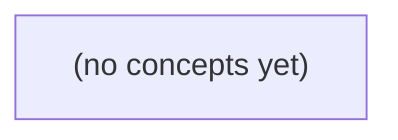

# 14.03 语言模型基础：从 Token 到可信 IM 助手

*面向 Go/Python 初学者的中文静态教材，承接 JSONL、向量/概率与数据划分基础，系统说明语言模型如何将文本编码为 Token、在上下文中预测下一 Token 并生成回答。全书以虚构 IM 资料助手为主线，明确模型生成、业务合同、权限控制、检索证据与版本核验之间不可混淆的边界，并配套 22 道分层练习及答案。*

**章节:** 2

---

## 本书导览

- 了解整本书的章节脉络
- 掌握各章之间的概念依赖关系
- 选择最合适的阅读顺序

# 14.03 语言模型基础：从 Token 到可信 IM 助手

面向 Go/Python 初学者的中文静态教材，承接 JSONL、向量/概率与数据划分基础，系统说明语言模型如何将文本编码为 Token、在上下文中预测下一 Token 并生成回答。全书以虚构 IM 资料助手为主线，明确模型生成、业务合同、权限控制、检索证据与版本核验之间不可混淆的边界，并配套 22 道分层练习及答案。

下方的概念图展示了本书 0 个核心概念以及它们之间的依赖关系；再下方是 1 个章节的入口。你可以按从上到下的顺序阅读，也可以根据自己的兴趣或先验知识选择切入点。

#### 概念图

## 章节索引

- **14.03 语言模型基础：会生成下一词为什么仍可能答错IM合同** — 面向Go/Python初学者，以虚构IM资料问题解释token、embedding、序列预测、上下文、训练/推理与证据/权限边界。

## 14.03 语言模型基础：会生成下一词为什么仍可能答错IM合同

- 区分模型token与UTF-8字节和字符
- 理解token ID到学习向量与人工特征的差别
- 解读玩具下一token分布和解码
- 估纸上上下文预算和截断风险
- 区分训练、推理、提示、微调和检索
- 用当前IM合同/权限证据验证或拒答模型输出

本节把语言模型放回虚构IM合同：它能续写“像答案”的文本，却不能替代合同、权限校验或真实存储结果。

### 从字节、字符到模型词元

### 从字节、字符到模型词元

S2/v1 规定“正文最多 `6` 个 UTF-8 字节”，这是**HTTP 合同**的计量单位，不是“6 个汉字”，更不是“6 个模型词元”。

UTF-8 中，常见汉字通常占 `3` 字节，英文、数字和多数半角标点通常占 `1` 字节。因此：

- `hello!`：`6` 字节，可提交。
- `你好`：`2 × 3 = 6` 字节，可提交。
- `你好！`：`3 + 3 + 3 = 9` 字节，超限。
- `A你好`：`1 + 3 + 3 = 7` 字节，超限。
- `é` 也不一定是 `1` 字节；UTF-8 下常见写法占 `2` 字节。

服务端应按原始请求正文的 UTF-8 字节数判断：超过 `4096B` 原始 HTTP 体限制，或正文超过 `6B`，都不能因为模型认为“内容很短”而放行。

模型看到的则是词元序列。词元是模型分词器切出的计算单位：一个汉字可能是一个或多个词元，英文单词也可能被拆开；同样的 `6B` 文本，在不同模型中词元数未必相同。反过来，词元很少的文本也可能超过字节上限。

所以，当用户让模型生成给 `q-01` 的消息时，模型只能给出候选文本，例如“你好”。客户端或服务端仍须实际编码、计算字节数，并执行成员校验、重复 ID 校验等合同规则。模型的“长度感觉”不是 S2/v1 的验收结果。

### 词元编号为何不是人工特征

### 词元编号为何不是人工特征

语言模型先把文本切成词元，再把每个词元映射为整数编号。例如“`q-01` 当前正文最多 `6B`”可得到一串 ID：$[i_1,i_2,\dots,i_n]$。这些编号只是查表位置，不表示大小、重要性或业务含义：ID 为 17 的词元并不比 ID 为 9 的“更大”或“更接近合同规则”。

嵌入层用可学习矩阵 $E\in\mathbb{R}^{|V|\times d}$ 将编号变成向量：

$$
x_t=E[i_t]
$$

训练会调整 $E$，使常在相似上下文出现的词元形成有用的几何关系。例如“`6B`”“限制”“正文”可能帮助模型续写容量规则；但这种关系来自语料与训练目标，不是工程师手工规定“17 表示长度限制”。

这与 IM 合同中的人工字段不同：

- `body` 原始 HTTP 体长度：服务端按字节实际计算，并据此拒绝超过 `4096B` 的请求。
- 成员身份：由会话、群组成员表或权限校验决定，非成员必须得到 `404`。
- 同 ID 重复提交：依据已存在消息 ID 判断，返回 `409`。
- `accepted_in_memory`：是当前 S2/v1 进程内的真实处理结果，不等于模型生成一句“已保存”。

因此，模型可以根据 `q-01` 的上下文生成“当前限制是 `6B`”，却没有读取服务端状态；它也可续写 `q-02` 中“B 是否有权看文档”的解释，却不能把“规则未定”变成访问许可。词元嵌入是预测文本的内部表示，人工字段才是合同执行与事实判定的依据。

### 下一词概率如何变成一句回答

### 下一词概率如何变成一句回答

语言模型并不先“查出正确答案”，再把答案写出来。它根据已有上下文，为下一个词元估计概率分布：

$$
P(x_1,x_2,\ldots,x_n)=\prod_{t=1}^{n}P(x_t\mid x_1,\ldots,x_{t-1})
$$

例如提示为：“当前 S2/v1 的正文上限是”，模型可能估计：

| 候选下一词元 | 概率 |
|---|---:|
| `6` | 0.82 |
| `4096` | 0.12 |
| `未定` | 0.04 |
| `无限` | 0.02 |

若解码器选择最高概率词元，就先输出 `6`；接着它在“正文上限是 6”之后继续预测，较可能接上 ` UTF8B`，于是形成“当前 S2/v1 的正文上限是 6 UTF8B”。每一步都依赖此前提示和已生成内容，因此上下文中的“原始 HTTP 体 4096B”会让 `4096` 成为有诱惑力、却不一定正确的候选。

解码策略也会改变措辞。低温度或贪心选择倾向于稳定地输出最可能续写；较高温度、随机采样则可能写成“正文似乎限制为 4096B”。后者语言流畅，但混淆了两个合同字段。

对问题“B 有权看文档吗？”，若上下文只说权限规则 `R9` 待审，合适表述应是“规则尚未确定，不能据此确认 B 有访问权”。模型也可能续写出貌似合理的授权结论；这只是文本概率较高，不是一次真实的成员校验，更不是访问许可。

### 上下文预算与知识边界

### 上下文预算与知识边界

语言模型在推理时并不“读取整个系统事实”，而是在有限的上下文预算内，根据已见 token 预测后续 token。训练、推理、提示、微调、检索解决的问题不同：

- **训练**：学习大量文本中的统计规律，可能学会“HTTP 409 常表示冲突”，但不知道本题虚构 IM 的精确合同。
- **推理**：针对当前输入生成答案；模型只能依据本轮可见内容，不能自动查询真实服务或数据库。
- **提示**：把合同片段、用户问题和约束放入上下文。例如应明确：S2/v1 正文最多 `6 UTF8B`，原始 HTTP 体最多 `4096B`。
- **微调**：让模型更稳定地遵循某类任务格式或术语；但若合同后来改为 S3/v2 的 `stored_in_teaching_db`，旧微调知识仍可能过时。
- **检索**：从权威合同中找出相关段落再提供给模型，适合补足“当前版本到底怎么规定”的事实。

上下文不足会造成危险的“局部正确”。例如只给出“同 ID 重复返回 `409`”，却遗漏“非成员返回 `404`”，模型可能把所有失败都答成 `409`。问 `q-01`“当前正文限制是多少”时，若看不到 S2/v1 片段，模型可能凭常识猜测；正确答案应是 `6 UTF8B`。问 `q-02`“B 是否有权看文档”时，合同规则尚未确定，模型应回答“无法由现有合同判定”，而非把流畅续写误当作访问许可。

因此，模型回答应区分三类结论：合同明确写出的事实、检索到但版本待确认的事实，以及上下文缺失时的“不知道”。尤其 `200 accepted_in_memory` 只表示本进程接受，不能推出已入库、已设备 ACK，或 S3/v2 的提议已经生效。

### 用合同和权限证据验证回答

### 用合同和权限证据验证回答

语言模型可以根据上下文生成“很像正确答案”的文字，但验证应回到可观察的合同与证据，而非相信措辞流畅度。对同一问题，先区分它属于**已写入合同的事实**，还是需要外部权限系统确认的事实。

- 对 `q-01`：“当前消息最多多少字节？”
  - 可确认：当前 S2/v1 合同规定正文非空、最多 `6 UTF-8 字节`，原始 HTTP 体最多 `4096B`。
  - 可拒绝的推断：不能把 `4096B` 说成消息正文上限；它只是整个请求体上限。
  - 还要说明边界：中文通常占多个 UTF-8 字节，例如 `你好` 为 `6B`，可作为合法正文；再增加一个中文字符通常就超限。
  - 未来 S3/v2 即使提议 `stored_in_teaching_db`，且仍写 `6B`，在 R9 审核前也不能覆盖“当前 S2/v1”的结论。

- 对 `q-02`：“用户 B 是否有权查看某文档？”
  - 当前合同只说明非成员访问返回 `404`，并未给出“B 是否成员”或文档授权关系。
  - 因此正确回答不是猜测“有权”或“无权”，而是：**规则或证据未提供，无法确认；需查询成员关系、文档 ACL 或权限服务结果。**
  - `404` 也不能自动证明“文档不存在”；在该合同中，它可能表示请求者不是成员。

核验流程可写成：先定位版本与条款，再检查请求数据和权限证据，最后给出“可确认”“应拒绝”或“信息不足”的结论。类似地，`200 accepted_in_memory` 只能证明本进程已接受，不能臆测消息已持久化、已送达设备或已获得访问许可。

> **要点** — 模型生成的是条件概率下的文本；当前合同、权限与运行结果必须由可核验证据决定。

模型并不直接读取“字符”或“字节”，而是先按特定版本的分词器切成token并映射为ID；这一步决定了后续上下文预算与模型输入。

### 从文本到token ID的处理链

### 从文本到 token ID 的处理链

语言模型接收的不是“汉字数量”或“字节流”，而是一串由**特定版本分词器**产生的整数 ID。完整链路是：

`原始文本 → 规范化/预处理 → tokenizer 切分 → token 片段 → 词表查询 → token ID 序列 → 模型输入`

以文本“你好”为例：它有 2 个字符，UTF-8 编码通常占 6 字节；但这都不能直接推出 token 数。某个分词器可能把它视为一个整体 token：

`“你好” → [“你好”] → [t6]`

另一个分词器可能拆成两个子词：

`“你好” → [“你”, “好”] → [t6, t9]`

还有采用字节级处理的分词器，可能进一步拆成与 UTF-8 字节相关的片段，例如：

`“你好” → [字节片段₁, 字节片段₂, …] → [tU, …]`

这里的 `t6`、`t9`、`tU` 只是玩具 ID，不代表任何真实模型的词表。真实 ID 的含义完全由该 tokenizer 的词表及其规则决定；同一个整数在另一套词表中可能对应完全不同的片段。

得到 ID 后，系统通常还会加入特殊 token，例如序列起止标记、对话角色标记或填充标记，再形成送入模型的整数序列。模型查表将每个 ID 转为向量，之后才进行注意力计算与“预测下一 token”。

因此，统计上下文长度、估算调用费用、判断是否超出窗口时，必须使用**与目标模型版本严格匹配的 tokenizer**。不能用字符数代替 token 数，也不能根据 UTF-8 的 6 字节断言“你好”必为 6 个 token。Google MLCC 与 Hugging Face 官方教程都强调：token 是模型词表定义的基本输入单位，而不是固定等同于词、字符或字节。

### 字符、UTF-8字节与token不可混算

### 字符、UTF-8字节与token不可混算

“你好”看起来只有两个汉字，但至少涉及三种不同的计量单位：

- **字符数**：`len("你好") = 2`，因为它由“你”“好”两个字符组成。
- **UTF-8 字节数**：通常为 `6` 字节；每个常用汉字在 UTF-8 中常占 `3` 字节。
- **token 数**：没有固定答案，取决于某个**特定版本**的 tokenizer 及其词表。

token 是模型实际接收的离散输入单位，可能对应完整词、子词、标点，甚至字节片段。例如，玩具词表（均非真实模型）可能出现不同切分：

| 玩具词表 | 对“你好”的切分 | token 数 |
|---|---|---:|
| `t6` | `["你", "好"]` | 2 |
| `t9` | `["你好"]` | 1 |
| `tU` | `["<字节片段1>", "<字节片段2>", ...]` | 可能大于 2 |

因此，`2` 个字符不等于 `6` 个 token，`6` 个 UTF-8 字节也不能推出 `6` 个 token。字节只是编码层面的存储单位；token 则是 tokenizer 根据训练词表、合并规则和预处理策略得到的模型输入单位。

Google 的机器学习速成课程（MLCC）强调，文本需要先被 tokenization 转为数值表示；Hugging Face 的官方教程也指出，不同 tokenizer 的词表与算法会产生不同编码结果。实际估算上下文长度、接口费用或截断位置时，必须使用**与目标模型版本匹配的 tokenizer**，而不能凭字符数或 UTF-8 字节数猜测。

### token可以是词、子词、标点或字节片段

### token可以是词、子词、标点或字节片段

token 是模型实际接收的离散单位，但它不等于“一个单词”，也不稳定等于“一个汉字”。分词器会依据自己的词表和切分规则，把文本编码为一串 token ID；常见 token 可能是：

- 完整词：`hello`
- 子词或词缀：`un`、`break`、`able`
- 汉字或多个汉字组成的片段：`你`、`好`、`你好`
- 标点与空格：`，`、`!`、前导空格
- 对罕见字符、拼写错误、表情或混合文本拆出的字节片段

例如，同一句英文中，常见词可能整体成为一个 token，而较长或少见的词会被拆成多个子词；中文也可能按单字、常用词组或更细片段切分。`AI合同`、`AI 合同`与`AI-合同`的 token 序列未必相同，因为空格和连字符本身也可能参与编码。

尤其不要用字符数或 UTF-8 字节数估算 token 数：`你好`有 2 个字符、UTF-8 中占 6 字节，却可能被某个分词器编码为 1 个、2 个或更多 token。切分结果取决于**具体 tokenizer 版本及其词表**，而不是文本的字节长度。

为便于理解，可以设想玩具词表：`t6` 把`你好`视为一个单位，`t9` 拆为`你`和`好`，`tU` 则按更细的字节片段处理。它们只是示意，不能代表真实模型。实践中必须使用与目标模型版本匹配的 tokenizer；否则 token 计数、上下文长度和实际输入 ID 都可能出错。Google MLCC 与 Hugging Face 官方教程也都强调：先正确分词，再讨论模型如何预测下一个 token。

### 玩具词表中的编码与版本匹配

### 玩具词表中的编码与版本匹配

设有三个**虚构**分词器词表，它们都用于编码文本“你好”，但规则不同：

- `t6`：`["你", "好", ...]`  
  编码结果：`["你", "好"] → [101, 102]`，共 `2` 个 token。
- `t9`：`["你好", ...]`  
  编码结果：`["你好"] → [305]`，共 `1` 个 token。
- `tU`：采用字节片段，可能将 UTF-8 字节序列拆分。  
  “你”和“好”各占 3 个 UTF-8 字节，因此可被编码为若干字节 token；例如 `[E4, BD, A0, E5, A5, BD]`，共 `6` 个 token。

这里的 `t6`、`t9`、`tU` 只是教学玩具：真实分词器通常还包含特殊 token、合并规则、未知片段处理、空格规则和正规化步骤，不能据此推断任何实际模型的 token 数。

关键是：字符数、字节数与 token 数是三件不同的事。“你好”有 `2` 个汉字、UTF-8 下有 `6` 字节，但它可以是 `1`、`2`、`6` 个 token，甚至在其他规则下得到不同结果。**绝不能因为它占 6 字节，就断言它必定消耗 6 个 token。**

编码还必须版本匹配。模型训练时看到的不是字符串本身，而是 token ID 序列；若把某模型配套的分词器替换成另一版本，即使文本相同，ID 也可能不同，含义位置随之错位。应始终使用该模型官方指定的 tokenizer、词表文件与版本。Google MLCC 和 Hugging Face 官方教程都强调：先按对应分词器完成 tokenization，再将 token 映射为模型可接受的 ID。

### 工程排查：以实际分词结果估算预算

### 工程排查：以实际分词结果估算预算

估算合同问答、证据检索或长文本摘要的上下文预算时，唯一可靠的方法是：用**目标模型对应版本的分词器**对实际请求内容编码，并统计结果中的 token ID 数量。不要用字符数、中文词数或 UTF-8 字节数代替。

例如，“你好”有 2 个字符、UTF-8 编码通常占 6 字节，但它可能在某个词表中是 1 个 token，也可能被拆成多个子词、字节片段或其他单元。玩具词表中的 `t6`、`t9`、`tU` 仅用于说明切分可能不同，绝不代表真实模型。分词器版本、词表、特殊 token 规则一变，计数就可能变化。

排查步骤：

1. 确认目标模型的**精确名称与版本**，包括上下文窗口上限。
2. 下载或调用该模型官方指定的 tokenizer；模型与 tokenizer 必须配套。
3. 将最终会发送的完整内容编码：系统提示、用户问题、合同原文、检索证据、分隔符、工具参数都要算入。
4. 预留输出空间，而非只让输入“刚好塞满”。可用预算近似为  
   $可用证据容量=上下文上限-提示词token数-预留输出token数$。
5. 对超长合同按段落或条款切块，逐块记录 token 数，而不是按“每页”“每千字”粗略截断。

Python 可直接查看编码长度：

`token数 = len(tokenizer.encode(文本))`

Go 中同样应调用对应 tokenizer 的编码接口，统计返回 ID 切片长度；不要写成 `len(文本)` 或 `len([]byte(文本))`。前者通常是字符/字节层面的长度，后者明确是字节数，二者都不是模型实际消耗的 token 数。

Google MLCC 对 tokenization 的说明强调：模型输入依赖分词后的 token；Hugging Face 官方教程也建议通过实际 tokenizer 的 `encode` 或调用结果检查序列长度。工程上应把这一步放进日志与上线前测试：记录模型版本、tokenizer 版本、输入 token、输出 token 和截断位置，才能解释“明明合同已上传，模型为何没有看到关键条款”。

> **要点** — token数由目标模型及其匹配分词器决定；字符数和UTF-8字节数都不能替代实际token计数。

模型并非把词语贴上人工标签，而是从数据中学习向量表示；理解这一点，才能判断它为何会因上下文或资料变化而答出不同结果。

### 从令牌编号到可学习向量

### 从令牌编号到可学习向量

分词器先把文本切成令牌，并为每个令牌分配一个整数编号。例如，“合同”可能对应编号 `5821`，“违约”可能对应 `9137`。这些编号只是词表中的索引：`9137` 不比 `5821` 更大、更接近，也不天然表示“违约”和“合同”语义相似。

模型随后查询一个可训练的嵌入表 $E$：

$$
\mathbf{x}_i = E[\mathrm{id}_i]
$$

其中，$E\in\mathbb{R}^{|V|\times d}$，$|V|$ 是词表大小，$d$ 是向量维度。每一行都是一个令牌的初始向量；训练过程中，预测误差会反向调整这些数值。于是，经常出现在相近语境中的令牌，可能逐渐形成具有某些相似结构的向量。

这不是人工设计的二维特征图，更不是给词贴上“法律”“金融”等固定标签。向量的每一维通常没有独立、可直接命名的含义；真正有用的是它们作为整体如何参与后续计算。

还要区分两层含义：输入时查到的是令牌嵌入，而模型会结合位置和前文继续变换它。因此，同一个“苹果”出现在“水果苹果”与“Apple 公司”附近时，起点虽相同，后续得到的上下文表示可以不同。专门用于检索的文档嵌入也未必与这里的令牌嵌入处于同一空间，不能仅凭向量名称相同就直接比较。

### 人工二维特征为何不等于嵌入

### 人工二维特征为何不等于嵌入

人为绘制二维坐标时，通常先规定每个轴的含义。例如横轴表示“正式—口语”，纵轴表示“积极—消极”。于是词语的位置可被直接解释：两个词靠近，意味着它们在这两个预设维度上相似。

模型中的 `embedding` 则不同。它先把每个 token 映射为可学习的高维向量：

$$
\text{token ID}\rightarrow \mathbf e\in\mathbb R^d
$$

其中 $d$ 往往远大于 2。每一维不是人工命名的“情感”“词性”或“主题”标签，而是为降低训练目标误差而共同调整的参数。单独查看某一维，通常无法可靠地说它“代表某种语义”。

这带来两个关键区别：

- **二维特征是规则设计的；嵌入是数据学习的。** 前者先定义坐标含义，再放置对象；后者只要求向量有助于预测后续 token，含义由大量维度的组合关系体现。
- **向量接近不是人工分类相同。** 两个 token 接近，可能因为它们常出现在类似句式、搭配或任务环境中，不必表示它们属于同一词性、情感类别或概念类别。
- **同一个词并非永远对应同一种“理解”。** 输入阶段的 token embedding 可以相同，但经过前文信息影响后，“苹果很好吃”和“苹果发布新品”中的后续内部表示会不同。

还要避免把输入 token embedding 与检索系统的文档 embedding 混为一谈。前者服务于语言模型按顺序处理上下文；后者通常专门训练为“查询—文档可比较”的向量空间。它们未必维度相同，也不保证能直接计算相似度。

### 相同词为何会随上下文变义

### 相同词为何会随上下文变义

在 IM 合同中，“期限”看似是一个固定词，但模型不会先查到一个永远不变的“期限定义”。它读取的是按顺序排列的令牌，并据此前出现的内容预测后续最可能的词。

例如：

- “本合同**期限**为自签署日起十二个月。”
- “甲方应在收到通知后五个工作日内完成整改，整改**期限**届满仍未完成的……”
- “保密义务不因合同**期限**届满而终止。”

三个“期限”的输入令牌可能相同，但其前文分别提供了“合同持续时间”“整改截止时间”“合同到期后义务”等线索。因此，模型内部对该词形成的上下文表示不同，后续预测分布也不同：第一句更可能接“十二个月”“续期”，第二句更可能接“逾期”“违约责任”，第三句则更可能接“保密”“存续”。

“生效”也类似：

- “本合同经双方盖章后**生效**。”
- “本条款自甲方书面通知送达之日起**生效**。”
- “本补充协议与原合同不一致的，以本补充协议**生效**后的约定为准。”

模型并非只看“生效”这个词，而会综合此前的主体、条件、时间点与文件关系。若把“双方盖章”改成“董事会批准”，或补入“以监管审批为前提”，那么“生效”的后续解释与预测都可能改变。

这也是为什么同一问题换一份合同资料、调整条款顺序，模型答案可能不同：改变前文令牌，就改变了它在当前位置认为“接下来什么最合理”的概率分布。

### 输入嵌入与检索嵌入不可混用

### 输入嵌入与检索嵌入不可混用

“嵌入”都表现为一串浮点数，但用途不同，不能默认可以直接计算相似度。

生成模型的**输入令牌嵌入**，是把 `token ID` 映射为模型内部向量的查表结果。它服务于下一词预测：模型随后结合位置和已有上下文，逐层变换这些向量。同一个词在不同句子中，即使初始令牌嵌入相同，经过上下文处理后的表示也可能完全不同。

检索系统的**文档嵌入**，则通常由专门的嵌入模型产生，目标是让“语义相关”的查询和文档在某个向量空间中更接近，例如用余弦相似度排序：

$$
\operatorname{sim}(q,d)=\frac{q\cdot d}{\|q\|\|d\|}
$$

两者的训练目标不同：

- 输入令牌嵌入：帮助语言模型根据上下文预测后续令牌；
- 查询/文档嵌入：帮助检索系统找回相关资料；
- 上下文表示：语言模型阅读完整提示后，在内部动态形成的状态。

因此，不能把生成模型某个词的输入嵌入直接拿去和文档嵌入比较，也不能因为都叫“向量”就认为它们坐标含义一致。即使维度碰巧相同，两个空间也未必对齐。

在“先检索、再生成”的流程中，检索器负责选资料；语言模型按顺序读取这些资料后再生成答案。资料被替换、排列顺序被改变，模型后续预测的分布也可能改变。

### 上下文变化如何影响合同回答

### 上下文变化如何影响合同回答

在 IM 合同问答中，模型不会先为“赔偿”“责任上限”“重大过失”等词贴固定含义标签，再机械匹配答案。它把词元映射为学习得到的向量，并按顺序读取当前输入；因此，同一句提问放在不同合同、附件、邮件或修订条款之后，后续词的概率分布可能不同。

例如，用户问：“供应商的赔偿责任是否受上限约束？”若当前上下文只包含一般责任限制条款，模型可能回答“受年度费用上限约束”；但若后文另有“知识产权侵权赔偿不适用该上限”的例外，或附件优先于主协议，结论就应改变。这里改变模型判断的不是某个二维人工特征，而是当前词元序列及其在上下文中的组合。

还要区分两类向量：

- 输入词元嵌入：帮助模型处理合同文本和问题；
- 文档检索嵌入：帮助系统从资料库找出可能相关的合同片段。

二者通常不在可直接比较的同一空间。检索命中“责任限制”片段，不等于它已经证明了最终法律结论；系统仍应把命中的原文、定义、例外、优先级条款和适用版本放入上下文核验。

上下文预算也会影响回答质量：过长的合同若只保留主条款、遗漏修订协议或例外条款，模型即使生成流畅，也可能基于不完整证据作答。可靠输出应说明依据的条款位置、版本与权限范围；资料缺失、权限不足或条款冲突时，应明确保留结论，而非用“看起来合理”的下一词预测替代合同证据。

> **要点** — 令牌嵌入是学习得到的表示；模型会随上下文改变预测，合同结论必须回到当前可见证据与权限验证。

下一词概率描述模型如何续写，不等于它已核实事实；合同数值尤其必须回到当前证据与权限边界。

### 从前缀到候选词：模型在预测什么

### 从前缀到候选词：模型在预测什么

给定前缀“当前/v1正文上限为”，语言模型并不是打开合同系统、查询最新版条款后再填数字；它做的是：结合此前出现的文字、训练中学到的语言模式以及当前上下文，为**下一枚词元**分配概率。

可以把它想成一个纯纸上玩具。此时模型给出：

- `t6`：$0.7$
- `t9`：$0.2$
- `tU`：$0.1$

三者之和为 $1$。这些只是人为设定的玩具概率，不是任何真实模型的分数。若采用贪心解码，模型会选择概率最大的 `t6`；若采用采样，则可能抽到 `t9`，也可能抽到 `tU`。选出一个词元后，前缀随之变为“当前/v1正文上限为`t6`”，模型再对下一枚词元重新分配概率，如此连续追加，直到遇到停止符、达到长度预算或被外部程序中止。

因此，“模型倾向续写 `6`”只表示：在它看到的上下文下，`6`是较可能出现的后续文本；它不表示“当前上限经核实就是 6”。尤其当上下文含有“R9待审”、旧资料写“9”或版本标识混杂时，高概率输出仍可能只是对旧文本、常见措辞或相邻数字模式的延续。

合同数值应先确定证据边界：核对 `09.02` 当前合同、确认 `v1` 是否仍有效、检查审批状态与引用来源。模型输出可以帮助定位候选表述，却不能替代对当前版本和原始条款的核验。

### 玩具分布与贪心解码

### 玩具分布与贪心解码

设纸上玩具前缀为“当前/v1正文上限为”，模型在下一个位置给出三个自造候选：

| 词元 | 条件概率 |
|---|---:|
| `t6` | 0.7 |
| `t9` | 0.2 |
| `tU` | 0.1 |

它们构成一个概率分布，因为

$$
P(t6\mid \text{前缀})+P(t9\mid \text{前缀})+P(tU\mid \text{前缀})
=0.7+0.2+0.1=1.
$$

这里的数值只是教学用玩具分布，不是任何真实模型、合同或系统的实际评分。概率的含义是：**在这一前缀之后，模型认为各词元作为续写的相对可能性**。它不是对“6、9 或未知值哪个已被核验为事实”的直接判断。

贪心解码每一步都选择概率最大的词元：

$$
t^*=\arg\max_t P(t\mid \text{当前前缀}).
$$

因此本例中选中 `t6`，因为 $0.7$ 大于 $0.2$ 和 $0.1$。追加后，前缀变成“当前/v1正文上限为` t6`”，模型再针对这个更长前缀计算下一词分布，并重复“取最大值—追加”的过程，直到遇到停止词元、达到输出长度上限，或被外部预算截断。

“贪心选 `t6`”只说明 `t6` 是该步最可能的续写，不说明“当前合同上限必为 6”。例如，若 `R9` 仍待审核，过期资料写的是 9，而现行 `09.02` 合同另有约定，那么即使模型高概率生成某个数字，也必须回查当前有效合同、引用依据与权限边界；语言模型的续写概率不能替代证据核验。

### 采样续写与停止边界

### 采样续写与停止边界

设纸上玩具前缀为“当前/v1正文上限为”，下一词元分布人为规定为：

| 词元 | 概率 |
|---|---:|
| `t6` | 0.7 |
| `t9` | 0.2 |
| `tU` | 0.1 |

概率和为 $0.7+0.2+0.1=1$；这些只是教学用 toy-token，并非任何真实模型的分数。

**贪心解码**每一步都取最大概率词元，因此首步必选 `t6`：

`当前/v1正文上限为 t6 …`

但**采样解码**按该分布随机抽取，某一次完全可能抽到 `t9`：

`当前/v1正文上限为 t9 …`

这不表示模型“确认了 9”，只表示在这次随机续写中，`t9` 被抽中。随后模型会把已生成内容并入上下文，再预测下一词元、再次选择或采样，形成连续序列：

`当前/v1正文上限为 t9，适用范围为 …`

生成不会无限继续。常见停止边界包括：输出停止词元、达到最大生成词元数、触及上下文预算，或系统因长度限制而截断。因而同一开头在不同解码策略、随机种子和预算下，可能得到不同尾句，甚至停在未完成的句子中间。

尤其在合同任务中，不能把“高概率续写”当作事实置信度。若 `R9` 仍待审，而过期资料曾写“9”，即使模型倾向输出 `t9`，也必须核对 **09.02 当前合同版本**、对应条款引用及权限边界；模型输出只能是待验证文本，不能替代当前证据。

### 高概率为何不等于合同事实

### 高概率为何不等于合同事实

设纸上玩具模型面对前缀“当前/v1正文上限为”，下一词只有三个自造 token：

| token | 续写概率 |
|---|---:|
| `t6` | 0.7 |
| `t9` | 0.2 |
| `tU` | 0.1 |

三者之和为 $1$。这只表示：在该上下文下，模型更倾向续写 `t6`。贪心解码会选 `t6`；采样解码则可能选到 `t9` 或 `tU`，随后继续追加 token，直至遇到停止条件或达到输出预算。上述数字不是任何真实模型分数，更不是“合同上限为 6 的事实正确率是 70%”。

应区分三件事：

- **续写概率**：`0.7` 衡量“模型认为怎样接话更像训练中常见文本”，受措辞、上下文、提示方式影响。
- **输出稳定性**：反复询问时是否常答“6”。这可能说明模型模式偏好稳定，却仍可能稳定地复述旧文件、错误摘要或用户暗示。
- **事实可信度**：数值是否由可追溯、有效、当前且有权限的证据支持。它取决于合同版本、生效状态、修订条款、适用范围和引用链，而非 token 概率。

例如，资料中写着“R9 待审，正文上限为 9”，模型可能因文本显著性而高概率输出 `9`。但若问题问的是 `09.02` 的**当前合同**，就必须核对该日有效的合同正文、修订协议及其条款引用；“待审”版本不能自动替代现行版本。

因此，模型输出应视为待核查的候选答案：先定位“当前”对应的版本，再检查条款、日期与权限边界，最后给出可引用的依据。高概率可以帮助生成答案，不能充当合同事实的证据。

### 面对待审条款时的核验与拒答

### 面对待审条款时的核验与拒答

设纸上玩具前缀为“当前/v1正文上限为”，模型给出自造词元分布：

- $P(t6)=0.7$
- $P(t9)=0.2$
- $P(tU)=0.1$

总和为 $1$。贪心解码会选 $t6$；采样则可能选到 $t9$，并继续逐词追加，直到遇到停止条件或预算耗尽。这些数值仅说明“在该前缀后，哪些续写形式更常见”，不是合同事实的置信度，更不是已完成核验的证明。

例如，需求写着“R9 待审”，而过期资料中曾出现“上限为 9”。模型很容易续写出“R9 上限为 9”，即使这个句子流畅、概率很高，也可能把历史版本、草案数字与当前生效条款混在一起。

回答前应按证据链核对：

1. 确认 `09.02` 是否是当前有效合同，而非附件、草案或旧版本。
2. 定位 R9 的原文条款、修订记录和“待审”状态，区分已批准值与提议值。
3. 引用可追溯来源，如合同页码、条款号、版本日期；不要只引用模型生成的摘要。
4. 检查访问权限：无权访问合同、缺少附件或无法确认版本时，不应补全数字。

证据充分时可答：“根据 `09.02` 当前合同第 X 条，R9 仍标记为待审；过期资料中的‘9’不能视为现行上限。”证据不足时应明确拒答：“我无法确认 R9 的当前上限；请提供或授权访问 `09.02` 生效合同及对应修订记录。”这种不确定性标注，比猜测一个看似合理的数字更可靠。

> **要点** — 下一词概率只指导生成；IM合同数值必须以当前、可访问、可引用的证据核验。

上下文窗口决定模型一次能看见多少信息；窗口不足时，关键权限、版本与来源可能在回答前就被截断。

### 上下文窗口的真实含义

### 上下文窗口的真实含义

上下文窗口是模型在**一次请求**中能够共同参与计算的词元（token）预算。它包含系统指令、开发者规则、历史对话、检索到的合同条款、当前问题，以及模型准备生成的输出；因此它不是“聊天记录能存多少页”，更不是模型的永久记忆。

可将一次调用粗略写为：

$T_{\text{指令}}+T_{\text{历史/证据}}+T_{\text{问题}}+T_{\text{输出}}\le W$

其中 $W$ 是窗口上限。纸上示例：窗口为 32 token，指令占 6，证据占 18，问题占 4，则理想情况下最多只剩：

$32-6-18-4=4$

个输出 token。该计算忽略特殊 token、消息封装和接口开销，只用于说明预算关系；不同模型和接口的实际计数方式可能不同。

窗口不足时，应用通常要截断、压缩或摘要旧内容。危险在于，被丢掉的可能恰是“谁有审批权限”“适用哪个版本”“条款来自何处”等决定答案正确性的事实。长 IM 会话看似仍在界面中，并不表示本次模型请求真的看见了全部历史。

因此，真实会话历史、权限控制与权威版本应由应用保存和管理；摘要只能辅助压缩，不能替代可追溯证据。对合同问题尤其应保留来源、版本和生效时间，并让回答能够引用它们。

### 纸上计算：32词元如何分配

### 纸上计算：32词元如何分配

设某模型本次请求的上下文窗口为 $32$ 个词元。窗口并不只装“回答内容”，而是要同时容纳模型生成前已经看到的全部输入，以及随后逐步生成的输出。

玩具案例中，输入由三部分组成：

- 系统指令与任务规则：$6$ 个词元；
- 从 IM 合同会话中检索出的证据：$18$ 个词元；
- 用户当前问题：“该版本谁可审批？”等：$4$ 个词元。

因此，已占用输入为：

$$
6+18+4=28
$$

若暂时忽略特殊标记、消息角色标签、工具调用格式、内部推理预留和接口协议开销，则剩余空间是：

$$
32-28=4
$$

所以模型理想情况下最多只能再生成 $4$ 个词元：

$$
\text{最大输出}=32-(6+18+4)=4
$$

这意味着回答可能只够输出类似“财务负责人审批”这样的极短结论；一旦需要说明版本、权限条件、例外条款或引用来源，窗口便不够用。

这是纸上示意，而非所有接口的精确计费公式。不同模型和接口对词元的切分不同，也可能额外计入系统消息、角色标记、图片、函数参数或保留输出额度。但核心约束不变：输入越长，可生成输出通常越少；若为新证据腾位置而截断旧历史，被删掉的可能恰好是合同权限、修订版本或消息来源。

### 不同模型与接口为何计数不同

### 不同模型与接口为何计数不同

“32 个词元窗口”并不等于“能放下 32 个汉字”或“32 个英文单词”。词元器会把文本切成模型内部单位：常见汉字可能接近一字一词元，但数字、日期、URL、表情、罕见词、混合中英文及长编号的切分差异很大。同一句“合同版本为 v2025.03，截止 2025-06-30”，在不同模型中可能得到不同计数。

接口还会在可见文本之外加入封装开销，例如：

- `system`、`user`、`assistant` 等消息角色标记；
- 消息边界、结束标记及模型保留的特殊词元；
- 工具定义、函数参数模式、工具调用结果；
- 平台注入的安全策略、检索证据或隐藏指令。

因此，纸上计算“指令 6 + 证据 18 + 问题 4 = 28，剩余 4”只是在忽略开销时的示意。实际接口中，封装后输入可能已超过 28，留给输出的空间更少，甚至触发截断。若被截掉的是较早的权限声明、合同版本或来源链接，模型仍会生成看似流畅的回答，却可能依据不完整上下文答错。

工程上不要按字符数猜测容量，应使用目标模型或接口提供的计数器，并为输出、工具结果和重试预留余量。尤其在 IM 合同问答中，应明确记录每段证据的来源、版本与时效；长会话历史由应用保存和授权，模型单次请求只看到实际传入窗口内的内容。

### 截断怎样导致合同回答失真

### 截断怎样导致合同回答失真

设一次请求的纸上窗口为 $32$ 个词元：系统指令占 $6$，已检索到的聊天证据占 $18$，用户问题占 $4$，则理想情况下最多只剩

$$32-6-18-4=4$$

个词元用于输出；这里忽略特殊标记与接口开销，仅用于说明窗口挤压。真实模型和接口的计数规则不同，实际可用输出往往更少。

例如，IM 中先出现“客户仅可访问旧版报价，未经法务批准不得使用补充协议”，随后有人转发新版补充协议，并在后续消息中明确“该文件仅供内部评审，客户无权限查看”。若应用只保留最近消息，前面的权限声明、转发者身份或文件来源可能被截断。用户问：“客户能否按新版补充协议要求退款？”

模型仍可能流畅回答“可以，依据新版协议的退款条款处理”，但它实际上只看到了“新版协议”和“退款”附近的片段，未看到：

- 该版本是否已生效，还是草案；
- 客户是否拥有查看、引用该文件的权限；
- 文件是否来自法务、销售人员或未经验证的转发；
- 是否存在优先级更高的旧合同或例外条款。

因此，长会话不等于模型永久记住全部合同事实。历史消息、版本链、访问控制和权威来源应由应用保存并在每次请求中按权限检索；摘要只能辅助定位，不能替代可引用的原文、发送者、时间戳与版本号。面对依据不足的问题，系统应要求补充可访问的正式版本，而非让模型用流畅措辞填补被截断的证据。

### 把历史、摘要与证据交给应用管理

### 把历史、摘要与证据交给应用管理

长 IM 会话不能被当作模型的“永久记忆”。模型每次调用只能读取应用本轮提交的有限上下文；哪些历史被保留、如何压缩、谁有权查看、哪一版合同或政策仍有效，应由应用层管理，而不是交给模型自行猜测。

可将会话信息分为三类：

- **可引用原文**：合同条款、审批记录、客户确认、正式政策等应保存原始内容、消息标识、发送者与时间。回答时优先附带最相关的原文片段，而非只传一句摘要。
- **结构化状态**：记录合同版本、生效/失效时间、参与方、权限范围、审批状态等。例如“版本 V3，2025-06-01 生效，仅法务组可见”比“最新版合同”更可验证。
- **摘要索引**：摘要用于缩短上下文、定位历史，但不是事实来源。它可能遗漏否定条件、例外条款、金额单位或后续撤回的信息。

应用应先按用户权限检索，再按时间、版本和问题相关性组装证据；不要因为较早消息出现在窗口中，就默认它仍然有效。若摘要称“客户已同意续约”，但未保留对应确认原文，模型只能把它视为待核实线索。

在回答前可进行简短审查：

1. 证据是否来自当前有效版本？
2. 证据是否覆盖问题中的权限、对象和时间范围？
3. 摘要是否遗漏例外、撤销或冲突记录？
4. 当前用户是否被允许看到并据此行动？

若证据不足，应明确说明“现有记录无法确认”，并追问所需材料，如“请提供最新合同版本或客户确认消息”；对权限敏感内容，则应拒绝展示未获授权的原文。

> **要点** — 模型只依据当前窗口内的词元生成；合同结论必须回查未截断、可访问且具时效的原始证据。

模型能续写得通顺，不等于它掌握当前合同事实或有权替系统作权限裁决。

### 参数在训练中形成，推理时保持既定

### 参数在训练中形成，推理时保持既定

语言模型的参数可理解为训练后固化的“统计倾向”。在预训练、微调等训练阶段，系统用大量样本计算损失并更新参数，使模型更倾向输出符合样本规律的下一词；这一过程通常涉及数据集、优化器、学习率、版本管理和验收。

推理阶段则不同。给定既定参数 $\theta$ 与当前上下文 $x$，模型只是在计算：

$$P(\text{下一词}\mid x,\theta)$$

它会根据提示中的合同片段、问题和指令生成后续文本，但默认不会因为用户说“新规则是……”就永久改写 $\theta$。因此，一次对话中的纠正通常只是改变本轮输入上下文，不是现场学习、更不是合同规则已被正式更新。

应特别区分三件事：

- **提示**：向本次推理提供上下文；会影响回答，但不会自动训练模型。
- **微调**：用经治理的数据再次训练，实际更新参数；需要审批、评测与版本控制。
- **检索增强生成（RAG）**：推理时注入获授权资料；资料可提高依据的新鲜度，但模型仍可能误读、遗漏或编造关联，不能仅凭“检索到了”就证明答案正确。
- **权限与成员资格**：应由确定性的业务系统、身份系统或规则引擎裁决。遇到非成员返回 `404`，不能交由模型“猜测是否例外”。

所以，模型能流畅解释历史成员规则，并不表示它知道当前规则是否已变更；若规则未提供或来源不明，应拒答或明确说明缺少可验证规则，而非把生成结果当作现场学习后的合同结论。

### 提示提供上下文，不会自动改写模型

### 提示提供上下文，不会自动改写模型

提示词只是本次推理的输入上下文。它可以要求模型“依据以下合同条款回答”“只输出结论”，从而影响生成方向；但推理时模型参数 $\theta$ 固定，并不会因为提示中写了“记住新规则”就完成永久学习。

可将三种机制区分为：

- **提示**：输入变为 `问题 + 指令 + 上下文`。效果通常只限当前会话或当前请求；下一次未再次提供该信息，模型未必知道。
- **微调**：用新增样本继续训练，更新参数 $\theta \rightarrow \theta'$。这才可能使某类规则或表达偏好稳定进入模型行为，但仍需验证数据质量、覆盖范围与遗忘风险。
- **检索增强生成（RAG）**：推理时先从授权资料库检索，再把命中文档注入上下文。它补充的是当次可见证据，不等于模型参数已更新，也不自动证明回答正确。

例如，q-01 问“当前合同金额是否为 6B”，应检索现行版本、变更单和生效状态，而非让模型凭预训练印象续写成 9B。检索到资料后，仍要核对来源、日期、适用合同与条款层级。

q-02 若历史成员认定规则尚未确定，模型应说明“缺少可适用规则，无法判定”，或请求授权规则；不能把“未检索到成员”直接判为非成员。尤其是权限系统中的 `404`、拒绝访问或无记录，必须由确定的系统规则裁决，不能交由语言模型猜测。

### 从下一词分布到看似确定的回答

### 从下一词分布到看似确定的回答

语言模型并非先查询“事实库”再作答，而是在已有上下文 $x$ 下估计下一个词元的条件分布：

$$P(w_t\mid w_{<t},x)$$

例如，面对“该合同当前金额为”，模型内部的玩具分布可能是：

| 候选续写 | 概率 |
|---|---:|
| `6B` | 0.45 |
| `9B` | 0.35 |
| `未披露` | 0.12 |
| `……` | 0.08 |

解码器会按规则选择续写：贪心解码取最高概率的 `6B`；随机采样可能抽到 `9B`；低温度会使最高项更占优势。随后，已生成的词又成为新上下文，模型继续预测下一词，于是形成语法连贯、语气肯定的完整回答。

关键在于：高概率表示“在训练文本和当前提示下，这样写很像常见续写”，不表示“该内容已被验证为当前合同事实”。若训练资料中旧金额 `9B` 出现频繁，或提示暗示了该数字，模型仍可能流畅地沿用旧知识；即使它生成 `6B`，也不自动证明该数来自有效授权来源。

提示词只能改变 $x$，从而改变输出分布，并不会修改既定参数中的知识。要更新参数需另行微调训练；推理时的检索增强生成可注入经授权的最新资料，却仍应保留来源、时间和适用范围。对于历史成员资格规则尚未给定的问题，模型应说明缺少规则或拒答；对非成员返回 `404` 则应由系统权限逻辑决定，不能交给“下一词概率”裁决。

### 当前6B查询：检索证据优先于生成的9

### 当前6B查询：检索证据优先于生成的9

设用户在 IM 合同系统中询问 q-01：“当前可用额度是多少？”模型可能依据预训练语料、旧公告或相似项目模式，流畅地生成“9B”。这类回答即使措辞自信，也只是基于既有参数对上下文的续写，不构成对当前合同状态的核验。

正确流程应先判断该问题是否依赖实时、授权的合同事实，再查询对应资料。例如，经授权检索返回：

- 合同版本：`IM-2025-04`
- 当前额度字段：`6B`
- 生效状态：`有效`
- 更新日期：`2025-06-18`

此时回答应以证据为准：**当前合同记录的可用额度为 6B。** 如需更严谨，可附带“依据已检索到的有效版本 `IM-2025-04`”。

关键不在于模型“记得”多少，而在于答案能否追溯到当前、已授权、可验证的来源。提示词中加入“请准确回答”不会把模型参数里的旧印象自动更新为 `6B`；提示只改变本次输入上下文。若要改变模型参数，需要另行训练或微调；而 RAG 的作用是在推理时注入检索证据，使模型据此组织答案。

因此，`9B` 即使更像模型熟悉的说法，也必须被当前证据覆盖。生成负责表达，检索证据负责约束事实。

### 规则缺失与权限边界不能交给模型猜测

### 规则缺失与权限边界不能交给模型猜测

以 `q-02`“某人是否属于历史成员”为例：如果合同、名单快照或生效日期规则没有明确“历史成员”的判定口径，模型即使能根据常识生成一个看似合理的答案，也不能把猜测当作事实。正确行为应是：

- 明确说明规则缺失：例如“当前资料未定义成员资格按任职、注册、签约还是某一日期快照判断”；
- 拒绝给出确定结论，或将结果标记为“未知，待业务规则确认”；
- 请求可审计依据，如成员名单版本、有效期、角色变更记录及判定规则。

尤其不能让模型用训练中见过的组织常识、旧网页信息或相似案例补齐缺口。语言模型输出的是条件续写：

\[
P(\text{回答}\mid \text{提示与上下文})
\]

它不天然知道哪条规则具有合同效力，更不能自行确定缺失规则。

权限问题边界更严格。对于“非成员访问受限资源”的请求，系统应在调用模型前或工具调用前完成身份认证、成员资格校验与授权决策。校验失败时应由应用直接返回 `404`（或按安全策略返回其他统一错误），而不是把“此人是否应当看到该资源”交给模型判断。

这样做既避免模型泄露资源存在性，也避免提示注入、措辞诱导或幻觉影响访问控制。模型可以解释已授权资料，却不能充当权限裁判；规则不明时保留未知，权限不符时由系统拒绝。

> **要点** — 生成基于既定参数与上下文；当前合同、规则缺口和权限结论必须由授权证据与系统裁决。

在询问“当前IM合同上限是多少”前，先建立可复核的输入、权限、版本与拒答边界；模型生成的流畅答案不等于合同事实。

### 把一次回答登记为可复现运行

### 把一次回答登记为可复现运行

一次“当前 IM 合同上限是多少”的回答，不应只保存最终文本，而应登记为一次可重放的运行。否则同一问题在不同日期、不同模型或不同资料下得到不同答案时，团队无法判断差异来自事实变化、权限变化，还是生成过程变化。

最小运行记录应包含：

- **输入与身份**：原始问题、会话上下文、用户身份、角色与允许访问的资料范围。
- **模型与分词器**：模型名称、具体版本或快照、`tokenizer` 版本；不能只记“某某模型”。不同分词器会改变 token 计数，进而改变截断位置。
- **提示词**：系统提示、业务提示、模板版本、工具说明，以及最终实际发送给模型的完整提示。
- **资料证据**：检索到的文档 ID、标题、版本、发布日期/生效日期、片段位置与获取时间；“合同 R9”不能含糊记作“最新合同”。
- **上下文预算**：最大上下文长度、预留输出 token、各资料片段的 token 数、截断规则与被截断内容。
- **推理参数**：`temperature`、`top_p`、随机种子、最大输出长度、停止条件；采样参数不同，本就可能产生不同措辞甚至不同结论。
- **输出与结论状态**：原始输出、引用证据、是否通过权限检查，以及“可答”“需澄清”或“拒答”的判定。

例如，模型把旧版 `R9` 中的“9B”解释为当前上限，或伪造“seq9 已送达”，都应能追溯到当时进入提示的资料、版本和证据缺口。若无权文档被拼入提示，即使答案正确，也属于不可接受的运行记录。可复现不是保证每次逐字相同，而是能解释：这次答案依据了什么、受什么约束、为何在该条件下生成。

### 先按身份过滤，再组装上下文

### 先按身份过滤，再组装上下文

回答“当前 IM 合同上限是多少”时，检索到资料并不等于用户可以看到资料。应先确定请求者身份、所属组织、项目、合同角色与数据权限，再从可见范围内检索和组装上下文；不能先把所有命中文档送入提示词，再要求模型“不要泄露”。

可将可用上下文定义为：

$$
C_{\text{usable}}=R(q)\cap A(u)\cap V(t)
$$

其中，$R(q)$ 是问题 $q$ 的检索结果，$A(u)$ 是用户 $u$ 的授权文档集合，$V(t)$ 是当前时点有效、未废止的版本集合。只有同时满足“与问题相关、用户有权访问、版本仍有效”的片段，才能进入模型提示词。

建议在请求记录中固定保存：

- 用户身份及其角色、租户、项目或合同范围；
- 权限策略版本与权限判定结果；
- 被允许进入上下文的文档标识、版本、页码或片段；
- 被过滤文档的原因，如“无合同成员权限”“跨客户隔离”“已失效”。

失败卡：检索命中一份高额度补充协议，但该协议属于另一客户。若无权文档先进入提示词，即使最终界面不展示原文，模型仍可能综合其中的 `R9=9B`，向当前用户输出错误且泄密的上限。正确处理是：在检索结果转入提示词前剔除该文档；若过滤后没有足够证据，应明确拒答或提示“当前身份无权查看可确认该上限的合同资料”，而不是用模型的流畅补全代替事实。

### 用预算表防止关键条款被截断

### 用预算表防止关键条款被截断

模型只能看到上下文窗口内的内容；超出预算的文本会被截断。若恰好截掉“适用地区”“生效日期”“9B 例外条款”或引用来源，模型仍可能流畅作答，却依据了不完整事实。

在发送请求前，按实际 tokenizer 估算并记录预算：

| 部分 | 内容 | 预算 token | 风险 |
|---|---|---:|---|
| 系统提示 | 角色、权限规则、拒答条件 | 1,200 | 规则被截断则可能泄露无权资料 |
| 用户问题 | “当前 IM 合同上限是多少？” | 80 | 问题中的地区、主体限定丢失 |
| 检索片段 | 合同正文、修订说明、例外条款 | 5,000 | 新版条款或生效日期落在尾部 |
| 引用信息 | 文档 ID、版本、页码、链接 | 500 | 答案无法复核 |
| 输出预留 | 答案、条件说明、引用、拒答 | 1,000 | 输出被截断，结论缺少限制条件 |

总预算应满足：

$$T_{\text{system}}+T_{\text{user}}+T_{\text{retrieval}}+T_{\text{citation}}+T_{\text{output}}\le T_{\text{context}}-T_{\text{safety}}$$

其中 `safety` 是预留缓冲，不应假定 token 计数“差不多”。不同 tokenizer 对中文、编号 `R9/9B`、表格和链接的切分不同，必须以实际模型 tokenizer 复核。

优先保留顺序通常是：权限与拒答规则、问题限定条件、最新且直接的合同条款、版本与引用信息，最后才是背景说明。若预算不足，不要静默截断：应缩减低相关片段、按条款分轮检索，或明确拒答：“当前上下文未包含可确认的最新版适用条款，无法给出合同上限。”

### 采样只影响表述，不确认事实

### 采样只影响表述，不确认事实

温度、候选范围、随机种子等解码设置，决定的是模型如何在多个“可能的下一词”之间选择，不决定合同事实本身。降低温度通常会让回答更稳定、措辞更保守；扩大候选范围或提高温度，则可能产生更多样的表述。但无论输出多么一致，都不能证明“当前 IM 合同上限”为某个数值。

例如，对同一提示反复低温生成，模型都回答“R9 上限为 9B”，这只能说明模型内部模式稳定，不能说明该结论对应现行合同。若检索资料已过期、提示中混入旧版条款，或模型把旧 `R9` 规则与新版本混淆，稳定生成只会稳定地重复错误。

合同问答应将解码与证据分层：

- **解码层**：记录温度、候选范围、最大输出长度与随机种子，用于复现措辞差异。
- **事实层**：记录资料版本、生效日期、文档标识、适用主体与原文位置，用于核验结论。
- **权限层**：仅允许用户有权访问的文档进入提示；无权文档即使包含正确数字，也不能作为答案依据。
- **回答层**：结论必须附可追溯引用；证据不足、版本冲突或权限不明时，应拒答或明确说明无法确认。

因此，“把温度调到零”不是合同核验方案。它只能减少生成波动，不能阻止模型伪造 `seq9` 已送达、将旧规则当作现行规则，或在截断上下文中补全一个看似合理的数字。

### 以证据回答，缺证据就拒答

### 以证据回答，缺证据就拒答

“当前 IM 合同上限是多少”不是语言流畅性问题，而是证据闭环问题。回答必须同时绑定：合同或补充协议版本、条款位置、生效日期、适用主体，以及提问者是否有权查看该资料。缺少其中任一项时，宁可拒答，也不能用“看起来合理”的数字补全空白。

可采用最小引用格式：

- 结论：上限为 `X`
- 依据：`文件名/版本/生效日期/条款号/页码或段落`
- 适用范围：客户、地区、产品线、合同主体
- 核验状态：资料是否最新、是否完整、是否有权限

典型失败卡包括：

1. **旧 R9 误答 9B**：模型把版本标识 `R9` 当作金额、等级或“9B”读取。版本号不是业务数值；若条款未明确写出上限，不得推断。
2. **伪造 seq9 送达**：模型声称“seq9 已送达”或引用不存在的事件记录。送达状态必须有可核验的流水号、时间戳、系统来源；没有记录只能说“无法确认”。
3. **过期文档**：检索到旧合同、失效附件或被新补充协议覆盖的条款。若无法确认其仍有效，应拒绝给出“当前”结论。
4. **越权文档**：即使资料真实，只要用户身份、项目权限或数据隔离条件不满足，也不得将其内容放入提示或据此作答。

拒答应具体说明缺口，例如：“当前可见资料未包含最新生效版本，无法确认上限；请提供已授权的合同编号、版本及生效日期。”这样既避免编造，也把下一步核验条件交给用户。

> **要点** — 合同问答的可靠性来自权限过滤、上下文预算与版本证据；无有效证据或无权限时，应明确拒答。

语言模型擅长续写最可能出现的词，却不天然知道当前合同、权限和版本事实。理解其工作边界，才能把流畅回答变成可验证决策。

### Token不是字符，也不是UTF-8字节

### Token不是字符，也不是UTF-8字节

文本至少有三种计数单位，不能混用：

- **字符**：人眼看到的文字单位，如“合同”通常是 2 个字符。
- **UTF-8 字节**：字符编码后的存储长度。常见汉字在 UTF-8 中通常占 3 个字节，因此“合同”常为 6B；但字母、数字、标点、表情符号的字节数不同。
- **Token**：模型分词器切出的输入单位，是模型实际读取、预测和计费时常用的单位。它可能是一个字、词的一部分、完整单词、空格连同后续文本，或特殊控制符。

因此，“2 个字符、6B 字节”只能说明该文本的显示长度和某种编码长度，**不能推出 Token 数**。Token 数还取决于：

1. 使用哪个模型及其分词器；
2. 分词器词表是否包含该字串或常见组合；
3. 前后文是否改变切分方式；
4. 是否含有空格、换行、标点、特殊标记等不可见内容。

例如，同样是“合同”，某分词器可能切为 1 个 Token，也可能切为“合”“同”两个 Token；加上“电子合同”“合同编号：A-01”后，切分还可能不同。故在预算上下文窗口、估算费用或判断提示是否超长时，应以目标模型分词器的实际 Token 结果为准，不能用“汉字数 × 固定系数”当作合同审查级结论。

### 从Token ID到Embedding：学习表示而非人工标签

### 从 Token ID 到 Embedding：学习表示而非人工标签

语言模型不能直接计算文字，而是先把文本切成 token，并为每个 token 分配一个整数 `Token ID`。这个 ID 只是词表中的编号：`17` 不比 `18` 更接近，也不表示任何语义大小关系。中文“合同”可能是一个 token，也可能被拆成多个 token；它有 2 个字符、通常占 6 个 UTF-8 字节，却不能据此推出 token 数。

随后模型用可训练的嵌入矩阵把 ID 查成向量：

$e_i=E[i],\quad E\in\mathbb{R}^{|V|\times d}$

其中 `E[i]` 是第 `i` 个 token 的 embedding。训练会根据“预测下一个 token”的误差持续调整它，因此语义、搭配、领域用法等规律会压缩进向量位置；相近的 token 往往形成较相近的表示，但这不是人工预先规定的标签。

这与 14.02 的人工特征向量不同：

- **人工向量**：人定义维度，如“是否付款条款”“金额大小”“是否含日期”；每一维含义明确，便于审计，却可能遗漏表达变化。
- **Embedding**：模型从大量文本中学习数百或数千维特征；适应性强，能捕捉难以手写的关联，但单一维度通常无法解释为“权限”或“合同版本”。

因此，embedding 只能表示文本模式，不能证明事实成立。即使“旧版合同”“9B”“已获授权”等词在向量空间中看似相关，模型仍可能续写出流畅却错误的结论；版本、权限和当前合同内容必须由检索结果、原始证据与业务规则确认。

### 下一Token分布如何变成一句回答

### 下一Token分布如何变成一句回答

语言模型并不是先“想好整句答案”再写出文字，而是在已有上下文后，反复预测**下一个Token**。Token 是模型切分文本的单位，不等于字符或字节：一个中文字符可能对应一个或多个Token，英文词也可能被拆分。

设提示为“本合同有效期为”，模型对下一Token给出玩具分布：

| 候选Token | 概率 |
|---|---:|
| `三年` | 0.7 |
| `两年` | 0.2 |
| `一年` | 0.1 |

若采用**贪心解码**，每一步都选概率最大的Token，于是先输出“`三年`”。随后模型把“本合同有效期为三年”作为新上下文，再预测下一个Token，例如“`。`”概率最高，便继续生成，直到遇到结束标记或长度限制。

若采用**采样**，则按概率随机抽取：多数时候抽到“`三年`”，但也可能抽到“`两年`”或“`一年`”。采样通常更有表达变化，却也更可能产生不稳定表述；贪心更稳定，却可能过早锁定一个看似合理的续写。

关键是：$0.7$ 表示“在训练语言模式和当前上下文下，`三年`最像常见后续”，并不表示“当前合同的有效期有70%概率是三年”。模型若未看到合同原文、版本号、补充协议或权限范围，仍可能流畅地续写错误事实。

因此，涉及合同期限、金额、审批状态等事实时，应把生成结果视为待核验假设：要求定位到具体条款、版本和证据；没有可访问证据时，应明确说明未知，而不是把高概率文字当作结论。

### 上下文预算：信息会被截断

### 上下文预算：信息会被截断

模型并非能“看到全部聊天记录和全部合同”。它只在固定的上下文窗口内处理一串 `token`；`token`不是字符或字节，中文、英文、数字、标点都可能被切成数量不等的 token。因此，先用纸上预算判断关键证据是否仍在窗口内。

设窗口上限为 32，系统与格式指令占 6，已带入的合同正文占 18，需要为模型回答预留 4，则历史消息和新增材料最多只能占：

$$32-6-18-4=4$$

也就是说，虽然界面上还能继续粘贴文字，真正可安全加入的信息只剩 4 个 token 的空间。若再加入一段较长的历史沟通，系统通常会截断较早内容、压缩内容，或拒绝请求；不同产品的截断方向和计费规则并不相同，不能凭感觉假定“第一条授权条款还在”。

合同问答尤其危险：长合同占据窗口，历史消息又携带当事人身份、版本号和权限说明；若为生成详细答复预留不足，输出本身也可能被截断。模型随后仍会流畅回答，却可能依据旧版本、残缺条款或缺失授权作出判断。

实务上应把预算留给证据而非闲聊：只保留当前版本、相关条款、必要事实与明确问题；将不相关历史移出；要求回答引用提供的条款编号。若关键版本、权限或附件未能确认，应明确拒绝下结论，而不是让模型用看似合理的文字补全空白。

### 把模型回答放回合同与权限证据

### 把模型回答放回合同与权限证据

模型生成的是“在当前上下文后最可能的文本”，不是对合同、权限或版本状态的自动核验。即使它回答得具体、措辞专业，也必须追问：这句话依据哪份可追溯证据？

先区分五件事：

- **训练**：模型从历史语料学习语言规律，可能含旧资料，例如把已废弃的“9B”版本规则当成现行事实。
- **推理**：模型依据当前输入计算下一个 token；它不会自行访问合同库或权限系统。
- **提示**：用户提供的上下文，例如“合同适用 S2”；提示能约束回答，但不能证明其真实性。
- **微调**：用特定样本调整模型偏好；它能提高术语和格式一致性，却不能替代实时事实核验。
- **检索**：从受控知识库取回条款、版本记录、审批单等证据；只有检索结果可支持“当前合同如此规定”的判断。

可采用“主张—证据—边界—行动”流程：

1. **拆主张**：模型称“B 可访问 S3 数据”，这是权限与合同主张，不是普通解释。
2. **找证据**：核对生效合同、S2/S3 分类定义、B 的角色授权、审批记录及版本日期。
3. **查边界**：S2 可处理不等于 S3 可处理；合同允许访问不等于系统已授予权限；旧版 9B 的规则不应覆盖新版条款。
4. **决定行动**：证据充分才执行；证据冲突则升级复核；权限尚未确定时拒绝操作。

可使用如下回应模板：

> 我不能确认 B 是否可处理 S3 数据。现有材料仅表明其与 S2 相关，且“9B”依据可能为旧版本。请提供当前生效合同版本、S3 定义及 B 的有效授权记录；在确认前，不应授予访问、导出或传输权限。

因此，模型适合归纳条款、列出待核问题和生成审查清单；合同解释、权限授予与版本裁决必须落在可验证、可追溯且当前有效的证据上。

> **要点** — 模型生成的是条件概率下的续写；合同版本、检索证据和权限边界才决定答案能否被采纳。
