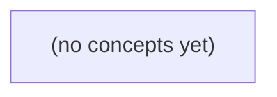

# 14.04 Transformer与推理路径：从资料授权到KV缓存

*面向Go/Python初学者，以虚构IM资料助手的固定问题为主线，逐步解释Transformer的Q/K/V、注意力、位置与因果遮罩，以及从授权过滤、分词、prefill到decode的完整推理路径。通过可手算的注意力和KV缓存例子，建立性能、上下文、安全边界与验收指标的正确直觉，并配套22道分层练习及答案。*

**章节:** 2

---

## 本书导览

- 了解整本书的章节脉络
- 掌握各章之间的概念依赖关系
- 选择最合适的阅读顺序

# 14.04 Transformer与推理路径：从资料授权到KV缓存

面向Go/Python初学者，以虚构IM资料助手的固定问题为主线，逐步解释Transformer的Q/K/V、注意力、位置与因果遮罩，以及从授权过滤、分词、prefill到decode的完整推理路径。通过可手算的注意力和KV缓存例子，建立性能、上下文、安全边界与验收指标的正确直觉，并配套22道分层练习及答案。

下方的概念图展示了本书 0 个核心概念以及它们之间的依赖关系；再下方是 1 个章节的入口。你可以按从上到下的顺序阅读，也可以根据自己的兴趣或先验知识选择切入点。

#### 概念图

## 章节索引

- **14.04 Transformer与推理路径：注意力、prefill和KV缓存怎样影响聊天** — 面向Go/Python初学者，以虚构IM资料问题解释QKV注意力、位置/因果遮罩、多头多层、prefill/decode、KV缓存资源和权限/上下文边界。

## 14.04 Transformer与推理路径：注意力、prefill和KV缓存怎样影响聊天

- 用向量权重解释注意力的基本计算
- 分清真实scaled-dot-product与玩具加权直觉
- 说明位置、因果遮罩和多头多层作用边界
- 沿prefill/decode拆用户可见时延
- 手算toy KV缓存容量并限定模型假设
- 把资料权限/版本与模型缓存、截断和回答核证分开

本节以虚构IM资料问答为线索，区分Transformer的序列计算能力与资料系统的权限、版本和事实边界。

### 从资料问答到注意力权重

### 从资料问答到注意力权重

设用户提出 q01：“当前单条正文最多多少字节？”系统先按成员身份、资料版本与可见范围过滤候选资料；例如 `doc-private` 对 `u-b` 不可见，不能因为模型“注意到”它就参与回答。过滤后，模型才处理允许读取的文本片段。

Transformer 可把问题中的词元表示为查询 $Q$，把每个候选资料片段表示为键 $K$ 与值 $V$：

- 查询：q01 中“正文”“最多”“字节”等词形成的向量，表示“我要找什么”。
- 键：资料片段的索引向量，表示“这段内容在讲什么”。
- 值：资料片段携带的内容向量，表示“若选中它，应取回哪些信息”。

对某个查询向量 $q$，模型计算它与各键 $k_i$ 的相关性：

$$
s_i=\frac{qk_i^\mathsf{T}}{\sqrt{d_k}},\qquad
\alpha_i=\operatorname{softmax}(s)_i,\qquad
o=\sum_i\alpha_i v_i
$$

其中 $d_k$ 是键向量维度；除以 $\sqrt{d_k}$ 称为缩放，可避免维度较大时点积过大，使 softmax 过早变成“几乎只选一个”的极端分布。$\alpha_i$ 就是注意力权重：与“6 UTF-8 字节”“原始 HTTP 体 4096 字节”等表述更匹配的片段，通常获得更高权重。

注意力不是数据库查询结果，也不是权限判定器。它只是在**已获准输入模型的上下文**中，动态汇聚与问题相关的信息。因此，正确路径应是：先权限与版本过滤，再检索、分词和注意力计算，最后生成“当前 S2/v1 正文上限为 6 UTF-8 字节”等回答。

### 玩具加权与真实注意力的边界

### 玩具加权与真实注意力的边界

玩具模型常把注意力写成“对若干词赋权后求和”：

\[
c=\sum_i \alpha_i x_i,\qquad \sum_i\alpha_i=1
\]

这有助于建立直觉：回答“q03 中 u-b 能看哪些资料”时，模型不应平均对待所有词，而应更关注用户、资料标记、版本和权限条件。但它省略了真实 Transformer 如何计算“该关注谁”。

真实的缩放点积注意力先把输入矩阵 \(X\) 分别投影为查询、键和值：

\[
Q=XW_Q,\quad K=XW_K,\quad V=XW_V
\]

随后计算每个位置对其他位置的相关性：

\[
\operatorname{Attention}(Q,K,V)
=\operatorname{softmax}\left(\frac{QK^\top}{\sqrt{d_k}}+M\right)V
\]

其中：

- \(QK^\top\) 是矩阵形式的“匹配分数”：当前词的查询与其他词的键逐一比较。
- \(\sqrt{d_k}\) 用于缩放，避免维度较大时分数过大，使 softmax 过度尖锐。
- \(M\) 是遮罩。聊天生成时，因果遮罩禁止当前位置看到未来 token；系统也可借此处理填充位置。
- softmax 将每一行分数变成权重，再对 \(V\) 做加权汇总；多头注意力会并行学习多组不同的关联模式。

因此，注意力能让“u-b”“doc-private”“S2/v1”“6B”等远距离信息在序列中互相影响，却不等于权限引擎。若把未过滤的 doc-private、已废弃版本或不该暴露的原始 HTTP 内容送入上下文，模型即使注意力计算完全正确，也可能据此生成错误或越权答案。正确路径仍应是：先按成员资格、版本与可见性过滤，再分词、prefill，并让模型在允许的上下文中推理。

### 位置、因果遮罩与多头多层

### 位置、因果遮罩与多头多层

自注意力本身对输入排列不敏感：若只交换词元位置，注意力计算仍只是“谁与谁相关”。因此 Transformer 需要加入位置编码或位置嵌入，使模型能区分“先提交后审核”与“先审核后提交”。现代模型常用相对位置信息，帮助它学习“相隔多远”“前后关系如何”。

聊天生成通常采用因果遮罩（causal mask）。当模型预测第 $t$ 个词元时，只允许关注 $1\ldots t$ 的上下文，不能读取未来的 $t+1\ldots n$：

$$
\operatorname{Attention}(Q,K,V)=\operatorname{softmax}\left(\frac{QK^\top}{\sqrt d}+M\right)V
$$

其中未来位置在遮罩 $M$ 中被赋予极小值，软最大化后权重近似为 $0$。这保证生成过程从左到右，不能在回答开头“偷看”尚未生成的结尾；但它不等于业务上的因果判断，更不表示模型理解了真实事件因果。

多头注意力让不同头并行寻找不同关系：一个头可能关注提问中的资料编号，另一个头关注版本字段，第三个头关注“仅成员可见”等约束。多层网络再把这些局部关系逐步组合，例如从“q03”关联到用户 `u-b`，再关联到 `doc-private` 的可见性规则。

但多头、多层只提供更强的序列表示能力，不能自动保证事实、权限或版本正确。对于资料集中的 q03，系统仍必须先执行成员资格、资料可见性和版本过滤，确保 `u-b` 不会进入 `doc-private` 的内容范围；之后才应分词、计算注意力并生成回答。模型能处理被允许输入的上下文，却不能替代访问控制。

### Prefill、Decode与KV缓存时延

### Prefill、Decode与KV缓存时延

一次聊天响应通常分为两个阶段：

- **预填充（Prefill）**：模型先读取全部已有上下文，如系统提示词、权限过滤后的资料片段、用户问题和历史对话。若输入有 $L$ 个词元，注意力需要建立这些词元之间的关联，并把每层的键（K）和值（V）写入缓存。
- **逐词解码（Decode）**：模型每次只生成一个新词元。生成第 $t$ 个词元时，新词元仍需查询此前全部 KV，因此输出越长，单词元延迟通常逐渐上升。

可粗略写成：

$$T_{\text{总}} \approx T_{\text{prefill}}(L)+\sum_{t=1}^{N}T_{\text{decode}}(L+t)$$

其中 $L$ 是输入长度，$N$ 是输出长度。长资料、长聊天记录主要拖慢 prefill；“请详细解释”则会增加 decode 次数。

KV 缓存也占用显存。设玩具模型有 12 层、8 个注意力头、每头维度 64，使用 16 位浮点数（每个数 2 字节）。每个词元每层需保存 K 和 V：

$$12\times 8\times64\times2\times2=24{,}576\text{ 字节}\approx24\text{ KiB}$$

若上下文为 1000 个词元，单个会话约需 24 MiB KV 缓存；100 个并发会话约为 2.4 GiB，尚未计入模型权重和其他工作区。因此，限制上下文、截断历史或复用缓存，直接影响并发能力。

但缓存只是在**已获准输入模型**后加速计算。对 q03，必须先按用户 `u-b` 的权限和资料版本过滤，确保 `doc-private` 不进入上下文；更快的 Transformer、Prefill 或 KV 缓存都不能修复越权输入。类似地，S2/v1 的 6B 请求体限制、同 ID 重复返回 409、非成员返回 404，是应用层规则，不是模型“记住”或“推理”出来的结论。

### 权限过滤先于模型推理

### 权限过滤先于模型推理

以 q03 为例：用户 `u-b` 询问某份资料，但 `doc-private` 对其不可见。系统首先要回答的不是“模型能否根据上下文生成答案”，而是“该用户是否有权把这份资料放入上下文”。

正确链路应是：

1. **身份与成员关系检查**：`u-b` 不是私有资料成员，查询该资料应返回 `404`，避免暴露“资料存在但你无权访问”的信息。
2. **版本与状态过滤**：S2/v1 的内容即使已在本进程内 `accepted_in_memory`，也只表示当前进程暂存成功；它受原始 HTTP 体 `4096B`、正文 `6B` 等限制约束。S3/v2 标记为 `stored_in_teaching_db` 也不自动等于可回答，R9 仍待审时不应被当作已核证事实。
3. **再进行分词、截断与检索**：只有权限和版本均合格的文本，才能被切成 token、按上下文窗口截断，并写入模型提示词。
4. **最后才是 Transformer 推理**：注意力机制负责在允许输入的 token 间建立关联；KV 缓存负责复用同一会话已计算过的键值，减少续写时的重复计算。它们都不会替系统判断访问权、版本有效性或资料真实性。

可将职责写成一条边界清晰的流水线：

`认证 → 权限过滤 → 版本/审核过滤 → 检索与截断 → prefill/KV缓存 → 模型生成 → 回答核证`

其中，**上下文截断不是权限控制**：即使 `doc-private` 恰好因窗口不足而未被送入模型，也不能把“未送入”当成“已安全授权”。同样，缓存命中也不是再次授权；缓存键必须包含用户、资料版本和权限范围，权限变化后应失效或隔离。

Transformer 改善的是序列建模与生成效率；“能看到什么”“哪个版本可用”“回答是否有依据”，必须由模型外的资料系统先行决定。

> **要点** — Transformer负责按上下文计算，不负责替系统判定权限、版本、持久化状态或资料事实。

注意力机制并不是模型“查证资料”的能力，而是一套按当前词元需求，从可见上下文中计算信息权重并汇聚表示的数学过程。

### 从词元表示到Q、K、V投影

### 从词元表示到Q、K、V投影

输入文本先被切分为词元，每个词元对应一个原始表示向量 $x_i$。注意力层不会直接拿这些向量两两比较，而是通过三组可学习矩阵做线性投影：

$$
Q=XW_Q,\qquad K=XW_K,\qquad V=XW_V
$$

因此，同一个词元会产生三种不同角色的向量：$q_i$、$k_i$、$v_i$。它们并非三份不同文本，而是同一表示在不同“观察角度”下的变换结果。

- **Query（查询）**：当前位置正在寻找什么信息。例如读到“它”时，Query 可能倾向寻找可作指代对象的上下文特征。
- **Key（键）**：每个可见位置提供什么可被匹配的线索。Query 与 Key 的点积 $q_i\cdot k_j$ 越大，表示位置 $j$ 越符合当前位置的需求。
- **Value（值）**：一旦某位置被赋予较高权重，真正被汇入当前位置的信息内容。

可以把它理解为“查询—匹配—取值”：当前位置用 $Q$ 提问，用其他位置的 $K$ 判断谁相关，再按权重汇聚对应的 $V$。注意，Key 负责“是否匹配”，Value 负责“带回什么”；两者分开，使模型能学习更灵活的检索与信息传递方式。

### 纸上加权：用1:3理解信息汇聚

### 纸上加权：用1:3理解信息汇聚

先把注意力看成一次“按重要程度汇总信息”的运算。假设当前词元面对两个可见位置，它们提供的 Value 向量分别为：

\[
V_1=(1,0),\qquad V_2=(0,2)
\]

若我们暂时人为指定它们的非负权重比例为 \(1:3\)，先将比例归一化，使总权重为 \(1\)：

\[
1:3=\frac14:\frac34
\]

于是，输出就是两个 Value 的加权和：

\[
\frac14V_1+\frac34V_2
=
\frac14(1,0)+\frac34(0,2)
\]

分别计算两个维度：

\[
\left(\frac14,0\right)+\left(0,\frac32\right)
=
(0.25,1.5)
\]

这表示：第二个位置得到更大权重，因此它携带的信息对最终表示影响更强；但第一个位置并未消失，仍贡献了第一维的 \(0.25\)。

这里的 \(1:3\) 只是纸上直觉，不是真实 Transformer 直接使用的规则。实际模型不会人工指定比例，而是由当前 Query 与各位置 Key 的匹配分数，经缩放、遮罩和 softmax 后得到权重：

\[
\operatorname{Attention}(Q,K,V)
=
\operatorname{softmax}\left(\frac{QK^\top}{\sqrt{d_k}}+\text{mask}\right)V
\]

因此，注意力权重表示“当前计算时该看哪里”，并不表示该位置的内容更真实、更可靠。

### 真实公式：缩放点积、Softmax与遮罩

### 真实公式：缩放点积、Softmax与遮罩

对一层注意力而言，输入表示先分别投影为 $Q,K,V$。以某个当前位置的查询向量 $q_i$ 为例，它会依次完成：

1. **计算匹配分数**：与所有可见位置的键做点积  
   $$s_{ij}=q_i\cdot k_j$$  
   分数越大，表示当前位置的“需求”与位置 $j$ 所提供的索引线索越匹配；它不表示该词更真实、更重要或更正确。

2. **缩放**：  
   $$\tilde{s}_{ij}=\frac{s_{ij}}{\sqrt{d_k}}$$  
   当键向量维度 $d_k$ 较大时，点积的数值往往变大。除以 $\sqrt{d_k}$ 可避免分数过于极端，使 Softmax 不至于过早变成“几乎只选一个位置”，从而保留梯度和多位置的信息融合能力。

3. **加入遮罩**：  
   $$a_{ij}=\tilde{s}_{ij}+m_{ij}$$  
   因果遮罩中，未来位置 $j>i$ 的 $m_{ij}$ 取极小值（概念上为 $-\infty$），使生成第 $i$ 个词元时不能偷看后文。无效位置遮罩则屏蔽补齐用的填充词元，防止它们参与计算。

4. **Softmax 归一化并汇聚值**：  
   $$\alpha_{ij}=\frac{e^{a_{ij}}}{\sum_t e^{a_{it}}},\qquad o_i=\sum_j\alpha_{ij}v_j$$  
   Softmax 将可见候选的分数转为和为 $1$ 的非负权重；被遮住的位置权重近似为 $0$。最终输出 $o_i$ 是各个 $V$ 向量的加权和，而不是直接复制某个原始词元。整体矩阵形式即：  
   $$\operatorname{Attention}(Q,K,V)=\operatorname{Softmax}\left(\frac{QK^\mathsf{T}}{\sqrt{d_k}}+M\right)V$$

### 可见不等于可信：注意力分数的边界

### 可见不等于可信：注意力分数的边界

注意力分数回答的是：“在当前生成位置，为了预测下一个词元，哪些**可见表示**更有用？”它并不直接回答“哪句话是真的”“哪个来源更权威”或“我是否有权使用这段内容”。

在
\[
\operatorname{Attention}(Q,K,V)=\operatorname{softmax}(QK^\top/\sqrt{d_k}+\text{mask})V
\]
中，$QK^\top$ 衡量的是当前 Query 与各 Key 的匹配程度；经过 softmax 后，得到的是候选位置之间的相对权重。高分通常意味着该位置的表示与当前预测任务更相关，或更容易帮助模型延续语言模式，而非其陈述经过事实核验。

可将几个概念明确区分：

- **注意力分数高**：模型在此步倾向使用该词元的信息。
- **文本相关性高**：该内容与问题主题、语义或上下文线索接近。
- **资料真实性高**：内容能被证据、来源或外部事实支持。
- **权限有效**：系统允许模型读取、处理或输出该内容。

遮罩（mask）只决定“哪些位置允许参与计算”。因果遮罩阻止当前词元查看未来词元；填充遮罩忽略无效位置；权限系统也可通过遮罩或检索过滤限制可见内容。但即使一段内容可见、权重很高，它仍可能是过时消息、错误引用或恶意提示。反过来，真实资料若未被提供、被遮罩，或与当前 Query 匹配较弱，也未必会获得高权重。

因此，注意力是**信息路由机制**，不是事实验证器；“能看见”不等于“可信”，更不等于“应当采纳”。

### 为后续推理铺路：位置与上下文边界

### 为后续推理铺路：位置与上下文边界

仅有词元内容还不够：同一句中的“我先读书，再吃饭”和“我先吃饭，再读书”，词元集合相近，顺序却改变含义。位置编码将位置或相对距离注入表示，使注意力能够区分“前面说过什么”“刚刚指代什么”以及词元之间的先后关系。

聊天生成通常采用因果遮罩：位置 $t$ 的 Query 只能关注 $1\ldots t$ 的 Key/Value，未来位置的分数会被遮为不可选。因此，模型是在既有对话、已生成文本和当前提示构成的可见边界内预测下一个词元，而不是同时看到完整答案后再倒推。

这也解释了后续推理流程：

- **预填充**：先处理整段已有上下文，计算各层历史词元的 Key/Value。
- **KV 缓存**：逐词生成时复用这些历史表示，只为新词元计算新的 Q/K/V，避免反复重算整段对话。
- **上下文截断**：超出窗口的早期内容不再可见；缓存再高效，也不能恢复已被移出的信息。
- **回答核证**：注意力只决定如何利用可见表示，不保证内容真实。事实核查、引用比对与外部检索属于另一个职责。

> **要点** — Q负责提问、K负责匹配、V负责汇聚；注意力权重表示计算相关性，不表示资料真实、授权或已核证。

同一组资料词汇仅改变顺序，结论就可能相反；理解位置与因果约束，才能正确解释聊天模型“看到了什么”。

### 顺序为何会改变语义

### 顺序为何会改变语义

设想两条虚构的即时通信资料：

- “管理员已**批准**小李访问财务目录。”
- “管理员已**撤销**小李访问财务目录。”

它们共享“管理员”“小李”“访问”“财务目录”等大量词汇，但结论相反：前者表示允许，后者表示禁止。再看：

- “小李向管理员申请访问。”
- “管理员向小李申请访问。”

词几乎完全相同，角色关系却发生了对调。若模型只把一句话看成“词袋”，或仅汇总各个词的静态词向量，就难以区分谁是申请者、谁是审批者，以及“批准”和“撤销”作用于哪项权限。

因此，Transformer 不能只使用 token 的内容表示，还必须以某种方式引入位置信息，使“第 3 个 token 是谁”“谁位于谁之前”成为可计算的信号。具体实现随架构而异，可能是绝对位置编码、可学习位置嵌入或相对位置机制；核心目的相同：让相同 token 在不同顺序中产生不同表示。

对聊天常见的自回归 decoder 而言，生成第 $t$ 个 token 时还受因果掩码约束：它只能关注位置 $1\ldots t$，不能偷看未来位置。于是模型既要利用已有上下文中的顺序，又必须在看不到后文的条件下逐步续写。

### 位置表示如何进入注意力

### 位置表示如何进入注意力

自注意力若只接收词元嵌入集合，天然近似“无序”：交换“允许”和“禁止”的位置，参与计算的向量仍是同一批，模型无法仅凭内容判断谁修饰谁。因此，输入必须补入位置信息：

\[
x_i=e(t_i)+p_i
\]

其中 $e(t_i)$ 是第 $i$ 个词元的嵌入，$p_i$ 是位置表示。随后由 $x_i$ 生成查询、键和值：

\[
Q=XW_Q,\quad K=XW_K,\quad V=XW_V
\]

注意力分数 $QK^\top$ 因而同时受词元内容和位置影响。原始 *Attention Is All You Need* 使用固定的正弦、余弦绝对位置编码；也可学习每个位置的绝对嵌入。

现代架构常不直接把位置加到输入上，而是在注意力分数中表示相对距离，或采用旋转位置编码（RoPE），使查询与键的内积携带“相隔多远、方向如何”的信息。这通常更适合长上下文外推，但具体效果依赖训练和架构。

位置表示解决“顺序是什么”；因果掩码解决“当前位置能看什么”。在自回归 decoder 中，第 $i$ 个位置只能关注 $j\le i$ 的词元，不能读取未来。二者缺一不可：没有位置，过去的顺序模糊；没有因果约束，训练时会泄露未来答案。

### 因果遮罩限定生成视野

### 因果遮罩限定生成视野

在自回归的 decoder-only 模型中，生成位置 $t$ 的表示时，注意力只能访问位置 $1\ldots t$，不能访问 $t+1\ldots n$。这由**因果遮罩**（也称下三角遮罩）实现：对未来位置的注意力分数加上极小值，使其经 softmax 后概率为 $0$。

例如输入“请把文件发给 Alice，不要发给 Bob”，模型处理到 “Bob” 之前，不能借助后面的标点、补充说明或尚未生成的词来改写此前的判断。聊天回复也是逐 token 续写：已生成的回复会成为后续 token 的可见历史，但未来回复尚不存在，更不可能被读取。

训练时通常会并行计算整段序列，却仍使用同一遮罩防止“偷看答案”；推理时则按时间顺序逐步生成。多头注意力可从不同角度利用历史信息，多层可组合远距离关系，但都不能突破因果遮罩的视野边界。原始《Attention Is All You Need》提出遮罩式 decoder；Google MLCC 也强调生成模型按先前 token 预测下一个 token。

### 多头多层能做什么与不能断言什么

### 多头多层能做什么与不能断言什么

多头注意力并不是“一个注意力机制重复多次”。不同头拥有不同的查询、键、值投影，因此可能分别偏向不同关系：有的更关注邻近词，有的关联代词与其指代对象，有的追踪列表结构、标点边界或较远的上下文线索。多头输出再被合并，使模型能同时保留多种关联视角。

层叠则让这些局部关系逐步组合。较低层可能编码词形、位置和短程搭配；中间层可整合句法或实体关联；更高层可能形成与任务相关的抽象特征。这里的“可能”很重要：层与头的功能通常是分布式、随输入和任务变化的，而不是固定模块分工。

因此，观察到某个头常关注“忽略此前指令”之类文本，不能据此断言它是“权限判官”；某个头常连接问题和答案，也不能断言它是“事实验证器”。模型的最终输出来自所有头、所有层、残差连接与后续非线性计算的共同作用。注意力权重能提供分析线索，却不等同于完整因果解释。

原始《Attention Is All You Need》提出多头注意力以捕捉不同表示子空间中的关系；在聊天模型的自回归推理中，这些头仍受因果掩码约束：当前位置只能利用过去及当前位置的内容，不能直接读取未来 token。

### 区分三类Transformer推理结构

### 区分三类Transformer推理结构

Transformer不是单一模型形态；“注意力能看哪里”取决于具体结构与掩码规则。

- **仅编码器（encoder-only）**：典型用于理解任务，如分类、检索或词元标注。每个位置通常可双向关注整段输入，因此“银行”可同时利用前后文判断是金融机构还是河岸。它不以逐词续写为主要目标。

- **编码器—解码器（encoder-decoder）**：常见于翻译、摘要等“输入序列 → 输出序列”任务。编码器双向读取源文本；解码器生成目标文本时，对已生成的目标词使用因果注意力，并可通过交叉注意力读取编码器表示。原始 *Attention Is All You Need* 即采用这一结构。

- **仅解码器（decoder-only）**：聊天模型常用的自回归结构。提示词与已生成文本排成一个序列；生成第 $t$ 个词元时，因果掩码只允许它关注位置 $\le t$ 的内容，不能偷看未来词元。实际推理通常先对提示词进行 prefill，再借助 KV 缓存逐词续写。

多头注意力让不同头学习不同关联，多层则可组合更复杂的模式；但不能机械地说“某一头专门负责权限判断”。Google MLCC 等材料强调注意力与位置表示的重要性，但具体可见范围必须结合模型架构判断。

> **要点** — 位置表示赋予顺序意义，因果遮罩限制生成可见范围；多头多层增强关系建模，却不等于可直接读取固定语义角色。

以一次“查资料后回答”的聊天请求为线索，拆开应用检索、模型预填充与逐词生成，建立可解释的时延和正确性边界。

### 一次聊天请求的完整路径

### 一次聊天请求的完整路径

用户点击“发送”后，请求并非立刻进入模型。应用通常先校验身份、租户、文档权限与会话状态；若问题需要资料，还会执行检索：把问题转换为检索表示，召回候选文档，按权限过滤、重排，并截取可放入上下文的片段。这里已经可能产生等待：数据库、搜索服务、网络往返和权限系统都会计入总时延。

随后，系统把系统提示词、历史对话、用户问题、检索片段及工具说明组装为模型输入，并通过分词器变成 token 序列。模型进入 **prefill（预填充）**：一次处理整段已有输入，在每一层计算注意力所需的键和值，并写入 KV 缓存。输入越长、引用材料越多，prefill 通常越慢；排队和批处理也会推迟首个输出。

完成 prefill 后，模型依据最后位置的隐藏状态预测第一个 token，即用户看到首字的时刻。之后进入 **decode（逐词解码）**：每轮读取既有 KV 缓存，只为新 token 计算新的 K、V，再预测下一个 token，并把它追加进缓存：

`输入 token → prefill → KV 缓存 → 首 token → decode → 下一个 token`

因此，首词时间不只由模型决定，还包含检索、权限、输入长度、排队与网络；而后续输出速度更受 decode 算力、并发量、缓存占用和生成长度影响。模型“开始说得快”只说明首词较早出现，不保证答案正确、引用可追溯，或权限过滤没有遗漏。

### 预填充：整段上下文写入KV状态

### 预填充：整段上下文写入KV状态

一次“查资料后回答”的请求，在进入模型前通常已被应用拼成一段有序输入：系统提示词规定角色与安全边界；当前问题表达任务；通过权限校验的检索资料提供证据；历史消息维持对话语境。它们被分词为 token 序列：

\[
x_1,x_2,\ldots,x_n
\]

“有权”并不只是资料被检索到，还意味着应用已按用户身份、文档权限、租户隔离等规则筛选；模型本身通常只看到最终送入的文本，无法替应用重新判断文档授权。

预填充（prefill）会一次处理这 $n$ 个 token。对第 $l$ 层、第 $h$ 个注意力头，每个位置的隐藏状态都会投影出键和值：

\[
K^{(l,h)}=X^{(l)}W_K^{(l,h)},\qquad
V^{(l,h)}=X^{(l)}W_V^{(l,h)}
\]

并写入 KV 缓存。这里的“缓存”不是最终答案的记忆，而是后续生成时可直接复用的中间注意力状态：当模型准备生成下一个 token 时，只需为新 token 计算新的查询 $Q$，再与已有 $K$ 计算注意力权重，并对已有 $V$ 加权汇总。

因此，长系统提示词、长历史和大量检索片段都会拉长预填充：它们增加 token 数，也要求每层、每头保存更多 KV 状态。预填充完成后，模型才得到用于预测第一个输出 token 的上下文表示；这也是首字时延的重要组成部分。资料放进上下文只意味着模型“可注意到”它，不保证它会选对证据、正确推理或给出可引用的结论。

### 解码：逐词生成与缓存增量更新

### 解码：逐词生成与缓存增量更新

`prefill`结束后，模型已把提示词中每个位置在每一层的键、值状态写入KV缓存。此时最后一个隐藏状态经过输出层，得到词表上的概率分布：

$$
p(x_{t+1}\mid x_{\le t})=\operatorname{softmax}(W_{\text{out}}h_t)
$$

系统可取概率最大的词，也可按温度、top-k、top-p等策略采样；这一步给出第一个输出词，但不保证它事实正确、满足权限约束或能被可靠引用。

随后进入`decode`。若刚生成词为$x_{t+1}$，朴素直觉是“把完整文本再送入模型计算一次”。真实服务通常不会这样做：旧提示词和已生成词的KV已缓存，因此各层只计算新位置$x_{t+1}$的$q,k,v$，并将新的$k,v$追加到缓存。新位置的查询$q_{t+1}$仍需对所有历史键做注意力：

$$
\operatorname{Attn}(q_{t+1},K_{\le t+1},V_{\le t+1})
=
\operatorname{softmax}\left(\frac{q_{t+1}K_{\le t+1}^{\top}}{\sqrt d}\right)V_{\le t+1}
$$

因此，缓存省去的是**历史位置重复生成KV状态**，不是免除对历史上下文的读取。随着会话和回答变长，单个新词仍要关注更长的缓存；并发请求还会争用算力与显存带宽，导致后续词速率下降。每生成一个词，缓存再增长一格，直到遇到结束词、长度上限或应用中止条件。

### 用户可见时延如何拆分

### 用户可见时延如何拆分

一次“查资料后回答”的体验，不应只用“模型快不快”概括。用户实际感受到的时延可拆为三类：

- **首词时间（TTFT）**：从发送请求到看到第一个输出词元的时间。它通常包括网络往返、排队、权限校验、文档检索与重排、分词，以及模型对完整输入执行 `prefill` 的时间。输入越长，尤其是长历史会话、长文档或大量检索片段，预填充越慢。
- **后续生成速度**：首词出现后，模型逐个生成词元的速率，常以 tokens/s 表示。`decode` 阶段每生成一个词元，都要读取已有的 KV 缓存并写入新状态；上下文越长、并发请求越多、显存与带宽越紧张，速度越可能下降。
- **总完成时间**：直到回答结束的全部时间。可粗略写成  
  $T_{\text{总}}=T_{\text{应用}}+T_{\text{排队}}+T_{\text{网络}}+T_{\text{prefill}}+T_{\text{decode}}$。  
  其中应用时间可能比模型时间更不稳定，例如权限系统超时、检索库负载高、引用文档下载慢。

KV 缓存避免了每次解码都重新计算历史词元，因此能显著改善逐词生成；但它不消除长输入的预填充成本，也会占用显存，限制高并发下可同时服务的会话数。

因此，短答更关注 TTFT，长答更关注稳定的后续 tokens/s；长会话则要权衡缓存复用、上下文长度与并发容量。还要注意：更快地出现首词或更高的生成速度，只说明系统响应快，并不保证检索到了正确资料、权限过滤无误，或回答具备可靠引用。

### 速度、容量与回答可信度的边界

### 速度、容量与回答可信度的边界

同一套 Transformer 推理机制，在不同聊天目标下的“最优”并不相同：

| 场景 | 主要优化目标 | 常见瓶颈 | 合理指标 |
|---|---|---|---|
| 短答问询 | 尽快看到首句 | 排队、检索、长提示词的 prefill | 首字延迟（TTFT） |
| 长答生成 | 稳定持续地产出 | decode 阶段逐 token 计算 | 每秒输出 token 数、总完成时延 |
| 长会话并发 | 容纳更多上下文和用户 | KV 缓存占用、显存、批处理调度 | 并发数、缓存命中率、尾延迟 |

短答即使只输出一句，若输入包含长文档、系统提示词和历史消息，仍要先完成整段 prefill；因此“答案短”不必然意味着首字快。长答则更受 decode 影响：每生成一个 token，都要读取既有 KV 缓存并追加新的键和值。长会话下，缓存复用可以避免重复处理历史上下文，却会持续占用显存；并发升高时，调度器可能将请求合批，提升总体吞吐，却拉长个别用户的等待时间。

更关键的是，推理快只说明计算路径顺畅，不能证明回答可靠。缓存命中只能说明某段上下文已被复用，不说明它是最新版本；检索到文档不说明当前用户有权查看；模型流畅地生成引用格式，也不说明结论确实由来源支持。

因此，应将性能与可信度分开验收：

- **性能**：TTFT、生成速率、总时延、并发容量与尾延迟；
- **资料正确性**：版本号、更新时间、检索结果是否覆盖关键证据；
- **权限合规**：检索过滤是否在模型输入前生效，缓存是否按租户或权限隔离；
- **可引用性**：结论能否回链到具体段落，引用是否支持该结论而非仅主题相关。

“更快”改善交互体验；“可追溯、可授权、可核验”才构成回答可信度。

> **要点** — 检索授权决定可见上下文，prefill决定首词等待，decode决定续写速度；缓存提升效率，不替代事实与引用核证。

KV缓存保存的是当前推理会话中各层已处理token的键和值，用于加速续写；它不是可跨权限、跨版本复用的永久聊天记忆。

### KV缓存：为自回归续写保存什么

### KV缓存：为自回归续写保存什么

Transformer 逐个生成新 token 时，第 $t$ 个位置的注意力需要查询此前 $1\ldots t-1$ 个位置：

$$
\mathrm{Attention}(Q_t,K_{1:t},V_{1:t})
=\mathrm{softmax}(Q_tK_{1:t}^{\top}/\sqrt{d})V_{1:t}
$$

已生成 token 的表示一旦确定，在每一层中对应的键 $K$ 与值 $V$ 也随之确定。KV 缓存就是把这些“历史 token、逐层计算出的 K/V 张量”暂存起来。生成下一个 token 时，模型只需为新 token 计算新的 $Q,K,V$，再将新 $K,V$ 追加到缓存，并让新 $Q$ 与缓存中的全部历史 $K,V$ 做注意力计算。

这避免了每次续写都把整段上下文重新送过所有层：没有缓存时，生成第 $t$ 个 token 会重复计算前 $t-1$ 个 token 在各层的 K/V；有缓存时，历史部分直接复用，decode 阶段的主要新增工作集中在一个新 token 上。

应注意缓存的边界：

- 它保存的是模型内部激活结果，不是可读、可检索的聊天摘要或业务档案。
- 缓存属于特定模型、特定层、特定会话前缀；更换模型版本、系统提示词或用户权限，都不能随意沿用。
- 缓存加速“继续生成”，却不消除注意力读取历史的成本；上下文越长，新 token 仍需关注越多历史 K/V。

### 从全序列注意力到逐token解码

### 从全序列注意力到逐 token 解码

设输入序列长度为 $T$。在纸上计算因果自注意力时，某层先由全部隐藏状态得到

$$Q=XW_Q,\qquad K=XW_K,\qquad V=XW_V$$

再计算带因果掩码的注意力：

$$\operatorname{Attention}(Q,K,V)=\operatorname{softmax}\left(\frac{QK^\top}{\sqrt{d}}+M_{\text{causal}}\right)V$$

其中第 $t$ 个位置只能关注 $1\ldots t$ 的 token，不能偷看未来。若一次处理整段 prompt，注意力分数矩阵在概念上是 $T\times T$；这就是 **prefill**：模型并行读入已有文本，逐层生成每个位置的 $K,V$，并把它们写入该会话的 KV 缓存。

随后进入 **decode**。第 $t+1$ 个 token 不必重新计算前 $t$ 个 token 的 $K,V$：在每一层，它只为当前新位置生成一个查询 $q_{t+1}$、一个键 $k_{t+1}$ 和一个值 $v_{t+1}$，将新键和值追加到缓存，并执行

$$o_{t+1}=\operatorname{softmax}\left(\frac{q_{t+1}[K_1,\ldots,K_{t+1}]^\top}{\sqrt{d}}\right)[V_1,\ldots,V_{t+1}]$$

因此，解码时每一步的查询只有一行，却要读取此前全部缓存的 $K,V$。KV 缓存消除了“重算历史 token 投影”的工作，但没有消除对历史上下文的访问：上下文越长，单步 decode 需要比对和读取的数据越多；同时生成多个会话时，每个会话都要保有各自的缓存。

### 手算玩具KV缓存容量

### 手算玩具KV缓存容量

设一个极简模型满足：层数为 $2$、每层有 $2$ 个 KV 头、每个头维度为 $4$、当前上下文已有 $32$ 个 token；键 $K$ 与值 $V$ 都要保存；每个元素采用 $2$ 字节精度；同时只有 $1$ 个请求在生成。

KV 缓存容量可按下式估算：

\[
2(K,V)\times 2(\text{层})\times 2(\text{KV头})\times 4(\text{头维})\times 32(\text{token})\times 2\text{B}\times 1(\text{并发})
\]

逐项相乘：

\[
2\times2\times2\times4\times32\times2=1024\text{B}=1\text{KiB}
\]

因此，这个玩具会话仅保存已处理 token 的 KV，就约需 **1 KiB**。若有 $10$ 个彼此独立、同样长度的并发请求，则近似为：

\[
1024\text{B}\times10=10240\text{B}\approx10\text{KiB}
\]

这里的“并发”意味着每个请求都有自己的推理状态；不能因为它们都在聊天，就默认共用 KV。真实部署还会受实际层数、KV 头数、GQA/MQA、数据精度、分页式 KV 管理、序列长度差异等影响。这个算式用于理解增长关系：上下文 token 越多、并发越高，KV 内存通常越大，而不是用于直接推断生产模型容量。

### 容量公式的假设与生产边界

### 容量公式的假设与生产边界

纸上估算可写为：

\[
M=2_{\text{K/V}}\times L\times H_{kv}\times D_h\times T\times B\times C
\]

其中，$L$ 是层数，$H_{kv}$ 是每层 KV 头数，$D_h$ 是头维度，$T$ 是已缓存 token 数，$B$ 是每个元素的字节数，$C$ 是并发会话数。若假定 `2` 层、`2` 个 KV 头、头维度 `4`、`32` 个 token、每元素 `2B`、单并发，则：

\[
2\times2\times2\times4\times32\times2\times1=1024B=1KiB
\]

十个同等会话约为 `10KiB`。这只是帮助理解“上下文长度和并发近似线性放大 KV 占用”的玩具模型，隐含了几个强假设：

- **全序列保留**：每个历史 token 的 K/V 都留存；若使用滑动窗口、截断上下文或淘汰策略，实际占用会受窗口上限约束。
- **无共享、无压缩**：不同请求各自保存完整前缀；生产系统可能共享完全相同且权限一致的前缀，也可能采用量化、压缩或分层卸载。
- **固定精度**：这里按 `2B` 的半精度计算；不同模型可能使用更高精度、低比特 KV 量化，字节数随之变化。
- **KV 头数等于注意力头数**：这对普通多头注意力成立，但 GQA 会让多个查询头共享较少 KV 头，MQA 更常只有一个 KV 头，因此缓存可能显著更小。
- **连续静态分配**：真实服务常使用分页 KV 缓存、块管理与动态批处理，存在页碎片、预留空间和调度开销。

因此，不能把 `1KiB` 或其线性外推直接当作生产模型容量。实际评估必须代入模型层数、KV 头数、头维度、上下文策略、精度、并发和分页实现；共享前缀还必须按用户、权限、系统提示词与模型版本严格隔离。

### 缓存隔离不等于资料可信

### 缓存隔离不等于资料可信

KV缓存解决的是“已计算过的上下文不必重复算”，并不证明上下文中的资料真实、最新或有权使用。随着对话变长，每个新增 token 都会在各层增加 K/V；并发会把这一成本近似相加。纸上若按全序列、无共享压缩或滑窗估算：

$2\times2\times2\times4\times32\times2\text{B}\times1=1024\text{B}$，

即单会话约 $1\text{KiB}$，10 路并发约 $10\text{KiB}$。这只是教学算例；生产系统会受层数、KV头数、GQA/MQA、量化精度、分页缓存和滑动窗口影响，不能据此推断实际容量。

工程上应把三件事分开处理：

- **内存控制**：限制上下文长度、截断旧消息、采用滑窗或摘要，并为并发设置配额与逐出策略。
- **缓存隔离**：系统提示词、租户、用户权限、检索资料版本、模型版本任一变化，都应视为前缀身份变化；不能把旧会话或低权限会话的 KV 前缀直接复用到新请求。
- **回答核证**：即使前缀命中缓存，仍要检查引用资料的版本、权限和时效。缓存命中只能说明“计算结果可复用”，不能说明“结论仍可信”。

尤其在权限撤销、知识库更新或提示词升级后，应失效相关前缀并重新检索、重新生成；否则模型可能高效地延续一段已经过期或越权的推理路径。

> **要点** — KV缓存是会话级推理加速状态；容量依赖架构与并发，绝不能把它当作永久记忆或权限证明。

纸上窗口只有32个词元时，真正的风险不只是“答错”，还包括截断待审信息、混入越权资料，以及把高注意力误当作权限判断。

### 32词元窗口的预算账

### 32词元窗口的预算账

设模型的纸上上下文窗口为 $32$ 个词元。一次聊天请求看似只包含“用户问题”，实际要共同争抢这 32 个位置：

| 输入部分 | 预算（词元） | 作用 |
|---|---:|---|
| 系统与任务指令 | 6 | 规定回答格式、权限边界、拒答条件 |
| 检索到的证据 | 18 | 文档片段、成员范围、审批状态、引用来源 |
| 用户问题 | 4 | 例如“R9现在能给9B看吗？” |
| 余量 | 4 | 特殊标记、角色标签、分隔符、生成前缓冲 |

纸面计算是：

$$6+18+4+4=32$$

但“余量 4”并不等于可以放心使用的内容空间。实际请求还可能附带消息角色标记、文档分隔符、引用标签、工具调用痕迹等特殊词元；不同分词器也会把一个看似简短的名称拆成多个词元。因此，真实输入很容易超过 32。

一旦超窗，系统通常只能截断、压缩或减少检索证据。危险在于，被截掉的未必是“无关背景”，而可能恰好是`R9：待审`、`仅成员 u-a 可见`或引用的版本号。若留下的是“9B项目介绍”，丢掉的是“待审”和成员范围，模型仍可能流畅回答“可以给9B看”，却已经改变了事实与权限含义。

因此，预算应优先保护约束性信息：授权范围、审批状态、版本、时间条件和引用标识。不能因为某段描述“相关度高”就挤掉这些边界。若关键证据无法完整进入窗口，应明确说明证据不足或拒绝确认，而不是依据残留片段补全结论。

### 截断如何改变回答边界

### 截断如何改变回答边界

设可用窗口为 32 个词元：指令占 6，已授权证据占 18，问题占 4，理想输出预留 4。此时若继续附加文档，模型不会“知道资料太多”；它只会接收经过分词、拼接后仍留在窗口中的前缀、后缀或截断片段。

例如原始证据是：

`R9：9B，待审；仅 u-a 成员可见；引用：内部草案 v3`

若窗口先后挤掉了“待审”“仅 u-a 成员可见”和引用来源，留下的可能只是：

`R9：9B`

对模型而言，条件已不再存在。问题若问“R9 的结论是什么”，注意力会集中到仍可见的 `9B`，于是输出“R9 结论为 9B”；若问题要求解释或引用，它还可能依据常见文本模式补成“已确认”“经评审通过”等细节。这里的补造并非模型有意忽略限制，而是限制词元根本未进入其可注意的上下文。

更危险的是，范围标记通常比内容值更容易被压缩、截断或埋在长文档中。`u-a` 的成员范围一旦消失，模型无法从注意力权重推导出“不得向 u-b 透露”；引用被截去后，回答也失去可追溯性。注意力只是在**已输入词元**间分配相关性，不是权限执行器，更不能恢复缺失的版本、审批状态和访问控制。

因此，进入模型前应先按用户许可与资料版本过滤，再完整保留“状态—范围—来源”这类边界信息。若关键限定词已被截断，正确策略是明确说明证据不足、要求缩小问题或补充可见资料；不能因为剩余片段看起来高相关，就把 `9B` 升格为确定事实。

### 注意力不是访问控制

### 注意力不是访问控制

注意力机制解决的是“**已进入上下文的词元，模型应更关注哪些**”；访问控制解决的是“**哪些资料根本允许进入上下文**”。两者发生在不同阶段，不能互相替代。

| 问题 | 注意力机制 | 授权过滤 |
|---|---|---|
| 执行时点 | 输入模型之后，生成过程中 | 资料进入模型之前 |
| 判断依据 | 词元相关性、位置、任务模式 | 用户身份、成员范围、许可、资料版本、保密级别 |
| 处理对象 | 已经可见的上下文 | 候选文档、检索片段、缓存内容 |
| 失败后果 | 忽略重要证据、引用错位、答非所问 | 泄露私有资料、使用待审版本、跨租户越权 |

例如，`u-a` 可以查看项目资料中的正式版结论，`u-b` 只能查看公开摘要。若系统先把同一份完整资料放入两人的上下文，再期待模型“少关注”私有段落，就已经越过了安全边界：模型可能在后续生成时重新注意到该段，也可能通过概括、引用或补全泄露内容。

正确路径应是：

1. 根据当前用户、成员范围与资源许可筛选可访问资料；
2. 排除待审、过期或不适用于当前范围的版本；
3. 仅将过滤后的片段送入检索结果、提示词或 KV 缓存；
4. 再由注意力机制在这些**已获授权**的词元中分配权重。

KV 缓存也必须绑定许可上下文。`u-a` 的缓存不能因文本相同就复用于 `u-b`；否则，缓存复用会绕过输入前的授权检查。注意力权重再高，只表示模型认为某段文字与当前生成相关，不表示该文字合法、真实、最新或可向当前用户披露。

### 缓存复用的许可边界

### 缓存复用的许可边界

KV缓存保存的是已处理词元的键和值，可避免每轮对相同前缀重复计算。但“前缀相同”不等于“可安全复用”：缓存条目还隐含了其生成时可见的文档、成员范围、版本状态与会话身份。

设用户 `u-a` 可访问公开资料和项目甲，用户 `u-b` 只能访问公开资料。若 `u-a` 的上下文已注入“项目甲：R9待审，预算为9B”，其KV缓存中的表示已经吸收该信息。即使 `u-b` 提出完全相同的问题，直接复用该缓存也可能让模型沿着包含项目甲证据的注意力路径生成答案，从而泄露私有内容。

因此，缓存键至少应绑定：

- 用户或租户身份；
- 文档许可集合、成员 `scope` 与数据版本；
- 已通过授权过滤后的上下文指纹；
- 模型版本、系统指令及工具结果。

只有这些安全相关条件等价，才可复用缓存；更稳妥的策略是按租户、项目或授权域隔离缓存。授权与版本过滤必须发生在资料进入模型之前，不能指望注意力权重“自动忽略”无权内容。若过滤后关键证据被截断，应说明证据不足或拒答，而不是借用其他用户缓存中的高分信息补全事实。

### 证据不足时的安全作答

### 证据不足时的安全作答

设聊天窗口中原本有三段关键材料：

- `R9：待审，禁止对外引用`
- `成员 scope：u-a 可见，u-b 不可见`
- `正式结论：9A；9B 仅为旧版草案`

但在长文档拼接、特殊词元和历史消息占用后，模型实际只看到了“项目可能采用 9B”的片段，或只看到了用户的问题而没有可见引用。此时，即使注意力集中在“9B”附近，也不能把它当作事实确认，更不能据此推断权限。

安全策略应按证据状态分流：

1. **缺少结论证据**：明确说明无法确认。  
   “当前可见材料不足以确认最终版本；我不能据此断言为 9B。”

2. **需要用户提供可见来源**：请求补充，而不是让模型补全。  
   “请提供可公开引用的正式结论、版本号或链接，我可以据此整理答案。”

3. **疑似涉及待审或私有范围**：拒绝披露，并给出安全替代。  
   “我无法依据可能受限或待审的材料说明具体结论；如需对外答复，请使用已批准发布的版本。”

4. **可回答的仅是一般原则**：把事实判断降级为条件式说明。  
   “若 9B 已被正式批准且对当前用户可见，才可将其作为结论；否则应保留为待确认信息。”

关键不是“模型是否记得某句话”，而是该句话是否**完整进入上下文、属于当前用户可见范围、且具有可引用的版本状态**。证据被截断时，最安全的高质量回答是标注不足、请求补充或拒答；不能用看似自信的语言把高注意力变成事实，更不能把猜测变成对私有信息的泄露。

> **要点** — 窗口、缓存和注意力只处理已获准输入的内容；权限、版本与证据完整性必须在模型外部验证。

要解释一次聊天为何快慢、答案为何可复现，不能只看模型名称；必须把请求、缓存、排队、资料版本和核证结果放进同一份记录。

### 建立可复现的聊天请求记录

### 建立可复现的聊天请求记录

一次聊天请求不是“模型名 + 最终答案”，而是一条可追溯的推理服务事件。记录的目标是让他人能够判断：答案差异来自提示词、分词、模型版本、排队、缓存，还是资料与核证状态不同。

至少应为每次请求保存以下字段：

- **请求身份**：请求时间、请求编号、用户问题原文、系统提示词、工具调用与检索资料的完整版本；若引用外部来源，还要记录来源版本、访问时间与授权状态。
- **模型与分词**：模型名称、精确版本或权重哈希、服务端推理配置、`tokenizer`名称与版本、上下文窗口、温度、采样参数、最大输出长度。
- **输入输出规模**：提示词 token 数、实际生成 token 数、是否发生上下文截断；长前缀被截断时，必须记录截断位置和保留策略，不能只保留截断后的文本。
- **时延分解**：提交时间、开始执行时间、首 token 时间、结束时间；据此区分队列等待、`prefill`时间与`decode`时间。常用指标为首 token 延迟 `TTFT`，以及输出速率  
  $$\text{输出速率}=\frac{\text{输出 token 数}}{\text{生成结束时间}-\text{首 token 时间}}$$
- **缓存假设**：KV 缓存是否启用、缓存作用范围、命中条件、命中与否及其证据。不能把“相似提示词”直接当作缓存命中；通常需确认模型、分词器、前缀 token、会话隔离与服务实例等条件。
- **并发与资源环境**：同时在途请求数、批处理策略、队列长度、实例或区域信息。响应变慢可能是排队，而非算力下降。
- **结果核证**：保存原始输出、引用证据、人工或自动核验结论，并分别记录 q01、q03 等用户结果；“样本答案看起来正确”不等于已验证。

比较同一问题时，先以 14.09 的关键词基线为参照，固定问题、资料版本和评价规则，再比较答案、TTFT 与输出速率。若没有受控实测，不能依据单次体验断言某模型费用更低、性能更强；若记录缺少缓存范围、队列时间或答案核证，也应明确标注为不可归因。

### 按预填充与逐词生成拆解时延

### 按预填充与逐词生成拆解时延

一次聊天请求的端到端时延不等于“模型推理时间”。对用户而言，至少应拆为：

\[
T_{\mathrm{总}}=T_{\mathrm{排队}}+T_{\mathrm{预填充}}+T_{\mathrm{首词准备}}+T_{\mathrm{逐词生成}}+T_{\mathrm{传输}}
\]

其中，**预填充**（prefill）是模型读取系统提示、历史消息、检索资料和当前问题，并为已有 token 建立 KV 缓存的阶段；其耗时通常随输入 token 数增长。**逐词生成**（decode）则是在已建立上下文后，每次生成一个或少量 token，并不断追加 KV 状态的阶段；它主要决定长答案的持续输出速度。

用户可见指标应分别记录：

- **队列等待**：请求进入服务到实际开始执行的时间。高并发、批处理策略或限流都会增大它；不能误判为模型算力不足。
- **首词时延**（TTFT）：从提交请求到收到首个输出 token 的时间。它包含队列等待、预填充及首词生成准备，因此不能直接当作纯 prefill 时间。
- **输出速率**：首词后生成 token 数除以持续生成时间，例如 $r=N_{\mathrm{out}}/T_{\mathrm{decode}}$。应同时记录输出 token 数，否则短答案的“总耗时更快”没有可比性。
- **总完成时延**：最后一个 token 到达时的时间，适合描述完整交互体验，但不适合单独定位瓶颈。

一个实用记录格式是：`输入 8,240 token；输出 612 token；排队 1.8 s；TTFT 4.6 s；生成 18.0 s；输出速率 34 token/s；总计 22.9 s`。若 TTFT 升高而输出速率稳定，优先检查队列、长前缀和缓存命中；若 TTFT 正常但答案越长越慢，则更可能是 decode 吞吐变化。没有同模型、同 tokenizer、同 prompt 长度、同并发条件下的实测数据，不能据此断言费用或性能优劣。

### 用玩具模型估算KV缓存资源

### 用玩具模型估算 KV 缓存资源

KV 缓存保存每一层注意力中已处理 token 的键（K）和值（V）。在“每个请求独占缓存、所有层均已 prefill、无分页碎片”的假设下：

\[
M_{\mathrm{KV}}=2\times N_{\mathrm{layer}}\times N_{\mathrm{KVhead}}\times d_{\mathrm{head}}\times L\times b\times C
\]

其中，`2` 表示 K 与 V；$N_{\mathrm{layer}}$ 是层数，$N_{\mathrm{KVhead}}$ 是 KV 头数，$d_{\mathrm{head}}$ 是头维度，$L$ 是已缓存 token 数，$b$ 是每个元素字节数，$C$ 是并发请求数。FP16/BF16 通常 $b=2$，FP8 可近似取 $b=1$；应记录实际精度而非只写“半精度”。

例如玩具模型有 32 层、32 个 KV 头、头维度 128，采用 BF16。每增加一个 token：

\[
2\times32\times32\times128\times2=524{,}288\text{ B}\approx0.5\text{ MiB}
\]

若单请求已处理 8192 token，则约占 $4$ GiB；8 路并发约为 $32$ GiB。decode 每生成 1 个 token，还会为每个活跃请求再增加约 $0.5$ MiB。

这个估算必须显式限定：若模型使用 GQA/MQA，应填 **KV 头数**，不是查询头数；若服务按最大上下文预分配，应按分配长度而非实际 token 数计算；分页 KV、块对齐和元数据会带来额外开销。共享前缀缓存只有在模型、tokenizer、系统提示词、采样前缀及缓存作用域一致时才可能复用，不能把逻辑命中直接当作零显存占用。该手算仅用于解释容量压力与并发上限，不足以据此断言实际费用或性能。

### 核对前缀缓存的命中条件与范围

### 核对前缀缓存的命中条件与范围

前缀缓存复用的对象通常是已完成 `prefill` 的 KV 状态，而非“语义相近的问题”。比较时应固定模型与 tokenizer 版本、系统提示词、工具定义、采样参数和请求路由，再按前缀关系分组：

| 情形 | 命中条件 | 预期影响 |
|---|---|---|
| 完整前缀复用 | 新请求在可缓存范围内与既有请求逐 token 一致，且模型、版本、租户及缓存键一致 | 可跳过大部分或全部重复 `prefill` |
| 部分前缀复用 | 仅共享起始的一段 token；差异发生在后续用户消息、变量或附件 | 只能复用共同前缀，差异后的 token 仍须重新预填充 |
| 未命中 | 任一缓存键不同、前缀 token 不同、条目过期/被淘汰、路由至不同实例 | 按完整输入重新预填充 |

“文本看起来一样”不足以证明命中：空格、Unicode 规范化、消息角色顺序、隐藏系统指令、工具 schema、tokenizer 升级都可能改变 token 序列。长前缀还要核对上下文窗口与截断策略；若旧请求缓存的是被截断后的尾部，而新请求以完整原文比较，不能误报为完整命中。

缓存范围必须记录为实例级、节点级、区域级还是跨请求共享，并明确 TTL、淘汰策略与是否允许跨会话复用。多租户场景应以租户、项目或权限边界隔离；无授权的跨用户命中既不能假定，也不应由响应时间反推。先用 14.09 的同问题关键词基线记录 TTFT、`prefill/decode` 时间和并发队列状态；未取得服务端命中日志或可核证样本前，不能仅凭变快断言缓存命中，更不能据此下费用或性能结论。

### 以关键词基线验证资料问答结果

### 以关键词基线验证资料问答结果

资料问答的“答案看起来合理”并不等于模型确实理解了资料。应先用 14.09 的**同问题关键词基线**对照：把问题拆成实体、时间、版本、条件、结论等检索词，检查关键词检索能否直接定位到原文证据。若关键词基线已能稳定命中，而模型答案没有新增可核验的推理或交叉归纳，其价值主要是表达与整理，不应夸大为深度推理能力。

建议对每个问题建立最小核验表：

- **问题与范围**：保留原始问题、上下文、允许使用的资料集合及检索日期。
- **关键词基线**：记录关键词、命中文档、命中段落、排序规则，以及基线答案。
- **来源版本**：核对文档标题、发布日期、版本号、修订状态；不能用旧版内容证明新版结论。
- **授权状态**：区分公开可引用、内部可用但不可外传、仅摘要可用和无授权来源。
- **引用依据**：每项关键结论应对应可定位的原文片段；模型生成的页码、链接或引文必须逐条复查。
- **用户结果**：分别记录 `q01`、`q03` 的用户任务、成功判据、实际输出和人工核证结论，避免只展示有利样本。

比较时应明确三种情况：模型优于基线，必须指出其新增且被证实的证据整合；两者一致，说明模型未超过检索基线；模型与基线冲突，则以可追溯来源和版本为准，而非以措辞流畅为准。

尤其不要从单次回答推导费用、吞吐、延迟或模型性能结论。没有 token 数、prefill/decode 时间、并发与缓存命中实测时，只能报告“本次资料核验结果”，不能声称某模型更快、更省或更适合生产。若答案来自截断长前缀、错误缓存范围或未经证实的样本，也应标记为未通过核验。

> **要点** — 聊天性能与答案可信度需分别记录、分别核验：时延看阶段与队列，缓存看假设与命中，资料看版本、授权和证据。

以一条虚构IM资料问答链路为线索，拆解模型如何关注上下文、生成首字与续写，并厘清缓存和资料治理的边界。

### QKV：从相关性到加权信息

### QKV：从相关性到加权信息

注意力可理解为“先找相关内容，再汇总其中的信息”。对当前位置的表示 $x$，模型通过不同线性变换得到：

- Query（查询）$Q$：当前位置正在寻找什么；
- Key（键）$K$：每个上下文位置可被匹配的索引特征；
- Value（值）$V$：匹配后实际取回、并参与输出的信息。

真实的缩放点积注意力不是直接把相关性当权重，而是：

$$
\operatorname{Attention}(Q,K,V)
=\operatorname{softmax}\left(\frac{QK^\top}{\sqrt{d_k}}+\text{mask}\right)V
$$

其中 $QK^\top$ 给出查询与各键的相似度，除以 $\sqrt{d_k}$ 防止维度较大时分数过于极端；`mask` 会遮住不允许关注的位置，例如聊天续写时不能偷看未来 token。位置编码则让模型知道“相同词出现在不同位置”并不等价。

为便于手算，可使用玩具版加权：若两个位置的相关性已经给定为 $1:3$，归一化后权重为

$$
\left(\frac{1}{1+3},\frac{3}{1+3}\right)=(0.25,0.75)
$$

若对应的 Value 分别为 $V_1=0$、$V_2=2$，则注意力输出为：

$$
0.25\times 0+0.75\times 2=1.5
$$

因此输出不是“选中 Value 2”，而是按相关程度混合信息。多头注意力会并行使用多组 $Q,K,V$：有的头偏向指代关系，有的头偏向时间、格式或主题，最后再合并。

### 位置、遮罩与多头：能看什么、怎样看

### 位置、遮罩与多头：能看什么、怎样看

注意力本身只比较词向量的相似度，不天然知道“谁在前、谁在后”。位置编码把位置 $p$ 的信息加入输入，使模型区分“R9 待审”与“待审 R9”，也能学习相邻、远距和顺序关系。它解决的是序列秩序，不是资料来源是否可信。

聊天生成采用因果遮罩（causal mask）：在第 $t$ 个位置，注意力只允许查看 $1\ldots t$，未来位置的分数被置为 $-\infty$，经 softmax 后权重为 $0$。因此模型可在 prefill 阶段并行处理已有提示词，却在 decode 阶段逐词续写；它不能“偷看”尚未生成的答案。

单头注意力可写为：

$$
\operatorname{Attention}(Q,K,V)=\operatorname{softmax}\left(\frac{QK^\top}{\sqrt{d_k}}+M\right)V
$$

其中 $Q$ 表示“当前要找什么”，$K$ 表示“各位置可被怎样匹配”，$V$ 是“匹配后实际取回的内容”，$M$ 为遮罩。多头注意力让不同投影子空间并行关注不同模式：某些头追踪代词指代，某些头关注时间、否定词或字段名；拼接后再投影，获得比单一相似度更丰富的关联。

多层则让这种“检索—聚合—再检索”逐步组合：浅层可连接“该资料”和其名称，后层可把名称、权限状态与问题意图整合为回答线索。但层数、多头和位置编码都只是计算机制。`doc-private` 是否允许访问，应由权限系统在上下文进入模型前决定；“R9 待审”是否仍然有效，必须由版本、审批记录或事实核证确认。遮罩限制可见的**位置**，并不自动限制可见的**资料权限**。

### Prefill与Decode：聊天时延的两段路径

### Prefill与Decode：聊天时延的两段路径

用户提交问题、历史消息和检索到的资料后，模型先经历 **Prefill（预填充）**：一次性读取全部提示词，为每层、每个注意力头计算并写入历史词元的 Key/Value（KV）缓存。此阶段的核心任务不是“说话”，而是理解上下文并完成首个待生成位置的计算。

随后进入 **Decode（解码）**：模型每次只生成一个新词元，将该词元的 K/V 追加到缓存，并对已有缓存做注意力计算，再预测下一个词元。直到遇到结束标记或达到长度上限，输出才停止。

可将用户感受到的时延拆为：

- **TTFT（首词元时间）**：从发送请求到看到第一个词元的时间。它主要包含排队、资料检索、权限过滤、提示词拼装、Prefill，以及首个 Decode 步骤。
- **后续输出时延**：首词元之后的逐词元生成时间，通常以“每秒词元数”衡量；网络流式传输和客户端渲染也会影响体感。
- **总完成时间**：约为 `TTFT + 生成词元数 × 单词元解码时间`。

例如提示词含 `32` 个历史词元、用户问题 `6` 个词元、检索资料 `18` 个词元、系统约束 `4` 个词元，则 Prefill 长度为：

\[
32+6+18+4=60
\]

若上下文窗口上限为 `64`，仅剩 `4` 个位置可继续生成；这会限制回答长度，也提示工程侧应压缩历史或摘要资料。

KV 缓存使 Decode 不必反复重算历史词元的 K/V，但缓存随上下文、层数、头数和并发增长。若某会话每个词元 KV 占 `1\text{ KiB}`，保留 `10` 个词元约需 `10\text{ KiB}`；`10` 个并发会话则约为 `100\text{ KiB}`。实际部署中应优先控制长提示词和无关资料，因为它们既拉长 TTFT，也持续占用 KV 显存。

资料进入 Prefill 前还必须完成治理：`doc-private` 文档只能供有权限的会话拼入提示词；标记为 `R9待审` 的内容应按策略排除、降权或明确标注，不能因“模型需要更多上下文”而绕过权限。

### KV缓存：容量估算与并发取舍

### KV缓存：容量估算与并发取舍

KV缓存保存的是已处理上下文在各层注意力中的 Key/Value 表示，使解码阶段生成下一个词时不必重复计算整段历史。容量估算先看单请求可用上下文，而非只看模型标称窗口。

设玩具模型的总上下文窗口为 $32$ 个位置，其中系统提示占 $6$，已注入的资料占 $18$，当前用户问题占 $4$。则留给模型继续生成回复的位置为：

$$
32-6-18-4=4
$$

因此，该轮最多只能续写 $4$ 个位置；若继续追加输入或生成超限，就必须截断、压缩历史，或拒绝该请求。这里的“剩余 4”是位置预算，不等同于KV缓存的字节数。

再设该玩具模型中，每个活跃请求的KV缓存固定估为 $1\text{ KiB}$。当同时有 $10$ 个请求处于预填充完成、等待或持续解码的状态时，缓存需求为：

$$
1\text{ KiB/request}\times10\text{ requests}=10\text{ KiB}
$$

这说明并发数线性放大缓存占用：单请求很小，不代表服务端总占用小。实际系统中，KV大小还会随层数、头数、隐藏维度、精度以及已累计的 token 数增长；请求结束、取消或被逐出后，才可回收对应缓存。容量规划应同时预留峰值并发余量，否则即使算力足够，也可能因KV空间不足而排队，进而拉长首词延迟（TTFT）。

### 缓存不等于授权：资料边界与回答核证

### 缓存不等于授权：资料边界与回答核证

KV缓存、上下文截断、文档权限与版本状态解决的是四类不同问题，不能相互替代。

- **KV缓存**：保存已处理提示词的键值状态，避免后续生成时重复计算。它提升的是速度与吞吐，不会授予模型新的资料访问权，也不证明缓存内容正确。若每个请求缓存约 `1 KiB`，10 个并发会占约 `10 KiB`；这是资源估算，不是权限清单。
- **上下文截断**：当输入超过窗口时，较早内容可能被移除。被截断的内容通常不再参与当前注意力计算；但“仍在上下文中”也不等于“允许引用”。
- **文档权限**：决定某用户、机器人或检索链路能否读取资料。标记为 `doc-private` 的文档即使曾被其他会话处理、进入某处缓存，也不得向无权用户泄露标题、摘要、片段或由其推导出的结论。
- **版本状态**：决定资料能否作为正式依据。`R9待审` 表示内容尚未完成核验；即便调用方有读取权限、文本也已进入提示词，回答仍应标注“待审”、请求确认，或避免将其表述为确定事实。

可将核证理解为一道独立闸门：

`可回答依据 = 可访问权限 ∧ 未被策略排除 ∧ 版本可用 ∧ 与问题相关`

因此，模型在 prefill 阶段读入资料、在 decode 阶段复用KV缓存，只说明这些 token 参与过计算；它们不自动获得“可见”“可引用”或“可信”的身份。面对“R9 已批准了吗？”这类问题，若唯一证据是 `doc-private` 的 `R9待审` 草稿，安全回答应是：当前不能据此确认批准状态；请查询具备访问权限的正式发布版本。

> **要点** — 注意力决定当前上下文的信息路由；缓存优化生成速度，但不授予资料权限，也不保证版本真实。
