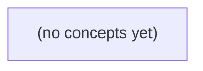

# 14.09 评测与数据工程：虚构资料助手的权限、证据与端到端评测

*面向 Go/Python 初学者的中文静态教材，以虚构 IM 资料助手为贯穿案例，建立从业务合同、金标签数据、确定性关键词基线到组件指标和端到端评测的完整方法。全书围绕当前 S2/v1 合同、提议中的版本变更、权限拒答与长离线恢复等问题，训练读者用可审计数据判断“答对、该拒答、是否有权、证据是否现行”。*

**章节:** 2

---

## 本书导览

- 了解整本书的章节脉络
- 掌握各章之间的概念依赖关系
- 选择最合适的阅读顺序

# 14.09 评测与数据工程：虚构资料助手的权限、证据与端到端评测

面向 Go/Python 初学者的中文静态教材，以虚构 IM 资料助手为贯穿案例，建立从业务合同、金标签数据、确定性关键词基线到组件指标和端到端评测的完整方法。全书围绕当前 S2/v1 合同、提议中的版本变更、权限拒答与长离线恢复等问题，训练读者用可审计数据判断“答对、该拒答、是否有权、证据是否现行”。

下方的概念图展示了本书 0 个核心概念以及它们之间的依赖关系；再下方是 1 个章节的入口。你可以按从上到下的顺序阅读，也可以根据自己的兴趣或先验知识选择切入点。

#### 概念图

## 章节索引

- **14.09 评测与数据工程：先定IM问题和关键词基线再比较RAG** — 面向Go/Python初学者，用虚构IM资料与六类问题建立有权限的固定数据集和关键词基线，再分层评估检索、引用、拒答、端到端效果及裁判偏差。

## 14.09 评测与数据工程：先定IM问题和关键词基线再比较RAG

- 固定业务问题、资料版本、actor与标签
- 在模型前建立权限和版本过滤的确定性关键词基线
- 避免重复/近重复与开发测试泄漏
- 为检索和引用指标定义明确分母
- 把正确拒答、无权资料和未定规则分开评估
- 识别自动裁判偏差并记录可追溯失败归因

本节先用虚构IM资料助手固定评测对象、权限边界与关键词基线，再按学习进度分阶段比较后续RAG方案。

### 先确定回读路线与评测边界

### 先确定回读路线与评测边界

本章不是要求立刻比较各种 RAG 架构，而是先建立一个可复现的评测对象。完成路线 14.01–14.03 后，优先阅读本章前四节：定义数据集、权限条件、请求语义与关键词检索基线。此时应能回答“什么算成功”，而不只是“模型回答得像不像”。

完成 14.04–14.07、已理解检索、重排、上下文组装与生成后，再回读本章后半部分，评测各组件及端到端 RAG；14.08 的工具与工程实现可更晚学习。这样的顺序避免把检索失败、权限泄漏、接口拒绝和生成幻觉混为同一种“模型效果差”。

评测边界以虚构 IM 资料助手为准：

- S2/v1：正文非空且至多 `6 UTF-8B`，原始 HTTP 体至多 `4096B`；同一 ID 重复提交返回 `409`，非成员访问返回 `404`，`200 accepted_in_memory` 仅表示当前进程已接受。
- S3/v2：`stored_in_teaching_db` 才代表教学数据库持久化；正文限制仍为 `6B`。
- R9：容量由 `6B` 提议扩至 `9B`，但仍处于待审状态，不能当作现行规则。

问答成功必须同时满足：请求者有权访问、结论有当前证据支撑，并且系统给出正确答案或在证据不足、无权访问时正确拒答。关键词基线先提供可解释的下限；之后任何 RAG 改进都必须在同一数据、同一权限和同一成功定义下比较。

### 把IM问题变成固定可追溯样本

### 把IM问题变成固定可追溯样本

不要先把“能否回答”理解为纯文本相似度问题。对 IM 资料助手而言，一个问答样本应固定描述：**谁**在**何时**依据**哪个版本的资料**，对**什么问题**应得到**什么结果**。可将样本抽象为：

`(query, actor, membership, evidence_version, labels) → expected`

其中 `expected` 不只是一段答案，还可能是“正确拒答”。成功条件是：actor 有权访问、引用当前有效证据，并且输出正确答案或正确拒绝。

建议每条样本至少记录：

- `query`：用户原始问法，如“正文最多能发多少字节？”
- `actor`：提问者身份，以及其所属空间、群组或课程成员关系。
- `evidence`：资料标识、版本号、片段位置和生效状态；例如 S2/v1 规定正文非空、最多 `6 UTF8B`，原始 HTTP 体最多 `4096B`。
- `labels`：问题类型、权限类别、版本敏感性、预期行为，如“规格查询”“成员可答”“旧版本陷阱”“应拒答”。
- `expected`：标准答案、必要依据、可接受表述，以及拒答条件。

例如，成员询问“同一 ID 重复提交会怎样？”应答 `409`，并可追溯至 S2/v1；非成员询问同一空间内资料，即使检索到内容，也应预期 `404`。又如“R9 当前正文上限是多少？”不能只匹配到旧资料中的 `6B`：R9 已从 `6→9B` 且仍待审，正确结果应是说明其尚未作为当前生效规则，或按资料状态拒绝确认。

这样构造后，关键词基线与后续 RAG 使用同一批固定样本。比较的便不再是“哪个回答更流畅”，而是哪个系统更少越权、更少引用过期版本，并能在证据不足时稳定地拒答。

### 以权限过滤的关键词检索建立下限

### 以权限过滤的关键词检索建立下限

关键词基线的目标不是“尽量答对”，而是建立一个可复现、可审计、完全不依赖模型调用的下限。请求先经过确定性门禁，再在**调用模型之前**完成检索与拒答：

1. 校验原始 HTTP 体不超过 `4096B`，再解析请求。
2. 校验用户是否为该资料空间成员；非成员统一返回 `404`，避免泄露资料或会话是否存在。
3. 按资料版本读取当前有效证据，并执行长度与状态规则。
4. 对用户问题和可见资料做分词、规范化、关键词匹配；可采用词项重叠数、BM25 或字段加权排序。
5. 若命中足够明确，则返回命中的原文片段及其版本；若无当前证据、关键词不足或证据互相冲突，则正确拒答，而非猜测。

版本规则必须进入索引过滤条件，而不是仅写在提示词中。S2/v1 的正文必须非空且最多 `6 UTF8B`；同一 ID 重复提交返回 `409`；`200 accepted_in_memory` 仅表示本进程内接受，不能当作持久化证据。S3/v2 的 `stored_in_teaching_db` 提议仍受 `6B` 限制；R9 将上限从 `6B` 调整为 `9B`，但在待审状态下不应作为当前规则或检索证据。

因此，检索谓词可概括为：

`可回答 = 有成员权限 ∧ 存在当前有效证据 ∧ 关键词命中充分`

评测时，既要统计命中率，也要统计越权拒答、过期版本拒答和“无证据时拒答”的准确率。后续 RAG 方案只有在相同权限、版本过滤和拒答标准下超过该基线，提升才可信。

### 隔离重复样本与开发测试泄漏

### 隔离重复样本与开发测试泄漏

RAG 的测试优势常来自“见过同一道题”，而非真正检索到当前证据。数据切分前先建立样本指纹：对`资料ID、消息ID、规则版本、权限角色、问题规范化文本、期望结论`分别记录；完全相同的输入—证据—结论组合只保留一个，其余标为重复样本。

近重复不能只靠字符串相等。应将“正文最多 6B”“正文长度不超过六字节”“S2/v1 的长度限制是什么”等问题聚为同一意图簇；同一资料的改写问法、同一拒答边界、同一 HTTP 状态码判断，也应进入同簇。切分规则是：

- **按资料切分**：同一资料、同一消息及其派生问答只能落入训练、开发、测试之一。
- **按规则版本切分**：S2 的`6B`、S3 的`6B`与 R9 审核后的`9B`不可混入同一泛化测试；测试应明确要求回答“当前生效版本”。
- **按意图簇切分**：一个簇不能跨开发集与测试集，否则调参会间接记住答案模板。
- **保留对抗集**：例如无权访问、非成员`404`、重复同 ID 的`409`、仅本进程`accepted_in_memory`等，要求系统基于证据回答或正确拒答。

开发集用于选关键词、同义词、排序权重和提示词；测试集在方案冻结后才运行。若关键词基线与 RAG 使用不同切分、不同资料快照或不同权限上下文，比较即失效。评测记录还应保存命中的证据版本，防止系统用过期 S2 规则回答 R9 后的问题。

### 分层衡量回答、引用、拒答与裁判偏差

### 分层衡量回答、引用、拒答与裁判偏差

评测不能只问“答对率”。对 IM 资料助手，一次成功应同时满足：请求者有权限、检索到当前有效证据、回答内容正确，或在证据不足、无权访问时正确拒答。应先固定各层分母，避免把权限失败、空检索和生成幻觉混为一类。

- **权限层**：分母为全部请求。统计成员可访问率、非成员正确 `404` 率，以及越权泄露率；后者必须为零。
- **检索层**：分母为“有权且知识库存在当前证据”的请求。统计召回率、排序命中率与证据时效性。例如 S3/v2 中 6B 限制仍有效，R9 的 6→9B 只是待审提议，不能被当作已生效规则。
- **引用层**：分母为实际作答的请求。检查引用是否存在、是否支持关键结论、是否指向当前版本；“引用了材料但材料不支持答案”应单列为错引。
- **回答与拒答层**：分母为有权请求。对可回答样本测答案正确率；对无证据、冲突证据或权限不足样本测正确拒答率。`200 accepted_in_memory` 只能说明本进程接受，不能回答“是否已写入教学库”。

端到端成功率可定义为：

$$
\frac{\text{有权且证据正确且回答正确}+\text{应拒答且正确拒答}}{\text{全部请求}}
$$

自动裁判必须抽样人工复核，并记录“裁判判对、人工判错”和相反情形。每个失败至少标注为权限、版本、检索、引用、推理、拒答或裁判偏差之一；同一失败可有主因与次因。这样比较关键词基线与 RAG 时，才能知道提升来自真正找到证据，还是裁判偏宽、引用装饰，或错误地把待审提议当成事实。

> **要点** — 先固定有权限、可版本化的数据集和关键词下限，才能可信比较RAG的检索、引用与拒答能力。

先把虚构IM问题、权限、版本和证据固定下来，才能公平比较关键词检索与RAG的真实增益。

### 冻结问题、语料与访问上下文

### 冻结问题、语料与访问上下文

评测前先生成一份不可变更的“题目—上下文—证据”快照；检索器、重排器或生成模型只能更换实现，不能改写问题含义、权限边界和语料时间点。以下对象均为虚构数据。

| 题目 | 冻结的访问上下文 | 预期标签与金标证据 |
|---|---|---|
| q-01：当前上限是多少？ | `actor=u-a`，可读现行公开文档 | 可答：`doc-current`，版本为现行，明确给出上限 `6B` |
| q-02：R9 是否已生效？ | `actor=u-a`，可读公开文档 | 可答：否；`doc-r9` 虽公开，但 `status=proposed`，仅表示拟议从 `6B` 调至 `9B` |
| q-03：u-b 能否阅读私有文档？ | `actor=u-b`，目标 `doc-private`，`scope=u-a-only` | 拒答：仅凭元数据判定无访问权限；不得泄露私有文档正文、标题或可推断内容 |
| q-04：退群后能否查看历史消息？ | 规则来源不完整 | 拒答：历史访问规则未定，不能把缺失规则补成肯定或否定结论 |
| q-05：状态码 200 是否表示消息已送达？ | `actor=u-a`，公开现行语料 | 可答：否；`doc-current` 的 `200` 仅代表请求成功，不构成送达证明 |
| q-06：25 小时记录能否用 broker 的 24 小时记录补全？ | 当前仅有 `doc-history` | 可答：否；`doc-history` 只记录 broker 保留 `24h`，不能外推为 `25h` 完整历史；未来若数据库保留策略被明确公开，才可按新增证据判断 |

每题记录：`actor`、请求 `scope`、冻结语料版本、可答或拒答原因、金标证据片段与“未决”状态。尤其要区分“检索不到”与“按权限不得答”、区分“提案”与“现行”、区分“有限证据”与“可补全事实”。这样比较关键词基线与 RAG 时，分数变化才来自检索和推理能力，而非实验中悄然漂移的语料或访问上下文。

### 构造权限优先的关键词基线

### 构造权限优先的关键词基线

关键词基线不是“对全部文档搜词”，而是先执行确定性的可见性过滤，再在剩余语料中匹配关键词。对每道虚构题记录：

`actor → scope → 语料版本 → 可答/拒答 → 关键词命中 → gold证据 → 未决状态`

建议固定规则为：

1. **身份与范围过滤**：`u-a`可见其授权范围；`u-b`请求 `doc-private(scope=u-a-only)` 时，直接拒绝，不检索正文、不泄露标题外信息。
2. **版本过滤**：默认只使用现行、公开且已生效的资料。`doc-current` 可支持当前上限 `6B`、状态 `409/404/200`；`doc-r9` 虽公开，但 `status=proposed`，不能把 `6→9B` 当作已生效规则。
3. **证据状态过滤**：`doc-history` 仅记载 broker 的 `24h`，不能推出 B 的 `25h`；该题应标为“证据不足/未来数据库条件”，而非用相近数字补全。
4. **确定性匹配与保守回答**：仅当过滤后的文档含有题目所需实体、数值和状态证据时回答；缺少规则、状态或权限时拒答，并说明拒答类别。

对应基线标签可固定为：

- q-01：`6B`，证据为 `doc-current`。
- q-02：否，R9 尚未生效。
- q-03：拒绝，`u-b` 无权读取私有文档；不输出私有内容。
- q-04：拒答，退群后的历史访问规则未定义。
- q-05：否，`200` 表示成功响应，不等于送达。
- q-06：否，不能由 broker `24h` 推断 B `25h`；标记未决。

这样，后续 RAG 若给出更完整答案，必须同时保持相同的权限、版本与拒答边界，才算真实增益。

### 用六类题覆盖答案与拒答边界

### 用六类题覆盖答案与拒答边界

以下均为虚构数据。目标不是让系统“尽量回答”，而是验证它能否在权限、版本、状态与证据不足时稳定拒答，并说明拒答依据。

| 题目 | 金标结果 | 关键证据与判定 |
|---|---|---|
| q-01：当前单文件上限是多少？ | 可答：`6B` | `doc-current` 为公开、现行文档，明确给出 `6B`。记录 actor、公开 scope、当前语料版本。 |
| q-02：R9 的 `9B` 是否已生效？ | 可答：否 | `doc-r9` 虽公开写有 `6→9B`，但 `status=proposed`；提案不是现行规则。 |
| q-03：`u-b` 能否读取私有文档？ | 拒答：无权 | `doc-private` 的 `scope=u-a-only`。只能依据元数据拒绝，不得泄露标题、正文、数值或摘要。 |
| q-04：用户退群后还能看多久历史消息？ | 拒答：规则未定 | 语料没有已生效的退群历史规则；不能把相邻的保留期规则推断为访问权规则。 |
| q-05：状态码 `200` 是否表示消息已送达？ | 可答：否 | `200` 仅表示请求成功，不能单独证明接收方、客户端或通知链路已送达。 |
| q-06：`25h` 能否由 broker 的 `24h` 记录补全？ | 拒答：不能 | `doc-history` 仅记载 broker 保留 `24h`；缺少第 25 小时证据。未来仅在数据库存在、可访问且覆盖该时段时才可判断。 |

每题应同时保存 `actor`、`scope`、语料版本、可答或拒答原因、gold 证据及未决状态。这样比较关键词基线与 RAG 时，既评估答案正确性，也评估其是否错误地越权、采纳提案或用不充分证据补全事实。

### 分开记录证据、未决与拒答分母

### 分开记录证据、未决与拒答分母

不要把“答对”压缩成单一标签。每道虚构题应同时记录：`actor`、`scope`、语料版本、结论、可答性、拒答原因、金标证据、未决状态，以及模型实际引用。这样才能区分检索失败、权限越界、版本误判和规则本身未定。

| 判定维度 | 含义 | 示例 |
|---|---|---|
| 可答 | 当前授权语料足以推出确定结论 | q-01：`doc-current` 明示当前上限为 6B |
| 应拒答 | 信息不可访问、不可由现有证据推出，或回答会泄露受限内容 | q-03：`u-b` 请求 `scope=u-a-only` 的 `doc-private`，仅凭元数据拒绝，不复述内容 |
| 未决 | 语料公开，但规则尚未定稿或缺少必要条件 | q-04：退群后的历史可见性规则未定；q-06：`broker=24h` 不能补成 B 的 25h，未来仍需数据库条件 |
| 证据命中 | 检索结果包含支持金标结论的必要证据 | q-02 必须命中 `doc-r9` 的 `status=proposed`，而非只看到“6→9B” |
| 引用正确 | 实际引用既相关，又与 actor、scope、版本和结论一致 | q-05 引用 200 只能证明请求成功，不能证明“已送达” |

统计时必须分母分开：可答题计算结论准确率、证据命中率与引用正确率；应拒答题计算安全拒答率和泄露率；未决题计算“正确保留未决”率，不能强行并入事实问答准确率。比如 q-01、q-02、q-05 属于可答；q-03 属于权限拒答；q-04 与 q-06 属于未决拒答。`doc-history` 的 24 小时记录不能替代 B 的 25 小时条件，因此即使检索命中该文档，也不得计为可答或证据充分。

这种拆分尤其能暴露关键词基线与 RAG 的差异：前者可能命中“9B”“200”“24h”等词却得出错误结论；后者即使召回更多文档，也只有在版本、权限和规则状态均匹配时，才算真正提升。

### 控制泄漏并追溯评测偏差

### 控制泄漏并追溯评测偏差

评测集必须按“信息单元”而非按题面随机切分。`q-01`“当前上限6B”与围绕 `doc-current` 改写的问法、`q-02`“R9是否生效”与“6→9B能否执行”属于同一证据簇；它们不得分别进入开发集和测试集。`doc-current`、`doc-r9`、`doc-private`、`doc-history` 的改写、摘要、索引片段及人工释义也要同簇隔离，否则关键词命中或向量近邻会把答案泄露给测试阶段。

尤其应构造高风险对照：公开但 `status=proposed` 的 R9、私有 `scope=u-a-only` 的文档、仅记录 `broker24h` 而不能补全 B 的 25h、以及“退群历史规则未定”。它们检验系统是否真正执行版本、权限和未决状态，而非复述训练中见过的结论。

自动裁判容易偏爱流畅、篇幅长、术语齐全的答案，因此评分应优先核验：

- 是否引用正确语料版本与字段：`current`、`proposed`、`scope`、`broker24h`；
- 是否给出应拒答结论，且 `q-03` 不泄露私有内容、`q-04` 不虚构历史规则；
- 是否区分“200已接受”与“已送达”，判定 `q-05` 为否；
- 是否把 `q-06` 标为不能仅凭24h补全，并保留未来数据库条件为未决。

每次失败记录 `actor`、`scope`、语料版本、检索命中文档、最终回答、可答或拒答原因、gold证据、未决状态及失败归因。归因至少区分：检索漏召回、近重复泄漏、版本混淆、权限越界、状态推断过度、裁判误判。这样比较关键词基线与RAG时，提升才可追溯，而非来自泄漏或文风偏好。

> **要点** — 先以权限和版本过滤建立可审计关键词基线，再让RAG在同一题集上接受答案、引用与拒答的分层比较。

比较RAG前，先在纸面上建立可复现的关键词基线：同一问题、同一权限、同一版本状态，才能判断模型是否真正带来改进。

### 先固定问题、资料与访问者

### 先固定问题、资料与访问者

每个测试样本都应先写成不可随实验改动的“纸面契约”：固定问题、访问者、资料快照、筛选规则、结果及预期失败。这样比较关键词、向量检索或 RAG 时，变化的只能是检索方法，而不是权限、文档版本或题意。

建议为每题记录：

- `问题编号`：如 `q01`、`q03`，并保留原始问句与词项顺序。
- `actor` 与 `scope`：明确谁在提问、可访问哪些范围；权限判断只看元数据。
- `资料快照`：固定参与评测的 `doc_id`、正文、`scope`、版本状态（`current`/`proposed`）及输入顺序。
- `规则`：先按 `actor/scope` 过滤，再排除不符合版本状态的资料；随后按预设关键词计分，平分时以固定 `doc_id` 规则决胜。
- `预期结果与失败说明`：写明应命中的文档、应答内容或应拒绝原因，以及故意不做过滤时会发生什么。

例如，`q01` 若要求当前版本，基线必须先排除 `proposed` 的 `doc-r9`；否则它可能因词项得分更高而被选中，并错误回答“9B”。`q03` 若访问者不具备目标 `scope`，预期结果应是仅依据元数据拒绝访问；私有文档正文不应进入提示、排序或生成环节。

保留这些原始输入、规则、顺序与预期失败，但不要把纸面推演表述为已经运行的实验。之后若声称向量或 RAG 有改善，必须在同一问题、同一资料快照、同一权限与状态过滤条件下，对照该基线比较。

### 权限过滤先于正文检索

### 权限过滤先于正文检索

关键词匹配的第一步不是计算词频，而是根据请求者 `actor` 与文档 `scope` 构造可见集合。权限是检索空间的边界，不是排序后的补救条件：

\[
C_{\text{visible}}=\{d\mid \text{allow}(actor,d.scope)=\text{true}\}
\]

只有属于 \(C_{\text{visible}}\) 的文档，才允许继续接受版本状态过滤、关键词计分和并列打破规则。私有文档即使标题、正文与问题完全匹配，也应在计分前被剔除；否则“先检索、后遮盖答案”仍可能通过摘要、上下文拼接或模型推断泄露内容。

对 `q03`，若其 `actor` 不具备目标文档 `scope` 所要求的权限，预期行为应是仅依据元数据直接拒答，例如说明“无权访问相关资料”，而不是尝试从其他文档猜测答案，更不得把该私有文档正文、片段、标题或高亮词送入提示词。

可将纸面规则固定为：

1. 保留原始 `actor`、问题与文档元数据；
2. 按输入文档顺序检查 `scope`，排除不可见文档；
3. 仅对可见集合执行 `current/proposed` 状态过滤与词项计分；
4. 若可见候选为空，则拒答，并记录这是预期失败；
5. `doc_id` 仅用于可见且同分候选的确定性打破平分。

因此，后续向量检索或 RAG 的比较也必须使用同一 `actor`、同一权限过滤结果。若 RAG 因纳入私有正文而“答对” `q03`，那不是检索改善，而是访问控制失效。

### 版本状态过滤排除提案

### 版本状态过滤排除提案

关键词基线的候选集不能只按权限过滤，还必须先按版本状态收缩。对需要回答“现行规则”的问题，检索范围应定义为：

$$
C(q,a)=\{d\mid \text{actor\_allowed}(a,d)\land d.\text{status}=\texttt{current}\}
$$

随后才在 $C$ 中按预设词项计分、按 `doc_id` 固定打破平分。`proposed`、`draft` 或已废止资料即使与问题词面高度重合，也不应进入现行答案的竞争集合；它们描述的是候选变更，而非已经生效的事实。

以 q01 为例，若问题询问当前配额，而 `doc-r9` 的正文写有“9B”但元数据为 `proposed`，它不能作为可回答证据。若省略状态过滤，词项匹配可能因“配额”“9B”等重合而选中 `doc-r9`，最终错误输出“9B”；正确流程应先排除该文档，再仅从 `current` 文档中寻找答案。

可将纸面规则明确记录为：

1. 保留通过 `actor/scope` 权限检查的资料；
2. 对现行政策问答，仅保留 `status=current`；
3. 依据固定关键词表计算分数；
4. 分数相同时按预先声明的 `doc_id` 顺序选择。

原始问题、文档元数据、词项表、过滤顺序及“未过滤时可能答 9B”的预期失败都应保留。之后比较向量检索或 RAG 时，也必须在同一 q01、同一权限与同一状态约束下比较，不能让更宽松的候选集伪装成检索能力提升。

### 预设词项计分与稳定排序

### 预设词项计分与稳定排序

先把每个问题拆成**预先写死的词项集合**，而不是临时凭语义“觉得相关”。例如 q01 的词项可设为 `["退款","上限"]`；对已经通过 `actor/scope` 权限过滤、`current/proposed` 状态过滤的候选文档，逐项计算分数：

\[
score(q,d)=\sum_{t\in T_q}\mathbf{1}[t\text{ 出现在 }d\text{ 的允许检索字段中}]
\]

这里每个词项至多贡献 1 分；词项重复出现不加分，未命中即为 0。若问题词项都未命中，文档总分为 0，不能因为标题相近、正文较长或人工常识而额外加权。

结果按以下固定键排序：

1. `score` 降序；
2. `doc_id` 升序，作为完全确定的平分规则。

即排序键为 `(-score, doc_id)`。因此，即使多个文档同为 2 分，也不会依赖数据库返回顺序、索引构建时间或实现细节。

必须记录原始问题、词项表、过滤规则、候选文档顺序、每项命中情况和最终排序。特别是 q01：若遗漏版本状态过滤，旧版 `doc-r9` 可能因词项命中而被选中，并给出过时的 `9B`；这应作为预期失败保留，而不是事后修改词项掩盖。后续 RAG 评测也必须在同一问题、同一权限和同一状态过滤条件下，与该确定性基线比较。

### 以同条件基线比较RAG

### 以同条件基线比较RAG

关键词基线不是“简陋的检索器”，而是比较 RAG 时的对照实验。应原样保存问题、文档、元数据、过滤规则、词项权重、候选排序和预期失败；这里描述的是纸面确定性规则，不声称已经运行。

1. **先做不可绕过的元数据过滤**  
   对问题中的 `actor` 与 `scope` 检查权限，只保留该主体可访问的文档；再按版本状态仅保留 `current`，排除 `proposed`、历史或草稿版本。权限过滤必须发生在正文进入提示词之前：q03 若 `scope` 元数据显示无权访问，即应直接拒绝，不能为了“辅助回答”把私有正文交给模型。

2. **再做固定词项计分与排序**  
   对过滤后的文档，以预设关键词的命中次数或权重求分；分数相同则按固定的 `doc_id` 顺序打破平分。这样每次输入都得到同一候选顺序，误差才可追踪。q01 若漏掉状态过滤，`doc-r9` 可能因词项更匹配而被选中，进而回答过期或提案中的“9B”；正确基线应只在允许状态的候选中决策。

3. **把失败也写入基线**  
   记录预期失败，例如同义改写未命中、关键词不足、跨文档推理失败，以及权限拒绝并非“检索失败”。这些失败是后续改进的靶点，而非应被悄悄删除的样本。

向量检索或 RAG 只能在**同一问题、同一 actor/scope、同一版本状态和同一可见文档集合**下与该基线比较。若 RAG 使用了更多私有文档、放宽了状态条件，或换了问题集，其更高分数不能证明检索方法更好，只能说明实验条件已改变。

> **要点** — 先用权限、版本和稳定排序构成确定性基线，再公平判断RAG是否改善检索、引用与拒答。

先把可复核的问题集、资料快照与权限边界固定下来，才能公平比较关键词检索与RAG。

### 用问题桶定义评测边界

### 用问题桶定义评测边界

评测不能只看“答得像不像”，而要先规定系统必须处理哪些信息状态。建议按风险与证据类型建立六个问题桶：

- **当前事实**：询问此刻已生效、可由最新资料确认的信息，如“当前额度是多少？”重点检验时效性与检索命中。
- **提议状态**：对象仍处于草案、审批或待确认阶段，如“这项变更是否已经批准？”系统不得把提议当成事实。
- **授权拒绝**：用户请求超出其权限的信息或操作，如“告诉我另一团队的薪酬明细。”正确结果可能是拒绝，而非补全答案。
- **规则未知**：资料中没有足够依据，或规则本身未发布，如“这种例外情况按什么标准处理？”应明确说明未知及所需确认渠道。
- **跨确认点**：答案需要联合多个记录、版本或审批节点，如“合同修改后，预算和负责人是否都已确认？”检验证据串联与冲突处理。
- **长离线**：资料距当前时间较远，可能已过期，如“去年流程现在还能使用吗？”重点是识别陈旧性，而不是机械复述。

每个桶都应预先写明：允许使用的证据、期望回答形式、何时拒绝、何时声明不确定。例如，授权拒绝桶的高分答案通常是“拒绝并给出合规替代路径”，而不是检索到更多内容。

可用六道题分别覆盖六类桶，形成最小教学样例；但这六题只用于说明评测结构，**不代表真实业务中的类别比例、难度分布或风险权重**。实际评测集应依据日志、资料类型、权限模型和事故复盘扩展，并保留长尾问题，避免系统只在常见事实问答上表现良好。

### 固定资料、角色与标签

### 固定资料、角色与标签

一个评测样本不应只是“问题—答案”，而应绑定为可复现的事实断言：

`样本 = 文档快照 + 生效时间 + 角色权限 + 查询 + 预期行为 + 标签版本`

其中，文档必须记录唯一版本、来源标识与 `SHA256`；时间点决定哪些政策、提议或状态已经生效；`actor` 决定提问者可见的范围。例如同一问题“预算是否已批准”，对财务管理员可能可答，对普通员工则应拒答；若资料中只有提议、没有批准记录，则正确标签不是“否”，而是“未知”或“仅能说明提议状态”。

建议把预期行为先分成三类，再补充问题桶：

- **可答**：证据在指定资料和时间点内，且角色有权限访问。
- **拒答**：答案可能存在，但该角色无权获得，或请求越过既定权限边界。
- **未知**：资料缺失、冲突、时间未覆盖，或规则本身未定义。

标签应在查看候选系统回答之前由审阅者审定，避免“看起来答得不错”反向塑造标准。对跨确认点问题，还要明确每个确认点对应的资料版本与时间；对长离线场景，标明离线期间允许使用的最后快照，不能把后续更新当作可检索证据。

可用清单记录关键字段：

`doc_id, doc_sha256, effective_time, actor_role, query, expected_action, label, reviewer, schema_version, split`

当文档、权限规则或标签定义变化时，应创建新基线并保留旧版本，而非修改历史样本。这样，关键词检索与 RAG 的差异才能归因于检索、生成或权限处理能力，而不是资料悄然变更。

### 按来源与时间隔离数据集

### 按来源与时间隔离数据集

随机按“问题行”切分数据，常会制造隐蔽泄漏：同一会话中的追问、同一文档相邻的 `c-a` 片段、同一问题的改写版，可能一条进入开发集、另一条进入最终集。模型或提示词即使没有真正泛化，也会因见过近似上下文而获得虚高分数。

切分单位应提升为“来源组”，至少同时考虑：

- **会话组**：同一工单、聊天线程、审批链或用户事件中的问题必须整体进入同一分区。
- **文档组**：同一原始文档及其分块、摘要、翻译、修订稿应绑定；不能把第 3 段放开发集、第 4 段放最终集。
- **时间组**：以资料生效时间、文档版本时间或问题发生时间为界。较早资料用于开发，较晚变化用于最终评测，检验系统面对更新、撤销和规则演变时的能力。
- **版本关联组**：同一政策的 `v1`、`v2`、`v3`，以及由同一事实改写出的问法，应视作关联样本；若版本跨度很小，更应避免跨集合分散。

可先为每条样本建立稳定的 `group_id`，例如 `会话ID + 根文档ID + 时间窗`，再按组切分，而不是对单条查询执行随机抽样。最终集还应冻结：调关键词字段、分块长度、重排器、提示词或拒答阈值时，只能查看开发集；一旦使用最终集结果作决策，就应将其视为已污染，并发布新版本基线。

一个实用检查是：对最终集每条查询，检索开发集中的近重复问题、同源文档和相邻时间版本；发现关联即整体迁移，而非仅删除那一条问题。这样得到的分数才更接近真实上线后的迁移表现。

### 先建立权限感知的关键词基线

### 先建立权限感知的关键词基线

在接入生成模型前，先实现一个**可复现、可审计、不会越权**的关键词检索器。它不是“弱版 RAG”，而是比较时的最低解释基线：若 RAG 不能在相同资料版本、相同权限和相同查询条件下稳定超过它，就不能把收益归因于模型能力。

检索顺序应固定为：

1. **版本过滤**：仅保留查询时刻有效的文档版本，例如 `effective_from ≤ t < effective_to`；已废弃、尚未生效或未来版本不得参与召回。
2. **权限过滤**：按用户、角色、组织、项目或文档密级过滤。权限判断应发生在召回前，而不是“先检索、再让模型别说”。
3. **确定性关键词排序**：使用固定分词、同义词表、字段权重和排序规则，如标题权重大于正文，精确短语匹配高于普通词项匹配。可采用 `BM25`，但必须固定参数、索引快照与并列排序规则。
4. **拒绝策略**：无授权文档、无有效版本命中或分数低于阈值时，返回明确拒绝或“资料不足”，不以相邻版本、公开摘要或模型常识补全。

例如，对“当前可申请的额度是多少？”这一当前事实问题，基线只能检索该用户在当前确认点有权查看、且当时生效的额度规则；若用户无权访问，正确结果是拒绝，而不是返回旧规则或猜测数值。

每次运行记录 `doc_id`、`query_id`、标签、审阅者、`schema_version`、文档 `SHA256`、`split`、命中文档、排序分数和拒绝数。资料或权限规则变化时生成新 manifest 与新基线；不要反复依据最终集调同义词、阈值或排序权重。这样，后续 RAG 的提升才能被拆分为：检索是否更准、引用是否更全、回答是否更忠实，以及是否仍保持同等的权限拒绝能力。

### 用清单记录变更与审定过程

### 用清单记录变更与审定过程

评测集不是一组“写好的题目”，而是一份可追溯的证据链。每次文档更新、问题改写、标签修订或切分调整，都应生成新的清单（manifest），而不是静默覆盖旧文件。这样才能说明：某次关键词基线或 RAG 实验究竟使用了哪批资料、哪些问题，以及当时的标准答案和权限规则是什么。

Python 可将每条样本记录为结构化对象，例如：

`doc_id`、`doc_version`、`doc_sha256`、`query_id`、`query`、`label`、`reviewer`、`schema_version`、`split`、`created_at`、`rejection_count`。

其中：

- `doc_sha256` 固定资料快照；同名文档内容变化时，哈希变化，不能假装仍是同一证据。
- `schema_version` 记录标签体系，例如“当前事实”“授权拒绝”“跨确认点”等桶的定义版本。
- `reviewer` 与审定时间支持复核责任；标签必须在查看系统候选回答前完成。
- `split` 至少区分开发集与最终集，并按会话、文档和时间分组，避免相邻问答或改写题泄漏。
- `rejection_count` 记录问题因歧义、证据不足、权限不明而被退回的次数；高拒绝数通常提示题目或规则本身不稳定。

可为清单文件本身再计算哈希，并在实验日志中保存 `manifest_sha256`。报告结果时引用该值，而非只说“使用最新版数据”。

版本变更意味着应重新运行关键词基线与 RAG，而不是沿用旧分数。最终集只能在方案冻结后使用一次；若根据最终集错误持续改提示、改检索或改答案格式，它就已变成开发集，必须废弃并建立新的最终集。

> **要点** — 可信RAG评测始于固定样本与关键词基线，而非反复调优最终集分数。

第二遍评测要把权限违规视为独立硬门，并拆开检索命中、证据引用与生成或拒答质量，避免用单一分数掩盖风险。

### 权限违规：先过零容忍硬门

### 权限违规：先过零容忍硬门

权限过滤不是“加分项”，而是进入后续比较前必须通过的硬门。定义权限过滤违反次数为：

$$
V_{\text{auth}}=\sum_{q\in Q}\mathbb{1}\bigl[\exists d\in \text{Top-}k(q),\ d\notin \text{Allow}(q)\bigr]
$$

其中，$\text{Allow}(q)$ 是提问者对问题 $q$ 可访问的文档集合。验收条件不是“违规率尽量低”，而是：

$$
V_{\text{auth}}=0
$$

只要一次检索结果、引用证据、上下文片段或最终回答泄露了无权内容，该系统即未通过权限评测；无论该内容是否排在第一位、是否最终被模型采用，均应计为违规。因为候选集本身可能被日志、调试界面、重排序器或后续模型访问。

不能用其他指标抵消该失败。例如，系统即使在有 gold 文档的题目上取得较高 Recall@2、答案写得流畅，或给出了很多 citation，只要出现一次越权文档，仍不可上线。可将评测报告写成两层：

- **硬门层**：$V_{\text{auth}}=0$ 才能进入下一轮。
- **质量层**：在通过硬门后，再分别比较检索召回、证据引用覆盖、回答正确性与拒答质量。

尤其要区分“相关”与“有权”：一篇文档可能高度相关，却不属于当前用户的授权范围；它不能算作有效命中，更不能被用于支撑回答。

### 四题纸上检索基线

### 四题纸上检索基线

设四个虚构问题 `q01`、`q02`、`q05`、`q06` 都各有一篇已标注的 gold 文档。先不运行真实检索器，只依据题面关键词与文档标题、摘要的词面重合，构造一个“纸上”关键词基线：

| 问题 | gold 文档是否进入假设的 Top-2 | 结果 |
|---|---:|---|
| `q01` | 是 | 命中 |
| `q02` | 是 | 命中 |
| `q05` | 否 | 漏检 |
| `q06` | 是 | 命中 |

因此，Top-2 召回率为：

$$
\mathrm{Recall@2}=\frac{\text{Top-2 中命中 gold 的问题数}}{\text{有 gold 的问题总数}}
=\frac{3}{4}=0.75
$$

这里的 `0.75` 只是**非运行假设**：它说明按当前关键词设计，预期可覆盖 `q01`、`q02`、`q06`，却可能因同义词、缩写、字段名不一致或查询表达偏离而漏掉 `q05`。它不是系统实际性能，不能替代在固定语料、固定索引、固定权限上下文下的真实运行结果。

还要避免把召回与精度混为一谈。若某题的 Top-2 中只有一篇相关文档，则：

$$
\mathrm{Precision@2}=\frac{1}{2}
$$

即使该题的 gold 文档已经被召回，第二个位置仍可能是噪声。更关键的是，“相关”不等于“有权”：一篇内容相关但调用者无权访问的文档，不能被视为可交付证据。后续评测应在此纸上基线之外，分别记录权限过滤违规次数、检索命中、引用是否真正支撑断言，以及模型应答或拒答是否正确。

### 相关不等于有权

### 相关不等于有权

检索评测至少应分开三个判断：文档是否与问题主题相关、当前用户（actor）是否有访问权限、该文档版本是否仍有效。三者不能互相替代：一篇高度相关的内部事故报告，对外部用户仍应不可见；一篇用户可访问但已废弃的旧版本，也不应作为最终证据。

对问题 $q$ 的纸上检查中，先在其可访问且有效的 gold 文档集合内判断命中，再计算指标。若返回的 top2 中只有一篇相关，则

$$\mathrm{Precision@2}=\frac{1}{2}$$

分母始终是返回位置数 2，而不是“看起来有用的结果数”。即使另一篇文档也能回答问题，只要无权访问，就不能计为合格相关结果；它应同时记入权限过滤违反次数。该次数必须为 0，是独立硬门，不能被较高的 Recall@2、流畅回答或正确引用抵消。

版本也要进入判定：已撤销、过期或被新版本替代的文档，即使主题匹配且原本有权访问，也只能标为“历史相关”，不能充当当前事实依据。这样比较检索器时，才能区分“找到了像答案的内容”与“找到了该用户此刻可安全使用的有效证据”。

### 三层指标与各自分母

### 三层指标与各自分母

先把评测对象拆成“检索—引用—回答/拒答”三层；每层回答的问题不同，分母也不同，不能混算。

- **检索层：是否找回应找的证据。**仅在存在金标文档、且用户有权访问该文档的问题集合上计算。对虚构问题 `q01/q02/q05/q06`，纸上 `top2` 命中 `q01/q02/q06`、漏掉 `q05`，则  
  $Recall@2=3/4$。这是未运行系统前的基线假设，不应伪装成线上实测结果。若某题的前二文档中仅一篇相关，则该题 $Precision@2=1/2$；其分母固定为返回的两个位置，而非金标文档数。

- **引用层：引用是否真的支撑断言。**分母应是答案中的可核验断言，或被系统选作候选引用的文档—断言对。可分别统计“断言有引用率”“引用支持率”“错误引用率”。仅仅出现 citation 不代表整段、甚至每一句都被支持：一个引用可能只证明时间，不能证明因果、范围或结论。

- **生成与拒答层：是否给出正确且合规的行为。**在可回答题上，以答案断言或整题为分母，评估正确性、完整性与忠实性；在证据不足、无权限或问题不可回答题上，以应拒答样本为分母，评估正确拒答率，并检查拒答是否泄露敏感信息。

权限过滤另设独立硬门：在所有请求及所有返回文档中统计“无权文档被检索、引用或泄露”的次数，要求违规次数必须为 $0$。相关性不等于有权性；即使检索命中金标，越权返回仍应判定系统不通过。

### 引用存在不代表句句有据

### 引用存在不代表句句有据

回答附有 citation，只能说明“引用被放进了答案”，不能证明每个结论都由该证据支持。应用评测应把答案拆成可核验的原子断言，例如：

- “该政策适用于外包人员”
- “外包人员可访问系统 A”
- “审批时限为 3 个工作日”

逐条记录其状态：`已支持`、`部分支持`、`无支持`、`与证据矛盾`、`证据不可访问`。若原文只说明“适用于外包人员”，却未说明其可访问系统 A，则第二条不能因同一 citation 而判为正确。可计算断言支持率：

$$\text{支持率}=\frac{\text{已支持断言数}}{\text{全部应被证据支持的断言数}}$$

其中，权限判断尤其不能由“检索到了相关文档”替代。即使文档内容相关，只要当前用户无权查看，系统仍应拒答或转向可公开来源；泄露受限内容的次数必须记为权限过滤违规，并以 `0` 为独立硬门，而非用较高的检索分数抵消。

拒答也要区分失败归因。对于“资料存在但用户无权”的问题，正确行为是说明无法基于当前权限提供内容，不能复述、概括或暗示受限结论。对于“规则尚未确定、来源互相冲突或没有足够证据”的问题，正确行为是明确不确定性，并指出需要补充的权威规则、审批人或时间版本。将这两类情况误判为“模型不会回答”，会掩盖权限控制与知识治理的不同缺陷。

建议每题保留失败记录：断言文本、引用位置、证据片段、访问判定、回答动作（作答/拒答/追问）、错误类型及责任环节（检索、授权、引用、生成、规则维护）。这样才能定位“引用有了但句子幻觉”“该拒不拒”或“规则未定却擅自下结论”。

> **要点** — 先以权限零违规封顶，再用明确分母分别评估检索、引用和回答，不能让单项高分掩盖越权或无据生成。

评测不能只看“答对率”。先按问题桶固定分母、权限与版本，再区分高风险误答、正确拒答和成本表现，RAG比较才有可信结论。

### 先按问题桶固定判定口径

### 先按问题桶固定判定口径

同一份回答不能只标“对”或“错”。应先按业务风险与证据条件分桶，并为每个样本冻结资料版本、用户权限、事件时间与判定标签。

- **当前 6B 正确桶**：问题要求查询当前 6B 状态；回答必须基于指定窗口内有效记录，字段、对象与状态一致，且能给出可追溯证据。过期状态、相邻订单或猜测性补全均不算正确。
- **R9 拒绝冒报桶**：R9 类问题若缺少可验证证据，正确行为是明确说明“无法确认”，而不是编造已处理、已送达或已退款等结论。无证据却给出确定性业务事实，记为高风险假阳性。
- **无权文档拒绝桶**：即使知识库中存在答案，若当前身份无访问权限，模型应拒绝披露并可指向合规渠道；泄露摘要、文件名、金额或内部规则细节都算失败。
- **规则未定正确拒答桶**：政策尚未发布、条件冲突或审批未完成时，应说明规则未定及所需确认方；不能把草案、历史惯例当作正式规则。
- **S2 状态桶**：仅当证据明确标注为 S2，才能回答“S2”；把“处理中”“已出库”等近义状态映射为 S2，属于状态冒报。
- **25h/24h 条件桶**：必须同时核对起算点、时区、当前时间及阈值。`已过 25h` 与 `承诺 24h 内`不是同一命题；边界时刻应保守表述并展示计算依据。

标签至少区分：正确回答、正确拒答、错误回答、无证据假阳性、权限违规与状态/时限误判。后续比较 RAG 时，正确拒答应单列计分，不能与答错混为失败。

### 为每个桶定义分母与成功条件

### 为每个桶定义分母与成功条件

评测前先把每条样本归入互斥的问题桶，并为每个桶固定分母。分母不是“系统回答过的问题数”，而是满足该桶标注条件、在指定资料版本、权限快照和时间窗口下应被评测的样本数。否则，模型通过跳过难题、泛化拒答或改变检索范围，可能虚高总体表现。

- **可回答桶**：证据在用户可见资料中，规则已经确定，且问题条件完整。例如当前“6B”状态有明确记录。分母为全部满足这些条件的问题；成功条件是答案正确、引用证据可追溯、未虚构缺失事实。
- **应拒答桶**：资料明确表明不能承诺、不能判断或须转人工。例如 R9 情形要求拒绝冒报。分母为全部规则要求拒答的样本；成功是明确拒绝并说明可执行的下一步，而不是编造结论。此类**正确拒答不计为失败**。
- **无权可见桶**：答案可能存在于系统中，但不在当前用户权限内。分母为全部“有资料但不可见”的样本；成功是说明无权访问或建议合规升级，不得借检索、缓存或模型猜测泄露内容。
- **条件待确认桶**：结论依赖尚未确认的条件，如 S2 显示 `200` 是否等于送达、25 小时与 24 小时窗口的边界归属。分母为条件缺失、时间基准不明或规则未定的样本；成功是指出缺少的条件、提出核验项或给出条件化回答，不能把假设写成事实。

对每桶分别统计成功率：

$$\text{桶成功率}=\frac{\text{正确回答}+\text{正确拒答}}{\text{该桶固定分母}}$$

其中“答错”与“无证据但自信作答”的假阳性应单列为高风险错误；它们不能被总体正确率或大量正确拒答掩盖。

### 优先暴露高风险误答

### 优先暴露高风险误答

比较方案时，不能把“回答了但答错”和“证据不足而拒答”混为同一种失败。前者可能直接触发错误操作、违规承诺或客户误导；后者虽然降低覆盖率，却常是权限不明、资料缺失或规则未定时的正确行为。

应按问题桶独立统计，尤其单列高风险业务桶，例如：当前 `6B` 状态确认、`R9` 是否应拒绝冒报、无权文档请求、规则尚未定稿时的答复、`S2` 的 `200` 是否代表已送达，以及 `25h/24h` 等边界条件。每桶至少记录：

- **答错率**：给出结论但与标注事实不符。
- **无证据假阳性率**：检索不到可授权、可追溯证据，却使用肯定语气作答。
- **正确拒答率**：明确说明无权限、无依据或规则未定，并避免编造结论。
- **高风险误答数**：对高风险桶赋予更高权重，不能被普通问答的高正确率稀释。

可将核心比较指标写为：

$$
\text{高风险损失}=\sum_b w_b\left(\text{答错}_b+\text{无证据FP}_b\right)
$$

其中 $b$ 为问题桶，$w_b$ 为业务风险权重。保守拒答可以单独报告其覆盖率代价，但不应自动计入失败；真正需要优先压低的是“看似自信、实际无证据”的假阳性。这样比较 RAG 与基线时，才能识别某方案是否只是更敢回答，而非更可靠。

### 固定版本后测响应与成本

### 固定版本后测响应与成本

只有在版本冻结后，响应与成本数据才可横向比较。每次评测应为每个请求记录完整的“运行指纹”：

- **模型版本**：主模型、嵌入模型、重排序模型及其参数；不得将不同模型结果混入同一均值。
- **提示词版本**：系统提示、检索提示、拒答规则、输出格式与温度等解码参数。
- **资料版本**：知识库快照、切分策略、索引、召回条数、重排配置及文档生效时间。
- **权限版本**：测试用户所属角色、可见文档集合、脱敏与访问控制规则。
- **时间窗口版本**：例如“25h/24h”判断所依据的时钟、时区、数据截点与窗口定义。

对每个问题至少记录：端到端响应时间、检索时间、生成时间、输入/输出令牌量、人工复核耗时、复核结论，以及是否触发升级处理。成本可按固定计价表估算：

$C=C_{\text{输入}}+C_{\text{输出}}+C_{\text{嵌入}}+C_{\text{重排}}+C_{\text{人工}}$

其中人工成本不应因“正确拒答”而被省略：合规拒答可能需要较少复核，高风险的答错或无证据肯定回答则往往需要更高复核成本。报告应分别给出各问题桶的中位响应时间、$P95$ 延迟、平均令牌量和单位有效回答成本；不要用未验证的云价格或假设运行结果冒充实测结论。

### 用人工复核校正裁判偏差

### 用人工复核校正裁判偏差

自动裁判适合批量、稳定地给出初判，但不应直接充当最终真值。尤其在“引用是否充分”“该拒答还是继续回答”“文档虽检索到但是否有权限使用”等问题上，裁判模型可能把措辞流畅误判为有证据，或把谨慎拒答误判为失败。

可对每个被抽检样本保留一条可追溯的失败归因记录：

| 字段 | 记录内容 |
|---|---|
| 样本标识 | 问题、所属问题桶、数据与权限窗口版本 |
| 系统输出 | 回答、引用、检索文档标识、拒答理由 |
| 自动裁判结论 | 正确、错误、拒答、无证据误答等标签及理由 |
| 人工复核结论 | 最终标签、证据判断、风险级别 |
| 分歧类型 | 引用充分性、拒答合理性、权限边界、规则理解或其他 |
| 可复现信息 | 固定的模型、提示词、检索配置、资料快照、裁判版本 |

人工复核时，先看“结论能否由允许访问的证据直接支持”，再看语言是否自然。若回答引用了无权文档，即使内容事实正确，也应记为权限边界失败；若无权文档是唯一可能证据，系统明确拒答则是正确拒答，不计入失败。对于“25h/24h 条件”“S2 200 非送达”等规则题，还应核对模型是否遗漏限定条件，而非只比较最终短答案。

建议按问题桶分层抽样，并优先复核自动裁判判为“答错/无证据”的样本，因为其中可能混入高风险假阳性；同时抽查“正确回答”和“正确拒答”，估计裁判漏检率。可计算：

$$\text{裁判偏差率}=\frac{\text{人工结论}\ne\text{自动结论的样本数}}{\text{人工复核样本数}}$$

若某桶持续出现同一种分歧，应更新裁判提示、标注准则或参考证据，而不是直接宣称某个 RAG 系统更优。

> **要点** — 以问题桶和明确分母比较系统：高风险误答单列，正确拒答保留，全部结论绑定可复现版本。

自动裁判可提升评测效率，却会受位置、篇幅与模型偏好影响；必须以可追溯的人机协同流程约束其结论。

### 自动裁判的能力边界

### 自动裁判的能力边界

LLM-as-a-judge 能以较低成本批量比较回答，尤其适合做回归筛查、成对偏好排序、格式合规检查，以及发现明显的无关、幻觉或未引用证据的输出。它应被视为“高覆盖率的初筛器”，而非天然客观的金标。

原始研究已反复揭示三类系统性偏差：

- **位置偏差**：在回答 A/B 对比中，裁判可能偏爱先出现或后出现的选项；仅交换选项顺序就可能改变胜负。
- **冗长偏好**：更长、更有修辞或更像“完整解释”的回答容易得高分，即使其包含无关内容、偷换条件，或未真正回答业务问题。
- **自我偏好**：裁判模型可能偏好与自身写作风格、推理路径或训练分布相近的回答；当被评答案来自同族模型时，这种偏差尤其值得警惕。

因此，自动评分不能独自定义“正确”。应将其约束为可审计流程的一环：对成对比较执行盲评并交换顺序，记录两次判决是否一致；定期人工抽检高分、低分和分歧样本；对“引用是否支持结论”“是否满足业务合同”等高风险维度采用明确量表，而非只问“哪个更好”。

当自动裁判与人工标准不一致时，不应直接把人工答案视为唯一真相。需要区分：题目是否含糊、标准答案是否过期、证据版本是否变化、量表是否遗漏可接受表达。维护带版本的标准答案与争议案例集，才能让裁判分数成为可比较的信号，而不是被误当作事实本身。

### 构造可比较的盲评任务

### 构造可比较的盲评任务

成对盲评的目标不是“选出看起来更好的一段文字”，而是在相同任务、相同证据和相同判定标准下，估计系统差异。设候选答案为 $A,B$，评审输入应只暴露题目、允许使用的上下文及匿名答案：

- 每个样本随机交换答案位置：一半展示为“答案甲/答案乙”，另一半反转；统计时再映射回系统，抵消首位、末位和阅读疲劳偏差。
- 隐藏模型、产品、提示词模板、检索品牌及引用链接中的系统标识；必要时将引用统一重写为`[来源1]`、`[来源2]`，避免品牌声誉成为替代信号。
- 固定评审提示词、温度、输出格式和维度。例如分别判断：事实正确性、证据支持度、任务完成度、业务合同遵守度；禁止用“更流畅”“更像某模型”替代可核验理由。
- 允许“平局”“均差”“证据不足”，并要求裁判指出决定性证据。强迫二选一会把不可比较案例伪装成胜负。

可将单题结果记录为：

`样本ID｜展示顺序｜甲/乙匿名映射｜各维度判定｜总胜负/平局｜理由｜争议标签`

同一批题应由自动裁判与人工抽检共同评审。若二者在高影响样本上持续分歧，先检查题目是否缺标准答案版本、上下文是否不对称、引用是否可访问，再讨论模型优劣。盲评降低的是线索偏差，不会自动消除裁判对冗长、位置或自身风格的偏好。

### 用人工复核校准裁判

### 用人工复核校准裁判

自动裁判适合扩大覆盖面，不适合单独充当金标。应将其分数视为“待校准信号”，用分层人工复核检验其与真实业务判断的一致性。

- **分层抽检**：不要只随机抽样。至少覆盖高分、低分、阈值附近样本，以及自动裁判与规则指标冲突的样本；再按问题类型、数据来源、权限状态、检索是否命中、答案长度和引用数量分层。尤其保留“有答案但无可验证引用”“检索为空却回答自信”等高风险案例。
- **盲评与交换顺序**：人工评审应隐藏系统名称、模型名称和自动分数；比较两个答案时交换展示顺序，避免位置偏好。评分表应拆分为事实正确性、任务完成度、引用可核验性、拒答是否恰当、业务合同是否满足，而非只给一个主观总分。
- **双标争议处理**：同一批核心样本由两名评审独立标注。若结论不一致，记录分歧属于“标准不清”“证据不足”“答案可接受范围不同”还是“评审失误”；由仲裁者依据明确准则裁定，并将裁定沉淀为反例和评分说明。不要用简单平均掩盖争议。
- **校准自动裁判**：计算自动分数与人工结论在各分层中的一致率、排序相关性及误判方向。若裁判偏爱冗长答案、首位答案或自身模型输出，应调整提示词、交换顺序并重新验证；校准失败时，自动分数只能用于筛查，不能用于发布决策。
- **标准答案版本管理**：每条标准答案应带有版本号、适用知识截止时间、证据来源、允许表述范围和失效原因。知识库、权限、业务规则或引用格式变化后，旧答案不能继续作为金标。评测记录需同时保存问题版本、答案版本、检索快照、裁判配置和人工裁定，保证结论可回放、可追责。

### 沿链路归因失败

### 沿链路归因失败

一次回答错误并不等于“模型能力不足”。应把一次请求视为一条可观测链路：

`数据来源 → 权限 → 切分/索引 → 检索 → 上下文 → 生成 → 引用/业务合同`

归因时从左向右检查，并优先修复**最早失效边界**。后续节点即使表现异常，也可能只是上游缺陷的传播结果。

- **数据来源**：原文是否过期、缺页、解析错误、表格或图片遗漏？若权威答案根本未进入语料，检索与生成都无从补救。
- **权限**：用户、租户、文档版本及字段级权限是否正确？“检索不到”可能是应当拒绝访问；“检索到了”也可能构成越权泄露。
- **切分与索引**：关键条件是否被切断，标题、版本号、时间范围是否随块保留？索引延迟、去重或元数据过滤错误都会制造伪缺失。
- **检索**：召回结果是否覆盖答案证据，排序是否把正确块压到阈值之外？分别记录“未召回”和“已召回但未选中”。
- **上下文**：证据虽被检出，是否因窗口截断、位置靠后、重复噪声或冲突材料而未被模型有效使用？
- **生成**：在证据充分且可见时，模型是否误读、计算错误、过度概括，或拒答策略不当？
- **引用与业务合同**：结论是否逐句可追溯；引用是否真正支持主张；格式、时效、风险提示、拒答和权限边界是否满足业务要求？

保存失败样本时，不只标“错”，还应标注覆盖、缺失与不可比较：例如源文档不存在、用户无权访问、标准答案版本不同，均不能与普通生成错误混为一谈。这样修复的是坏边界，而非在末端反复调提示词。

### 保存反例与不可比案例

### 保存反例与不可比案例

评测集不应只保存“答对/答错”。尤其在比较检索增强生成系统时，必须把失败按**是否可比较、坏在何处、能否修复**拆开；否则，一个“没有答案”的样本会被误记为检索差或生成幻觉，指标失去诊断意义。

建议为每个案例保留问题、时间戳、期望证据、实际检索轨迹、上下文、回答、引用、判定人及版本，并标注以下类型：

- **覆盖不足**：资料库本应包含答案，但切分、索引或召回未覆盖目标证据。可用于比较检索与索引改进。
- **资料缺失**：权威资料本身没有所需事实，或问题超出知识边界。应计为“无法依据现有资料回答”，不能强迫模型猜测。
- **无权访问**：答案存在，但受权限、租户隔离、时间窗或合规策略限制。应单列访问控制案例，不与召回率混算。
- **规则未定**：业务口径、计算规则或冲突资料尚未确认。此时不存在稳定金标，应先冻结规则和标准答案版本。
- **系统不可比较**：两个系统使用的语料范围、权限、工具、模型版本、提示词或截止日期不同。只能报告条件差异，不能宣称优劣。

反例还应记录“最早坏边界”：是数据源未提供、权限拒绝、切分丢失、索引未入库、检索漏召回、上下文截断，还是生成未遵循证据。修复应从最早失效处开始，而非直接调提示词。

对不可比案例，保留原始证据并标记排除原因；对可比反例，进入回归集。这样，覆盖率、拒答质量、引用正确性和业务完成率才能分别计算，避免用单一“准确率”掩盖不同性质的失败。

> **要点** — 自动裁判只能作可校准的辅助信号；盲评、人工复核与全链路归因共同决定评测是否可信。

评测RAG前，先用固定IM问题、资料版本、权限范围和关键词基线建立可复查的确定性参照，再比较模型能力。

### 固定问题集与业务标签

### 固定问题集与业务标签

将评测问题编号为 `q01`—`q06`，每题冻结问题文本、业务类别、预期状态、提问者（actor）与可访问资料范围；任何改写、扩题或资料替换都应生成新版本，而非覆盖旧记录。

| 编号 | 业务标签 | 问题目标 | actor/范围 | 预期状态 |
|---|---|---|---|---|
| q01 | 基础 | 查询单一制度定义 | `u-a`，仅公开资料 | 可直接回答并引用 |
| q02 | 基础 | 查询流程步骤或负责人 | `u-a`，仅公开资料 | 可直接回答并引用 |
| q03 | 组件 | 比较两个组件的适用条件 | `u-a`，公开资料 | 综合回答，引用多处证据 |
| q04 | 组件 | 查询指定版本的接口或配置 | `u-b`，公开加授权资料 | 可回答；必须命中版本过滤 |
| q05 | 决策 | 根据规则给出业务建议 | `u-b`，授权资料 | 条件化建议，说明依据与边界 |
| q06 | 决策 | 请求无权限或不存在的敏感结论 | `u-a`，不得访问授权资料 | 正确拒答，不泄漏资料内容 |

`u-a-only` 是权限硬边界：`u-a` 即使知道关键词，也不能通过检索、摘要或引用间接获得 `u-b` 专属内容。每题的预期答案状态至少标为“可答”“需澄清”“应拒答”之一；其中“应拒答”与答对事实同等重要。

业务标签用于分层统计：基础题检验事实定位，组件题检验关联与版本辨识，决策题检验约束推理、引用支持和风险表达。问题集还应记录资料版本清单、允许引用的文档标识及标准答案要点，避免同一问题因资料更新、近重复文本或权限变化而失去可复核性。

### 版本清单与权限硬门

### 版本清单与权限硬门

可比较的评测集不是“当前能搜到的资料”，而是由版本清单（manifest）冻结的证据集合。清单至少记录：`文档ID`、版本号或提交标识、生效时间、失效时间、内容哈希、所属范围、访问主体、是否可检索。这样，后续的关键词基线与 RAG 都面对同一批确定资料；结果变化才能归因于系统，而不是资料悄然更新。

设目标用户为 `u-a`，评测范围为 `scope=u-a-only`。构造候选集时先做权限过滤：

\[
D_{eval}=\{d\in D_{manifest}\mid scope(d)=u\text{-}a\text{-}only \land u\text{-}a\in actor(d)\}
\]

对于仅允许 `u-a` 访问的资料，`u-b` 的访问权限必须是 **0 硬门**。这不是排序降权、风险提示或“尽量不引用”，而是在检索前排除：

\[
access(u\text{-}b,d)=0 \Rightarrow d\notin D_{candidate}
\]

因此，即使 `u-b` 的问题与文档高度匹配、关键词完全命中、答案似乎公开可推断，也不得返回文档内容、摘要、引用片段或由该文档导出的结论。正确行为是拒答或说明无权访问；“答得正确”不能抵消越权。

版本清单还应排除近重复泄漏：同一内容的镜像、摘要、旧版转存或复制片段，若跨越权限边界，就会让系统绕过硬门。可按内容哈希、段落指纹和来源链聚类；同一近重复簇中只要存在受限来源，就必须审查其派生副本是否同样受限。

评测记录应保存 `manifest_id`、过滤规则、主体、范围、被排除文档及拒答原因。否则，裁判可能把“引用充分但越权”的回答误判为高分，或把“无引用的正确拒答”误判为能力不足。权限合规应先于相关性、召回率和引用质量计分。

### 关键词基线的确定性流程

### 关键词基线的确定性流程

关键词基线不是“简化版RAG”，而是评测中的确定性对照组：对同一组固定IM问题，以相同资料快照、相同权限和相同排序规则返回结果。这样，后续RAG优于或劣于基线时，才能定位差异来自语义检索、生成模型，还是数据与权限处理。

可将每次评测请求固定为：

`问题 + 用户身份 + 资料版本manifest + 检索范围 + 排序规则`

其中版本manifest应记录文档标识、版本号、发布时间、状态、哈希值与分段规则。若问题限定“仅比较u-a-only与u-b”，候选集必须先按该范围过滤；`status=proposed` 的内容不得混入已批准版本，否则答案即使措辞正确，也可能引用了不应使用的资料。

确定性流程建议严格按以下顺序执行：

1. **版本过滤**：仅保留manifest明确允许的版本；过期、草案、未发布或范围外文档先排除。
2. **权限过滤**：权限是硬门。无权访问的文档不能参与召回、排序、摘要或引用；即使它含有唯一正确答案，结果也应视为不可用。
3. **近重复处理**：对同一内容的镜像、轻微改写或相邻版本进行去重或标记。否则同一事实可能占据Top-2，虚增召回并造成训练—评测泄漏。
4. **关键词匹配**：固定分词、大小写归一、同义词表和字段权重，例如标题命中优先于正文命中。不得在不同问题后临时补充关键词。
5. **固定排序**：可采用“字段权重总分降序、文档版本新旧、文档ID字典序”的稳定规则。并列时必须有明确破平规则，避免结果随索引顺序变化。
6. **引用与拒答**：答案只能由Top-$k$中的允许片段支持；若无支持证据，应正确拒答，而非依据常识补全。

例如，四个相关片段中Top-2命中三个，则 $\mathrm{Recall@2}=3/4$；Top-2里仅一个相关，则 $\mathrm{Precision@2}=1/2$。这两个指标分别揭示“遗漏多少”与“返回结果有多纯”，不能互相替代。

基线输出应保存问题ID、过滤日志、候选集、命中词、排序分、最终Top-$k$、引用片段和manifest版本。裁判评估时也应仅依据这些证据判分；否则裁判可能因答案流畅、已知背景或隐藏资料而产生偏差，误把无依据回答判为正确。

### 泄漏控制与指标分母

### 泄漏控制与指标分母

比较关键词基线与 RAG 前，必须先排除“看似高分、实为泄漏”的结果。泄漏不只指测试题答案被原样放入索引，还包括：

- **重复**：同一文档、同一段落或同一内容哈希同时出现在开发集与测试集。
- **近重复**：仅改标题、日期、排版、同义词或少量句子，但核心事实、结论和引用位置相同。
- **开发—测试泄漏**：调参时反复查看测试题检索结果、人工补充关键词、挑选更有利的切分方式，或将测试问题及其答案写入提示模板、同义词表和索引说明。

应按文档族、版本链和语义近似关系划分集合：同一资料的修订版不能一份用于开发、一份用于测试；`u-a-only` 范围内的测试资料也不得因镜像、摘要或转录而从 `u-b` 侧回流。版本 `manifest` 至少记录文档标识、版本、哈希、来源、权限和集合归属，使排除规则可复查。

指标的关键是分母。若 4 个测试问题中，系统在前 2 条结果内找回了 3 个问题所需的支持资料，则：

$$\mathrm{Recall@2}=\frac{3}{4}$$

分母是**全部应被找回的问题或相关资料单元**，不是只统计系统答对的问题，也不是只统计返回了结果的问题。

若某个问题的前 2 条检索结果中仅 1 条真正相关，则：

$$\mathrm{Precision@2}=\frac{1}{2}$$

分母固定为返回槽位数 2；即使第二条无关，也不能从分母删去。若权限过滤后不足 2 条，应额外报告“可返回槽位数”，并坚持权限为 0 分硬门：无权资料即使内容正确，也不能计为相关命中。

### 引用、拒答与裁判归因

### 引用、拒答与裁判归因

评测不应只判“答案像不像对”，而要分层记录其是否**有据、可答、可见、可判**。对每个 `q01–q06`，在 `status: proposed`、`scope: u-a-only` 条件下保存题目、允许资料版本、期望行为与证据定位。

- **引用支持**：答案中的关键断言必须能由指定版本资料直接支持；引用存在但不能推出结论，记为“弱支持”，不能算正确。
- **正确拒答**：资料未覆盖、规则尚未确定时，最佳答案是明确说明“无法依据当前资料确认”，并指出缺少何种证据；编造补全即使措辞流畅也失败。
- **无权资料**：`u-b` 中即使包含正确答案，对 `u-a-only` 仍是不可见证据。权限命中为 `0` 是硬门：不得以结果正确抵消越权。
- **版本过滤**：引用必须落在 manifest 指定版本；旧版本规则与近重复文档可能造成表面命中、实际失效。
- **裁判偏差**：自动裁判可能偏爱长答案、显式术语或“看似引用”的链接。应抽样人工复核“短而正确的拒答”和“长而无据的回答”。
- **失败归因**：至少区分检索漏召回、越权召回、版本错配、引用不支持、应拒未拒、误拒、裁判误判，避免把全部失败归咎于生成模型。

判定示例：若回答引用了 `u-b` 的旧规则，即使结论正确，答案仍为“权限失败＋版本失败”；若 `u-a` 没有定稿规则而模型拒答并说明证据缺口，则为“正确拒答”。每次评测附带版本 manifest、权限快照、引用片段和裁判理由，才能复查结论。

> **要点** — 先固定问题、版本和权限，用可复查关键词基线定义指标，再公平比较RAG并追溯失败。
