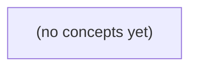

# 01.10 Go泛型与可复用算法：从本地IM消息查询到类型约束

*面向 Go 技术栈初学者，以虚构的本地 IM 消息工具为连续案例，从具体的 FindMessage 函数出发，逐步理解 First[T any]、类型推断、零值返回、约束、类型集合与泛型容器。教材包含八节递进理论、22 道附答案练习，并明确泛型不会改变既有 IM 业务状态码、进程内存边界和并发责任。*

**章节:** 2

---

## 本书导览

- 了解整本书的章节脉络
- 掌握各章之间的概念依赖关系
- 选择最合适的阅读顺序

# 01.10 Go泛型与可复用算法：从本地IM消息查询到类型约束

面向 Go 技术栈初学者，以虚构的本地 IM 消息工具为连续案例，从具体的 FindMessage 函数出发，逐步理解 First[T any]、类型推断、零值返回、约束、类型集合与泛型容器。教材包含八节递进理论、22 道附答案练习，并明确泛型不会改变既有 IM 业务状态码、进程内存边界和并发责任。

下方的概念图展示了本书 0 个核心概念以及它们之间的依赖关系；再下方是 1 个章节的入口。你可以按从上到下的顺序阅读，也可以根据自己的兴趣或先验知识选择切入点。

#### 概念图



## 章节索引

- **01.10 泛型与可复用算法：什么时候为IM代码加类型参数** — 面向Go初学者，从具体消息查找进入类型参数、约束、类型集合、comparable、泛型容器、接口取舍和Go1.27方法版本边界。

## 01.10 泛型与可复用算法：什么时候为IM代码加类型参数

- 从重复的具体算法推导泛型动机
- 解释类型参数声明、调用、推断和零值返回
- 区分any、comparable、~、类型并集及可用操作
- 设计泛型Set/Queue并保留资源和业务边界
- 比较具体函数、接口、泛型和标准库
- 明确Go1.27具体泛型方法新能力与旧代码的区别

从本地 IM 的消息查找出发，先写清楚具体函数，再判断何时值得抽取为保留类型信息的泛型算法。

### 先写具体的消息查找函数

### 先写具体的消息查找函数

先不急着使用泛型。假设本地 IM 工具保存消息：

```go
type Message struct {
	ID   string
	Text string
}

func FindMessage(messages []Message, id string) (Message, bool) {
	for _, message := range messages {
		if message.ID == id {
			return message, true
		}
	}

	return Message{}, false
}
```

这个函数有两个输入：消息切片 `messages` 与目标 ID `id`。`for _, message := range messages` 按顺序检查每条消息；一旦 `message.ID == id`，立刻返回该消息和 `true`。因此，它找的是**第一条**匹配消息，而不是全部匹配项。

调用时应检查第二个返回值：

```go
message, ok := FindMessage(messages, "m-102")
if !ok {
	// 未找到该消息
	return
}

fmt.Println(message.Text)
```

未找到时返回 `Message{}` 和 `false`。`Message{}` 是 `Message` 的零值：其中 `ID`、`Text` 都是空字符串。关键不在于猜测零值是否“像一条有效消息”，而在于以 `ok` 明确区分“找到”与“没找到”。

此时使用具体类型最清楚：参数就是 `[]Message`，结果就是 `Message`。只有当相同的遍历与首项返回逻辑还要用于 `[]Conversation` 等其他元素类型时，才值得进一步考虑泛型。

### 重复的是流程，不是数据

### 重复的是流程，不是数据

先为消息写一个具体函数，逻辑清楚且类型直接：

```go
func FindMessage(messages []Message, id string) (Message, bool) {
	for _, m := range messages {
		if m.ID == id {
			return m, true
		}
	}
	return Message{}, false
}
```

现在又要在会话列表中找第一项。会话的字段、查询条件都可能不同，例如按参与者数量匹配：

```go
func FindConversation(conversations []Conversation, n int) (Conversation, bool) {
	for _, c := range conversations {
		if len(c.Members) == n {
			return c, true
		}
	}
	return Conversation{}, false
}
```

两段代码的**数据**并不相同：

- 元素类型分别是 `Message` 与 `Conversation`；
- 判断条件分别是 `m.ID == id` 与 `len(c.Members) == n`；
- 找不到时的零值也随返回类型变化。

但它们的**流程**完全一致：从头遍历切片；对每个元素做判断；命中就立即返回该元素和 `true`；遍历结束则返回零值和 `false`。

这正是考虑泛型的边界：不是因为 `Message` 和 `Conversation` “长得像”，而是因为“找第一项”的控制流程已经重复。若项目里只有消息查找，`FindMessage` 往往最易读；当多种具体类型都需要同一套遍历与提前返回流程时，才值得把变化部分——元素类型与匹配条件——抽出来。

### 用类型参数抽取 First 算法

### 用类型参数抽取 `First` 算法

先看两段具体代码。它们都“从切片开头遍历，遇到满足条件的第一项就返回”；不同之处只有元素类型和判断条件：

```go
func FindMessage(messages []Message, id string) (Message, bool) {
	for _, m := range messages {
		if m.ID == id {
			return m, true
		}
	}
	return Message{}, false
}

func FindConversation(conversations []Conversation, title string) (Conversation, bool) {
	for _, c := range conversations {
		if c.Title == title {
			return c, true
		}
	}
	return Conversation{}, false
}
```

当这种控制流程已在多个具体类型上重复时，可以把“元素类型”和“是否匹配”的部分参数化：

```go
func First[T any](items []T, match func(T) bool) (T, bool) {
	for _, item := range items {
		if match(item) {
			return item, true
		}
	}
	var zero T
	return zero, false
}
```

`[T any]` 出现在函数声明处，表示引入类型参数 `T`。`any` 表示此处不要求 `T` 具备特定能力；函数体只做遍历、传递给 `match`、返回，因此不需要比较、加法等额外约束。

调用时可显式给出类型实参：

```go
msg, ok := First[Message](messages, func(m Message) bool {
	return m.ID == id
})
```

但 Go 通常能从 `messages []Message` 推断出 `T` 是 `Message`，所以更常写成：

```go
msg, ok := First(messages, func(m Message) bool {
	return m.ID == id
})
```

同一个 `First` 用于会话时，返回类型会自然变成 `Conversation`：

```go
conv, ok := First(conversations, func(c Conversation) bool {
	return c.Title == title
})
```

找不到时，`var zero T` 产生 `T` 的零值：`Message` 得到 `Message{}`，`Conversation` 得到 `Conversation{}`。但零值本身不能可靠表示“没找到”，因此必须结合 `bool` 判断：只有 `ok == true` 时，第一个返回值才是匹配结果。

### 方括号与约束限定能力

### 方括号与约束限定能力

Go 中相似的方括号出现在不同位置，含义完全不同：

- `[]Message`：切片类型，表示“由若干 `Message` 组成的序列”。
- `func First[T any](items []T, ok func(T) bool) (T, bool)`：`[T any]` 是**类型参数声明**。`T` 是暂时未知的元素类型，`any` 是它的约束。
- `First[Message](messages, match)`：`[Message]` 是**类型实参**，把 `T` 指定为 `Message`。多数时候编译器能从 `messages` 推断它，直接写 `First(messages, match)` 即可。

`any` 的意思不是“函数体里可以对任何值做任何事”，而是“`T` 可以是任意具体类型”。因此，函数体只能使用对所有类型都安全的操作：

```go
func First[T any](items []T, match func(T) bool) (T, bool) {
	for _, item := range items {
		if match(item) {
			return item, true
		}
	}
	var zero T
	return zero, false
}
```

这里可以遍历 `[]T`、把 `T` 传给 `match`、返回 `T`，也可以声明零值 `var zero T`。但不能直接写 `item.ID`：并非每一种 `T` 都有 `ID` 字段；通常也不能写 `item == other`，因为切片、映射等类型不可比较。

匹配条件被交给 `func(T) bool`，正是为了避免假设所有元素都有相同字段。若算法确实需要比较、排序或算术运算，就应改用能保证这些能力的更具体约束，而不是把所有类型都声明为 `any`。

### 只在确有类型族时泛化

### 只在确有类型族时泛化

只有消息需要按 ID 查找时，具体函数最清楚：

```go
func FindMessage(messages []Message, id string) (Message, bool) {
	for _, m := range messages {
		if m.ID == id {
			return m, true
		}
	}
	return Message{}, false
}
```

它直接表达业务：输入消息列表和消息 ID，输出第一条匹配消息。此时写泛型反而会多出类型参数、谓词等概念，却没有消除重复。

不要为了“通用”先改成 `[]any`：

```go
func FindAny(items []any, id string) (any, bool)
```

调用者取回结果时还要断言：

```go
v, ok := FindAny(items, id)
m, ok := v.(Message)
```

这会把原本编译期已知的 `Message` 类型推迟到运行时检查；混入 `Conversation` 或其他值时，断言可能失败。

当 `[]Message`、`[]Conversation` 等多种切片都需要“从左到右找第一项，命中即返回”的控制流程时，才值得抽取：

```go
func First[T any](items []T, match func(T) bool) (T, bool) {
	for _, item := range items {
		if match(item) {
			return item, true
		}
	}
	var zero T
	return zero, false
}
```

调用 `First(messages, func(m Message) bool { return m.ID == id })` 得到的仍是 `Message`；传入会话切片则得到 `Conversation`。泛型复用的是遍历算法，而匹配规则仍由具体业务提供。

> **要点** — 泛型不是替代具体函数；当多个具体类型共享同一算法流程时，才用类型参数复用代码并保留静态类型。

从消息查找的重复代码出发，认识如何用类型参数抽取“遍历并匹配”的共同算法，同时保持调用处的类型安全与清晰语义。

### 从具体消息查找识别重复

### 从具体消息查找识别重复

先看一个只服务于消息的查找函数：

```go
type Message struct {
	ID string
}

func FindMessageByID(items []Message, id string) (Message, bool) {
	for _, m := range items {
		if m.ID == id {
			return m, true
		}
	}
	return Message{}, false
}
```

它的语义很直接：依次遍历 `items`，找到 `ID` 等于目标值的第一条消息，并返回“结果 + 是否找到”。

但类似需求很快会出现：

- 按 `ID` 查找消息；
- 按发送者查找消息；
- 查找未读消息；
- 查找正文包含某个词的消息；
- 在 `[]User`、`[]Order`、`[]Task` 中做同样的查找。

这些函数表面不同，实际可分成两部分：

1. **稳定的遍历流程**：从前到后检查每个元素；命中即返回；全部未命中则返回失败。
2. **变化的匹配条件**：`m.ID == id`、`m.Unread`、`contains(m.Text, word)` 等。

例如，按未读状态查找时，循环几乎不变：

```go
func FindUnread(items []Message) (Message, bool) {
	for _, m := range items {
		if m.Unread {
			return m, true
		}
	}
	return Message{}, false
}
```

这里重复的不是“消息字段”，而是“在切片中找到第一个满足条件的元素”这一算法。应当保留调用者对匹配条件的控制权，同时把稳定流程抽取出来。泛型版本的 `First` 正是为这种重复而设计：元素类型可以变化，判断规则也可以变化，遍历骨架只写一次。

### 声明 First 的类型参数

### 声明 `First` 的类型参数

`First` 的声明把“遍历切片、找到第一个匹配项”写成可复用算法：

`func First[T any](items []T, match func(T) bool) (T, bool)`

其中 `[T any]` 声明了类型参数 `T`：

- `T` 是一个类型占位符，不是运行时变量。
- `any` 表示 `T` 可以是任意类型；它等价于 `interface{}`，这里不要求元素具备特定方法或字段。
- 虽然函数可用于多种类型，但**一次具体调用中，`T` 始终是确定的单一类型**。

例如传入 `[]Message`：

`First(messages, func(m Message) bool { return m.ID == "m-2" })`

编译器会由 `messages` 推断出 `T = Message`。于是本次调用等价于理解为：

`func(items []Message, match func(Message) bool) (Message, bool)`

因此，`items []T` 表示“元素类型为 `T` 的切片”，而 `match func(T) bool` 表示“接收一个 `T`，判断它是否匹配”。回调中的参数 `m` 自然就是 `Message`，可以安全访问 `m.ID`。

返回值 `(T, bool)` 也随之具体化为 `(Message, bool)`：第一个值是找到的消息，第二个值说明是否找到。泛型没有削弱类型信息；相反，它让同一个算法在不同元素类型下仍保留精确的静态类型检查。

### 让编译器推断 Message

### 让编译器推断 `Message`

调用 `First` 时，通常无需手动填写类型实参：

`got, ok := First(messages, func(m Message) bool { return m.ID == "m-2" })`

编译器观察第一个参数 `messages` 的类型是 `[]Message`，而函数形参是 `[]T`，即可推出：

`T = Message`

因此，这次调用实际等价于：

`got, ok := First[Message](messages, func(m Message) bool { return m.ID == "m-2" })`

推断完成后，所有与 `T` 相关的位置都会统一为 `Message`：

- `items` 是 `[]Message`；
- 循环中的 `item` 是 `Message`；
- 匿名函数参数 `m` 是 `Message`；
- 返回的 `got` 也是 `Message`；
- 未找到时返回的零值是 `Message{}`。

匿名函数的类型也必须匹配 `func(T) bool`。当 `T` 被推断为 `Message` 后，匹配函数自然应当接收 `Message` 并返回 `bool`：

`func(m Message) bool { return m.ID == "m-2" }`

显式写成 `First[Message](...)` 同样正确，但多数情况下更冗长。只有当实参不足以让编译器确定 `T`、或者显式类型能显著帮助读者理解意图时，才考虑写出 `[Message]`。

### 用函数值保留匹配策略

### 用函数值保留匹配策略

`First` 不需要知道消息的字段，也不应把“按 ID 找”“按发送者找”“按状态找”等业务规则写死。它只做一件稳定的事：从前到后遍历切片，并在某个元素满足条件时立即返回。

```go
func First[T any](items []T, match func(T) bool) (T, bool)
```

其中，`match func(T) bool` 是一个函数值参数：

- 输入：当前检查的元素，类型为 `T`；
- 输出：该元素是否匹配，`true` 表示找到；
- 提供者：调用 `First` 的代码，而不是 `First` 本身。

例如，按消息 ID 查找：

```go
got, ok := First(messages, func(m Message) bool {
	return m.ID == "m-2"
})
```

这里匿名函数表达的是具体业务策略：`m.ID == "m-2"`。`First` 接收到这个策略后，对每个 `Message` 调用它；一旦结果为 `true`，就返回该消息。

同一个搜索算法可以搭配不同条件：

```go
got, ok := First(messages, func(m Message) bool {
	return m.ID != ""
})
```

因此，泛型负责复用“遍历 `[]T`”的结构，函数值负责变化的“如何判断”。这使 `First` 保持通用，又不会牺牲调用处的类型安全：传入 `[]Message` 时，`match` 必须能接收 `Message`。

### 处理未找到结果的零值

### 处理未找到结果的零值

`First` 找不到匹配项时执行：

`var zero T`

这会创建当前类型参数 `T` 的零值：若 `T` 是 `Message`，零值是 `Message{}`；若是 `int`，零值是 `0`；若是 `string`，零值是 `""`。因此函数无论处理什么切片，都能返回一个类型正确的结果：

`return zero, false`

关键不在于零值本身，而在于第二个返回值 `bool`。调用者必须通过 `ok` 判断结果是否有效：

`got, ok := First(messages, match)`

`if !ok { /* 没有找到 */ }`

不能仅凭 `got == Message{}` 判断失败，因为零值也可能是切片中真实存在且满足条件的元素。类似地，查找整数时，`0` 既可能表示“没找到”，也可能就是找到的值。

另一种设计是返回 `*T`：找到时返回元素地址，未找到时返回 `nil`。这适合结果天然以指针使用、或需要区分“无对象”的场景；但对切片元素取地址还要注意元素后续扩容和修改的语义。对于普通的值查找，`(T, bool)` 更直接，也不引入空指针检查。

`error` 则适合“未找到”意味着异常或业务失败的场景，例如必须存在的消息编号不存在。若“未找到”只是正常查询结果，使用 `bool` 比构造错误更清晰：零值提供可返回的 `T`，`bool` 明确说明它是否可用。

> **要点** — 泛型应抽取稳定算法；类型相关规则由类型参数、约束和回调函数共同表达。

约束决定类型参数能接纳什么值，也决定泛型函数内部可以安全执行哪些操作。

### 从可执行操作反推约束

### 从可执行操作反推约束

设计类型参数时，不应先问“它能接收多少类型”，而应先问“函数体必须对值做什么”。约束是对**可执行操作**的承诺：

- **只保存、传递或原样返回值**：使用 `any` 即可。函数并不依赖值的具体能力。  
  `func First[T any](xs []T) T { return xs[0] }`

- **需要相等比较 `==` 或 `!=`**：使用 `comparable`。它保证类型参数的值可以比较：  
  `func Same[T comparable](a, b T) bool { return a == b }`

- **需要作为 `map` 的键**：同样需要 `comparable`，因为 Go 的映射键必须可比较：  
  `type Set[K comparable] map[K]struct{}`  
  `func (s Set[K]) Add(k K) { s[k] = struct{}{} }`

  `[]byte` 虽然常用于表示标识符，却不能作映射键；切片不能用 `==` 比较，也不满足 `comparable`。通常可改用 `string`，或将字节内容转换为字符串键。

- **需要用 `<`、`>` 排序或求最小值**：`comparable` 不够，因为它只保证相等比较，不保证大小关系。约束必须限定为所有候选类型都支持同一种有序比较，例如由若干数值类型和字符串类型组成的类型集合。

当接口只写 `string` 时，它只允许精确的 `string`；而：

`type StringID interface{ ~string }`

表示“底层类型是 `string` 的所有类型”。因此 `string` 与：

`type MessageID string`

都能代入：

`func SameID[T StringID](a, b T) bool { return a == b }`

`MessageID` 是新定义类型，不是 `string` 的别名；`~string` 正是让这类领域类型保留类型安全、又能复用算法的关键。

### any 与 comparable 的边界

### any 与 comparable 的边界

`any` 表示“不预先限制具体类型”。当泛型代码只负责接收、保存、返回或转交值，而不依赖值本身的比较规则时，使用 `any` 最合适：

```go
func First[T any](xs []T) T {
	return xs[0]
}
```

这里函数体只读取并返回 `T`，因此 `int`、`string`、结构体、切片都可以代入。

但一旦函数体要写 `a == b` 或 `a != b`，约束就不能还是 `any`。并非所有 Go 类型都支持相等比较；切片、映射和函数通常不能互相用 `==` 比较。因此应写成：

```go
func Same[T comparable](a, b T) bool {
	return a == b
}
```

`comparable` 保证所有可代入的类型都能使用 `==` 与 `!=`。它也正是映射键所需的约束：

```go
type Set[K comparable] map[K]struct{}

func (s Set[K]) Add(k K) {
	s[k] = struct{}{}
}
```

若 `K` 仅约束为 `any`，编译器无法保证 `k` 能作为 `map` 键。

特别要注意：`[]byte` 虽然常用于表示文本或二进制数据，却是切片类型，不能比较内容，也不能作为 `map` 键：

```go
// map[[]byte]struct{} // 非法
```

若需要以字节内容建立集合，通常应转换为 `string`，或使用固定长度数组如 `[16]byte`。选择约束的原则是：只搬运值用 `any`；需要相等比较、去重或映射键时用 `comparable`。

### 类型集合与 ~string

### 类型集合与 `~string`

约束接口中的类型项描述的不是“一个类型”，而是一组允许实参类型构成的**类型集合**。精确类型项只包含该类型本身：

`interface{ string }`

它只允许预定义类型 `string`，不包含：

`type MessageID string`

因为 `MessageID` 是定义出的新类型；它与 `string` 具有相同底层类型，却不是同一个类型。

`~string` 改为按底层类型匹配：

`type StringID interface{ ~string }`

波浪号表示集合中包含所有“底层类型为 `string`”的类型。因此下面两者都满足 `StringID`：

- `string`
- `MessageID`
- 其他以 `string` 为底层类型定义的新类型

```go
type MessageID string

func SameID[T StringID](a, b T) bool {
	return a == b
}
```

这里 `T` 的每个可能类型都具有字符串底层类型，均可比较，所以函数体可以安全使用 `==`。调用 `SameID(MessageID("m-1"), MessageID("m-1"))` 时，编译器可推断 `T` 为 `MessageID`，并保留该定义类型，而非悄悄退化为 `string`。

类型项还可用 `|` 形成并集，例如 `interface{ ~string | ~int }` 接纳字符串底层或整数底层的类型。泛型函数体只能使用并集中**所有候选类型都支持**的操作；约束越宽，函数内部可安全依赖的操作通常越少。

### 为消息标识编写 SameID

### 为消息标识编写 SameID

消息标识常以字符串表示，但直接使用 `string` 容易混淆不同领域的值。可以定义专门的类型：

```go
type MessageID string
```

这不是给 `string` 起别名，而是定义一个新类型。`MessageID` 可以与字符串相互转换，却不能在所有场景中自动当作 `string` 使用；这能让函数签名更清楚地表达“这里需要消息标识”。

若希望比较普通字符串以及所有“底层类型为字符串”的定义类型，可声明类型集合约束：

```go
type StringID interface {
	~string
}

func SameID[T StringID](a, b T) bool {
	return a == b
}
```

类型参数 `T` 后的 `StringID` 就是约束。它说明两件事：

- 调用者只能传入底层类型为 `string` 的类型；
- 在函数体中，`a` 与 `b` 一定支持 `==`，因此比较是安全的。

`~string` 中的波浪号表示“底层类型是 `string`”。所以以下调用都成立：

```go
SameID("m-1", "m-1")
SameID(MessageID("m-1"), MessageID("m-1"))
```

第二个调用无需显式写出 `T`：编译器从两个实参推断出 `T` 为 `MessageID`。

相对地，若约束写成精确类型项：

```go
type OnlyString interface {
	string
}
```

它只接纳 `string` 本身，不包含 `MessageID`。因此，选择 `string` 还是 `~string`，取决于算法是否应当接受基于字符串定义的领域类型。

### 约束驱动的 Set 设计

### 约束驱动的 Set 设计

集合的核心能力是“记录某个键是否出现过”。在 Go 中，最直接的表示是 `map[K]struct{}`；因此键类型 `K` 必须能作为 `map` 的键：

```go
type Set[K comparable] map[K]struct{}

func (s Set[K]) Add(k K) {
	s[k] = struct{}{}
}

func (s Set[K]) Has(k K) bool {
	_, ok := s[k]
	return ok
}
```

`comparable` 表示该类型的值可用 `==`、`!=` 比较，也符合普通 `map` 键的要求。于是下面的类型都可用于 `Set`：

- `Set[string]`：保存文本键；
- `Set[int]`：保存数字编号；
- `Set[MessageID]`：保存业务定义的消息标识；
- `Set[*User]`：按指针身份去重。

但并非所有类型都能成为键。切片、映射和函数不能比较，因此不能实例化为 `Set[[]byte]`、`Set[map[string]int]` 等。尤其是 `[]byte` 常用于二进制标识，却不能直接作键；需要先转换为 `string`，或设计固定长度数组等可比较表示。

```go
type MessageID string

seen := Set[MessageID]{}
seen.Add(MessageID("m-1"))
```

这里 `MessageID` 是独立定义的新类型，而非 `string` 的别名。`Set[K comparable]` 不关心键是否具有业务语义，只保证“可判等、可索引”。若业务函数只接受字符串类标识，则应额外定义更窄的约束：

```go
type StringID interface{ ~string }

func SameID[T StringID](a, b T) bool {
	return a == b
}
```

`~string` 接纳底层类型为 `string` 的类型，因此 `string` 与 `MessageID` 都可传入。容器约束负责通用存储能力；业务约束负责表达领域规则，二者不应混为一谈。

> **要点** — 约束不是泛型装饰：它以类型集合限定可代入类型，并保证函数体中的操作始终成立。

类型并集不是把不同值混在一起处理，而是声明算法可接受的类型范围，并以所有候选类型共同支持的操作为边界。

### 从可排序键理解类型并集

### 从可排序键理解类型并集

IM 系统常要比较两类“键”：例如递增的时间序号 `int64`，以及文本形式的消息 ID `string`。它们的表示不同，但都支持 `<`，因此可以把“可排序”抽象成一个约束：

```go
type OrderedKey interface {
	~int64 | ~string
}

func Before[K OrderedKey](a, b K) bool {
	return a < b
}
```

`|` 表示类型项的并集：`K` 可以是底层类型为 `int64` 的类型，也可以是底层类型为 `string` 的类型。`~` 很重要，它允许业务定义自己的键类型：

```go
type MessageSeq int64
type MessageID string
```

二者都可传给 `Before`，无需为每个命名类型重复实现比较逻辑。

不过，“并集”不表示一次调用可以混放不同类型。下面的调用合法：

```go
Before(MessageSeq(101), MessageSeq(102))
Before(MessageID("m-9"), MessageID("m-10"))
```

而 `Before(MessageSeq(101), MessageID("m-10"))` 不合法：一次实例化后的 `K` 必须是一个具体类型，而非“`int64` 或 `string` 的运行时混合值”。

编译器还会检查函数体中的操作是否对约束内每种可能类型都成立。`int64` 和 `string` 都能使用 `<`，所以 `Before` 合法；若加入 `~[]byte`，切片不能比较大小，整个函数体便无法通过编译。

最后，类型可比较不等于业务上应当比较。文本消息 ID 的字典序未必代表发送时间顺序；排序键应首先反映业务语义，再考虑是否用泛型复用算法。

### 共同操作决定函数体边界

### 共同操作决定函数体边界

约束描述的不是某个确定类型，而是类型参数 `K` **可能取值的类型集合**。因此，编译器检查泛型函数体时不能假设 `K` 恰好是 `int64`，也不能假设它恰好是 `string`；它只能批准那些对集合中每一种候选类型都合法的操作。

```go
type OrderedKey interface {
	~int64 | ~string
}

func Before[K OrderedKey](a, b K) bool {
	return a < b
}
```

这里的类型集合可理解为：

$$K \in \{\text{底层类型为 int64 的类型}\} \cup \{\text{底层类型为 string 的类型}\}$$

`int64` 支持 `<`，`string` 也支持 `<`；自定义类型只要底层类型分别是它们之一，同样保留这种比较能力。因此 `a < b` 对所有可能的 `K` 都成立，函数体合法。`~` 的作用正是放宽“必须恰好是预声明类型”的限制：

```go
type MessageSeq int64
type MessageID string

Before(MessageSeq(12), MessageSeq(20)) // 合法
Before(MessageID("m-12"), MessageID("m-20")) // 合法
```

但一次调用会推导出一个具体的 `K`。不能在同一次调用中把 `int64` 序号和 `string` 标识符混合比较，因为参数 `a`、`b` 必须具有同一个 `K`。

若扩展约束：

```go
type BadKey interface {
	~int64 | ~string | ~[]byte
}
```

则 `a < b` 立即不再合法：切片 `[]byte` 不支持 `<`。即使前两类键能比较，也不足以让编译器接受该函数；泛型函数体必须站在所有候选类型的共同能力上。

这也提醒我们：语法可比较不等于业务应比较。文本消息 ID 的字典序通常不代表发送时间；排序键应首先由业务语义决定，再选择能表达该语义的约束。

### 一次实例化只对应一种键类型

### 一次实例化只对应一种键类型

`OrderedKey` 的 `int64 | string` 表示 `K` 可以选其中任一种类型；它不表示一次调用中两个参数可以分别取不同类型。

```go
type OrderedKey interface {
	~int64 | ~string
}

func Before[K OrderedKey](a, b K) bool {
	return a < b
}
```

下面两次调用都会分别推导出一个确定的 `K`：

```go
Before(int64(120), int64(305)) // K 为 int64：按数值比较时间序号
Before("msg-120", "msg-305")   // K 为 string：按字典序比较文本 ID
```

但不能写成：

```go
Before(int64(120), "msg-305") // 编译错误：无法为 K 推导同一种类型
```

原因是函数签名中的两个参数都是 `K`。一次实例化可理解为编译器生成了“只处理 `int64` 键”的版本，或“只处理 `string` 键”的版本；不会生成一个允许左右两侧类型不同的“混合比较”版本。

自定义类型同样如此：

```go
type MessageSeq int64

Before(MessageSeq(8), MessageSeq(21)) // K 为 MessageSeq
```

`~int64` 允许 `MessageSeq` 参与，因为它的底层类型是 `int64`。不过类型可比较不代表业务含义可互换：数值序号通常表达先后，而字符串 `MessageID` 的字典序未必等于消息发送顺序。

### 用交集继续收紧类型能力

### 用交集继续收紧类型能力

约束中并列嵌入的条件表示**交集**：类型参数必须同时满足每一项，而不是任选其一。例如：

```go
type OrderedKey interface {
	~int64 | ~string
	comparable
}
```

这里的候选类型仍是“底层类型为 `int64` 或 `string` 的类型”，只是再明确要求它们可比较。由于 `int64`、`string` 本来都满足 `comparable`，这个交集没有改变可接受范围；但它表达了算法还依赖 `==`、`!=` 等能力。

交集只能收紧集合，不能把不支持的操作“补出来”。设想希望同时接受数值序号、文本 ID 和二进制 ID：

```go
type Key interface {
	~int64 | ~string | ~[]byte
}

func Before[K Key](a, b K) bool {
	return a < b
}
```

这会在函数体报错。原因不是编译器不知道调用时会传入什么，而是 `K` 的类型集合现在包含 `[]byte` 及其自定义底层类型；切片可以与 `nil` 比较，却不能彼此使用 `<` 排序。泛型函数中的每个操作都必须对集合内**全部可能类型**合法，因此一个不支持 `<` 的类型项就足以否定该操作。

即使再嵌入 `comparable` 也无济于事：

```go
type Key interface {
	~int64 | ~string | ~[]byte
	comparable
}
```

此时交集会直接排除 `~[]byte`：切片不满足 `comparable`。约束或许重新只剩数值和字符串类型，`<` 才能成立；但这不是让字节切片获得排序能力，而是把它排除在算法适用范围之外。

若二进制消息 ID 需要排序，应显式定义比较规则，例如按字节逐位比较，或先转换为统一的可排序键。类型约束保证“操作可写”，业务规则则决定“这样的排序是否有意义”。

### 类型能力不等于业务语义

### 类型能力不等于业务语义

`~int64 | ~string` 表示“这些类型都可作为某类键”，而不是“它们在业务上具有相同排序含义”。泛型函数能够安全地写出：

`func Before[K OrderedKey](a, b K) bool { return a < b }`

因为数值和字符串都支持 `<`。但 `<` 的含义取决于具体类型：

- `int64` 序号通常按数值大小比较，适合递增消息序号、时间戳。
- `string` 按字节的字典序比较，适合格式被明确设计为可排序的键，例如固定宽度、从高位到低位编码的时间序号。
- 普通消息文本或任意字符串 ID 虽然也能比较，却未必代表发送先后。

例如 `"100"` 在字典序中小于 `"9"`，但作为十进制序号时应当更大；`"2025-01-02"` 可以按字典序反映日期先后，`"Jan-2"` 则不保证。泛型只验证“能否比较”，不会验证“比较结果是否符合产品规则”。

因此，只有当 `MessageID`、`ConversationID` 等类型确实共享同一种排序契约时，才适合统一约束。若消息 ID 按雪花算法数值排序、会话 ID 按字符串字典序展示、消息列表又必须按 `SentAt` 与业务序号排序，那么分别写清楚的函数往往更可靠：

- `BeforeMessageSequence`
- `BeforeConversationID`
- `SortMessagesBySentAt`

不要为了复用而把不同规则塞进一个 `K`，再用类型断言或分支补救。约束表达的是编译期类型能力；排序字段、同值处理和先后定义，仍应由业务语义决定。

> **要点** — 类型约束限定的是可用操作的共同边界；能比较不代表应比较，更不代表比较符合业务语义。

将队列规则与元素类型分离：用泛型复用入队、出队逻辑，同时明确它并不替代资源管理和业务设计。

### 从两份队列代码识别可复用边界

### 从两份队列代码识别可复用边界

假设 S4 同时需要缓存待处理的 `Message` 和待归档的 `Conversation`。若分别实现两份队列，代码往往只有元素类型不同：

- 入队：追加到切片尾部；
- 出队：读取首元素、移动队列视图；
- 空队列：返回“无元素”状态；
- 清理：弹出后清除底层数组对旧对象的引用。

真正可复用的是这套**先进先出规则**，而不是 `Message` 或 `Conversation` 本身。因此可以抽象为：

`Queue[T any]`，其中 `T` 仅表示“队列里装什么”。

```go
type Queue[T any] struct {
	items []T
}
```

`Push(v T)` 的规则对任何 `T` 都相同：把 `v` 放到末尾；`Pop() (T, bool)` 也遵循同一规则：为空时返回类型零值和 `false`，否则返回队首元素和 `true`。这使 `Queue[Message]` 与 `Queue[Conversation]` 共享实现，而调用处仍保留静态类型检查。

但不要把“结构相同”误判为“业务相同”。例如消息队列可能要求最大长度、按优先级丢弃、记录重试次数；会话队列可能要求按更新时间去重。这些规则依赖领域含义，应保留在具体类型或更高层服务中。泛型适合提取稳定、无业务语义的容器操作；一旦两份队列的入队条件、溢出策略或出队顺序不同，就不应强行共用同一个简单 `Queue[T]`。

### 定义 Queue[T any] 与零值语义

### 定义 `Queue[T any]` 与零值语义

队列的规则并不依赖元素是 `Message`、`Conversation` 还是其他值：都是尾部入队、头部出队。把元素类型提取为类型参数后，可写成：

`type Queue[T any] struct { items []T }`

`T` 表示调用者指定的元素类型；`any` 表示不施加额外约束，任意类型都可放入队列。内部的 `[]T` 随之成为对应元素的切片：`Queue[Message]` 使用 `[]Message`，`Queue[*Conversation]` 使用 `[]*Conversation`。

零值队列可直接使用：

`var q Queue[Message]`

此时 `q.items` 是 `nil` 切片，长度为零；对它执行 `Push` 时，`append` 会正常分配或扩容，因此不必专门构造初始化函数。

入队只接收一个 `T`：

`func (q *Queue[T]) Push(v T) { q.items = append(q.items, v) }`

出队需要同时表达“取出的值”和“是否成功”：

`func (q *Queue[T]) Pop() (T, bool)`

空队列不能凭元素值判断失败，因为零值本身可能是合法元素，例如 `0`、`""`、`nil` 或空结构体。因此约定空队列返回 `T` 的零值与 `false`：

`var zero T`
`return zero, false`

调用方应检查布尔值：

`msg, ok := q.Pop()`

只有 `ok` 为 `true` 时，`msg` 才表示一次实际出队的元素。

### 实现出队时的引用清理

### 实现出队时的引用清理

`Pop` 的目标不只是“返回第一个元素”，还要避免底层数组继续无意持有已经出队的对象。推荐按以下顺序处理：

```go
func (q *Queue[T]) Pop() (T, bool) {
	if len(q.items) == 0 {
		var zero T
		return zero, false
	}

	v := q.items[0] // 1. 先保存返回值

	var zero T
	q.items[0] = zero // 2. 清除底层数组中的旧引用

	q.items = q.items[1:] // 3. 逻辑上移除首元素
	return v, true
}
```

第一步必须先把 `q.items[0]` 保存到局部变量 `v`。因为后续会将该槽位写成零值；若先清理再读取，返回的将是零值，而不是原来的队首元素。

第二步的意义主要体现在 `T` 含有引用时。例如 `T` 是 `*Message`、`[]byte`、`map[string]any`，或包含这些字段的 `Conversation`。执行 `q.items = q.items[1:]` 后，切片长度虽然减少，但底层数组通常仍然存在，且原来的第一个槽位仍可能保留对旧对象的指针。只要该数组仍被队列切片引用，垃圾回收器就可能认为旧对象仍可达，造成不必要的内存滞留。

将槽位赋为 `zero` 会因类型不同产生对应零值：指针、切片、映射和接口会变为 `nil`；数值变为 `0`；结构体则按字段归零。这样，队列不再通过旧槽位持有已出队元素。

第三步才是切片前移：`q.items = q.items[1:]`。它只改变队列的逻辑视图，不会搬移剩余元素，也不会自动缩小底层数组容量。因此，引用清理解决的是“旧元素被意外持有”，并不解决长期大量出队后底层数组占用过大的问题；后者需要在合适时机重新整理或重建切片。

### 泛型队列仍需显式管理资源与并发

### 泛型队列仍需显式管理资源与并发

`Queue[T any]` 只抽象“元素是什么”，并不改变队列对底层切片、内存和并发的要求。若任务队列不能无限积压，应在入队时显式检查容量，而不是把 `append` 当作无条件成功：

`if len(q.items) >= q.limit { return false }`

这里的 `limit` 是业务背压策略的一部分：满队列时可以拒绝、阻塞、丢弃旧任务，或转交其他存储；不同策略不能由泛型自动推导。

出队通常会执行 `q.items = q.items[1:]`。这不会立刻释放原数组，连续出队后，切片仍可能保留一块很大的底层数组；若队列长期处于“曾经很大、现在很小”的状态，会造成内存滞留。对指针、切片、映射等引用类型元素，应先清空槽位：

`var zero T; q.items[0] = zero`

这能解除旧元素的引用，但不一定回收数组本身。可在队列清空时重置为 `nil`，或当剩余元素远少于已消耗空间时复制到新切片，以空间换取复制成本。

还要注意切片共享：若把内部 `items` 直接暴露给调用方，调用方可能修改元素、保留旧数组，甚至与队列扩容行为产生难以追踪的耦合。队列应只通过 `Push`、`Pop` 等方法暴露操作；需要快照时返回副本。

最后，这个实现是无锁的。多个协程同时 `Push`、`Pop` 会产生数据竞争，`len` 检查与 `append` 也不是原子操作。需要并发访问时，应由调用方串行化，或在队列内部加入互斥锁、条件变量及明确的满队列/空队列等待语义。

### 何时保留具体 MessageQueue

### 何时保留具体 `MessageQueue`

`Queue[T any]` 适合复用“先进先出”的机械规则：元素入队、从队首弹出、空队列返回 `(zero, false)`。当 `Message`、`Conversation` 等对象确实只需要这一规则时，泛型能避免重复实现。

但消息队列通常不只是容器。若入队必须校验消息 ID、拒绝过期消息、限制单个会话积压量，或按优先级、重试次数、发送时间排序，保留具体的 `MessageQueue` 往往更清晰：

```go
type MessageQueue struct {
	items []Message
	limit int
}

func (q *MessageQueue) Enqueue(m Message) error {
	if m.ID == "" {
		return errors.New("消息 ID 不能为空")
	}
	if len(q.items) >= q.limit {
		return errors.New("消息队列已满")
	}
	q.items = append(q.items, m)
	return nil
}
```

这里的 `Enqueue` 表达的是业务动作，而不只是 `Push`：调用者能看到校验失败、容量策略以及后续可能加入的限流、去重或优先级规则。把这些规则塞进通用 `Queue[T]`，通常会迫使它接受复杂回调、配置参数或特殊分支，反而削弱复用价值。

接口抽象应服务于调用方的真实依赖。例如消费者只关心“取得下一条可发送消息”，可定义小接口：

```go
type MessageSource interface {
	Next() (Message, bool)
}
```

接口不必暴露底层是泛型队列、具体队列还是远程消息系统。一个常见做法是：以 `Queue[Message]` 作为 `MessageQueue` 的内部实现，再由后者承担消息领域规则。泛型复用存储与 FIFO；具体类型守住业务语义；接口隔离使用方。

> **要点** — 泛型队列复用的是元素存取规则；内存、容量、并发和消息业务约束仍必须单独设计。

接口解决“行为可替换”，泛型解决“算法跨类型复用”。选择前先识别变化点，避免为唯一的 Message 类型过度抽象。

### 先辨别变化的是行为还是元素类型

### 先辨别变化的是行为还是元素类型

先问一句：未来会变的到底是什么？

- **读取历史的方式会变**：文件、数据库、远程 API、内存缓存都可能提供历史消息，但调用方只关心“能否读取”。这时变化点是**行为**，应使用接口：

  ```go
  type HistoryReader interface {
      Read() ([]Message, error)
  }
  ```

  `FileHistoryReader` 与 `DBHistoryReader` 只要都实现 `Read`，业务代码就能替换实现，而不必知道数据来自哪里。

- **查找算法面对的元素类型会变**：今天在 `[]Message` 中找第一条匹配消息，明天可能在 `[]User`、`[]Task` 中做同样的事。这里变化点不是读取方式，而是切片元素类型；“从切片中找第一个满足条件的元素”这一算法保持不变，适合泛型：

  ```go
  func First[T any](items []T, ok func(T) bool) (T, bool) {
      for _, item := range items {
          if ok(item) {
              return item, true
          }
      }
      var zero T
      return zero, false
  }
  ```

接口回答“**谁能做这件事**”；泛型回答“**同一件事能处理什么元素类型**”。

二者也可组合：例如泛型算法要求元素具备某个方法时，可用接口作为类型约束。但若整个包始终只处理唯一的 `Message`，直接写 `FirstMessage` 往往比设计复杂约束更清楚。先写具体代码；只有重复确实来自元素类型差异时，再提取泛型。

### 从具体 Message 查找识别泛型动机

### 从具体 `Message` 查找识别泛型动机

先写具体代码通常是合理起点。假设 IM 服务需要在消息列表中查找首个满足条件的元素：

```go
func FirstMessage(messages []Message, match func(Message) bool) (Message, bool) {
	for _, m := range messages {
		if match(m) {
			return m, true
		}
	}
	return Message{}, false
}
```

这里的合同很明确：找到时返回元素和 `true`；未找到时返回该类型的零值和 `false`。`bool` 不能省略，因为零值 `Message{}` 本身可能是合法消息，不能仅靠返回值判断是否命中。

后来，类似需求可能出现在会话、用户或附件上：

```go
func FirstUser(users []User, match func(User) bool) (User, bool)
func FirstSession(sessions []Session, match func(Session) bool) (Session, bool)
```

如果三者的循环、提前返回和“未找到”语义完全相同，变化的只有元素类型，那么重复不再表达业务差异；这正是泛型的动机。可抽取为：

```go
func First[T any](items []T, match func(T) bool) (T, bool) {
	for _, item := range items {
		if match(item) {
			return item, true
		}
	}
	var zero T
	return zero, false
}
```

调用处仍保留具体业务含义：

```go
msg, ok := First(messages, func(m Message) bool {
	return m.SenderID == userID
})
```

类型参数 `T` 只描述“容器中装什么元素”，`any` 表示算法不要求元素具备特殊方法、排序能力或字段。不要因为存在泛型就立刻改造：若包内永远只处理 `Message`，具体的 `FirstMessage` 往往更直白；当相同算法已稳定地跨多个元素类型重复时，`First[T]` 才真正减少维护成本。

### 泛型函数如何与接口约束协作

### 泛型函数如何与接口约束协作

泛型函数把“会变化的元素类型”写成类型参数。最宽松的约束是 `any`，表示算法不依赖元素具备任何特殊能力：

```go
func First[T any](items []T, ok func(T) bool) (T, bool) {
	for _, item := range items {
		if ok(item) {
			return item, true
		}
	}
	var zero T
	return zero, false
}
```

调用时通常不必显式写出 `T`，编译器会从 `[]Message` 和谓词参数推断：

```go
msg, found := First(messages, func(m Message) bool {
	return m.ID == wantedID
})
```

只有推断信息不足时，才需要显式指定类型，例如 `First[Message](...)`。

约束也可以要求类型提供某个方法。若算法需要读取对象的标识，而不关心对象具体是 `Message`、`ArchiveMessage` 还是其他实现，可声明一个小接口：

```go
type HasID interface {
	ID() string
}

func FindByID[T HasID](items []T, wanted string) (T, bool) {
	for _, item := range items {
		if item.ID() == wanted {
			return item, true
		}
	}
	var zero T
	return zero, false
}
```

这里接口定义的是“类型参数必须具有什么行为”，泛型定义的是“算法可处理哪些具体类型”。两者协作的前提是确有多种元素类型共享同一查找算法；若包内始终只有 `Message`，直接写 `func FindMessageByID([]Message, string)` 往往更清晰。

### 优先复用标准库而非自建抽象

### 优先复用标准库而非自建抽象

遇到重复代码时，先问“标准库是否已经表达了这个意图”，再决定是否写泛型工具。对 IM 消息列表而言，具体函数往往最清晰：

`findMessageByID(messages, id)` 直接写出查询字段、返回规则和业务语义；如果整个包只处理 `Message`，不必急于抽象成泛型 `First`。

当“从任意切片找第一个满足条件的元素”确实在多种元素类型间重复时，才考虑：

`First[T](items []T, ok func(T) bool) (T, bool)`

它的合同是返回元素及是否找到，调用方无需处理下标。标准库的 `slices.IndexFunc` 则返回匹配元素的下标，未找到为 `-1`：

`i := slices.IndexFunc(messages, predicate)`

需要删除、替换或继续访问原切片位置时，下标合同更合适；只关心元素是否存在时，`First` 或具体函数通常更直接。不要仅因两者都能“查找”就混用返回约定。

复制数据时优先使用 `slices.Clone` 与 `maps.Clone`，它们分别复制切片头部所指向的元素序列和映射条目，适合避免对原集合进行增删改。但它们都是**浅复制**：`[]*Message` 中的 `Message` 指针仍共享，`map[string][]byte` 中的字节切片也仍共享。若要隔离嵌套可变数据，必须逐层复制。

`slices`、`maps` 自 Go 1.21 起进入标准库；在采用前检查项目的目标 Go 版本。先选标准库，再写具体函数，最后才为已被证明跨类型重复的算法引入泛型。

### 为 IM 代码保留清晰的抽象边界

### 为 IM 代码保留清晰的抽象边界

先问“什么在变化”，再选工具。对 IM 领域中唯一的 `Message`，通常直接写具体代码最清楚：

```go
func LatestUnread(messages []Message) (Message, bool)
```

此处业务规则依赖消息状态、会话和时间；即使改成 `First[T]`，也不能消除这些领域判断。不要为了“可能复用”制造只服务于 `Message` 的复杂约束或泛型接口。

当变化的是**元素类型**，而算法不关心元素的业务含义时，泛型合适。例如首个匹配项、集合、去重、排序或克隆：

```go
func First[T any](xs []T, ok func(T) bool) (T, bool)
```

但优先检查标准库：`slices.IndexFunc` 可找出满足条件的下标，未找到返回 `-1`；`slices.Clone`、`maps.Clone` 可复制容器。它们在 Go 1.21 起可用，且 `Clone` 是浅复制：`Message` 内的指针、切片等引用数据仍可能共享。

当变化的是**数据来源或能力**，接口更自然。未读统计组件不应关心消息来自内存、数据库还是远程历史服务，只依赖读取行为：

```go
type Reader interface {
    Read(chatID string) ([]Message, error)
}
```

泛型与接口可以组合：泛型算法可要求类型具备某个方法；但只有确实存在多种类型、共享同一算法时才值得这样做。

可用一条决策线总结：业务规则绑定 `Message` 时写具体函数；算法跨元素类型时用泛型；实现或数据源可替换时用接口；已有 `slices`、`maps` 能表达需求时，优先使用标准库。

> **要点** — 行为变化用接口，元素类型变化才考虑泛型；先用具体代码和标准库，再为真实重复建立抽象。

泛型调用不必总写类型实参：能从参数推断时应保持简洁；无法推断时则必须显式说明类型，并应辨清其与新泛型方法的版本边界。

### 从消息查找看类型实参推断

### 从消息查找看类型实参推断

设项目中有一个可复用的查找函数：

`func First[T any](items []T, match func(T) bool) (T, bool)`

消息列表的类型是 `[]Message`，调用时可直接写：

`msg, ok := First(messages, func(m Message) bool { return m.ID == id })`

编译器会把第一个实参 `messages` 与形参 `[]T` 对照：既然 `messages` 是 `[]Message`，便可推出 `T` 必须是 `Message`。因此下面的显式写法通常没有必要：

`msg, ok := First[Message](messages, func(m Message) bool { return m.ID == id })`

推断并不是“看名字猜类型”，而是根据实参和泛型形参的结构统一类型。第二个参数同样提供约束：它必须能作为 `func(Message) bool` 使用。若条件函数写成接收其他类型，编译器会在调用处报错，而不会等到运行时。

这很适合消息、任务、用户等列表中的通用查找逻辑：算法只关心“遍历并测试元素”，具体元素类型由调用者传入的切片决定。业务规则仍留在条件中，例如按消息 ID 查找；重复 ID 应返回项目约定的 `409`，而不是借泛型改变现有错误语义。

### 何时省略，何时显式写类型

### 何时省略，何时显式写类型

调用泛型函数时，优先让编译器从实参推断类型：

```go
first, ok := First(messages, func(m Message) bool {
	return m.ID == targetID
})
```

这里 `messages` 的类型是 `[]Message`，谓词参数也是 `Message`，因此编译器可确定 `T` 为 `Message`。写成 `First[Message](messages, ...)` 也正确，但没有增加业务信息，通常更冗长。

可采用一个简单准则：

- 类型参数能由普通参数唯一确定：省略类型实参。
- 参数不足以确定类型，或存在歧义：显式写出类型实参。
- 不要期待运行时数据、返回值接收变量或接口中的实际值帮助“猜”类型；推断在编译期完成。

典型的无法推断场景是类型参数只出现在返回值中：

```go
func NewZero[T any]() T {
	var zero T
	return zero
}

msg := NewZero[Message]() // 必须显式指定 Message
```

`NewZero()` 没有携带 `T` 的普通参数。即使左侧写成 `var msg Message = NewZero()`，也不能把这种期待当作通用推断依据；应明确写 `NewZero[Message]()`。

显式类型实参也可用于提升阅读性，但应克制。对 `First(messages, ...)` 而言，`messages` 已经清楚表达元素类型；真正值得显式标注的是“调用现场无法提供类型线索”的工厂、零值或转换类函数。类型推断失败是编译错误，应修改调用表达式，而不是把问题留给运行时。

### 仅返回值出现的类型参数

### 仅返回值出现的类型参数

类型推断依赖调用实参提供的信息。若类型参数 `T` 出现在普通参数中，编译器可据此反推：

`First(messages, predicate)` 中，`messages` 的元素类型是 `Message`，因此可推断 `T` 为 `Message`，无需写成 `First[Message](...)`。

但下面的零值工厂没有任何普通参数：

`func NewZero[T any]() T`

调用 `NewZero()` 时，编译器只看到“调用一个需要确定 `T` 的函数”，却没有看到能说明 `T` 是什么的实参。即使结果被赋给变量，普通调用的推断也不会把左侧目标类型当作推断依据：

`var msg Message = NewZero()`  
`// 编译失败：无法推断 T`

应在调用点明确给出类型实参：

`msg := NewZero[Message]()`  
`id := NewZero[int]()`  
`empty := NewZero[[]string]()`  

这里返回的是对应类型的零值：`Message{}`、`0`、`nil`。这不是运行时“猜测”失败，而是编译器在编译期无法为 `T` 建立唯一类型。设计泛型函数时，若希望调用保持简洁，应尽量让类型参数出现在输入参数中；若函数本质上只按调用者指定类型构造值，就应接受显式写出 `[T]`。

### 推断失败是编译期设计信号

### 推断失败是编译期设计信号

Go 的类型推断只利用**调用点已经提供的静态信息**，主要是实参类型与目标赋值类型；它不会在运行时查看数据再“猜”出 `T`。

```go
func NewZero[T any]() T {
	var zero T
	return zero
}

msg := NewZero[Message]() // 必须显式指定
```

`NewZero()` 没有普通参数，返回值也尚未提供足够的推断上下文，因此编译器不知道 `T` 应是 `Message`、`User` 还是 `string`。这不是运行时错误，而是调用点缺少类型信息的编译期设计信号。

遇到这类情况，可按业务意图选择：

- **调用者本来就应决定类型**：保留泛型函数，并显式写 `NewZero[Message]()`。
- **类型可由输入决定**：让 `T` 出现在参数中，例如 `First(messages, predicate)`；`messages` 是 `[]Message`，因此可推断 `T` 为 `Message`。
- **业务对象类型固定**：直接提供具体构造函数，如 `NewMessage()`，比无参数泛型构造更清楚。
- **仅为避免重复零值代码**：通常直接声明 `var msg Message` 即可，无须抽象成泛型 API。

不要把推断失败理解为“泛型不够智能”。它常提示：函数没有表达出类型来源，或这个抽象并不适合当前 CLI 项目。类似地，重复 ID 的处理仍应明确映射为 `409`；泛型只能复用算法，不能替业务规则猜测类型或语义。

### 接收者类型参数与 Go 1.27 泛型方法

### 接收者类型参数与 Go 1.27 泛型方法

`Set[K]` 的方法并没有“新增”类型参数；它只是复用接收者所属泛型类型已经声明的 `K`：

```go
type Set[K comparable] map[K]struct{}

func (s Set[K]) Add(k K) {
	s[k] = struct{}{}
}
```

同理，`Queue[T]` 的 `Pop` 使用的是 `Queue[T]` 已有的 `T`：

```go
func (q *Queue[T]) Pop() (T, bool) {
	// ...
}
```

这类写法自 Go 1.18 起即可使用。`K`、`T` 的具体类型在创建或使用 `Set[string]`、`Queue[Message]` 时已经确定，方法调用不需要再为方法单独推断类型。

Go 1.27 新增的是另一种能力：**具体类型的方法可以自行声明新的类型参数**。概念上，它允许某个方法除复用接收者类型参数外，还拥有仅属于该方法的类型参数，例如一个具体容器可提供“映射为另一元素类型”的方法。这里的方法类型参数与接收者的 `T` 是两套不同的参数。

但边界仍然重要：

- 接口方法不能声明自己的类型参数；
- 带有新类型参数的具体方法，不能因此实现一个同名但非泛型的接口方法；
- 若 S1 CLI 的需求仅是 `Set[K].Add(K)`、`Queue[T].Pop() (T, bool)`，完全不必依赖 Go 1.27。

因此，项目中应优先选择最稳定、最直接的抽象：容器方法复用接收者参数即可。不要为了展示新语法改变业务规则；例如重复 ID 仍应按当前约定返回 `409`，而不是由泛型能力重新定义错误语义。

> **要点** — 类型推断依赖调用实参提供类型信息；无法推断就显式写类型实参，并勿混淆接收者泛型与 Go 1.27 新泛型方法。

从消息查找的重复代码出发，逐步建立泛型语法、约束设计与抽象取舍的判断框架。

### 从具体查找识别泛型动机

### 从具体查找识别泛型动机

先观察两段“看起来不同”的查找代码：

```go
func FindMessageByID(items []Message, id MessageID) (Message, bool) {
	for _, m := range items {
		if m.ID == id {
			return m, true
		}
	}
	return Message{}, false
}

func FindMessageBySender(items []Message, sender UserID) (Message, bool) {
	for _, m := range items {
		if m.Sender == sender {
			return m, true
		}
	}
	return Message{}, false
}
```

它们的元素类型同为 `Message`，但匹配规则不同：一个检查 `ID`，另一个检查 `Sender`。真正重复的并不是“按 ID 查找”，而是以下遍历骨架：

1. 依次读取切片元素；
2. 判断当前元素是否匹配；
3. 匹配时立刻返回；
4. 遍历结束后报告未找到。

因此，应该把业务条件交给调用方，把遍历保留在可复用函数中：

```go
func Find[T any](items []T, match func(T) bool) (T, bool) {
	for _, item := range items {
		if match(item) {
			return item, true
		}
	}
	var zero T
	return zero, false
}
```

查找消息时，`T` 可由 `[]Message` 自动推断为 `Message`：

```go
msg, ok := Find(messages, func(m Message) bool {
	return m.ID == id
})
```

这里的泛型动机不是“让任何类型都能访问 `ID` 字段”；`T any` 根本不保证存在该字段。泛型负责复用遍历算法，匿名函数负责表达具体业务规则。

返回值中的 `bool` 不可省略。未找到时返回的是 `T` 的零值，而零值可能恰好是合法元素；只有 `ok == false` 才明确表示查找失败。

### 类型参数、推断与零值结果

### 类型参数、推断与零值结果

把“在一组消息中查找元素”的算法抽出来时，变化的通常不是遍历过程，而是元素类型。泛型函数可在函数名后声明类型参数：

`func Find[T any](items []T, match func(T) bool) (T, bool)`

其中：

- `T` 是类型参数，可理解为“暂未确定的元素类型”；
- `any` 表示 `T` 可以是任意类型；
- `[]T` 表示“元素类型为 `T` 的切片”，不是某个具体切片类型；
- `match func(T) bool` 把业务判断交给调用方，遍历算法无需知道元素是否有 `ID`、`Name` 等字段。

调用时通常无需手写类型实参：

`msg, ok := Find(messages, func(m Message) bool { return m.ID == target })`

若 `messages` 的类型是 `[]Message`，编译器会由参数 `[]T` 与 `[]Message` 的对应关系推断出 `T=Message`。因此，泛型并非让类型消失，而是由调用点的已有类型补全类型参数。

查找函数不能只返回一个 `T`。若未找到时返回 `T` 的零值，调用方无法区分“确实找到零值元素”和“根本没找到”：

`v := Find(...) // 仅返回 T 时，v 是否有效？`

例如，`0`、`""`、`false`，甚至 `Message{}` 都可能是合法元素。更稳妥的结果是 `(T, bool)`：

- `value, true`：找到元素；
- `zeroValue, false`：未找到，其中 `zeroValue` 是 `T` 的零值，不应被当作结果本身解释。

因此应写成：

`msg, ok := Find(...)`

并以 `ok` 判断查找是否成功，而不是比较 `msg` 是否等于某个“空值”。

### 约束、类型集合与可用操作

### 约束、类型集合与可用操作

类型参数不是“任意类型的变量”，而是某个**类型集合**中的未知具体类型。约束决定集合边界，也决定函数体内哪些操作必然安全。

- `any` 表示所有类型，等价于 `interface{}`。因此只能做对所有类型都成立的操作，如赋值、传参；不能比较 `==`，也不能使用 `<`、索引或访问字段。
- `comparable` 表示所有可比较类型，可安全使用 `==` 与 `!=`，并可作为 `map` 的键。切片、映射、函数不可比较，所以不属于该集合。
- `~string` 中的 `~` 表示“底层类型为 `string`”。它不仅包含预声明类型 `string`，还包含 `type MessageID string` 这类定义类型；因此适合保留业务新类型而复用字符串算法。
- `~int | ~string` 是类型并集：参数可以是底层类型为 `int` 或 `string` 的类型。只有两侧类型都支持的操作才能写入泛型函数，例如 `<`；不能假定存在某个字段或方法。

可把推导规则记为：**操作必须对类型集合中的每一种可能类型都合法。**例如：

`func Min[T ~int | ~string](a, b T) T`

可以比较 `a < b`，因为整数和字符串都支持排序；但若约束改为 `any`，该比较立即失去保证。相反，`func Equal[T comparable](a, b T) bool` 可写 `a == b`，却不能写 `a < b`，因为布尔值、指针等虽可比较却不可排序。

约束应描述算法真正需要的能力：只判等用 `comparable`，需要保留底层表示时用 `~`，需要多类可用类型时用 `|`；不要因为“也许以后有用”而过度收紧集合。

### 用泛型实现集合与队列

### 用泛型实现集合与队列

集合的核心操作依赖 `map` 键，因此元素必须满足 `comparable`：

`type Set[T comparable] map[T]struct{}`

可提供 `Add`、`Has`、`Delete` 等方法；其中 `Add` 的本质是 `s[v] = struct{}{}`。但零值 `var s Set[MessageID]` 是空 `nil` map，可以读取和删除，却不能写入。需要先构造：`s := make(Set[MessageID])`，或由 `NewSet[T comparable]()` 返回已初始化的集合。

`comparable` 不等于“内置基本类型”。例如：

`type MessageID string`

它是新的定义类型，但底层类型为 `string`，仍可作为 `Set[MessageID]` 的元素；而 `[]string` 含切片，不能比较，不能作为集合键。

队列通常不要求比较能力，只需元素可存入切片：

`type Queue[T any] struct { data []T }`

`Enqueue` 追加元素，`Dequeue` 取首元素并返回 `(T, bool)`；`bool=false` 表示队列为空，因为 `T` 的零值可能本身就是有效元素。为避免首元素长期被底层数组引用，出队后可将原位置置零，再缩短切片。

构造函数可表达容量策略：`NewQueue[T any](capacity int)` 内部使用 `make([]T, 0, capacity)`。但类型参数只复用元素类型，不能自动解决并发：若队列需多协程访问，应在结构中另加锁，并明确方法是否保证并发安全。

复制也要谨慎。直接赋值队列是浅复制，两个队列可能共享同一底层数组；若需要独立副本，应复制切片内容，而不是只复制结构体字段。

### 何时抽象，以及版本边界

### 何时抽象，以及版本边界

比较三种写法时，先看变化点在哪里：

- **具体函数**：`FindMessage([]Message, id)` 最直接；只有一个业务类型、匹配规则固定时，不必为复用付出额外阅读成本。
- **接口**：当不同类型需要共享的是“行为”，例如都能 `Match(query)`、都能 `Save()`，接口比类型参数自然。接口值还适合运行时装配不同实现。
- **泛型函数**：当算法相同、仅元素类型不同，例如 `Find[T any]([]T, func(T) bool)`、`Set[K comparable]`，应让类型参数描述数据形状，让回调或约束描述可执行操作。
- **标准库**：排序、切片处理、映射与并发原语已有合适工具时，优先组合标准库；自建泛型容器不自动带来锁、容量策略或深拷贝语义。

抽象值得引入，通常要同时满足：重复至少跨越多个稳定类型；调用点能从参数自然推断类型；约束能准确表达操作；抽象后的名称仍比复制代码更容易读。若唯一调用者只是 `Message`，并且逻辑依赖 `Message.ID`，具体函数往往更诚实。

Go 1.27 中，方法可以定义在泛型类型上，并在接收者中声明其类型参数，例如 `func (s Set[K]) Has(k K) bool`。但方法不能额外引入独立的新类型参数；需要“输入类型与结果类型都可变”的操作时，通常写成泛型函数。旧版 Go（1.18 之前）没有类型参数，且使用旧语言版本或旧工具链的代码不能直接采用这些声明；迁移前还应确认 `go.mod` 的语言版本与构建环境一致。

> **要点** — 泛型应复用稳定算法，而业务字段、资源管理与行为差异仍应由具体设计承担。
