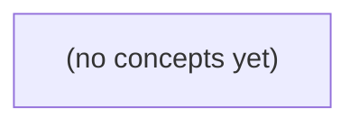

# 01.11 Go反射与底层边界

*面向 Go 初学者，以虚构 IM 消息 `Message` 的编解码过程为主线，理解接口动态值、`reflect.Type`、`reflect.Value`、可设置性、结构标签与 JSON 解码边界。教材进一步厘清反射、业务校验、内存布局和 `unsafe` 的职责边界，并配套 22 道含答案的分层练习。*

**章节:** 2

---

## 本书导览

- 了解整本书的章节脉络
- 掌握各章之间的概念依赖关系
- 选择最合适的阅读顺序

# 01.11 Go反射与底层边界

面向 Go 初学者，以虚构 IM 消息 `Message` 的编解码过程为主线，理解接口动态值、`reflect.Type`、`reflect.Value`、可设置性、结构标签与 JSON 解码边界。教材进一步厘清反射、业务校验、内存布局和 `unsafe` 的职责边界，并配套 22 道含答案的分层练习。

下方的概念图展示了本书 0 个核心概念以及它们之间的依赖关系；再下方是 1 个章节的入口。你可以按从上到下的顺序阅读，也可以根据自己的兴趣或先验知识选择切入点。

#### 概念图



## 章节索引

- **01.11 反射与底层边界：读懂消息编解码的运行期检查** — 面向Go初学者，从接口动态值进入reflect.Type/Value、可设置性、结构标签、encoding/json校验与unsafe尺寸边界。

## 01.11 反射与底层边界：读懂消息编解码的运行期检查

- 区分静态类型、动态类型、Type和Kind
- 解释ValueOf nil、typed nil、IsValid/IsNil前置
- 沿指针Elem与CanSet安全设置导出字段
- 读取StructTag并区分语法/字段/业务校验
- 说明unsafe.Sizeof不是序列化正文大小
- 按动态需求选择直接代码、标准库或反射

接口与泛型解决的是编译期已知的抽象；当编码器只拿到 any 并需检查实际类型、字段和标签时，才进入反射这条必须逐步验证的运行期路径。

### 从接口动态值到 Type 与 Kind

### 从接口动态值到 Type 与 Kind

反射的入口通常是接口值：函数参数写成 `any`，调用者却可能传入 `Message`、`*Message`、字符串或整数。接口值可理解为同时携带两部分信息：

- **静态类型**：变量在源码中的声明类型，例如 `var x any` 的静态类型始终是 `any`。
- **动态类型与动态值**：运行时实际装入接口的具体类型和值，例如 `x = Message{ID: 7, Body: "hello"}` 后，动态类型是 `Message`。

```go
v := any(Message{ID: 7, Body: "hello"})
t := reflect.TypeOf(v)
rv := reflect.ValueOf(v)
```

`reflect.TypeOf(v)` 得到类型描述 `t`；`reflect.ValueOf(v)` 得到值包装 `rv`。二者分工不同：`Type` 回答“它是什么类型、有哪些字段和标签”，`Value` 回答“它当前装着什么值、能否读取或修改”。

`Kind` 则是更粗粒度的分类。`Message` 是一个命名的具体类型，但其 `Kind()` 是 `reflect.Struct`；`*Message` 的 `Kind()` 是 `reflect.Ptr`；`[]byte` 的 `Kind()` 是 `reflect.Slice`。因此，通用编码器往往先按 `Kind` 分支：

```go
if t.Kind() != reflect.Struct {
    return errors.New("只接受结构体消息")
}
```

但仅检查 `Struct` 还不够：不同结构体字段完全不同，仍需继续检查字段名、导出性、标签及字段值类型。

反射适合“输入类型在编译期未知，但处理规则通用”的场景，如序列化、配置绑定、测试工具。若函数本来只处理 `Message`，应直接写 `m.Body`；这不仅更清楚，也避免字段不存在、指针为空、类型断言失败等运行期错误路径。

### ValueOf、nil 与有效性检查

### ValueOf、nil 与有效性检查

`reflect.ValueOf(x)` 把接口值 `x` 包装成运行期 `Value`。第一步不是立刻取字段，而是确认这个 `Value` 是否有效：

- `var x any = nil`：这是**nil 接口**。`reflect.ValueOf(x)` 得到零 `Value`，`v.IsValid()` 为 `false`。此时调用多数方法都会触发 panic，不能先调用 `Kind()`、`Elem()` 或 `Interface()`。
- `var p *Message = nil; var x any = p`：这是**带类型的 nil 指针**。接口本身非 nil，因为它仍携带 `*Message` 类型；`ValueOf(x)` 有效，`v.Kind()` 为 `reflect.Ptr`，且 `v.IsNil()` 为 `true`。
- `x := Message{ID: 1, Body: "ok"}`：普通结构体值有效，`v.Kind()` 为 `reflect.Struct`。但结构体不是可为 nil 的种类，调用 `v.IsNil()` 会 panic。

因此，通用检查应按“有效性 → 种类 → nil 性”推进：

`v := reflect.ValueOf(x)`；先判断 `!v.IsValid()`；再读取 `v.Kind()`；只有当种类是 `Ptr`、`Map`、`Slice`、`Func`、`Chan`、`Interface` 等可为 nil 的类型时，才可调用 `v.IsNil()`。

若编码器期待 `Message` 或 `*Message`，还应分别处理：结构体可直接检查字段；指针则必须先确认非 nil，再用 `v.Elem()` 取得其指向的结构体。反射中的 nil 不只有一种形态；忽略接口 nil 与底层指针 nil 的区别，正是通用编解码器常见的 panic 来源。

### 沿指针 Elem 安全修改字段

### 沿指针 `Elem` 安全修改字段

反射拿到值后，能否修改并不取决于字段类型，而取决于该 `reflect.Value` 是否**可设置**。把结构体按值传入时，反射看到的是副本；即使能读到 `Body`，也不能改回调用者的原对象。

```go
type Message struct {
	ID   int
	Body string
}

func setBody(x any, body string) error {
	v := reflect.ValueOf(x)
	if v.Kind() != reflect.Ptr || v.IsNil() {
		return fmt.Errorf("需要非空 *Message")
	}

	v = v.Elem() // 从 *Message 取得可寻址的 Message
	if v.Kind() != reflect.Struct {
		return fmt.Errorf("指针未指向结构体")
	}

	f := v.FieldByName("Body")
	if !f.IsValid() {
		return fmt.Errorf("缺少 Body 字段")
	}
	if !f.CanSet() {
		return fmt.Errorf("Body 字段不可设置")
	}
	if f.Kind() != reflect.String {
		return fmt.Errorf("Body 不是 string")
	}

	f.SetString(body)
	return nil
}
```

调用时必须传指针：

```go
m := Message{ID: 1, Body: "old"}
_ = setBody(&m, "new")
// m.Body == "new"
```

若传入 `m` 而不是 `&m`，`reflect.ValueOf(m)` 的种类是 `Struct`，其字段通常 `CanSet()==false`；对不可设置值调用 `SetString` 会触发运行时恐慌。因而运行期代码应先检查指针、空指针、`Elem()` 后的种类、字段有效性和 `CanSet()`。

还要区分“可寻址”与“可访问”：未导出字段即使位于可寻址结构体中，反射通常也不能安全设置。通用编码或解码逻辑应优先处理导出字段，并把标签、字段类型和赋值失败都当作普通错误返回，而不是假定任意 `any` 都能被修改。

### 结构标签与 JSON 校验的三层边界

### 结构标签与 JSON 校验的三层边界

结构标签是字段声明后的字符串元数据，例如：

`Body string \`json:"body,omitempty" limit:"6"\``

反射可经由 `reflect.Type` 取得字段，再读取其 `StructTag`：

`f, ok := t.FieldByName("Body")`  
`name, ok := f.Tag.Lookup("json")`

但标签不是类型系统的一部分；它只是约定文本。因此，通用编码或校验应分清三层边界。

1. **标签语法与解释边界**  
   `StructTag.Get("json")` 返回字符串；`Lookup` 还能区分“标签缺失”和“值为空”。读取到 `json:"body,omitempty"` 后，仍需由调用方或 `encoding/json` 解释逗号后的选项。自定义 `limit:"6"` 也必须自行解析，并处理非数字、负数、重复约定等错误。不要把标签内容当成天然可信的配置。

2. **字段存在与类型边界**  
   找到名为 `Body` 的字段，不等于它适合规则。校验器至少要确认字段存在、可导出，并检查 `f.Type.Kind()` 是否为 `string`、`[]byte` 等预期类型。若传入的是指针，还要先处理空指针并取得元素类型；若传入 `any` 的实际值不是结构体，应返回明确错误，而不是继续调用 `Elem` 或 `Field` 导致恐慌。

3. **业务规则边界**  
   `encoding/json` 负责按其规则编码、解码 JSON，包括识别 `json` 标签、忽略 `-` 字段和处理 `omitempty`；它不会理解 `limit:"6"`，更不会替你判断“Body 的 UTF-8 字节数不得超过 6”。这类约束属于应用规则，应在得到具体字段值后显式检查，例如对字符串使用 `len([]byte(body)) <= 6`。

因此，标签适合为通用工具提供“字段名、可选项、附加规则”的线索；真正的安全性来自逐层验证，而不是看到标签就假定消息已经合法。

### 尺寸、unsafe 与反射使用决策

### 尺寸、`unsafe` 与反射使用决策

“大小”必须先说明度量对象。`unsafe.Sizeof` 测的是 Go 值在当前实现中的内存表示，不是文本内容，也不是网络载荷：

```go
m := Message{ID: 7, Body: "你好"}
fmt.Println(unsafe.Sizeof(m))        // 结构体槽位、字符串头等的大小
fmt.Println(len(m.Body))             // 6：UTF-8 字节数
b, _ := json.Marshal(m)
fmt.Println(len(b))                  // JSON 完整字节数，含键名、引号、转义等
```

字符串字段通常只保存一个字符串头；其实际字符数据位于别处。因此 `unsafe.Sizeof(m)` 不会随 `Body` 从 `"a"` 变成一万字节而相应增长。它适合底层布局、对齐和运行时实现相关的诊断，**不适合**判断请求是否超过“6 字节”或 JSON 是否超过协议上限。并且结果会受架构、Go 实现和字段排列影响，不应写入跨进程协议。

对 `Body` 的 UTF-8 字节限制，直接写 `len([]byte(m.Body)) <= 6`，通常可简化为 `len(m.Body) <= 6`；Go 字符串的 `len` 本来就是字节数。若限制的是完整 JSON 请求，则必须序列化后检查 `len(jsonBytes)`，因为转义会改变长度。

选择路径可按信息已知程度判断：

- 已知是 `Message`：直接访问 `m.ID`、`m.Body`；最清楚，有编译期类型检查。
- 已知需要 JSON：使用 `encoding/json` 和结构标签；不要用 `unsafe` 猜测 JSON 长度。
- 只拿到 `any`，且确实要按实际结构、字段或标签处理多种类型：使用反射，并逐步检查 `Kind`、字段存在性、可导出性与可设置性。
- 仅因“想少写几个分支”而引入反射：通常不值得；运行期失败路径会替代编译期错误。
- 需要绕过封装、修改未导出字段或依赖内存布局：`unsafe` 不是常规方案，不能替代授权、协议确认或业务校验。

> **要点** — 反射用于运行期发现，必须先验证有效性、种类与可设置性；协议字节限制应按实际编码结果计算。

消息编解码中的反射首先要读懂“值在运行期是什么”：接口装入了什么类型、反射对象描述什么，以及空值为何需要先检查。

### 从接口动态值进入反射

### 从接口动态值进入反射

反射的入口不是变量声明时写下的类型，而是接口在运行期实际装入的内容：

`var x any = Message{ID: "m-1"}`

这里同时存在三个层次：

- `x` 的**静态类型**是 `any`：编译器只知道它是一个可容纳任意值的接口。
- `x` 保存的**动态类型**是 `Message`：运行期接口记录了“里面是什么类型”。
- `x` 保存的**动态值**是 `Message{ID: "m-1"}`：即该类型对应的具体结构体数据。

因此：

`reflect.TypeOf(x)` 读取的是动态类型，得到描述 `Message` 的 `reflect.Type`；  
`reflect.ValueOf(x)` 读取的是动态值，得到代表该结构体数据的 `reflect.Value`。

可以把它理解为：`TypeOf` 问“装进去的值完整类型是什么”，`ValueOf` 问“装进去的具体数据是什么”。消息编码器据此才能决定：这是结构体、字段有哪些、应当如何遍历和写出。

还要区分 `Type` 与 `Kind`。例如：

`type MessageID string`

`var id MessageID = "m-1"`

此时 `reflect.TypeOf(id)` 表示定义类型 `MessageID`；而 `reflect.TypeOf(id).Kind()` 是 `reflect.String`。前者保留命名类型信息，后者只给出较粗的底层类别。`MessageID` 与 `string` 不同，但它们的 `Kind` 都是字符串。

接口为空时边界更明显：`reflect.TypeOf(nil)` 返回 `nil`，`reflect.ValueOf(nil)` 则返回无效值。对后者继续取类型、字段或元素前，应先检查 `IsValid()`。

### Type、Value 与 Kind 的分工

### Type、Value 与 Kind 的分工

反射面对的不是变量声明处写了什么，而是接口值在运行期实际装入了什么。设：

`var x any = Message{ID: "m-1"}`

这里 `x` 的静态类型是 `any`，但其内部保存两部分运行期信息：

- 动态类型：`Message`
- 动态值：`Message{ID: "m-1"}`

因此，两个反射入口分工不同：

- `reflect.TypeOf(x)`：取得描述**动态类型**的 `reflect.Type`。
- `reflect.ValueOf(x)`：取得代表**动态值**的 `reflect.Value`。

前者适合回答“这究竟是哪一个定义类型”，后者适合回答“当前值是什么、字段内容是什么、能否读取或修改”。例如编解码器判断消息是否为某个特定结构体，通常先看 `Type`；遍历结构体字段、读取标签或写入字段，则需要结合 `Value`。

`Type` 与 `Kind` 也不是同一层次的信息。定义：

`type MessageID string`

`var id MessageID = "m-1"`

`reflect.TypeOf(id)` 保留完整类型身份，结果是 `MessageID`；而：

`reflect.TypeOf(id).Kind() == reflect.String`

`Kind` 只给出更粗粒度的底层类别。`MessageID` 与普通 `string` 是不同的 Go 类型，方法集、赋值规则及编解码策略都可能不同；但它们的 `Kind` 都是 `string`。因此：

- 需要区分命名类型、判断是否为某个消息类型时，用 `Type`。
- 只需按结构类别分派逻辑，如 `struct`、`slice`、`string` 时，用 `Kind`。

空值是反射入口的边界：`reflect.TypeOf(nil)` 返回 `nil`，`reflect.ValueOf(nil)` 返回无效的零 `Value`。后者不能直接调用多数查询方法，应先检查 `v.IsValid()`；否则消息解码中的“缺失字段”可能变成运行期恐慌。

### 定义类型不等于底层类别

### 定义类型不等于底层类别

```go
type MessageID string

var id MessageID = "m-1"

t := reflect.TypeOf(id)
k := t.Kind()
```

这里 `t` 描述的是完整的运行期类型：`MessageID`，而不是普通的 `string`。因此：

- `t.Name()` 为 `"MessageID"`；
- `t.Kind()` 为 `reflect.String`；
- `reflect.TypeOf("")` 的 `Kind()` 同样是 `reflect.String`，但其完整类型是内置 `string`。

`Kind` 只回答“底层属于哪一类”：字符串、结构体、切片、指针等；它会忽略命名类型额外携带的定义身份。换言之，`MessageID` 与 `string` 都按字符串方式存储和处理，却不是同一个类型。

这一区分对消息编解码很重要。若代码只根据 `Kind() == reflect.String` 分支，它可以把 `MessageID` 当作字符串编码；但若协议需要针对 `MessageID` 施加专门校验、格式化或注册规则，就必须比较完整的 `reflect.Type`，而不能只看 `Kind`。

### nil、无效 Value 与安全前置检查

### nil、无效 Value 与安全前置检查

反射入口首先要区分“没有动态值”与“动态值本身是 nil”。当传入未承载任何具体值的 `nil` 接口时：

```go
t := reflect.TypeOf(nil)   // t == nil
v := reflect.ValueOf(nil)  // 无效的零 Value
```

`TypeOf(nil)` 没有动态类型可描述，因此直接返回 `nil`；不能继续调用 `t.Kind()`，否则会发生空指针异常。`ValueOf(nil)` 则返回一个可保存、可比较的 `reflect.Value`，但它不代表任何实际运行期值，称为**无效 Value**。

因此，处理任意输入的反射代码应把 `IsValid` 放在最前面：

```go
v := reflect.ValueOf(input)
if !v.IsValid() {
    // input 是 nil 接口：没有类型，也没有可编码的值
    return
}
```

无效 Value 不是普通的“零值”。例如，`reflect.Value{}` 无法安全地调用 `Type`、`Kind`、`Interface`、`Elem` 等多数操作；这些操作通常会触发运行期恐慌。`IsValid()` 是专门允许对无效 Value 调用的前置检查。

还要注意接口中的 nil 指针并不等同于 nil 接口：

```go
var p *Message = nil
var x any = p

v := reflect.ValueOf(x)
```

此时 `x != nil`，因为接口保存了动态类型 `*Message`；`v.IsValid()` 为真，`v.Kind()` 是 `reflect.Ptr`，但 `v.IsNil()` 为真。安全流程通常是：先检查 `IsValid`，再按 `Kind` 判断是否属于可为 nil 的类别，最后才调用 `IsNil` 或 `Elem`。这正是编解码器避免把“缺失输入”、`nil` 指针和普通结构体混为一谈的第一道边界。

### 为编解码选择合适的运行期工具

### 为编解码选择合适的运行期工具

消息字段检查应优先选择**表达意图最直接**的工具，而不是一开始就使用反射。

- **字段固定、规则明确：直接代码。**  
  例如检查 `Message.ID` 是否为空、长度是否超限、枚举值是否合法，直接访问字段最清楚，也有编译期类型保障：

  `if msg.ID == "" { return errors.New("缺少消息 ID") }`

- **常见格式与字节处理：优先标准库。**  
  JSON 使用 `encoding/json`，二进制读写使用 `encoding/binary`，文本编码、时间、UTF-8、正则等也都有对应库。标准库通常已处理常见边界，避免自行用反射重建编解码逻辑。

- **类型在运行期才知道：再使用反射。**  
  通用编解码器、字段标签解析、插件式消息注册等场景，调用方可能传入任意结构体，此时可用 `reflect.TypeOf` 获取动态类型，用 `reflect.ValueOf` 读取动态值、遍历字段。

反射中的 `Kind` 只能回答粗粒度问题。例如 `MessageID` 的 `Kind()` 是 `reflect.String`，但它并不等于内置 `string`：定义类型可能承载“消息 ID”的专用约束、方法或编码规则。因此，`Kind == reflect.String` 只适合决定“按字符串类别处理”，不能单独作为“这是合法消息 ID”的完整校验。

还要先处理空值边界：`reflect.TypeOf(nil)` 得到 `nil`，`reflect.ValueOf(nil)` 得到无效值；调用 `Kind`、`Elem` 或字段操作前，应先检查 `v.IsValid()`。反射负责发现运行期形状，业务校验仍应由明确的字段规则完成。

> **要点** — 反射从接口的动态类型和值开始：Type 看完整类型，Kind 看粗粒度类别，nil 反射值必须先验证有效性。

反射能在运行期观察和操作值，但“看见字段”不等于“有权修改字段”。本节以消息结构体为例，建立安全设置字段的检查链。

### 从接口动态值理解反射入口

### 从接口动态值理解反射入口

`reflect.ValueOf(x)` 的入口参数表面上是 `any`，但接口值并不只保存“一个数据”。它在运行期携带两部分关键信息：

- **动态类型**：实际装入接口的类型，例如 `Message`、`*Message`、`string`。
- **动态值**：该类型对应的实际数据，例如结构体副本、指针地址或字符串内容。

因此，下面两次调用虽然都围绕同一个变量 `m`，反射入口却不同：

```go
copyValue := reflect.ValueOf(m)
ptrValue := reflect.ValueOf(&m)
```

`m` 的静态类型在源码中已确定为 `Message`；传入 `ValueOf(m)` 时，接口装入的是一个 `Message` 值，反射看到的是该值的副本。`copyValue.Type()` 是 `Message`，`copyValue.Kind()` 是 `reflect.Struct`，但它不具备可设置性。

而 `&m` 的静态类型是 `*Message`，装入接口后的动态类型也为 `*Message`。因此 `reflect.ValueOf(&m).Kind()` 是 `reflect.Ptr`。继续调用 `Elem()`，才沿着指针到达原变量对应的结构体值：

```go
original := reflect.ValueOf(&m).Elem()
```

这里应区分三个概念：

- `Type`：完整的具体类型，如 `Message`、`*Message`。
- `Kind`：底层分类，如 `Struct`、`Ptr`、`String`。
- 静态类型：编译期从声明得知的类型；反射主要读取接口中保存的动态类型与动态值。

`Kind` 适合决定“按哪类规则处理”，例如仅对 `String` 调用 `SetString`；`Type` 则用于精确识别具体结构体或字段类型。

### 值副本为何不可设置

### 值副本为何不可设置

`reflect.ValueOf(m)` 与 `reflect.ValueOf(&m).Elem()` 都能描述一个 `Message`，但它们连接到的对象不同：

- `reflect.ValueOf(m)`：把 `m` 作为普通值传入接口，反射拿到的是该值的副本。它可以读取字段，却没有原变量的可写地址，因此 `CanSet()` 为 `false`。
- `reflect.ValueOf(&m)`：反射拿到的是指向原变量 `m` 的指针。再调用 `Elem()` 解引用后，得到的 `Value` 对应原始结构体变量，具备可寻址性，因而可能被设置。

可以直接观察这种差异：

`copyValue := reflect.ValueOf(m)`  
`original := reflect.ValueOf(&m).Elem()`  
`fmt.Println(copyValue.CanSet(), original.CanSet()) // false true`

前者即使执行 `copyValue.FieldByName("Body")`，得到的字段通常也不可设置；若直接调用 `SetString`，会在运行期触发反射相关的恐慌。后者的 `Body` 字段则指向 `m.Body` 本身：

`body := original.FieldByName("Body")`  
`body.SetString("公告")`

修改后，读取 `m.Body` 会得到 `"公告"`。

因此，反射中的“可设置”不是由字段名称、字段类型决定的，而首先取决于反射值是否仍然关联着可写的原始存储位置。需要修改结构体时，应传入指针，并通过 `Elem()` 取得其指向的值。

### 沿 Elem 找到可修改的原变量

### 沿 `Elem` 找到可修改的原变量

`reflect.ValueOf(m)` 接收的是 `m` 当前值放入接口后的副本。它仍可用于读取类型、字段和值，但并不直接代表变量 `m` 的可写存储位置，因此：

`reflect.ValueOf(m).CanSet()` 为 `false`。

要修改原变量，反射入口必须是它的地址：

```go
ptr := reflect.ValueOf(&m)
```

此时 `ptr` 的类别是 `reflect.Ptr`，表示“指向 `Message` 的指针”。指针本身不是结构体，不能直接按结构体字段访问；应调用 `Elem()` 解引用：

```go
original := reflect.ValueOf(&m).Elem()
```

`original` 现在表示指针所指向的那个 `Message` 变量，即真正的 `m`。由于该值来自可寻址指针，`original.CanSet()` 为 `true`，其导出的字段也可能可设置。

完整访问路径可以理解为：

- `&m`：取得原变量地址；
- `ValueOf(&m)`：获得“指针”的反射值；
- `.Elem()`：沿指针找到其指向的原变量；
- `.FieldByName("Body")`：定位原变量中的字段；
- `CanSet()`：确认该字段可安全写入。

因此，设置字段前常写成：

```go
body := reflect.ValueOf(&m).Elem().FieldByName("Body")
if body.IsValid() && body.Kind() == reflect.String && body.CanSet() {
    body.SetString("公告")
}
```

这里的 `Elem()` 是从“持有地址”走向“实际元素”的关键一步；没有它，反射只能看见指针，无法沿结构体字段完成修改。

### 设置字段前的三重检查

### 设置字段前的三重检查

反射设置字段前，应按“存在性→类型→可写性”的顺序建立防线：

1. **`IsValid()`：字段是否找到**  
   `FieldByName("Body")` 在字段名拼错、字段不存在，或当前值不是可按名称取字段的结构体时，可能返回无效的 `reflect.Value`。无效值不能安全调用多数后续操作，因此先判断：
   ```go
   if !body.IsValid() {
       return
   }
   ```

2. **`Kind()`：字段类别是否匹配**  
   找到字段不代表能用 `SetString` 写入。例如字段可能是 `int`、`[]byte` 或嵌套结构体。`SetString` 只适用于 `reflect.String`：
   ```go
   if body.Kind() != reflect.String {
       return
   }
   ```
   这里检查的是运行期类别，而非字段标签或字段名。`json:"body"` 只影响编解码名称，不会保证反射字段一定是字符串。

3. **`CanSet()`：字段是否可修改**  
   即使字段存在且类别正确，也可能不可写。`reflect.ValueOf(m)` 保存的是传入接口的值副本，所得结构体值不可设置；应从指针取得原对象，再调用 `Elem()`：
   ```go
   original := reflect.ValueOf(&m).Elem()
   body := original.FieldByName("Body")
   ```
   此外，未导出字段通常也不能通过反射设置。

完整条件可合并为：

```go
if body.IsValid() && body.Kind() == reflect.String && body.CanSet() {
    body.SetString("公告")
}
```

这三重检查分别防止“字段不存在”“写入方法与类型不符”和“修改权限不足”。顺序不可随意颠倒：先确认值有效，才能可靠地判断其类别与可写性。

### 消息正文更新示例与边界

### 消息正文更新示例与边界

示例先执行 `reflect.ValueOf(&m).Elem()`：`&m` 是指向原始消息的指针，`Elem()` 解引用后得到可设置的结构体值。随后 `original.FieldByName("Body")` 按字段名定位正文，返回的 `body` 仍是一个反射值，而不是普通的 `string`。

设置前的三个检查各自防御不同错误：

- `body.IsValid()`：确认确实找到了 `Body`。字段名拼错、目标类型变化，都会得到无效值；继续调用 `Kind` 或 `SetString` 可能引发恐慌。
- `body.Kind() == reflect.String`：确认字段底层类别为字符串。即使同名字段存在，也不能把字符串写入整数、切片或嵌套结构体。
- `body.CanSet()`：确认该值可写。它要求反射值来自可寻址的原变量，且字段对当前包的反射操作可访问。

条件成立后，`body.SetString("公告")` 直接改写 `m.Body`，因此最后输出的是更新后的正文。若改用 `reflect.ValueOf(m).FieldByName("Body")`，得到的是 `m` 的副本字段，通常 `CanSet()` 为 `false`，不能回写原消息。

`Body` 以大写字母开头，是导出字段；未导出字段即使能被定位，在常规反射设置中也通常不可写。空字符串并不等于无效字段：`Body: ""` 仍是有效、可设置的字符串值，只是内容为空。反射更适合字段名来自配置、标签或通用编解码逻辑的场景；若字段在编译期已确定，直接写 `m.Body = "公告"` 更清晰、类型安全且开销更低。

> **要点** — 反射修改原变量必须经由指针再 Elem，并在设置前确认字段有效、类别匹配且 CanSet 为真。

结构标签是写在字段声明后的字符串元数据。理解其读取方式与解释边界，才能正确判断 JSON 编解码实际依据了什么。

### 结构标签的语法位置与元数据性质

### 结构标签的语法位置与元数据性质

结构标签写在**结构体字段声明之后**，使用反引号包围。例如：

`Body string ` + "`json:\"body,omitempty\"`" + ``

其中，`Body` 是字段名，`string` 是字段类型，反引号中的 `json:"body,omitempty"` 则是附着在该字段上的标签。标签属于类型声明的一部分：它描述字段的附加元数据，但不改变字段的存储类型、零值或赋值规则。

可以把标签理解为“留给运行期工具读取的字符串”。对 Go 语言本身而言，下面的标签并没有内建 JSON 行为：

`json:"body,omitempty"`

语言只负责把这段文本保存到反射信息中；至于 `json` 键表示什么、`body` 是否是字段名、`omitempty` 是否应省略零值，都是 `encoding/json` 包定义并解释的规则。换言之，`reflect` 能读到标签，却不会自动把结构体转换成 JSON。

例如：

`type Message struct { Body string ` + "`json:\"body,omitempty\"`" + ` }`

通过 `reflect.TypeOf(Message{})` 找到 `Body` 字段后，得到的 `StructField` 中包含 `Tag`。调用 `field.Tag.Get("json")`，结果是原始字符串 `"body,omitempty"`；它尚未被拆成名称和选项。

同样的标签也可被数据库映射、校验器、依赖注入框架等读取。键名只是约定：`json`、`xml`、`validate` 分别由不同工具赋予含义。结构标签因此是通用元数据机制，而不是 JSON 专属语法。

### 从 Type 到 StructField 读取标签

### 从 Type 到 StructField 读取标签

结构标签附着在**类型定义中的字段**上，因此读取标签应从类型信息出发，而不是从某个字段值出发。以独立定义的 `Message` 为例：

`reflect.TypeOf(Message{})` 得到的是 `Message` 的运行期类型描述。这个 `reflect.Type` 保存了结构体有哪些字段、字段名、可见性、字段类型及其标签等元数据；它不保存某次具体消息的 `ID` 或 `Body` 内容。

随后可按 Go 字段名查找：

`field, ok := reflect.TypeOf(Message{}).FieldByName("Body")`

成功时，`field` 的类型是 `reflect.StructField`。它描述的是声明中的 `Body string` 这一字段，其中：

- `field.Name` 为 `"Body"`；
- `field.Type` 为 `string` 类型；
- `field.Tag` 为 `reflect.StructTag`，即字段后反引号中的原始标签字符串。

读取 `json` 键可写为：

`raw := field.Tag.Get("json")`

对于 `Body string \`json:"body,omitempty"\``，`raw` 的结果是 `"body,omitempty"`。注意，这一步只是在读取字符串元数据：`reflect` 不会将其拆成字段名 `"body"` 和选项 `"omitempty"`，更不会据此执行 JSON 编码。后者是 `encoding/json` 对 `json` 标签规则的解释结果。

若只关心标签值，`Get` 很方便；但它无法区分两种都返回空字符串的情况：没有 `json` 标签，以及显式写了 `json:""`。需要保留这一差异时，应使用：

`raw, exists := field.Tag.Lookup("json")`

其中 `exists` 表示键是否实际存在。由此形成清晰路径：`Type` 定位结构体定义，`StructField` 定位字段声明，`StructTag` 再按键读取该字段携带的元数据。

### Get 与 Lookup：空字符串的两种含义

### Get 与 Lookup：空字符串的两种含义

`reflect.StructTag` 保存的是原始标签文本，读取某个键时，`Get` 与 `Lookup` 的差异集中在“空字符串”上。设字段标签分别为：

- `` `json:"body,omitempty"` ``：`json` 值为 `"body,omitempty"`
- `` `json:""` ``：`json` 键存在，但值明确为空
- `` `xml:"body"` ``：没有 `json` 键

使用 `Get`：

```go
v := field.Tag.Get("json")
```

后两种情况都会得到 `""`。因此，`Get("json") == ""` 只能说明“读到空字符串”，不能判断是标签缺失，还是作者特意写了 `json:""`。

`Lookup` 返回两个值：

```go
v, ok := field.Tag.Lookup("json")
```

三种状态可明确区分：

| 标签状态 | `v` | `ok` |
|---|---:|---:|
| `json:"body,omitempty"` | `"body,omitempty"` | `true` |
| `json:""` | `""` | `true` |
| 没有 `json` 键 | `""` | `false` |

因此，只有需要保留“键是否出现”这一语义时，才应使用 `Lookup`。例如工具要检查字段是否显式声明 JSON 标签，应判断 `ok`；若只想取得标签文本并把缺失视为默认行为，`Get` 更直接。

注意：这里读到的只是字符串元数据。`reflect` 不会解析 `omitempty`，也不会决定字段如何编码；这些解释规则属于 `encoding/json`。

### encoding/json 如何解释 json 标签

### `encoding/json` 如何解释 `json` 标签

`reflect` 只负责暴露标签字符串，真正赋予 `json:"body,omitempty"` 语义的是 `encoding/json`。它读取键名为 `json` 的标签值，再将其按逗号拆分：第一个部分通常是 JSON 字段名，后续部分是选项。

```go
type Message struct {
	ID   string `json:"message_id"`
	Body string `json:"body,omitempty"`
	note string `json:"note"`
}
```

对公开字段而言：

- `ID` 的标签值为 `"message_id"`，编码后键名是 `"message_id"`，而不是默认的 `"ID"`。
- `Body` 的标签值为 `"body,omitempty"`：字段名为 `"body"`，`omitempty` 表示其值为空时不输出该键。对字符串，空值是 `""`；对数值是 `0`；对切片、映射、指针、接口等，通常是长度为零或 `nil`。
- `note` 即使带有 `json` 标签，仍是未导出字段。普通 `encoding/json` 不会把它作为可编码、可解码的公开结构体字段。

标签中的 `-` 具有特殊含义：

```go
Secret string `json:"-"`
```

该字段会被 JSON 编解码忽略。若写成 `json:",omitempty"`，名称部分为空，编码器通常保留字段默认名称，但仍应用 `omitempty` 选项。

需要明确边界：下面的代码只得到原始文本，不会执行 JSON 规则。

`field.Tag.Get("json") // "body,omitempty"`

只有 `encoding/json` 在编解码结构体时，才会把这段文本解释为字段名、忽略规则和选项。标签不是行为本身，而是供运行期库读取的元数据。

### 导出字段、未导出字段与校验层次

### 导出字段、未导出字段与校验层次

在 `Message` 中，`ID` 与 `Body` 以大写字母开头，是导出字段；`note` 以小写字母开头，是未导出字段：

`note string `json:"note"` `

即使未导出字段写了 `json:"note"`，普通 `encoding/json` 也不会把它当作可公开编解码的字段。原因不在于标签内容，而在于字段的可访问性：JSON 包默认只处理结构体中的导出字段。因此，序列化 `Message` 时不会产生 `"note"`；反序列化输入中的 `"note"` 时，也不会写入该字段。

这里应分清三个层次：

1. **标签语法层**：反引号中的内容只是字符串元数据。  
   `field.Tag.Get("json")` 会返回如 `"body,omitempty"` 的原始值；`reflect` 不负责理解 `omitempty`。

2. **字段映射层**：`encoding/json` 读取 `json` 标签，为导出字段决定 JSON 名称、忽略规则和选项。  
   `Body string `json:"body,omitempty"` ` 表示字段名映射为 `body`，零值时可省略。

3. **业务校验层**：标签不能替代业务规则。  
   `omitempty` 仅影响输出是否省略，并不表示请求中的 `body` 一定合法、一定存在或一定非空。若消息必须有正文，应在解码后显式检查：

`if msg.Body == "" { /* 返回“正文不能为空”错误 */ }`

同理，`message_id` 是否符合格式、是否重复、长度是否超限，都属于业务校验，而不是反射或 JSON 标签自动完成的工作。

> **要点** — 结构标签只是字段元数据；反射负责读取，encoding/json 按约定解释，业务规则仍需显式校验。

JSON 解码只是把字节转换为 Go 值；只有确认目标可写、错误已处理、字段语义已校验后，消息才可进入后续流程。

### 解码目标为何通常传入地址

### 解码目标为何通常传入地址

`json.Unmarshal` 的任务不是只“读取”JSON，而是把读取到的字段写入调用者提供的 Go 值，因此第二个参数必须是可写的目标，通常传入结构体变量的地址：

```go
var m Message
err := json.Unmarshal(data, &m)
if err != nil {
	return err
}
```

这里 `m` 是结构体值，`&m` 是指向该值的指针。解码器通过指针找到原变量的存储位置，再把 `"message_id"`、`"body"` 等字段写进去。

反过来，直接传入 `m`：

```go
err := json.Unmarshal(data, m)
```

通常会得到类似“非指针参数”的错误。原因是 `m` 被作为一个值传入接口；即使解码器拿到了它，也不能可靠地把新字段写回外层变量。Go 的反射层面可将“能否修改”概括为：目标必须可寻址、可设置；结构体值副本不满足这一要求，指针所指向的变量才满足。

指针还允许解码器按需分配嵌套对象。例如字段类型是 `*Detail`，JSON 中出现对应对象时，解码器可以创建 `Detail` 并赋给该字段。若目标本身也是指针，常见写法仍是传入“指向指针的地址”：

```go
var m *Message
err := json.Unmarshal(data, &m)
```

这使解码器既能创建 `Message`，又能把新指针写回 `m`。不过，目标可写只保证了解码能够落地；返回 `nil` 后仍须继续检查必填字段、长度、成员关系等业务语义。

### 先处理语法与类型错误

### 先处理语法与类型错误

`json.Unmarshal` 的第一道职责是确认输入能否按 JSON 语法读取，并能否写入指定的 Go 目标。目标通常必须传指针，因为解码器需要修改其指向的值：

```go
var m Message
err := json.Unmarshal(data, &m)
if err != nil {
	return err
}
```

错误常来自两类来源：

- **语法错误**：缺少引号、逗号或括号，字符串转义非法，JSON 在中途截断等。例如 `{"message_id":"m-1"` 缺少结束 `}`。
- **类型错误**：JSON 值与结构体字段类型不兼容。例如 `MessageID string` 却收到 `"message_id": 17`；`Count int` 却收到 `"count": "many"`。

不能忽略 `err` 后继续使用 `m`。解码失败时，结构体可能已经被部分写入：前面的字段似乎正常，后续字段却仍是零值或保留旧值。此时 `m` 不是“已验证消息”，更不能据此执行业务逻辑。

还要区分“解码成功”和“业务有效”。例如：

```json
{"message_id":"m-1","body":""}
```

若字段类型正确，`Unmarshal` 可以成功；但空正文、过长正文、非法成员关系等仍需在错误检查之后单独校验。解码错误负责守住字节到类型的边界，业务校验才负责决定消息是否可被接受。

### 缺失字段不等于合法零值

### 缺失字段不等于合法零值

`json.Unmarshal` 解码到结构体时，JSON 中未出现的字段通常保持 Go 零值：

```go
type Message struct {
    MessageID string `json:"message_id"`
    Body      string `json:"body"`
}
```

对下面两段输入，若只观察 `MessageID`，结果相同：

```json
{"body":"公告"}
```

```json
{"message_id":"","body":"公告"}
```

两者都会得到 `MessageID == ""`。但语义可能完全不同：前者是协议字段缺失，后者是字段出现但业务值为空。若规则要求“必须提供 `message_id`，且不能为空”，不能仅靠解码后的零值推断原文是否带了该键。

`null` 也需要单独考虑。对 `string` 字段，JSON 的 `null` 通常不会提供“字段出现且值为 null”的可用存在性信息；若协议要区分缺失、`null` 和字符串值，可使用指针字段：

```go
type Message struct {
    MessageID *string `json:"message_id"`
    Body      *string `json:"body"`
}
```

但指针只能区分“得到非空字符串”与“得到 `nil`”；字段缺失和显式 `null` 都可能表现为 `nil`。需要三态语义时，可先解码为 `map[string]json.RawMessage`，检查键是否存在，再分别判断原始值是否为 `null`、能否解码以及是否符合业务约束。

因此，解码成功只说明 JSON 形状可被转换；字段存在性、空值许可和跨字段规则仍应由业务校验明确决定。

### 用指针和中间表示保留存在性

### 用指针和中间表示保留存在性

普通值字段会把“字段缺失”和“字段显式给出零值”压成同一个结果。例如：

```go
type Patch struct {
    Body string `json:"body"`
}
```

无论输入是 `{}` 还是 `{"body":""}`，解码后 `Body` 都是 `""`。若协议要求区分“未修改正文”和“把正文清空”，应使用指针：

```go
type Patch struct {
    Body *string `json:"body"`
}
```

此时：

- `{}`：`Body == nil`，表示字段未出现；
- `{"body":null}`：`Body == nil`，默认解码下与缺失不可区分；
- `{"body":""}`：`Body != nil && *Body == ""`，表示明确提交空字符串；
- `{"body":"公告"}`：指针指向 `"公告"`。

若协议还要区分缺失与显式 `null`，可先保留原始字段：

```go
var raw map[string]json.RawMessage
if err := json.Unmarshal(data, &raw); err != nil {
    return err
}

bodyRaw, present := raw["body"]
if !present {
    // 字段缺失
} else if string(bodyRaw) == "null" {
    // 显式 null
} else {
    var body string
    if err := json.Unmarshal(bodyRaw, &body); err != nil {
        return err
    }
    // 再检查 body 的长度、内容等业务约束
}
```

`json.RawMessage` 保留字段对应的原始 JSON 字节，使“是否出现”“是否为 `null`”“类型是否合法”成为可分别判断的步骤。不要把解码后的零值直接当作协议事实：存在性是输入语法信息，非空、可更新、允许清空等则是独立的业务语义。

### 默认宽松与严格输入边界

### 默认宽松与严格输入边界

`json.Unmarshal` 适合“手中已有一段完整字节”的简单场景：

```go
var m Message
if err := json.Unmarshal(data, &m); err != nil {
	return err
}
```

它会检查 JSON 语法和可赋值的字段类型，但对结构体中**未识别的字段默认忽略**。这有利于兼容服务端新增字段，却不适合字段表必须精确匹配的协议边界。

`json.Decoder` 面向流式输入，也能建立更严格的结构体字段规则：

```go
dec := json.NewDecoder(r)
dec.DisallowUnknownFields()

var m Message
if err := dec.Decode(&m); err != nil {
	return err
}
```

`DisallowUnknownFields` 会使未知字段解码失败，但它不等于“输入完全合法”。尤其是网络请求体可能包含两个连续 JSON 值，如：

```json
{"message_id":"m-1"} {"admin":true}
```

第一次 `Decode` 只会读出第一个值；因此应继续确认流中没有第二个值。常见做法是再解码一次，并要求得到 `io.EOF`。

重复键也需要协议自行定夺：

```json
{"body":"第一条","body":"第二条"}
```

默认解码通常以后一个值覆盖前一个值；这既不必然是语法错误，也未必符合业务安全要求。若协议要求“字段最多出现一次”，需要在更底层保留对象键出现过程并检测重复，不能仅依赖解码后的结构体。

因此，`Unmarshal` 强调便捷的值转换；`Decoder` 适合流与未知字段约束。无论选哪一种，解码成功只说明转换完成，仍须验证单一完整值、重复字段策略及 `message_id`、`body` 等业务语义。

> **要点** — 成功解码不等于消息有效：先检查错误，再确认字段存在性、协议约束与完整输入边界。

通用编码器面对未知结构时，必须借助反射发现字段与读取值；但每一步运行期操作都有前置条件与边界。

### 未知结构为何需要反射

### 未知结构为何需要反射

直接访问字段依赖编译期已知类型：

`u.Name` 的前提是程序已经知道 `u` 的静态类型、字段名和字段类型。普通业务代码通常满足这一前提；通用编码器却不满足：它接收的往往只是 `any`，调用者可能传入任意结构体、结构体指针、切片或嵌套组合。

反射提供了运行期“认识值”的入口：

- `reflect.TypeOf(x)` 取得动态类型信息；
- `reflect.ValueOf(x)` 取得可检查、可读取的运行期值；
- `Kind()` 区分结构体、指针、切片、映射等大类；
- 对结构体使用 `NumField()` 与 `Field(i)` 遍历字段定义；
- 从 `StructField.Tag` 读取如 ``json:"user_name,omitempty"`` 的编码规则；
- 再以 `Value.Field(i)` 取得对应字段值。

概念上，通用编码器会执行类似流程：

1. 接收任意输入 `x`；
2. 检查其动态类型与 `Kind`；
3. 若是指针，先判断是否为 `nil`，再决定是否解引用；
4. 若是结构体，枚举字段，仅处理可公开访问的字段；
5. 根据标签确定输出名称、忽略规则和选项；
6. 递归编码字段值，并分别处理切片、映射、嵌套结构与空值。

这里的关键不是“反射能访问一切”，而是它让程序可以在**编译前未知具体字段**时，仍按统一规则发现结构。代价是许多原本由编译器保证的事情转为运行期检查：错误的 `Kind`、无效值、对 `nil` 指针直接 `Elem()`，都可能导致失败甚至 panic。

因此，反射适合确有动态字段需求的通用框架；已知结构的业务代码仍应优先使用直接字段访问与标准库编码器。

### 遍历结构字段的基本路径

### 遍历结构字段的基本路径

反射遍历的目标不是“猜测对象里有什么”，而是把动态输入收敛为一条可检查的路径：先确认拿到的是结构体，再按字段索引同时读取元数据与实际值。

```go
v := reflect.ValueOf(x)
if !v.IsValid() {
	return errors.New("待编码值无效")
}
if v.Kind() == reflect.Pointer {
	if v.IsNil() {
		return errors.New("待编码指针为 nil")
	}
	v = v.Elem()
}
if v.Kind() != reflect.Struct {
	return fmt.Errorf("期望结构体，实际为 %s", v.Kind())
}

t := v.Type()
for i := 0; i < t.NumField(); i++ {
	sf := t.Field(i) // 字段名、类型、导出状态、标签等元数据
	if !sf.IsExported() {
		continue
	}

	fv := v.Field(i) // 与 sf 使用同一索引，取得字段实际值
	tag := sf.Tag.Get("json")
	_ = tag
	_ = fv
}
```

这里 `Type` 与 `Value` 分工不同：

- `t.NumField()` 给出结构体声明的字段数；只有确认 `t` 是结构体后才能调用。
- `t.Field(i)` 返回 `reflect.StructField`，适合读取字段名、声明类型和 ``json:"name,omitempty"`` 一类标签。
- `v.Field(i)` 返回对应字段的运行期值，编码器随后才会根据其 `Kind` 决定如何输出。
- `sf.IsExported()` 是“仅处理可公开访问字段”的明确过滤条件。未导出字段即使能被枚举，也不应作为通用编码器的普通可见数据处理。

字段索引必须来自同一个结构体类型：不能用名称拼接后假定存在，也不能忽略嵌入字段、重名字段或标签中的 `"-"`。标签只是声明提供的字符串；解析标签、决定字段名、处理空标签与冲突规则，都是编码协议额外定义的工作。

这一循环还只是入口。`fv` 可能是 `nil` 指针、切片、映射或嵌套结构；递归处理前仍需检查其 `Kind` 与 `IsNil` 的适用性，并为错误附上字段路径，例如 `User.Address.Zip`。标准库已经定义了大量这类可观察行为；若业务对象结构在编译期已知，直接访问字段通常比自行复制这些规则更可靠。

### 运行期检查与安全取值

### 运行期检查与安全取值

反射代码的核心不是“能拿到字段”，而是每一步都先确认操作是否适用于当前值。`reflect.Value` 可能无效、可能是零值，也可能包着一个“带类型的 nil”；若直接调用不满足前置条件的方法，程序会 `panic`，而不是返回普通错误。

先区分两类 nil：

- 接口本身为 nil：`var x any = nil`，`reflect.ValueOf(x)` 得到无效值，应先检查 `IsValid()`。
- 接口保存了空指针：`var p *User = nil; var x any = p`，此时值有效，`Kind()` 是 `Ptr`，但 `IsNil()` 为真。

安全解引用的典型顺序是：

`IsValid` → 判断 `Kind` → 对可为 nil 的种类检查 `IsNil` → `Elem`

```go
func deref(v reflect.Value) (reflect.Value, error) {
	for v.IsValid() && v.Kind() == reflect.Ptr {
		if v.IsNil() {
			return reflect.Value{}, fmt.Errorf("遇到空指针")
		}
		v = v.Elem()
	}
	if !v.IsValid() {
		return reflect.Value{}, fmt.Errorf("无效反射值")
	}
	return v, nil
}
```

`IsNil` 不能对任意值调用；它只适用于 `Chan`、`Func`、`Map`、`Ptr`、`Interface`、`Slice` 等可为 nil 的种类。对 `Int`、`Struct` 等调用会 panic。同样，`Elem()` 仅适用于指针或接口；`Field(i)` 仅适用于结构体；`SetString` 则要求值是可写字符串，通常还要满足 `CanSet()`。

动态编码器应把这些失败转成可定位的错误，而非让 panic 泄漏到调用方。例如不要只报“字段错误”，应携带路径和实际种类：`编码 User.Address：期望结构体，实际为 *Address(nil)`。处理嵌套字段时维护类似 `User.Items[3].Name` 的路径；处理指针、切片和 map 时同时记录深度与访问数量，以便在循环引用、异常深层数据或超大容器出现时主动终止。

反射不会自动理解业务含义：找不到字段名、字段不可访问、标签格式错误、值类型不兼容、nil 是否应编码为 `null`，都是不同错误。先做前置检查，再带上下文返回错误，才是动态代码可维护的边界。

### 万能编码器遗漏的边界

### 万能编码器遗漏的边界

设想一个“万能 JSON 编码器”：对结构体执行 `Type.NumField()`，逐个读取 `Field(i).Tag`，再从 `Value.Field(i)` 取值并输出。这个主干不难，但它只覆盖了最理想的输入。

- **字段是否可见**：未导出字段通常不应编码；嵌入字段还会带来字段提升与同名冲突。两个字段都映射为 `"id"` 时，究竟选谁、报错还是忽略，必须有明确规则。
- **标签并非字段名替换**：要处理 ``json:"name,omitempty"``、``json:"-"``、空名称、未知选项，以及标签与默认字段名冲突。标签字符串本身也可能写错。
- **指针与接口**：`nil` 指针、`nil` 接口应输出 `null`、省略还是报错？对非空接口通常还要继续检查其动态值；直接对错误状态调用 `Elem()` 可能 panic。
- **切片与 map**：`nil` 切片和空切片分别编码为 `null`、`[]` 还是省略？map 的键未必能直接变成 JSON 对象键，且遍历顺序通常不应被假定为固定。
- **嵌套与循环**：递归编码结构体、指针和容器时，`a.Next = a` 会无限递归。实现需要记录访问路径或对象身份，并设置最大深度。
- **字符串与字节**：引号、反斜杠、换行和控制字符必须正确转义；不能简单拼接 `"\""+s+"\""`。`[]byte` 是否编码为数组还是 Base64 字符串，也是一项合同。
- **资源限制**：超深嵌套、超大 map、巨大字符串会消耗栈、内存和输出带宽。可靠编码器应限制深度、元素数或输出大小，并返回带字段路径的错误，例如：`用户.地址.邮编：不支持的值`。

因此，反射循环只是入口，不是完整编码器。标准库已经定义并实现了大量可观察行为；除非确实需要运行期发现未知字段，否则优先使用 `encoding/json`，并把自定义逻辑限制在清晰、可测试的边界内。

### 优先标准库的工程选择

### 优先标准库的工程选择

面对“把结构体编码为 JSON”的需求，先比较问题，而不是先选择反射：

- **字段已知、格式固定**：直接写代码最清晰。字段名、空值策略、错误信息都在编译期可见，适合协议核心路径或性能敏感的定制格式。
- **常规 JSON 互转**：优先使用 `encoding/json`。它已经定义了可观察合同：导出字段规则、`json` 标签、`omitempty`、嵌套结构、指针与接口值、循环引用和不支持值时的错误行为。业务代码应围绕这些公开语义测试，而非依赖其内部实现。
- **运行时才知道字段集合、标签或目标类型**：才考虑自写反射框架，例如通用配置绑定、动态表单、协议适配器。

自写反射编码器并不只是：

`for i := 0; i < t.NumField(); i++ { ... }`

还要定义未导出字段、匿名字段冲突、`nil` 指针、切片与 map、嵌套深度、循环、特殊数值、转义、标签解析、错误路径以及资源上限。遗漏任一项，结果就可能与调用者预期的 JSON 合同不一致。

若反射确有必要，可缓存按 `reflect.Type` 解析出的字段元数据，避免每次重新扫描标签；但缓存会带来并发、安全失效和内存占用问题。性能也不能概括为“反射一定慢十倍”：比较直接代码、标准库和自写方案时，应在真实数据规模、字段分布、并发度与分配目标下做基准测试，再决定优化方向。

> **要点** — 反射解决动态字段发现，但必须逐层检查状态与边界；通用需求不明确时，应优先使用标准库。

理解内存布局不等于可以把它当作协议格式；`unsafe` 是明确边界后的工具，而非日常编解码捷径。

### 从类型安全到受控越界

### 从类型安全到受控越界

Go 的类型系统、垃圾回收器与边界检查共同保证：字段按声明类型访问、切片不会越界、指针引用保持可追踪。`unsafe` 则提供少数绕开这些约束的入口，例如在指针类型间转换、观察对象布局，或与操作系统、驱动、既有二进制协议进行低层互操作。

这不是“更快的普通写法”，而是把原本由编译器承担的正确性责任交还给调用者。使用者必须自行证明：

- 内存布局在目标架构、Go 版本和编译条件下符合预期；
- 指针转换后仍满足对齐、生命周期和别名规则；
- 垃圾回收器仍能识别所有存活引用，未把指针长期伪装成 `uintptr`；
- 代码不会依赖字符串头、切片头、结构体填充等未承诺为业务协议的内部细节。

普通 IM 业务的 JSON、Protobuf 或自定义消息编解码，应优先使用标准库、清晰的手写转换，或经过验证的代码生成。它们虽然可能多一次复制或分配，却具有可读、可测、可移植的语义。

尤其不要把 `unsafe` 当作权限或存储语义的突破口：它不能让非成员隐藏的 `404` 变成可读取数据，也不能把仅在内存中 `accepted_in_memory` 的状态变成可靠持久化。若怀疑性能受限，应先通过剖析和对照测试确认瓶颈，再在隔离良好、测试覆盖充分的底层边界评估它。

### `Sizeof` 测量的究竟是什么

### `Sizeof` 测量的究竟是什么

`unsafe.Sizeof(x)` 返回的是值 `x` 在当前目标平台上的**内存表示大小**，单位为字节。它描述编译器如何安排字段、满足对齐要求，并不描述业务数据实际占用了多少文本或网络字节。

例如：

```go
type Message struct {
    ID   int64
    Body string
}
```

`Body` 字段在结构体中不是正文字符本身，而是一个字符串头部：通常包含“数据地址”和“长度”两部分。`Body = "公告"` 时，正文按 UTF-8 编码是 `6` 字节，但这 6 字节通常位于字符串头部指向的另一块内存中；`unsafe.Sizeof(Message{})` 主要计算结构体字段及其填充，不会把正文内容长度加进去。

还要注意字段对齐。若某字段要求按若干字节边界存放，编译器可能在字段之间或结构体末尾插入填充字节。例如较小字段后跟 `int64`、指针等字段时，内存布局可能比各字段“直觉相加”更大。具体结果受字段顺序、类型以及 32/64 位架构影响。

因此应区分三类量：

- `unsafe.Sizeof(m)`：结构体值的内存表示大小；
- `len(m.Body)`：字符串正文的 UTF-8 字节数；
- `len(json.Marshal(m))`：序列化后协议文本的字节数，包含字段名、引号、转义和结构符号。

内存布局是运行期实现细节，协议长度则由明确的编码规则决定；不能用前者推导后者。

### 同一消息的三种“大小”

### 同一消息的三种“大小”

设消息为：

`m := Message{Body: "公告"}`

“大小”必须先说明测量对象；下面三个结果不能互相替代。

| 表达式 | 测量的对象 | 能回答的问题 |
|---|---|---|
| `unsafe.Sizeof(m)` | Go 值在当前运行环境中的内存表示 | 该结构体值按当前架构和对齐规则占多少内存 |
| `json.Marshal(m)` | 序列化后的 JSON 字节序列 | 发给 JSON 接收方的协议载荷有多长 |
| `len([]byte(m.Body))` | `Body` 字符串的 UTF-8 编码字节 | 文本正文编码后占多少字节 |

`"公告"`含两个汉字，每个汉字在 UTF-8 中通常编码为 3 字节，因此：

`len([]byte(m.Body)) == 6`

这不是字符串字段在结构体中的内存占用。Go 的 `string` 值本身可理解为“数据指针 + 长度”的描述头，实际字符数据位于别处；结构体还可能有其他字段、指针以及为对齐加入的填充。故 `unsafe.Sizeof(m)` 反映布局，不等于正文长度，也不等于消息实际占用的全部堆内存。

`json.Marshal(m)` 的结果则包含字段名、引号、花括号、逗号及转义等协议语法。例如正文为 6 字节，不意味着 JSON 恰为 6 字节；字段名 `body` 和 `"公告"` 的表示都会计入结果。

业务上应按目的选择指标：限制文本长度看 UTF-8 字节数；计算网络包、日志或存储配额看编码结果长度；诊断布局或底层互操作才讨论 `unsafe.Sizeof`。不要用内存布局推断协议大小。

### 公告消息：正文是 6 个 UTF-8 字节

### 公告消息：正文是 6 个 UTF-8 字节

设公告消息的正文为：

`Body = "公告"`

“公”和“告”在 UTF-8 中各占 3 个字节，因此正文内容的实际字节序列长度是：

$$
\operatorname{len}([]byte(\text{Body})) = 6
$$

这描述的是文本内容，常与协议中的正文负载相关；它不等于字符串变量本身的内存表示，更不等于整个消息结构体的大小。

Go 的 `string` 在运行期通常表现为“数据指针 + 长度”的字符串头。字符串头保存的是位置与长度，不会把 `"公告"` 的 6 个 UTF-8 字节直接内嵌进每个结构体字段。字符串内容可能位于其他内存区域，具体布局属于实现细节。

因此，若有：

`m := Message{Body: "公告"}`

则以下三个量回答的是不同问题：

- `len([]byte(m.Body))`：正文编码后的内容长度，这里是 **6 字节**。
- `unsafe.Sizeof(m.Body)`：字符串头这一值的内存表示大小，与正文是中文、英文还是空字符串无直接对应关系。
- `unsafe.Sizeof(m)`：整个结构体的内存表示大小，可能包含字段、字符串头、指针以及对齐填充；会随字段定义和目标架构变化。

`json.Marshal(m)` 的结果又是第四种量：它包含字段名、引号、转义和 JSON 标点。例如正文中的 6 个 UTF-8 字节，会被包裹在 JSON 字符串语法中，最终输出长度通常大于 6。

网络负载应以实际协议编码结果计量，而不是以 `unsafe.Sizeof` 推断。对普通 IM 消息，优先检查 `len(encoded)`、抓取实际帧，或通过基准测试比较编码方案。

### 编解码的选型与性能底线

### 编解码的选型与性能底线

IM 业务中的编解码，默认按“可读、可验、可演进”的顺序选择，而不是按“看起来最接近内存”的顺序选择：

1. **直接手写转换**：字段少、协议稳定或需要明确校验时，直接构造 DTO、逐字段转换最清楚。它能显式处理默认值、缺失字段、权限字段和版本兼容。
2. **标准库**：JSON 等对外接口优先使用标准库，如 `json.Marshal`、`json.Unmarshal`。其格式稳定、工具链成熟，排障成本通常最低。
3. **经过验证的代码生成**：高频、大量、结构稳定的内部消息，可评估 Protobuf 等协议及其生成代码。收益来自减少反射和重复样板，而不是“直接复制结构体内存”。
4. **`unsafe`**：仅在确有 ABI、系统调用、特定二进制布局互操作等需求，并且已明确架构、版本、GC 与维护边界时考虑。它不是普通业务消息的优化起点。

性能判断必须基于证据。先用基准测试比较候选实现，再用 CPU、内存和分配剖析确认瓶颈确实在编解码；若瓶颈是网络、锁竞争、数据库或不必要的数据复制，改用 `unsafe` 不会解决根因。

尤其不要混淆三种“大小”：

- `unsafe.Sizeof(m)`：值的内存表示大小，受字段、对齐和架构影响；
- `len([]byte(m.Body))`：字符串正文的 UTF-8 字节数，例如 `"公告"` 为 `6`；
- `len(json.Marshal(m))` 的结果：序列化后的协议字节数，包含字段名、引号、转义等。

内存布局不是协议格式；本机样例可运行，也不等于跨平台、跨版本或长期维护时仍正确。

> **要点** — `unsafe.Sizeof` 描述内存布局，不描述序列化结果；业务编解码应优先选择安全、明确且可验证的实现。

本节用纸上推演串起反射值的状态、可设置边界、JSON 标签校验与内存尺寸误区，建立安全读码的检查顺序。

### 接口动态值与反射词汇

### 接口动态值与反射词汇

设有：

`var x any = Message{ID: 7, Body: "hi"}`

这里要分清三个层次：

- **静态类型**：变量在源码中声明的类型。`x` 的静态类型是 `any`，即接口类型；编译器只能据此确认它可容纳任意实现接口的值。
- **动态类型**：接口运行时实际装入值的具体类型。此处 `x` 的动态类型是 `Message`。
- **动态值**：与动态类型配对的实际数据，即 `Message{ID: 7, Body: "hi"}`。

可将接口值抽象为：

`(动态类型, 动态值) = (Message, Message{...})`

调用 `reflect.TypeOf(x)`，得到的是接口中动态值的类型信息，即 `Message` 对应的 `reflect.Type`；若接口本身为 `nil`，则结果是 `nil`，不是某个“空类型”。

`reflect.ValueOf(x)` 得到包装动态值的 `reflect.Value`。它可继续查询类型、类别和字段，但是否可修改是另一问题：从 `x` 取出的通常只是值副本，并不自动对应原变量的可写位置。

还应区分 **Type** 与 **Kind**：

- `Type` 描述精确命名类型，如 `Message`、`MessageID`。
- `Kind` 描述底层粗分类，如 `struct`、`string`、`ptr`。

因此，两个不同的命名类型可以有相同 `Kind`。例如 `MessageID` 的 `Type` 是 `MessageID`，而其 `Kind` 可能只是 `string`。编解码逻辑若需要识别业务类型，应比较 `Type`；若只需按结构、字符串或指针分别处理，才通常依据 `Kind`。

### nil、无效值与调用前置

### nil、无效值与调用前置

反射中最容易混淆的是三种“看起来为空”的状态。设 `var x any`：

- **nil 接口**：`x == nil`。此时 `reflect.TypeOf(x)` 返回 `nil`，而 `reflect.ValueOf(x)` 返回**无效值**。无效值没有可用的类型、种类或底层数据。
- **带类型的 nil 指针**：`var p *Message = nil; x = p`。此时 `x != nil`，因为接口中仍保存动态类型 `*Message`；`reflect.TypeOf(x)` 可得到该类型，`reflect.ValueOf(x).Kind()` 是 `Ptr`，且 `IsNil()` 为真。
- **无效 `reflect.Value`**：常来自 `reflect.ValueOf(nil)`，也可能来自查找失败等操作。它不是“一个值为 nil 的 Value”，而是“根本没有值”。

因此，反射代码的首个前置检查通常是：

`if !v.IsValid() { /* 缺值、返回错误或跳过 */ }`

在无效值上继续调用 `Type()`、`Kind()`、`Interface()`、`Set()` 等操作可能失败或触发 panic。`IsNil()` 也不能作为通用空值检查：它仅适用于有效且种类支持 nil 的值，如 `Ptr`、`Map`、`Slice`、`Chan`、`Func`、`Interface`。对 `String`、`Struct`、`Int` 调用会 panic。

安全顺序应是：先 `IsValid()`，再看 `Kind()`，仅当种类允许时调用 `IsNil()`；若后续需要写入，还必须额外检查 `CanSet()`。这样才能区分“没有反射值”“有类型但指针为空”与“存在可操作对象”。

### 沿指针取值与可设置性

### 沿指针取值与可设置性

反射修改失败的根源，通常不在字段类型，而在“拿到的是值还是变量位置”。`reflect.ValueOf(m)` 接收的是传入接口中的值副本：即使 `m` 原本是一个可修改的 `Message` 变量，反射看到的也只是该变量当前内容的拷贝，因此其 `CanSet()` 为 `false`，不能借此改回原变量。

要建立可写链路，必须把变量地址交给反射：

`v := reflect.ValueOf(&m).Elem()`

推演过程如下：

1. `&m` 的动态类型是 `*Message`，反射值表示一个指针。
2. `.Elem()` 沿指针取到其指向的实际变量，即类型为 `Message` 的可寻址值。
3. 此时 `v.CanSet()` 才可能为 `true`；它对应原变量的存储位置，而非副本。
4. 用 `v.FieldByName("Body")` 获取字段后，仍应依次检查 `IsValid()`、字段 `Kind()` 与 `CanSet()`，再执行 `SetString`、`SetInt` 等操作。

例如，只有在字段确为字符串且可设置时，才可修改：

`f := v.FieldByName("Body")`

`if f.IsValid() && f.Kind() == reflect.String && f.CanSet() { f.SetString("ok") }`

`CanSet()` 不只是“是否拿到了指针”的判断，还受字段导出性约束。导出字段通常可作为公开可写字段参与反射；未导出字段即使能被定位，也不能按普通反射路径直接设置。强行调用设置方法会导致 `panic`，不应把它当作正常业务分支。

因此，安全修改的顺序是：确认目标变量存在 → 取地址 → `.Elem()` 得到可寻址值 → 查找字段 → 检查有效性、类别和可设置性 → 修改。若目标只是读取，可直接从值反射开始；若目标是解码写入，则应优先要求调用者传入指针。

### 结构标签与 JSON 解码检查

### 结构标签与 JSON 解码检查

反射看到的结构标签首先只是原始文本，而不是已经解释好的配置。对字段 `Body` 而言：

`json:"body,omitempty"`

通过 `field.Tag.Get("json")` 得到的是完整字符串 `body,omitempty`；`StructTag` 不会自动替你拆出字段名和选项。若要判断标签是否**存在**，应使用：

`raw, ok := field.Tag.Lookup("json")`

`Get` 在“标签缺失”和“标签存在但值为空”时都可能返回空字符串；而 `Lookup` 的 `ok` 才能保留这一差异。例如 `json:""` 表示标签存在，通常交由 JSON 规则推导字段名；没有 `json` 标签则是另一种情况。

`omitempty` 的业务含义也不能与“字段缺失”混为一谈。它主要影响**编码**：零值字段可以不输出。解码时，输入 JSON 缺少 `body`，目标字段通常保持原值；若目标对象是新建零值，则“缺失”和“显式传入零值”可能最终都表现为零值。协议若必须区分“未提供”和“提供空字符串”，应使用额外存在位，或使用指针字段等可表达状态的模型。

解码目标通常应传指针：

`json.Unmarshal(data, &msg)`

原因不是 JSON 偏好指针，而是解码器需要修改调用者持有的 `msg`。传入 `msg` 值只会让解码器面对不可写的副本，通常报错。对 `*Message` 还要区分两层：接口可带有动态类型 `*Message`，但其动态指针值仍可能为 `nil`；此时应先保证有可写实例，再解码。

因此，读码检查顺序应是：确认目标非空且可修改 → 检查解码错误 → 按 `Lookup` 区分标签存在性 → 按协议判断缺失、零值与 `omitempty` 是否真的代表同一业务状态。

### unsafe 尺寸与方案选择

### unsafe 尺寸与方案选择

`unsafe.Sizeof` 回答的是“该值在当前平台内存布局中占多少字节”，不是“编码后会写出多少字节”。例如：

- `unsafe.Sizeof(Message{})` 包含字段的固定布局、对齐填充，以及 `string`、切片、指针等字段头部；
- 一个 `string` 字段在 64 位环境通常是两个机器字（数据指针与长度），但字符串正文存放在别处，`Sizeof` 不会把正文长度算进去；
- JSON 输出大小还受字段名、引号、转义、标签 `omitempty`、数值文本形式等影响，与结构体内存大小没有固定比例。

因此，不能用 `unsafe.Sizeof` 预估 JSON 包大小、缓冲区上限或网络流量。应当以实际编码结果 `len(data)`、协议定义的长度字段，或经过验证的最大长度规则为准。

方案选择应随动态需求变化：

- **字段固定、追求性能与可审计性**：优先直接写编解码代码。检查顺序、边界和错误语义最明确。
- **通用 JSON 需求**：优先标准库 `encoding/json`。它处理标签、转义和常见类型，但解码目标必须可修改，通常传入 `&msg`。
- **运行期才知道类型或字段**：再使用反射，并逐步检查 `IsValid`、`Kind`、`CanSet` 和导出性。
- **考虑 `unsafe`**：仅在已证明存在瓶颈、布局假设可控且有充分测试时采用。它绕过类型与可设置性边界，不能替代协议校验，更不应把内存布局直接当作序列化格式。

> **要点** — 反射代码先验证值状态与可设置性；标签和内存尺寸都不能替代协议语义与编解码校验。
