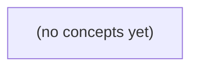

# 02.09 加权路径与状态空间

*面向 Go 初学者的中文静态教材，承接无权 BFS/DFS、堆与成本模型，循序讲清从最少跳数到最小总权重的建模转换。全书以一张虚构 IM 有向加权图为主线，手推松弛、Dijkstra、负权反例和约束状态扩展，并配套 22 道含答案的分层练习。*

**章节:** 2

---

## 本书导览

- 了解整本书的章节脉络
- 掌握各章之间的概念依赖关系
- 选择最合适的阅读顺序

# 02.09 加权路径与状态空间

面向 Go 初学者的中文静态教材，承接无权 BFS/DFS、堆与成本模型，循序讲清从最少跳数到最小总权重的建模转换。全书以一张虚构 IM 有向加权图为主线，手推松弛、Dijkstra、负权反例和约束状态扩展，并配套 22 道含答案的分层练习。

下方的概念图展示了本书 0 个核心概念以及它们之间的依赖关系；再下方是 1 个章节的入口。你可以按从上到下的顺序阅读，也可以根据自己的兴趣或先验知识选择切入点。

#### 概念图



## 章节索引

- **02.09 加权路径与状态空间：最少跳数不等于最低代价** — 面向Go初学者，以虚构IM路径图解释权重、松弛、非负权Dijkstra、负权反例、不可达和扩展状态。

## 02.09 加权路径与状态空间：最少跳数不等于最低代价

- 区分最少边数与最小可加权重
- 逐行推导松弛和Dijkstra定型
- 解释非负权正确性和负边反例
- 保留不可达和溢出边界
- 把带额度的路径扩成完整状态
- 区分图成本和IM授权/确认

无权图中“少走几步”很直观；一旦边带有代价，跳数最少的路径未必最便宜，必须先明确优化目标。

### 从边数目标转向总代价目标

### 从边数目标转向总代价目标

在无权图中，BFS 把每条边都视为一次相同的移动：路径优劣只由边数决定。但有向加权图为每条边 `X→Y` 附加权重 `w(X,Y)`，表示走完这一步的纸面代价。路径

`A→B→C`

的跳数是 `2`，总代价则为：

$$
w(A,B)+w(B,C)
$$

因此，跳数回答“经过多少条边”，总代价回答“累计花费多少”；它们是不同的优化目标。

例如，从 `A` 到 `E`：

- `A→C→E`：2 跳，代价为 $5+7=12$；
- `A→B→C→D→E`：4 跳，代价为 $2+1+1+3=7$。

前者跳数更少，后者总权重更低。若目标是最低代价，就不能因为 BFS 先找到 `A→C→E` 而停止；BFS 的“首次到达即最优”保证只适用于每条边代价都相同的情形。

权重还必须具有统一、可相加的单位。若某条边表示排队时间、另一条边表示费用，把它们直接相加没有明确含义。本节统一把权重解释为虚构的“处理步骤代价”。它不表示消息已经持久化、送达，或用户获得读取权限；真实网络延迟也会随负载变化，固定边权只是分析模型。孤立顶点 `F` 没有从 `A` 可走的路径，因此其最低代价应视为不可达，而不是某个有限数字。

### 同一终点的两条路径比较

### 同一终点的两条路径比较

从源点 `A` 到终点 `E`，图中有两条值得比较的有向路径：

- `A→C→E`：经过 2 条边，跳数为 2；总代价为  
  $w(A,C)+w(C,E)=5+7=12$。
- `A→B→C→D→E`：经过 4 条边，跳数为 4；总代价为  
  $w(A,B)+w(B,C)+w(C,D)+w(D,E)=2+1+1+3=7$。

因此，若目标是“边数最少”，应选 `A→C→E`；若目标是“总代价最低”，应选 `A→B→C→D→E`。前者少走了 2 跳，却多付出 $12-7=5$ 个代价单位。

这里的关键是路径评价方式不同：

| 路径 | 跳数 | 总代价 |
|---|---:|---:|
| `A→C→E` | 2 | 12 |
| `A→B→C→D→E` | 4 | 7 |

BFS 按“第几层到达”扩展顶点，天然优先发现跳数更少的路径；它会偏向 2 跳到达 `E` 的路线，却不会比较边权之和。只有当所有边权都相同且非负，例如每条边都是 1 个处理单位时，最少跳数才等价于最低总代价。

这里的权重必须具有同一单位并且能够相加，例如统一定义为“处理步骤代价”。不能把一条边的排队时间与另一条边的金额直接相加；它们不是同一种量。并且，本图权重是纸面上的固定假设，真实系统中的延迟可能随负载变化，不能据此推断线上表现。

### BFS 的保证与适用边界

### BFS 的保证与适用边界

BFS 的队列按“离源点经过的边数”分层：先访问 1 跳可达的点，再访问 2 跳可达的点，依此类推。因此，在无权图中，第一次到达某顶点时得到的路径一定具有**最少边数**。

但 BFS 不会比较边上的数字。对它而言，`A→C→E` 与 `A→B→C→D→E` 分别只是 2 跳和 4 跳：

- `A→C→E`：跳数 $2$，代价 $5+7=12$；
- `A→B→C→D→E`：跳数 $4$，代价 $2+1+1+3=7$。

所以 BFS 会优先给出前者，却不能保证它是总代价最低的路径。这里“最短”必须说清楚：是最少跳数，还是边权和最小。

只有当所有边权都相同且非负，例如每条边都为 $k\ge 0$ 时，任一路径的总代价为

$$
\text{总代价}=k\times\text{跳数}。
$$

此时比较总代价等价于比较跳数，BFS 才可直接用于最低代价路径。边权一旦不同，即使都为非负整数，也应使用能按累计代价扩展状态的加权最短路算法，而不是把 BFS 的“先到即最优”误用于权重问题。

还要注意，权重必须具有统一、可相加的单位：不能把“排队时间”和“费用”直接相加；纸上固定的链路延迟也未必反映线上负载变化。图中的 `F` 若从 `A` 不可达，则无论优化跳数还是代价，都不存在一条 `A→F` 路径。

### 代价单位必须可比较且可相加

### 代价单位必须可比较且可相加

边权 `w(X,Y)` 不是任意贴在边上的数字；它必须表示同一种能够累加的量。若边表示虚构的“处理步骤代价”，则路径

`A→B→C`

的总代价定义为：

$$
w(A,B)+w(B,C)
$$

这里的加法语义是：完成连续步骤所付出的同类成本可以相加。例如 `A→B` 代价为 2、`B→C` 代价为 1，则该路径总代价为 3；它有 2 跳，但“3”描述的是处理代价，不是跳数。

不同单位不能直接混加。若一条边的数字是排队时间，另一条边的数字是人民币费用，写成“`5 分钟 + 8 元 = 13`”没有可解释的含义。类似地，把延迟、能耗、风险和权限等级混成一个权重，也不能自动得到合理的最短路径问题。

若确实要综合多个指标，必须先给出明确的统一规则，例如将它们换算为同一货币成本，或定义带业务含义的评分函数：

$$
\text{综合代价}=\alpha\cdot\text{时间}+\beta\cdot\text{费用}
$$

其中 $\alpha,\beta$ 的单位和取值都需要由业务定义，而非算法替你决定。

本章还采用**固定边权**假设：同一条边每次经过时，代价相同。真实网络延迟会随负载变化，费用也可能随时段或配额变化；因此纸上求得的最低代价路径，只是在给定权重快照下的结论，并不保证线上持续最优。

### 纸上路径代价不等于 IM 业务事实

### 纸上路径代价不等于 IM 业务事实

本节把边权定义为虚构的“处理步骤代价”：例如一次格式转换、路由判断或队列转发所消耗的抽象单位。于是路径 `A→B→C→D→E` 的总代价可写为

$$
w(A,B)+w(B,C)+w(C,D)+w(D,E)=2+1+1+3=7。
$$

这只是纸上模型中的可加分数，不应被误读为即时通信（IM）系统已经发生的业务事实。某条边被走过，并不自动意味着：

- 消息已写入持久化存储；
- 接收端已经收到消息或返回送达确认；
- 用户已经拥有读取该消息的权限；
- 消息在真实网络中具有固定、稳定的延迟。

尤其要先统一单位。若一条边的数字表示排队时间，另一条表示金额，`时间 + 金额` 没有可解释的业务含义；只有都表示同一种可累加成本时，路径总权重才成立。真实链路延迟还会随负载、重试和拥塞变化，因此固定边权仅是某个简化快照。

孤立顶点 `F` 同样有明确语义：从 `A` 没有任何有向路径到达 `F`，故不存在有限总代价的 `A→F` 路径。应报告“不可达”，而不是把它当作代价很高、消息发送失败，或用户无权限的证据。

> **要点** — 加权路径优化的是可加的总代价；只有等权非负边时，最少跳数才等价于最低代价。

加权图中，首次到达不等于代价最优；本节建立暂定距离、松弛更新与安全表示的基础。

### 从跳数思维转向路径代价

### 从跳数思维转向路径代价

BFS 解决的是**无权图的最少边数**：每条边都可视为代价相同，因此按层扩展时，第一次到达顶点就必然使用了最少的边。顶点一旦入队，其距离即可定型。

加权图则不同。我们关心的是路径权重之和：

\[
\operatorname{cost}(A\to v)=\sum_{\text{路径上的边 }e} w(e)
\]

边数更少，不代表总代价更低。例如从 A 到 C 有两条路：

- 直接走 `A→C`，只跳 1 次，代价为 `5`；
- 先走 `A→B→C`，跳 2 次，代价为 `2+1=3`。

若沿用 BFS 的“第一次发现即确定”规则，看到 `C=5` 时便把它定型，就会错过之后经 B 找到的 `C=3`。因此，加权图中的 `dist[C]` 应理解为**目前已知的最好代价**，而不是最终答案。

当已知 `dist[u]` 后，检查边 `u→v` 的候选代价：

\[
dist[u]+w(u,v)
\]

如果它小于当前的 `dist[v]`，就更新 `dist[v]`，并令 `parent[v]=u`。这称为**松弛**。松弛意味着“发现了更便宜的路线”；除非算法额外满足能保证定型的条件，否则不能仅凭首次到达就宣布顶点的最短路已经确定。

### dist 与 parent 的含义和初始化

### dist 与 parent 的含义和初始化

`dist[v]` 记录的不是“到过 v 的次数”，而是**目前已知**从源点 A 到顶点 `v` 的最低总代价。它是一个可被更优路线改写的暂定值：

- `dist[A] = 0`：从 A 到自己不需要走边，代价为 0。
- 其余顶点初始为“∞”或“未发现”：表示当前还没有找到从 A 到它的任何路径。
- 若存在边 `u → v`，权重为 `w`，则经由 `u` 到达 `v` 的候选代价为  
  $dist[u] + w$。若它小于当前 `dist[v]`，就更新 `dist[v]`。

`parent[v]` 保存让 `dist[v]` 变得更小的那个前驱顶点 `u`。因此每次松弛成功时必须同步执行：

```go
dist[v] = dist[u] + edge.Cost
parent[v] = u
```

当算法结束后，可从目标点不断读取 `parent`，逆向回到 A，再将序列反转。例如：

`parent[C]=B`、`parent[B]=A`，就还原出路径 `A → B → C`。

应保持两个基本不变量：

1. 若 `dist[v]` 有限，则沿 `parent[v]` 反向追溯，必须能得到一条从 A 到 v、总代价恰为 `dist[v]` 的实际路径。
2. `parent[A]` 不设置；源点没有前驱。

在 Go 中，`map[string]int64` 对缺失键返回 `0`，而 `0` 可能是合法距离，不能据此判断顶点是否已发现。可使用 `value, ok := dist[v]`，或单独维护状态；若使用 `MaxInt64` 表示无穷，还必须先确认 `dist[u]` 不是无穷，避免计算 `dist[u] + w` 时溢出。

### 逐步执行一次松弛

### 逐步执行一次松弛

设起点为 A，边及权重为：

- $A\to B=2$
- $A\to C=5$
- $B\to C=1$
- $B\to D=4$

初始化时，只有起点的代价确定为零：

| 顶点 | `dist` | `parent` |
|---|---:|---|
| A | 0 | 无 |
| B | ∞ | 无 |
| C | ∞ | 无 |
| D | ∞ | 无 |

从 A 出发，逐条检查其出边。对边 `A→B`，候选代价是：

$$
dist[A]+2=0+2=2
$$

因为 $2<\infty$，松弛成功：`dist[B]=2`，`parent[B]=A`。这表示目前最好的 B 路线是 `A→B`。

再检查 `A→C`：

$$
dist[A]+5=0+5=5
$$

同样小于无穷，因此更新 `dist[C]=5`、`parent[C]=A`。此时 C 的值只是**暂定值**：

| 顶点 | `dist` | `parent` |
|---|---:|---|
| A | 0 | 无 |
| B | 2 | A |
| C | 5 | A |
| D | ∞ | 无 |

接着从 B 松弛。对于 `B→C=1`：

$$
dist[B]+1=2+1=3
$$

候选值 $3$ 小于当前的 `dist[C]=5`，所以必须覆盖旧结果：

```text
dist[C]   : 5 → 3
parent[C] : A → B
```

现在还原 C 的路径，应沿父节点回溯为 `A→B→C`，而不是旧的 `A→C`。

最后处理 `B→D=4`：

$$
dist[B]+4=2+4=6
$$

由于 $6<\infty$，更新 `dist[D]=6`、`parent[D]=B`。松弛的核心判断始终是：

```text
候选值 = dist[u] + 边权
若 候选值 < dist[v]，则更新 dist[v] 和 parent[v]
```

首次发现 C 时得到的 5 并不可靠；后续松弛能将它降为 3。这正是加权路径不能采用“首次到达即定型”规则的原因。

### 暂定值下降不等于路径定型

### 暂定值下降不等于路径定型

考虑从起点 A 出发的带权有向图：

- `A → B`，代价 2
- `A → C`，代价 5
- `B → C`，代价 1
- `B → D`，代价 4

初始化时：

| 顶点 | `dist` | `parent` |
|---|---:|---|
| A | 0 | 无 |
| B、C、D | ∞ | 无 |

先松弛 A 的出边：

- 经 `A → B`：`0+2=2`，所以 `dist[B]=2`，`parent[B]=A`
- 经 `A → C`：`0+5=5`，所以 `dist[C]=5`，`parent[C]=A`

此时 C 已经“被找到”，但 `5` 只是**目前已知的暂定值**，不能据此断言 A 到 C 的最短代价就是 5。

继续处理 B。由于 `dist[B]=2`：

- 经 `B → C` 的候选代价为 `2+1=3`
- 因为 `3 < 5`，发生松弛：`dist[C]` 从 5 降为 3，`parent[C]` 改为 B
- 经 `B → D`：`2+4=6`，得到 `dist[D]=6`

因此，C 的当前最优路径不再是 `A → C`，而是：

`A → B → C`，总代价为 $2+1=3$。

松弛的职责只是发现并记录更好的路线；它不负责宣布顶点“定型”。只有在 Dijkstra 算法中，且所有边权都非负时，一个顶点以全局最小暂定距离被取出后，才能保证其距离不再下降。这里 C 从 5 变为 3，正说明“首次发现”与“最终最短”是两件不同的事。

### Go 中表示未发现与边界代价

### Go 中表示未发现与边界代价

先把图和“当前最好代价”写成清晰的数据结构：

`type Edge struct { To string; Cost int64 }`

邻接表可表示为：

`graph := map[string][]Edge{"A": {{To: "B", Cost: 2}, {To: "C", Cost: 5}}, "B": {{To: "C", Cost: 1}, {To: "D", Cost: 4}}}`

距离表与父节点表则是：

`dist := map[string]int64{"A": 0}`  
`parent := map[string]string{}`

这里故意不预先给所有顶点填值。原因是 Go 的 `map[string]int64` 在键不存在时也会返回 `0`，但 `0` 是完全合法的路径代价：起点 `A` 的距离就是 `0`，某些边也可能费用为 `0`。因此，不能写成“`dist[v] == 0` 就表示未发现”。

应使用双返回值区分“没有记录”和“记录值恰好为 0”：

`old, ok := dist[v]`

松弛时，若 `v` 尚未发现，或候选值更小，就更新：

`candidate := dist[u] + edge.Cost`  
`if !ok || candidate < old { dist[v] = candidate; parent[v] = u }`

另一种做法是为所有顶点初始化无穷大，例如 `inf := int64(math.MaxInt64)`。但这会引入边界问题：若 `dist[u] == inf`，计算 `dist[u] + edge.Cost` 没有意义；若代价很大，还可能发生整数溢出。更稳妥的检查是先确认 `u` 已发现，并防止加法越界：

`if du <= math.MaxInt64-edge.Cost { candidate := du + edge.Cost }`

纸上推演时可把“未发现”写为 `∞`，但程序中必须明确它究竟由“键不存在”、布尔标记，还是受保护的哨兵值表示。还应规定边权单位一致，并在读入阶段拒绝非法顶点、异常费用；若允许负权，后续不能直接套用依赖“已定型最小值”的算法。

> **要点** — dist 是可被松弛改进的暂定代价；只有满足算法定型条件后，顶点距离才可视为最终最短。

Dijkstra 的关键不是“走得少”，而是在非负权图中反复确认当前代价最低的未定型顶点。

### 从暂定距离到顶点定型

### 从暂定距离到顶点定型

设源点为 $s$。`dist[v]` 表示目前已知从 $s$ 到顶点 $v$ 的**最小暂定代价**：初始化时 `dist[s]=0`，其余顶点为 $\infty$。这里的“暂定”意味着，后续可能发现一条更便宜的路径并更新它。

算法维护两类顶点：

- **已定型集合**：其中顶点的 `dist` 已被证明是真实最短距离，之后不再改变。
- **候选顶点**：已发现但尚未定型的顶点，按当前 `dist` 等待处理；通常用最小堆快速取出代价最小者。

每一轮从候选中取出 `dist` 最小的顶点 $u$，并将 $u$ 定型。其含义不是“$u$ 的边最少”或“$u$ 离图上位置最近”，而是：在当前所有未定型顶点中，已知到达 $u$ 的总代价最低。

为什么可以相信它？前提是所有边权都非负。任何经过其他未定型顶点、再绕回 $u$ 的替代路线，都必须在当前候选代价之外额外加入非负代价；它不可能把 `dist[u]` 降得更小。因此，$u$ 一旦被以最小暂定距离取出，`dist[u]` 就可从“暂定”升级为“确定”。

随后扫描 $u$ 的每条出边 $(u,v,w)$：若

$$
dist[u]+w<dist[v]
$$

就更新 `dist[v]`，并记录 `parent[v]=u`。这一步称为松弛：已定型顶点 $u$ 把自己可靠的最短代价传播给邻居。若某顶点始终为 $\infty$，说明它从源点不可达，不能把它误记为距离 $0$。

### 逐行执行松弛与更新父节点

### 逐行执行松弛与更新父节点

从 `A` 出发，先置 `dist[A]=0`，其余均为 $\infty$，并将 `A(0)` 入最小堆。每次弹出当前代价最小且尚未定型的顶点，按邻接表顺序检查它的出边；若

$$dist[u]+w(u,v)<dist[v]$$

就更新 `dist[v]`，令 `parent[v]=u`，并把新条目入堆。

| 弹出并定型 | 松弛结果 | `dist` 变化 | `parent` 变化 | 堆中的候选 |
|---|---|---|---|---|
| `A(0)` | 发现 `B`、`C` | `B=1`，`C=5` | `B=A`，`C=A` | `B(1), C(5)` |
| `B(1)` | 经 `B→C` 找到更短路线 | `C:5→3` | `C:B` | `C(3), C(5)` |
| `C(3)` | 松弛到 `D` | `D=4` | `D=C` | `D(4), C(5)` |
| `D(4)` | 松弛到 `E` | `E=7` | `E=D` | `C(5), E(7)` |
| `E(7)` | 目标定型 | 最短代价为 `7` | 不变 | 可提前结束 |

这里 `C(5)` 是更新前遗留的旧堆条目。稍后若弹出它，发现 `5≠dist[C]=3`，应直接跳过，不能再次用旧代价松弛邻边。

最终父节点链为：

`parent[B]=A`，`parent[C]=B`，`parent[D]=C`，`parent[E]=D`。

从 `E` 反向追溯并翻转，得到最短路径 `A→B→C→D→E`，总代价为 $1+2+1+3=7$。`F` 从未被发现，仍为 $\infty$，因此不存在从 `A` 到 `F` 的已知路径。

### 非负边为何保证定型正确

### 非负边为何保证定型正确

设源点为 $s$，算法从所有**未定型**顶点中取出暂定距离最小的顶点 $u$，记为 `dist[u]`。为什么此刻就能断言：`dist[u]` 已是真实最短代价？

用反证法。假设 $u$ 被取出后，仍存在一条更便宜的从 $s$ 到 $u$ 的路径 $P$，其总代价小于 `dist[u]`。由于 $u$ 是当前最小的未定型顶点，$P$ 不可能完全只经过已定型顶点；否则这些边在此前松弛时已经会给出更小的 `dist[u]`。

因此，沿着 $P$ 从 $s$ 前进，取第一个尚未定型的顶点 $x$。它前一个顶点 $y$ 必已定型。$y$ 定型时，算法松弛边 $y\to x$，所以：

$$
\text{dist}[x]\le \text{真实路径 }s\to y\to x\text{ 的代价}.
$$

又因为从 $x$ 到 $u$ 的后续边权都非负，

$$
\text{代价}(s\to x)\le \text{代价}(s\to u)<\text{dist}[u].
$$

于是 `dist[x] < dist[u]`。但 $x$ 仍未定型，而算法却选择了 $u$ 作为暂定距离最小者，矛盾。

所以，非负边保证路径不会在“先走到某个候选点后”凭借后续边把总代价降得更低；`u` 一旦出堆并定型，就无需回头修改。若存在负边，上述“后缀不会降低代价”的不等式失效，已定型顶点也可能被后续路径改进。

### 负边、旧堆条目与提前结束陷阱

### 负边、旧堆条目与提前结束陷阱

Dijkstra 的“取出即定型”依赖边权非负。设从起点 `A` 出发：`A→B=2`，`A→C=5`，`C→B=-10`。算法会先取出暂定距离为 `2` 的 `B` 并将其定型；但随后经 `C` 可得到 `A→C→B`，总代价为 $5+(-10)=-5$。因此，负边能让“后来才发现的绕路”反过来降低已定型顶点，Dijkstra 不适用；应改用 Bellman–Ford 等能处理负权的方法。

使用最小堆时，一个顶点的距离变小，简单实现通常不删除旧条目，而是再次入堆。例如先得到 `C(5)`，后更新为 `C(3)`；堆中会同时存在两项。弹出 `(d,u)` 时必须执行：

- 若 `d != dist[u]`，这是过期条目，跳过；
- 若 `u` 已定型，也跳过；
- 只有当前距离匹配且未定型时，才定型并松弛其出边。

这相当于用“懒删除”代替堆内的减键操作；否则旧的较大距离可能被误当成有效候选。

目标 `E` **首次被发现**时，只说明存在一条到达它的路径，尚不能保证最优。例如先发现 `E` 的代价为 `10`，之后可能经另一个未定型顶点将其降为 `7`。只有当 `E` 以当前最小 `dist[E]` 从堆中弹出、通过有效性检查并被定型时，非负权前提才保证该值不可再降，此时才可提前结束。

### 不可达、并列路径与实现边界

### 不可达、并列路径与实现边界

顶点 `F` 从源点 `A` 不可达时，应保持 `dist[F]=∞`，`parent[F]=空`，并明确报告“不可达”。距离 `0` 只属于源点自身；没有父指针链就不能拼造路径。输出路径前应先检查目标是否已定型或其距离是否仍为 `∞`。

若有多条同样低代价的路线，最短距离数值不受影响，但选中的父节点可能不同。为使纸上推演和程序结果可复现，应固定邻接表遍历顺序、堆中并列键的比较规则，并规定只在 `newDist < dist[v]` 时更新；若使用 `≤`，则会用后遇到的等价路径覆盖原父节点。

实现时不要把无穷大直接参与加法。设 `INF` 为安全上界，松弛前确认 `dist[u] != INF`，并防止 `dist[u]+w(u,v)` 整数溢出；可使用更宽整数类型，或先判断 `dist[u] > INF-w`。

最后，图上的“最低代价”只是模型内的路径评价。即时通信中的转发代价、跳数或时间，并不自动表示消息已获授权、已送达，或已被对方确认；这些状态必须由协议的独立证据表示。

> **要点** — 仅在边权非负时，最小暂定距离顶点才可定型；松弛、父节点与过期堆项共同保证结果可追溯且可靠。

Dijkstra 的关键不在“每次挑最小”，而在非负权保证该顶点一旦定型便不可能被更短路径推翻。

### 从暂定距离到定型承诺

### 从暂定距离到定型承诺

对源点 $s$ 运行 Dijkstra 时，每个顶点都有一个暂定距离 `dist[v]`：

- `dist[v]` 表示：**目前已发现的**从 $s$ 到 $v$ 的路径中，代价最小者。
- 它一开始通常是 `dist[s]=0`，其余为 $\infty$；经过松弛操作后只会减小。
- 因而，`dist[v]` 是真实最短距离 $\delta(s,v)$ 的上界：可能还不够好，但不会“低估”真实答案。

算法还维护已定型集合 $S$。当顶点 $u$ 被选入 $S$ 时，含义不是“暂时看来它不错”，而是作出更强的承诺：

> `dist[u]` 已经等于真实最短距离 $\delta(s,u)$，以后不必再修改，也不必重新处理 $u$ 的出边。

每一步从未定型顶点中选择 `dist` 最小的 $u$，随后处理全部出边 $u\to v$：

$$
\texttt{dist[v]} \leftarrow
\min(\texttt{dist[v]},\ \texttt{dist[u]}+w(u,v)).
$$

这里“当前最小”之所以能升级为“永久正确”，依赖边权非负。任何尚未经过定型边界、再绕到 $u$ 的候选路径，都不能靠后续边把代价降下来。因此，未定型顶点不可能隐藏着一条最终会优于 `dist[u]` 的路径。

注意区分两件事：堆中最小键值只是**下一位候选者**；顶点被取出并定型后，才获得“最短距离已确定”的数学保证。

### 反设更短路径的切分方法

### 反设更短路径的切分方法

设算法刚把暂定距离最小的未定型顶点 $u$ 定型，当前记录为 `dist[u]`。要证明它已经等于真实最短距离，可反设：存在一条从源点 $A$ 到 $u$ 的路径 $P$，其总代价比 `dist[u]` 更小。

沿着路径 $P$ 从 $A$ 向 $u$ 走。源点以及路径开头的一段顶点应当已经定型；否则，取路径上**第一个未定型顶点** $x$。于是 $x$ 的前驱 $y$ 必然已定型，且路径含有边

$$
y\to x.
$$

这是证明的关键切分：把整条假想的更短路径分成两段，

$$
A\leadsto y \to x \leadsto u.
$$

由于 $y$ 已定型，根据归纳假设，`dist[y]` 已是真实最短距离。当 $y$ 被定型时，算法处理了所有从 $y$ 出发的边，特别会松弛 $y\to x$，因此

$$
\texttt{dist}[x]\le \texttt{dist}[y]+w(y,x).
$$

右侧正是反设路径 $P$ 走到 $x$ 时的前缀代价。又因为从 $x$ 到 $u$ 的后缀边权都非负，

$$
\operatorname{cost}(P\text{ 到 }x)
\le \operatorname{cost}(P\text{ 到 }u)
< \texttt{dist}[u].
$$

故有 `dist[x] < dist[u]`。但 $x$ 尚未定型，而算法恰恰选择未定型点中暂定距离最小的 $u$，矛盾。

因此，不存在更短的 $A\to u$ 路径，$u$ 可以安全定型。这里每一步都依赖三个条件：边权非负、定型时确实处理全部出边、路径代价使用通常的可加权重。

### 松弛如何制造矛盾

### 松弛如何制造矛盾

设算法从所有**未定型**顶点中选出暂定距离最小的 \(u\)，准备将其定型。要证明此时 `dist[u]` 已是真实最短距离，反设存在一条从源点 \(A\) 到 \(u\) 的更短路径 \(P\)。

沿 \(P\) 从 \(A\) 向 \(u\) 走，取第一个尚未定型的顶点 \(x\)。那么：

- \(x\) 前一个顶点记为 \(y\)；
- 因为 \(x\) 是第一个未定型点，\(y\) 必已定型；
- 边 \(y\to x\) 已在 \(y\) 定型时被处理并松弛。

若 \(P[A\leadsto x]\) 表示路径 \(P\) 到达 \(x\) 的前缀，则 \(y\) 定型时已经知道其真实最短距离，因此松弛给出

\[
\texttt{dist}[x]
\le
\delta(A,y)+w(y,x)
=
\operatorname{len}(P[A\leadsto x]).
\]

而从 \(x\) 到 \(u\) 的后缀边权都非负，所以

\[
\operatorname{len}(P[A\leadsto x])
\le
\operatorname{len}(P[A\leadsto u]).
\]

反设称整条路径比当前的 `dist[u]` 更短，即

\[
\operatorname{len}(P[A\leadsto u])<\texttt{dist}[u].
\]

合并便得到

\[
\texttt{dist}[x]<\texttt{dist}[u].
\]

但 \(x\) 仍未定型，而算法恰恰选择了未定型顶点中暂定距离最小的 \(u\)。这要求

\[
\texttt{dist}[u]\le\texttt{dist}[x],
\]

与上式矛盾。因此，不存在更短的 \(A\to u\) 路径，`dist[u]` 可以安全定型。

这里的关键链条是：**已定型的 \(y\) 必松弛其出边，且后续边不能把代价“降回来”**。后一条件正是非负权不可替代的原因。

### 非负权、有效加法与完整扫描

### 非负权、有效加法与完整扫描

设当前从未定型顶点中取出暂定距离最小的 $u$，并准备将其定型。反设存在一条从源点 $A$ 到 $u$ 的更短路径。沿这条路径从 $A$ 前进，取第一个尚未定型的顶点 $x$；其前驱 $y$ 必已定型。

当 $y$ 定型时，算法必须扫描边 $y\to x$ 并执行松弛，因此：

$$
dist[x]\le dist[y]+w(y,x)
$$

而右侧正是这条假设路径从 $A$ 走到 $x$ 的代价。由于后续边权都非负，路径从 $x$ 继续走到 $u$ 不会降低总代价，所以该路径到 $u$ 的代价不小于其到 $x$ 的代价。若它真的比 $dist[u]$ 更小，就有

$$
dist[x] < dist[u]
$$

但 $x$ 尚未定型，$u$ 却是所有未定型顶点中暂定距离最小者，矛盾。因此 $u$ 定型时，`dist[u]` 就是真实最短距离。

这段论证隐含三个不可省略的条件：

- **边权非负**：否则“后半段不会降低代价”不成立。
- **加法有效**：计算 `dist[y] + w(y,x)` 时不能整数溢出；应使用足够大的数值类型，并避免对表示无穷大的哨兵值直接相加。
- **完整扫描出边**：每个定型顶点的所有可达出边都必须被松弛。漏掉一条边，就无法保证上述 $x$ 已获得相应的暂定距离。

负权边即使不构成负环，也会击穿定型逻辑。例如 `S→A=2`、`S→B=5`、`B→A=-4`：`A` 会先以 `2` 定型，但真实最短距离是 `5-4=1`。

### 负边如何推翻定型结论

### 负边如何推翻定型结论

考虑有向图：

- `S → A`，权重为 `2`
- `S → B`，权重为 `5`
- `B → A`，权重为 `−4`

从源点 `S` 出发，标准 Dijkstra 的过程是：

1. 初始化：`dist[S]=0`，其余为无穷大。
2. 处理 `S` 后，得到 `dist[A]=2`、`dist[B]=5`。
3. 当前暂定值最小的是 `A=2`，于是算法将 `A` 出堆并**定型**：认为从 `S` 到 `A` 的最短距离已经确定为 `2`。
4. 接着处理 `B=5`。松弛负边 `B→A` 时发现：
   \[
   dist[B]+w(B,A)=5+(-4)=1<2.
   \]
   实际上，路径 `S→B→A` 的代价是 `1`，比已定型的 `A=2` 更短。

问题不在于“松弛操作不会算”，而在于 `A` 已被标记为定型；标准实现通常不会再把它作为一个可重新定型的顶点处理。于是，“出堆即最终最短距离”的结论被推翻。

这张图甚至没有环，更没有负环。它说明：**负边本身就足以破坏 Dijkstra 的定型证明。** 原证明依赖“从路径中某个未定型点继续走到 `u`，代价不会下降”；但权重为 `−4` 的边恰恰能让后续路径代价下降，使一个当前较大的 `B=5` 反过来产生更小的 `A=1`。

因此，负权图不能只是把边权改成负数后继续套用“一次出堆、永久定型”的 Dijkstra。即使某些允许反复更新顶点的实现偶尔能得到正确答案，也不再具有 Dijkstra 在非负权条件下的正确性与复杂度保证。

> **要点** — Dijkstra 的定型正确性来自非负边：松弛到首个未定型点必能揭示矛盾；出现负边时，该承诺不再成立。

当路径是否可走取决于已用额度时，顶点名称不足以表达搜索位置，必须把历史约束编码进状态。

### 同一顶点为何会有两种搜索状态

### 同一顶点为何会有两种搜索状态

设业务规则为：一条路径中最多经过一次 B 类 broker 节点。此时“当前在哪个顶点”并不能完整描述搜索位置；还必须知道此前是否已经用掉 broker 额度。

例如都已到达顶点 $D$：

- 状态 `(D, false)`：尚未经过 B 类 broker，后续仍可选择一条经过 broker 的边。
- 状态 `(D, true)`：已经经过一次 B 类 broker，后续所有会再次经过 broker 的边都必须拒绝。

两者顶点名称相同，却拥有不同的后续合法边集合。若只写 `visited[D]`，搜索先以 `(D, true)` 到达并标记后，随后更有价值的 `(D, false)` 即使到达，也会被误认为“D 已访问”而跳过；结果可能漏掉本来合法、甚至更低代价的终点路径。

因此，应把扩展后的搜索状态写成：

`(vertex, usedBroker)`

经过普通节点时保持标记不变；经过 B 类 broker 时，将 `false` 更新为 `true`；若当前已是 `true`，则拒绝任何再次经过 B 类 broker 的转移。于是原图中的每个顶点最多对应两个状态，访问标记也应分别记录：

`visited[D][false]` 与 `visited[D][true]`

这里的关键不是“把图算法写复杂”，而是让状态精确表达业务允许的未来动作。只有未来可选边完全相同的两个到达情形，才可以安全地共用一个 `visited` 标记。

### 把顶点扩成二元状态图

### 把顶点扩成二元状态图

设原图为 $G=(V,E)$，路径规则为“至多经过一次 B 类 broker 节点”。此时，搜索中的位置不能只写成顶点 $v$，还必须记录额度是否已经使用：

\[
(v,\mathrm{usedBroker}),\qquad \mathrm{usedBroker}\in\{\mathrm{false},\mathrm{true}\}
\]

于是每个原顶点最多复制为两个状态节点：

- $(v,false)$：已到达 $v$，但尚未使用 B 类 broker 额度；
- $(v,true)$：已到达 $v$，且额度已经使用。

状态图的边由原边及其业务属性推导，而不是任意复制：

- 若原边 $u\to v$ 是普通边，则额度不变：
  \[
  (u,false)\to(v,false),\quad (u,true)\to(v,true)
  \]
- 若原边要求经过 B 类 broker，则仅可从未使用额度的状态转移：
  \[
  (u,false)\to(v,true)
  \]
- 从 $(u,true)$ 再走受限边会形成第二次使用额度，因此该转移不加入状态图。

例如，普通边使 `(A,false)` 到达 `(B,false)`；随后经过一次受限边到达 `(C,true)`；若下一条边仍受限，则直接拒绝，而非“先走到 C 再检查”。

这样，原来在顶点 `D` 相遇的两条路径会保留为不同搜索节点：`(D,false)` 与 `(D,true)`。前者未来仍可使用一次受限边，后者不能；它们不是可互相替代的同一位置。搜索时 `visited`、距离表和父节点都应以完整状态为键，例如 `dist[(D,false)]`、`parent[(D,true)]`，才能既避免漏路，也能重建满足约束的实际路径。

### 在扩展图上选择 BFS 或 Dijkstra

### 在扩展图上选择 BFS 或 Dijkstra

把原图顶点扩成 `(vertex, usedBroker)` 后，算法选择仍由**扩展图中的边权**决定，而不是由“多了一个状态位”决定。

- 若每次跳转代价完全相同，例如每条边都记为 `1`，则使用 BFS。队列按跳数分层推进，第一次到达某个完整状态 `(D, false)` 或 `(D, true)` 时，该状态的跳数已最小。
- 若边权非负但不相同，例如普通转发代价为 `1`、经过 broker 的代价为 `5`、跨区域代价为 `10`，则使用 Dijkstra。优先队列按累计代价弹出状态；某个状态以最小代价出队时，才可将它定型。
- 若存在负权边，普通 Dijkstra 不再适用；这通常也提示应重新审视成本模型，或改用能处理负权的算法。

关键是：定型、距离和 `visited` 的对象必须是完整状态，而不是原顶点名。也就是说，应维护：

`dist[(D, false)]` 与 `dist[(D, true)]`

它们代表到达同一节点时两种不同的未来能力：前者仍可再经过一次 B 类 broker，后者不能。即使 `(D, true)` 当前代价更低，也不能因此覆盖 `(D, false)`；后者可能通过后续受限边到达终点，而前者以外的状态无法完成该路线。

重建路径时，父指针同样记录完整状态，例如：

`parent[(C, true)] = (B, false)`

这样才能恢复“在哪一步消耗 broker 额度”，并验证最终路径确实满足业务约束。

### 父节点、不可达与溢出边界

### 父节点、不可达与溢出边界

在 Go 中，距离和父节点都必须按完整状态 `(vertex, usedBroker)` 存储，而不是只按顶点存储。否则即使找到了 `D`，也可能无法判断这条到达记录是否已经消耗 broker 额度，更无法重建一条合法路径。

可将状态编号为：

- `id(v, false) = 2*v`
- `id(v, true) = 2*v + 1`

于是 `dist[id]` 表示到该状态的最低代价，`parent[id]` 保存前驱**状态编号**。重建时从目标的某个可接受状态反向追溯，例如同时比较 `(target,false)` 与 `(target,true)`，选择距离较小且可达者。

```go
const INF int64 = math.MaxInt64

dist := make([]int64, 2*n)
parent := make([]int, 2*n)
for i := range dist {
    dist[i] = INF
    parent[i] = -1
}
```

松弛边 `u -> v` 时，先根据边的业务属性计算新状态。若该边会经过 B 类 broker，则：

- 当前已使用额度：拒绝此边；
- 当前未使用额度：转移到 `(v,true)`；
- 普通边：保持 `usedBroker` 不变。

不要写 `dist[u]+w < dist[v]` 后才考虑边界：当 `dist[u]` 是不可达哨兵，或加法超过 `int64` 上界时，会产生错误结果。应先检查：

```go
if dist[from] == INF || w < 0 || dist[from] > math.MaxInt64-w {
    continue
}
cand := dist[from] + w
```

这里的 `w < 0` 不是 Dijkstra 的正常输入；若业务允许负权，必须改用适合负权图的算法。最终若两个目标状态都是 `INF`，应明确返回“不可达”，而不是返回空路径并把它误解为起点即终点。

### 不能按顶点名随意剪枝

### 不能按顶点名随意剪枝

到达同一顶点 `D` 不代表处于同一种搜索位置。`(D,false)` 表示尚未使用 B 类 broker 额度，之后既可走普通边，也仍可走一次受限边；`(D,true)` 则已耗尽额度，后续遇到受限边必须拒绝。二者的未来动作集合不同，因此不能因为顶点名同为 `D` 就用一个 `visited[D]` 保留其一、删除其二。

能否剪枝应比较“状态支配”而非“顶点相同”。例如在非负权图中，若：

- 到达 `(D,false)` 的代价不高于到达 `(D,true)`；
- `(D,false)` 可执行 `(D,true)` 之后的全部合法动作，并额外保留一次受限边机会；
- 后续边权和业务规则不因“尚未使用额度”而产生额外惩罚；

则 `(D,false)` 支配 `(D,true)`，后者可以安全剪去。形式化地，若
$cost(D,false)\le cost(D,true)$，且未来可行路径集合满足
$\mathcal{F}(D,true)\subseteq\mathcal{F}(D,false)$，才有此结论。

反过来，若 `(D,false)` 更贵，仍不能仅凭“额度更多”就删除它：那次未使用的额度可能是通向终点的唯一合法动作。若 `(D,true)` 更便宜，也不能删除 `(D,false)`，因为便宜状态未必能完成后续受限转移。

因此，`visited`、距离表和父指针都应按完整状态索引，如 `dist[D][usedBroker]` 与 `parent[(D,false)]`。至于哪些边算受限边、额度是否可重置、是否允许特例通行，属于业务授权规则；图算法只负责忠实搜索这些规则定义出的状态空间。

> **要点** — 受历史约束的路径搜索应以完整状态为节点；同名顶点不代表可合并，剪枝必须证明支配关系。

纸图中的最短路只证明某个静态模型下的最小总权重；它不能替代 IM 系统中的授权、在线、投递与确认事实。

### 先界定算法承诺

### 先界定算法承诺

“路径更短”至少可能指三种不同承诺，必须先选定目标，再选择算法与解释结果：

- **最少跳数**：最小化经过的边数。若每条边都视为同样代价，可用 BFS。它回答“转发次数是否最少”，不回答延迟、费用或成功率是否最好。
- **最小静态代价**：在固定图快照上最小化权重和  
  $$
  \operatorname{cost}(P)=\sum_{e\in P}w(e)
  $$
  当边权非负时，Dijkstra 可保证得到最低总权重。这里的 `dist` 仅是模型权重之和，不是“消息已经送达”的证据。
- **满足业务约束的最小代价**：先剔除无权、离线、不健康、容量不足、地域不合规或不满足确认合同的边，再在同一版本快照中优化代价。约束可能依赖时间、队列长度、重试次数或节点状态，未必能压缩成一个固定可加权重。

例如，`c-a-b` 只有两跳，`c-d-e-b` 有三跳；前者未必更优：若 `a→b` 无权限或 B 不在线，它根本不是可交付候选。反之，即使纸图计算出总代价 `7`，也只能说明该静态图中存在权重为 `7` 的路线。

因此输出结果应携带承诺边界：图版本、过滤规则、优化目标、并列规则与不可达含义。`200 accepted_in_memory` 只表示当前进程接受了请求；它既不等于持久化，也不等于设备收到 `m-9`。找到路径、最低代价与完成投递，是三类不可互相替代的结论。

### 把业务条件前置为可用边

### 把业务条件前置为可用边

路径算法不应直接面对“所有记录过的连接”，而应面对同一时刻、同一规则版本下的**可用边集**。设原始图为 $G=(V,E)$，快照版本为 $s$，业务合同与投递策略为 $p$，则先构造：

$$
E_{\text{usable}}(s,p)=\{e\in E\mid \operatorname{authorized}(e,s,p)\land \operatorname{healthy}(e,s)\land \operatorname{capacity}(e,s)\land \operatorname{contract}(e,p)\}
$$

再在 $G_{\text{usable}}=(V,E_{\text{usable}})$ 上计算最小总代价。过滤条件通常包括：

- 发送方是否有权使用该边，目标租户、地域或设备策略是否允许；
- 节点是否健康，队列是否已满，边的当前容量、限流和重试预算是否满足；
- 边的方向、协议版本、消息类型及确认语义是否符合当前合同；
- 权重的单位、有效期和计算版本是否一致。

顺序不能颠倒。若先在原图中得到 `a → c → b`、代价为 7，再发现 `c → b` 无权限或 B 已离线，则“7”只是一个已失效候选，不能作为结果返回，更不能通过“忽略无权边”补救。正确结果是在过滤后的图中重新计算；可能得到更高代价的路线，也可能明确返回不可达。

“同一版本快照”同样关键。若边健康状态读取自版本 18、容量读取自版本 19、权限读取自版本 20，拼出的图可能从未真实存在过。结果应携带快照标识、策略版本和计算时间；路线、权限或容量变更后，旧的 `dist/parent` 只可视为缓存，需按失效规则重算。即便找到可用路径，它也仅说明该快照下可转发，不等价于消息已被远端设备接收或确认。

### 纸上代价七不等于消息送达

### 纸上代价七不等于消息送达

设纸图计算得到从 `c` 到 `a` 的最低代价为 $7$，并选出路径 `c-a`。这只是在给定顶点、边和权重的静态快照中，说明：

$$
\operatorname{dist}(c,a)=7
$$

它没有证明消息 `m-9` 已经到达 B 的设备。至少要区分以下事实：

1. **模型路径可达**：图中存在 `c-a`，且其权重为 $7$。
2. **业务路径可用**：B 对当前会话有权限，相关节点健康，地域、容量和队列策略允许投递。
3. **设备在线**：`a` 代表的 B 设备此刻有有效连接；图上的顶点存在，不等于设备在线。
4. **进程受理**：S2 返回 `200 accepted_in_memory`，仅表示当前服务进程已把 `m-9` 放入内存中的处理流程。
5. **持久化成功**：消息、投递任务或状态已写入可恢复存储；若进程崩溃，纯内存受理可能丢失。
6. **最终确认**：B 设备收到消息，或用户、客户端按合同返回确认。不同确认语义还应区分“服务器已接收”“设备已收到”“用户已读”。

因此，不能写成“`c-a` 代价为 $7$，所以 `m-9` 已送达 B”。更准确的表述是：“在版本 $v$ 的静态图上，`c-a` 是代价为 $7$ 的候选路径；S2 当前仅确认 `m-9` 被本进程内存受理。”

若路线、权限或健康状态变化，旧的 `dist/parent` 也可能失效，应在同一版本的有效边快照上重新计算。

### 确认语义不能由最短路推导

### 确认语义不能由最短路推导

最短路算法回答的是：在给定图、给定权重和给定快照下，从起点到终点的最小模型代价是多少。它不回答消息是否离开当前进程、是否进入持久化存储，更不回答目标设备是否在线、是否展示或已确认阅读。

| 层次 | 可表述的事实 | 不能推出的事实 |
|---|---|---|
| S2：`200 accepted_in_memory` | 当前服务进程已接受 `m-9` 并保存在内存状态 | 消息已存库、可在重启后恢复、已到达 B 设备 |
| 未来 S3：存库提议 | 设计上可能将消息写入持久化存储 | 提交已成功、异地副本完成、设备已收到或用户已读 |
| 最短路结果 | 纸图中例如 `c → a` 的总代价为 7，且在该图上最小 | `a` 有权转发、B 在线、队列可用、消息已投递 |

因此，响应字段应与实际完成的动作一致。S2 返回 `accepted_in_memory` 时，最稳妥的含义只是“本进程接受”；若进程崩溃、路由变化或后续发送失败，该消息仍可能丢失或未送达。即使未来引入存库，也应将“已持久化”“已进入投递队列”“设备确认收到”设计为不同状态，而非把一次成功响应统称为“已送达”。

图上的 `dist` 或 `parent` 仅是路径计算证据，不是投递回执。要声明“已确认”，系统还需要对应的协议事件、身份绑定、时间戳和可审计记录；没有这些证据，最低代价路径只能称为候选路线。

### 把路径计算嵌入可复现流程

### 把路径计算嵌入可复现流程

路径算法应是一个可审计的流程，而不是对一张图直接调用函数。首先固定一次**图版本快照**：顶点、边、方向、权重、权限与健康状态必须来自同一版本。业务应用应先删除无权、失效、不健康或不满足合同约束的边，再在剩余图上求解；不能先把不可用边纳入最短路，再事后声明结果不可发送。

规划前至少校验：

- 顶点与边身份是否存在，起点、终点是否允许访问；
- 图是有向还是无向，边方向是否被正确解释；
- 权重单位是否一致，例如不能混用“毫秒”“费用”和“跳数”；
- 权重是否允许负数；Dijkstra 仅适用于非负权重；
- 累计距离是否溢出。应使用足够大的整数类型，并在计算  
  $dist[u]+w(u,v)$ 前检查上界，不能让溢出后的负值伪造“更短路径”；
- 并列最优路径如何处理，例如按下一跳编号、完整路径字典序或稳定边编号确定，保证重复运行得到相同结果。

不可达不是异常地返回一条空路径，而应成为明确结果：`不可达`、所用图版本、过滤原因摘要，以及是否可能因权限或健康状态变化而重试。这样调用方不会把“当前无可用路线”误解为“消息已经投递”。

路线、权重或约束更新后，旧的 `dist` 与 `parent` 都只对应旧快照。应规定重算触发点：每次查询重算、版本变化后失效缓存，或在批量更新后重建；返回结果同时携带版本号，避免用旧父指针解释新拓扑。

算法选型卡还应披露目标是最少跳数、最小静态代价，还是满足权限、容量、时延等约束后的最小代价；并注明图规模 $V/E$、更新频率、是否有负权或环、并列规则与可复现要求。算法给出的只是该快照下的路径计划，不等同于设备在线、消息入库或对端确认。

> **要点** — 最短路只对已定义、已过滤且同版本的图负责；它不保证 IM 消息已获授权、已送达或已确认。

本节把最短路结果整理为可复算的纸上报告，并用失败层定位常见实现与解释错误。

### 纸上报告的统一格式

### 纸上报告的统一格式

一份可复算的最短路报告，不应只写“`A→E` 最短”或一个距离数字，而应固定记录输入、前提、输出与解释边界。推荐采用如下模板：

- **查询与图版本**：起点、终点、图是否有向，以及权重版本或时间快照。  
  例如：`查询：A 到 E；有向图；权重版本：v3（距离单位：km）`。同一条边若随时间、拥堵或票价变化，必须说明采用哪一版权重。

- **前置过滤**：列出在最短路计算前已排除的节点或边。  
  例如：`过滤：禁用节点 C；关闭边 B→D；仅保留可通行道路`。过滤改变的是图本身，不能在算出路径后再“删掉不喜欢的边”。

- **算法前提**：说明算法及其适用条件。  
  例如：`采用 Dijkstra；所有保留边权均为非负；距离使用 64 位整数累计`。若存在负权边，应拒绝使用 Dijkstra，改用满足负权条件的算法或先修正建模。

- **路径与总代价**：完整写出边序列和加法过程，而非只写终点距离。  
  `A→B→D→E`  
  `总代价 = w(A,B)+w(B,D)+w(D,E)=2+3+1=6`

- **不可达集合**：明确哪些节点从起点不可达。  
  例如：`不可达：{F, G}`。不可达应记为 $\infty$、`None` 或“无路径”，绝不能填为 `0`。

- **结果解释边界**：最短路表示模型中的最低累计权重，不自动等价于业务“已送达”。若边表示“可尝试投递”，仍需额外状态确认签收、容量、时间窗或权限是否满足。

若结果异常，按失败层回查：先核对建图与过滤，再核对权重单位和算法前提，最后检查松弛记录、父节点回溯与不可达标记。

### 从松弛表复算最小代价

### 从松弛表复算最小代价

设有向图边权如下：$A\to B=1$，$A\to C=4$，$B\to C=2$，$B\to D=5$，$C\to D=1$，$C\to E=7$，$D\to E=1$。目标是求 $A\to E$ 的最低总代价，而不是经过边数最少的路径。

初始化：$d(A)=0$，其余顶点为 $\infty$；父节点均为空。每次选择当前暂定距离最小、尚未定型的点，并尝试松弛其出边：

| 定型点 | 被检查边 | 候选代价 | 更新后距离与父节点 |
|---|---|---:|---|
| $A$ | $A\to B$ | $0+1=1$ | $d(B)=1,\;parent(B)=A$ |
| $A$ | $A\to C$ | $0+4=4$ | $d(C)=4,\;parent(C)=A$ |
| $B$ | $B\to C$ | $1+2=3$ | $d(C)=3,\;parent(C)=B$ |
| $B$ | $B\to D$ | $1+5=6$ | $d(D)=6,\;parent(D)=B$ |
| $C$ | $C\to D$ | $3+1=4$ | $d(D)=4,\;parent(D)=C$ |
| $C$ | $C\to E$ | $3+7=10$ | $d(E)=10,\;parent(E)=C$ |
| $D$ | $D\to E$ | $4+1=5$ | $d(E)=5,\;parent(E)=D$ |

定型顺序为 $A,B,C,D,E$。从 $E$ 沿父节点回溯：

$$E\leftarrow D\leftarrow C\leftarrow B\leftarrow A$$

故最低代价路径为：

$$A\to B\to C\to D\to E,\qquad 1+2+1+1=5$$

注意，若只按跳数看，$A\to C\to E$ 仅有 $2$ 跳，却花费 $4+7=11$；“跳数少”并不推出“总代价低”。松弛判断始终是

$$d(u)+w(u,v)<d(v)$$

而非比较路径边数。若某点最终仍为 $\infty$，应报告为不可达，不能把其代价写成 $0$。

### Dijkstra 的前提与堆处理

### Dijkstra 的前提与堆处理

Dijkstra 解决的是**边权非负**的单源最短路。其核心不变量是：每次从最小堆取出的、距离最小的未定型节点 $u$，其当前 `dist[u]` 已是最终最短距离。

原因在于：若存在一条更短路径以后才到达 $u$，它必须经过某个尚未处理的节点 $v$。但边权 $w(v,u)\ge 0$，故该路径长度至少为 `dist[v]`；而堆顶时有 `dist[u] ≤ dist[v]`，不可能后来再把 $u$ 降得更小。负权会破坏这一推理：已定型节点可能经负边被改写，此时应拒绝输入或改用 Bellman–Ford 等算法。

松弛规则为：

$$
\text{若 } dist[u]+w(u,v)<dist[v]，\quad
dist[v]\leftarrow dist[u]+w(u,v)
$$

并把新二元组 `(dist[v], v)` 入堆。通常不必在堆中删除旧条目；取出 `(d,u)` 时先检查：

- 若 `d != dist[u]`，这是旧堆条目，立即跳过；
- 否则才扫描 $u$ 的出边并松弛。

不能把“节点第一次入堆”当作定型，更不能“目标节点一入堆就停止”。入堆只表示发现了一条候选路径；目标应当在**以当前最小距离出堆且未过期**时才可停止。

零权边同样合法。多个节点可具有相同最短距离，堆的并列弹出顺序不影响距离正确性；若报告还要求固定父节点或可复现路径，则需额外规定并列规则，例如按节点编号选择较小父节点。不可达节点始终保持 $\infty$，不能写成总代价 0。

### 边界、反例与失败层排查

### 边界、反例与失败层排查

最短路报告不能只写“`A→E` 最短”，还应写明算法前提与边界。例如边为：

| 边 | 权重 |
|---|---:|
| `A→B` | 2 |
| `A→C` | 5 |
| `C→B` | -10 |
| `B→E` | 2 |

真实最低代价路径是 `A→C→B→E`，总代价为 $5-10+2=-3$。若误用 Dijkstra，`B` 可能先以代价 2 被确认，随后不会正确接受经 `C` 得到的 `-5`，因此报告必须注明：**Dijkstra 只适用于所有边权非负的图**；存在负边时应拒绝输入或改用 Bellman–Ford，并额外检查负环。

不可达不是距离 0。若从 `A` 无法到达 `D`，应报告 `dist[D]=∞`、父节点为空、`D` 属于不可达集合；不能输出路径 `A→D`，更不能把它解释为“零成本送达”。业务层还要区分“图中可达”与“现实中已送达”：前者仅表示模型中的路径存在。

按失败层从前到后排查首错：

1. **建图层**：漏边、方向反了、重复边未取较小权重，或把公里、分钟、金额混为同一权重。
2. **前置过滤层**：负权图仍进入 Dijkstra；权重累加可能超过整数上界却未改用更大类型或做溢出检查。
3. **松弛与队列层**：未跳过旧堆条目；节点“第一次入堆”就停止，而非在最小有效条目弹出时确认。
4. **结果层**：父节点链无法回溯到 `A`，不可达写成 0，或把最低代价错误表述为最少跳数、最快送达。

复算时保留每次松弛的“当前节点、旧距离、新距离、父节点变化”；第一处不符合规则的位置，通常就是首个失败层。

### 扩展状态与业务含义边界

### 扩展状态与业务含义边界

当“能否走下一条边”取决于剩余额度、优惠券、时间窗或已访问权限时，节点不能只写成地点 $v$，而应扩展为状态：

$$
(v,b)
$$

其中 $b$ 表示剩余额度。若边 $u\to v$ 消耗 $c$，仅当 $b\ge c$ 时才生成转移：

$$
(u,b)\to(v,b-c)
$$

这样，表面上同一个节点 `E` 可能有多个不同状态：`(E,2)` 与 `(E,8)` 不可混为一谈；后者通常保留更多后续选择。纸上报告应列出“状态、父状态、边消耗、累计代价、松弛结果”，而不是只记录地点名称。若额度上界为 $B$，状态规模约为 $|V|(B+1)$，边数也相应膨胀；这正是约束被并入搜索代价的一部分。

例如路径 `A→C→E` 的图上总代价最低，只能说明：在给定建图、权重、额度初值和过滤规则下，算法找到了一条最低成本的可行状态路径。它**不**自动等价于“消息已经送达”。

需要明确区分：

- **图可达**：存在满足状态约束的路径。
- **算法最优**：该路径在定义的权重下总代价最小。
- **IM 已授权**：发送者具备权限、配额与会话资格。
- **IM 已确认**：服务端接受请求，或返回确认回执。
- **实际送达**：目标设备、客户端或用户最终收到消息。

因此，不能把最短路的 `dist[E]` 解释为业务成功。实际系统还可能因鉴权失败、限流、离线、重试超时、客户端拒收而未送达。报告中应把“图算法输出”与“业务事件证据”分栏记录：前者是路径推断，后者才是送达结论。

> **要点** — 可复算报告必须展示松弛证据、算法前提和不可达边界；最低图成本不等于业务送达。

从“跳数更少”到“总代价更低”，关键在于统一单位、正确松弛，并明确算法适用的权重前提。

### 跳数与加权总代价

### 跳数与加权总代价

在虚构的 IM 图中，路径“更短”必须先说明比较的量。若每条边代表一次相同成本的跳转，最少跳数可作为优化目标；但一旦边携带不同权重，就应比较路径上权重的总和：

\[
\operatorname{cost}(P)=\sum_{e\in P}w(e)
\]

例如，从 A 到 E 有两条候选路径：

- 路径一：`A→B→E`，共 2 跳，总代价为 `5+7=12`；
- 路径二：`A→C→D→G→E`，共 4 跳，总代价为 `2+1+1+3=7`。

因此，路径一跳数更少，却不是最低代价路径；路径二虽然经过更多节点，却以总代价 7 胜出。这里“最短”指的是加权和最小，而非边数最少。

这一比较隐含关键前提：所有边权必须处于同一可加单位。例如都表示时间、费用或风险分值，才能直接相加。若一条边是“分钟”、另一条边是“金额”，`3+5` 没有明确业务含义；必须先定义换算规则，或改用多目标优化。

只有在所有可用边权相同（如每条边均为 1）时，最少跳数才与最低总代价完全一致。否则，BFS 找到的“层数最浅”路径不保证成本最低，需按权重和进行松弛与选择。

### 松弛：发现更便宜的到达方式

### 松弛：发现更便宜的到达方式

松弛的含义不是“走一条边”，而是检验：已知到达 `u` 的方案，再接边 `(u,v)` 后，是否比当前记录的到达 `v` 方案更便宜。

初始化时：

- `dist[A]=0`：起点到自身代价为 0；
- 其余顶点 `dist=∞`：尚未发现可达方案；
- `parent` 为空：尚未记录最优路径的前驱。

若当前已知 `dist[B]=5`，并检查边 `B→C`，其权重为 `2`，则候选代价为：

$$
\text{cand}=dist[B]+w(B,C)=5+2=7
$$

若原先 `dist[C]=∞`，因为 $7<∞$，执行松弛：

```text
dist[C] = 7
parent[C] = B
```

这表示“目前已知到达 C 的最低代价是 7，且该方案最后一步来自 B”。

但暂定距离允许被改写。假设之后发现 `A→D` 代价为 `2`，`D→C` 代价为 `1`，则：

$$
\text{cand}=dist[D]+w(D,C)=2+1=3
$$

由于 $3<dist[C]=7$，必须再次更新：

```text
dist[C] = 3
parent[C] = D
```

此时原来的 `parent[C]=B` 不再代表当前最优方案。沿 `parent` 从 `C` 反向回溯，得到的是 `A→D→C`，总代价为 3，而不是先前的 `A→B→C`，总代价为 7。

因此，松弛的核心判断始终是：

$$
dist[u]+w(u,v)<dist[v]
$$

只有严格更小才更新；相等时是否替换 `parent` 取决于是否需要额外规定路径并列时的选择规则。

### Dijkstra 的取出与定型

### Dijkstra 的取出与定型

Dijkstra 维护每个顶点的暂定代价 `dist[v]`：它表示“目前已知的、从起点到 `v` 的最好路径代价”，并不一定最终正确。每次从优先队列取出暂定代价最小的未定型顶点 `u` 时，若所有边权都满足 $w\ge 0$，则 `dist[u]` 可以定型。

原因是：任何尚未发现的、更便宜的到达 `u` 的路径，都必须先经过某个尚未定型的顶点 `x`。但队列中 `u` 已是最小暂定代价，因此 `dist[x]\ge dist[u]`；又因后续边权非负，经过 `x` 再走到 `u` 不会把总代价降到 `dist[u]` 以下。故不存在更优路径，`u` 的当前值就是最短代价。

取出 `u` 后，对每条边 `(u,v)` 做松弛：

`若 dist[u] + w(u,v) < dist[v]，则更新 dist[v] 与 parent[v]。`

优先队列通常不删除旧条目。例如 `C` 先以代价 `5` 入队，后来经更优路径更新为 `3`，队列可能同时保留 `C(5)` 与 `C(3)`。弹出 `C(5)` 时，应检查其键值是否仍等于当前 `dist[C]`，或检查 `C` 是否已定型；旧条目必须跳过，不能再次扩展。

若目标是单源到目标点 `E`，应在 `E` **以当前最小暂定代价被有效取出并定型**时停止，而不是第一次发现 `E` 时停止。发现时的路径可能仍会被后续松弛改进。

这一结论依赖非负权。出现负边时，一个已定型顶点仍可能被后续路径降低，Dijkstra 的定型逻辑失效。

### 不可达、溢出与负权反例

### 不可达、溢出与负权反例

设起点为 A，应初始化 `dist[A]=0`：从 A 到自身不经过任何边，空路径的可加代价为零。这不表示其他顶点也“暂时免费”。例如 F 尚未被发现、且图中不存在从 A 通往 F 的边链时，应记为 `∞`（或“不可达”），而不是 `0`。

松弛边 `(u,v)` 时，规则是：

`若 dist[u] + w(u,v) < dist[v]，则更新 dist[v] 与 parent[v]。`

但必须先确认 `dist[u]` 不是 `∞`。实现中若用一个很大的整数代表无穷大，直接计算 `∞+w` 可能发生数值溢出，反而得到很小的错误值。安全写法应先判断“u 是否可达”，再做加法；也可使用支持更大范围的数值类型。

Dijkstra 的“取出即定型”还依赖**所有边权非负**。考虑 A 到 D 有直接边，代价为 `2`；另有路径 `A→B→D`，代价为 `5+(-4)=1`。若算法先以 `2` 取出并定型 D，便会拒绝后来更优的 `1`，从而出错。

负边本身不必然意味着不存在最短路：上例没有环，有限最优解仍是 `1`。真正危险的是从起点可达、且还能影响目标的负环：每绕环一次总代价继续下降，因而不存在有限的“最低代价”。此时应使用能处理负权的算法检测负环，而非继续把某个距离当作最终答案。

### 从节点路径扩展为业务状态

### 从节点路径扩展为业务状态

在业务流程中，“到达哪个节点”往往不足以决定后续选择；还必须知道到达时携带了什么资格、额度或流程标记。此时图中的一个状态应写成：

\[
(\text{位置},\ \text{业务状态})
\]

例如到达节点 \(D\) 时，可能存在两种看似相同、实则不同的状态：

- `(D, true)`：已获得授权，可走后续的快捷审批边；
- `(D, false)`：尚未授权，只能先走补充材料或人工确认边。

若把它们都合并成单一节点 `D`，算法可能保留一个“到 D 更便宜”的路径，却错误地把该路径当作拥有授权，从而使用本不允许的后续边。正确做法是把它们视为两个独立顶点，并只在满足条件时添加状态转移边，例如：

\[
(D,\text{false})\rightarrow(D,\text{true})
\]

这条边可以表示一次授权、验证或确认动作；而从 `(D,true)` 到下一业务节点的边，则表示“已授权条件下可执行”的操作。

还应区分三类概念：

- **图成本**：用于优化的可加权重，如时间、费用、风险分数或资源消耗；
- **即时通信授权**：决定某个动作能否执行的权限条件；
- **确认流程**：表示请求、确认、撤销等业务步骤，本身可能改变状态，也可能产生额外成本。

授权或确认并不天然等于“成本更低”，更不应仅因消息已确认就把路径权重设为 \(0\)。只有先明确每条边代表的动作、其可用条件及统一计量单位，才能在扩展后的状态图上正确使用最短路径算法。

> **要点** — 最短路径优化的是统一单位下的权重和；Dijkstra 依赖非负权，业务约束必须编码进完整状态。
