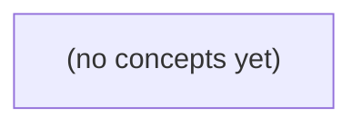

# 02.10 动态规划与贪心：Go 初学者的纸上批次预算决策

*一本面向 Go 初学者的静态教材，以虚构 IM 批次预算为贯穿案例，建立 0/1 背包动态规划与区间选择贪心的正确建模、证明和边界意识。读者将通过逐格推表、空间压缩、反例与 22 道练习，理解算法结论为何成立、又在何处不能直接用于真实业务。*

**章节:** 2

---

## 本书导览

- 了解整本书的章节脉络
- 掌握各章之间的概念依赖关系
- 选择最合适的阅读顺序

# 02.10 动态规划与贪心：Go 初学者的纸上批次预算决策

一本面向 Go 初学者的静态教材，以虚构 IM 批次预算为贯穿案例，建立 0/1 背包动态规划与区间选择贪心的正确建模、证明和边界意识。读者将通过逐格推表、空间压缩、反例与 22 道练习，理解算法结论为何成立、又在何处不能直接用于真实业务。

下方的概念图展示了本书 0 个核心概念以及它们之间的依赖关系；再下方是 1 个章节的入口。你可以按从上到下的顺序阅读，也可以根据自己的兴趣或先验知识选择切入点。

#### 概念图



## 章节索引

- **02.10 动态规划与贪心：有限处理预算怎样选批次** — 面向Go初学者，以虚构IM有限预算0/1任务选择解释反例、DP状态与递推、一维倒序、伪多项式以及区间贪心条件。

## 02.10 动态规划与贪心：有限处理预算怎样选批次

- 穷举纸上三任务并反驳比值贪心
- 写出0/1背包状态/边界/转移并填表
- 一维倒序保持每项最多一次
- 解释O(nM)伪多项式成本
- 用交换论证理解最早结束区间贪心的适用条件
- 将算法结果与IM业务合同分开

先用预算为 4 的三任务小例子穷举所有合法选择，建立后续判断贪心失效与推导动态规划的“金答案”。

### 先固定问题边界

### 先固定问题边界

先把这个小问题说“死”，否则同一组数字会被误解成不同模型。

- 处理窗口的总预算是 `4`；任意选中的任务，其消耗之和必须满足  
  $$
  \sum \text{消耗}\le 4
  $$
- 有三个任务 A、B、C。每项都是**不可拆分**的整体：要么选，要么不选，不能只处理“半个 A”。
- 每项任务**至多选择一次**。例如 B 不能因为看起来划算就选两次。
- 任务价值相加，目标是在不超预算的前提下最大化总价值。
- 预算单位与价值只是本节用于推理的**人为标尺**。它们不表示真实毫秒、金钱、消息优先级、权限等级或任何已经批准的业务规则。

因此，每个任务对应一个二元决定：

$$
x_i\in\{0,1\}
$$

其中 $x_i=1$ 表示选择该任务，$x_i=0$ 表示不选。这正是 **0/1 背包**：每件物品只有“取”与“不取”两种状态。

边界一旦改变，问题也随之改变。允许拆分会变成可分背包；允许重复选 B 会接近完全背包；把“价值”与权限、风险等不同概念揉成一个分数，则必须重新定义目标函数，不能沿用这里的结论。

### 穷举合法批次得出金答案

### 穷举合法批次得出金答案

设三项任务均不可拆分、至多选择一次：

| 任务 | 消耗 | 价值 |
|---|---:|---:|
| A | 3 | 5 |
| B | 2 | 3 |
| C | 2 | 3 |

预算上限为 $4$。先不猜策略，而是列出所有“选/不选”组合：

| 选择批次 | 总消耗 | 总价值 | 是否合法 |
|---|---:|---:|---|
| 空集 | 0 | 0 | 是 |
| A | 3 | 5 | 是 |
| B | 2 | 3 | 是 |
| C | 2 | 3 | 是 |
| A+B | 5 | 8 | 否，超预算 |
| A+C | 5 | 8 | 否，超预算 |
| B+C | 4 | 6 | 是 |
| A+B+C | 7 | 11 | 否，超预算 |

因此，合法批次的价值分别为 $0,5,3,3,6$，最大值是 $6$，对应选择：

\[
\boxed{\{B,C\}}
\]

这里 A 的单项价值最高，且其价值/消耗比为 $5/3$，高于 B、C 的 $3/2$；但先选 A 后只剩 1 个预算单位，无法再加入任何任务，最终只能得到价值 5。相反，B 与 C 恰好填满预算，得到价值 6。

这就是本例的金答案：后续无论使用贪心还是动态规划，都必须返回 B+C、总价值 6；若得到别的结果，通常意味着偷偷允许了拆分、重复选择，或改变了题目的价值定义。

### 比值贪心为何选错

### 比值贪心为何选错

若按“单位预算带来的价值”排序，三项任务的比值为：

- A：$5/3\approx1.67$
- B：$3/2=1.5$
- C：$3/2=1.5$

比值贪心会先选 A，因为它看起来最“划算”。但 A 消耗 3 个单位后，剩余预算只有 1，B 和 C 都需要 2 个单位，无法再加入。最终结果是：

| 选择 | 消耗 | 价值 |
|---|---:|---:|
| A | 3 | 5 |

而最优组合不是 A，而是 B+C：

| 选择 | 消耗 | 价值 |
|---|---:|---:|
| B+C | 4 | 6 |

因此，局部最高比值并不推出全局最高价值。A 的比值确实最高，却占用了 3 单位预算，留下一个无法与任何完整任务匹配的“碎片”预算；B 与 C 的单项比值略低，但二者恰好填满容量 4，价值达到 6。

比值排序适合允许切分的场景：例如可以取 A 的一部分，再把剩余容量填满。但这里每项任务只有“选”或“不选”，不能把 A 拆成 $1/3$，也不能重复选择 B。既然一次选择会改变后续可选集合，单看当前项的比值就不足以保证最优；必须比较“选它以后还能搭配什么”，这正是动态规划要保留预算状态的原因。

### 从选择表抽象为背包状态

### 从选择表抽象为背包状态

穷举表已经给出预算为 `4` 时的金答案：选 `B+C`，总消耗为 `4`，总价值为 `6`。但任务一多，逐个列出所有子集会变成指数级工作；我们需要把“已经比较过的选择”压缩成可复用的状态。

定义：

\[
dp[i][b]=\text{只考虑前 }i\text{ 项任务，在预算不超过 }b\text{ 时可获得的最大价值}
\]

其中：

- `i` 表示可选任务范围，而非已经选了几项；
- `b` 是剩余可用的预算上限，取 `0` 到 `4`；
- 状态值只记录最大价值，不把任务拆分，也不允许同一任务重复选取。

按任务顺序 `A、B、C`，最终要找的是：

\[
dp[3][4]
\]

它对应“考虑全部三项任务、预算为 4”的最优值，也就是穷举得到的 `6`。

这个定义同时保留了选择的关键约束。例如，`dp[2][4]` 只允许在 `A、B` 中选择；即使 `C` 的价值不错，也尚未进入可选范围。又如，`dp[3][2]` 的预算只有 `2`，不能选择消耗为 `3` 的 `A`，只能比较空集、`B` 或 `C`。

接下来填表时，面对第 `i` 项任务只有两种合法分支：**不选它**，沿用前面任务的结果；或在预算足够时**选它一次**，加上它的价值，并把问题退回到“前 `i-1` 项、较小预算”。这正是从完整选择表走向动态规划递推的桥梁。

### 算法结论不等于业务决策

### 算法结论不等于业务决策

在这个教学模型中，动态规划或穷举得到的结论只是：若预算上限为 `4`，且任务不可拆分、每项至多选一次，并且价值分别定义为 A=`5`、B=`3`、C=`3`，那么选择 B+C 的数学目标值最高，为 `6`。

这**不自动意味着**真实即时消息系统应当优先处理 B 和 C。原因在于，模型中的“消耗”和“价值”只是人为设定的标尺，并不天然代表：

- 消息的真实业务优先级；
- 用户、管理员或自动化系统拥有的处理权限；
- 合规、审计、数据保留与安全义务；
- 服务等级协议中的时限承诺；
- 已批准的升级规则、人工覆盖规则或公平性要求。

例如，一条价值较低的消息可能来自必须在规定时间内响应的客户；一条“高价值”消息也可能因权限不足、内容待审核或触发合规冻结而不能处理。把这些条件粗暴压成一个单一分数，可能掩盖硬约束：有些任务不是“低价值”，而是“必须先做”或“当前禁止做”。

因此，`B+C` 是对**已给定抽象目标函数**的最优解，不是未经确认的运营建议。将背包模型用于真实决策前，应由业务、合规和产品负责人确认：哪些条件是不可违反的约束，哪些因素可进入价值函数，以及预算单位究竟代表什么。只有模型假设获得认可，算法最优才具有业务意义。

> **要点** — 在 0/1 约束下，预算为 4 时 B+C 价值 6 最优；未经证明的比值贪心不能替代穷举或动态规划。

面对有限处理预算，按“价值÷消耗”优先看似自然，却可能因任务不可拆分而错失更优组合。本节用三项任务反驳这一局部直觉，并明确反例的适用边界。

### 先把任务选择写成0/1模型

### 先把任务选择写成 0/1 模型

设处理预算为 $B$，共有 $n$ 个候选任务。任务 $i$ 需要消耗 $c_i$ 单位预算，完成后带来价值 $v_i$。用决策变量

$$
x_i\in\{0,1\}
$$

表示是否选择该任务：$x_i=1$ 为执行，$x_i=0$ 为跳过。目标是在不超预算的前提下最大化总价值：

$$
\max \sum_{i=1}^{n} v_i x_i
\qquad
\text{约束为 }
\sum_{i=1}^{n} c_i x_i\le B
$$

这里的关键是 **0/1**：一项任务要么完整处理，要么完全不处理。不能因为还剩 1 单位预算，就发送“半条消息”、完成半次审核，或取得任务价值的一半。

例如预算 $B=4$，三项任务为：

| 任务 | 消耗 $c_i$ | 价值 $v_i$ |
|---|---:|---:|
| A | 3 | 5 |
| B | 2 | 3 |
| C | 2 | 3 |

可行选择包括 A（价值 5）和 B+C（消耗 4、价值 6），但 A+B、A+C 都超预算。模型要求比较这些**完整组合**，而非把价值按消耗比例连续切分；这正是它不同于可拆分资源分配问题的地方。

### 纸上穷举三项任务组合

### 纸上穷举三项任务组合

设处理预算为 `4`，三项任务分别为：

- A：消耗 `3`，价值 `5`
- B：消耗 `2`，价值 `3`
- C：消耗 `2`，价值 `3`

每项任务只能“选”或“不选”，因此要比较所有子集：

| 选择集合 | 总消耗 | 总价值 | 是否可行 |
|---|---:|---:|---|
| 不选任何任务 | 0 | 0 | 是 |
| A | 3 | 5 | 是 |
| B | 2 | 3 | 是 |
| C | 2 | 3 | 是 |
| A+B | 5 | 8 | 否 |
| A+C | 5 | 8 | 否 |
| B+C | 4 | 6 | 是 |
| A+B+C | 7 | 11 | 否 |

预算限制要求总消耗不超过 `4`。因此，虽然 `A` 的单项价值最高，且单位消耗价值为 $5/3\approx1.67$，高于 B、C 的 $3/2=1.5$，先选 A 后仍会剩下 `1` 单位预算，无法再加入 B 或 C，结果只能得到价值 `5`。

但 B 与 C 恰好各消耗 `2`，能够完整装入预算：

$$2+2=4,\qquad 3+3=6$$

所以最优可行集合是 **B+C**，总价值为 **6**。这个枚举表揭示了关键：在不可拆分的 `0/1` 选择中，局部“最划算”的单项任务未必属于全局最优组合。

### 比值贪心为何被局部选择困住

### 比值贪心为何被局部选择困住

设处理预算为 $5$，有三项不可拆分任务：

| 任务 | 消耗 | 价值 | 价值/消耗 |
|---|---:|---:|---:|
| A | 3 | 5 | $5/3\approx1.67$ |
| B | 2 | 3 | $3/2=1.5$ |
| C | 2 | 3 | $3/2=1.5$ |

按“单位预算带来价值最高”的比值贪心，第一步会选 A：它既有最高比值，也是单项价值最大的任务。此时剩余预算为

$$
5-3=2
$$

实际上还可放入 B 或 C，因此得到价值 $5+3=8$？这里必须注意：若本节的预算设定是容量为 $4$，选 A 后才会剩余 $1$，无法再选 B/C，结果为 $5$；而 B+C 恰好消耗 $2+2=4$，价值为

$$
3+3=6。
$$

关键不在于 A “看起来不够好”，而在于贪心只比较当前单项的局部效率。它选择 A 时，没有衡量这次占用 $3$ 单位预算后，剩余容量 $1$ 是否还能与其他任务形成有效组合。预算中的这 $1$ 单位成为无法利用的碎片。

因此，以下推理在 0/1 选择中都不成立：

- A 的单项价值最大，所以最优解必含 A；
- A 的价值消耗比最大，所以应先选 A；
- 每一步都选当前最划算的任务，所以总体价值最高。

任务不可拆分时，选择不是连续地“购买价值”，而是在有限容量内拼出可行组合。B 与 C 各自比 A 略低，却恰好共同填满预算并超过 A 的总价值。动态规划保留“不同已用预算下的最佳价值”，正是为了比较这种局部选择看不见的组合可能性。

### 反例否定什么，又不否定什么

### 反例否定什么，又不否定什么

三项任务中，A 的消耗为 3、价值为 5，B/C 的消耗均为 2、价值均为 3，预算为 4。按“价值÷消耗”排序：

- A：$5/3\approx1.67$
- B、C：$3/2=1.5$

若先选比值最高的 A，剩余预算只有 1，无法再加入 B 或 C，总价值为 5；但选择 B+C 恰好耗尽预算，总价值为 6。因此，这个反例否定的是：

> 对不可拆分的 0/1 任务，按“价值÷消耗”从高到低逐项装入，**不保证得到全局最优解**。

它并不意味着“贪心算法都不对”。贪心是否正确，取决于问题是否具有相应的贪心选择性质；例如最短路、最小生成树等问题存在经过证明的贪心规则。

也不要把这里的结论套到**可分割任务**。若任务允许按比例处理，处理一半就获得一半价值，那么可以在预算末尾取 A 的一部分；此时按比值优先有交换论证，适用于分数背包。现实中的消息发送、审核动作通常是“做或不做”，不能发送“半条消息”，因而更接近 0/1 背包。

此外，三项表只描述价值与消耗；若还存在依赖关系、截止时间、公平性或资源冲突，就已经不是这个简化模型，不能直接把它当作真实调度器。

### 算法样例不能替代IM业务合同

### 算法样例不能替代 IM 业务合同

三项背包样例中的“任务不可拆分”，只是为了说明 `0/1` 选择为何会让“价值÷消耗”贪心失效；它不是对即时消息系统的完整描述。真实系统必须先把“可执行什么、何时执行、失败后怎样处理”写成明确的业务合同，再选择相应算法。

例如，一条消息通常不是可任意切开的抽象物品：发送“订单已取消”后只处理一半，没有业务意义；附件转码、风控审核和推送也可能要求原子完成、幂等重试或按会话顺序提交。因此，模型中的价值与消耗应由产品规则定义，而非由算法自行猜测。

更重要的是，实际调度常含有额外约束：

- **依赖**：先完成鉴权、解密或素材上传，才能发送后续消息。
- **截止时间**：验证码、提醒和直播通知即使价值较高，错过时限也可能变为零。
- **公平性**：不能让高价值用户持续占满预算，导致普通用户长期饥饿。
- **消息语义**：是否允许乱序、重复、撤回、降级发送，必须与客户端和服务端协议一致。

因此，背包动态规划只是在既定“价值、成本、预算、不可拆分”前提下求最优组合。若加入依赖、时限或公平性，应扩展状态、改变目标函数，或采用专门的调度与队列策略；不能把课堂反例直接当作生产 IM 调度器的业务规范。

> **要点** — 0/1任务选择中，最高价值比可能堵住更优组合；反例只否定特定贪心保证，不替代真实业务调度规则。

有限预算下的批次选择不能只凭直觉比较价值，而要把“已看任务数”和“剩余预算”共同纳入状态，确保每项任务至多选择一次。

### 从任务选择到二维状态

### 从任务选择到二维状态

设有 3 项候选任务，总处理预算为 4。第 \(i\) 项任务有消耗 `cost[i]` 与纸上价值 `value[i]`，每项任务只能“选一次或不选”，因此这是一个 **0/1 选择**问题，而不是可无限重复处理同一任务的完全背包问题。

定义：

\[
dp[i][b]
\]

表示：**只允许从前 \(i\) 项任务中选择，且总消耗不超过 \(b\) 时，能够获得的最大纸上价值。**

这里两个维度分别回答两个关键限制：

- \(i\in[0,3]\)：当前已经开放了多少项任务。`i=0` 表示尚未考虑任何任务，`i=3` 表示三项任务都可考虑。
- \(b\in[0,4]\)：可使用的预算上限。`b=0` 时不能处理任何消耗为正的任务，`b=4` 表示拥有完整预算。

因此，`dp[2][3]` 不是“前两项任务恰好花 3 单位预算”的价值，而是：**只看前两项、最多花 3 单位预算时的最优价值**。预算可以没有用完。

状态中的“前 \(i\) 项”尤其重要。决定是否选择第 \(i\) 项时，若选择它，剩余预算只能交给前 \(i-1\) 项任务处理；第 \(i\) 项不会再次出现在后续子问题中。这一索引边界直接编码了“每项至多选一次”的约束。

表格大小为 \(4\times5\)：行对应 `i=0..3`，列对应 `b=0..4`。最终目标通常是 `dp[3][4]`，即全部任务可选、预算为 4 时的最大价值。

### 边界与状态表的起点

### 边界与状态表的起点

令 `dp[i][b]` 表示：只允许从前 `i` 项任务中选择、总消耗不超过预算 `b` 时，能够取得的最大纸上价值。这里 `i=0,1,2,3`，`b=0,1,2,3,4`。

动态规划先不讨论“如何选”，而是确定最小问题的答案。存在两条天然边界：

- **没有任务：**当 `i=0` 时，候选集合为空；无论预算多大，都没有可选任务，因此  
  `dp[0][b]=0`。
- **预算为零：**当 `b=0` 时，任何任务都无法放入预算。由于本例每项任务的消耗均为正，因此  
  `dp[i][0]=0`。

这两条边界构成状态表的上边框与左边框：

| `i \ b` | 0 | 1 | 2 | 3 | 4 |
|---:|---:|---:|---:|---:|---:|
| 0 | 0 | 0 | 0 | 0 | 0 |
| 1 | 0 |  |  |  |  |
| 2 | 0 |  |  |  |  |
| 3 | 0 |  |  |  |  |

其余单元格会依赖“前一行”的更小状态；因此这圈零不仅是初始化，更是后续递推能够向下、向右展开的起点。若没有它们，当某项任务恰好耗尽预算，或递推退回到“尚未看任何任务”时，计算便失去明确答案。

### 选与不选的递推分支

### 选与不选的递推分支

设第 \(i\) 项任务消耗为 `cost[i]`、纸上价值为 `value[i]`。计算 `dp[i][b]` 时，只需问一个问题：**在预算 \(b\) 内，要不要选当前第 \(i\) 项？**

若当前预算连该项的消耗都无法承担，即

\[
cost[i]>b
\]

那么“选”这一分支不存在，只能继承不看当前项时的结果：

\[
dp[i][b]=dp[i-1][b]
\]

这不是放弃优化，而是说明前 \(i\) 项中任何可行方案都不可能包含第 \(i\) 项，因此最佳解必然来自前 \(i-1\) 项。

若 \(cost[i]\le b\)，则有两种互斥选择：

- **不选第 \(i\) 项**：预算仍为 \(b\)，价值为  
  \[
  dp[i-1][b]
  \]

- **选第 \(i\) 项**：先支付 `cost[i]`，剩余预算为 \(b-cost[i]\)；剩余任务只能从前 \(i-1\) 项中选择，因此价值为  
  \[
  dp[i-1][b-cost[i]]+value[i]
  \]

取两者较大值：

\[
dp[i][b]=\max\bigl(dp[i-1][b],\ dp[i-1][b-cost[i]]+value[i]\bigr)
\]

右侧必须是 `dp[i-1][b-cost[i]]`，而不能写成 `dp[i][b-cost[i]]`。后者仍允许使用第 \(i\) 项，会在同一轮中重复选择当前任务，悄悄把“每项至多一次”的问题变成可重复拿取的问题。

### 三项任务的逐格填表

### 三项任务的逐格填表

设三项任务依次为：任务 1：`cost=2,value=3`；任务 2：`cost=3,value=4`；任务 3：`cost=1,value=2`。预算列为 $b=0\ldots4$。

| 已看任务数 $i$ | $b=0$ | $b=1$ | $b=2$ | $b=3$ | $b=4$ |
|---|---:|---:|---:|---:|---:|
| 0 项 | 0 | 0 | 0 | 0 | 0 |
| 任务 1 后 | 0 | 0 | 3 | 3 | 3 |
| 任务 2 后 | 0 | 0 | 3 | 4 | 4 |
| 任务 3 后 | 0 | 2 | 3 | 5 | 6 |

第一行是边界：没有任务，任何预算都不能产生价值。

填任务 1 的行时，预算 $b<2$ 放不下它，直接继承上方的 `0`；例如 $b=3$ 时，可选任务 1，得到  
$dp[1][3]=\max(dp[0][3],dp[0][1]+3)=3$。

填任务 2 时，$b=3$ 可在“不选”的 `dp[1][3]=3` 与“选它”的 `dp[1][0]+4=4` 中取大值，故填 `4`。预算 $b=4$ 虽有余量，但任务 1 与任务 2 总消耗为 $5$，不能同时选，仍为 `4`。

最后填任务 3。关键格是 $b=3$：

$$dp[3][3]=\max(dp[2][3],dp[2][2]+2)=\max(4,3+2)=5$$

即选择任务 1 和任务 3。$b=4$ 时得到 `dp[2][3]+2=6`，对应任务 2 和任务 3。右分支始终读取上一行 `dp[i-1]`，因此每项至多被选一次。

### 前一行引用为何保证不重复

### 前一行引用为何保证不重复

设第 $i$ 项任务消耗为 `cost[i]`、价值为 `value[i]`。当决定“选第 $i$ 项”时，正确转移是：

$$
dp[i][b]=dp[i-1][b-cost[i]]+value[i]
$$

关键在于右侧读取的是**前一行** `dp[i-1]`：它只允许使用前 $i-1$ 项任务形成剩余预算的最优组合。第 $i$ 项尚未进入这个子问题，因此加上 `value[i]` 后，恰好只选它一次。

相反，若误写为：

$$
dp[i][b]=dp[i][b-cost[i]]+value[i]
$$

右侧已经是“考虑前 $i$ 项”的结果，其中可能早已包含第 $i$ 项。于是再加一次当前任务，就等于允许重复取它。

例如，第 $i$ 项消耗为 $2$、价值为 $3$，预算为 $4$。错误公式可能先得到：

$$
dp[i][2]=3
$$

再计算：

$$
dp[i][4]=dp[i][2]+3=6
$$

这对应把同一项消耗为 $2$ 的任务选了两遍；但 0/1 背包中每项任务只有一个，正确答案至多选一次。

因此，二维表中“从上一行转移”不是书写习惯，而是不重复选择的结构性保证：上一行代表“尚未处理当前项”，当前行才代表“当前项可选或不选”。若使用一维数组，也必须让预算 `b` **从大到小**更新，才能模拟读取上一行的旧值。

> **要点** — 二维背包状态把“只看前 i 项”写入递推；选当前项时必须回到前一行，才能保证每项最多一次。

本节沿二维背包表从最终格逆向回溯，验证为何预算为4时应选择任务B与C，并明确恢复方案所需的信息。

### 先固定任务与表格语义

### 先固定任务与表格语义

先把每个批次视为一个只能选择一次的任务：选择它会消耗有限处理预算，并带来对应业务价值。

| 任务 | 预算成本 | 业务价值 |
|---|---:|---:|
| A | 3 | 4 |
| B | 2 | 3 |
| C | 2 | 3 |

总预算为 $4$。任务必须按表格中的顺序处理：A、B、C；每项任务只有“取”或“不取”两种状态，不能重复选取。这是典型的 $0/1$ 背包，而不是可无限重复处理同一批次的完全背包。

定义二维状态：

$$
dp[i][m]=\text{只考虑前 }i\text{ 个任务，在预算不超过 }m\text{ 时可获得的最大价值}
$$

其中：

- $i\in[0,3]$：已纳入考虑的任务数；
- $m\in[0,4]$：当前可用预算；
- `dp[0][m]=0`：没有任务可选，价值为 0；
- `dp[i][0]=0`：没有预算，不能处理任何成本为正的任务。

例如，`dp[2][2]` 表示“只看 A、B，预算最多为 2”的最优价值；此时 A 成本为 3，无法选择，B 恰好可选，因此该格应为 3。最终目标格 `dp[3][4]` 则表示：在 A、B、C 全部可选、总预算为 4 时，最大业务价值是多少。

### 从关键格比较取与不取C

### 从关键格比较取与不取 C

设前三个任务依次为 A、B、C，`dp[i][b]` 表示“只考虑前 `i` 个任务、预算不超过 `b` 时可获得的最大价值”。任务 C 的处理成本为 `2`，价值为 `3`；当前要判断的最终格是 `dp[3][4]`。

此格有两条互斥分支：

- **不取 C**：预算 `4` 全部留给 A、B，价值为  
  `dp[2][4] = 5`。
- **取 C**：先支付 C 的成本 `2`，剩余预算为 `4-2=2`；前两个任务在预算 `2` 下的最优价值是 `dp[2][2]=3`，再加上 C 的价值：  
  `dp[2][4-2] + 3 = dp[2][2] + 3 = 3 + 3 = 6`。

因此，

\[
dp[3][4]=\max(5,6)=6
\]

取 C 的分支严格更优，所以回溯时应确定选中 C，并把剩余预算从 `4` 减为 `2`。这里的关键不是“C 本身价值为 3”，而是比较它加入后能否与剩余预算中的最优方案协同：C 与预算为 `2` 时的最佳前序选择合计达到 `6`，超过了舍弃 C 时的 `5`。

### 继续回溯确认选择B

### 继续回溯确认选择B

选定任务 C 后，预算从 $4$ 减去 C 的成本 $2$，剩余预算为 $2$。此时回到表格中的 `dp[2][2]=3`，它表示：只考虑任务 A、B，预算不超过 $2$ 时，最多能获得价值 $3$。

比较 B 的两条来源：

- **不取 B**：沿上方格回溯，价值为 `dp[1][2]=0`。这表示只看 A 且预算为 2 时，没有可获得的价值。
- **取 B**：B 消耗预算 $2$、贡献价值 $3$，因此查看剩余预算为 $0$ 时的最优值：
  \[
  dp[1][2-2]+3=dp[1][0]+3=0+3=3
  \]

由于 $3>0$，`dp[2][2]` 必然来自“取 B”的分支。因此将 B 加入选择集，并把剩余预算更新为：

\[
2-2=0
\]

预算已经归零，回溯结束。逆向得到的选择顺序是 C、B；按原任务顺序整理后，最终方案为 **B+C**，总成本为 $2+2=4$，总价值为 $3+3=6$。

这里的回溯依赖于二维表中保留的中间状态：`dp[3][4]` 告诉我们应取 C，而 `dp[2][2]` 进一步证明应取 B。若只保存最终答案 `6`，虽然知道最大价值，却无法恢复这组具体任务。

### 与三任务穷举结果核对

### 与三任务穷举结果核对

回溯得到的选择是任务 B+C：总预算为 $2+2=4$，总价值为 $3+3=6$。将它与三项任务的全部可行组合逐一核对：

| 组合 | 预算 | 价值 | 是否可行 |
|---|---:|---:|---|
| 不选任何任务 | 0 | 0 | 是 |
| A | 3 | 4 | 是 |
| B | 2 | 3 | 是 |
| C | 2 | 3 | 是 |
| A+B | 5 | 7 | 否 |
| A+C | 5 | 7 | 否 |
| B+C | 4 | 6 | 是 |
| A+B+C | 7 | 10 | 否 |

预算上限为 4 时，可行组合中的最大价值确实是 6，且由 B+C 达到。这与表中最终格 `dp[3][4]=6` 完全一致。

因此，二维动态规划并非只算出一个“最大值 6”：从最终格沿“取或不取”的决策回溯，还能恢复实现该值的具体任务集合 B+C。穷举适合任务数很少时做人工验证；任务变多后，穷举组合数会增长为 $2^n$，而动态规划仍可通过填表与回溯系统地给出最优值和一组最优方案。若存在价值并列的组合，则需预先规定稳定的取舍规则，例如优先选择任务 ID 更小的方案。

### 并列规则与决策信息保存

### 并列规则与决策信息保存

动态规划先回答“最大总价值是多少”，再回答“具体选哪些任务”。这两件事在价值并列时必须分开处理。

例如某个状态 `(i,b)` 中：

- 不取当前任务的价值为 `6`；
- 取当前任务后的价值也为 `6`。

此时 `dp[i][b]=6` 已经确定，但可行方案可能有两组甚至多组。若没有额外规则，回溯时可能因实现细节不同而得到不同集合：一次选 `{A,C}`，另一次选 `{B,D}`。最大价值没变，却不利于复现、测试和审计。

因此应预先规定稳定的并列规则，例如：

1. 价值更大者优先；
2. 价值相同时，优先选择任务 ID 更小的方案；
3. 若仍需比较，可优先总成本更低、任务数更少，或按任务 ID 序列的字典序比较。

关键是：规则必须在填表和回溯时一致执行。比如规定“并列时不取当前任务”，则比较时使用“取 `>` 不取”；若规定“并列时优先较小 ID”，则需根据任务编号及既有选择记录判断，而不能只比较一个整数价值。

仅保存最终答案 `6` 是不够的。它只能说明预算为 `4` 时存在价值为 `6` 的最优解，无法说明为何选择 `B+C`，也无法排除其他同价值组合。要恢复并审计选择过程，至少需要保留：

- 完整二维 `dp[i][b]` 表，以便逆向比较“取”与“不取”；
- 或每个状态的父决策，如“取”“不取”及前驱预算；
- 若存在并列，还应保存或可重建所采用的并列规则。

这样从 `dp[3][4]=6` 回溯时，才能明确看到取 `C` 后到达 `dp[2][2]=3`，再取 `B` 到达预算 `0`，从而得到可解释、可复现的 `{B,C}`。

> **要点** — 二维表可通过比较取与不取逆向恢复B+C；最优值之外，还需保存决策信息与并列处理规则。

二维背包表直观但占用大量空间；压缩为一维数组后，更新方向决定任务是否会被重复选择。

### 二维状态表为何需要 nM 个格

### 二维状态表为何需要 nM 个格

设有 \(n\) 个任务，第 \(i\) 个任务的处理成本为 \(cost_i\)，收益为 \(value_i\)；总预算上限为整数 \(M\)。二维动态规划通常定义为：

\[
dp[i][b]=\text{只考虑前 }i\text{ 个任务、可用预算不超过 }b\text{ 时的最大收益}
\]

这里两个维度分别是：

- **行 \(i\)**：已允许考虑多少个任务，范围为 \(0,1,\dots,n\)；
- **列 \(b\)**：当前预算上限，范围为 \(0,1,\dots,M\)。

因此表格实际有 \((n+1)(M+1)\) 个状态格，渐近写作：

\[
O(nM)
\]

这不是“任务成本之和”的复杂度，也不是某个任务的编号或名称。例如，任务 **B** 可以表示某一项具体任务；若它消耗 \(2\)、价值 \(3\)，它只是 \(n\) 个任务中的一行更新对象。\(M\) 则是整个问题允许使用的最大整数预算，例如 \(M=4\)。

每个状态都要在“跳过第 \(i\) 个任务”和“选择第 \(i\) 个任务”之间比较：

\[
dp[i][b]=
\max\bigl(dp[i-1][b],\;dp[i-1][b-cost_i]+value_i\bigr)
\]

第二项仅在 \(b\ge cost_i\) 时存在。由于每个格可在常数时间内计算，填完整张表的时间也是 \(O(nM)\)，空间同样为 \(O(nM)\)。这也揭示了一个重要前提：\(M\) 必须是可枚举的整数预算；当预算数值极大时，即使任务数不多，表格仍可能无法承受。

### 滚动数组：只保留上一行信息

### 滚动数组：只保留上一行信息

设 `dp[i][b]` 表示：只考虑前 `i` 个任务、预算不超过 `b` 时可获得的最大价值。对第 `i` 个任务，成本为 `cost`、价值为 `value`，二维递推为：

\[
dp[i][b]=
\begin{cases}
dp[i-1][b], & b<cost\\
\max\{dp[i-1][b],\ dp[i-1][b-cost]+value\}, & b\ge cost
\end{cases}
\]

关键观察是：计算第 `i` 行时，任何格子都只读取第 `i-1` 行，而不需要更早的行。因此，没有必要保存完整的 `n\times M` 表；可令一维数组

\[
dp[b]=\text{已处理任务中，预算不超过 }b\text{ 的最大价值}
\]

在处理新任务前，`dp[b]` 代表二维表的 `dp[i-1][b]`；处理完成后，它被覆盖为 `dp[i][b]`。于是转移压缩为：

\[
dp[b]\leftarrow \max(dp[b],\ dp[b-cost]+value)
\]

但覆盖会破坏“上一行”的信息，所以预算必须从大到小枚举：

```text
对每个任务 (cost, value)：
    对 b = M, M-1, ..., cost：
        dp[b] = max(dp[b], dp[b-cost] + value)
```

当更新较大的 `b` 时，`b-cost<b` 尚未在本轮修改，仍对应“不选当前任务”之前的结果；因此第二项确实表示“在此前任务的方案上加入当前任务一次”。空间由 $O(nM)$ 降至 $O(M)$，最优值不变。

### 倒序更新守住每项最多一次

### 倒序更新守住每项最多一次

设 `dp[b]` 表示：处理完当前之前的若干任务后，在预算不超过 `b` 时可得到的最大价值。加入一个成本为 `cost`、价值为 `value` 的新任务时，递推为：

$$
dp[b]=\max(dp[b],\ dp[b-cost]+value)
$$

关键在于 `dp[b-cost]` 必须代表“**尚未考虑当前任务**”时的结果。为此，预算必须按 `b=M,M-1,\dots,cost` 倒序扫描。

倒序时，更新 `dp[b]` 所读取的 `dp[b-cost]` 位于更小预算位置；该位置尚未在本轮被改写，仍保存上一轮任务集合的最优值。因此，转移含义严格是：

- 不选当前任务：保留旧的 `dp[b]`；
- 选当前任务一次：从旧状态 `dp[b-cost]` 出发，加上 `value`。

当前任务不可能再次出现在这个旧状态中，因而每项至多选一次。

例如只有任务 B：成本 `2`、价值 `3`，预算 `M=4`。初始全为 `0`。倒序更新：

- `b=4`：`dp[4]=max(0, dp[2]+3)=3`；
- `b=3`：`dp[3]=3`；
- `b=2`：`dp[2]=3`。

在处理 `b=4` 时，`dp[2]` 尚为旧值 `0`，所以不会把 B 重复计入。最终 `dp[4]=3`，符合 0/1 约束。

若改为正序，先更新出 `dp[2]=3`，随后计算 `dp[4]` 时会读到本轮新值，得到 `3+3=6`，等价于选了两次 B。故循环方向编码的是“每项一次”这一约束，而非普通的实现细节。

### 反例：正序把一项任务选了两遍

### 反例：正序把一项任务选了两遍

设只有一个任务 B：成本为 `2`，价值为 `3`，总预算 `M=4`。这是一个 0/1 选择问题：B 要么不选，要么选一次，绝不能重复选。

初始一维数组为：

`dp = [0, 0, 0, 0, 0]`

其中 `dp[b]` 表示预算不超过 `b` 时的最大价值。若错误地按预算从小到大更新：

- `b=2`：  
  `dp[2] = max(dp[2], dp[0]+3) = 3`  
  此时：`dp = [0, 0, 3, 0, 0]`

- `b=3`：  
  `dp[3] = max(dp[3], dp[1]+3) = 3`  
  此时：`dp = [0, 0, 3, 3, 0]`

- `b=4`：  
  `dp[4] = max(dp[4], dp[2]+3) = 6`

问题出在这里：此时读取的 `dp[2]=3` 已经是**本轮处理 B 时刚写入**的结果，代表“已经选过一次 B”。再加一次 B 的价值 `3`，就隐含地构造了“选两次 B”的方案。

但任务 B 只有一项，预算 `4` 下合法最优价值应为 `3`，而不是 `6`。因此，0/1 背包必须从大到小更新预算；这样计算 `dp[4]` 时读到的 `dp[2]` 仍属于处理 B 之前的状态，B 最多只会被加入一次。

### 复杂度、任务恢复与业务边界

### 复杂度、任务恢复与业务边界

二维或一维实现的时间复杂度仍为 $O(nM)$：对 $n$ 个任务，枚举每个整数预算 $0,\dots,M$。这不是通常意义上“输入长度的多项式时间”：若预算 $M$ 用二进制表示，其输入位数仅为 $\log M$，但算法要执行与 $M$ 成正比的状态更新，因此称为**伪多项式时间**。预算很大、成本存在小数或单位过细时，应先谨慎缩放单位，或改用近似、启发式方法。

一维 `dp[b]` 只保留最优价值，空间为 $O(M)$，却丢失了“该价值由哪些任务构成”的路径信息。恢复任务集合通常有三种代价：

- 保留二维表或额外的“是否选择”决策表，恢复时从末项、末预算反向追溯，空间又接近 $O(nM)$；
- 在一维更新时记录前驱，但同一预算状态会被后续任务覆盖，需连同版本或任务层信息保存；
- 仅保存一维值，随后按任务重新计算或重跑部分动态规划，以时间换空间。

更重要的是，背包最优值不自动等于可执行的 IM 决策。模型中的“预算”可能只是处理工时，但业务合同还可能要求：高优先级事件必须先响应、特定客户有最低服务量、任务存在依赖关系、人员技能与时段不可替代、某些任务不可拆分。此时应把硬性合同条款编码为可行性约束；无法编码的规则则须在求解后校验。算法只能保证“在给定模型内最优”，不能替代对业务边界与风险的判断。

> **要点** — 一维 0/1 背包必须倒序更新：它保留上一轮状态，确保每项任务至多选择一次。

贪心并非“每次挑当前最好”的直觉，而是必须证明当前选择保留了通往全局最优的机会。本节以单位收益的区间任务说明这一证明边界。

### 先明确问题：单位收益的区间选择

### 先明确问题：单位收益的区间选择

给定一组任务，每个任务占用单个处理槽的一段时间，记为半开区间

\[
[start,end)
\]

处理槽在任一时刻至多执行一个任务。半开区间意味着结束时刻不占用：若任务 \(i\) 的 `end` 等于任务 \(j\) 的 `start`，二者兼容，可以连续安排。

目标不是最大化总价值、总处理时长或收益率，而是：

> 选择数量最多的一组两两不重叠任务；每个被选任务的贡献都恰好为 \(1\)。

例如：

- A=`[1,4)`
- B=`[2,3)`
- C=`[3,5)`

A 与 B 重叠，A 与 C 重叠；但 B 在时刻 \(3\) 结束，C 在时刻 \(3\) 开始，因此 B、C 可同时入选。选择 `{B,C}` 得到 \(2\) 项，而选择 `{A}` 只能得到 \(1\) 项。

这里的“单位收益”是贪心结论成立的重要前提。若任务附带不同价值，例如 A 价值 \(100\)、B 和 C 各价值 \(1\)，目标改为最大总价值时，选 A 反而更好；这已是加权区间调度问题，通常需要动态规划。若目标改为覆盖最长时间、最少空闲时间或允许多个处理槽，问题的模型与算法也都会改变。

### 纸上反例：早开始并不等于选得更多

### 纸上反例：早开始并不等于选得更多

设一个处理槽一次只能执行一个任务，任务区间采用左闭右开表示 `[start,end)`：若前一项在时刻 `t` 结束、后一项从 `t` 开始，则二者兼容。

现有三项任务：

- A=`[1,4)`
- B=`[2,3)`
- C=`[3,5)`

若采用“**最早开始优先**”，会先选 A，因为它从时刻 1 开始。A 占用区间 `[1,4)`，B 与它重叠，C 也从时刻 3 开始而与它重叠，因此最终只能完成：

`A`，共 **1** 项。

若采用“**最早结束优先**”，先选结束于时刻 3 的 B。随后 C 从时刻 3 开始，恰好与 B 相接而不重叠：

`B → C`，共 **2** 项。

关键不在于 A “开始得早”，而在于它结束较晚，封锁了更多后续机会。B 虽然稍晚开始，却更早释放处理槽，使 C 仍可被安排。

这个反例说明：一个看似合理的局部规则，必须经受“它会不会堵死更优后续选择”的检验。对单位收益、目标为最多选取互不重叠任务的精确定义而言，最早结束规则可以用交换论证证明；但“最早开始”在这个例子中已经失败。

### 交换论证：为何最早结束安全

### 交换论证：为何最早结束安全

设当前还可安排的任务集合为 $S$，贪心法从中选择结束时间最早的任务 $G$。要证明这一步安全，不能只说“它留下的时间最多”，而要证明：**总能找到一个最优方案也选择 $G$ 作为第一项。**

取任意一个完成任务数最多的方案 $O$，设其第一项为 $X$。由于 $G$ 是 $S$ 中结束最早的任务，

$$
end(G)\le end(X)。
$$

现在把方案 $O$ 中的 $X$ 替换为 $G$。原方案中排在 $X$ 后的任意任务 $Y$ 都满足

$$
start(Y)\ge end(X)。
$$

又因为 $end(G)\le end(X)$，所以必有

$$
start(Y)\ge end(G)，
$$

因此 $Y$ 与 $G$ 仍不重叠。替换不会删掉后续任何任务，任务总数也不变：得到一个同样最优、但首项为 $G$ 的方案。

选定 $G$ 后，剩余任务必须满足 $start\ge end(G)$；这恰好又是一个规模更小、目标仍为“选最多个互不重叠区间”的同型问题。于是可以重复同样的交换：每一步选当前最早结束的兼容任务，最终获得全局最多的任务数。

关键前提是每项收益都为 $1$。若任务价值不同，替换虽保持可行性，却可能损失价值；此时“最早结束”不再自动最优。

### 从证明到实现：排序后线性扫描

### 从证明到实现：排序后线性扫描

交换论证给出“应选最早结束任务”的正确性；实现时，只需把该选择规则落实为一次排序和一次扫描。

先将每个任务表示为 `(start, end)`，按 `end` 从小到大排序。维护变量 `lastEnd`，表示最近一次**已选任务**的结束时刻。依次检查每个任务：

1. 若 `start ≥ lastEnd`，则它与已选任务兼容，选入并更新 `lastEnd = end`。
2. 否则它和最近选中的任务重叠，跳过即可。

半开区间 `[start,end)` 是判定的关键：任务在 `end` 时刻已经结束，因此 `[1,3)` 与 `[3,5)` 可以连续安排，条件必须写作 `start ≥ lastEnd`，而不是 `start > lastEnd`。

例如排序后的任务为 B=`[2,3)`、A=`[1,4)`、C=`[3,5)`：

- 初始 `lastEnd` 可设为负无穷；
- 选 B，`lastEnd=3`；
- A 的开始时刻 `1<3`，跳过；
- C 的开始时刻 `3≥3`，选 C，`lastEnd=5`。

最终得到 B、C，共 2 项。排序耗时为 $O(n\log n)$，扫描为 $O(n)$，总时间复杂度为 $O(n\log n)$，额外扫描空间为 $O(1)$（不计排序所需空间）。

### 适用边界：算法最优不等于业务决策

### 适用边界：算法最优不等于业务决策

“最早结束时间”贪心解决的是一个非常窄而精确的问题：单个处理槽、任务不可重叠、每个任务收益都为 `1`、目标仅是完成任务数量最大化。在这些条件下，提前空出时间一定不会减少后续可选任务；交换论证因此成立。

一旦目标或约束变化，结论不能直接迁移：

| 问题变化 | 原贪心为何失效或不足 |
|---|---|
| 任务价值不同 | `[1,4)` 收益 `100`，两个短任务总收益仅 `2` 时，最多项不等于最高价值；通常转为加权区间调度动态规划。 |
| 有总预算 | 任务还消耗金额、工时或审核额度时，时间可兼容不代表预算可行；这更接近背包或资源分配问题。 |
| 多种资源 | 一个任务可能同时占用设计、法务、工程团队；即使时间不冲突，也可能争夺同一人员或配额。 |
| 存在依赖与风险 | 先做某任务可能解锁后续收益，或带来失败概率、合规风险；“立即完成一项”未必是局部安全选择。 |

因此，算法输出应被理解为：在已写明的数学模型下的最优解，而不是自动生成的业务决策。对 IM 业务合同而言，“完成更多任务”也未必等于“合同价值更高”：高优先级客户、违约罚则、收入确认、服务等级协议与品牌风险都可能改变目标函数。

实践中应先明确：优化的是任务数、总价值、按期履约率，还是风险调整后的利润；再确认时间、预算、人员和依赖是否已进入模型。只有业务目标与算法假设一致时，所谓“最优”才具有决策意义。

> **要点** — 最早结束贪心只对单位收益、单槽、求最多兼容区间成立；其正确性来自可证明的交换论证，而非直觉。

批次选择的“最优”只在明确模型内成立；进入真实 IM 后，算法结果必须接受合同、权限与投递语义的复核。

### 先划清优化模型的边界

### 先划清优化模型的边界

教学中的 0/1 背包先假设：每个任务 $i$ 有可加的成本 $c_i$、可比较的价值 $v_i$，预算为 $B$；每项至多选一次，目标是

$$
\max \sum_i v_i x_i,\quad
\text{s.t. }\sum_i c_i x_i\le B,\quad x_i\in\{0,1\}.
$$

例如价值为 $5/3/3$、预算允许选择后两项时，最大价值可能是 $6$。这只说明在**人为指定的成本、价值和预算**下，某个集合优于其他集合；它不说明消息已经合法提交、已被服务端持久化，更不说明对端设备已经收到。

IM 请求中的不少条件不是“少得几分也可以接受”的软偏好，而是硬约束：

- 正文超过 `/v1` 的 6 UTF-8 B 上限，应直接不可选，不能靠更高价值补偿。
- 同一 `message_id` 重复提交返回 `409`；非成员访问隐藏为 `404`。这些是合同语义，不是背包中的价值损失。
- 取消、消息顺序、成员授权、存储确认、截止时间和公平性，可能要求任务必须先后执行、成组选择或互斥选择，已超出普通 0/1 背包。
- `200 accepted_in_memory` 仅表示内存接收；若业务目标是“B 设备可见”，还需后续投递与确认状态，不能把该请求当作已完成任务。

因此，应先用合同和权限筛掉不合法项，再对剩余候选项做优化；并明确“价值”由谁批准、预算是否真的可加、任务能否拆分或重复、是否存在依赖与截止。输出也不应只有“最优值 6”，还应记录被选任务、未选原因、约束版本及业务确认点。条件一变，旧的排序和 `dp` 表就不再自动有效。

### 硬约束不能折算成分数

### 硬约束不能折算成分数

贪心或动态规划通常把任务写成“成本 + 价值”：在预算 $B$ 内选择总价值最大的集合。但这只适用于**可补偿、可比较、允许取舍**的软价值。例如“优先投递 VIP 会话”值 5，“普通会话”值 3，“低优先级通知”值 1；预算不足时少做一项，损失的是业务收益，而非协议正确性。

真实 IM 中，许多条件不是价值项，而是可行性边界：

| 类型 | 可以作为价值权衡 | 必须作为硬约束 |
|---|---|---|
| 业务优先级 | VIP、活跃度、预计转化 | — |
| 延迟 | “越快越好” | 超过承诺延迟上限即不可接受 |
| 顺序 | 希望按时间展示 | 同一会话必须按序提交或消费 |
| 去重 | 重复较少更好 | 同一 `message_id` 不得重复创建；重复请求应按合同返回 409 |
| 取消 | 尽量少取消 | 已取消任务不得继续投递 |
| 授权 | 高权限用户更有价值 | 非成员无权访问，且应隐藏为 404 |
| 存储确认 | 更可靠更好 | 需要持久化确认时，不能用 `accepted_in_memory` 代替 |
| 依赖关系 | 关联任务可加分 | 前置消息未成立，后续任务不得单独发送 |

若把“禁止重复”仅赋予负分，例如重复任务价值 $-100$，算法在其他任务价值足够高时仍可能选择它；这不是“代价较高”，而是产生非法请求。类似地，`200 accepted_in_memory` 只能说明服务当前接受了内存中的处理意图，不能证明 B 设备已收到，更不能满足“必须存储确认后才算成功”的约束。

因此应先定义可行集合：

$$
S \subseteq T,\quad \text{满足预算、授权、去重、顺序、取消、截止与确认要求}
$$

再在可行集合内优化软价值：

$$
\max_{S} \sum_{i\in S} v_i
$$

输出不应只有“最大价值 6”，还应列出被选任务、未选原因、使用的约束版本，以及哪些确认仍待业务或后端完成。算法负责选择；合同、权限和投递语义决定该选择能否真正执行。

### 从纸上最优到合法候选集

### 从纸上最优到合法候选集

动态规划或贪心解决的是：“在给定任务、价值与预算模型下，选哪一组收益最大。”它并不负责判断任务能否真正进入 IM 系统。因此，算法的输入不应是“所有想处理的任务”，而应是经过业务与接口规则过滤后的**合法候选集**。

一次筛选通常至少分两层：

- **硬约束过滤**：发送者是否仍是会话成员、是否有目标成员授权、消息是否超过 `/v1` 的 6 UTF-8 B 正文限制、`message_id` 是否已存在、任务是否已取消、是否违反消息顺序或截止时间。
- **资源与状态复核**：预算是否仍可用、依赖任务是否完成、互斥任务是否已被占用、存储或队列是否接受该请求。

例如，任务 $A,B,C$ 的教学价值分别为 $5,3,3$，预算为 $2$。即使 DP 算出选择 $A$ 的最大价值为 $5$，若 $A$ 的正文超长、发送者已退出会话，或其 `message_id` 已重复，$A$ 就不能作为候选项；应先剔除，再对剩余集合求解。不能把“会返回 409”或“非成员会隐藏为 404”当作算法可承担的普通代价。

算法输出也只能称为**建议处理集合**，随后仍须逐项执行权限、幂等、内容、容量与状态校验。服务端返回 `200 accepted_in_memory` 仅表示当前节点接受了内存中的请求，不表示另一设备已收到，更不表示端到端投递完成。

因此，结果记录不应只写“最优值 6”，还应包含：

- 被选任务及其选择依据；
- 未选任务及原因：预算不足、价值较低，还是不满足硬约束；
- 使用的预算、价值、成员关系与接口合同版本；
- 业务方确认的价值来源、截止规则与投递成功定义。

当候选集、预算单位或约束版本变化时，旧的排序和 `dp` 表都可能失效；先重新确认可行性，再讨论最优性。

### 用合同案例复核选择结果

### 用合同案例复核选择结果

设处理预算为 $B=6$，候选任务的教学价值分别为 $5,3,3$。动态规划可能给出“选择价值 $3+3=6$”或“选择价值 $5$”的结果；但这个结果只说明：在**已定义的容量与价值模型**中，哪组数字更优。它尚未证明请求能被 IM 服务接受，更未证明消息已送达对端。

复核时，应把每个被选任务重新代入 `/v1` 合同：

- **正文长度**：若某条消息正文超过 `6 UTF-8 B`，即使它被算法选中，也会因请求不合法而无法提交。这里的“预算 6”若指字节，不能误当作字符数；汉字通常占多个 UTF-8 字节。
- **重复 `message_id`**：某个高价值任务若使用了已提交过的同一 `message_id`，服务返回 `409`。算法若未把“标识是否已占用”作为可行性条件，选中的任务实际不可执行。
- **非成员访问**：发送者或接收者不具备会话成员资格时，服务以 `404` 隐藏资源。此时不是“价值不够高”，而是授权前提不成立；不能靠替换排序位置解决。
- **`200 accepted_in_memory`**：即使请求返回 `200`，其含义也只是服务端已在内存中接受，不能推出 B 设备收到、持久化完成或消息按预期顺序展示。

因此，批次输出不应只有“最大价值 6”。更可审计的结论应类似：

| 任务 | 算法选择 | 合同复核 | 最终状态 |
|---|---:|---|---|
| A | 是 | 正文 8 B，超限 | 未提交 |
| B | 是 | `message_id` 重复，409 | 未提交 |
| C | 否 | 合法但价值较低 | 可作为替补 |

这里“算法选中”与“IM 成功”之间至少隔着合法性、授权、幂等性和投递确认四层判断。若合同版本、成员关系或消息状态变化，原有 `dp` 表的最优解也应失效并重新计算。

### 让优化结果可审计、可失效

### 让优化结果可审计、可失效

批次优化不能只返回“最大价值为 6”。可用于生产决策的输出，至少应形成一份可复核的选择记录：

- **被选任务**：任务标识、资源消耗、价值、进入批次的原因；
- **未选任务**：是预算不足、价值较低、与已选任务互斥、超过截止时间，还是权限或资源前置条件不满足；
- **约束版本**：预算 `B`、任务集合版本、价值规则版本、排序规则或 DP 状态定义版本；
- **业务确认点**：价值 `5/3/3` 是否仍获业务批准，任务是否可拆分、可重试，是否存在必须优先或不得同时处理的任务；
- **执行前复核结果**：成员授权、消息长度、重复 `message_id`、取消状态、存储与投递条件是否仍有效。

例如，背包 DP 得到选中 `{A, C}`，不应只保存 `dp[n][B]=6`，还应保存：`A` 消耗 2、价值 3；`C` 消耗 4、价值 3；`B` 未选是因剩余预算不足。这样在预算从 6 改为 5、任务 `C` 被取消、或价值规则调整后，系统能明确判断原结论是否失效。

贪心排序同样依赖前提。若按价值密度排序，任务成本、价值、截止时间或互斥关系任一变化，都可能改变顺序；若 DP 的任务集或预算改变，旧表通常不能直接复用。应给优化结果附带“适用条件”，条件不匹配即标记为过期并重新计算。

最后，优化只回答“值得优先处理什么”，不证明“能够合法处理”或“已经送达”。选中的 IM 任务仍须经过接口合同、权限、幂等与资源校验；`200 accepted_in_memory` 仅说明内存接收，不等于另一设备已收到。

> **要点** — 算法只优化已定义的可行模型；IM 合同与硬约束决定任务能否被选择、提交和确认完成。

以三项虚构IM任务为纸上模型，比较比值贪心、0/1背包动态规划与区间调度贪心的适用边界。

### 三项任务与可行组合

### 三项任务与可行组合

设有三项虚构任务，每项至多选择一次：

| 任务 | 消耗（核时） | 价值 |
|---|---:|---:|
| A | 3 | 5 |
| B | 2 | 3 |
| C | 2 | 3 |

总处理预算为 $M=4$。目标是在不超过预算的前提下，最大化总价值：

$$
\max \sum_i v_i x_i,\qquad
\sum_i c_i x_i\le 4,\qquad
x_i\in\{0,1\}.
$$

其中，$x_i=1$ 表示选择任务，$x_i=0$ 表示不选；二元约束意味着任务不能拆分，也不能重复执行。

逐一枚举全部组合：

| 组合 | 总消耗 | 总价值 | 是否可行 |
|---|---:|---:|---|
| 不选 | 0 | 0 | 可行 |
| A | 3 | 5 | 可行 |
| B | 2 | 3 | 可行 |
| C | 2 | 3 | 可行 |
| A+B | 5 | 8 | 不可行 |
| A+C | 5 | 8 | 不可行 |
| B+C | 4 | 6 | 可行 |
| A+B+C | 7 | 11 | 不可行 |

因此，本例最优组合是 `B+C`：恰好消耗 $4$，取得价值 $6$。这也是一个典型的 **0/1 背包**：资源有限、项目不可分割、每项最多选一次。后续动态规划的状态与转移，正是对这张“可行组合表”的系统化计算。

### 比值贪心为何失效

### 比值贪心为何失效

设总处理预算为 $4$，有三项不可拆分、且每项最多选择一次的虚构任务：

| 任务 | 消耗 | 价值 | 价值/消耗 |
|---|---:|---:|---:|
| A | 3 | 5 | $5/3$ |
| B | 2 | 3 | $3/2$ |
| C | 2 | 3 | $3/2$ |

若按“单位预算价值”从高到低贪心，A 的比值最高，因此先选 A。此时已消耗 $3$，只剩 $1$ 单位预算，B、C 都无法再加入，最终价值为 $5$。

但枚举可行组合可见：

- 选 A：消耗 $3$，价值 $5$；
- 选 B 或 C：消耗 $2$，价值 $3$；
- 选 B+C：消耗 $2+2=4$，价值 $3+3=6$；
- 选 A+B 或 A+C：消耗 $3+2=5$，超过预算，不合法。

因此全局最优是 B+C，价值为 $6$，严格优于贪心选择 A 的价值 $5$。

失效的根源是：比值只衡量单项的局部效率，却没有衡量该项占用预算后留下的“余量形状”。A 虽然效率最高，却留下无法利用的 $1$ 单位；B 与 C 单项效率略低，却恰好拼满预算。对于不可拆分的 0/1 选择问题，局部比值最优一般不能推出组合价值最优。

### 二维状态与递推填表

### 二维状态与递推填表

设第 $i$ 项任务消耗预算 $c_i$、产生价值 $v_i$，总预算为 $M=4$。定义

\[
dp[i][b]=\text{只考虑前 }i\text{ 项时，预算不超过 }b\text{ 所能获得的最大价值}
\]

其中，$i=0,1,\dots,n$，$b=0,1,\dots,M$。这里的“前 $i$ 项”限定了可选对象，“不超过 $b$”允许预算未用满；状态值只记录最大价值，不记录具体选法。

零边界来自两个显然事实：

\[
dp[0][b]=0,\qquad dp[i][0]=0
\]

没有任何任务可选，或没有任何预算可用时，最大价值均为 $0$。

处理第 $i$ 项时，只有两种互斥决定：

- **不选第 $i$ 项**：价值保持为上一行同预算结果，即 $dp[i-1][b]$。
- **选第 $i$ 项**：仅当 $b\ge c_i$ 时可行；剩余预算为 $b-c_i$，此前只能从前 $i-1$ 项取得价值，因此为  
  \[
  dp[i-1][b-c_i]+v_i
  \]

于是递推为：

\[
dp[i][b]=
\begin{cases}
dp[i-1][b], & b<c_i\\
\max\bigl(dp[i-1][b],\ dp[i-1][b-c_i]+v_i\bigr), & b\ge c_i
\end{cases}
\]

例如 A、B、C 的“消耗—价值”分别为 $(3,5)$、$(2,3)$、$(2,3)$。填到 C 且 $b=4$ 时，不选 C 得 $dp[2][4]=5$；选 C 得 $dp[2][2]+3=3+3=6$，故 $dp[3][4]=6$。这对应选择 B+C，恰好用尽预算 4。

### 一维倒序与伪多项式成本

### 一维倒序与伪多项式成本

二维定义 `dp[i][b]` 表示前 `i` 项任务、预算不超过 `b` 时的最大价值。处理消耗为 `w`、价值为 `v` 的新任务时：

\[
dp[i][b]=\max\{dp[i-1][b],\ dp[i-1][b-w]+v\}
\]

由于第 `i` 行只依赖第 `i-1` 行，可压缩为一维 `dp[b]`。关键是预算必须**倒序**更新：

`for b = M 到 w：dp[b] = max(dp[b], dp[b-w] + v)`

原因在于：倒序时，`dp[b-w]` 尚未被当前任务改写，仍代表“未选当前任务”的上一轮结果，因此当前任务至多加入一次。

若改成正序，例如处理消耗为 2、价值为 3 的 C，预算从 2 更新到 4：先得 `dp[2]=3`，随后计算 `dp[4]=dp[2]+3=6`，等价于把 C 选了两次。这已从 0/1 背包错误地滑向“可无限重复”的完全背包。

压缩后空间从二维的 `O(nM)` 降为 `O(M)`，但时间仍是 `O(nM)`。这里的 `M` 是预算数值而非其二进制编码长度：预算从 4 增至 400 万，循环次数也随之放大百万倍。因此它是**伪多项式时间**算法：对数值大小多项式，却未必对输入长度多项式。预算较小、离散且可枚举时适用；预算上界极大或含连续成本时，仍可能无法承受。

### 区间贪心条件与业务边界

### 区间贪心条件与业务边界

把每个任务视为区间 $[s_i,e_i)$：开始后占用处理资源，到结束才释放。若目标是**在单一资源上选出数量最多、彼此不重叠的任务**，经典规则是：每次选择当前可选任务中**结束最早**者。

设按结束时间最早选出的任务为 $B$。若某个最优方案首先选了 $A$，且 $e_B\le e_A$，可将 $A$ 替换为 $B$：因为原方案中所有排在 $A$ 后的任务都满足开始时间不早于 $e_A$，自然也不早于 $e_B$。替换后任务数不减、后续可行性不变，因此总存在一个最优方案以 $B$ 开头；递归处理剩余区间即可。

在纸上例子中，应先选 $B$，再选 $C$：二者端点相接而不重叠，共完成 $2$ 项。这里采用半开区间约定，$e_B=s_C$ 表示可以无缝衔接；若业务规定交接、冷却或审核时间，则必须把这些时间计入区间。

该贪心法的适用条件很严格：

- 只有一个不可并行的处理资源；
- 每项任务价值相同，目标仅为最大化完成数量；
- 任务一旦开始不可抢占，兼容性仅由时间重叠决定；
- 选择某任务不会改变其他任务的时长、收益或资格。

若目标改为最大总价值，应使用带权区间调度；若存在多坐席、优先级、截止期、依赖关系、违约罚则或容量预算，则需重新建模，不能直接沿用“最早结束”。

更重要的是，纸上任务分数、处理时长和“可选”定义均为虚构教学设定。真实 IM 合同中的审批权限、客户承诺、合规限制、人工复核和系统容量属于硬约束，必须由正式规则与授权确认；算法结论只能辅助比较，不能替代业务决策。

> **要点** — 预算型0/1选择应以动态规划求最优；贪心只有在可交换结构成立时才可靠，业务规则须另行定义。
