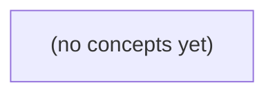

# 《04.12 网络排障与协议演进：Go 初学者的 IM 断线慢投递纸上演练》

*以虚构 IM 消息“公告”在代理超时、重复提交和离线补偿中的不确定结果为主线，建立从网络阶段、抓包证据到应用合同的排障框架。读者将学习用 Go 相关观测工具理解 DNS、TCP、TLS、HTTP、WebSocket、代理与后端之间的责任边界，并完成 22 道附答案的分层练习。*

**章节:** 2

---

## 本书导览

- 了解整本书的章节脉络
- 掌握各章之间的概念依赖关系
- 选择最合适的阅读顺序

# 《04.12 网络排障与协议演进：Go 初学者的 IM 断线慢投递纸上演练》

以虚构 IM 消息“公告”在代理超时、重复提交和离线补偿中的不确定结果为主线，建立从网络阶段、抓包证据到应用合同的排障框架。读者将学习用 Go 相关观测工具理解 DNS、TCP、TLS、HTTP、WebSocket、代理与后端之间的责任边界，并完成 22 道附答案的分层练习。

下方的概念图展示了本书 0 个核心概念以及它们之间的依赖关系；再下方是 1 个章节的入口。你可以按从上到下的顺序阅读，也可以根据自己的兴趣或先验知识选择切入点。

#### 概念图

## 章节索引

- **04.12 网络排障与协议演进：用阶段证据审一次断线** — 面向Go初学者，以合成A→P→N1的504/409纸上故障训练抓包可见范围、阶段计时、错误归因、兼容矩阵与限额。

## 04.12 网络排障与协议演进：用阶段证据审一次断线

- 固定用户症状和S2/设备确认点
- 限定抓包采集点/TLS密文的证据范围
- 手算分阶段1000ms时间线
- 区分DNS/TCP/TLS/WS/代理/业务错误
- 设计协议兼容/限额/重试停止门
- 完成纸上遏制、核影响与复盘

先把“B是否收到”拆成可证伪的待核命题：504、409、S2与离线补偿分别证明什么，又不能证明什么？

### 把症状改写为待核命题

### 把症状改写为待核命题

“`504` 后重试得 `409`，B 又离线 25h”不是结论链，而是一组需要分别核验的症状。先把用户问题拆开：

- **A 是否成功提交？**  
  1. A 的请求是否实际到达代理 P？查 A→P 连接记录、P 访问日志与请求 ID `m-9`。  
  2. P 是否将该请求转发给 N1，且正文确为 `公告`、长度为 6 UTF-8 B？查 P 上游日志、N1 入站日志。  
  3. N1 是否完成 S2 内存受理？这需要 N1 进程日志、消息状态表或内存事件记录；即使有 `S2 200`，也不能推出已持久化、已投递或已被 B 阅读。

- **为何 A 看到 504？**  
  `504` 只证明 P 在超时窗口内没有得到可返回给 A 的上游响应。待核验的是：N1 根本未响应、响应迟到、P 与 N1 之间断连，还是 P 已收到响应却未能回写 A。

- **第二次 409 说明什么？**  
  它只表明处理重试的某个实例发现 `m-9` 冲突。必须确认该实例是谁、冲突记录何时建立、它指向“已受理”“处理中”还是“未知结果”；不能把 `409` 自动解释为 B 已收到。

- **B 是否可获得该消息？**  
  分别检查 B 的会话连接、订阅/历史游标、授权状态，以及 broker 中 `m-9` 的保留与投递记录。B 离线 25h 超过教学 broker 的 24h 保留期，因此不能仅凭离线补偿机制断言完整补齐。

最终应分别给出“提交状态”“响应丢失位置”“去重状态”“B 的可投递/已投递/已确认状态”，而非用单一抓包替代整条证据链。

### 504与409的证据边界

### 504 与 409 的证据边界

`504` 与 `409` 都是**阶段性现象**，不是“B 已收到”或“B 未收到”的送达判决。

| 现象 | 能证明什么 | 不能证明什么 |
|---|---|---|
| P 返回 `504` | P 在等待上游响应的期限内，没有拿到可返回给 A 的响应 | 请求未到 P；P 未转发 N1；N1 未受理；N1 未继续处理；B 未收到 |
| 同 ID 重试返回 `409` | 产生该响应的实例认为 `m-9` 已与既有记录冲突 | 这条既有记录一定是首次请求创建；首次请求一定成功回复 A；消息已投递给 B |

因此，最危险的推理是：`504 → 失败 → 可以安全重发`。实际时序可能是：

1. A 将 `m-9` 发到 P；
2. P 转发给 N1；
3. N1 完成 S2 内存受理，或已写入幂等记录；
4. N1 的响应在 P 超时后才到达，或返回路径中断；
5. A 只看见 `504`；
6. A 重试同一 `m-9`，某实例发现冲突并返回 `409`。

这里的 `504` 表示“**A 未及时获知结果**”，`409` 表示“**系统某处看见了同一 ID 的既有状态**”。二者合起来最多提高“首次尝试可能已被处理”的可能性，仍不能推出 B 的连接已接收、客户端已展示，或离线历史已在 24 小时保留窗口内完整补齐。

核验时应分别追问：P 的入站与转发日志是否含 `m-9`？N1 是否记录 S2、幂等键或持久化结果？返回响应为何未抵达 A？返回 `409` 的具体实例、时间和冲突记录是什么？只有再结合 broker 历史、B 的授权与连接消费证据，才能讨论“B 到底收到了吗”。

### 按阶段定位可见证据

### 按阶段定位可见证据

将一次发送拆为可观察阶段；每一阶段只证明本阶段事实，不能越级推断 B 已收到。

- **DNS**：在 A 与 P 的解析器采集查询时间、域名、返回地址、缓存命中、`TTL`、失败码。它可解释是否解析到预期代理地址，但不能证明 TCP 已建立。
- **TCP**：A、P 的连接日志或流量摘要记录五元组、`SYN/SYN-ACK/ACK` 时间、重传、复位、关闭方向。A 到 P 建连成功，只说明到达 P 的传输通道曾可用。
- **TLS**：记录握手版本、`SNI`、证书指纹、协商套件、握手失败原因、会话标识和时间线。普通抓包只能看到握手与密文长度/时序；没有会话密钥，不能从 TLS 载荷确认 `m-9`、`公告`或 HTTP 状态。
- **HTTP 或 WebSocket**：在 A 的应用日志记录请求 ID、消息 ID `m-9`、正文长度 `6 B`、发送时间、响应码及超时原因；若可控解密，在 P 记录方法、路径、升级结果、帧方向、关联 ID。`504` 是 P 未在期限内取得上游响应，不等于 N1 未受理。
- **代理转发**：P 应记录入站请求关联号、选中的 N1、上游连接、转发开始/结束、上游响应码、超时点和重试次数。关键命题是：P 是否将同一 `m-9` 真正写入发往 N1 的上游连接。
- **N1 受理**：N1 记录实例名、请求关联号、`m-9`、幂等表查询与写入结果、S2 内存受理时间、返回码。此处的 `200` 仅证明 N1 进程内完成受理；第二次 `409` 还须用实例名和幂等记录确认来源。
- **B 端补偿**：broker 与 B 侧记录订阅、授权、连接状态、离线队列写入/过期、历史游标、补偿扫描范围、投递确认。B 离线 `25h` 而保留仅 `24h` 时，必须查 `m-9` 是否进入保留窗口及是否已过期，不能由 A 的 `504/409` 推出投递结论。

### 从S2到离线补偿的断层

### 从 S2 到离线补偿的断层

即使事后查到 N1 曾对 `m-9` 记录 `S2 200`，也只能确认：N1 进程当时已在**内存中受理**这条消息。它不能单独推出消息已持久化、已投递给 broker、已进入 B 的离线队列，更不能推出 B 的设备已经展示“公告”。

这里至少有两段独立链路：

1. **N1 内存受理 → broker 持久化/路由成功**  
   要查 N1 的出站日志、broker 接收确认、消息路由记录。若 N1 在返回 S2 后崩溃，或异步投递失败，S2 仍可能存在而 broker 从未拥有 `m-9`。

2. **broker 留存 → B 重连后的历史补齐**  
   B 离线约 $25\text{ h}$，而教学 broker 只保证保留 $24\text{ h}$。因此即使 `m-9` 曾成功进入 broker，也可能在 B 重连前过期、被清理或落在不可补齐的时间窗之外。

应分别核验：`m-9` 的 broker 入库时间、过期时间、清理记录；B 的断连与重连时间；B 重连后携带的游标或历史请求；broker 对该用户/会话的授权和补发结果。只有这些证据能闭合“已入 broker—仍在保留期—B 有资格拉取—B 实际确认”的链条，才能回答 B 是否收到。仅凭 S2、504、409 或 B 曾离线这一组现象，结论只能是：**完整离线补偿尚未得到确认**。

### 纸上遏制与复盘闭环

### 纸上遏制与复盘闭环

先停止把 `504 → 重试 → 409` 当作“已送达”的替代证据。遏制的目标不是立刻回答 B 是否收到，而是防止同一逻辑消息被不同 ID 重复投递，并保住可核验的现场。

- **设置停止重试门**：对 `m-9` 冻结自动重试与人工“换 ID 再发”。只有在确认 N1 未完成 S2、且 broker 未写入对应事件时，才允许生成新的补发动作；补发必须关联原 ID、原因、操作者与时间。
- **核查 ID 兼容与限额**：确认 P、N1、broker 的幂等键是否都使用同一命名空间，`m-9` 的 TTL、长度、字符集及去重窗口是否一致。尤其检查“409”是全局持久去重、实例内缓存冲突，还是代理层缓存响应；三者对送达结论完全不同。
- **确认影响范围**：按 `m-9`、A、B、会话 `c-a`、N1 实例、P 请求链路和 broker 分区查询。除 B 外，还要排查是否有同一会话的其他订阅端、是否发生跨实例重复受理，以及 24h 保留边界附近是否存在批量历史缺口。
- **固定证据快照**：导出 P 的入口与上游请求日志、N1 的 S2 受理记录和实例重启记录、broker 的写入/消费偏移、B 的最后在线时间、重连历史与授权结果。日志中应保留关联 ID，而非只保留模糊的“超时”文本。

复盘行动应直接对应证据缺口：若无法证明 P 是否转发，就补齐代理请求关联；若 S2 仅在内存可见，就增加持久受理或可查询回执；若 409 无法定位产生实例，就在冲突响应中记录去重层级与实例标识；若离线超过保留期后无从判断历史是否补齐，就明确产品语义：`24h` 是保留上限，不是对 `25h` 离线用户的送达承诺。最终结论应写成“已证实、未证实、不可再恢复核验”三类，而不是用一次状态码替代端到端事实。

> **要点** — 504、409和S2都不是B已收到的证明；必须沿请求、受理、存储、补偿与消费链分别取证。

面对一份获许可的合成抓包，先确认“在哪里、何时、看到了什么”，再沿同一连接还原握手、传输与关闭证据，避免把可见元数据误判为应用明文。

### 先界定采集点与证据边界

### 先界定采集点与证据边界

读包前先写清“这份证据从哪里来”。同一条 TCP 连接在客户端、代理 P、网络镜像口和服务 N1 旁采集，看到的方向、时延、是否含代理重建连接都会不同。至少记录：

- **采集点与接口**：例如“P 的外网侧接口”或“N1 入站镜像口”；不要笼统写“网络抓包”。
- **时间来源**：主机时钟、同步状态、时区与抓包开始/结束时间。时间戳可排序事件，但跨设备比较前需考虑时钟偏差与采集延迟。
- **授权范围**：本练习仅分析获许可的合成流量及元数据；不导出、不推断真实用户内容。
- **可见层次**：包列表中的编号、时间、源/目的地址端口、协议、长度和摘要，是该采集点观测到的元数据。显示过滤只隐藏视图中的包，原始编号不会重排。

尤其要标明 TLS 边界。若 A→P 使用 TLS，普通抓包通常只能证明某地址端口间出现了 TCP 字节、TLS 握手或 TLS 记录，以及其长度和时序；它**不能证明**其中存在某段 JSON、`message_id` 或用户正文。即使某个 TLS 记录紧接着连接关闭，也只能支持“加密传输在此前发生”，不能推出“某条消息已被应用接收”。

要证明 TLS 终止后的应用事实，应转向另有权限的 P 解密后日志或 N1 应用入口日志，并注明其生成位置和关联键。未经单独授权，不应获取会话密钥、解密内容或把网络元数据扩展解释为应用明文。

### 读懂包列表的基础字段

### 读懂包列表的基础字段

包列表是抓包分析的“索引页”。面对获许可的合成抓包，先用每一行的基础字段建立候选连接，而不是急于从摘要推断业务含义。

- **编号**：表示该包在原始捕获文件中的出现顺序。即使应用显示过滤器，例如只显示 `tcp.port == 443`，编号通常仍保留原始编号，**不会重新从 1 排序**。因此“第 180 包后出现第 205 包”表示中间原本还有包，只是可能被过滤隐藏。
- **时间**：常显示相对首包的时间，也可切换为绝对时间或相邻包间隔。比较 `SYN`、`SYN/ACK`、重传与 `RST` 的间隔，可初步判断超时、延迟或突发中断；但时间戳精度受网卡、操作系统和采集点影响，不能当作全网精确时钟。
- **源地址与目的地址、端口**：用五元组  
  `源IP:源端口 → 目的IP:目的端口 + 传输层协议`  
  关联同一方向的候选流。回包通常将地址端口对调；仅看“端口 443”不足以证明某个具体应用会话。
- **协议**：显示 Wireshark 当前识别出的协议层，如 `TCP`、`TLSv1.3`、`HTTP2`。`TLS` 说明看到了加密记录，不代表已经读到其中的 JSON 或 `message_id`。
- **长度**：是捕获到的帧或包长度。连续小包、接近路径最大传输单元的大包、零载荷 ACK 都可能有不同含义，但不能单独据此判断消息内容或成功状态。
- **摘要（Info）**：常包含 `SYN`、`ACK`、`Seq`、`Len`、`Retransmission`、`RST` 等速记信息，适合快速筛选；最终结论仍应进入包详情核对标志位、序号和时间关系。

可先按地址、端口或协议过滤，再从保留的原始编号回看前后包。例如，看到某条 `TCP Retransmission` 时，应检查同一五元组此前是否有未获确认的数据，以及之后是否出现新的 ACK、关闭或 `RST`。

### 按五元组关联同一连接

### 按五元组关联同一连接

一条 TCP 连接先由五元组定位：

$$
(\text{源 IP},\ \text{源端口},\ \text{目的 IP},\ \text{目的端口},\ \text{传输层协议})
$$

例如，`10.0.0.8:51432 → 203.0.113.20:443, TCP` 可标识客户端 A 到代理 P 的一个方向；反向的 `203.0.113.20:443 → 10.0.0.8:51432, TCP` 属于同一双向会话。关联时应把正、反两个方向视为同一个连接，而不是两条独立流。

按时间顺序，典型建连证据为：

1. A 发送 `SYN`：请求建立连接；
2. P 返回 `SYN, ACK`：接受并确认；
3. A 返回 `ACK`：三次握手完成；
4. 双方出现带载荷的数据段及相应 ACK；
5. 结束时可见 `FIN, ACK` 的有序关闭，或 `RST` 的异常中止。

同一五元组中的包还应检查 TCP 序号、确认号和时间间隔。若某数据段后未见预期 ACK，随后出现序号相同或载荷范围相同的再次发送，可将其标为重传候选；但应结合抓包点判断，因为采集遗漏也会造成“像重传”的表象。

需特别注意：五元组并非永久唯一。旧连接关闭后，系统可能复用相同客户端端口；因此必须用握手、序号空间和时间邻近性划分连接世代。显示过滤只能缩小观察范围，Wireshark 包编号不会因过滤而重排；记录原始包号与采集时间，才能让后续证据可复核。

### 从合成时间线识别传输异常

### 从合成时间线识别传输异常

以下记录来自 A 与代理 P 之间、采集点位于 A 出口的获许可合成抓包。先以五元组 `A:49152 → P:443` 关联同一条 TCP 连接；包号只是列表中的原始编号，应用显示过滤后不会重新编号。

| 时间 | 包号 | 方向 | 摘要 | 阶段判断 |
|---:|---:|---|---|---|
| 0 ms | 18 | A→P | `SYN` | A 发起建连 |
| 180 ms | 19 | P→A | `SYN, ACK` | 握手首个响应较慢，建连延迟约 180 ms |
| 181 ms | 20 | A→P | `ACK` | TCP 三次握手完成 |
| 210 ms | 24 | A→P | `PSH, ACK, Len=517` | A 发送 TLS 记录；不能据此断言其中有 JSON 或 `message_id` |
| 410 ms | 25 | A→P | 与包 24 序号、长度相同 | 同一段再次发送，出现重传迹象 |
| 620 ms | 27 | P→A | `ACK` | P 确认收到了该 TCP 字节范围 |
| 700 ms | 30 | P→A | `RST, ACK` | P 或其路径上的可见端点异常复位连接 |

这里应区分三类现象：

- **建连延迟**：`SYN` 到 `SYN, ACK` 的 180 ms 是握手等待，不等于业务处理耗时；还可能受采集点位置、链路往返时延影响。
- **重传等待**：210 ms 后相同序号的数据在 410 ms 重发，说明 A 在约 200 ms 内未获得足以推进发送状态的确认。它提示丢包、排队或对端处理异常，但不能仅凭一次重传定位责任方。
- **代理断开**：700 ms 的 `RST` 表示连接被强制终止；若地址确为 P，则可表述为“P 侧可见复位”，不能直接推断是代理进程、负载均衡设备还是中间路径所致。

作为对照，正常关闭通常呈现 `FIN, ACK`：一方发送 FIN，另一方确认，再由另一方发送 FIN，最后收到 ACK。RST 没有这套有序挥手，因此更像异常中断。时间戳精度和单点采集视角有限，结论应写成阶段证据，而非声称已读到 TLS 内的应用内容。

### 避免越过 TLS 与抓包精度下结论

### 避免越过 TLS 与抓包精度下结论

TLS 抓包首先回答的是“连接发生了什么”，而不是“用户发送了什么”。在普通网络采集点，通常可见源/目的地址与端口、TCP 标志位、序号确认号、载荷长度、TLS 握手与记录边界，以及连接何时重传、关闭或被 `RST` 重置；但这些证据不足以推出明文 JSON、`message_id`、收件人或用户正文。

`Follow Stream` 适合把同一 TCP 流的双向字节按顺序聚合，帮助检查握手后的数据量、方向切换和断开位置。对 TLS 流而言，其中大多仍是密文或 TLS 记录；看到连续字节不等于能够解释其应用语义。显示过滤器也只隐藏不相关包，包编号不会重排，因此引用证据时应保留原始包号、时间戳和采集点。

时间同样要谨慎：时间戳反映的是抓包设备观察到数据包的时刻，受网卡卸载、缓冲、镜像链路、时钟同步和显示精度影响。相邻包的微小间隔不能单独证明服务端处理耗时，更不能据此断言“消息已写入”或“对方已读”。

若调查必须确认应用字段，应将问题转交给具备授权边界的 TLS 终止代理日志、应用入口日志或消息系统审计日志，并按关联标识、时间窗和访问控制交叉验证。抓包只陈述可见传输事实；应用语义由有权日志证明。

> **要点** — 抓包先定采集边界，再按连接与时间线读元数据；TLS 密文不能替代应用日志，更不能据此断言业务字段。

以一次合成的 A→P→N1 断线演练为主线，将“1000 ms”拆成可核验的阶段证据，而非把总耗时误判为单点故障。

### 先固定症状与确认点

### 先固定症状与确认点

先记录用户真正看见的现象，而不是立刻把“断线”归因于某一跳。对本次 A→P→N1 演练，可将症状写成：客户端请求在约 `1000 ms` 后收到 `504`；页面是否显示失败、是否自动重试、用户是否重复提交，都属于需要保留的事实。

将观察点固定为：

- **S2（客户端）**：记录请求开始/结束、状态码、错误文本、`request_id`、`attempt`、目标地址，以及可用的 DNS、建连、TLS、首响应字节阶段钩子。`httptrace` 仅描述该客户端的出站请求，连接复用时未必出现新的建连阶段。
- **设备确认点**：在 P 与 N1 分别查找同一关联标识的访问日志、代理日志或追踪跨度，确认请求是否到达、何时转发、是否收到上游响应。客户端 `GotConn` 不能替代 P→N1 的建连证据。
- **身份规则**：每次尝试都生成或传播同一个逻辑操作标识，并单独标记尝试序号，例如 `request_id=R7, attempt=1` 与 `request_id=R7, attempt=2`。第二次请求即使返回 `409`，也只能证明其自身结果，不能反推第一次已以相同正文成功。

若各机器时钟未同步，优先核对同一 `request_id` 的阶段顺序和单机耗时，不以跨机器绝对时间戳直接判定因果。

### 把 1000 ms 拆成阶段卡

### 把 1000 ms 拆成阶段卡

先把一次合成的 `A→P→N1` 请求写成**假设性**时间线：

| 阶段 | 耗时 | 边界与含义 | 应核对的证据 |
|---|---:|---|---|
| 名称解析 | 20 ms | A 选择并解析 P 的地址 | DNS 事件、解析器日志 |
| 建立连接 | 30 ms | A 到 P 的 TCP/QUIC 建连 | `ConnectStart`、`ConnectDone`、抓包 |
| TLS 握手 | 40 ms | A 与 P 协商加密会话 | `TLSHandshakeStart`、`TLSHandshakeDone` |
| 上游等待 | 900 ms | P 转发至 N1、N1 排队/处理、P 等待响应 | P 与 N1 的关联追踪、代理访问日志、后端日志 |
| 回传首字节 | 10 ms | P 收到上游结果后向 A 返回首响应字节 | `GotFirstResponseByte`、P 响应日志 |

因此：

\[
20+30+40+900+10=1000\text{ ms}
\]

这不是超时配置，也不是实测结论；它只说明：若总耗时为 `1000 ms`，证据应优先指向占比最大的 `900 ms`，而非先把“断线”归咎于 DNS、TCP 或 TLS。

注意边界不能混写。Go 的 `httptrace.ClientTrace` 观察的是 **A 发出的 HTTP 请求**：`GotConn` 表示客户端取得了连接，连接可能来自复用池，未必发生了新的 A→P 建连；若 P 是代理，客户端追踪也看不到 P→N1 的真实建连和等待。要证明 `900 ms` 落在何处，必须用同一请求 ID 关联 P 的转发记录与 N1 的处理记录。

若随后重试，则另起一张阶段卡：`attempt=2`、目标实例、开始时间和各阶段耗时均单独记录，不能与第一次的 `1000 ms` 相加或混成一次请求。

### 限定抓包与追踪证据

### 限定抓包与追踪证据

同一条“请求耗时 1000 ms”的证据，证明力取决于采集位置，不能跨层越界解释。

- **客户端抓包**只能证明 A 与其直接对端之间的报文事实：是否完成 TCP 三次握手、何时发送 TLS `ClientHello`、何时收到响应字节、是否发生重传或连接复位。若启用 TLS，抓包通常看到的是密文；它不能直接证明 HTTP 路径、状态码、代理是否已转发到 N1，更不能读出后端处理耗时。
- **`httptrace.ClientTrace`**为出站 `net/http` 请求标记 DNS、连接建立、TLS 握手、获得连接、写入请求、首响应字节等客户端阶段。它适合将纸面卡片拆成可观测区间，例如 `DNSDone → ConnectDone → TLSHandshakeDone → GotFirstResponseByte`。但连接复用时没有新的建连或握手；经代理时，`GotConn` 表示客户端取得到代理的连接，不是 P→N1 的建连证据。
- **代理日志**可证明 P 是否收到请求、匹配到哪个上游、何时开始和结束上游转发、最终向 A 返回何种状态。记录 `request_id`、`attempt`、上游实例、连接复用标记和各阶段耗时，才能将 A→P 与 P→N1 分开。
- **后端关联追踪或日志**可证明 N1 是否实际收到该次调用、进入了哪个处理阶段、是否向下游继续请求，以及何时产生响应。仅有 P 的 504 不能推出 N1 必然未执行；仅有后续 409 也不能反推第一次以相同正文成功。

应以同一 `request_id` 串联证据，并把重试明确写为 `attempt=1`、`attempt=2`。跨机器绝对时间戳受时钟偏差影响，优先核对单机持续时间与阶段先后顺序；只有在时钟已校准时，才比较 P 与 N1 的精确时间差。

### 分离首次与重试请求

### 分离首次与重试请求

设客户端以请求标识 `req-7f3a` 发起首次调用：

| 尝试 | 时间 | 目标实例 | 结果 | 独立证据 |
|---|---:|---|---|---|
| `attempt=1` | 10:00:00 | `N1` | `504`，耗时 1000 ms | 客户端 trace、P 的网关日志、N1 关联日志 |
| `attempt=2` | 10:00:01 | `N2` | `409 Conflict`，耗时 35 ms | 第二次客户端 trace、P→N2 路由记录、N2 应用日志 |

两次请求可以共享业务请求标识，用于关联同一用户意图；但排障记录必须额外带上 `attempt`、实际目标实例、开始时间、结束时间和本次响应码。否则，`1000 ms + 35 ms` 会被错误拼成“一次请求耗时 1035 ms”，`N2` 的 `409` 也可能被误归因给 `N1` 的超时。

`409` 只说明第二次尝试到达的处理方拒绝了当前状态，例如发现幂等键已存在、版本冲突或资源已被创建。它**不能**单独证明：

- 第一次请求一定以相同正文成功；
- 第一次已到达 `N1` 的应用层；
- `N1`、代理或后端中保存了完整结果。

应分别核证：`attempt=1` 在 P、N1、后端各走到哪个阶段；`attempt=2` 为什么被路由至 N2，以及 N2 生成 `409` 时查询到的具体状态。若机器时钟未同步，优先比较同机日志中的持续时间和同一标识下的阶段先后，而非直接相减跨机绝对时间戳。

### 形成遏制与复盘闭环

### 形成遏制与复盘闭环

遏制措施必须对应已核验的阶段证据，而不是看到“总耗时 1000 ms”便统一加大超时。若证据显示 `P→N1` 的后端等待占约 `900 ms`，优先限制该跳的并发、队列长度和单次尝试预算；若 DNS、建连或 TLS 阶段异常，则分别审查解析、连接池、证书与网络路径。

建立兼容矩阵，明确调用方、代理、后端对关键行为的共同约束：

- 幂等请求可在明确预算内重试；非幂等写入必须携带幂等键或禁止自动重试。
- 代理返回 `504` 后，客户端再次发送同一业务操作时，记录为 `attempt=2`，并单独记录目标实例、请求 ID、开始时间和结果。
- `409` 只能说明第二次尝试遇到冲突，不能反推第一次一定以相同正文成功；应以服务端幂等记录、事务日志或关联 trace 核验。
- 设置停止门：达到最大尝试次数、剩余端到端预算不足、检测到过载、熔断开启或操作不可安全重放时，立即停止重试。

限额应覆盖请求体大小、排队深度、每租户并发、每实例连接数及重试风暴上限；否则局部慢请求会经重试放大为全链路拥塞。

复盘时按请求 ID 对齐 A、P、N1 的阶段顺序，分别保存单机耗时与采样率。机器时钟未同步时，不以绝对时间戳直接判定先后；优先比较同机持续时间、同一 trace 的父子关系与事件序列。最后核对遏制后错误率、尾延迟、重试率、重复写入和受影响实例范围，确认措施没有仅把故障从一个阶段迁移到另一个阶段。

> **要点** — 总耗时不是单点证据；按请求尝试、网络阶段与采集位置分别核证，才能可靠归因与止损。

排障先问最早在哪一层违背已知前提；证据链一旦断在前层，就不能把后层猜测写成结论。

### 以最早违背前提建立排障树

### 以最早违背前提建立排障树

同样是“连接失败”，证据所处阶段可能完全不同。排障树不应从“网络故障”这个笼统标签开始，而应沿 $A \rightarrow P \rightarrow N1 \rightarrow S2$ 的依赖顺序追问：**最早哪一层已经违背已知前提？**

- **A：名称与地址。** 用户输入域名后，先确认 DNS 是否得到预期记录、地址是否可路由。若解析失败、返回错误地址或连接目标不可达，则尚无 TCP，更不能推断 TLS、HTTP 或业务接口状态。
- **P：传输与安全协商。** DNS 已确认后，检查 TCP 是否完成握手；建连成功才有 TLS。TLS 失败时还要区分证书链不受信任、名称不匹配、协议或密码套件不兼容。尤其“证书名称错误”说明客户端到达了某个服务，却不能证明它是应当信任的目标。
- **N1：网络协议交互。** TLS 已建立后，才审 HTTP 状态、重定向、认证挑战，或 WebSocket 升级是否成功。代理返回 `502` 表示作为网关收到上游无效响应，`503` 表示服务暂不可用，`504` 表示等待上游超时；它们不是同一种“服务器挂了”。
- **S2：业务确认点。** 仅当请求已到达预期应用，才解释 `404`、`409`、`200` 等为资源、并发或业务合同结果。

WebSocket 也要拆开记录：升级失败属于 HTTP 阶段；已升级后的 Close 帧、状态码和关闭原因属于会话阶段。若 TCP 突然中断，本端可观察到异常关闭 `1006`；这表示“未收到正常关闭帧”，不能写成“对端发送了 1006”。排障结论应止于最早断裂的证据边界，后续层只列为尚未验证。

### 名称、建连与信任边界

### 名称、建连与信任边界

将一次访问抽成依赖链：

`名称解析 → TCP 建连 → TLS 握手与证书校验 → HTTP/WebSocket`

排障结论应停在**最早失败阶段**。例如 DNS 返回 `NXDOMAIN`、超时或解析到错误地址时，只能证明名称到地址的映射不可用、不可达或与预期不符；此时没有针对预期端点的 TCP 连接证据，更不能写“服务器拒绝连接”“证书失效”或“接口异常”。

若已得到目标 IP，但 `connect()` 收到拒绝、超时或不可达，则问题已进入 TCP 路径：可能是端口未监听、防火墙丢弃、路由异常、负载均衡健康检查或地址族选择错误。它排除了“仅因 DNS 未解析而无法发起连接”，却**不能证明**应用进程是否健康：端口可监听而后端仍可能失败。

TCP 三次握手成功后，才有 TLS 证据。握手失败、协议版本/密码套件不兼容、证书链不受信任、证书过期，分别说明信任或协商边界未通过；其中“名称不匹配”尤其关键：客户端连接到了某个地址，但该地址提交的身份不能证明自己是所请求的主机名。它不能推出“服务一定被劫持”，也不能据此评价 HTTP 路由或业务状态。

可按证据写成：

- `DNS：api.example.com → NXDOMAIN`：未获得目标地址，停止判断后续层。
- `TCP：IP:443 超时`：地址已知但建连未完成，尚未发生 TLS。
- `TLS：证书 SAN 不含 api.example.com`：TCP 已通，但目标身份未获验证；不要继续把响应内容当作该主机的可信业务响应。

### 升级、关闭与本端观察

### 升级、关闭与本端观察

WebSocket 不是“HTTP 请求一直挂着”。它先经 HTTP 发起升级；升级成功后，连接进入 WebSocket 帧语义。因此应按阶段区分证据：

| 观察到的现象 | 最早可确认的阶段 | 可写结论 | 不应越级推断 |
|---|---|---|---|
| 收到 `401`、`403`、`404`、`502` 等 HTTP 响应，未见 `101` | HTTP 升级前 | 升级请求被 HTTP 层拒绝或代理失败 | “WebSocket 已连接后被踢下线” |
| 收到 `101 Switching Protocols`，随后收发帧 | WebSocket 已建立 | 升级成功，后续问题属于帧、关闭或底层传输阶段 | 把后续业务消息失败写成升级失败 |
| 双方交换 Close 帧，随后 TCP 结束 | 正常关闭握手 | 连接按 WebSocket 关闭流程终止；可记录关闭码与原因 | 仅凭关闭码断定根因或责任方 |
| 本端报告 `1006`，未收到 Close 帧 | 本端观察到异常关闭 | 本端未获得有效的关闭帧；可能是 TCP 断开、代理重置、进程崩溃或链路中断 | “对端发送了 `1006`” |

`1006` 是本地用于描述“异常关闭、未收到 Close 帧”的保留观察值，不能作为网络中收到的 Close 帧码，更不能直接归责对端。日志宜写：`本端以 1006 结束，抓包/服务端日志未见对端 Close 帧`。

HTTP 业务响应则是另一条路径：普通请求收到 `200`、`404`、`409`，表示已经到达 HTTP 应用合同层。只有在确认获得有效 HTTP 响应后，才讨论资源不存在、状态冲突或业务成功；若升级前就得到 `502/503/504`，应先审代理、上游可用性或超时链路，而非审 WebSocket 关闭码。

### 代理状态与N1业务合同

### 代理状态与 N1 业务合同

代理返回 `502`、`503`、`504`，并不等价于笼统的“后端挂了”，应先按网关语义定位证据边界：

- `502 Bad Gateway`：代理作为网关收到上游的无效响应，例如连接虽建立但响应协议损坏、上游过早断开或返回了代理无法解析的内容。
- `503 Service Unavailable`：服务当前不可用，常见于维护、过载、实例被摘除或限流；它表达的是暂时无法处理，不必然意味着请求已经到达目标业务进程。
- `504 Gateway Timeout`：代理等待上游响应超时。超时可能发生在连接、发送请求或读取响应阶段；“上游慢”是合理假设，但仍需结合代理日志的具体超时点确认。

因此，`5xx` 停在代理层时，证据只能证明“代理未能完成向上游转交或取得有效响应”；不能据此断言某个 N1 节点已执行了业务逻辑，更不能直接审查 S2 的资源状态。

只有请求确已到达 N1，且获得来自该业务边界的可归属响应，才进入 S2 合同审查：

- `404`：目标资源或路由在该合同中不存在；先核对标识、租户、版本与可见性约束。
- `409`：请求与当前资源状态冲突，例如版本竞争、重复创建或状态机不允许迁移；它通常提示调用方需要读取最新状态、去重或调整操作顺序。
- `200`：表示该次请求按合同成功处理，但不自动证明“所有预期副作用都已完成”；仍要核对响应字段、幂等键、异步任务标识及可观察到的状态变更。

排障记录应写成“代理于读取上游响应阶段返回 `504`，未取得 N1 可归属响应”，或“N1 返回 `409`，冲突键为……”。前者止于网关，后者才是业务合同证据。

### 按时间线写出可执行结论

### 按时间线写出可执行结论

把一次断线压缩为带采集点的 `1000 ms` 时间线，而不是写“网络不稳定”：

- `0–80 ms`：DNS 返回 `NXDOMAIN`、超时或地址异常；此时结论止于名称解析，不能推断 TCP、TLS 或业务接口。
- `80–250 ms`：TCP `SYN` 无响应、被拒绝或连接建立；采集点应注明客户端抓包、负载均衡日志还是服务端监听日志。
- `250–500 ms`：TLS 握手失败。证书名称不匹配、过期、链不受信任属于客户端信任边界；不能笼统归因于“服务端宕机”。
- `500–800 ms`：HTTP/WebSocket 升级。`502` 表示网关收到上游无效响应，`503` 表示暂不可用，`504` 表示等待上游超时；它们的处置对象不同。
- `800–1000 ms`：仅在前层均成立时审业务合同，例如 `404` 是资源不存在，`409` 是状态冲突，`200` 才表示请求成功。

对 WebSocket 另记关闭证据：收到 Close 帧及状态码，才能陈述“对端以该码关闭”；本端记录 `1006` 仅表示异常关闭观察值，不能写成“对端发送了 1006”。

遏制结论应包含兼容矩阵：客户端版本 × 协议版本 × 代理路径 × 服务端版本，标出首个失败组合。重试必须设停止门：如连续两次 DNS 失败停止业务重试并切换解析诊断；收到 `409` 停止盲重试并刷新状态；证书错误不自动重试。最后核对影响范围、恢复时间、仍未知的采集盲区，并把下一次需补充的日志字段写入复盘。

> **要点** — 以最早失效层为结论边界：前层未成立，后层不得臆测；本端观察也不能替代对端事实。

同一次断线必须用多类证据交叉审计：它们能互补定位阶段，却都不能单独证明完整事实。

### 四类证据的观察边界

### 四类证据的观察边界

同一请求的“发生过”必须拆成多个可验证阶段；四类证据看到的是不同切面，不能互相越权推断。

- **抓包**记录某采集点看到的报文与连接时间线：例如 A 向 P 发出 SYN、TLS 记录、HTTP/gRPC 帧，或 N1 回了 TCP ACK。它可证明“包到过该网卡附近”或“传输层确认过字节”，但不能证明应用已解析请求、完成授权，或业务已落库。中间代理、重传、加密和未覆盖的采集点都会留下盲区。

- **应用日志**记录 N1 实际执行到的代码路径，如 `request_id` 对应的鉴权拒绝、`message_id` 去重命中、状态机判断和业务确认点。它最接近应用语义，但受采样、异步写盘、崩溃、日志级别及脱敏策略影响。查不到 N1 日志，只能说明“未找到记录”，不能证明 N1 未执行。

- **分布式 Trace**用 `request_id`、`attempt_id` 关联 A、P、N1 的 span，展示 DNS、连接、代理、授权和处理等阶段时延。它适合定位延迟落在哪一跳；但缺失的上下文传播、采样丢弃、时钟偏差会断开链路。即使 trace 显示 N1 返回 `200 accepted_in_memory`，也不能自动证明 DB 提交或设备 ACK。

- **指标**聚合一段时间内的错误桶、吞吐和尾时延，擅长发现“某版本后 5xx 增长”或“P99 恶化”，却通常无法还原某个用户请求的因果链。标签过粗会掩盖实例差异，标签过细又可能带来基数膨胀或隐私泄露。

审计记录应只保留必要的非敏感关联标识、授权结果、协议与实例、阶段时长、错误和用户可见结果；私聊正文、凭据与 TLS 密钥不应进入普通诊断材料。

### 从采集点还原连接时间线

### 从采集点还原连接时间线

以 `A → P → N1` 为例，先按**连接与请求实际经过的阶段**排列证据，而不是按“谁先报错”排列。设 A 为客户端，P 为代理或网关，N1 为业务实例；同一用户动作可能对应多个 `attempt_id`，因此必须先用非敏感的 `request_id`、`attempt_id`、连接标识与时间窗口归并。

一条典型时间线可写为：

1. **DNS**：A 发起域名解析，记录查询、响应、TTL、选中的 IP。DNS 成功只说明名称在当时可解析，不能证明 P 或 N1 可用。
2. **TCP**：A 与 P 的 `SYN → SYN/ACK → ACK` 表示三次握手完成；若仅见 `SYN` 重传，则问题可能在路由、防火墙、监听端口或采集盲区。
3. **TLS**：`ClientHello`、`ServerHello`、证书校验及握手完成可定位协议协商、证书链、SNI、版本或密码套件失败。TLS 建立后，普通抓包通常看不到 HTTP/gRPC 正文。
4. **协议升级或会话建立**：HTTP `101 Switching Protocols`、WebSocket 首帧、gRPC 的 HTTP/2 建连等，说明边缘协议已切换；不等于业务消息已被 N1 接受。
5. **代理转发**：P 的访问日志、上游连接记录和 Trace span 可表明其选择了哪个 N1 实例、是否复用连接、等待上游多久、收到何种响应。
6. **业务响应**：N1 日志中的授权判断、消息标识摘要、业务确认点，以及 P 回送给 A 的状态码共同界定“请求被受理到哪里”。

可将相邻事件计算为阶段延迟：

$T_{\text{end}}=T_{\text{DNS}}+T_{\text{TCP}}+T_{\text{TLS}}+T_{\text{P排队}}+T_{\text{N1处理}}+T_{\text{回传}}$

但跨机器时间戳须先确认时钟同步；抓包在 A、P、N1 的不同采集点看到的是局部事实。看到 A 收到 TCP ACK，只能证明对端 TCP 栈确认了字节；看到 P 返回 `200 accepted_in_memory`，也只能证明该确认点已达成，不能推出数据库持久化、下游投递或设备 ACK 已发生。

### 关联一次请求与多次尝试

### 关联一次请求与多次尝试

排障的最小关联单元不是某一行日志，而是“一个用户意图、若干传输尝试、可能对应一条业务消息”的关系。建议在 A、P、N1 全链路传播以下非敏感标识：

- `request_id`：由 A 在一次用户操作开始时生成，代表逻辑请求；重试、重定向或协议切换通常保持不变。
- `attempt_id`：每次实际发送、建连或调用生成新值；可区分首次尝试、超时重试、断线重连后的补发。
- `message_id`：代表待处理的业务消息或幂等键；相同消息可有多个 `attempt_id`，但不应因重试重复产生业务副作用。

例如，A 以 `request_id=r7` 发出消息 `message_id=m9`，首次 `attempt_id=a1` 在连接中断后无响应；A 重试为 `a2`。P 的转发日志、N1 的鉴权日志和 Trace span 都应同时记录这些字段及本机实例、协议、阶段时间。这样可审计地回答：`a1` 到了哪里、`a2` 是否到达 N1、N1 是否把 `m9` 判为重复并返回既有结果。

标识应放入受认证的协议元数据或受控追踪上下文，并限制长度、格式与来源；服务端不得盲信客户端声称的租户或身份。日志中记录标识的哈希或截断摘要即可，不写私聊正文、令牌和密钥。若某层未透传标识，只能依据时间窗、实例和连接信息作“候选关联”，不能把相邻时间的记录当作确定因果。

### 证据缺口与错误归因陷阱

### 证据缺口与错误归因陷阱

四类证据回答的问题不同，且都会留下缺口；排障结论应写成“当前证据支持什么”，而非“绝对证明什么”。

| 证据 | 常见缺口 | 不能推出的结论 |
|---|---|---|
| 抓包 | 采集点不在真实路径、镜像丢包、TLS 加密、仅见重传或 ACK | “TCP ACK 表示 N1 已受理业务请求” |
| 应用日志 | 采样、异步落盘失败、日志级别不足、隐私脱敏 | “没有 N1 日志，所以 N1 未执行” |
| Trace | 采样未命中、上下文未透传、跨服务时钟偏差、跨度被截断 | “一条完整 Trace 覆盖了 DB 或设备确认” |
| 指标 | 聚合掩盖单次请求、标签维度缺失、统计窗口过大 | “错误桶上升就是该用户断线的直接原因” |

尤其要区分**观测时间**与**事件发生时间**。A、P、N1 的机器时钟若偏差数秒，按日志排序可能制造“先响应、后请求”的假象。优先使用同一 Trace 的相对阶段时长、单机单调时钟，或经校时系统校正后的时间；无法校正时，应明确标注时间线不确定性。

加密与最小披露也限制可见性：TLS 使中间抓包通常只能确认连接、握手、字节量与关闭方式，不能读取业务语义；诊断记录则只保留 `request_id`、`attempt_id`、`message_id` 的非敏感摘要及授权决策，不记录私聊正文、凭据或 TLS 密钥。

较稳健的归因方式是分层陈述：例如“P 到 N1 的连接建立且请求字节已发送；N1 Trace 显示返回 `200 accepted_in_memory`；但缺少 DB 写入和设备 ACK 证据，因此只能确认内存受理，不能确认最终送达。”

### 504与409的纸上审计

### 504与409的纸上审计

设一次合成投递具有 `request_id=r71`、`attempt_id=a2`、`message_id=m9#摘要`。不要先把状态码等同于“消息成功”或“消息失败”，而应把证据放回阶段时间线：

| 阶段证据 | 记录 | 可支持的结论 | 不能推出的结论 |
|---|---|---|---|
| A→代理 | `POST` 在 10:00:00 发出；代理于 10:00:05 返回 `504` | 代理等待上游超时，调用方未获得成功响应 | N1 一定未收到请求 |
| 代理→N1 Trace | span 显示 N1 于 10:00:01 开始，10:00:04 返回 `200 accepted_in_memory` | N1 通过授权、ID/状态检查，并接受到内存队列 | 已写入 DB、已送达设备 |
| N1 业务日志 | `actor=allow`、`state=active`、`enqueue=ok` | N1 的业务确认点是“已入内存队列” | 消费者已处理该队列项 |
| 后续尝试 | `a3` 返回 `409 duplicate_message` | N1 识别到同一消息或幂等键冲突，拒绝重复副作用 | 首次投递已获设备确认 |
| 设备通道 | 无设备 ACK；或 ACK 仅对应另一 `attempt_id` | 当前证据不足以证明 `a2` 已被设备确认 | “N1 接受”就是“用户可见送达” |

这里的 `504` 常表示**响应路径失败或超时**：N1 可能根本未执行，也可能已经完成内存接受但响应在代理截止前未返回。`409` 则表示**业务或幂等冲突拒绝**；它不是网络超时，也不天然是故障，关键要审计冲突对象、既有状态和是否保留原请求结果。

最终记录应分开写：`N1确认=accepted_in_memory`、`持久化确认=未知`、`设备确认=缺失`、`用户可见结果=待定`。抓包中的 TCP ACK 只能说明传输层收包；“未查到日志”也可能来自采样、丢失或实例未覆盖，不能反证 N1 未执行。

> **要点** — 证据应按阶段、采集点和关联标识交叉验证；连接成功或日志缺失都不能替代业务确认。

协议候选变更必须先固化端到端合同：逐跳版本、握手、限额、错误与回退均应有证据，不能把网关升级误判为能力升级。

### 先画旧端与新端的逐跳合同

### 先画旧端与新端的逐跳合同

协议变更先画“谁与谁说话”，再讨论网关、HTTP/2 或 MTU。将客户端记为 `A`、代理记为 `P`、新后端记为 `N1`；旧端可能是旧代理或旧后端。`A→P` 与 `P→N1` 是两份独立合同：外部可为 HTTP/2，内部仍可为 HTTP/1.1，这不自动改变路由、权限或业务语义。

| 对照项 | 旧端合同 | 新端候选合同 | 责任边界与待证据 |
|---|---|---|---|
| `A→P` 版本 | 记录 HTTP/1.1 或既有版本 | 明确是否启用 HTTP/2 | `P` 负责协商、连接管理与外部错误呈现 |
| `P→N1` 版本 | 记录旧后端协议 | 明确 HTTP/1.1、HTTP/2 或 RPC | `P` 负责逐跳转换；`N1` 不应假定客户端版本 |
| 路由 | `/v1` 指向既定服务 | `/v1` 仍指向兼容实现 | 将 `/v1` 导向未来 `/v2` 是应用合同错位，不是协议升级 |
| TLS 名称 | 记录 SNI、证书名与校验方 | 保持或显式迁移名称 | TLS 终止点、再加密与名称校验必须逐跳标明 |
| WebSocket | 握手头、升级位置、关闭码 | 是否透传或由 `P` 终止 | 记录握手失败、正常关闭及异常关闭的责任方 |
| 限额与失败 | 正文、原始请求、超时、重试、错误码 | 仅在证据支持下调整 | 超限应明确拒绝；不得静默截断 UTF-8 `公告` 或篡改 409 |

图中还应标注回退条件：何种握手失败、错误率、兼容性证据不足或限额触发时，停止候选路径并回到旧端。尤其是尚待审核的 `R9 9 B`，不能因更大 MTU 或新版网关而默认可发送。

### 拆分 HTTP、TLS 与 WebSocket 证据

### 拆分 HTTP、TLS 与 WebSocket 证据

协议是否“升级”，不能只看客户端到网关的一段连接。应把链路拆为独立跳点，分别记录可观察证据：

- 客户端 $\rightarrow$ 代理（A→P）：协商到的 HTTP 版本、`Host`/`:authority`、TLS 的 SNI 与证书名称、请求体限额及拒绝状态。
- 代理 $\rightarrow$ 新后端（P→N1）：实际转发的 HTTP 版本、上游 TLS 名称或明文策略、连接复用、超时与重试条件。
- WebSocket：HTTP 握手成功不等于长连接语义正确；还要核验升级响应、子协议、帧大小限制、心跳，以及关闭码和关闭原因是否被保留。

因此，外部使用 HTTP/2、内部仍为 HTTP/1.1 是可接受的逐跳实现；它不能推出后端已经获得 HTTP/2 特性，更不能推出路由合同变化。若 `/v1` 被转到仅接受 `/v2` 的未来服务，问题是应用路径与版本合同错位，应以明确路由规则或兼容适配修复。

TLS 证据也必须区分两段：客户端验证的是代理证书；代理连接后端时验证的是后端证书。SNI、证书 SAN、目标 `Host` 与后端路由名任一不一致，都可能表现为“偶发断线”或错误后端命中。

对 WebSocket，记录关闭的发起方、关闭码、原因文本和是否完成关闭握手。代理超时直接断开、后端发送 `1011`、客户端主动 `1000` 具有不同含义，不能统一归因为网络抖动。只有这些逐跳证据一致，才能决定候选变更可推进或应回退。

### 用限额与错误映射守住合同

### 用限额与错误映射守住合同

限额不是单一的“网关最大包体”，而是逐层可验证的合同。候选变更应分别记录：边缘接受的原始请求上限、代理可缓冲上限、后端解析上限、业务正文上限，以及响应体、队列等待和执行时间预算。外部 HTTP/2、内部 HTTP/1.1 并存时，这些限制仍必须端到端一致；不能因协议升级而默认允许更大的请求。

建议将请求分为两类证据：

- **原始请求限额**：覆盖请求行、头、分块编码开销和未经解析的正文，用于保护连接、代理内存与缓冲区。超限应在最早能够可靠判定的层拒绝，并记录实际观测大小与拒绝层。
- **业务正文限额**：针对解压、转码、JSON/RPC 解析后的字段或附件大小，用于保护业务资源与领域规则。例如 `公告` 字段必须完整通过 UTF-8 校验；不得为“成功发送”而静默截掉字节。

错误码须表达失败阶段，而非掩盖兼容问题：

| 情形 | 应表达的结果 |
|---|---|
| 原始请求或正文超过已公布限额 | 明确的客户端请求过大错误，并返回可执行的限额信息 |
| 代理等待后端超时、上游未及时响应 | `504`，说明是网关到上游阶段失败 |
| 资源版本冲突、幂等键冲突或状态前置条件不满足 | `409`，不得改写为 `200` |
| 限流或有界队列已满 | 明确的过载/限流失败，可携带重试提示 |
| 后端拒绝私有资源访问 | 保持权限语义，不因回退路径放宽访问控制 |

还应区分“可重试”与“可回退”。`504` 只有在请求幂等、重试预算未耗尽且不会扩大负载时才可由代理重试；`409` 通常要求客户端读取最新状态或调整请求，不能盲重试。若新链路的限额、错误体或状态码无法保持旧合同，应触发回退条件，而不是以兼容层吞掉差异。R9 的 `9 B` 若尚待审，仍应按未获批准处理：更大 MTU、新版网关或 HTTP/2 都不是放行依据。

### 核对超时、重试与回退停止门

### 核对超时、重试与回退停止门

协议变更前，应把“等多久、重试几次、何时停止、何时回退”写成逐跳可执行合同，而非仅配置一个网关超时。至少区分：

- **代理等待上游超时**：代理在 `$T_p$` 内未收到后端响应头，应返回可解释的网关失败；它不等同于客户端总截止时间。
- **后端处理截止时间**：后端应在 `$T_b < T_p$` 前自行取消数据库、RPC 或流式发送，避免代理已放弃而后端继续消耗资源。
- **客户端总预算**：客户端截止时间 `$T_c$` 应覆盖连接、TLS、请求发送、代理与后端处理，并满足 `$T_c \ge T_p$`。预算耗尽后不得继续后台重试。

重试必须有预算与幂等边界。仅对可确认未提交的连接失败、部分 `502/503/504` 等暂态错误候选重试；写操作除具备幂等键或明确幂等语义外，不得自动重放。设单请求最多尝试 `$N$` 次、总耗时不超过 `$B$`，每次退避加入抖动；任一条件满足即停止：

1. 收到业务确定性响应，如 `400`、`401`、`403`、`409`；
2. 请求体不可安全重放，或原始请求已超过缓存/转发限额；
3. 达到尝试次数、时间预算或租户重试配额；
4. 观测到过载、熔断打开或依赖方明确 `Retry-After`。

回退也应有触发证据：新路径出现协议握手失败、版本协商异常、错误率或尾延迟越过预先批准阈值，且可归因于候选变更时，停止扩量并切回旧端/旧路由。回退不得把 `/v1` 偷换到未来 `/v2`，不得通过延长超时、无限排队或把 `409` 改为 `200` 掩盖合同不兼容。回退后保留请求版本、TLS 名称、状态码、重试次数与逐跳耗时，作为再次放量的审计依据。

### 以错路由案例审查伪升级

### 以错路由案例审查伪升级

协议协商改变的是**传输与会话能力**，应用路由改变的是**接口合同**；两者必须分开验收。

| 观察到的变化 | 可以证明的事实 | 不能据此推出的结论 |
|---|---|---|
| 客户端到网关由 HTTP/1.1 升为 HTTP/2 | 外部连接可使用多路复用、头部压缩等 HTTP/2 语义 | `/v1` 可自动兼容尚未发布的 `/v2` |
| 网关到后端仍为 HTTP/1.1 | 逐跳协议可以异构，外部 HTTP/2 与内部 HTTP/1.1 可并存 | 后端已理解新的路径、字段或错误码 |
| 网关将外部 `/v1` 转发至未来 `/v2` | 实际路由目标发生改变 | 这是 HTTP/2 协商自然带来的升级 |

若 `/v1` 的请求被送往 `/v2`，即使 TLS 握手、HTTP/2 协商和 WebSocket 升级均成功，仍是**应用合同错位**：路径、鉴权范围、请求体结构、响应字段、409 等业务错误映射都可能不再一致。应核对原始请求、重写规则、后端访问日志与版本化合同，而非只看协议日志中的 `h2`。

同样，R9 的 `9 B` 正文仍须按既有正文与原始请求限额审查；更大 MTU、新版网关或 HTTP/2 都不自动授权发送。若超限，应在对应层明确拒绝并保留可解释错误，不能静默截断 `公告` 的 UTF-8 字节。只有在路由、限额、错误映射及回退条件均有兼容证据时，才可将该候选变更视为真实升级。

> **要点** — 协议演进要逐跳审合同与证据；版本升级不能替代路由、限额、错误和回退设计。

面对504/409与重复发送，先停止放大，再以阶段证据确认真实结果；未知不能被叙述成成功。

### 先冻结重试与固定症状

### 先冻结重试与固定症状

用户报告“公告未到”且 A 返回 `504` 或 `409` 时，首要动作不是再点一次发送，而是冻结 `m-9` 的自动重试、批量补偿和人工重复提交。`504` 表示调用方未在预算内得到响应，不能证明下游未执行；`409` 也可能意味着幂等键、版本或状态发生冲突。继续重发会把一次未知结果扩展成重复投递、乱序或更难归因的事件。

立即建立事件边界，并记录不可变证据：

- 用户症状：谁在何时看到了什么；“未显示”“重复显示”“显示旧内容”必须区分。
- 消息身份：`m-9`、会话/公告 `c-a`、发送者 `u-a`、目标成员或设备集合、幂等键与客户端版本。
- 尝试序列：每个 attempt 的开始/结束时间、请求摘要、响应码、超时点、重试原因及退避策略。
- 阶段确认：发送端 S2 是否已落库或已提交；各设备是否有确认回执。设备确认缺失只能说明“尚无证据”，不能写成“B 未收到”。
- 路径证据：P 是否改路由、是否向 N1/N2 重复转发，以及每跳关联标识。

冻结应具有可验证的停止门：新请求不得再自动产生 `m-9` 的同语义副本；已排队任务须标记为暂停；界面明确显示“发送结果待核验”，而不是宣称成功或失败。若用户必须操作，应提供“保留草稿/联系支持”，不要提供会悄然复用旧请求的“再次发送”。

此时的状态应写为 `result_unknown`：已知症状被固定，真实执行结果尚待查询权威记录。只有拿到 S2、服务端提交记录或可信设备确认后，才能把未知收敛为已送达、未执行或重复执行。

### 按尝试保全证据链

### 按尝试保全证据链

把一次用户动作与每次网络尝试分开记录。`m-9` 可以是同一逻辑操作，但客户端因 `504`、`409` 或超时发出的每一轮发送都必须有独立的 `attempt_id`；否则无法判断是“未送达”、代理重复转发，还是服务端已处理而响应丢失。

建议按时间线固化以下证据：

- 客户端：`operation_id=m-9`、`attempt_id`、发起/截止时间、目标地址、请求摘要、响应码或本地超时原因、是否由自动重试触发。
- 请求身份：认证主体 `u-a`、目标会话或频道 `c-a`、幂等键、正文摘要与长度。例如正文 `公告` 的 UTF-8 长度为 `6 B`；记录摘要或哈希，避免仅凭展示文本误判字节内容。
- P（代理）：接收、路由选择、上游连接、转发次数、重试原因、上游超时与最终返回；特别标出是否改路由到 N2、是否在客户端未知时重复送达。
- N1、N2：请求到达、鉴权、幂等命中/创建、持久化、下游投递及响应写回的日志与追踪跨度。共享 `trace_id`，但保留各跳自己的时间戳与节点标识。

时间戳应注明时钟来源和偏差；排序优先使用单机单调时间或追踪父子关系，不能把不同机器的墙上时间差误读为因果关系。

抓包也有边界：在客户端或 P 的 TLS 终止点可见 HTTP 请求与响应；链路中间抓到的 TLS 密文通常只能证明连接、包量与握手，不能证明 `m-9` 的正文、授权或 B 已收到。若没有能够查询原操作真实结果的权威记录，应在证据表中写 `result_unknown`，而不是由“曾发出请求”推导“已成功送达”。

### 判定真实结果或标记未知

### 判定真实结果或标记未知

`504`、`409` 或连接中断只说明某一阶段未获得预期响应，不等于操作失败，也不等于 B 已收到。先冻结对 `m-9` 的自动重试与扩散动作，为每个 attempt 保留请求标识、时间、P/N1/N2 的入站与出站证据，再查询**原操作**的权威结果。

可按证据强度判定：

- 能由 N1 的持久化记录、幂等键结果或事务状态证明“已接受/已提交”，则记录真实状态及对应版本、时间戳。
- 能由 N2 的投递记录证明“已转交”，只能说明到达 N2；不能自动推导 B 的设备、应用或用户已见到 `公告`。
- 能由 B 的确认回执、可信设备状态或权威同步游标证明“已补齐”，才可标记 B 已收到。
- 只有 P 的超时、代理日志、客户端本地“发送中”或重试次数，均不足以证明最终结果。

若现有接口不能按操作标识查询 N1/N2 的权威状态，或证据链在某一跳中断，应显式写为：

`result_unknown`

同时注明未知边界，例如“P 已转发，N1 是否提交未知”或“N2 已接收，B 是否同步未知”。对用户可说明“正在核验，暂不能确认送达”，但不得以安抚性文案虚构 B 已收到。后续排障、补偿和协议改动都应以这个未知状态为输入，而不是把重试误当作证据。

### 定位改路由与超时边界

### 定位改路由与超时边界

把一次 `m-9` 的 1000 ms 预算拆成可观测阶段，而不是只看客户端最终得到的 `504`：

| 时间段 | 阶段 | 应有证据 | 常见第一坏边界 |
|---|---|---|---|
| 0–80 ms | DNS | 域名、解析结果、TTL、解析耗时 | 解析到异常地址、缓存陈旧 |
| 80–180 ms | TCP | 目标 IP、建连耗时、重传 | 连接拒绝、SYN 重传 |
| 180–320 ms | TLS | SNI、证书、握手版本、握手耗时 | 证书/协议不兼容、握手阻塞 |
| 320–420 ms | WebSocket/HTTP | 升级结果、连接 ID、请求开始时间 | 连接已断、流复用错误 |
| 420–1000 ms | P 转发与 N1/N2 业务 | 路由决策、上游地址、尝试号、响应或超时 | 代理预算耗尽、重试放大、下游处理慢 |

设代理总预算为 $T=1000\text{ ms}$。若 P 在 800 ms 才向 N2 发起上游请求，却仍允许 N2 使用 1000 ms 超时，则客户端的 `504` 只能证明“P 未在预算内取得响应”，不能证明 N2 未执行。应记录每次 attempt 的 `trace_id`、`m-9`、入站/出站时间、剩余预算、`route_before`、`route_after`、`N2` 投递次数和幂等键。

重点审计 P：

- 路由是否从预期 N1 改到 N2，改路由依据是否为健康检查、灰度规则或 DNS 刷新；
- P 是否在未收到响应时自动重试，且重试是否携带同一幂等键；
- P 是否同时保留旧连接与新连接，造成对 N2 的并发重复投递；
- `409` 是否来自真实幂等冲突，还是不同请求被错误复用了同一键。

若证据显示请求根本未离开 P，第一坏边界是代理超时、连接池或重试策略；若 N1 已接收但迟迟无响应，应转查其队列和依赖；若 N2 有执行记录但回包丢失，结果仍须通过权威查询确认。查询能力缺失时标记 `result_unknown`，不能把 `504` 叙述为“B 已收到公告”。

### 执行遏制复核与兼容修复

### 执行遏制复核与兼容修复

纸上演练的目标不是“证明 `m-9` 已送达”，而是把放大停止在可验证的边界内。收到 A 的 `504/409` 后，立即冻结客户端自动重试策略：记录每个 attempt 的时间、请求标识、P/N1/N2 路径、响应码及超时点；同一 `m-9` 不得因界面刷新、后台恢复或多端登录再次隐式发送。

遏制复核至少覆盖以下事实：

- `u-a` 在发送时是否仍有向 `c-a` 发布的成员权限；
- 正文是否精确为 `公告`，按 UTF-8 计为 6 B，且请求摘要、签名或幂等键未因编码转换而变化；
- P 是否改写路由、提前耗尽上游预算，或将同一请求重复投递至 N2；
- 是否存在可查询的权威操作记录。若 N1/N2、持久化日志与历史权威源均不能确认提交结果，状态必须标为 `result_unknown`，不得对 A 或 B 宣称“已收到”。

修复按第一坏边界分流，而非统一增加重试次数：

- **P 的预算或重试错误**：对齐客户端、P、N1 的超时预算，禁止 P 在上游已超时后继续无界重送；用合成 `504`、`409` 和延迟响应卡验证停止门。
- **N1 处理或依赖变慢**：检查队列积压、工作线程、数据库与下游依赖；恢复后依据幂等键查询真实提交结果。
- **B 换网后未补齐**：从历史权威源按游标补拉，核对 `c-a` 成员权限、缺口范围和设备确认回执，而非把实时推送失败当作消息丢失。

协议修复须保留旧端兼容：旧客户端继续识别既有字段与响应语义，新字段以可忽略方式扩展；涉及重放、补齐或状态迁移的 R9 保持待审，未审定前不得作为自动执行依据。演练记录应写明触发、影响、遏制动作、第一坏边界、检测延迟，以及下一次可复验的停止门。

> **要点** — 504/409下先停止重试，逐次保全证据；无法证明结果时只能标记未知，并按第一坏边界修复。

本节以虚构的 A→P→N1 断线链路为对象，按“可见证据—阶段计时—错误归因—决策收口”审阅一次 504/409 事件。

### 先固定症状、链路与确认点

### 先固定症状、链路与确认点

先把“断线”拆成可核验的现象，而不是笼统认定某一方失败。虚构时间线中，用户在客户端 A 看到请求未获得预期结果，代理 P 对上游 N1 等待后可能返回 `504`；随后重试若得到 `409`，只说明该次请求与既有状态冲突，不能反推原写操作必然成功或失败。

链路边界固定为：

`A → P → N1 →（数据库/设备等后续依赖）`

A 的采集点只能证明 A 与 P 之间的连接、收发和本地关闭观察；P 才能证明其是否转发、何时等待上游、何时生成 `504`；N1 的日志只能证明请求是否进入 N1 的进程及其后续处理。任一单点都不能替代整条链路的证据，必须用请求 ID、时间戳和实例信息关联。

尤其应区分两个确认点：

- **S2**：N1 已在本进程内存中受理请求。它不等于已提交数据库，也不等于设备已执行。
- **设备确认**：设备或其权威接口返回可验证的确认。它才可用于判断设备侧是否完成；传输层 ACK 更不能替代此确认。

因此，`504` 的直接含义是 P 未及时取得上游响应；它不是“N1 未执行”的证明。后续结论应围绕每一阶段留下的证据，而非依据单个状态码补全事实。

### 按采集点限定可见证据

### 按采集点限定可见证据

排障时先问“证据由谁看见”，再问“它说明什么”。在虚构链路 `A → P → N1` 中，同一请求并不存在一个天然全知的观察者：

- **客户端 A** 可见自身发起请求、收到的状态码、浏览器或应用报错、与 P 的连接关闭现象；它通常看不到 P 是否已把请求转发给 N1。
- **代理 P** 可见 A→P 与 P→N1 两段连接、转发时刻、上游响应或超时、代理生成的 `504`。但 P 的 `504` 只说明“等待上游结果失败”，不能单独证明 N1 未执行原写操作。
- **后端 N1** 可见本机接收、进程处理、数据库调用及本机日志；“已进入内存”不等于“已提交数据库”，更不等于“设备已确认”。

因此，不能仅凭某一采集点的断线记录推断全链路状态。例如，A 看到连接异常，并不能证明 P 未转发；P 未见响应，也不能证明 N1 未执行。应使用请求 ID、追踪 ID、时间戳与实例标识关联多跳证据。

TLS 存在时，未获授权解密的一侧通常只能观察外层连接、握手、记录长度、关闭时序等元数据，不能据此声称看到了 HTTP 正文、业务字段或具体命令内容。把“未见正文”写成“正文不存在”，同样是越过采集点边界的错误。

### 手算一秒阶段时间线

### 手算一秒阶段时间线

把一次 A→P→N1 请求拆成连续阶段，先做“纸上预算”，再用各层证据校验。设本次虚构演练中：

| 阶段 | 耗时 | 累计 | 主要证据来源 |
|---|---:|---:|---|
| DNS 解析 | 20 ms | 20 ms | A 的解析器记录、客户端网络追踪 |
| TCP 建连 | 30 ms | 50 ms | A/P 连接日志、TCP 抓包或内核指标 |
| TLS 握手 | 40 ms | 90 ms | TLS 握手时间、代理访问日志 |
| WebSocket/HTTP 上游等待 | 900 ms | 990 ms | P 的上游计时、N1 接入与应用追踪 |
| P 生成并返回响应 | 10 ms | 1000 ms | P 访问日志、响应时间字段 |

因此总预算为：

$$20+30+40+900+10=1000\text{ ms}$$

这里的关键不在于算出“正好一秒”，而在于避免把不同阶段混为一谈。若 P 在 1000 ms 附近返回 `504`，较强的解释是：P 等待上游响应超时；它**不能**单独证明 N1 未执行原写操作。900 ms 应优先回查 P 发起上游请求的时间、N1 是否收到请求、应用是否提交，以及响应是否在返回途中丢失。

每段证据也有可见性边界：A 的采集点通常只能证明 A→P 的解析、连接和收到的结果；P 才能说明其到 N1 的等待；N1 日志只能说明其本进程或后端阶段。若连接被复用，A→P 的一次 TCP/TLS 成功更不能替代本次上游请求已送达 N1 的证明。

### 推演504、409、200与异常关闭

### 推演 504、409、200 与异常关闭

沿虚构链路 A→P→N1 推演时，先把状态码放回其产生阶段，而不是把它当作整笔写操作的最终判决。

- **P 返回 504**：表示代理 P 在等待上游 N1 响应时超时。它只能证明“P 未及时得到可用响应”，不能证明 N1 未执行写入；原操作可能尚未开始、正在执行、已提交但响应丢失，或已完成而回程超时。
- **随后出现 409**：表示业务层检测到冲突，例如同一幂等键、版本号或资源状态不符合预期。409 不是“前一次必然成功”的证据，也不是“可以安全重试”的许可；应查询原操作的权威结果。
- **查询得到 200**：200 只说明本次查询或读取成功。若其正文、版本、操作记录能与请求 ID、幂等键和持久化记录对应，才可进一步支持“原操作已落库”；单独一个 200 不能替代写入证据。
- **A 观察到 WebSocket 1006**：1006 是本端对异常关闭的观察值，不是对端发送的 Close 帧，更不能据此断言断线发生在 N1。需关联 A、P、N1 各自的连接日志、关闭原因及时间线。

因此，正确结论应写成：`504` 描述代理等待失败，`409` 描述业务冲突，`200` 描述当前请求成功，`1006` 描述本端异常关闭观察；四者共同提示需要追查，而非单独宣告原写操作成功或失败。

### 审兼容限额并作出事件决策

### 审兼容限额并作出事件决策

事件处置不能只看“请求失败”，还要检查请求是否满足当前协议与资源约束。先固定版本、路由、实例、请求 ID 与幂等键：旧客户端若不认识新字段，应按协商版本降级，而不是把解析失败误判为上游 504。正文也必须按字节计量；例如两个汉字在 UTF-8 中通常各占 3 B，合计 6 B，恰好达到 6 B 上限，但任何额外字节都应被明确拒绝或按协议截断，不能静默改变语义。

对写操作设置重试停止门：

- 收到 `504`：仅说明 P 未及时取得上游响应；原写入可能已发生，也可能未发生。停止盲目重试，先以幂等键、N1 处理记录和权威存储状态核验。
- 收到 `409`：表示当前请求与既有状态冲突，不等于“前一次失败”。应读取原操作的权威结果，再决定返回既有成功结果、提示冲突或人工处理。
- 收到 `200`：只证明该响应对应的处理路径成功；仍须确认其版本、响应主体及幂等键与目标操作一致。
- 观察到 `1006`：它是本端异常关闭观察值，不是对端发送了 Close 帧的证据，不能据此编造关闭原因。

遏制措施应优先关闭自动重试、限制并发和冻结高风险版本切换，避免跨实例重复副作用。随后按“代理访问日志—N1 应用日志—数据库提交记录—设备或下游确认”补齐证据；缺日志只说明采集链路、采样或关联条件待核查，不证明 N1 未执行。最终将事件分为已提交、未提交、状态未知三类：前两类分别收口与补偿，状态未知则保留幂等键和查询窗口，待权威证据到齐后再恢复重试策略并复盘限额、兼容与可观测性缺口。

> **要点** — 断线排障应按阶段关联多点证据；504、409与关闭码都不能单独证明写入结果或设备确认。
