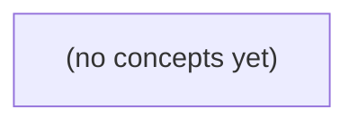

# 14.10 优化与部署

*面向 Go 初学者，以虚构 IM 资料助手的 q-01 至 q-06 固定题集为贯穿案例，系统讲解如何在权限、资料版本、合同语义和引用正确性硬门之上优化时延、吞吐与成本。全书设八节理论与 22 道附答案的纸上练习，覆盖路由、批量与 KV 内存、缓存、流式、过载保护、观测和部署评估。*

**章节:** 2

---

## 本书导览

- 了解整本书的章节脉络
- 掌握各章之间的概念依赖关系
- 选择最合适的阅读顺序

# 14.10 优化与部署

面向 Go 初学者，以虚构 IM 资料助手的 q-01 至 q-06 固定题集为贯穿案例，系统讲解如何在权限、资料版本、合同语义和引用正确性硬门之上优化时延、吞吐与成本。全书设八节理论与 22 道附答案的纸上练习，覆盖路由、批量与 KV 内存、缓存、流式、过载保护、观测和部署评估。

下方的概念图展示了本书 0 个核心概念以及它们之间的依赖关系；再下方是 1 个章节的入口。你可以按从上到下的顺序阅读，也可以根据自己的兴趣或先验知识选择切入点。

#### 概念图

## 章节索引

- **14.10 优化与部署：按成功IM任务衡量质量和成本** — 面向Go初学者，以虚构IM资料助手比较模型路由、连续批量、缓存、流式、过载与观测对有权任务质量和资源的影响。

## 14.10 优化与部署：按成功IM任务衡量质量和成本

- 定义有权正确任务的业务硬门和指标
- 区分TTFT/总时延/吞吐/成本与prefill/decode
- 按固定六题设计模型和路由对照
- 解释批量/KV/缓存的容量和权限取舍
- 设计流式验证和过载降级停止门
- 提出可观测且可回退的静态部署卡

优化前先冻结六题基线：只有答案同时满足授权、事实、引用与拒答要求，速度和成本指标才有业务意义。

### 以业务硬门定义成功任务

### 以业务硬门定义成功任务

优化比较的分母不是“请求完成”或“模型返回 200”，而是**通过业务硬门的成功任务**。先冻结 `q-01`～`q-06` 的题目、资料、身份、标签、关键词与期望判定；任何候选模型、检索策略、缓存或部署配置，都在同一基线上接受检查。

一项任务仅当以下条件同时成立，才计入成功：

- **权限门**：`q-03` 中 `u-b` 的请求必须在模型前排除 `doc-private` 正文；即使最终答案看似正确，只要私有内容进入提示词、日志或输出，即判失败。
- **事实边界门**：`q-01` 必须回答当前值为 **6 UTF-8 B**；`q-02` 必须明确 R9“尚待审”，不能把计划、草案或未知状态写成已批准事实。
- **不臆测门**：`q-04` 缺少退群历史规则时，应说明资料未给出或拒绝断言，不能用常识补全制度。
- **语义核对门**：`q-05` 的 S2 `200` 只能表示该接口响应成功，不能偷换为 B 设备已 ACK。
- **能力边界门**：`q-06` 仅有 24h broker 保留期时，不能承诺 25h 离线后必然补齐。
- **引用与拒答门**：可回答的问题须给出可核验引用；不可确定、无权或证据不足的问题，须以正确方式拒答或限定结论。

可将成功率写为：

$$
\text{成功率}=\frac{\text{同时通过全部硬门的任务数}}{\text{全部评测任务数}}
$$

同时单列“拒答正确率”，避免系统靠一律拒答抬高安全性。只有硬门通过后，才比较 TTFT、总时延、吞吐与成本；快一倍但泄露 `doc-private` 的候选方案，业务成功数仍为零。

### 冻结六题与端到端基线

### 冻结六题与端到端基线

优化比较首先要固定输入，而不是先比较某次“跑得很快”的演示结果。复用 14.09 的六题、资料集、用户身份、权限标签与关键词检索结果，形成版本化对照组：同一 `q-01` 到 `q-06`、同一索引快照、同一提示词与工具配置、同一模型参数和相同并发条件。

每题的判定不只记录“是否答对”，还应记录以下业务硬门：

- `q-01`：当前长度必须为 **6 UTF-8 B**；
- `q-02`：必须说明 R9 仍待审核，不能暗示已批准；
- `q-03`：`u-b` 的请求必须在模型前排除 `doc-private` 正文；
- `q-04`：资料未定义退群历史规则时，应明确未知，不能编造；
- `q-05`：S2 的 HTTP `200` 不能被解释为 B 设备 ACK；
- `q-06`：仅有 24h broker 保留时，不能承诺 25h 离线补齐。

对每次运行，沿请求链路采集授权/检索/组装、排队、prefill、首 token、decode、引用与合同核对的时间戳。于是可区分 TTFT、总时延、成功任务吞吐与全链路成本；分母仅计入“有权、正确、可引用”的完成任务，并单列正确拒答率。

候选方案必须先通过权限、事实和引用硬门，再与基线比较中位数及尾部时延、每成功任务成本和吞吐。快一倍但泄露 `doc-private`，或用模型内核耗时替代用户可见时延，均不构成有效优化。

### 拆分时延、吞吐与成本口径

### 拆分时延、吞吐与成本口径

一次资料问答的用户路径可拆为：

`用户请求 → 授权/检索/组装 → 排队 → prefill → 首个 token → decode/流式传输 → 引用与合同核对 → 可见结果`

因此，不能把“模型生成很快”直接称为“回答很快”。应至少分开记录：

- **TTFT（首 token 时间）**：从请求进入系统到用户看到第一个输出 token 的时间。它包括鉴权、检索、提示词组装、排队、网络往返与 `prefill`；只测模型内核 prefill 会低估真实等待。
- **总时延**：从请求到最终可见、可引用结果的时间。除 TTFT 外，还包括 `decode`、流式传输、引用补全、合同或权限核对。若答案先流出私有正文、随后才发现无权，则再低的 TTFT 也没有业务价值。
- **吞吐**：单位时间完成的 token 数或任务数。更有意义的分母是“有权、正确、带可核对引用的成功任务”，并单列正确拒答；不能用泄露 `doc-private` 的高并发结果充数。
- **全链路成本**：至少区分模型/API 调用、GPU 或算力、检索与存储、网络、队列资源、引用核验及人工复核成本。仅报告每千 token 模型价格，会遗漏保障 `q-03`、`q-04` 等约束的真实代价。

`prefill` 主要受输入上下文长度、批处理和缓存命中影响，直接拉动 TTFT；`decode` 随输出 token 增长，主要影响长答案的总时延与流式体验。优化检索可缩短 prefill 前阶段，优化解码可提高生成吞吐；两者都必须在冻结的权限、事实、引用基线下比较。

### 用权限失败否决表面提速

### 用权限失败否决表面提速

设基线方案回答 `q-03` 时，先按用户 `u-b` 的身份过滤资料，再检索和生成；候选方案为了减少检索轮次，直接把 `doc-private` 的正文送入模型。它可能使平均总时延从 $2.0\text{s}$ 降到 $1.0\text{s}$，模型调用成本也下降，但只要 `u-b` 无权读取该文档，这次“优化”即告失败。

权限不是可与速度交换的软指标，而是上线硬门。应先判定：

- 候选是否把无权正文、摘要、片段、向量检索命中或引用标题暴露给模型、日志或用户；
- 拒答是否明确且不泄露私有内容，例如只说明“无权访问该资料”，而不补出正文、作者、群组或敏感关键词；
- 检索缓存、重排序结果和流式首段是否同样执行授权过滤。

因此，比较方案时不能报告“快 $50\%$、省 $30\%$”就下结论，而应先看权限通过率。若 `q-03` 出现一次 `doc-private` 泄露，则该候选的成功 IM 任务数为零，吞吐、TTFT 和单位任务成本都不应计入优化收益。

可将门槛写成：

$$
\text{可比较收益}=
\begin{cases}
\text{性能收益}, & \text{权限、事实、引用均通过}\\
0, & \text{任一硬门失败}
\end{cases}
$$

先让授权过滤覆盖模型前、模型中可见上下文与模型后输出，再讨论缓存、批处理或更小模型带来的提速。

### 建立有权成功率的评测看板

### 建立有权成功率的评测看板

看板的核心分母不是“请求数”或“模型返回数”，而是应完成的业务任务数。对每个固定的 `q-01`～`q-06`，先由标注定义其授权身份、允许资料、事实结论、必要引用与应拒答边界，再计算：

$$
\text{有权成功率}=
\frac{\text{授权正确}\land\text{事实正确}\land\text{引用可核验}\land\text{合同符合的完成任务}}
{\text{应完成任务}}
$$

其中，`q-01` 必须答出当前为 `6 UTF-8 B`；`q-02` 必须明确 R9 仍待审；`q-04` 不得虚构退群历史规则；`q-05` 不得把 S2 的 `200` 写成 B 设备 ACK；`q-06` 不得由 24 小时 broker 保证推导出 25 小时离线补齐。答案流畅但事实、引用或条件错置，均不计成功。

将拒答从“失败”中拆开：

- **正确拒答率**：对无权或不可可靠回答的任务，是否在模型前拦截私有正文，或明确、适当地拒答。
- **越权泄露率**：如 `u-b` 获得 `doc-private` 正文、摘要、引文片段或可反推出正文的细节；这是权限硬门，发生一次即使更快也不可上线。
- **硬门失败率**：授权、检索范围、引用合同、敏感内容过滤任一门未通过的比例；应记录失败阶段与原因码。
- **可引用率**：已完成答案中，关键结论均能回链到允许资料且引文支持原结论的比例。

性能与成本只在上述结果旁展示，而不替代质量：分别报告成功任务的 TTFT、总时延、每秒成功任务数，以及每个有权成功任务的模型费用、算力费用、检索费用和人工复核费用。再按身份、问题类型、拒答任务及资料可见性分桶，避免平均值掩盖“快了一倍，但泄露私有资料”的退化。

> **要点** — 先用六题硬门确认有权成功，再比较时延、吞吐与成本；越权或失实的提速不构成优化。

模型大小不是质量保证。IM资料助手应先守住权限与现行合同，再在同条件下比较路由带来的有权正确率、时延与成本。

### 先定义有权成功，而非泛化聪明

### 先定义有权成功，而非泛化聪明

“回答流畅”“引用很多”或“看起来更懂业务”都不是 IM 助手的成功标准。先定义业务硬门：只要越权披露、把旧合同当现行、遗漏决定性限制，或在证据不足时编造结论，该题即失败；后续措辞、速度和成本不能抵消这一失败。

可将一次任务的“有权成功”定义为同时满足：

1. **权限正确**：actor 仅获得其被授权查看的资料与结论；`q-03` 应拒绝时必须由应用直接拒绝，不能把私有正文交给模型复核。
2. **时效正确**：现行状态、版本和生效时间无误；不能因 R9 更易检索或更便宜而覆盖当前合同。
3. **证据充分**：结论能由允许范围内的证据链支持，且关键条件、例外和存储/时间边界未被省略。
4. **任务完成**：对 `q-01/q-05` 等证据明确题给出可执行答案；对 `q-02/q-06` 等综合题正确整合多份资料；无法确定时明确说明缺口并转人工或拒答。
5. **交互可用**：在预算内完成，记录 TTFT、总时延、调用次数和成本。

评估应按题型分桶，而非只报一个总准确率：应用直接处理、关键词/确定性基线、RAG 综合候选，以及人工或安全失败路径。每桶至少报告有权正确率、越权率、时效错误率、恰当拒答率与任务完成率。这样才能识别一种危险假象：模型让平均回答更漂亮，却把少量高风险题答错；或路由通过大量拒答降低时延，却没有提高用户真正完成 IM 任务的比例。

### 拆解时延、吞吐与生成成本

### 拆解时延、吞吐与生成成本

一次回答的“快”并非单一指标。应至少分开记录：

- **首字时延（TTFT）**：从请求发出到用户看到第一个字的时间。它通常受排队、网络、鉴权、检索、重排序、提示组装及模型对输入上下文的**预填充**影响。资料很长、证据块很多时，即使最终回答很短，TTFT 也可能升高。
- **总时延**：从请求发出到完整结果可用的时间。近似可写为  
  $T_{\text{总}}=T_{\text{排队}}+T_{\text{检索}}+T_{\text{预填充}}+T_{\text{生成}}$。  
  其中生成阶段约为 $T_{\text{生成}}\approx N_{\text{输出}}/r$，$r$ 是逐词生成吞吐。
- **吞吐**：单位时间完成的请求数或生成词数。高并发下，批处理可能提高整体吞吐，却增加单个请求的排队时间；因此不能只看平均值，应看按题型分桶的分位时延。
- **调用成本**：通常同时取决于输入词数、输出词数、调用次数及失败重试。可抽象为  
  $C=C_{\text{输入}}(N_{\text{输入}})+C_{\text{输出}}(N_{\text{输出}})+C_{\text{调用}}$。  
  RAG 候选若反复改写查询、检索和复核，模型虽未必更大，总成本仍可能上升。

较长上下文可能减少漏证据，却增加预填充时延和输入成本；较长回答可能解释更完整，却拉高生成时延和输出成本。优化不应直接压缩所有上下文或限制所有输出，而应按成功 IM 任务衡量：`q-01/q-05` 可优先走短证据、确定性答案；`q-02/q-06` 才在证据不足时增加受控检索或综合。`q-03` 权限拒绝和 `q-04` 未定规则应尽早由应用返回，避免无意义的模型预填充与私有资料暴露。

### 以固定六题验证路由假设

### 以固定六题验证路由假设

不要先问“哪个模型更强”，而要用同一组六题检验“哪条路径更适合哪类任务”。固定测试集可覆盖：`q-01/q-05` 证据清楚的格式或关键词问题，`q-02` 需比较 current 与 proposed 的合同问题，`q-03` 权限拒绝，`q-04` 规则尚未确定，`q-06` 涉及时间范围与存储边界的问题。

每次比较必须锁定以下条件：

- 固定 `actor`、权限快照、允许地区与任务预算；
- 固定资料版本、合同现行状态、索引版本及检索过滤条件；
- 固定提示词、输出格式、温度等解码条件；
- 固定相同题目、参考证据链与判分规则。

然后分别运行四类路径：

1. **应用直接处理**：`q-03` 返回权限拒绝，`q-04` 返回“规则未定”及可升级渠道；不得把私有正文送入模型。
2. **关键词基线**：对 `q-01/q-05` 按确定词、字段和现行资料直接作答。
3. **检索候选**：对 `q-02/q-06` 在有权资料内检索、综合，并要求标明证据、版本与不确定性。
4. **人工或安全失败**：证据缺失、冲突、越权风险或超预算时停止自动回答。

按题型桶记录：有权正确率、错误拒答与漏拒答、证据引用正确性、TTFT、总时延、调用次数和成本。重点看“成功完成 IM 任务”的比例，而非平均速度：一条路径若靠拒答难题降低时延，或靠更大模型只改善措辞而不改善证据判断，都不构成上线理由。路由误判应回退到更保守的检索、拒答或人工路径。

### 批量、缓存与流式的权限边界

### 批量、缓存与流式的权限边界

批量与缓存能降低单位任务成本、提高吞吐，但不能改变“每次回答都必须基于当前 actor 的有权证据”的约束。优化对象不是调用次数本身，而是成功 IM 任务的端到端体验。

- **连续批量**：可将同一资料版本、相同权限域、相同提示模板的 `q-01/q-05` 聚合处理，以减少调度开销。不得把不同租户、项目、地区或保密等级的正文拼入同一可见上下文；批处理失败、超时或部分完成时，应逐项保留任务状态，不能把一项结果套给相邻请求。
- **KV 缓存**：适合复用稳定的系统提示、公开规则或已授权的共同上下文。缓存键至少绑定资料/索引版本、权限域、地区、模型与提示版本；权限变化、合同更新或索引回滚后，旧键必须失效。KV 缓存不是“已验证答案”缓存，仍需对本次检索证据做范围检查。
- **结果缓存**：仅可复用确定性且证据完整的结果，例如对现行合同中明确条款的格式化摘录。键应包含问题规范化结果、actor 或权限组、资料版本、规则版本和输出语言。`q-03` 权限拒绝、`q-04` 未定规则以及含时间边界的 `q-06` 不宜用宽泛缓存；缓存命中也应返回证据版本与生成时间，避免把 R9 当成现行。
- **流式输出**：流式可改善首字延迟，但不能在权限校验、资料版本确认或引用验证前抢先输出正文。建议先完成授权、路由和最小证据集检查，再流式生成；一旦发现证据越权、冲突或请求取消，应立即停止输出，记录已发送片段，并转为安全失败或人工路径。

验证时固定题集、actor、资料版本和解码条件，分别比较缓存命中与未命中、批量与单发、流式与非流式的有权正确率、拒答率、TTFT、总时延及成本。若优化只让错误答案更快出现，或以共享缓存扩大资料可见范围，就不构成可上线的容量改进。

### 用部署卡管理过载、观测与回退

### 用部署卡管理过载、观测与回退

部署卡是随版本发布、可审计的静态配置说明：它不决定“哪个模型更聪明”，而是规定在既定权限、证据和预算下，系统何时走哪条路、何时降级、何时停止。每次路由器、索引、提示词、模型或地区变更，都应生成新卡并保留旧卡。

一张部署卡至少写清：

- **适用范围**：`actor`、允许地区、资料与索引版本、题集版本、提示和解码条件。
- **路由规则**：`q-03` 由应用直接权限拒绝；未定规则的 `q-04` 进入人工或安全失败；证据完整的 `q-01/q-05` 可走关键词基线；`q-02/q-06` 才是 RAG 候选。
- **过载降级**：队列长度、并发或预算超过阈值时，优先改走已验证的关键词基线；若不能形成有权证据链，则明确说明无法确认或转人工。降级不是放宽检索范围，也不是用缓存的私有正文补答。
- **观测指标**：按问题桶记录有权正确率、证据覆盖率、拒答率、TTFT、总时延、调用次数、单位成功 IM 任务成本，以及权限拒绝是否被错误送入模型。
- **报警与回退**：例如某桶有权正确率相对基线持续下降、无证据回答上升、P95 时延超预算、跨地区或越权检索事件出现，即停止扩量，回退到上一张部署卡或更保守的“关键词/拒答/人工”路径。

回退应是版本化动作：记录触发时间、指标、受影响桶、卡版本和恢复条件。任何自动恢复也必须重新满足验收阈值；系统不得因过载、低成本或“提高命中率”而自动扩大可见资料、改用非现行合同，或把权限拒绝交给模型二次判断。

> **要点** — 先以权限和现行性设硬门，再用固定题集实测质量、时延与成本，并保留可观测回退路径。

连续批量不是单纯“把请求凑多”，而是围绕输入、输出、KV容量与排队时延做动态调度取舍。

### 从预填充与解码识别批量瓶颈

### 从预填充与解码识别批量瓶颈

一次生成请求可拆成两段：**预填充**处理全部输入词元，建立初始 KV 缓存；**解码**则每次生成一个词元，并不断追加新的 KV。两者都使用模型，但瓶颈常不同。

- **长输入、短输出**的请求主要受预填充影响。长提示词带来较多注意力计算和较大的初始 KV 缓存，可能占满计算资源或显存，却很快结束生成。
- **短输入、长输出**的请求主要受解码影响。单步解码的计算量较小，但要重复许多轮；请求长期留在批次中，KV 缓存随输出增长，调度器也必须持续为它保留容量。
- **长输入、长输出**同时施压：先出现较重的预填充峰值，随后形成持久的解码与 KV 占用，通常更容易拖高尾部时延。

因此，批量大小不是唯一变量。同样是“16 条并发请求”，16 条短问答与若干长上下文、长生成任务，对设备的计算、带宽和显存压力完全不同。静态批量常被最长输出拖住：短请求已经完成，剩余槽位却不能立即服务新请求。连续批量可在每轮解码后移出完成请求、加入等待请求，但仍受 KV 容量限制；没有可用缓存页时，再高的计算余量也无法接纳新请求。

诊断时应将请求按输入长度与输出长度分桶，并同时观察预填充耗时、首词元时间（TTFT）、生成速率、活跃请求数及 KV 内存使用率。这样才能判断瓶颈究竟是“输入算得慢”“输出轮次多”，还是“缓存先满了”，而非笼统地把吞吐下降归因于批量不足。

### 连续批量如何避免整批等待

### 连续批量如何避免整批等待

静态批量要求一组请求同时进入、同时完成：只要 A 还在逐 token 生成，已经结束的 B 所占槽位也难以立刻服务新请求；若为对齐长度而补齐，还会计算无意义的填充位置。连续批量把“一个批次”改为每个生成轮次都可重组的活动请求集合。

可将调度过程理解为：

1. 新到达请求先完成或等待 `prefill`；调度器评估其输入长度及新增 KV 缓存是否能放入当前容量。
2. 每轮 `decode` 对所有活动请求各生成一个 token。
3. 请求遇到终止符、达到最大长度或被取消时，立即移出活动集合，并释放其 KV 块。
4. 腾出的 token 预算、显存和计算槽位可在下一轮加入新请求，而无需等待最长请求结束。

因此，短输出请求 B 即使很快完成，也不会被长输出请求 A “拖住”；A 则持续留在活动集合中，逐轮追加 KV。代价是每轮集合可能变化，调度器必须同时约束最大活动请求数、最大总 token 数、KV 内存页数及公平性，否则长输入请求可能迟迟拿不到 `prefill` 机会，表现为较高的 TTFT。

这里有两个独立配置面：

- **调度与内存配置**：批量 token 上限、等待队列策略、KV 缓存容量、请求加入/抢占规则，决定吞吐、TTFT 和尾部时延。
- **生成采样配置**：温度、`top_p`、`top_k`、最大新 token、停止条件，决定每条输出的随机性与长度分布。

例如调高温度可能间接改变平均输出长度，却不等于启用了更高效的连续批量；增大批量 token 上限也不会改变某次采样应选择哪个 token。评估时应分别记录调度参数和采样参数，才能解释吞吐提升究竟来自更好的资源复用，还是来自输出变短。

### 用长短请求对照暴露指标盲区

### 用长短请求对照暴露指标盲区

设两条请求在同一服务中到达：

- **请求 A**：短输入、长输出。其 prefill 负担较小，却要经历许多轮 decode；生成越久，KV 缓存保留越久。
- **请求 B**：长输入、短输出。其主要成本集中在 prefill，开始生成前就需建立较长的初始 KV 缓存，但 decode 很快结束。

若只观察“每秒完成请求数”，A 与 B 可能看似相同：都算完成了一次请求。然而它们消耗的资源结构不同。A 更容易拉低持续输出阶段的 token 速率，并因长期驻留而占住并发槽位；B 则可能使新请求的首 token 等待更久，并迅速抬高初始 KV 内存压力。

纸上实验应至少按输入 token 桶、输出 token 桶和并发桶分别记录：

- **TTFT**：从请求进入系统到收到首个输出 token 的时间，重点比较 p50 与 p95；
- **输出速率**：首 token 后的生成 token/秒，避免将长输出的 decode 成本藏进平均值；
- **吞吐**：同时报告输入 token/秒、输出 token/秒与完成请求数/秒；
- **KV 压力**：观察活跃请求数、上下文总长度及显存/内存接近上限时的排队变化。

其中 p95 表示约 95% 的样本不超过该时延，不等于单次最慢记录。连续批量若优先填满批次，吞吐可能上升，却也可能让 B 的 prefill 或后来请求的 TTFT 恶化；因此，调度质量应以这些分桶指标共同判断，而非用单一请求速率下结论。

### 按词元桶与并发桶设计实验

### 按词元桶与并发桶设计实验

固定模型版本、量化方式、硬件、路由规则、最大上下文长度与采样参数后，再比较批量策略；否则把模型、生成质量和调度变化混在一起，结论无法归因。

先按输入与输出词元分别分桶，而非只按“请求数”分桶。例如：

- 输入桶：`0–512`、`513–2k`、`2k–8k`；
- 输出上限桶：`1–128`、`129–512`、`513+`；
- 并发桶：`1`、`4`、`16`、`64`，并记录实际到达率与队列长度。

可构造交叉场景：短输入/长输出检验持续 decode 和 KV 增长；长输入/短输出检验 prefill 峰值与初始 KV 占用；长输入/长输出则暴露最严格的容量和尾延迟约束。每桶应包含足够多的独立请求，并分别报告混合负载与单一负载结果。

核心指标至少包括：

- `TTFT p50/p95`：从请求进入服务到首个词元返回的时间；
- 输出速率：首词元后每秒生成的词元数，避免把排队时间误算为解码慢；
- 端到端时延与成功率：超时、拒绝、截断均应计入；
- 显存/内存：峰值、平均值、KV 缓存占用、交换或驱逐次数；
- 调度状态：活跃请求数、排队长度、批次词元数与预填充/解码占比。

其中 p95 表示约 95% 的样本不超过该时延，适合识别少量长上下文或高并发请求造成的尾部恶化。若吞吐上升但长输入桶的 `TTFT p95`、拒绝率或 KV 压力显著变差，则不能简单宣称“优化成功”。

### 为有权IM任务设定容量停止门

### 为有权 IM 任务设定容量停止门

对已获授权的 IM 任务，较大连续批量通常能摊薄调度开销、提高每秒处理 token 数；但它不是无条件增益。批量增大后，长输出请求会持续占用 KV 缓存，短而急的消息可能在队列中等待更久，表现为 TTFT p95 上升；若 KV 接近上限，还可能触发驱逐、重算、拒绝新请求，甚至挤占更高优先级会话的容量。

因此应把“继续接纳”改为容量停止门，而非只看平均吞吐：

- **正常批处理**：KV 使用率、排队深度、TTFT p95 和生成速率均在服务目标内，允许连续加入同一权限域内的请求。
- **降级门**：当 TTFT p95 超过目标，或 KV 水位持续高于预警线，停止扩大批量；降低低优先级任务的最大输出长度、采样候选数或并发数。
- **限流门**：当等待队列超过上限、预计完成时间违反会话时限，按用户、租户和任务优先级限流，而不是让所有请求共同恶化。
- **回退门**：当 KV 达到硬上限、发生显存压力或权限校验失败时，拒绝新增长生成；将任务转入较小批量、较短上下文模型或异步队列，并保留可解释的失败原因。

权限也是容量条件：未授权任务不得借“高吞吐批量”进入受保护队列；不同租户或敏感级别的 KV 状态应隔离计量。最终比较应同时报告吞吐、TTFT p50/p95、输出速率、KV 峰值与被限流/回退比例，避免以单一请求率掩盖尾时延和资源挤占。

> **要点** — 连续批量应以有权成功、尾时延和KV容量共同衡量，不能只用每秒请求数判断优劣。

缓存不是单纯的加速开关；在有权IM任务中，任何复用都必须先证明其授权、版本与规则状态仍然有效。

### 先按缓存对象划分边界

### 先按缓存对象划分边界

缓存设计的第一步不是选 Redis、向量库或推理引擎，而是明确“复用的到底是什么工作结果”。至少应分为三类，因为它们节省的成本、可接受的陈旧性和承担的业务责任完全不同。

- **检索候选与原文缓存**：缓存查询得到的候选文档列表、分块正文或已解析附件，主要省去索引查询、重排、下载与解析时间。它并不等于答案正确：命中后仍要核验文档版本、当前授权、规则生效状态及适用范围。若缓存中仍含旧 `doc-r9`，命中率再高也可能把过期依据带入后续流程。

- **答案缓存**：缓存“在特定问题、特定证据与规则下”已经生成的交付结果，能同时省掉检索和模型生成，通常延迟收益最大，也最接近直接业务决策。因此其责任最重：不能只以问题文字作键。`q-01` 曾回答“6 B”，当 R9 后续获批时，旧答案若未随规则或资料版本失效，就会稳定而快速地交付旧规则。

- **模型前缀或 KV 缓存**：缓存模型处理过的输入前缀及注意力状态，省去重复提示、系统指令、长文档上下文的预填充计算，主要改善首 token 时间（TTFT）。它通常不直接保存最终答案，却可能复用已进入模型上下文的私有内容；因此共享条件必须受授权边界约束。两个请求文本相同，不代表可共享前缀：其 actor、可见文档集合或撤权后的权限状态可能不同。

可将责任概括为：候选缓存负责“依据是否仍可取”，答案缓存负责“结论是否仍可交付”，前缀/KV 缓存负责“计算状态是否可安全复用”。后两者的速度收益不能替代交付前的权威权限与合同检查。

### 缓存键必须编码授权与版本

### 缓存键必须编码授权与版本

缓存复用可视为一次“免执行”的判定：系统不再重新检索、生成或计算，而是断言旧结果在当前请求下仍然正确且可交付。因此，缓存键不能只写成问题文本 `q`，而应近似编码决定结果的全部有效输入：

\[
K=\operatorname{hash}(S,\ A,\ V,\ P,\ M,\ Q)
\]

其中：

- $S$：问题作用域，如案件、合同、任务、租户、会话或时间窗口；同一句“余额是多少”在不同账户、不同结算日并非同一问题。
- $A$：执行者身份或授权范围；可用主体、角色、租户、文档许可集合及其策略版本的稳定摘要表示。
- $V$：资料与状态版本，如索引快照、`doc-r9`、规则生效版本、审批状态、账户状态。
- $P$：提示词、工具编排、输出格式及安全策略版本。
- $M$：模型、解码参数、检索器、嵌入模型或重排模型版本。
- $Q$：规范化后的问题及必要上下文，而非仅原始字符串。

可复用条件不是“键相同就返回”，而是：

\[
\text{可复用}=
\text{授权仍有效}\land
\text{资料/状态仍匹配}\land
\text{提示与模型兼容}\land
\text{作用域一致}
\]

例如，`q-01` 曾回答“6 B”，若答案键只有问题文字，R9 获批后仍可能命中旧规则答案；因此审批或规则版本必须进入键，或在命中后进行权威版本核验。`q-03` 的私有片段更不能仅按文本复用：不同 actor 即使提问完全相同，其可见文档集合也可能不同。

工程上可将共享分层：公开且版本固定的原文可跨用户复用；检索候选至少绑定授权摘要与索引版本；答案通常绑定更细的 actor/作用域；前缀或 KV 缓存则须在复用前确认授权边界未扩大。撤权、规则生效、文档替换时，应能按主体、许可、资料版本或策略版本主动失效，而不能只等待 TTL 自然过期。

### 用q-01与q-03识别陈旧和泄漏

### 用 q-01 与 q-03 识别陈旧和泄漏

设 `q-01` 问：“该事项的预算上限是多少？”当前答案为“6 B”。若答案缓存只以问题文本为键：

`cache["预算上限是多少？"] = "6 B"`

那么规则 `R9` 日后获批、上限改为 `8 B` 时，系统仍可能直接命中旧答案。它省掉了检索和生成，却把“曾经正确”误当成“当前有效”。因此，`q-01` 的可复用条件至少应包含规则或资料版本、规则生效状态、提示版本与模型版本；规则发布、审批完成或文档替换时，应能定向失效相关条目。命中后仍要核验当前版本，而不是仅相信缓存时间未过期。

`q-03` 的风险不同。假设执行者 A 可见一段私有合同片段，系统将其检索结果、摘要或最终答案按问题文本缓存。执行者 B 随后提出相同问题，即使文字完全一致，也不代表 B 具有相同授权；直接复用会把 A 的私有片段泄漏给 B。

因此，缓存键不能只表示“问了什么”，还应表示“谁在何种授权边界下问”：例如 `actor/授权范围 + 问题作用域 + 资料版本 + 规则状态`。对检索候选、原文片段、答案和模型前缀都应分别判断这一边界。撤权发生后，相关缓存必须迅速失效；否则高命中率可能恰恰意味着陈旧规则被反复返回，或越权内容被高效传播。

### 把失效传播纳入时延账本

### 把失效传播纳入时延账本

缓存失效不是后台维护细节，而是一次会影响用户可见时延、权限正确性和任务成功率的业务事件。对每个缓存条目，应保存其依赖的`授权范围版本`、`规则版本`、`资料版本`、`提示版本`与`模型版本`，并记录可服务的`actor/租户/问题作用域`。

当发生撤权、合同状态变化、规则 R9 获批或文档更新时，不应只等待统一 TTL 过期，而应执行定向传播：

1. **定位依赖项**：根据被撤销的 actor、文档、规则或合同，找出答案缓存、检索候选/原文缓存及前缀/KV 缓存中的相关条目。
2. **标记不可复用**：先将条目置为“待核验”或直接失效；撤权场景应优先拒绝命中，而非继续返回旧结果。
3. **交付前版本核验**：即使缓存命中，也在最终响应前以权威授权与规则源校验当前 actor 是否仍可访问、`doc-r9`是否仍为有效版本。
4. **异步清理与审计**：后台删除或覆盖已失效内容，并保留“何时变更、何时传播、何次命中被拦截”的审计记录。

例如，`q-01`曾缓存“6 B”，R9 生效后必须使依赖旧规则的答案缓存失效；否则低 TTFT 只是更快地交付错误规则。`q-03`涉及私有片段时，撤权传播还必须覆盖该 actor 可能命中的原文、答案和共享前缀，不能仅删除最终答案。

性能账本至少同时报告：

- **TTFT**：缓存命中、版本核验和必要重检索后，首个可见输出的时间；
- **总时延**：包括失效查询、权限检查、重建缓存及完整生成；
- **撤权传播时间**：从权威状态变更到所有相关缓存不可服务的时间；
- **最终有权结果**：在最新授权、合同与规则下正确完成 IM 任务的比例。

命中率上升若伴随旧版本命中、核验失败或权限拦截增加，并不代表系统更优。应把“缓存命中后仍通过权威核验”的比例与最终有权任务成功率作为核心指标，而不是为了缩短延迟跳过交付前检查。

### 以前缀共享为例设置隔离门

### 以前缀共享为例设置隔离门

前缀文本相同，不等于请求可安全复用。模型前缀/KV 缓存节省的是对共同输入 token 的重复计算；但在有权限约束的 IM 任务中，共同文本背后可能对应不同的可见资料、合同条款、地域规则或当前授权状态。

可将两种判断并列：

| 判断 | 只看文本相同 | 判断授权等价 |
|---|---|---|
| 比较对象 | 系统提示、问题、上下文 token 是否一致 | actor/租户、角色、资料集合、规则状态、模型与提示版本是否兼容 |
| 主要收益 | 更高命中率、更低 TTFT | 在可证明安全的范围内复用 |
| 主要风险 | 将私有上下文或旧规则的计算痕迹带给无权请求 | 键过粗、撤权传播滞后仍会造成越权 |
| 结论 | 不能单独作为命中条件 | 应是复用前的隔离门 |

例如，两个用户都输入“q-01 的付款规则是什么？”；即使问题和系统提示完全相同，用户 A 已获批 R9、用户 B 仍只能看 R8，则二者不能共享含规则结论的前缀。又如同一用户前后两次提问文本不变，但其间发生撤权，也必须使先前可复用的前缀失效或重新核验。

因此，前缀缓存键或准入检查至少应绑定租户/actor 或明确授权范围、可见资料与状态版本、提示与模型版本、问题作用域；高敏感上下文宜按租户或会话隔离。引擎的隔离配置只能降低实现层风险，不能替代业务侧的授权等价判定。以 vLLM 为例，其安全文档提示多租户前缀缓存可能存在跨租户侧信道，部署时需采用相应隔离配置；但不能据此推断其他引擎具有同等边界或保护。

命中后仍应进行权威权限与合同检查，并记录命中条件、版本核验结果、撤权传播时间及 TTFT、总时延和最终 IM 成功结果。缓存更快，只有在答案仍正确、仍获授权时才有价值。

> **要点** — 缓存复用的前提是授权、版本和规则仍有效；命中率必须与撤权传播和最终有权正确率一起评估。

流式输出优化的是“更早看见”，却可能放大未核证内容的业务风险。IM资料助手必须把可展示草稿、已核证事实与可交付答案分层衡量。

### 把流式速度纳入有权成功定义

### 把流式速度纳入有权成功定义

流式体验不能只用“首个 token 时间”衡量。对 IM 资料助手，至少应区分三个时点：

- **首个可见内容** $t_{\text{visible}}$：客户端首次展示字符的时刻。它可以是正在检索、正在整理等低风险状态，也可以是明确标注为“未验证草稿”的措辞；不能因此视为业务结论已成立。
- **首个已核证信息** $t_{\text{verified}}$：某条将影响用户判断的主张，已通过权限、数据新鲜度、引用或规则校验后首次公开的时刻。例如“当前可发 9 B”必须确认 R9 已生效，才可进入这一层。
- **完整可交付答案** $t_{\text{deliverable}}$：答案、必要引用、格式校验与安全策略均已完成，能够作为一次 IM 业务回复发送或落库的时刻。

三者满足时间顺序上的通常关系：

$$t_{\text{visible}}\le t_{\text{verified}}\le t_{\text{deliverable}}$$

但它们的含义不可互换。首屏很快，可能只是安全的过程提示；首个事实很快，也不代表后续引用、合同条件或多轮结论已经闭合；完整回答最终生成，更不代表其在权限或隐私检查失败后仍可交付。

因此，成功任务应以“用户获得正确、获权、可用的完整答案”为分母，而把速度作为附加质量指标。高风险桶宁可令 $t_{\text{visible}}$ 接近 $t_{\text{verified}}$，甚至等待完整核证后再显示；私有正文、金额、发货资格等内容不得先流出、后撤回。若请求最终拒答、缺少引用或需要更正，即使 TTFT 很低，也不应计为成功。

### 按风险分层决定能否先展示

### 按风险分层决定能否先展示

流式输出不应只有“流”或“不流”两种选择，而应按内容被用户采信后可能造成的损失分层。核心原则是：**可逆、低影响的语言可先展示；会被当作业务依据、证据或私有数据的内容必须先核证。**

| 内容类型 | 可否先展示 | 缓冲与核证要求 | 失败时的处理 |
|---|---|---|---|
| 低风险解释 | 可以，标为“生成中草稿” | 允许先输出概念解释、操作思路、公开常识；最终仍做格式与安全校验 | 停止续写并提示“答案未完成”，不要把草稿伪装为结论 |
| 业务事实 | 谨慎，通常先缓冲事实句 | 如“当前可发 9 B”“R9 已生效”必须等待实时查询、权限与状态核验完成 | 不输出猜测值；改为说明“暂无法确认”或引导人工/重试 |
| 逐主张引用 | 不应先展示无证据主张 | 每个可核查主张应在对应证据、定位和蕴含检查完成后成对公开 | 缺引用、引用不支持或证据冲突时，删除该主张而非事后补链接 |
| 私有正文 | 默认不得预览 | 先完成身份、会话范围、文档授权、脱敏与输出策略检查 | 直接拒答或给出安全摘要；已经开始生成不等于可以发送 |

例如，`q-01` 可以先流出“我正在核对可发额度与规则状态”，但不能先流出“当前可发 9 B”。后一句是可执行的业务结论；若最终发现 R9 未生效，撤回文本无法撤回用户已经采取的行动。

对 `q-03`，风险更高：私有正文即使随后被拦截，也可能已进入客户端缓存、通知预览或截图。因此应仅在验证前展示不含敏感内容的进度状态，例如“正在检查访问权限”，并把正文放在受控缓冲区中。

实现上可将输出划为`草稿通道`与`已核证通道`：前者只允许低风险叙述，后者才承载事实、引用和私有内容。高风险桶宁可等待完整验证，或由应用返回拒答，也不要把“首个 token 快”误计为一次成功的 IM 任务。

### 用 q-01 与 q-03 设计验证闸门

### 用 q-01 与 q-03 设计验证闸门

不要把“模型正在生成”直接等同于“可以公开”。可将一次回答拆为生成、核证、公开、拒绝四阶段，并为不同风险内容设置停止门。

以 `q-01` 的额度查询为例，模型可能先生成“当前可发 9 B”，但后续工具结果表明 `R9` 尚未生效。此时应：

1. **生成**：允许模型形成候选答案，但额度、规则状态、可发送数量标记为“待核证”。
2. **核证**：读取 `R9` 生效状态、余额、时间窗口，并校验计算链路。
3. **公开**：只有核证通过后，才向用户流出“可发 9 B”这类可执行业务事实。
4. **拒绝**：若状态缺失、结果冲突或超时，停止输出确定数字，改为“暂无法确认当前可发送额度，请稍后重试”。

可以先流出的仅应是低风险过程性文字，例如“正在核对额度规则”。这类文字不能暗示结论已经成立。

`q-03` 的私有正文应采用更严格的闸门：检索命中不等于有权展示，生成出正文也不等于能够撤回。应先完成权限核验、文档级与片段级访问控制、脱敏及引用范围校验，再允许任何正文片段进入客户端。若权限不足、来源不明或脱敏失败，直接拒绝或仅返回允许公开的摘要；绝不能先流出私有句子，再发送“已撤回”。

可将输出对象分级：

- **草稿层**：进度提示、非事实性衔接语，可流式展示。
- **核证层**：额度、合同条款、引用原文、私有内容，必须缓冲。
- **交付层**：核证通过且引用完整的最终答案。
- **拒绝层**：无法证明正确、合规或有权限时的安全替代答复。

这样，首个可见 token 可以很早，而首个业务事实必须晚于验证闸门；高风险请求宁可等待完整核证，也不能以“更快首屏”交换错误主张或隐私泄露。

### 处理断开、取消、重试与背压

### 处理断开、取消、重试与背压

流式链路必须把“生成仍在进行”“客户端已离开”“业务动作已经发生”视为不同状态。否则，慢消费者会耗尽内存，断开请求会继续烧算力，重试还可能重复发送消息或重复调用写工具。

- **背压与上限**：为每个请求设定待发送片段的字节数、片段数和等待时长上限。客户端读取过慢时，优先暂停继续生成或丢弃尚未展示的未验证草稿；达到上限后取消推理，并记录原因。不要在服务端无限缓存 token，尤其不能让高并发 IM 会话互相挤占队列。
- **客户端断开**：检测到连接关闭后，向模型、检索和工具链传播取消信号；已开始的任务应尽快停止。但“取消推理”不等于“撤销业务消息”：若工具已提交发送、建单或修改操作，必须查询其最终状态，而非假定未发生。
- **重试边界**：只读检索与未提交生成可安全重试；写工具必须携带幂等键，并将同一用户动作绑定到同一执行记录。重连请求应优先恢复已有结果或查询工具状态，不能把一次超时当作一次全新的发送指令。
- **可见性纪律**：断开前已流出的草稿无法收回，因此私有正文、金额、合同结论和逐主张引用应在核证后才进入可见流。高风险请求宁可返回“暂无法确认”，也不应以撤回提示弥补已泄露或已误导的内容。

### 以可回退观测验证流式收益

### 以可回退观测验证流式收益

部署流式链路前，为每个风险桶建立一张“可回退观测卡”。它不只记录模型何时开始吐字，还要回答：用户看到了什么、其中哪些后来被核证、失败时是否真正阻止了错误业务信息扩散。

建议每次请求至少记录以下事件时点：

- `t0`：请求进入服务；
- `t_visible`：首个允许展示的 token 到达客户端；
- `t_verified`：首个已通过事实、权限、引用或合同规则核验的信息可见；
- `t_deliverable`：完整可交付答案送达；
- `t_cancel`：客户端断开或服务端取消；
- `t_finish`：推理、校验、写工具及资源清理全部结束。

观测卡还应关联结果字段：风险桶、是否展示未验证草稿、引用是否齐全、核验失败原因、最终是交付/更正/拒答、用户是否中途离开，以及 token、检索、校验、工具调用和缓存占用等成本。对调用写工具的请求，额外记录幂等键、工具状态与未知结果，避免重试把同一业务动作执行两次。

可用成功任务指标替代孤立的 TTFT：

$$
\text{成功率}=
\frac{\text{按风险策略完成且核证通过的任务}}
{\text{全部任务}}
$$

同时报告 `t_verified-t0` 与 `t_deliverable-t0` 的分位数。若 `q-01` 在 $0.3s$ 流出“当前可发 9 B”，却在 $2s$ 后因 R9 无效而更正，则它只能算“草稿首显快”，不能算成功交付；若 `q-03` 私有正文曾被发送，即使随后拒答，也应计为严重泄露事件。

高风险桶宜默认缓冲关键事实，直到核证完成再公开；低风险桶可展示明确标注的草稿，但必须支持停止继续发送、丢弃未发送缓冲，并在客户端慢读时施加背压上限。取消应分别观测“停止生成”“停止发送”“撤销业务消息”的结果，三者不可混为同一成功状态。

> **要点** — 流式应加快可信信息到达，而非提前暴露未核证事实；只有完成权限、引用与业务验证的回答才算成功。

过载控制不是单纯“限流”，而是为有权正确任务设定可验证的资源边界、拒绝语义与安全回退路径。

### 从任务硬门推导过载策略

### 从任务硬门推导过载策略

过载时先问“此任务在较少资源下还能否成功”，而不是先问“怎样让更多请求进入队列”。每条请求应先经过权限、资料时效、证据完整性与输出核证四道硬门；任一硬门不能满足，就不得用更快但不安全的路径伪造成功。

- **可降级**：`q-01` 若关键词基线仍只检索调用者有权访问的 `doc-current`，且能给出支持“6 B”的充分证据，可跳过生成器，直接返回受核证的简短答案。降级节省的是推理资源，不是权限或时效要求。
- **必须拒绝**：`q-03` 即使系统繁忙，也仍应由应用权限层拒绝。不得因缓存、批处理或降级检索而暴露 `doc-private`。
- **必须停止并说明不足**：`q-04` 的规则尚未确定，不能把猜测包装成结论；`q-02` 若无法同时取得 current 与 proposed 资料，应返回“证据不足或资料不可用”，不能仅引用 r9 就声称“已生效”。
- **不得错误替代**：R9 不能充当 current；S2 返回 `200` 只能证明接口响应，不能证明设备已收到或执行。

因此，队列、并发槽和超时预算应优先保留给“有权且仍可能跨过全部硬门”的任务。等待超过其剩余截止时间、取消后无继续价值，或下游授权、检索、核证已不可用的请求，应尽早终止并记录明确原因。过载拒绝本身也是正确结果：它避免无界排队挤占内存与 KV，并防止下游检索、模型或授权源被连锁压垮。

### 建立有界队列与并发预算

### 建立有界队列与并发预算

把一次问答拆成授权、检索、推理、输出核证四个独立容量域，而不是共用一个“请求队列”。每一域都应定义：队列上限 $Q_i$、并发上限 $C_i$、排队超时 $T_{q,i}$、执行超时 $T_{e,i}$ 与取消传播规则。超过任一边界时，应尽早返回可解释的拒绝或降级结果，而非继续占用内存等待。

可用 Little 定律作初步约束：若某阶段可接受在途请求数为 $L_i$、目标完成时间为 $W_i$，则稳定吞吐近似满足 $\lambda_i \le L_i/W_i$。其中 $L_i$ 应同时计入队列项、执行中的请求及其 KV 缓存等实际资源；推理阶段尤其不能仅按请求数估算。

- **授权**：队列应短且优先失败。授权源超时或过载时，不得默认放行；取消后立即停止后续检索。
- **检索**：限制每租户、每 actor 的并发与候选文档规模；检索未获得 `doc-current` 等必要证据时，向核证层传递“证据不足”，不能以旧版本补位。
- **推理**：并发预算应绑定模型批处理槽位、上下文长度和 KV 占用；排队超时后可选择关键词基线或拒绝，但不得降低权限和版本门槛。
- **输出核证**：保留独立槽位，避免生成流量挤掉安全检查；核证超时应阻止未经确认的结论输出。

请求取消必须沿调用链传播：客户端断开、总期限耗尽或上游拒绝后，撤销排队项、检索任务和推理会话，释放 KV 与连接。候选阈值只能经真实负载、下游故障与取消演练校准；应持续观察各阶段队列深度、等待分位数、拒绝率、超时率、取消回收延迟及按租户的资源占用。

### 按参与者与租户实施公平限速

### 按参与者与租户实施公平限速

共享容量不能只按“每秒请求数”平均切分：一次短问答与一次高并发、长上下文、重检索请求，对授权源、检索器、模型及 KV 缓存的占用完全不同。准入应至少同时识别 `actor`、租户、请求类别和预估成本，并在入口保留不可绕过的身份与权限上下文。

可采用分层令牌桶或漏桶：

- **参与者限额**：约束单个用户、服务账号或设备代理的突发与持续速率，防止脚本重试或异常客户端独占资源。
- **租户限额**：为租户设置总体份额、突发额度和并发上限；同一租户内可再按角色分配，避免一个 actor 耗尽该租户配额。
- **成本加权准入**：按预估输入长度、检索范围、生成上限、工具调用数或 KV 占用扣除不同令牌，而非把所有请求视为等价。例如 $cost=1+\alpha \cdot tokens+\beta \cdot retrievals$。
- **下游并发闸门**：即使入口仍有令牌，授权、检索、推理和输出核证也应分别限制在途请求；任一关键闸门满载时，不应继续无限排队。

拒绝必须是明确的产品语义：返回可重试的限速或过载结果、建议退避时间，并记录被哪个层级拒绝、估算成本和租户份额。不得因限速而跳过权限检查、扩大检索范围，或以过期资料替代 `doc-current`。对高价值但成本高的任务，可进入有界优先队列；低优先级任务则应降级为关键词基线、证据不足提示，或直接拒绝。公平不等于保证所有请求完成，而是保证单一来源不能挤占其他有权正确任务的完成机会。

### 六题场景下的降级与拒绝

### 六题场景下的降级与拒绝

降级的目标不是“尽量给出一个答案”，而是在容量紧张时仍只交付**有权、基于现行证据、且语义诚实**的结果。可将六题场景中的代表性请求按边界处理：

- `q-01`：若关键词基线能在调用者有权访问的 `doc-current` 中定位充分依据，并稳定回答“6 B”，可跳过生成器，直接返回带证据的基线结果。这是降低推理成本，不是降低证据标准。
- `q-02`：答案依赖现行与拟议资料的对照。若降级链路无法同时取得 `current` 和 `proposed`，应返回“证据不足，无法确认是否已生效”，而非仅引用 `r9` 就断言已生效。`r9` 不能被降格解释为 current。
- `q-03`：即使系统过载、缓存命中或检索结果存在，只要应用权限不允许，仍应明确拒绝；不得以“服务降级”为由暴露 `doc-private` 内容、摘要或可反推出内容的引用。
- `q-04`：当规则本身未定、来源互相冲突或缺少批准状态时，输出应保留“不确定/规则未定”，不能用语言模型的流畅表达填补制度空白。
- 涉及设备状态的题目：即使收到 `S2 200`，也只能说明接口成功响应，不能宣称设备已收到、执行或生效；这些是不同的可核证状态。
- 其余可延后题目：队列满、超过截止时间或下游不可用时，应尽早拒绝或取消，并给出可重试条件；不要无限排队后再产出过期答案。

因此，过载时的优先级应是：先守权限与证据边界，再选择关键词基线、延迟处理或明确拒绝。

### 可观测部署卡与回退演练

### 可观测部署卡与回退演练

部署卡应把“能处理多少”与“在何种条件下拒绝或降级”写成可观测契约，而非仅记录实例数。至少按授权、检索、推理、输出核证四个故障域分别记录：

- **容量与占用**：入口请求率、活跃并发、每租户/actor 配额、队列长度与等待时间、KV 缓存占用、实例饱和度，以及各下游的连接池、限额和错误率。
- **时限**：端到端截止时间，以及授权、检索、生成、核证的子超时；超时后必须取消尚未开始或不再有价值的下游工作，避免“客户端已走、服务仍烧资源”。
- **拒绝原因**：区分 `tenant-rate-limit`、`global-overload`、`queue-full`、`deadline-expired`、`auth-unavailable`、`retrieval-unavailable`、`generation-unavailable`。拒绝响应应可审计，但不得泄露私有文档或内部容量细节。
- **结果质量护栏**：降级后是否仍使用 current/proposed 的正确文档集合、是否通过权限检查、是否完成输出核证；不能因过载而把 R9 说成现行，或把 S2 的 HTTP 200 说成设备已收到。

回退演练应注入检索慢化、模型限流、授权源不可用、队列打满和取消风暴，验证隔离是否有效：检索故障可转关键词基线回答 `q-01` 的 6 B；`q-03` 仍应拒绝；`q-04` 仍标记规则未定；`q-02` 缺少 current 与 proposed 时必须返回证据不足。观察尾时延、拒绝比例、取消成功率、错误降级率和“成功 IM 任务”比例。所有队列上限、并发数与超时仅是候选值，必须经真实负载、依赖故障和恢复演练校准。

> **要点** — 过载时优先守住权限与证据硬门；用有界资源、明确拒绝和可回退观测保护成功任务。

优化是否有效，不能只看平均延迟或单次价格；应以“有权且正确完成任务”的业务结果为中心，建立可审计、可比较、可回退的观测体系。

### 先定义有权正确完成的业务门

### 先定义“有权正确完成”的业务门

优化指标的分母不应是“所有请求”“成功返回 200 的请求”，而应是通过预先声明业务门槛的任务：

\[
\text{有效完成}=
\text{授权通过}
\land
\text{事实满足要求}
\land
\text{引用满足要求}
\land
\text{任务实际完成}
\]

其中，**授权通过**表示 actor 对目标资料、工具和操作拥有当次请求所需权限；应记录授权决策标识、策略版本和允许/拒绝结果，不把私有正文、权限规则细节或资料内容写入普通日志。

其余门槛必须可检验。例如：

- **事实要求**：关键字段正确、计算结果可复算，或经抽检/人工复核通过。
- **引用要求**：需要依据的任务必须给出可访问、与结论相符且权限匹配的来源；不能以虚构引用或无权资料“完成”。
- **任务完成**：用户获得可执行答案、表单已提交、工单已创建，或后续业务状态确认成功；仅生成看似流畅的文本不算完成。

因此，拒答可能是正确的：无权访问、资料不足或风险过高时，安全拒答应单列为“合规处理”，不能混入“有权正确完成”。同样，模型答对但引用越权，或答案正确却未完成下游操作，也不能进入有效完成分母。

上线前应为每类问题桶写清判定规则、证据来源与复核责任人。这样比较模型、检索、提示或路由时，衡量的才是每个**有权正确完成任务**所消耗的资源，而非表面吞吐量。

### 为一次请求建立最小可审计记录

### 为一次请求建立最小可审计记录

一次请求的记录目标不是“尽量多存”，而是让事后能够回答：谁在什么授权条件下、使用哪个版本与路由，完成了什么类型的任务；为何快或慢、为何贵或省；最终是否有权且正确地完成业务目标。

可将所有事件以不可重复的 `request_id` 关联，并至少记录以下结构化字段：

- **身份与授权**：`request_id`、时间、租户/应用、`actor_id` 或脱敏主体标识、`authorization_decision_id`。后者只指向“允许/拒绝、适用策略、授权版本、资料范围”等决策结果，不记录用户私有正文、证件内容或原始检索资料。
- **任务与版本**：问题桶（如检索问答、表单填写、人工转接）、资料版本、索引版本、提示版本、模型版本、工具版本。这样才能区分“模型退化”与“索引或提示变更”。
- **执行路径**：路由决策及其原因码，例如是否选择小模型、是否启用检索、是否升级人工复核、是否触发拒答；同时记录缓存命中类型与流式状态，如未开始、首字节、完成、中断。
- **资源与时延**：输入/输出 `token`，队列、`prefill`、`decode`、核证等分段时延，以及总时延。分段比单一平均值更能定位瓶颈：队列高通常是容量问题，`decode` 高则可能与输出长度或模型选择有关。
- **结局与质量**：拒答/失败分类、重试次数、人工复核结果、最终业务结果，以及是否达到预先定义的“有权正确完成”门槛。

日志、指标与 trace 应分工：日志保存单请求的受控审计事实；指标聚合成功率、分位时延、缓存率和单位成功任务成本；trace 串联检索、模型、工具与核证的调用链。三者都应以 `request_id` 或受控关联标识连接，但私有资料应留在受权限保护的系统中，日志仅保存引用、哈希或版本标识。

由此可定义比较口径：

$$
\text{每个有权正确完成任务的成本}
=
\frac{\text{模型调用}+\text{计算}+\text{检索}+\text{人工复核等约定成本}}
{\text{满足授权与业务正确性门槛的任务数}}
$$

分子与分母必须在实验前写明；没有真实价格或最终结果时，只记录可验证字段，不虚构成本数字。

### 区分日志、指标与追踪的职责边界

### 区分日志、指标与追踪的职责边界

三类观测信号回答的问题不同，不能用一种替代另一种，更不能以“便于排障”为由记录私有正文。

- **日志**用于单请求审计与事后复盘。围绕 `request_id` 记录 actor 的授权决策标识、问题桶、资料/索引/提示/模型版本、路由决策、拒答或失败分类、最终业务结果等。日志应支持回答“此请求为何被拒绝、调用了哪个版本、由谁负责处理”，但不写入用户私有输入、检索片段原文或未保护的模型输出。
- **指标**用于总体趋势、切片比较与告警。聚合统计成功率、拒答率、各时延分位数、缓存命中率、token 消耗，以及“每个有权正确完成任务的资源或费用”。可按问题桶、模型版本、授权路径或路由策略切片，及时发现某版本在特定任务上的退化。
- **追踪（trace）**用于跨阶段定位。以 `request_id` 关联排队、鉴权、检索、prefill、decode、核证、流式发送和人工复核等 span，识别瓶颈究竟来自队列、模型、索引还是下游服务。span 属性保留版本、状态码、时延和安全分类，不携带私有正文。

实践上，可令日志提供可审计的离散事件，指标提供可告警的聚合信号，追踪提供可定位的调用链。三者共享受控的关联标识与版本字段；访问权限、脱敏规则和保留期限则应独立管理。

### 按成功任务比较性能与成本

### 按成功任务比较性能与成本

比较候选方案时，固定题集、actor 的授权版本、资料/索引/提示/模型版本，以及并发、到达速率、长短请求比例等负载形状；否则路由、批量、缓存或流式策略的差异不可归因。每个任务以 `request_id` 串联日志、指标与 trace，但只记录授权决策标识和问题桶，不把私有正文、检索片段写入无保护日志。

对每个方案记录：

- 路由决策、模型调用次数、批量大小、缓存命中、流式首字节与完成状态；
- 队列、prefill、decode、核证及端到端时延，并报告中位数与高分位；
- 吞吐、拒答/失败分类，以及是否达到预先定义的“有权正确完成”业务门槛；
- 模型调用、计算、检索、人工复核等资源项；未取得真实价格或结果时，不虚构货币数字。

单位成功成本应明确分子与分母：

$$
\text{单位成功成本}=
\frac{\text{模型调用}+\text{计算}+\text{检索}+\text{人工复核等约定资源}}
{\text{满足授权、正确性和业务时限门槛的任务数}}
$$

例如，缓存可能降低平均时延，却因命中错误版本而降低成功率；激进路由可能减少模型调用，却增加人工复核。因此同时按问题桶、权限决策、请求长度和缓存命中与否切片，检查是否把某类任务的退化藏在总体均值中。

上线前用相同对照集运行基线与候选方案，预先写明通过条件、回滚触发器和负责人：如成功率下降、尾时延越界、拒答分类异常或单位成功成本恶化。只有在这些条件下仍更优，优化才是可部署的改进。

### 把观测结果接入发布与回退卡

### 把观测结果接入发布与回退卡

发布卡不是“上线说明”，而是将观测信号转成可执行决策的静态清单。每个候选版本应绑定资料/索引/提示/模型与路由版本，并在相同授权题集、问题桶和负载形状下比较；不得用私有正文补充日志证据。

可按以下字段预先填写：

- **发布范围**：灰度比例、目标 actor 授权决策标识、允许的问题桶、开始/结束时间与发布负责人。
- **成功门槛**：按切片计算“有权且正确完成任务率”；同时声明核证规则、最小样本量和观察窗口。
- **成本门槛**：定义  
  $C_{\text{成功}}=\frac{\text{模型调用+计算+人工复核等约定资源}}{\text{有权且正确完成的任务数}}$。  
  分子、分母和缺失真实结果时的处理必须写明，不能虚构价格或效果。
- **性能与稳定性**：分别设定队列、prefill、decode、核证时延阈值；记录缓存命中率、流式首 token、流式中断率、拒答率及失败分类。
- **过载降级**：例如缩小可用模型池、关闭昂贵路由、限制并发、延后非关键核证；注明降级后仍可服务的任务桶与预计质量损失。
- **回滚触发**：如任一关键授权切片成功率下降、流式失败激增、拒答分类异常、$C_{\text{成功}}$ 超限，或 trace 显示版本错配，即停止扩量并回退至指定版本。
- **责任与证据**：明确值班负责人、审批人、回滚执行人、响应时限，以及对应 dashboard、指标查询和 trace 链接。

发布后只依据这些预注册条件扩量、暂停或回退；阈值变更应形成新卡并保留版本记录。

> **要点** — 观测应服务于有权正确任务：记录可审计元数据，按切片比较成功成本，并用明确阈值驱动降级与回退。

本节以虚构IM资料助手为例，先定义“有权且正确”的成功标准，再推演时延、缓存、流式与过载下的质量—成本取舍，最终形成可回退的部署卡。

### 以有权正确定义成功任务

### 以有权正确定义成功任务

IM 资料助手的“成功”不能只看回答是否流畅，必须同时通过业务硬门：

1. **授权正确**：请求者在当前租户、角色、项目与时间范围内有权读取相关资料；无权正文应在检索或模型输入前被拦截。
2. **事实正确且现行**：结论与当前有效的资料、合同条款或审批状态一致。资料更新、撤销或版本切换后，旧缓存不能继续作为现行依据。
3. **引用可核证**：关键主张能回链到用户有权查看的来源、版本和位置；“模型已生成答案”不等于“证据已核证”。
4. **合同与合规满足**：输出不得超出保密、地域、保留期限、用途限制及审计要求；即使事实正确，违反合同仍算失败。

可将单次任务定义为：

\[
成功=\text{授权通过}\land\text{结论正确}\land\text{引用核证}\land\text{合同合规}
\]

这些是**硬门**：任一项失败，该任务即失败，不能用更低时延、更漂亮措辞或更高吞吐抵消。

与之分开的体验指标包括首字延迟、完整响应时间、排队等待、可读性和交互连续性。计时必须说明起点，例如从“权限门收到请求”到“已核证答案完成传输”；若只量到首个 token，则后续 decode、传输、引用展示与合同核证仍未计入。部署优化应先守住硬门，再在成功任务集合中比较时延与成本。

### 拆解时延、吞吐与成本口径

### 拆解时延、吞吐与成本口径

对 IM 资料助手，指标必须先固定计时边界。设请求在网关**到达**为 $t_0$；完成身份、租户与资料权限判定为 $t_a$；检索和上下文组装完成、进入模型队列为 $t_q$；开始 prefill 为 $t_p$；首个可发送 token 产生为 $t_1$；最后一个 token 产生为 $t_d$；引用、合同状态与现行版本核证完成并交付用户为 $t_f$。

- **端到端成功时延**：$L_{\text{success}}=t_f-t_0$。只有答案正确、资料有权、引用与合同核证通过时才计入成功样本；模型先吐字不等于任务完成。
- **首字时延（TTFT）**：应明确是“模型首 token”$t_1-t_0$，还是“用户首次看到可展示内容”的时间。若必须先核证，后者不得早于允许展示的时点。
- **模型时延**可拆为：排队 $t_p-t_q$、prefill、decode。prefill 消化检索到的输入前缀并建立 KV；decode 随输出长度逐 token 推进。因此长资料主要压高 prefill，长回答主要压高 decode。
- **总吞吐**应按成功任务计，如单位时间完成的“有权且正确并已核证”请求数，而非仅模型生成 token 数。批量通常提高总体吞吐，却可能拉长单请求排队和尾时延。
- **成本**至少分列：授权与检索、网络传输、prefill 输入 token、decode 输出 token、缓存存储，以及引用/合同核证。缓存命中虽可省算力，但若资料版本、权限或租户条件已变，复用即可能造成旧答或越权。

报告 $P95$ 时，应说明它是排序后约 $95\%$ 样本不超过的分位位置，不是“最慢的 5% 的平均值”。以上仅是纸上口径；真实并发、模型结构与精度仍须实测。

### 用固定六题比较模型路由

### 用固定六题比较模型路由

用同一组六类虚构 IM 任务评估“快速模型”“审慎模型”和路由规则，避免只拿容易问题比较。成功定义为：答案正确、引用可核证、资料在该用户授权范围内，且在约定计时起点后完成必要检查；这里可从“请求进入应用网关”计量，后续检索、排队、prefill、decode、传输与合同核证均计入。

| 任务类型 | 快速模型纸上判断 | 审慎模型纸上判断 | 建议路由 |
|---|---|---|---|
| ① 已授权的短事实查询 | 时延低、成本低，通常足够 | 质量增益有限 | 快速模型 |
| ② 多份资料冲突 | 易过早归纳旧结论 | 更适合比较版本、说明不确定性 | 审慎模型 |
| ③ 权限边界含糊的问答 | 不能以模型“猜测”授权 | 同样不能替代权限门 | 先授权拒绝或缩小检索范围 |
| ④ 长上下文摘要 | 输入长，prefill 与初始 KV 成本高 | 可能更稳，但更慢更贵 | 先压缩/分段，再按风险路由 |
| ⑤ 需要现行合同或引用核证 | 若先流式输出，可能先暴露错误主张 | 应等待引用、版本和合同检查 | 审慎模型并缓冲首字节 |
| ⑥ 高峰期批量请求 | 可提高总体吞吐，但单请求排队可能变长 | 容易挤占有限容量 | 快速模型降级，关键请求保留审慎通道 |

路由规则不应仅按问题长度划分，而应联合`权限风险、资料新鲜度、冲突信号、引用要求、输入长度、队列压力`。例如，短问题若涉及跨租户资料，必须在检索前被权限门拦截；长问题若只是已授权的稳定模板，可走快速模型。所谓“更快”应报告端到端分位时延，如 $p95$，而非仅报告模型 decode 时间；$p95$ 表示约 95% 排序后的请求不超过该时延。

上述比较只是纸上推演：真实收益仍取决于模型结构、并发、缓存命中率、网络和实际队列，不能据此宣称性能结论。

### 推演批量、KV与缓存边界

### 推演批量、KV与缓存边界

连续批量将新到请求插入正在进行的生成批次：当某些请求完成 decode 后，其槽位可立刻补入新请求。这样可减少设备空转、提高单位时间完成的 token 数与成功任务数；但个体请求仍可能先在入口或批次队列等待。因此“吞吐上升”不推出“每位用户更快”，尤其应从“请求到达服务入口”计量排队，而非从模型开始 prefill 才计时。

可将模型阶段粗分为：`授权/检索 → 排队 → prefill → decode → 传输/引用核证`。长问题或附带大量资料主要抬高 prefill；长答案主要增加逐 token 的 decode。连续批量通常更有利于总体 decode 利用率，却可能让低优先级、长上下文或需核证的请求等待更久。部署卡应同时看成功任务吞吐、端到端 p95、排队 p95，以及“已核证首字节”时间；未完成权限、引用或合同检查的首字节不应算成功。

三类缓存不可混用：

- **检索缓存**：缓存查询到的资料标识或候选集，容量通常较小，但必须按资料版本、索引版本、租户与 actor 权限失效；资料更新后复用旧候选会导致答旧版。
- **答案缓存**：直接复用最终答复，命中时最省 prefill 与 decode，却要求问题语义、当前资料、权限范围、引用和合同状态均一致。缺少 current 对照时宁可拒绝命中或走保守路径。
- **前缀 KV 缓存**：保存共同系统提示、已授权资料前缀的注意力状态，主要节省 prefill，不节省后续 decode。其键必须绑定模型版本、模板、精度、上下文位置及权限；无权正文绝不可进入可跨请求复用的 KV。

以上只是纸上推演：容量上限、并发度、分位时延与实际收益均须在真实模型、硬件和权限链路上重新实测。

### 设计流式验证与静态部署卡

### 设计流式验证与静态部署卡

流式输出不能把“首个 token 出现”当作成功。对 IM 资料助手，计时应从请求通过应用授权、确定可访问资料集后开始；随后经历检索、模型输入前缀的 `prefill`、逐 token 的 `decode`、引用核证与传输。只有现行主张、资料版本、权限范围和合同条件均核对通过，才允许向用户展示答案正文。

可采用两道停止门：

- **展示前门**：无权、缺少 current 对照、引用无法定位、资料状态已变更时，停止正文流式；返回“证据不足/需重新检索”的保守说明。
- **展示中门**：若后续核证发现已生成内容依赖过期、跨租户或不一致资料，立即停止流，撤回未确认续写，并记录为“展示后核证失败”。因此高风险主张应先缓冲，不应边生成边展示。

过载时优先保护“有权且正确”：缩短候选资料列表、限制输出长度、关闭低价值解释性续写；但不得跳过权限门、current 核对或引用核证。若授权服务、检索索引或核证链路不可用，应直接拒绝或仅提供不含事实主张的状态提示，而非让无权正文进入模型。批量处理可提高总体吞吐，却可能拉长单请求排队时间，不能据此宣称体验更好。

静态部署卡应写明：成功率定义为“授权、正确性、引用与合同核证均通过”；首 token、完整答案、核证完成分别计时；观测 `p95` 排队、prefill、decode、核证时延，以及拒绝率、过期引用率、流式中止率和单位成功任务成本。可设纸上告警：核证失败率上升、`p95` 排队超预算或权限拒绝异常即触发降级；持续触发则回退至“非流式、先核证后展示、较小检索范围”的版本。以上阈值均为虚构部署判断，真实模型、并发和网络条件仍须实测重算。

> **要点** — 部署优化必须先守住授权与核证硬门，再用统一口径权衡质量、排队、吞吐和成本。
