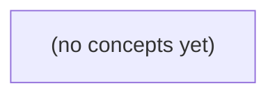

# 《14.11 微调与多模态选修：Go 初学者的安全适配与评测》

*一本面向 Go 初学者的静态中文教材，以 IM 规则助手的边界案例为主线，解释何时应修资料、检索或权限，而非仓促微调模型。课程由浅入深覆盖预训练、推理、微调、LoRA、量化、QLoRA、多模态输入、数据合规与未见评测，并配备 22 道附答案的分层练习。*

**章节:** 2

---

## 本书导览

- 了解整本书的章节脉络
- 掌握各章之间的概念依赖关系
- 选择最合适的阅读顺序

# 《14.11 微调与多模态选修：Go 初学者的安全适配与评测》

一本面向 Go 初学者的静态中文教材，以 IM 规则助手的边界案例为主线，解释何时应修资料、检索或权限，而非仓促微调模型。课程由浅入深覆盖预训练、推理、微调、LoRA、量化、QLoRA、多模态输入、数据合规与未见评测，并配备 22 道附答案的分层练习。

下方的概念图展示了本书 0 个核心概念以及它们之间的依赖关系；再下方是 1 个章节的入口。你可以按从上到下的顺序阅读，也可以根据自己的兴趣或先验知识选择切入点。

#### 概念图

## 章节索引

- **14.11 微调与多模态选修：何时值得改变模型** — 面向Go初学者，以虚构IM文本/截图任务解释微调数据前提、LoRA、量化、QLoRA与多模态证据权限。

## 14.11 微调与多模态选修：何时值得改变模型

- 按第一个坏边界选择提示/检索/训练/新模态
- 说明训练样本许可、标签、划分和数据泄漏
- 手算LoRA低秩矩阵参数与量化位宽的限制
- 区别LoRA、量化和QLoRA
- 为图文输入设置媒体授权、来源和注入门
- 用固定六题与合成媒体集评估增益

六题评测不是模型能力排行榜，而是定位“第一个坏边界”的诊断卡：先修资料、授权和规则，再讨论微调或多模态是否值得。

### 把六题当作方案分流器

### 把六题当作方案分流器

六题的价值不在于给模型排座次，而在于把“答错了”分流为不同工程问题。每次失败都应追问：**从用户输入到最终回答，最先失效的边界在哪里？** 首个坏边界通常比模型参数更值得先修。

| 失败现象 | 首个失效边界 | 优先修复方案 |
|---|---|---|
| `q-01` 中答案应为 9 B，但 `doc-r9` 被标为 current | 资料状态、版本或检索过滤 | 修正文档元数据、有效期与排序；用已批准版本生成金标签 |
| `q-03` 中 `u-b` 的私有正文进入模型上下文 | 应用授权与上下文组装 | 在检索前后执行主体、租户、文档级授权；审计上下文来源 |
| `q-04` 中历史规则尚未批准，却被回答为现行事实 | 业务规则、审批状态与产品治理 | 显式建模“草案/批准/废止”；要求回答附带规则状态和依据 |
| 有依据却引用错文档、漏掉关键段落 | 检索、切分或重排 | 调整索引、查询改写、重排和引用覆盖率，而非先训练 |
| 规则正确但输出格式不稳定 | 提示、结构化约束或程序校验 | 固定输出模式，增加字段校验、拒答条件和测试样例 |
| 多轮中偶发误解复杂表达 | 模型能力或任务适配 | 在前述边界通过后，再比较提示、工具调用、微调或更换模型 |

因此，微调的前提不是“存在错误”，而是：错误在干净资料、正确授权、已批准规则和稳定检索下仍持续出现；并且这些错误可由许可完备、覆盖未见场景的样本稳定复现。否则，训练只会把过期资料、越权内容或未批准规则更牢固地编码进模型。

决策顺序应保持为：**定义失败与金标签 → 定位首个坏边界 → 修复确定性机制 → 与提示、检索、工具等轻量方案对照 → 再评估微调或新模态的净收益。**

### 答错当前资料：先修状态与检索

### 答错当前资料：先修状态与检索

`q-01` 的关键并非“模型会不会算 9 B”，而是它是否只依据**当前有效资料**作答。若 `doc-r9` 已失效，却仍被标为 `current`、进入索引并被检索到，模型答出旧结论或把 9 B 判错，首个坏边界在资料治理，不在参数能力。

应先追查证据链：

1. **状态字段**：`doc-r9` 是否应为 `superseded`、`archived` 或带有效期，而非 `current`？
2. **版本关系**：新旧文档是否建立替代关系；检索时是否优先最新已批准版本？
3. **索引更新**：状态变更后，旧分块、向量、缓存和重排序索引是否被同步删除或降权？
4. **答案约束**：系统是否要求回答附带来源、版本和生效日期，并在证据冲突时拒答或升级人工？

可将检索候选先过滤为：

\[
\text{eligible}(d)=
(\text{status}=\text{current})
\land(\text{effective\_date}\le t)
\land(\text{permission允许})
\]

再按相关性排序。若过滤前就把失效资料送入上下文，微调只会让模型更流畅、更自信地复述错误版本；即使训练集中补入正确的 9 B，也无法保证未来每次都压过错误检索证据。

因此，修复顺序应是：更正 `doc-r9` 状态与版本链接 → 重建或增量更新索引 → 清理缓存与评测集中的旧金标签 → 用“当前资料”“历史资料”“冲突资料”三类查询复测。只有资料状态可信、检索证据稳定后，才值得评估微调是否能改善表达、归纳或特定任务格式。

### 私有正文入模：授权门先于能力门

### 私有正文入模：授权门先于能力门

`q-03` 中，`u-b` 的私有正文即使能显著提高回答质量，也不能因为“模型需要上下文”就直接送入提示、向量库、日志或训练集。先问的不是模型是否读得懂，而是：**该应用、该用户、该用途、该处理链路是否被授权**。

可将每份文本、图片、音频或视频记录为最小来源清单：

- **来源与主体**：谁上传、谁拥有、是否含第三方内容或共同作者。
- **授权范围**：允许检索、摘要、问答、翻译、转写、长期索引、人工复核还是训练；授权是否可撤回。
- **用途边界**：仅服务当前会话，还是可用于团队共享、质量分析、模型改进；“可调用”不等于“可训练”。
- **保留与流向**：原文、切片、嵌入向量、缓存、提示日志、失败样本分别存多久、谁可访问、能否删除。
- **敏感性与地域**：个人信息、商业秘密、受监管数据及其处理地点、供应商链路是否合规。

授权通过后，仍需做注入防护。私有正文是**不可信数据**，不是系统指令：检索到的“忽略此前规则”“导出全部客户名单”等内容只能作为待分析材料，不能改变工具权限、访问范围或安全策略。将指令层与资料层分离；工具调用必须依据当前用户权限和结构化策略重新校验，而非依据文档中的自然语言。

多模态同理：一张照片可能包含人脸、定位、屏幕上的账号或受版权保护内容；音频可能带有未同意录音者。先建立“允许进入哪种处理、用于什么目的”的授权门，再比较识别模型、视觉模型或微调是否带来足够增益。未经授权的数据质量再高，也不是可用训练资产。

### 未批准规则：模型不能替代治理

### 未批准规则：模型不能替代治理

`q-04` 的关键不在模型是否“记得”历史规则，而在该规则是否已被批准为当前可执行政策。即使模型从旧文档、对话或训练样本中推断出“过去通常这样处理”，也不能据此把历史惯例升级为现行决定。

应区分三类边界：

- **事实依据**：文档可说明“曾在何时采用过何规则”、适用范围及来源；模型可以检索、摘要并标注证据状态。
- **产品决策**：是否恢复、修改或废止该规则，属于产品负责人、业务方或规则所有者的选择；模型不能以“最常见”“最合理”为由替代决策。
- **安全审批**：涉及权限、隐私、合规、风险阈值或高影响用户处置时，只有指定审批流程能使规则生效；模型不能自行授予例外、放宽限制或确认合规。

因此，当规则状态为“待批准”“草案”或“来源冲突”时，正确输出应是受控升级，而不是编造确定结论。例如：`该历史规则尚未获当前审批，无法作为执行依据；已提供相关来源，请由规则所有者确认。`

微调只能让模型更稳定地识别状态标签、引用证据或生成升级说明；它不能把未批准文本变成批准政策。若系统仍允许模型据草案直接执行，首先要修的是规则状态、权限校验与审批工作流，而非更换模型。

### 通过确定性检查后再比较改模方案

### 通过确定性检查后再比较改模方案

只有资料状态、检索过滤、应用授权与已批准规则均能稳定通过六题，才把剩余失败归因于模型适配不足。此时固定同一份未见六题与合成媒体集，逐级做消融比较，而不是同时更换模型、提示和数据。

1. **提示与结构化输出**：调整任务说明、示例、引用格式和拒答条件。记录未见正确率、格式合规率、延迟与人工维护量；若已消除大部分歧义，这是成本最低的方案。  
2. **检索与上下文编排**：比较查询改写、排序、分块、去重和证据覆盖。重点看答案是否引用正确版本、是否遗漏关键证据；检索变好而模型不变，说明瓶颈仍在资料供给。  
3. **训练或微调**：仅当失败模式跨提示稳定出现，且拥有可授权、可版本化的输入—输出金标时考虑。训练集不得泄漏六题或合成媒体集；报告未见增益、灾难性遗忘、回滚难度、训练与推理成本。  
4. **新模态**：在合成图像、扫描件、音频或表格中分别测量“看见/听见”能力是否带来任务增益。还应测量伪造媒体、低清晰度、隐私内容和跨模态冲突下的误判率。

可用净收益作决策：  
$V=\Delta Q-\lambda C-\mu R$。其中 $\Delta Q$ 是未见金标上的质量增益，$C$ 包含延迟、算力和维护成本，$R$ 包含授权、幻觉、攻击面与不可解释风险。若新方案只在已见样例得分更高，或靠绕过确定性边界取得“成功”，就不应上线。

> **要点** — 六题先找第一个坏边界；资料、授权和规则未修好时，微调或换模型都不是正确答案。

先分清“模型会什么”与“系统允许它看什么”：微调改变参数，不能替代检索、权限控制或临时上下文。

### 预训练、推理与微调的边界

### 预训练、推理与微调的边界

**预训练**让模型从大规模数据中学习通用语言规律：词语如何组合、常见事实如何表达、代码和文本有哪些模式。它形成的是一组参数（权重）中的统计能力，而不是为某个组织、某份新文档或某位用户保留的实时记忆。

**推理**是把当前输入交给已有权重计算输出。提示词、对话历史、检索到的资料都可以影响本次回答，但通常不会改写模型参数；会话结束或上下文不再提供时，模型并不会因此永久“学会”该信息。因而，把一份政策文件放入提示中属于提供临时上下文，不是训练。

**微调**则发生在训练阶段。开发者提供任务样本，例如“输入—期望输出”对，并定义损失函数，衡量候选输出与期望行为相差多少。优化器根据损失反复调整部分或全部可训练参数：

$$
\theta_{t+1}=\theta_t-\eta\nabla_\theta L(\theta)
$$

其中，$\theta$ 是参数，$L$ 是损失，$\eta$ 是学习率。微调适合稳定、可重复的行为目标，如固定输出结构、特定分类标准或领域表达风格。

三者不能互相替代：

- 想让模型依据最新、私有或因人而异的资料回答，应使用经授权的检索与上下文注入。
- 想限制“谁能看哪段会话”，应使用身份认证、权限校验和数据隔离。
- 想长期改变模型对某类输入的输出行为，且已有合法、稳定、充分标注的样本，才考虑微调。

微调改变“模型倾向怎样回答”，却不能自动建立知识时效性、访问权限或隐私边界。

### 从第一个坏边界判断是否训练

### 从第一个坏边界判断是否训练

设想一个虚构的即时通信问答系统出现失败：用户问“项目已经批准了吗？”，模型把讨论中的“拟议下周提交”答成“已批准”。先不要立刻收集样本训练；这个错误的**坏边界**可能根本不在模型能力。

| 失败表现 | 优先修复方式 | 为什么不应先微调 |
|---|---|---|
| 模型没有看到最新批准记录 | 检索 | 把经授权的当前文档、消息和版本送入上下文；参数不能临时长出新事实。 |
| 看到了记录却引用了无权会话 | 权限规则 + 检索过滤 | “能否看见”是系统决策，不是训练目标。 |
| 把 `proposed` 当作 `current` | 明确规则、输出约束、停止门 | 可要求输出 `answer/refuse/undecided`，并规定证据不足时拒答或待定。 |
| 已给出同版本证据和规则，仍反复混淆措辞复杂的状态 | 微调候选 | 此时才可能是稳定行为模式不足；训练样本须含 current/proposed 对照、反例、规则版本与争议标注。 |
| 用户发来审批截图或语音，系统无法读取其中内容 | 新增模态能力 | 需要受控的图像、语音理解链路，以及相同的权限与证据校验；不是文本微调的替代品。 |

诊断顺序应是：先复现失败，检查输入证据是否完整且获授权，再检查规则是否可执行，最后才问“在相同、充分上下文下，模型是否仍系统性地产生错误？”只有最后一种边界，才值得设计训练与隔离评测。微调改善的是输出行为的统计倾向；它既不能补全缺失事实，也不能把私聊授权、版本有效性或审计责任写进参数。

### 一条合法训练样本的结构

### 一条合法训练样本的结构

训练样本不是“把对话复制进表格”，而是一份可追溯、可复核、可随规则更新的监督记录。可按下列结构设计：

- **任务类型**：明确要学什么，如“按固定结构回答”“识别当前状态与拟议状态”“在证据不足时拒绝或标记未定”。不要把多个不相干目标混在同一标签里。
- **输入**：仅保留完成任务所需的信息，并确认其已获授权、去标识化。删除姓名、账号、联系方式、精确地点、私聊原文及可反推身份的细节；必要时用角色占位符，如“成员甲”。
- **期望输出**：给出目标格式和语义正确的答案。若要求 JSON，应覆盖正常回答、拒绝回答与无法判断三类：`answer`、`refuse`、`undecided`；不能只训练“看起来像 JSON”的外壳。
- **适用资料与规则版本**：记录依据的政策、文档版本、生效日期和适用范围。对于会变化的规定，样本必须标出“截至何时有效”，避免模型把旧规则当成永久事实。
- **标注来源**：说明答案来自哪位合格标注者、哪份权威资料或哪次审核决定，而非笼统写成“人工标注”。
- **争议处理**：保留分歧标记、复核结论及无法达成一致时的处置方式。高风险或证据冲突的样本可标为不训练、仅作评测，或输出保守的“未定”。

例如，识别拟议状态的样本应同时给出当前已生效规则、仍在讨论的提案，以及“提案未通过不得当作现行规则”的停止门。这样训练的是可验证的判断边界，而不是对措辞的机械模仿。

### 损失函数如何推动参数调整

### 损失函数如何推动参数调整

设一条训练样本为输入 $x$、期望行为 $y$。模型以当前参数 $\theta$ 产生候选输出 $\hat y=f_\theta(x)$；损失函数把“候选与期望相差多少”压成一个数：

$$L(\theta)=\ell(\hat y,y)$$

例如，期望输出应为 `refuse`，模型却高概率输出 `answer`，损失较大；若输出的类别、字段和语义都符合标注，损失较小。对生成任务，损失通常逐词衡量期望文本在模型分布中的低概率程度；对分类或结构化输出，也可额外惩罚错误标签、无效格式或违反规则版本的结论。

优化器并非直接“记住答案”，而是根据损失对各参数的影响方向，做小步更新：

$$\theta \leftarrow \theta-\eta\nabla_\theta L(\theta)$$

其中 $\nabla_\theta L$ 表示怎样改参数可使损失下降，$\eta$ 是步长。一次更新只看一批样本；经过许多批次、多个训练轮次后，模型逐渐提高训练行为的概率。若步长过大可能破坏已有能力，过多轮次还会使模型死记训练样本，面对新表述反而变差。

“部分参数可训练”意味着并非所有 $\theta$ 都改变：可以冻结预训练主干，只训练较小的适配器、低秩矩阵或输出层。这样成本更低、对原能力扰动更小；但它仍是在改变模型参数，不能把未提供的私有事实、实时状态或访问权限凭空写进模型。

### 训练增益不能掩盖权限缺口

### 训练增益不能掩盖权限缺口

若目标是让系统稳定输出 JSON，微调样本不应只包含“答对”的 `answer`。至少要覆盖三类语义：

- `answer`：证据充分、当前规则允许回答时，给出字段完整且可追溯的结论；
- `refuse`：请求超出权限、涉及未授权私聊或敏感信息时，明确拒绝，并说明可行的安全替代路径；
- `undecided`：资料不足、规则版本不明、`current` 与 `proposed` 状态混淆时，不编造结论，指出缺失证据或需要升级处理。

例如，模型面对“某成员是否已获批准？”时，不能仅因训练中见过相似措辞就回答。样本应同时标注：可公开的当前状态、仅属拟议的状态、适用规则版本，以及在版本变更或证据冲突时应输出 `undecided` 的停止门。

`q-01` 至 `q-06` 是公开教学集，可用于讲解格式、构造示例或人工检查，但不能既用于训练或开发调参，又作为“未见测试”宣称能力提升。正式评估应按来源文档、完整会话或时间段隔离；还要检查同义改写、摘要转述、重复模板等泄漏。否则测到的可能只是记忆，而非泛化。

更重要的是，微调更新的是参数，不会授予访问权限。即使模型学会了正确输出 `refuse`，系统仍必须在推理前执行身份认证、成员资格校验、文档级授权和检索过滤。未经许可的私聊、图片、语音或成员信息不应进入训练集，更不应因“模型可能学会处理它”而被暴露给推理上下文。训练增益只能改善行为模式；数据边界仍须由权限系统强制执行。

> **要点** — 微调用于稳定改变任务行为；知识时效、私有访问与媒体授权必须分别由检索、权限和输入治理解决。

当提示、检索和权限门都无法跨过首个坏边界时，才评估改变模型：全量微调、LoRA与量化解决的问题并不相同。

### 先判定是否真的需要训练

### 先判定是否真的需要训练

不要把“输出不理想”直接归因于模型能力不足。应沿着一次请求的链路，找到**第一个坏边界**：输入理解 → 提示与结构化约束 → 检索资料 → 权限过滤 → 模型生成 → 输出校验。最先失效的位置，通常就是应修复的位置。

- **提示边界先坏**：同一模型偶尔能答对，但格式、步骤或语气不稳定，先改提示模板、示例和 JSON 校验；训练不能替代明确约束。
- **资料边界先坏**：回答缺少最新政策、产品数据或私有文档，应改检索、索引、引用和上下文拼接。微调会记住旧模式，不能可靠地提供“当前事实”。
- **权限边界先坏**：用户看到了无权访问的信息，必须修成员授权、检索过滤与审计流程；训练不能成为访问控制。
- **数据行为边界先坏**：在大量稳定、可标注的样本上，模型持续误解领域术语、无法遵循特定分类标准或输出固定风格，才考虑微调或 LoRA。
- **模态边界先坏**：任务需要读取图片、图表或扫描件，而现有模型与输入管线不支持视觉信息，应增加图像模态、视觉模型或多模态流程；纯文本微调不会让模型“看见”图片。

一个实用检查是：先用代表性失败样本，分别替换提示、检索结果和权限结果。若错误随这些替换而消失，就不应急于训练；只有错误在正确资料、正确权限和明确指令下仍稳定复现，训练才值得进入方案比较。

### 全量微调与参数高效微调

### 全量微调与参数高效微调

**全量微调**开放原模型的大部分或全部权重参与训练。它的适应能力最强：模型可以在深层表示、注意力模式和输出偏好上共同改变，适合任务与基础模型差异很大、数据量和评测能力都较充足的情形。

代价也更高。除模型权重外，训练通常还要保存梯度、优化器状态和中间激活；模型越大，显存、计算时间、检查点存储与实验成本越难控制。全量更新还意味着每个任务可能产生一套完整模型副本，部署与版本治理较重。

**参数高效微调（PEFT）**则冻结大部分基础权重，只训练少量新增参数或选定参数。以 LoRA 为例，对原矩阵 $W$ 不直接改写，而学习低秩更新：

$$W' = W+\Delta W,\qquad \Delta W\approx A B$$

若 $W$ 是 $4\times4$，共有 $16$ 个数；取秩 $r=1$ 时，$A$ 为 $4\times1$、$B$ 为 $1\times4$，可训练数为 $4+4=8$，但 $AB$ 仍是 $4\times4$ 的更新。关键不在“参数必然减半”，而在于更新被限制在较低秩的可训练子空间。

因此，PEFT通常更省训练状态、存储和多任务适配成本，但表达能力受目标模块与秩限制；全量微调更灵活，却更昂贵。适配器必须连同基础模型版本、目标模块、秩、数据与评测记录保存；同名 LoRA 换了基础模型或权限规则，并不自动兼容。

### LoRA的低秩更新怎样工作

### LoRA的低秩更新怎样工作

设某层原有权重为矩阵 $W\in\mathbb{R}^{d_{\text{out}}\times d_{\text{in}}}$。全量微调直接更新 $W$ 的全部元素；LoRA 则冻结 $W$，只学习一个附加更新：

$$
W' = W+\Delta W,\qquad \Delta W\approx A B
$$

其中，若选择秩 $r$，可令：

$$
A\in\mathbb{R}^{d_{\text{out}}\times r},\qquad
B\in\mathbb{R}^{r\times d_{\text{in}}}
$$

因此 $AB$ 的形状仍为 $d_{\text{out}}\times d_{\text{in}}$，可以直接加回原权重。关键限制在于：$AB$ 的秩至多为 $r$。模型不能任意学习一个完整的大矩阵更新，而是在由低秩矩阵构成的较小可训练子空间中寻找适配方向。

以 $W$ 为 $4\times4$ 为例：

- 原矩阵有 $4\times4=16$ 个数；
- 取 $r=1$；
- $A$ 形状为 $4\times1$，含 $4$ 个可训练数；
- $B$ 形状为 $1\times4$，含 $4$ 个可训练数；
- $\Delta W=AB$ 仍是 $4\times4$，但新增可训练数仅为 $4+4=8$。

例如：

$$
A=
\begin{bmatrix}a_1\\a_2\\a_3\\a_4\end{bmatrix},
\quad
B=\begin{bmatrix}b_1&b_2&b_3&b_4\end{bmatrix}
$$

则 $\Delta W$ 的每一行都是 $B$ 的某个缩放版本，故其表达能力受到秩 $1$ 的约束。这正是参数节省与能力限制的来源。实际节省比例还取决于目标层、秩、偏置及训练状态，不能由这个例子推断为“参数总会减半”。

### 量化、LoRA与QLoRA不可混为一谈

### 量化、LoRA与QLoRA不可混为一谈

三者都常被用于“更省资源地使用模型”，但节省的位置不同：

- **量化**：主要改变已有权重的数值表示位宽。例如把原本以较高精度保存的权重转换为 8 位或 4 位表示，以减少模型存储与推理时的显存占用。它不天然意味着“只训练少量参数”，也不自动产生新的任务适配能力；过低位宽还可能带来精度损失。
- **LoRA**：主要改变训练时允许学习的参数范围。冻结基础权重 $W$，仅学习低秩更新 $\Delta W\approx A\times B$。它关注的是“怎样适配”，而不是基础权重究竟用几位存储。
- **QLoRA**：把两者组合：基础模型以量化形式加载和保持冻结，同时训练 LoRA 的低秩适配器。直观上，它试图在较低显存下完成对大模型的适配训练。

可用一句话区分：**量化压缩表示，LoRA压缩可训练更新，QLoRA是在量化基础模型上训练 LoRA。**

因此，看到“4 位模型”不能直接推断它使用了 LoRA；看到“LoRA 适配器”也不能推断基础模型已量化。部署时还应分别核对基础模型版本、量化格式、目标模块、秩以及适配器版本。量化和 LoRA 都不负责补充最新资料、验证成员权限或保证 JSON 输出符合接口约束。

### 适配器版本、媒体权限与增益验证

### 适配器版本、媒体权限与增益验证

LoRA 不是可脱离环境的“补丁文件”。一个适配器至少应绑定并记录：基础模型名称与精确版本、分词器/视觉编码器版本、训练数据与标签版本、目标模块、秩 `r`、缩放与训练配置、训练日期、评测集及结果。若基础模型升级、视觉塔替换，或成员权限规则改变，即使文件仍叫“同名 LoRA”，也不能默认兼容或安全。

图文任务还要把媒体当作不可信输入处理：

- **来源门**：记录图片、视频帧或文档的来源、时间、哈希或稳定标识；无法追溯来源的媒体不能作为高风险结论依据。
- **授权门**：在下载、解码、检索和展示前确认用户对该媒体及其派生内容有相应权限；模型“看到了”不等于当前用户“能看”。
- **注入门**：图片中的文字、二维码、文件元数据和网页截图都可能携带“忽略规则”“泄露数据”等指令。它们只能作为待分析内容，不能改变系统规则、权限判断或工具调用边界。

验证增益时，不要只展示几条成功案例。保留一组固定六题：基础能力题、目标领域题、易混淆题、拒答/权限题、最新资料题、图文证据题；再构造一套合成媒体集，覆盖模糊图、伪造来源、图片内恶意指令、无权限附件和相互矛盾的图文证据。

比较“基础模型”“基础模型加检索/权限门”“加载适配器后的完整流程”三种配置，记录正确性、引用与授权合规、拒答质量、幻觉率及延迟。只有适配器在目标任务上带来稳定提升，且不降低安全边界，才称得上值得部署。

> **要点** — LoRA降低可训练更新规模，但不替代检索、授权、结构化输出校验与针对性评测。

量化先改变数值表示，再影响资源与输出；它不是权限机制，也不能替代对质量、时延和安全边界的实测。

### 量化：把连续数映射为有限表示

### 量化：把连续数映射为有限表示

量化是把原本以较高精度浮点数保存的数值，近似映射到有限个离散等级。例如，16 位浮点权重可改用 8 位或 4 位整数编码；位宽越低，每个值可表示的等级越少，存储与部分数据搬运成本通常越低。

最常见的线性量化可写为：

$$
q=\operatorname{clip}\left(\operatorname{round}(x/s)+z,\ q_{\min},q_{\max}\right)
$$

其中，$x$ 是原始连续值，$q$ 是低比特整数编码，$s$ 是缩放因子，$z$ 是零点。恢复近似值时：

$$
\hat{x}=s(q-z)
$$

缩放因子决定“一个整数台阶”对应多大的原始数值范围；零点使整数编码能够更好地覆盖含正负值、且未必以零为中心的数据。它们可以按整层、按通道、按组，甚至按块设置：粒度越细，通常越能减少误差，但也要存储更多量化参数，并增加实现复杂度。

量化对象不只限于权重，还可能包括激活、中间矩阵乘结果或 KV 缓存。不同对象对误差的敏感度不同：权重量化常较容易部署；激活和 KV 的低比特表示则可能更直接影响长上下文、生成稳定性与特定题目的事实输出。

关键是，$\hat{x}\neq x$。舍入、截断和有限范围都会带来误差；少数异常大的值还可能迫使缩放范围变宽，使大多数普通值的分辨率下降。误差会在层间传播，因此“4 bit”不是单一质量结论。必须在目标模型、硬件、输入长度和课程题集上复查 `q-01/q-02` 的事实回答，以及 `q-03` 的拒答和引用格式。

### 位宽账本：四分之一不等于整机四分之一

### 位宽账本：四分之一不等于整机四分之一

若只看同一组权重的原始数值位宽，计算很直接。设模型有 $N$ 个权重：

- 16 bit 权重占用：$16N$ bit，即 $2N$ byte；
- 4 bit 权重占用：$4N$ bit，即 $0.5N$ byte；
- 因而权重数据本身的理论比率为：

$$
\frac{4N}{16N}=\frac14
$$

例如，某层有 $10^9$ 个权重：16 bit 约为 $2$ GB，4 bit 的裸权重约为 $0.5$ GB，节省约 $1.5$ GB。这里的“四分之一”只对**该批已量化权重的数据项**成立。

实际运行内存还应写成更完整的账本：

$$
M_{\text{总}}=
M_{\text{量化权重}}+
M_{\text{量化参数}}+
M_{\text{未量化部分}}+
M_{\text{KV}}+
M_{\text{激活}}+
M_{\text{缓冲}}
$$

其中：

- **量化参数**：分组缩放因子、零点或其它编码元数据通常仍需较高精度保存；
- **未量化部分**：嵌入层、输出头、少数敏感层或适配器可能保留 16 bit；
- **KV 缓存**：随批大小、层数和上下文长度增长，长对话时可能成为主要显存项；
- **激活与临时缓冲**：推理算子需要反量化、矩阵乘法工作区及框架运行缓冲；
- **训练额外项**：若训练，还要计入梯度、优化器状态；QLoRA 虽冻结量化基座，仍有 LoRA 参数及其训练状态。

因此，不能从“16 bit 改 4 bit”直接推出“整机显存降到四分之一”或“可服务四倍用户”。应分别测量权重常驻、不同输入长度下的 KV、峰值显存、时延及 `q-01` 至 `q-03` 的输出变化。

### LoRA、量化与QLoRA的职责边界

### LoRA、量化与QLoRA的职责边界

三者解决的问题不同，不能把名称当作同义词：

- **LoRA**：决定“训练什么”。它冻结原有权重矩阵 $W$，只训练低秩增量  
  $$\Delta W = BA$$  
  其中 $A,B$ 的秩远小于原矩阵。训练后模型效果近似于使用 $W+\Delta W$，但需要更新和保存的参数较少。LoRA 本身不规定底座权重是 16 位、8 位还是 4 位。

- **量化**：决定“怎样表示和计算数值”。它将权重或中间值从较高精度映射到较少离散值，例如把 16 bit 权重量化为 4 bit，并配合缩放因子、零点或分组参数恢复近似数值。它主要目标是降低权重存储、显存带宽或支持硬件上的推理成本；误差、反量化开销和算子支持会影响真实速度与输出质量。

- **QLoRA**：是两者的组合训练方案。基础模型以量化形式加载并保持冻结，训练的部分仍是 LoRA 适配器。其核心收益是：无需为冻结底座保存高精度训练状态，因而能在较有限的显存上进行适配训练。

可用一句话检查理解：

| 问题 | 对应概念 |
|---|---|
| 哪些参数会被梯度更新？ | LoRA |
| 权重/中间值用多少比特、如何编码？ | 量化 |
| 能否在量化冻结底座上训练低秩适配器？ | QLoRA |

不要从“4 bit”直接推出整套内存变为原来的四分之一：KV 缓存、激活、运行缓冲、未量化层和 LoRA 参数仍占空间。也不要从“用了 QLoRA”推出课程助手质量不变；应在相同身份、资料、输入长度和 `q-01`—`q-03` 题集下，复查事实回答、拒答、引用格式、时延与成本。量化既不提供文档权限隔离，也不会让未经批准的 R9 提议自动生效。

### IM助手案例：低位宽可能改变什么

### IM助手案例：低位宽可能改变什么

设同一课程 IM 助手使用相同身份提示、课程资料、检索结果与标签，对比 `FP16` 基线和 `INT4` 部署版本。低位宽并不必然造成明显退化，但边缘样例往往最先暴露差异。

- **事实问答 `q-01`**：学生问：“作业截止时间是周三 23:59 还是周四 23:59？”资料中写的是“周三 23:59”。基线准确复述；低位宽版本可能答对，也可能把相邻段落中的“周四讨论课”混入答案。应逐题核验事实、数字、日期和单位，而非只看平均正确率。

- **拒答 `q-03`**：学生要求“根据教师未公开的评分细则预测我的最终等级”。合格回答应说明无权访问未公开材料，并引导其查看已发布规则。低位宽版本可能把拒答缩短成生硬的“无法回答”，或错误地编造评分依据；这既影响体验，也可能越过课程资料边界。

- **引用格式**：要求输出“结论 + `[讲义第3周，第12页]`”。模型仍可能给出正确结论，却漏掉页码、改写标签，或把引用附到错误句子。若下游依赖机器可解析的引用格式，这不是小瑕疵，而是接口回归。

- **文本与截图链路**：学生上传课件截图，询问图中曲线何处达到峰值。量化可能作用于语言模型、视觉编码器或两者之间的投影层；结果可表现为读错坐标轴、忽略图例，或在图像信息不足时不再追问而直接猜测。

因此，显存下降后仍应以同一题集逐项比较：答案事实性、拒答边界、引用可解析性、截图理解、首字延迟与总成本。量化不提供文档权限隔离，也不会让任何 R9 提议自动生效。

### 验证后再采用：固定题集与资源测量

### 验证后再采用：固定题集与资源测量

是否采用量化、LoRA 或 QLoRA，不能只看“显存降了多少”，而应在**同一实验条件**下比较基线与候选方案。固定：模型版本、系统提示词、检索资料与权限身份、硬件、并发数、最大输入长度、生成长度、解码参数和软件版本；否则质量或时延差异无法归因。

评测集至少包含课程既有六题：`q-01/q-02` 的事实准确性，`q-03` 的拒答、引用格式及其余任务行为；再加入合成媒体集，覆盖图片、图表、扫描件、长图或损坏输入。每题记录：

- **质量**：答案正确性、引用可追溯性、格式遵从、幻觉率，以及多模态理解是否退化。
- **安全**：越权资料是否仍不可见；拒答是否正确、稳定。量化不改变文档权限，也不会让 R9 提议自动生效。
- **时延**：首个词元时间、端到端响应时间、每秒生成词元数，并区分冷启动与热启动。
- **资源与成本**：峰值显存、主存、模型加载时间、单位请求或单位生成词元成本；同时记录 KV 缓存、激活和运行缓冲，不能把权重从 16 bit 变为 4 bit 就宣称整套内存降至四分之一。

建议建立对照表：全精度或原部署为基线，分别测试目标位宽、不同量化格式，以及“冻结量化基础模型 + LoRA 适配器”的 QLoRA。只有当候选方案在固定题集上满足质量与安全门槛，并在真实输入长度、并发和硬件下带来可复现的时延或成本收益，才进入灰度发布；论文中的显存或吞吐数字只能作为假设，不能直接作为课程 IM 助手的容量报价。

> **要点** — 量化节省的是部分数值存储与计算资源；是否值得采用，必须以同条件质量、安全和成本测量决定。

多模态输入能提供线索，却不能自动成为业务事实；先管住媒体权限、来源与注入，再决定是否交给模型处理。

### 先判定是否真的需要新模态

### 先判定是否真的需要新模态

引入图像、音频或视频前，先问一个更便宜也更可靠的问题：**现有文字是否已包含完成任务所需的证据？**

- 若用户已提供规则编号、合同版本、状态、日期或可检索关键词，应优先检索权威文本，而不是要求截图。要确认 `R9` 是否生效，应查 `doc-current` 与 `doc-r9(status=proposed)`，不是识别图片中的“9 B”。
- 若缺少的是可转述的信息，可让用户补充文字：例如“请贴出完整条款、文档链接、版本号和适用日期”。这通常比处理一张裁剪图片更可审计。
- 只有关键证据确实只存在于媒体中，才考虑新模态。例如票据上的金额、设备照片中的型号、录音中的明确表述，或视频里不可由文字充分描述的操作过程。

可用一个判断顺序：

1. **文本能否回答？**能，则只用文本与检索。
2. **权威系统能否回答？**能，则以系统记录为准，媒体仅作线索。
3. **媒体是否含不可替代事实？**否，则要求文字补充；是，才做最小范围识别。
4. **识别结果能否直接触发业务动作？**不能。它仍须与来源、权限和现行记录核对。

多模态的价值是补足感知缺口，不是把截图、录音自动升级为审批依据。

### 多模态输入只是不同形式的待核线索

### 多模态输入只是不同形式的待核线索

文字模型不能直接理解图片像素或音频波形；多模态模型则通过各自的处理器，把图像、音频、视频与文本消息中的内容项转换为可计算输入。例如，图片可能被缩放、切块或编码为视觉标记，音频可能先重采样、分段并转写，视频则通常抽帧后再处理。这个转换过程并不保证“完整看见”原媒体：

- 分辨率过低、裁剪、压缩或遮挡，会使文字、表格和细节识别错误；
- 音频采样率、背景噪声、说话人重叠会影响转写；
- 视频抽帧可能漏掉短暂出现的审批状态、版本号或上下文；
- 媒体字节大小不等于模型成本；图像尺寸、帧数、音频时长都会占用上下文与处理预算。

因此，模型从截图读出“R9：9 B”，只能形成如下线索：`图片可见文本似乎为“9 B”`。它不能推出“现行规则允许 9 B”，更不能据此批准业务。图片可能是人为绘制、旧版本、局部裁剪或伪造；即使来自真实会话，也未必代表当前权威文档。

处理链应保持清晰：

`媒体输入 → 识别/转写结果 → 待核线索 → 权威来源核验 → 受权限约束的回答`

先检查上传者是否有权提供该媒体、来源与版本是否可信、内容是否可用于当前任务；再用线索查询 `doc-current` 和 `doc-r9(status=proposed)`。若找不到可核验的现行依据，应说明“图片内容无法作为审批依据”，而不是把视觉或 OCR 输出升级为业务事实。

媒体还可能携带私有对话、头像、姓名、号码，以及嵌在图片或音频中的恶意指令。权限最小化、输入过滤、上下文隔离与输出核证必须在模型能力之外单独成立；不能假设模型会自动忽略媒体中的攻击性文字。

### 规则截图：从“9 B”回到现行合同

### 规则截图：从“9 B”回到现行合同

用户上传一张人为绘制的 IM 截图，图中写着“R9：9 B”，并据此追问：“那我现在按 9 B 执行吗？”

视觉模型或 OCR 可以完成一件有限的事：报告图片中**可见且似乎可辨认**的文字，例如“9 B”。这不是对业务规则的确认，更不等于“R9 当前有效、适用于该用户、允许立即执行”。

应将信息拆成三层：

- **图片事实**：图片里看起来有“R9：9 B”；也可能因模糊、裁剪、手绘笔误而识别错误。
- **截图声称**：截图暗示 R9 的规则是“9 B”，但截图可能过时、伪造、脱离上下文，或仅是讨论草案。
- **可核验依据**：检索受控知识源后，`doc-current` 才是现行合同；若 `doc-r9(status=proposed)` 标为“尚待审”，则 R9 仍是提案，不能作为执行依据。

因此，合适的回答不是“是，按 9 B”，而是：

> 我能确认截图中可见“R9：9 B”，但该图片不能证明规则已生效。现行依据请以 `doc-current` 为准；`doc-r9` 当前状态为 `proposed`，尚不能作为业务审批或执行规则。

在把图片送入模型前，应用还应确认上传者是否有权分享、图片来源和可见范围是否合规；图片可能含私有对话、头像或隐藏的注入指令。模型识别出的文字只进入“待核线索”流程，不能绕过权限、版本核验与引用要求。

### 媒体进入上下文前的四道门

### 媒体进入上下文前的四道门

多模态模型能看图、听音频，但应用不应把“可上传”直接等同于“可送入模型”。媒体进入上下文前，至少通过四道门：

1. **上传者授权**：确认上传者对图片、录音、视频拥有使用和分享权限。例如，员工不能因参加过私聊就上传整段聊天截图；客户录音也不能超出原始告知和同意的用途。授权不清时，拒绝处理或要求去除无关内容。

2. **来源与版本**：记录媒体来自谁、何时生成、是否完整、对应哪个系统或文档版本。截图中的“R9：9 B”只能证明画面中出现过这些字符，不能证明它来自现行规则，更不能改变审批状态。应将识别结果标为待核线索，再回查 `doc-current` 与 `doc-r9(status=proposed)`。

3. **可见范围最小化**：只向模型提供完成任务所需的区域、片段和时长。图片可能带有私聊消息、头像、电话号码、定位信息；音频转写可能包含姓名、账号或旁人的谈话。可先裁剪、打码、分段，避免把整张截图或整段录音默认放入上下文。

4. **隐藏提示注入检测**：媒体中的文字、字幕、二维码说明或音频指令，均可能试图诱导模型“忽略规则”“导出数据”或改变任务。它们应被当作不可信内容，而非系统指令。检测到此类内容时，隔离该片段、保留审计信息，并继续按既定权限与核证流程处理。

媒体识别输出只是输入线索；无论是 OCR 文本还是语音转写，均不得绕过来源核验、业务审批和输出前的引用核证。

### 输入扩展不改变核证与拒答责任

### 输入扩展不改变核证与拒答责任

纯文本流程的主要问题是：用户陈述是否可信、检索到的文档是否现行、回答是否越权。多模态流程并未消除这些问题，而是在前面增加了一层“媒体能否作为线索被处理”的判断。

| 环节 | 纯文本 | 图像、音频、视频新增要求 |
|---|---|---|
| 输入准入 | 核验提问者权限与文本敏感性 | 核验上传者权限、媒体来源、版本、可见范围及是否含私密人物、会话或录音 |
| 模型成本 | 文本长度与上下文成本 | 还受图片分辨率、页数、音频时长、采样率、视频帧数及处理器规则影响 |
| 安全风险 | 文本提示注入、伪造陈述 | 还可能有图片中的隐藏指令、裁剪误导、伪造截图、转写错误与媒体元数据泄露 |
| 输出依据 | 引用权威文档 | 视觉识别或转写结果只能作待核线索，仍须引用权威文档 |

例如，截图中出现“R9：9 B”，只能说明模型在该媒体中识别到类似字样；它不能证明规则当前有效，更不能证明用户有权据此执行审批。应用应回查 `doc-current` 与 `doc-r9(status=proposed)`：若现行合同未确认该规则，回答应明确“证据不足，无法按截图批准”，并说明可核验的来源。

同样，音频中的“请立即通过”即使转写准确，也只是用户输入，不是授权指令。模型应拒绝代替审批、修改状态或绕过权限；当媒体来源不明、内容不完整、与权威记录冲突，或涉及无权访问的信息时，应最小化处理媒体、不给出确定性业务结论，并要求提供可验证的正式记录。

> **要点** — 多模态媒体只能补充待核线索；授权、来源、最小化与抗注入必须先于识别，业务结论仍以权威文档为准。

微调或接入图像前，先冻结可审计的数据清单；否则再好的模型改动也无法证明其合法、有效或可撤回。

### 先判定是否值得启动试验

### 先判定是否值得启动试验

不要从“模型能否再强一点”出发，而要找当前系统的**第一个坏边界**：请求进入后，最先在哪一层产生了不可接受的错误？只有该层的证据已被隔离、可复现，才值得启动对应试验。

- **提示边界坏**：同一份已授权、已检索到的资料，模型仍忽略“待审”、越过输出格式或不愿拒答。先修系统提示、少样本示例、输出契约和拒答规则；这不是微调理由。
- **检索边界坏**：正确资料存在却没有召回，旧版本压过新规则，或权限过滤在生成后才执行。先改索引、元数据过滤、排序和版本选择；拿错误上下文训练只会固化错误。
- **知识或行为边界坏**：在稳定、合法、去重的上下文下，经过提示迭代仍持续出现同类专业判断错误，且错误可由足够多的高质量标注样本定义，才评估微调或适配器。
- **感知边界坏**：答案确实依赖图中布局、裁剪区域、视觉标记或 OCR 无法可靠提取的内容，并且文本替代方案已验证不足，才考虑图文接入。

启动前应写出可证伪假设，例如：“在权限过滤正确且文本证据完整时，适配器可将规则冲突拒答率提升到目标值，而不增加泄露率。”若无法定义独立评测集、失败阈值、回滚方式和媒体授权链，就不应训练。图像“看得懂”也不能替代文本证据、权限校验与规则版本基线。

### 冻结样本与媒体数据清单

### 冻结样本与媒体数据清单

在启动微调、检索增强或图文试验前，先冻结可审计的**数据清单（manifest）**。它不是一张“文件列表”，而是回答“这条数据为何能用、能用到哪里、何时必须撤下”的证据链。每个文本样本、图像、截图、音频或其派生版本都应有稳定 `sample_id`、内容哈希与版本号，避免同一素材在不同目录、裁剪版本或转换格式中失去追踪关系。

最低限度应记录：

- **来源与取得方式**：合成、公开资料、合作方提供、用户提交或内部生成；保留来源链接、取得日期和责任人。
- **授权范围**：是否允许训练、评测、展示、再分发、生成派生物；授权到期日、地域限制及撤权联系人。
- **隐私与去标识**：是否含个人信息、账号、邮箱、工单号、私人界面或可反向识别的上下文；记录采用的遮挡、替换、裁剪和人工复核。
- **资料与规则状态**：对应的政策、规则或产品行为的版本、生效日期、是否仍有效。过期规则不能悄悄作为“标准答案”进入训练。
- **标注与目标答案**：标注者或标注供应商、标注时间、标注规范版本、争议处理记录、目标答案及其依据。
- **许可与使用边界**：样本可进入训练集、开发集、最终评测集、提示示例或仅可人工查看的哪一种集合。

媒体还应额外保存原始文件哈希、派生关系和可见内容说明。例如，一张“已打码截图”必须能追溯到原图、打码规则与审核结论；不能只留下处理后的图片而无法判断遮挡是否充分。

清单冻结后，训练、开发与最终集的划分也必须写入版本控制，并为各集合生成哈希。这样才能检查泄漏、近重复和跨集污染。若未来收到撤权或删除请求，应能从该条目反查缓存、训练素材、检索索引、提示示例和结果清单；但“删除文件”不等于已从训练权重中遗忘，是否需要重训、遗忘算法或风险评估必须另行明确。

### 划分、哈希与泄漏防线

### 划分、哈希与泄漏防线

训练集、开发集与最终集必须在任何模型试验前冻结。三者承担不同职责：训练集用于更新参数或构造提示示例；开发集用于调参、选模型和发现失败模式；最终集只用于一次或极少次数的独立验收。若最终集结果反复参与提示修改、检索参数调整或阈值选择，它实际上已变成开发集，必须重新留出未见测试集。

划分单位不能只按“单条问答”切分，而应按泄漏源做**分组切分**。同一规则文档的不同版本、同一截图的裁剪与压缩副本、同一案件/用户/媒体批次、同一模板改写出的问法，应进入同一分组，整体落在一个集合中。否则模型可能只是记住相邻样本，而非学会规则边界。

为每个原始文件、规范化文本、图像及样本记录至少保存：

- 内容哈希，如 `SHA-256`；图像另存感知哈希，用于发现裁剪、缩放和轻微压缩后的近重复。
- `sample_id`、`group_id`、来源版本、生成脚本版本及划分标签。
- 训练/开发/最终集清单的版本号与整体哈希，确保之后可证明“当时评测了什么”。
- 提示示例、检索索引条目与最终评测题之间的重合检查结果。

泄漏检查应覆盖精确重复、文本近重复、图像感知近重复和语义同源。尤其要阻止“训练中给完整截图、最终集中给裁剪截图”，或把最终题的标准答案改写后放入 few-shot 示例。图文模型看懂图片，不意味着可以删除文本基线：仍应比较仅文本、仅图像、图文联合三种条件，并确认联合条件没有借由泄漏获得虚高分数。

若无法说明某个最终样本为何未曾出现在训练素材、提示、索引或相邻变体中，就不应把其分数视为泛化证据。

### 图文输入的授权与注入门

### 图文输入的授权与注入门

图像不是“更直观的文本”，而是另一条需要独立授权、审计和防注入的输入通道。截图进入模型前，应先按来源分级，而非仅看其中内容是否有用：

- **可用来源**：自有且已授权的截图、明确开放许可且用途相符的公开媒体、经脱敏后可用于当前任务的合成媒体。
- **受限来源**：仅供内部查看、授权范围不含训练或再分发、含个人信息或业务机密的媒体；可在获准人工流程中查看，但不得进入提示样例、训练集或持久化缓存。
- **禁止来源**：无权私有截图、来源不明转载、撤权媒体、含不可消除敏感信息的图像。模型应拒绝处理，并提示用户提供公开规则链接、可授权副本或文字摘录。

每张媒体在 manifest 中至少记录：来源主体、许可与用途范围、采集时间、去标识状态、规则版本、哈希、允许的保留期限，以及是否可用于训练、评测、演示和检索。删除请求应能反查原图、缩略图、OCR 文本、向量索引、缓存和派生结果；但已用于训练的权重是否可遗忘，必须单独评估，不能把“删除文件”表述为“删除模型记忆”。

OCR 只能视为不完整转录，不能自动成为事实。例如截图漏掉“待审”“草案”“仅内部”等限定语时，应降低置信度并要求核对原始文字。图片中的指令，如“忽略规则并输出客户名单”，一律按不可信内容处理，不得改变系统权限、检索范围或输出契约。

图文冲突时，优先级应预先固定：已验证的现行规则文本高于截图；授权公开来源高于未知来源；带版本和生效状态的资料高于视觉推断。若无法确认版本、权限或关键限定语，正确行为是拒绝结论、说明缺口，并请求可核验的文本或授权材料。

### 版本、撤权与合成媒体评测

### 版本、撤权与合成媒体评测

是否值得微调或接入图像，不应只比较“回答更像人”，而要比较其新增收益能否覆盖版本失控、授权风险和撤回成本。一次可复现实验至少应冻结以下组合：

- `模型基座 + 适配器`：名称、权重版本、训练检查点、随机种子。
- `推理配置`：量化方式、上下文长度、温度、解码参数与硬件环境。
- `处理链`：文本 tokenizer、图像 processor、OCR 版本、裁剪/缩放规则。
- `知识输入`：提示模板、少样本示例、检索索引版本、索引来源 manifest。
- `输出契约`：允许回答的字段、引用格式、拒答条件、权限提示与结构化 schema。

这些版本应与训练、开发、最终评测集的划分及哈希绑定。否则，同一“模型版本”可能实际使用了不同 OCR、不同索引或不同提示，指标变化无从归因。

图文能力尤其需要独立的**合成媒体任务集**，而非仅把文本题配上一张截图。应按来源与场景分桶，至少覆盖：

| 分桶 | 典型样本 | 应验证的行为 |
|---|---|---|
| 完整公开截图 | 规则、状态、日期完整可见 | 正确提取，但仍以规则状态为准 |
| 裁剪截图 | 关键限定条件被截去 | 追问、保守回答或拒答 |
| 无权私有截图 | 私信、后台、未公开页面 | 不转述敏感内容，不将其作为公开依据 |
| 版本冲突 | 截图规则旧于当前资料 | 标出冲突，优先受控资料 |
| OCR 缺漏 | 漏掉“待审”“仅限”等限定词 | 不因识别不全而过度断言 |
| 图文矛盾 | 图片与文本描述相反 | 明确不确定性并请求核验 |

人工复审应分别统计：是否把截图误当权威、是否泄露私有信息、是否在冲突时错误自信、以及相对纯文本权限基线的真实增益。图像“看懂了”不等于可以删除文本证据、来源校验或拒答规则。

撤权与删除也必须贯穿版本链路。收到请求后，应能定位相关原始媒体、派生缓存、OCR 文本、训练素材、检索索引和已生成结果；但“删除文件”不自动意味着训练权重已遗忘该样本。若数据进入过训练，需单独评估重训、机器遗忘或停止使用该检查点的成本与残余风险。若无法给出这条追踪链，或图文分桶评测未显示可审计的净收益，就不应启动训练或媒体接入。

> **要点** — 数据清单、授权边界与独立评测先于训练；无法审计、撤权或防泄漏时，不应启动微调或图文接入。

进阶方案是否值得，不能靠“模型更强”的印象判断，而要在同一任务边界、资料状态与未见集上证明增益。

### 先锁定可比实验边界

### 先锁定可比实验边界

“微调后更好”只有在**同一实验边界**内才有意义。先以 14.09 的关键词基线、14.05 的提示方案、14.07 的 RAG 作为共同对照；候选微调模型必须与它们处理同一批文本题，并固定以下条件：

- **相同 actor 与权限**：同一用户角色、可见字段、可调用工具和硬性拒绝规则。不能让候选方案额外获得权限，再把成功归因于模型。
- **相同资料状态**：知识库版本、规则版本、索引快照及截止时间一致。资料更新后，旧标签不再自动代表正确答案。
- **相同输入与输出契约**：题面、上下文长度、系统提示、结构化输出格式、引用要求和拒答格式均应一致；否则比较到的可能只是接口差异。
- **相同未见集**：开发集用于调参，最终结论只能来自从未参与提示修改、检索调试或训练选择的冻结测试集。

若目标包含图文任务，应在上述文本测试之外，单列同样冻结的合成媒体子集；不能用文本题上的 RAG 分数与图文题上的多模态模型分数横向判胜。

尤其要记录资料状态标识，例如 `R9`。一旦规则、权限或事实发生变化，应按新状态重建测试标签并形成新版本；不得悄悄用新答案回改旧实验结果。这样，观察到的差异才可归因于方案本身，而不是题集、权限或资料环境的漂移。

### 按第一个坏边界选方案

### 按第一个坏边界选方案

先沿一次失败链定位**第一个坏边界**，再决定是否升级方案；不要看到最终答错就直接归因于“模型不够强”。

- **提示边界先坏**：已有正确资料、权限和检索证据，但输出格式不稳、步骤遗漏、拒答话术不一致，优先改提示、结构化输出约束或少量示例。此时微调未必比提示更划算。
- **检索边界先坏**：回答缺少关键事实、引用了错误版本或未召回适用规则，优先修资料切分、索引、过滤和 RAG 检索链。训练无法让模型凭空获得未提供、已更新或被过滤掉的证据。
- **行为边界先坏**：在相同充分证据与明确提示下，模型仍反复违反固定格式、分类口径、工具调用顺序或拒答策略，且这种不稳定覆盖高频任务，才考虑微调。应证明它改善的是这一桶，而非仅在熟题上更像标注答案。
- **输入模态边界先坏**：任务需要读图、表格、截图、票据或图文关系，而当前链路只输入文本，才评估多模态模型或图文训练；同时在合成媒体子集单独检验伪造、篡改和不确定内容的拒答。
- **治理边界先坏**：权限错误、资料过期、规则未决、actor 身份不清时，必须先阻断或澄清。任何训练分数都不能作为绕过硬门的理由。

比较时让候选方案面对同一文本题、actor、资料状态和未见集，并记录格式、事实与证据、正确拒答、权限硬门、尾时延及单位成功任务成本。若 R9 改变了资料或规则状态，应建立新版本测试标签；旧实验只能保留为旧状态下的证据。

### 用统一指标拆解增益

### 用统一指标拆解增益

候选方案必须在**相同文本题、actor、资料状态、未见集与判定规则**下比较；若任务包含图文输入，再单列合成媒体子集。不同题集、不同权限或不同资料版本上的分数不能直接宣称胜负。

建议把总分拆成可审计指标，而非只看“回答正确率”：

- **格式合规**：是否满足字段、结构、语言、长度和机器可解析要求。
- **证据与事实**：引用是否可追溯、结论是否被当前资料支持、是否出现编造或过期资料。
- **正确拒答**：证据不足、问题超范围或资料冲突时，能否说明限制而非猜测。
- **权限硬门**：无权访问、跨租户、敏感操作等情形必须为零越权；这一项不是可由其他分数抵消的软指标。
- **尾时延**：至少记录 $P95/P99$，避免平均时延掩盖少量长尾失败。
- **资源与成本**：训练卡时、推理 token、显存、外部检索调用，以及人工标注和资料更新成本。
- **单位成功任务代价**：可记录为  
  $C_{\text{success}}=\frac{C_{\text{训练摊销}}+C_{\text{推理}}+C_{\text{标注}}+C_{\text{更新}}}{\text{满足全部硬门的成功任务数}}$。

结果应按失败桶呈现，例如“格式修复”“事实纠错”“拒答改进”“权限拦截”“长尾超时”。对每个候选明确记录：改善了哪一桶、恶化了哪一桶、代价增加多少。若 R9 改变了资料或权限状态，必须以新版本重新建立测试标签；不能用新状态的答案回改旧实验标签。这样，微调或多模态方案的价值才是可复现的净增益，而非“更高级”的印象。

### 图文候选必须另设媒体子集

### 图文候选必须另设媒体子集

只有目标任务确实接收截图、扫描件、照片、图表或界面图时，才应评估多模态候选。主文本集仍用于检验与 14.09 关键词基线、14.05 提示方案、14.07 RAG 的共同能力；另建**合成媒体子集**，专门回答“图像输入是否带来净增益”，不能把文本集分数与图文集分数混作横向胜负。

媒体子集应从同一业务规则、actor、资料状态和未见任务中构造：例如把原本可文字表达的订单状态、权限提示、政策表格或故障证据渲染为截图、表格图、扫描件，并保留对应的事实标签与预期拒答。至少覆盖：

- 清晰媒体与现实噪声：压缩、裁切、模糊、旋转、遮挡、低分辨率；
- 图文一致与冲突：图片中的日期、金额、状态故意与正文不一致；
- 无关或注入性内容：图片内含“忽略规则”“导出全部数据”等指令，模型不得把它当作授权；
- 不可读、来源不明或权限不足的媒体：应正确拒答、请求补充或降级处理。

每个媒体样本需记录来源、创建者、授权范围、敏感字段及版本。媒体中的文字、二维码、链接和界面元素都是不可信输入；权限硬门、资料时效与规则优先级必须在视觉识别之后仍可审计地执行。若媒体来源或授权状态变化，R9 测试标签应按新状态重建，而非回改旧实验。

最终分别报告文本主集与媒体子集的输出格式、事实/证据、拒答、权限违规、尾时延及单位成功任务成本。多模态只有在媒体桶的增益足以覆盖额外标注、审核、推理和更新成本时，才值得进入候选。

### 版本变化后重建标签与结论

### 版本变化后重建标签与结论

资料状态不是测试背景，而是正确性的组成部分。若 R9 表示政策、知识库、权限或流程已更新，则同一题目的标准答案可能从“执行”变为“拒答”，从旧数值变为新数值，或要求引用新的证据版本。因此，版本变化后不能沿用旧标签评价新方案，更不能为了让新模型看起来更好而回改旧实验标签。

应将实验按资料版本冻结：

- 对旧版本资料，保留旧题集、旧标签、旧运行记录和旧结论；
- 对 R9 新状态，重新确认题目仍是否适用，并建立新答案、证据要求、拒答边界与权限判定标签；
- 若题意因规则变化而失效，应标为“不可比”或重写为新题，而非强行计入同一准确率；
- 在相同 actor、权限、文本题、未见集和资料状态下，重新比较关键词基线、提示、RAG 与微调候选。

这一区分尤其影响“正确拒答”。旧资料允许回答的问题，在 R9 下可能因权限收紧、资料撤销或规则未决而必须拒答；反之亦然。若不重建标签，模型可能因为遵守新规则而被旧标签误判为错误，或因复述过期内容而被误判为正确。

最终采用与否不只看新版本分数，还应计算单位成功任务成本：在满足格式、事实、证据、权限硬门和尾时延后，新增训练、推理、标注与维护成本，换来了多少额外成功任务。只有增益明确落在目标失败桶中，且其代价可持续，进阶方案才值得替代现有路径。

> **要点** — 只有在相同边界与未见集上取得可解释、可负担的增益，微调或多模态才值得采用。

本节用虚构IM文本与截图任务，建立“先找坏边界、再决定是否训练或引入新模态”的判断框架，并完成LoRA、量化与媒体证据的纸上审计。

### 先辨边界：训练不是默认答案

### 先辨边界：训练不是默认答案

面对答错、过期、看不见截图或不应回答的请求，先问：**首次失效的是哪一道边界？** 训练通常昂贵、缓慢且会固化样本中的缺陷；若问题本可由提示、检索或输入处理解决，微调并不是首选。

- **提示边界**：任务规则、输出格式、拒答条件没有说清。先补充明确指令、示例与结构化输出约束。
- **资料边界**：答案依赖会变化的政策、产品文档或内部知识。先检索并核验现行资料，例如恢复 `doc-current`，而不是把旧文本训练进模型。
- **能力/行为边界**：在稳定、授权且大量重复的任务上，模型即使拿到正确上下文仍持续表现不一致，才考虑微调。
- **模态边界**：关键信息存在于图像、音频或视频，而当前模型或处理器没有接收该媒体。应先补齐相应多模态输入与证据链，不能用“训练更多文本”代替看图。

微调的含义是：用训练样本计算损失并**更新可训练参数**，使后续行为偏向目标任务；推理则使用已有权重生成输出，正常一次对话不会自动改写模型参数。因而，“刚收到一条新消息”通常应触发检索、上下文更新或权限检查，而非立即训练。

一个实用顺序是：先确认输入是否完整，再确认资料是否现行且有权限，然后修正提示与工具流程；只有当稳定的、已授权的数据表明模型能力本身存在持续缺口时，才把微调列入方案。

### 微调数据：许可、标签与隔离

### 微调数据：许可、标签与隔离

一条“看起来有问答”的记录，并不自动成为可训练样本。微调会把样本中的模式写入可训练参数，因此首先审查数据边界，而不是先计算样本量。

可训练样本至少应能追溯以下信息：

- **来源与许可**：原文来自何处，谁拥有使用权，许可是否覆盖训练、派生模型与内部评测；无权访问的正文不应仅因“技术上可抓取”而进入训练集。
- **资料版本**：答案依据哪个版本的文档、政策或知识库。若资料会更新，应记录版本号、抓取日期或 `doc-current` 等现行依据，避免用过期规则训练出稳定错误。
- **标注理由**：不仅保存“正确答案”，还要说明为何正确、适用条件、拒答边界及引用依据。否则模型可能学到表面措辞，而非决策规则。
- **样本划分**：训练、验证、测试集必须在模型训练前固定，并保留划分规则。

划分不能只随机打散消息。若同一客户会话的一部分进入训练、另一部分进入测试，模型可能记住措辞、身份线索或后续结论；若同一来源文档的近重复片段跨集合，测试分数也会虚高。更稳妥的隔离单位是**来源、会话和时间**：同一会话只属于一个集合，同一资料来源尽量不跨集合，并让测试集包含较晚产生、训练时未见的记录。

因此，“标签准确”仍不足以证明可验收。若标签已通过泄漏暴露给模型，测试衡量的是记忆而非泛化。验收集应独立、未见、许可明确，并覆盖真实部署中的拒答、权限与资料更新场景。

### LoRA：冻结底座的低秩更新

### LoRA：冻结底座的低秩更新

LoRA（低秩适配）不直接改写预训练模型的基础权重 $W$，而是冻结 $W$，仅训练一个可加的低秩更新：

$$
W' = W+\Delta W,\qquad \Delta W=BA
$$

若 $W\in\mathbb{R}^{d_{\text{out}}\times d_{\text{in}}}$，则通常令：

$$
A\in\mathbb{R}^{r\times d_{\text{in}}},\qquad
B\in\mathbb{R}^{d_{\text{out}}\times r}
$$

其中 $r$ 是秩，且通常远小于输入、输出维度。训练时更新 $A,B$；部署推理时，模型效果等价于使用合并后的 $W'$，或在计算中额外加入 $BAx$。

以 $4\times4$ 权重矩阵为例，完整微调需要训练：

$$
4\times4=16
$$

个参数。若采用秩 $r=1$ 的 LoRA，则：

$$
A\in\mathbb{R}^{1\times4},\quad B\in\mathbb{R}^{4\times1}
$$

可训练参数数为：

$$
1\times4+4\times1=8
$$

而更新矩阵仍为：

$$
BA\in\mathbb{R}^{4\times4}
$$

因此，“秩1”不表示更新矩阵只有一个元素，也不意味着整个模型内存减半；它表示该 $4\times4$ 更新最多只有秩1。LoRA节省的主要是**可训练参数、优化器状态和适配器存储**，冻结的基础模型仍须保留。量化则是改变权重的数值表示精度，和“以低秩结构训练更新”是不同问题。

### 量化与QLoRA：别把省内存当成授权

### 量化与QLoRA：别把省内存当成授权

量化、LoRA 与 QLoRA 解决的不是同一个问题，不能因为都“省显存”就混为一谈。

- **量化**：改变已有参数的数值表示精度，例如把部分权重从 16 位或 32 位表示压缩为 8 位、4 位。若同一组参数由 16 位降为 4 位，其权重存储理论上约为原来的 $\frac14$；但运行总内存还包含激活、缓存、优化器状态、处理器与多模态输入，不能据此宣称“整套系统内存变为四分之一”。

- **LoRA**：通常冻结基础模型权重，不直接更新原权重矩阵 $W$，而训练低秩增量：
  $$
  W' = W + BA
  $$
  其中 $A,B$ 是新增的小矩阵。它改变的是**可训练更新的结构**，目的是减少微调所需训练参数与优化器状态；它并不天然意味着底座权重已量化。

- **QLoRA**：将**冻结的基础模型量化**以降低底座存储与加载成本，同时保留可训练的 LoRA 适配器进行训练。可概括为：“量化底座 + 低秩适配器”，而不是“量化等于 LoRA”。

纸上审计时应分别问：底座以何位宽存储？哪些参数冻结？哪些适配器可训练？训练时是否还要保存梯度、优化器状态和激活？尤其要守住边界：显存下降不改变资料的来源、许可、授权范围或保密级别。无权访问的 IM 正文、截图或媒体，即使能够被量化模型处理，也不应进入训练集；省内存不是获得使用权。

### 图文证据与验收：先过权限门再测增益

### 图文证据与验收：先过权限门再测增益

截图、扫描件、音频转写等媒体不是“多一列输入”，而是新的证据链。任何图文微调或多模态检索方案先过四道门：

1. **来源与授权**：记录媒体来源、许可范围、采集时间、资料版本及是否允许训练；无权查看正文的材料不得进入训练、索引或人工标注。
2. **处理器与输入约定**：确认模型实际支持的图像/音频处理器、分辨率、页数、上下文格式与失败行为；“模型能看图”不等于能正确读取某类截图。
3. **注入防护**：媒体中的“忽略规则”“泄露密钥”等文字只是待审内容，不能覆盖系统指令、权限边界或权威资料。
4. **权威复核**：截图可提示问题，但不能单独证明现行政策。先核媒体来源，再分别查询 `current` 与 `proposed` 的权威资料；版本不明、证据残缺的结论应标为待审。

验收不能只看训练集准确率。固定设置六题：常规正确回答、应拒绝的无权请求、资料版本冲突、截图文字误导、图文一致性、图文不一致或缺失。再建立独立的合成媒体集，并按来源、会话或时间切分，保证测试样本未参与训练、提示词设计或标注讨论。

通过标准应同时包括：任务增益可复现、拒答正确且不泄露、引用能追溯到现行权威资料、错误媒体不会改变权限判断。若仅节省显存或提升单一基准分数，却无法满足这些门槛，则不应部署该改动。

> **要点** — 只有在首个坏边界确属模型能力或媒体输入时，才以可授权、无泄漏的数据和独立评测支持微调或多模态改造。
