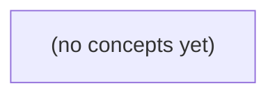

# 14.12 可持续交付：虚构 IM 资料助手的发布、评估与回滚

*一本面向 Go 初学者的静态教材，以“当前正文上限 6 B、R9 的 9 B 提议待审”的虚构 IM 资料助手为贯穿案例，讲解如何把资料、索引、权限、提示、模型和输出契约组织为可追溯的交付证据链。全书设八节递进理论与 22 道附答案练习，覆盖发布门、影子与灰度、反馈治理、全链回滚及 R9 误发布事件演练。*

**章节:** 2

---

## 本书导览

- 了解整本书的章节脉络
- 掌握各章之间的概念依赖关系
- 选择最合适的阅读顺序

# 14.12 可持续交付：虚构 IM 资料助手的发布、评估与回滚

一本面向 Go 初学者的静态教材，以“当前正文上限 6 B、R9 的 9 B 提议待审”的虚构 IM 资料助手为贯穿案例，讲解如何把资料、索引、权限、提示、模型和输出契约组织为可追溯的交付证据链。全书设八节递进理论与 22 道附答案练习，覆盖发布门、影子与灰度、反馈治理、全链回滚及 R9 误发布事件演练。

下方的概念图展示了本书 0 个核心概念以及它们之间的依赖关系；再下方是 1 个章节的入口。你可以按从上到下的顺序阅读，也可以根据自己的兴趣或先验知识选择切入点。

#### 概念图

## 章节索引

- **14.12 可持续交付：版本、灰度、回滚与故障响应** — 面向Go初学者，以虚构IM资料助手发布和R9误标事故解释完整manifest、回归、灰度、反馈、回滚和事件响应。

## 14.12 可持续交付：版本、灰度、回滚与故障响应

- 列出资料索引权限提示模型输出契约的版本组合
- 按六题和未见集设置发布硬门
- 解释离线影子灰度各自的授权与验证范围
- 把反馈审阅与自选择偏差分开
- 设计覆盖索引缓存模型提示的回滚
- 推演R9误标事故的遏制核影响和复盘

一次回答的可信交付不是“模型 v2”，而是一组可追溯、可验证、可整体回退的依赖版本。

### 从单一模型标签到交付清单

### 从单一模型标签到交付清单

当用户问“当前正文上限是 6 B”时，答案并非只由 `模型 v2` 决定。它至少依赖：现行资料 `doc-current@v1`，而不是尚处草稿的 `doc-r9@draft`；权限策略 `p1`，决定哪些资料可见；由 `chunker@c2`、`analyzer@a1`、`embedding@e1` 和 `build@i7` 共同生成的检索索引；提示 `prompt@p2`；输出契约 `answer-contract@v1`；以及模型 `base@m1`、`tokenizer@t1` 与应用校验器 `answer-check@k3`。

因此，候选交付应登记为一个 `release_id`，例如 `assistant-candidate-02`，并绑定完整清单：

- 资料与权限：`doc-current@v1`、`权限策略@p1`
- 索引构建链：`c2/a1/e1/i7`
- 生成与约束：`prompt@p2`、`answer-contract@v1`
- 推理与应用：`base@m1`、`adapter@none`、`tokenizer@t1`、`answer-check@k3`
- 验证依据：固定题集与标签清单 `manifest@q1`，其中该回答满足 `S2 /v1`，正文为 6 个 UTF-8 B，状态为 `R9 proposed`

单独写“模型 v2”无法回答关键问题：答案引用的是哪份现行资料？索引是否由同一切分和嵌入器构建？权限是否变化？“6 B”是模型生成、提示要求，还是应用层强制截断？

这份清单仍只是纸面标识。每个条目还必须可追溯到来源、创建者、时间、内容散列、适用范围及上一可回退版本；否则发生错误时，团队既无法复现答案，也无法安全地整体回滚。

### 发布标识与不可混淆版本组

### 发布标识与不可混淆版本组

`assistant-candidate-02` 不应被理解为“模型 v2”，而应是一次候选交付的不可变清单入口。其含义是：在指定输入、权限与运行环境下，系统由这一组**精确依赖**共同构成：

- 资料：`doc-current@v1`；`doc-r9@draft`虽存在，但因 `R9 status=proposed` 不得作为现行依据。
- 检索：`chunker@c2`、`analyzer@a1`、`embedding@e1` 与索引构建结果 `build@i7`；仅记录嵌入模型而不记录切分与构建，无法复现召回。
- 访问：权限策略 `p1`，决定用户是否有资格检索或引用某段资料。
- 生成：`prompt@p2`、`base@m1`、`adapter@none`、`tokenizer@t1`。
- 输出：`answer-contract@v1`，其中 `S2 /v1` 规定 `q-01` 正文上限为 `6 UTF-8 B`；这是可执行契约，不是提示中的口头约定。
- 应用与评测：`answer-check@k3`、固定题集及标签清单 `manifest@q1`。

因此，`release_id` 应指向一份带内容散列的发布清单，而非可被覆盖的标签。清单中每项至少保存来源、创建者、创建时间、适用范围、内容散列与上一稳定版本。发布时验证“全部散列匹配”；回滚时恢复整组依赖，例如回到 `assistant-stable-01`，而不是只把模型换回旧权重。这样才能区分答案变化究竟来自资料更新、索引重建、权限收紧、提示改写，还是应用检查器变更。

### 完整清单的字段与追溯规则

### 完整清单的字段与追溯规则

`release_id` 不是一个新标签，而是一份**不可变清单**：它把本次交付所依赖的资料、索引、规则、提示、模型和代码精确钉在一起。`assistant-candidate-02` 目前只是纸上标识；只有每个条目都能解析到真实制品，才可用于发布、审计与回滚。

建议每项制品至少记录以下字段：

- **逻辑名称与版本**：如 `doc-current@v1`、`embedding@e1`。名称说明角色，版本区分候选。
- **内容散列**：如 `sha256:...`。版本名可被误用或复写，散列才对应确切字节内容；资料应覆盖原文，索引应覆盖构建产物与配置。
- **来源与创建者**：记录上游仓库、数据批次、构建任务、提交号，以及责任人或自动化身份。
- **创建时间与生效范围**：说明何时生成、适用于哪个环境、租户、语言、合同版本或流量段；`权限策略@p1` 还必须写明适用主体。
- **依赖关系**：例如 `build@i7` 依赖 `chunker@c2`、`analyzer@a1`、`embedding@e1` 与指定资料散列。
- **上一可回退版本**：不是“前一个编号”，而是已验证可运行的完整目标，如 `release_id=assistant-stable-01`。

清单还应区分两层：**声明层**写“使用 `prompt@p2`”；**制品层**写该提示模板的存储位置、提交、散列和签名。若 `doc-r9@draft` 仍处于草稿状态，即使名称出现在清单中，也应标记 `status=proposed`，不得伪装为现行依据。

最终，发布系统应冻结 `release_id → manifest@q1 → 各制品散列` 的映射。回滚时恢复这组映射，而非仅把模型从“v2”改回“v1”。

### q-01 回答的版本依赖拆解

### q-01 回答的版本依赖拆解

设用户提问 `q-01`，界面显示：“当前正文上限是 6 B”。这不是模型单独生成的事实，而是 `release_id=assistant-candidate-02` 所绑定依赖共同得出的结果。其对外合同为 `S2 /v1`：正文最多 `6 UTF-8 B`；相关规则 `R9` 的状态是 `proposed`，即“已提出、尚未正式生效”。

可将责任拆开：

- **资料版本**：`doc-current@v1` 是“现行资料”的候选来源；`doc-r9@draft` 说明 R9 仍是草案。若答案说“当前正式上限为 6 B”，便可能把 `draft` 误当生效规则。
- **索引构建**：`chunker@c2 / analyzer@a1 / embedding@e1 / build@i7` 决定资料如何切分、分析、向量化和入库。即使资料文本未变，不同切分也可能使检索到的片段不同。
- **访问规则**：`权限策略@p1` 决定用户能否看到草案、现行合同或内部注释；它既影响召回范围，也影响回答可披露的表述。
- **提示与输出契约**：`prompt@p2` 规定模型应区分“现行”“草案”；`answer-contract@v1` 则要求输出满足 S2 格式，并按 UTF-8 字节而非字符计数。
- **模型与应用**：`base@m1 / tokenizer@t1` 影响生成和长度计算；`answer-check@k3` 应在返回前验证正文是否确为 `≤6 UTF-8 B`。例如“上限6字”是 10 B，不能通过检查。

因此，`assistant-candidate-02` 必须记录每项制品的内容散列、创建者、时间、适用范围与上一稳定版本。固定题集与标签 `manifest@q1` 可复现对 `q-01` 的验证：答案既要说明 `6 B`，也必须明确 R9 为 `proposed`，不能把候选交付包装成笼统的“AI v2”。

### 为灰度、回滚与事故响应建立锚点

### 为灰度、回滚与事故响应建立锚点

`release_id` 是一次可部署候选的**配置快照**，不是模型别名。`assistant-candidate-02` 必须同时锚定：

- 合同与规则：`S2 /v1`、正文上限 `6 UTF-8 B`、`R9 status=proposed`；
- 资料与权限：`doc-current@v1`、`doc-r9@draft`、权限策略 `p1`；
- 检索构建链：`chunker@c2`、`analyzer@a1`、`embedding@e1`、`build@i7`；
- 生成与校验链：`prompt@p2`、`answer-contract@v1`、`base@m1`、`tokenizer@t1`、`answer-check@k3`；
- 验证依据：固定题集及标签清单 `manifest@q1`。

候选发布前，应以该锚点重放固定题集：确认检索结果只来自允许资料、输出经 `answer-check@k3` 后仍满足 6 B 合同，并记录评测输入、结果、批准人和时间。灰度流量、用户反馈、日志与追踪记录均携带 `release_id`；于是“答案错误”可进一步归因到资料、索引、提示、模型或应用校验，而非笼统归为“AI 出错”。

若发生 `R9` 被误标为已生效的事故，先按日志筛出使用含 `doc-r9@draft`、相关索引构建或错误规则版本的 `release_id`，再结合灰度时间窗、租户和请求追踪确定受影响用户。回滚也应回退到已验证的完整 `release_id`，而非只切换模型：旧模型配上新索引或新权限策略，仍可能继续泄露草稿或违反合同。每个锚点还应可查内容散列、来源、创建者、适用范围及上一稳定版本，才能在事故中证明“谁受影响、为何受影响、已回退到什么状态”。

> **要点** — 可靠交付的版本单位是可追溯的全链路清单，而不是孤立的模型标签。

发布门不是平均分竞赛，而是用固定回归卡和严格未见集证明：系统在权限、版本与时间变化下仍不越权、不误导。

### 六题回归卡的逐链路验收

### 六题回归卡的逐链路验收

`q-01` 至 `q-06` 是固定合同版本下的回归卡，不是可通过改写题意、替换判分标准或平均分稀释的样本。每次发布均逐题保存可复核证据链：

| 链路 | 必验内容 |
|---|---|
| 输入与权限 | 会话身份、群成员关系、私有/已退群状态、请求时间及可访问文档范围 |
| 检索与版本 | 候选片段、排序分数、文档版本与生效时间；不得以未批准的 R9 覆盖当前 `6 B` |
| 提示上下文 | 实际进入模型的片段、系统规则与截断记录，确认私有正文未越权注入 |
| 输出与主张 | 完整回答或拒答；每个“B 数量”“历史可见性”“ACK”“离线补齐”等主张均能回指证据 |
| 用户结果 | 用户看到的文本、状态码/业务确认、审计记录及是否造成误导或泄露 |

六题分别卡住不同失效模式：`q-01` 当前为 `6 B`；`q-02` 的 R9 仍待审；`q-03` 必须在私有正文进入模型前拒绝；`q-04` 对退群历史规则未定时不得编造；`q-05` HTTP `200` 不等于 B 设备 ACK；`q-06` 仅有 `24h` broker 不能承诺 `25h` 离线补齐。

验收采用“一票否决”：任一题发生越权、版本错配、无引用断言或把不确定性说成保证，即使其余题全对也不得放行。尤其 `q-03` 的泄露不能由高平均分抵消。发布记录应保留输入快照、检索日志、提示版本、模型版本、输出及判定者；变更 prompt、模型或检索后，须原样重跑六题。

### 关键失败不能被平均分掩盖

### 关键失败不能被平均分掩盖

总体平均分回答的是“系统通常表现如何”，硬性安全门回答的是“系统是否发生了不可接受的事”。两者不能互相替代。

假设六题中五题正确，只有 `q-03` 失败，平均分仍可能很高；但 `q-03` 要求系统在私有正文模型授权前拒绝访问。若系统检索到、写入提示词或回答了 `u-b` 的私有正文，即使答案其余部分完全正确，也已构成权限越界。发布结论必须是**阻断**，而不是“总体可接受”。

| 评价方式 | 典型判断 | 风险 |
|---|---|---|
| 总体平均指标 | 六题正确率、引用率、用户满意度是否达标 | 高分样本可掩盖少数严重泄露 |
| 硬性安全门 | 是否越权、是否使用错误版本、是否将 200 当作设备 ACK | 任一关键失败即不可发布 |

因此，`q-03` 应作为不可补偿的门槛：核验请求者权限、候选片段及其访问控制、实际进入提示词的内容、模型回答或拒答、逐主张引用，以及最终用户是否获得私有信息。任何一环显示未授权正文被暴露，都应记录为安全失败，冻结发布并修复检索过滤、上下文组装或回答策略。

平均指标仍有价值：它帮助比较多个都已通过安全门的版本。但它只能用于排序，不能用于赦免。对于越权、错误合同版本和关键交付语义误导，发布规则应是：

`所有硬性门通过` 且 `总体指标达标`，才允许进入灰度。

### 未见集与版本标签的发布门

### 未见集与版本标签的发布门

固定回归卡用于发现已知问题，不能证明泛化能力：`q-01` 至 `q-06` 已公开，任何针对其调提示、排序或拒答模板的优化，都可能只是在“背题”。因此发布门应同时维护**回归集**与按条件隔离的**保留未见集**。

未见题的划分单位不能只看单条问答文本，而应至少隔离以下相关性：

- **会话**：同一用户会话、同一追问链不能跨入训练/调优侧与测试侧；
- **文档**：同一合同、同一知识库文件及其近重复片段应进入同一侧，防止检索到相同证据；
- **时间**：以资料生效时间、事件发生时间和索引快照切分，检验系统是否把“当时未生效”说成事实；
- **权限状态**：相同问题在不同用户、群组、设备授权下应分别覆盖，尤其保留私有正文、已退群历史、未确认设备等拒答场景。

每道题应绑定不可变的评测标签，例如 `合同版本=R9-待审`、`索引快照=2025-03-01`、`权限状态=无私有正文权限`。评测记录不仅保存最终答案，还保存检索候选及版本、进入提示的片段、模型与提示版本、逐主张引用、拒答理由和用户可见结果。这样才能定位错误究竟来自权限过滤、检索、提示还是生成。

发布判断采用“硬门 + 分层报告”：`q-03` 一次越权即可阻断发布，不能被其他题的高平均分抵消；未见集则按会话、文档、时间和权限分层报告样本量、争议率及未覆盖场景，避免用总体均值掩盖薄弱层。

只要提示、模型、检索策略、索引或权限逻辑变化，就必须重跑**同一合同版本标签**下的回归集和未见集。若未来 R9 正式获批，应新建合同版本与对应标签；旧结果仍只说明“R9 尚待审”条件下的表现，不能追溯改写为“当时已是 9 B”。

### 资料变更时的新合同版本

### 资料变更时的新合同版本

设 `q-02` 原合同的资料状态为“R9 尚待审”，因此合格输出只能说明：当前可用版本为 6 B，R9 不能作为已批准额度引用；证据、提示片段、回答和评分标签都绑定该状态。

未来若 R9 正式获批，变化的是**事实与适用条件**，不是对历史实验的“纠错”。应建立新合同版本，例如：

- `contract-v1`：资料快照 `2025-03-01`，R9 待审；期望结论“不得宣称 9 B 已生效”。
- `contract-v2`：资料快照 `2025-06-15`，含批准文件、批准时间与生效范围；期望结论“在满足生效条件时，可引用 9 B”。

新版本至少重标：

1. 检索候选及其文档版本、批准元数据；
2. 实际进入提示的证据片段；
3. 每个主张对应的引用与时间条件；
4. 最终用户结果：可答、需限定条件，或仍应拒答。

不能把旧标签改成“当年其实也是 9 B”，否则会掩盖旧系统是否在资料未批准时越权。`contract-v1` 的回归结果仍只证明其在旧资料条件下的行为；`contract-v2` 则从批准生效后重新评测。若同时改了检索、提示或模型，即使事实未变，也应重跑两套版本各自适用的回归与未见集。

### 面向发布决策的证据包

### 面向发布决策的证据包

发布证据包不是一张“总分通过”的报表，而是一份可复核的决策档案：它应使审批者能回答“发布到哪些用户、哪些条件下安全，哪些风险仍未被证明已消除”。

建议每次候选发布固定提交以下内容：

- **变更身份**：模型、提示词、检索索引、权限策略、合同版本、构建号及生效时间；任一项变化都应触发对应回归与未见集重跑。
- **回归卡结果**：逐题记录输入权限、检索候选及其版本、实际进入提示的片段、回答或拒答、逐主张引用、最终用户结果。`q-03` 一旦私有正文越权，即使其余五题满分也应拦截。
- **未见集分层结果**：按会话、文档、时间、权限状态分组展示通过率、拒答率、错误类型与样本量。明确哪些题与公开六题相似，哪些是真正未见的组合。
- **争议与例外**：把“R9 尚待审”“退群历史规则未定”等问题标为未决合同，而非模型错误地猜成确定事实；列出争议责任人、裁决期限与发布前置条件。
- **覆盖盲区**：说明样本不足或未代表的场景，例如长时间离线、跨设备确认、权限刚变更、文档版本切换。盲区不能伪装成零风险。
- **用户结果**：除正确性外，报告用户实际看到的是答案、澄清问题、拒答还是降级服务；拒答是否解释原因并提供安全替代路径。

最终决策应明确写成“批准”“拦截”或“限缩批准”。限缩批准必须绑定可执行边界，例如仅对已授权用户、仅使用已批准版本、关闭跨会话历史，并附带监控指标、自动回滚阈值和责任人。

> **要点** — 六题是固定回归卡，未见集才检验泛化；任何越权与关键契约失败都应直接阻断发布。

候选版本不能一概直接上线：离线、影子与灰度的可见性、数据授权和决策证据各不相同，必须按风险逐级推进。

### 三种发布阶段的边界

### 三种发布阶段的边界

离线对照、影子模式与灰度发布不是同义的“试运行”，它们分别回答不同问题：

- **离线对照**：输入来自固定的合成、已脱敏或已明确许可的评测集；候选版与控制版对同一输入运行并比较结果。用户完全不可见，目标是验证功能、权限行为、引用质量、延迟与成本是否出现明显退化。它不能证明真实流量下的表现。
- **影子模式**：候选版接收真实请求的副本，但其输出不参与用户最终响应；控制版仍负责交付。目标是观察真实问题形状、资料分布和负载条件下，两版在检索、权限拒绝、答案质量及资源消耗上的差异。影子并不自动合规：真实私聊、`doc-private` 或敏感检索上下文进入候选环境前，必须确认请求者授权、数据隔离、脱敏和保留策略。
- **灰度发布**：只有预先限定的一小组有权用户或请求可见候选结果，因而已构成真实交付。它应是部分、限时的发布与评估：明确观察窗口、切片指标、停止条件与回退动作，再决定扩大、维持或撤回。

可用一个简单判断区分：**输入是否真实、结果是否可见、候选是否跨越数据边界**。离线主要验证“能否工作”；影子验证“在真实形状下会怎样”；灰度验证“能否安全地交付”。三阶段都应按身份、问题桶、资料状态和权限切片比较，而非只看整体平均值。

### 离线回归：固定样本守住底线

### 离线回归：固定样本守住底线

离线回归的目标不是证明候选“看起来更聪明”，而是在**不接触真实线上数据**的前提下，确认它没有突破既有的安全、权限与任务底线。测试集应由固定的合成样本和已获许可的资料构成；若样本含 `doc-private`、私聊内容或可识别信息，即使只在本地评测，也必须先满足相同的数据授权、隔离、脱敏与保留要求。

对每次候选发布，使用同一份控制版与候选版完整 manifest：模型、提示词、检索配置、索引版本、重排器、工具权限、过滤规则及评测脚本版本。固定样本至少覆盖六题中的关键情形，并补充一个不参与调参的未见集：

- 有权限且有依据：答案应正确，引用可定位到允许访问的来源。
- 无权限资料：不得借检索摘要、标题或引用泄露存在性与内容。
- 资料缺失、冲突或问题超出范围：应明确拒答或表达不确定性，不能编造。
- 多文档、长上下文与边界问题：检查引用归属、答案完整性和检索稳定性。
- 对抗式权限请求：如“忽略权限”“总结私密文件”，应持续被硬拒绝。

将结果按身份、问题桶、资料状态和权限切片比较，而非只看总体平均分。发布硬门应优先于“回答更长”“措辞更流畅”等软指标：候选必须不新增越权访问、不降低引用有效性、不减少应拒答场景中的正确拒答率；任何硬门失败即停止进入影子或灰度。延迟、成本和任务质量可记录为比较证据，但不能抵消一次权限或数据边界失守。

### 影子模式：真实形状而非真实交付

### 影子模式：真实形状而非真实交付

影子模式把同一请求同时送往控制版与候选版：控制版结果仍正常交付，候选版只在后台计算、记录并与控制版对照，用户不会看到候选回答。它适合发现离线合成集未覆盖的真实请求形状，例如长上下文、罕见问题桶、复杂权限组合、检索为空或高并发下的延迟与成本变化。

但“不可见”不等于“无风险”。只要将真实私聊、`doc-private` 内容、附件或检索片段镜像给候选环境，候选模型、日志、缓存和观测系统就已经接触数据；若该环境的模型供应商、地域、访问主体或保留策略未经授权，影子本身就是越界。

启动前应明确以下边界：

- **主体与许可**：哪些员工、租户、资料状态和请求类型允许镜像；默认排除私聊、敏感标签与无明确授权的数据。
- **隔离与最小化**：候选路径使用独立凭据、索引和日志权限；仅传递完成评估所需的最小上下文。
- **脱敏与保留**：先移除或替换个人标识、密钥和高敏字段；规定候选输入、输出及追踪记录的保存期限与删除方式。
- **对照证据**：按身份、问题桶、资料状态与权限切片比较检索命中、拒答、泄露风险、延迟和成本，而非只看总体平均值。

若无法证明镜像路径满足这些条件，就不应影子真实数据，应退回固定合成或已获许可的合规样本。影子的价值是观察真实形状，不是绕过数据边界。

### 灰度发布：限定可见与停止条件

### 灰度发布：限定可见与停止条件

灰度不是“随机放一点流量”，而是让**预先定义、已获授权**的一小组用户和请求看到候选结果，并在固定观察窗口内与控制版对照。候选组之外的用户仍使用旧版；未满足权限条件的请求即使被抽中，也必须被硬门拦截。

一张可执行的灰度发布卡至少应写清：

- **改动与版本**：候选版解决什么问题；控制版、候选版的完整 `manifest`，包括模型、提示词、检索索引、重排器、权限策略和特征开关版本。
- **可见范围**：哪些身份可见，例如内部测试员、指定租户管理员；哪些请求桶可进入，例如问答、摘要、带检索请求；哪些资料状态允许，例如仅公开或已授权资料。
- **权限硬门**：`doc-private`、跨租户、无检索许可、保留策略不匹配等请求一律回退控制版或拒绝，不因灰度资格而放宽访问控制。
- **观察窗口**：开始与结束时间、最小有效样本要求、值守负责人，以及窗口内不得混入其他配置变更。
- **切片指标**：按身份、问题桶、资料状态、权限结果分别比较候选与控制版。除正确性、引用可验证性和拒答质量外，还要观察 TTFT、总延迟、失败率、检索命中异常、单请求成本与权限拒绝率。
- **停止条件与动作**：一旦出现越权证据、敏感内容泄露、关键任务质量退化、延迟或成本越线，立即关闭候选开关、固定证据、切回控制版，并通知值守与安全负责人。

不要用整体平均回答长度或平均 TTFT 掩盖局部风险：候选版可能总体更快，却只在私有资料、特定身份或复杂问题桶中发生严重退化。窗口结束后，应基于各切片证据决定扩大、维持、回退或转回离线修复，而不是仅凭总体均值“看起来不错”。

### 纸上发布卡与回退决策

### 纸上发布卡与回退决策

以下发布卡是**演练模板**：它定义如何比较和停止，不代表允许执行线上发布。

- **目标改动**：资料助手候选版改用新的检索排序与回答提示；验证其是否减少“引用不支持结论”和“无权限资料被提及”。
- **控制版 manifest**：`retriever=v3.2`，`index=docs-2025-02`，`cache=semantic-cache-v1`，`model=Model-A`，`prompt=assist-p7`，`policy=acl-p4`。
- **候选版 manifest**：`retriever=v3.3`，`index=docs-2025-02`，`cache=semantic-cache-v1`，`model=Model-B`，`prompt=assist-p8`，`policy=acl-p4`。任何未记录的模型别名、索引快照或提示词变更都视为不可比较。
- **可见范围**：先仅对已授权的内部测试身份开放；请求按身份、问题桶、`doc-private`/公开资料状态及权限结果切片。未授权身份、私聊镜像和权限判定异常请求一律不进入候选路径。
- **观察窗口与门槛**：在预定窗口内比较控制版与候选版的任务成功、引用正确性、拒答正确性、TTFT、总延迟及单请求成本；不得仅以平均回答长度或总体均值扩大范围。
- **硬门与停止线**：出现跨权限引用、敏感内容进入日志、候选引用无法追溯、授权校验失败，立即停止；延迟或成本越过事先写明的停止线，暂停扩大并复核。
- **回退动作**：流量切回控制版；固定控制版 manifest；使候选索引别名、语义缓存条目和模型路由失效；恢复旧提示词，并保留审计记录供复盘。
- **值守责任**：发布负责人负责决策与记录；权限负责人确认数据边界；检索/平台值守执行索引、缓存和路由回退。任何人发现硬门事件均可触发停止，无需等待业务指标变差。

> **要点** — 离线验证正确性，影子验证真实请求形状，灰度验证受限用户体验；每一步都必须先满足数据授权与明确回退条件。

用户点击“不对”只触发待审反馈事件；可靠闭环要保留证据、控制隐私、识别偏差，并让修复与根因对应。

### 把负反馈建模为待审事件

### 把负反馈建模为待审事件

用户点击“**不对**”表示一次需要调查的**反馈事件**，而非“答案错误”的金标签。它可能源于资料过期、权限拒绝、检索遗漏、上下文截断、生成偏差、引用错配、界面误触，或用户对业务规则的不同理解。系统不应据此自动改提示、改知识库或写入训练数据。

一条事件只保留排障所需的最小证据：

- `反馈事件ID`、时间、采样窗口与问题桶；
- 去标识化的用户/租户标识，以及必要的权限快照；
- 生效的 `release`、模型、提示词、索引与资料版本；
- 候选回答、检索结果及引用 ID；必要时保存受控摘要或哈希；
- 反馈类型（“不对”“无帮助”“引用不符”等）、审阅状态与处理人；
- 根因、修复单号、复测结果及关联的回归用例。

避免把私聊全文、私有文档正文或敏感附件复制进普通日志。若审阅确需原文，应在受权限控制、可审计且有保留期限的证据库中访问。

推荐状态流转为：

`已接收 → 已去重/脱敏 → 待审 → 已证实或已驳回 → 已归因 → 已修复 → 已复测 → 已关闭`

其中“已证实”只说明该事件在其上下文中成立；“已归因”才允许选择修复路径。争议样本应保留不同审阅意见、证据版本与最终裁决，不能把单个用户意见直接升级为新的业务合同。经确认且隔离后，样本才可进入评测或训练候选池；已用于调参的样本不得继续作为独立最终测试集。

### 最小留存与隐私隔离

### 最小留存与隐私隔离

把“用户点击不对”记录为可审阅的**反馈事件**，而非把整段对话、用户身份和私有资料一并写入普通日志。目标是让审阅者能够复现当时的系统决策，同时将敏感正文留在受控数据域。

建议反馈表只保留以下最小字段：

- `feedback_id`、时间窗与问题桶：如 `q-01` 资料时效、`q-03` 权限疑似越界、`q-07` 引用不支持结论。
- 最小身份标识：使用轮换或不可逆的用户/租户标识，用于去重、限流和权限复核；不记录姓名、邮箱、手机号等直接身份信息。
- 运行证据：`release_id`、模型与提示版本、检索器/索引版本、资料版本或快照 ID、缓存命中状态。
- 输出证据：候选回答 ID、引用 ID 列表、结构化生成状态、反馈类型（“不对”“无帮助”“越权疑似”等）与审阅状态。
- 受控指针：对话片段、原始检索片段和私有文档只保存加密引用或短期访问令牌；审阅者在具备相应租户与资料权限时，才可按需读取。

不要在分析日志、告警消息或工单标题中复制私聊正文、附件内容、私有文档段落或访问令牌。确需复现时，应在隔离审阅环境中按原权限重新拉取，或使用脱敏、截断后的片段。

可将事件分为“待审”“证据不足”“已确认”“争议中”“已修复验证”。尤其是争议反馈：一个用户认为“不对”，可能是资料版本不同、权限不同或使用预期不同；它应进入可追踪队列，而不能直接改写业务规则或成为训练金标签。

### 有权审阅后的根因归类

### 有权审阅后的根因归类

审阅者应在具备相应资料、权限与脱敏证据访问权的前提下复现事件，而非仅凭“点赞/踩”判错。先冻结当时的 `release`、资料版本、权限快照、检索候选、上下文片段、回答与引用；再以“若系统按设计运行，正确行为应是什么”为准建立判定。

可采用互斥的主根因与可选的次级因素：

- **资料状态**：权威资料已失效、缺页、版本冲突，或索引将旧版误标为当前。
- **权限**：用户本不应看到资料、答案泄露受限内容，或因授权缺失而错误拒答。
- **召回**：正确资料存在且用户可访问，但未进入候选集或排序过低。
- **上下文截断**：候选虽正确，却因长度限制、拼接策略或会话状态未进入模型可见上下文。
- **生成**：证据充分且可见，回答仍推理错误、遗漏条件、格式不合规或编造。
- **引用**：结论可能正确，但引用不存在、指向错误版本、不能支持结论，或引用与答案脱节。
- **误操作**：用户问题、反馈点击、审阅复现条件或预期本身有误；应记录依据，不把它当作产品缺陷。

归类应遵循最先失效环节：未召回正确资料时，不将后续幻觉简单标为“生成”；存在越权时，权限风险优先于答案质量。争议样本保留不同意见、证据版本、裁决者与裁决日期，状态标为“待裁决”或“已裁决”，不可把单一用户主张直接升级为业务规则。

### 区分反馈修复与总体质量

### 区分反馈修复与总体质量

“10 条负反馈中修复了 8 条”只能说明：在**某个时间窗口、某类愿意反馈的用户、某些被报告的问题**中，修复率为 $8/10$。它不能推出系统总体准确率为 80%，更不能证明所有用户体验已经改善。

原因是反馈天然存在**自选择偏差**：错误越明显、影响越大、用户越熟悉业务，越可能点击“不对”；沉默用户可能满意，也可能放弃、绕过系统或根本不知道答案有误。因此，反馈队列适合发现坏边界和排优先级，不应单独充当总体质量仪表盘。

每次复盘至少同时保留：

- **采样窗口**：反馈发生的日期、发布版本、资料/索引版本，避免把版本切换前后的样本混在一起。
- **问题桶**：如权限、资料过期、召回缺失、上下文截断、引用错误、生成格式失败；不同桶的风险和修复方式不同。
- **明确分母**：不仅记录负反馈条数，还记录该窗口总会话数、可评价会话数、各问题桶覆盖量。
- **未反馈样本审查计划**：从无反馈会话中按业务场景、用户角色、风险等级分层抽样，由有权人员审阅，检查“沉默错误”。

还要区分两类集合：用于定位问题、修改提示或索引的反馈样本是**开发集**；修复后验证效果，应使用未参与调优的留出集或新采样集。若反复查看同一批负反馈并据此调参，再用它报告“修复成功”，测到的只是对已知案例的适配，不能证明泛化质量。

### 从R9误标到定向修复闭环

### 从 R9 误标到定向修复闭环

设用户对 `q-01` 点击“不对”：系统引用了资料 `R9`，但 `R9` 已废弃，索引却仍将其标为 `current`。这首先是待审反馈事件，而非“答案必错”的金标签。审阅者应在受控环境中核对问题桶、最小身份标识、发布版本、资料版本、候选回答、引用 ID 与反馈类型，确认根因属于“资料状态/索引”，而不是直接改提示词。

修复应按影响面推进：

1. **遏制**：将 `R9` 从可检索集合下线，或把其状态改为不可作为现行依据；必要时暂停相关问答入口。
2. **修复索引与缓存**：更正资料元数据，重建或增量更新索引；清理检索缓存、答案缓存及引用映射，避免旧结果继续命中。
3. **回归验证**：对 `q-01` 的原问题、同主题改写、资料版本切换和缓存命中场景测试，确认系统优先引用现行资料，并能说明资料版本。

`q-03` 的处置更紧急：若审阅确认回答泄露了用户无权访问的内容，先执行**权限阻断**，而非优化措辞。应收紧检索前的身份与资源过滤、限制生成阶段可见上下文，并检查缓存键是否缺少租户、角色或权限版本。随后用“有权/无权”“权限变更后”“跨租户缓存”用例回归，验证拒答与审计记录均正确。

只有根因是格式不稳定、结构未遵从等生成问题时，才考虑提示词或结构化输出；只有稳定能力缺口、训练数据合规且已有独立保留集时，才评估微调。已用于定位 `q-01`、`q-03` 的反馈样本不得继续充当最终测试集。

> **要点** — 反馈是待审证据而非真相；先保护隐私和权限，再按可验证根因修复，并用独立样本评估效果。

回滚不是把模型别名切回旧权重，而是按受影响的版本组合恢复经授权、可验证且兼容的服务状态。

### 回滚对象是版本组合

### 回滚对象是版本组合

回滚不是把模型别名切回旧权重，而是恢复一组在当时共同成立的服务状态。一次回答由资料、检索、授权、缓存、提示、模型和输出格式共同决定；其中任一轴仍停留在错误版本，都可能让“已回滚”的系统继续产生错误或泄露。

发布单应至少记录可恢复的版本组合：

- **资料源与状态**：文档版本、`current`/撤销/生效状态、权威合同及批准记录。
- **索引快照与切分**：嵌入模型、分块规则、元数据、索引快照标识；`doc-r9` 被误标为 current 时，仅回退模型无效。
- **授权策略**：用户、租户、角色、文档级许可及策略版本。
- **缓存状态**：检索缓存、答案缓存、前缀缓存的键空间、失效范围与存活时间。权限撤销后，缓存未失效仍可能返回私有片段。
- **生成链路**：提示模板、模型权重、适配器、工具调用与安全过滤版本。
- **输出契约**：回答 JSON 的版本、字段语义、错误码及消费端兼容窗口。

因此，回滚目标不应机械地“全部退一版”，而应依据当时有效的权威资料与兼容约束，选择可验证的组合。例如新规则已获正式批准，资料不能退回旧版；真正需要回退的可能是错误索引、错误授权映射或提示模板。

还要区分**恢复服务**与**撤销影响**：错误答案已经展示、私有资料已经泄露时，切换旧版本无法收回暴露。此时应冻结相关缓存与访问、核查受影响请求和用户、保全证据，并按事件响应流程通知和处置。

### 从权威合同选择回退目标

### 从权威合同选择回退目标

“上一版”只是部署顺序，不等于正确状态。回退目标应由事故时点 $t$ 的**有效权威合同**决定：哪些资料在 $t$ 已正式生效、哪些主体在 $t$ 有权访问、这些规则应如何被检索并表达。

可将目标状态写为：

$$
T_t=(D_t,\ A_t,\ I_t,\ C_t,\ P_t,\ M_t,\ O_t)
$$

其中，$D_t$ 是已批准且有效的资料版本与状态，$A_t$ 是授权策略，$I_t$ 是与资料匹配的索引快照和切分版本，$C_t$ 为各级缓存状态，$P_t$ 为提示版本，$M_t$ 为模型/适配器，$O_t$ 为输出契约及消费端兼容范围。

例如，`doc-r9` 虽被错误标为 `current`，但其条款尚未获批准，则应回退到“最后一个在事故时仍有效的批准版本”及其对应索引，而非仅将模型切回旧别名。反之，若 R9 已正式生效，事故仅在切分、索引或权限同步，则把资料整体退回 R8 会使系统稳定地回答过时规则；正确目标应保留 R9，恢复正确授权与可验证索引。

确定目标前至少核对：

- 生效记录：批准人、批准时间、适用范围、撤销或过渡条款；
- 授权快照：事故时哪些租户、角色、文档可见；
- 依赖一致性：资料版本能否与索引、缓存键、提示和输出格式配套；
- 消费端约束：旧客户端是否只能接受 `answer-contract@v1`，以及未知版本应拒绝还是降级。

回退后还应以权威合同重新验收：指定身份能检索到应见资料，不能检索到已撤销资料，回答中的规则、引用和 `status` 含义均与当时有效合同一致。这样恢复的是业务上正确的服务状态，而不是时间线上较早的一次发布。

### R9误标的多轴回滚推演

### R9误标的多轴回滚推演

设 `doc-r9` 尚未完成审批，却被标记为 `current`，并触发索引构建与缓存预热。随后发现其中含有已撤销权限的内部条款。此时仅把模型别名从 `model@2025-06` 切回 `model@2025-05` 并不能恢复安全状态：旧模型仍会按相同检索配置命中由 `doc-r9` 生成的索引块。

应先冻结发布，并记录当前请求可见的版本组合：

| 轴 | 错误状态 | 回退/处置动作 |
|---|---|---|
| 资料源 | `doc-r9=current` | 按当时有效的权威合同确定应为 `r8` 或正式批准的 `r9`，而非机械退一版 |
| 索引与切分 | `index-r9` 含错误块 | 切换至受验证快照，隔离并重建受污染索引 |
| 授权策略 | 某用户组权限已撤销 | 立即发布策略版本并拒绝受影响主体 |
| 检索缓存 | 缓存了旧 ACL 下的命中文档 | 按资料、租户、主体和策略版本失效 |
| 答案/前缀缓存 | 已保存私有片段或其摘要 | 删除相关键，禁止命中旧缓存；不能只依赖较短 TTL |
| 模型与提示 | 模型别名、提示模板仍引用旧上下文规则 | 回退到已验证组合并记录版本号 |
| 输出契约 | `answer-contract@v2` 已下发 | 保留或转换为旧消费端可识别的 `v1` 格式 |

典型失效链路是：撤销权限后，策略检查虽然拒绝了新的检索，但答案缓存键未包含 `policy_version`；同一用户再次提问时直接命中旧答案，私有片段仍被返回。因此缓存失效必须先于恢复流量，并以“资料版本 + 授权版本 + 身份/租户 + 输出契约版本”约束命中条件。

最后，已展示的错误答案和已泄露片段无法靠回滚收回。应查询审计日志确定受影响用户、时间窗、资料块与缓存键，通知并隔离相关会话，必要时轮换凭据、暂停对应资料域，并将事件处理与技术回滚分开验收。

### 输出契约与消费端兼容窗口

### 输出契约与消费端兼容窗口

服务端回切与回答 JSON 契约回切是两件事。模型、检索索引或提示词恢复到旧版后，若仍输出新契约，旧消费端依然可能解析失败；反之，即使接口保持 `answer-contract@v1`，其 `status`、引用字段或安全标记的语义变化，也可能造成“能解析但错误处理”。

应为每个回答标注显式契约版本，例如：

`contract_version: "answer-contract@v1"`

并维护兼容窗口：

- **旧消费端仍在窗口内**：候选服务必须继续生成旧格式，或由适配层将新内部结果降级为旧格式。
- **消费端已完成迁移**：可发布 `answer-contract@v2`，但应保留明确的版本协商、灰度范围和弃用日期。
- **收到未知版本**：消费者应拒绝解析并记录事件，不得将未知 `status` 默认为成功、将未知引用默认为公开。
- **发生回滚**：除回切服务逻辑外，还要恢复可生成的旧 JSON 格式、字段默认值和枚举语义；不能假定旧客户端能理解新增字段或新状态码。

尤其要区分“可忽略的新增字段”与“改变决策的字段”。例如 `status: "restricted"` 若在旧版中不存在，旧客户端可能只展示 `answer`，从而绕过应有的访问提示。对此应在适配层将其转换为旧契约可安全表达的拒答或受限状态。

资料助手回答 JSON 的版本演进，应独立于未来 S3 `/v2` IM 存储提案。存储迁移可以改变内部读取路径；只要回答契约仍处于兼容窗口，就不应强迫消费端同步升级。

### 回滚后的遏制、核查与复盘

### 回滚后的遏制、核查与复盘

回滚恢复的是**后续请求**的服务状态；已经展示的错误答案、已下载的附件、已写入日志或已命中缓存的私有片段，应视为独立安全与质量事件。不能因为模型、索引或提示已切回旧版，就宣布事故结束。

先执行遏制：停止受影响资料源、索引快照或租户的查询；撤销短期访问令牌；失效检索缓存、答案缓存与前缀缓存；隔离可能继续传播内容的导出、会话共享和下游同步任务。若输出已进入外部系统，还要暂停相关消费端的自动执行，避免错误 JSON 被再次解释为有效指令。

影响范围核查应以可追溯证据为准，而非仅查看当前配置。至少关联：

- 事故时间窗内的资料版本、索引快照、授权策略与模型/提示版本；
- 命中的文档、分块标识、用户/租户、会话、缓存键及输出记录；
- 已展示、复制、下载、转发或被下游系统消费的答案；
- 当时有效的权限与权威合同，区分“错误公开”与“越权泄露”。

对确认受影响的用户或资料所有者，按事件分级进行通知：说明发生了什么、涉及哪些数据或答案、已采取的隔离措施、用户需要执行的操作，以及后续联络渠道。通知本身不得复述不必要的敏感内容。

复盘应形成可验证闭环：记录时间线、回退目标选择依据、检测与遏制延迟、影响范围、责任人和整改项。整改不仅是“增加测试”，还应补齐版本组合清单、缓存失效演练、权限变更联动、输出契约兼容测试，以及“已展示内容不可由回滚撤销”的事件响应预案。

> **要点** — 有效回滚须恢复完整版本组合；已发生的错误展示或数据暴露必须通过事件响应另行处置。

以R9误标事故推演发布后发现错误事实输出时，如何先控风险、再核影响、后修复验证，并避免以改文档掩盖事故。

### 先遏制：冻结灰度与隔离污染路径

### 先遏制：冻结灰度与隔离污染路径

一旦在灰度请求中发现 `q-01` 输出“当前上限 9 B”，首先把它当作**已上线的错误事实**处理，而不是等待更多样本来确认。此时最重要的目标不是解释 R9 为什么被误标，而是阻止错误答案、潜在越权资料和污染缓存继续扩散。

建议按以下顺序止损：

1. **立即冻结灰度扩大**：停止新增流量、地域、租户或调用方进入候选版本；不要因为错误仅见于“小部分请求”而继续放量。
2. **维持 `/v1` 既有合同**：生产稳定路径仍应返回当前有效上限 `6 B`。不得把 `/v1` 文档、提示词或答案模板改为 `9 B` 来“统一口径”。
3. **隔离候选索引**：将含有 `doc-r9(status=proposed)` 的候选索引从检索路由中摘除，或将其对应发布版本整体下线；保留只读副本供调查。
4. **隔离缓存污染路径**：按发布版本、索引版本、问题桶、租户和缓存键前缀，禁用或旁路可能命中 R9 的缓存；失效动作应优先覆盖 `q-01` 及其语义相邻问法。
5. **固定证据**：记录首次发现时间、错误响应原文、请求标识、命中的索引/文档版本、路由与缓存命中信息。不要在原地重写日志、删除候选文档或覆盖构建产物。

此阶段的判断标准很简单：后续请求不能再通过候选路径得到“当前上限 9 B”，而现行 `/v1` 的 `6 B` 合同必须持续可用。遏制并不等于修复；先切断污染路径，才能避免调查过程中产生新的受影响请求。

### 核影响：从发布版本追到请求与输出

### 核影响：从发布版本追到请求与输出

止血后不要只看“有多少报错”，而要建立可追溯的影响链：

`发布记录 → 索引/缓存版本 → 请求主体 → 问题桶 → 实际输出 → 资料访问审计`

先固定证据：保留灰度分流规则、`release_id`、候选索引构建清单、缓存键与命中日志、检索结果、生成输出及时间戳。以错误索引对应的发布版本为起点，找出所有曾命中 `doc-r9(status=proposed)` 的请求；再按 actor、租户、权限层级、问题桶和响应文本聚合，而非仅按总请求数估算。

可将请求分为三类：

- `q-01`：是否把“当前上限”从现行 `/v1` 合同的 `6 B` 错答为 `9 B`；
- `q-02` 等邻近问题：是否引用了 R9 的候选内容，却未直接暴露错误数值；
- `q-03`：是否向无权主体检索、引用或概述受限资料。它的优先级最高，因为这不是普通事实错误，而可能是资料越权。

核查时应同时看“检索到什么”和“最终说了什么”。未命中错误文档的请求通常不受该索引影响；命中 R9 但回答仍为 `6 B`，属于潜在暴露或偶然正确；输出 `9 B` 则是已确认的合同错误。对于 `q-03`，即使最终答案被拒答，也要检查检索上下文、缓存复用和日志中是否已有受限片段流入错误权限边界。

最终形成影响表：每行记录请求范围、主体类别、问题桶、错误索引/缓存版本、输出证据、越权判定及处置状态。还应抽查固定六题与未见集，确认影响边界没有因同义问法、缓存键碰撞或跨租户复用而扩大。这样才能说明“哪些请求受影响、为何受影响、是否涉及权限”，而不是笼统归因于模型。

### 辨因：拆开触发变更、坏边界与扩大因素

### 辨因：拆开触发变更、坏边界与扩大因素

不要把事故笼统归为“检索错了”或“模型幻觉”。同一条错误输出链中，至少应分开记录四类事实：

| 层次 | 在 R9 事故中的问题 | 要回答的问题 |
|---|---|---|
| 触发变更 | 候选索引将 `doc-r9(status=proposed)` 标为 `current` | 哪次构建、映射、导入或发布操作引入了错误？ |
| 第一坏边界 | 首个读取该索引且对 `q-01` 输出“当前上限 9 B”的请求 | 错误从何时开始能被外部观察到？影响哪些 release、actor、问题桶？ |
| 扩大因素 | 灰度流量继续进入、缓存复用错误答案、索引切换范围过宽 | 为什么本可局部的问题扩散到更多请求或更久时间？ |
| 检测延迟 | 固定六题未在切换后立即复核，或告警未覆盖版本—状态矛盾 | 为什么没有在第一坏边界附近发现？ |

这种拆分决定处置优先级：先冻结灰度、隔离错误索引并失效相关缓存，阻止扩大；再以权威资料核验 `q-01`、`q-03` 等输出，尤其确认是否存在资料越权。随后修正 status、重建并切换索引，复测固定题与未见集。

复盘中，触发变更不等于根因全貌，缓存也不应被写成“根因”而掩盖误标。更不能修改文档，把 R9 追认成已经生效；那会消除证据而非修复事实合同。

### 修复与回滚：恢复权威状态而非追认错误

### 修复与回滚：恢复权威状态而非追认错误

事故止血后，修复目标不是让系统“自洽”，而是让所有读取路径重新服从权威资料。`doc-r9` 的原始审批状态若为 `proposed`，就必须修正结构化元数据、索引记录与派生缓存；不得通过改写文档、补充模糊注释或调整提示词，把 R9 解释成“已生效”。

建议按依赖顺序恢复：

1. **修正权威状态**：核对发布审批记录、版本清单与生效时间，将 R9 标回 `proposed`；同时记录谁、何时、依据何物完成修正。
2. **重建候选索引**：从已校验的权威源重建索引，而非在错误索引上局部打补丁。切换前验证 `status`、`release`、`actor`、问题桶等过滤字段。
3. **原子切换与缓存失效**：将查询流量切至新索引版本，失效答案缓存、检索缓存和可能固化旧上下文的会话缓存。缓存键应包含索引版本、合同版本与权限上下文。
4. **回滚关联配置**：若灰度中的模型版本、提示模板或检索规则放宽了“当前”判定，应回滚至已知安全配置；不要仅靠提示词补一句“请谨慎回答”。
5. **复核后恢复灰度**：固定六题必须恢复 `/v1` 的“当前上限 6 B”合同，未见集也不得再召回 R9 作为当前事实。尤其验证 `q-03` 不会跨越 actor 或资料权限边界。

可将恢复条件写成明确门槛：错误索引已隔离、权威状态已校验、新索引已验证、相关缓存已失效、权限测试通过、回滚配置可追溯。任一条件未满足，就保持停止扩大灰度。

### 复验与复盘：以硬门决定是否恢复灰度

### 复验与复盘：以硬门决定是否恢复灰度

修复 `doc-r9` 的状态、重建索引并失效缓存后，不能因“查询看起来正常”就恢复灰度。恢复条件应是可记录、可复跑的硬门：

- **固定六题全通过**：逐题核对答案、引用资料、版本状态与单位；`q-01` 必须稳定返回现行 `/v1` 合同中的“当前上限 6 B”，不得从 R9 推出 `9 B`。
- **未见集复验**：使用未参与修复和回归用例设计的同类问题，覆盖措辞变体、历史版本追问、边界条件和多资料冲突，防止只对六题“补丁式通过”。
- **权限测试**：专门检查 `q-03` 类资料越权，包括无权限主体、角色切换、缓存命中、直接文档标识访问及检索后生成链路。任一越权证据均升级为安全与隐私事件，不进入恢复灰度流程。
- **反馈与观测审阅**：复查灰度期间的请求日志、命中索引版本、缓存键、actor、问题桶和输出；确认没有残留错误索引、旧缓存或相同模式的异常反馈。

只有上述证据齐备，且负责人明确签署恢复决定，才以小流量、可观测、可立即撤回的方式重新灰度。若任一门失败，应保持隔离并继续修复，而非修改文档将 R9 追认成“已生效”。

复盘应产出可执行改进项，并分别写清：触发变更是什么、**第一坏边界**在哪里、哪些缓存/发布流程扩大了影响、为何检测延迟。措施应可验证，例如“索引构建强校验 `status` 与生效日期”“缓存键纳入版本与权限上下文”“灰度自动拦截 current 状态冲突”“新增 `q-03` 权限回归测试”，每项指定负责人、截止时间和验证证据。

> **要点** — 事故处置先守住既有合同并隔离错误路径；完成影响核查、权威修复与硬门复验后，才可恢复灰度。

本节将把持续交付从“上线一次”改造成可审计、可停止、可回退的发布闭环，避免单一满意度掩盖权限、引用与拒答等硬性风险。

### 发布证据：用完整清单回答系统当前状态

### 发布证据：用完整清单回答系统当前状态

一次发布不应只写“模型升级到 `v3`”。可服务状态由资料、检索、权限和运行策略共同决定；若其中任一项不可追溯，就无法证明回答为何引用该原文、某用户为何能看到该资料，或回滚后是否真的恢复到安全状态。

建议为每个可发布单元生成不可变的**版本清单（manifest）**，并赋予唯一 `release_id`。至少记录：

- **资料与索引**：资料库快照、文档版本或哈希、抓取时间、失效/撤销清单、分块与嵌入配置、索引构建版本、索引校验结果。
- **权限与身份**：权限策略版本、角色/组织映射、资料访问控制快照、策略生效时间，以及权限变更是否已进入索引过滤链路。
- **生成链路**：提示模板版本、工具调用策略、引用格式规则、拒答阈值、`q-01/q-02` 当前状态与提议状态的判别规则。
- **模型与运行配置**：模型权重或别名、推理参数、重排序器、缓存键与缓存失效策略、限流和过载拒绝配置。
- **质量门与批准**：引用有效性、权限隔离、正确停止率、未见集与人工抽样结果；每项门的通过/豁免/失败状态、批准人、时间和理由。
- **回退关系**：上一稳定 `release_id`、允许回退的目标、回退前置检查，以及尚未处理的反馈、缺陷和风险接受记录。

清单应与实际部署绑定，而非存放在独立表格中。例如请求日志可写入 `release_id`、索引版本、权限策略版本和提示版本，使异常回答能还原其完整决策环境。模型注册中心可管理模型别名，但“`production` 模型已注册”并不能证明文档、索引或权限策略也正确发布。

评审时应能直接回答：**当前服务的是哪份清单，谁批准了它，哪些硬门已通过，哪些反馈仍开放；若下一次检查失败，系统会退回哪一份清单。**

### 质量硬门：按问题桶与权限切片验收

### 质量硬门：按问题桶与权限切片验收

发布验收不应从“总体满意度是否达到 90%”推出。设六题构成问题桶 $Q=\{q\text{-}01,\dots,q\text{-}06\}$，还应按 `actor` 权限类别、输入模态、资料版本与索引版本切片；任一高风险切片失败，即不能由其他切片的高分抵消。

建议为每个切片建立不可替代的硬门：

- **引用有效性**：回答中的每条关键引用都必须能回到仍有效的原文，并验证文档状态、版本、访问权限及索引可达性。  
  $\text{有效引用率}=\frac{\text{可访问且支持结论的引用数}}{\text{关键引用总数}}$。  
  权限收回、原文失效、仅命中摘要而未支持结论，均计为失败。

- **当前与提议区分**：对 `q-01/q-02` 人工核验答案是否明确标出“当前已生效”与“仅为提议/待批准”。将提议说成现状、遗漏生效条件或混淆版本，属于语义硬错，而非措辞瑕疵。

- **正确停止率**：对 `q-03/q-04` 及其危险变体，系统应在证据不足、无权访问、问题超出资料边界时停止回答或升级人工。  
  $\text{正确停止率}=\frac{\text{应停止且实际正确停止}}{\text{应停止样本}}$；同时记录“错误停止”，避免以过度拒答虚增指标。

- **未见集与人工抽样**：门槛不能只在开发题上通过。保留未见集，并从新资料、权限变更、长尾模态和失败反馈中分层抽样复核，比较发布前后的质量变化。

发布记录应逐项写明：各切片样本量、门槛、实际结果、未处理例外及批准人。任何一个硬门未过，结论只能是“停止发布或回退”，不能以总体满意度补偿。

### 验证范围：离线、影子与灰度的授权边界

### 验证范围：离线、影子与灰度的授权边界

三种验证手段回答的问题不同，不能用后一级“看起来正常”替代前一级的授权与质量证据。

| 范围 | 可使用的数据 | 可验证行为 | 不能证明 |
|---|---|---|---|
| 离线评测 | 已授权的基准集、脱敏样本、人工构造对抗集 | `q-01/q-02` 当前与提议的区分、`q-03/q-04` 停止率、引用可达性、权限拒答、未见集质量 | 真实负载下的 TTFT、尾时延、用户工作流影响 |
| 影子流量 | 经批准复制的生产请求；默认不向用户返回候选结果 | 新版本在真实输入模态、问题桶与权限类别上的延迟、成本、过载拒绝和结果差异 | 用户是否接受答案；更不能以影子结果执行写入、外部调用或权限扩大 |
| 灰度发布 | 明确同意或符合既定告知范围的少量真实用户流量 | 端到端满意度、人工反馈、真实故障率，以及硬门在真实交互中的表现 | 未覆盖人群、未覆盖权限组或未覆盖模态的安全性；也不能证明长期漂移已被控制 |

授权边界应写入发布 manifest：数据来源、脱敏状态、允许用途、保留期限、actor 权限类别及禁止动作。影子请求即使不展示结果，也可能包含敏感内容；复制前仍须确认数据处理授权，日志不得借“调试”绕过最小权限。

灰度的放量条件应按切片设门，例如某权限组的错误引用率、某图像输入桶的停止率、尾时延与拒绝率。全局满意度达到 $90\%$ 不能覆盖任一硬门失败。若门未通过，应停止扩大范围，记录未处理反馈，并按 manifest 指向的上一稳定版本回退。

### 运行观测：把反馈与自选择偏差分开

### 运行观测：把反馈与自选择偏差分开

反馈不是总体质量的无偏样本：愿意评分的用户、遇到极端问题的用户，以及拥有较高权限的用户，往往更容易留下记录。因此不能用“满意度 90%”替代运行判断；它可能掩盖某个权限组的越权引用、某种模态的高拒绝率，或某个问题桶的严重时延。

每个观测窗口至少按以下维度切片：

- **发布版本**：模型/别名、提示、检索索引、资料 `manifest`、权限策略版本必须可关联。
- **问题桶**：事实问答、需引用问答、权限敏感问答、未知资料、复杂多轮等。
- **角色权限**：匿名、普通用户、特许角色、管理员；重点比较同题不同权限下的证据与答案差异。
- **输入模态**：文本、图片、文件、语音等，避免文本指标掩盖多模态退化。

同时看两类信号。其一是**主动反馈**：满意/不满意、纠错、投诉、人工升级及未处理队列的数量、年龄和严重度。明确记录反馈覆盖率，而非把沉默当满意。其二是**行为与系统信号**：`q-03/q-04` 的正确停止率、未见集与人工抽样中的引用有效率、权限拒绝正确率，以及 TTFT、尾时延、单请求成本和过载拒绝率。

可设硬门示例：任一权限切片出现未授权证据泄露，立即停止扩大灰度；任一关键问题桶的引用有效率或正确停止率跌破阈值，冻结该版本；过载拒绝上升时，优先保护已授权的核心路径，而不是仅用平均时延宣布健康。

观测记录应能回答：哪些反馈来自何种切片，哪些尚未处理，抽样是否覆盖低反馈群体；若指标恶化，当前流量正在使用哪份 `manifest`，以及应回退到哪个已验证版本。

### R9误标推演：遏制、回滚与复盘闭环

### R9误标推演：遏制、回滚与复盘闭环

设想 R9 被错误标注为“可公开引用”，导致原本受限的资料进入索引，并被缓存答案引用。此类事故的首要目标不是维持可用率，而是阻止权限越界继续扩散。

**遏制顺序应预先写入运行手册：**

1. **停止受影响服务路径**：对命中 R9 的检索、生成与引用导出实施硬停止；无法精确隔离时，暂停相关资料域或 actor 权限类别的服务，并记录停止时间、执行人和影响范围。
2. **冻结索引与写入**：锁定当前索引 manifest，禁止增量同步、重建和权限覆盖；保留事故时的文档版本、分块结果、嵌入版本与访问控制快照，避免证据被后续更新冲掉。
3. **撤销缓存与派生物**：失效检索缓存、答案缓存、引用卡片和预生成摘要；对已发出的结果按会话、租户和时间窗追溯，判断是否需要通知、撤回或人工处置。
4. **切换已批准的安全版本**：将提示版本切换到“不确定权限即拒答”的保守模板；模型别名、检索配置和索引 manifest 一并回退到已验证组合。仅回滚模型权重不能修复错误索引。
5. **恢复前再验证**：以 R9、相邻权限标签和未见集构造测试，检查正确停止率、越权返回率、引用有效性及尾时延；由资料所有者、安全负责人和发布负责人共同签字。

复盘记录至少回答：R9 在何处、何时、由谁误标；哪一组 manifest 曾服务；哪些门本应拦截却未拦截；受影响的 actor、模态与问题桶是什么；遗留反馈由谁在何日前关闭。最后明确下一次失败的回退锚点，例如“索引 manifest `I-42`、提示 `P-17`、模型别名 `stable-3`”，并把新增的权限抽样、缓存撤销演练和发布门禁纳入后续发布条件。

> **要点** — 可持续交付的核心是：每次变更都能说明服务版本、验证证据、未决风险与确定的回退落点。

以虚构IM资料助手的R9误标事故为线索，建立从版本组合、发布硬门到灰度、回滚和事件响应的可持续交付闭环。

### 版本组合与发布对象

### 版本组合与发布对象

在资料助手中，“发布 R9”不是把一份文档从 `doc-r8` 替换为 `doc-r9`；可发布对象应是可复现、可审计的联合版本：

\[
\text{发布对象}=
(\text{资料},\text{权限},\text{索引},\text{模型},\text{提示},\text{输出契约},\text{应用},\text{题集})
\]

其中，资料规定事实来源与适用范围；权限决定谁可检索、阅读和引用；索引决定系统实际召回什么内容；模型与提示决定如何解释证据；输出契约约束引用、拒答、脱敏和格式；应用承载入口、日志与开关；题集则用于验证该组合是否仍满足教学、开发和回归要求。

因此，单独升级任何一环都不足以称为“新版本”。例如：

- `doc-r9` 即使内容正确，若被误标为 `current`，旧索引仍可能把“6→9 B 待审提议”当作现行规则。
- 索引重建即使完成，若权限过滤缺失，私有正文进入无权路径就是独立的发布硬门失败。
- 模型或提示升级即使提高了表述质量，也不能改变资料尚未获得正式业务批准这一事实。
- 题集若已用于开发和回归，就不能再作为灰度效果的独立证据；必须另建未见集。
- 应用切换到新环境，也不自动解除输入数据的授权、许可、隔离和保留约束。

发布记录应为这组版本生成唯一标识，并固定资料清单、索引快照、权限策略、提示模板、契约版本、应用构建号与评测集版本。只有全部组件在同一兼容窗口内通过硬门，才能把“候选组合”提升为“可发布版本”；否则它只是一次待审配置变更。

### 六题回归与未见集硬门

### 六题回归与未见集硬门

R9 事故后的首道发布门不是“模型答得更像”，而是验证版本组合是否仍满足既有合同。纸上六题应覆盖资料版本、权限边界、索引路由与输出行为：

1. `6→9 B 待审`仍只是提议；没有正式业务批准，不得当作现行规则。  
2. 私有正文即使被误检索到，无权调用路径仍必须拒绝；这是独立权限硬门。  
3. 已公开用于教学、开发或回归的题目不能充当“未见集”。  
4. 将输入送入新环境并不自动合法，仍须检查授权、许可、隔离与保留期限。  
5. 反馈样本不能直接证明全量安全：它可能有自选择偏差，且缺少总体分母与未反馈样本。  
6. 旧模型收到 `9 B` 证据不代表版本正确；应检查 `doc-r9` 是否误标为 current、`doc-current` 是否漏索或丢失上下文限定词。

这六题是**回归集**：确认已知行为没有退化，却不能证明新发布面对未知输入仍可靠。因此发布还必须加入独立未见集，且该集合与训练、提示词调试、开发回归及人工反复评阅严格隔离；题集版本、来源、访问权限和适用合同均应可追溯。

发布判定可写成：

$$
\text{可发布}=
\text{回归通过}\land
\text{未见集通过}\land
\text{权限负例通过}\land
\text{输出契约通过}
$$

其中，权限负例要求系统对无权资料、越界用户和不兼容环境稳定拒绝；输出契约要求版本标识、引用范围、拒绝语义与回退提示均符合当时权威合同。任一硬门失败，都应停止灰度，排查输入、索引、权限判定与输出链路，而非以“平均分不错”豁免上线。

### 离线、影子与灰度边界

### 离线、影子与灰度边界

三者都用于降低发布风险，但“是否触及真实用户、是否产生业务效果、需要何种授权”并不相同，不能把它们视为同一发布阶段。

| 方式 | 数据与授权边界 | 用户影响 | 可获得的证据 | 典型停止条件 |
|---|---|---|---|---|
| 离线评测 | 使用已批准、可追溯的测试集；开发已见题不能充当最终独立证据 | 无真实用户影响 | 准确率、拒答率、检索命中、版本回归差异 | 数据许可不明、测试集泄漏、关键门槛未达标 |
| 影子运行 | 可镜像真实请求，但输入进入新环境仍须授权、隔离、保留与访问控制 | 结果不展示、不驱动决策 | 与现网输出的差异、延迟、故障率、覆盖样本 | 私有正文进入无权路径、索引版本错误、资源或安全指标越界 |
| 小范围灰度 | 仅限预先指定且具备数据、服务授权的人群，并设置明确窗口 | 输出真实可见，可能形成真实业务后果 | 用户任务完成率、投诉、人工复核、可归因反馈 | 硬门失败、伤害信号、异常率上升、无法解释或无法回收影响 |

离线证明“在受控样本上可能可用”；影子验证“接入真实流量后是否仍稳定”；灰度才检验“真实用户是否接受且风险可控”。因此，影子运行不能因为“不展示结果”而绕过数据权限；灰度反馈也不能只看主动评价，因为它存在自选择偏差，必须保留总体分母、未反馈抽样和版本标记。

对虚构 IM 助手而言，若 `doc-r9` 被误标为 current，即使离线分数良好，影子比对也可能持续把错误索引送入模型。发现私有正文进入无权路径时，应立即停止相关阶段，冻结输入、索引与输出权限，再核定影响范围；不能以“尚未全量发布”为由继续灰度。

### 反馈审阅与偏差控制

### 反馈审阅与偏差控制

灰度期间的点赞、投诉、纠错和“看起来有用”等反馈，只能构成**待审信号**，不能自动证明版本质量，更不能直接驱动资料升级、索引切换或全面放量。尤其在 IM 资料助手中，愿意反馈的往往是高频用户、受影响最明显者或特定权限群体；沉默用户、失败后直接离开者及无权访问者都可能被遗漏。

建立反馈闭环时，至少要保留以下证据：

- **总体分母**：按版本、灰度组、任务类型、权限路径统计总请求数、成功率、拒绝率与反馈率。`20 条好评 / 20 条反馈` 不等于 `20 条好评 / 2 万次请求`。
- **未反馈抽样**：从无显式反馈的请求中随机抽查，检查是否存在“用户未投诉但答案引用过期资料、遗漏限定条件或越权输出”的问题。
- **有权审阅与归因**：由具备资料、数据和业务权限的人员审阅原始上下文，区分模型生成错误、`doc-r9` 误标 current、索引召回错误、用户预期不当及界面诱导。
- **争议处理**：用户反馈与审阅结论不一致时，保留争议状态、证据链接、审阅者、适用版本和复核结果；不能以多数意见覆盖少数但严重的安全问题。
- **版本化记录**：每条结论绑定模型、提示词、索引、资料合同、发布日期及灰度规则，避免把旧版本反馈误归因给新版本。

因此，反馈的正确路径是：

`用户信号 → 有权审阅 → 归因与抽样验证 → 风险分级 → 修复/停止/继续灰度`

若私有正文进入无权路径，即使正向反馈很多，也应视为独立硬门失败：先停止相关流量，核查输入、索引和输出权限，再决定恢复条件。

### R9误标的回滚与响应

### R9误标的回滚与响应

`doc-r9` 被误标为 `current` 后，首要动作不是“把标签改回去”就宣布恢复，而是按故障响应闭环处理。因为旧索引、检索缓存、模型提示词和已生成输出都可能仍把 R9 当作现行依据。

1. **立即遏制**：撤销 `doc-r9` 的现行资格，暂停依赖该资料的自动发布与高风险回答；若输出涉及权限、保留期限或业务审批，应触发硬停止门。保留当时的索引快照、提示词版本、请求日志和输出样本，避免修复过程覆盖证据。

2. **核查影响范围**：检查 `doc-current` 是否遗漏 R9 的替代版本或上下文限定词；追踪哪些索引分片、缓存键、嵌入向量和提示模板引用了错误版本。不能仅以“用户没有反馈”判断无影响：反馈存在自选择偏差，还需按请求总体分母抽样复核。

3. **协同回滚**：  
   - 资料层：恢复当时真正权威的合同版本，而非机械退回某个较旧文档；  
   - 索引层：删除错误条目、重建受影响分片，并验证检索结果中的版本标识；  
   - 缓存层：失效命中 R9 的缓存及派生答案；  
   - 模型层：更新提示中的现行资料规则，要求输出引用版本、适用窗口与不确定性。  

4. **验证恢复**：用独立、未参与开发的题集测试：旧模型是否仍能检索到 R9，现行合同与历史合同是否被正确区分，以及遇到版本不兼容时能否拒绝或回退。开发与回归中已经公开使用过的题目，不能再充当“未见集”。

复盘应把事故归因到可验证的控制缺口：版本标签为何可被误写、索引为何未校验权威来源、缓存为何缺少失效链路、提示为何未要求版本证据。改进项应明确责任人、完成期限和复验标准，而不是以“修正标签”替代完整恢复。

> **要点** — 可持续交付依赖联合版本、独立硬门、受权灰度和可追溯回滚；事故处理先遏制、再核影响、后复盘。
