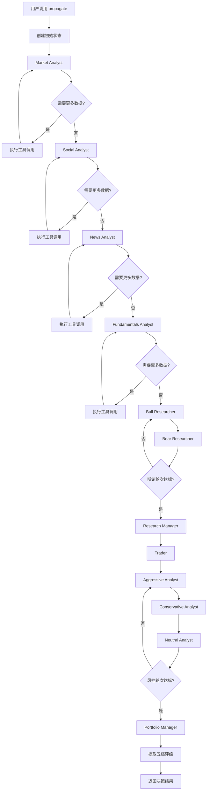

# 端到端交易决策工作流：从数据到决策的完整链路

前两篇文章分别介绍了架构设计和 Agent 角色。本文将追踪一次完整的交易决策——从用户输入 `ta.propagate("NVDA", "2024-05-10")` 到最终输出五档评级。

## 整体执行流



## 第一阶段：状态初始化

一切从 `propagate()` 方法开始：

```python
# tradingagents/graph/trading_graph.py
def propagate(
    self,
    company_name: str,
    trade_date: str,
    past_context: str = "",
    callbacks: Optional[List] = None,
) -> Tuple[Dict[str, Any], str]:
    """运行完整的交易决策流程"""
    # Phase A: 创建初始状态
    init_state = self.propagator.create_initial_state(
        company_name, trade_date, past_context
    )
    self.ticker = company_name
    self.curr_state = init_state

    # 检查是否有 checkpoint 可以恢复
    saved_state = checkpoint_step(self.graph, company_name, trade_date)

    # Phase B: 执行图
    events = self.graph.stream(
        saved_state or init_state,
        **self.propagator.get_graph_args(callbacks)
    )
    for event in events:
        self._process_event(event)

    # Phase C: 后处理
    final_decision = self._extract_final_decision(self.curr_state)
    return self.curr_state, final_decision
```

初始状态包含以下关键字段：

```python
# tradingagents/graph/propagation.py
def create_initial_state(self, company_name, trade_date, past_context=""):
    return {
        "messages": [("human", company_name)],
        "company_of_interest": company_name,
        "trade_date": str(trade_date),
        "past_context": past_context,       # ← 历史反思内容注入
        "investment_debate_state": InvestDebateState(...),
        "risk_debate_state": RiskDebateState(...),
        "market_report": "",
        "fundamentals_report": "",
        "sentiment_report": "",
        "news_report": "",
    }
```

## 第二阶段：多维数据采集

四个分析师按序执行，每个都在各自的工具调用循环中。

### 工具调用循环（Tool Calling Loop）

这是 LangGraph Agent 的标准模式：

```python
# tradingagents/graph/conditional_logic.py
def should_continue_market(self, state: AgentState):
    last_message = state["messages"][-1]
    if last_message.tool_calls:
        return "tools_market"   # 还有工具调用待执行
    return "Msg Clear Market"   # 分析完成
```

实际执行过程：

```
Step 1: Market Analyst 被调用
  → LLM 决定需要查询 NVDA 的价格数据
  → 返回 tool_calls: [get_stock_data("NVDA", ...)]

Step 2: 路由到 tools_market
  → 执行 get_stock_data，获取价格序列
  → ToolMessage 返回原始数据

Step 3: 路由回 Market Analyst
  → LLM 分析数据，可能需要更多指标
  → 返回 tool_calls: [get_indicators("NVDA", ...)]

Step 4: 路由到 tools_market
  → 执行 get_indicators，计算 RSI、MACD 等

Step 5: 路由回 Market Analyst
  → LLM 综合数据，生成市场分析报告
  → 返回纯文本（无 tool_calls）

Step 6: 路由到 Msg Clear Market
  → 提取分析结论，存入 state["market_report"]
  → 进入下一个分析师
```

### 工具函数的实现

所有工具函数都经过 `@tool` 装饰器封装，供 LangGraph 的 ToolNode 使用：

```python
# tradingagents/agents/utils/agent_utils.py
from langchain_core.tools import tool

@tool
def get_stock_data(
    ticker: str,
    start_date: str,
    end_date: str,
) -> str:
    """获取股票历史价格和成交量数据"""
    vendor = get_vendor("core_stock_apis")  # 根据配置选择数据源
    if vendor == "yfinance":
        return _get_stock_data_yfinance(ticker, start_date, end_date)
    elif vendor == "alpha_vantage":
        return _get_stock_data_alpha_vantage(ticker, start_date, end_date)

@tool
def get_indicators(
    ticker: str,
    start_date: str,
    end_date: str,
) -> str:
    """计算技术指标：RSI、MACD、布林带、均线等"""
    vendor = get_vendor("technical_indicators")
    # stockstats 库用于技术指标计算
    ...
```

### 消息清理（Msg Clear）

每个分析师完成后都有一个 `create_msg_delete()` 节点：

```python
# tradingagents/agents/utils/agent_utils.py
def create_msg_delete():
    """清理消息历史，只保留分析结果"""
    def msg_delete(state: AgentState):
        # 提取当前分析师产生的最后一条纯文本消息
        last_human_msg = ...  # 提取逻辑
        # 将分析结果写入对应报告字段
        state[f"{analyst_type}_report"] = last_human_msg
        # 清空消息列表（为下一个分析师腾出空间）
        return {"messages": []}
    return msg_delete
```

这个设计解决了一个实际问题：如果不清理消息，四个分析师的工具调用结果会累积在 `messages` 中，导致上下文窗口被无意义的数据行填满。

## 第三阶段：多空辩论与裁决

分析师报告完成后，进入研究院辩论阶段。

### 辩论数据流

```
Bull Researcher ← 所有分析师报告 + past_context
    ↓ (看多论据)
Bear Researcher ← Bull 的观点 + 所有分析师报告
    ↓ (看空论据 + 对 Bull 的质疑)
Bull Researcher ← Bear 的观点 + 自己的历史发言
    ↓ (反驳 Bear + 强化看多论据)
Bear Researcher ← Bull 的新观点
    ↓ (回应 + 提出新风险)
    ... (循环)
Research Manager ← 完整辩论记录
    ↓
结构化研报输出
```

### 研究经理的输入上下文

研究经理能看到：
1. **所有分析师报告**：四个维度的原始分析
2. **完整辩论记录**：Bull 和 Bear 的所有发言
3. **历史反思**：`past_context` 中关于此股票的历史交易教训

```python
# 研究经理的 system prompt 结构（简化）
prompt = f"""
You are the Research Manager. Synthesize the bull and bear debate.

## Analyst Reports
{market_report}

{fundamentals_report}

{sentiment_report}

{news_report}

## Investment Debate Transcript
{debate_history}

## Past Learnings
{past_context}

Based on the above, produce your research verdict.
"""
```

## 第四阶段：交易计划与风控

交易员收到研究经理的裁决后，结合当前市场价格制定交易计划。

### 交易员的思考链路

1. 接收研究经理的 `ResearchDecision`（包括确信度、催化剂、风险）
2. 获取当前实时价格（调用 `get_stock_data` 工具）
3. 确定入场策略：市价单 / 限价单 / 分批建仓
4. 设置止损和止盈位
5. 输出 `TraderDecision` 结构

### 风控辩论机制

风控三方辩论的独特之处在于**循环轮转**：

```
Aggressive → Conservative → Neutral → Aggressive → Conservative → ...
```

这种设计避免了"2v1"的情况，确保每个观点都被独立讨论。辩论结束后，Portfolio Manager 做出最终裁决。

### Portfolio Manager 的最终决策

作为整个系统的出口，Portfolio Manager 需要综合考虑：

```
输入：
├── 四位分析师报告（市场、社交、新闻、基本面）
├── 研究员辩论裁决（多头 vs 空头的综合判断）
├── 交易员的交易计划（入场、出场、仓位）
├── 风控辩论记录（激进、中性、保守三方观点）
└── 历史反思上下文

输出：
└── PortfolioDecision
    ├── rating: Buy/Overweight/Hold/Underweight/Sell
    ├── confidence: High/Medium/Low
    ├── summary
    ├── reasoning
    ├── risk_assessment
    └── key_factors
```

## 第五阶段：事后反思与记忆

TradingAgents 有一个独特的**事后反思**机制：

```python
# tradingagents/graph/trading_graph.py
def reflect_and_remember(self, position_returns: float):
    """基于实际盈亏，反思决策并记录到记忆日志"""
    # 计算相对 SPY 的 alpha
    alpha_return = position_returns - spy_return

    # 调用 Reflector 生成反思
    reflection = self.reflector.reflect_on_final_decision(
        final_decision=last_decision,
        raw_return=position_returns,
        alpha_return=alpha_return,
    )

    # 写入记忆日志
    self.memory_log.log_reflection(ticker, trade_date, reflection)
```

### 反思 Prompt 设计

```python
# tradingagents/graph/reflection.py
prompt = (
    "You are a trading analyst reviewing your own past decision "
    "now that the outcome is known.\n"
    "Write exactly 2-4 sentences of plain prose.\n\n"
    "Cover in order:\n"
    "1. Was the directional call correct? (cite the alpha figure)\n"
    "2. Which part of the investment thesis held or failed?\n"
    "3. One concrete lesson to apply to the next similar analysis.\n\n"
    "Be specific and terse. Every word must earn its place."
)
```

反思结果保存到 `trading_memory.md` 文件，在下一次交易时，相关历史教训通过 `past_context` 参数注入到初始状态中，形成**学习闭环**：

```python
# 在下一次 propagate 时注入历史教训
ta.propagate("NVDA", "2024-06-15", past_context="上次NVDA分析高估了AI芯片短期需求...")
```

## SQLite Checkpoint：断点续跑

长期运行的交易分析可能因网络超时、API 限流等原因中断。TradingAgents 通过 LangGraph 的 SQLite Checkpointer 实现了断点续跑：

```python
# tradingagents/graph/checkpointer.py
from langgraph.checkpoint.sqlite import SqliteSaver

def get_checkpointer() -> SqliteSaver:
    """创建 SQLite checkpointer"""
    db_path = os.path.join(data_cache_dir, "checkpoints.db")
    conn = sqlite3.connect(db_path, check_same_thread=False)
    return SqliteSaver(conn)

def checkpoint_step(graph, company_name, trade_date):
    """检查是否有已保存的 checkpoint"""
    # LangGraph 自动管理状态快照
    with get_checkpointer() as checkpointer:
        saved_states = list(checkpointer.list(
            config={"configurable": {"thread_id": f"{company_name}_{trade_date}"}}
        ))
        if saved_states:
            return saved_states[-1]  # 恢复到最后一次成功的状态
    return None
```

启用方式：

```python
config = DEFAULT_CONFIG.copy()
config["checkpoint_enabled"] = True
ta = TradingAgentsGraph(config=config)

# 如果中途中断，重新运行会自动从 checkpoint 恢复
_, decision = ta.propagate("NVDA", "2024-05-10")
```

Checkpoint 粒度是**每个 LangGraph 节点完成后**自动保存，这意味着即使中断发生在 Portfolio Manager 决策前，恢复后也不需要重新执行前面的分析师和辩论环节。

## 完整的一次运行示例

```python
from tradingagents.graph.trading_graph import TradingAgentsGraph
from tradingagents.default_config import DEFAULT_CONFIG
from dotenv import load_dotenv

load_dotenv()

config = DEFAULT_CONFIG.copy()
config["llm_provider"] = "openai"
config["deep_think_llm"] = "gpt-5.4-mini"
config["quick_think_llm"] = "gpt-5.4-mini"
config["max_debate_rounds"] = 1
config["max_risk_discuss_rounds"] = 1

ta = TradingAgentsGraph(debug=True, config=config)

# 运行分析
_, decision = ta.propagate("NVDA", "2024-05-10")
print(decision)

# 事后反思（需要实际盈亏数据）
# ta.reflect_and_remember(1000)  # 盈利 $1000
```

输出示例：

```markdown
**Rating**: Buy
**Confidence**: Medium

**Summary**: NVDA shows strong fundamentals driven by AI chip demand,
with positive technical momentum and bullish sentiment.

**Reasoning**:
- Market Analysis: Price above 50-day and 200-day moving averages.
  RSI at 62 (moderately bullish, not overbought). Volume increasing on up days.
- Fundamentals: Revenue growth of 265% YoY, gross margin expanding to 78%.
  P/E of 35x is elevated but justified by growth rate.
- News Sentiment: Positive coverage around Blackwell architecture launch.
- Risk Factors: Geopolitical tensions around chip exports to China,
  potential for growth deceleration as base effects kick in.

**Risk Assessment**: Medium. Primary risks are regulatory and geopolitical.
The bull thesis depends on sustained AI CapEx from hyperscalers.

**Key Factors**:
1. AI infrastructure spending cycle remains strong
2. Blackwell platform ramp expected in H2 2024
3. Competitive moat in data center GPUs
4. China export restrictions as a headwind
```

## 小结

TradingAgents 的工作流设计展现了几个工程亮点：

1. **工具调用循环**：每个 Analyst 在"分析-查询"循环中逐步深入，而非一次性获取所有数据
2. **消息管理**：`Msg Clear` 节点在分析师间清理消息历史，避免上下文膨胀
3. **辩论轮次控制**：通过状态中的 `count` 字段精确控制辩论深度
4. **事后反思闭环**：将实际交易结果反馈到未来的分析中，实现持续学习
5. **断点续跑**：通过 SQLite Checkpoint 保证长任务的可靠性

这套工作流本质上是一个**受控的、结构化的多智能体推理管道**——每一步都有明确的目标、输入和输出，同时又保留了 LLM 在自然语言推理方面的灵活性。
