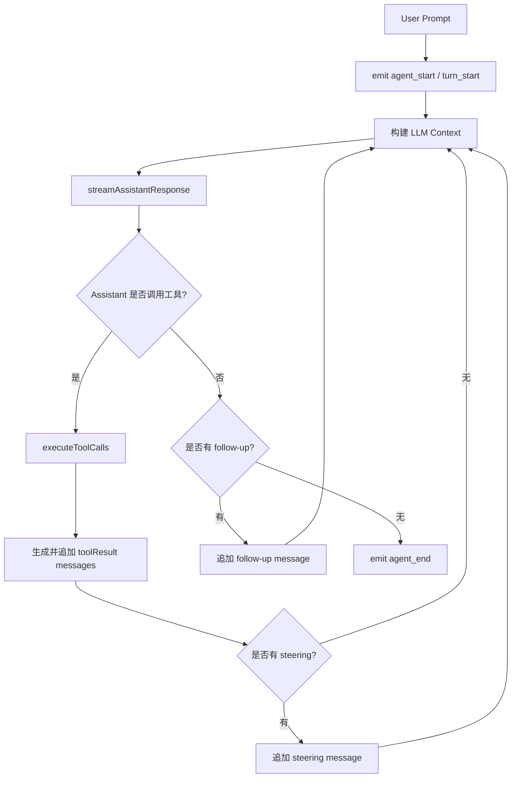
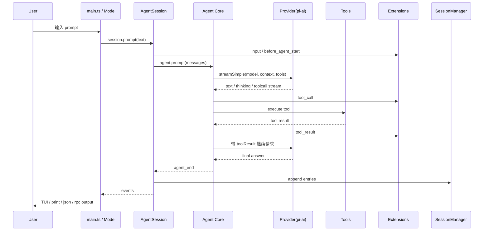

# 源码架构：从 CLI 到 Agent Loop

本文基于本地 Pi 源码 checkout 和 `packages/coding-agent/docs/`，梳理 Pi Coding Agent 的核心架构。当前校对的 `@earendil-works/pi-coding-agent` 包版本为 `0.75.5`。下文源码路径均以 Pi 仓库根目录为基准。

## 1. Monorepo 分层

Pi 仓库是一个 monorepo，核心包如下：

| 包 | 路径 | 职责 |
|----|------|------|
| `@earendil-works/pi-ai` | `packages/ai` | 统一 LLM Provider API、模型定义、streaming、OAuth/API key、成本统计 |
| `@earendil-works/pi-agent-core` | `packages/agent` | Agent Loop、消息状态、工具调用、steering/follow-up 队列 |
| `@earendil-works/pi-coding-agent` | `packages/coding-agent` | CLI、TUI、会话、内置工具、扩展系统、SDK/RPC |
| `@earendil-works/pi-tui` | `packages/tui` | 终端 UI 组件、差分渲染、输入处理 |

可以把它理解为：

```text
┌──────────────────────────────────────────────┐
│ packages/coding-agent                         │
│ CLI / TUI / Sessions / Tools / Extensions     │
├──────────────────────────────────────────────┤
│ packages/agent                                │
│ Agent Loop / Message State / Tool Execution   │
├──────────────────────────────────────────────┤
│ packages/ai                                   │
│ Provider Abstraction / Streaming / Models     │
├──────────────────────────────────────────────┤
│ packages/tui                                  │
│ Terminal Components / Rendering / Input       │
└──────────────────────────────────────────────┘
```

## 2. CLI 入口链路

Pi 的 npm 包声明：

```json
{
  "name": "@earendil-works/pi-coding-agent",
  "bin": {
    "pi": "dist/cli.js"
  }
}
```

源码链路：

```text
packages/coding-agent/src/cli.ts
    ↓
packages/coding-agent/src/main.ts
    ↓
parseArgs / session 选择 / resource paths / mode 分发
    ↓
createAgentSessionRuntime(...)
    ↓
createAgentSessionServices(...)
    ↓
createAgentSessionFromServices(...)
    ↓
AgentSession + Agent + ResourceLoader + SessionManager
```

`main.ts` 负责大量“应用层”工作：

- 解析参数：`--mode`、`--print`、`--model`、`--tools`、`--session`、`--fork` 等；
- 判断运行模式：interactive / print / json / rpc；
- 读取 `@file` 参数和 piped stdin；
- 创建或恢复 session；
- 加载 settings、models、extensions、skills、prompts、themes；
- 最终进入 `InteractiveMode`、`runPrintMode` 或 `runRpcMode`。

## 3. createAgentSession：把运行时拼起来

核心工厂在：

```text
packages/coding-agent/src/core/sdk.ts
```

`createAgentSession()` 负责：

1. 解析工作目录和 agent 配置目录；
2. 创建 `AuthStorage` 和 `ModelRegistry`；
3. 创建 `SettingsManager`；
4. 创建或接收 `SessionManager`；
5. 用 `DefaultResourceLoader` 加载扩展、技能、提示模板、主题、上下文文件；
6. 恢复已有 session 的 model / thinking level；
7. 创建 `Agent`；
8. 创建 `AgentSession`；
9. 注册默认工具与扩展工具。

默认激活工具是：

```text
read, bash, edit, write
```

只读工具 `grep/find/ls` 存在，但默认不在核心四件套中；可以用 `--tools read,grep,find,ls` 显式进入只读模式。

## 4. AgentSession：模式无关的会话核心

`AgentSession` 在：

```text
packages/coding-agent/src/core/agent-session.ts
```

它是 interactive / print / rpc 共用的核心抽象，职责包括：

- `prompt()`：处理用户输入、扩展命令、技能命令、prompt template；
- `steer()` / `followUp()`：消息队列；
- 模型切换、thinking level 切换；
- session 持久化；
- 手动/自动 compaction；
- bash 用户命令；
- 工具注册与启用；
- 扩展事件派发；
- `/tree`、`/fork`、`/clone` 相关会话逻辑。

它在 `Agent` 之外包了一层“Coding Agent 应用语义”：例如 settings、resource discovery、session JSONL、扩展系统都在这一层协调。

## 5. Agent Core：真正的 Agent Loop

Agent 内核在：

```text
packages/agent/src/agent.ts
packages/agent/src/agent-loop.ts
```

`Agent` 维护状态：

- system prompt；
- 当前模型；
- thinking level；
- 工具列表；
- 消息历史；
- streaming message；
- pending tool calls；
- steering / follow-up 队列。

`agent-loop.ts` 的主流程可以概括为：



其中关键点：

- LLM 请求前会把 `AgentMessage[]` 转成 provider 可接受的 `Message[]`；
- assistant streaming 会产生 `message_update` 事件；
- 工具调用可以并行执行，也可以因为工具设置为 sequential 而串行；
- 工具结果作为 `toolResult` 消息加入上下文；
- 只要模型继续调用工具，循环就继续。

这就是 Coding Agent 的自主性来源：

```text
推理 -> 工具调用 -> 观察结果 -> 再推理 -> ... -> 完成
```

## 6. 工具系统：小而明确的内置能力

工具定义集中在：

```text
packages/coding-agent/src/core/tools/
├── read.ts
├── bash.ts
├── edit.ts
├── write.ts
├── grep.ts
├── find.ts
├── ls.ts
├── file-mutation-queue.ts
└── truncate.ts
```

`core/tools/index.ts` 提供：

- `createCodingToolDefinitions()`：`read/bash/edit/write`；
- `createReadOnlyToolDefinitions()`：`read/grep/find/ls`；
- `createAllToolDefinitions()`：全部内置工具；
- `withFileMutationQueue()`：文件写入队列，避免并行工具同时改同一文件导致覆盖；
- `truncateHead` / `truncateTail`：限制工具输出，避免撑爆上下文。

这套工具系统有几个重要设计：

1. 工具参数有 schema，模型必须按 schema 调用；
2. 大输出会截断并提示完整输出位置；
3. 写文件工具要进入 mutation queue；
4. 扩展可以覆盖内置工具，或注册新工具；
5. 扩展可通过 `tool_call` / `tool_result` 事件拦截执行。

## 7. ResourceLoader：扩展、技能、模板、主题的入口

资源加载在：

```text
packages/coding-agent/src/core/resource-loader.ts
```

`DefaultResourceLoader` 负责发现：

- Extensions；
- Skills；
- Prompt Templates；
- Themes；
- `AGENTS.md` / `CLAUDE.md`；
- `.pi/SYSTEM.md` / `APPEND_SYSTEM.md`；
- package 中声明的资源。

它还会处理：

- 全局配置目录 `~/.pi/agent`；
- 项目配置目录 `.pi`；
- CLI 显式传入的 `--extension`、`--skill` 等路径；
- package manager 解析出来的 npm/git/local package；
- 资源冲突诊断。

## 8. SessionManager：JSONL 会话树

会话管理在：

```text
packages/coding-agent/src/core/session-manager.ts
```

Pi session 是 JSONL 文件，每一行是一条 entry。除了 header，entry 通过 `id` / `parentId` 形成树。

常见 entry：

| Entry | 含义 |
|-------|------|
| `session` | 文件头，记录版本、session id、cwd |
| `message` | 用户、助手、工具结果消息 |
| `model_change` | 模型切换 |
| `thinking_level_change` | thinking level 切换 |
| `compaction` | 上下文压缩摘要 |
| `branch_summary` | `/tree` 分支切换摘要 |
| `custom` | 扩展状态，不进 LLM 上下文 |
| `custom_message` | 扩展注入消息，进入 LLM 上下文 |
| `label` | `/tree` 标签 |
| `session_info` | 会话名等元信息 |

这套结构支撑了 `/tree`、`/fork`、`/clone` 和 compaction。

## 9. Provider 与模型层

Provider 抽象主要在：

```text
packages/ai
packages/coding-agent/src/core/model-registry.ts
packages/coding-agent/src/core/auth-storage.ts
```

Pi 支持订阅登录和 API Key：

- Claude Pro/Max；
- ChatGPT Plus/Pro（Codex）；
- GitHub Copilot；
- Anthropic、OpenAI、Google、Azure、Bedrock、OpenRouter、Vercel AI Gateway 等 API Key Provider。

模型选择发生在 `ModelRegistry` 与 settings 层：

- `/model` 展示可用模型；
- settings 中可设置 `defaultProvider`、`defaultModel`、`enabledModels`；
- `models.json` 可添加自定义 provider/model；
- Extension 也可以通过 `pi.registerProvider()` 注册 provider。

## 10. Extension Runtime：事件驱动的可塑形层

扩展系统主要分布在：

```text
packages/coding-agent/src/core/extensions/
packages/coding-agent/docs/extensions.md
packages/coding-agent/examples/extensions/
```

Extension 可以监听的典型事件：

```text
session_start
resources_discover
input
before_agent_start
agent_start / agent_end
turn_start / turn_end
message_start / message_update / message_end
tool_call / tool_result
before_provider_request / after_provider_response
session_before_compact / session_before_tree
model_select / thinking_level_select
```

例如权限系统的本质就是：在 `tool_call` 阶段检查工具名和参数，必要时返回 `{ block: true }`。

这也是 Pi 小核心哲学的源码体现：核心提供事件和注册 API，具体工作流由扩展决定。

## 11. 端到端请求流程



## 12. 架构取舍总结

Pi 的源码结构与产品哲学高度一致：

- `pi-agent-core` 做通用 Agent Loop；
- `pi-ai` 做 Provider 抽象；
- `pi-coding-agent` 负责把 Agent Loop 落到 Coding 场景；
- `pi-tui` 负责终端交互；
- Extensions / Skills / Packages 负责工作流定制。

这使得 Pi 既能作为一个日常终端工具，也能作为 SDK/RPC 被其它系统嵌入。

---

> 下一篇：[SDK 与 RPC 自动化](./06-sdk-rpc-automation.md)
