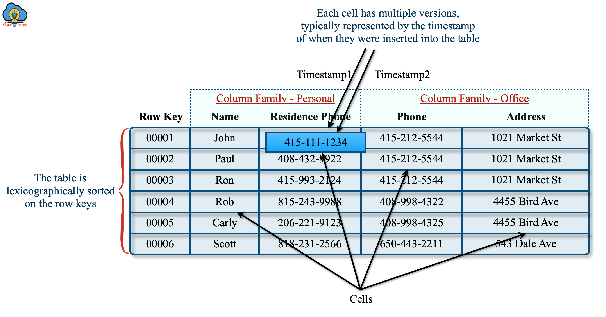
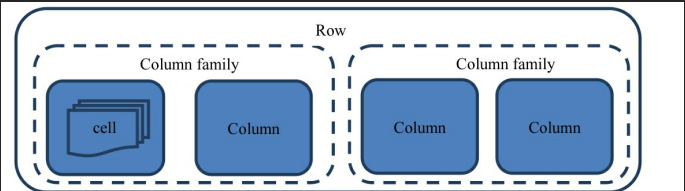
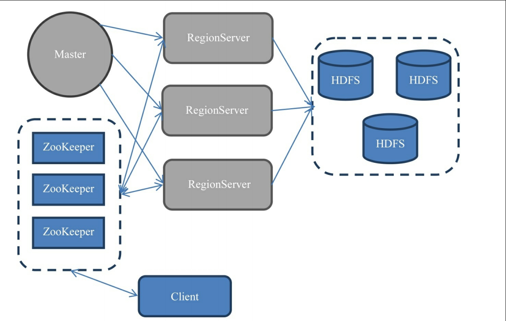

## 什么是HBase

Apache HBase 是一个开源的、非关系型、分布式的数据库，它以 Google 的 Bigtable 为模型，用 Java 编写。它是作为 Apache 软件基金会的 Apache Hadoop 项目的一部分开发的，运行在 HDFS（Hadoop 分布式文件系统）之上，为 Hadoop 提供了类似 Bigtable 的功能。HBase 的目标是托管非常大的表——数十亿行乘以数百万列——在商用硬件集群之上。当需要对大数据进行随机、实时的读/写访问时，可以使用 Apache HBase。

## 核心特性

- **线性和模块化可伸缩性**: 可以通过增加节点来线性扩展。
- **严格一致的读写**: 保证了操作的原子性和一致性。
- **自动和可配置的表分片**: 当表变得过大时，HBase 会自动将其分片成更小的区域。
- **RegionServer 之间的自动故障转移**: 当 RegionServer 失败时，Master 会将它所服务的区域重新分配给其他可用的 RegionServer。
- **方便的 Java API**: 提供易于使用的 Java API 进行客户端访问。
- **支持 MapReduce**: 可以作为 Hadoop MapReduce 作业的输入和输出。
- **实时查询的块缓存和布隆过滤器**: 通过块缓存和布隆过滤器优化查询性能。
- **服务器端过滤器**: 通过查询谓词下推来优化性能。
- **Thrift/REST 网关**: 支持 XML、Protobuf 和二进制数据编码选项。
- **基于 JRuby 的 Shell (JIRB)**: 提供了一个可扩展的命令行工具。

## 数据模型

HBase 是一个面向列的数据库，它的数据模型由以下几个部分组成：
- **Table**: HBase 中的表由多个行组成。
- **Row**: 表中的每一行都有一个唯一的行键（Row Key）。
- **Column Family**: 列族是列的集合。一个表可以有多个列族。物理上，同一列族的数据存储在一起。
- **Column Qualifier**: 列族中的每个列由一个列限定符标识。
- **Cell**: 行、列族和列限定符的组合唯一确定一个单元格（Cell）。
- **Timestamp**: 每个单元格中的数据可以有多个版本，每个版本由一个时间戳标识。

其中，表中每一行的数据结构如下图所示：

## 架构

HBase 架构主要由三个组件组成：

1.  **HMaster**:
    - 负责监控集群中所有的 RegionServer 实例。
    - 负责所有元数据的更改。
    - 负责Region的分配、负载均衡。

2.  **RegionServer**:
    - 负责服务和管理 Regions。
    - 客户端直接与 RegionServer 通信进行读写操作。
    - RegionServer 内部管理一组 Region，每个 Region 是表中行的连续范围。

3.  **ZooKeeper**:
    - HBase 使用 ZooKeeper 进行分布式协调。
    - 存储 HMaster 的地址和 `-ROOT-` 表的位置。
    - 跟踪服务器故障和网络分区。

## 何时使用HBase

HBase 非常适合需要对大量数据进行快速随机读写的场景。它被广泛应用于需要高吞吐量和低延迟的应用程序中。一些典型的使用案例包括：

- 消息传递平台（例如 Facebook Messenger 早期版本）
- 时间序列数据存储（例如 Bloomberg）
- 实时分析和仪表盘
- 搜索引擎索引（例如 Flipkart）
- 用户行为分析和个性化推荐（例如 Spotify）

然而，HBase 并不是传统关系型数据库的直接替代品，它不支持 SQL 查询（但可以通过 Apache Phoenix 等项目提供 SQL 层）。对于需要复杂事务和多行 ACID 保证的场景，传统 SQL 数据库可能是更好的选择。

## HBase 与其他数据库的对比

为了更好地理解 HBase 的定位和优势，下面将其与关系型数据库以及其他主流 NoSQL 数据库进行比较。

| 特性 | HBase | 关系型数据库 (如 MySQL) | Cassandra | MongoDB |
| :--- | :--- | :--- | :--- | :--- |
| **数据模型** | 宽列存储 (Wide-Column) | 基于行 (Row-based) | 宽列存储 (Wide-Column) | 文档存储 (Document) |
| **Schema** | 半结构化 (Schema-less)，只需定义列族 | 结构化 (Fixed Schema)，需预先定义表结构 | 半结构化 (Schema-less) | 半结构化 (Flexible Schema) |
| **可扩展性** | 优秀的水平扩展能力 | 主要垂直扩展，水平扩展（分片）复杂 | 优秀的水平扩展能力，无主架构 | 良好的水平扩展能力 |
| **一致性 (CAP)** | 强一致性 (CP) | ACID 保证，强一致性 (CA) | 可调一致性 (AP) | 强一致性 (CP) |
| **事务** | 仅支持单行 ACID | 完整的 ACID 事务支持 | 仅支持单行原子性 | 支持多文档 ACID 事务 |
| **查询语言** | 基于 Get/Scan API，不支持 SQL（可借助 Phoenix） | 标准 SQL | CQL (类 SQL 语言) | 丰富的查询语言 (MQL) |
| **二级索引** | 有限支持，性能开销大 | 强大的二级索引支持 | 强大的二级索引支持 | 强大的二级索引支持 |
| **适用场景** | 海量数据（PB级）的实时随机读写、大数据分析 | 事务性应用、结构化数据、复杂查询和报表 | 多数据中心部署、高可用性、写密集型应用 | 通用性强、快速开发、内容管理、Web 应用 |
| **生态系统** | 紧密集成 Hadoop (HDFS, MapReduce, Spark) | 成熟的 SQL 生态 | 独立，与 Spark 等集成良好 | 广泛的驱动和工具支持，非常开发者友好 |

