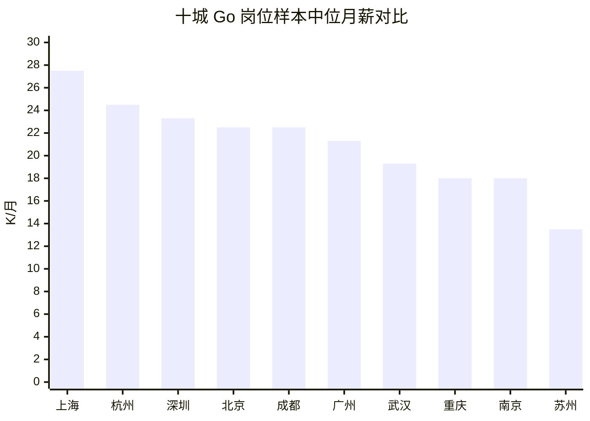

## 执行摘要

截至 2026 年 6 月 15 日，如果把“传统 Go 技术栈”界定为 **Go + Linux + MySQL/PostgreSQL + Redis + MQ + 微服务/gRPC + Docker/Kubernetes + 常规监控与 CI/CD** 的后端/平台岗位，那么它在中国的就业前景仍可判断为：**中性偏乐观，但能力门槛持续上移**。

核心原因不是 Go 语言本身有多热，而是中国软件和信息技术服务业仍在增长。2025 年全国软件业务收入达到 **154831 亿元，同比增长 13.2%**，国家层面也继续推进算力网、数据基础设施和“人工智能+制造”。这些方向都会托底后端、分布式系统、平台工程、云原生、自动化运维和 AI 服务工程岗位。

从岗位结构看，传统 Go 岗位没有被 AI 直接替代掉，但正在被重新分层。公开招聘样本里的真实需求，已经明显集中在高并发后端、云原生平台、容器与 DevOps、广告/金融/游戏后端、IoT/智能硬件、AI 应用后端与工程化这些方向。

AI 的冲击更像是 **“任务级自动化 + 岗位能力重组”**。GitHub Copilot 的受控实验显示，AI 编码助手可以显著提升单任务速度；Anthropic、Microsoft、WEF 等研究也指向同一个趋势：重复编码会被压缩，但系统集成、架构设计、稳定性治理和 AI 工程化会更重要。

对 Go 程序员最现实的判断是：**初级、重复性高、上下文简单的中后台开发岗位，确实受到较大挤压；但中高级、平台化、云原生、稳定性、性能、安全和 AI 工程化方向的岗位，反而更有韧性**。

从十城公开岗位样本看，样本中位月薪处于第一梯队的是 **上海、杭州、深圳、北京**；第二梯队是 **成都、广州**；第三梯队是 **武汉、重庆、南京**；苏州在纯互联网 Go 样本里偏弱，但机器人、IoT、制造业数字化和云原生运维仍有稳定需求。

重庆属于“岗位下限不少，但高薪密度弱于头部互联网城市”的典型城市。公开样本中，重庆 Go 岗位平均月薪约 **19.5K**，中位月薪约 **18.0K**，20K+ 样本占比约 **40%**，岗位集中在两江新区、沙坪坝、西永/大学城、渝中等区域。

## 范围、口径与方法

本报告默认时间窗口为最近 12 个月，并以 **2026 年 6 月 15 日** 为抓取与判断基准日。它服务于个人职业规划，不追求招聘平台后台级别的精确普查。

| 项目 | 本报告口径 |
| --- | --- |
| 传统 Go 技术栈 | Go 后端/平台开发，通常配套 Linux、MySQL/PostgreSQL、Redis、MQ、微服务、gRPC/HTTP、Docker/Kubernetes、日志监控与 CI/CD |
| 岗位数量 | 采用 BOSS 直聘公开可访问城市页的“可见岗位数下限”。核心城市页普遍触发约 30 条展示上限，因此不是平台真实总量 |
| 薪资水平 | 采用各城市公开页前 10 个全职岗位的月薪区间中点，测算样本平均月薪与样本中位月薪；13/14/15/16 薪不折算年包 |
| 高频考点 | 结合岗位 JD 中反复出现的能力项，以及 Go/Kubernetes/MySQL/Redis 官方文档覆盖的基础能力整理 |
| AI 冲击判断 | 采用“宏观政策 + 官方研究 + 招聘 JD 变化 + 作者半量化推演”的混合方法，重点判断结构性影响 |

这一口径的优点是跨城市可比性强；缺点是无法获得平台后台真实总量。因此，本文在“岗位数量”之外，额外使用样本中位月薪、20K+ 样本占比、经验主档和行业方向来补充判断市场深度。

对求职决策来说，这种口径已经足够回答三个问题：**城市值不值得去、本地岗位偏什么方向、自己应该补哪些能力**。但它不适合被当作严格统计口径或薪资承诺。

## 全国市场判断与 AI 冲击

先看就业前景本身。中国软件和信息技术服务业仍在扩张，国家 2026 年继续推进算力网、数据基础设施和 AI 赋能，说明后端、平台、云原生与数据服务岗位的总盘子没有塌。

结合各地公开岗位页，Go 岗位现实分布主要落在：微服务后端、云原生平台、分布式存储与中间件、广告/金融/支付/游戏服务端、IoT/智能硬件、AI 应用后端与工程化、DevOps/可观测等方向。

也就是说，Go 在中国不是“语言红利型赛道”，而是 **基础设施/平台工程型赛道**。只要企业还在做高并发、低延迟、高可用、容器化和服务治理，这类岗位就很难突然消失。

AI 的第一层冲击，是把重复性编码、模板化测试、基础排障、文档生成、简单脚手架搭建这类工作大幅自动化。它不会立刻让岗位消失，但会提高团队对人均产出的期待。

因此，初级 Go 岗位最先承受的压力是：岗位没有立刻消失，但企业不再愿意为低复杂度、低上下文的任务单独配置太多人。换句话说，**低复杂度任务被压价，低复杂度岗位被压缩**。

AI 的第二层影响，反而会抬高中高级 Go 工程师的价值。企业不会只满足于“让 AI 写几段代码”，还会要求把模型接入业务，把 agent 接入流程，把推理调用纳入服务治理，把自动化运维嵌进生产系统。

这类工作需要懂 Go、懂分布式系统、懂容器与云原生、懂观测与稳定性的人来做“胶水工程”“平台工程”和“工程化落地”。杭州、深圳、北京、重庆等地的公开 Go 岗位，已经能看到 AI 应用后端、Agent 工作流、RAG、模型服务化、AI × 后端平台等要求。

基于这些信号，我对中国传统 Go 岗位在 AI 时代的影响，给出如下半量化推演。这里的区间不是平台官方数据，更适合职业规划，不适合用于严格统计发表。

| 情景 | 关键假设 | 对传统 Go 岗位数量的影响 | 对薪资与面试要求的影响 | 我的判断 |
| --- | --- | --- | --- | --- |
| 近两年 | Copilot/Claude Code/企业内 AI 助手继续普及，但治理、数据质量、系统接入仍靠人工 | 初级 CRUD / 外包型 Go：-10% ~ -20%；普通业务后端：-5% ~ +5%；云原生/平台/稳定性：+5% ~ +15% | 普遍要求会用 AI 辅助开发、写单测、做排障；更重视项目深度和系统设计 | 冲击中等，主要打击初级重复劳动 |
| 未来两到五年 | Agent 工作流、自动化测试、自动化运维与模型服务化更成熟 | 泛中后台岗位：-10% ~ 0%；AI 服务工程/平台工程/DevOps/可观测：+10% ~ +25% | 面试更重视架构、治理、性能、成本与安全；只会写接口越来越不够 | 结构性分化明显 |
| 五年以上 | 企业级 AI 与“人工智能+制造/产业”深度融合，软件组织进一步平台化 | 低复杂度维护岗：-20% ~ -35%；复杂系统/高可靠/跨系统集成岗：0 ~ +20% | 薪资溢价转移到系统工程、AI 工程化、平台能力与业务理解 | 不会“灭绝”，但会明显极化 |

把这张表翻译成一句更直接的话：**Go 在中国会继续有饭吃，但“只会 Go 语法”的饭越来越少，“会 Go + 系统 + 云原生 + 数据 + AI 落地”的饭会越来越值钱**。

## 全国主要城市对比

下表采用统一口径：各城市 BOSS 公开页前 10 个全职岗位样本，测算样本平均月薪和中位月薪。岗位数量列为公开可见岗位数下限，不代表平台真实总量。

由于十个城市几乎都触发了约 30 条展示上限，所以真正有区分度的不是“公开页下限”，而是中位月薪、20K+ 高薪样本占比、经验门槛与岗位方向。

| 城市 | 公开可见岗位数下限 | 样本平均月薪 | 样本中位月薪 | 20K+ 样本占比 | 经验要求主档 | 岗位分布特征 |
| --- | ---: | ---: | ---: | ---: | --- | --- |
| 北京 | ≥30 | 24.7K | 22.5K | 70% | 3-5 年为主，本科占优 | 后端、广告/内容平台、游戏、配送、AI 平台 |
| 上海 | ≥30 | 32.2K | 27.5K | 90% | 3-5 年与 5-10 年并重 | 混合云、游戏、旅游/出海、AI 后端、平台工程 |
| 深圳 | ≥30 | 26.6K | 23.3K | 70% | 3-5 年为主，本科明显 | 金融科技、游戏、IoT、网安、AIGC 后台、容器开发 |
| 广州 | ≥30 | 21.8K | 21.3K | 60% | 3-5 年为主，5-10 年次之 | 社交/直播、跨境电商、自动驾驶、云原生网关、广告程序化 |
| 杭州 | ≥30 | 26.2K | 24.5K | 80% | 3-5 年为主，本科多 | AI 应用后端、Agent/RAG、游戏、本地生活、平台工程 |
| 成都 | ≥30 | 20.8K | 22.5K | 60% | 3-5 年为主，也接受部分经验不限/1-3 年 | 存储、Kubernetes/Docker、游戏、AI 平台、安全 |
| 重庆 | ≥30 | 19.5K | 18.0K | 40% | 3-5 年为主，局部偏 5-10 年 | 本地互联网、中大厂区域团队、通信、教育科技、Web3、AI&Cloud |
| 南京 | ≥30 | 19.7K | 18.0K | 40% | 3-5 年与 5-10 年并重 | 广告平台、实时音视频、工业物联网、DevOps、华为数据保护 |
| 武汉 | ≥30 | 20.3K | 19.3K | 50% | 3-5 年为主，本科较多 | 游戏、教育、AI 工程化、社交、办公软件、海外工具 |
| 苏州 | ≥30 | 14.0K | 13.5K | 0% | 1-3 年与 3-5 年并重 | 机器人、IoT、制造数字化、云原生运维、信息安全 |

从横向比较看，**上海、杭州、深圳、北京** 是当前 Go 求职最值得优先关注的头部城市。它们不仅中位月薪更高，而且 20K+ 样本占比更高，岗位方向也更靠近平台工程、云原生、安全和 AI 工程化。

**成都** 值得单独看。它的平均月薪不如杭州和深圳，但样本中位已经与北京持平，且 K8s、容器、存储、安全、AI 平台相关岗位密度不低，性价比相对突出。

**重庆、南京、武汉** 属于“岗位不断档，但大规模高薪池子不如头部城市厚”的第二梯队。**苏州** 在纯互联网 Go 方向上较弱，但如果愿意做机器人、IoT、制造业软件和云原生运维，仍然有稳定机会。

上图反映的不是平台后台真实总薪酬分布，而是统一口径公开样本中的中位月薪。它对职业规划仍然有用：想冲薪资上限，优先看上海/杭州/深圳/北京；想看性价比，成都和广州值得认真看。

如果希望留在中西部且兼顾稳定性，武汉与重庆依然是现实选项。但要接受一个事实：高薪岗位密度较低，竞争主要发生在中高级岗位上。

## 重庆地区岗位概况

重庆的 Go 岗位不属于全国最热，但也绝不是没有市场。从产业底盘看，重庆已经形成软件和数字经济基础，并依托两江数字经济产业园、中国智谷、仙桃国际大数据谷、重庆高新软件园等平台聚集企业。

岗位结构上，重庆 Go 岗位呈现明显的三层结构：**中小厂业务后端 + 中大型企业区域团队 + 通信/终端/内容平台**。公开样本中能看到华为、腾讯、传音、懂车帝等企业或相关团队。

另一方面，重庆本地也有教育科技、AI & Cloud、新媒体/社交、Web3 支付、通信和工业软件相关岗位。这解释了为什么本地 Go 岗位会同时出现内容平台、通信终端、AI 工程化和平台研发等混合方向。

| 维度 | 重庆结论 |
| --- | --- |
| 公开可见岗位数下限 | ≥30，已触发公开页展示上限 |
| 样本平均月薪 | 19.5K/月 |
| 样本中位月薪 | 18.0K/月 |
| 20K+ 样本占比 | 40% |
| 经验主档 | 3-5 年为主，5-10 年次之 |
| 典型区域 | 两江新区人和/观音桥/空港新城，沙坪坝西永/大学城，渝中区，涪陵 |
| 主要方向 | Go 后端、Go + AI & Cloud、Web3/支付、通信终端后台、大厂区域团队、平台研发 |
| 典型薪资带 | 7-12K、8-12K、13-20K、15-30K、20-40K、20-40K·14薪 |

这些样本说明，重庆不是“没有招聘”，而是“岗位质量分层明显”。中低端岗位存在，但真正有成长性和薪资弹性的岗位，更偏向平台、通信、云原生、AI 工程化和中大型企业区域团队。

如果把重庆放到求职决策场景里，我的建议是：**留在重庆完全可行，但不宜把自己定位成普通 Go 后端**。更合理的定位是 Go 系统工程师、云原生平台工程师、AI 服务工程后端，或通信/终端/工业软件里的后端基础设施工程师。

重庆更适合三类人：已有 3-5 年经验、能承担业务主模块或系统改造的人；会云原生/容器/可观测/自动化交付的平台型工程师；能把 Go 与 AI 服务工程、模型调用、数据/流程集成结合起来的人。

如果只会传统 CRUD，缺少系统设计和上线经验，那么在重庆会明显感受到：岗位不算少，但优质岗位更挑人。这一点和头部城市的差别，不在“有没有招聘”，而在“高薪与高成长岗位有没有足够厚的选择面”。

## 岗位类型、技能要求与面试准备

如果只把 Go 理解成“Gin + GORM + MySQL + Redis”，就会低估它今天在大陆市场里的岗位宽度。当前 Go 岗位已经明显分成后端/微服务、云原生/平台工程、运维开发/SRE、游戏服务端、嵌入式/IoT、AI 系统接入/MLOps 周边几类。

| 岗位类型 | 当前常见要求 | 公开常见薪资带 | 典型场景 |
| --- | --- | --- | --- |
| 后端/微服务 | Gin/Echo、GORM、MySQL、Redis、MQ、gRPC、分布式系统 | 15K-35K 为主，中高端 40K+ | 电商、SaaS、支付、内容分发 |
| 云原生/平台工程 | Docker、Kubernetes、Helm、微服务治理、中间件、可观测性 | 25K-55K | 容器平台、研发效能、基础中间件 |
| 运维/SRE/DevOps | CI/CD、SLA、监控、告警、事件中心、容灾、容量规划 | 18K-40K，高端 50K-60K | 生产稳定性、监控平台、AI 基础设施运维 |
| 游戏服务端 | 高并发、低延迟、匹配/房间/网关、网络优化 | 18K-45K | 手游、社交互动、实时通信后端 |
| 嵌入式/IoT | 设备接入、边缘控制、平台后端、通信协议 | 14K-25K 起步，中高端 30K 左右 | 智能设备、停车/充电/车联网 |
| AI 系统接入/MLOps 周边 | 训推平台、推理服务、LLM 接入、数据管道、模型 API、AIOps | 25K-45K，高端 50K-80K | Agent backend、模型服务、RAG/调用编排 |

从技能要求看，市场已经把“传统 Go”往更工程化的方向推。今天的高频关键词不再只是语言本身，而是 gRPC、MQ、Redis、Docker、Kubernetes、CI/CD、Tracing、pprof、SLA、分布式一致性和消息链路设计。

也就是说，会写 Go 只是入门。真正有市场溢价的，是能把 Go 放进复杂线上系统里跑稳，能解释容量、延迟、热点、故障隔离、发布回滚、可观测和成本控制的人。

从实际岗位 JD 看，今天中国企业面试 Go 程序员，已经很少只问语法。它们更喜欢考：**能否独立交付一个可靠系统**。

| 模块 | 面试常考题型 | 为什么高频 | 准备建议 |
| --- | --- | --- | --- |
| Go 基础与运行时 | slice/map/channel 底层、defer、interface、逃逸分析、GC、GMP 调度、内存分配 | 多地 JD 直接要求 Go 并发、GMP、内存管理、GC 与高性能优化 | 至少把 slice 扩容、map 并发安全、channel 关闭、多返回 error、逃逸分析、GC 调参讲清楚 |
| 并发与内存模型 | goroutine 调度、锁与无锁、CAS、竞态条件、context、超时取消、并发池 | 高并发和服务治理是 Go 岗位的看家本领 | 最好能现场写 worker pool、限流器、带超时的并发请求聚合器，并解释 happens-before |
| 网络、RPC 与微服务 | HTTP 生命周期、RESTful 设计、gRPC、长连接、幂等、重试、熔断、链路追踪 | 网关、广告、社交、海外服务端与 API 平台岗位常见 | 准备一个“单体 -> 微服务”或“同步调用 -> 异步解耦”的案例 |
| 数据库、缓存与消息队列 | MySQL 索引、锁、事务隔离、慢 SQL；Redis 数据结构、缓存一致性；MQ 顺序性/重复消费 | 几乎所有业务后端都会考，尤其是高并发和平台岗 | 会讲表结构优化、EXPLAIN、缓存击穿/穿透/雪崩、延迟双删、幂等消费 |
| 容器、云原生与运维 | Docker 镜像、K8s Pod/Deployment、滚动发布、灰度、服务发现、可观测、CI/CD | 这是传统 Go 岗位里最明显的加薪分水岭 | 至少自己部署过一个有数据库、缓存、服务端和监控的 demo |
| 系统设计与高并发 | 秒杀、广告投放、订单、支付、聊天/IM、日志/指标平台、对象存储、网关设计 | 3-5 年以上岗位几乎必考 | 准备 3 套系统设计模板：高并发 API、异步流水线、平台型系统 |
| 测试、性能调优与排障 | 单元测试、集成测试、压测、pprof、GC 调优、CPU/内存热点、线上故障定位 | 企业更在意上线后能不能稳住 | 准备 1 个压测脚本、1 个 pprof 分析案例、1 个线上事故复盘 |
| 算法基础与 AI 融合 | 链表、树、堆、DP、哈希、双指针；RAG、工作流、模型 API、AI 网关与评测 | Junior 会继续考算法，中高级开始加考 AI 工程化 | 做一个“Go + Redis/MySQL + K8s + AI API”的小项目，证明你会把 AI 接进生产系统 |

如果把这些考点压缩成一句话，今天 Go 面试真正考的是三件事：**写得对、跑得稳、扩得开**。只会背语法，已经很难拿到中高级 offer。

相反，哪怕算法不是顶尖，只要能把一个真实上线系统从需求、设计、编码、测试、部署、监控到事故复盘讲透，面试通过率通常会明显更高。

## 结论与职业规划建议

如果你问的是“传统 Go 技术栈程序员在中国还有没有前途”，我的结论是：**有，但已经不再是只会语言本身就够用的时代**。

2025 年中国软件业仍保持双位数增长，国家层面继续推进数字基础设施和“人工智能+”。企业侧的 Go 岗位又集中在后端基础设施、云原生、平台工程、内容平台、金融/广告/游戏/IoT 与 AI 服务工程上，所以它不是衰退赛道。

但 AI 研究和企业实践也很明确地说明：重复劳动正在被快速压缩，岗位评价标准正在从“会不会写功能”转向“会不会重构系统、交付平台、治理复杂性”。

如果你是 **应届或 1 年以内**，最不划算的定位是“纯 Go 初级后端”。更有效的做法是把自己包装成 **Go + Linux + MySQL/Redis + Docker/K8s + 单元测试 + 基本监控 + AI 辅助开发** 的复合型工程师。

如果你已经有 **1-3 年经验**，下一步最值得补的是系统设计、数据库与缓存、云原生、可观测、性能调优。对你来说，AI 不是主要威胁，真正的威胁是工作内容太浅，被更会用 AI、也更懂系统的人替代。

城市选择上，如果追求薪资上限，优先看 **上海、杭州、深圳、北京**。如果追求性价比，**成都、广州** 值得认真看。留在 **重庆、武汉、南京**，则最好往平台工程、通信/工业软件、AI 工程化或中大型企业区域团队靠。

如果你在 **重庆** 求职，我会给出更现实的判断：本地 Go 岗位不是没有，而是“中低端不缺、真正优质岗位更挑人”。目标应放在两江新区、西永/大学城、渝中一带的通信、平台、内容、AI&Cloud、区域研发中心岗位。

能力建设上，优先补齐 K8s、可观测、自动化交付、Go 性能优化、AI 服务接入这些能力。这样既能吃到重庆本地产业底盘的稳定性，也能尽量接近头部城市的技术要求与成长速度。

最终可以把这件事概括成一句实用的话：**在中国，传统 Go 岗位并没有被 AI 快速消灭；真正被消灭的，是低复杂度、低系统性、低业务理解的工作方式**。

只要能力持续向 **系统、平台、云原生、稳定性、安全、AI 工程化** 迁移，Go 仍然是一条可以长期做下去，并且在不少城市仍有不错薪资回报的技术路线。

## 不确定性

本文最大限制是样本口径。公开招聘页面通常存在展示上限、反爬限制、重复岗位、猎头职位和关键词偏差，因此岗位数量只能作为公开可见下限，而不是平台真实总量。

薪资样本按月薪区间中点估算，且没有把 13/14/15/16 薪折算成年包。因此，本文更适合判断城市和岗位层级差异，不适合当作精确现金流预算。

AI 冲击部分属于基于现有研究和岗位信号的职业规划推演，不是官方预测。它的价值在于帮助决定学习投入方向，而不是给出确定的岗位涨跌数字。
