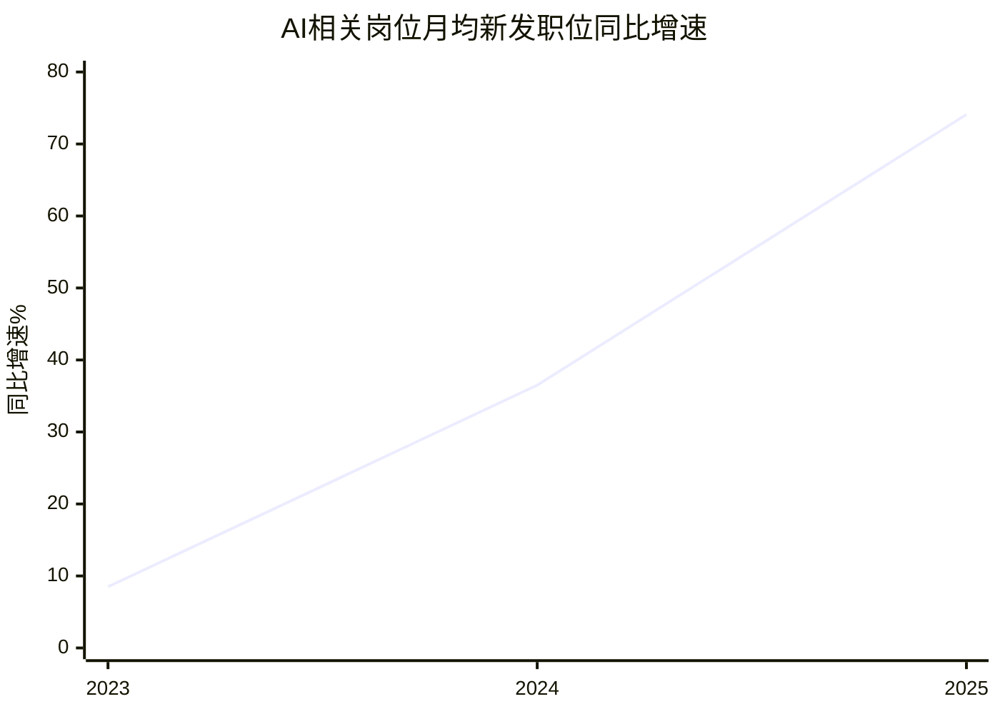
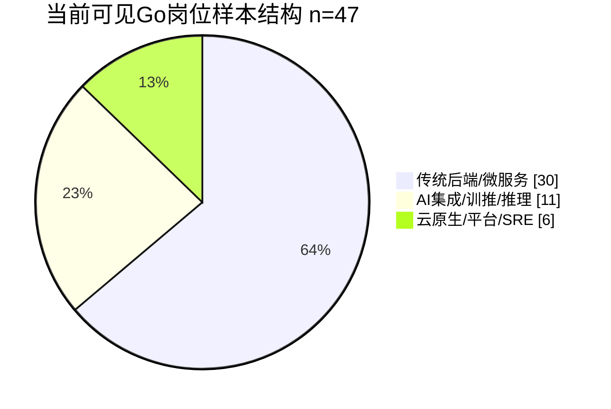

## 执行摘要

结论：传统Go岗在中国大陆仍有较强就业面，但岗位正从“纯后端CRUD”向云原生、平台工程和AI系统接入迁移。AI对初级编码岗冲击中等偏大，对中高级后端、SRE、推理服务与高并发岗位更多是抬高门槛而非直接替代。北京、深圳、杭州机会最集中。

## 研究设计与数据来源

本报告覆盖中国大陆市场，核心时间窗为 2023-06-01 至 2026-06-15。由于主流招聘平台对 Go 专项历史时间序列的公开口径有限，本文采用“两层证据法”：第一层使用公开季度/年度报告刻画宏观招聘景气、AI景气和城市热度；第二层在 2026-06-15 对猎聘、BOSS 直聘等可公开访问页面做关键词抓样，观察当前 Go 岗位的数量 proxy、薪资和技能要求。当前样本关键词包括“Go开发 / Golang / go语言 / Golang后端开发 / 运维开发 / SRE / 容器开发 / 基础架构”。薪资统一按区间中点估算，不把“13薪/14薪/16薪”年化折回月薪。本文把同比增速不低于 10% 视为“显著扩张”，城市样本中位数差异不低于 3k/月视为“具有实务意义”。由于平台反爬、关键词口径和猎头重复职位的存在，本文更适合判断趋势和结构变化，而不适合作为精确普查。

| 数据来源 | 代表内容 | 本文用途 | 主要局限 |
|---|---|---|---|
| 猎聘、BOSS 直聘当前页面 | 城市页、关键词页、职位卡片与摘要 | 当前 Go 岗位数量 proxy、薪资样本、技能要求、岗位类型 | 反爬限制明显，部分城市只能用摘要；猎头重复职位会抬高高薪占比 |
| 智联招聘季度/年度快报 | 38城薪酬分位数、AI/新一代信息技术/游戏/制造/运维测试增速 | 宏观招聘趋势、城市热度、行业增长率 | 公开口径多为行业或职业，不是 Go 专项 |
| 北大国发院×智联招聘报告 | 大模型影响指数、AI 城市指数、岗位结构影响 | 评估 AI 替代风险与地域差异 | 仍是职业大类而非 Go 单独分项 |
| 猎聘 AI 技术人才报告 | AI 技术岗增速、TSI 紧缺指数、城市群分布 | 判断 AI 人才对 Go 岗位的吸附与替代压力 | 重点覆盖 AI 核心技术岗，不等同传统后端 |
| Go 官方调查、CNCF 调查 | Go 用途、AI 辅助习惯、GenAI 场景、GitOps/自动发布 | 判断 Go 的长期技术栈方向与工具链迁移 | 全球样本，不是中国大陆单独样本 |
| StudyGolang、LearnKu Go 社区招聘板块 | 近期真实招聘贴、远程与城市分布 | 作为平台外的社区活跃度补充 | 代表性弱于大型招聘平台 |

说明：社区侧补充证据显示，StudyGolang 招聘板块当前仍有 1236 个主题，LearnKu Go 招聘版近一年仍持续出现北京、上海、深圳、杭州及远程岗位，说明 Go 社区层面的招聘活动并未停摆，但其统计代表性明显弱于智联、猎聘与 BOSS。

## 市场供需与薪资

如果把外部大环境先看清，再看 Go，就会更容易抓住重点。2024 年中国网络招聘行业市场规模为 183 亿元，同比仅增长 1.6%；同年超过六成企业缩减招聘量，说明整体白领招聘市场并不处在“全面繁荣”状态。但网络招聘仍占企业招聘渠道约七成，艾瑞预计 2025-2027 年行业年均增速回升到 6.7%。换句话说，Go 的前景不是建立在“大盘火热”上，而是建立在“在偏冷大盘里依然有相对优势”的结构性位置上。与此同时，Go 官方 2024 H1 调查显示，Go 最常见应用仍是 API/RPC 服务和命令行工具，使用者所在行业以 technology 为主，其次是金融服务，这与中国大陆 Go 岗位主要集中在互联网、软件、金融、云原生基础设施的观察大体一致。

从公开的 AI 招聘趋势看，AI 正在明显重塑技术岗位景气度。BOSS 直聘数据显示，AI 相关岗位月均新发职位数同比增速从 2023 年的 8.5% 提升到 2024 年的 36.5%，2025 年进一步升至 74.1%。这不是“Go 被替代”的证据，而是说明技术招聘重心正在向 AI 相关链条快速转移。Go 岗位是否受压，关键不在语言本身，而在你做的是不是可以被 AI 替掉的低复杂度任务，还是位于 AI 落地过程中更靠近基础设施、服务编排、推理接入、可观测性与可靠性保障的环节。

| 时间 | 公开指标 | 结果 | 对传统 Go 求职的含义 |
|---|---|---|---|
| 2023 | AI相关岗位月均新发职位同比增速 | +8.5% | AI 影响开始显性化，但仍属“早期进入” |
| 2024上半年 | 自然语言处理、深度学习岗位同比 | +111%、+61% | 高端 AI 岗开始吸走部分研发人才与预算 |
| 2024二季度 | AI 行业招聘职位数同比、平均招聘月薪 | +3.1%、13,594 元 | AI 赛道已形成明显薪资溢价 |
| 2025滚动年 | AI 技术人才同比、TSI 紧缺指数 | +6.53%、TSI=3.24 | AI 技术人才显著供不应求 |
| 2025前三季度 | AI 工程师、测试、运维工程师同比 | +13%、+36%、+11% | AI 落地带动周边工程岗位恢复 |
| 2025四季度 | AI 行业、智能硬件、游戏同比 | +19.0%、+11.5%、+26.4% | Go 关联度高的赛道继续扩招 |

说明：上表中的增长率来自 BOSS、智联和猎聘公开报告，反映的是 Go 所在技术生态的景气，而不是 Go 单一关键词的完整历史序列。公开可得的 Go 专项时间序列不足，这是本研究最核心的口径限制。

把视角收回到当前公开可见的 Go 招聘页面，城市差异非常明显。根据本文对 2026-06-15 可访问招聘页面的手工抽样计算，六城合计 115 条可直接读取薪资区间的 Go 岗位样本，月薪中位数约为 30k，P25-P75 约为 21.3k-40.0k。对比智联 38 城整体招聘市场在 2024 年前三季度大致 8,000-8,251 元的中位数区间，Go 仍然是显著高于市场均值的技术栈；但城市和岗位层级分化很大，不能把“Go 高薪”误读成“所有 Go 岗都高薪”。

| 城市 | 公开岗位量 proxy | 2026-06 样本薪资中位数 | 样本 P25-P75 | 公开热度/增长信号 | 结论 |
|---|---:|---:|---:|---|---|
| 北京 | 2740 | 42.5k | 30.0k-49.4k | 新一代信息技术职位占比 8.7%，全国第 1；AI 城市指数第 1 | 最高端岗位最密集，AI infra、量化、基础软件优势最强 |
| 深圳 | 超过 10000 | 30.0k | 22.2k-33.8k | 新一代信息技术职位占比 7.6%，全国第 2；大湾区物联网 +14.7%，AI +5.6% | 硬件、IoT、出海、容器平台、SRE 机会最宽 |
| 杭州 | 2006 | 20.0k | 17.2k-27.5k | 新一代信息技术职位占比 5.7%，全国第 3 | 电商、支付、云、AI 应用接入多，中低年资岗位相对较多 |
| 上海 | 1331 | 37.5k | 30.0k-45.0k | 新一代信息技术职位占比 4.6%，全国第 4 | 金融量化、游戏、平台工程的高薪岗位突出 |
| 成都 | 1482 | 30.0k | 21.2k-33.0k | 新一代信息技术职位占比 4.4%，全国第 5 | 游戏、O2O、软件研发中心是主场 |
| 广州 | 未公开总量 | 25.8k | 17.5k-34.0k | AI 城市指数第 4；大湾区物联网 +14.7%，AI +5.6% | 游戏、社交、通信与 IT 服务更有代表性 |

注：岗位量与薪资样本来自截至 2026-06-15 的猎聘/BOSS 可访问页面；北京、上海、杭州、成都使用可打开列表页或其摘要，深圳使用猎聘 career/golang 搜索摘要，广州因总量未公开仅保留薪资样本。由于不同城市可访问页面的关键词口径并不完全一致，上表适合横向看“高低格局”，不适合做精确人口普查。

从经验要求看，当前 Go 岗位最稳定的需求带仍然是 3-5 年到 5-10 年。可访问职位里，1-3 年岗位并未消失，但常见薪资主要在 12-25k；3-5 年通常落在 20-40k；5-10 年、高级/资深/架构师、量化与 AI 基础设施岗位则经常进入 30-60k，头部岗位可到 50-80k，且常带 15 薪、16 薪甚至 24 薪。换言之，Go 不是“只能卷资历”的栈，但它对经验的计价非常明显。

若按当前可见样本做行业归类，Go 仍然首先服务于互联网/电商/社交、计算机软件/IT 服务、AI 与云、金融支付/量化、游戏，以及工业/IoT/嵌入式这些“系统工程重、后端链路长、并发和性能要求高”的行业，而不是最容易被生成式 AI 直接吞掉的岗位。尤其值得注意的是，2025 年前三季度全行业前端开发、测试工程师、运维工程师分别同比增长 39%、36%、11%；2025 年四季度人工智能行业同比增长 19.0%，智能硬件增长 11.5%，游戏增长 26.4%，这意味着 Go 的就业价值正在从“通用后端”分流到“AI+基础设施”“智能硬件+云服务”“游戏/实时系统”等更有门槛的结合部。

| 行业 | 样本内岗位数 n=47 | 样本薪资中位数 | 公开增长信号 | 对 Go 的现实意义 |
|---|---:|---:|---|---|
| 互联网/电商/社交 | 16 | 35k | O2O +62.7%，游戏 +26.4% | 仍是 Go 后端主阵地，但更偏广告、交易、内容分发、国际化与平台化 |
| 计算机软件/IT 服务 | 13 | 27.5k | 测试 +36%，运维 +11% | 企业软件、SaaS、视频平台、监控平台、工具平台长期存在 |
| AI/云/智能硬件/机器人 | 7 | 30k | AI +19.0%，智能硬件 +11.5%，算法工程师 +110.1% | Go 最值得追加投入的新方向 |
| 金融/量化/支付 | 5 | 57.5k | 资本市场相关岗位三季度继续增长 | Go 在低延迟、高并发、核心交易系统中最能体现溢价 |
| 游戏 | 4 | 35k | +26.4% | 匹配、网关、实时服务端需求稳定且付费能力较好 |
| 工业/IoT/嵌入式/汽车 | 2 | 31k | 物联网 +14.7%，工业自动化 +7.9%，通用设备制造 +15.3% | 设备管理、边缘网关、车端云控开始成为细分增量 |

注：岗位数与中位数是本文对当前可见职位卡片的人工编码结果，增长信号来自智联 2025 三季度/四季度快报、猎聘 AI 报告和大湾区产业人才变化摘要，因此它更反映“行业景气与 Go 适配度”的组合判断，而不是 Go 专项行业普查。

## 岗位类型与技能要求

如果只把 Go 理解成“Gin + GORM + MySQL + Redis”，就会低估它今天在大陆市场中的岗位宽度。当前公开职位已经明显分成六类：一是后端/微服务，二是云原生/平台工程，三是运维开发与 SRE，四是游戏服务端，五是嵌入式/IoT/边缘系统，六是 AI 系统接入、训推平台、推理服务与 MLOps 周边。BOSS 和猎聘可见职位里已经能同时看到“基础中间件相关 Go 开发”“容器开发工程师”“GO 运维开发工程师-监控平台”“嵌入式/Go语言开发工程师”“Golang工程师（AI训推平台）”“Go开发（AI+支付）”这几条完全不同的成长路线。

| 岗位类型 | 当前常见要求 | 公开常见薪资带 | 典型场景 |
|---|---|---|---|
| 后端/微服务 | Gin/Echo、GORM、MySQL、Redis、MQ、gRPC、分布式系统 | 15k-35k 为主，中高端 40k+ | 电商、SaaS、支付、内容分发 |
| 云原生/平台工程 | Docker、Kubernetes、Helm、微服务治理、中间件、可观测性 | 25k-55k | 容器平台、研发效能、基础中间件 |
| 运维/SRE/DevOps | CI/CD、SLA、监控、告警、事件中心、容灾、容量规划 | 18k-40k，高端 50k-60k | 生产稳定性、监控平台、AI 基础设施运维 |
| 游戏服务端 | 高并发、低延迟、匹配/房间/网关、网络优化 | 18k-45k | 手游、社交互动、实时通信后端 |
| 嵌入式/IoT | 设备接入、边缘控制、平台后端、通信协议 | 14k-25k 起步，中高端 30k 左右 | 智能设备、停车/充电/车联网 |
| AI 系统接入/MLOps 周边 | 训推平台、推理服务、LLM 接入、数据管道、模型 API、AIOps | 25k-45k，高端 50k-80k | Agent backend、模型服务、RAG/调用编排 |

说明：上表来自当前可见职位摘要和职位卡片，不年化薪资。职位带宽差异很大，本质上反映的是“工程复杂度差异”而非单纯语言差异。

从技能要求看，市场已经把“传统 Go”往更工程化的方向推了出去。今天的高频关键词不再只是语言本身，而是 Gin/GORM/Echo，MySQL/Redis/MQ，gRPC，Docker/Kubernetes/Helm，CI/CD，单元测试，微服务治理，可观测性，SLA，高并发、网络编程、pprof/性能调优、分布式一致性和消息链路设计。BOSS 上能看到对“高可用、高性能、MQ、RPC、缓存、调用链”的要求，猎聘上能看到“并发和性能优化”“数据库建模与优化”“CI/CD 和线上可观测性”“容器/K8s”“GPU 集群部署经验”等要求。这说明会写 Go 已经只是入门，会把 Go 放进线上复杂系统里跑起来，才是当前市场的真实门槛。

工具链升级也不是空话，而是大势。CNCF 2024 年调查显示，38% 的组织已经把 80%-100% 的发布流程自动化，较 2023 年提升 10 个百分点；总体自动发布比例从 56.5% 升至 59.2%；77% 的受访者表示其部署实践和工具已在一定程度上遵循 GitOps 原则。对应到求职市场，就是 Docker/K8s、可观测性、GitOps、CI/CD、平台工程和 SRE 这些能力越来越像“Go 高薪岗位的默认伴随项”，而不再是加分项。

岗位稳定性与晋升路径也由此更清晰。可见职位里已经有从“Go开发工程师”到“Go开发组长”“Golang 架构师”“基础架构-中间件-GO”“GO运维开发工程师-监控平台”“agent 基础设施技术专家”的完整链条。对多数大陆求职者而言，更现实的晋升路径不是从 Go 转去做纯算法，而是从业务后端升级到高并发系统、再升级到平台工程、可观测性和 AI 基础设施，或者进入支付/量化/游戏/智能硬件等高复杂度行业。这里的岗位稳定性通常也更强，因为它们更靠近核心收入系统、生产基础设施或被监管约束较强的核心链路。这个判断属于基于职位类型和行业分布的推断，但方向是清晰的。

## AI冲击与新增机会

直接回答用户最关心的问题：**AI 对传统 Go 岗位的冲击不算小，但远没有到“把 Go 程序员快速打没”这一步；真正受冲击最大的，是低复杂度、低业务壁垒、低工程深度的初级编码任务，而不是中高级后端、平台工程和可靠性岗位。** 量化证据有四组。第一，北大国发院与智联招聘的 2024 年报告确认，“大语言模型影响指数”高的职业，其 2022-2024 年间招聘占比呈下降趋势；即使是技术类的软件/硬件研发，占比也下降了超过 1 个百分点。第二，Go 官方 2024 H2 调查显示，70% 的 Go 开发者已经在工作中使用 AI 助手，最常见用途是代码补全、写测试、根据自然语言生成 Go 代码、头脑风暴；拥有不到 2 年 Go 经验的开发者使用 AI 的比例更高，为 75%，而 5 年以上经验者为 67%。第三，2025 年 Stack Overflow 官方调查显示，开发者对 AI 输出的主动不信任比例已经高于信任比例，经验越多越谨慎。第四，智联 2025 年前三季度数据说明，AI 不仅拉动 AI 工程师，还带动测试工程师、运维工程师招聘分别增长 36% 和 11%，说明 AI 在工程现场更像“岗位结构重排”，不是简单的“岗位消灭”。

说明：这 47 条为本文对 2026-06-15 可公开访问 Go 职位卡片的人工编码结果。它的含义不是“全国只有这些比例”，而是说明**当前可见的 Go 市场已经出现了相当可观的 AI/平台化成分，但传统后端仍然是主体。**

AI 给 Go 带来的新增机会，比很多人想象的更偏“系统工程”，而不是“模型研究”。Go 官方 2024 H1 调查显示，在构建 AI 功能的受访者中，约三分之一已经用 Go 做 GenAI 相关任务，37% 用 Go 做 ML/AI 数据管道，41% 用 Go 托管模型 API 端点；很多组织先在 Python 中起步，再往更适合生产环境的语言迁移。这个结论和中国大陆当前招聘非常一致：北京已有“Golang工程师（AI训推平台）”25-45k·15薪，深圳已有“元宝产品-后台 Golang 开发岗”30-60K·15薪，杭州有“agent 基础设施技术专家”50-80k·16薪，深圳/北京还能看到 AI 应用开发、AI 与基础架构方向、Go+支付+AI接入等组合型岗位。换句话说，**Go 在 AI 时代最吃香的位置，不是替代 Python 训练模型，而是做模型服务化、推理编排、数据链路、可观测性、业务接入与高并发 API 层。**

专家观点也支持这个判断。梅宏院士在 2026 年中国国际软件发展大会上明确提出，编码只是软件工程的一小部分，有研究表明编码工作仅占实际软件开发时间的大约 10%；真正复杂的部分是需求理解、架构设计、平台能力、成本管理和演进路径。由此推回 Go 求职，AI 最容易替代的是样板化编码、基础测试脚手架、重复文档与简单接口拼装；最难替代的是架构取舍、高并发优化、跨系统联调、线上可观测性与 SLA 保障、复杂业务抽象，以及对 AI 系统进行工程化落地的人。这个结论与开发者对 AI 输出信任下降的国际调查一起看，更说明短期内“人机协作、人工负责验收与架构”才是主流状态。

如果拆成时间尺度，判断会更清楚。**短期**看，未来 12 个月更可能发生的是 JD 升级和门槛上移，而不是 Go 岗位总量崩塌；初级纯 CRUD 岗位和外包型低复杂度岗位压力最大。**中期**看，1-3 年内 Go 岗位会继续向平台工程、云原生、AI 接入、推理服务、AIOps 与智能硬件聚集，薪资分化会扩大：懂业务又懂工程化的人保值，只有语言语法的人贬值。**长期**看，这里属于基于现有证据的推断，传统纯后端岗位的议价能力大概率会继续下压，但核心系统、性能优化、基础设施、金融支付、游戏实时服务、IoT/边缘控制等岗位仍会长期存在，且更强调“Go + 领域 + 工程复杂度”的组合溢价。

## 建议与不确定性

按优先级排序，我认为最可执行的求职与能力升级路径如下。

1. **先把自己从“Gin/GORM 工程师”升级成“Go 系统工程师”。** 至少补齐 gRPC、MQ、Redis、Docker、Kubernetes、Helm、CI/CD、Tracing、pprof、SLA 这些能力，因为高薪岗位已经普遍把它们当作真实工作内容，而不是装饰性关键词。

2. **把 AI 变成履历中的“工程案例”，而不是只会用 Copilot。** 最优简历项目不是自己训练大模型，而是做一个 Go 编写的模型网关、RAG 后端、推理编排服务、Agent 调度层、数据管道或 AIOps 小平台。因为公开数据已经表明 Go 在模型 API 托管、ML/AI 数据管道上有现实需求，中国大陆职位也在招这类角色。

3. **求职时优先瞄准“离营收近、离基础设施近、工程复杂度高”的岗位。** 支付、风控、交易、基础中间件、监控平台、容器平台、游戏服务端、智能硬件云平台，通常比纯内容型、低壁垒外包型岗位更稳定，且更不容易被 AI 快速压价。

4. **城市策略上，3-5 年以上优先北深杭沪；初中级可在成广苏西等地找“赛道对口位”。** 北京适合高端后端、AI infra、量化；深圳适合硬件、IoT、出海与平台工程；杭州适合电商、支付、云与 AI 应用；上海适合金融量化、游戏和平台；成都适合游戏/O2O/研发中心；广州适合社交、通信与泛游戏。

5. **面试准备不要只练算法题，要能讲“线上系统如何跑稳”。** 未来 Go 岗位的差距会更多体现在并发控制、性能瓶颈分析、故障演练、容量规划、发布自动化、观测与回滚，而不是“会不会写接口”。这既是职位要求的现实，也是 AI 很难完全替代的工作部分。

本研究的不确定性与假设主要有四点。其一，缺少主流平台公开的 Go 专项季度历史库，因此本文的“趋势”部分主要依赖智联、猎聘、BOSS 的行业/职业/城市代理指标。其二，当前岗位数量使用的是公开页面与摘要的 proxy，不同城市可访问页的关键词口径并不完全一致。其三，薪资样本按区间中点估算且未把 13/14/16 薪折算入月薪，因此更适合看层级差异，不适合当作精确到元的现金流预算。其四，当前样本天然更容易抓到猎头和中高端岗位，所以绝对薪资水平可能略高于全量 Go 市场；但城市排序、技能门槛升级、AI 带来的岗位结构迁移，这几个结论的可靠度相对更高。

综合判断，如果你问的是“截至现在，传统 Go 在中国大陆还有没有前景”，答案是：**有，而且仍然高于平均技术岗位；但‘只会传统 Go’的前景在变差，‘会 Go 且懂云原生/平台工程/AI 系统工程’的前景在变强。** AI 对 Go 的冲击，本质上不是消灭语言，而是重新给岗位定价。
