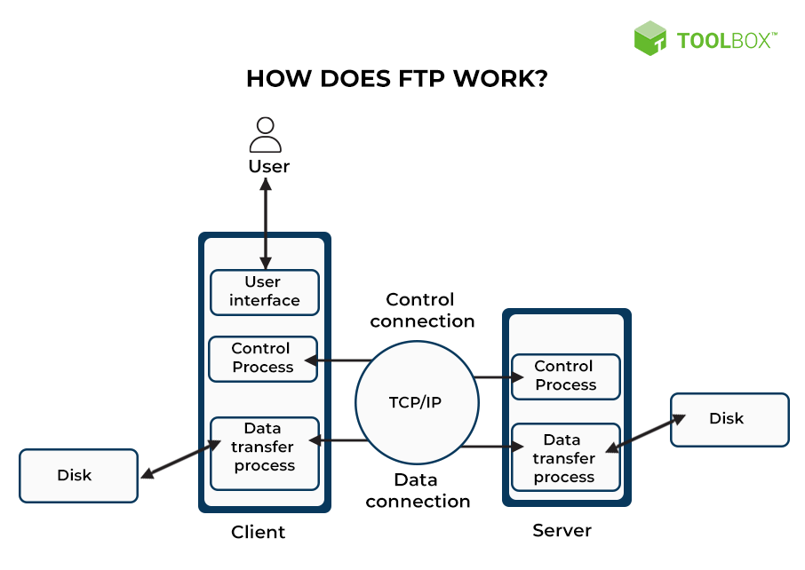

# FTP实现

## 1 背景介绍

本文是个人在业务开发过程中，针对由C++实现的FTP协议，重构至Rust语言，重新做一个更加清晰，简洁的分层架构设计的设计思路记录和讲解。

### 1.1 为什么选择Rust

Rust相对于C++是一门更加现代化的编程语言，首先它具备和C/C++几乎接近的性能，其次它更大的的有个优势在于它是一门将内存安全做到编译阶段的语言。这样既避免了运行时GC带来的额外性能开销，其次也消除了开发者对于手动管理内存的焦虑。

另外，Rust具备更加活跃的社区，有强大的包管理生态，更多的零成本语言抽象，使得你在做复杂的项目时有丰富的手段来完成功能的实现。

## 1.2 FTP是什么

FTP是文件传输协议的缩写，它是一种用于在网络上进行文件传输的一套标准协议，它是一个应用层协议，使用TCP协议来保证数据的可靠传输。FTP也是一个C/S通信模型，用户可以通过FTP客户端软件或者网络浏览器来访问FTP服务器上的文件，并进行上传和下载等操作。

FTP支持两种传输模式：ASCLL和二进制，分别适用于文本文件和非文本文件。



### 1.3 业务场景

在实际的业务中，设备的升级，日志采集，数据库备份，配置恢复等多个重要的场景都需要使用FTP来完成数据通信。

## 2 需求分析

### 2.1 功能需求

FTP具备的功能大致如下，各个FTP客户端工具或者FTP服务器根据RFC的标准，可能各有不同：

| 功能             | 描述                                                   | 使用场景                                                     |
| ---------------- | ------------------------------------------------------ | ------------------------------------------------------------ |
| 设置传输类型     | 二进制和文本传输类型的切换                             | 根据文件类型选择合适的传输格式，保证文件的完整性和传输效率   |
| 设置传输模式     | 主动和被动模式的切换                                   | 根据网络环境和防火墙设置选择合适的传输模式保证连接的可靠性和稳定性 |
| 目录跳转         | 支持任意目录跳转                                       | 在服务器上浏览不同的目录，查看和操作所需要的文件             |
| 删除目录         | 支持目录的删除                                         | 在服务器上删除不需要的目录，释放空间和保护隐私               |
| 删除文件         | 支持文件的删除                                         | 在服务器上删除不需要的文件，释放空间和保护隐私               |
| 获取目录         | 支持获取当前目录列表                                   | 在服务器上查看当前目录下的文件和子目录，方便选择和操作       |
| 获取当前工作路径 | 支持获取ftp用户当前所在的目录                          | 在服务器上确定当前所在的位置，方便跳转和操作                 |
| 下载文件         | 支持从服务器下载文件到客户端                           | 获取远程服务器上的文件，保存到本地或进行其他处理             |
| 上传文件         | 支持上传文件到服务器                                   | 上传本地文件到远程服务器，实现备份或共享目的                 |
| 重命名文件       | 支持文件的重命名                                       | 在服务器上修改文件的名称，方便识别和管理                     |
| 断点续传         | 传输意外中断的情况下，下次传输时可以继承上次的传输进度 | 大文件传输过程中，由于网络问题导致传输中断可以在中断后重新连接并继续传输未完成的部分 |

### 2.2 非功能需求

#### 2.2.1 安全性

服务端提供用户身份校验机制，只允许合法的用户进行接入，并针对访问的路径进行严格的权限控制和范围控制

#### 2.2.2 性能

对服务器和客户端的并行处理能力进行提升

#### 2.2.3 可维护性

重构后的代码应该具备良好的代码架构和组织逻辑，对后续的代码维护工作友好。
针对FTP的关键流程，失败时应该有详细的关键数据，错误原因记录，便于问题的定位。

#### 2.24 可测试性

代码应该是高内聚，低耦合的，代码工程应该具备良好的单元测试和集成测试能力，能够对现有代码质量进行一个良好的看护。

## 3 架构设计

### 3.1 功能分层

基于系统的目标，对整个系统的设计做如下分层架构设计：

| 分层   | 功能                                                         |
| ------ | ------------------------------------------------------------ |
| 应用层 | 人机交互，文件传输控制，异常恢复，日志管理，身份验证，报文解析 |
| 传输层 | 连接管理，数据收发                                           |
| IO层   | 文件读写，文件管理                                           |

针对传输层和IO层，应该是具备可替换性，需要使用抽象接口对接上游依赖，因为期望这两层实现在不同的系统上，可以屏蔽操作系统差异，虽然有POSIX标准，但是在实际业务里面的一些基础网络和文件IO接口还是做了自己的标准，所以传输层使用的基础套接字能力以及IO层实现的文件读写能力都要考虑这些方面。

### 3.2 系统架构图
@startuml
!define CHARSET UTF-8
skinparam dpi 100
skinparam defaultFontName Microsoft YaHei

skinparam package {
    BackgroundColor<<Application Layer>> LightGreen
    BackgroundColor<<Transport Layer>> LightBlue
    BackgroundColor<<I/O Layer>> LightYellow
}

node "Client" As Client
node "Server" As Server

package "Application Layer" <<Application Layer>> as app {
    package "Data Transfer" as dataTransfer {
        component "UserDtp" as userDtp
        component "ServerDtp" as serverDtp
    }

    package "Intepreter" as interpreter {
        component "UserPi" as userPi
        component "ServerPi" as serverPi
        component "Command" as command
        component "Reply" as reply
    }
}

package "Transport Layer" <<Transport Layer>> as transport {
    component "TcpClient" as tcpClient
    component "Connection" as connection
    component "TcpServer" as tcpServer
}

package "I/O Layer" <<I/O Layer>> as io {
    component "File I/O" as file
}

Client -down-> userPi : request
Client -down-> userDtp : data

Server -down-> serverPi : response
Server -down-> serverDtp : data

userPi -down-> reply: interpret
userPi -down-> command: interpret
serverPi -down-> reply: interpret
serverPi -down-> command: interpret

userDtp -down->tcpClient: send/receive
userDtp -down->tcpServer: send/receive
userDtp -down->connection: establish
userDtp -down->file: read/write

serverDtp -down->tcpClient: send/receive
serverDtp -down->tcpServer: send/receive
serverDtp -down->connection: establish
serverDtp -down->file: read/write

@enduml

### 3.3 类图设计

@startuml
!define CHARSET UTF-8
skinparam dpi 120
skinparam defaultFontName Microsoft YaHei
skinparam groupInheritance 1
skinparam linetype ortho

skinparam PackageStyle rect
skinparam rectangle {
    BackgroundColor<<DataTransfer>> lightblue
    BackgroundColor<<Interpreter>> green
    BackgroundColor<<Security>> pink
    BackgroundColor<<Management>> orange
}

' 布局控制
!define DIRECTION top to bottom direction
skinparam nodesep 10
skinparam ranksep 20

scale 1

' ==================== 核心层 ====================
package "Core Layer" {
    class FtpClient #48D1CC {
        + new()
        + connect()
        + download()
        + upload()
        + list_directory()
        + change_directory()
        + delete_file()
        + rename_file()
        + set_transfer_mode()
        + get_progress()
    }

    class Session #48D1CC {
        + new()
        + login()
        + list()
        + pasv()
        + download()
        + upload()
        + execute_cmd()
        + handle_data_connection()
        + after_data_transfer()
        + authenticate()
        + logout()
    }

    class Logger #48D1CC {
        + trace()
        + info()
        + warn()
        + error()
    }
}

' ==================== 配置和安全层 ====================
package "Configuration & Security" {
    package "Configuration" <<Management>> #FFA500 {
        class Config {
            + host: String
            + port: u16
            + timeout: Duration
            + retry_count: u32
            + buffer_size: usize
            + load_from_file()
            + validate()
        }

        class Credentials {
            + username: String
            + password: String
            + from_env()
            + validate()
        }
    }

    package "Security" <<Security>> #FFC0CB {
        class Authenticator {
            + authenticate()
            + validate_credentials()
            + generate_token()
        }

        class TlsWrapper {
            + establish_secure_connection()
            + wrap_stream()
            + verify_certificate()
        }

        class SecurityContext {
            + is_secure: bool
            + cipher_suite: String
            + get_security_level()
        }
    }
}

' ==================== 管理服务层 ====================
package "Management Services" {
    package "Transfer Management" <<Management>> #FFA500 {
        class ProgressTracker {
            + bytes_transferred: u64
            + total_bytes: u64
            + start_time: Instant
            + get_percentage()
            + get_speed()
            + get_eta()
        }

        class ResumeManager {
            + save_state()
            + load_state()
            + can_resume()
            + get_resume_offset()
        }

        class TransferStatistics {
            + files_transferred: u32
            + total_bytes: u64
            + errors_count: u32
            + average_speed: f64
            + generate_report()
        }

        enum TransferMode {
            Active
            Passive
        }

        enum DataType {
            ASCII
            Binary
        }
    }

    package "Directory Management" <<Management>> #FFA500 {
        class DirectoryManager {
            + list_directory()
            + create_directory()
            + delete_directory()
            + change_directory()
            + get_current_path()
        }

        class FileMetadata {
            + name: String
            + size: u64
            + modified: DateTime
            + permissions: String
            + is_directory: bool
        }
    }

    package "Error Handling" <<Management>> #FFA500 {
        enum FtpError {
            ConnectionFailed
            AuthenticationFailed
            TransferFailed
            FileNotFound
            PermissionDenied
            + get_message()
            + is_recoverable()
        }

        class ErrorHandler {
            + handle_error()
            + retry_operation()
            + log_error()
            + should_retry()
        }
    }
}

package "Interpreter" #48D1CC {
    enum Command {
        USER
        PASS
        ...
        + to_string()
        + from_str()
    }

    enum ReplyCode {
        + from_u32()
        + value()
        + get_description()
    }

    class Reply {
        + from_str()
        - parse_single_line()
        - parse_multi_line()
    }

    class UserPi {
        + connect()
        + send_cmd()
        + wait_reply
        + send_and_expect()
        + shutdown()
    }
}

package "DataTransfer" #48D1CC {
    class UserDtp {
        + new()
        + open_data_port()
        + wait_data_connection()
        + build_data_connection()
        + wait_transfer_complete()
        + recv_to_send()
        + start_tansfer_task()
        + get_cache_data()
        + remove_connection()
    }
}

package "Tokio Traits" #FFFF00 {
    interface AsyncRead {
        + poll_read()
    }

    interface AsyncWrite {
        + poll_write()
        + poll_flush()
        + poll_close()
    }

    interface AsyncBufRead {
        + poll_fill_buf()
        + consume()
    }
}

package "Tokio Runtime" #FFE4B5 {
    class "tokio::fs::File" as TokioFile {
        + open()
        + create()
        + read()
        + write()
    }

    class "tokio::net::TcpStream" as TokioTcpStream {
        + connect()
        + split()
        + peer_addr()
        + local_addr()
    }

    TokioFile ..|> AsyncRead : implement
    TokioFile ..|> AsyncWrite : implement
    TokioTcpStream ..|> AsyncRead : implement
    TokioTcpStream ..|> AsyncWrite : implement
}

package "Network Abstraction" #7FFFAA {
    package "Custom TCP Layer" {
        class CustomTcpStream {
            + bind()
            + set_to_non_block()
            + set_option()
            + connect()
            + select()
            + recv()
            + send()
        }

        class TcpServer {
            + accept()
            + bind()
            + listen()
        }

        class TcpClient {
            + try_connect()
            + connect_timeout()
        }

        class Connection {
            + shutdown()
            + send()
            + recv_line()
            + recv_until_closed()
            + recv()
            + get_cache_data()
        }
    }
    
    ' Custom层的关系
    Connection --> CustomTcpStream : uses
    Connection --> TokioTcpStream : uses
    TcpClient --> Connection : creates
    TcpServer --> Connection : creates
    
    ' CustomTcpStream直接实现AsyncRead/Write
    CustomTcpStream ..|> AsyncRead : implement
    CustomTcpStream ..|> AsyncWrite : implement
}

package "IO" #008000 {
    class CustomWriter {
        + write_data()
        + flush()
        + close()
    }
    
    class FileManager {
        + open_file()
        + create_file()
        + delete_file()
        + get_file_info()
        + check_permissions()
    }
    
    class AsyncFileReader {
        + read_chunk()
        + read_to_end()
        + seek()
        + get_position()
    }
    
    class AsyncFileWriter {
        + write_chunk()
        + write_all()
        + sync()
        + truncate()
    }
    
    class BufferedIO {
        + buffer_size: usize
        + read_buffer()
        + write_buffer()
        + flush_buffer()
    }
    
    interface AsyncSeek {
        + seek()
        + stream_position()
    }
}

TokioFile ..|> AsyncSeek : implement

' ==================== IO层关系 ====================
AsyncFileReader ..|> AsyncRead : implement
AsyncFileWriter ..|> AsyncWrite : implement
AsyncFileReader ..|> AsyncSeek : implement
AsyncFileWriter ..|> AsyncSeek : implement

FileManager --> AsyncFileReader : creates
FileManager --> AsyncFileWriter : creates
BufferedIO --> AsyncFileReader : wraps
BufferedIO --> AsyncFileWriter : wraps

CustomWriter --> AsyncFileWriter : uses
CustomWriter --> BufferedIO : uses

UserDtp -down-> TcpClient : create
UserDtp -down-> TcpServer : create

UserPi -down-> Reply : create
UserPi -down-> Command : create

Reply ..|> ReplyCode : use

' ==================== 核心关系 ====================
FtpClient -down-> Session : manages
FtpClient -down-> Logger : logs
FtpClient -right-> Config : uses

' ==================== Session的依赖关系 ====================
Session -down-> UserPi : protocol
Session -down-> UserDtp : data transfer
Session -right-> Authenticator : authenticates
Session -right-> DirectoryManager : manages dirs

' ==================== 配置关系 ====================
Config -down-> Credentials : contains
Authenticator -down-> Credentials : validates

' ==================== 传输管理关系 ====================
UserDtp -down-> ProgressTracker : tracks
UserDtp -down-> TransferMode : uses
UserDtp -down-> DataType : uses
ProgressTracker -right-> ResumeManager : coordinates

' ==================== 目录管理关系 ====================
DirectoryManager -down-> FileMetadata : creates

' ==================== 错误处理关系 ====================
ErrorHandler -down-> FtpError : handles
FtpClient -down-> ErrorHandler : uses

' ==================== IO层使用关系 ====================
FtpClient --> FileManager : manages files
Session --> AsyncFileReader : reads files
Session --> AsyncFileWriter : writes files
UserDtp --> BufferedIO : buffers data
ProgressTracker --> FileManager : gets file size

' ==================== 外部依赖 ====================
FtpClient ..> File : uses tokio file
FtpClient ..> CustomWriter : outputs

@enduml

### 3.4 简化的核心架构图

为了更清晰地展示核心架构，下面是一个简化版本，只显示主要组件和关键关系：

@startuml
!define CHARSET UTF-8
skinparam dpi 120
skinparam defaultFontName Microsoft YaHei
skinparam linetype ortho
skinparam nodesep 15
skinparam ranksep 25

' 简化的核心架构
class FtpClient #48D1CC {
    + connect()
    + download()
    + upload()
    + list_directory()
}

class Session #48D1CC {
    + login()
    + execute_cmd()
    + handle_data_connection()
}

package "Protocol Layer" #E6F3FF {
    class UserPi #87CEEB {
        + send_cmd()
        + wait_reply()
    }
    
    class UserDtp #87CEEB {
        + open_data_port()
        + transfer_data()
    }
}

package "Management Layer" #FFF0E6 {
    class Config #FFB347 {
        + host, port, timeout
    }
    
    class ProgressTracker #FFB347 {
        + track_progress()
    }
    
    class ErrorHandler #FFB347 {
        + handle_error()
    }
}

package "Network Layer" #E6FFE6 {
    class "Tokio TcpStream" as NetworkStream #90EE90 {
        + async connect()
        + async read/write()
    }
    
    class "Custom TCP" as CustomTcp #90EE90 {
        + custom networking
    }
}

package "IO Layer" #F0F8E6 {
    class FileManager #98FB98 {
        + open/create files
    }
    
    class "Tokio AsyncIO" as AsyncFileIO #98FB98 {
        + async file operations
    }
}

' 简化的关系
FtpClient --> Session
FtpClient --> Config
FtpClient --> ProgressTracker
FtpClient --> ErrorHandler
FtpClient --> FileManager

Session --> UserPi
Session --> UserDtp
Session --> AsyncFileIO

UserPi --> NetworkStream
UserPi --> CustomTcp
UserDtp --> NetworkStream
UserDtp --> AsyncFileIO

@enduml

### 3.5 网络层和IO层设计详解

#### 3.5.1 网络层架构优化

重新设计后的网络层更清晰地分离了不同的职责：

**Tokio Runtime层：**
- `tokio::net::TcpStream`: Tokio提供的异步TCP流
- `tokio::fs::File`: Tokio提供的异步文件操作
- 直接实现了 `AsyncRead`、`AsyncWrite` traits

**Custom TCP Layer：**
- `CustomTcpStream`: 自定义的TCP实现，直接实现 `AsyncRead` 和 `AsyncWrite`
- `Connection`: 高级连接管理，可以封装不同的TCP流实现
- `TcpClient/TcpServer`: TCP客户端和服务端的管理

**设计优势：**
1. **直接实现**: `CustomTcpStream` 直接实现Tokio的异步traits，无需额外抽象
2. **可替换性**: `Connection` 可以选择使用 `TokioTcpStream` 或 `CustomTcpStream`
3. **性能优化**: 避免了不必要的trait对象开销

```rust
// 示例：CustomTcpStream直接实现AsyncRead
impl AsyncRead for CustomTcpStream {
    fn poll_read(
        self: Pin<&mut Self>,
        cx: &mut Context<'_>,
        buf: &mut ReadBuf<'_>,
    ) -> Poll<io::Result<()>> {
        // 自定义的异步读取实现
        self.poll_read_impl(cx, buf)
    }
}

// Connection可以灵活选择不同的流实现
impl Connection {
    pub fn new_with_tokio(stream: tokio::net::TcpStream) -> Self {
        // 使用Tokio的实现
    }
    
    pub fn new_with_custom(stream: CustomTcpStream) -> Self {
        // 使用自定义实现
    }
}
```

### 3.6 IO层设计详解

#### 3.6.1 Tokio异步文件IO集成

在Rust的FTP实现中，IO层充分利用了Tokio的异步特性：

**核心组件说明：**

1. **AsyncFileReader/AsyncFileWriter**
   - 实现了Tokio的`AsyncRead`、`AsyncWrite`和`AsyncSeek` traits
   - 支持非阻塞的文件读写操作
   - 与Tokio的事件循环完美集成

2. **FileManager**
   - 负责文件的生命周期管理
   - 处理文件权限检查和路径验证
   - 创建和管理`AsyncFileReader`/`AsyncFileWriter`实例

3. **BufferedIO**
   - 提供缓冲机制，减少系统调用次数
   - 支持可配置的缓冲区大小
   - 优化小文件和大文件的不同传输策略

4. **CustomWriter**
   - 封装具体的写入逻辑
   - 支持多种输出目标（文件、内存、网络等）
   - 提供统一的写入接口

#### 3.6.2 与Tokio生态的关系

```rust
// 示例：AsyncFileReader的实现
impl AsyncRead for AsyncFileReader {
    fn poll_read(
        self: Pin<&mut Self>,
        cx: &mut Context<'_>,
        buf: &mut ReadBuf<'_>,
    ) -> Poll<io::Result<()>> {
        // 使用Tokio的File进行异步读取
        self.inner_file.poll_read(cx, buf)
    }
}

// 示例：FileManager的使用
impl FileManager {
    async fn open_file(&self, path: &Path) -> io::Result<AsyncFileReader> {
        let file = tokio::fs::File::open(path).await?;
        Ok(AsyncFileReader::new(file))
    }
}
```

#### 3.6.3 性能优化特性

- **零拷贝传输**：直接在文件和网络socket之间传输数据
- **缓冲策略**：根据文件大小动态调整缓冲区
- **并发控制**：支持多文件并行传输
- **内存管理**：避免大文件占用过多内存

这样的IO层设计既保证了性能，又提供了良好的可测试性和可维护性。