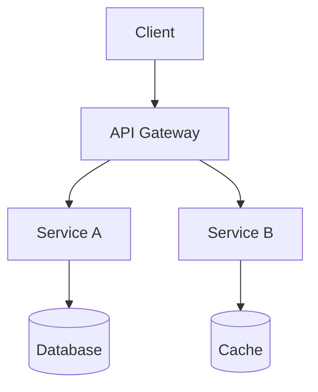

## 背景

在研究 [architecture-diagram-generator](https://github.com/Cocoon-AI/architecture-diagram-generator) 这个 Claude AI 技能后，我进一步调研了 GitHub 上其他辅助软件设计的开源工具。以下按使用场景分类整理。

---

## Diagram-as-Code（图表即代码）

这类工具通过代码/文本描述生成图表，适合纳入版本控制、CI/CD 流程。

| 工具 | Stars | 一句话描述 |
|------|-------|-----------|
| **[Mermaid](https://github.com/mermaid-js/mermaid)** | 87.7k | 文本驱动图表工具，GitHub 原生支持，支持流程图、时序图、C4 架构图等 |
| **[D2](https://github.com/terrastruct/d2)** | 23.6k | 现代化图表脚本语言，多布局引擎，支持 VSCode/Vim 插件 |
| **[Diagrams](https://github.com/mingrammer/diagrams)** | 42.2k | Python 绘制云系统架构图，内置 AWS/GCP/Azure 图标 |
| **[PlantUML](https://github.com/plantuml/plantuml)** | 13k | 经典 UML 工具，支持序列图、类图、部署图等 |
| **[AWS Diagram-as-Code](https://github.com/awslabs/diagram-as-code)** | 1.5k | AWS 官方 CLI，YAML 描述架构图，可从 IaC 自动生成 |

### Mermaid 示例



### Diagrams (Python) 示例

```python
from diagrams import Diagram
from diagrams.aws.compute import EC2
from diagrams.aws.database import RDS
from diagrams.aws.network import ELB

with Diagram("Web Service", show=False):
    ELB("lb") >> EC2("web") >> RDS("db")
```

---

## 架构图 / 协作白板

适合快速绘制架构图、线框图，支持团队协作。

| 工具 | Stars | 一句话描述 |
|------|-------|-----------|
| **[Excalidraw](https://github.com/excalidraw/excalidraw)** | 122k | 手绘风格白板，支持多人协作、端到端加密 |
| **[draw.io Desktop](https://github.com/jgraph/drawio-desktop)** | 60.8k | 完全离线的桌面版图表编辑器 |
| **[VS Code Draw.io](https://github.com/hediet/vscode-drawio)** | 9.4k | 在 VS Code 中直接编辑 .drawio 图表 |

---

## 代码可视化 / 依赖图

帮助理解代码库结构，检测循环依赖，生成调用图。

| 工具 | Stars | 一句话描述 |
|------|-------|-----------|
| **[Madge](https://github.com/pahen/madge)** | 10.1k | JS/CSS 模块依赖可视化，检测循环依赖 |
| **[code2flow](https://github.com/scottrogowski/code2flow)** | 4.6k | Python/JS/Ruby/PHP 函数调用图生成器 |

### Madge 使用示例

```bash
# 生成依赖图 PNG
npx madge --image=dependency.png src/index.js

# 检测循环依赖
npx madge --circular src/index.js
```

---

## C4 模型 / 架构规范

遵循 C4 模型规范，用"模型即代码"的方式描述软件架构。

| 工具 | Stars | 一句话描述 |
|------|-------|-----------|
| **[Structurizr](https://github.com/structurizr/structurizr)** | 159 (核心) | C4 模型官方实现，DSL 驱动，支持多视角渲染 |
| **[C4-PlantUML](https://github.com/plantuml-stdlib/C4-PlantUML)** | 7.3k | 结合 PlantUML + C4 模型，内置大量宏 |

### C4-PlantUML 示例

```plantuml
@startuml
!include https://raw.githubusercontent.com/plantuml-stdlib/C4-PlantUML/master/C4_Container.dsl

Person(user, "用户")
System(system, "系统", "描述")
System_Ext(email, "邮件系统")

Rel(user, system, "使用")
Rel(system, email, "发送邮件")
@enduml
```

---

## 代码库文档生成

从源代码自动生成 API 文档和项目文档站点。

| 工具 | Stars | 适用语言 |
|------|-------|---------|
| **[TypeDoc](https://github.com/TypeStrong/typedoc)** | 8.4k | TypeScript |
| **[Sphinx](https://github.com/sphinx-doc/sphinx)** | 7.8k | Python（也支持多语言） |
| **[Compodoc](https://github.com/compodoc/compodoc)** | 4.1k | Angular / NestJS |
| **[Redoc](https://github.com/Redocly/redoc)** | 25.7k | OpenAPI / Swagger |

---

## 统一渲染服务

| 工具 | Stars | 一句话描述 |
|------|-------|-----------|
| **[Kroki](https://github.com/yuzutech/kroki)** | 4.1k | 统一 API，支持 20+ 种图表引擎（PlantUML、Mermaid、D2 等） |

---

## 按场景推荐

| 需求 | 推荐工具 |
|------|---------|
| 快速生成云架构图 | Diagrams (Python) / D2 |
| Markdown 中写图表 | Mermaid |
| UML 图 | PlantUML / Mermaid |
| C4 架构图 | Structurizr / C4-PlantUML |
| 手绘风格架构图 | Excalidraw |
| 代码调用图 | code2flow |
| JS/TS 依赖可视化 | Madge |
| 统一图表服务 | Kroki |
| TypeScript API 文档 | TypeDoc |
| OpenAPI API 文档 | Redoc |
